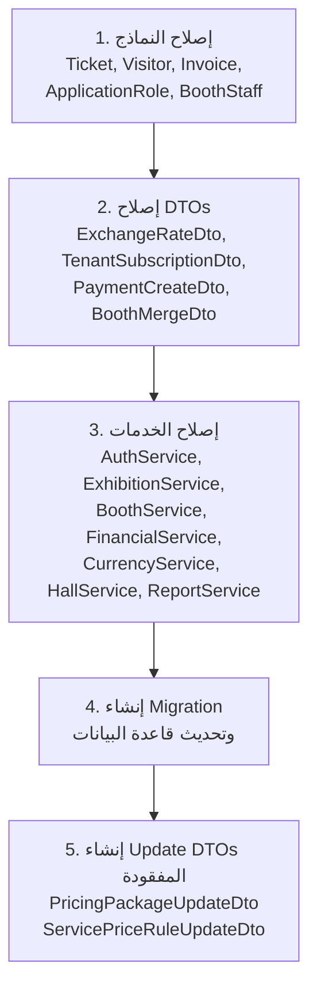

# خطة إصلاح أخطاء نظام إدارة المعارض

## نظرة عامة

تُعالج هذه الخطة **20+ خطأ ومشكلة** موزعة على 4 طبقات رئيسية: النماذج (Models)، البيانات (Data Access)، الخدمات (Services)، وDTOs. الأولوية معتمدة على تأثير الخطأ وتبعياته.

---

## الأخطاء الحرجة (Critical) — يجب إصلاحها أولاً

> [!CAUTION]
> هذه الأخطاء تؤثر على سلامة البيانات والأمان

### 1. خطأ `CreatedAt` في Ticket و Visitor — **انكسار الاتساق مع `IAuditableEntity`**

**الجذر:** `[NotMapped] public DateTime CreatedAt { get => IssuedAt; }` — الحقل ليس في قاعدة البيانات مما يكسر العقد مع `IAuditableEntity`.

**الحل المختار:** إضافة عمود `CreatedAt` حقيقي إلى كل من `Ticket` و `Visitor` مع الاحتفاظ بـ `IssuedAt` و `RegisteredAt` لأغراض دلالية.

#### [MODIFY] [Ticket.cs](file:///c:/Users/Masoud/source/repos/ExhibitionManagementSystem/ExhibitionManagementSystem.Models/Ticket.cs)
- حذف تعريف `[NotMapped]` الحالي
- إضافة `public DateTime CreatedAt { get; set; } = DateTime.UtcNow;` كعمود حقيقي
- إضافة Migration لإضافة العمود

#### [MODIFY] [Visitor.cs](file:///c:/Users/Masoud/source/repos/ExhibitionManagementSystem/ExhibitionManagementSystem.Models/Visitor.cs)
- نفس الحل: حذف `[NotMapped]` وإضافة `CreatedAt` حقيقي

---

### 2. خطأ `ForgotPasswordAsync` — ثغرة أمنية (User Enumeration)

**الجذر:** في [AuthService.cs](file:///c:/Users/Masoud/source/repos/ExhibitionManagementSystem/ExhibitionManagementSystem.Services/Implementations/AuthService.cs) السطر 266: يُرجع `"USER_NOT_FOUND"` عند عدم وجود المستخدم. التعليق في الكود يشير للمشكلة لكنه لا يُصلحها.

**الحل:** إرجاع `ServiceResult.Success()` دائماً بغض النظر عن وجود المستخدم، وإرسال البريد الإلكتروني فقط إذا وُجد المستخدم (بصمت).

#### [MODIFY] [AuthService.cs](file:///c:/Users/Masoud/source/repos/ExhibitionManagementSystem/ExhibitionManagementSystem.Services/Implementations/AuthService.cs)
```csharp
// قبل الإصلاح (خطر أمني):
if (user == null)
    return ServiceResult.Failure("المستخدم غير موجود", "USER_NOT_FOUND");

// بعد الإصلاح:
if (user == null)
    return ServiceResult.Success(); // صامت دائماً

var token = await _userManager.GeneratePasswordResetTokenAsync(user);
return ServiceResult.Success(token);
```

---

### 3. منطق خاطئ في `ExhibitionService.ChangeStatusAsync`

**الجذر:** في [ExhibitionService.cs](file:///c:/Users/Masoud/source/repos/ExhibitionManagementSystem/ExhibitionManagementSystem.Services/Implementations/ExhibitionService.cs) السطر 128-139:

| المشكلة | الكود الحالي | الكود الصحيح |
|---|---|---|
| فتح المعرض | يمنع الفتح إذا `StartDate < UtcNow` (الماضي) | يُسمح بالفتح إذا `StartDate <= UtcNow` |
| إغلاق المعرض | يمنع الإغلاق إن لا يوجد حجوزات مؤكدة | إزالة هذا القيد كلياً |

#### [MODIFY] [ExhibitionService.cs](file:///c:/Users/Masoud/source/repos/ExhibitionManagementSystem/ExhibitionManagementSystem.Services/Implementations/ExhibitionService.cs)
```csharp
// إصلاح منطق الفتح: السماح إذا StartDate <= اليوم
if (newStatus == ExhibitionStatus.Open)
{
    if (exhibition.StartDate.Date > DateTime.UtcNow.Date)
        return ServiceResult<ExhibitionDto>.Failure("لا يمكن فتح المعرض قبل تاريخ بدئه", "INVALID_START_DATE");
}
// إزالة قيد الإغلاق بالكامل
```

---

### 4. `PaymentCreateDto` — مشكلة أمنية (ReceivedByUserId من العميل)

**الجذر:** [PaymentCreateDto.cs](file:///c:/Users/Masoud/source/repos/ExhibitionManagementSystem/ExhibitionManagementSystem.Models.DTOs/Financial/PaymentCreateDto.cs) يحتوي `ReceivedByUserId` كحقل مطلوب من العميل.

**الحل:** 
- حذف `ReceivedByUserId` من `PaymentCreateDto`
- تمريره كمعامل `string userId` في `FinancialService.RecordPaymentAsync`
- تحديث Controller لاستخراج `userId` من JWT Token

#### [MODIFY] [PaymentCreateDto.cs](file:///c:/Users/Masoud/source/repos/ExhibitionManagementSystem/ExhibitionManagementSystem.Models.DTOs/Financial/PaymentCreateDto.cs)
#### [MODIFY] [FinancialService.cs](file:///c:/Users/Masoud/source/repos/ExhibitionManagementSystem/ExhibitionManagementSystem.Services/Implementations/FinancialService.cs)

---

## الأخطاء المتوسطة (Major) — المرحلة الثانية

> [!WARNING]
> هذه المشاكل تؤثر على صحة البيانات وسلامة المنطق

### 5. `BoothMerge.MergedByUserId` — مُثبّت كـ "System"

**الجذر:** [BoothService.cs](file:///c:/Users/Masoud/source/repos/ExhibitionManagementSystem/ExhibitionManagementSystem.Services/Implementations/BoothService.cs) السطر 165: `MergedByUserId = "System"`.

**الحل:** إضافة `string userId` كمعامل لـ `MergeBoothsAsync` ودمجه من Controller.

#### [MODIFY] [BoothService.cs](file:///c:/Users/Masoud/source/repos/ExhibitionManagementSystem/ExhibitionManagementSystem.Services/Implementations/BoothService.cs)
#### [MODIFY] واجهة `IBoothService` لتحديث التوقيع

---

### 6. `ExchangeRateDto` — حقول وهمية (`ValidFrom`, `ValidTo`, `IsActive`)

**الجذر:** [ExchangeRateDto.cs](file:///c:/Users/Masoud/source/repos/ExhibitionManagementSystem/ExhibitionManagementSystem.Models.DTOs/Financial/ExchangeRateDto.cs) يحتوي حقولاً غير موجودة في نموذج `ExchangeRate`.

**الحل:** حذف الحقول الوهمية وتحديث `CurrencyMappingProfile` للتخلص من التعيينات الوهمية.

#### [MODIFY] [ExchangeRateDto.cs](file:///c:/Users/Masoud/source/repos/ExhibitionManagementSystem/ExhibitionManagementSystem.Models.DTOs/Financial/ExchangeRateDto.cs)
```csharp
// حذف: ValidFrom, ValidTo, IsActive
// الإبقاء على: ExchangeRateID, FromCurrency, ToCurrency, Rate, RateDate, Source
```

#### [MODIFY] [CurrencyMappingProfile.cs](file:///c:/Users/Masoud/source/repos/ExhibitionManagementSystem/ExhibitionManagementSystem.Models.DTOs/Mapping/Profiles/CurrencyMappingProfile.cs)
```csharp
// حذف التعيينات الوهمية ValidFrom/ValidTo/IsActive
CreateMap<ExchangeRate, ExchangeRateDto>()
    .ForMember(dest => dest.ExchangeRateID, opt => opt.MapFrom(src => src.RateID));
```

---

### 7. `TenantSubscriptionDto.EndDate` — تناقض النوع (DateTime? vs DateTime)

**الجذر:** [TenantSubscriptionDto.cs](file:///c:/Users/Masoud/source/repos/ExhibitionManagementSystem/ExhibitionManagementSystem.Models.DTOs/Admin/TenantSubscriptionDto.cs) السطر 12: `DateTime? EndDate` بينما النموذج يحتوي `DateTime EndDate` (non-nullable).

**الحل:** تغيير `DateTime?` إلى `DateTime` في الـ DTO.

#### [MODIFY] [TenantSubscriptionDto.cs](file:///c:/Users/Masoud/source/repos/ExhibitionManagementSystem/ExhibitionManagementSystem.Models.DTOs/Admin/TenantSubscriptionDto.cs)

---

### 8. `CurrencyService.UpsertExchangeRateAsync` — `CreatedByUserId = "System"` مُثبّتة

**الجذر:** [CurrencyService.cs](file:///c:/Users/Masoud/source/repos/ExhibitionManagementSystem/ExhibitionManagementSystem.Services/Implementations/CurrencyService.cs) السطر 104.

**الحل:** إضافة `string userId` كمعامل للدالة.

#### [MODIFY] [CurrencyService.cs](file:///c:/Users/Masoud/source/repos/ExhibitionManagementSystem/ExhibitionManagementSystem.Services/Implementations/CurrencyService.cs)
#### [MODIFY] واجهة `ICurrencyService`

---

### 9. `HallService.DeleteAsync` — لا تتحقق من الأكشاك النشطة

**الجذر:** [HallService.cs](file:///c:/Users/Masoud/source/repos/ExhibitionManagementSystem/ExhibitionManagementSystem.Services/Implementations/HallService.cs) السطر 85-97: حذف ناعم للقاعة دون التحقق من وجود أكشاك نشطة أو حجوزات.

**الحل:** إضافة تحقق قبل الحذف.

#### [MODIFY] [HallService.cs](file:///c:/Users/Masoud/source/repos/ExhibitionManagementSystem/ExhibitionManagementSystem.Services/Implementations/HallService.cs)
```csharp
// إضافة قبل SoftDeleteAsync:
var activeBooths = await _unitOfWork.Booths.FindAsync(b => b.HallID == hallId && !b.IsDeleted);
if (activeBooths.Any())
    return ServiceResult.Failure("لا يمكن حذف القاعة لوجود أكشاك نشطة بها", "HALL_HAS_ACTIVE_BOOTHS");
```

---

### 10. `FinancialService` — ضريبة مُثبّتة بـ 15%

**الجذر:** [FinancialService.cs](file:///c:/Users/Masoud/source/repos/ExhibitionManagementSystem/ExhibitionManagementSystem.Services/Implementations/FinancialService.cs) السطر 133: `decimal taxRate = 15.0m;`

**الحل:** قراءة نسبة الضريبة من الإعدادات (`IConfiguration`) مع قيمة افتراضية.

#### [MODIFY] [FinancialService.cs](file:///c:/Users/Masoud/source/repos/ExhibitionManagementSystem/ExhibitionManagementSystem.Services/Implementations/FinancialService.cs)
```csharp
// في Constructor: إضافة IConfiguration _configuration
private readonly IConfiguration _configuration;

// في GenerateInvoiceForReservationAsync:
decimal taxRate = decimal.Parse(_configuration["Financial:DefaultTaxRate"] ?? "15.0");
```

---

## المشاكل التحسينية (Improvements) — المرحلة الثالثة

> [!NOTE]
> هذه تحسينات مهمة لتعزيز جودة وموثوقية الكود

### 11. `Invoice` — إضافة `ISoftDeletable`

**الجذر:** [Invoice.cs](file:///c:/Users/Masoud/source/repos/ExhibitionManagementSystem/ExhibitionManagementSystem.Models/Invoice.cs) لا تطبّق `ISoftDeletable`.

**الحل:** تطبيق الواجهة وإضافة Migration.

#### [MODIFY] [Invoice.cs](file:///c:/Users/Masoud/source/repos/ExhibitionManagementSystem/ExhibitionManagementSystem.Models/Invoice.cs)
```csharp
public class Invoice : IAuditableEntity, ISoftDeletable
{
    // ... الحقول الحالية
    public bool IsDeleted { get; set; } = false;
    public DateTime? DeletedAt { get; set; }
    public string? DeletedByUserId { get; set; }
}
```

---

### 12. `ApplicationRole` — إضافة `IAuditableEntity`

**الجذر:** [ApplicationRole.cs](file:///c:/Users/Masoud/source/repos/ExhibitionManagementSystem/ExhibitionManagementSystem.Models/ApplicationRole.cs) لا يطبق أي واجهة Audit.

**الحل:** تطبيق `IAuditableEntity` وإضافة Migration.

#### [MODIFY] [ApplicationRole.cs](file:///c:/Users/Masoud/source/repos/ExhibitionManagementSystem/ExhibitionManagementSystem.Models/ApplicationRole.cs)
```csharp
public class ApplicationRole : IdentityRole, IAuditableEntity
{
    public int TenantID { get; set; }
    public virtual Tenant Tenant { get; set; }
    public DateTime CreatedAt { get; set; } = DateTime.UtcNow;
    public DateTime? UpdatedAt { get; set; }
}
```

---

### 13. `BoothStaff` — إضافة `IAuditableEntity` و `ISoftDeletable`

**الجذر:** [BoothStaff.cs](file:///c:/Users/Masoud/source/repos/ExhibitionManagementSystem/ExhibitionManagementSystem.Models/BoothStaff.cs) بدون أي واجهة.

#### [MODIFY] [BoothStaff.cs](file:///c:/Users/Masoud/source/repos/ExhibitionManagementSystem/ExhibitionManagementSystem.Models/BoothStaff.cs)
```csharp
public class BoothStaff : IAuditableEntity, ISoftDeletable
{
    // ... الحقول الحالية
    public DateTime CreatedAt { get; set; } = DateTime.UtcNow;
    public DateTime? UpdatedAt { get; set; }
    public bool IsDeleted { get; set; } = false;
    public DateTime? DeletedAt { get; set; }
    public string? DeletedByUserId { get; set; }
}
```

---

### 14. `BoothService.GetAvailableAsync` — مشكلة N+1 Query

**الجذر:** [BoothService.cs](file:///c:/Users/Masoud/source/repos/ExhibitionManagementSystem/ExhibitionManagementSystem.Services/Implementations/BoothService.cs) السطر 57-64: استدعاء `IsBoothReservedAsync` في loop.

**الحل:** استعلام واحد يستخرج الأكشاك المحجوزة مسبقاً ثم يُصفّي بشكل محلي.

#### [MODIFY] [BoothService.cs](file:///c:/Users/Masoud/source/repos/ExhibitionManagementSystem/ExhibitionManagementSystem.Services/Implementations/BoothService.cs)
```csharp
var booths = await _unitOfWork.Booths.FindAsync(b => b.HallID == hallId && b.Status == BoothStatus.Available);

// جلب كل الـ IDs المحجوزة دفعة واحدة
var reservedBoothIds = await _unitOfWork.BoothReservations.AsQueryable()
    .Where(r => r.ExhibitionID == exhibitionId && r.BoothID.HasValue &&
                r.Status != ReservationStatus.Cancelled)
    .Select(r => r.BoothID!.Value)
    .ToHashSetAsync();

var availableBooths = booths.Where(b => !reservedBoothIds.Contains(b.BoothID)).ToList();
```

---

### 15. `ReportService` — `TotalExpenses = 0` مُثبّتة ← **إنشاء نموذج `Expense` جديد**

**القرار:** إنشاء نموذج `Expense` كامل لتتبع نفقات المعرض وربطه بـ `ReportService`.

#### [NEW] `Expense.cs` في مجلد Models
```csharp
public class Expense : IAuditableEntity, ISoftDeletable
{
    [Key] public int ExpenseID { get; set; }
    public int TenantID { get; set; }
    public int ExhibitionID { get; set; }
    [Required, StringLength(200)] public string Description { get; set; }
    [Required, StringLength(100)] public string Category { get; set; } // إيجار، تجهيز، تسويق...
    [Column(TypeName = "decimal(18,2)")] public decimal Amount { get; set; }
    [Required, StringLength(3)] public string CurrencyCode { get; set; }
    [Column(TypeName = "date")] public DateTime ExpenseDate { get; set; }
    [StringLength(500)] public string? Notes { get; set; }
    [StringLength(450)] public string CreatedByUserId { get; set; }
    public DateTime CreatedAt { get; set; } = DateTime.UtcNow;
    public DateTime? UpdatedAt { get; set; }
    public bool IsDeleted { get; set; } = false;
    public DateTime? DeletedAt { get; set; }
    public string? DeletedByUserId { get; set; }

    [ForeignKey(nameof(TenantID))] public virtual Tenant Tenant { get; set; }
    [ForeignKey(nameof(ExhibitionID))] public virtual Exhibition Exhibition { get; set; }
    [ForeignKey(nameof(CurrencyCode))] public virtual Currency Currency { get; set; }
    [ForeignKey(nameof(CreatedByUserId))] public virtual ApplicationUser CreatedByUser { get; set; }
}
```

#### [NEW] `ExpenseCreateDto.cs` و `ExpenseDto.cs` في مجلد DTOs/Financial
#### [NEW] `ExpenseMappingProfile.cs` في مجلد DTOs/Mapping/Profiles
#### [MODIFY] `ApplicationDbContext.cs` — إضافة `DbSet<Expense>`
#### [MODIFY] `IExpenseRepository` + `ExpenseRepository.cs` — إضافة Repository
#### [MODIFY] `IUnitOfWork` + `UnitOfWork.cs` — تسجيل Repository
#### [MODIFY] [ReportService.cs](file:///c:/Users/Masoud/source/repos/ExhibitionManagementSystem/ExhibitionManagementSystem.Services/Implementations/ReportService.cs)
```csharp
// حساب النفقات الفعلية من جدول Expenses
decimal totalExpenses = await _unitOfWork.Expenses.AsQueryable()
    .Where(e => e.ExhibitionID == exhibitionId && !e.IsDeleted)
    .SumAsync(e => e.Amount);
decimal netProfit = totalRevenue - totalExpenses;
```

---

### 16. `BoothMergeDto` — إضافة `ExhibitionID`

**الجذر:** [BoothMergeDto.cs](file:///c:/Users/Masoud/source/repos/ExhibitionManagementSystem/ExhibitionManagementSystem.Models.DTOs/Booth/BoothMergeDto.cs) يفتقد `ExhibitionID` رغم ارتباط `BoothMerge` بمعرض.

#### [MODIFY] [BoothMergeDto.cs](file:///c:/Users/Masoud/source/repos/ExhibitionManagementSystem/ExhibitionManagementSystem.Models.DTOs/Booth/BoothMergeDto.cs)
```csharp
public int ExhibitionID { get; set; }
public string ExhibitionName { get; set; } = string.Empty;
```

#### [MODIFY] [BoothMappingProfile.cs](file:///c:/Users/Masoud/source/repos/ExhibitionManagementSystem/ExhibitionManagementSystem.Models.DTOs/Mapping/Profiles/BoothMappingProfile.cs) — تحديث التعيين

---

### 17. إضافة `PricingPackageUpdateDto` و `ServicePriceRuleUpdateDto`

**الجذر:** مجلد [Pricing](file:///c:/Users/Masoud/source/repos/ExhibitionManagementSystem/ExhibitionManagementSystem.Models.DTOs/Pricing) لا يحتوي على DTOs للتحديث.

#### [NEW] `PricingPackageUpdateDto.cs` في مجلد Pricing
#### [NEW] `ServicePriceRuleUpdateDto.cs` في مجلد Pricing

---

### 18. `Tenant.Plan` مكرر ← **حذفه والاعتماد على `TenantSubscription`**

**القرار:** حذف حقل `Plan` من `Tenant` كلياً والاعتماد على آخر `TenantSubscription` نشط كمصدر الحقيقة الوحيد.

#### [MODIFY] [Tenant.cs](file:///c:/Users/Masoud/source/repos/ExhibitionManagementSystem/ExhibitionManagementSystem.Models/Tenant.cs)
- حذف `public string Plan { get; set; }`
- إضافة خاصية محسوبة للقراءة فقط (NotMapped):
```csharp
/// <summary>
/// يُحسب من آخر TenantSubscription نشط — لا يُخزن في DB
/// </summary>
[NotMapped]
public string? CurrentPlan => TenantSubscriptions
    .Where(s => s.Status == SubscriptionStatus.Active)
    .OrderByDescending(s => s.StartDate)
    .FirstOrDefault()?.Plan;
```

#### [MODIFY] [TenantDto.cs](file:///c:/Users/Masoud/source/repos/ExhibitionManagementSystem/ExhibitionManagementSystem.Models.DTOs/Tenant/TenantDto.cs)
- تحديث `Plan` إلى `CurrentPlan` مع تعيين AutoMapper المناسب

#### [MODIFY] [AdminService.cs](file:///c:/Users/Masoud/source/repos/ExhibitionManagementSystem/ExhibitionManagementSystem.Services/Implementations/AdminService.cs)
- حذف سطر `tenant.Plan = sub.Plan;` ومنطق المزامنة اليدوي بالكامل

#### [MODIFY] [TenantMappingProfile.cs](file:///c:/Users/Masoud/source/repos/ExhibitionManagementSystem/ExhibitionManagementSystem.Models.DTOs/Mapping/Profiles/TenantMappingProfile.cs)
- تحديث تعيين `Plan` ليقرأ من `CurrentPlan`

> [!WARNING]
> يتطلب هذا إضافة Migration لحذف عمود `Plan` من جدول `Tenants`

---

### 19. `ExchangeRateRepository.ConvertAsync` — رمي Exception غير متسق

**الجذر:** [ExchangeRateRepository.cs](file:///c:/Users/Masoud/source/repos/ExhibitionManagementSystem/ExhibitionManagementSystem.DataAccess/Repositories/Implementations/ExchangeRateRepository.cs) السطر 54: يرمي `InvalidOperationException`.

**الحل:** تغيير التوقيع ليُعيد `decimal?` بدلاً من رمي Exception، مع تحديث كل المُستدعين.

#### [MODIFY] [ExchangeRateRepository.cs](file:///c:/Users/Masoud/source/repos/ExhibitionManagementSystem/ExhibitionManagementSystem.DataAccess/Repositories/Implementations/ExchangeRateRepository.cs)
#### [MODIFY] واجهة `IExchangeRateRepository`
#### [MODIFY] [CurrencyService.cs](file:///c:/Users/Masoud/source/repos/ExhibitionManagementSystem/ExhibitionManagementSystem.Services/Implementations/CurrencyService.cs) — تحديث `ConvertAmountAsync`
#### [MODIFY] [ReservationService.cs](file:///c:/Users/Masoud/source/repos/ExhibitionManagementSystem/ExhibitionManagementSystem.Services/Implementations/ReservationService.cs) — إزالة try/catch

---

## المرحلة الرابعة: Migration وتحديث قاعدة البيانات

> [!IMPORTANT]
> بعد جميع التعديلات على النماذج، يجب إنشاء Migration واحدة تجمع كل التغييرات

### التغييرات في قاعدة البيانات

| جدول | التغيير |
|------|---------|
| `Tickets` | إضافة عمود `CreatedAt datetime2 NOT NULL DEFAULT GETUTCDATE()` |
| `Visitors` | إضافة عمود `CreatedAt datetime2 NOT NULL DEFAULT GETUTCDATE()` |
| `Invoices` | إضافة أعمدة `IsDeleted bit`, `DeletedAt datetime2?`, `DeletedByUserId nvarchar(450)?` |
| `AspNetRoles` | إضافة أعمدة `CreatedAt datetime2`, `UpdatedAt datetime2?` |
| `BoothStaffs` | إضافة أعمدة `CreatedAt`, `UpdatedAt`, `IsDeleted`, `DeletedAt`, `DeletedByUserId` |

**الأمر:**
```bash
dotnet ef migrations add FixAuditAndSoftDeleteConsistency --project ExhibitionManagementSystem.DataAccess --startup-project ExhibitionManagementSystem
dotnet ef database update
```

---

## ترتيب التنفيذ المقترح



---

## القرارات المُتّخذة ✅

| الموضوع | القرار |
|---------|--------|
| `ReportService.TotalExpenses` | ✅ إنشاء نموذج `Expense` جديد كامل مع Repository وDTOs وService |
| `Tenant.Plan` | ✅ حذف الحقل من `Tenant` والاعتماد على `TenantSubscription` كمصدر الحقيقة الوحيد |

---

## خلاصة الملفات المُعدَّلة

| الملف | نوع التغيير | الأولوية |
|-------|-------------|----------|
| `Ticket.cs` | إصلاح `CreatedAt` | حرجة |
| `Visitor.cs` | إصلاح `CreatedAt` | حرجة |
| `Invoice.cs` | إضافة `ISoftDeletable` | متوسطة |
| `ApplicationRole.cs` | إضافة `IAuditableEntity` | تحسين |
| `BoothStaff.cs` | إضافة كلا الواجهتين | تحسين |
| `Tenant.cs` | **حذف** حقل `Plan` + خاصية `CurrentPlan` محسوبة | متوسطة |
| `[NEW] Expense.cs` | نموذج جديد كامل | جديد |
| `AuthService.cs` | إصلاح `ForgotPasswordAsync` | حرجة (أمان) |
| `ExhibitionService.cs` | إصلاح `ChangeStatusAsync` | حرجة |
| `BoothService.cs` | إصلاح `MergedByUserId` + N+1 | متوسطة |
| `FinancialService.cs` | إصلاح الضريبة + `ReceivedByUserId` | متوسطة |
| `CurrencyService.cs` | إصلاح `CreatedByUserId` | تحسين |
| `HallService.cs` | إضافة تحقق قبل الحذف | متوسطة |
| `ReportService.cs` | ربط بـ `Expense` الجديد | متوسطة |
| `ExchangeRateRepository.cs` | إصلاح `ConvertAsync` | متوسطة |
| `ExchangeRateDto.cs` | حذف الحقول الوهمية | متوسطة |
| `TenantSubscriptionDto.cs` | إصلاح `EndDate` النوع | متوسطة |
| `TenantDto.cs` | تحديث `Plan` → `CurrentPlan` | متوسطة |
| `PaymentCreateDto.cs` | حذف `ReceivedByUserId` | حرجة (أمان) |
| `BoothMergeDto.cs` | إضافة `ExhibitionID` | تحسين |
| `CurrencyMappingProfile.cs` | إزالة التعيينات الوهمية | متوسطة |
| `TenantMappingProfile.cs` | تحديث تعيين `CurrentPlan` | متوسطة |
| `AdminService.cs` | حذف منطق مزامنة `Plan` | متوسطة |
| `[NEW] ExpenseCreateDto.cs` | إنشاء جديد | جديد |
| `[NEW] ExpenseDto.cs` | إنشاء جديد | جديد |
| `[NEW] ExpenseMappingProfile.cs` | إنشاء جديد | جديد |
| `[NEW] IExpenseRepository.cs` | إنشاء جديد | جديد |
| `[NEW] ExpenseRepository.cs` | إنشاء جديد | جديد |
| `[NEW] PricingPackageUpdateDto.cs` | إنشاء جديد | تحسين |
| `[NEW] ServicePriceRuleUpdateDto.cs` | إنشاء جديد | تحسين |
| `UnitOfWork.cs` + `IUnitOfWork` | تسجيل Expense Repository | متوسطة |
| `ApplicationDbContext.cs` | إضافة `DbSet<Expense>` + Global Filter | متوسطة |
| Migration شاملة | تحديث قاعدة البيانات | ضروري |
