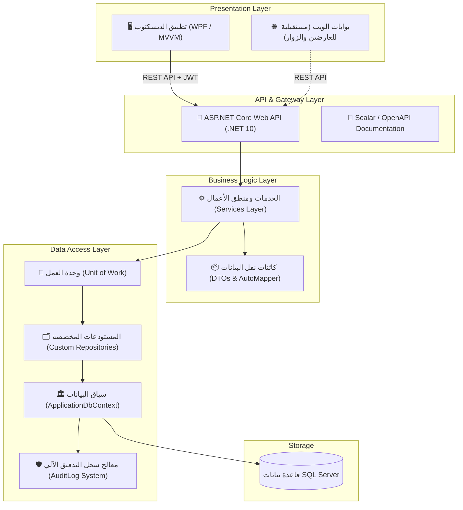
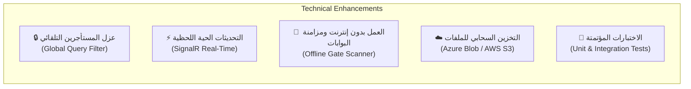

# 📊 التقرير التحليلي الشامل لنظام إدارة المعارض (ExpoManager)

> **تاريخ التحليل:** 30 أغسطس 2026  
> **الإصدار المستهدف:** ExpoManager Enterprise v2.5  
> **البيئة التقنية:** .NET 10 | ASP.NET Core Web API | WPF (MVVM) | EF Core 10 | SQL Server  

---

## 📑 فهرس التقرير

1. [نظرة عامة على المعمارية الحالية (Architecture Overview)](#1-نظرة-عامة-على-المعمارية-الحالية)
2. [الموديولات والوظائف المتوفرة حالياً (Current Modules)](#2-الموديولات-والوظائف-المتوفرة-حاليا)
3. [نقاط القوة الهندسية في البناء الحالي (Architectural Strengths)](#3-نقاط-القوة-الهندسية)
4. [التحليل التفصيلي للنواقص وما يحتاجه النظام (Detailed Gap Analysis)](#4-التحليل-التفصيلي-للنواقص)
   - [أولاً: النواقص الوظيفية وتجربة العارضين والزوار](#أولا-النواقص-الوظيفية-وتجربة-المستخدمين)
   - [ثانياً: النواقص في المنظومة المالية والمحاسبية](#ثانيا-النواقص-في-المنظومة-المالية-والمحاسبية)
   - [ثالثاً: النواقص التقنية والمعمارية والأمان](#ثالثا-النواقص-التقنية-والمعمارية-والأمان)
   - [رابعاً: تحسينات تطبيق سطح المكتب وواجهة المستخدم](#رابعا-تحسينات-تطبيق-سطح-المكتب-wpf)
5. [خارطة الطريق المقترحة للتطوير (Implementation Roadmap)](#5-خارطة-الطريق-المقترحة-للتطوير)
6. [الخلاصة والتوصيات النهائية (Executive Summary)](#6-الخلاصة-والتوصيات-النهائية)

---

## 1. نظرة عامة على المعمارية الحالية

تم بناء النظام بنمط المعمارية النظيفة متعددة الطبقات (**Clean / Layered Architecture**) وبدعم أصيل لنموذج **تعدد المستأجرين (Multi-Tenant SaaS)**:



### توزيع المشاريع داخل الـ Solution:
- **`ExhibitionManagementSystem.Models`**: نماذج الكيانات وعلاقاتها، وعقود الـ Interfaces (`IAuditableEntity`, `ISoftDeletable`).
- **`ExhibitionManagementSystem.Models.DTOs`**: الـ DTOs الخاصة بكل عملية مع ملفات التعيين التلقائي (`AutoMapper`).
- **`ExhibitionManagementSystem.DataAccess`**: الـ DbContext والـ Repositories والـ Migrations وبيانات البذر (`DataSeeder`).
- **`ExhibitionManagementSystem.Services`**: المنطق البرمجي لكافة الموديولات (حساب الأسعار، الحجوزات، الفواتير، التذاكر، التقارير).
- **`ExhibitionManagementSystem` (Web API)**: توفير الـ Endpoints مع التوثيق عبر `Scalar` ونظام مصادقة `JWT`.
- **`ExhibitionManagementSystem.DeskTop`**: واجهة WPF متقدمة تتبع أسلوب MVVM وتستعمل `CommunityToolkit.Mvvm` و `Nodify` و `LiveCharts2`.

---

## 2. الموديولات والوظائف المتوفرة حالياً

| الموديول | مستوى الإنجاز | الوظائف المنفذة حالياً |
| :--- | :---: | :--- |
| **إدارة المعارض والفعاليات** | **95%** | إنشاء وتعديل المعارض، الحالات (مسودة، مفتوح، مغلق، منتهي)، إدارة الفعاليات والجلسات ومواعيدها (`ExhibitionSchedule`). |
| **المواقع والصالات** | **95%** | إدارة مراكز المعارض (`Venues`) والصالات (`Halls`) وتحديد الأبعاد والمساحات والسعة الاستيعابية. |
| **المصمم البصري للأجنحة** | **90%** | مصمم تفاعلي بشبكة CAD، محاذاة تلقائية للأجنحة، تحديد الأبعاد، كشف التصادم والتداخل (`Collision Detection`)، وتكامل مع `Nodify`. |
| **محرك التسعير والخدمات** | **90%** | قواعد تسعير ديناميكية بحسب الفئة ونوع الجناح والمساحة، باقات تسعير جاهزة (`PricingPackages`)، وخدمات مضافة. |
| **الحجوزات والدمج** | **90%** | حجز الأجنحة، التحقق من توفرها، دعم دمج أجنحة متجاورة في حجز واحد (`Booth Merging`)، وربط الخدمات بالحجز. |
| **الفوترة والمدفوعات والمصروفات** | **85%** | توليد الفواتير آلياً عند الحجز، إدارة بنود الفاتورة (`InvoiceItems`)، تسجيل المدفوعات والتحويلات، وتتبع المصروفات التشغيلية للمعارض (`Expenses`). |
| **الزوار والتذاكر** | **85%** | تسجيل الزوار، توليد التذاكر برموز QR مشفرة وفريدة، ومسح التذاكر عند البوابات وتتبع تاريخ الدخول والخروج (In / Out). |
| **تعدد المستأجرين والعملات** | **90%** | عزل المستأجرين (`Tenants`)، باقات الاشتراكات، وجدول أسعار الصرف وتحويل العملات تلقائياً للعملة الأساسية. |
| **لوحة التحكم والتحليلات** | **80%** | لوحة تحكم بإحصائيات حية، رسوم بيانية لحركة الزوار ونسب الإشغال والإيرادات، وسجل تقييمات الزوار (`VisitorRatings`). |
| **سجل التدقيق (Audit Logs)** | **95%** | تتبع تلقائي لأي إضافة أو تعديل أو حذف ناعم في النظام مع تسجيل المستخدم والوقت والقيم القديمة والجديدة وعنوان الـ IP. |

---

## 3. نقاط القوة الهندسية

1. **فصل المسؤوليات (Separation of Concerns):** طبقات معزولة تماماً تسهل صيانة وتطوير أي موديول دون التأثير على البقية.
2. **محرك تسعير دقيق ومرن:** يراعي نوع الجناح، فئة العارض، العملة المستخدمة، وأسعار الصرف اللحظية.
3. **مصمم أجنحة بصري متميز:** يوفر تجربة فريدة في تطبيق سطح المكتب تضاهي برامج التصميم الهندسي.
4. **توثيق واجهات API حديث:** استخدام حزمة `Scalar.AspNetCore` الحديثة المدمجة مع OpenAPI ومصادقة JWT.
5. **سلامة العمليات المالية:** استخدام الـ Database Transactions عند إنشاء الحجوزات والفواتير لضمان عدم حدوث تضارب بيانات (Atomic Operations).

---

## 4. التحليل التفصيلي للنواقص

> [!IMPORTANT]
> تم تصنيف النواقص في 4 محاور رئيسية تمثل متطلبات حتمية لتحويل النظام إلى منصة تشغيل معارض تجارية متكاملة.

---

### أولاً: النواقص الوظيفية وتجربة المستخدمين

```
┌─────────────────────────────────────────────────────────────────────────┐
│                     بوابات الخدمة الذاتية والتفاعل                       │
├──────────────────────────┬──────────────────────────┬───────────────────┤
│    بوابة العارضين (Web)   │   بوابة الزوار والتذاكر   │  منظومة البوابات  │
│  - حجز الجناح أونلاين    │  - حجز التذاكر أونلاين   │ - طباعة الشارات   │
│  - رفع الكتالوج والشعار  │  - تذكرة Apple/Google    │ - ماسح الدخول     │
│  - تسجيل طاقم العمل      │  - الدفع الإلكتروني      │ - أكشاك Kiosk     │
└──────────────────────────┴──────────────────────────┴───────────────────┘
```

#### 1. بوابة العارضين للخدمة الذاتية (Exhibitor Self-Service Portal)
- **الوضع الحالي:** يتم تسجيل العارضين وحجز أجنحتهم يدوياً من قِبل مسؤول النظام فقط.
- **ما ينقصه:**
  - صفحة ويب تتيح للشركة العارضة الدخول، استعراض المخطط العام، واختيار الجناح وحجزه.
  - لوحة تحكم للعارض لرفع شعار الشركة، صور المنتجات، الملف التعريفي، وكتالوجات الـ PDF.
  - إمكانية طلب خدمات إضافية (أثاث، شاشات، نقاط كهرباء، إنترنت مخصص) وإضافتها لفاتورة الحجز مباشرة.
  - تسجيل أسماء وأرقام هويات طاقم الجناح (`Booth Staff`) لإصدار بطاقاتهم الرسمية.

#### 2. بوابة تسجيل الزوار وحجز التذاكر العامة (Public Ticketing Web Portal)
- **الوضع الحالي:** حجز وتوليد التذاكر يتم حصراً من داخل تطبيق سطح المكتب عبر الإدارة.
- **ما ينقصه:**
  - صفحة ويب عامة للجمهور تتيح للزائر التسجيل واختيار فئة التذكرة (عامة / VIP / باحثين / ورش عمل).
  - إمكانية استلام التذكرة فوراً مع رمز QR عبر البريد الإلكتروني أو الرسائل النصية، وإضافتها لمحفظة الجوال (`Apple Wallet` / `Google Wallet`).

#### 3. منظومة طباعة الشارات الفورية (Badge Printing & Check-in Kiosks)
- **ما ينقصه:**
  - موديول لتصميم وتخصيص بطاقات الدخول (Badges) بالألوان والشعارات حسب نوع المشارك (عارض / زائر / صحفي / متحدث).
  - دعم الطباعة المباشرة على طابعات الشارات الحرارية السريعة (مثل طابعات Zebra أو Dymo) بمجرد مسح رمز الـ QR عند مكتب الاستقبال أو عبر أكشاك الخدمة الذاتية (Self Check-in Kiosks).

#### 4. نظام جمع وتأهيل بيانات العملاء للعارضين (Lead Retrieval & B2B Matchmaking)
- **ما ينقصه:**
  - تطبيق جوال يتيح للعارض مسح بطاقة أو تذكرة أي زائر يدخل جناحه لجمع بياناته فوراً.
  - إمكانية إضافة تقييم للزائر وملاحظات حول اهتمامه بالمنتجات وتصدير تقرير الـ Leads بنهاية المعرض.
  - نظام لتنسيق واقتراح اجتماعات العمل الثنائية (B2B Matchmaking) بين العارضين والمشترين الدوليين.

#### 5. إدارة الرعاة والمساحات الإعلانية (Sponsorship Management)
- **ما ينقصه:**
  - تخصيص باقات الرعاية (رعاية بلاتينية، ذهبية، فضية).
  - إدارة المساحات الإعلانية (شاشات العرض، اللافتات المعلقة، المطبوعات، الموقع الإلكتروني).

#### 6. إدارة المتحدثين والشهادات (Speakers & Certificate Generation)
- **ما ينقصه:**
  - إدارة السير الذاتية للمتحدثين وجداول الجلسات المتوازية.
  - توليد وتوثيق شهادات حضور رقمية (Certificates) ترسل للمشاركين في ورش العمل آلياً.

---

### ثانياً: النواقص في المنظومة المالية والمحاسبية

#### 1. بوابات الدفع الإلكتروني المباشر (Online Payment Gateways)
- **الوضع الحالي:** تسجيل الدفعات يتم يدوياً عن طريق اختيار طريقة الدفع وتسجيلها في قاعدة البيانات.
- **ما ينقصه:** التكامل المباشر مع بوابات دفع عالمية ومحلية (Stripe, PayPal, Sadad, Tadawul, Fawry, Mada) لتمكين الدفع الفوري وتحديث حالة الحجز والفاتورة آلياً.

#### 2. نظام جدولة الدفعات والأقساط (Payment Milestones / Installments)
- **ما ينقصه:** في المعارض الكبرى، يدفع العارض عادة على مراحل:
  - 30% دفعة مقدمة لتثبيت الحجز.
  - 40% قبل المعرض بشهر.
  - 30% المتبقية عند استلام مفتاح الجناح.
  - يحتاج النظام إلى إدارة هذه الجداول وإرسال تذكيرات آلية بالدفعات المستحقة.

#### 3. محرك توليد فواتير وسندات PDF معتمدة (E-Invoicing & PDF Engine)
- **ما ينقصه:**
  - محرك لتوليد مستندات PDF بتصميم رسمي قابل للتخصيص للفواتير وسندات القبض (باستخدام مكتبة مثل `QuestPDF`).
  - التوافق مع معايير الفوترة الإلكترونية الإلزامية (مثل متطلبات هيئة الزكاة والضريبة ZATCA عبر تشفير TLV في رمز الـ QR وملفات XML المعتمدة).

#### 4. سياسات غرامات الإلغاء والاسترداد التلقائي (Refund & Cancellation Rules)
- **ما ينقصه:**
  - حساب مبالغ الاسترداد ونسب الغرامات تلقائياً وفق سياسة محددة مسبقاً (مثلاً: خصم 10% إذا كان الإلغاء قبل 60 يوماً، وخصم 50% إذا كان قبل 30 يوماً، وعدم الاسترداد إذا كان قبل أسبوعين).

---

### ثالثاً: النواقص التقنية والمعمارية والأمان



#### 1. عزل المستأجرين التلقائي (Global Multi-Tenancy Filter)
- **الملاحظة:** في `ApplicationDbContext`، يتم تطبيق فلتر الحذف الناعم تلقائياً، ولكن عزل المستأجرين (`TenantID`) يعتمد حالياً على الفلترة اليدوية في كل Service.
- **الحل المطلوب:** تطبيق `HasQueryFilter` عام للـ `TenantID` في EF Core بالاعتماد على مزود الهوية (`ITenantProvider`) لمنع أي تسرب بيانات محتمل تماماً.

#### 2. التحديثات الحية اللحظية (SignalR Real-Time Updates)
- **الملاحظة:** حجز جناح أو مسح تذكرة لا ينعكس فوراً على الشاشات المفتوحة لدى بقية المستخدمين إلا بعد التحديث اليدوي.
- **الحل المطلوب:** دمج **SignalR Hub** لتحديث حالة الأجنحة في المصمم البصري، وتحديث أعداد الزوار وإيرادات الداشبورد لحظياً.

#### 3. نظام الإشعارات والتواصل التلقائي (Notification Engine)
- **ما ينقصه:** طبقة إرسال بريد إلكتروني (SendGrid / SMTP Templates)، ورسائل نصية قصيرة (SMS عبر Twilio)، ورسائل WhatsApp Business لإرسال التذاكر والفواتير والتنبيهات بصورة مؤتمتة.

#### 4. دعم العمل الميداني بدون إنترنت ومزامنة البوابات (Offline Mode & Gate Sync)
- **ما ينقصه:** ضمان استمرار فحص التذاكر عند البوابات حتى في حال انقطاع الإنترنت عن أرض المعارض، من خلال تخزين محلي (Local SQLite / Cache) ومزامنة السجلات فور عودة الاتصال.

#### 5. التصدير والاستيراد المتقدم (Advanced Bulk Import / Export)
- **ما ينقصه:**
  - استيراد قوائم العارضين أو الزوار بالجملة من ملفات Excel/CSV.
  - تصدير كافة الجداول والتقارير المالية والتحليلية إلى ملفات Excel منسقة باحترافية.

#### 6. التخزين السحابي للوسائط والملفات (Media & Cloud Storage)
- **ما ينقصه:** رفع شعارات الشركات، صور المنتجات، ومخططات المعارض مباشرة إلى خدمات التخزين السحابي (مثل AWS S3 أو Azure Blob Storage) مع معالجة أحجام الصور وضغطها تلقائياً.

#### 7. الاختبارات المؤتمتة وضمان الجودة (Automated Unit & Integration Tests)
- **الملاحظة:** لا توجد مشاريع اختبارات برمجية في الـ Solution.
- **الحل المطلوب:** إضافة مشاريع اختبار باستخدام `xUnit` و `FluentAssertions` لتغطية:
  - منطق حساب أسعار الأجنحة والخدمات.
  - منع تكرار حجز الجناح الواحد في نفس الوقت (Race Conditions).
  - التحقق من قيود الفوترة وحساب الضرائب والصرف.

---

### رابعاً: تحسينات تطبيق سطح المكتب (WPF)

| العنصر | التحسين المطلوب |
| :--- | :--- |
| **تعدد اللغات (i18n)** | دعم كامل للغتين العربية والإنجليزية مع التبديل الفوري لاتجاه الواجهة (RTL / LTR) والقواميس النصية. |
| **الوضع المظلم (Dark Mode)** | دعم ثيم داكن عصري للحد من إجهاد العين لمشغلي النظام خلال الفعاليات الطويلة. |
| **تحسين الأداء في المعارض الضخمة** | تطبيق `UI Virtualization` في مصمم الأجنحة لتوفير سلاسة فائقة عند التعامل مع صالات تحتوي على آلاف الأجنحة. |

---

## 5. خارطة الطريق المقترحة للتطوير

```
المرحلة 1: الأمان والبنية الأساسية (شهر 1)
├── تطبيق Global Query Filter لعزل المستأجرين
├── دمج محرك توليد الفواتير والتذاكر بصيغة PDF (QuestPDF)
├── بناء خدمة إرسال الإشعارات (Email & SMS)
└── إنشاء مشروع الاختبارات المؤتمتة (Unit Tests)

المرحلة 2: التطوير المالي والتواصل (شهر 2)
├── ربط بوابات الدفع الإلكتروني (Stripe / Local Gateways)
├── تطبيق جداول سداد الأقساط والدفعات الجزئية
├── موديول الاستيراد والتصدير لملفات Excel
└── دعم التحديثات الحية عبر SignalR

المرحلة 3: بوابات الويب والموبايل (شهر 3 - 4)
├── إطلاق بوابة الخدمة الذاتية للعارضين (Exhibitor Web Portal)
├── إطلاق منصة تسجيل الزوار العامة وحجز التذاكر
├── تطبيق ماسح البوابات الميداني مع دعم Offline Mode
└── موديول طباعة الشارات الحرارية الميدانية (Badge Printing)

المرحلة 4: ميزات B2B والذكاء التحليلي (شهر 5)
├── تطبيق تجميع العملاء للعارضين (Lead Retrieval App)
├── نظام جدولة اجتماعات الأعمال الثنائية (B2B Matchmaking)
└── لوحات ذكاء أعمال متقدمة وتوقعات إشغال الذكاء الاصطناعي
```

---

## 6. الخلاصة والتوصيات النهائية

يمتلك نظام **ExpoManager** بنية تحتية برمجية **ممتازة ومصممة بأحدث تقنيات .NET 10** ونمط MVVM في سطح المكتب، مع عمق وظيفي ملحوظ في حساب الأسعار والدمج والتدقيق وتصميم الأجنحة.

> [!TIP]
> **التوصية التنفيذية الأولى:**  
> البدء فوراً في **إضافة محرك الـ PDF (QuestPDF)** لتوليد الفواتير والتذاكر، و **تطبيق عزل المستأجرين التلقائي في EF Core**، يليهما مباشرة بناء **بوابات الويب للخدمة الذاتية** لتمكين الزوار والعارضين من استخدام النظام ذاتياً.

---
*تم إعداد هذا التقرير الفني الشامل بواسطة Antigravity AI لصالح مشروع ExpoManager.*
