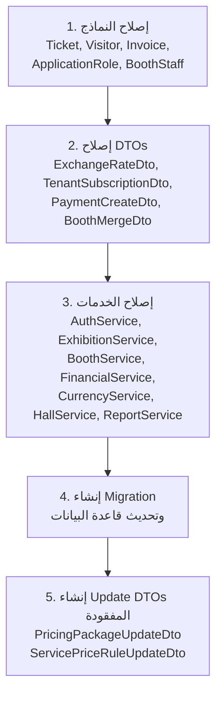

This file is a merged representation of the entire codebase, combined into a single document by Repomix.
The content has been processed where security check has been disabled.

# File Summary

## Purpose
This file contains a packed representation of the entire repository's contents.
It is designed to be easily consumable by AI systems for analysis, code review,
or other automated processes.

## File Format
The content is organized as follows:
1. This summary section
2. Repository information
3. Directory structure
4. Repository files (if enabled)
5. Multiple file entries, each consisting of:
  a. A header with the file path (## File: path/to/file)
  b. The full contents of the file in a code block

## Usage Guidelines
- This file should be treated as read-only. Any changes should be made to the
  original repository files, not this packed version.
- When processing this file, use the file path to distinguish
  between different files in the repository.
- Be aware that this file may contain sensitive information. Handle it with
  the same level of security as you would the original repository.

## Notes
- Some files may have been excluded based on .gitignore rules and Repomix's configuration
- Binary files are not included in this packed representation. Please refer to the Repository Structure section for a complete list of file paths, including binary files
- Files matching patterns in .gitignore are excluded
- Files matching default ignore patterns are excluded
- Security check has been disabled - content may contain sensitive information
- Files are sorted by Git change count (files with more changes are at the bottom)

# Directory Structure
```
ExhibitionManagementSystem/
  Controllers/
    Admin/
      AdminController.cs
      TenantsController.cs
    Auth/
      AuthController.cs
      ProfileController.cs
      RolesController.cs
      UsersController.cs
    Base/
      BaseApiController.cs
    Booth/
      BoothsController.cs
      ReservationsController.cs
    Dashboard/
      DashboardController.cs
    Exhibition/
      ExhibitionsController.cs
      ExhibitorsController.cs
    Financial/
      CurrenciesController.cs
      FinancialController.cs
    Reports/
      ReportsController.cs
    Services/
      PricingController.cs
      ServicesController.cs
    Venue/
      HallsController.cs
      VenuesController.cs
    Visitor/
      TicketsController.cs
      VisitorsController.cs
  Properties/
    launchSettings.json
    serviceDependencies.json
    serviceDependencies.local.json
  appsettings.Development.json
  appsettings.json
  dotnet-tools.json
  ExhibitionManagementSystem.csproj
  ExhibitionManagementSystem.http
  Program.cs
ExhibitionManagementSystem.DataAccess/
  Extensions/
    DataAccessServiceExtensions.cs
  Migrations/
    20260531025705_FixModelsLayer.cs
    20260531025705_FixModelsLayer.Designer.cs
    20260531194302_AddRefreshTokenToUser.cs
    20260531194302_AddRefreshTokenToUser.Designer.cs
    20260601013919_FixAuditSoftDeleteExpenseAndTenantPlan.cs
    20260601013919_FixAuditSoftDeleteExpenseAndTenantPlan.Designer.cs
    ApplicationDbContextModelSnapshot.cs
  Repositories/
    Implementations/
      AuditLogRepository.cs
      BoothMergeRepository.cs
      BoothPriceRuleRepository.cs
      BoothRepository.cs
      BoothReservationRepository.cs
      BoothStaffRepository.cs
      CurrencyRepository.cs
      ExchangeRateRepository.cs
      ExhibitionRepository.cs
      ExhibitionScheduleRepository.cs
      ExhibitorRepository.cs
      ExpenseRepository.cs
      FinancialReportRepository.cs
      GenericRepository.cs
      HallRepository.cs
      InvoiceRepository.cs
      PaymentRepository.cs
      PricingPackageRepository.cs
      ProductRepository.cs
      ScheduleRegistrationRepository.cs
      ServicePriceRuleRepository.cs
      ServiceRepository.cs
      TenantRepository.cs
      TenantSubscriptionRepository.cs
      TicketRepository.cs
      TicketScanRepository.cs
      UnitOfWork.cs
      VenueRepository.cs
      VisitorRatingRepository.cs
      VisitorRepository.cs
    Interfaces/
      IAuditLogRepository.cs
      IBoothMergeRepository.cs
      IBoothPriceRuleRepository.cs
      IBoothRepository.cs
      IBoothReservationRepository.cs
      IBoothStaffRepository.cs
      ICurrencyRepository.cs
      IExchangeRateRepository.cs
      IExhibitionRepository.cs
      IExhibitionScheduleRepository.cs
      IExhibitorRepository.cs
      IExpenseRepository.cs
      IFinancialReportRepository.cs
      IGenericRepository.cs
      IHallRepository.cs
      IInvoiceRepository.cs
      IPaymentRepository.cs
      IPricingPackageRepository.cs
      IProductRepository.cs
      IScheduleRegistrationRepository.cs
      IServicePriceRuleRepository.cs
      IServiceRepository.cs
      ITenantRepository.cs
      ITenantSubscriptionRepository.cs
      ITicketRepository.cs
      ITicketScanRepository.cs
      IUnitOfWork.cs
      IVenueRepository.cs
      IVisitorRatingRepository.cs
      IVisitorRepository.cs
  Seeder/
    DataSeeder.cs
  ApplicationDbContext.cs
  DesignTimeDbContextFactory.cs
  ExhibitionManagementSystem.DataAccess.csproj
ExhibitionManagementSystem.Models/
  Enums/
    BoothShapeType.cs
    BoothStatus.cs
    BoothType.cs
    EventType.cs
    ExhibitionStatus.cs
    ExhibitorCategory.cs
    InvoiceStatus.cs
    PaymentMethod.cs
    PaymentStatus.cs
    RegistrationStatus.cs
    ReservationStatus.cs
    ScanDirection.cs
    SubscriptionStatus.cs
    TicketStatus.cs
  Interfaces/
    IAuditableEntity.cs
    ISoftDeletable.cs
  ApplicationRole.cs
  ApplicationUser.cs
  AuditLog.cs
  Booth.cs
  BoothMerge.cs
  BoothMergeItem.cs
  BoothPriceRule.cs
  BoothReservation.cs
  BoothStaff.cs
  Currency.cs
  ExchangeRate.cs
  Exhibition.cs
  ExhibitionManagementSystem.Models.csproj
  ExhibitionSchedule.cs
  Exhibitor.cs
  Expense.cs
  FinancialReport.cs
  Hall.cs
  Invoice.cs
  PackageService.cs
  Payment.cs
  PricingPackage.cs
  Product.cs
  ReservationService.cs
  ScheduleRegistration.cs
  Service.cs
  ServicePriceRule.cs
  Tenant.cs
  TenantSubscription.cs
  Ticket.cs
  TicketScan.cs
  Venue.cs
  Visitor.cs
  VisitorRating.cs
ExhibitionManagementSystem.Models.DTOs/
  Admin/
    ApplicationUserDto.cs
    AuditLogDto.cs
    TenantSubscriptionDto.cs
  Auth/
    AssignRoleDto.cs
    ChangePasswordDto.cs
    LoginRequestDto.cs
    LoginResponseDto.cs
    RefreshTokenRequestDto.cs
    RefreshTokenResponseDto.cs
    RegisterRequestDto.cs
    ResetPasswordConfirmDto.cs
    ResetPasswordRequestDto.cs
    RoleDto.cs
    UpdateProfileDto.cs
    UserManagementCreateDto.cs
    UserManagementDto.cs
    UserProfileDto.cs
  Booth/
    BoothCreateDto.cs
    BoothDto.cs
    BoothMergeCreateDto.cs
    BoothMergeDto.cs
    BoothMergeItemDto.cs
    BoothSummaryDto.cs
    BoothUpdateDto.cs
  Common/
    AuditDto.cs
    PagedResultDto.cs
  Currency/
    CurrencyDto.cs
  Dashboard/
    DashboardDtos.cs
  Exhibition/
    ExhibitionCreateDto.cs
    ExhibitionDto.cs
    ExhibitionScheduleCreateDto.cs
    ExhibitionScheduleDto.cs
    ExhibitionSummaryDto.cs
    ExhibitionUpdateDto.cs
  Exhibitor/
    ExhibitorCreateDto.cs
    ExhibitorDto.cs
    ExhibitorSummaryDto.cs
    ExhibitorUpdateDto.cs
  Financial/
    ExchangeRateDto.cs
    ExpenseCreateDto.cs
    ExpenseDto.cs
    FinancialReportDto.cs
    InvoiceCreateDto.cs
    InvoiceDto.cs
    PaymentCreateDto.cs
    PaymentDto.cs
  Hall/
    HallCreateDto.cs
    HallDto.cs
    HallSummaryDto.cs
    HallUpdateDto.cs
  Mapping/
    Profiles/
      AdminMappingProfile.cs
      BoothMappingProfile.cs
      CurrencyMappingProfile.cs
      ExhibitionMappingProfile.cs
      ExhibitorMappingProfile.cs
      ExpenseMappingProfile.cs
      FinancialMappingProfile.cs
      HallMappingProfile.cs
      PricingMappingProfile.cs
      ReservationMappingProfile.cs
      ServiceMappingProfile.cs
      TenantMappingProfile.cs
      UserMappingProfile.cs
      VenueMappingProfile.cs
      VisitorMappingProfile.cs
    AutoMapperExtensions.cs
    MappingProfile.cs
  Pricing/
    BoothPriceRuleCreateDto.cs
    BoothPriceRuleDto.cs
    PackageServiceItemDto.cs
    PricingPackageCreateDto.cs
    PricingPackageDto.cs
    PricingPackageUpdateDto.cs
    ServicePriceRuleCreateDto.cs
    ServicePriceRuleDto.cs
    ServicePriceRuleUpdateDto.cs
  Reservation/
    BoothReservationCreateDto.cs
    BoothReservationDto.cs
    BoothReservationSummaryDto.cs
    BoothReservationUpdateDto.cs
    ReservationServiceCreateDto.cs
    ReservationServiceDto.cs
  Service/
    ServiceCreateDto.cs
    ServiceDto.cs
    ServiceSummaryDto.cs
  Tenant/
    TenantCreateDto.cs
    TenantDto.cs
    TenantUpdateDto.cs
  Venue/
    VenueCreateDto.cs
    VenueDto.cs
    VenueSummaryDto.cs
    VenueUpdateDto.cs
  Visitor/
    TicketCreateDto.cs
    TicketDto.cs
    TicketScanDto.cs
    VisitorCreateDto.cs
    VisitorDto.cs
    VisitorRatingDto.cs
    VisitorRatingSummaryDto.cs
  ExhibitionManagementSystem.Models.DTOs.csproj
ExhibitionManagementSystem.Services/
  Common/
    ServiceResult.cs
  Extensions/
    ServiceLayerExtensions.cs
  Implementations/
    AdminService.cs
    AuthService.cs
    BoothService.cs
    CurrencyService.cs
    ExhibitionService.cs
    ExhibitorService.cs
    FinancialService.cs
    HallService.cs
    PricingService.cs
    ReportService.cs
    ReservationService.cs
    ServiceManagementService.cs
    TenantService.cs
    TicketService.cs
    VenueService.cs
    VisitorService.cs
  Interfaces/
    IAdminService.cs
    IAuthService.cs
    IBoothService.cs
    ICurrencyService.cs
    IExhibitionService.cs
    IExhibitorService.cs
    IFinancialService.cs
    IHallService.cs
    IPricingService.cs
    IReportService.cs
    IReservationService.cs
    IServiceManagementService.cs
    ITenantService.cs
    ITicketService.cs
    IVenueService.cs
    IVisitorService.cs
  ExhibitionManagementSystem.Services.csproj
PlansAndTasks/
  fis-task.md
  fix-implementation_plan.md
.gitattributes
.gitignore
ExhibitionManagementSystem.slnx
repomix-output-jihadbil-ExhibitionManagementSystem.git.md
```

# Files

## File: ExhibitionManagementSystem/Controllers/Admin/AdminController.cs
`````csharp
using ExhibitionManagementSystem.Controllers.Base;
using ExhibitionManagementSystem.Models.DTOs.Admin;
using ExhibitionManagementSystem.Models.DTOs.Common;
using ExhibitionManagementSystem.Services.Interfaces;
using Microsoft.AspNetCore.Authorization;
using Microsoft.AspNetCore.Mvc;

namespace ExhibitionManagementSystem.Controllers.Admin;

[Route("api/[controller]")]
[Authorize(Policy = "AdminOnly")]
public class AdminController : BaseApiController
{
    private readonly IAdminService _adminService;

    public AdminController(IAdminService adminService)
        => _adminService = adminService;

    // GET /api/admin/audit-logs?page=1&pageSize=50
    [HttpGet("audit-logs")]
    public async Task<ActionResult<PagedResultDto<AuditLogDto>>> GetAuditLogs(
        [FromQuery] int page = 1,
        [FromQuery] int pageSize = 50)
    {
        var result = await _adminService.GetAuditLogsAsync(TenantId, page, pageSize);
        return ToActionResult(result);
    }

    // GET /api/admin/audit-logs/{tableName}/{recordId}
    [HttpGet("audit-logs/{tableName}/{recordId}")]
    public async Task<ActionResult<IList<AuditLogDto>>> GetAuditLogsByEntity(
        string tableName,
        string recordId)
    {
        var result = await _adminService.GetAuditLogsByEntityAsync(
            TenantId, tableName, recordId);
        return ToActionResult(result);
    }

    // GET /api/admin/subscriptions
    [HttpGet("subscriptions")]
    public async Task<ActionResult<IList<TenantSubscriptionDto>>> GetSubscriptions()
    {
        var result = await _adminService.GetSubscriptionHistoryAsync(TenantId);
        return ToActionResult(result);
    }

    // POST /api/admin/subscriptions
    [HttpPost("subscriptions")]
    public async Task<ActionResult<TenantSubscriptionDto>> CreateSubscription(
        [FromBody] TenantSubscriptionDto dto)
    {
        var result = await _adminService.CreateSubscriptionAsync(TenantId, dto);
        return ToActionResult(result);
    }
}
`````

## File: ExhibitionManagementSystem/Controllers/Admin/TenantsController.cs
`````csharp
using ExhibitionManagementSystem.Controllers.Base;
using ExhibitionManagementSystem.Models.DTOs.Admin;
using ExhibitionManagementSystem.Models.DTOs.Common;
using ExhibitionManagementSystem.Models.DTOs.Tenant;
using ExhibitionManagementSystem.Services.Interfaces;
using Microsoft.AspNetCore.Authorization;
using Microsoft.AspNetCore.Mvc;

namespace ExhibitionManagementSystem.Controllers.Admin;

[Route("api/[controller]")]
[Authorize(Policy = "SuperAdminOnly")]
public class TenantsController : BaseApiController
{
    private readonly ITenantService _tenantService;

    public TenantsController(ITenantService tenantService)
        => _tenantService = tenantService;

    // GET /api/tenants?page=1&pageSize=20
    [HttpGet]
    public async Task<ActionResult<PagedResultDto<TenantDto>>> GetAll(
        [FromQuery] int page = 1,
        [FromQuery] int pageSize = 20)
    {
        var result = await _tenantService.GetAllAsync(page, pageSize);
        return ToActionResult(result);
    }

    // GET /api/tenants/{tenantId}
    [HttpGet("{tenantId:int}")]
    public async Task<ActionResult<TenantDto>> GetById(int tenantId)
    {
        var result = await _tenantService.GetByIdAsync(tenantId);
        return ToActionResult(result);
    }

    // POST /api/tenants
    [HttpPost]
    public async Task<ActionResult<TenantDto>> Create(
        [FromBody] TenantCreateDto dto)
    {
        var result = await _tenantService.CreateAsync(dto);
        if (!result.IsSuccess) return ToActionResult(result);
        return CreatedAtAction(nameof(GetById),
            new { tenantId = result.Data!.TenantID }, result.Data);
    }

    // PUT /api/tenants/{tenantId}
    [HttpPut("{tenantId:int}")]
    public async Task<ActionResult<TenantDto>> Update(
        int tenantId,
        [FromBody] TenantUpdateDto dto)
    {
        var result = await _tenantService.UpdateAsync(tenantId, dto);
        return ToActionResult(result);
    }

    // DELETE /api/tenants/{tenantId}
    [HttpDelete("{tenantId:int}")]
    public async Task<IActionResult> Delete(int tenantId)
    {
        var result = await _tenantService.DeleteAsync(tenantId);
        return ToActionResult(result);
    }

    // GET /api/tenants/{tenantId}/subscription
    [HttpGet("{tenantId:int}/subscription")]
    public async Task<ActionResult<TenantSubscriptionDto>> GetActiveSubscription(
        int tenantId)
    {
        var result = await _tenantService.GetActiveSubscriptionAsync(tenantId);
        return ToActionResult(result);
    }
}
`````

## File: ExhibitionManagementSystem/Controllers/Auth/AuthController.cs
`````csharp
using ExhibitionManagementSystem.Controllers.Base;
using ExhibitionManagementSystem.Models.DTOs.Auth;
using ExhibitionManagementSystem.Services.Interfaces;
using Microsoft.AspNetCore.Authorization;
using Microsoft.AspNetCore.Mvc;

namespace ExhibitionManagementSystem.Controllers.Auth;

[Route("api/[controller]")]
public class AuthController : BaseApiController
{
    private readonly IAuthService _authService;

    public AuthController(IAuthService authService)
        => _authService = authService;

    // POST /api/auth/login
    [HttpPost("login")]
    [AllowAnonymous]
    public async Task<ActionResult<LoginResponseDto>> Login(
        [FromBody] LoginRequestDto dto)
    {
        var result = await _authService.LoginAsync(dto);
        if (!result.IsSuccess)
            return BadRequest(new { result.ErrorMessage, result.ErrorCode });
        return Ok(result.Data);
    }

    // POST /api/auth/register
    [HttpPost("register")]
    [AllowAnonymous]
    public async Task<ActionResult<UserManagementDto>> Register(
        [FromBody] RegisterRequestDto dto)
    {
        var result = await _authService.RegisterAsync(dto);
        return ToActionResult(result);
    }

    // POST /api/auth/logout
    [HttpPost("logout")]
    public async Task<IActionResult> Logout()
    {
        var result = await _authService.LogoutAsync(UserId);
        return ToActionResult(result);
    }

    // POST /api/auth/refresh-token
    [HttpPost("refresh-token")]
    [AllowAnonymous]
    public async Task<ActionResult<RefreshTokenResponseDto>> RefreshToken(
        [FromBody] RefreshTokenRequestDto dto)
    {
        var result = await _authService.RefreshTokenAsync(dto);
        return ToActionResult(result);
    }

    // POST /api/auth/revoke-token
    [HttpPost("revoke-token")]
    public async Task<IActionResult> RevokeToken()
    {
        var result = await _authService.RevokeTokenAsync(UserId);
        return ToActionResult(result);
    }

    // POST /api/auth/forgot-password
    [HttpPost("forgot-password")]
    [HttpPost("reset-password")]
    [AllowAnonymous]
    public async Task<IActionResult> ForgotPassword(
        [FromBody] ResetPasswordRequestDto dto)
    {
        // دائماً 200 OK بغض النظر عن وجود البريد — سلوك أمني مقصود
        await _authService.ForgotPasswordAsync(dto);
        return Ok(new { message = "إذا كان البريد الإلكتروني مسجلاً، ستصلك رسالة لإعادة تعيين كلمة المرور." });
    }

    // POST /api/auth/reset-password/confirm
    [HttpPost("reset-password/confirm")]
    [AllowAnonymous]
    public async Task<IActionResult> ResetPassword(
        [FromBody] ResetPasswordConfirmDto dto)
    {
        var result = await _authService.ResetPasswordAsync(dto);
        return ToActionResult(result);
    }

    // POST /api/auth/change-password
    [HttpPost("change-password")]
    public async Task<IActionResult> ChangePassword(
        [FromBody] ChangePasswordDto dto)
    {
        var result = await _authService.ChangePasswordAsync(UserId, dto);
        return ToActionResult(result);
    }
}
`````

## File: ExhibitionManagementSystem/Controllers/Auth/ProfileController.cs
`````csharp
using ExhibitionManagementSystem.Controllers.Base;
using ExhibitionManagementSystem.DataAccess.Repositories.Interfaces;
using ExhibitionManagementSystem.Models.DTOs.Admin;
using ExhibitionManagementSystem.Models.DTOs.Auth;
using ExhibitionManagementSystem.Models.DTOs.Common;
using ExhibitionManagementSystem.Services.Interfaces;
using AutoMapper;
using Microsoft.AspNetCore.Mvc;
using Microsoft.EntityFrameworkCore;
using System.Collections.Generic;
using System.Linq;
using System.Threading.Tasks;

namespace ExhibitionManagementSystem.Controllers.Auth;

[Route("api/[controller]")]
public class ProfileController : BaseApiController
{
    private readonly IAuthService _authService;
    private readonly IUnitOfWork _unitOfWork;
    private readonly IMapper _mapper;

    public ProfileController(IAuthService authService, IUnitOfWork unitOfWork, IMapper mapper)
    {
        _authService = authService;
        _unitOfWork = unitOfWork;
        _mapper = mapper;
    }

    // GET /api/profile
    [HttpGet]
    public async Task<ActionResult<UserProfileDto>> GetProfile()
    {
        var result = await _authService.GetProfileAsync(UserId);
        return ToActionResult(result);
    }

    // PUT /api/profile
    [HttpPut]
    public async Task<ActionResult<UserProfileDto>> UpdateProfile(
        [FromBody] UpdateProfileDto dto)
    {
        var result = await _authService.UpdateProfileAsync(UserId, dto);
        return ToActionResult(result);
    }

    // GET /api/profile/audit-logs
    [HttpGet("audit-logs")]
    public async Task<ActionResult<PagedResultDto<AuditLogDto>>> GetProfileAuditLogs(
        [FromQuery] int pageNumber = 1,
        [FromQuery] int pageSize = 10)
    {
        var tenantId = TenantId;
        var userId = UserId;

        var query = _unitOfWork.AuditLogs.AsQueryable()
            .Include(a => a.User)
            .Where(a => a.TenantID == tenantId && a.UserId == userId);

        var totalCount = await query.CountAsync();
        var items = await query
            .OrderByDescending(a => a.ActionAt)
            .Skip((pageNumber - 1) * pageSize)
            .Take(pageSize)
            .ToListAsync();

        var dtos = _mapper.Map<IList<AuditLogDto>>(items);

        var result = new PagedResultDto<AuditLogDto>
        {
            Items = dtos.ToList(),
            TotalCount = totalCount,
            PageNumber = pageNumber,
            PageSize = pageSize
        };

        return Ok(result);
    }
}
`````

## File: ExhibitionManagementSystem/Controllers/Auth/RolesController.cs
`````csharp
using ExhibitionManagementSystem.Controllers.Base;
using ExhibitionManagementSystem.Models.DTOs.Auth;
using ExhibitionManagementSystem.Services.Interfaces;
using Microsoft.AspNetCore.Authorization;
using Microsoft.AspNetCore.Mvc;

namespace ExhibitionManagementSystem.Controllers.Auth;

[Route("api/[controller]")]
[Authorize(Policy = "AdminOnly")]
public class RolesController : BaseApiController
{
    private readonly IAuthService _authService;

    public RolesController(IAuthService authService)
        => _authService = authService;

    // GET /api/roles
    [HttpGet]
    public async Task<ActionResult<IList<RoleDto>>> GetAll()
    {
        var result = await _authService.GetRolesAsync(TenantId);
        return ToActionResult(result);
    }

    // POST /api/roles/assign
    [HttpPost("assign")]
    public async Task<IActionResult> Assign([FromBody] AssignRoleDto dto)
    {
        var result = await _authService.AssignRoleAsync(dto);
        return ToActionResult(result);
    }

    // DELETE /api/roles/{userId}/roles/{roleName}
    [HttpDelete("{userId}/roles/{roleName}")]
    public async Task<IActionResult> Remove(string userId, string roleName)
    {
        var result = await _authService.RemoveRoleAsync(userId, roleName);
        return ToActionResult(result);
    }
}
`````

## File: ExhibitionManagementSystem/Controllers/Auth/UsersController.cs
`````csharp
using ExhibitionManagementSystem.Controllers.Base;
using ExhibitionManagementSystem.Models.DTOs.Auth;
using ExhibitionManagementSystem.Models.DTOs.Common;
using ExhibitionManagementSystem.Services.Interfaces;
using Microsoft.AspNetCore.Authorization;
using Microsoft.AspNetCore.Mvc;

namespace ExhibitionManagementSystem.Controllers.Auth;

[Route("api/[controller]")]
[Authorize(Policy = "AdminOnly")]
public class UsersController : BaseApiController
{
    private readonly IAuthService _authService;

    public UsersController(IAuthService authService)
        => _authService = authService;

    // GET /api/users?page=1&pageSize=20
    [HttpGet]
    public async Task<ActionResult<PagedResultDto<UserManagementDto>>> GetAll(
        [FromQuery] int page = 1,
        [FromQuery] int pageSize = 20)
    {
        var result = await _authService.GetUsersAsync(TenantId, page, pageSize);
        return ToActionResult(result);
    }

    // GET /api/users/{userId}
    [HttpGet("{userId}")]
    public async Task<ActionResult<UserManagementDto>> GetById(string userId)
    {
        var result = await _authService.GetUserByIdAsync(userId);
        return ToActionResult(result);
    }

    // POST /api/users
    [HttpPost]
    public async Task<ActionResult<UserManagementDto>> Create(
        [FromBody] UserManagementCreateDto dto)
    {
        var result = await _authService.CreateUserAsync(TenantId, dto);
        if (!result.IsSuccess) return ToActionResult(result);
        return CreatedAtAction(nameof(GetById),
            new { userId = result.Data!.UserId }, result.Data);
    }

    // PATCH /api/users/{userId}/status
    [HttpPatch("{userId}/status")]
    public async Task<IActionResult> UpdateStatus(
        string userId,
        [FromBody] bool isActive)
    {
        var result = await _authService.UpdateUserStatusAsync(userId, isActive);
        return ToActionResult(result);
    }

    // DELETE /api/users/{userId}
    [HttpDelete("{userId}")]
    public async Task<IActionResult> Delete(string userId)
    {
        var result = await _authService.DeleteUserAsync(userId);
        return ToActionResult(result);
    }
}
`````

## File: ExhibitionManagementSystem/Controllers/Base/BaseApiController.cs
`````csharp
using System.Security.Claims;
using ExhibitionManagementSystem.Services.Common;
using Microsoft.AspNetCore.Authorization;
using Microsoft.AspNetCore.Mvc;

namespace ExhibitionManagementSystem.Controllers.Base;

[ApiController]
[Route("api/[controller]")]
[Authorize]
public abstract class BaseApiController : ControllerBase
{
    protected int TenantId
    {
        get
        {
            var claim = User.FindFirstValue("TenantId");
            return int.TryParse(claim, out var id) ? id : 0;
        }
    }

    protected string UserId =>
        User.FindFirstValue(ClaimTypes.NameIdentifier) ?? string.Empty;

    protected ActionResult<T> ToActionResult<T>(ServiceResult<T> result)
    {
        if (result.IsSuccess)
            return Ok(result.Data);

        return result.ErrorCode switch
        {
            var c when c != null && c.EndsWith("_NOT_FOUND") =>
                NotFound(new { result.ErrorMessage, result.ErrorCode }),
            "EMAIL_ALREADY_EXISTS" or "SUBDOMAIN_ALREADY_EXISTS" or
            "ROLE_ALREADY_ASSIGNED" or "DUPLICATE_RATING" =>
                Conflict(new { result.ErrorMessage, result.ErrorCode }),
            "UNAUTHORIZED" =>
                Unauthorized(new { result.ErrorMessage }),
            _ =>
                BadRequest(new { result.ErrorMessage, result.ErrorCode })
        };
    }

    protected ActionResult ToActionResult(ServiceResult result)
    {
        if (result.IsSuccess)
            return NoContent();

        return result.ErrorCode switch
        {
            var c when c != null && c.EndsWith("_NOT_FOUND") =>
                NotFound(new { result.ErrorMessage, result.ErrorCode }),
            "UNAUTHORIZED" =>
                Unauthorized(new { result.ErrorMessage }),
            _ =>
                BadRequest(new { result.ErrorMessage, result.ErrorCode })
        };
    }
}
`````

## File: ExhibitionManagementSystem/Controllers/Booth/BoothsController.cs
`````csharp
using ExhibitionManagementSystem.Controllers.Base;
using ExhibitionManagementSystem.DataAccess.Repositories.Interfaces;
using ExhibitionManagementSystem.Models.DTOs.Booth;
using ExhibitionManagementSystem.Models.DTOs.Common;
using ExhibitionManagementSystem.Models.Enums;
using ExhibitionManagementSystem.Services.Interfaces;
using AutoMapper;
using Microsoft.AspNetCore.Authorization;
using Microsoft.AspNetCore.Mvc;
using Microsoft.EntityFrameworkCore;
using System;
using System.Collections.Generic;
using System.Linq;
using System.Threading.Tasks;

namespace ExhibitionManagementSystem.Controllers.Booth;

[Route("api/[controller]")]
public class BoothsController : BaseApiController
{
    private readonly IBoothService _boothService;
    private readonly IUnitOfWork _unitOfWork;
    private readonly IMapper _mapper;

    public BoothsController(IBoothService boothService, IUnitOfWork unitOfWork, IMapper mapper)
    {
        _boothService = boothService;
        _unitOfWork = unitOfWork;
        _mapper = mapper;
    }

    // GET /api/booths
    [HttpGet]
    public async Task<ActionResult<PagedResultDto<BoothDto>>> GetAll(
        [FromQuery] int? pageNumber,
        [FromQuery] int? pageSize,
        [FromQuery] int? hallId,
        [FromQuery] int? exhibitionId,
        [FromQuery] string? status)
    {
        var tenantId = TenantId;
        var query = _unitOfWork.Booths.AsQueryable()
            .Include(b => b.Hall)
            .ThenInclude(h => h.Venue)
            .Where(b => b.Hall.Venue.TenantID == tenantId);

        if (hallId.HasValue)
        {
            query = query.Where(b => b.HallID == hallId.Value);
        }

        if (exhibitionId.HasValue)
        {
            var boothIds = await _unitOfWork.BoothReservations.AsQueryable()
                .Where(r => r.ExhibitionID == exhibitionId.Value && r.BoothID.HasValue)
                .Select(r => r.BoothID!.Value)
                .ToListAsync();
            query = query.Where(b => boothIds.Contains(b.BoothID));
        }

        if (!string.IsNullOrEmpty(status))
        {
            if (Enum.TryParse<BoothStatus>(status, true, out var boothStatus))
            {
                query = query.Where(b => b.Status == boothStatus);
            }
        }

        var totalCount = await query.CountAsync();

        var page = pageNumber ?? 1;
        var size = pageSize ?? 10;

        var items = await query
            .OrderBy(b => b.BoothNumber)
            .Skip((page - 1) * size)
            .Take(size)
            .ToListAsync();

        var dtos = _mapper.Map<IList<BoothDto>>(items);

        return Ok(new PagedResultDto<BoothDto>
        {
            Items = dtos.ToList(),
            TotalCount = totalCount,
            PageNumber = page,
            PageSize = size
        });
    }

    // GET /api/booths/hall/{hallId}
    [HttpGet("hall/{hallId:int}")]
    public async Task<ActionResult<IList<BoothDto>>> GetByHall(int hallId)
    {
        var result = await _boothService.GetByHallAsync(TenantId, hallId);
        return ToActionResult(result);
    }

    // GET /api/booths/available?hallId=5&exhibitionId=3
    [HttpGet("available")]
    public async Task<ActionResult<IList<BoothSummaryDto>>> GetAvailable(
        [FromQuery] int hallId,
        [FromQuery] int exhibitionId)
    {
        var result = await _boothService.GetAvailableAsync(
            TenantId, hallId, exhibitionId);
        return ToActionResult(result);
    }

    // GET /api/booths/{boothId}
    [HttpGet("{boothId:int}")]
    public async Task<ActionResult<BoothDto>> GetById(int boothId)
    {
        var result = await _boothService.GetByIdAsync(TenantId, boothId);
        return ToActionResult(result);
    }

    // POST /api/booths
    [HttpPost]
    [Authorize(Policy = "AdminOnly")]
    public async Task<ActionResult<BoothDto>> Create(
        [FromBody] BoothCreateDto dto)
    {
        var result = await _boothService.CreateAsync(TenantId, dto);
        if (!result.IsSuccess) return ToActionResult(result);
        return CreatedAtAction(nameof(GetById),
            new { boothId = result.Data!.BoothID }, result.Data);
    }

    // PUT /api/booths/{boothId}
    [HttpPut("{boothId:int}")]
    [Authorize(Policy = "AdminOnly")]
    public async Task<ActionResult<BoothDto>> Update(
        int boothId,
        [FromBody] BoothUpdateDto dto)
    {
        var result = await _boothService.UpdateAsync(TenantId, boothId, dto);
        return ToActionResult(result);
    }

    // POST /api/booths/merge
    [HttpPost("merge")]
    [Authorize(Policy = "AdminOnly")]
    public async Task<ActionResult<BoothMergeDto>> Merge(
        [FromBody] BoothMergeCreateDto dto)
    {
        var result = await _boothService.MergeBoothsAsync(TenantId, UserId, dto);
        return ToActionResult(result);
    }

    // DELETE /api/booths/merge/{mergeId}
    [HttpDelete("merge/{mergeId:int}")]
    [Authorize(Policy = "AdminOnly")]
    public async Task<IActionResult> Unmerge(int mergeId)
    {
        var result = await _boothService.UnmergeBoothsAsync(TenantId, mergeId);
        return ToActionResult(result);
    }
}
`````

## File: ExhibitionManagementSystem/Controllers/Booth/ReservationsController.cs
`````csharp
using ExhibitionManagementSystem.Controllers.Base;
using ExhibitionManagementSystem.Models.DTOs.Common;
using ExhibitionManagementSystem.Models.DTOs.Reservation;
using ExhibitionManagementSystem.Services.Interfaces;
using Microsoft.AspNetCore.Authorization;
using Microsoft.AspNetCore.Mvc;

namespace ExhibitionManagementSystem.Controllers.Booth;

[Route("api/[controller]")]
public class ReservationsController : BaseApiController
{
    private readonly IReservationService _reservationService;

    public ReservationsController(IReservationService reservationService)
        => _reservationService = reservationService;

    // GET /api/reservations/exhibition/{exhibitionId}?page=1&pageSize=20
    [HttpGet("exhibition/{exhibitionId:int}")]
    public async Task<ActionResult<PagedResultDto<BoothReservationSummaryDto>>> GetByExhibition(
        int exhibitionId,
        [FromQuery] int page = 1,
        [FromQuery] int pageSize = 20)
    {
        var result = await _reservationService.GetByExhibitionAsync(
            TenantId, exhibitionId, page, pageSize);
        return ToActionResult(result);
    }

    // GET /api/reservations/exhibitor/{exhibitorId}
    [HttpGet("exhibitor/{exhibitorId:int}")]
    public async Task<ActionResult<IList<BoothReservationSummaryDto>>> GetByExhibitor(
        int exhibitorId)
    {
        var result = await _reservationService.GetByExhibitorAsync(
            TenantId, exhibitorId);
        return ToActionResult(result);
    }

    // GET /api/reservations/exhibition/{exhibitionId}/unpaid
    [HttpGet("exhibition/{exhibitionId:int}/unpaid")]
    [Authorize(Policy = "AdminOnly")]
    public async Task<ActionResult<IList<BoothReservationSummaryDto>>> GetUnpaid(
        int exhibitionId)
    {
        var result = await _reservationService.GetUnpaidAsync(TenantId, exhibitionId);
        return ToActionResult(result);
    }

    // GET /api/reservations/{reservationId}
    [HttpGet("{reservationId:int}")]
    public async Task<ActionResult<BoothReservationDto>> GetById(int reservationId)
    {
        var result = await _reservationService.GetByIdAsync(TenantId, reservationId);
        return ToActionResult(result);
    }

    // POST /api/reservations
    // يحسب السعر تلقائياً عبر IPricingService ويُنفّذ Transaction كاملة
    [HttpPost]
    public async Task<ActionResult<BoothReservationDto>> Create(
        [FromBody] BoothReservationCreateDto dto)
    {
        var result = await _reservationService.CreateAsync(TenantId, UserId, dto);
        if (!result.IsSuccess) return ToActionResult(result);
        return CreatedAtAction(nameof(GetById),
            new { reservationId = result.Data!.ReservationID }, result.Data);
    }

    // PUT /api/reservations/{reservationId}
    [HttpPut("{reservationId:int}")]
    [Authorize(Policy = "AdminOnly")]
    public async Task<ActionResult<BoothReservationDto>> Update(
        int reservationId,
        [FromBody] BoothReservationUpdateDto dto)
    {
        var result = await _reservationService.UpdateAsync(TenantId, reservationId, dto);
        return ToActionResult(result);
    }

    // PATCH /api/reservations/{reservationId}/approve
    [HttpPatch("{reservationId:int}/approve")]
    [Authorize(Policy = "AdminOnly")]
    public async Task<ActionResult<BoothReservationDto>> Approve(int reservationId)
    {
        var result = await _reservationService.ApproveAsync(TenantId, reservationId);
        return ToActionResult(result);
    }

    // PATCH /api/reservations/{reservationId}/cancel
    [HttpPatch("{reservationId:int}/cancel")]
    public async Task<IActionResult> Cancel(int reservationId)
    {
        var result = await _reservationService.CancelAsync(TenantId, reservationId);
        return ToActionResult(result);
    }

    // ─── Reservation Services ─────────────────────────────────────────────────

    // POST /api/reservations/{reservationId}/services
    [HttpPost("{reservationId:int}/services")]
    public async Task<ActionResult<ReservationServiceDto>> AddService(
        int reservationId,
        [FromBody] ReservationServiceCreateDto dto)
    {
        var result = await _reservationService.AddServiceToReservationAsync(
            TenantId, reservationId, dto);
        return ToActionResult(result);
    }

    // DELETE /api/reservations/{reservationId}/services/{rsId}
    [HttpDelete("{reservationId:int}/services/{rsId:int}")]
    public async Task<IActionResult> RemoveService(int reservationId, int rsId)
    {
        var result = await _reservationService.RemoveServiceFromReservationAsync(
            TenantId, reservationId, rsId);
        return ToActionResult(result);
    }
}
`````

## File: ExhibitionManagementSystem/Controllers/Dashboard/DashboardController.cs
`````csharp
using System;
using System.Collections.Generic;
using System.Linq;
using System.Threading.Tasks;
using ExhibitionManagementSystem.Controllers.Base;
using ExhibitionManagementSystem.DataAccess;
using ExhibitionManagementSystem.Models.DTOs.Dashboard;
using ExhibitionManagementSystem.Models.Enums;
using Microsoft.AspNetCore.Authorization;
using Microsoft.AspNetCore.Mvc;
using Microsoft.EntityFrameworkCore;

namespace ExhibitionManagementSystem.Controllers.Dashboard
{
    [Route("api/[controller]")]
    public class DashboardController : BaseApiController
    {
        private readonly ApplicationDbContext _context;

        public DashboardController(ApplicationDbContext context)
        {
            _context = context;
        }

        // GET /api/Dashboard/stats
        [HttpGet("stats")]
        public async Task<ActionResult<DashboardStatsDto>> GetStats()
        {
            var tenantId = TenantId;
            var tenant = await _context.Tenants
                .Include(t => t.Currency)
                .FirstOrDefaultAsync(t => t.TenantID == tenantId);

            var totalExhibitions = await _context.Exhibitions.CountAsync(e => e.TenantID == tenantId);
            var activeExhibitions = await _context.Exhibitions.CountAsync(e => e.TenantID == tenantId && e.Status == ExhibitionStatus.Open);
            var totalExhibitors = await _context.Exhibitors.CountAsync(e => e.TenantID == tenantId);
            var totalVisitors = await _context.Visitors.CountAsync(v => v.TenantID == tenantId);

            // Booth calculations
            var totalBooths = await _context.Booths.CountAsync(b => b.Hall.Venue.TenantID == tenantId);
            var occupiedBooths = await _context.Booths.CountAsync(b => b.Hall.Venue.TenantID == tenantId && b.Status == BoothStatus.Reserved);
            double occupancyRate = totalBooths > 0 ? ((double)occupiedBooths / totalBooths) * 100 : 0;

            var pendingReservations = await _context.BoothReservations.CountAsync(r => r.Exhibition.TenantID == tenantId && r.Status == ReservationStatus.Pending);

            // Financials
            var invoices = await _context.Invoices
                .Where(i => i.TenantID == tenantId)
                .ToListAsync();

            double totalRevenue = (double)invoices.Where(i => i.Status == InvoiceStatus.Paid || i.Status == InvoiceStatus.PartiallyPaid).Sum(i => i.TotalAmount);

            // Since there is a PaidAmount/payments check
            double totalPaid = (double)await _context.Payments
                .Where(p => p.Invoice.TenantID == tenantId && p.Status == PaymentStatus.Completed)
                .SumAsync(p => p.Amount);

            double totalPending = (double)invoices
                .Where(i => i.Status != InvoiceStatus.Paid && i.Status != InvoiceStatus.Cancelled)
                .Sum(i => i.TotalAmount) - totalPaid;

            if (totalPending < 0) totalPending = 0;

            return Ok(new DashboardStatsDto
            {
                TotalExhibitions = totalExhibitions,
                ActiveExhibitions = activeExhibitions,
                TotalExhibitors = totalExhibitors,
                TotalVisitors = totalVisitors,
                TotalRevenue = totalPaid > 0 ? totalPaid : totalRevenue, // use actual paid amount from payments if available
                PendingRevenue = totalPending,
                TotalBooths = totalBooths,
                OccupiedBooths = occupiedBooths,
                OccupancyRate = occupancyRate,
                PendingReservations = pendingReservations,
                CurrencyCode = tenant?.BaseCurrency ?? "USD",
                CurrencySymbol = tenant?.Currency?.Symbol ?? "$"
            });
        }

        // GET /api/Dashboard/recent-activity?limit=8
        [HttpGet("recent-activity")]
        public async Task<ActionResult<IList<ActivityItemDto>>> GetRecentActivity([FromQuery] int limit = 8)
        {
            var tenantId = TenantId;
            var logs = await _context.AuditLogs
                .Include(a => a.User)
                .Where(a => a.TenantID == tenantId)
                .OrderByDescending(a => a.ActionAt)
                .Take(limit)
                .ToListAsync();

            var activities = logs.Select(log => new ActivityItemDto
            {
                ActivityId = (int)log.LogID,
                Type = log.Action,
                Description = $"{log.Action} on {log.TableName} (ID: {log.RecordID})",
                EntityType = log.TableName,
                EntityId = int.TryParse(log.RecordID, out var id) ? id : 0,
                EntityName = log.TableName,
                UserId = log.UserId,
                UserName = log.User?.FullName ?? "System User",
                Timestamp = log.ActionAt
            }).ToList();

            return Ok(activities);
        }

        // GET /api/Dashboard/revenue-chart?period=6m
        [HttpGet("revenue-chart")]
        public async Task<ActionResult<IList<RevenueChartPointDto>>> GetRevenueChart([FromQuery] string period = "6m")
        {
            var tenantId = TenantId;
            var monthsCount = 6;
            if (period == "12m") monthsCount = 12;

            var startDate = DateTime.UtcNow.AddMonths(-monthsCount);

            var invoices = await _context.Invoices
                .Include(i => i.Payments)
                .Where(i => i.TenantID == tenantId && i.CreatedAt >= startDate)
                .ToListAsync();

            var chartPoints = new List<RevenueChartPointDto>();

            for (int i = monthsCount - 1; i >= 0; i--)
            {
                var monthDate = DateTime.UtcNow.AddMonths(-i);
                var label = monthDate.ToString("MMMM"); // e.g. "June"

                var monthlyInvoices = invoices.Where(inv => inv.CreatedAt.Year == monthDate.Year && inv.CreatedAt.Month == monthDate.Month).ToList();

                double revenue = (double)monthlyInvoices.Sum(inv => inv.TotalAmount);
                double paid = (double)monthlyInvoices.SelectMany(inv => inv.Payments).Where(p => p.Status == PaymentStatus.Completed).Sum(p => p.Amount);
                double pending = revenue - paid;
                if (pending < 0) pending = 0;

                chartPoints.Add(new RevenueChartPointDto
                {
                    Label = label,
                    Month = label,
                    Revenue = revenue,
                    Paid = paid,
                    Pending = pending
                });
            }

            return Ok(chartPoints);
        }
    }
}
`````

## File: ExhibitionManagementSystem/Controllers/Exhibition/ExhibitionsController.cs
`````csharp
using ExhibitionManagementSystem.Controllers.Base;
using ExhibitionManagementSystem.Models.DTOs.Common;
using ExhibitionManagementSystem.Models.DTOs.Exhibition;
using ExhibitionManagementSystem.Services.Interfaces;
using Microsoft.AspNetCore.Authorization;
using Microsoft.AspNetCore.Mvc;

namespace ExhibitionManagementSystem.Controllers.Exhibition;

[Route("api/[controller]")]
public class ExhibitionsController : BaseApiController
{
    private readonly IExhibitionService _exhibitionService;

    public ExhibitionsController(IExhibitionService exhibitionService)
        => _exhibitionService = exhibitionService;

    // GET /api/exhibitions?page=1&pageSize=20
    [HttpGet]
    public async Task<ActionResult<PagedResultDto<ExhibitionSummaryDto>>> GetAll(
        [FromQuery] int page = 1,
        [FromQuery] int pageSize = 20)
    {
        var result = await _exhibitionService.GetByTenantAsync(TenantId, page, pageSize);
        return ToActionResult(result);
    }

    // GET /api/exhibitions/active
    [HttpGet("active")]
    public async Task<ActionResult<IList<ExhibitionSummaryDto>>> GetActive()
    {
        var result = await _exhibitionService.GetActiveAsync(TenantId);
        return ToActionResult(result);
    }

    // GET /api/exhibitions/upcoming?count=5
    [HttpGet("upcoming")]
    public async Task<ActionResult<IList<ExhibitionSummaryDto>>> GetUpcoming(
        [FromQuery] int count = 5)
    {
        var result = await _exhibitionService.GetUpcomingAsync(TenantId, count);
        return ToActionResult(result);
    }

    // GET /api/exhibitions/{exhibitionId}
    [HttpGet("{exhibitionId:int}")]
    public async Task<ActionResult<ExhibitionDto>> GetById(int exhibitionId)
    {
        var result = await _exhibitionService.GetByIdAsync(TenantId, exhibitionId);
        return ToActionResult(result);
    }

    // POST /api/exhibitions
    [HttpPost]
    [Authorize(Policy = "AdminOnly")]
    public async Task<ActionResult<ExhibitionDto>> Create(
        [FromBody] ExhibitionCreateDto dto)
    {
        var result = await _exhibitionService.CreateAsync(TenantId, dto);
        if (!result.IsSuccess) return ToActionResult(result);
        return CreatedAtAction(nameof(GetById),
            new { exhibitionId = result.Data!.ExhibitionID }, result.Data);
    }

    // PUT /api/exhibitions/{exhibitionId}
    [HttpPut("{exhibitionId:int}")]
    [Authorize(Policy = "AdminOnly")]
    public async Task<ActionResult<ExhibitionDto>> Update(
        int exhibitionId,
        [FromBody] ExhibitionUpdateDto dto)
    {
        var result = await _exhibitionService.UpdateAsync(TenantId, exhibitionId, dto);
        return ToActionResult(result);
    }

    // PATCH /api/exhibitions/{exhibitionId}/status
    // Body: "Open" | "Closed" | "Draft"
    [HttpPatch("{exhibitionId:int}/status")]
    [Authorize(Policy = "AdminOnly")]
    public async Task<ActionResult<ExhibitionDto>> ChangeStatus(
        int exhibitionId,
        [FromBody] string status)
    {
        var result = await _exhibitionService.ChangeStatusAsync(
            TenantId, exhibitionId, status);
        return ToActionResult(result);
    }

    // DELETE /api/exhibitions/{exhibitionId}
    [HttpDelete("{exhibitionId:int}")]
    [Authorize(Policy = "AdminOnly")]
    public async Task<IActionResult> Delete(int exhibitionId)
    {
        var result = await _exhibitionService.DeleteAsync(TenantId, exhibitionId);
        return ToActionResult(result);
    }

    // ─── Schedules ────────────────────────────────────────────────────────────

    // GET /api/exhibitions/{exhibitionId}/schedules
    [HttpGet("{exhibitionId:int}/schedules")]
    [HttpGet("{exhibitionId:int}/schedule")]
    public async Task<ActionResult<IList<ExhibitionScheduleDto>>> GetSchedules(
        int exhibitionId)
    {
        var result = await _exhibitionService.GetSchedulesAsync(TenantId, exhibitionId);
        return ToActionResult(result);
    }

    // POST /api/exhibitions/{exhibitionId}/schedules
    [HttpPost("{exhibitionId:int}/schedules")]
    [HttpPost("{exhibitionId:int}/schedule")]
    [Authorize(Policy = "AdminOnly")]
    public async Task<ActionResult<ExhibitionScheduleDto>> AddSchedule(
        int exhibitionId,
        [FromBody] ExhibitionScheduleCreateDto dto)
    {
        dto.ExhibitionID = exhibitionId;
        var result = await _exhibitionService.AddScheduleAsync(TenantId, dto);
        return ToActionResult(result);
    }

    // DELETE /api/exhibitions/schedules/{scheduleId}
    [HttpDelete("schedules/{scheduleId:int}")]
    [Authorize(Policy = "AdminOnly")]
    public async Task<IActionResult> RemoveSchedule(int scheduleId)
    {
        var result = await _exhibitionService.RemoveScheduleAsync(TenantId, scheduleId);
        return ToActionResult(result);
    }
}
`````

## File: ExhibitionManagementSystem/Controllers/Exhibition/ExhibitorsController.cs
`````csharp
using ExhibitionManagementSystem.Controllers.Base;
using ExhibitionManagementSystem.Models.DTOs.Common;
using ExhibitionManagementSystem.Models.DTOs.Exhibitor;
using ExhibitionManagementSystem.Models.DTOs.Reservation;
using ExhibitionManagementSystem.Services.Interfaces;
using Microsoft.AspNetCore.Authorization;
using Microsoft.AspNetCore.Mvc;

namespace ExhibitionManagementSystem.Controllers.Exhibition;

[Route("api/[controller]")]
public class ExhibitorsController : BaseApiController
{
    private readonly IExhibitorService _exhibitorService;

    public ExhibitorsController(IExhibitorService exhibitorService)
        => _exhibitorService = exhibitorService;

    // GET /api/exhibitors?page=1&pageSize=20
    [HttpGet]
    public async Task<ActionResult<PagedResultDto<ExhibitorSummaryDto>>> GetAll(
        [FromQuery] int page = 1,
        [FromQuery] int pageSize = 20)
    {
        var result = await _exhibitorService.GetByTenantAsync(TenantId, page, pageSize);
        return ToActionResult(result);
    }

    // GET /api/exhibitors/search?term=كلمة
    [HttpGet("search")]
    public async Task<ActionResult<IList<ExhibitorSummaryDto>>> Search(
        [FromQuery] string term)
    {
        var result = await _exhibitorService.SearchAsync(TenantId, term);
        return ToActionResult(result);
    }

    // GET /api/exhibitors/{exhibitorId}
    [HttpGet("{exhibitorId:int}")]
    public async Task<ActionResult<ExhibitorDto>> GetById(int exhibitorId)
    {
        var result = await _exhibitorService.GetByIdAsync(TenantId, exhibitorId);
        return ToActionResult(result);
    }

    // GET /api/exhibitors/by-user/{userId}
    [HttpGet("by-user/{userId}")]
    public async Task<ActionResult<ExhibitorDto>> GetByUserId(string userId)
    {
        var result = await _exhibitorService.GetByUserIdAsync(TenantId, userId);
        return ToActionResult(result);
    }

    // GET /api/exhibitors/{exhibitorId}/reservations
    [HttpGet("{exhibitorId:int}/reservations")]
    public async Task<ActionResult<IList<BoothReservationSummaryDto>>> GetReservations(
        int exhibitorId)
    {
        var result = await _exhibitorService.GetReservationsAsync(TenantId, exhibitorId);
        return ToActionResult(result);
    }

    // POST /api/exhibitors
    [HttpPost]
    [Authorize(Policy = "AdminOnly")]
    public async Task<ActionResult<ExhibitorDto>> Create(
        [FromBody] ExhibitorCreateDto dto)
    {
        var result = await _exhibitorService.CreateAsync(TenantId, dto);
        if (!result.IsSuccess) return ToActionResult(result);
        return CreatedAtAction(nameof(GetById),
            new { exhibitorId = result.Data!.ExhibitorID }, result.Data);
    }

    // PUT /api/exhibitors/{exhibitorId}
    [HttpPut("{exhibitorId:int}")]
    [Authorize(Policy = "AdminOnly")]
    public async Task<ActionResult<ExhibitorDto>> Update(
        int exhibitorId,
        [FromBody] ExhibitorUpdateDto dto)
    {
        var result = await _exhibitorService.UpdateAsync(TenantId, exhibitorId, dto);
        return ToActionResult(result);
    }

    // DELETE /api/exhibitors/{exhibitorId}
    [HttpDelete("{exhibitorId:int}")]
    [Authorize(Policy = "AdminOnly")]
    public async Task<IActionResult> Delete(int exhibitorId)
    {
        var result = await _exhibitorService.DeleteAsync(TenantId, exhibitorId);
        return ToActionResult(result);
    }
}
`````

## File: ExhibitionManagementSystem/Controllers/Financial/CurrenciesController.cs
`````csharp
using ExhibitionManagementSystem.Controllers.Base;
using ExhibitionManagementSystem.Models.DTOs.Currency;
using ExhibitionManagementSystem.Models.DTOs.Financial;
using ExhibitionManagementSystem.Services.Interfaces;
using Microsoft.AspNetCore.Authorization;
using Microsoft.AspNetCore.Mvc;

namespace ExhibitionManagementSystem.Controllers.Financial;

[Route("api/[controller]")]
public class CurrenciesController : BaseApiController
{
    private readonly ICurrencyService _currencyService;

    public CurrenciesController(ICurrencyService currencyService)
        => _currencyService = currencyService;

    // GET /api/currencies
    [HttpGet]
    [AllowAnonymous]
    public async Task<ActionResult<IList<CurrencyDto>>> GetAll()
    {
        var result = await _currencyService.GetAllAsync();
        return ToActionResult(result);
    }

    // GET /api/currencies/rates/{fromCurrency}
    [HttpGet("rates/{fromCurrency}")]
    public async Task<ActionResult<IList<ExchangeRateDto>>> GetRates(
        string fromCurrency)
    {
        var result = await _currencyService.GetExchangeRatesAsync(fromCurrency);
        return ToActionResult(result);
    }

    // GET /api/currencies/rate?from=USD&to=LYD
    [HttpGet("rate")]
    public async Task<ActionResult<decimal>> GetCurrentRate(
        [FromQuery] string from,
        [FromQuery] string to)
    {
        var result = await _currencyService.GetCurrentRateAsync(from, to);
        return ToActionResult(result);
    }

    // POST /api/currencies/convert
    // Body: { "amount": 100, "from": "USD", "to": "LYD" }
    [HttpPost("convert")]
    public async Task<ActionResult<decimal>> Convert(
        [FromBody] ConvertCurrencyRequest request)
    {
        var result = await _currencyService.ConvertAmountAsync(
            request.Amount, request.From, request.To);
        return ToActionResult(result);
    }

    // PUT /api/currencies/rates
    [HttpPut("rates")]
    [Authorize(Policy = "AdminOnly")]
    public async Task<ActionResult<ExchangeRateDto>> UpsertRate(
        [FromBody] ExchangeRateDto dto)
    {
        // UserId يُستخرج من JWT — يُسجَّل كـ CreatedByUserId
        var result = await _currencyService.UpsertExchangeRateAsync(UserId, dto);
        return ToActionResult(result);
    }
}

public record ConvertCurrencyRequest(decimal Amount, string From, string To);
`````

## File: ExhibitionManagementSystem/Controllers/Financial/FinancialController.cs
`````csharp
using ExhibitionManagementSystem.Controllers.Base;
using ExhibitionManagementSystem.Models.DTOs.Common;
using ExhibitionManagementSystem.Models.DTOs.Financial;
using ExhibitionManagementSystem.Services.Interfaces;
using Microsoft.AspNetCore.Authorization;
using Microsoft.AspNetCore.Mvc;

namespace ExhibitionManagementSystem.Controllers.Financial;

[Route("api/[controller]")]
[Authorize(Policy = "AdminOnly")]
public class FinancialController : BaseApiController
{
    private readonly IFinancialService _financialService;

    public FinancialController(IFinancialService financialService)
        => _financialService = financialService;

    // ─── Invoices ─────────────────────────────────────────────────────────────

    // GET /api/financial/invoices?page=1&pageSize=20
    [HttpGet("invoices")]
    public async Task<ActionResult<PagedResultDto<InvoiceDto>>> GetInvoices(
        [FromQuery] int page = 1,
        [FromQuery] int pageSize = 20)
    {
        var result = await _financialService.GetInvoicesByTenantAsync(
            TenantId, page, pageSize);
        return ToActionResult(result);
    }

    // GET /api/financial/invoices/overdue
    [HttpGet("invoices/overdue")]
    public async Task<ActionResult<IList<InvoiceDto>>> GetOverdueInvoices()
    {
        var result = await _financialService.GetOverdueInvoicesAsync(TenantId);
        return ToActionResult(result);
    }

    // GET /api/financial/invoices/{invoiceId}
    [HttpGet("invoices/{invoiceId:int}")]
    public async Task<ActionResult<InvoiceDto>> GetInvoiceById(int invoiceId)
    {
        var result = await _financialService.GetInvoiceByIdAsync(TenantId, invoiceId);
        return ToActionResult(result);
    }

    // GET /api/financial/invoices/by-reservation/{reservationId}
    [HttpGet("invoices/by-reservation/{reservationId:int}")]
    public async Task<ActionResult<InvoiceDto>> GetInvoiceByReservation(
        int reservationId)
    {
        var result = await _financialService.GetInvoiceByReservationAsync(
            TenantId, reservationId);
        return ToActionResult(result);
    }

    // POST /api/financial/invoices
    [HttpPost("invoices")]
    public async Task<ActionResult<InvoiceDto>> CreateInvoice(
        [FromBody] InvoiceCreateDto dto)
    {
        var result = await _financialService.CreateInvoiceAsync(TenantId, dto);
        if (!result.IsSuccess) return ToActionResult(result);
        return CreatedAtAction(nameof(GetInvoiceById),
            new { invoiceId = result.Data!.InvoiceID }, result.Data);
    }

    // POST /api/financial/invoices/generate/{reservationId}
    [HttpPost("invoices/generate/{reservationId:int}")]
    public async Task<ActionResult<InvoiceDto>> GenerateInvoice(int reservationId)
    {
        var result = await _financialService.GenerateInvoiceForReservationAsync(
            TenantId, reservationId);
        return ToActionResult(result);
    }

    // ─── Payments ─────────────────────────────────────────────────────────────

    // POST /api/financial/payments
    [HttpPost("payments")]
    public async Task<ActionResult<PaymentDto>> RecordPayment(
        [FromBody] PaymentCreateDto dto)
    {
        // UserId يُستخرج من JWT — لا يُؤخذ من الـ Body
        var result = await _financialService.RecordPaymentAsync(TenantId, UserId, dto);
        return ToActionResult(result);
    }

    // GET /api/financial/payments/invoice/{invoiceId}
    [HttpGet("payments/invoice/{invoiceId:int}")]
    public async Task<ActionResult<IList<PaymentDto>>> GetPaymentsByInvoice(
        int invoiceId)
    {
        var result = await _financialService.GetPaymentsByInvoiceAsync(
            TenantId, invoiceId);
        return ToActionResult(result);
    }
}
`````

## File: ExhibitionManagementSystem/Controllers/Reports/ReportsController.cs
`````csharp
using ExhibitionManagementSystem.Controllers.Base;
using ExhibitionManagementSystem.Models.DTOs.Financial;
using ExhibitionManagementSystem.Services.Interfaces;
using Microsoft.AspNetCore.Authorization;
using Microsoft.AspNetCore.Mvc;

namespace ExhibitionManagementSystem.Controllers.Reports;

[Route("api/[controller]")]
[Authorize(Policy = "AdminOnly")]
public class ReportsController : BaseApiController
{
    private readonly IReportService _reportService;

    public ReportsController(IReportService reportService)
        => _reportService = reportService;

    // POST /api/reports/exhibitions/{exhibitionId}
    // يُولّد تقريراً مالياً كاملاً ويحفظه في قاعدة البيانات
    [HttpPost("exhibitions/{exhibitionId:int}")]
    public async Task<ActionResult<FinancialReportDto>> Generate(int exhibitionId)
    {
        var result = await _reportService.GenerateExhibitionReportAsync(
            TenantId, exhibitionId, UserId);
        return ToActionResult(result);
    }

    // GET /api/reports/{reportId}
    [HttpGet("{reportId:int}")]
    public async Task<ActionResult<FinancialReportDto>> GetById(int reportId)
    {
        var result = await _reportService.GetReportByIdAsync(TenantId, reportId);
        return ToActionResult(result);
    }
}
`````

## File: ExhibitionManagementSystem/Controllers/Services/PricingController.cs
`````csharp
using ExhibitionManagementSystem.Controllers.Base;
using ExhibitionManagementSystem.Models.DTOs.Pricing;
using ExhibitionManagementSystem.Services.Interfaces;
using Microsoft.AspNetCore.Authorization;
using Microsoft.AspNetCore.Mvc;

namespace ExhibitionManagementSystem.Controllers.Services;

[Route("api/[controller]")]
public class PricingController : BaseApiController
{
    private readonly IPricingService _pricingService;

    public PricingController(IPricingService pricingService)
        => _pricingService = pricingService;

    // ─── Booth Price Rules ────────────────────────────────────────────────────

    // GET /api/pricing/booth-rules?exhibitionId=3
    [HttpGet("booth-rules")]
    public async Task<ActionResult<IList<BoothPriceRuleDto>>> GetBoothRules(
        [FromQuery] int? exhibitionId = null)
    {
        var result = await _pricingService.GetBoothPriceRulesAsync(TenantId, exhibitionId);
        return ToActionResult(result);
    }

    // POST /api/pricing/booth-rules
    [HttpPost("booth-rules")]
    [Authorize(Policy = "AdminOnly")]
    public async Task<ActionResult<BoothPriceRuleDto>> CreateBoothRule(
        [FromBody] BoothPriceRuleCreateDto dto)
    {
        var result = await _pricingService.CreateBoothPriceRuleAsync(TenantId, dto);
        return ToActionResult(result);
    }

    // PUT /api/pricing/booth-rules/{ruleId}
    [HttpPut("booth-rules/{ruleId:int}")]
    [Authorize(Policy = "AdminOnly")]
    public async Task<ActionResult<BoothPriceRuleDto>> UpdateBoothRule(
        int ruleId,
        [FromBody] BoothPriceRuleCreateDto dto)
    {
        var result = await _pricingService.UpdateBoothPriceRuleAsync(TenantId, ruleId, dto);
        return ToActionResult(result);
    }

    // DELETE /api/pricing/booth-rules/{ruleId}
    [HttpDelete("booth-rules/{ruleId:int}")]
    [Authorize(Policy = "AdminOnly")]
    public async Task<IActionResult> DeleteBoothRule(int ruleId)
    {
        var result = await _pricingService.DeleteBoothPriceRuleAsync(TenantId, ruleId);
        return ToActionResult(result);
    }

    // ─── Service Price Rules ──────────────────────────────────────────────────

    // GET /api/pricing/service-rules?exhibitionId=3
    [HttpGet("service-rules")]
    public async Task<ActionResult<IList<ServicePriceRuleDto>>> GetServiceRules(
        [FromQuery] int? exhibitionId = null)
    {
        var result = await _pricingService.GetServicePriceRulesAsync(TenantId, exhibitionId);
        return ToActionResult(result);
    }

    // POST /api/pricing/service-rules
    [HttpPost("service-rules")]
    [Authorize(Policy = "AdminOnly")]
    public async Task<ActionResult<ServicePriceRuleDto>> CreateServiceRule(
        [FromBody] ServicePriceRuleCreateDto dto)
    {
        var result = await _pricingService.CreateServicePriceRuleAsync(TenantId, dto);
        return ToActionResult(result);
    }

    // ─── Packages ─────────────────────────────────────────────────────────────

    // GET /api/pricing/packages
    [HttpGet("packages")]
    public async Task<ActionResult<IList<PricingPackageDto>>> GetPackages()
    {
        var result = await _pricingService.GetPackagesAsync(TenantId);
        return ToActionResult(result);
    }

    // POST /api/pricing/packages
    [HttpPost("packages")]
    [Authorize(Policy = "AdminOnly")]
    public async Task<ActionResult<PricingPackageDto>> CreatePackage(
        [FromBody] PricingPackageCreateDto dto)
    {
        var result = await _pricingService.CreatePackageAsync(TenantId, dto);
        return ToActionResult(result);
    }

    // ─── Price Calculators (Preview) ──────────────────────────────────────────

    // POST /api/pricing/calculate/booth
    // Body: { "exhibitionId": 1, "boothType": "Standard", "exhibitorCategory": "Technology", "areaSqM": 25 }
    [HttpPost("calculate/booth")]
    public async Task<ActionResult<decimal>> CalculateBoothPrice(
        [FromBody] CalculateBoothPriceRequest request)
    {
        if (!Enum.TryParse<ExhibitionManagementSystem.Models.Enums.BoothType>(
                request.BoothType, out var boothType))
            return BadRequest(new { ErrorMessage = "نوع الكشك غير صالح", ErrorCode = "INVALID_BOOTH_TYPE" });

        if (!Enum.TryParse<ExhibitionManagementSystem.Models.Enums.ExhibitorCategory>(
                request.ExhibitorCategory, out var category))
            return BadRequest(new { ErrorMessage = "فئة العارض غير صالحة", ErrorCode = "INVALID_EXHIBITOR_CATEGORY" });

        var result = await _pricingService.CalculateBoothPriceAsync(
            TenantId, request.ExhibitionId, boothType, category, request.AreaSqM ?? 0);
        return ToActionResult(result);
    }

    // POST /api/pricing/calculate/service
    // Body: { "serviceId": 1, "exhibitionId": 1, "quantity": 2 }
    [HttpPost("calculate/service")]
    public async Task<ActionResult<decimal>> CalculateServicePrice(
        [FromBody] CalculateServicePriceRequest request)
    {
        var result = await _pricingService.CalculateServicePriceAsync(
            TenantId, request.ServiceId, request.ExhibitionId, request.Quantity);
        return ToActionResult(result);
    }
}

// Request DTOs مضمّنة (بديلة لملف منفصل)
public record CalculateBoothPriceRequest(
    int ExhibitionId,
    string BoothType,
    string ExhibitorCategory,
    decimal? AreaSqM);

public record CalculateServicePriceRequest(
    int ServiceId,
    int ExhibitionId,
    int Quantity);
`````

## File: ExhibitionManagementSystem/Controllers/Services/ServicesController.cs
`````csharp
using ExhibitionManagementSystem.Controllers.Base;
using ExhibitionManagementSystem.Models.DTOs.Service;
using ExhibitionManagementSystem.Services.Interfaces;
using Microsoft.AspNetCore.Authorization;
using Microsoft.AspNetCore.Mvc;

namespace ExhibitionManagementSystem.Controllers.Services;

[Route("api/[controller]")]
public class ServicesController : BaseApiController
{
    private readonly IServiceManagementService _serviceService;

    public ServicesController(IServiceManagementService serviceService)
        => _serviceService = serviceService;

    // GET /api/services
    [HttpGet]
    public async Task<ActionResult<IList<ServiceDto>>> GetAll()
    {
        var result = await _serviceService.GetByTenantAsync(TenantId);
        return ToActionResult(result);
    }

    // GET /api/services/{serviceId}
    [HttpGet("{serviceId:int}")]
    public async Task<ActionResult<ServiceDto>> GetById(int serviceId)
    {
        var result = await _serviceService.GetByIdAsync(TenantId, serviceId);
        return ToActionResult(result);
    }

    // POST /api/services
    [HttpPost]
    [Authorize(Policy = "AdminOnly")]
    public async Task<ActionResult<ServiceDto>> Create(
        [FromBody] ServiceCreateDto dto)
    {
        var result = await _serviceService.CreateAsync(TenantId, dto);
        if (!result.IsSuccess) return ToActionResult(result);
        return CreatedAtAction(nameof(GetById),
            new { serviceId = result.Data!.ServiceID }, result.Data);
    }

    // PUT /api/services/{serviceId}
    [HttpPut("{serviceId:int}")]
    [Authorize(Policy = "AdminOnly")]
    public async Task<ActionResult<ServiceDto>> Update(
        int serviceId,
        [FromBody] ServiceCreateDto dto)
    {
        var result = await _serviceService.UpdateAsync(TenantId, serviceId, dto);
        return ToActionResult(result);
    }

    // PATCH /api/services/{serviceId}/deactivate
    [HttpPatch("{serviceId:int}/deactivate")]
    [Authorize(Policy = "AdminOnly")]
    public async Task<IActionResult> Deactivate(int serviceId)
    {
        var result = await _serviceService.DeactivateAsync(TenantId, serviceId);
        return ToActionResult(result);
    }
}
`````

## File: ExhibitionManagementSystem/Controllers/Venue/HallsController.cs
`````csharp
using ExhibitionManagementSystem.Controllers.Base;
using ExhibitionManagementSystem.Models.DTOs.Hall;
using ExhibitionManagementSystem.Services.Interfaces;
using Microsoft.AspNetCore.Authorization;
using Microsoft.AspNetCore.Mvc;

namespace ExhibitionManagementSystem.Controllers.Venue;

[Route("api/[controller]")]
public class HallsController : BaseApiController
{
    private readonly IHallService _hallService;

    public HallsController(IHallService hallService)
        => _hallService = hallService;

    // GET /api/halls/venue/{venueId}
    [HttpGet("venue/{venueId:int}")]
    public async Task<ActionResult<IList<HallDto>>> GetByVenue(int venueId)
    {
        var result = await _hallService.GetByVenueAsync(TenantId, venueId);
        return ToActionResult(result);
    }

    // GET /api/halls/{hallId}
    [HttpGet("{hallId:int}")]
    public async Task<ActionResult<HallDto>> GetById(int hallId)
    {
        var result = await _hallService.GetByIdAsync(TenantId, hallId);
        return ToActionResult(result);
    }

    // POST /api/halls
    [HttpPost]
    [Authorize(Policy = "AdminOnly")]
    public async Task<ActionResult<HallDto>> Create(
        [FromBody] HallCreateDto dto)
    {
        var result = await _hallService.CreateAsync(TenantId, dto);
        if (!result.IsSuccess) return ToActionResult(result);
        return CreatedAtAction(nameof(GetById),
            new { hallId = result.Data!.HallID }, result.Data);
    }

    // PUT /api/halls/{hallId}
    [HttpPut("{hallId:int}")]
    [Authorize(Policy = "AdminOnly")]
    public async Task<ActionResult<HallDto>> Update(
        int hallId,
        [FromBody] HallUpdateDto dto)
    {
        var result = await _hallService.UpdateAsync(TenantId, hallId, dto);
        return ToActionResult(result);
    }

    // DELETE /api/halls/{hallId}
    [HttpDelete("{hallId:int}")]
    [Authorize(Policy = "AdminOnly")]
    public async Task<IActionResult> Delete(int hallId)
    {
        var result = await _hallService.DeleteAsync(TenantId, hallId);
        return ToActionResult(result);
    }
}
`````

## File: ExhibitionManagementSystem/Controllers/Venue/VenuesController.cs
`````csharp
using ExhibitionManagementSystem.Controllers.Base;
using ExhibitionManagementSystem.Models.DTOs.Venue;
using ExhibitionManagementSystem.Services.Interfaces;
using Microsoft.AspNetCore.Authorization;
using Microsoft.AspNetCore.Mvc;

namespace ExhibitionManagementSystem.Controllers.Venue;

[Route("api/[controller]")]
public class VenuesController : BaseApiController
{
    private readonly IVenueService _venueService;

    public VenuesController(IVenueService venueService)
        => _venueService = venueService;

    // GET /api/venues
    [HttpGet]
    public async Task<ActionResult<IList<VenueDto>>> GetAll()
    {
        var result = await _venueService.GetByTenantAsync(TenantId);
        return ToActionResult(result);
    }

    // GET /api/venues/summaries
    [HttpGet("summaries")]
    public async Task<ActionResult<IList<VenueSummaryDto>>> GetSummaries()
    {
        var result = await _venueService.GetSummariesAsync(TenantId);
        return ToActionResult(result);
    }

    // GET /api/venues/{venueId}
    [HttpGet("{venueId:int}")]
    public async Task<ActionResult<VenueDto>> GetById(int venueId)
    {
        var result = await _venueService.GetByIdAsync(TenantId, venueId);
        return ToActionResult(result);
    }

    // POST /api/venues
    [HttpPost]
    [Authorize(Policy = "AdminOnly")]
    public async Task<ActionResult<VenueDto>> Create(
        [FromBody] VenueCreateDto dto)
    {
        var result = await _venueService.CreateAsync(TenantId, dto);
        if (!result.IsSuccess) return ToActionResult(result);
        return CreatedAtAction(nameof(GetById),
            new { venueId = result.Data!.VenueID }, result.Data);
    }

    // PUT /api/venues/{venueId}
    [HttpPut("{venueId:int}")]
    [Authorize(Policy = "AdminOnly")]
    public async Task<ActionResult<VenueDto>> Update(
        int venueId,
        [FromBody] VenueUpdateDto dto)
    {
        var result = await _venueService.UpdateAsync(TenantId, venueId, dto);
        return ToActionResult(result);
    }

    // DELETE /api/venues/{venueId}
    [HttpDelete("{venueId:int}")]
    [Authorize(Policy = "AdminOnly")]
    public async Task<IActionResult> Delete(int venueId)
    {
        var result = await _venueService.DeleteAsync(TenantId, venueId);
        return ToActionResult(result);
    }
}
`````

## File: ExhibitionManagementSystem/Controllers/Visitor/TicketsController.cs
`````csharp
using ExhibitionManagementSystem.Controllers.Base;
using ExhibitionManagementSystem.Models.DTOs.Visitor;
using ExhibitionManagementSystem.Services.Interfaces;
using Microsoft.AspNetCore.Mvc;

namespace ExhibitionManagementSystem.Controllers.Visitor;

[Route("api/[controller]")]
public class TicketsController : BaseApiController
{
    private readonly ITicketService _ticketService;

    public TicketsController(ITicketService ticketService)
        => _ticketService = ticketService;

    // POST /api/tickets
    [HttpPost]
    public async Task<ActionResult<TicketDto>> Issue(
        [FromBody] TicketCreateDto dto)
    {
        var result = await _ticketService.IssueTicketAsync(TenantId, dto);
        if (!result.IsSuccess) return ToActionResult(result);
        return CreatedAtAction(nameof(GetScanHistory),
            new { ticketId = result.Data!.TicketID }, result.Data);
    }

    // GET /api/tickets/visitor/{visitorId}
    [HttpGet("visitor/{visitorId:int}")]
    public async Task<ActionResult<IList<TicketDto>>> GetByVisitor(int visitorId)
    {
        var result = await _ticketService.GetByVisitorAsync(TenantId, visitorId);
        return ToActionResult(result);
    }

    // GET /api/tickets/exhibition/{exhibitionId}
    [HttpGet("exhibition/{exhibitionId:int}")]
    public async Task<ActionResult<IList<TicketDto>>> GetByExhibition(int exhibitionId)
    {
        var result = await _ticketService.GetByExhibitionAsync(TenantId, exhibitionId);
        return ToActionResult(result);
    }

    // POST /api/tickets/scan
    // Body: { "qrCode": "3-42-abc123", "direction": "In", "location": "Gate A" }
    [HttpPost("scan")]
    public async Task<ActionResult<TicketScanDto>> Scan(
        [FromBody] ScanTicketRequest request)
    {
        // UserId يُستخرج من JWT تلقائياً — لا يُؤخذ من الـ Body
        var result = await _ticketService.ScanTicketAsync(
            TenantId,
            request.QrCode,
            request.Direction,
            request.Location,
            UserId);
        return ToActionResult(result);
    }

    // GET /api/tickets/{ticketId}/scans
    [HttpGet("{ticketId:int}/scans")]
    public async Task<ActionResult<IList<TicketScanDto>>> GetScanHistory(int ticketId)
    {
        var result = await _ticketService.GetScanHistoryAsync(TenantId, ticketId);
        return ToActionResult(result);
    }
}

public record ScanTicketRequest(string QrCode, string Direction, string? Location);
`````

## File: ExhibitionManagementSystem/Controllers/Visitor/VisitorsController.cs
`````csharp
using ExhibitionManagementSystem.Controllers.Base;
using ExhibitionManagementSystem.Models.DTOs.Common;
using ExhibitionManagementSystem.Models.DTOs.Visitor;
using ExhibitionManagementSystem.Services.Interfaces;
using Microsoft.AspNetCore.Authorization;
using Microsoft.AspNetCore.Mvc;

namespace ExhibitionManagementSystem.Controllers.Visitor;

[Route("api/[controller]")]
public class VisitorsController : BaseApiController
{
    private readonly IVisitorService _visitorService;

    public VisitorsController(IVisitorService visitorService)
        => _visitorService = visitorService;

    // GET /api/visitors?page=1&pageSize=20
    [HttpGet]
    public async Task<ActionResult<PagedResultDto<VisitorDto>>> GetAll(
        [FromQuery] int page = 1,
        [FromQuery] int pageSize = 20)
    {
        var result = await _visitorService.GetByTenantAsync(TenantId, page, pageSize);
        return ToActionResult(result);
    }

    // GET /api/visitors/search?term=كلمة
    [HttpGet("search")]
    public async Task<ActionResult<IList<VisitorDto>>> Search(
        [FromQuery] string term)
    {
        var result = await _visitorService.SearchAsync(TenantId, term);
        return ToActionResult(result);
    }

    // GET /api/visitors/{visitorId}
    [HttpGet("{visitorId:int}")]
    public async Task<ActionResult<VisitorDto>> GetById(int visitorId)
    {
        var result = await _visitorService.GetByIdAsync(TenantId, visitorId);
        return ToActionResult(result);
    }

    // POST /api/visitors/register
    [HttpPost("register")]
    [AllowAnonymous]
    public async Task<ActionResult<VisitorDto>> Register(
        [FromBody] VisitorCreateDto dto)
    {
        var result = await _visitorService.RegisterAsync(TenantId, dto);
        if (!result.IsSuccess) return ToActionResult(result);
        return CreatedAtAction(nameof(GetById),
            new { visitorId = result.Data!.VisitorID }, result.Data);
    }

    // POST /api/visitors/{visitorId}/ratings
    // Body: { "exhibitionId": 1, "rating": 4, "comment": "رائع!" }
    [HttpPost("{visitorId:int}/ratings")]
    public async Task<ActionResult<VisitorRatingDto>> SubmitRating(
        int visitorId,
        [FromBody] SubmitRatingRequest request)
    {
        var result = await _visitorService.SubmitRatingAsync(
            TenantId, visitorId,
            request.ExhibitionId, request.Rating, request.Comment);
        return ToActionResult(result);
    }

    // GET /api/visitors/ratings/exhibition/{exhibitionId}
    [HttpGet("ratings/exhibition/{exhibitionId:int}")]
    public async Task<ActionResult<VisitorRatingSummaryDto>> GetRatingSummary(
        int exhibitionId)
    {
        var result = await _visitorService.GetRatingSummaryAsync(TenantId, exhibitionId);
        return ToActionResult(result);
    }
}

public record SubmitRatingRequest(int ExhibitionId, int Rating, string? Comment);
`````

## File: ExhibitionManagementSystem/Properties/launchSettings.json
`````json
{
  "$schema": "https://json.schemastore.org/launchsettings.json",
  "profiles": {
    "https": {
      "commandName": "Project",
      "dotnetRunMessages": true,
      "launchBrowser": true,
      "applicationUrl": "https://localhost:7144;http://localhost:5159",
      "environmentVariables": {
        "ASPNETCORE_ENVIRONMENT": "Development"
      }
    }
  }
}
`````

## File: ExhibitionManagementSystem/Properties/serviceDependencies.json
`````json
{
  "dependencies": {
    "identityapp1": {
      "type": "identityapp"
    }
  }
}
`````

## File: ExhibitionManagementSystem/Properties/serviceDependencies.local.json
`````json
{
  "dependencies": {
    "identityapp1": {
      "connectionInfo": "App registration: test, Tenant: Default Directory (masoudbilkhair99gmail.onmicrosoft.com - Microsoft Entra ID)",
      "type": "identityapp.default"
    }
  }
}
`````

## File: ExhibitionManagementSystem/appsettings.Development.json
`````json
{
  "Logging": {
    "LogLevel": {
      "Default": "Information",
      "Microsoft.AspNetCore": "Warning"
    }
  }
}
`````

## File: ExhibitionManagementSystem/appsettings.json
`````json
{


  "ConnectionStrings": {
    "DefaultConnection": "Server=(local);Database=MyDatabase;Trusted_Connection=True;TrustServerCertificate=True;"
  },
  "JwtSettings": {
    "SecretKey": "SuperSecretKeyForExhibitionManagementSystemSecurity2026",
    "Issuer": "ExhibitionManagementSystem",
    "Audience": "ExhibitionManagementSystemClients",
    "AccessTokenExpiryMinutes": 60,
    "RefreshTokenExpiryDays": 7
  },
  "AzureAd": {
    "Instance": "https://login.microsoftonline.com/",
    "Domain": "masoudbilkhair99gmail.onmicrosoft.com",
    "TenantId": "fd75edcc-c7df-4570-a160-760c96ce603b",
    "ClientId": "95c69437-44d2-4382-8d40-76fd0d6d05f7",
    "CallbackPath": "/signin-oidc",
    "Scopes": "access_as_user"
  },
  "Logging": {
    "LogLevel": {
      "Default": "Information",
      "Microsoft.AspNetCore": "Warning"
    }
  },
  "AllowedHosts": "*"
}
`````

## File: ExhibitionManagementSystem/dotnet-tools.json
`````json
{
  "version": 1,
  "isRoot": true,
  "tools": {
    "microsoft.dotnet-msidentity": {
      "version": "2.0.8",
      "commands": [
        "dotnet-msidentity"
      ],
      "rollForward": false
    }
  }
}
`````

## File: ExhibitionManagementSystem/ExhibitionManagementSystem.csproj
`````
<Project Sdk="Microsoft.NET.Sdk.Web">

  <PropertyGroup>
    <TargetFramework>net10.0</TargetFramework>
    <Nullable>enable</Nullable>
    <ImplicitUsings>enable</ImplicitUsings>
    <UserSecretsId>aspnet-ExhibitionManagementSystem-287f3405-2107-4cb3-9e77-27a574f4cd78</UserSecretsId>
  </PropertyGroup>

  <ItemGroup>
    <PackageReference Include="Microsoft.AspNetCore.Authentication.JwtBearer" Version="10.0.8" NoWarn="NU1605" />
    <PackageReference Include="Microsoft.AspNetCore.Authentication.OpenIdConnect" Version="10.0.8" NoWarn="NU1605" />
    <PackageReference Include="Microsoft.AspNetCore.OpenApi" Version="10.0.8" />
    <PackageReference Include="Microsoft.EntityFrameworkCore.Design" Version="10.0.8">
      <PrivateAssets>all</PrivateAssets>
      <IncludeAssets>runtime; build; native; contentfiles; analyzers; buildtransitive</IncludeAssets>
    </PackageReference>
    <PackageReference Include="Microsoft.Identity.Web" Version="4.6.0" />
    <PackageReference Include="Microsoft.Identity.Web.DownstreamApi" Version="3.14.1" />
    <PackageReference Include="Microsoft.Identity.Web.UI" Version="4.6.0" />
    <PackageReference Include="Scalar.AspNetCore" Version="2.14.14" />
  </ItemGroup>

  <ItemGroup>
    <ProjectReference Include="..\ExhibitionManagementSystem.DataAccess\ExhibitionManagementSystem.DataAccess.csproj" />
    <ProjectReference Include="..\ExhibitionManagementSystem.Models.DTOs\ExhibitionManagementSystem.Models.DTOs.csproj" />
    <ProjectReference Include="..\ExhibitionManagementSystem.Services\ExhibitionManagementSystem.Services.csproj" />
  </ItemGroup>

</Project>
`````

## File: ExhibitionManagementSystem/ExhibitionManagementSystem.http
`````
@ExhibitionManagementSystem_HostAddress = http://localhost:5159

GET {{ExhibitionManagementSystem_HostAddress}}/weatherforecast/
Accept: application/json

###
`````

## File: ExhibitionManagementSystem/Program.cs
`````csharp
using Microsoft.AspNetCore.Authentication.JwtBearer;
using Microsoft.AspNetCore.Identity;
using Microsoft.EntityFrameworkCore;
using Microsoft.IdentityModel.Tokens;
using System.Text;
using ExhibitionManagementSystem.DataAccess;
using ExhibitionManagementSystem.DataAccess.Extensions;
using ExhibitionManagementSystem.Models;
using ExhibitionManagementSystem.Models.DTOs.Mapping;
using ExhibitionManagementSystem.Services.Extensions;
using Microsoft.OpenApi;
using Microsoft.AspNetCore.Authentication;
using Microsoft.AspNetCore.OpenApi;
using Scalar.AspNetCore;

var builder = WebApplication.CreateBuilder(args);

// Add database context and repositories
var connectionString = builder.Configuration.GetConnectionString("DefaultConnection") 
    ?? throw new InvalidOperationException("Connection string 'DefaultConnection' not found.");
builder.Services.AddDataAccess(connectionString);
builder.Services.AddHttpContextAccessor();

// Add ASP.NET Core Identity
builder.Services.AddIdentity<ApplicationUser, ApplicationRole>(options =>
{
    options.Password.RequireDigit = true;
    options.Password.RequireLowercase = true;
    options.Password.RequireUppercase = true;
    options.Password.RequiredLength = 8;
})
.AddEntityFrameworkStores<ApplicationDbContext>()
.AddDefaultTokenProviders();

// Add custom JWT Authentication
builder.Services.AddAuthentication(options =>
{
    options.DefaultAuthenticateScheme = JwtBearerDefaults.AuthenticationScheme;
    options.DefaultChallengeScheme = JwtBearerDefaults.AuthenticationScheme;
})
.AddJwtBearer(options =>
{
    var jwtSettings = builder.Configuration.GetSection("JwtSettings");
    var secretKey = jwtSettings["SecretKey"] ?? "SuperSecretKeyForExhibitionManagementSystemSecurity2026";
    options.TokenValidationParameters = new TokenValidationParameters
    {
        ValidateIssuer = true,
        ValidateAudience = true,
        ValidateLifetime = true,
        ValidateIssuerSigningKey = true,
        ValidIssuer = jwtSettings["Issuer"] ?? "ExhibitionManagementSystem",
        ValidAudience = jwtSettings["Audience"] ?? "ExhibitionManagementSystemClients",
        IssuerSigningKey = new SymmetricSecurityKey(Encoding.UTF8.GetBytes(secretKey)),
        ClockSkew = TimeSpan.Zero
    };
});

builder.Services.AddControllers();

builder.Services.AddCors(options =>
{
    options.AddPolicy("AllowAll", policy =>
    {
        policy.AllowAnyOrigin()
              .AllowAnyHeader()
              .AllowAnyMethod();
    });
});


// OpenAPI مع دعم JWT
builder.Services.AddOpenApi(options =>
{
    options.AddDocumentTransformer<BearerSecuritySchemeTransformer>();
});

// سياسات التفويض
builder.Services.AddAuthorization(options =>
{
    options.AddPolicy("AdminOnly",
        policy => policy.RequireRole("Admin", "SuperAdmin"));
    options.AddPolicy("SuperAdminOnly",
        policy => policy.RequireRole("SuperAdmin"));
});

// Register DTO mappings and Service Layer
builder.Services.AddDtoMapping();
builder.Services.AddServiceLayer();

var app = builder.Build();

// Seed Database
try
{
    await DataSeeder.SeedDataAsync(app.Services);
}
catch (Exception ex)
{
    var logger = app.Services.GetRequiredService<ILogger<Program>>();
    logger.LogError(ex, "An error occurred while seeding the database.");
}
using var scope = app.Services.CreateScope();
var db = scope.ServiceProvider.GetRequiredService<ApplicationDbContext>();

Console.WriteLine(db.Database.GetConnectionString());
// Configure the HTTP request pipeline.

app.UseHttpsRedirection();

app.UseCors("AllowAll");

app.UseAuthentication();
app.UseAuthorization();

if (app.Environment.IsDevelopment())
{
    app.MapOpenApi();
    app.MapScalarApiReference(options =>
    {
        options.Authentication = new ScalarAuthenticationOptions
        {
            PreferredSecuritySchemes = new List<string> { "Bearer" }
        };
    });
}

app.MapControllers();

app.Run();

// OpenAPI transformer لدعم JWT في Scalar
internal sealed class BearerSecuritySchemeTransformer(IAuthenticationSchemeProvider authenticationSchemeProvider) : IOpenApiDocumentTransformer
{
    public async Task TransformAsync(OpenApiDocument document, OpenApiDocumentTransformerContext context, CancellationToken cancellationToken)
    {
        var authenticationSchemes = await authenticationSchemeProvider.GetAllSchemesAsync();
        if (authenticationSchemes.Any(authScheme => authScheme.Name == "Bearer"))
        {
            document.Components ??= new OpenApiComponents();
            document.Components.SecuritySchemes ??= new Dictionary<string, IOpenApiSecurityScheme>();
            document.Components.SecuritySchemes["Bearer"] = new OpenApiSecurityScheme
            {
                Type = SecuritySchemeType.Http,
                Scheme = "bearer",
                In = ParameterLocation.Header,
                BearerFormat = "JWT"
            };

            if (document.Paths != null)
            {
                foreach (var path in document.Paths.Values)
                {
                    if (path?.Operations != null)
                    {
                        foreach (var operation in path.Operations.Values)
                        {
                            if (operation != null)
                            {
                                operation.Security ??= new List<OpenApiSecurityRequirement>();
                                operation.Security.Add(new OpenApiSecurityRequirement
                                {
                                    [new OpenApiSecuritySchemeReference("Bearer", document)] = []
                                });
                            }
                        }
                    }
                }
            }
        }
    }
}
`````

## File: ExhibitionManagementSystem.DataAccess/Extensions/DataAccessServiceExtensions.cs
`````csharp
using Microsoft.EntityFrameworkCore;
using Microsoft.Extensions.DependencyInjection;
using ExhibitionManagementSystem.DataAccess.Repositories.Interfaces;
using ExhibitionManagementSystem.DataAccess.Repositories.Implementations;

namespace ExhibitionManagementSystem.DataAccess.Extensions
{
    public static class DataAccessServiceExtensions
    {
        public static IServiceCollection AddDataAccess(this IServiceCollection services, string connectionString)
        {
            services.AddDbContext<ApplicationDbContext>(options =>
                options.UseSqlServer(connectionString));

            services.AddScoped<IUnitOfWork, UnitOfWork>();

            return services;
        }
    }
}
`````

## File: ExhibitionManagementSystem.DataAccess/Migrations/20260531025705_FixModelsLayer.cs
`````csharp
using System;
using Microsoft.EntityFrameworkCore.Migrations;

#nullable disable

namespace ExhibitionManagementSystem.DataAccess.Migrations
{
    /// <inheritdoc />
    public partial class FixModelsLayer : Migration
    {
        /// <inheritdoc />
        protected override void Up(MigrationBuilder migrationBuilder)
        {
            migrationBuilder.CreateTable(
                name: "Currencies",
                columns: table => new
                {
                    CurrencyCode = table.Column<string>(type: "nvarchar(3)", maxLength: 3, nullable: false),
                    CurrencyName = table.Column<string>(type: "nvarchar(50)", maxLength: 50, nullable: false),
                    Symbol = table.Column<string>(type: "nvarchar(5)", maxLength: 5, nullable: false),
                    IsActive = table.Column<bool>(type: "bit", nullable: false)
                },
                constraints: table =>
                {
                    table.PrimaryKey("PK_Currencies", x => x.CurrencyCode);
                });

            migrationBuilder.CreateTable(
                name: "Tenants",
                columns: table => new
                {
                    TenantID = table.Column<int>(type: "int", nullable: false)
                        .Annotation("SqlServer:Identity", "1, 1"),
                    CompanyName = table.Column<string>(type: "nvarchar(200)", maxLength: 200, nullable: false),
                    Subdomain = table.Column<string>(type: "nvarchar(100)", maxLength: 100, nullable: false),
                    Plan = table.Column<string>(type: "nvarchar(50)", maxLength: 50, nullable: false),
                    IsActive = table.Column<bool>(type: "bit", nullable: false),
                    TrialEndsAt = table.Column<DateTime>(type: "datetime2", nullable: true),
                    BaseCurrency = table.Column<string>(type: "nvarchar(3)", maxLength: 3, nullable: false),
                    CreatedAt = table.Column<DateTime>(type: "datetime2", nullable: false),
                    UpdatedAt = table.Column<DateTime>(type: "datetime2", nullable: true)
                },
                constraints: table =>
                {
                    table.PrimaryKey("PK_Tenants", x => x.TenantID);
                    table.ForeignKey(
                        name: "FK_Tenants_Currencies_BaseCurrency",
                        column: x => x.BaseCurrency,
                        principalTable: "Currencies",
                        principalColumn: "CurrencyCode",
                        onDelete: ReferentialAction.Restrict);
                });

            migrationBuilder.CreateTable(
                name: "AspNetRoles",
                columns: table => new
                {
                    Id = table.Column<string>(type: "nvarchar(450)", nullable: false),
                    TenantID = table.Column<int>(type: "int", nullable: false),
                    Name = table.Column<string>(type: "nvarchar(256)", maxLength: 256, nullable: true),
                    NormalizedName = table.Column<string>(type: "nvarchar(256)", maxLength: 256, nullable: true),
                    ConcurrencyStamp = table.Column<string>(type: "nvarchar(max)", nullable: true)
                },
                constraints: table =>
                {
                    table.PrimaryKey("PK_AspNetRoles", x => x.Id);
                    table.ForeignKey(
                        name: "FK_AspNetRoles_Tenants_TenantID",
                        column: x => x.TenantID,
                        principalTable: "Tenants",
                        principalColumn: "TenantID",
                        onDelete: ReferentialAction.Restrict);
                });

            migrationBuilder.CreateTable(
                name: "AspNetUsers",
                columns: table => new
                {
                    Id = table.Column<string>(type: "nvarchar(450)", nullable: false),
                    TenantID = table.Column<int>(type: "int", nullable: false),
                    FullName = table.Column<string>(type: "nvarchar(100)", maxLength: 100, nullable: false),
                    IsActive = table.Column<bool>(type: "bit", nullable: false),
                    LastLogin = table.Column<DateTime>(type: "datetime2", nullable: true),
                    UserName = table.Column<string>(type: "nvarchar(256)", maxLength: 256, nullable: true),
                    NormalizedUserName = table.Column<string>(type: "nvarchar(256)", maxLength: 256, nullable: true),
                    Email = table.Column<string>(type: "nvarchar(256)", maxLength: 256, nullable: true),
                    NormalizedEmail = table.Column<string>(type: "nvarchar(256)", maxLength: 256, nullable: true),
                    EmailConfirmed = table.Column<bool>(type: "bit", nullable: false),
                    PasswordHash = table.Column<string>(type: "nvarchar(max)", nullable: true),
                    SecurityStamp = table.Column<string>(type: "nvarchar(max)", nullable: true),
                    ConcurrencyStamp = table.Column<string>(type: "nvarchar(max)", nullable: true),
                    PhoneNumber = table.Column<string>(type: "nvarchar(max)", nullable: true),
                    PhoneNumberConfirmed = table.Column<bool>(type: "bit", nullable: false),
                    TwoFactorEnabled = table.Column<bool>(type: "bit", nullable: false),
                    LockoutEnd = table.Column<DateTimeOffset>(type: "datetimeoffset", nullable: true),
                    LockoutEnabled = table.Column<bool>(type: "bit", nullable: false),
                    AccessFailedCount = table.Column<int>(type: "int", nullable: false)
                },
                constraints: table =>
                {
                    table.PrimaryKey("PK_AspNetUsers", x => x.Id);
                    table.ForeignKey(
                        name: "FK_AspNetUsers_Tenants_TenantID",
                        column: x => x.TenantID,
                        principalTable: "Tenants",
                        principalColumn: "TenantID",
                        onDelete: ReferentialAction.Restrict);
                });

            migrationBuilder.CreateTable(
                name: "PricingPackages",
                columns: table => new
                {
                    PackageID = table.Column<int>(type: "int", nullable: false)
                        .Annotation("SqlServer:Identity", "1, 1"),
                    TenantID = table.Column<int>(type: "int", nullable: false),
                    PackageName = table.Column<string>(type: "nvarchar(200)", maxLength: 200, nullable: false),
                    Description = table.Column<string>(type: "nvarchar(500)", maxLength: 500, nullable: false),
                    TotalPrice = table.Column<decimal>(type: "decimal(18,2)", nullable: false),
                    CurrencyCode = table.Column<string>(type: "nvarchar(3)", maxLength: 3, nullable: false),
                    ValidFrom = table.Column<DateTime>(type: "date", nullable: false),
                    ValidTo = table.Column<DateTime>(type: "date", nullable: true),
                    IsActive = table.Column<bool>(type: "bit", nullable: false),
                    CreatedAt = table.Column<DateTime>(type: "datetime2", nullable: false),
                    UpdatedAt = table.Column<DateTime>(type: "datetime2", nullable: true),
                    IsDeleted = table.Column<bool>(type: "bit", nullable: false),
                    DeletedAt = table.Column<DateTime>(type: "datetime2", nullable: true),
                    DeletedByUserId = table.Column<string>(type: "nvarchar(max)", nullable: true)
                },
                constraints: table =>
                {
                    table.PrimaryKey("PK_PricingPackages", x => x.PackageID);
                    table.ForeignKey(
                        name: "FK_PricingPackages_Currencies_CurrencyCode",
                        column: x => x.CurrencyCode,
                        principalTable: "Currencies",
                        principalColumn: "CurrencyCode",
                        onDelete: ReferentialAction.Restrict);
                    table.ForeignKey(
                        name: "FK_PricingPackages_Tenants_TenantID",
                        column: x => x.TenantID,
                        principalTable: "Tenants",
                        principalColumn: "TenantID",
                        onDelete: ReferentialAction.Restrict);
                });

            migrationBuilder.CreateTable(
                name: "Services",
                columns: table => new
                {
                    ServiceID = table.Column<int>(type: "int", nullable: false)
                        .Annotation("SqlServer:Identity", "1, 1"),
                    TenantID = table.Column<int>(type: "int", nullable: false),
                    ServiceName = table.Column<string>(type: "nvarchar(200)", maxLength: 200, nullable: false),
                    Category = table.Column<string>(type: "nvarchar(100)", maxLength: 100, nullable: false),
                    Unit = table.Column<string>(type: "nvarchar(50)", maxLength: 50, nullable: false),
                    DefaultPrice = table.Column<decimal>(type: "decimal(18,2)", nullable: true),
                    IsMandatory = table.Column<bool>(type: "bit", nullable: false),
                    Description = table.Column<string>(type: "nvarchar(500)", maxLength: 500, nullable: false),
                    IsActive = table.Column<bool>(type: "bit", nullable: false),
                    CreatedAt = table.Column<DateTime>(type: "datetime2", nullable: false),
                    UpdatedAt = table.Column<DateTime>(type: "datetime2", nullable: true),
                    IsDeleted = table.Column<bool>(type: "bit", nullable: false),
                    DeletedAt = table.Column<DateTime>(type: "datetime2", nullable: true),
                    DeletedByUserId = table.Column<string>(type: "nvarchar(max)", nullable: true)
                },
                constraints: table =>
                {
                    table.PrimaryKey("PK_Services", x => x.ServiceID);
                    table.ForeignKey(
                        name: "FK_Services_Tenants_TenantID",
                        column: x => x.TenantID,
                        principalTable: "Tenants",
                        principalColumn: "TenantID",
                        onDelete: ReferentialAction.Restrict);
                });

            migrationBuilder.CreateTable(
                name: "TenantSubscriptions",
                columns: table => new
                {
                    SubID = table.Column<int>(type: "int", nullable: false)
                        .Annotation("SqlServer:Identity", "1, 1"),
                    TenantID = table.Column<int>(type: "int", nullable: false),
                    Plan = table.Column<string>(type: "nvarchar(50)", maxLength: 50, nullable: false),
                    StartDate = table.Column<DateTime>(type: "date", nullable: false),
                    EndDate = table.Column<DateTime>(type: "date", nullable: false),
                    MonthlyFee = table.Column<decimal>(type: "decimal(18,2)", nullable: false),
                    CurrencyCode = table.Column<string>(type: "nvarchar(3)", maxLength: 3, nullable: false),
                    Status = table.Column<string>(type: "nvarchar(20)", maxLength: 20, nullable: false),
                    CreatedAt = table.Column<DateTime>(type: "datetime2", nullable: false),
                    UpdatedAt = table.Column<DateTime>(type: "datetime2", nullable: true)
                },
                constraints: table =>
                {
                    table.PrimaryKey("PK_TenantSubscriptions", x => x.SubID);
                    table.ForeignKey(
                        name: "FK_TenantSubscriptions_Currencies_CurrencyCode",
                        column: x => x.CurrencyCode,
                        principalTable: "Currencies",
                        principalColumn: "CurrencyCode",
                        onDelete: ReferentialAction.Restrict);
                    table.ForeignKey(
                        name: "FK_TenantSubscriptions_Tenants_TenantID",
                        column: x => x.TenantID,
                        principalTable: "Tenants",
                        principalColumn: "TenantID",
                        onDelete: ReferentialAction.Restrict);
                });

            migrationBuilder.CreateTable(
                name: "Venues",
                columns: table => new
                {
                    VenueID = table.Column<int>(type: "int", nullable: false)
                        .Annotation("SqlServer:Identity", "1, 1"),
                    TenantID = table.Column<int>(type: "int", nullable: false),
                    Name = table.Column<string>(type: "nvarchar(200)", maxLength: 200, nullable: false),
                    Address = table.Column<string>(type: "nvarchar(500)", maxLength: 500, nullable: false),
                    City = table.Column<string>(type: "nvarchar(100)", maxLength: 100, nullable: false),
                    Country = table.Column<string>(type: "nvarchar(100)", maxLength: 100, nullable: false),
                    TotalCapacity = table.Column<int>(type: "int", nullable: true),
                    MapImageURL = table.Column<string>(type: "nvarchar(500)", maxLength: 500, nullable: false),
                    IsActive = table.Column<bool>(type: "bit", nullable: false),
                    CreatedAt = table.Column<DateTime>(type: "datetime2", nullable: false),
                    UpdatedAt = table.Column<DateTime>(type: "datetime2", nullable: true),
                    IsDeleted = table.Column<bool>(type: "bit", nullable: false),
                    DeletedAt = table.Column<DateTime>(type: "datetime2", nullable: true),
                    DeletedByUserId = table.Column<string>(type: "nvarchar(max)", nullable: true)
                },
                constraints: table =>
                {
                    table.PrimaryKey("PK_Venues", x => x.VenueID);
                    table.ForeignKey(
                        name: "FK_Venues_Tenants_TenantID",
                        column: x => x.TenantID,
                        principalTable: "Tenants",
                        principalColumn: "TenantID",
                        onDelete: ReferentialAction.Restrict);
                });

            migrationBuilder.CreateTable(
                name: "AspNetRoleClaims",
                columns: table => new
                {
                    Id = table.Column<int>(type: "int", nullable: false)
                        .Annotation("SqlServer:Identity", "1, 1"),
                    RoleId = table.Column<string>(type: "nvarchar(450)", nullable: false),
                    ClaimType = table.Column<string>(type: "nvarchar(max)", nullable: true),
                    ClaimValue = table.Column<string>(type: "nvarchar(max)", nullable: true)
                },
                constraints: table =>
                {
                    table.PrimaryKey("PK_AspNetRoleClaims", x => x.Id);
                    table.ForeignKey(
                        name: "FK_AspNetRoleClaims_AspNetRoles_RoleId",
                        column: x => x.RoleId,
                        principalTable: "AspNetRoles",
                        principalColumn: "Id",
                        onDelete: ReferentialAction.Cascade);
                });

            migrationBuilder.CreateTable(
                name: "AspNetUserClaims",
                columns: table => new
                {
                    Id = table.Column<int>(type: "int", nullable: false)
                        .Annotation("SqlServer:Identity", "1, 1"),
                    UserId = table.Column<string>(type: "nvarchar(450)", nullable: false),
                    ClaimType = table.Column<string>(type: "nvarchar(max)", nullable: true),
                    ClaimValue = table.Column<string>(type: "nvarchar(max)", nullable: true)
                },
                constraints: table =>
                {
                    table.PrimaryKey("PK_AspNetUserClaims", x => x.Id);
                    table.ForeignKey(
                        name: "FK_AspNetUserClaims_AspNetUsers_UserId",
                        column: x => x.UserId,
                        principalTable: "AspNetUsers",
                        principalColumn: "Id",
                        onDelete: ReferentialAction.Cascade);
                });

            migrationBuilder.CreateTable(
                name: "AspNetUserLogins",
                columns: table => new
                {
                    LoginProvider = table.Column<string>(type: "nvarchar(450)", nullable: false),
                    ProviderKey = table.Column<string>(type: "nvarchar(450)", nullable: false),
                    ProviderDisplayName = table.Column<string>(type: "nvarchar(max)", nullable: true),
                    UserId = table.Column<string>(type: "nvarchar(450)", nullable: false)
                },
                constraints: table =>
                {
                    table.PrimaryKey("PK_AspNetUserLogins", x => new { x.LoginProvider, x.ProviderKey });
                    table.ForeignKey(
                        name: "FK_AspNetUserLogins_AspNetUsers_UserId",
                        column: x => x.UserId,
                        principalTable: "AspNetUsers",
                        principalColumn: "Id",
                        onDelete: ReferentialAction.Cascade);
                });

            migrationBuilder.CreateTable(
                name: "AspNetUserRoles",
                columns: table => new
                {
                    UserId = table.Column<string>(type: "nvarchar(450)", nullable: false),
                    RoleId = table.Column<string>(type: "nvarchar(450)", nullable: false)
                },
                constraints: table =>
                {
                    table.PrimaryKey("PK_AspNetUserRoles", x => new { x.UserId, x.RoleId });
                    table.ForeignKey(
                        name: "FK_AspNetUserRoles_AspNetRoles_RoleId",
                        column: x => x.RoleId,
                        principalTable: "AspNetRoles",
                        principalColumn: "Id",
                        onDelete: ReferentialAction.Cascade);
                    table.ForeignKey(
                        name: "FK_AspNetUserRoles_AspNetUsers_UserId",
                        column: x => x.UserId,
                        principalTable: "AspNetUsers",
                        principalColumn: "Id",
                        onDelete: ReferentialAction.Cascade);
                });

            migrationBuilder.CreateTable(
                name: "AspNetUserTokens",
                columns: table => new
                {
                    UserId = table.Column<string>(type: "nvarchar(450)", nullable: false),
                    LoginProvider = table.Column<string>(type: "nvarchar(450)", nullable: false),
                    Name = table.Column<string>(type: "nvarchar(450)", nullable: false),
                    Value = table.Column<string>(type: "nvarchar(max)", nullable: true)
                },
                constraints: table =>
                {
                    table.PrimaryKey("PK_AspNetUserTokens", x => new { x.UserId, x.LoginProvider, x.Name });
                    table.ForeignKey(
                        name: "FK_AspNetUserTokens_AspNetUsers_UserId",
                        column: x => x.UserId,
                        principalTable: "AspNetUsers",
                        principalColumn: "Id",
                        onDelete: ReferentialAction.Cascade);
                });

            migrationBuilder.CreateTable(
                name: "AuditLogs",
                columns: table => new
                {
                    LogID = table.Column<long>(type: "bigint", nullable: false)
                        .Annotation("SqlServer:Identity", "1, 1"),
                    TenantID = table.Column<int>(type: "int", nullable: false),
                    UserId = table.Column<string>(type: "nvarchar(450)", maxLength: 450, nullable: false),
                    TableName = table.Column<string>(type: "nvarchar(100)", maxLength: 100, nullable: false),
                    RecordID = table.Column<string>(type: "nvarchar(100)", maxLength: 100, nullable: false),
                    Action = table.Column<string>(type: "nvarchar(20)", maxLength: 20, nullable: false),
                    OldValues = table.Column<string>(type: "nvarchar(max)", nullable: false),
                    NewValues = table.Column<string>(type: "nvarchar(max)", nullable: false),
                    ActionAt = table.Column<DateTime>(type: "datetime2", nullable: false),
                    IPAddress = table.Column<string>(type: "nvarchar(50)", maxLength: 50, nullable: false)
                },
                constraints: table =>
                {
                    table.PrimaryKey("PK_AuditLogs", x => x.LogID);
                    table.ForeignKey(
                        name: "FK_AuditLogs_AspNetUsers_UserId",
                        column: x => x.UserId,
                        principalTable: "AspNetUsers",
                        principalColumn: "Id",
                        onDelete: ReferentialAction.Restrict);
                    table.ForeignKey(
                        name: "FK_AuditLogs_Tenants_TenantID",
                        column: x => x.TenantID,
                        principalTable: "Tenants",
                        principalColumn: "TenantID",
                        onDelete: ReferentialAction.Restrict);
                });

            migrationBuilder.CreateTable(
                name: "ExchangeRates",
                columns: table => new
                {
                    RateID = table.Column<int>(type: "int", nullable: false)
                        .Annotation("SqlServer:Identity", "1, 1"),
                    FromCurrency = table.Column<string>(type: "nvarchar(3)", maxLength: 3, nullable: false),
                    ToCurrency = table.Column<string>(type: "nvarchar(3)", maxLength: 3, nullable: false),
                    Rate = table.Column<decimal>(type: "decimal(18,6)", nullable: false),
                    RateDate = table.Column<DateTime>(type: "date", nullable: false),
                    Source = table.Column<string>(type: "nvarchar(50)", maxLength: 50, nullable: false),
                    CreatedByUserId = table.Column<string>(type: "nvarchar(450)", maxLength: 450, nullable: false),
                    CreatedAt = table.Column<DateTime>(type: "datetime2", nullable: false)
                },
                constraints: table =>
                {
                    table.PrimaryKey("PK_ExchangeRates", x => x.RateID);
                    table.ForeignKey(
                        name: "FK_ExchangeRates_AspNetUsers_CreatedByUserId",
                        column: x => x.CreatedByUserId,
                        principalTable: "AspNetUsers",
                        principalColumn: "Id",
                        onDelete: ReferentialAction.Restrict);
                    table.ForeignKey(
                        name: "FK_ExchangeRates_Currencies_FromCurrency",
                        column: x => x.FromCurrency,
                        principalTable: "Currencies",
                        principalColumn: "CurrencyCode",
                        onDelete: ReferentialAction.Restrict);
                    table.ForeignKey(
                        name: "FK_ExchangeRates_Currencies_ToCurrency",
                        column: x => x.ToCurrency,
                        principalTable: "Currencies",
                        principalColumn: "CurrencyCode",
                        onDelete: ReferentialAction.Restrict);
                });

            migrationBuilder.CreateTable(
                name: "Exhibitors",
                columns: table => new
                {
                    ExhibitorID = table.Column<int>(type: "int", nullable: false)
                        .Annotation("SqlServer:Identity", "1, 1"),
                    TenantID = table.Column<int>(type: "int", nullable: false),
                    CompanyName = table.Column<string>(type: "nvarchar(200)", maxLength: 200, nullable: false),
                    ContactPerson = table.Column<string>(type: "nvarchar(100)", maxLength: 100, nullable: false),
                    Phone = table.Column<string>(type: "nvarchar(20)", maxLength: 20, nullable: false),
                    Email = table.Column<string>(type: "nvarchar(200)", maxLength: 200, nullable: false),
                    Sector = table.Column<string>(type: "nvarchar(100)", maxLength: 100, nullable: false),
                    Nationality = table.Column<string>(type: "nvarchar(100)", maxLength: 100, nullable: false),
                    ExhibitorCategory = table.Column<string>(type: "nvarchar(20)", maxLength: 20, nullable: false),
                    LogoURL = table.Column<string>(type: "nvarchar(500)", maxLength: 500, nullable: false),
                    CompanyProfile = table.Column<string>(type: "nvarchar(max)", nullable: false),
                    IsActive = table.Column<bool>(type: "bit", nullable: false),
                    CreatedAt = table.Column<DateTime>(type: "datetime2", nullable: false),
                    UpdatedAt = table.Column<DateTime>(type: "datetime2", nullable: true),
                    IsDeleted = table.Column<bool>(type: "bit", nullable: false),
                    DeletedAt = table.Column<DateTime>(type: "datetime2", nullable: true),
                    DeletedByUserId = table.Column<string>(type: "nvarchar(max)", nullable: true),
                    UserId = table.Column<string>(type: "nvarchar(450)", maxLength: 450, nullable: true)
                },
                constraints: table =>
                {
                    table.PrimaryKey("PK_Exhibitors", x => x.ExhibitorID);
                    table.ForeignKey(
                        name: "FK_Exhibitors_AspNetUsers_UserId",
                        column: x => x.UserId,
                        principalTable: "AspNetUsers",
                        principalColumn: "Id",
                        onDelete: ReferentialAction.Restrict);
                    table.ForeignKey(
                        name: "FK_Exhibitors_Tenants_TenantID",
                        column: x => x.TenantID,
                        principalTable: "Tenants",
                        principalColumn: "TenantID",
                        onDelete: ReferentialAction.Restrict);
                });

            migrationBuilder.CreateTable(
                name: "Visitors",
                columns: table => new
                {
                    VisitorID = table.Column<int>(type: "int", nullable: false)
                        .Annotation("SqlServer:Identity", "1, 1"),
                    TenantID = table.Column<int>(type: "int", nullable: false),
                    FullName = table.Column<string>(type: "nvarchar(100)", maxLength: 100, nullable: false),
                    Phone = table.Column<string>(type: "nvarchar(20)", maxLength: 20, nullable: false),
                    Email = table.Column<string>(type: "nvarchar(200)", maxLength: 200, nullable: false),
                    Nationality = table.Column<string>(type: "nvarchar(100)", maxLength: 100, nullable: false),
                    VisitorType = table.Column<string>(type: "nvarchar(50)", maxLength: 50, nullable: false),
                    RegisteredAt = table.Column<DateTime>(type: "datetime2", nullable: false),
                    UpdatedAt = table.Column<DateTime>(type: "datetime2", nullable: true),
                    IsDeleted = table.Column<bool>(type: "bit", nullable: false),
                    DeletedAt = table.Column<DateTime>(type: "datetime2", nullable: true),
                    DeletedByUserId = table.Column<string>(type: "nvarchar(max)", nullable: true),
                    UserId = table.Column<string>(type: "nvarchar(450)", maxLength: 450, nullable: true)
                },
                constraints: table =>
                {
                    table.PrimaryKey("PK_Visitors", x => x.VisitorID);
                    table.ForeignKey(
                        name: "FK_Visitors_AspNetUsers_UserId",
                        column: x => x.UserId,
                        principalTable: "AspNetUsers",
                        principalColumn: "Id",
                        onDelete: ReferentialAction.Restrict);
                    table.ForeignKey(
                        name: "FK_Visitors_Tenants_TenantID",
                        column: x => x.TenantID,
                        principalTable: "Tenants",
                        principalColumn: "TenantID",
                        onDelete: ReferentialAction.Restrict);
                });

            migrationBuilder.CreateTable(
                name: "PackageServices",
                columns: table => new
                {
                    PackageServiceID = table.Column<int>(type: "int", nullable: false)
                        .Annotation("SqlServer:Identity", "1, 1"),
                    PackageID = table.Column<int>(type: "int", nullable: false),
                    ServiceID = table.Column<int>(type: "int", nullable: false),
                    Quantity = table.Column<decimal>(type: "decimal(10,2)", nullable: false),
                    UnitPrice = table.Column<decimal>(type: "decimal(18,2)", nullable: false)
                },
                constraints: table =>
                {
                    table.PrimaryKey("PK_PackageServices", x => x.PackageServiceID);
                    table.ForeignKey(
                        name: "FK_PackageServices_PricingPackages_PackageID",
                        column: x => x.PackageID,
                        principalTable: "PricingPackages",
                        principalColumn: "PackageID",
                        onDelete: ReferentialAction.Restrict);
                    table.ForeignKey(
                        name: "FK_PackageServices_Services_ServiceID",
                        column: x => x.ServiceID,
                        principalTable: "Services",
                        principalColumn: "ServiceID",
                        onDelete: ReferentialAction.Restrict);
                });

            migrationBuilder.CreateTable(
                name: "Exhibitions",
                columns: table => new
                {
                    ExhibitionID = table.Column<int>(type: "int", nullable: false)
                        .Annotation("SqlServer:Identity", "1, 1"),
                    TenantID = table.Column<int>(type: "int", nullable: false),
                    VenueID = table.Column<int>(type: "int", nullable: false),
                    Name = table.Column<string>(type: "nvarchar(200)", maxLength: 200, nullable: false),
                    Type = table.Column<string>(type: "nvarchar(100)", maxLength: 100, nullable: false),
                    Edition = table.Column<string>(type: "nvarchar(50)", maxLength: 50, nullable: false),
                    StartDate = table.Column<DateTime>(type: "date", nullable: false),
                    EndDate = table.Column<DateTime>(type: "date", nullable: false),
                    Status = table.Column<string>(type: "nvarchar(20)", maxLength: 20, nullable: false),
                    Description = table.Column<string>(type: "nvarchar(max)", nullable: false),
                    ExpectedVisitors = table.Column<int>(type: "int", nullable: true),
                    EntryFee = table.Column<decimal>(type: "decimal(18,2)", nullable: true),
                    EntryCurrency = table.Column<string>(type: "nvarchar(3)", maxLength: 3, nullable: false),
                    CreatedAt = table.Column<DateTime>(type: "datetime2", nullable: false),
                    UpdatedAt = table.Column<DateTime>(type: "datetime2", nullable: true),
                    IsDeleted = table.Column<bool>(type: "bit", nullable: false),
                    DeletedAt = table.Column<DateTime>(type: "datetime2", nullable: true),
                    DeletedByUserId = table.Column<string>(type: "nvarchar(max)", nullable: true)
                },
                constraints: table =>
                {
                    table.PrimaryKey("PK_Exhibitions", x => x.ExhibitionID);
                    table.ForeignKey(
                        name: "FK_Exhibitions_Currencies_EntryCurrency",
                        column: x => x.EntryCurrency,
                        principalTable: "Currencies",
                        principalColumn: "CurrencyCode",
                        onDelete: ReferentialAction.Restrict);
                    table.ForeignKey(
                        name: "FK_Exhibitions_Tenants_TenantID",
                        column: x => x.TenantID,
                        principalTable: "Tenants",
                        principalColumn: "TenantID",
                        onDelete: ReferentialAction.Restrict);
                    table.ForeignKey(
                        name: "FK_Exhibitions_Venues_VenueID",
                        column: x => x.VenueID,
                        principalTable: "Venues",
                        principalColumn: "VenueID",
                        onDelete: ReferentialAction.Restrict);
                });

            migrationBuilder.CreateTable(
                name: "Halls",
                columns: table => new
                {
                    HallID = table.Column<int>(type: "int", nullable: false)
                        .Annotation("SqlServer:Identity", "1, 1"),
                    VenueID = table.Column<int>(type: "int", nullable: false),
                    HallName = table.Column<string>(type: "nvarchar(200)", maxLength: 200, nullable: false),
                    AreaSqM = table.Column<decimal>(type: "decimal(10,2)", nullable: true),
                    MaxBooths = table.Column<int>(type: "int", nullable: true),
                    FloorPlanWidth = table.Column<decimal>(type: "decimal(10,2)", nullable: true),
                    FloorPlanHeight = table.Column<decimal>(type: "decimal(10,2)", nullable: true),
                    FloorPlanJSON = table.Column<string>(type: "nvarchar(max)", nullable: false),
                    IsActive = table.Column<bool>(type: "bit", nullable: false),
                    CreatedAt = table.Column<DateTime>(type: "datetime2", nullable: false),
                    UpdatedAt = table.Column<DateTime>(type: "datetime2", nullable: true),
                    IsDeleted = table.Column<bool>(type: "bit", nullable: false),
                    DeletedAt = table.Column<DateTime>(type: "datetime2", nullable: true),
                    DeletedByUserId = table.Column<string>(type: "nvarchar(max)", nullable: true)
                },
                constraints: table =>
                {
                    table.PrimaryKey("PK_Halls", x => x.HallID);
                    table.ForeignKey(
                        name: "FK_Halls_Venues_VenueID",
                        column: x => x.VenueID,
                        principalTable: "Venues",
                        principalColumn: "VenueID",
                        onDelete: ReferentialAction.Restrict);
                });

            migrationBuilder.CreateTable(
                name: "BoothPriceRules",
                columns: table => new
                {
                    RuleID = table.Column<int>(type: "int", nullable: false)
                        .Annotation("SqlServer:Identity", "1, 1"),
                    TenantID = table.Column<int>(type: "int", nullable: false),
                    ExhibitionID = table.Column<int>(type: "int", nullable: true),
                    BoothType = table.Column<string>(type: "nvarchar(50)", maxLength: 50, nullable: true),
                    ExhibitorCategory = table.Column<string>(type: "nvarchar(20)", maxLength: 20, nullable: true),
                    ProductCategory = table.Column<string>(type: "nvarchar(100)", maxLength: 100, nullable: false),
                    PricePerSqM = table.Column<decimal>(type: "decimal(18,2)", nullable: false),
                    CurrencyCode = table.Column<string>(type: "nvarchar(3)", maxLength: 3, nullable: false),
                    MinAreaSqM = table.Column<decimal>(type: "decimal(10,2)", nullable: true),
                    MaxAreaSqM = table.Column<decimal>(type: "decimal(10,2)", nullable: true),
                    ValidFrom = table.Column<DateTime>(type: "date", nullable: false),
                    ValidTo = table.Column<DateTime>(type: "date", nullable: true),
                    Notes = table.Column<string>(type: "nvarchar(500)", maxLength: 500, nullable: false),
                    CreatedAt = table.Column<DateTime>(type: "datetime2", nullable: false),
                    UpdatedAt = table.Column<DateTime>(type: "datetime2", nullable: true),
                    IsDeleted = table.Column<bool>(type: "bit", nullable: false),
                    DeletedAt = table.Column<DateTime>(type: "datetime2", nullable: true),
                    DeletedByUserId = table.Column<string>(type: "nvarchar(max)", nullable: true)
                },
                constraints: table =>
                {
                    table.PrimaryKey("PK_BoothPriceRules", x => x.RuleID);
                    table.ForeignKey(
                        name: "FK_BoothPriceRules_Currencies_CurrencyCode",
                        column: x => x.CurrencyCode,
                        principalTable: "Currencies",
                        principalColumn: "CurrencyCode",
                        onDelete: ReferentialAction.Restrict);
                    table.ForeignKey(
                        name: "FK_BoothPriceRules_Exhibitions_ExhibitionID",
                        column: x => x.ExhibitionID,
                        principalTable: "Exhibitions",
                        principalColumn: "ExhibitionID");
                    table.ForeignKey(
                        name: "FK_BoothPriceRules_Tenants_TenantID",
                        column: x => x.TenantID,
                        principalTable: "Tenants",
                        principalColumn: "TenantID",
                        onDelete: ReferentialAction.Restrict);
                });

            migrationBuilder.CreateTable(
                name: "FinancialReports",
                columns: table => new
                {
                    ReportID = table.Column<int>(type: "int", nullable: false)
                        .Annotation("SqlServer:Identity", "1, 1"),
                    TenantID = table.Column<int>(type: "int", nullable: false),
                    ExhibitionID = table.Column<int>(type: "int", nullable: false),
                    TotalRevenue = table.Column<decimal>(type: "decimal(18,2)", nullable: false),
                    TotalExpenses = table.Column<decimal>(type: "decimal(18,2)", nullable: false),
                    NetProfit = table.Column<decimal>(type: "decimal(18,2)", nullable: false),
                    TotalVisitors = table.Column<int>(type: "int", nullable: false),
                    TotalExhibitors = table.Column<int>(type: "int", nullable: false),
                    TotalBooths = table.Column<int>(type: "int", nullable: false),
                    OccupancyRate = table.Column<decimal>(type: "decimal(5,2)", nullable: false),
                    CurrencyCode = table.Column<string>(type: "nvarchar(3)", maxLength: 3, nullable: false),
                    GeneratedAt = table.Column<DateTime>(type: "datetime2", nullable: false),
                    GeneratedByUserId = table.Column<string>(type: "nvarchar(450)", maxLength: 450, nullable: false),
                    ReportPeriodFrom = table.Column<DateTime>(type: "date", nullable: true),
                    ReportPeriodTo = table.Column<DateTime>(type: "date", nullable: true)
                },
                constraints: table =>
                {
                    table.PrimaryKey("PK_FinancialReports", x => x.ReportID);
                    table.ForeignKey(
                        name: "FK_FinancialReports_AspNetUsers_GeneratedByUserId",
                        column: x => x.GeneratedByUserId,
                        principalTable: "AspNetUsers",
                        principalColumn: "Id",
                        onDelete: ReferentialAction.Restrict);
                    table.ForeignKey(
                        name: "FK_FinancialReports_Currencies_CurrencyCode",
                        column: x => x.CurrencyCode,
                        principalTable: "Currencies",
                        principalColumn: "CurrencyCode",
                        onDelete: ReferentialAction.Restrict);
                    table.ForeignKey(
                        name: "FK_FinancialReports_Exhibitions_ExhibitionID",
                        column: x => x.ExhibitionID,
                        principalTable: "Exhibitions",
                        principalColumn: "ExhibitionID",
                        onDelete: ReferentialAction.Restrict);
                    table.ForeignKey(
                        name: "FK_FinancialReports_Tenants_TenantID",
                        column: x => x.TenantID,
                        principalTable: "Tenants",
                        principalColumn: "TenantID",
                        onDelete: ReferentialAction.Restrict);
                });

            migrationBuilder.CreateTable(
                name: "Products",
                columns: table => new
                {
                    ProductID = table.Column<int>(type: "int", nullable: false)
                        .Annotation("SqlServer:Identity", "1, 1"),
                    ExhibitorID = table.Column<int>(type: "int", nullable: false),
                    ExhibitionID = table.Column<int>(type: "int", nullable: false),
                    ProductName = table.Column<string>(type: "nvarchar(200)", maxLength: 200, nullable: false),
                    Category = table.Column<string>(type: "nvarchar(100)", maxLength: 100, nullable: false),
                    Description = table.Column<string>(type: "nvarchar(max)", nullable: false),
                    ImageURL = table.Column<string>(type: "nvarchar(500)", maxLength: 500, nullable: false),
                    CreatedAt = table.Column<DateTime>(type: "datetime2", nullable: false),
                    UpdatedAt = table.Column<DateTime>(type: "datetime2", nullable: true),
                    IsDeleted = table.Column<bool>(type: "bit", nullable: false),
                    DeletedAt = table.Column<DateTime>(type: "datetime2", nullable: true),
                    DeletedByUserId = table.Column<string>(type: "nvarchar(max)", nullable: true)
                },
                constraints: table =>
                {
                    table.PrimaryKey("PK_Products", x => x.ProductID);
                    table.ForeignKey(
                        name: "FK_Products_Exhibitions_ExhibitionID",
                        column: x => x.ExhibitionID,
                        principalTable: "Exhibitions",
                        principalColumn: "ExhibitionID",
                        onDelete: ReferentialAction.Restrict);
                    table.ForeignKey(
                        name: "FK_Products_Exhibitors_ExhibitorID",
                        column: x => x.ExhibitorID,
                        principalTable: "Exhibitors",
                        principalColumn: "ExhibitorID",
                        onDelete: ReferentialAction.Restrict);
                });

            migrationBuilder.CreateTable(
                name: "ServicePriceRules",
                columns: table => new
                {
                    PriceRuleID = table.Column<int>(type: "int", nullable: false)
                        .Annotation("SqlServer:Identity", "1, 1"),
                    ServiceID = table.Column<int>(type: "int", nullable: false),
                    TenantID = table.Column<int>(type: "int", nullable: false),
                    ExhibitionID = table.Column<int>(type: "int", nullable: true),
                    ExhibitorCategory = table.Column<string>(type: "nvarchar(20)", maxLength: 20, nullable: true),
                    UnitPrice = table.Column<decimal>(type: "decimal(18,2)", nullable: false),
                    CurrencyCode = table.Column<string>(type: "nvarchar(3)", maxLength: 3, nullable: false),
                    ValidFrom = table.Column<DateTime>(type: "date", nullable: false),
                    ValidTo = table.Column<DateTime>(type: "date", nullable: true),
                    CreatedAt = table.Column<DateTime>(type: "datetime2", nullable: false),
                    UpdatedAt = table.Column<DateTime>(type: "datetime2", nullable: true),
                    IsDeleted = table.Column<bool>(type: "bit", nullable: false),
                    DeletedAt = table.Column<DateTime>(type: "datetime2", nullable: true),
                    DeletedByUserId = table.Column<string>(type: "nvarchar(max)", nullable: true)
                },
                constraints: table =>
                {
                    table.PrimaryKey("PK_ServicePriceRules", x => x.PriceRuleID);
                    table.ForeignKey(
                        name: "FK_ServicePriceRules_Currencies_CurrencyCode",
                        column: x => x.CurrencyCode,
                        principalTable: "Currencies",
                        principalColumn: "CurrencyCode",
                        onDelete: ReferentialAction.Restrict);
                    table.ForeignKey(
                        name: "FK_ServicePriceRules_Exhibitions_ExhibitionID",
                        column: x => x.ExhibitionID,
                        principalTable: "Exhibitions",
                        principalColumn: "ExhibitionID");
                    table.ForeignKey(
                        name: "FK_ServicePriceRules_Services_ServiceID",
                        column: x => x.ServiceID,
                        principalTable: "Services",
                        principalColumn: "ServiceID",
                        onDelete: ReferentialAction.Restrict);
                    table.ForeignKey(
                        name: "FK_ServicePriceRules_Tenants_TenantID",
                        column: x => x.TenantID,
                        principalTable: "Tenants",
                        principalColumn: "TenantID",
                        onDelete: ReferentialAction.Restrict);
                });

            migrationBuilder.CreateTable(
                name: "Tickets",
                columns: table => new
                {
                    TicketID = table.Column<int>(type: "int", nullable: false)
                        .Annotation("SqlServer:Identity", "1, 1"),
                    VisitorID = table.Column<int>(type: "int", nullable: false),
                    ExhibitionID = table.Column<int>(type: "int", nullable: false),
                    TicketType = table.Column<string>(type: "nvarchar(50)", maxLength: 50, nullable: false),
                    Price = table.Column<decimal>(type: "decimal(18,2)", nullable: false),
                    CurrencyCode = table.Column<string>(type: "nvarchar(3)", maxLength: 3, nullable: true),
                    QRCode = table.Column<string>(type: "nvarchar(500)", maxLength: 500, nullable: false),
                    ValidDate = table.Column<DateTime>(type: "date", nullable: true),
                    Status = table.Column<string>(type: "nvarchar(20)", maxLength: 20, nullable: false),
                    IssuedAt = table.Column<DateTime>(type: "datetime2", nullable: false),
                    UpdatedAt = table.Column<DateTime>(type: "datetime2", nullable: true),
                    IsDeleted = table.Column<bool>(type: "bit", nullable: false),
                    DeletedAt = table.Column<DateTime>(type: "datetime2", nullable: true),
                    DeletedByUserId = table.Column<string>(type: "nvarchar(max)", nullable: true),
                    VisitorID1 = table.Column<int>(type: "int", nullable: true)
                },
                constraints: table =>
                {
                    table.PrimaryKey("PK_Tickets", x => x.TicketID);
                    table.ForeignKey(
                        name: "FK_Tickets_Currencies_CurrencyCode",
                        column: x => x.CurrencyCode,
                        principalTable: "Currencies",
                        principalColumn: "CurrencyCode");
                    table.ForeignKey(
                        name: "FK_Tickets_Exhibitions_ExhibitionID",
                        column: x => x.ExhibitionID,
                        principalTable: "Exhibitions",
                        principalColumn: "ExhibitionID",
                        onDelete: ReferentialAction.Restrict);
                    table.ForeignKey(
                        name: "FK_Tickets_Visitors_VisitorID",
                        column: x => x.VisitorID,
                        principalTable: "Visitors",
                        principalColumn: "VisitorID",
                        onDelete: ReferentialAction.Restrict);
                    table.ForeignKey(
                        name: "FK_Tickets_Visitors_VisitorID1",
                        column: x => x.VisitorID1,
                        principalTable: "Visitors",
                        principalColumn: "VisitorID");
                });

            migrationBuilder.CreateTable(
                name: "VisitorRatings",
                columns: table => new
                {
                    RatingID = table.Column<int>(type: "int", nullable: false)
                        .Annotation("SqlServer:Identity", "1, 1"),
                    VisitorID = table.Column<int>(type: "int", nullable: false),
                    ExhibitionID = table.Column<int>(type: "int", nullable: false),
                    ExhibitorID = table.Column<int>(type: "int", nullable: true),
                    Score = table.Column<byte>(type: "tinyint", nullable: false),
                    Comment = table.Column<string>(type: "nvarchar(1000)", maxLength: 1000, nullable: false),
                    RatedAt = table.Column<DateTime>(type: "datetime2", nullable: false)
                },
                constraints: table =>
                {
                    table.PrimaryKey("PK_VisitorRatings", x => x.RatingID);
                    table.CheckConstraint("CK_VISITOR_RATINGS_Score", "Score >= 1 AND Score <= 5");
                    table.ForeignKey(
                        name: "FK_VisitorRatings_Exhibitions_ExhibitionID",
                        column: x => x.ExhibitionID,
                        principalTable: "Exhibitions",
                        principalColumn: "ExhibitionID",
                        onDelete: ReferentialAction.Restrict);
                    table.ForeignKey(
                        name: "FK_VisitorRatings_Exhibitors_ExhibitorID",
                        column: x => x.ExhibitorID,
                        principalTable: "Exhibitors",
                        principalColumn: "ExhibitorID",
                        onDelete: ReferentialAction.Restrict);
                    table.ForeignKey(
                        name: "FK_VisitorRatings_Visitors_VisitorID",
                        column: x => x.VisitorID,
                        principalTable: "Visitors",
                        principalColumn: "VisitorID",
                        onDelete: ReferentialAction.Restrict);
                });

            migrationBuilder.CreateTable(
                name: "ExhibitionSchedules",
                columns: table => new
                {
                    ScheduleID = table.Column<int>(type: "int", nullable: false)
                        .Annotation("SqlServer:Identity", "1, 1"),
                    ExhibitionID = table.Column<int>(type: "int", nullable: false),
                    HallID = table.Column<int>(type: "int", nullable: true),
                    EventName = table.Column<string>(type: "nvarchar(200)", maxLength: 200, nullable: false),
                    EventType = table.Column<string>(type: "nvarchar(50)", maxLength: 50, nullable: true),
                    StartDateTime = table.Column<DateTime>(type: "datetime2", nullable: false),
                    EndDateTime = table.Column<DateTime>(type: "datetime2", nullable: false),
                    SpeakerName = table.Column<string>(type: "nvarchar(200)", maxLength: 200, nullable: false),
                    MaxAttendees = table.Column<int>(type: "int", nullable: true),
                    Description = table.Column<string>(type: "nvarchar(max)", nullable: false),
                    IsPublic = table.Column<bool>(type: "bit", nullable: false),
                    ExhibitionID1 = table.Column<int>(type: "int", nullable: true)
                },
                constraints: table =>
                {
                    table.PrimaryKey("PK_ExhibitionSchedules", x => x.ScheduleID);
                    table.ForeignKey(
                        name: "FK_ExhibitionSchedules_Exhibitions_ExhibitionID",
                        column: x => x.ExhibitionID,
                        principalTable: "Exhibitions",
                        principalColumn: "ExhibitionID",
                        onDelete: ReferentialAction.Restrict);
                    table.ForeignKey(
                        name: "FK_ExhibitionSchedules_Exhibitions_ExhibitionID1",
                        column: x => x.ExhibitionID1,
                        principalTable: "Exhibitions",
                        principalColumn: "ExhibitionID");
                    table.ForeignKey(
                        name: "FK_ExhibitionSchedules_Halls_HallID",
                        column: x => x.HallID,
                        principalTable: "Halls",
                        principalColumn: "HallID",
                        onDelete: ReferentialAction.Restrict);
                });

            migrationBuilder.CreateTable(
                name: "TicketScans",
                columns: table => new
                {
                    ScanID = table.Column<int>(type: "int", nullable: false)
                        .Annotation("SqlServer:Identity", "1, 1"),
                    TicketID = table.Column<int>(type: "int", nullable: false),
                    ScanDateTime = table.Column<DateTime>(type: "datetime2", nullable: false),
                    GateName = table.Column<string>(type: "nvarchar(100)", maxLength: 100, nullable: false),
                    Direction = table.Column<string>(type: "nvarchar(10)", maxLength: 10, nullable: false),
                    ScannedByUserId = table.Column<string>(type: "nvarchar(450)", maxLength: 450, nullable: false)
                },
                constraints: table =>
                {
                    table.PrimaryKey("PK_TicketScans", x => x.ScanID);
                    table.ForeignKey(
                        name: "FK_TicketScans_AspNetUsers_ScannedByUserId",
                        column: x => x.ScannedByUserId,
                        principalTable: "AspNetUsers",
                        principalColumn: "Id",
                        onDelete: ReferentialAction.Restrict);
                    table.ForeignKey(
                        name: "FK_TicketScans_Tickets_TicketID",
                        column: x => x.TicketID,
                        principalTable: "Tickets",
                        principalColumn: "TicketID",
                        onDelete: ReferentialAction.Restrict);
                });

            migrationBuilder.CreateTable(
                name: "ScheduleRegistrations",
                columns: table => new
                {
                    RegID = table.Column<int>(type: "int", nullable: false)
                        .Annotation("SqlServer:Identity", "1, 1"),
                    ScheduleID = table.Column<int>(type: "int", nullable: false),
                    VisitorID = table.Column<int>(type: "int", nullable: false),
                    RegisteredAt = table.Column<DateTime>(type: "datetime2", nullable: false),
                    Status = table.Column<string>(type: "nvarchar(20)", maxLength: 20, nullable: false),
                    CreatedAt = table.Column<DateTime>(type: "datetime2", nullable: false),
                    UpdatedAt = table.Column<DateTime>(type: "datetime2", nullable: true)
                },
                constraints: table =>
                {
                    table.PrimaryKey("PK_ScheduleRegistrations", x => x.RegID);
                    table.ForeignKey(
                        name: "FK_ScheduleRegistrations_ExhibitionSchedules_ScheduleID",
                        column: x => x.ScheduleID,
                        principalTable: "ExhibitionSchedules",
                        principalColumn: "ScheduleID",
                        onDelete: ReferentialAction.Restrict);
                    table.ForeignKey(
                        name: "FK_ScheduleRegistrations_Visitors_VisitorID",
                        column: x => x.VisitorID,
                        principalTable: "Visitors",
                        principalColumn: "VisitorID",
                        onDelete: ReferentialAction.Restrict);
                });

            migrationBuilder.CreateTable(
                name: "BoothMergeItems",
                columns: table => new
                {
                    ItemID = table.Column<int>(type: "int", nullable: false)
                        .Annotation("SqlServer:Identity", "1, 1"),
                    MergeID = table.Column<int>(type: "int", nullable: false),
                    BoothID = table.Column<int>(type: "int", nullable: false),
                    SequenceOrder = table.Column<int>(type: "int", nullable: false),
                    OriginalAreaSqM = table.Column<decimal>(type: "decimal(10,2)", nullable: false)
                },
                constraints: table =>
                {
                    table.PrimaryKey("PK_BoothMergeItems", x => x.ItemID);
                });

            migrationBuilder.CreateTable(
                name: "BoothMerges",
                columns: table => new
                {
                    MergeID = table.Column<int>(type: "int", nullable: false)
                        .Annotation("SqlServer:Identity", "1, 1"),
                    ExhibitionID = table.Column<int>(type: "int", nullable: false),
                    MergedBoothLabel = table.Column<string>(type: "nvarchar(200)", maxLength: 200, nullable: false),
                    TotalAreaSqM = table.Column<decimal>(type: "decimal(10,2)", nullable: false),
                    ReservationID = table.Column<int>(type: "int", nullable: true),
                    MergedAt = table.Column<DateTime>(type: "datetime2", nullable: false),
                    MergedByUserId = table.Column<string>(type: "nvarchar(450)", maxLength: 450, nullable: false),
                    Notes = table.Column<string>(type: "nvarchar(500)", maxLength: 500, nullable: false)
                },
                constraints: table =>
                {
                    table.PrimaryKey("PK_BoothMerges", x => x.MergeID);
                    table.ForeignKey(
                        name: "FK_BoothMerges_AspNetUsers_MergedByUserId",
                        column: x => x.MergedByUserId,
                        principalTable: "AspNetUsers",
                        principalColumn: "Id",
                        onDelete: ReferentialAction.Restrict);
                    table.ForeignKey(
                        name: "FK_BoothMerges_Exhibitions_ExhibitionID",
                        column: x => x.ExhibitionID,
                        principalTable: "Exhibitions",
                        principalColumn: "ExhibitionID",
                        onDelete: ReferentialAction.Restrict);
                });

            migrationBuilder.CreateTable(
                name: "Booths",
                columns: table => new
                {
                    BoothID = table.Column<int>(type: "int", nullable: false)
                        .Annotation("SqlServer:Identity", "1, 1"),
                    HallID = table.Column<int>(type: "int", nullable: false),
                    BoothNumber = table.Column<string>(type: "nvarchar(20)", maxLength: 20, nullable: false),
                    OriginalAreaSqM = table.Column<decimal>(type: "decimal(10,2)", nullable: false),
                    CurrentAreaSqM = table.Column<decimal>(type: "decimal(10,2)", nullable: false),
                    Status = table.Column<string>(type: "nvarchar(20)", maxLength: 20, nullable: false),
                    IsMerged = table.Column<bool>(type: "bit", nullable: false),
                    MergeID = table.Column<int>(type: "int", nullable: true),
                    PosX = table.Column<decimal>(type: "decimal(10,2)", nullable: true),
                    PosY = table.Column<decimal>(type: "decimal(10,2)", nullable: true),
                    Width = table.Column<decimal>(type: "decimal(10,2)", nullable: true),
                    Height = table.Column<decimal>(type: "decimal(10,2)", nullable: true),
                    RotationAngle = table.Column<decimal>(type: "decimal(5,2)", nullable: true),
                    ShapeType = table.Column<string>(type: "nvarchar(20)", maxLength: 20, nullable: true, defaultValue: "Rect"),
                    ShapePolygonJSON = table.Column<string>(type: "nvarchar(max)", nullable: false),
                    CreatedAt = table.Column<DateTime>(type: "datetime2", nullable: false),
                    UpdatedAt = table.Column<DateTime>(type: "datetime2", nullable: true),
                    IsDeleted = table.Column<bool>(type: "bit", nullable: false),
                    DeletedAt = table.Column<DateTime>(type: "datetime2", nullable: true),
                    DeletedByUserId = table.Column<string>(type: "nvarchar(max)", nullable: true)
                },
                constraints: table =>
                {
                    table.PrimaryKey("PK_Booths", x => x.BoothID);
                    table.ForeignKey(
                        name: "FK_Booths_BoothMerges_MergeID",
                        column: x => x.MergeID,
                        principalTable: "BoothMerges",
                        principalColumn: "MergeID",
                        onDelete: ReferentialAction.Restrict);
                    table.ForeignKey(
                        name: "FK_Booths_Halls_HallID",
                        column: x => x.HallID,
                        principalTable: "Halls",
                        principalColumn: "HallID",
                        onDelete: ReferentialAction.Restrict);
                });

            migrationBuilder.CreateTable(
                name: "BoothReservations",
                columns: table => new
                {
                    ReservationID = table.Column<int>(type: "int", nullable: false)
                        .Annotation("SqlServer:Identity", "1, 1"),
                    ExhibitorID = table.Column<int>(type: "int", nullable: false),
                    BoothID = table.Column<int>(type: "int", nullable: true),
                    ExhibitionID = table.Column<int>(type: "int", nullable: false),
                    MergeID = table.Column<int>(type: "int", nullable: true),
                    BoothTypeSelected = table.Column<string>(type: "nvarchar(50)", maxLength: 50, nullable: false),
                    RequestedAreaSqM = table.Column<decimal>(type: "decimal(10,2)", nullable: false),
                    AllocatedAreaSqM = table.Column<decimal>(type: "decimal(10,2)", nullable: false),
                    ExhibitorCategory = table.Column<string>(type: "nvarchar(20)", maxLength: 20, nullable: false),
                    BoothAmount = table.Column<decimal>(type: "decimal(18,2)", nullable: false),
                    ServicesAmount = table.Column<decimal>(type: "decimal(18,2)", nullable: false),
                    TotalAmount = table.Column<decimal>(type: "decimal(18,2)", nullable: false),
                    CurrencyCode = table.Column<string>(type: "nvarchar(3)", maxLength: 3, nullable: false),
                    ExchangeRateUsed = table.Column<decimal>(type: "decimal(18,6)", nullable: false),
                    AmountInBaseCurrency = table.Column<decimal>(type: "decimal(18,2)", nullable: false),
                    Status = table.Column<string>(type: "nvarchar(20)", maxLength: 20, nullable: false),
                    ReservationDate = table.Column<DateTime>(type: "datetime2", nullable: false),
                    LogisticNotes = table.Column<string>(type: "nvarchar(max)", nullable: false),
                    CreatedByUserId = table.Column<string>(type: "nvarchar(450)", maxLength: 450, nullable: false),
                    CreatedAt = table.Column<DateTime>(type: "datetime2", nullable: false),
                    UpdatedAt = table.Column<DateTime>(type: "datetime2", nullable: true),
                    IsDeleted = table.Column<bool>(type: "bit", nullable: false),
                    DeletedAt = table.Column<DateTime>(type: "datetime2", nullable: true),
                    DeletedByUserId = table.Column<string>(type: "nvarchar(max)", nullable: true),
                    InvoiceID = table.Column<int>(type: "int", nullable: false),
                    ExhibitionID1 = table.Column<int>(type: "int", nullable: true),
                    ExhibitorID1 = table.Column<int>(type: "int", nullable: true)
                },
                constraints: table =>
                {
                    table.PrimaryKey("PK_BoothReservations", x => x.ReservationID);
                    table.CheckConstraint("CK_BoothReservation_BoothOrMerge", "NOT (BoothID IS NOT NULL AND MergeID IS NOT NULL)");
                    table.ForeignKey(
                        name: "FK_BoothReservations_AspNetUsers_CreatedByUserId",
                        column: x => x.CreatedByUserId,
                        principalTable: "AspNetUsers",
                        principalColumn: "Id",
                        onDelete: ReferentialAction.Restrict);
                    table.ForeignKey(
                        name: "FK_BoothReservations_BoothMerges_MergeID",
                        column: x => x.MergeID,
                        principalTable: "BoothMerges",
                        principalColumn: "MergeID",
                        onDelete: ReferentialAction.Restrict);
                    table.ForeignKey(
                        name: "FK_BoothReservations_Booths_BoothID",
                        column: x => x.BoothID,
                        principalTable: "Booths",
                        principalColumn: "BoothID");
                    table.ForeignKey(
                        name: "FK_BoothReservations_Currencies_CurrencyCode",
                        column: x => x.CurrencyCode,
                        principalTable: "Currencies",
                        principalColumn: "CurrencyCode",
                        onDelete: ReferentialAction.Restrict);
                    table.ForeignKey(
                        name: "FK_BoothReservations_Exhibitions_ExhibitionID",
                        column: x => x.ExhibitionID,
                        principalTable: "Exhibitions",
                        principalColumn: "ExhibitionID",
                        onDelete: ReferentialAction.Restrict);
                    table.ForeignKey(
                        name: "FK_BoothReservations_Exhibitions_ExhibitionID1",
                        column: x => x.ExhibitionID1,
                        principalTable: "Exhibitions",
                        principalColumn: "ExhibitionID");
                    table.ForeignKey(
                        name: "FK_BoothReservations_Exhibitors_ExhibitorID",
                        column: x => x.ExhibitorID,
                        principalTable: "Exhibitors",
                        principalColumn: "ExhibitorID",
                        onDelete: ReferentialAction.Restrict);
                    table.ForeignKey(
                        name: "FK_BoothReservations_Exhibitors_ExhibitorID1",
                        column: x => x.ExhibitorID1,
                        principalTable: "Exhibitors",
                        principalColumn: "ExhibitorID");
                });

            migrationBuilder.CreateTable(
                name: "BoothStaffs",
                columns: table => new
                {
                    StaffID = table.Column<int>(type: "int", nullable: false)
                        .Annotation("SqlServer:Identity", "1, 1"),
                    ReservationID = table.Column<int>(type: "int", nullable: false),
                    StaffName = table.Column<string>(type: "nvarchar(100)", maxLength: 100, nullable: false),
                    Role = table.Column<string>(type: "nvarchar(50)", maxLength: 50, nullable: false),
                    Phone = table.Column<string>(type: "nvarchar(20)", maxLength: 20, nullable: false),
                    Email = table.Column<string>(type: "nvarchar(200)", maxLength: 200, nullable: false),
                    BadgeIssued = table.Column<bool>(type: "bit", nullable: false),
                    BadgeNumber = table.Column<string>(type: "nvarchar(50)", maxLength: 50, nullable: false)
                },
                constraints: table =>
                {
                    table.PrimaryKey("PK_BoothStaffs", x => x.StaffID);
                    table.ForeignKey(
                        name: "FK_BoothStaffs_BoothReservations_ReservationID",
                        column: x => x.ReservationID,
                        principalTable: "BoothReservations",
                        principalColumn: "ReservationID",
                        onDelete: ReferentialAction.Restrict);
                });

            migrationBuilder.CreateTable(
                name: "Invoices",
                columns: table => new
                {
                    InvoiceID = table.Column<int>(type: "int", nullable: false)
                        .Annotation("SqlServer:Identity", "1, 1"),
                    TenantID = table.Column<int>(type: "int", nullable: false),
                    ReservationID = table.Column<int>(type: "int", nullable: false),
                    InvoiceNumber = table.Column<string>(type: "nvarchar(50)", maxLength: 50, nullable: false),
                    InvoiceDate = table.Column<DateTime>(type: "datetime2", nullable: false),
                    SubTotal = table.Column<decimal>(type: "decimal(18,2)", nullable: false),
                    TaxRate = table.Column<decimal>(type: "decimal(5,2)", nullable: false),
                    TaxAmount = table.Column<decimal>(type: "decimal(18,2)", nullable: false),
                    TotalAmount = table.Column<decimal>(type: "decimal(18,2)", nullable: false),
                    CurrencyCode = table.Column<string>(type: "nvarchar(3)", maxLength: 3, nullable: false),
                    Status = table.Column<string>(type: "nvarchar(20)", maxLength: 20, nullable: false),
                    DueDate = table.Column<DateTime>(type: "date", nullable: true),
                    Notes = table.Column<string>(type: "nvarchar(500)", maxLength: 500, nullable: false),
                    CreatedAt = table.Column<DateTime>(type: "datetime2", nullable: false),
                    UpdatedAt = table.Column<DateTime>(type: "datetime2", nullable: true)
                },
                constraints: table =>
                {
                    table.PrimaryKey("PK_Invoices", x => x.InvoiceID);
                    table.ForeignKey(
                        name: "FK_Invoices_BoothReservations_ReservationID",
                        column: x => x.ReservationID,
                        principalTable: "BoothReservations",
                        principalColumn: "ReservationID",
                        onDelete: ReferentialAction.Restrict);
                    table.ForeignKey(
                        name: "FK_Invoices_Currencies_CurrencyCode",
                        column: x => x.CurrencyCode,
                        principalTable: "Currencies",
                        principalColumn: "CurrencyCode",
                        onDelete: ReferentialAction.Restrict);
                    table.ForeignKey(
                        name: "FK_Invoices_Tenants_TenantID",
                        column: x => x.TenantID,
                        principalTable: "Tenants",
                        principalColumn: "TenantID",
                        onDelete: ReferentialAction.Restrict);
                });

            migrationBuilder.CreateTable(
                name: "ReservationServices",
                columns: table => new
                {
                    ReservationServiceID = table.Column<int>(type: "int", nullable: false)
                        .Annotation("SqlServer:Identity", "1, 1"),
                    ReservationID = table.Column<int>(type: "int", nullable: false),
                    ServiceID = table.Column<int>(type: "int", nullable: false),
                    Quantity = table.Column<decimal>(type: "decimal(10,2)", nullable: false),
                    UnitPrice = table.Column<decimal>(type: "decimal(18,2)", nullable: false),
                    CurrencyCode = table.Column<string>(type: "nvarchar(3)", maxLength: 3, nullable: false),
                    TotalPrice = table.Column<decimal>(type: "decimal(18,2)", nullable: false)
                },
                constraints: table =>
                {
                    table.PrimaryKey("PK_ReservationServices", x => x.ReservationServiceID);
                    table.ForeignKey(
                        name: "FK_ReservationServices_BoothReservations_ReservationID",
                        column: x => x.ReservationID,
                        principalTable: "BoothReservations",
                        principalColumn: "ReservationID",
                        onDelete: ReferentialAction.Restrict);
                    table.ForeignKey(
                        name: "FK_ReservationServices_Currencies_CurrencyCode",
                        column: x => x.CurrencyCode,
                        principalTable: "Currencies",
                        principalColumn: "CurrencyCode",
                        onDelete: ReferentialAction.Restrict);
                    table.ForeignKey(
                        name: "FK_ReservationServices_Services_ServiceID",
                        column: x => x.ServiceID,
                        principalTable: "Services",
                        principalColumn: "ServiceID",
                        onDelete: ReferentialAction.Restrict);
                });

            migrationBuilder.CreateTable(
                name: "Payments",
                columns: table => new
                {
                    PaymentID = table.Column<int>(type: "int", nullable: false)
                        .Annotation("SqlServer:Identity", "1, 1"),
                    InvoiceID = table.Column<int>(type: "int", nullable: false),
                    PaymentDate = table.Column<DateTime>(type: "datetime2", nullable: false),
                    Amount = table.Column<decimal>(type: "decimal(18,2)", nullable: false),
                    CurrencyCode = table.Column<string>(type: "nvarchar(3)", maxLength: 3, nullable: false),
                    Method = table.Column<string>(type: "nvarchar(50)", maxLength: 50, nullable: false),
                    ReferenceNo = table.Column<string>(type: "nvarchar(100)", maxLength: 100, nullable: false),
                    Status = table.Column<string>(type: "nvarchar(20)", maxLength: 20, nullable: false),
                    Notes = table.Column<string>(type: "nvarchar(500)", maxLength: 500, nullable: false),
                    ReceivedByUserId = table.Column<string>(type: "nvarchar(450)", maxLength: 450, nullable: false),
                    CreatedAt = table.Column<DateTime>(type: "datetime2", nullable: false),
                    UpdatedAt = table.Column<DateTime>(type: "datetime2", nullable: true),
                    InvoiceID1 = table.Column<int>(type: "int", nullable: true)
                },
                constraints: table =>
                {
                    table.PrimaryKey("PK_Payments", x => x.PaymentID);
                    table.ForeignKey(
                        name: "FK_Payments_AspNetUsers_ReceivedByUserId",
                        column: x => x.ReceivedByUserId,
                        principalTable: "AspNetUsers",
                        principalColumn: "Id",
                        onDelete: ReferentialAction.Restrict);
                    table.ForeignKey(
                        name: "FK_Payments_Currencies_CurrencyCode",
                        column: x => x.CurrencyCode,
                        principalTable: "Currencies",
                        principalColumn: "CurrencyCode",
                        onDelete: ReferentialAction.Restrict);
                    table.ForeignKey(
                        name: "FK_Payments_Invoices_InvoiceID",
                        column: x => x.InvoiceID,
                        principalTable: "Invoices",
                        principalColumn: "InvoiceID",
                        onDelete: ReferentialAction.Restrict);
                    table.ForeignKey(
                        name: "FK_Payments_Invoices_InvoiceID1",
                        column: x => x.InvoiceID1,
                        principalTable: "Invoices",
                        principalColumn: "InvoiceID");
                });

            migrationBuilder.CreateIndex(
                name: "IX_AspNetRoleClaims_RoleId",
                table: "AspNetRoleClaims",
                column: "RoleId");

            migrationBuilder.CreateIndex(
                name: "IX_AspNetRoles_TenantID",
                table: "AspNetRoles",
                column: "TenantID");

            migrationBuilder.CreateIndex(
                name: "RoleNameIndex",
                table: "AspNetRoles",
                column: "NormalizedName",
                unique: true,
                filter: "[NormalizedName] IS NOT NULL");

            migrationBuilder.CreateIndex(
                name: "IX_AspNetUserClaims_UserId",
                table: "AspNetUserClaims",
                column: "UserId");

            migrationBuilder.CreateIndex(
                name: "IX_AspNetUserLogins_UserId",
                table: "AspNetUserLogins",
                column: "UserId");

            migrationBuilder.CreateIndex(
                name: "IX_AspNetUserRoles_RoleId",
                table: "AspNetUserRoles",
                column: "RoleId");

            migrationBuilder.CreateIndex(
                name: "EmailIndex",
                table: "AspNetUsers",
                column: "NormalizedEmail");

            migrationBuilder.CreateIndex(
                name: "IX_AspNetUsers_TenantID",
                table: "AspNetUsers",
                column: "TenantID");

            migrationBuilder.CreateIndex(
                name: "UserNameIndex",
                table: "AspNetUsers",
                column: "NormalizedUserName",
                unique: true,
                filter: "[NormalizedUserName] IS NOT NULL");

            migrationBuilder.CreateIndex(
                name: "IX_AuditLogs_TenantID_ActionAt",
                table: "AuditLogs",
                columns: new[] { "TenantID", "ActionAt" });

            migrationBuilder.CreateIndex(
                name: "IX_AuditLogs_UserId",
                table: "AuditLogs",
                column: "UserId");

            migrationBuilder.CreateIndex(
                name: "IX_BoothMergeItems_BoothID",
                table: "BoothMergeItems",
                column: "BoothID");

            migrationBuilder.CreateIndex(
                name: "IX_BoothMergeItems_MergeID",
                table: "BoothMergeItems",
                column: "MergeID");

            migrationBuilder.CreateIndex(
                name: "IX_BoothMerges_ExhibitionID",
                table: "BoothMerges",
                column: "ExhibitionID");

            migrationBuilder.CreateIndex(
                name: "IX_BoothMerges_MergedByUserId",
                table: "BoothMerges",
                column: "MergedByUserId");

            migrationBuilder.CreateIndex(
                name: "IX_BoothMerges_ReservationID",
                table: "BoothMerges",
                column: "ReservationID");

            migrationBuilder.CreateIndex(
                name: "IX_BoothPriceRules_CurrencyCode",
                table: "BoothPriceRules",
                column: "CurrencyCode");

            migrationBuilder.CreateIndex(
                name: "IX_BoothPriceRules_ExhibitionID",
                table: "BoothPriceRules",
                column: "ExhibitionID");

            migrationBuilder.CreateIndex(
                name: "IX_BoothPriceRules_TenantID",
                table: "BoothPriceRules",
                column: "TenantID");

            migrationBuilder.CreateIndex(
                name: "IX_BoothReservations_BoothID",
                table: "BoothReservations",
                column: "BoothID");

            migrationBuilder.CreateIndex(
                name: "IX_BoothReservations_CreatedByUserId",
                table: "BoothReservations",
                column: "CreatedByUserId");

            migrationBuilder.CreateIndex(
                name: "IX_BoothReservations_CurrencyCode",
                table: "BoothReservations",
                column: "CurrencyCode");

            migrationBuilder.CreateIndex(
                name: "IX_BoothReservations_ExhibitionID_IsDeleted_Status",
                table: "BoothReservations",
                columns: new[] { "ExhibitionID", "IsDeleted", "Status" });

            migrationBuilder.CreateIndex(
                name: "IX_BoothReservations_ExhibitionID1",
                table: "BoothReservations",
                column: "ExhibitionID1");

            migrationBuilder.CreateIndex(
                name: "IX_BoothReservations_ExhibitorID",
                table: "BoothReservations",
                column: "ExhibitorID");

            migrationBuilder.CreateIndex(
                name: "IX_BoothReservations_ExhibitorID1",
                table: "BoothReservations",
                column: "ExhibitorID1");

            migrationBuilder.CreateIndex(
                name: "IX_BoothReservations_InvoiceID",
                table: "BoothReservations",
                column: "InvoiceID");

            migrationBuilder.CreateIndex(
                name: "IX_BoothReservations_MergeID",
                table: "BoothReservations",
                column: "MergeID");

            migrationBuilder.CreateIndex(
                name: "IX_Booths_HallID_IsDeleted_Status",
                table: "Booths",
                columns: new[] { "HallID", "IsDeleted", "Status" });

            migrationBuilder.CreateIndex(
                name: "IX_Booths_MergeID",
                table: "Booths",
                column: "MergeID");

            migrationBuilder.CreateIndex(
                name: "IX_BoothStaffs_ReservationID",
                table: "BoothStaffs",
                column: "ReservationID");

            migrationBuilder.CreateIndex(
                name: "IX_ExchangeRates_CreatedByUserId",
                table: "ExchangeRates",
                column: "CreatedByUserId");

            migrationBuilder.CreateIndex(
                name: "IX_ExchangeRates_FromCurrency_ToCurrency_RateDate",
                table: "ExchangeRates",
                columns: new[] { "FromCurrency", "ToCurrency", "RateDate" },
                unique: true);

            migrationBuilder.CreateIndex(
                name: "IX_ExchangeRates_ToCurrency",
                table: "ExchangeRates",
                column: "ToCurrency");

            migrationBuilder.CreateIndex(
                name: "IX_Exhibitions_EntryCurrency",
                table: "Exhibitions",
                column: "EntryCurrency");

            migrationBuilder.CreateIndex(
                name: "IX_Exhibitions_TenantID_Status",
                table: "Exhibitions",
                columns: new[] { "TenantID", "Status" });

            migrationBuilder.CreateIndex(
                name: "IX_Exhibitions_VenueID",
                table: "Exhibitions",
                column: "VenueID");

            migrationBuilder.CreateIndex(
                name: "IX_ExhibitionSchedules_ExhibitionID",
                table: "ExhibitionSchedules",
                column: "ExhibitionID");

            migrationBuilder.CreateIndex(
                name: "IX_ExhibitionSchedules_ExhibitionID1",
                table: "ExhibitionSchedules",
                column: "ExhibitionID1");

            migrationBuilder.CreateIndex(
                name: "IX_ExhibitionSchedules_HallID",
                table: "ExhibitionSchedules",
                column: "HallID");

            migrationBuilder.CreateIndex(
                name: "IX_Exhibitors_TenantID_IsDeleted",
                table: "Exhibitors",
                columns: new[] { "TenantID", "IsDeleted" });

            migrationBuilder.CreateIndex(
                name: "IX_Exhibitors_UserId",
                table: "Exhibitors",
                column: "UserId");

            migrationBuilder.CreateIndex(
                name: "IX_FinancialReports_CurrencyCode",
                table: "FinancialReports",
                column: "CurrencyCode");

            migrationBuilder.CreateIndex(
                name: "IX_FinancialReports_ExhibitionID",
                table: "FinancialReports",
                column: "ExhibitionID");

            migrationBuilder.CreateIndex(
                name: "IX_FinancialReports_GeneratedByUserId",
                table: "FinancialReports",
                column: "GeneratedByUserId");

            migrationBuilder.CreateIndex(
                name: "IX_FinancialReports_TenantID",
                table: "FinancialReports",
                column: "TenantID");

            migrationBuilder.CreateIndex(
                name: "IX_Halls_VenueID",
                table: "Halls",
                column: "VenueID");

            migrationBuilder.CreateIndex(
                name: "IX_Invoices_CurrencyCode",
                table: "Invoices",
                column: "CurrencyCode");

            migrationBuilder.CreateIndex(
                name: "IX_Invoices_ReservationID",
                table: "Invoices",
                column: "ReservationID",
                unique: true);

            migrationBuilder.CreateIndex(
                name: "IX_Invoices_TenantID_InvoiceNumber",
                table: "Invoices",
                columns: new[] { "TenantID", "InvoiceNumber" },
                unique: true);

            migrationBuilder.CreateIndex(
                name: "IX_PackageServices_PackageID",
                table: "PackageServices",
                column: "PackageID");

            migrationBuilder.CreateIndex(
                name: "IX_PackageServices_ServiceID",
                table: "PackageServices",
                column: "ServiceID");

            migrationBuilder.CreateIndex(
                name: "IX_Payments_CurrencyCode",
                table: "Payments",
                column: "CurrencyCode");

            migrationBuilder.CreateIndex(
                name: "IX_Payments_InvoiceID",
                table: "Payments",
                column: "InvoiceID");

            migrationBuilder.CreateIndex(
                name: "IX_Payments_InvoiceID1",
                table: "Payments",
                column: "InvoiceID1");

            migrationBuilder.CreateIndex(
                name: "IX_Payments_ReceivedByUserId",
                table: "Payments",
                column: "ReceivedByUserId");

            migrationBuilder.CreateIndex(
                name: "IX_PricingPackages_CurrencyCode",
                table: "PricingPackages",
                column: "CurrencyCode");

            migrationBuilder.CreateIndex(
                name: "IX_PricingPackages_TenantID",
                table: "PricingPackages",
                column: "TenantID");

            migrationBuilder.CreateIndex(
                name: "IX_Products_ExhibitionID",
                table: "Products",
                column: "ExhibitionID");

            migrationBuilder.CreateIndex(
                name: "IX_Products_ExhibitorID",
                table: "Products",
                column: "ExhibitorID");

            migrationBuilder.CreateIndex(
                name: "IX_ReservationServices_CurrencyCode",
                table: "ReservationServices",
                column: "CurrencyCode");

            migrationBuilder.CreateIndex(
                name: "IX_ReservationServices_ReservationID",
                table: "ReservationServices",
                column: "ReservationID");

            migrationBuilder.CreateIndex(
                name: "IX_ReservationServices_ServiceID",
                table: "ReservationServices",
                column: "ServiceID");

            migrationBuilder.CreateIndex(
                name: "IX_ScheduleRegistrations_ScheduleID_VisitorID",
                table: "ScheduleRegistrations",
                columns: new[] { "ScheduleID", "VisitorID" },
                unique: true);

            migrationBuilder.CreateIndex(
                name: "IX_ScheduleRegistrations_VisitorID",
                table: "ScheduleRegistrations",
                column: "VisitorID");

            migrationBuilder.CreateIndex(
                name: "IX_ServicePriceRules_CurrencyCode",
                table: "ServicePriceRules",
                column: "CurrencyCode");

            migrationBuilder.CreateIndex(
                name: "IX_ServicePriceRules_ExhibitionID",
                table: "ServicePriceRules",
                column: "ExhibitionID");

            migrationBuilder.CreateIndex(
                name: "IX_ServicePriceRules_ServiceID",
                table: "ServicePriceRules",
                column: "ServiceID");

            migrationBuilder.CreateIndex(
                name: "IX_ServicePriceRules_TenantID",
                table: "ServicePriceRules",
                column: "TenantID");

            migrationBuilder.CreateIndex(
                name: "IX_Services_TenantID",
                table: "Services",
                column: "TenantID");

            migrationBuilder.CreateIndex(
                name: "IX_Tenants_BaseCurrency",
                table: "Tenants",
                column: "BaseCurrency");

            migrationBuilder.CreateIndex(
                name: "IX_Tenants_Subdomain",
                table: "Tenants",
                column: "Subdomain",
                unique: true);

            migrationBuilder.CreateIndex(
                name: "IX_TenantSubscriptions_CurrencyCode",
                table: "TenantSubscriptions",
                column: "CurrencyCode");

            migrationBuilder.CreateIndex(
                name: "IX_TenantSubscriptions_TenantID",
                table: "TenantSubscriptions",
                column: "TenantID");

            migrationBuilder.CreateIndex(
                name: "IX_Tickets_CurrencyCode",
                table: "Tickets",
                column: "CurrencyCode");

            migrationBuilder.CreateIndex(
                name: "IX_Tickets_ExhibitionID_Status",
                table: "Tickets",
                columns: new[] { "ExhibitionID", "Status" });

            migrationBuilder.CreateIndex(
                name: "IX_Tickets_QRCode",
                table: "Tickets",
                column: "QRCode",
                unique: true);

            migrationBuilder.CreateIndex(
                name: "IX_Tickets_VisitorID",
                table: "Tickets",
                column: "VisitorID");

            migrationBuilder.CreateIndex(
                name: "IX_Tickets_VisitorID1",
                table: "Tickets",
                column: "VisitorID1");

            migrationBuilder.CreateIndex(
                name: "IX_TicketScans_ScannedByUserId",
                table: "TicketScans",
                column: "ScannedByUserId");

            migrationBuilder.CreateIndex(
                name: "IX_TicketScans_TicketID",
                table: "TicketScans",
                column: "TicketID");

            migrationBuilder.CreateIndex(
                name: "IX_Venues_TenantID",
                table: "Venues",
                column: "TenantID");

            migrationBuilder.CreateIndex(
                name: "IX_VisitorRatings_ExhibitionID",
                table: "VisitorRatings",
                column: "ExhibitionID");

            migrationBuilder.CreateIndex(
                name: "IX_VisitorRatings_ExhibitorID",
                table: "VisitorRatings",
                column: "ExhibitorID");

            migrationBuilder.CreateIndex(
                name: "IX_VisitorRatings_VisitorID",
                table: "VisitorRatings",
                column: "VisitorID");

            migrationBuilder.CreateIndex(
                name: "IX_Visitors_TenantID_IsDeleted",
                table: "Visitors",
                columns: new[] { "TenantID", "IsDeleted" });

            migrationBuilder.CreateIndex(
                name: "IX_Visitors_UserId",
                table: "Visitors",
                column: "UserId");

            migrationBuilder.AddForeignKey(
                name: "FK_BoothMergeItems_BoothMerges_MergeID",
                table: "BoothMergeItems",
                column: "MergeID",
                principalTable: "BoothMerges",
                principalColumn: "MergeID",
                onDelete: ReferentialAction.Restrict);

            migrationBuilder.AddForeignKey(
                name: "FK_BoothMergeItems_Booths_BoothID",
                table: "BoothMergeItems",
                column: "BoothID",
                principalTable: "Booths",
                principalColumn: "BoothID",
                onDelete: ReferentialAction.Restrict);

            migrationBuilder.AddForeignKey(
                name: "FK_BoothMerges_BoothReservations_ReservationID",
                table: "BoothMerges",
                column: "ReservationID",
                principalTable: "BoothReservations",
                principalColumn: "ReservationID",
                onDelete: ReferentialAction.Restrict);

            migrationBuilder.AddForeignKey(
                name: "FK_BoothReservations_Invoices_InvoiceID",
                table: "BoothReservations",
                column: "InvoiceID",
                principalTable: "Invoices",
                principalColumn: "InvoiceID",
                onDelete: ReferentialAction.Restrict);
        }

        /// <inheritdoc />
        protected override void Down(MigrationBuilder migrationBuilder)
        {
            migrationBuilder.DropForeignKey(
                name: "FK_AspNetUsers_Tenants_TenantID",
                table: "AspNetUsers");

            migrationBuilder.DropForeignKey(
                name: "FK_Exhibitions_Tenants_TenantID",
                table: "Exhibitions");

            migrationBuilder.DropForeignKey(
                name: "FK_Exhibitors_Tenants_TenantID",
                table: "Exhibitors");

            migrationBuilder.DropForeignKey(
                name: "FK_Invoices_Tenants_TenantID",
                table: "Invoices");

            migrationBuilder.DropForeignKey(
                name: "FK_Venues_Tenants_TenantID",
                table: "Venues");

            migrationBuilder.DropForeignKey(
                name: "FK_BoothMerges_AspNetUsers_MergedByUserId",
                table: "BoothMerges");

            migrationBuilder.DropForeignKey(
                name: "FK_BoothReservations_AspNetUsers_CreatedByUserId",
                table: "BoothReservations");

            migrationBuilder.DropForeignKey(
                name: "FK_Exhibitors_AspNetUsers_UserId",
                table: "Exhibitors");

            migrationBuilder.DropForeignKey(
                name: "FK_BoothReservations_BoothMerges_MergeID",
                table: "BoothReservations");

            migrationBuilder.DropForeignKey(
                name: "FK_Booths_BoothMerges_MergeID",
                table: "Booths");

            migrationBuilder.DropForeignKey(
                name: "FK_BoothReservations_Booths_BoothID",
                table: "BoothReservations");

            migrationBuilder.DropForeignKey(
                name: "FK_Invoices_BoothReservations_ReservationID",
                table: "Invoices");

            migrationBuilder.DropTable(
                name: "AspNetRoleClaims");

            migrationBuilder.DropTable(
                name: "AspNetUserClaims");

            migrationBuilder.DropTable(
                name: "AspNetUserLogins");

            migrationBuilder.DropTable(
                name: "AspNetUserRoles");

            migrationBuilder.DropTable(
                name: "AspNetUserTokens");

            migrationBuilder.DropTable(
                name: "AuditLogs");

            migrationBuilder.DropTable(
                name: "BoothMergeItems");

            migrationBuilder.DropTable(
                name: "BoothPriceRules");

            migrationBuilder.DropTable(
                name: "BoothStaffs");

            migrationBuilder.DropTable(
                name: "ExchangeRates");

            migrationBuilder.DropTable(
                name: "FinancialReports");

            migrationBuilder.DropTable(
                name: "PackageServices");

            migrationBuilder.DropTable(
                name: "Payments");

            migrationBuilder.DropTable(
                name: "Products");

            migrationBuilder.DropTable(
                name: "ReservationServices");

            migrationBuilder.DropTable(
                name: "ScheduleRegistrations");

            migrationBuilder.DropTable(
                name: "ServicePriceRules");

            migrationBuilder.DropTable(
                name: "TenantSubscriptions");

            migrationBuilder.DropTable(
                name: "TicketScans");

            migrationBuilder.DropTable(
                name: "VisitorRatings");

            migrationBuilder.DropTable(
                name: "AspNetRoles");

            migrationBuilder.DropTable(
                name: "PricingPackages");

            migrationBuilder.DropTable(
                name: "ExhibitionSchedules");

            migrationBuilder.DropTable(
                name: "Services");

            migrationBuilder.DropTable(
                name: "Tickets");

            migrationBuilder.DropTable(
                name: "Visitors");

            migrationBuilder.DropTable(
                name: "Tenants");

            migrationBuilder.DropTable(
                name: "AspNetUsers");

            migrationBuilder.DropTable(
                name: "BoothMerges");

            migrationBuilder.DropTable(
                name: "Booths");

            migrationBuilder.DropTable(
                name: "Halls");

            migrationBuilder.DropTable(
                name: "BoothReservations");

            migrationBuilder.DropTable(
                name: "Exhibitions");

            migrationBuilder.DropTable(
                name: "Exhibitors");

            migrationBuilder.DropTable(
                name: "Invoices");

            migrationBuilder.DropTable(
                name: "Venues");

            migrationBuilder.DropTable(
                name: "Currencies");
        }
    }
}
`````

## File: ExhibitionManagementSystem.DataAccess/Migrations/20260531025705_FixModelsLayer.Designer.cs
`````csharp
// <auto-generated />
using System;
using ExhibitionManagementSystem.DataAccess;
using Microsoft.EntityFrameworkCore;
using Microsoft.EntityFrameworkCore.Infrastructure;
using Microsoft.EntityFrameworkCore.Metadata;
using Microsoft.EntityFrameworkCore.Migrations;
using Microsoft.EntityFrameworkCore.Storage.ValueConversion;

#nullable disable

namespace ExhibitionManagementSystem.DataAccess.Migrations
{
    [DbContext(typeof(ApplicationDbContext))]
    [Migration("20260531025705_FixModelsLayer")]
    partial class FixModelsLayer
    {
        /// <inheritdoc />
        protected override void BuildTargetModel(ModelBuilder modelBuilder)
        {
#pragma warning disable 612, 618
            modelBuilder
                .HasAnnotation("ProductVersion", "10.0.8")
                .HasAnnotation("Relational:MaxIdentifierLength", 128);

            SqlServerModelBuilderExtensions.UseIdentityColumns(modelBuilder);

            modelBuilder.Entity("ExhibitionManagementSystem.Models.ApplicationRole", b =>
                {
                    b.Property<string>("Id")
                        .HasColumnType("nvarchar(450)");

                    b.Property<string>("ConcurrencyStamp")
                        .IsConcurrencyToken()
                        .HasColumnType("nvarchar(max)");

                    b.Property<string>("Name")
                        .HasMaxLength(256)
                        .HasColumnType("nvarchar(256)");

                    b.Property<string>("NormalizedName")
                        .HasMaxLength(256)
                        .HasColumnType("nvarchar(256)");

                    b.Property<int>("TenantID")
                        .HasColumnType("int");

                    b.HasKey("Id");

                    b.HasIndex("NormalizedName")
                        .IsUnique()
                        .HasDatabaseName("RoleNameIndex")
                        .HasFilter("[NormalizedName] IS NOT NULL");

                    b.HasIndex("TenantID");

                    b.ToTable("AspNetRoles", (string)null);
                });

            modelBuilder.Entity("ExhibitionManagementSystem.Models.ApplicationUser", b =>
                {
                    b.Property<string>("Id")
                        .HasColumnType("nvarchar(450)");

                    b.Property<int>("AccessFailedCount")
                        .HasColumnType("int");

                    b.Property<string>("ConcurrencyStamp")
                        .IsConcurrencyToken()
                        .HasColumnType("nvarchar(max)");

                    b.Property<string>("Email")
                        .HasMaxLength(256)
                        .HasColumnType("nvarchar(256)");

                    b.Property<bool>("EmailConfirmed")
                        .HasColumnType("bit");

                    b.Property<string>("FullName")
                        .IsRequired()
                        .HasMaxLength(100)
                        .HasColumnType("nvarchar(100)");

                    b.Property<bool>("IsActive")
                        .HasColumnType("bit");

                    b.Property<DateTime?>("LastLogin")
                        .HasColumnType("datetime2");

                    b.Property<bool>("LockoutEnabled")
                        .HasColumnType("bit");

                    b.Property<DateTimeOffset?>("LockoutEnd")
                        .HasColumnType("datetimeoffset");

                    b.Property<string>("NormalizedEmail")
                        .HasMaxLength(256)
                        .HasColumnType("nvarchar(256)");

                    b.Property<string>("NormalizedUserName")
                        .HasMaxLength(256)
                        .HasColumnType("nvarchar(256)");

                    b.Property<string>("PasswordHash")
                        .HasColumnType("nvarchar(max)");

                    b.Property<string>("PhoneNumber")
                        .HasColumnType("nvarchar(max)");

                    b.Property<bool>("PhoneNumberConfirmed")
                        .HasColumnType("bit");

                    b.Property<string>("SecurityStamp")
                        .HasColumnType("nvarchar(max)");

                    b.Property<int>("TenantID")
                        .HasColumnType("int");

                    b.Property<bool>("TwoFactorEnabled")
                        .HasColumnType("bit");

                    b.Property<string>("UserName")
                        .HasMaxLength(256)
                        .HasColumnType("nvarchar(256)");

                    b.HasKey("Id");

                    b.HasIndex("NormalizedEmail")
                        .HasDatabaseName("EmailIndex");

                    b.HasIndex("NormalizedUserName")
                        .IsUnique()
                        .HasDatabaseName("UserNameIndex")
                        .HasFilter("[NormalizedUserName] IS NOT NULL");

                    b.HasIndex("TenantID");

                    b.ToTable("AspNetUsers", (string)null);
                });

            modelBuilder.Entity("ExhibitionManagementSystem.Models.AuditLog", b =>
                {
                    b.Property<long>("LogID")
                        .ValueGeneratedOnAdd()
                        .HasColumnType("bigint");

                    SqlServerPropertyBuilderExtensions.UseIdentityColumn(b.Property<long>("LogID"));

                    b.Property<string>("Action")
                        .IsRequired()
                        .HasMaxLength(20)
                        .HasColumnType("nvarchar(20)");

                    b.Property<DateTime>("ActionAt")
                        .HasColumnType("datetime2");

                    b.Property<string>("IPAddress")
                        .IsRequired()
                        .HasMaxLength(50)
                        .HasColumnType("nvarchar(50)");

                    b.Property<string>("NewValues")
                        .IsRequired()
                        .HasColumnType("nvarchar(max)");

                    b.Property<string>("OldValues")
                        .IsRequired()
                        .HasColumnType("nvarchar(max)");

                    b.Property<string>("RecordID")
                        .IsRequired()
                        .HasMaxLength(100)
                        .HasColumnType("nvarchar(100)");

                    b.Property<string>("TableName")
                        .IsRequired()
                        .HasMaxLength(100)
                        .HasColumnType("nvarchar(100)");

                    b.Property<int>("TenantID")
                        .HasColumnType("int");

                    b.Property<string>("UserId")
                        .IsRequired()
                        .HasMaxLength(450)
                        .HasColumnType("nvarchar(450)");

                    b.HasKey("LogID");

                    b.HasIndex("UserId");

                    b.HasIndex("TenantID", "ActionAt");

                    b.ToTable("AuditLogs");
                });

            modelBuilder.Entity("ExhibitionManagementSystem.Models.Booth", b =>
                {
                    b.Property<int>("BoothID")
                        .ValueGeneratedOnAdd()
                        .HasColumnType("int");

                    SqlServerPropertyBuilderExtensions.UseIdentityColumn(b.Property<int>("BoothID"));

                    b.Property<string>("BoothNumber")
                        .IsRequired()
                        .HasMaxLength(20)
                        .HasColumnType("nvarchar(20)");

                    b.Property<DateTime>("CreatedAt")
                        .HasColumnType("datetime2");

                    b.Property<decimal>("CurrentAreaSqM")
                        .HasColumnType("decimal(10,2)");

                    b.Property<DateTime?>("DeletedAt")
                        .HasColumnType("datetime2");

                    b.Property<string>("DeletedByUserId")
                        .HasColumnType("nvarchar(max)");

                    b.Property<int>("HallID")
                        .HasColumnType("int");

                    b.Property<decimal?>("Height")
                        .HasColumnType("decimal(10,2)");

                    b.Property<bool>("IsDeleted")
                        .HasColumnType("bit");

                    b.Property<bool>("IsMerged")
                        .HasColumnType("bit");

                    b.Property<int?>("MergeID")
                        .HasColumnType("int");

                    b.Property<decimal>("OriginalAreaSqM")
                        .HasColumnType("decimal(10,2)");

                    b.Property<decimal?>("PosX")
                        .HasColumnType("decimal(10,2)");

                    b.Property<decimal?>("PosY")
                        .HasColumnType("decimal(10,2)");

                    b.Property<decimal?>("RotationAngle")
                        .HasColumnType("decimal(5,2)");

                    b.Property<string>("ShapePolygonJSON")
                        .IsRequired()
                        .HasColumnType("nvarchar(max)");

                    b.Property<string>("ShapeType")
                        .ValueGeneratedOnAdd()
                        .HasMaxLength(20)
                        .HasColumnType("nvarchar(20)")
                        .HasDefaultValue("Rect");

                    b.Property<string>("Status")
                        .IsRequired()
                        .HasMaxLength(20)
                        .HasColumnType("nvarchar(20)");

                    b.Property<DateTime?>("UpdatedAt")
                        .HasColumnType("datetime2");

                    b.Property<decimal?>("Width")
                        .HasColumnType("decimal(10,2)");

                    b.HasKey("BoothID");

                    b.HasIndex("MergeID");

                    b.HasIndex("HallID", "IsDeleted", "Status");

                    b.ToTable("Booths");
                });

            modelBuilder.Entity("ExhibitionManagementSystem.Models.BoothMerge", b =>
                {
                    b.Property<int>("MergeID")
                        .ValueGeneratedOnAdd()
                        .HasColumnType("int");

                    SqlServerPropertyBuilderExtensions.UseIdentityColumn(b.Property<int>("MergeID"));

                    b.Property<int>("ExhibitionID")
                        .HasColumnType("int");

                    b.Property<DateTime>("MergedAt")
                        .HasColumnType("datetime2");

                    b.Property<string>("MergedBoothLabel")
                        .IsRequired()
                        .HasMaxLength(200)
                        .HasColumnType("nvarchar(200)");

                    b.Property<string>("MergedByUserId")
                        .IsRequired()
                        .HasMaxLength(450)
                        .HasColumnType("nvarchar(450)");

                    b.Property<string>("Notes")
                        .IsRequired()
                        .HasMaxLength(500)
                        .HasColumnType("nvarchar(500)");

                    b.Property<int?>("ReservationID")
                        .HasColumnType("int");

                    b.Property<decimal>("TotalAreaSqM")
                        .HasColumnType("decimal(10,2)");

                    b.HasKey("MergeID");

                    b.HasIndex("ExhibitionID");

                    b.HasIndex("MergedByUserId");

                    b.HasIndex("ReservationID");

                    b.ToTable("BoothMerges");
                });

            modelBuilder.Entity("ExhibitionManagementSystem.Models.BoothMergeItem", b =>
                {
                    b.Property<int>("ItemID")
                        .ValueGeneratedOnAdd()
                        .HasColumnType("int");

                    SqlServerPropertyBuilderExtensions.UseIdentityColumn(b.Property<int>("ItemID"));

                    b.Property<int>("BoothID")
                        .HasColumnType("int");

                    b.Property<int>("MergeID")
                        .HasColumnType("int");

                    b.Property<decimal>("OriginalAreaSqM")
                        .HasColumnType("decimal(10,2)");

                    b.Property<int>("SequenceOrder")
                        .HasColumnType("int");

                    b.HasKey("ItemID");

                    b.HasIndex("BoothID");

                    b.HasIndex("MergeID");

                    b.ToTable("BoothMergeItems");
                });

            modelBuilder.Entity("ExhibitionManagementSystem.Models.BoothPriceRule", b =>
                {
                    b.Property<int>("RuleID")
                        .ValueGeneratedOnAdd()
                        .HasColumnType("int");

                    SqlServerPropertyBuilderExtensions.UseIdentityColumn(b.Property<int>("RuleID"));

                    b.Property<string>("BoothType")
                        .HasMaxLength(50)
                        .HasColumnType("nvarchar(50)");

                    b.Property<DateTime>("CreatedAt")
                        .HasColumnType("datetime2");

                    b.Property<string>("CurrencyCode")
                        .IsRequired()
                        .HasMaxLength(3)
                        .HasColumnType("nvarchar(3)");

                    b.Property<DateTime?>("DeletedAt")
                        .HasColumnType("datetime2");

                    b.Property<string>("DeletedByUserId")
                        .HasColumnType("nvarchar(max)");

                    b.Property<int?>("ExhibitionID")
                        .HasColumnType("int");

                    b.Property<string>("ExhibitorCategory")
                        .HasMaxLength(20)
                        .HasColumnType("nvarchar(20)");

                    b.Property<bool>("IsDeleted")
                        .HasColumnType("bit");

                    b.Property<decimal?>("MaxAreaSqM")
                        .HasColumnType("decimal(10,2)");

                    b.Property<decimal?>("MinAreaSqM")
                        .HasColumnType("decimal(10,2)");

                    b.Property<string>("Notes")
                        .IsRequired()
                        .HasMaxLength(500)
                        .HasColumnType("nvarchar(500)");

                    b.Property<decimal>("PricePerSqM")
                        .HasColumnType("decimal(18,2)");

                    b.Property<string>("ProductCategory")
                        .IsRequired()
                        .HasMaxLength(100)
                        .HasColumnType("nvarchar(100)");

                    b.Property<int>("TenantID")
                        .HasColumnType("int");

                    b.Property<DateTime?>("UpdatedAt")
                        .HasColumnType("datetime2");

                    b.Property<DateTime>("ValidFrom")
                        .HasColumnType("date");

                    b.Property<DateTime?>("ValidTo")
                        .HasColumnType("date");

                    b.HasKey("RuleID");

                    b.HasIndex("CurrencyCode");

                    b.HasIndex("ExhibitionID");

                    b.HasIndex("TenantID");

                    b.ToTable("BoothPriceRules");
                });

            modelBuilder.Entity("ExhibitionManagementSystem.Models.BoothReservation", b =>
                {
                    b.Property<int>("ReservationID")
                        .ValueGeneratedOnAdd()
                        .HasColumnType("int");

                    SqlServerPropertyBuilderExtensions.UseIdentityColumn(b.Property<int>("ReservationID"));

                    b.Property<decimal>("AllocatedAreaSqM")
                        .HasColumnType("decimal(10,2)");

                    b.Property<decimal>("AmountInBaseCurrency")
                        .HasColumnType("decimal(18,2)");

                    b.Property<decimal>("BoothAmount")
                        .HasColumnType("decimal(18,2)");

                    b.Property<int?>("BoothID")
                        .HasColumnType("int");

                    b.Property<string>("BoothTypeSelected")
                        .IsRequired()
                        .HasMaxLength(50)
                        .HasColumnType("nvarchar(50)");

                    b.Property<DateTime>("CreatedAt")
                        .HasColumnType("datetime2");

                    b.Property<string>("CreatedByUserId")
                        .IsRequired()
                        .HasMaxLength(450)
                        .HasColumnType("nvarchar(450)");

                    b.Property<string>("CurrencyCode")
                        .IsRequired()
                        .HasMaxLength(3)
                        .HasColumnType("nvarchar(3)");

                    b.Property<DateTime?>("DeletedAt")
                        .HasColumnType("datetime2");

                    b.Property<string>("DeletedByUserId")
                        .HasColumnType("nvarchar(max)");

                    b.Property<decimal>("ExchangeRateUsed")
                        .HasColumnType("decimal(18,6)");

                    b.Property<int>("ExhibitionID")
                        .HasColumnType("int");

                    b.Property<int?>("ExhibitionID1")
                        .HasColumnType("int");

                    b.Property<string>("ExhibitorCategory")
                        .IsRequired()
                        .HasMaxLength(20)
                        .HasColumnType("nvarchar(20)");

                    b.Property<int>("ExhibitorID")
                        .HasColumnType("int");

                    b.Property<int?>("ExhibitorID1")
                        .HasColumnType("int");

                    b.Property<int>("InvoiceID")
                        .HasColumnType("int");

                    b.Property<bool>("IsDeleted")
                        .HasColumnType("bit");

                    b.Property<string>("LogisticNotes")
                        .IsRequired()
                        .HasColumnType("nvarchar(max)");

                    b.Property<int?>("MergeID")
                        .HasColumnType("int");

                    b.Property<decimal>("RequestedAreaSqM")
                        .HasColumnType("decimal(10,2)");

                    b.Property<DateTime>("ReservationDate")
                        .HasColumnType("datetime2");

                    b.Property<decimal>("ServicesAmount")
                        .HasColumnType("decimal(18,2)");

                    b.Property<string>("Status")
                        .IsRequired()
                        .HasMaxLength(20)
                        .HasColumnType("nvarchar(20)");

                    b.Property<decimal>("TotalAmount")
                        .HasColumnType("decimal(18,2)");

                    b.Property<DateTime?>("UpdatedAt")
                        .HasColumnType("datetime2");

                    b.HasKey("ReservationID");

                    b.HasIndex("BoothID");

                    b.HasIndex("CreatedByUserId");

                    b.HasIndex("CurrencyCode");

                    b.HasIndex("ExhibitionID1");

                    b.HasIndex("ExhibitorID");

                    b.HasIndex("ExhibitorID1");

                    b.HasIndex("InvoiceID");

                    b.HasIndex("MergeID");

                    b.HasIndex("ExhibitionID", "IsDeleted", "Status");

                    b.ToTable("BoothReservations", t =>
                        {
                            t.HasCheckConstraint("CK_BoothReservation_BoothOrMerge", "NOT (BoothID IS NOT NULL AND MergeID IS NOT NULL)");
                        });
                });

            modelBuilder.Entity("ExhibitionManagementSystem.Models.BoothStaff", b =>
                {
                    b.Property<int>("StaffID")
                        .ValueGeneratedOnAdd()
                        .HasColumnType("int");

                    SqlServerPropertyBuilderExtensions.UseIdentityColumn(b.Property<int>("StaffID"));

                    b.Property<bool>("BadgeIssued")
                        .HasColumnType("bit");

                    b.Property<string>("BadgeNumber")
                        .IsRequired()
                        .HasMaxLength(50)
                        .HasColumnType("nvarchar(50)");

                    b.Property<string>("Email")
                        .IsRequired()
                        .HasMaxLength(200)
                        .HasColumnType("nvarchar(200)");

                    b.Property<string>("Phone")
                        .IsRequired()
                        .HasMaxLength(20)
                        .HasColumnType("nvarchar(20)");

                    b.Property<int>("ReservationID")
                        .HasColumnType("int");

                    b.Property<string>("Role")
                        .IsRequired()
                        .HasMaxLength(50)
                        .HasColumnType("nvarchar(50)");

                    b.Property<string>("StaffName")
                        .IsRequired()
                        .HasMaxLength(100)
                        .HasColumnType("nvarchar(100)");

                    b.HasKey("StaffID");

                    b.HasIndex("ReservationID");

                    b.ToTable("BoothStaffs");
                });

            modelBuilder.Entity("ExhibitionManagementSystem.Models.Currency", b =>
                {
                    b.Property<string>("CurrencyCode")
                        .HasMaxLength(3)
                        .HasColumnType("nvarchar(3)");

                    b.Property<string>("CurrencyName")
                        .IsRequired()
                        .HasMaxLength(50)
                        .HasColumnType("nvarchar(50)");

                    b.Property<bool>("IsActive")
                        .HasColumnType("bit");

                    b.Property<string>("Symbol")
                        .IsRequired()
                        .HasMaxLength(5)
                        .HasColumnType("nvarchar(5)");

                    b.HasKey("CurrencyCode");

                    b.ToTable("Currencies");
                });

            modelBuilder.Entity("ExhibitionManagementSystem.Models.ExchangeRate", b =>
                {
                    b.Property<int>("RateID")
                        .ValueGeneratedOnAdd()
                        .HasColumnType("int");

                    SqlServerPropertyBuilderExtensions.UseIdentityColumn(b.Property<int>("RateID"));

                    b.Property<DateTime>("CreatedAt")
                        .HasColumnType("datetime2");

                    b.Property<string>("CreatedByUserId")
                        .IsRequired()
                        .HasMaxLength(450)
                        .HasColumnType("nvarchar(450)");

                    b.Property<string>("FromCurrency")
                        .IsRequired()
                        .HasMaxLength(3)
                        .HasColumnType("nvarchar(3)");

                    b.Property<decimal>("Rate")
                        .HasColumnType("decimal(18,6)");

                    b.Property<DateTime>("RateDate")
                        .HasColumnType("date");

                    b.Property<string>("Source")
                        .IsRequired()
                        .HasMaxLength(50)
                        .HasColumnType("nvarchar(50)");

                    b.Property<string>("ToCurrency")
                        .IsRequired()
                        .HasMaxLength(3)
                        .HasColumnType("nvarchar(3)");

                    b.HasKey("RateID");

                    b.HasIndex("CreatedByUserId");

                    b.HasIndex("ToCurrency");

                    b.HasIndex("FromCurrency", "ToCurrency", "RateDate")
                        .IsUnique();

                    b.ToTable("ExchangeRates");
                });

            modelBuilder.Entity("ExhibitionManagementSystem.Models.Exhibition", b =>
                {
                    b.Property<int>("ExhibitionID")
                        .ValueGeneratedOnAdd()
                        .HasColumnType("int");

                    SqlServerPropertyBuilderExtensions.UseIdentityColumn(b.Property<int>("ExhibitionID"));

                    b.Property<DateTime>("CreatedAt")
                        .HasColumnType("datetime2");

                    b.Property<DateTime?>("DeletedAt")
                        .HasColumnType("datetime2");

                    b.Property<string>("DeletedByUserId")
                        .HasColumnType("nvarchar(max)");

                    b.Property<string>("Description")
                        .IsRequired()
                        .HasColumnType("nvarchar(max)");

                    b.Property<string>("Edition")
                        .IsRequired()
                        .HasMaxLength(50)
                        .HasColumnType("nvarchar(50)");

                    b.Property<DateTime>("EndDate")
                        .HasColumnType("date");

                    b.Property<string>("EntryCurrency")
                        .IsRequired()
                        .HasMaxLength(3)
                        .HasColumnType("nvarchar(3)");

                    b.Property<decimal?>("EntryFee")
                        .HasColumnType("decimal(18,2)");

                    b.Property<int?>("ExpectedVisitors")
                        .HasColumnType("int");

                    b.Property<bool>("IsDeleted")
                        .HasColumnType("bit");

                    b.Property<string>("Name")
                        .IsRequired()
                        .HasMaxLength(200)
                        .HasColumnType("nvarchar(200)");

                    b.Property<DateTime>("StartDate")
                        .HasColumnType("date");

                    b.Property<string>("Status")
                        .IsRequired()
                        .HasMaxLength(20)
                        .HasColumnType("nvarchar(20)");

                    b.Property<int>("TenantID")
                        .HasColumnType("int");

                    b.Property<string>("Type")
                        .IsRequired()
                        .HasMaxLength(100)
                        .HasColumnType("nvarchar(100)");

                    b.Property<DateTime?>("UpdatedAt")
                        .HasColumnType("datetime2");

                    b.Property<int>("VenueID")
                        .HasColumnType("int");

                    b.HasKey("ExhibitionID");

                    b.HasIndex("EntryCurrency");

                    b.HasIndex("VenueID");

                    b.HasIndex("TenantID", "Status");

                    b.ToTable("Exhibitions");
                });

            modelBuilder.Entity("ExhibitionManagementSystem.Models.ExhibitionSchedule", b =>
                {
                    b.Property<int>("ScheduleID")
                        .ValueGeneratedOnAdd()
                        .HasColumnType("int");

                    SqlServerPropertyBuilderExtensions.UseIdentityColumn(b.Property<int>("ScheduleID"));

                    b.Property<string>("Description")
                        .IsRequired()
                        .HasColumnType("nvarchar(max)");

                    b.Property<DateTime>("EndDateTime")
                        .HasColumnType("datetime2");

                    b.Property<string>("EventName")
                        .IsRequired()
                        .HasMaxLength(200)
                        .HasColumnType("nvarchar(200)");

                    b.Property<string>("EventType")
                        .HasMaxLength(50)
                        .HasColumnType("nvarchar(50)");

                    b.Property<int>("ExhibitionID")
                        .HasColumnType("int");

                    b.Property<int?>("ExhibitionID1")
                        .HasColumnType("int");

                    b.Property<int?>("HallID")
                        .HasColumnType("int");

                    b.Property<bool>("IsPublic")
                        .HasColumnType("bit");

                    b.Property<int?>("MaxAttendees")
                        .HasColumnType("int");

                    b.Property<string>("SpeakerName")
                        .IsRequired()
                        .HasMaxLength(200)
                        .HasColumnType("nvarchar(200)");

                    b.Property<DateTime>("StartDateTime")
                        .HasColumnType("datetime2");

                    b.HasKey("ScheduleID");

                    b.HasIndex("ExhibitionID");

                    b.HasIndex("ExhibitionID1");

                    b.HasIndex("HallID");

                    b.ToTable("ExhibitionSchedules");
                });

            modelBuilder.Entity("ExhibitionManagementSystem.Models.Exhibitor", b =>
                {
                    b.Property<int>("ExhibitorID")
                        .ValueGeneratedOnAdd()
                        .HasColumnType("int");

                    SqlServerPropertyBuilderExtensions.UseIdentityColumn(b.Property<int>("ExhibitorID"));

                    b.Property<string>("CompanyName")
                        .IsRequired()
                        .HasMaxLength(200)
                        .HasColumnType("nvarchar(200)");

                    b.Property<string>("CompanyProfile")
                        .IsRequired()
                        .HasColumnType("nvarchar(max)");

                    b.Property<string>("ContactPerson")
                        .IsRequired()
                        .HasMaxLength(100)
                        .HasColumnType("nvarchar(100)");

                    b.Property<DateTime>("CreatedAt")
                        .HasColumnType("datetime2");

                    b.Property<DateTime?>("DeletedAt")
                        .HasColumnType("datetime2");

                    b.Property<string>("DeletedByUserId")
                        .HasColumnType("nvarchar(max)");

                    b.Property<string>("Email")
                        .IsRequired()
                        .HasMaxLength(200)
                        .HasColumnType("nvarchar(200)");

                    b.Property<string>("ExhibitorCategory")
                        .IsRequired()
                        .HasMaxLength(20)
                        .HasColumnType("nvarchar(20)");

                    b.Property<bool>("IsActive")
                        .HasColumnType("bit");

                    b.Property<bool>("IsDeleted")
                        .HasColumnType("bit");

                    b.Property<string>("LogoURL")
                        .IsRequired()
                        .HasMaxLength(500)
                        .HasColumnType("nvarchar(500)");

                    b.Property<string>("Nationality")
                        .IsRequired()
                        .HasMaxLength(100)
                        .HasColumnType("nvarchar(100)");

                    b.Property<string>("Phone")
                        .IsRequired()
                        .HasMaxLength(20)
                        .HasColumnType("nvarchar(20)");

                    b.Property<string>("Sector")
                        .IsRequired()
                        .HasMaxLength(100)
                        .HasColumnType("nvarchar(100)");

                    b.Property<int>("TenantID")
                        .HasColumnType("int");

                    b.Property<DateTime?>("UpdatedAt")
                        .HasColumnType("datetime2");

                    b.Property<string>("UserId")
                        .HasMaxLength(450)
                        .HasColumnType("nvarchar(450)");

                    b.HasKey("ExhibitorID");

                    b.HasIndex("UserId");

                    b.HasIndex("TenantID", "IsDeleted");

                    b.ToTable("Exhibitors");
                });

            modelBuilder.Entity("ExhibitionManagementSystem.Models.FinancialReport", b =>
                {
                    b.Property<int>("ReportID")
                        .ValueGeneratedOnAdd()
                        .HasColumnType("int");

                    SqlServerPropertyBuilderExtensions.UseIdentityColumn(b.Property<int>("ReportID"));

                    b.Property<string>("CurrencyCode")
                        .IsRequired()
                        .HasMaxLength(3)
                        .HasColumnType("nvarchar(3)");

                    b.Property<int>("ExhibitionID")
                        .HasColumnType("int");

                    b.Property<DateTime>("GeneratedAt")
                        .HasColumnType("datetime2");

                    b.Property<string>("GeneratedByUserId")
                        .IsRequired()
                        .HasMaxLength(450)
                        .HasColumnType("nvarchar(450)");

                    b.Property<decimal>("NetProfit")
                        .HasColumnType("decimal(18,2)");

                    b.Property<decimal>("OccupancyRate")
                        .HasColumnType("decimal(5,2)");

                    b.Property<DateTime?>("ReportPeriodFrom")
                        .HasColumnType("date");

                    b.Property<DateTime?>("ReportPeriodTo")
                        .HasColumnType("date");

                    b.Property<int>("TenantID")
                        .HasColumnType("int");

                    b.Property<int>("TotalBooths")
                        .HasColumnType("int");

                    b.Property<int>("TotalExhibitors")
                        .HasColumnType("int");

                    b.Property<decimal>("TotalExpenses")
                        .HasColumnType("decimal(18,2)");

                    b.Property<decimal>("TotalRevenue")
                        .HasColumnType("decimal(18,2)");

                    b.Property<int>("TotalVisitors")
                        .HasColumnType("int");

                    b.HasKey("ReportID");

                    b.HasIndex("CurrencyCode");

                    b.HasIndex("ExhibitionID");

                    b.HasIndex("GeneratedByUserId");

                    b.HasIndex("TenantID");

                    b.ToTable("FinancialReports");
                });

            modelBuilder.Entity("ExhibitionManagementSystem.Models.Hall", b =>
                {
                    b.Property<int>("HallID")
                        .ValueGeneratedOnAdd()
                        .HasColumnType("int");

                    SqlServerPropertyBuilderExtensions.UseIdentityColumn(b.Property<int>("HallID"));

                    b.Property<decimal?>("AreaSqM")
                        .HasColumnType("decimal(10,2)");

                    b.Property<DateTime>("CreatedAt")
                        .HasColumnType("datetime2");

                    b.Property<DateTime?>("DeletedAt")
                        .HasColumnType("datetime2");

                    b.Property<string>("DeletedByUserId")
                        .HasColumnType("nvarchar(max)");

                    b.Property<decimal?>("FloorPlanHeight")
                        .HasColumnType("decimal(10,2)");

                    b.Property<string>("FloorPlanJSON")
                        .IsRequired()
                        .HasColumnType("nvarchar(max)");

                    b.Property<decimal?>("FloorPlanWidth")
                        .HasColumnType("decimal(10,2)");

                    b.Property<string>("HallName")
                        .IsRequired()
                        .HasMaxLength(200)
                        .HasColumnType("nvarchar(200)");

                    b.Property<bool>("IsActive")
                        .HasColumnType("bit");

                    b.Property<bool>("IsDeleted")
                        .HasColumnType("bit");

                    b.Property<int?>("MaxBooths")
                        .HasColumnType("int");

                    b.Property<DateTime?>("UpdatedAt")
                        .HasColumnType("datetime2");

                    b.Property<int>("VenueID")
                        .HasColumnType("int");

                    b.HasKey("HallID");

                    b.HasIndex("VenueID");

                    b.ToTable("Halls");
                });

            modelBuilder.Entity("ExhibitionManagementSystem.Models.Invoice", b =>
                {
                    b.Property<int>("InvoiceID")
                        .ValueGeneratedOnAdd()
                        .HasColumnType("int");

                    SqlServerPropertyBuilderExtensions.UseIdentityColumn(b.Property<int>("InvoiceID"));

                    b.Property<DateTime>("CreatedAt")
                        .HasColumnType("datetime2");

                    b.Property<string>("CurrencyCode")
                        .IsRequired()
                        .HasMaxLength(3)
                        .HasColumnType("nvarchar(3)");

                    b.Property<DateTime?>("DueDate")
                        .HasColumnType("date");

                    b.Property<DateTime>("InvoiceDate")
                        .HasColumnType("datetime2");

                    b.Property<string>("InvoiceNumber")
                        .IsRequired()
                        .HasMaxLength(50)
                        .HasColumnType("nvarchar(50)");

                    b.Property<string>("Notes")
                        .IsRequired()
                        .HasMaxLength(500)
                        .HasColumnType("nvarchar(500)");

                    b.Property<int>("ReservationID")
                        .HasColumnType("int");

                    b.Property<string>("Status")
                        .IsRequired()
                        .HasMaxLength(20)
                        .HasColumnType("nvarchar(20)");

                    b.Property<decimal>("SubTotal")
                        .HasColumnType("decimal(18,2)");

                    b.Property<decimal>("TaxAmount")
                        .HasColumnType("decimal(18,2)");

                    b.Property<decimal>("TaxRate")
                        .HasColumnType("decimal(5,2)");

                    b.Property<int>("TenantID")
                        .HasColumnType("int");

                    b.Property<decimal>("TotalAmount")
                        .HasColumnType("decimal(18,2)");

                    b.Property<DateTime?>("UpdatedAt")
                        .HasColumnType("datetime2");

                    b.HasKey("InvoiceID");

                    b.HasIndex("CurrencyCode");

                    b.HasIndex("ReservationID")
                        .IsUnique();

                    b.HasIndex("TenantID", "InvoiceNumber")
                        .IsUnique();

                    b.ToTable("Invoices");
                });

            modelBuilder.Entity("ExhibitionManagementSystem.Models.PackageService", b =>
                {
                    b.Property<int>("PackageServiceID")
                        .ValueGeneratedOnAdd()
                        .HasColumnType("int");

                    SqlServerPropertyBuilderExtensions.UseIdentityColumn(b.Property<int>("PackageServiceID"));

                    b.Property<int>("PackageID")
                        .HasColumnType("int");

                    b.Property<decimal>("Quantity")
                        .HasColumnType("decimal(10,2)");

                    b.Property<int>("ServiceID")
                        .HasColumnType("int");

                    b.Property<decimal>("UnitPrice")
                        .HasColumnType("decimal(18,2)");

                    b.HasKey("PackageServiceID");

                    b.HasIndex("PackageID");

                    b.HasIndex("ServiceID");

                    b.ToTable("PackageServices");
                });

            modelBuilder.Entity("ExhibitionManagementSystem.Models.Payment", b =>
                {
                    b.Property<int>("PaymentID")
                        .ValueGeneratedOnAdd()
                        .HasColumnType("int");

                    SqlServerPropertyBuilderExtensions.UseIdentityColumn(b.Property<int>("PaymentID"));

                    b.Property<decimal>("Amount")
                        .HasColumnType("decimal(18,2)");

                    b.Property<DateTime>("CreatedAt")
                        .HasColumnType("datetime2");

                    b.Property<string>("CurrencyCode")
                        .IsRequired()
                        .HasMaxLength(3)
                        .HasColumnType("nvarchar(3)");

                    b.Property<int>("InvoiceID")
                        .HasColumnType("int");

                    b.Property<int?>("InvoiceID1")
                        .HasColumnType("int");

                    b.Property<string>("Method")
                        .IsRequired()
                        .HasMaxLength(50)
                        .HasColumnType("nvarchar(50)");

                    b.Property<string>("Notes")
                        .IsRequired()
                        .HasMaxLength(500)
                        .HasColumnType("nvarchar(500)");

                    b.Property<DateTime>("PaymentDate")
                        .HasColumnType("datetime2");

                    b.Property<string>("ReceivedByUserId")
                        .IsRequired()
                        .HasMaxLength(450)
                        .HasColumnType("nvarchar(450)");

                    b.Property<string>("ReferenceNo")
                        .IsRequired()
                        .HasMaxLength(100)
                        .HasColumnType("nvarchar(100)");

                    b.Property<string>("Status")
                        .IsRequired()
                        .HasMaxLength(20)
                        .HasColumnType("nvarchar(20)");

                    b.Property<DateTime?>("UpdatedAt")
                        .HasColumnType("datetime2");

                    b.HasKey("PaymentID");

                    b.HasIndex("CurrencyCode");

                    b.HasIndex("InvoiceID");

                    b.HasIndex("InvoiceID1");

                    b.HasIndex("ReceivedByUserId");

                    b.ToTable("Payments");
                });

            modelBuilder.Entity("ExhibitionManagementSystem.Models.PricingPackage", b =>
                {
                    b.Property<int>("PackageID")
                        .ValueGeneratedOnAdd()
                        .HasColumnType("int");

                    SqlServerPropertyBuilderExtensions.UseIdentityColumn(b.Property<int>("PackageID"));

                    b.Property<DateTime>("CreatedAt")
                        .HasColumnType("datetime2");

                    b.Property<string>("CurrencyCode")
                        .IsRequired()
                        .HasMaxLength(3)
                        .HasColumnType("nvarchar(3)");

                    b.Property<DateTime?>("DeletedAt")
                        .HasColumnType("datetime2");

                    b.Property<string>("DeletedByUserId")
                        .HasColumnType("nvarchar(max)");

                    b.Property<string>("Description")
                        .IsRequired()
                        .HasMaxLength(500)
                        .HasColumnType("nvarchar(500)");

                    b.Property<bool>("IsActive")
                        .HasColumnType("bit");

                    b.Property<bool>("IsDeleted")
                        .HasColumnType("bit");

                    b.Property<string>("PackageName")
                        .IsRequired()
                        .HasMaxLength(200)
                        .HasColumnType("nvarchar(200)");

                    b.Property<int>("TenantID")
                        .HasColumnType("int");

                    b.Property<decimal>("TotalPrice")
                        .HasColumnType("decimal(18,2)");

                    b.Property<DateTime?>("UpdatedAt")
                        .HasColumnType("datetime2");

                    b.Property<DateTime>("ValidFrom")
                        .HasColumnType("date");

                    b.Property<DateTime?>("ValidTo")
                        .HasColumnType("date");

                    b.HasKey("PackageID");

                    b.HasIndex("CurrencyCode");

                    b.HasIndex("TenantID");

                    b.ToTable("PricingPackages");
                });

            modelBuilder.Entity("ExhibitionManagementSystem.Models.Product", b =>
                {
                    b.Property<int>("ProductID")
                        .ValueGeneratedOnAdd()
                        .HasColumnType("int");

                    SqlServerPropertyBuilderExtensions.UseIdentityColumn(b.Property<int>("ProductID"));

                    b.Property<string>("Category")
                        .IsRequired()
                        .HasMaxLength(100)
                        .HasColumnType("nvarchar(100)");

                    b.Property<DateTime>("CreatedAt")
                        .HasColumnType("datetime2");

                    b.Property<DateTime?>("DeletedAt")
                        .HasColumnType("datetime2");

                    b.Property<string>("DeletedByUserId")
                        .HasColumnType("nvarchar(max)");

                    b.Property<string>("Description")
                        .IsRequired()
                        .HasColumnType("nvarchar(max)");

                    b.Property<int>("ExhibitionID")
                        .HasColumnType("int");

                    b.Property<int>("ExhibitorID")
                        .HasColumnType("int");

                    b.Property<string>("ImageURL")
                        .IsRequired()
                        .HasMaxLength(500)
                        .HasColumnType("nvarchar(500)");

                    b.Property<bool>("IsDeleted")
                        .HasColumnType("bit");

                    b.Property<string>("ProductName")
                        .IsRequired()
                        .HasMaxLength(200)
                        .HasColumnType("nvarchar(200)");

                    b.Property<DateTime?>("UpdatedAt")
                        .HasColumnType("datetime2");

                    b.HasKey("ProductID");

                    b.HasIndex("ExhibitionID");

                    b.HasIndex("ExhibitorID");

                    b.ToTable("Products");
                });

            modelBuilder.Entity("ExhibitionManagementSystem.Models.ReservationService", b =>
                {
                    b.Property<int>("ReservationServiceID")
                        .ValueGeneratedOnAdd()
                        .HasColumnType("int");

                    SqlServerPropertyBuilderExtensions.UseIdentityColumn(b.Property<int>("ReservationServiceID"));

                    b.Property<string>("CurrencyCode")
                        .IsRequired()
                        .HasMaxLength(3)
                        .HasColumnType("nvarchar(3)");

                    b.Property<decimal>("Quantity")
                        .HasColumnType("decimal(10,2)");

                    b.Property<int>("ReservationID")
                        .HasColumnType("int");

                    b.Property<int>("ServiceID")
                        .HasColumnType("int");

                    b.Property<decimal>("TotalPrice")
                        .HasColumnType("decimal(18,2)");

                    b.Property<decimal>("UnitPrice")
                        .HasColumnType("decimal(18,2)");

                    b.HasKey("ReservationServiceID");

                    b.HasIndex("CurrencyCode");

                    b.HasIndex("ReservationID");

                    b.HasIndex("ServiceID");

                    b.ToTable("ReservationServices");
                });

            modelBuilder.Entity("ExhibitionManagementSystem.Models.ScheduleRegistration", b =>
                {
                    b.Property<int>("RegID")
                        .ValueGeneratedOnAdd()
                        .HasColumnType("int");

                    SqlServerPropertyBuilderExtensions.UseIdentityColumn(b.Property<int>("RegID"));

                    b.Property<DateTime>("CreatedAt")
                        .HasColumnType("datetime2");

                    b.Property<DateTime>("RegisteredAt")
                        .HasColumnType("datetime2");

                    b.Property<int>("ScheduleID")
                        .HasColumnType("int");

                    b.Property<string>("Status")
                        .IsRequired()
                        .HasMaxLength(20)
                        .HasColumnType("nvarchar(20)");

                    b.Property<DateTime?>("UpdatedAt")
                        .HasColumnType("datetime2");

                    b.Property<int>("VisitorID")
                        .HasColumnType("int");

                    b.HasKey("RegID");

                    b.HasIndex("VisitorID");

                    b.HasIndex("ScheduleID", "VisitorID")
                        .IsUnique();

                    b.ToTable("ScheduleRegistrations");
                });

            modelBuilder.Entity("ExhibitionManagementSystem.Models.Service", b =>
                {
                    b.Property<int>("ServiceID")
                        .ValueGeneratedOnAdd()
                        .HasColumnType("int");

                    SqlServerPropertyBuilderExtensions.UseIdentityColumn(b.Property<int>("ServiceID"));

                    b.Property<string>("Category")
                        .IsRequired()
                        .HasMaxLength(100)
                        .HasColumnType("nvarchar(100)");

                    b.Property<DateTime>("CreatedAt")
                        .HasColumnType("datetime2");

                    b.Property<decimal?>("DefaultPrice")
                        .HasColumnType("decimal(18,2)");

                    b.Property<DateTime?>("DeletedAt")
                        .HasColumnType("datetime2");

                    b.Property<string>("DeletedByUserId")
                        .HasColumnType("nvarchar(max)");

                    b.Property<string>("Description")
                        .IsRequired()
                        .HasMaxLength(500)
                        .HasColumnType("nvarchar(500)");

                    b.Property<bool>("IsActive")
                        .HasColumnType("bit");

                    b.Property<bool>("IsDeleted")
                        .HasColumnType("bit");

                    b.Property<bool>("IsMandatory")
                        .HasColumnType("bit");

                    b.Property<string>("ServiceName")
                        .IsRequired()
                        .HasMaxLength(200)
                        .HasColumnType("nvarchar(200)");

                    b.Property<int>("TenantID")
                        .HasColumnType("int");

                    b.Property<string>("Unit")
                        .IsRequired()
                        .HasMaxLength(50)
                        .HasColumnType("nvarchar(50)");

                    b.Property<DateTime?>("UpdatedAt")
                        .HasColumnType("datetime2");

                    b.HasKey("ServiceID");

                    b.HasIndex("TenantID");

                    b.ToTable("Services");
                });

            modelBuilder.Entity("ExhibitionManagementSystem.Models.ServicePriceRule", b =>
                {
                    b.Property<int>("PriceRuleID")
                        .ValueGeneratedOnAdd()
                        .HasColumnType("int");

                    SqlServerPropertyBuilderExtensions.UseIdentityColumn(b.Property<int>("PriceRuleID"));

                    b.Property<DateTime>("CreatedAt")
                        .HasColumnType("datetime2");

                    b.Property<string>("CurrencyCode")
                        .IsRequired()
                        .HasMaxLength(3)
                        .HasColumnType("nvarchar(3)");

                    b.Property<DateTime?>("DeletedAt")
                        .HasColumnType("datetime2");

                    b.Property<string>("DeletedByUserId")
                        .HasColumnType("nvarchar(max)");

                    b.Property<int?>("ExhibitionID")
                        .HasColumnType("int");

                    b.Property<string>("ExhibitorCategory")
                        .HasMaxLength(20)
                        .HasColumnType("nvarchar(20)");

                    b.Property<bool>("IsDeleted")
                        .HasColumnType("bit");

                    b.Property<int>("ServiceID")
                        .HasColumnType("int");

                    b.Property<int>("TenantID")
                        .HasColumnType("int");

                    b.Property<decimal>("UnitPrice")
                        .HasColumnType("decimal(18,2)");

                    b.Property<DateTime?>("UpdatedAt")
                        .HasColumnType("datetime2");

                    b.Property<DateTime>("ValidFrom")
                        .HasColumnType("date");

                    b.Property<DateTime?>("ValidTo")
                        .HasColumnType("date");

                    b.HasKey("PriceRuleID");

                    b.HasIndex("CurrencyCode");

                    b.HasIndex("ExhibitionID");

                    b.HasIndex("ServiceID");

                    b.HasIndex("TenantID");

                    b.ToTable("ServicePriceRules");
                });

            modelBuilder.Entity("ExhibitionManagementSystem.Models.Tenant", b =>
                {
                    b.Property<int>("TenantID")
                        .ValueGeneratedOnAdd()
                        .HasColumnType("int");

                    SqlServerPropertyBuilderExtensions.UseIdentityColumn(b.Property<int>("TenantID"));

                    b.Property<string>("BaseCurrency")
                        .IsRequired()
                        .HasMaxLength(3)
                        .HasColumnType("nvarchar(3)");

                    b.Property<string>("CompanyName")
                        .IsRequired()
                        .HasMaxLength(200)
                        .HasColumnType("nvarchar(200)");

                    b.Property<DateTime>("CreatedAt")
                        .HasColumnType("datetime2");

                    b.Property<bool>("IsActive")
                        .HasColumnType("bit");

                    b.Property<string>("Plan")
                        .IsRequired()
                        .HasMaxLength(50)
                        .HasColumnType("nvarchar(50)");

                    b.Property<string>("Subdomain")
                        .IsRequired()
                        .HasMaxLength(100)
                        .HasColumnType("nvarchar(100)");

                    b.Property<DateTime?>("TrialEndsAt")
                        .HasColumnType("datetime2");

                    b.Property<DateTime?>("UpdatedAt")
                        .HasColumnType("datetime2");

                    b.HasKey("TenantID");

                    b.HasIndex("BaseCurrency");

                    b.HasIndex("Subdomain")
                        .IsUnique();

                    b.ToTable("Tenants");
                });

            modelBuilder.Entity("ExhibitionManagementSystem.Models.TenantSubscription", b =>
                {
                    b.Property<int>("SubID")
                        .ValueGeneratedOnAdd()
                        .HasColumnType("int");

                    SqlServerPropertyBuilderExtensions.UseIdentityColumn(b.Property<int>("SubID"));

                    b.Property<DateTime>("CreatedAt")
                        .HasColumnType("datetime2");

                    b.Property<string>("CurrencyCode")
                        .IsRequired()
                        .HasMaxLength(3)
                        .HasColumnType("nvarchar(3)");

                    b.Property<DateTime>("EndDate")
                        .HasColumnType("date");

                    b.Property<decimal>("MonthlyFee")
                        .HasColumnType("decimal(18,2)");

                    b.Property<string>("Plan")
                        .IsRequired()
                        .HasMaxLength(50)
                        .HasColumnType("nvarchar(50)");

                    b.Property<DateTime>("StartDate")
                        .HasColumnType("date");

                    b.Property<string>("Status")
                        .IsRequired()
                        .HasMaxLength(20)
                        .HasColumnType("nvarchar(20)");

                    b.Property<int>("TenantID")
                        .HasColumnType("int");

                    b.Property<DateTime?>("UpdatedAt")
                        .HasColumnType("datetime2");

                    b.HasKey("SubID");

                    b.HasIndex("CurrencyCode");

                    b.HasIndex("TenantID");

                    b.ToTable("TenantSubscriptions");
                });

            modelBuilder.Entity("ExhibitionManagementSystem.Models.Ticket", b =>
                {
                    b.Property<int>("TicketID")
                        .ValueGeneratedOnAdd()
                        .HasColumnType("int");

                    SqlServerPropertyBuilderExtensions.UseIdentityColumn(b.Property<int>("TicketID"));

                    b.Property<string>("CurrencyCode")
                        .HasMaxLength(3)
                        .HasColumnType("nvarchar(3)");

                    b.Property<DateTime?>("DeletedAt")
                        .HasColumnType("datetime2");

                    b.Property<string>("DeletedByUserId")
                        .HasColumnType("nvarchar(max)");

                    b.Property<int>("ExhibitionID")
                        .HasColumnType("int");

                    b.Property<bool>("IsDeleted")
                        .HasColumnType("bit");

                    b.Property<DateTime>("IssuedAt")
                        .HasColumnType("datetime2");

                    b.Property<decimal>("Price")
                        .HasColumnType("decimal(18,2)");

                    b.Property<string>("QRCode")
                        .IsRequired()
                        .HasMaxLength(500)
                        .HasColumnType("nvarchar(500)");

                    b.Property<string>("Status")
                        .IsRequired()
                        .HasMaxLength(20)
                        .HasColumnType("nvarchar(20)");

                    b.Property<string>("TicketType")
                        .IsRequired()
                        .HasMaxLength(50)
                        .HasColumnType("nvarchar(50)");

                    b.Property<DateTime?>("UpdatedAt")
                        .HasColumnType("datetime2");

                    b.Property<DateTime?>("ValidDate")
                        .HasColumnType("date");

                    b.Property<int>("VisitorID")
                        .HasColumnType("int");

                    b.Property<int?>("VisitorID1")
                        .HasColumnType("int");

                    b.HasKey("TicketID");

                    b.HasIndex("CurrencyCode");

                    b.HasIndex("QRCode")
                        .IsUnique();

                    b.HasIndex("VisitorID");

                    b.HasIndex("VisitorID1");

                    b.HasIndex("ExhibitionID", "Status");

                    b.ToTable("Tickets");
                });

            modelBuilder.Entity("ExhibitionManagementSystem.Models.TicketScan", b =>
                {
                    b.Property<int>("ScanID")
                        .ValueGeneratedOnAdd()
                        .HasColumnType("int");

                    SqlServerPropertyBuilderExtensions.UseIdentityColumn(b.Property<int>("ScanID"));

                    b.Property<string>("Direction")
                        .IsRequired()
                        .HasMaxLength(10)
                        .HasColumnType("nvarchar(10)");

                    b.Property<string>("GateName")
                        .IsRequired()
                        .HasMaxLength(100)
                        .HasColumnType("nvarchar(100)");

                    b.Property<DateTime>("ScanDateTime")
                        .HasColumnType("datetime2");

                    b.Property<string>("ScannedByUserId")
                        .IsRequired()
                        .HasMaxLength(450)
                        .HasColumnType("nvarchar(450)");

                    b.Property<int>("TicketID")
                        .HasColumnType("int");

                    b.HasKey("ScanID");

                    b.HasIndex("ScannedByUserId");

                    b.HasIndex("TicketID");

                    b.ToTable("TicketScans");
                });

            modelBuilder.Entity("ExhibitionManagementSystem.Models.Venue", b =>
                {
                    b.Property<int>("VenueID")
                        .ValueGeneratedOnAdd()
                        .HasColumnType("int");

                    SqlServerPropertyBuilderExtensions.UseIdentityColumn(b.Property<int>("VenueID"));

                    b.Property<string>("Address")
                        .IsRequired()
                        .HasMaxLength(500)
                        .HasColumnType("nvarchar(500)");

                    b.Property<string>("City")
                        .IsRequired()
                        .HasMaxLength(100)
                        .HasColumnType("nvarchar(100)");

                    b.Property<string>("Country")
                        .IsRequired()
                        .HasMaxLength(100)
                        .HasColumnType("nvarchar(100)");

                    b.Property<DateTime>("CreatedAt")
                        .HasColumnType("datetime2");

                    b.Property<DateTime?>("DeletedAt")
                        .HasColumnType("datetime2");

                    b.Property<string>("DeletedByUserId")
                        .HasColumnType("nvarchar(max)");

                    b.Property<bool>("IsActive")
                        .HasColumnType("bit");

                    b.Property<bool>("IsDeleted")
                        .HasColumnType("bit");

                    b.Property<string>("MapImageURL")
                        .IsRequired()
                        .HasMaxLength(500)
                        .HasColumnType("nvarchar(500)");

                    b.Property<string>("Name")
                        .IsRequired()
                        .HasMaxLength(200)
                        .HasColumnType("nvarchar(200)");

                    b.Property<int>("TenantID")
                        .HasColumnType("int");

                    b.Property<int?>("TotalCapacity")
                        .HasColumnType("int");

                    b.Property<DateTime?>("UpdatedAt")
                        .HasColumnType("datetime2");

                    b.HasKey("VenueID");

                    b.HasIndex("TenantID");

                    b.ToTable("Venues");
                });

            modelBuilder.Entity("ExhibitionManagementSystem.Models.Visitor", b =>
                {
                    b.Property<int>("VisitorID")
                        .ValueGeneratedOnAdd()
                        .HasColumnType("int");

                    SqlServerPropertyBuilderExtensions.UseIdentityColumn(b.Property<int>("VisitorID"));

                    b.Property<DateTime?>("DeletedAt")
                        .HasColumnType("datetime2");

                    b.Property<string>("DeletedByUserId")
                        .HasColumnType("nvarchar(max)");

                    b.Property<string>("Email")
                        .IsRequired()
                        .HasMaxLength(200)
                        .HasColumnType("nvarchar(200)");

                    b.Property<string>("FullName")
                        .IsRequired()
                        .HasMaxLength(100)
                        .HasColumnType("nvarchar(100)");

                    b.Property<bool>("IsDeleted")
                        .HasColumnType("bit");

                    b.Property<string>("Nationality")
                        .IsRequired()
                        .HasMaxLength(100)
                        .HasColumnType("nvarchar(100)");

                    b.Property<string>("Phone")
                        .IsRequired()
                        .HasMaxLength(20)
                        .HasColumnType("nvarchar(20)");

                    b.Property<DateTime>("RegisteredAt")
                        .HasColumnType("datetime2");

                    b.Property<int>("TenantID")
                        .HasColumnType("int");

                    b.Property<DateTime?>("UpdatedAt")
                        .HasColumnType("datetime2");

                    b.Property<string>("UserId")
                        .HasMaxLength(450)
                        .HasColumnType("nvarchar(450)");

                    b.Property<string>("VisitorType")
                        .IsRequired()
                        .HasMaxLength(50)
                        .HasColumnType("nvarchar(50)");

                    b.HasKey("VisitorID");

                    b.HasIndex("UserId");

                    b.HasIndex("TenantID", "IsDeleted");

                    b.ToTable("Visitors");
                });

            modelBuilder.Entity("ExhibitionManagementSystem.Models.VisitorRating", b =>
                {
                    b.Property<int>("RatingID")
                        .ValueGeneratedOnAdd()
                        .HasColumnType("int");

                    SqlServerPropertyBuilderExtensions.UseIdentityColumn(b.Property<int>("RatingID"));

                    b.Property<string>("Comment")
                        .IsRequired()
                        .HasMaxLength(1000)
                        .HasColumnType("nvarchar(1000)");

                    b.Property<int>("ExhibitionID")
                        .HasColumnType("int");

                    b.Property<int?>("ExhibitorID")
                        .HasColumnType("int");

                    b.Property<DateTime>("RatedAt")
                        .HasColumnType("datetime2");

                    b.Property<byte>("Score")
                        .HasColumnType("tinyint");

                    b.Property<int>("VisitorID")
                        .HasColumnType("int");

                    b.HasKey("RatingID");

                    b.HasIndex("ExhibitionID");

                    b.HasIndex("ExhibitorID");

                    b.HasIndex("VisitorID");

                    b.ToTable("VisitorRatings", t =>
                        {
                            t.HasCheckConstraint("CK_VISITOR_RATINGS_Score", "Score >= 1 AND Score <= 5");
                        });
                });

            modelBuilder.Entity("Microsoft.AspNetCore.Identity.IdentityRoleClaim<string>", b =>
                {
                    b.Property<int>("Id")
                        .ValueGeneratedOnAdd()
                        .HasColumnType("int");

                    SqlServerPropertyBuilderExtensions.UseIdentityColumn(b.Property<int>("Id"));

                    b.Property<string>("ClaimType")
                        .HasColumnType("nvarchar(max)");

                    b.Property<string>("ClaimValue")
                        .HasColumnType("nvarchar(max)");

                    b.Property<string>("RoleId")
                        .IsRequired()
                        .HasColumnType("nvarchar(450)");

                    b.HasKey("Id");

                    b.HasIndex("RoleId");

                    b.ToTable("AspNetRoleClaims", (string)null);
                });

            modelBuilder.Entity("Microsoft.AspNetCore.Identity.IdentityUserClaim<string>", b =>
                {
                    b.Property<int>("Id")
                        .ValueGeneratedOnAdd()
                        .HasColumnType("int");

                    SqlServerPropertyBuilderExtensions.UseIdentityColumn(b.Property<int>("Id"));

                    b.Property<string>("ClaimType")
                        .HasColumnType("nvarchar(max)");

                    b.Property<string>("ClaimValue")
                        .HasColumnType("nvarchar(max)");

                    b.Property<string>("UserId")
                        .IsRequired()
                        .HasColumnType("nvarchar(450)");

                    b.HasKey("Id");

                    b.HasIndex("UserId");

                    b.ToTable("AspNetUserClaims", (string)null);
                });

            modelBuilder.Entity("Microsoft.AspNetCore.Identity.IdentityUserLogin<string>", b =>
                {
                    b.Property<string>("LoginProvider")
                        .HasColumnType("nvarchar(450)");

                    b.Property<string>("ProviderKey")
                        .HasColumnType("nvarchar(450)");

                    b.Property<string>("ProviderDisplayName")
                        .HasColumnType("nvarchar(max)");

                    b.Property<string>("UserId")
                        .IsRequired()
                        .HasColumnType("nvarchar(450)");

                    b.HasKey("LoginProvider", "ProviderKey");

                    b.HasIndex("UserId");

                    b.ToTable("AspNetUserLogins", (string)null);
                });

            modelBuilder.Entity("Microsoft.AspNetCore.Identity.IdentityUserRole<string>", b =>
                {
                    b.Property<string>("UserId")
                        .HasColumnType("nvarchar(450)");

                    b.Property<string>("RoleId")
                        .HasColumnType("nvarchar(450)");

                    b.HasKey("UserId", "RoleId");

                    b.HasIndex("RoleId");

                    b.ToTable("AspNetUserRoles", (string)null);
                });

            modelBuilder.Entity("Microsoft.AspNetCore.Identity.IdentityUserToken<string>", b =>
                {
                    b.Property<string>("UserId")
                        .HasColumnType("nvarchar(450)");

                    b.Property<string>("LoginProvider")
                        .HasColumnType("nvarchar(450)");

                    b.Property<string>("Name")
                        .HasColumnType("nvarchar(450)");

                    b.Property<string>("Value")
                        .HasColumnType("nvarchar(max)");

                    b.HasKey("UserId", "LoginProvider", "Name");

                    b.ToTable("AspNetUserTokens", (string)null);
                });

            modelBuilder.Entity("ExhibitionManagementSystem.Models.ApplicationRole", b =>
                {
                    b.HasOne("ExhibitionManagementSystem.Models.Tenant", "Tenant")
                        .WithMany()
                        .HasForeignKey("TenantID")
                        .OnDelete(DeleteBehavior.Restrict)
                        .IsRequired();

                    b.Navigation("Tenant");
                });

            modelBuilder.Entity("ExhibitionManagementSystem.Models.ApplicationUser", b =>
                {
                    b.HasOne("ExhibitionManagementSystem.Models.Tenant", "Tenant")
                        .WithMany()
                        .HasForeignKey("TenantID")
                        .OnDelete(DeleteBehavior.Restrict)
                        .IsRequired();

                    b.Navigation("Tenant");
                });

            modelBuilder.Entity("ExhibitionManagementSystem.Models.AuditLog", b =>
                {
                    b.HasOne("ExhibitionManagementSystem.Models.Tenant", "Tenant")
                        .WithMany()
                        .HasForeignKey("TenantID")
                        .OnDelete(DeleteBehavior.Restrict)
                        .IsRequired();

                    b.HasOne("ExhibitionManagementSystem.Models.ApplicationUser", "User")
                        .WithMany()
                        .HasForeignKey("UserId")
                        .OnDelete(DeleteBehavior.Restrict)
                        .IsRequired();

                    b.Navigation("Tenant");

                    b.Navigation("User");
                });

            modelBuilder.Entity("ExhibitionManagementSystem.Models.Booth", b =>
                {
                    b.HasOne("ExhibitionManagementSystem.Models.Hall", "Hall")
                        .WithMany("Booths")
                        .HasForeignKey("HallID")
                        .OnDelete(DeleteBehavior.Restrict)
                        .IsRequired();

                    b.HasOne("ExhibitionManagementSystem.Models.BoothMerge", "BoothMerge")
                        .WithMany()
                        .HasForeignKey("MergeID")
                        .OnDelete(DeleteBehavior.Restrict);

                    b.Navigation("BoothMerge");

                    b.Navigation("Hall");
                });

            modelBuilder.Entity("ExhibitionManagementSystem.Models.BoothMerge", b =>
                {
                    b.HasOne("ExhibitionManagementSystem.Models.Exhibition", "Exhibition")
                        .WithMany()
                        .HasForeignKey("ExhibitionID")
                        .OnDelete(DeleteBehavior.Restrict)
                        .IsRequired();

                    b.HasOne("ExhibitionManagementSystem.Models.ApplicationUser", "MergedByUser")
                        .WithMany()
                        .HasForeignKey("MergedByUserId")
                        .OnDelete(DeleteBehavior.Restrict)
                        .IsRequired();

                    b.HasOne("ExhibitionManagementSystem.Models.BoothReservation", "Reservation")
                        .WithMany()
                        .HasForeignKey("ReservationID")
                        .OnDelete(DeleteBehavior.Restrict);

                    b.Navigation("Exhibition");

                    b.Navigation("MergedByUser");

                    b.Navigation("Reservation");
                });

            modelBuilder.Entity("ExhibitionManagementSystem.Models.BoothMergeItem", b =>
                {
                    b.HasOne("ExhibitionManagementSystem.Models.Booth", "Booth")
                        .WithMany()
                        .HasForeignKey("BoothID")
                        .OnDelete(DeleteBehavior.Restrict)
                        .IsRequired();

                    b.HasOne("ExhibitionManagementSystem.Models.BoothMerge", "Merge")
                        .WithMany("MergeItems")
                        .HasForeignKey("MergeID")
                        .OnDelete(DeleteBehavior.Restrict)
                        .IsRequired();

                    b.Navigation("Booth");

                    b.Navigation("Merge");
                });

            modelBuilder.Entity("ExhibitionManagementSystem.Models.BoothPriceRule", b =>
                {
                    b.HasOne("ExhibitionManagementSystem.Models.Currency", "Currency")
                        .WithMany()
                        .HasForeignKey("CurrencyCode")
                        .OnDelete(DeleteBehavior.Restrict)
                        .IsRequired();

                    b.HasOne("ExhibitionManagementSystem.Models.Exhibition", "Exhibition")
                        .WithMany()
                        .HasForeignKey("ExhibitionID");

                    b.HasOne("ExhibitionManagementSystem.Models.Tenant", "Tenant")
                        .WithMany()
                        .HasForeignKey("TenantID")
                        .OnDelete(DeleteBehavior.Restrict)
                        .IsRequired();

                    b.Navigation("Currency");

                    b.Navigation("Exhibition");

                    b.Navigation("Tenant");
                });

            modelBuilder.Entity("ExhibitionManagementSystem.Models.BoothReservation", b =>
                {
                    b.HasOne("ExhibitionManagementSystem.Models.Booth", "Booth")
                        .WithMany()
                        .HasForeignKey("BoothID");

                    b.HasOne("ExhibitionManagementSystem.Models.ApplicationUser", "CreatedByUser")
                        .WithMany()
                        .HasForeignKey("CreatedByUserId")
                        .OnDelete(DeleteBehavior.Restrict)
                        .IsRequired();

                    b.HasOne("ExhibitionManagementSystem.Models.Currency", "Currency")
                        .WithMany()
                        .HasForeignKey("CurrencyCode")
                        .OnDelete(DeleteBehavior.Restrict)
                        .IsRequired();

                    b.HasOne("ExhibitionManagementSystem.Models.Exhibition", "Exhibition")
                        .WithMany()
                        .HasForeignKey("ExhibitionID")
                        .OnDelete(DeleteBehavior.Restrict)
                        .IsRequired();

                    b.HasOne("ExhibitionManagementSystem.Models.Exhibition", null)
                        .WithMany("BoothReservations")
                        .HasForeignKey("ExhibitionID1");

                    b.HasOne("ExhibitionManagementSystem.Models.Exhibitor", "Exhibitor")
                        .WithMany()
                        .HasForeignKey("ExhibitorID")
                        .OnDelete(DeleteBehavior.Restrict)
                        .IsRequired();

                    b.HasOne("ExhibitionManagementSystem.Models.Exhibitor", null)
                        .WithMany("BoothReservations")
                        .HasForeignKey("ExhibitorID1");

                    b.HasOne("ExhibitionManagementSystem.Models.Invoice", "Invoice")
                        .WithMany()
                        .HasForeignKey("InvoiceID")
                        .OnDelete(DeleteBehavior.Restrict)
                        .IsRequired();

                    b.HasOne("ExhibitionManagementSystem.Models.BoothMerge", "BoothMerge")
                        .WithMany()
                        .HasForeignKey("MergeID")
                        .OnDelete(DeleteBehavior.Restrict);

                    b.Navigation("Booth");

                    b.Navigation("BoothMerge");

                    b.Navigation("CreatedByUser");

                    b.Navigation("Currency");

                    b.Navigation("Exhibition");

                    b.Navigation("Exhibitor");

                    b.Navigation("Invoice");
                });

            modelBuilder.Entity("ExhibitionManagementSystem.Models.BoothStaff", b =>
                {
                    b.HasOne("ExhibitionManagementSystem.Models.BoothReservation", "Reservation")
                        .WithMany()
                        .HasForeignKey("ReservationID")
                        .OnDelete(DeleteBehavior.Restrict)
                        .IsRequired();

                    b.Navigation("Reservation");
                });

            modelBuilder.Entity("ExhibitionManagementSystem.Models.ExchangeRate", b =>
                {
                    b.HasOne("ExhibitionManagementSystem.Models.ApplicationUser", "CreatedByUser")
                        .WithMany()
                        .HasForeignKey("CreatedByUserId")
                        .OnDelete(DeleteBehavior.Restrict)
                        .IsRequired();

                    b.HasOne("ExhibitionManagementSystem.Models.Currency", "FromCurrencyNav")
                        .WithMany()
                        .HasForeignKey("FromCurrency")
                        .OnDelete(DeleteBehavior.Restrict)
                        .IsRequired();

                    b.HasOne("ExhibitionManagementSystem.Models.Currency", "ToCurrencyNav")
                        .WithMany()
                        .HasForeignKey("ToCurrency")
                        .OnDelete(DeleteBehavior.Restrict)
                        .IsRequired();

                    b.Navigation("CreatedByUser");

                    b.Navigation("FromCurrencyNav");

                    b.Navigation("ToCurrencyNav");
                });

            modelBuilder.Entity("ExhibitionManagementSystem.Models.Exhibition", b =>
                {
                    b.HasOne("ExhibitionManagementSystem.Models.Currency", "Currency")
                        .WithMany()
                        .HasForeignKey("EntryCurrency")
                        .OnDelete(DeleteBehavior.Restrict)
                        .IsRequired();

                    b.HasOne("ExhibitionManagementSystem.Models.Tenant", "Tenant")
                        .WithMany()
                        .HasForeignKey("TenantID")
                        .OnDelete(DeleteBehavior.Restrict)
                        .IsRequired();

                    b.HasOne("ExhibitionManagementSystem.Models.Venue", "Venue")
                        .WithMany()
                        .HasForeignKey("VenueID")
                        .OnDelete(DeleteBehavior.Restrict)
                        .IsRequired();

                    b.Navigation("Currency");

                    b.Navigation("Tenant");

                    b.Navigation("Venue");
                });

            modelBuilder.Entity("ExhibitionManagementSystem.Models.ExhibitionSchedule", b =>
                {
                    b.HasOne("ExhibitionManagementSystem.Models.Exhibition", "Exhibition")
                        .WithMany()
                        .HasForeignKey("ExhibitionID")
                        .OnDelete(DeleteBehavior.Restrict)
                        .IsRequired();

                    b.HasOne("ExhibitionManagementSystem.Models.Exhibition", null)
                        .WithMany("ExhibitionSchedules")
                        .HasForeignKey("ExhibitionID1");

                    b.HasOne("ExhibitionManagementSystem.Models.Hall", "Hall")
                        .WithMany()
                        .HasForeignKey("HallID")
                        .OnDelete(DeleteBehavior.Restrict);

                    b.Navigation("Exhibition");

                    b.Navigation("Hall");
                });

            modelBuilder.Entity("ExhibitionManagementSystem.Models.Exhibitor", b =>
                {
                    b.HasOne("ExhibitionManagementSystem.Models.Tenant", "Tenant")
                        .WithMany()
                        .HasForeignKey("TenantID")
                        .OnDelete(DeleteBehavior.Restrict)
                        .IsRequired();

                    b.HasOne("ExhibitionManagementSystem.Models.ApplicationUser", "User")
                        .WithMany()
                        .HasForeignKey("UserId")
                        .OnDelete(DeleteBehavior.Restrict);

                    b.Navigation("Tenant");

                    b.Navigation("User");
                });

            modelBuilder.Entity("ExhibitionManagementSystem.Models.FinancialReport", b =>
                {
                    b.HasOne("ExhibitionManagementSystem.Models.Currency", "Currency")
                        .WithMany()
                        .HasForeignKey("CurrencyCode")
                        .OnDelete(DeleteBehavior.Restrict)
                        .IsRequired();

                    b.HasOne("ExhibitionManagementSystem.Models.Exhibition", "Exhibition")
                        .WithMany()
                        .HasForeignKey("ExhibitionID")
                        .OnDelete(DeleteBehavior.Restrict)
                        .IsRequired();

                    b.HasOne("ExhibitionManagementSystem.Models.ApplicationUser", "GeneratedByUser")
                        .WithMany()
                        .HasForeignKey("GeneratedByUserId")
                        .OnDelete(DeleteBehavior.Restrict)
                        .IsRequired();

                    b.HasOne("ExhibitionManagementSystem.Models.Tenant", "Tenant")
                        .WithMany()
                        .HasForeignKey("TenantID")
                        .OnDelete(DeleteBehavior.Restrict)
                        .IsRequired();

                    b.Navigation("Currency");

                    b.Navigation("Exhibition");

                    b.Navigation("GeneratedByUser");

                    b.Navigation("Tenant");
                });

            modelBuilder.Entity("ExhibitionManagementSystem.Models.Hall", b =>
                {
                    b.HasOne("ExhibitionManagementSystem.Models.Venue", "Venue")
                        .WithMany("Halls")
                        .HasForeignKey("VenueID")
                        .OnDelete(DeleteBehavior.Restrict)
                        .IsRequired();

                    b.Navigation("Venue");
                });

            modelBuilder.Entity("ExhibitionManagementSystem.Models.Invoice", b =>
                {
                    b.HasOne("ExhibitionManagementSystem.Models.Currency", "Currency")
                        .WithMany()
                        .HasForeignKey("CurrencyCode")
                        .OnDelete(DeleteBehavior.Restrict)
                        .IsRequired();

                    b.HasOne("ExhibitionManagementSystem.Models.BoothReservation", "Reservation")
                        .WithOne()
                        .HasForeignKey("ExhibitionManagementSystem.Models.Invoice", "ReservationID")
                        .OnDelete(DeleteBehavior.Restrict)
                        .IsRequired();

                    b.HasOne("ExhibitionManagementSystem.Models.Tenant", "Tenant")
                        .WithMany()
                        .HasForeignKey("TenantID")
                        .OnDelete(DeleteBehavior.Restrict)
                        .IsRequired();

                    b.Navigation("Currency");

                    b.Navigation("Reservation");

                    b.Navigation("Tenant");
                });

            modelBuilder.Entity("ExhibitionManagementSystem.Models.PackageService", b =>
                {
                    b.HasOne("ExhibitionManagementSystem.Models.PricingPackage", "Package")
                        .WithMany("PackageServices")
                        .HasForeignKey("PackageID")
                        .OnDelete(DeleteBehavior.Restrict)
                        .IsRequired();

                    b.HasOne("ExhibitionManagementSystem.Models.Service", "Service")
                        .WithMany()
                        .HasForeignKey("ServiceID")
                        .OnDelete(DeleteBehavior.Restrict)
                        .IsRequired();

                    b.Navigation("Package");

                    b.Navigation("Service");
                });

            modelBuilder.Entity("ExhibitionManagementSystem.Models.Payment", b =>
                {
                    b.HasOne("ExhibitionManagementSystem.Models.Currency", "Currency")
                        .WithMany()
                        .HasForeignKey("CurrencyCode")
                        .OnDelete(DeleteBehavior.Restrict)
                        .IsRequired();

                    b.HasOne("ExhibitionManagementSystem.Models.Invoice", "Invoice")
                        .WithMany()
                        .HasForeignKey("InvoiceID")
                        .OnDelete(DeleteBehavior.Restrict)
                        .IsRequired();

                    b.HasOne("ExhibitionManagementSystem.Models.Invoice", null)
                        .WithMany("Payments")
                        .HasForeignKey("InvoiceID1");

                    b.HasOne("ExhibitionManagementSystem.Models.ApplicationUser", "ReceivedByUser")
                        .WithMany()
                        .HasForeignKey("ReceivedByUserId")
                        .OnDelete(DeleteBehavior.Restrict)
                        .IsRequired();

                    b.Navigation("Currency");

                    b.Navigation("Invoice");

                    b.Navigation("ReceivedByUser");
                });

            modelBuilder.Entity("ExhibitionManagementSystem.Models.PricingPackage", b =>
                {
                    b.HasOne("ExhibitionManagementSystem.Models.Currency", "Currency")
                        .WithMany()
                        .HasForeignKey("CurrencyCode")
                        .OnDelete(DeleteBehavior.Restrict)
                        .IsRequired();

                    b.HasOne("ExhibitionManagementSystem.Models.Tenant", "Tenant")
                        .WithMany()
                        .HasForeignKey("TenantID")
                        .OnDelete(DeleteBehavior.Restrict)
                        .IsRequired();

                    b.Navigation("Currency");

                    b.Navigation("Tenant");
                });

            modelBuilder.Entity("ExhibitionManagementSystem.Models.Product", b =>
                {
                    b.HasOne("ExhibitionManagementSystem.Models.Exhibition", "Exhibition")
                        .WithMany()
                        .HasForeignKey("ExhibitionID")
                        .OnDelete(DeleteBehavior.Restrict)
                        .IsRequired();

                    b.HasOne("ExhibitionManagementSystem.Models.Exhibitor", "Exhibitor")
                        .WithMany()
                        .HasForeignKey("ExhibitorID")
                        .OnDelete(DeleteBehavior.Restrict)
                        .IsRequired();

                    b.Navigation("Exhibition");

                    b.Navigation("Exhibitor");
                });

            modelBuilder.Entity("ExhibitionManagementSystem.Models.ReservationService", b =>
                {
                    b.HasOne("ExhibitionManagementSystem.Models.Currency", "Currency")
                        .WithMany()
                        .HasForeignKey("CurrencyCode")
                        .OnDelete(DeleteBehavior.Restrict)
                        .IsRequired();

                    b.HasOne("ExhibitionManagementSystem.Models.BoothReservation", "Reservation")
                        .WithMany("ReservationServices")
                        .HasForeignKey("ReservationID")
                        .OnDelete(DeleteBehavior.Restrict)
                        .IsRequired();

                    b.HasOne("ExhibitionManagementSystem.Models.Service", "Service")
                        .WithMany()
                        .HasForeignKey("ServiceID")
                        .OnDelete(DeleteBehavior.Restrict)
                        .IsRequired();

                    b.Navigation("Currency");

                    b.Navigation("Reservation");

                    b.Navigation("Service");
                });

            modelBuilder.Entity("ExhibitionManagementSystem.Models.ScheduleRegistration", b =>
                {
                    b.HasOne("ExhibitionManagementSystem.Models.ExhibitionSchedule", "Schedule")
                        .WithMany()
                        .HasForeignKey("ScheduleID")
                        .OnDelete(DeleteBehavior.Restrict)
                        .IsRequired();

                    b.HasOne("ExhibitionManagementSystem.Models.Visitor", "Visitor")
                        .WithMany()
                        .HasForeignKey("VisitorID")
                        .OnDelete(DeleteBehavior.Restrict)
                        .IsRequired();

                    b.Navigation("Schedule");

                    b.Navigation("Visitor");
                });

            modelBuilder.Entity("ExhibitionManagementSystem.Models.Service", b =>
                {
                    b.HasOne("ExhibitionManagementSystem.Models.Tenant", "Tenant")
                        .WithMany()
                        .HasForeignKey("TenantID")
                        .OnDelete(DeleteBehavior.Restrict)
                        .IsRequired();

                    b.Navigation("Tenant");
                });

            modelBuilder.Entity("ExhibitionManagementSystem.Models.ServicePriceRule", b =>
                {
                    b.HasOne("ExhibitionManagementSystem.Models.Currency", "Currency")
                        .WithMany()
                        .HasForeignKey("CurrencyCode")
                        .OnDelete(DeleteBehavior.Restrict)
                        .IsRequired();

                    b.HasOne("ExhibitionManagementSystem.Models.Exhibition", "Exhibition")
                        .WithMany()
                        .HasForeignKey("ExhibitionID");

                    b.HasOne("ExhibitionManagementSystem.Models.Service", "Service")
                        .WithMany()
                        .HasForeignKey("ServiceID")
                        .OnDelete(DeleteBehavior.Restrict)
                        .IsRequired();

                    b.HasOne("ExhibitionManagementSystem.Models.Tenant", "Tenant")
                        .WithMany()
                        .HasForeignKey("TenantID")
                        .OnDelete(DeleteBehavior.Restrict)
                        .IsRequired();

                    b.Navigation("Currency");

                    b.Navigation("Exhibition");

                    b.Navigation("Service");

                    b.Navigation("Tenant");
                });

            modelBuilder.Entity("ExhibitionManagementSystem.Models.Tenant", b =>
                {
                    b.HasOne("ExhibitionManagementSystem.Models.Currency", "Currency")
                        .WithMany()
                        .HasForeignKey("BaseCurrency")
                        .OnDelete(DeleteBehavior.Restrict)
                        .IsRequired();

                    b.Navigation("Currency");
                });

            modelBuilder.Entity("ExhibitionManagementSystem.Models.TenantSubscription", b =>
                {
                    b.HasOne("ExhibitionManagementSystem.Models.Currency", "Currency")
                        .WithMany()
                        .HasForeignKey("CurrencyCode")
                        .OnDelete(DeleteBehavior.Restrict)
                        .IsRequired();

                    b.HasOne("ExhibitionManagementSystem.Models.Tenant", "Tenant")
                        .WithMany("TenantSubscriptions")
                        .HasForeignKey("TenantID")
                        .OnDelete(DeleteBehavior.Restrict)
                        .IsRequired();

                    b.Navigation("Currency");

                    b.Navigation("Tenant");
                });

            modelBuilder.Entity("ExhibitionManagementSystem.Models.Ticket", b =>
                {
                    b.HasOne("ExhibitionManagementSystem.Models.Currency", "Currency")
                        .WithMany()
                        .HasForeignKey("CurrencyCode");

                    b.HasOne("ExhibitionManagementSystem.Models.Exhibition", "Exhibition")
                        .WithMany()
                        .HasForeignKey("ExhibitionID")
                        .OnDelete(DeleteBehavior.Restrict)
                        .IsRequired();

                    b.HasOne("ExhibitionManagementSystem.Models.Visitor", "Visitor")
                        .WithMany()
                        .HasForeignKey("VisitorID")
                        .OnDelete(DeleteBehavior.Restrict)
                        .IsRequired();

                    b.HasOne("ExhibitionManagementSystem.Models.Visitor", null)
                        .WithMany("Tickets")
                        .HasForeignKey("VisitorID1");

                    b.Navigation("Currency");

                    b.Navigation("Exhibition");

                    b.Navigation("Visitor");
                });

            modelBuilder.Entity("ExhibitionManagementSystem.Models.TicketScan", b =>
                {
                    b.HasOne("ExhibitionManagementSystem.Models.ApplicationUser", "ScannedByUser")
                        .WithMany()
                        .HasForeignKey("ScannedByUserId")
                        .OnDelete(DeleteBehavior.Restrict)
                        .IsRequired();

                    b.HasOne("ExhibitionManagementSystem.Models.Ticket", "Ticket")
                        .WithMany("TicketScans")
                        .HasForeignKey("TicketID")
                        .OnDelete(DeleteBehavior.Restrict)
                        .IsRequired();

                    b.Navigation("ScannedByUser");

                    b.Navigation("Ticket");
                });

            modelBuilder.Entity("ExhibitionManagementSystem.Models.Venue", b =>
                {
                    b.HasOne("ExhibitionManagementSystem.Models.Tenant", "Tenant")
                        .WithMany()
                        .HasForeignKey("TenantID")
                        .OnDelete(DeleteBehavior.Restrict)
                        .IsRequired();

                    b.Navigation("Tenant");
                });

            modelBuilder.Entity("ExhibitionManagementSystem.Models.Visitor", b =>
                {
                    b.HasOne("ExhibitionManagementSystem.Models.Tenant", "Tenant")
                        .WithMany()
                        .HasForeignKey("TenantID")
                        .OnDelete(DeleteBehavior.Restrict)
                        .IsRequired();

                    b.HasOne("ExhibitionManagementSystem.Models.ApplicationUser", "User")
                        .WithMany()
                        .HasForeignKey("UserId")
                        .OnDelete(DeleteBehavior.Restrict);

                    b.Navigation("Tenant");

                    b.Navigation("User");
                });

            modelBuilder.Entity("ExhibitionManagementSystem.Models.VisitorRating", b =>
                {
                    b.HasOne("ExhibitionManagementSystem.Models.Exhibition", "Exhibition")
                        .WithMany()
                        .HasForeignKey("ExhibitionID")
                        .OnDelete(DeleteBehavior.Restrict)
                        .IsRequired();

                    b.HasOne("ExhibitionManagementSystem.Models.Exhibitor", "Exhibitor")
                        .WithMany()
                        .HasForeignKey("ExhibitorID")
                        .OnDelete(DeleteBehavior.Restrict);

                    b.HasOne("ExhibitionManagementSystem.Models.Visitor", "Visitor")
                        .WithMany()
                        .HasForeignKey("VisitorID")
                        .OnDelete(DeleteBehavior.Restrict)
                        .IsRequired();

                    b.Navigation("Exhibition");

                    b.Navigation("Exhibitor");

                    b.Navigation("Visitor");
                });

            modelBuilder.Entity("Microsoft.AspNetCore.Identity.IdentityRoleClaim<string>", b =>
                {
                    b.HasOne("ExhibitionManagementSystem.Models.ApplicationRole", null)
                        .WithMany()
                        .HasForeignKey("RoleId")
                        .OnDelete(DeleteBehavior.Cascade)
                        .IsRequired();
                });

            modelBuilder.Entity("Microsoft.AspNetCore.Identity.IdentityUserClaim<string>", b =>
                {
                    b.HasOne("ExhibitionManagementSystem.Models.ApplicationUser", null)
                        .WithMany()
                        .HasForeignKey("UserId")
                        .OnDelete(DeleteBehavior.Cascade)
                        .IsRequired();
                });

            modelBuilder.Entity("Microsoft.AspNetCore.Identity.IdentityUserLogin<string>", b =>
                {
                    b.HasOne("ExhibitionManagementSystem.Models.ApplicationUser", null)
                        .WithMany()
                        .HasForeignKey("UserId")
                        .OnDelete(DeleteBehavior.Cascade)
                        .IsRequired();
                });

            modelBuilder.Entity("Microsoft.AspNetCore.Identity.IdentityUserRole<string>", b =>
                {
                    b.HasOne("ExhibitionManagementSystem.Models.ApplicationRole", null)
                        .WithMany()
                        .HasForeignKey("RoleId")
                        .OnDelete(DeleteBehavior.Cascade)
                        .IsRequired();

                    b.HasOne("ExhibitionManagementSystem.Models.ApplicationUser", null)
                        .WithMany()
                        .HasForeignKey("UserId")
                        .OnDelete(DeleteBehavior.Cascade)
                        .IsRequired();
                });

            modelBuilder.Entity("Microsoft.AspNetCore.Identity.IdentityUserToken<string>", b =>
                {
                    b.HasOne("ExhibitionManagementSystem.Models.ApplicationUser", null)
                        .WithMany()
                        .HasForeignKey("UserId")
                        .OnDelete(DeleteBehavior.Cascade)
                        .IsRequired();
                });

            modelBuilder.Entity("ExhibitionManagementSystem.Models.BoothMerge", b =>
                {
                    b.Navigation("MergeItems");
                });

            modelBuilder.Entity("ExhibitionManagementSystem.Models.BoothReservation", b =>
                {
                    b.Navigation("ReservationServices");
                });

            modelBuilder.Entity("ExhibitionManagementSystem.Models.Exhibition", b =>
                {
                    b.Navigation("BoothReservations");

                    b.Navigation("ExhibitionSchedules");
                });

            modelBuilder.Entity("ExhibitionManagementSystem.Models.Exhibitor", b =>
                {
                    b.Navigation("BoothReservations");
                });

            modelBuilder.Entity("ExhibitionManagementSystem.Models.Hall", b =>
                {
                    b.Navigation("Booths");
                });

            modelBuilder.Entity("ExhibitionManagementSystem.Models.Invoice", b =>
                {
                    b.Navigation("Payments");
                });

            modelBuilder.Entity("ExhibitionManagementSystem.Models.PricingPackage", b =>
                {
                    b.Navigation("PackageServices");
                });

            modelBuilder.Entity("ExhibitionManagementSystem.Models.Tenant", b =>
                {
                    b.Navigation("TenantSubscriptions");
                });

            modelBuilder.Entity("ExhibitionManagementSystem.Models.Ticket", b =>
                {
                    b.Navigation("TicketScans");
                });

            modelBuilder.Entity("ExhibitionManagementSystem.Models.Venue", b =>
                {
                    b.Navigation("Halls");
                });

            modelBuilder.Entity("ExhibitionManagementSystem.Models.Visitor", b =>
                {
                    b.Navigation("Tickets");
                });
#pragma warning restore 612, 618
        }
    }
}
`````

## File: ExhibitionManagementSystem.DataAccess/Migrations/20260531194302_AddRefreshTokenToUser.cs
`````csharp
using System;
using Microsoft.EntityFrameworkCore.Migrations;

#nullable disable

namespace ExhibitionManagementSystem.DataAccess.Migrations
{
    /// <inheritdoc />
    public partial class AddRefreshTokenToUser : Migration
    {
        /// <inheritdoc />
        protected override void Up(MigrationBuilder migrationBuilder)
        {
            migrationBuilder.AddColumn<string>(
                name: "RefreshToken",
                table: "AspNetUsers",
                type: "nvarchar(max)",
                nullable: true);

            migrationBuilder.AddColumn<DateTime>(
                name: "RefreshTokenExpiry",
                table: "AspNetUsers",
                type: "datetime2",
                nullable: true);
        }

        /// <inheritdoc />
        protected override void Down(MigrationBuilder migrationBuilder)
        {
            migrationBuilder.DropColumn(
                name: "RefreshToken",
                table: "AspNetUsers");

            migrationBuilder.DropColumn(
                name: "RefreshTokenExpiry",
                table: "AspNetUsers");
        }
    }
}
`````

## File: ExhibitionManagementSystem.DataAccess/Migrations/20260531194302_AddRefreshTokenToUser.Designer.cs
`````csharp
// <auto-generated />
using System;
using ExhibitionManagementSystem.DataAccess;
using Microsoft.EntityFrameworkCore;
using Microsoft.EntityFrameworkCore.Infrastructure;
using Microsoft.EntityFrameworkCore.Metadata;
using Microsoft.EntityFrameworkCore.Migrations;
using Microsoft.EntityFrameworkCore.Storage.ValueConversion;

#nullable disable

namespace ExhibitionManagementSystem.DataAccess.Migrations
{
    [DbContext(typeof(ApplicationDbContext))]
    [Migration("20260531194302_AddRefreshTokenToUser")]
    partial class AddRefreshTokenToUser
    {
        /// <inheritdoc />
        protected override void BuildTargetModel(ModelBuilder modelBuilder)
        {
#pragma warning disable 612, 618
            modelBuilder
                .HasAnnotation("ProductVersion", "10.0.8")
                .HasAnnotation("Relational:MaxIdentifierLength", 128);

            SqlServerModelBuilderExtensions.UseIdentityColumns(modelBuilder);

            modelBuilder.Entity("ExhibitionManagementSystem.Models.ApplicationRole", b =>
                {
                    b.Property<string>("Id")
                        .HasColumnType("nvarchar(450)");

                    b.Property<string>("ConcurrencyStamp")
                        .IsConcurrencyToken()
                        .HasColumnType("nvarchar(max)");

                    b.Property<string>("Name")
                        .HasMaxLength(256)
                        .HasColumnType("nvarchar(256)");

                    b.Property<string>("NormalizedName")
                        .HasMaxLength(256)
                        .HasColumnType("nvarchar(256)");

                    b.Property<int>("TenantID")
                        .HasColumnType("int");

                    b.HasKey("Id");

                    b.HasIndex("NormalizedName")
                        .IsUnique()
                        .HasDatabaseName("RoleNameIndex")
                        .HasFilter("[NormalizedName] IS NOT NULL");

                    b.HasIndex("TenantID");

                    b.ToTable("AspNetRoles", (string)null);
                });

            modelBuilder.Entity("ExhibitionManagementSystem.Models.ApplicationUser", b =>
                {
                    b.Property<string>("Id")
                        .HasColumnType("nvarchar(450)");

                    b.Property<int>("AccessFailedCount")
                        .HasColumnType("int");

                    b.Property<string>("ConcurrencyStamp")
                        .IsConcurrencyToken()
                        .HasColumnType("nvarchar(max)");

                    b.Property<string>("Email")
                        .HasMaxLength(256)
                        .HasColumnType("nvarchar(256)");

                    b.Property<bool>("EmailConfirmed")
                        .HasColumnType("bit");

                    b.Property<string>("FullName")
                        .IsRequired()
                        .HasMaxLength(100)
                        .HasColumnType("nvarchar(100)");

                    b.Property<bool>("IsActive")
                        .HasColumnType("bit");

                    b.Property<DateTime?>("LastLogin")
                        .HasColumnType("datetime2");

                    b.Property<bool>("LockoutEnabled")
                        .HasColumnType("bit");

                    b.Property<DateTimeOffset?>("LockoutEnd")
                        .HasColumnType("datetimeoffset");

                    b.Property<string>("NormalizedEmail")
                        .HasMaxLength(256)
                        .HasColumnType("nvarchar(256)");

                    b.Property<string>("NormalizedUserName")
                        .HasMaxLength(256)
                        .HasColumnType("nvarchar(256)");

                    b.Property<string>("PasswordHash")
                        .HasColumnType("nvarchar(max)");

                    b.Property<string>("PhoneNumber")
                        .HasColumnType("nvarchar(max)");

                    b.Property<bool>("PhoneNumberConfirmed")
                        .HasColumnType("bit");

                    b.Property<string>("RefreshToken")
                        .HasColumnType("nvarchar(max)");

                    b.Property<DateTime?>("RefreshTokenExpiry")
                        .HasColumnType("datetime2");

                    b.Property<string>("SecurityStamp")
                        .HasColumnType("nvarchar(max)");

                    b.Property<int>("TenantID")
                        .HasColumnType("int");

                    b.Property<bool>("TwoFactorEnabled")
                        .HasColumnType("bit");

                    b.Property<string>("UserName")
                        .HasMaxLength(256)
                        .HasColumnType("nvarchar(256)");

                    b.HasKey("Id");

                    b.HasIndex("NormalizedEmail")
                        .HasDatabaseName("EmailIndex");

                    b.HasIndex("NormalizedUserName")
                        .IsUnique()
                        .HasDatabaseName("UserNameIndex")
                        .HasFilter("[NormalizedUserName] IS NOT NULL");

                    b.HasIndex("TenantID");

                    b.ToTable("AspNetUsers", (string)null);
                });

            modelBuilder.Entity("ExhibitionManagementSystem.Models.AuditLog", b =>
                {
                    b.Property<long>("LogID")
                        .ValueGeneratedOnAdd()
                        .HasColumnType("bigint");

                    SqlServerPropertyBuilderExtensions.UseIdentityColumn(b.Property<long>("LogID"));

                    b.Property<string>("Action")
                        .IsRequired()
                        .HasMaxLength(20)
                        .HasColumnType("nvarchar(20)");

                    b.Property<DateTime>("ActionAt")
                        .HasColumnType("datetime2");

                    b.Property<string>("IPAddress")
                        .IsRequired()
                        .HasMaxLength(50)
                        .HasColumnType("nvarchar(50)");

                    b.Property<string>("NewValues")
                        .IsRequired()
                        .HasColumnType("nvarchar(max)");

                    b.Property<string>("OldValues")
                        .IsRequired()
                        .HasColumnType("nvarchar(max)");

                    b.Property<string>("RecordID")
                        .IsRequired()
                        .HasMaxLength(100)
                        .HasColumnType("nvarchar(100)");

                    b.Property<string>("TableName")
                        .IsRequired()
                        .HasMaxLength(100)
                        .HasColumnType("nvarchar(100)");

                    b.Property<int>("TenantID")
                        .HasColumnType("int");

                    b.Property<string>("UserId")
                        .IsRequired()
                        .HasMaxLength(450)
                        .HasColumnType("nvarchar(450)");

                    b.HasKey("LogID");

                    b.HasIndex("UserId");

                    b.HasIndex("TenantID", "ActionAt");

                    b.ToTable("AuditLogs");
                });

            modelBuilder.Entity("ExhibitionManagementSystem.Models.Booth", b =>
                {
                    b.Property<int>("BoothID")
                        .ValueGeneratedOnAdd()
                        .HasColumnType("int");

                    SqlServerPropertyBuilderExtensions.UseIdentityColumn(b.Property<int>("BoothID"));

                    b.Property<string>("BoothNumber")
                        .IsRequired()
                        .HasMaxLength(20)
                        .HasColumnType("nvarchar(20)");

                    b.Property<DateTime>("CreatedAt")
                        .HasColumnType("datetime2");

                    b.Property<decimal>("CurrentAreaSqM")
                        .HasColumnType("decimal(10,2)");

                    b.Property<DateTime?>("DeletedAt")
                        .HasColumnType("datetime2");

                    b.Property<string>("DeletedByUserId")
                        .HasColumnType("nvarchar(max)");

                    b.Property<int>("HallID")
                        .HasColumnType("int");

                    b.Property<decimal?>("Height")
                        .HasColumnType("decimal(10,2)");

                    b.Property<bool>("IsDeleted")
                        .HasColumnType("bit");

                    b.Property<bool>("IsMerged")
                        .HasColumnType("bit");

                    b.Property<int?>("MergeID")
                        .HasColumnType("int");

                    b.Property<decimal>("OriginalAreaSqM")
                        .HasColumnType("decimal(10,2)");

                    b.Property<decimal?>("PosX")
                        .HasColumnType("decimal(10,2)");

                    b.Property<decimal?>("PosY")
                        .HasColumnType("decimal(10,2)");

                    b.Property<decimal?>("RotationAngle")
                        .HasColumnType("decimal(5,2)");

                    b.Property<string>("ShapePolygonJSON")
                        .IsRequired()
                        .HasColumnType("nvarchar(max)");

                    b.Property<string>("ShapeType")
                        .ValueGeneratedOnAdd()
                        .HasMaxLength(20)
                        .HasColumnType("nvarchar(20)")
                        .HasDefaultValue("Rect");

                    b.Property<string>("Status")
                        .IsRequired()
                        .HasMaxLength(20)
                        .HasColumnType("nvarchar(20)");

                    b.Property<DateTime?>("UpdatedAt")
                        .HasColumnType("datetime2");

                    b.Property<decimal?>("Width")
                        .HasColumnType("decimal(10,2)");

                    b.HasKey("BoothID");

                    b.HasIndex("MergeID");

                    b.HasIndex("HallID", "IsDeleted", "Status");

                    b.ToTable("Booths");
                });

            modelBuilder.Entity("ExhibitionManagementSystem.Models.BoothMerge", b =>
                {
                    b.Property<int>("MergeID")
                        .ValueGeneratedOnAdd()
                        .HasColumnType("int");

                    SqlServerPropertyBuilderExtensions.UseIdentityColumn(b.Property<int>("MergeID"));

                    b.Property<int>("ExhibitionID")
                        .HasColumnType("int");

                    b.Property<DateTime>("MergedAt")
                        .HasColumnType("datetime2");

                    b.Property<string>("MergedBoothLabel")
                        .IsRequired()
                        .HasMaxLength(200)
                        .HasColumnType("nvarchar(200)");

                    b.Property<string>("MergedByUserId")
                        .IsRequired()
                        .HasMaxLength(450)
                        .HasColumnType("nvarchar(450)");

                    b.Property<string>("Notes")
                        .IsRequired()
                        .HasMaxLength(500)
                        .HasColumnType("nvarchar(500)");

                    b.Property<int?>("ReservationID")
                        .HasColumnType("int");

                    b.Property<decimal>("TotalAreaSqM")
                        .HasColumnType("decimal(10,2)");

                    b.HasKey("MergeID");

                    b.HasIndex("ExhibitionID");

                    b.HasIndex("MergedByUserId");

                    b.HasIndex("ReservationID");

                    b.ToTable("BoothMerges");
                });

            modelBuilder.Entity("ExhibitionManagementSystem.Models.BoothMergeItem", b =>
                {
                    b.Property<int>("ItemID")
                        .ValueGeneratedOnAdd()
                        .HasColumnType("int");

                    SqlServerPropertyBuilderExtensions.UseIdentityColumn(b.Property<int>("ItemID"));

                    b.Property<int>("BoothID")
                        .HasColumnType("int");

                    b.Property<int>("MergeID")
                        .HasColumnType("int");

                    b.Property<decimal>("OriginalAreaSqM")
                        .HasColumnType("decimal(10,2)");

                    b.Property<int>("SequenceOrder")
                        .HasColumnType("int");

                    b.HasKey("ItemID");

                    b.HasIndex("BoothID");

                    b.HasIndex("MergeID");

                    b.ToTable("BoothMergeItems");
                });

            modelBuilder.Entity("ExhibitionManagementSystem.Models.BoothPriceRule", b =>
                {
                    b.Property<int>("RuleID")
                        .ValueGeneratedOnAdd()
                        .HasColumnType("int");

                    SqlServerPropertyBuilderExtensions.UseIdentityColumn(b.Property<int>("RuleID"));

                    b.Property<string>("BoothType")
                        .HasMaxLength(50)
                        .HasColumnType("nvarchar(50)");

                    b.Property<DateTime>("CreatedAt")
                        .HasColumnType("datetime2");

                    b.Property<string>("CurrencyCode")
                        .IsRequired()
                        .HasMaxLength(3)
                        .HasColumnType("nvarchar(3)");

                    b.Property<DateTime?>("DeletedAt")
                        .HasColumnType("datetime2");

                    b.Property<string>("DeletedByUserId")
                        .HasColumnType("nvarchar(max)");

                    b.Property<int?>("ExhibitionID")
                        .HasColumnType("int");

                    b.Property<string>("ExhibitorCategory")
                        .HasMaxLength(20)
                        .HasColumnType("nvarchar(20)");

                    b.Property<bool>("IsDeleted")
                        .HasColumnType("bit");

                    b.Property<decimal?>("MaxAreaSqM")
                        .HasColumnType("decimal(10,2)");

                    b.Property<decimal?>("MinAreaSqM")
                        .HasColumnType("decimal(10,2)");

                    b.Property<string>("Notes")
                        .IsRequired()
                        .HasMaxLength(500)
                        .HasColumnType("nvarchar(500)");

                    b.Property<decimal>("PricePerSqM")
                        .HasColumnType("decimal(18,2)");

                    b.Property<string>("ProductCategory")
                        .IsRequired()
                        .HasMaxLength(100)
                        .HasColumnType("nvarchar(100)");

                    b.Property<int>("TenantID")
                        .HasColumnType("int");

                    b.Property<DateTime?>("UpdatedAt")
                        .HasColumnType("datetime2");

                    b.Property<DateTime>("ValidFrom")
                        .HasColumnType("date");

                    b.Property<DateTime?>("ValidTo")
                        .HasColumnType("date");

                    b.HasKey("RuleID");

                    b.HasIndex("CurrencyCode");

                    b.HasIndex("ExhibitionID");

                    b.HasIndex("TenantID");

                    b.ToTable("BoothPriceRules");
                });

            modelBuilder.Entity("ExhibitionManagementSystem.Models.BoothReservation", b =>
                {
                    b.Property<int>("ReservationID")
                        .ValueGeneratedOnAdd()
                        .HasColumnType("int");

                    SqlServerPropertyBuilderExtensions.UseIdentityColumn(b.Property<int>("ReservationID"));

                    b.Property<decimal>("AllocatedAreaSqM")
                        .HasColumnType("decimal(10,2)");

                    b.Property<decimal>("AmountInBaseCurrency")
                        .HasColumnType("decimal(18,2)");

                    b.Property<decimal>("BoothAmount")
                        .HasColumnType("decimal(18,2)");

                    b.Property<int?>("BoothID")
                        .HasColumnType("int");

                    b.Property<string>("BoothTypeSelected")
                        .IsRequired()
                        .HasMaxLength(50)
                        .HasColumnType("nvarchar(50)");

                    b.Property<DateTime>("CreatedAt")
                        .HasColumnType("datetime2");

                    b.Property<string>("CreatedByUserId")
                        .IsRequired()
                        .HasMaxLength(450)
                        .HasColumnType("nvarchar(450)");

                    b.Property<string>("CurrencyCode")
                        .IsRequired()
                        .HasMaxLength(3)
                        .HasColumnType("nvarchar(3)");

                    b.Property<DateTime?>("DeletedAt")
                        .HasColumnType("datetime2");

                    b.Property<string>("DeletedByUserId")
                        .HasColumnType("nvarchar(max)");

                    b.Property<decimal>("ExchangeRateUsed")
                        .HasColumnType("decimal(18,6)");

                    b.Property<int>("ExhibitionID")
                        .HasColumnType("int");

                    b.Property<int?>("ExhibitionID1")
                        .HasColumnType("int");

                    b.Property<string>("ExhibitorCategory")
                        .IsRequired()
                        .HasMaxLength(20)
                        .HasColumnType("nvarchar(20)");

                    b.Property<int>("ExhibitorID")
                        .HasColumnType("int");

                    b.Property<int?>("ExhibitorID1")
                        .HasColumnType("int");

                    b.Property<int>("InvoiceID")
                        .HasColumnType("int");

                    b.Property<bool>("IsDeleted")
                        .HasColumnType("bit");

                    b.Property<string>("LogisticNotes")
                        .IsRequired()
                        .HasColumnType("nvarchar(max)");

                    b.Property<int?>("MergeID")
                        .HasColumnType("int");

                    b.Property<decimal>("RequestedAreaSqM")
                        .HasColumnType("decimal(10,2)");

                    b.Property<DateTime>("ReservationDate")
                        .HasColumnType("datetime2");

                    b.Property<decimal>("ServicesAmount")
                        .HasColumnType("decimal(18,2)");

                    b.Property<string>("Status")
                        .IsRequired()
                        .HasMaxLength(20)
                        .HasColumnType("nvarchar(20)");

                    b.Property<decimal>("TotalAmount")
                        .HasColumnType("decimal(18,2)");

                    b.Property<DateTime?>("UpdatedAt")
                        .HasColumnType("datetime2");

                    b.HasKey("ReservationID");

                    b.HasIndex("BoothID");

                    b.HasIndex("CreatedByUserId");

                    b.HasIndex("CurrencyCode");

                    b.HasIndex("ExhibitionID1");

                    b.HasIndex("ExhibitorID");

                    b.HasIndex("ExhibitorID1");

                    b.HasIndex("InvoiceID");

                    b.HasIndex("MergeID");

                    b.HasIndex("ExhibitionID", "IsDeleted", "Status");

                    b.ToTable("BoothReservations", t =>
                        {
                            t.HasCheckConstraint("CK_BoothReservation_BoothOrMerge", "NOT (BoothID IS NOT NULL AND MergeID IS NOT NULL)");
                        });
                });

            modelBuilder.Entity("ExhibitionManagementSystem.Models.BoothStaff", b =>
                {
                    b.Property<int>("StaffID")
                        .ValueGeneratedOnAdd()
                        .HasColumnType("int");

                    SqlServerPropertyBuilderExtensions.UseIdentityColumn(b.Property<int>("StaffID"));

                    b.Property<bool>("BadgeIssued")
                        .HasColumnType("bit");

                    b.Property<string>("BadgeNumber")
                        .IsRequired()
                        .HasMaxLength(50)
                        .HasColumnType("nvarchar(50)");

                    b.Property<string>("Email")
                        .IsRequired()
                        .HasMaxLength(200)
                        .HasColumnType("nvarchar(200)");

                    b.Property<string>("Phone")
                        .IsRequired()
                        .HasMaxLength(20)
                        .HasColumnType("nvarchar(20)");

                    b.Property<int>("ReservationID")
                        .HasColumnType("int");

                    b.Property<string>("Role")
                        .IsRequired()
                        .HasMaxLength(50)
                        .HasColumnType("nvarchar(50)");

                    b.Property<string>("StaffName")
                        .IsRequired()
                        .HasMaxLength(100)
                        .HasColumnType("nvarchar(100)");

                    b.HasKey("StaffID");

                    b.HasIndex("ReservationID");

                    b.ToTable("BoothStaffs");
                });

            modelBuilder.Entity("ExhibitionManagementSystem.Models.Currency", b =>
                {
                    b.Property<string>("CurrencyCode")
                        .HasMaxLength(3)
                        .HasColumnType("nvarchar(3)");

                    b.Property<string>("CurrencyName")
                        .IsRequired()
                        .HasMaxLength(50)
                        .HasColumnType("nvarchar(50)");

                    b.Property<bool>("IsActive")
                        .HasColumnType("bit");

                    b.Property<string>("Symbol")
                        .IsRequired()
                        .HasMaxLength(5)
                        .HasColumnType("nvarchar(5)");

                    b.HasKey("CurrencyCode");

                    b.ToTable("Currencies");
                });

            modelBuilder.Entity("ExhibitionManagementSystem.Models.ExchangeRate", b =>
                {
                    b.Property<int>("RateID")
                        .ValueGeneratedOnAdd()
                        .HasColumnType("int");

                    SqlServerPropertyBuilderExtensions.UseIdentityColumn(b.Property<int>("RateID"));

                    b.Property<DateTime>("CreatedAt")
                        .HasColumnType("datetime2");

                    b.Property<string>("CreatedByUserId")
                        .IsRequired()
                        .HasMaxLength(450)
                        .HasColumnType("nvarchar(450)");

                    b.Property<string>("FromCurrency")
                        .IsRequired()
                        .HasMaxLength(3)
                        .HasColumnType("nvarchar(3)");

                    b.Property<decimal>("Rate")
                        .HasColumnType("decimal(18,6)");

                    b.Property<DateTime>("RateDate")
                        .HasColumnType("date");

                    b.Property<string>("Source")
                        .IsRequired()
                        .HasMaxLength(50)
                        .HasColumnType("nvarchar(50)");

                    b.Property<string>("ToCurrency")
                        .IsRequired()
                        .HasMaxLength(3)
                        .HasColumnType("nvarchar(3)");

                    b.HasKey("RateID");

                    b.HasIndex("CreatedByUserId");

                    b.HasIndex("ToCurrency");

                    b.HasIndex("FromCurrency", "ToCurrency", "RateDate")
                        .IsUnique();

                    b.ToTable("ExchangeRates");
                });

            modelBuilder.Entity("ExhibitionManagementSystem.Models.Exhibition", b =>
                {
                    b.Property<int>("ExhibitionID")
                        .ValueGeneratedOnAdd()
                        .HasColumnType("int");

                    SqlServerPropertyBuilderExtensions.UseIdentityColumn(b.Property<int>("ExhibitionID"));

                    b.Property<DateTime>("CreatedAt")
                        .HasColumnType("datetime2");

                    b.Property<DateTime?>("DeletedAt")
                        .HasColumnType("datetime2");

                    b.Property<string>("DeletedByUserId")
                        .HasColumnType("nvarchar(max)");

                    b.Property<string>("Description")
                        .IsRequired()
                        .HasColumnType("nvarchar(max)");

                    b.Property<string>("Edition")
                        .IsRequired()
                        .HasMaxLength(50)
                        .HasColumnType("nvarchar(50)");

                    b.Property<DateTime>("EndDate")
                        .HasColumnType("date");

                    b.Property<string>("EntryCurrency")
                        .IsRequired()
                        .HasMaxLength(3)
                        .HasColumnType("nvarchar(3)");

                    b.Property<decimal?>("EntryFee")
                        .HasColumnType("decimal(18,2)");

                    b.Property<int?>("ExpectedVisitors")
                        .HasColumnType("int");

                    b.Property<bool>("IsDeleted")
                        .HasColumnType("bit");

                    b.Property<string>("Name")
                        .IsRequired()
                        .HasMaxLength(200)
                        .HasColumnType("nvarchar(200)");

                    b.Property<DateTime>("StartDate")
                        .HasColumnType("date");

                    b.Property<string>("Status")
                        .IsRequired()
                        .HasMaxLength(20)
                        .HasColumnType("nvarchar(20)");

                    b.Property<int>("TenantID")
                        .HasColumnType("int");

                    b.Property<string>("Type")
                        .IsRequired()
                        .HasMaxLength(100)
                        .HasColumnType("nvarchar(100)");

                    b.Property<DateTime?>("UpdatedAt")
                        .HasColumnType("datetime2");

                    b.Property<int>("VenueID")
                        .HasColumnType("int");

                    b.HasKey("ExhibitionID");

                    b.HasIndex("EntryCurrency");

                    b.HasIndex("VenueID");

                    b.HasIndex("TenantID", "Status");

                    b.ToTable("Exhibitions");
                });

            modelBuilder.Entity("ExhibitionManagementSystem.Models.ExhibitionSchedule", b =>
                {
                    b.Property<int>("ScheduleID")
                        .ValueGeneratedOnAdd()
                        .HasColumnType("int");

                    SqlServerPropertyBuilderExtensions.UseIdentityColumn(b.Property<int>("ScheduleID"));

                    b.Property<string>("Description")
                        .IsRequired()
                        .HasColumnType("nvarchar(max)");

                    b.Property<DateTime>("EndDateTime")
                        .HasColumnType("datetime2");

                    b.Property<string>("EventName")
                        .IsRequired()
                        .HasMaxLength(200)
                        .HasColumnType("nvarchar(200)");

                    b.Property<string>("EventType")
                        .HasMaxLength(50)
                        .HasColumnType("nvarchar(50)");

                    b.Property<int>("ExhibitionID")
                        .HasColumnType("int");

                    b.Property<int?>("ExhibitionID1")
                        .HasColumnType("int");

                    b.Property<int?>("HallID")
                        .HasColumnType("int");

                    b.Property<bool>("IsPublic")
                        .HasColumnType("bit");

                    b.Property<int?>("MaxAttendees")
                        .HasColumnType("int");

                    b.Property<string>("SpeakerName")
                        .IsRequired()
                        .HasMaxLength(200)
                        .HasColumnType("nvarchar(200)");

                    b.Property<DateTime>("StartDateTime")
                        .HasColumnType("datetime2");

                    b.HasKey("ScheduleID");

                    b.HasIndex("ExhibitionID");

                    b.HasIndex("ExhibitionID1");

                    b.HasIndex("HallID");

                    b.ToTable("ExhibitionSchedules");
                });

            modelBuilder.Entity("ExhibitionManagementSystem.Models.Exhibitor", b =>
                {
                    b.Property<int>("ExhibitorID")
                        .ValueGeneratedOnAdd()
                        .HasColumnType("int");

                    SqlServerPropertyBuilderExtensions.UseIdentityColumn(b.Property<int>("ExhibitorID"));

                    b.Property<string>("CompanyName")
                        .IsRequired()
                        .HasMaxLength(200)
                        .HasColumnType("nvarchar(200)");

                    b.Property<string>("CompanyProfile")
                        .IsRequired()
                        .HasColumnType("nvarchar(max)");

                    b.Property<string>("ContactPerson")
                        .IsRequired()
                        .HasMaxLength(100)
                        .HasColumnType("nvarchar(100)");

                    b.Property<DateTime>("CreatedAt")
                        .HasColumnType("datetime2");

                    b.Property<DateTime?>("DeletedAt")
                        .HasColumnType("datetime2");

                    b.Property<string>("DeletedByUserId")
                        .HasColumnType("nvarchar(max)");

                    b.Property<string>("Email")
                        .IsRequired()
                        .HasMaxLength(200)
                        .HasColumnType("nvarchar(200)");

                    b.Property<string>("ExhibitorCategory")
                        .IsRequired()
                        .HasMaxLength(20)
                        .HasColumnType("nvarchar(20)");

                    b.Property<bool>("IsActive")
                        .HasColumnType("bit");

                    b.Property<bool>("IsDeleted")
                        .HasColumnType("bit");

                    b.Property<string>("LogoURL")
                        .IsRequired()
                        .HasMaxLength(500)
                        .HasColumnType("nvarchar(500)");

                    b.Property<string>("Nationality")
                        .IsRequired()
                        .HasMaxLength(100)
                        .HasColumnType("nvarchar(100)");

                    b.Property<string>("Phone")
                        .IsRequired()
                        .HasMaxLength(20)
                        .HasColumnType("nvarchar(20)");

                    b.Property<string>("Sector")
                        .IsRequired()
                        .HasMaxLength(100)
                        .HasColumnType("nvarchar(100)");

                    b.Property<int>("TenantID")
                        .HasColumnType("int");

                    b.Property<DateTime?>("UpdatedAt")
                        .HasColumnType("datetime2");

                    b.Property<string>("UserId")
                        .HasMaxLength(450)
                        .HasColumnType("nvarchar(450)");

                    b.HasKey("ExhibitorID");

                    b.HasIndex("UserId");

                    b.HasIndex("TenantID", "IsDeleted");

                    b.ToTable("Exhibitors");
                });

            modelBuilder.Entity("ExhibitionManagementSystem.Models.FinancialReport", b =>
                {
                    b.Property<int>("ReportID")
                        .ValueGeneratedOnAdd()
                        .HasColumnType("int");

                    SqlServerPropertyBuilderExtensions.UseIdentityColumn(b.Property<int>("ReportID"));

                    b.Property<string>("CurrencyCode")
                        .IsRequired()
                        .HasMaxLength(3)
                        .HasColumnType("nvarchar(3)");

                    b.Property<int>("ExhibitionID")
                        .HasColumnType("int");

                    b.Property<DateTime>("GeneratedAt")
                        .HasColumnType("datetime2");

                    b.Property<string>("GeneratedByUserId")
                        .IsRequired()
                        .HasMaxLength(450)
                        .HasColumnType("nvarchar(450)");

                    b.Property<decimal>("NetProfit")
                        .HasColumnType("decimal(18,2)");

                    b.Property<decimal>("OccupancyRate")
                        .HasColumnType("decimal(5,2)");

                    b.Property<DateTime?>("ReportPeriodFrom")
                        .HasColumnType("date");

                    b.Property<DateTime?>("ReportPeriodTo")
                        .HasColumnType("date");

                    b.Property<int>("TenantID")
                        .HasColumnType("int");

                    b.Property<int>("TotalBooths")
                        .HasColumnType("int");

                    b.Property<int>("TotalExhibitors")
                        .HasColumnType("int");

                    b.Property<decimal>("TotalExpenses")
                        .HasColumnType("decimal(18,2)");

                    b.Property<decimal>("TotalRevenue")
                        .HasColumnType("decimal(18,2)");

                    b.Property<int>("TotalVisitors")
                        .HasColumnType("int");

                    b.HasKey("ReportID");

                    b.HasIndex("CurrencyCode");

                    b.HasIndex("ExhibitionID");

                    b.HasIndex("GeneratedByUserId");

                    b.HasIndex("TenantID");

                    b.ToTable("FinancialReports");
                });

            modelBuilder.Entity("ExhibitionManagementSystem.Models.Hall", b =>
                {
                    b.Property<int>("HallID")
                        .ValueGeneratedOnAdd()
                        .HasColumnType("int");

                    SqlServerPropertyBuilderExtensions.UseIdentityColumn(b.Property<int>("HallID"));

                    b.Property<decimal?>("AreaSqM")
                        .HasColumnType("decimal(10,2)");

                    b.Property<DateTime>("CreatedAt")
                        .HasColumnType("datetime2");

                    b.Property<DateTime?>("DeletedAt")
                        .HasColumnType("datetime2");

                    b.Property<string>("DeletedByUserId")
                        .HasColumnType("nvarchar(max)");

                    b.Property<decimal?>("FloorPlanHeight")
                        .HasColumnType("decimal(10,2)");

                    b.Property<string>("FloorPlanJSON")
                        .IsRequired()
                        .HasColumnType("nvarchar(max)");

                    b.Property<decimal?>("FloorPlanWidth")
                        .HasColumnType("decimal(10,2)");

                    b.Property<string>("HallName")
                        .IsRequired()
                        .HasMaxLength(200)
                        .HasColumnType("nvarchar(200)");

                    b.Property<bool>("IsActive")
                        .HasColumnType("bit");

                    b.Property<bool>("IsDeleted")
                        .HasColumnType("bit");

                    b.Property<int?>("MaxBooths")
                        .HasColumnType("int");

                    b.Property<DateTime?>("UpdatedAt")
                        .HasColumnType("datetime2");

                    b.Property<int>("VenueID")
                        .HasColumnType("int");

                    b.HasKey("HallID");

                    b.HasIndex("VenueID");

                    b.ToTable("Halls");
                });

            modelBuilder.Entity("ExhibitionManagementSystem.Models.Invoice", b =>
                {
                    b.Property<int>("InvoiceID")
                        .ValueGeneratedOnAdd()
                        .HasColumnType("int");

                    SqlServerPropertyBuilderExtensions.UseIdentityColumn(b.Property<int>("InvoiceID"));

                    b.Property<DateTime>("CreatedAt")
                        .HasColumnType("datetime2");

                    b.Property<string>("CurrencyCode")
                        .IsRequired()
                        .HasMaxLength(3)
                        .HasColumnType("nvarchar(3)");

                    b.Property<DateTime?>("DueDate")
                        .HasColumnType("date");

                    b.Property<DateTime>("InvoiceDate")
                        .HasColumnType("datetime2");

                    b.Property<string>("InvoiceNumber")
                        .IsRequired()
                        .HasMaxLength(50)
                        .HasColumnType("nvarchar(50)");

                    b.Property<string>("Notes")
                        .IsRequired()
                        .HasMaxLength(500)
                        .HasColumnType("nvarchar(500)");

                    b.Property<int>("ReservationID")
                        .HasColumnType("int");

                    b.Property<string>("Status")
                        .IsRequired()
                        .HasMaxLength(20)
                        .HasColumnType("nvarchar(20)");

                    b.Property<decimal>("SubTotal")
                        .HasColumnType("decimal(18,2)");

                    b.Property<decimal>("TaxAmount")
                        .HasColumnType("decimal(18,2)");

                    b.Property<decimal>("TaxRate")
                        .HasColumnType("decimal(5,2)");

                    b.Property<int>("TenantID")
                        .HasColumnType("int");

                    b.Property<decimal>("TotalAmount")
                        .HasColumnType("decimal(18,2)");

                    b.Property<DateTime?>("UpdatedAt")
                        .HasColumnType("datetime2");

                    b.HasKey("InvoiceID");

                    b.HasIndex("CurrencyCode");

                    b.HasIndex("ReservationID")
                        .IsUnique();

                    b.HasIndex("TenantID", "InvoiceNumber")
                        .IsUnique();

                    b.ToTable("Invoices");
                });

            modelBuilder.Entity("ExhibitionManagementSystem.Models.PackageService", b =>
                {
                    b.Property<int>("PackageServiceID")
                        .ValueGeneratedOnAdd()
                        .HasColumnType("int");

                    SqlServerPropertyBuilderExtensions.UseIdentityColumn(b.Property<int>("PackageServiceID"));

                    b.Property<int>("PackageID")
                        .HasColumnType("int");

                    b.Property<decimal>("Quantity")
                        .HasColumnType("decimal(10,2)");

                    b.Property<int>("ServiceID")
                        .HasColumnType("int");

                    b.Property<decimal>("UnitPrice")
                        .HasColumnType("decimal(18,2)");

                    b.HasKey("PackageServiceID");

                    b.HasIndex("PackageID");

                    b.HasIndex("ServiceID");

                    b.ToTable("PackageServices");
                });

            modelBuilder.Entity("ExhibitionManagementSystem.Models.Payment", b =>
                {
                    b.Property<int>("PaymentID")
                        .ValueGeneratedOnAdd()
                        .HasColumnType("int");

                    SqlServerPropertyBuilderExtensions.UseIdentityColumn(b.Property<int>("PaymentID"));

                    b.Property<decimal>("Amount")
                        .HasColumnType("decimal(18,2)");

                    b.Property<DateTime>("CreatedAt")
                        .HasColumnType("datetime2");

                    b.Property<string>("CurrencyCode")
                        .IsRequired()
                        .HasMaxLength(3)
                        .HasColumnType("nvarchar(3)");

                    b.Property<int>("InvoiceID")
                        .HasColumnType("int");

                    b.Property<int?>("InvoiceID1")
                        .HasColumnType("int");

                    b.Property<string>("Method")
                        .IsRequired()
                        .HasMaxLength(50)
                        .HasColumnType("nvarchar(50)");

                    b.Property<string>("Notes")
                        .IsRequired()
                        .HasMaxLength(500)
                        .HasColumnType("nvarchar(500)");

                    b.Property<DateTime>("PaymentDate")
                        .HasColumnType("datetime2");

                    b.Property<string>("ReceivedByUserId")
                        .IsRequired()
                        .HasMaxLength(450)
                        .HasColumnType("nvarchar(450)");

                    b.Property<string>("ReferenceNo")
                        .IsRequired()
                        .HasMaxLength(100)
                        .HasColumnType("nvarchar(100)");

                    b.Property<string>("Status")
                        .IsRequired()
                        .HasMaxLength(20)
                        .HasColumnType("nvarchar(20)");

                    b.Property<DateTime?>("UpdatedAt")
                        .HasColumnType("datetime2");

                    b.HasKey("PaymentID");

                    b.HasIndex("CurrencyCode");

                    b.HasIndex("InvoiceID");

                    b.HasIndex("InvoiceID1");

                    b.HasIndex("ReceivedByUserId");

                    b.ToTable("Payments");
                });

            modelBuilder.Entity("ExhibitionManagementSystem.Models.PricingPackage", b =>
                {
                    b.Property<int>("PackageID")
                        .ValueGeneratedOnAdd()
                        .HasColumnType("int");

                    SqlServerPropertyBuilderExtensions.UseIdentityColumn(b.Property<int>("PackageID"));

                    b.Property<DateTime>("CreatedAt")
                        .HasColumnType("datetime2");

                    b.Property<string>("CurrencyCode")
                        .IsRequired()
                        .HasMaxLength(3)
                        .HasColumnType("nvarchar(3)");

                    b.Property<DateTime?>("DeletedAt")
                        .HasColumnType("datetime2");

                    b.Property<string>("DeletedByUserId")
                        .HasColumnType("nvarchar(max)");

                    b.Property<string>("Description")
                        .IsRequired()
                        .HasMaxLength(500)
                        .HasColumnType("nvarchar(500)");

                    b.Property<bool>("IsActive")
                        .HasColumnType("bit");

                    b.Property<bool>("IsDeleted")
                        .HasColumnType("bit");

                    b.Property<string>("PackageName")
                        .IsRequired()
                        .HasMaxLength(200)
                        .HasColumnType("nvarchar(200)");

                    b.Property<int>("TenantID")
                        .HasColumnType("int");

                    b.Property<decimal>("TotalPrice")
                        .HasColumnType("decimal(18,2)");

                    b.Property<DateTime?>("UpdatedAt")
                        .HasColumnType("datetime2");

                    b.Property<DateTime>("ValidFrom")
                        .HasColumnType("date");

                    b.Property<DateTime?>("ValidTo")
                        .HasColumnType("date");

                    b.HasKey("PackageID");

                    b.HasIndex("CurrencyCode");

                    b.HasIndex("TenantID");

                    b.ToTable("PricingPackages");
                });

            modelBuilder.Entity("ExhibitionManagementSystem.Models.Product", b =>
                {
                    b.Property<int>("ProductID")
                        .ValueGeneratedOnAdd()
                        .HasColumnType("int");

                    SqlServerPropertyBuilderExtensions.UseIdentityColumn(b.Property<int>("ProductID"));

                    b.Property<string>("Category")
                        .IsRequired()
                        .HasMaxLength(100)
                        .HasColumnType("nvarchar(100)");

                    b.Property<DateTime>("CreatedAt")
                        .HasColumnType("datetime2");

                    b.Property<DateTime?>("DeletedAt")
                        .HasColumnType("datetime2");

                    b.Property<string>("DeletedByUserId")
                        .HasColumnType("nvarchar(max)");

                    b.Property<string>("Description")
                        .IsRequired()
                        .HasColumnType("nvarchar(max)");

                    b.Property<int>("ExhibitionID")
                        .HasColumnType("int");

                    b.Property<int>("ExhibitorID")
                        .HasColumnType("int");

                    b.Property<string>("ImageURL")
                        .IsRequired()
                        .HasMaxLength(500)
                        .HasColumnType("nvarchar(500)");

                    b.Property<bool>("IsDeleted")
                        .HasColumnType("bit");

                    b.Property<string>("ProductName")
                        .IsRequired()
                        .HasMaxLength(200)
                        .HasColumnType("nvarchar(200)");

                    b.Property<DateTime?>("UpdatedAt")
                        .HasColumnType("datetime2");

                    b.HasKey("ProductID");

                    b.HasIndex("ExhibitionID");

                    b.HasIndex("ExhibitorID");

                    b.ToTable("Products");
                });

            modelBuilder.Entity("ExhibitionManagementSystem.Models.ReservationService", b =>
                {
                    b.Property<int>("ReservationServiceID")
                        .ValueGeneratedOnAdd()
                        .HasColumnType("int");

                    SqlServerPropertyBuilderExtensions.UseIdentityColumn(b.Property<int>("ReservationServiceID"));

                    b.Property<string>("CurrencyCode")
                        .IsRequired()
                        .HasMaxLength(3)
                        .HasColumnType("nvarchar(3)");

                    b.Property<decimal>("Quantity")
                        .HasColumnType("decimal(10,2)");

                    b.Property<int>("ReservationID")
                        .HasColumnType("int");

                    b.Property<int>("ServiceID")
                        .HasColumnType("int");

                    b.Property<decimal>("TotalPrice")
                        .HasColumnType("decimal(18,2)");

                    b.Property<decimal>("UnitPrice")
                        .HasColumnType("decimal(18,2)");

                    b.HasKey("ReservationServiceID");

                    b.HasIndex("CurrencyCode");

                    b.HasIndex("ReservationID");

                    b.HasIndex("ServiceID");

                    b.ToTable("ReservationServices");
                });

            modelBuilder.Entity("ExhibitionManagementSystem.Models.ScheduleRegistration", b =>
                {
                    b.Property<int>("RegID")
                        .ValueGeneratedOnAdd()
                        .HasColumnType("int");

                    SqlServerPropertyBuilderExtensions.UseIdentityColumn(b.Property<int>("RegID"));

                    b.Property<DateTime>("CreatedAt")
                        .HasColumnType("datetime2");

                    b.Property<DateTime>("RegisteredAt")
                        .HasColumnType("datetime2");

                    b.Property<int>("ScheduleID")
                        .HasColumnType("int");

                    b.Property<string>("Status")
                        .IsRequired()
                        .HasMaxLength(20)
                        .HasColumnType("nvarchar(20)");

                    b.Property<DateTime?>("UpdatedAt")
                        .HasColumnType("datetime2");

                    b.Property<int>("VisitorID")
                        .HasColumnType("int");

                    b.HasKey("RegID");

                    b.HasIndex("VisitorID");

                    b.HasIndex("ScheduleID", "VisitorID")
                        .IsUnique();

                    b.ToTable("ScheduleRegistrations");
                });

            modelBuilder.Entity("ExhibitionManagementSystem.Models.Service", b =>
                {
                    b.Property<int>("ServiceID")
                        .ValueGeneratedOnAdd()
                        .HasColumnType("int");

                    SqlServerPropertyBuilderExtensions.UseIdentityColumn(b.Property<int>("ServiceID"));

                    b.Property<string>("Category")
                        .IsRequired()
                        .HasMaxLength(100)
                        .HasColumnType("nvarchar(100)");

                    b.Property<DateTime>("CreatedAt")
                        .HasColumnType("datetime2");

                    b.Property<decimal?>("DefaultPrice")
                        .HasColumnType("decimal(18,2)");

                    b.Property<DateTime?>("DeletedAt")
                        .HasColumnType("datetime2");

                    b.Property<string>("DeletedByUserId")
                        .HasColumnType("nvarchar(max)");

                    b.Property<string>("Description")
                        .IsRequired()
                        .HasMaxLength(500)
                        .HasColumnType("nvarchar(500)");

                    b.Property<bool>("IsActive")
                        .HasColumnType("bit");

                    b.Property<bool>("IsDeleted")
                        .HasColumnType("bit");

                    b.Property<bool>("IsMandatory")
                        .HasColumnType("bit");

                    b.Property<string>("ServiceName")
                        .IsRequired()
                        .HasMaxLength(200)
                        .HasColumnType("nvarchar(200)");

                    b.Property<int>("TenantID")
                        .HasColumnType("int");

                    b.Property<string>("Unit")
                        .IsRequired()
                        .HasMaxLength(50)
                        .HasColumnType("nvarchar(50)");

                    b.Property<DateTime?>("UpdatedAt")
                        .HasColumnType("datetime2");

                    b.HasKey("ServiceID");

                    b.HasIndex("TenantID");

                    b.ToTable("Services");
                });

            modelBuilder.Entity("ExhibitionManagementSystem.Models.ServicePriceRule", b =>
                {
                    b.Property<int>("PriceRuleID")
                        .ValueGeneratedOnAdd()
                        .HasColumnType("int");

                    SqlServerPropertyBuilderExtensions.UseIdentityColumn(b.Property<int>("PriceRuleID"));

                    b.Property<DateTime>("CreatedAt")
                        .HasColumnType("datetime2");

                    b.Property<string>("CurrencyCode")
                        .IsRequired()
                        .HasMaxLength(3)
                        .HasColumnType("nvarchar(3)");

                    b.Property<DateTime?>("DeletedAt")
                        .HasColumnType("datetime2");

                    b.Property<string>("DeletedByUserId")
                        .HasColumnType("nvarchar(max)");

                    b.Property<int?>("ExhibitionID")
                        .HasColumnType("int");

                    b.Property<string>("ExhibitorCategory")
                        .HasMaxLength(20)
                        .HasColumnType("nvarchar(20)");

                    b.Property<bool>("IsDeleted")
                        .HasColumnType("bit");

                    b.Property<int>("ServiceID")
                        .HasColumnType("int");

                    b.Property<int>("TenantID")
                        .HasColumnType("int");

                    b.Property<decimal>("UnitPrice")
                        .HasColumnType("decimal(18,2)");

                    b.Property<DateTime?>("UpdatedAt")
                        .HasColumnType("datetime2");

                    b.Property<DateTime>("ValidFrom")
                        .HasColumnType("date");

                    b.Property<DateTime?>("ValidTo")
                        .HasColumnType("date");

                    b.HasKey("PriceRuleID");

                    b.HasIndex("CurrencyCode");

                    b.HasIndex("ExhibitionID");

                    b.HasIndex("ServiceID");

                    b.HasIndex("TenantID");

                    b.ToTable("ServicePriceRules");
                });

            modelBuilder.Entity("ExhibitionManagementSystem.Models.Tenant", b =>
                {
                    b.Property<int>("TenantID")
                        .ValueGeneratedOnAdd()
                        .HasColumnType("int");

                    SqlServerPropertyBuilderExtensions.UseIdentityColumn(b.Property<int>("TenantID"));

                    b.Property<string>("BaseCurrency")
                        .IsRequired()
                        .HasMaxLength(3)
                        .HasColumnType("nvarchar(3)");

                    b.Property<string>("CompanyName")
                        .IsRequired()
                        .HasMaxLength(200)
                        .HasColumnType("nvarchar(200)");

                    b.Property<DateTime>("CreatedAt")
                        .HasColumnType("datetime2");

                    b.Property<bool>("IsActive")
                        .HasColumnType("bit");

                    b.Property<string>("Plan")
                        .IsRequired()
                        .HasMaxLength(50)
                        .HasColumnType("nvarchar(50)");

                    b.Property<string>("Subdomain")
                        .IsRequired()
                        .HasMaxLength(100)
                        .HasColumnType("nvarchar(100)");

                    b.Property<DateTime?>("TrialEndsAt")
                        .HasColumnType("datetime2");

                    b.Property<DateTime?>("UpdatedAt")
                        .HasColumnType("datetime2");

                    b.HasKey("TenantID");

                    b.HasIndex("BaseCurrency");

                    b.HasIndex("Subdomain")
                        .IsUnique();

                    b.ToTable("Tenants");
                });

            modelBuilder.Entity("ExhibitionManagementSystem.Models.TenantSubscription", b =>
                {
                    b.Property<int>("SubID")
                        .ValueGeneratedOnAdd()
                        .HasColumnType("int");

                    SqlServerPropertyBuilderExtensions.UseIdentityColumn(b.Property<int>("SubID"));

                    b.Property<DateTime>("CreatedAt")
                        .HasColumnType("datetime2");

                    b.Property<string>("CurrencyCode")
                        .IsRequired()
                        .HasMaxLength(3)
                        .HasColumnType("nvarchar(3)");

                    b.Property<DateTime>("EndDate")
                        .HasColumnType("date");

                    b.Property<decimal>("MonthlyFee")
                        .HasColumnType("decimal(18,2)");

                    b.Property<string>("Plan")
                        .IsRequired()
                        .HasMaxLength(50)
                        .HasColumnType("nvarchar(50)");

                    b.Property<DateTime>("StartDate")
                        .HasColumnType("date");

                    b.Property<string>("Status")
                        .IsRequired()
                        .HasMaxLength(20)
                        .HasColumnType("nvarchar(20)");

                    b.Property<int>("TenantID")
                        .HasColumnType("int");

                    b.Property<DateTime?>("UpdatedAt")
                        .HasColumnType("datetime2");

                    b.HasKey("SubID");

                    b.HasIndex("CurrencyCode");

                    b.HasIndex("TenantID");

                    b.ToTable("TenantSubscriptions");
                });

            modelBuilder.Entity("ExhibitionManagementSystem.Models.Ticket", b =>
                {
                    b.Property<int>("TicketID")
                        .ValueGeneratedOnAdd()
                        .HasColumnType("int");

                    SqlServerPropertyBuilderExtensions.UseIdentityColumn(b.Property<int>("TicketID"));

                    b.Property<string>("CurrencyCode")
                        .HasMaxLength(3)
                        .HasColumnType("nvarchar(3)");

                    b.Property<DateTime?>("DeletedAt")
                        .HasColumnType("datetime2");

                    b.Property<string>("DeletedByUserId")
                        .HasColumnType("nvarchar(max)");

                    b.Property<int>("ExhibitionID")
                        .HasColumnType("int");

                    b.Property<bool>("IsDeleted")
                        .HasColumnType("bit");

                    b.Property<DateTime>("IssuedAt")
                        .HasColumnType("datetime2");

                    b.Property<decimal>("Price")
                        .HasColumnType("decimal(18,2)");

                    b.Property<string>("QRCode")
                        .IsRequired()
                        .HasMaxLength(500)
                        .HasColumnType("nvarchar(500)");

                    b.Property<string>("Status")
                        .IsRequired()
                        .HasMaxLength(20)
                        .HasColumnType("nvarchar(20)");

                    b.Property<string>("TicketType")
                        .IsRequired()
                        .HasMaxLength(50)
                        .HasColumnType("nvarchar(50)");

                    b.Property<DateTime?>("UpdatedAt")
                        .HasColumnType("datetime2");

                    b.Property<DateTime?>("ValidDate")
                        .HasColumnType("date");

                    b.Property<int>("VisitorID")
                        .HasColumnType("int");

                    b.Property<int?>("VisitorID1")
                        .HasColumnType("int");

                    b.HasKey("TicketID");

                    b.HasIndex("CurrencyCode");

                    b.HasIndex("QRCode")
                        .IsUnique();

                    b.HasIndex("VisitorID");

                    b.HasIndex("VisitorID1");

                    b.HasIndex("ExhibitionID", "Status");

                    b.ToTable("Tickets");
                });

            modelBuilder.Entity("ExhibitionManagementSystem.Models.TicketScan", b =>
                {
                    b.Property<int>("ScanID")
                        .ValueGeneratedOnAdd()
                        .HasColumnType("int");

                    SqlServerPropertyBuilderExtensions.UseIdentityColumn(b.Property<int>("ScanID"));

                    b.Property<string>("Direction")
                        .IsRequired()
                        .HasMaxLength(10)
                        .HasColumnType("nvarchar(10)");

                    b.Property<string>("GateName")
                        .IsRequired()
                        .HasMaxLength(100)
                        .HasColumnType("nvarchar(100)");

                    b.Property<DateTime>("ScanDateTime")
                        .HasColumnType("datetime2");

                    b.Property<string>("ScannedByUserId")
                        .IsRequired()
                        .HasMaxLength(450)
                        .HasColumnType("nvarchar(450)");

                    b.Property<int>("TicketID")
                        .HasColumnType("int");

                    b.HasKey("ScanID");

                    b.HasIndex("ScannedByUserId");

                    b.HasIndex("TicketID");

                    b.ToTable("TicketScans");
                });

            modelBuilder.Entity("ExhibitionManagementSystem.Models.Venue", b =>
                {
                    b.Property<int>("VenueID")
                        .ValueGeneratedOnAdd()
                        .HasColumnType("int");

                    SqlServerPropertyBuilderExtensions.UseIdentityColumn(b.Property<int>("VenueID"));

                    b.Property<string>("Address")
                        .IsRequired()
                        .HasMaxLength(500)
                        .HasColumnType("nvarchar(500)");

                    b.Property<string>("City")
                        .IsRequired()
                        .HasMaxLength(100)
                        .HasColumnType("nvarchar(100)");

                    b.Property<string>("Country")
                        .IsRequired()
                        .HasMaxLength(100)
                        .HasColumnType("nvarchar(100)");

                    b.Property<DateTime>("CreatedAt")
                        .HasColumnType("datetime2");

                    b.Property<DateTime?>("DeletedAt")
                        .HasColumnType("datetime2");

                    b.Property<string>("DeletedByUserId")
                        .HasColumnType("nvarchar(max)");

                    b.Property<bool>("IsActive")
                        .HasColumnType("bit");

                    b.Property<bool>("IsDeleted")
                        .HasColumnType("bit");

                    b.Property<string>("MapImageURL")
                        .IsRequired()
                        .HasMaxLength(500)
                        .HasColumnType("nvarchar(500)");

                    b.Property<string>("Name")
                        .IsRequired()
                        .HasMaxLength(200)
                        .HasColumnType("nvarchar(200)");

                    b.Property<int>("TenantID")
                        .HasColumnType("int");

                    b.Property<int?>("TotalCapacity")
                        .HasColumnType("int");

                    b.Property<DateTime?>("UpdatedAt")
                        .HasColumnType("datetime2");

                    b.HasKey("VenueID");

                    b.HasIndex("TenantID");

                    b.ToTable("Venues");
                });

            modelBuilder.Entity("ExhibitionManagementSystem.Models.Visitor", b =>
                {
                    b.Property<int>("VisitorID")
                        .ValueGeneratedOnAdd()
                        .HasColumnType("int");

                    SqlServerPropertyBuilderExtensions.UseIdentityColumn(b.Property<int>("VisitorID"));

                    b.Property<DateTime?>("DeletedAt")
                        .HasColumnType("datetime2");

                    b.Property<string>("DeletedByUserId")
                        .HasColumnType("nvarchar(max)");

                    b.Property<string>("Email")
                        .IsRequired()
                        .HasMaxLength(200)
                        .HasColumnType("nvarchar(200)");

                    b.Property<string>("FullName")
                        .IsRequired()
                        .HasMaxLength(100)
                        .HasColumnType("nvarchar(100)");

                    b.Property<bool>("IsDeleted")
                        .HasColumnType("bit");

                    b.Property<string>("Nationality")
                        .IsRequired()
                        .HasMaxLength(100)
                        .HasColumnType("nvarchar(100)");

                    b.Property<string>("Phone")
                        .IsRequired()
                        .HasMaxLength(20)
                        .HasColumnType("nvarchar(20)");

                    b.Property<DateTime>("RegisteredAt")
                        .HasColumnType("datetime2");

                    b.Property<int>("TenantID")
                        .HasColumnType("int");

                    b.Property<DateTime?>("UpdatedAt")
                        .HasColumnType("datetime2");

                    b.Property<string>("UserId")
                        .HasMaxLength(450)
                        .HasColumnType("nvarchar(450)");

                    b.Property<string>("VisitorType")
                        .IsRequired()
                        .HasMaxLength(50)
                        .HasColumnType("nvarchar(50)");

                    b.HasKey("VisitorID");

                    b.HasIndex("UserId");

                    b.HasIndex("TenantID", "IsDeleted");

                    b.ToTable("Visitors");
                });

            modelBuilder.Entity("ExhibitionManagementSystem.Models.VisitorRating", b =>
                {
                    b.Property<int>("RatingID")
                        .ValueGeneratedOnAdd()
                        .HasColumnType("int");

                    SqlServerPropertyBuilderExtensions.UseIdentityColumn(b.Property<int>("RatingID"));

                    b.Property<string>("Comment")
                        .IsRequired()
                        .HasMaxLength(1000)
                        .HasColumnType("nvarchar(1000)");

                    b.Property<int>("ExhibitionID")
                        .HasColumnType("int");

                    b.Property<int?>("ExhibitorID")
                        .HasColumnType("int");

                    b.Property<DateTime>("RatedAt")
                        .HasColumnType("datetime2");

                    b.Property<byte>("Score")
                        .HasColumnType("tinyint");

                    b.Property<int>("VisitorID")
                        .HasColumnType("int");

                    b.HasKey("RatingID");

                    b.HasIndex("ExhibitionID");

                    b.HasIndex("ExhibitorID");

                    b.HasIndex("VisitorID");

                    b.ToTable("VisitorRatings", t =>
                        {
                            t.HasCheckConstraint("CK_VISITOR_RATINGS_Score", "Score >= 1 AND Score <= 5");
                        });
                });

            modelBuilder.Entity("Microsoft.AspNetCore.Identity.IdentityRoleClaim<string>", b =>
                {
                    b.Property<int>("Id")
                        .ValueGeneratedOnAdd()
                        .HasColumnType("int");

                    SqlServerPropertyBuilderExtensions.UseIdentityColumn(b.Property<int>("Id"));

                    b.Property<string>("ClaimType")
                        .HasColumnType("nvarchar(max)");

                    b.Property<string>("ClaimValue")
                        .HasColumnType("nvarchar(max)");

                    b.Property<string>("RoleId")
                        .IsRequired()
                        .HasColumnType("nvarchar(450)");

                    b.HasKey("Id");

                    b.HasIndex("RoleId");

                    b.ToTable("AspNetRoleClaims", (string)null);
                });

            modelBuilder.Entity("Microsoft.AspNetCore.Identity.IdentityUserClaim<string>", b =>
                {
                    b.Property<int>("Id")
                        .ValueGeneratedOnAdd()
                        .HasColumnType("int");

                    SqlServerPropertyBuilderExtensions.UseIdentityColumn(b.Property<int>("Id"));

                    b.Property<string>("ClaimType")
                        .HasColumnType("nvarchar(max)");

                    b.Property<string>("ClaimValue")
                        .HasColumnType("nvarchar(max)");

                    b.Property<string>("UserId")
                        .IsRequired()
                        .HasColumnType("nvarchar(450)");

                    b.HasKey("Id");

                    b.HasIndex("UserId");

                    b.ToTable("AspNetUserClaims", (string)null);
                });

            modelBuilder.Entity("Microsoft.AspNetCore.Identity.IdentityUserLogin<string>", b =>
                {
                    b.Property<string>("LoginProvider")
                        .HasColumnType("nvarchar(450)");

                    b.Property<string>("ProviderKey")
                        .HasColumnType("nvarchar(450)");

                    b.Property<string>("ProviderDisplayName")
                        .HasColumnType("nvarchar(max)");

                    b.Property<string>("UserId")
                        .IsRequired()
                        .HasColumnType("nvarchar(450)");

                    b.HasKey("LoginProvider", "ProviderKey");

                    b.HasIndex("UserId");

                    b.ToTable("AspNetUserLogins", (string)null);
                });

            modelBuilder.Entity("Microsoft.AspNetCore.Identity.IdentityUserRole<string>", b =>
                {
                    b.Property<string>("UserId")
                        .HasColumnType("nvarchar(450)");

                    b.Property<string>("RoleId")
                        .HasColumnType("nvarchar(450)");

                    b.HasKey("UserId", "RoleId");

                    b.HasIndex("RoleId");

                    b.ToTable("AspNetUserRoles", (string)null);
                });

            modelBuilder.Entity("Microsoft.AspNetCore.Identity.IdentityUserToken<string>", b =>
                {
                    b.Property<string>("UserId")
                        .HasColumnType("nvarchar(450)");

                    b.Property<string>("LoginProvider")
                        .HasColumnType("nvarchar(450)");

                    b.Property<string>("Name")
                        .HasColumnType("nvarchar(450)");

                    b.Property<string>("Value")
                        .HasColumnType("nvarchar(max)");

                    b.HasKey("UserId", "LoginProvider", "Name");

                    b.ToTable("AspNetUserTokens", (string)null);
                });

            modelBuilder.Entity("ExhibitionManagementSystem.Models.ApplicationRole", b =>
                {
                    b.HasOne("ExhibitionManagementSystem.Models.Tenant", "Tenant")
                        .WithMany()
                        .HasForeignKey("TenantID")
                        .OnDelete(DeleteBehavior.Restrict)
                        .IsRequired();

                    b.Navigation("Tenant");
                });

            modelBuilder.Entity("ExhibitionManagementSystem.Models.ApplicationUser", b =>
                {
                    b.HasOne("ExhibitionManagementSystem.Models.Tenant", "Tenant")
                        .WithMany()
                        .HasForeignKey("TenantID")
                        .OnDelete(DeleteBehavior.Restrict)
                        .IsRequired();

                    b.Navigation("Tenant");
                });

            modelBuilder.Entity("ExhibitionManagementSystem.Models.AuditLog", b =>
                {
                    b.HasOne("ExhibitionManagementSystem.Models.Tenant", "Tenant")
                        .WithMany()
                        .HasForeignKey("TenantID")
                        .OnDelete(DeleteBehavior.Restrict)
                        .IsRequired();

                    b.HasOne("ExhibitionManagementSystem.Models.ApplicationUser", "User")
                        .WithMany()
                        .HasForeignKey("UserId")
                        .OnDelete(DeleteBehavior.Restrict)
                        .IsRequired();

                    b.Navigation("Tenant");

                    b.Navigation("User");
                });

            modelBuilder.Entity("ExhibitionManagementSystem.Models.Booth", b =>
                {
                    b.HasOne("ExhibitionManagementSystem.Models.Hall", "Hall")
                        .WithMany("Booths")
                        .HasForeignKey("HallID")
                        .OnDelete(DeleteBehavior.Restrict)
                        .IsRequired();

                    b.HasOne("ExhibitionManagementSystem.Models.BoothMerge", "BoothMerge")
                        .WithMany()
                        .HasForeignKey("MergeID")
                        .OnDelete(DeleteBehavior.Restrict);

                    b.Navigation("BoothMerge");

                    b.Navigation("Hall");
                });

            modelBuilder.Entity("ExhibitionManagementSystem.Models.BoothMerge", b =>
                {
                    b.HasOne("ExhibitionManagementSystem.Models.Exhibition", "Exhibition")
                        .WithMany()
                        .HasForeignKey("ExhibitionID")
                        .OnDelete(DeleteBehavior.Restrict)
                        .IsRequired();

                    b.HasOne("ExhibitionManagementSystem.Models.ApplicationUser", "MergedByUser")
                        .WithMany()
                        .HasForeignKey("MergedByUserId")
                        .OnDelete(DeleteBehavior.Restrict)
                        .IsRequired();

                    b.HasOne("ExhibitionManagementSystem.Models.BoothReservation", "Reservation")
                        .WithMany()
                        .HasForeignKey("ReservationID")
                        .OnDelete(DeleteBehavior.Restrict);

                    b.Navigation("Exhibition");

                    b.Navigation("MergedByUser");

                    b.Navigation("Reservation");
                });

            modelBuilder.Entity("ExhibitionManagementSystem.Models.BoothMergeItem", b =>
                {
                    b.HasOne("ExhibitionManagementSystem.Models.Booth", "Booth")
                        .WithMany()
                        .HasForeignKey("BoothID")
                        .OnDelete(DeleteBehavior.Restrict)
                        .IsRequired();

                    b.HasOne("ExhibitionManagementSystem.Models.BoothMerge", "Merge")
                        .WithMany("MergeItems")
                        .HasForeignKey("MergeID")
                        .OnDelete(DeleteBehavior.Restrict)
                        .IsRequired();

                    b.Navigation("Booth");

                    b.Navigation("Merge");
                });

            modelBuilder.Entity("ExhibitionManagementSystem.Models.BoothPriceRule", b =>
                {
                    b.HasOne("ExhibitionManagementSystem.Models.Currency", "Currency")
                        .WithMany()
                        .HasForeignKey("CurrencyCode")
                        .OnDelete(DeleteBehavior.Restrict)
                        .IsRequired();

                    b.HasOne("ExhibitionManagementSystem.Models.Exhibition", "Exhibition")
                        .WithMany()
                        .HasForeignKey("ExhibitionID");

                    b.HasOne("ExhibitionManagementSystem.Models.Tenant", "Tenant")
                        .WithMany()
                        .HasForeignKey("TenantID")
                        .OnDelete(DeleteBehavior.Restrict)
                        .IsRequired();

                    b.Navigation("Currency");

                    b.Navigation("Exhibition");

                    b.Navigation("Tenant");
                });

            modelBuilder.Entity("ExhibitionManagementSystem.Models.BoothReservation", b =>
                {
                    b.HasOne("ExhibitionManagementSystem.Models.Booth", "Booth")
                        .WithMany()
                        .HasForeignKey("BoothID");

                    b.HasOne("ExhibitionManagementSystem.Models.ApplicationUser", "CreatedByUser")
                        .WithMany()
                        .HasForeignKey("CreatedByUserId")
                        .OnDelete(DeleteBehavior.Restrict)
                        .IsRequired();

                    b.HasOne("ExhibitionManagementSystem.Models.Currency", "Currency")
                        .WithMany()
                        .HasForeignKey("CurrencyCode")
                        .OnDelete(DeleteBehavior.Restrict)
                        .IsRequired();

                    b.HasOne("ExhibitionManagementSystem.Models.Exhibition", "Exhibition")
                        .WithMany()
                        .HasForeignKey("ExhibitionID")
                        .OnDelete(DeleteBehavior.Restrict)
                        .IsRequired();

                    b.HasOne("ExhibitionManagementSystem.Models.Exhibition", null)
                        .WithMany("BoothReservations")
                        .HasForeignKey("ExhibitionID1");

                    b.HasOne("ExhibitionManagementSystem.Models.Exhibitor", "Exhibitor")
                        .WithMany()
                        .HasForeignKey("ExhibitorID")
                        .OnDelete(DeleteBehavior.Restrict)
                        .IsRequired();

                    b.HasOne("ExhibitionManagementSystem.Models.Exhibitor", null)
                        .WithMany("BoothReservations")
                        .HasForeignKey("ExhibitorID1");

                    b.HasOne("ExhibitionManagementSystem.Models.Invoice", "Invoice")
                        .WithMany()
                        .HasForeignKey("InvoiceID")
                        .OnDelete(DeleteBehavior.Restrict)
                        .IsRequired();

                    b.HasOne("ExhibitionManagementSystem.Models.BoothMerge", "BoothMerge")
                        .WithMany()
                        .HasForeignKey("MergeID")
                        .OnDelete(DeleteBehavior.Restrict);

                    b.Navigation("Booth");

                    b.Navigation("BoothMerge");

                    b.Navigation("CreatedByUser");

                    b.Navigation("Currency");

                    b.Navigation("Exhibition");

                    b.Navigation("Exhibitor");

                    b.Navigation("Invoice");
                });

            modelBuilder.Entity("ExhibitionManagementSystem.Models.BoothStaff", b =>
                {
                    b.HasOne("ExhibitionManagementSystem.Models.BoothReservation", "Reservation")
                        .WithMany()
                        .HasForeignKey("ReservationID")
                        .OnDelete(DeleteBehavior.Restrict)
                        .IsRequired();

                    b.Navigation("Reservation");
                });

            modelBuilder.Entity("ExhibitionManagementSystem.Models.ExchangeRate", b =>
                {
                    b.HasOne("ExhibitionManagementSystem.Models.ApplicationUser", "CreatedByUser")
                        .WithMany()
                        .HasForeignKey("CreatedByUserId")
                        .OnDelete(DeleteBehavior.Restrict)
                        .IsRequired();

                    b.HasOne("ExhibitionManagementSystem.Models.Currency", "FromCurrencyNav")
                        .WithMany()
                        .HasForeignKey("FromCurrency")
                        .OnDelete(DeleteBehavior.Restrict)
                        .IsRequired();

                    b.HasOne("ExhibitionManagementSystem.Models.Currency", "ToCurrencyNav")
                        .WithMany()
                        .HasForeignKey("ToCurrency")
                        .OnDelete(DeleteBehavior.Restrict)
                        .IsRequired();

                    b.Navigation("CreatedByUser");

                    b.Navigation("FromCurrencyNav");

                    b.Navigation("ToCurrencyNav");
                });

            modelBuilder.Entity("ExhibitionManagementSystem.Models.Exhibition", b =>
                {
                    b.HasOne("ExhibitionManagementSystem.Models.Currency", "Currency")
                        .WithMany()
                        .HasForeignKey("EntryCurrency")
                        .OnDelete(DeleteBehavior.Restrict)
                        .IsRequired();

                    b.HasOne("ExhibitionManagementSystem.Models.Tenant", "Tenant")
                        .WithMany()
                        .HasForeignKey("TenantID")
                        .OnDelete(DeleteBehavior.Restrict)
                        .IsRequired();

                    b.HasOne("ExhibitionManagementSystem.Models.Venue", "Venue")
                        .WithMany()
                        .HasForeignKey("VenueID")
                        .OnDelete(DeleteBehavior.Restrict)
                        .IsRequired();

                    b.Navigation("Currency");

                    b.Navigation("Tenant");

                    b.Navigation("Venue");
                });

            modelBuilder.Entity("ExhibitionManagementSystem.Models.ExhibitionSchedule", b =>
                {
                    b.HasOne("ExhibitionManagementSystem.Models.Exhibition", "Exhibition")
                        .WithMany()
                        .HasForeignKey("ExhibitionID")
                        .OnDelete(DeleteBehavior.Restrict)
                        .IsRequired();

                    b.HasOne("ExhibitionManagementSystem.Models.Exhibition", null)
                        .WithMany("ExhibitionSchedules")
                        .HasForeignKey("ExhibitionID1");

                    b.HasOne("ExhibitionManagementSystem.Models.Hall", "Hall")
                        .WithMany()
                        .HasForeignKey("HallID")
                        .OnDelete(DeleteBehavior.Restrict);

                    b.Navigation("Exhibition");

                    b.Navigation("Hall");
                });

            modelBuilder.Entity("ExhibitionManagementSystem.Models.Exhibitor", b =>
                {
                    b.HasOne("ExhibitionManagementSystem.Models.Tenant", "Tenant")
                        .WithMany()
                        .HasForeignKey("TenantID")
                        .OnDelete(DeleteBehavior.Restrict)
                        .IsRequired();

                    b.HasOne("ExhibitionManagementSystem.Models.ApplicationUser", "User")
                        .WithMany()
                        .HasForeignKey("UserId")
                        .OnDelete(DeleteBehavior.Restrict);

                    b.Navigation("Tenant");

                    b.Navigation("User");
                });

            modelBuilder.Entity("ExhibitionManagementSystem.Models.FinancialReport", b =>
                {
                    b.HasOne("ExhibitionManagementSystem.Models.Currency", "Currency")
                        .WithMany()
                        .HasForeignKey("CurrencyCode")
                        .OnDelete(DeleteBehavior.Restrict)
                        .IsRequired();

                    b.HasOne("ExhibitionManagementSystem.Models.Exhibition", "Exhibition")
                        .WithMany()
                        .HasForeignKey("ExhibitionID")
                        .OnDelete(DeleteBehavior.Restrict)
                        .IsRequired();

                    b.HasOne("ExhibitionManagementSystem.Models.ApplicationUser", "GeneratedByUser")
                        .WithMany()
                        .HasForeignKey("GeneratedByUserId")
                        .OnDelete(DeleteBehavior.Restrict)
                        .IsRequired();

                    b.HasOne("ExhibitionManagementSystem.Models.Tenant", "Tenant")
                        .WithMany()
                        .HasForeignKey("TenantID")
                        .OnDelete(DeleteBehavior.Restrict)
                        .IsRequired();

                    b.Navigation("Currency");

                    b.Navigation("Exhibition");

                    b.Navigation("GeneratedByUser");

                    b.Navigation("Tenant");
                });

            modelBuilder.Entity("ExhibitionManagementSystem.Models.Hall", b =>
                {
                    b.HasOne("ExhibitionManagementSystem.Models.Venue", "Venue")
                        .WithMany("Halls")
                        .HasForeignKey("VenueID")
                        .OnDelete(DeleteBehavior.Restrict)
                        .IsRequired();

                    b.Navigation("Venue");
                });

            modelBuilder.Entity("ExhibitionManagementSystem.Models.Invoice", b =>
                {
                    b.HasOne("ExhibitionManagementSystem.Models.Currency", "Currency")
                        .WithMany()
                        .HasForeignKey("CurrencyCode")
                        .OnDelete(DeleteBehavior.Restrict)
                        .IsRequired();

                    b.HasOne("ExhibitionManagementSystem.Models.BoothReservation", "Reservation")
                        .WithOne()
                        .HasForeignKey("ExhibitionManagementSystem.Models.Invoice", "ReservationID")
                        .OnDelete(DeleteBehavior.Restrict)
                        .IsRequired();

                    b.HasOne("ExhibitionManagementSystem.Models.Tenant", "Tenant")
                        .WithMany()
                        .HasForeignKey("TenantID")
                        .OnDelete(DeleteBehavior.Restrict)
                        .IsRequired();

                    b.Navigation("Currency");

                    b.Navigation("Reservation");

                    b.Navigation("Tenant");
                });

            modelBuilder.Entity("ExhibitionManagementSystem.Models.PackageService", b =>
                {
                    b.HasOne("ExhibitionManagementSystem.Models.PricingPackage", "Package")
                        .WithMany("PackageServices")
                        .HasForeignKey("PackageID")
                        .OnDelete(DeleteBehavior.Restrict)
                        .IsRequired();

                    b.HasOne("ExhibitionManagementSystem.Models.Service", "Service")
                        .WithMany()
                        .HasForeignKey("ServiceID")
                        .OnDelete(DeleteBehavior.Restrict)
                        .IsRequired();

                    b.Navigation("Package");

                    b.Navigation("Service");
                });

            modelBuilder.Entity("ExhibitionManagementSystem.Models.Payment", b =>
                {
                    b.HasOne("ExhibitionManagementSystem.Models.Currency", "Currency")
                        .WithMany()
                        .HasForeignKey("CurrencyCode")
                        .OnDelete(DeleteBehavior.Restrict)
                        .IsRequired();

                    b.HasOne("ExhibitionManagementSystem.Models.Invoice", "Invoice")
                        .WithMany()
                        .HasForeignKey("InvoiceID")
                        .OnDelete(DeleteBehavior.Restrict)
                        .IsRequired();

                    b.HasOne("ExhibitionManagementSystem.Models.Invoice", null)
                        .WithMany("Payments")
                        .HasForeignKey("InvoiceID1");

                    b.HasOne("ExhibitionManagementSystem.Models.ApplicationUser", "ReceivedByUser")
                        .WithMany()
                        .HasForeignKey("ReceivedByUserId")
                        .OnDelete(DeleteBehavior.Restrict)
                        .IsRequired();

                    b.Navigation("Currency");

                    b.Navigation("Invoice");

                    b.Navigation("ReceivedByUser");
                });

            modelBuilder.Entity("ExhibitionManagementSystem.Models.PricingPackage", b =>
                {
                    b.HasOne("ExhibitionManagementSystem.Models.Currency", "Currency")
                        .WithMany()
                        .HasForeignKey("CurrencyCode")
                        .OnDelete(DeleteBehavior.Restrict)
                        .IsRequired();

                    b.HasOne("ExhibitionManagementSystem.Models.Tenant", "Tenant")
                        .WithMany()
                        .HasForeignKey("TenantID")
                        .OnDelete(DeleteBehavior.Restrict)
                        .IsRequired();

                    b.Navigation("Currency");

                    b.Navigation("Tenant");
                });

            modelBuilder.Entity("ExhibitionManagementSystem.Models.Product", b =>
                {
                    b.HasOne("ExhibitionManagementSystem.Models.Exhibition", "Exhibition")
                        .WithMany()
                        .HasForeignKey("ExhibitionID")
                        .OnDelete(DeleteBehavior.Restrict)
                        .IsRequired();

                    b.HasOne("ExhibitionManagementSystem.Models.Exhibitor", "Exhibitor")
                        .WithMany()
                        .HasForeignKey("ExhibitorID")
                        .OnDelete(DeleteBehavior.Restrict)
                        .IsRequired();

                    b.Navigation("Exhibition");

                    b.Navigation("Exhibitor");
                });

            modelBuilder.Entity("ExhibitionManagementSystem.Models.ReservationService", b =>
                {
                    b.HasOne("ExhibitionManagementSystem.Models.Currency", "Currency")
                        .WithMany()
                        .HasForeignKey("CurrencyCode")
                        .OnDelete(DeleteBehavior.Restrict)
                        .IsRequired();

                    b.HasOne("ExhibitionManagementSystem.Models.BoothReservation", "Reservation")
                        .WithMany("ReservationServices")
                        .HasForeignKey("ReservationID")
                        .OnDelete(DeleteBehavior.Restrict)
                        .IsRequired();

                    b.HasOne("ExhibitionManagementSystem.Models.Service", "Service")
                        .WithMany()
                        .HasForeignKey("ServiceID")
                        .OnDelete(DeleteBehavior.Restrict)
                        .IsRequired();

                    b.Navigation("Currency");

                    b.Navigation("Reservation");

                    b.Navigation("Service");
                });

            modelBuilder.Entity("ExhibitionManagementSystem.Models.ScheduleRegistration", b =>
                {
                    b.HasOne("ExhibitionManagementSystem.Models.ExhibitionSchedule", "Schedule")
                        .WithMany()
                        .HasForeignKey("ScheduleID")
                        .OnDelete(DeleteBehavior.Restrict)
                        .IsRequired();

                    b.HasOne("ExhibitionManagementSystem.Models.Visitor", "Visitor")
                        .WithMany()
                        .HasForeignKey("VisitorID")
                        .OnDelete(DeleteBehavior.Restrict)
                        .IsRequired();

                    b.Navigation("Schedule");

                    b.Navigation("Visitor");
                });

            modelBuilder.Entity("ExhibitionManagementSystem.Models.Service", b =>
                {
                    b.HasOne("ExhibitionManagementSystem.Models.Tenant", "Tenant")
                        .WithMany()
                        .HasForeignKey("TenantID")
                        .OnDelete(DeleteBehavior.Restrict)
                        .IsRequired();

                    b.Navigation("Tenant");
                });

            modelBuilder.Entity("ExhibitionManagementSystem.Models.ServicePriceRule", b =>
                {
                    b.HasOne("ExhibitionManagementSystem.Models.Currency", "Currency")
                        .WithMany()
                        .HasForeignKey("CurrencyCode")
                        .OnDelete(DeleteBehavior.Restrict)
                        .IsRequired();

                    b.HasOne("ExhibitionManagementSystem.Models.Exhibition", "Exhibition")
                        .WithMany()
                        .HasForeignKey("ExhibitionID");

                    b.HasOne("ExhibitionManagementSystem.Models.Service", "Service")
                        .WithMany()
                        .HasForeignKey("ServiceID")
                        .OnDelete(DeleteBehavior.Restrict)
                        .IsRequired();

                    b.HasOne("ExhibitionManagementSystem.Models.Tenant", "Tenant")
                        .WithMany()
                        .HasForeignKey("TenantID")
                        .OnDelete(DeleteBehavior.Restrict)
                        .IsRequired();

                    b.Navigation("Currency");

                    b.Navigation("Exhibition");

                    b.Navigation("Service");

                    b.Navigation("Tenant");
                });

            modelBuilder.Entity("ExhibitionManagementSystem.Models.Tenant", b =>
                {
                    b.HasOne("ExhibitionManagementSystem.Models.Currency", "Currency")
                        .WithMany()
                        .HasForeignKey("BaseCurrency")
                        .OnDelete(DeleteBehavior.Restrict)
                        .IsRequired();

                    b.Navigation("Currency");
                });

            modelBuilder.Entity("ExhibitionManagementSystem.Models.TenantSubscription", b =>
                {
                    b.HasOne("ExhibitionManagementSystem.Models.Currency", "Currency")
                        .WithMany()
                        .HasForeignKey("CurrencyCode")
                        .OnDelete(DeleteBehavior.Restrict)
                        .IsRequired();

                    b.HasOne("ExhibitionManagementSystem.Models.Tenant", "Tenant")
                        .WithMany("TenantSubscriptions")
                        .HasForeignKey("TenantID")
                        .OnDelete(DeleteBehavior.Restrict)
                        .IsRequired();

                    b.Navigation("Currency");

                    b.Navigation("Tenant");
                });

            modelBuilder.Entity("ExhibitionManagementSystem.Models.Ticket", b =>
                {
                    b.HasOne("ExhibitionManagementSystem.Models.Currency", "Currency")
                        .WithMany()
                        .HasForeignKey("CurrencyCode");

                    b.HasOne("ExhibitionManagementSystem.Models.Exhibition", "Exhibition")
                        .WithMany()
                        .HasForeignKey("ExhibitionID")
                        .OnDelete(DeleteBehavior.Restrict)
                        .IsRequired();

                    b.HasOne("ExhibitionManagementSystem.Models.Visitor", "Visitor")
                        .WithMany()
                        .HasForeignKey("VisitorID")
                        .OnDelete(DeleteBehavior.Restrict)
                        .IsRequired();

                    b.HasOne("ExhibitionManagementSystem.Models.Visitor", null)
                        .WithMany("Tickets")
                        .HasForeignKey("VisitorID1");

                    b.Navigation("Currency");

                    b.Navigation("Exhibition");

                    b.Navigation("Visitor");
                });

            modelBuilder.Entity("ExhibitionManagementSystem.Models.TicketScan", b =>
                {
                    b.HasOne("ExhibitionManagementSystem.Models.ApplicationUser", "ScannedByUser")
                        .WithMany()
                        .HasForeignKey("ScannedByUserId")
                        .OnDelete(DeleteBehavior.Restrict)
                        .IsRequired();

                    b.HasOne("ExhibitionManagementSystem.Models.Ticket", "Ticket")
                        .WithMany("TicketScans")
                        .HasForeignKey("TicketID")
                        .OnDelete(DeleteBehavior.Restrict)
                        .IsRequired();

                    b.Navigation("ScannedByUser");

                    b.Navigation("Ticket");
                });

            modelBuilder.Entity("ExhibitionManagementSystem.Models.Venue", b =>
                {
                    b.HasOne("ExhibitionManagementSystem.Models.Tenant", "Tenant")
                        .WithMany()
                        .HasForeignKey("TenantID")
                        .OnDelete(DeleteBehavior.Restrict)
                        .IsRequired();

                    b.Navigation("Tenant");
                });

            modelBuilder.Entity("ExhibitionManagementSystem.Models.Visitor", b =>
                {
                    b.HasOne("ExhibitionManagementSystem.Models.Tenant", "Tenant")
                        .WithMany()
                        .HasForeignKey("TenantID")
                        .OnDelete(DeleteBehavior.Restrict)
                        .IsRequired();

                    b.HasOne("ExhibitionManagementSystem.Models.ApplicationUser", "User")
                        .WithMany()
                        .HasForeignKey("UserId")
                        .OnDelete(DeleteBehavior.Restrict);

                    b.Navigation("Tenant");

                    b.Navigation("User");
                });

            modelBuilder.Entity("ExhibitionManagementSystem.Models.VisitorRating", b =>
                {
                    b.HasOne("ExhibitionManagementSystem.Models.Exhibition", "Exhibition")
                        .WithMany()
                        .HasForeignKey("ExhibitionID")
                        .OnDelete(DeleteBehavior.Restrict)
                        .IsRequired();

                    b.HasOne("ExhibitionManagementSystem.Models.Exhibitor", "Exhibitor")
                        .WithMany()
                        .HasForeignKey("ExhibitorID")
                        .OnDelete(DeleteBehavior.Restrict);

                    b.HasOne("ExhibitionManagementSystem.Models.Visitor", "Visitor")
                        .WithMany()
                        .HasForeignKey("VisitorID")
                        .OnDelete(DeleteBehavior.Restrict)
                        .IsRequired();

                    b.Navigation("Exhibition");

                    b.Navigation("Exhibitor");

                    b.Navigation("Visitor");
                });

            modelBuilder.Entity("Microsoft.AspNetCore.Identity.IdentityRoleClaim<string>", b =>
                {
                    b.HasOne("ExhibitionManagementSystem.Models.ApplicationRole", null)
                        .WithMany()
                        .HasForeignKey("RoleId")
                        .OnDelete(DeleteBehavior.Cascade)
                        .IsRequired();
                });

            modelBuilder.Entity("Microsoft.AspNetCore.Identity.IdentityUserClaim<string>", b =>
                {
                    b.HasOne("ExhibitionManagementSystem.Models.ApplicationUser", null)
                        .WithMany()
                        .HasForeignKey("UserId")
                        .OnDelete(DeleteBehavior.Cascade)
                        .IsRequired();
                });

            modelBuilder.Entity("Microsoft.AspNetCore.Identity.IdentityUserLogin<string>", b =>
                {
                    b.HasOne("ExhibitionManagementSystem.Models.ApplicationUser", null)
                        .WithMany()
                        .HasForeignKey("UserId")
                        .OnDelete(DeleteBehavior.Cascade)
                        .IsRequired();
                });

            modelBuilder.Entity("Microsoft.AspNetCore.Identity.IdentityUserRole<string>", b =>
                {
                    b.HasOne("ExhibitionManagementSystem.Models.ApplicationRole", null)
                        .WithMany()
                        .HasForeignKey("RoleId")
                        .OnDelete(DeleteBehavior.Cascade)
                        .IsRequired();

                    b.HasOne("ExhibitionManagementSystem.Models.ApplicationUser", null)
                        .WithMany()
                        .HasForeignKey("UserId")
                        .OnDelete(DeleteBehavior.Cascade)
                        .IsRequired();
                });

            modelBuilder.Entity("Microsoft.AspNetCore.Identity.IdentityUserToken<string>", b =>
                {
                    b.HasOne("ExhibitionManagementSystem.Models.ApplicationUser", null)
                        .WithMany()
                        .HasForeignKey("UserId")
                        .OnDelete(DeleteBehavior.Cascade)
                        .IsRequired();
                });

            modelBuilder.Entity("ExhibitionManagementSystem.Models.BoothMerge", b =>
                {
                    b.Navigation("MergeItems");
                });

            modelBuilder.Entity("ExhibitionManagementSystem.Models.BoothReservation", b =>
                {
                    b.Navigation("ReservationServices");
                });

            modelBuilder.Entity("ExhibitionManagementSystem.Models.Exhibition", b =>
                {
                    b.Navigation("BoothReservations");

                    b.Navigation("ExhibitionSchedules");
                });

            modelBuilder.Entity("ExhibitionManagementSystem.Models.Exhibitor", b =>
                {
                    b.Navigation("BoothReservations");
                });

            modelBuilder.Entity("ExhibitionManagementSystem.Models.Hall", b =>
                {
                    b.Navigation("Booths");
                });

            modelBuilder.Entity("ExhibitionManagementSystem.Models.Invoice", b =>
                {
                    b.Navigation("Payments");
                });

            modelBuilder.Entity("ExhibitionManagementSystem.Models.PricingPackage", b =>
                {
                    b.Navigation("PackageServices");
                });

            modelBuilder.Entity("ExhibitionManagementSystem.Models.Tenant", b =>
                {
                    b.Navigation("TenantSubscriptions");
                });

            modelBuilder.Entity("ExhibitionManagementSystem.Models.Ticket", b =>
                {
                    b.Navigation("TicketScans");
                });

            modelBuilder.Entity("ExhibitionManagementSystem.Models.Venue", b =>
                {
                    b.Navigation("Halls");
                });

            modelBuilder.Entity("ExhibitionManagementSystem.Models.Visitor", b =>
                {
                    b.Navigation("Tickets");
                });
#pragma warning restore 612, 618
        }
    }
}
`````

## File: ExhibitionManagementSystem.DataAccess/Migrations/20260601013919_FixAuditSoftDeleteExpenseAndTenantPlan.cs
`````csharp
using System;
using Microsoft.EntityFrameworkCore.Migrations;

#nullable disable

namespace ExhibitionManagementSystem.DataAccess.Migrations
{
    /// <inheritdoc />
    public partial class FixAuditSoftDeleteExpenseAndTenantPlan : Migration
    {
        /// <inheritdoc />
        protected override void Up(MigrationBuilder migrationBuilder)
        {
            migrationBuilder.DropColumn(
                name: "Plan",
                table: "Tenants");

            migrationBuilder.AddColumn<DateTime>(
                name: "CreatedAt",
                table: "Visitors",
                type: "datetime2",
                nullable: false,
                defaultValue: new DateTime(1, 1, 1, 0, 0, 0, 0, DateTimeKind.Unspecified));

            migrationBuilder.AddColumn<DateTime>(
                name: "CreatedAt",
                table: "Tickets",
                type: "datetime2",
                nullable: false,
                defaultValue: new DateTime(1, 1, 1, 0, 0, 0, 0, DateTimeKind.Unspecified));

            migrationBuilder.AddColumn<DateTime>(
                name: "DeletedAt",
                table: "Invoices",
                type: "datetime2",
                nullable: true);

            migrationBuilder.AddColumn<string>(
                name: "DeletedByUserId",
                table: "Invoices",
                type: "nvarchar(max)",
                nullable: true);

            migrationBuilder.AddColumn<bool>(
                name: "IsDeleted",
                table: "Invoices",
                type: "bit",
                nullable: false,
                defaultValue: false);

            migrationBuilder.AddColumn<DateTime>(
                name: "CreatedAt",
                table: "BoothStaffs",
                type: "datetime2",
                nullable: false,
                defaultValue: new DateTime(1, 1, 1, 0, 0, 0, 0, DateTimeKind.Unspecified));

            migrationBuilder.AddColumn<DateTime>(
                name: "DeletedAt",
                table: "BoothStaffs",
                type: "datetime2",
                nullable: true);

            migrationBuilder.AddColumn<string>(
                name: "DeletedByUserId",
                table: "BoothStaffs",
                type: "nvarchar(max)",
                nullable: true);

            migrationBuilder.AddColumn<bool>(
                name: "IsDeleted",
                table: "BoothStaffs",
                type: "bit",
                nullable: false,
                defaultValue: false);

            migrationBuilder.AddColumn<DateTime>(
                name: "UpdatedAt",
                table: "BoothStaffs",
                type: "datetime2",
                nullable: true);

            migrationBuilder.AddColumn<DateTime>(
                name: "CreatedAt",
                table: "AspNetRoles",
                type: "datetime2",
                nullable: false,
                defaultValue: new DateTime(1, 1, 1, 0, 0, 0, 0, DateTimeKind.Unspecified));

            migrationBuilder.AddColumn<DateTime>(
                name: "UpdatedAt",
                table: "AspNetRoles",
                type: "datetime2",
                nullable: true);

            migrationBuilder.CreateTable(
                name: "Expenses",
                columns: table => new
                {
                    ExpenseID = table.Column<int>(type: "int", nullable: false)
                        .Annotation("SqlServer:Identity", "1, 1"),
                    TenantID = table.Column<int>(type: "int", nullable: false),
                    ExhibitionID = table.Column<int>(type: "int", nullable: false),
                    Description = table.Column<string>(type: "nvarchar(200)", maxLength: 200, nullable: false),
                    Category = table.Column<string>(type: "nvarchar(100)", maxLength: 100, nullable: false),
                    Amount = table.Column<decimal>(type: "decimal(18,2)", nullable: false),
                    CurrencyCode = table.Column<string>(type: "nvarchar(3)", maxLength: 3, nullable: false),
                    ExpenseDate = table.Column<DateTime>(type: "date", nullable: false),
                    Notes = table.Column<string>(type: "nvarchar(500)", maxLength: 500, nullable: true),
                    CreatedByUserId = table.Column<string>(type: "nvarchar(450)", maxLength: 450, nullable: true),
                    CreatedAt = table.Column<DateTime>(type: "datetime2", nullable: false),
                    UpdatedAt = table.Column<DateTime>(type: "datetime2", nullable: true),
                    IsDeleted = table.Column<bool>(type: "bit", nullable: false),
                    DeletedAt = table.Column<DateTime>(type: "datetime2", nullable: true),
                    DeletedByUserId = table.Column<string>(type: "nvarchar(max)", nullable: true)
                },
                constraints: table =>
                {
                    table.PrimaryKey("PK_Expenses", x => x.ExpenseID);
                    table.ForeignKey(
                        name: "FK_Expenses_AspNetUsers_CreatedByUserId",
                        column: x => x.CreatedByUserId,
                        principalTable: "AspNetUsers",
                        principalColumn: "Id");
                    table.ForeignKey(
                        name: "FK_Expenses_Currencies_CurrencyCode",
                        column: x => x.CurrencyCode,
                        principalTable: "Currencies",
                        principalColumn: "CurrencyCode",
                        onDelete: ReferentialAction.Restrict);
                    table.ForeignKey(
                        name: "FK_Expenses_Exhibitions_ExhibitionID",
                        column: x => x.ExhibitionID,
                        principalTable: "Exhibitions",
                        principalColumn: "ExhibitionID",
                        onDelete: ReferentialAction.Restrict);
                    table.ForeignKey(
                        name: "FK_Expenses_Tenants_TenantID",
                        column: x => x.TenantID,
                        principalTable: "Tenants",
                        principalColumn: "TenantID",
                        onDelete: ReferentialAction.Restrict);
                });

            migrationBuilder.CreateIndex(
                name: "IX_Expenses_CreatedByUserId",
                table: "Expenses",
                column: "CreatedByUserId");

            migrationBuilder.CreateIndex(
                name: "IX_Expenses_CurrencyCode",
                table: "Expenses",
                column: "CurrencyCode");

            migrationBuilder.CreateIndex(
                name: "IX_Expenses_ExhibitionID_IsDeleted",
                table: "Expenses",
                columns: new[] { "ExhibitionID", "IsDeleted" });

            migrationBuilder.CreateIndex(
                name: "IX_Expenses_TenantID",
                table: "Expenses",
                column: "TenantID");
        }

        /// <inheritdoc />
        protected override void Down(MigrationBuilder migrationBuilder)
        {
            migrationBuilder.DropTable(
                name: "Expenses");

            migrationBuilder.DropColumn(
                name: "CreatedAt",
                table: "Visitors");

            migrationBuilder.DropColumn(
                name: "CreatedAt",
                table: "Tickets");

            migrationBuilder.DropColumn(
                name: "DeletedAt",
                table: "Invoices");

            migrationBuilder.DropColumn(
                name: "DeletedByUserId",
                table: "Invoices");

            migrationBuilder.DropColumn(
                name: "IsDeleted",
                table: "Invoices");

            migrationBuilder.DropColumn(
                name: "CreatedAt",
                table: "BoothStaffs");

            migrationBuilder.DropColumn(
                name: "DeletedAt",
                table: "BoothStaffs");

            migrationBuilder.DropColumn(
                name: "DeletedByUserId",
                table: "BoothStaffs");

            migrationBuilder.DropColumn(
                name: "IsDeleted",
                table: "BoothStaffs");

            migrationBuilder.DropColumn(
                name: "UpdatedAt",
                table: "BoothStaffs");

            migrationBuilder.DropColumn(
                name: "CreatedAt",
                table: "AspNetRoles");

            migrationBuilder.DropColumn(
                name: "UpdatedAt",
                table: "AspNetRoles");

            migrationBuilder.AddColumn<string>(
                name: "Plan",
                table: "Tenants",
                type: "nvarchar(50)",
                maxLength: 50,
                nullable: false,
                defaultValue: "");
        }
    }
}
`````

## File: ExhibitionManagementSystem.DataAccess/Migrations/20260601013919_FixAuditSoftDeleteExpenseAndTenantPlan.Designer.cs
`````csharp
// <auto-generated />
using System;
using ExhibitionManagementSystem.DataAccess;
using Microsoft.EntityFrameworkCore;
using Microsoft.EntityFrameworkCore.Infrastructure;
using Microsoft.EntityFrameworkCore.Metadata;
using Microsoft.EntityFrameworkCore.Migrations;
using Microsoft.EntityFrameworkCore.Storage.ValueConversion;

#nullable disable

namespace ExhibitionManagementSystem.DataAccess.Migrations
{
    [DbContext(typeof(ApplicationDbContext))]
    [Migration("20260601013919_FixAuditSoftDeleteExpenseAndTenantPlan")]
    partial class FixAuditSoftDeleteExpenseAndTenantPlan
    {
        /// <inheritdoc />
        protected override void BuildTargetModel(ModelBuilder modelBuilder)
        {
#pragma warning disable 612, 618
            modelBuilder
                .HasAnnotation("ProductVersion", "10.0.8")
                .HasAnnotation("Relational:MaxIdentifierLength", 128);

            SqlServerModelBuilderExtensions.UseIdentityColumns(modelBuilder);

            modelBuilder.Entity("ExhibitionManagementSystem.Models.ApplicationRole", b =>
                {
                    b.Property<string>("Id")
                        .HasColumnType("nvarchar(450)");

                    b.Property<string>("ConcurrencyStamp")
                        .IsConcurrencyToken()
                        .HasColumnType("nvarchar(max)");

                    b.Property<DateTime>("CreatedAt")
                        .HasColumnType("datetime2");

                    b.Property<string>("Name")
                        .HasMaxLength(256)
                        .HasColumnType("nvarchar(256)");

                    b.Property<string>("NormalizedName")
                        .HasMaxLength(256)
                        .HasColumnType("nvarchar(256)");

                    b.Property<int>("TenantID")
                        .HasColumnType("int");

                    b.Property<DateTime?>("UpdatedAt")
                        .HasColumnType("datetime2");

                    b.HasKey("Id");

                    b.HasIndex("NormalizedName")
                        .IsUnique()
                        .HasDatabaseName("RoleNameIndex")
                        .HasFilter("[NormalizedName] IS NOT NULL");

                    b.HasIndex("TenantID");

                    b.ToTable("AspNetRoles", (string)null);
                });

            modelBuilder.Entity("ExhibitionManagementSystem.Models.ApplicationUser", b =>
                {
                    b.Property<string>("Id")
                        .HasColumnType("nvarchar(450)");

                    b.Property<int>("AccessFailedCount")
                        .HasColumnType("int");

                    b.Property<string>("ConcurrencyStamp")
                        .IsConcurrencyToken()
                        .HasColumnType("nvarchar(max)");

                    b.Property<string>("Email")
                        .HasMaxLength(256)
                        .HasColumnType("nvarchar(256)");

                    b.Property<bool>("EmailConfirmed")
                        .HasColumnType("bit");

                    b.Property<string>("FullName")
                        .IsRequired()
                        .HasMaxLength(100)
                        .HasColumnType("nvarchar(100)");

                    b.Property<bool>("IsActive")
                        .HasColumnType("bit");

                    b.Property<DateTime?>("LastLogin")
                        .HasColumnType("datetime2");

                    b.Property<bool>("LockoutEnabled")
                        .HasColumnType("bit");

                    b.Property<DateTimeOffset?>("LockoutEnd")
                        .HasColumnType("datetimeoffset");

                    b.Property<string>("NormalizedEmail")
                        .HasMaxLength(256)
                        .HasColumnType("nvarchar(256)");

                    b.Property<string>("NormalizedUserName")
                        .HasMaxLength(256)
                        .HasColumnType("nvarchar(256)");

                    b.Property<string>("PasswordHash")
                        .HasColumnType("nvarchar(max)");

                    b.Property<string>("PhoneNumber")
                        .HasColumnType("nvarchar(max)");

                    b.Property<bool>("PhoneNumberConfirmed")
                        .HasColumnType("bit");

                    b.Property<string>("RefreshToken")
                        .HasColumnType("nvarchar(max)");

                    b.Property<DateTime?>("RefreshTokenExpiry")
                        .HasColumnType("datetime2");

                    b.Property<string>("SecurityStamp")
                        .HasColumnType("nvarchar(max)");

                    b.Property<int>("TenantID")
                        .HasColumnType("int");

                    b.Property<bool>("TwoFactorEnabled")
                        .HasColumnType("bit");

                    b.Property<string>("UserName")
                        .HasMaxLength(256)
                        .HasColumnType("nvarchar(256)");

                    b.HasKey("Id");

                    b.HasIndex("NormalizedEmail")
                        .HasDatabaseName("EmailIndex");

                    b.HasIndex("NormalizedUserName")
                        .IsUnique()
                        .HasDatabaseName("UserNameIndex")
                        .HasFilter("[NormalizedUserName] IS NOT NULL");

                    b.HasIndex("TenantID");

                    b.ToTable("AspNetUsers", (string)null);
                });

            modelBuilder.Entity("ExhibitionManagementSystem.Models.AuditLog", b =>
                {
                    b.Property<long>("LogID")
                        .ValueGeneratedOnAdd()
                        .HasColumnType("bigint");

                    SqlServerPropertyBuilderExtensions.UseIdentityColumn(b.Property<long>("LogID"));

                    b.Property<string>("Action")
                        .IsRequired()
                        .HasMaxLength(20)
                        .HasColumnType("nvarchar(20)");

                    b.Property<DateTime>("ActionAt")
                        .HasColumnType("datetime2");

                    b.Property<string>("IPAddress")
                        .IsRequired()
                        .HasMaxLength(50)
                        .HasColumnType("nvarchar(50)");

                    b.Property<string>("NewValues")
                        .IsRequired()
                        .HasColumnType("nvarchar(max)");

                    b.Property<string>("OldValues")
                        .IsRequired()
                        .HasColumnType("nvarchar(max)");

                    b.Property<string>("RecordID")
                        .IsRequired()
                        .HasMaxLength(100)
                        .HasColumnType("nvarchar(100)");

                    b.Property<string>("TableName")
                        .IsRequired()
                        .HasMaxLength(100)
                        .HasColumnType("nvarchar(100)");

                    b.Property<int>("TenantID")
                        .HasColumnType("int");

                    b.Property<string>("UserId")
                        .IsRequired()
                        .HasMaxLength(450)
                        .HasColumnType("nvarchar(450)");

                    b.HasKey("LogID");

                    b.HasIndex("UserId");

                    b.HasIndex("TenantID", "ActionAt");

                    b.ToTable("AuditLogs");
                });

            modelBuilder.Entity("ExhibitionManagementSystem.Models.Booth", b =>
                {
                    b.Property<int>("BoothID")
                        .ValueGeneratedOnAdd()
                        .HasColumnType("int");

                    SqlServerPropertyBuilderExtensions.UseIdentityColumn(b.Property<int>("BoothID"));

                    b.Property<string>("BoothNumber")
                        .IsRequired()
                        .HasMaxLength(20)
                        .HasColumnType("nvarchar(20)");

                    b.Property<DateTime>("CreatedAt")
                        .HasColumnType("datetime2");

                    b.Property<decimal>("CurrentAreaSqM")
                        .HasColumnType("decimal(10,2)");

                    b.Property<DateTime?>("DeletedAt")
                        .HasColumnType("datetime2");

                    b.Property<string>("DeletedByUserId")
                        .HasColumnType("nvarchar(max)");

                    b.Property<int>("HallID")
                        .HasColumnType("int");

                    b.Property<decimal?>("Height")
                        .HasColumnType("decimal(10,2)");

                    b.Property<bool>("IsDeleted")
                        .HasColumnType("bit");

                    b.Property<bool>("IsMerged")
                        .HasColumnType("bit");

                    b.Property<int?>("MergeID")
                        .HasColumnType("int");

                    b.Property<decimal>("OriginalAreaSqM")
                        .HasColumnType("decimal(10,2)");

                    b.Property<decimal?>("PosX")
                        .HasColumnType("decimal(10,2)");

                    b.Property<decimal?>("PosY")
                        .HasColumnType("decimal(10,2)");

                    b.Property<decimal?>("RotationAngle")
                        .HasColumnType("decimal(5,2)");

                    b.Property<string>("ShapePolygonJSON")
                        .IsRequired()
                        .HasColumnType("nvarchar(max)");

                    b.Property<string>("ShapeType")
                        .ValueGeneratedOnAdd()
                        .HasMaxLength(20)
                        .HasColumnType("nvarchar(20)")
                        .HasDefaultValue("Rect");

                    b.Property<string>("Status")
                        .IsRequired()
                        .HasMaxLength(20)
                        .HasColumnType("nvarchar(20)");

                    b.Property<DateTime?>("UpdatedAt")
                        .HasColumnType("datetime2");

                    b.Property<decimal?>("Width")
                        .HasColumnType("decimal(10,2)");

                    b.HasKey("BoothID");

                    b.HasIndex("MergeID");

                    b.HasIndex("HallID", "IsDeleted", "Status");

                    b.ToTable("Booths");
                });

            modelBuilder.Entity("ExhibitionManagementSystem.Models.BoothMerge", b =>
                {
                    b.Property<int>("MergeID")
                        .ValueGeneratedOnAdd()
                        .HasColumnType("int");

                    SqlServerPropertyBuilderExtensions.UseIdentityColumn(b.Property<int>("MergeID"));

                    b.Property<int>("ExhibitionID")
                        .HasColumnType("int");

                    b.Property<DateTime>("MergedAt")
                        .HasColumnType("datetime2");

                    b.Property<string>("MergedBoothLabel")
                        .IsRequired()
                        .HasMaxLength(200)
                        .HasColumnType("nvarchar(200)");

                    b.Property<string>("MergedByUserId")
                        .IsRequired()
                        .HasMaxLength(450)
                        .HasColumnType("nvarchar(450)");

                    b.Property<string>("Notes")
                        .IsRequired()
                        .HasMaxLength(500)
                        .HasColumnType("nvarchar(500)");

                    b.Property<int?>("ReservationID")
                        .HasColumnType("int");

                    b.Property<decimal>("TotalAreaSqM")
                        .HasColumnType("decimal(10,2)");

                    b.HasKey("MergeID");

                    b.HasIndex("ExhibitionID");

                    b.HasIndex("MergedByUserId");

                    b.HasIndex("ReservationID");

                    b.ToTable("BoothMerges");
                });

            modelBuilder.Entity("ExhibitionManagementSystem.Models.BoothMergeItem", b =>
                {
                    b.Property<int>("ItemID")
                        .ValueGeneratedOnAdd()
                        .HasColumnType("int");

                    SqlServerPropertyBuilderExtensions.UseIdentityColumn(b.Property<int>("ItemID"));

                    b.Property<int>("BoothID")
                        .HasColumnType("int");

                    b.Property<int>("MergeID")
                        .HasColumnType("int");

                    b.Property<decimal>("OriginalAreaSqM")
                        .HasColumnType("decimal(10,2)");

                    b.Property<int>("SequenceOrder")
                        .HasColumnType("int");

                    b.HasKey("ItemID");

                    b.HasIndex("BoothID");

                    b.HasIndex("MergeID");

                    b.ToTable("BoothMergeItems");
                });

            modelBuilder.Entity("ExhibitionManagementSystem.Models.BoothPriceRule", b =>
                {
                    b.Property<int>("RuleID")
                        .ValueGeneratedOnAdd()
                        .HasColumnType("int");

                    SqlServerPropertyBuilderExtensions.UseIdentityColumn(b.Property<int>("RuleID"));

                    b.Property<string>("BoothType")
                        .HasMaxLength(50)
                        .HasColumnType("nvarchar(50)");

                    b.Property<DateTime>("CreatedAt")
                        .HasColumnType("datetime2");

                    b.Property<string>("CurrencyCode")
                        .IsRequired()
                        .HasMaxLength(3)
                        .HasColumnType("nvarchar(3)");

                    b.Property<DateTime?>("DeletedAt")
                        .HasColumnType("datetime2");

                    b.Property<string>("DeletedByUserId")
                        .HasColumnType("nvarchar(max)");

                    b.Property<int?>("ExhibitionID")
                        .HasColumnType("int");

                    b.Property<string>("ExhibitorCategory")
                        .HasMaxLength(20)
                        .HasColumnType("nvarchar(20)");

                    b.Property<bool>("IsDeleted")
                        .HasColumnType("bit");

                    b.Property<decimal?>("MaxAreaSqM")
                        .HasColumnType("decimal(10,2)");

                    b.Property<decimal?>("MinAreaSqM")
                        .HasColumnType("decimal(10,2)");

                    b.Property<string>("Notes")
                        .IsRequired()
                        .HasMaxLength(500)
                        .HasColumnType("nvarchar(500)");

                    b.Property<decimal>("PricePerSqM")
                        .HasColumnType("decimal(18,2)");

                    b.Property<string>("ProductCategory")
                        .IsRequired()
                        .HasMaxLength(100)
                        .HasColumnType("nvarchar(100)");

                    b.Property<int>("TenantID")
                        .HasColumnType("int");

                    b.Property<DateTime?>("UpdatedAt")
                        .HasColumnType("datetime2");

                    b.Property<DateTime>("ValidFrom")
                        .HasColumnType("date");

                    b.Property<DateTime?>("ValidTo")
                        .HasColumnType("date");

                    b.HasKey("RuleID");

                    b.HasIndex("CurrencyCode");

                    b.HasIndex("ExhibitionID");

                    b.HasIndex("TenantID");

                    b.ToTable("BoothPriceRules");
                });

            modelBuilder.Entity("ExhibitionManagementSystem.Models.BoothReservation", b =>
                {
                    b.Property<int>("ReservationID")
                        .ValueGeneratedOnAdd()
                        .HasColumnType("int");

                    SqlServerPropertyBuilderExtensions.UseIdentityColumn(b.Property<int>("ReservationID"));

                    b.Property<decimal>("AllocatedAreaSqM")
                        .HasColumnType("decimal(10,2)");

                    b.Property<decimal>("AmountInBaseCurrency")
                        .HasColumnType("decimal(18,2)");

                    b.Property<decimal>("BoothAmount")
                        .HasColumnType("decimal(18,2)");

                    b.Property<int?>("BoothID")
                        .HasColumnType("int");

                    b.Property<string>("BoothTypeSelected")
                        .IsRequired()
                        .HasMaxLength(50)
                        .HasColumnType("nvarchar(50)");

                    b.Property<DateTime>("CreatedAt")
                        .HasColumnType("datetime2");

                    b.Property<string>("CreatedByUserId")
                        .IsRequired()
                        .HasMaxLength(450)
                        .HasColumnType("nvarchar(450)");

                    b.Property<string>("CurrencyCode")
                        .IsRequired()
                        .HasMaxLength(3)
                        .HasColumnType("nvarchar(3)");

                    b.Property<DateTime?>("DeletedAt")
                        .HasColumnType("datetime2");

                    b.Property<string>("DeletedByUserId")
                        .HasColumnType("nvarchar(max)");

                    b.Property<decimal>("ExchangeRateUsed")
                        .HasColumnType("decimal(18,6)");

                    b.Property<int>("ExhibitionID")
                        .HasColumnType("int");

                    b.Property<int?>("ExhibitionID1")
                        .HasColumnType("int");

                    b.Property<string>("ExhibitorCategory")
                        .IsRequired()
                        .HasMaxLength(20)
                        .HasColumnType("nvarchar(20)");

                    b.Property<int>("ExhibitorID")
                        .HasColumnType("int");

                    b.Property<int?>("ExhibitorID1")
                        .HasColumnType("int");

                    b.Property<int>("InvoiceID")
                        .HasColumnType("int");

                    b.Property<bool>("IsDeleted")
                        .HasColumnType("bit");

                    b.Property<string>("LogisticNotes")
                        .IsRequired()
                        .HasColumnType("nvarchar(max)");

                    b.Property<int?>("MergeID")
                        .HasColumnType("int");

                    b.Property<decimal>("RequestedAreaSqM")
                        .HasColumnType("decimal(10,2)");

                    b.Property<DateTime>("ReservationDate")
                        .HasColumnType("datetime2");

                    b.Property<decimal>("ServicesAmount")
                        .HasColumnType("decimal(18,2)");

                    b.Property<string>("Status")
                        .IsRequired()
                        .HasMaxLength(20)
                        .HasColumnType("nvarchar(20)");

                    b.Property<decimal>("TotalAmount")
                        .HasColumnType("decimal(18,2)");

                    b.Property<DateTime?>("UpdatedAt")
                        .HasColumnType("datetime2");

                    b.HasKey("ReservationID");

                    b.HasIndex("BoothID");

                    b.HasIndex("CreatedByUserId");

                    b.HasIndex("CurrencyCode");

                    b.HasIndex("ExhibitionID1");

                    b.HasIndex("ExhibitorID");

                    b.HasIndex("ExhibitorID1");

                    b.HasIndex("InvoiceID");

                    b.HasIndex("MergeID");

                    b.HasIndex("ExhibitionID", "IsDeleted", "Status");

                    b.ToTable("BoothReservations", t =>
                        {
                            t.HasCheckConstraint("CK_BoothReservation_BoothOrMerge", "NOT (BoothID IS NOT NULL AND MergeID IS NOT NULL)");
                        });
                });

            modelBuilder.Entity("ExhibitionManagementSystem.Models.BoothStaff", b =>
                {
                    b.Property<int>("StaffID")
                        .ValueGeneratedOnAdd()
                        .HasColumnType("int");

                    SqlServerPropertyBuilderExtensions.UseIdentityColumn(b.Property<int>("StaffID"));

                    b.Property<bool>("BadgeIssued")
                        .HasColumnType("bit");

                    b.Property<string>("BadgeNumber")
                        .IsRequired()
                        .HasMaxLength(50)
                        .HasColumnType("nvarchar(50)");

                    b.Property<DateTime>("CreatedAt")
                        .HasColumnType("datetime2");

                    b.Property<DateTime?>("DeletedAt")
                        .HasColumnType("datetime2");

                    b.Property<string>("DeletedByUserId")
                        .HasColumnType("nvarchar(max)");

                    b.Property<string>("Email")
                        .IsRequired()
                        .HasMaxLength(200)
                        .HasColumnType("nvarchar(200)");

                    b.Property<bool>("IsDeleted")
                        .HasColumnType("bit");

                    b.Property<string>("Phone")
                        .IsRequired()
                        .HasMaxLength(20)
                        .HasColumnType("nvarchar(20)");

                    b.Property<int>("ReservationID")
                        .HasColumnType("int");

                    b.Property<string>("Role")
                        .IsRequired()
                        .HasMaxLength(50)
                        .HasColumnType("nvarchar(50)");

                    b.Property<string>("StaffName")
                        .IsRequired()
                        .HasMaxLength(100)
                        .HasColumnType("nvarchar(100)");

                    b.Property<DateTime?>("UpdatedAt")
                        .HasColumnType("datetime2");

                    b.HasKey("StaffID");

                    b.HasIndex("ReservationID");

                    b.ToTable("BoothStaffs");
                });

            modelBuilder.Entity("ExhibitionManagementSystem.Models.Currency", b =>
                {
                    b.Property<string>("CurrencyCode")
                        .HasMaxLength(3)
                        .HasColumnType("nvarchar(3)");

                    b.Property<string>("CurrencyName")
                        .IsRequired()
                        .HasMaxLength(50)
                        .HasColumnType("nvarchar(50)");

                    b.Property<bool>("IsActive")
                        .HasColumnType("bit");

                    b.Property<string>("Symbol")
                        .IsRequired()
                        .HasMaxLength(5)
                        .HasColumnType("nvarchar(5)");

                    b.HasKey("CurrencyCode");

                    b.ToTable("Currencies");
                });

            modelBuilder.Entity("ExhibitionManagementSystem.Models.ExchangeRate", b =>
                {
                    b.Property<int>("RateID")
                        .ValueGeneratedOnAdd()
                        .HasColumnType("int");

                    SqlServerPropertyBuilderExtensions.UseIdentityColumn(b.Property<int>("RateID"));

                    b.Property<DateTime>("CreatedAt")
                        .HasColumnType("datetime2");

                    b.Property<string>("CreatedByUserId")
                        .IsRequired()
                        .HasMaxLength(450)
                        .HasColumnType("nvarchar(450)");

                    b.Property<string>("FromCurrency")
                        .IsRequired()
                        .HasMaxLength(3)
                        .HasColumnType("nvarchar(3)");

                    b.Property<decimal>("Rate")
                        .HasColumnType("decimal(18,6)");

                    b.Property<DateTime>("RateDate")
                        .HasColumnType("date");

                    b.Property<string>("Source")
                        .IsRequired()
                        .HasMaxLength(50)
                        .HasColumnType("nvarchar(50)");

                    b.Property<string>("ToCurrency")
                        .IsRequired()
                        .HasMaxLength(3)
                        .HasColumnType("nvarchar(3)");

                    b.HasKey("RateID");

                    b.HasIndex("CreatedByUserId");

                    b.HasIndex("ToCurrency");

                    b.HasIndex("FromCurrency", "ToCurrency", "RateDate")
                        .IsUnique();

                    b.ToTable("ExchangeRates");
                });

            modelBuilder.Entity("ExhibitionManagementSystem.Models.Exhibition", b =>
                {
                    b.Property<int>("ExhibitionID")
                        .ValueGeneratedOnAdd()
                        .HasColumnType("int");

                    SqlServerPropertyBuilderExtensions.UseIdentityColumn(b.Property<int>("ExhibitionID"));

                    b.Property<DateTime>("CreatedAt")
                        .HasColumnType("datetime2");

                    b.Property<DateTime?>("DeletedAt")
                        .HasColumnType("datetime2");

                    b.Property<string>("DeletedByUserId")
                        .HasColumnType("nvarchar(max)");

                    b.Property<string>("Description")
                        .IsRequired()
                        .HasColumnType("nvarchar(max)");

                    b.Property<string>("Edition")
                        .IsRequired()
                        .HasMaxLength(50)
                        .HasColumnType("nvarchar(50)");

                    b.Property<DateTime>("EndDate")
                        .HasColumnType("date");

                    b.Property<string>("EntryCurrency")
                        .IsRequired()
                        .HasMaxLength(3)
                        .HasColumnType("nvarchar(3)");

                    b.Property<decimal?>("EntryFee")
                        .HasColumnType("decimal(18,2)");

                    b.Property<int?>("ExpectedVisitors")
                        .HasColumnType("int");

                    b.Property<bool>("IsDeleted")
                        .HasColumnType("bit");

                    b.Property<string>("Name")
                        .IsRequired()
                        .HasMaxLength(200)
                        .HasColumnType("nvarchar(200)");

                    b.Property<DateTime>("StartDate")
                        .HasColumnType("date");

                    b.Property<string>("Status")
                        .IsRequired()
                        .HasMaxLength(20)
                        .HasColumnType("nvarchar(20)");

                    b.Property<int>("TenantID")
                        .HasColumnType("int");

                    b.Property<string>("Type")
                        .IsRequired()
                        .HasMaxLength(100)
                        .HasColumnType("nvarchar(100)");

                    b.Property<DateTime?>("UpdatedAt")
                        .HasColumnType("datetime2");

                    b.Property<int>("VenueID")
                        .HasColumnType("int");

                    b.HasKey("ExhibitionID");

                    b.HasIndex("EntryCurrency");

                    b.HasIndex("VenueID");

                    b.HasIndex("TenantID", "Status");

                    b.ToTable("Exhibitions");
                });

            modelBuilder.Entity("ExhibitionManagementSystem.Models.ExhibitionSchedule", b =>
                {
                    b.Property<int>("ScheduleID")
                        .ValueGeneratedOnAdd()
                        .HasColumnType("int");

                    SqlServerPropertyBuilderExtensions.UseIdentityColumn(b.Property<int>("ScheduleID"));

                    b.Property<string>("Description")
                        .IsRequired()
                        .HasColumnType("nvarchar(max)");

                    b.Property<DateTime>("EndDateTime")
                        .HasColumnType("datetime2");

                    b.Property<string>("EventName")
                        .IsRequired()
                        .HasMaxLength(200)
                        .HasColumnType("nvarchar(200)");

                    b.Property<string>("EventType")
                        .HasMaxLength(50)
                        .HasColumnType("nvarchar(50)");

                    b.Property<int>("ExhibitionID")
                        .HasColumnType("int");

                    b.Property<int?>("ExhibitionID1")
                        .HasColumnType("int");

                    b.Property<int?>("HallID")
                        .HasColumnType("int");

                    b.Property<bool>("IsPublic")
                        .HasColumnType("bit");

                    b.Property<int?>("MaxAttendees")
                        .HasColumnType("int");

                    b.Property<string>("SpeakerName")
                        .IsRequired()
                        .HasMaxLength(200)
                        .HasColumnType("nvarchar(200)");

                    b.Property<DateTime>("StartDateTime")
                        .HasColumnType("datetime2");

                    b.HasKey("ScheduleID");

                    b.HasIndex("ExhibitionID");

                    b.HasIndex("ExhibitionID1");

                    b.HasIndex("HallID");

                    b.ToTable("ExhibitionSchedules");
                });

            modelBuilder.Entity("ExhibitionManagementSystem.Models.Exhibitor", b =>
                {
                    b.Property<int>("ExhibitorID")
                        .ValueGeneratedOnAdd()
                        .HasColumnType("int");

                    SqlServerPropertyBuilderExtensions.UseIdentityColumn(b.Property<int>("ExhibitorID"));

                    b.Property<string>("CompanyName")
                        .IsRequired()
                        .HasMaxLength(200)
                        .HasColumnType("nvarchar(200)");

                    b.Property<string>("CompanyProfile")
                        .IsRequired()
                        .HasColumnType("nvarchar(max)");

                    b.Property<string>("ContactPerson")
                        .IsRequired()
                        .HasMaxLength(100)
                        .HasColumnType("nvarchar(100)");

                    b.Property<DateTime>("CreatedAt")
                        .HasColumnType("datetime2");

                    b.Property<DateTime?>("DeletedAt")
                        .HasColumnType("datetime2");

                    b.Property<string>("DeletedByUserId")
                        .HasColumnType("nvarchar(max)");

                    b.Property<string>("Email")
                        .IsRequired()
                        .HasMaxLength(200)
                        .HasColumnType("nvarchar(200)");

                    b.Property<string>("ExhibitorCategory")
                        .IsRequired()
                        .HasMaxLength(20)
                        .HasColumnType("nvarchar(20)");

                    b.Property<bool>("IsActive")
                        .HasColumnType("bit");

                    b.Property<bool>("IsDeleted")
                        .HasColumnType("bit");

                    b.Property<string>("LogoURL")
                        .IsRequired()
                        .HasMaxLength(500)
                        .HasColumnType("nvarchar(500)");

                    b.Property<string>("Nationality")
                        .IsRequired()
                        .HasMaxLength(100)
                        .HasColumnType("nvarchar(100)");

                    b.Property<string>("Phone")
                        .IsRequired()
                        .HasMaxLength(20)
                        .HasColumnType("nvarchar(20)");

                    b.Property<string>("Sector")
                        .IsRequired()
                        .HasMaxLength(100)
                        .HasColumnType("nvarchar(100)");

                    b.Property<int>("TenantID")
                        .HasColumnType("int");

                    b.Property<DateTime?>("UpdatedAt")
                        .HasColumnType("datetime2");

                    b.Property<string>("UserId")
                        .HasMaxLength(450)
                        .HasColumnType("nvarchar(450)");

                    b.HasKey("ExhibitorID");

                    b.HasIndex("UserId");

                    b.HasIndex("TenantID", "IsDeleted");

                    b.ToTable("Exhibitors");
                });

            modelBuilder.Entity("ExhibitionManagementSystem.Models.Expense", b =>
                {
                    b.Property<int>("ExpenseID")
                        .ValueGeneratedOnAdd()
                        .HasColumnType("int");

                    SqlServerPropertyBuilderExtensions.UseIdentityColumn(b.Property<int>("ExpenseID"));

                    b.Property<decimal>("Amount")
                        .HasColumnType("decimal(18,2)");

                    b.Property<string>("Category")
                        .IsRequired()
                        .HasMaxLength(100)
                        .HasColumnType("nvarchar(100)");

                    b.Property<DateTime>("CreatedAt")
                        .HasColumnType("datetime2");

                    b.Property<string>("CreatedByUserId")
                        .HasMaxLength(450)
                        .HasColumnType("nvarchar(450)");

                    b.Property<string>("CurrencyCode")
                        .IsRequired()
                        .HasMaxLength(3)
                        .HasColumnType("nvarchar(3)");

                    b.Property<DateTime?>("DeletedAt")
                        .HasColumnType("datetime2");

                    b.Property<string>("DeletedByUserId")
                        .HasColumnType("nvarchar(max)");

                    b.Property<string>("Description")
                        .IsRequired()
                        .HasMaxLength(200)
                        .HasColumnType("nvarchar(200)");

                    b.Property<int>("ExhibitionID")
                        .HasColumnType("int");

                    b.Property<DateTime>("ExpenseDate")
                        .HasColumnType("date");

                    b.Property<bool>("IsDeleted")
                        .HasColumnType("bit");

                    b.Property<string>("Notes")
                        .HasMaxLength(500)
                        .HasColumnType("nvarchar(500)");

                    b.Property<int>("TenantID")
                        .HasColumnType("int");

                    b.Property<DateTime?>("UpdatedAt")
                        .HasColumnType("datetime2");

                    b.HasKey("ExpenseID");

                    b.HasIndex("CreatedByUserId");

                    b.HasIndex("CurrencyCode");

                    b.HasIndex("TenantID");

                    b.HasIndex("ExhibitionID", "IsDeleted");

                    b.ToTable("Expenses");
                });

            modelBuilder.Entity("ExhibitionManagementSystem.Models.FinancialReport", b =>
                {
                    b.Property<int>("ReportID")
                        .ValueGeneratedOnAdd()
                        .HasColumnType("int");

                    SqlServerPropertyBuilderExtensions.UseIdentityColumn(b.Property<int>("ReportID"));

                    b.Property<string>("CurrencyCode")
                        .IsRequired()
                        .HasMaxLength(3)
                        .HasColumnType("nvarchar(3)");

                    b.Property<int>("ExhibitionID")
                        .HasColumnType("int");

                    b.Property<DateTime>("GeneratedAt")
                        .HasColumnType("datetime2");

                    b.Property<string>("GeneratedByUserId")
                        .IsRequired()
                        .HasMaxLength(450)
                        .HasColumnType("nvarchar(450)");

                    b.Property<decimal>("NetProfit")
                        .HasColumnType("decimal(18,2)");

                    b.Property<decimal>("OccupancyRate")
                        .HasColumnType("decimal(5,2)");

                    b.Property<DateTime?>("ReportPeriodFrom")
                        .HasColumnType("date");

                    b.Property<DateTime?>("ReportPeriodTo")
                        .HasColumnType("date");

                    b.Property<int>("TenantID")
                        .HasColumnType("int");

                    b.Property<int>("TotalBooths")
                        .HasColumnType("int");

                    b.Property<int>("TotalExhibitors")
                        .HasColumnType("int");

                    b.Property<decimal>("TotalExpenses")
                        .HasColumnType("decimal(18,2)");

                    b.Property<decimal>("TotalRevenue")
                        .HasColumnType("decimal(18,2)");

                    b.Property<int>("TotalVisitors")
                        .HasColumnType("int");

                    b.HasKey("ReportID");

                    b.HasIndex("CurrencyCode");

                    b.HasIndex("ExhibitionID");

                    b.HasIndex("GeneratedByUserId");

                    b.HasIndex("TenantID");

                    b.ToTable("FinancialReports");
                });

            modelBuilder.Entity("ExhibitionManagementSystem.Models.Hall", b =>
                {
                    b.Property<int>("HallID")
                        .ValueGeneratedOnAdd()
                        .HasColumnType("int");

                    SqlServerPropertyBuilderExtensions.UseIdentityColumn(b.Property<int>("HallID"));

                    b.Property<decimal?>("AreaSqM")
                        .HasColumnType("decimal(10,2)");

                    b.Property<DateTime>("CreatedAt")
                        .HasColumnType("datetime2");

                    b.Property<DateTime?>("DeletedAt")
                        .HasColumnType("datetime2");

                    b.Property<string>("DeletedByUserId")
                        .HasColumnType("nvarchar(max)");

                    b.Property<decimal?>("FloorPlanHeight")
                        .HasColumnType("decimal(10,2)");

                    b.Property<string>("FloorPlanJSON")
                        .IsRequired()
                        .HasColumnType("nvarchar(max)");

                    b.Property<decimal?>("FloorPlanWidth")
                        .HasColumnType("decimal(10,2)");

                    b.Property<string>("HallName")
                        .IsRequired()
                        .HasMaxLength(200)
                        .HasColumnType("nvarchar(200)");

                    b.Property<bool>("IsActive")
                        .HasColumnType("bit");

                    b.Property<bool>("IsDeleted")
                        .HasColumnType("bit");

                    b.Property<int?>("MaxBooths")
                        .HasColumnType("int");

                    b.Property<DateTime?>("UpdatedAt")
                        .HasColumnType("datetime2");

                    b.Property<int>("VenueID")
                        .HasColumnType("int");

                    b.HasKey("HallID");

                    b.HasIndex("VenueID");

                    b.ToTable("Halls");
                });

            modelBuilder.Entity("ExhibitionManagementSystem.Models.Invoice", b =>
                {
                    b.Property<int>("InvoiceID")
                        .ValueGeneratedOnAdd()
                        .HasColumnType("int");

                    SqlServerPropertyBuilderExtensions.UseIdentityColumn(b.Property<int>("InvoiceID"));

                    b.Property<DateTime>("CreatedAt")
                        .HasColumnType("datetime2");

                    b.Property<string>("CurrencyCode")
                        .IsRequired()
                        .HasMaxLength(3)
                        .HasColumnType("nvarchar(3)");

                    b.Property<DateTime?>("DeletedAt")
                        .HasColumnType("datetime2");

                    b.Property<string>("DeletedByUserId")
                        .HasColumnType("nvarchar(max)");

                    b.Property<DateTime?>("DueDate")
                        .HasColumnType("date");

                    b.Property<DateTime>("InvoiceDate")
                        .HasColumnType("datetime2");

                    b.Property<string>("InvoiceNumber")
                        .IsRequired()
                        .HasMaxLength(50)
                        .HasColumnType("nvarchar(50)");

                    b.Property<bool>("IsDeleted")
                        .HasColumnType("bit");

                    b.Property<string>("Notes")
                        .IsRequired()
                        .HasMaxLength(500)
                        .HasColumnType("nvarchar(500)");

                    b.Property<int>("ReservationID")
                        .HasColumnType("int");

                    b.Property<string>("Status")
                        .IsRequired()
                        .HasMaxLength(20)
                        .HasColumnType("nvarchar(20)");

                    b.Property<decimal>("SubTotal")
                        .HasColumnType("decimal(18,2)");

                    b.Property<decimal>("TaxAmount")
                        .HasColumnType("decimal(18,2)");

                    b.Property<decimal>("TaxRate")
                        .HasColumnType("decimal(5,2)");

                    b.Property<int>("TenantID")
                        .HasColumnType("int");

                    b.Property<decimal>("TotalAmount")
                        .HasColumnType("decimal(18,2)");

                    b.Property<DateTime?>("UpdatedAt")
                        .HasColumnType("datetime2");

                    b.HasKey("InvoiceID");

                    b.HasIndex("CurrencyCode");

                    b.HasIndex("ReservationID")
                        .IsUnique();

                    b.HasIndex("TenantID", "InvoiceNumber")
                        .IsUnique();

                    b.ToTable("Invoices");
                });

            modelBuilder.Entity("ExhibitionManagementSystem.Models.PackageService", b =>
                {
                    b.Property<int>("PackageServiceID")
                        .ValueGeneratedOnAdd()
                        .HasColumnType("int");

                    SqlServerPropertyBuilderExtensions.UseIdentityColumn(b.Property<int>("PackageServiceID"));

                    b.Property<int>("PackageID")
                        .HasColumnType("int");

                    b.Property<decimal>("Quantity")
                        .HasColumnType("decimal(10,2)");

                    b.Property<int>("ServiceID")
                        .HasColumnType("int");

                    b.Property<decimal>("UnitPrice")
                        .HasColumnType("decimal(18,2)");

                    b.HasKey("PackageServiceID");

                    b.HasIndex("PackageID");

                    b.HasIndex("ServiceID");

                    b.ToTable("PackageServices");
                });

            modelBuilder.Entity("ExhibitionManagementSystem.Models.Payment", b =>
                {
                    b.Property<int>("PaymentID")
                        .ValueGeneratedOnAdd()
                        .HasColumnType("int");

                    SqlServerPropertyBuilderExtensions.UseIdentityColumn(b.Property<int>("PaymentID"));

                    b.Property<decimal>("Amount")
                        .HasColumnType("decimal(18,2)");

                    b.Property<DateTime>("CreatedAt")
                        .HasColumnType("datetime2");

                    b.Property<string>("CurrencyCode")
                        .IsRequired()
                        .HasMaxLength(3)
                        .HasColumnType("nvarchar(3)");

                    b.Property<int>("InvoiceID")
                        .HasColumnType("int");

                    b.Property<int?>("InvoiceID1")
                        .HasColumnType("int");

                    b.Property<string>("Method")
                        .IsRequired()
                        .HasMaxLength(50)
                        .HasColumnType("nvarchar(50)");

                    b.Property<string>("Notes")
                        .IsRequired()
                        .HasMaxLength(500)
                        .HasColumnType("nvarchar(500)");

                    b.Property<DateTime>("PaymentDate")
                        .HasColumnType("datetime2");

                    b.Property<string>("ReceivedByUserId")
                        .IsRequired()
                        .HasMaxLength(450)
                        .HasColumnType("nvarchar(450)");

                    b.Property<string>("ReferenceNo")
                        .IsRequired()
                        .HasMaxLength(100)
                        .HasColumnType("nvarchar(100)");

                    b.Property<string>("Status")
                        .IsRequired()
                        .HasMaxLength(20)
                        .HasColumnType("nvarchar(20)");

                    b.Property<DateTime?>("UpdatedAt")
                        .HasColumnType("datetime2");

                    b.HasKey("PaymentID");

                    b.HasIndex("CurrencyCode");

                    b.HasIndex("InvoiceID");

                    b.HasIndex("InvoiceID1");

                    b.HasIndex("ReceivedByUserId");

                    b.ToTable("Payments");
                });

            modelBuilder.Entity("ExhibitionManagementSystem.Models.PricingPackage", b =>
                {
                    b.Property<int>("PackageID")
                        .ValueGeneratedOnAdd()
                        .HasColumnType("int");

                    SqlServerPropertyBuilderExtensions.UseIdentityColumn(b.Property<int>("PackageID"));

                    b.Property<DateTime>("CreatedAt")
                        .HasColumnType("datetime2");

                    b.Property<string>("CurrencyCode")
                        .IsRequired()
                        .HasMaxLength(3)
                        .HasColumnType("nvarchar(3)");

                    b.Property<DateTime?>("DeletedAt")
                        .HasColumnType("datetime2");

                    b.Property<string>("DeletedByUserId")
                        .HasColumnType("nvarchar(max)");

                    b.Property<string>("Description")
                        .IsRequired()
                        .HasMaxLength(500)
                        .HasColumnType("nvarchar(500)");

                    b.Property<bool>("IsActive")
                        .HasColumnType("bit");

                    b.Property<bool>("IsDeleted")
                        .HasColumnType("bit");

                    b.Property<string>("PackageName")
                        .IsRequired()
                        .HasMaxLength(200)
                        .HasColumnType("nvarchar(200)");

                    b.Property<int>("TenantID")
                        .HasColumnType("int");

                    b.Property<decimal>("TotalPrice")
                        .HasColumnType("decimal(18,2)");

                    b.Property<DateTime?>("UpdatedAt")
                        .HasColumnType("datetime2");

                    b.Property<DateTime>("ValidFrom")
                        .HasColumnType("date");

                    b.Property<DateTime?>("ValidTo")
                        .HasColumnType("date");

                    b.HasKey("PackageID");

                    b.HasIndex("CurrencyCode");

                    b.HasIndex("TenantID");

                    b.ToTable("PricingPackages");
                });

            modelBuilder.Entity("ExhibitionManagementSystem.Models.Product", b =>
                {
                    b.Property<int>("ProductID")
                        .ValueGeneratedOnAdd()
                        .HasColumnType("int");

                    SqlServerPropertyBuilderExtensions.UseIdentityColumn(b.Property<int>("ProductID"));

                    b.Property<string>("Category")
                        .IsRequired()
                        .HasMaxLength(100)
                        .HasColumnType("nvarchar(100)");

                    b.Property<DateTime>("CreatedAt")
                        .HasColumnType("datetime2");

                    b.Property<DateTime?>("DeletedAt")
                        .HasColumnType("datetime2");

                    b.Property<string>("DeletedByUserId")
                        .HasColumnType("nvarchar(max)");

                    b.Property<string>("Description")
                        .IsRequired()
                        .HasColumnType("nvarchar(max)");

                    b.Property<int>("ExhibitionID")
                        .HasColumnType("int");

                    b.Property<int>("ExhibitorID")
                        .HasColumnType("int");

                    b.Property<string>("ImageURL")
                        .IsRequired()
                        .HasMaxLength(500)
                        .HasColumnType("nvarchar(500)");

                    b.Property<bool>("IsDeleted")
                        .HasColumnType("bit");

                    b.Property<string>("ProductName")
                        .IsRequired()
                        .HasMaxLength(200)
                        .HasColumnType("nvarchar(200)");

                    b.Property<DateTime?>("UpdatedAt")
                        .HasColumnType("datetime2");

                    b.HasKey("ProductID");

                    b.HasIndex("ExhibitionID");

                    b.HasIndex("ExhibitorID");

                    b.ToTable("Products");
                });

            modelBuilder.Entity("ExhibitionManagementSystem.Models.ReservationService", b =>
                {
                    b.Property<int>("ReservationServiceID")
                        .ValueGeneratedOnAdd()
                        .HasColumnType("int");

                    SqlServerPropertyBuilderExtensions.UseIdentityColumn(b.Property<int>("ReservationServiceID"));

                    b.Property<string>("CurrencyCode")
                        .IsRequired()
                        .HasMaxLength(3)
                        .HasColumnType("nvarchar(3)");

                    b.Property<decimal>("Quantity")
                        .HasColumnType("decimal(10,2)");

                    b.Property<int>("ReservationID")
                        .HasColumnType("int");

                    b.Property<int>("ServiceID")
                        .HasColumnType("int");

                    b.Property<decimal>("TotalPrice")
                        .HasColumnType("decimal(18,2)");

                    b.Property<decimal>("UnitPrice")
                        .HasColumnType("decimal(18,2)");

                    b.HasKey("ReservationServiceID");

                    b.HasIndex("CurrencyCode");

                    b.HasIndex("ReservationID");

                    b.HasIndex("ServiceID");

                    b.ToTable("ReservationServices");
                });

            modelBuilder.Entity("ExhibitionManagementSystem.Models.ScheduleRegistration", b =>
                {
                    b.Property<int>("RegID")
                        .ValueGeneratedOnAdd()
                        .HasColumnType("int");

                    SqlServerPropertyBuilderExtensions.UseIdentityColumn(b.Property<int>("RegID"));

                    b.Property<DateTime>("CreatedAt")
                        .HasColumnType("datetime2");

                    b.Property<DateTime>("RegisteredAt")
                        .HasColumnType("datetime2");

                    b.Property<int>("ScheduleID")
                        .HasColumnType("int");

                    b.Property<string>("Status")
                        .IsRequired()
                        .HasMaxLength(20)
                        .HasColumnType("nvarchar(20)");

                    b.Property<DateTime?>("UpdatedAt")
                        .HasColumnType("datetime2");

                    b.Property<int>("VisitorID")
                        .HasColumnType("int");

                    b.HasKey("RegID");

                    b.HasIndex("VisitorID");

                    b.HasIndex("ScheduleID", "VisitorID")
                        .IsUnique();

                    b.ToTable("ScheduleRegistrations");
                });

            modelBuilder.Entity("ExhibitionManagementSystem.Models.Service", b =>
                {
                    b.Property<int>("ServiceID")
                        .ValueGeneratedOnAdd()
                        .HasColumnType("int");

                    SqlServerPropertyBuilderExtensions.UseIdentityColumn(b.Property<int>("ServiceID"));

                    b.Property<string>("Category")
                        .IsRequired()
                        .HasMaxLength(100)
                        .HasColumnType("nvarchar(100)");

                    b.Property<DateTime>("CreatedAt")
                        .HasColumnType("datetime2");

                    b.Property<decimal?>("DefaultPrice")
                        .HasColumnType("decimal(18,2)");

                    b.Property<DateTime?>("DeletedAt")
                        .HasColumnType("datetime2");

                    b.Property<string>("DeletedByUserId")
                        .HasColumnType("nvarchar(max)");

                    b.Property<string>("Description")
                        .IsRequired()
                        .HasMaxLength(500)
                        .HasColumnType("nvarchar(500)");

                    b.Property<bool>("IsActive")
                        .HasColumnType("bit");

                    b.Property<bool>("IsDeleted")
                        .HasColumnType("bit");

                    b.Property<bool>("IsMandatory")
                        .HasColumnType("bit");

                    b.Property<string>("ServiceName")
                        .IsRequired()
                        .HasMaxLength(200)
                        .HasColumnType("nvarchar(200)");

                    b.Property<int>("TenantID")
                        .HasColumnType("int");

                    b.Property<string>("Unit")
                        .IsRequired()
                        .HasMaxLength(50)
                        .HasColumnType("nvarchar(50)");

                    b.Property<DateTime?>("UpdatedAt")
                        .HasColumnType("datetime2");

                    b.HasKey("ServiceID");

                    b.HasIndex("TenantID");

                    b.ToTable("Services");
                });

            modelBuilder.Entity("ExhibitionManagementSystem.Models.ServicePriceRule", b =>
                {
                    b.Property<int>("PriceRuleID")
                        .ValueGeneratedOnAdd()
                        .HasColumnType("int");

                    SqlServerPropertyBuilderExtensions.UseIdentityColumn(b.Property<int>("PriceRuleID"));

                    b.Property<DateTime>("CreatedAt")
                        .HasColumnType("datetime2");

                    b.Property<string>("CurrencyCode")
                        .IsRequired()
                        .HasMaxLength(3)
                        .HasColumnType("nvarchar(3)");

                    b.Property<DateTime?>("DeletedAt")
                        .HasColumnType("datetime2");

                    b.Property<string>("DeletedByUserId")
                        .HasColumnType("nvarchar(max)");

                    b.Property<int?>("ExhibitionID")
                        .HasColumnType("int");

                    b.Property<string>("ExhibitorCategory")
                        .HasMaxLength(20)
                        .HasColumnType("nvarchar(20)");

                    b.Property<bool>("IsDeleted")
                        .HasColumnType("bit");

                    b.Property<int>("ServiceID")
                        .HasColumnType("int");

                    b.Property<int>("TenantID")
                        .HasColumnType("int");

                    b.Property<decimal>("UnitPrice")
                        .HasColumnType("decimal(18,2)");

                    b.Property<DateTime?>("UpdatedAt")
                        .HasColumnType("datetime2");

                    b.Property<DateTime>("ValidFrom")
                        .HasColumnType("date");

                    b.Property<DateTime?>("ValidTo")
                        .HasColumnType("date");

                    b.HasKey("PriceRuleID");

                    b.HasIndex("CurrencyCode");

                    b.HasIndex("ExhibitionID");

                    b.HasIndex("ServiceID");

                    b.HasIndex("TenantID");

                    b.ToTable("ServicePriceRules");
                });

            modelBuilder.Entity("ExhibitionManagementSystem.Models.Tenant", b =>
                {
                    b.Property<int>("TenantID")
                        .ValueGeneratedOnAdd()
                        .HasColumnType("int");

                    SqlServerPropertyBuilderExtensions.UseIdentityColumn(b.Property<int>("TenantID"));

                    b.Property<string>("BaseCurrency")
                        .IsRequired()
                        .HasMaxLength(3)
                        .HasColumnType("nvarchar(3)");

                    b.Property<string>("CompanyName")
                        .IsRequired()
                        .HasMaxLength(200)
                        .HasColumnType("nvarchar(200)");

                    b.Property<DateTime>("CreatedAt")
                        .HasColumnType("datetime2");

                    b.Property<bool>("IsActive")
                        .HasColumnType("bit");

                    b.Property<string>("Subdomain")
                        .IsRequired()
                        .HasMaxLength(100)
                        .HasColumnType("nvarchar(100)");

                    b.Property<DateTime?>("TrialEndsAt")
                        .HasColumnType("datetime2");

                    b.Property<DateTime?>("UpdatedAt")
                        .HasColumnType("datetime2");

                    b.HasKey("TenantID");

                    b.HasIndex("BaseCurrency");

                    b.HasIndex("Subdomain")
                        .IsUnique();

                    b.ToTable("Tenants");
                });

            modelBuilder.Entity("ExhibitionManagementSystem.Models.TenantSubscription", b =>
                {
                    b.Property<int>("SubID")
                        .ValueGeneratedOnAdd()
                        .HasColumnType("int");

                    SqlServerPropertyBuilderExtensions.UseIdentityColumn(b.Property<int>("SubID"));

                    b.Property<DateTime>("CreatedAt")
                        .HasColumnType("datetime2");

                    b.Property<string>("CurrencyCode")
                        .IsRequired()
                        .HasMaxLength(3)
                        .HasColumnType("nvarchar(3)");

                    b.Property<DateTime>("EndDate")
                        .HasColumnType("date");

                    b.Property<decimal>("MonthlyFee")
                        .HasColumnType("decimal(18,2)");

                    b.Property<string>("Plan")
                        .IsRequired()
                        .HasMaxLength(50)
                        .HasColumnType("nvarchar(50)");

                    b.Property<DateTime>("StartDate")
                        .HasColumnType("date");

                    b.Property<string>("Status")
                        .IsRequired()
                        .HasMaxLength(20)
                        .HasColumnType("nvarchar(20)");

                    b.Property<int>("TenantID")
                        .HasColumnType("int");

                    b.Property<DateTime?>("UpdatedAt")
                        .HasColumnType("datetime2");

                    b.HasKey("SubID");

                    b.HasIndex("CurrencyCode");

                    b.HasIndex("TenantID");

                    b.ToTable("TenantSubscriptions");
                });

            modelBuilder.Entity("ExhibitionManagementSystem.Models.Ticket", b =>
                {
                    b.Property<int>("TicketID")
                        .ValueGeneratedOnAdd()
                        .HasColumnType("int");

                    SqlServerPropertyBuilderExtensions.UseIdentityColumn(b.Property<int>("TicketID"));

                    b.Property<DateTime>("CreatedAt")
                        .HasColumnType("datetime2");

                    b.Property<string>("CurrencyCode")
                        .HasMaxLength(3)
                        .HasColumnType("nvarchar(3)");

                    b.Property<DateTime?>("DeletedAt")
                        .HasColumnType("datetime2");

                    b.Property<string>("DeletedByUserId")
                        .HasColumnType("nvarchar(max)");

                    b.Property<int>("ExhibitionID")
                        .HasColumnType("int");

                    b.Property<bool>("IsDeleted")
                        .HasColumnType("bit");

                    b.Property<DateTime>("IssuedAt")
                        .HasColumnType("datetime2");

                    b.Property<decimal>("Price")
                        .HasColumnType("decimal(18,2)");

                    b.Property<string>("QRCode")
                        .IsRequired()
                        .HasMaxLength(500)
                        .HasColumnType("nvarchar(500)");

                    b.Property<string>("Status")
                        .IsRequired()
                        .HasMaxLength(20)
                        .HasColumnType("nvarchar(20)");

                    b.Property<string>("TicketType")
                        .IsRequired()
                        .HasMaxLength(50)
                        .HasColumnType("nvarchar(50)");

                    b.Property<DateTime?>("UpdatedAt")
                        .HasColumnType("datetime2");

                    b.Property<DateTime?>("ValidDate")
                        .HasColumnType("date");

                    b.Property<int>("VisitorID")
                        .HasColumnType("int");

                    b.Property<int?>("VisitorID1")
                        .HasColumnType("int");

                    b.HasKey("TicketID");

                    b.HasIndex("CurrencyCode");

                    b.HasIndex("QRCode")
                        .IsUnique();

                    b.HasIndex("VisitorID");

                    b.HasIndex("VisitorID1");

                    b.HasIndex("ExhibitionID", "Status");

                    b.ToTable("Tickets");
                });

            modelBuilder.Entity("ExhibitionManagementSystem.Models.TicketScan", b =>
                {
                    b.Property<int>("ScanID")
                        .ValueGeneratedOnAdd()
                        .HasColumnType("int");

                    SqlServerPropertyBuilderExtensions.UseIdentityColumn(b.Property<int>("ScanID"));

                    b.Property<string>("Direction")
                        .IsRequired()
                        .HasMaxLength(10)
                        .HasColumnType("nvarchar(10)");

                    b.Property<string>("GateName")
                        .IsRequired()
                        .HasMaxLength(100)
                        .HasColumnType("nvarchar(100)");

                    b.Property<DateTime>("ScanDateTime")
                        .HasColumnType("datetime2");

                    b.Property<string>("ScannedByUserId")
                        .IsRequired()
                        .HasMaxLength(450)
                        .HasColumnType("nvarchar(450)");

                    b.Property<int>("TicketID")
                        .HasColumnType("int");

                    b.HasKey("ScanID");

                    b.HasIndex("ScannedByUserId");

                    b.HasIndex("TicketID");

                    b.ToTable("TicketScans");
                });

            modelBuilder.Entity("ExhibitionManagementSystem.Models.Venue", b =>
                {
                    b.Property<int>("VenueID")
                        .ValueGeneratedOnAdd()
                        .HasColumnType("int");

                    SqlServerPropertyBuilderExtensions.UseIdentityColumn(b.Property<int>("VenueID"));

                    b.Property<string>("Address")
                        .IsRequired()
                        .HasMaxLength(500)
                        .HasColumnType("nvarchar(500)");

                    b.Property<string>("City")
                        .IsRequired()
                        .HasMaxLength(100)
                        .HasColumnType("nvarchar(100)");

                    b.Property<string>("Country")
                        .IsRequired()
                        .HasMaxLength(100)
                        .HasColumnType("nvarchar(100)");

                    b.Property<DateTime>("CreatedAt")
                        .HasColumnType("datetime2");

                    b.Property<DateTime?>("DeletedAt")
                        .HasColumnType("datetime2");

                    b.Property<string>("DeletedByUserId")
                        .HasColumnType("nvarchar(max)");

                    b.Property<bool>("IsActive")
                        .HasColumnType("bit");

                    b.Property<bool>("IsDeleted")
                        .HasColumnType("bit");

                    b.Property<string>("MapImageURL")
                        .IsRequired()
                        .HasMaxLength(500)
                        .HasColumnType("nvarchar(500)");

                    b.Property<string>("Name")
                        .IsRequired()
                        .HasMaxLength(200)
                        .HasColumnType("nvarchar(200)");

                    b.Property<int>("TenantID")
                        .HasColumnType("int");

                    b.Property<int?>("TotalCapacity")
                        .HasColumnType("int");

                    b.Property<DateTime?>("UpdatedAt")
                        .HasColumnType("datetime2");

                    b.HasKey("VenueID");

                    b.HasIndex("TenantID");

                    b.ToTable("Venues");
                });

            modelBuilder.Entity("ExhibitionManagementSystem.Models.Visitor", b =>
                {
                    b.Property<int>("VisitorID")
                        .ValueGeneratedOnAdd()
                        .HasColumnType("int");

                    SqlServerPropertyBuilderExtensions.UseIdentityColumn(b.Property<int>("VisitorID"));

                    b.Property<DateTime>("CreatedAt")
                        .HasColumnType("datetime2");

                    b.Property<DateTime?>("DeletedAt")
                        .HasColumnType("datetime2");

                    b.Property<string>("DeletedByUserId")
                        .HasColumnType("nvarchar(max)");

                    b.Property<string>("Email")
                        .IsRequired()
                        .HasMaxLength(200)
                        .HasColumnType("nvarchar(200)");

                    b.Property<string>("FullName")
                        .IsRequired()
                        .HasMaxLength(100)
                        .HasColumnType("nvarchar(100)");

                    b.Property<bool>("IsDeleted")
                        .HasColumnType("bit");

                    b.Property<string>("Nationality")
                        .IsRequired()
                        .HasMaxLength(100)
                        .HasColumnType("nvarchar(100)");

                    b.Property<string>("Phone")
                        .IsRequired()
                        .HasMaxLength(20)
                        .HasColumnType("nvarchar(20)");

                    b.Property<DateTime>("RegisteredAt")
                        .HasColumnType("datetime2");

                    b.Property<int>("TenantID")
                        .HasColumnType("int");

                    b.Property<DateTime?>("UpdatedAt")
                        .HasColumnType("datetime2");

                    b.Property<string>("UserId")
                        .HasMaxLength(450)
                        .HasColumnType("nvarchar(450)");

                    b.Property<string>("VisitorType")
                        .IsRequired()
                        .HasMaxLength(50)
                        .HasColumnType("nvarchar(50)");

                    b.HasKey("VisitorID");

                    b.HasIndex("UserId");

                    b.HasIndex("TenantID", "IsDeleted");

                    b.ToTable("Visitors");
                });

            modelBuilder.Entity("ExhibitionManagementSystem.Models.VisitorRating", b =>
                {
                    b.Property<int>("RatingID")
                        .ValueGeneratedOnAdd()
                        .HasColumnType("int");

                    SqlServerPropertyBuilderExtensions.UseIdentityColumn(b.Property<int>("RatingID"));

                    b.Property<string>("Comment")
                        .IsRequired()
                        .HasMaxLength(1000)
                        .HasColumnType("nvarchar(1000)");

                    b.Property<int>("ExhibitionID")
                        .HasColumnType("int");

                    b.Property<int?>("ExhibitorID")
                        .HasColumnType("int");

                    b.Property<DateTime>("RatedAt")
                        .HasColumnType("datetime2");

                    b.Property<byte>("Score")
                        .HasColumnType("tinyint");

                    b.Property<int>("VisitorID")
                        .HasColumnType("int");

                    b.HasKey("RatingID");

                    b.HasIndex("ExhibitionID");

                    b.HasIndex("ExhibitorID");

                    b.HasIndex("VisitorID");

                    b.ToTable("VisitorRatings", t =>
                        {
                            t.HasCheckConstraint("CK_VISITOR_RATINGS_Score", "Score >= 1 AND Score <= 5");
                        });
                });

            modelBuilder.Entity("Microsoft.AspNetCore.Identity.IdentityRoleClaim<string>", b =>
                {
                    b.Property<int>("Id")
                        .ValueGeneratedOnAdd()
                        .HasColumnType("int");

                    SqlServerPropertyBuilderExtensions.UseIdentityColumn(b.Property<int>("Id"));

                    b.Property<string>("ClaimType")
                        .HasColumnType("nvarchar(max)");

                    b.Property<string>("ClaimValue")
                        .HasColumnType("nvarchar(max)");

                    b.Property<string>("RoleId")
                        .IsRequired()
                        .HasColumnType("nvarchar(450)");

                    b.HasKey("Id");

                    b.HasIndex("RoleId");

                    b.ToTable("AspNetRoleClaims", (string)null);
                });

            modelBuilder.Entity("Microsoft.AspNetCore.Identity.IdentityUserClaim<string>", b =>
                {
                    b.Property<int>("Id")
                        .ValueGeneratedOnAdd()
                        .HasColumnType("int");

                    SqlServerPropertyBuilderExtensions.UseIdentityColumn(b.Property<int>("Id"));

                    b.Property<string>("ClaimType")
                        .HasColumnType("nvarchar(max)");

                    b.Property<string>("ClaimValue")
                        .HasColumnType("nvarchar(max)");

                    b.Property<string>("UserId")
                        .IsRequired()
                        .HasColumnType("nvarchar(450)");

                    b.HasKey("Id");

                    b.HasIndex("UserId");

                    b.ToTable("AspNetUserClaims", (string)null);
                });

            modelBuilder.Entity("Microsoft.AspNetCore.Identity.IdentityUserLogin<string>", b =>
                {
                    b.Property<string>("LoginProvider")
                        .HasColumnType("nvarchar(450)");

                    b.Property<string>("ProviderKey")
                        .HasColumnType("nvarchar(450)");

                    b.Property<string>("ProviderDisplayName")
                        .HasColumnType("nvarchar(max)");

                    b.Property<string>("UserId")
                        .IsRequired()
                        .HasColumnType("nvarchar(450)");

                    b.HasKey("LoginProvider", "ProviderKey");

                    b.HasIndex("UserId");

                    b.ToTable("AspNetUserLogins", (string)null);
                });

            modelBuilder.Entity("Microsoft.AspNetCore.Identity.IdentityUserRole<string>", b =>
                {
                    b.Property<string>("UserId")
                        .HasColumnType("nvarchar(450)");

                    b.Property<string>("RoleId")
                        .HasColumnType("nvarchar(450)");

                    b.HasKey("UserId", "RoleId");

                    b.HasIndex("RoleId");

                    b.ToTable("AspNetUserRoles", (string)null);
                });

            modelBuilder.Entity("Microsoft.AspNetCore.Identity.IdentityUserToken<string>", b =>
                {
                    b.Property<string>("UserId")
                        .HasColumnType("nvarchar(450)");

                    b.Property<string>("LoginProvider")
                        .HasColumnType("nvarchar(450)");

                    b.Property<string>("Name")
                        .HasColumnType("nvarchar(450)");

                    b.Property<string>("Value")
                        .HasColumnType("nvarchar(max)");

                    b.HasKey("UserId", "LoginProvider", "Name");

                    b.ToTable("AspNetUserTokens", (string)null);
                });

            modelBuilder.Entity("ExhibitionManagementSystem.Models.ApplicationRole", b =>
                {
                    b.HasOne("ExhibitionManagementSystem.Models.Tenant", "Tenant")
                        .WithMany()
                        .HasForeignKey("TenantID")
                        .OnDelete(DeleteBehavior.Restrict)
                        .IsRequired();

                    b.Navigation("Tenant");
                });

            modelBuilder.Entity("ExhibitionManagementSystem.Models.ApplicationUser", b =>
                {
                    b.HasOne("ExhibitionManagementSystem.Models.Tenant", "Tenant")
                        .WithMany()
                        .HasForeignKey("TenantID")
                        .OnDelete(DeleteBehavior.Restrict)
                        .IsRequired();

                    b.Navigation("Tenant");
                });

            modelBuilder.Entity("ExhibitionManagementSystem.Models.AuditLog", b =>
                {
                    b.HasOne("ExhibitionManagementSystem.Models.Tenant", "Tenant")
                        .WithMany()
                        .HasForeignKey("TenantID")
                        .OnDelete(DeleteBehavior.Restrict)
                        .IsRequired();

                    b.HasOne("ExhibitionManagementSystem.Models.ApplicationUser", "User")
                        .WithMany()
                        .HasForeignKey("UserId")
                        .OnDelete(DeleteBehavior.Restrict)
                        .IsRequired();

                    b.Navigation("Tenant");

                    b.Navigation("User");
                });

            modelBuilder.Entity("ExhibitionManagementSystem.Models.Booth", b =>
                {
                    b.HasOne("ExhibitionManagementSystem.Models.Hall", "Hall")
                        .WithMany("Booths")
                        .HasForeignKey("HallID")
                        .OnDelete(DeleteBehavior.Restrict)
                        .IsRequired();

                    b.HasOne("ExhibitionManagementSystem.Models.BoothMerge", "BoothMerge")
                        .WithMany()
                        .HasForeignKey("MergeID")
                        .OnDelete(DeleteBehavior.Restrict);

                    b.Navigation("BoothMerge");

                    b.Navigation("Hall");
                });

            modelBuilder.Entity("ExhibitionManagementSystem.Models.BoothMerge", b =>
                {
                    b.HasOne("ExhibitionManagementSystem.Models.Exhibition", "Exhibition")
                        .WithMany()
                        .HasForeignKey("ExhibitionID")
                        .OnDelete(DeleteBehavior.Restrict)
                        .IsRequired();

                    b.HasOne("ExhibitionManagementSystem.Models.ApplicationUser", "MergedByUser")
                        .WithMany()
                        .HasForeignKey("MergedByUserId")
                        .OnDelete(DeleteBehavior.Restrict)
                        .IsRequired();

                    b.HasOne("ExhibitionManagementSystem.Models.BoothReservation", "Reservation")
                        .WithMany()
                        .HasForeignKey("ReservationID")
                        .OnDelete(DeleteBehavior.Restrict);

                    b.Navigation("Exhibition");

                    b.Navigation("MergedByUser");

                    b.Navigation("Reservation");
                });

            modelBuilder.Entity("ExhibitionManagementSystem.Models.BoothMergeItem", b =>
                {
                    b.HasOne("ExhibitionManagementSystem.Models.Booth", "Booth")
                        .WithMany()
                        .HasForeignKey("BoothID")
                        .OnDelete(DeleteBehavior.Restrict)
                        .IsRequired();

                    b.HasOne("ExhibitionManagementSystem.Models.BoothMerge", "Merge")
                        .WithMany("MergeItems")
                        .HasForeignKey("MergeID")
                        .OnDelete(DeleteBehavior.Restrict)
                        .IsRequired();

                    b.Navigation("Booth");

                    b.Navigation("Merge");
                });

            modelBuilder.Entity("ExhibitionManagementSystem.Models.BoothPriceRule", b =>
                {
                    b.HasOne("ExhibitionManagementSystem.Models.Currency", "Currency")
                        .WithMany()
                        .HasForeignKey("CurrencyCode")
                        .OnDelete(DeleteBehavior.Restrict)
                        .IsRequired();

                    b.HasOne("ExhibitionManagementSystem.Models.Exhibition", "Exhibition")
                        .WithMany()
                        .HasForeignKey("ExhibitionID");

                    b.HasOne("ExhibitionManagementSystem.Models.Tenant", "Tenant")
                        .WithMany()
                        .HasForeignKey("TenantID")
                        .OnDelete(DeleteBehavior.Restrict)
                        .IsRequired();

                    b.Navigation("Currency");

                    b.Navigation("Exhibition");

                    b.Navigation("Tenant");
                });

            modelBuilder.Entity("ExhibitionManagementSystem.Models.BoothReservation", b =>
                {
                    b.HasOne("ExhibitionManagementSystem.Models.Booth", "Booth")
                        .WithMany()
                        .HasForeignKey("BoothID");

                    b.HasOne("ExhibitionManagementSystem.Models.ApplicationUser", "CreatedByUser")
                        .WithMany()
                        .HasForeignKey("CreatedByUserId")
                        .OnDelete(DeleteBehavior.Restrict)
                        .IsRequired();

                    b.HasOne("ExhibitionManagementSystem.Models.Currency", "Currency")
                        .WithMany()
                        .HasForeignKey("CurrencyCode")
                        .OnDelete(DeleteBehavior.Restrict)
                        .IsRequired();

                    b.HasOne("ExhibitionManagementSystem.Models.Exhibition", "Exhibition")
                        .WithMany()
                        .HasForeignKey("ExhibitionID")
                        .OnDelete(DeleteBehavior.Restrict)
                        .IsRequired();

                    b.HasOne("ExhibitionManagementSystem.Models.Exhibition", null)
                        .WithMany("BoothReservations")
                        .HasForeignKey("ExhibitionID1");

                    b.HasOne("ExhibitionManagementSystem.Models.Exhibitor", "Exhibitor")
                        .WithMany()
                        .HasForeignKey("ExhibitorID")
                        .OnDelete(DeleteBehavior.Restrict)
                        .IsRequired();

                    b.HasOne("ExhibitionManagementSystem.Models.Exhibitor", null)
                        .WithMany("BoothReservations")
                        .HasForeignKey("ExhibitorID1");

                    b.HasOne("ExhibitionManagementSystem.Models.Invoice", "Invoice")
                        .WithMany()
                        .HasForeignKey("InvoiceID")
                        .OnDelete(DeleteBehavior.Restrict)
                        .IsRequired();

                    b.HasOne("ExhibitionManagementSystem.Models.BoothMerge", "BoothMerge")
                        .WithMany()
                        .HasForeignKey("MergeID")
                        .OnDelete(DeleteBehavior.Restrict);

                    b.Navigation("Booth");

                    b.Navigation("BoothMerge");

                    b.Navigation("CreatedByUser");

                    b.Navigation("Currency");

                    b.Navigation("Exhibition");

                    b.Navigation("Exhibitor");

                    b.Navigation("Invoice");
                });

            modelBuilder.Entity("ExhibitionManagementSystem.Models.BoothStaff", b =>
                {
                    b.HasOne("ExhibitionManagementSystem.Models.BoothReservation", "Reservation")
                        .WithMany()
                        .HasForeignKey("ReservationID")
                        .OnDelete(DeleteBehavior.Restrict)
                        .IsRequired();

                    b.Navigation("Reservation");
                });

            modelBuilder.Entity("ExhibitionManagementSystem.Models.ExchangeRate", b =>
                {
                    b.HasOne("ExhibitionManagementSystem.Models.ApplicationUser", "CreatedByUser")
                        .WithMany()
                        .HasForeignKey("CreatedByUserId")
                        .OnDelete(DeleteBehavior.Restrict)
                        .IsRequired();

                    b.HasOne("ExhibitionManagementSystem.Models.Currency", "FromCurrencyNav")
                        .WithMany()
                        .HasForeignKey("FromCurrency")
                        .OnDelete(DeleteBehavior.Restrict)
                        .IsRequired();

                    b.HasOne("ExhibitionManagementSystem.Models.Currency", "ToCurrencyNav")
                        .WithMany()
                        .HasForeignKey("ToCurrency")
                        .OnDelete(DeleteBehavior.Restrict)
                        .IsRequired();

                    b.Navigation("CreatedByUser");

                    b.Navigation("FromCurrencyNav");

                    b.Navigation("ToCurrencyNav");
                });

            modelBuilder.Entity("ExhibitionManagementSystem.Models.Exhibition", b =>
                {
                    b.HasOne("ExhibitionManagementSystem.Models.Currency", "Currency")
                        .WithMany()
                        .HasForeignKey("EntryCurrency")
                        .OnDelete(DeleteBehavior.Restrict)
                        .IsRequired();

                    b.HasOne("ExhibitionManagementSystem.Models.Tenant", "Tenant")
                        .WithMany()
                        .HasForeignKey("TenantID")
                        .OnDelete(DeleteBehavior.Restrict)
                        .IsRequired();

                    b.HasOne("ExhibitionManagementSystem.Models.Venue", "Venue")
                        .WithMany()
                        .HasForeignKey("VenueID")
                        .OnDelete(DeleteBehavior.Restrict)
                        .IsRequired();

                    b.Navigation("Currency");

                    b.Navigation("Tenant");

                    b.Navigation("Venue");
                });

            modelBuilder.Entity("ExhibitionManagementSystem.Models.ExhibitionSchedule", b =>
                {
                    b.HasOne("ExhibitionManagementSystem.Models.Exhibition", "Exhibition")
                        .WithMany()
                        .HasForeignKey("ExhibitionID")
                        .OnDelete(DeleteBehavior.Restrict)
                        .IsRequired();

                    b.HasOne("ExhibitionManagementSystem.Models.Exhibition", null)
                        .WithMany("ExhibitionSchedules")
                        .HasForeignKey("ExhibitionID1");

                    b.HasOne("ExhibitionManagementSystem.Models.Hall", "Hall")
                        .WithMany()
                        .HasForeignKey("HallID")
                        .OnDelete(DeleteBehavior.Restrict);

                    b.Navigation("Exhibition");

                    b.Navigation("Hall");
                });

            modelBuilder.Entity("ExhibitionManagementSystem.Models.Exhibitor", b =>
                {
                    b.HasOne("ExhibitionManagementSystem.Models.Tenant", "Tenant")
                        .WithMany()
                        .HasForeignKey("TenantID")
                        .OnDelete(DeleteBehavior.Restrict)
                        .IsRequired();

                    b.HasOne("ExhibitionManagementSystem.Models.ApplicationUser", "User")
                        .WithMany()
                        .HasForeignKey("UserId")
                        .OnDelete(DeleteBehavior.Restrict);

                    b.Navigation("Tenant");

                    b.Navigation("User");
                });

            modelBuilder.Entity("ExhibitionManagementSystem.Models.Expense", b =>
                {
                    b.HasOne("ExhibitionManagementSystem.Models.ApplicationUser", "CreatedByUser")
                        .WithMany()
                        .HasForeignKey("CreatedByUserId");

                    b.HasOne("ExhibitionManagementSystem.Models.Currency", "Currency")
                        .WithMany()
                        .HasForeignKey("CurrencyCode")
                        .OnDelete(DeleteBehavior.Restrict)
                        .IsRequired();

                    b.HasOne("ExhibitionManagementSystem.Models.Exhibition", "Exhibition")
                        .WithMany()
                        .HasForeignKey("ExhibitionID")
                        .OnDelete(DeleteBehavior.Restrict)
                        .IsRequired();

                    b.HasOne("ExhibitionManagementSystem.Models.Tenant", "Tenant")
                        .WithMany()
                        .HasForeignKey("TenantID")
                        .OnDelete(DeleteBehavior.Restrict)
                        .IsRequired();

                    b.Navigation("CreatedByUser");

                    b.Navigation("Currency");

                    b.Navigation("Exhibition");

                    b.Navigation("Tenant");
                });

            modelBuilder.Entity("ExhibitionManagementSystem.Models.FinancialReport", b =>
                {
                    b.HasOne("ExhibitionManagementSystem.Models.Currency", "Currency")
                        .WithMany()
                        .HasForeignKey("CurrencyCode")
                        .OnDelete(DeleteBehavior.Restrict)
                        .IsRequired();

                    b.HasOne("ExhibitionManagementSystem.Models.Exhibition", "Exhibition")
                        .WithMany()
                        .HasForeignKey("ExhibitionID")
                        .OnDelete(DeleteBehavior.Restrict)
                        .IsRequired();

                    b.HasOne("ExhibitionManagementSystem.Models.ApplicationUser", "GeneratedByUser")
                        .WithMany()
                        .HasForeignKey("GeneratedByUserId")
                        .OnDelete(DeleteBehavior.Restrict)
                        .IsRequired();

                    b.HasOne("ExhibitionManagementSystem.Models.Tenant", "Tenant")
                        .WithMany()
                        .HasForeignKey("TenantID")
                        .OnDelete(DeleteBehavior.Restrict)
                        .IsRequired();

                    b.Navigation("Currency");

                    b.Navigation("Exhibition");

                    b.Navigation("GeneratedByUser");

                    b.Navigation("Tenant");
                });

            modelBuilder.Entity("ExhibitionManagementSystem.Models.Hall", b =>
                {
                    b.HasOne("ExhibitionManagementSystem.Models.Venue", "Venue")
                        .WithMany("Halls")
                        .HasForeignKey("VenueID")
                        .OnDelete(DeleteBehavior.Restrict)
                        .IsRequired();

                    b.Navigation("Venue");
                });

            modelBuilder.Entity("ExhibitionManagementSystem.Models.Invoice", b =>
                {
                    b.HasOne("ExhibitionManagementSystem.Models.Currency", "Currency")
                        .WithMany()
                        .HasForeignKey("CurrencyCode")
                        .OnDelete(DeleteBehavior.Restrict)
                        .IsRequired();

                    b.HasOne("ExhibitionManagementSystem.Models.BoothReservation", "Reservation")
                        .WithOne()
                        .HasForeignKey("ExhibitionManagementSystem.Models.Invoice", "ReservationID")
                        .OnDelete(DeleteBehavior.Restrict)
                        .IsRequired();

                    b.HasOne("ExhibitionManagementSystem.Models.Tenant", "Tenant")
                        .WithMany()
                        .HasForeignKey("TenantID")
                        .OnDelete(DeleteBehavior.Restrict)
                        .IsRequired();

                    b.Navigation("Currency");

                    b.Navigation("Reservation");

                    b.Navigation("Tenant");
                });

            modelBuilder.Entity("ExhibitionManagementSystem.Models.PackageService", b =>
                {
                    b.HasOne("ExhibitionManagementSystem.Models.PricingPackage", "Package")
                        .WithMany("PackageServices")
                        .HasForeignKey("PackageID")
                        .OnDelete(DeleteBehavior.Restrict)
                        .IsRequired();

                    b.HasOne("ExhibitionManagementSystem.Models.Service", "Service")
                        .WithMany()
                        .HasForeignKey("ServiceID")
                        .OnDelete(DeleteBehavior.Restrict)
                        .IsRequired();

                    b.Navigation("Package");

                    b.Navigation("Service");
                });

            modelBuilder.Entity("ExhibitionManagementSystem.Models.Payment", b =>
                {
                    b.HasOne("ExhibitionManagementSystem.Models.Currency", "Currency")
                        .WithMany()
                        .HasForeignKey("CurrencyCode")
                        .OnDelete(DeleteBehavior.Restrict)
                        .IsRequired();

                    b.HasOne("ExhibitionManagementSystem.Models.Invoice", "Invoice")
                        .WithMany()
                        .HasForeignKey("InvoiceID")
                        .OnDelete(DeleteBehavior.Restrict)
                        .IsRequired();

                    b.HasOne("ExhibitionManagementSystem.Models.Invoice", null)
                        .WithMany("Payments")
                        .HasForeignKey("InvoiceID1");

                    b.HasOne("ExhibitionManagementSystem.Models.ApplicationUser", "ReceivedByUser")
                        .WithMany()
                        .HasForeignKey("ReceivedByUserId")
                        .OnDelete(DeleteBehavior.Restrict)
                        .IsRequired();

                    b.Navigation("Currency");

                    b.Navigation("Invoice");

                    b.Navigation("ReceivedByUser");
                });

            modelBuilder.Entity("ExhibitionManagementSystem.Models.PricingPackage", b =>
                {
                    b.HasOne("ExhibitionManagementSystem.Models.Currency", "Currency")
                        .WithMany()
                        .HasForeignKey("CurrencyCode")
                        .OnDelete(DeleteBehavior.Restrict)
                        .IsRequired();

                    b.HasOne("ExhibitionManagementSystem.Models.Tenant", "Tenant")
                        .WithMany()
                        .HasForeignKey("TenantID")
                        .OnDelete(DeleteBehavior.Restrict)
                        .IsRequired();

                    b.Navigation("Currency");

                    b.Navigation("Tenant");
                });

            modelBuilder.Entity("ExhibitionManagementSystem.Models.Product", b =>
                {
                    b.HasOne("ExhibitionManagementSystem.Models.Exhibition", "Exhibition")
                        .WithMany()
                        .HasForeignKey("ExhibitionID")
                        .OnDelete(DeleteBehavior.Restrict)
                        .IsRequired();

                    b.HasOne("ExhibitionManagementSystem.Models.Exhibitor", "Exhibitor")
                        .WithMany()
                        .HasForeignKey("ExhibitorID")
                        .OnDelete(DeleteBehavior.Restrict)
                        .IsRequired();

                    b.Navigation("Exhibition");

                    b.Navigation("Exhibitor");
                });

            modelBuilder.Entity("ExhibitionManagementSystem.Models.ReservationService", b =>
                {
                    b.HasOne("ExhibitionManagementSystem.Models.Currency", "Currency")
                        .WithMany()
                        .HasForeignKey("CurrencyCode")
                        .OnDelete(DeleteBehavior.Restrict)
                        .IsRequired();

                    b.HasOne("ExhibitionManagementSystem.Models.BoothReservation", "Reservation")
                        .WithMany("ReservationServices")
                        .HasForeignKey("ReservationID")
                        .OnDelete(DeleteBehavior.Restrict)
                        .IsRequired();

                    b.HasOne("ExhibitionManagementSystem.Models.Service", "Service")
                        .WithMany()
                        .HasForeignKey("ServiceID")
                        .OnDelete(DeleteBehavior.Restrict)
                        .IsRequired();

                    b.Navigation("Currency");

                    b.Navigation("Reservation");

                    b.Navigation("Service");
                });

            modelBuilder.Entity("ExhibitionManagementSystem.Models.ScheduleRegistration", b =>
                {
                    b.HasOne("ExhibitionManagementSystem.Models.ExhibitionSchedule", "Schedule")
                        .WithMany()
                        .HasForeignKey("ScheduleID")
                        .OnDelete(DeleteBehavior.Restrict)
                        .IsRequired();

                    b.HasOne("ExhibitionManagementSystem.Models.Visitor", "Visitor")
                        .WithMany()
                        .HasForeignKey("VisitorID")
                        .OnDelete(DeleteBehavior.Restrict)
                        .IsRequired();

                    b.Navigation("Schedule");

                    b.Navigation("Visitor");
                });

            modelBuilder.Entity("ExhibitionManagementSystem.Models.Service", b =>
                {
                    b.HasOne("ExhibitionManagementSystem.Models.Tenant", "Tenant")
                        .WithMany()
                        .HasForeignKey("TenantID")
                        .OnDelete(DeleteBehavior.Restrict)
                        .IsRequired();

                    b.Navigation("Tenant");
                });

            modelBuilder.Entity("ExhibitionManagementSystem.Models.ServicePriceRule", b =>
                {
                    b.HasOne("ExhibitionManagementSystem.Models.Currency", "Currency")
                        .WithMany()
                        .HasForeignKey("CurrencyCode")
                        .OnDelete(DeleteBehavior.Restrict)
                        .IsRequired();

                    b.HasOne("ExhibitionManagementSystem.Models.Exhibition", "Exhibition")
                        .WithMany()
                        .HasForeignKey("ExhibitionID");

                    b.HasOne("ExhibitionManagementSystem.Models.Service", "Service")
                        .WithMany()
                        .HasForeignKey("ServiceID")
                        .OnDelete(DeleteBehavior.Restrict)
                        .IsRequired();

                    b.HasOne("ExhibitionManagementSystem.Models.Tenant", "Tenant")
                        .WithMany()
                        .HasForeignKey("TenantID")
                        .OnDelete(DeleteBehavior.Restrict)
                        .IsRequired();

                    b.Navigation("Currency");

                    b.Navigation("Exhibition");

                    b.Navigation("Service");

                    b.Navigation("Tenant");
                });

            modelBuilder.Entity("ExhibitionManagementSystem.Models.Tenant", b =>
                {
                    b.HasOne("ExhibitionManagementSystem.Models.Currency", "Currency")
                        .WithMany()
                        .HasForeignKey("BaseCurrency")
                        .OnDelete(DeleteBehavior.Restrict)
                        .IsRequired();

                    b.Navigation("Currency");
                });

            modelBuilder.Entity("ExhibitionManagementSystem.Models.TenantSubscription", b =>
                {
                    b.HasOne("ExhibitionManagementSystem.Models.Currency", "Currency")
                        .WithMany()
                        .HasForeignKey("CurrencyCode")
                        .OnDelete(DeleteBehavior.Restrict)
                        .IsRequired();

                    b.HasOne("ExhibitionManagementSystem.Models.Tenant", "Tenant")
                        .WithMany("TenantSubscriptions")
                        .HasForeignKey("TenantID")
                        .OnDelete(DeleteBehavior.Restrict)
                        .IsRequired();

                    b.Navigation("Currency");

                    b.Navigation("Tenant");
                });

            modelBuilder.Entity("ExhibitionManagementSystem.Models.Ticket", b =>
                {
                    b.HasOne("ExhibitionManagementSystem.Models.Currency", "Currency")
                        .WithMany()
                        .HasForeignKey("CurrencyCode");

                    b.HasOne("ExhibitionManagementSystem.Models.Exhibition", "Exhibition")
                        .WithMany()
                        .HasForeignKey("ExhibitionID")
                        .OnDelete(DeleteBehavior.Restrict)
                        .IsRequired();

                    b.HasOne("ExhibitionManagementSystem.Models.Visitor", "Visitor")
                        .WithMany()
                        .HasForeignKey("VisitorID")
                        .OnDelete(DeleteBehavior.Restrict)
                        .IsRequired();

                    b.HasOne("ExhibitionManagementSystem.Models.Visitor", null)
                        .WithMany("Tickets")
                        .HasForeignKey("VisitorID1");

                    b.Navigation("Currency");

                    b.Navigation("Exhibition");

                    b.Navigation("Visitor");
                });

            modelBuilder.Entity("ExhibitionManagementSystem.Models.TicketScan", b =>
                {
                    b.HasOne("ExhibitionManagementSystem.Models.ApplicationUser", "ScannedByUser")
                        .WithMany()
                        .HasForeignKey("ScannedByUserId")
                        .OnDelete(DeleteBehavior.Restrict)
                        .IsRequired();

                    b.HasOne("ExhibitionManagementSystem.Models.Ticket", "Ticket")
                        .WithMany("TicketScans")
                        .HasForeignKey("TicketID")
                        .OnDelete(DeleteBehavior.Restrict)
                        .IsRequired();

                    b.Navigation("ScannedByUser");

                    b.Navigation("Ticket");
                });

            modelBuilder.Entity("ExhibitionManagementSystem.Models.Venue", b =>
                {
                    b.HasOne("ExhibitionManagementSystem.Models.Tenant", "Tenant")
                        .WithMany()
                        .HasForeignKey("TenantID")
                        .OnDelete(DeleteBehavior.Restrict)
                        .IsRequired();

                    b.Navigation("Tenant");
                });

            modelBuilder.Entity("ExhibitionManagementSystem.Models.Visitor", b =>
                {
                    b.HasOne("ExhibitionManagementSystem.Models.Tenant", "Tenant")
                        .WithMany()
                        .HasForeignKey("TenantID")
                        .OnDelete(DeleteBehavior.Restrict)
                        .IsRequired();

                    b.HasOne("ExhibitionManagementSystem.Models.ApplicationUser", "User")
                        .WithMany()
                        .HasForeignKey("UserId")
                        .OnDelete(DeleteBehavior.Restrict);

                    b.Navigation("Tenant");

                    b.Navigation("User");
                });

            modelBuilder.Entity("ExhibitionManagementSystem.Models.VisitorRating", b =>
                {
                    b.HasOne("ExhibitionManagementSystem.Models.Exhibition", "Exhibition")
                        .WithMany()
                        .HasForeignKey("ExhibitionID")
                        .OnDelete(DeleteBehavior.Restrict)
                        .IsRequired();

                    b.HasOne("ExhibitionManagementSystem.Models.Exhibitor", "Exhibitor")
                        .WithMany()
                        .HasForeignKey("ExhibitorID")
                        .OnDelete(DeleteBehavior.Restrict);

                    b.HasOne("ExhibitionManagementSystem.Models.Visitor", "Visitor")
                        .WithMany()
                        .HasForeignKey("VisitorID")
                        .OnDelete(DeleteBehavior.Restrict)
                        .IsRequired();

                    b.Navigation("Exhibition");

                    b.Navigation("Exhibitor");

                    b.Navigation("Visitor");
                });

            modelBuilder.Entity("Microsoft.AspNetCore.Identity.IdentityRoleClaim<string>", b =>
                {
                    b.HasOne("ExhibitionManagementSystem.Models.ApplicationRole", null)
                        .WithMany()
                        .HasForeignKey("RoleId")
                        .OnDelete(DeleteBehavior.Cascade)
                        .IsRequired();
                });

            modelBuilder.Entity("Microsoft.AspNetCore.Identity.IdentityUserClaim<string>", b =>
                {
                    b.HasOne("ExhibitionManagementSystem.Models.ApplicationUser", null)
                        .WithMany()
                        .HasForeignKey("UserId")
                        .OnDelete(DeleteBehavior.Cascade)
                        .IsRequired();
                });

            modelBuilder.Entity("Microsoft.AspNetCore.Identity.IdentityUserLogin<string>", b =>
                {
                    b.HasOne("ExhibitionManagementSystem.Models.ApplicationUser", null)
                        .WithMany()
                        .HasForeignKey("UserId")
                        .OnDelete(DeleteBehavior.Cascade)
                        .IsRequired();
                });

            modelBuilder.Entity("Microsoft.AspNetCore.Identity.IdentityUserRole<string>", b =>
                {
                    b.HasOne("ExhibitionManagementSystem.Models.ApplicationRole", null)
                        .WithMany()
                        .HasForeignKey("RoleId")
                        .OnDelete(DeleteBehavior.Cascade)
                        .IsRequired();

                    b.HasOne("ExhibitionManagementSystem.Models.ApplicationUser", null)
                        .WithMany()
                        .HasForeignKey("UserId")
                        .OnDelete(DeleteBehavior.Cascade)
                        .IsRequired();
                });

            modelBuilder.Entity("Microsoft.AspNetCore.Identity.IdentityUserToken<string>", b =>
                {
                    b.HasOne("ExhibitionManagementSystem.Models.ApplicationUser", null)
                        .WithMany()
                        .HasForeignKey("UserId")
                        .OnDelete(DeleteBehavior.Cascade)
                        .IsRequired();
                });

            modelBuilder.Entity("ExhibitionManagementSystem.Models.BoothMerge", b =>
                {
                    b.Navigation("MergeItems");
                });

            modelBuilder.Entity("ExhibitionManagementSystem.Models.BoothReservation", b =>
                {
                    b.Navigation("ReservationServices");
                });

            modelBuilder.Entity("ExhibitionManagementSystem.Models.Exhibition", b =>
                {
                    b.Navigation("BoothReservations");

                    b.Navigation("ExhibitionSchedules");
                });

            modelBuilder.Entity("ExhibitionManagementSystem.Models.Exhibitor", b =>
                {
                    b.Navigation("BoothReservations");
                });

            modelBuilder.Entity("ExhibitionManagementSystem.Models.Hall", b =>
                {
                    b.Navigation("Booths");
                });

            modelBuilder.Entity("ExhibitionManagementSystem.Models.Invoice", b =>
                {
                    b.Navigation("Payments");
                });

            modelBuilder.Entity("ExhibitionManagementSystem.Models.PricingPackage", b =>
                {
                    b.Navigation("PackageServices");
                });

            modelBuilder.Entity("ExhibitionManagementSystem.Models.Tenant", b =>
                {
                    b.Navigation("TenantSubscriptions");
                });

            modelBuilder.Entity("ExhibitionManagementSystem.Models.Ticket", b =>
                {
                    b.Navigation("TicketScans");
                });

            modelBuilder.Entity("ExhibitionManagementSystem.Models.Venue", b =>
                {
                    b.Navigation("Halls");
                });

            modelBuilder.Entity("ExhibitionManagementSystem.Models.Visitor", b =>
                {
                    b.Navigation("Tickets");
                });
#pragma warning restore 612, 618
        }
    }
}
`````

## File: ExhibitionManagementSystem.DataAccess/Migrations/ApplicationDbContextModelSnapshot.cs
`````csharp
// <auto-generated />
using System;
using ExhibitionManagementSystem.DataAccess;
using Microsoft.EntityFrameworkCore;
using Microsoft.EntityFrameworkCore.Infrastructure;
using Microsoft.EntityFrameworkCore.Metadata;
using Microsoft.EntityFrameworkCore.Storage.ValueConversion;

#nullable disable

namespace ExhibitionManagementSystem.DataAccess.Migrations
{
    [DbContext(typeof(ApplicationDbContext))]
    partial class ApplicationDbContextModelSnapshot : ModelSnapshot
    {
        protected override void BuildModel(ModelBuilder modelBuilder)
        {
#pragma warning disable 612, 618
            modelBuilder
                .HasAnnotation("ProductVersion", "10.0.8")
                .HasAnnotation("Relational:MaxIdentifierLength", 128);

            SqlServerModelBuilderExtensions.UseIdentityColumns(modelBuilder);

            modelBuilder.Entity("ExhibitionManagementSystem.Models.ApplicationRole", b =>
                {
                    b.Property<string>("Id")
                        .HasColumnType("nvarchar(450)");

                    b.Property<string>("ConcurrencyStamp")
                        .IsConcurrencyToken()
                        .HasColumnType("nvarchar(max)");

                    b.Property<DateTime>("CreatedAt")
                        .HasColumnType("datetime2");

                    b.Property<string>("Name")
                        .HasMaxLength(256)
                        .HasColumnType("nvarchar(256)");

                    b.Property<string>("NormalizedName")
                        .HasMaxLength(256)
                        .HasColumnType("nvarchar(256)");

                    b.Property<int>("TenantID")
                        .HasColumnType("int");

                    b.Property<DateTime?>("UpdatedAt")
                        .HasColumnType("datetime2");

                    b.HasKey("Id");

                    b.HasIndex("NormalizedName")
                        .IsUnique()
                        .HasDatabaseName("RoleNameIndex")
                        .HasFilter("[NormalizedName] IS NOT NULL");

                    b.HasIndex("TenantID");

                    b.ToTable("AspNetRoles", (string)null);
                });

            modelBuilder.Entity("ExhibitionManagementSystem.Models.ApplicationUser", b =>
                {
                    b.Property<string>("Id")
                        .HasColumnType("nvarchar(450)");

                    b.Property<int>("AccessFailedCount")
                        .HasColumnType("int");

                    b.Property<string>("ConcurrencyStamp")
                        .IsConcurrencyToken()
                        .HasColumnType("nvarchar(max)");

                    b.Property<string>("Email")
                        .HasMaxLength(256)
                        .HasColumnType("nvarchar(256)");

                    b.Property<bool>("EmailConfirmed")
                        .HasColumnType("bit");

                    b.Property<string>("FullName")
                        .IsRequired()
                        .HasMaxLength(100)
                        .HasColumnType("nvarchar(100)");

                    b.Property<bool>("IsActive")
                        .HasColumnType("bit");

                    b.Property<DateTime?>("LastLogin")
                        .HasColumnType("datetime2");

                    b.Property<bool>("LockoutEnabled")
                        .HasColumnType("bit");

                    b.Property<DateTimeOffset?>("LockoutEnd")
                        .HasColumnType("datetimeoffset");

                    b.Property<string>("NormalizedEmail")
                        .HasMaxLength(256)
                        .HasColumnType("nvarchar(256)");

                    b.Property<string>("NormalizedUserName")
                        .HasMaxLength(256)
                        .HasColumnType("nvarchar(256)");

                    b.Property<string>("PasswordHash")
                        .HasColumnType("nvarchar(max)");

                    b.Property<string>("PhoneNumber")
                        .HasColumnType("nvarchar(max)");

                    b.Property<bool>("PhoneNumberConfirmed")
                        .HasColumnType("bit");

                    b.Property<string>("RefreshToken")
                        .HasColumnType("nvarchar(max)");

                    b.Property<DateTime?>("RefreshTokenExpiry")
                        .HasColumnType("datetime2");

                    b.Property<string>("SecurityStamp")
                        .HasColumnType("nvarchar(max)");

                    b.Property<int>("TenantID")
                        .HasColumnType("int");

                    b.Property<bool>("TwoFactorEnabled")
                        .HasColumnType("bit");

                    b.Property<string>("UserName")
                        .HasMaxLength(256)
                        .HasColumnType("nvarchar(256)");

                    b.HasKey("Id");

                    b.HasIndex("NormalizedEmail")
                        .HasDatabaseName("EmailIndex");

                    b.HasIndex("NormalizedUserName")
                        .IsUnique()
                        .HasDatabaseName("UserNameIndex")
                        .HasFilter("[NormalizedUserName] IS NOT NULL");

                    b.HasIndex("TenantID");

                    b.ToTable("AspNetUsers", (string)null);
                });

            modelBuilder.Entity("ExhibitionManagementSystem.Models.AuditLog", b =>
                {
                    b.Property<long>("LogID")
                        .ValueGeneratedOnAdd()
                        .HasColumnType("bigint");

                    SqlServerPropertyBuilderExtensions.UseIdentityColumn(b.Property<long>("LogID"));

                    b.Property<string>("Action")
                        .IsRequired()
                        .HasMaxLength(20)
                        .HasColumnType("nvarchar(20)");

                    b.Property<DateTime>("ActionAt")
                        .HasColumnType("datetime2");

                    b.Property<string>("IPAddress")
                        .IsRequired()
                        .HasMaxLength(50)
                        .HasColumnType("nvarchar(50)");

                    b.Property<string>("NewValues")
                        .IsRequired()
                        .HasColumnType("nvarchar(max)");

                    b.Property<string>("OldValues")
                        .IsRequired()
                        .HasColumnType("nvarchar(max)");

                    b.Property<string>("RecordID")
                        .IsRequired()
                        .HasMaxLength(100)
                        .HasColumnType("nvarchar(100)");

                    b.Property<string>("TableName")
                        .IsRequired()
                        .HasMaxLength(100)
                        .HasColumnType("nvarchar(100)");

                    b.Property<int>("TenantID")
                        .HasColumnType("int");

                    b.Property<string>("UserId")
                        .IsRequired()
                        .HasMaxLength(450)
                        .HasColumnType("nvarchar(450)");

                    b.HasKey("LogID");

                    b.HasIndex("UserId");

                    b.HasIndex("TenantID", "ActionAt");

                    b.ToTable("AuditLogs");
                });

            modelBuilder.Entity("ExhibitionManagementSystem.Models.Booth", b =>
                {
                    b.Property<int>("BoothID")
                        .ValueGeneratedOnAdd()
                        .HasColumnType("int");

                    SqlServerPropertyBuilderExtensions.UseIdentityColumn(b.Property<int>("BoothID"));

                    b.Property<string>("BoothNumber")
                        .IsRequired()
                        .HasMaxLength(20)
                        .HasColumnType("nvarchar(20)");

                    b.Property<DateTime>("CreatedAt")
                        .HasColumnType("datetime2");

                    b.Property<decimal>("CurrentAreaSqM")
                        .HasColumnType("decimal(10,2)");

                    b.Property<DateTime?>("DeletedAt")
                        .HasColumnType("datetime2");

                    b.Property<string>("DeletedByUserId")
                        .HasColumnType("nvarchar(max)");

                    b.Property<int>("HallID")
                        .HasColumnType("int");

                    b.Property<decimal?>("Height")
                        .HasColumnType("decimal(10,2)");

                    b.Property<bool>("IsDeleted")
                        .HasColumnType("bit");

                    b.Property<bool>("IsMerged")
                        .HasColumnType("bit");

                    b.Property<int?>("MergeID")
                        .HasColumnType("int");

                    b.Property<decimal>("OriginalAreaSqM")
                        .HasColumnType("decimal(10,2)");

                    b.Property<decimal?>("PosX")
                        .HasColumnType("decimal(10,2)");

                    b.Property<decimal?>("PosY")
                        .HasColumnType("decimal(10,2)");

                    b.Property<decimal?>("RotationAngle")
                        .HasColumnType("decimal(5,2)");

                    b.Property<string>("ShapePolygonJSON")
                        .IsRequired()
                        .HasColumnType("nvarchar(max)");

                    b.Property<string>("ShapeType")
                        .ValueGeneratedOnAdd()
                        .HasMaxLength(20)
                        .HasColumnType("nvarchar(20)")
                        .HasDefaultValue("Rect");

                    b.Property<string>("Status")
                        .IsRequired()
                        .HasMaxLength(20)
                        .HasColumnType("nvarchar(20)");

                    b.Property<DateTime?>("UpdatedAt")
                        .HasColumnType("datetime2");

                    b.Property<decimal?>("Width")
                        .HasColumnType("decimal(10,2)");

                    b.HasKey("BoothID");

                    b.HasIndex("MergeID");

                    b.HasIndex("HallID", "IsDeleted", "Status");

                    b.ToTable("Booths");
                });

            modelBuilder.Entity("ExhibitionManagementSystem.Models.BoothMerge", b =>
                {
                    b.Property<int>("MergeID")
                        .ValueGeneratedOnAdd()
                        .HasColumnType("int");

                    SqlServerPropertyBuilderExtensions.UseIdentityColumn(b.Property<int>("MergeID"));

                    b.Property<int>("ExhibitionID")
                        .HasColumnType("int");

                    b.Property<DateTime>("MergedAt")
                        .HasColumnType("datetime2");

                    b.Property<string>("MergedBoothLabel")
                        .IsRequired()
                        .HasMaxLength(200)
                        .HasColumnType("nvarchar(200)");

                    b.Property<string>("MergedByUserId")
                        .IsRequired()
                        .HasMaxLength(450)
                        .HasColumnType("nvarchar(450)");

                    b.Property<string>("Notes")
                        .IsRequired()
                        .HasMaxLength(500)
                        .HasColumnType("nvarchar(500)");

                    b.Property<int?>("ReservationID")
                        .HasColumnType("int");

                    b.Property<decimal>("TotalAreaSqM")
                        .HasColumnType("decimal(10,2)");

                    b.HasKey("MergeID");

                    b.HasIndex("ExhibitionID");

                    b.HasIndex("MergedByUserId");

                    b.HasIndex("ReservationID");

                    b.ToTable("BoothMerges");
                });

            modelBuilder.Entity("ExhibitionManagementSystem.Models.BoothMergeItem", b =>
                {
                    b.Property<int>("ItemID")
                        .ValueGeneratedOnAdd()
                        .HasColumnType("int");

                    SqlServerPropertyBuilderExtensions.UseIdentityColumn(b.Property<int>("ItemID"));

                    b.Property<int>("BoothID")
                        .HasColumnType("int");

                    b.Property<int>("MergeID")
                        .HasColumnType("int");

                    b.Property<decimal>("OriginalAreaSqM")
                        .HasColumnType("decimal(10,2)");

                    b.Property<int>("SequenceOrder")
                        .HasColumnType("int");

                    b.HasKey("ItemID");

                    b.HasIndex("BoothID");

                    b.HasIndex("MergeID");

                    b.ToTable("BoothMergeItems");
                });

            modelBuilder.Entity("ExhibitionManagementSystem.Models.BoothPriceRule", b =>
                {
                    b.Property<int>("RuleID")
                        .ValueGeneratedOnAdd()
                        .HasColumnType("int");

                    SqlServerPropertyBuilderExtensions.UseIdentityColumn(b.Property<int>("RuleID"));

                    b.Property<string>("BoothType")
                        .HasMaxLength(50)
                        .HasColumnType("nvarchar(50)");

                    b.Property<DateTime>("CreatedAt")
                        .HasColumnType("datetime2");

                    b.Property<string>("CurrencyCode")
                        .IsRequired()
                        .HasMaxLength(3)
                        .HasColumnType("nvarchar(3)");

                    b.Property<DateTime?>("DeletedAt")
                        .HasColumnType("datetime2");

                    b.Property<string>("DeletedByUserId")
                        .HasColumnType("nvarchar(max)");

                    b.Property<int?>("ExhibitionID")
                        .HasColumnType("int");

                    b.Property<string>("ExhibitorCategory")
                        .HasMaxLength(20)
                        .HasColumnType("nvarchar(20)");

                    b.Property<bool>("IsDeleted")
                        .HasColumnType("bit");

                    b.Property<decimal?>("MaxAreaSqM")
                        .HasColumnType("decimal(10,2)");

                    b.Property<decimal?>("MinAreaSqM")
                        .HasColumnType("decimal(10,2)");

                    b.Property<string>("Notes")
                        .IsRequired()
                        .HasMaxLength(500)
                        .HasColumnType("nvarchar(500)");

                    b.Property<decimal>("PricePerSqM")
                        .HasColumnType("decimal(18,2)");

                    b.Property<string>("ProductCategory")
                        .IsRequired()
                        .HasMaxLength(100)
                        .HasColumnType("nvarchar(100)");

                    b.Property<int>("TenantID")
                        .HasColumnType("int");

                    b.Property<DateTime?>("UpdatedAt")
                        .HasColumnType("datetime2");

                    b.Property<DateTime>("ValidFrom")
                        .HasColumnType("date");

                    b.Property<DateTime?>("ValidTo")
                        .HasColumnType("date");

                    b.HasKey("RuleID");

                    b.HasIndex("CurrencyCode");

                    b.HasIndex("ExhibitionID");

                    b.HasIndex("TenantID");

                    b.ToTable("BoothPriceRules");
                });

            modelBuilder.Entity("ExhibitionManagementSystem.Models.BoothReservation", b =>
                {
                    b.Property<int>("ReservationID")
                        .ValueGeneratedOnAdd()
                        .HasColumnType("int");

                    SqlServerPropertyBuilderExtensions.UseIdentityColumn(b.Property<int>("ReservationID"));

                    b.Property<decimal>("AllocatedAreaSqM")
                        .HasColumnType("decimal(10,2)");

                    b.Property<decimal>("AmountInBaseCurrency")
                        .HasColumnType("decimal(18,2)");

                    b.Property<decimal>("BoothAmount")
                        .HasColumnType("decimal(18,2)");

                    b.Property<int?>("BoothID")
                        .HasColumnType("int");

                    b.Property<string>("BoothTypeSelected")
                        .IsRequired()
                        .HasMaxLength(50)
                        .HasColumnType("nvarchar(50)");

                    b.Property<DateTime>("CreatedAt")
                        .HasColumnType("datetime2");

                    b.Property<string>("CreatedByUserId")
                        .IsRequired()
                        .HasMaxLength(450)
                        .HasColumnType("nvarchar(450)");

                    b.Property<string>("CurrencyCode")
                        .IsRequired()
                        .HasMaxLength(3)
                        .HasColumnType("nvarchar(3)");

                    b.Property<DateTime?>("DeletedAt")
                        .HasColumnType("datetime2");

                    b.Property<string>("DeletedByUserId")
                        .HasColumnType("nvarchar(max)");

                    b.Property<decimal>("ExchangeRateUsed")
                        .HasColumnType("decimal(18,6)");

                    b.Property<int>("ExhibitionID")
                        .HasColumnType("int");

                    b.Property<int?>("ExhibitionID1")
                        .HasColumnType("int");

                    b.Property<string>("ExhibitorCategory")
                        .IsRequired()
                        .HasMaxLength(20)
                        .HasColumnType("nvarchar(20)");

                    b.Property<int>("ExhibitorID")
                        .HasColumnType("int");

                    b.Property<int?>("ExhibitorID1")
                        .HasColumnType("int");

                    b.Property<int>("InvoiceID")
                        .HasColumnType("int");

                    b.Property<bool>("IsDeleted")
                        .HasColumnType("bit");

                    b.Property<string>("LogisticNotes")
                        .IsRequired()
                        .HasColumnType("nvarchar(max)");

                    b.Property<int?>("MergeID")
                        .HasColumnType("int");

                    b.Property<decimal>("RequestedAreaSqM")
                        .HasColumnType("decimal(10,2)");

                    b.Property<DateTime>("ReservationDate")
                        .HasColumnType("datetime2");

                    b.Property<decimal>("ServicesAmount")
                        .HasColumnType("decimal(18,2)");

                    b.Property<string>("Status")
                        .IsRequired()
                        .HasMaxLength(20)
                        .HasColumnType("nvarchar(20)");

                    b.Property<decimal>("TotalAmount")
                        .HasColumnType("decimal(18,2)");

                    b.Property<DateTime?>("UpdatedAt")
                        .HasColumnType("datetime2");

                    b.HasKey("ReservationID");

                    b.HasIndex("BoothID");

                    b.HasIndex("CreatedByUserId");

                    b.HasIndex("CurrencyCode");

                    b.HasIndex("ExhibitionID1");

                    b.HasIndex("ExhibitorID");

                    b.HasIndex("ExhibitorID1");

                    b.HasIndex("InvoiceID");

                    b.HasIndex("MergeID");

                    b.HasIndex("ExhibitionID", "IsDeleted", "Status");

                    b.ToTable("BoothReservations", t =>
                        {
                            t.HasCheckConstraint("CK_BoothReservation_BoothOrMerge", "NOT (BoothID IS NOT NULL AND MergeID IS NOT NULL)");
                        });
                });

            modelBuilder.Entity("ExhibitionManagementSystem.Models.BoothStaff", b =>
                {
                    b.Property<int>("StaffID")
                        .ValueGeneratedOnAdd()
                        .HasColumnType("int");

                    SqlServerPropertyBuilderExtensions.UseIdentityColumn(b.Property<int>("StaffID"));

                    b.Property<bool>("BadgeIssued")
                        .HasColumnType("bit");

                    b.Property<string>("BadgeNumber")
                        .IsRequired()
                        .HasMaxLength(50)
                        .HasColumnType("nvarchar(50)");

                    b.Property<DateTime>("CreatedAt")
                        .HasColumnType("datetime2");

                    b.Property<DateTime?>("DeletedAt")
                        .HasColumnType("datetime2");

                    b.Property<string>("DeletedByUserId")
                        .HasColumnType("nvarchar(max)");

                    b.Property<string>("Email")
                        .IsRequired()
                        .HasMaxLength(200)
                        .HasColumnType("nvarchar(200)");

                    b.Property<bool>("IsDeleted")
                        .HasColumnType("bit");

                    b.Property<string>("Phone")
                        .IsRequired()
                        .HasMaxLength(20)
                        .HasColumnType("nvarchar(20)");

                    b.Property<int>("ReservationID")
                        .HasColumnType("int");

                    b.Property<string>("Role")
                        .IsRequired()
                        .HasMaxLength(50)
                        .HasColumnType("nvarchar(50)");

                    b.Property<string>("StaffName")
                        .IsRequired()
                        .HasMaxLength(100)
                        .HasColumnType("nvarchar(100)");

                    b.Property<DateTime?>("UpdatedAt")
                        .HasColumnType("datetime2");

                    b.HasKey("StaffID");

                    b.HasIndex("ReservationID");

                    b.ToTable("BoothStaffs");
                });

            modelBuilder.Entity("ExhibitionManagementSystem.Models.Currency", b =>
                {
                    b.Property<string>("CurrencyCode")
                        .HasMaxLength(3)
                        .HasColumnType("nvarchar(3)");

                    b.Property<string>("CurrencyName")
                        .IsRequired()
                        .HasMaxLength(50)
                        .HasColumnType("nvarchar(50)");

                    b.Property<bool>("IsActive")
                        .HasColumnType("bit");

                    b.Property<string>("Symbol")
                        .IsRequired()
                        .HasMaxLength(5)
                        .HasColumnType("nvarchar(5)");

                    b.HasKey("CurrencyCode");

                    b.ToTable("Currencies");
                });

            modelBuilder.Entity("ExhibitionManagementSystem.Models.ExchangeRate", b =>
                {
                    b.Property<int>("RateID")
                        .ValueGeneratedOnAdd()
                        .HasColumnType("int");

                    SqlServerPropertyBuilderExtensions.UseIdentityColumn(b.Property<int>("RateID"));

                    b.Property<DateTime>("CreatedAt")
                        .HasColumnType("datetime2");

                    b.Property<string>("CreatedByUserId")
                        .IsRequired()
                        .HasMaxLength(450)
                        .HasColumnType("nvarchar(450)");

                    b.Property<string>("FromCurrency")
                        .IsRequired()
                        .HasMaxLength(3)
                        .HasColumnType("nvarchar(3)");

                    b.Property<decimal>("Rate")
                        .HasColumnType("decimal(18,6)");

                    b.Property<DateTime>("RateDate")
                        .HasColumnType("date");

                    b.Property<string>("Source")
                        .IsRequired()
                        .HasMaxLength(50)
                        .HasColumnType("nvarchar(50)");

                    b.Property<string>("ToCurrency")
                        .IsRequired()
                        .HasMaxLength(3)
                        .HasColumnType("nvarchar(3)");

                    b.HasKey("RateID");

                    b.HasIndex("CreatedByUserId");

                    b.HasIndex("ToCurrency");

                    b.HasIndex("FromCurrency", "ToCurrency", "RateDate")
                        .IsUnique();

                    b.ToTable("ExchangeRates");
                });

            modelBuilder.Entity("ExhibitionManagementSystem.Models.Exhibition", b =>
                {
                    b.Property<int>("ExhibitionID")
                        .ValueGeneratedOnAdd()
                        .HasColumnType("int");

                    SqlServerPropertyBuilderExtensions.UseIdentityColumn(b.Property<int>("ExhibitionID"));

                    b.Property<DateTime>("CreatedAt")
                        .HasColumnType("datetime2");

                    b.Property<DateTime?>("DeletedAt")
                        .HasColumnType("datetime2");

                    b.Property<string>("DeletedByUserId")
                        .HasColumnType("nvarchar(max)");

                    b.Property<string>("Description")
                        .IsRequired()
                        .HasColumnType("nvarchar(max)");

                    b.Property<string>("Edition")
                        .IsRequired()
                        .HasMaxLength(50)
                        .HasColumnType("nvarchar(50)");

                    b.Property<DateTime>("EndDate")
                        .HasColumnType("date");

                    b.Property<string>("EntryCurrency")
                        .IsRequired()
                        .HasMaxLength(3)
                        .HasColumnType("nvarchar(3)");

                    b.Property<decimal?>("EntryFee")
                        .HasColumnType("decimal(18,2)");

                    b.Property<int?>("ExpectedVisitors")
                        .HasColumnType("int");

                    b.Property<bool>("IsDeleted")
                        .HasColumnType("bit");

                    b.Property<string>("Name")
                        .IsRequired()
                        .HasMaxLength(200)
                        .HasColumnType("nvarchar(200)");

                    b.Property<DateTime>("StartDate")
                        .HasColumnType("date");

                    b.Property<string>("Status")
                        .IsRequired()
                        .HasMaxLength(20)
                        .HasColumnType("nvarchar(20)");

                    b.Property<int>("TenantID")
                        .HasColumnType("int");

                    b.Property<string>("Type")
                        .IsRequired()
                        .HasMaxLength(100)
                        .HasColumnType("nvarchar(100)");

                    b.Property<DateTime?>("UpdatedAt")
                        .HasColumnType("datetime2");

                    b.Property<int>("VenueID")
                        .HasColumnType("int");

                    b.HasKey("ExhibitionID");

                    b.HasIndex("EntryCurrency");

                    b.HasIndex("VenueID");

                    b.HasIndex("TenantID", "Status");

                    b.ToTable("Exhibitions");
                });

            modelBuilder.Entity("ExhibitionManagementSystem.Models.ExhibitionSchedule", b =>
                {
                    b.Property<int>("ScheduleID")
                        .ValueGeneratedOnAdd()
                        .HasColumnType("int");

                    SqlServerPropertyBuilderExtensions.UseIdentityColumn(b.Property<int>("ScheduleID"));

                    b.Property<string>("Description")
                        .IsRequired()
                        .HasColumnType("nvarchar(max)");

                    b.Property<DateTime>("EndDateTime")
                        .HasColumnType("datetime2");

                    b.Property<string>("EventName")
                        .IsRequired()
                        .HasMaxLength(200)
                        .HasColumnType("nvarchar(200)");

                    b.Property<string>("EventType")
                        .HasMaxLength(50)
                        .HasColumnType("nvarchar(50)");

                    b.Property<int>("ExhibitionID")
                        .HasColumnType("int");

                    b.Property<int?>("ExhibitionID1")
                        .HasColumnType("int");

                    b.Property<int?>("HallID")
                        .HasColumnType("int");

                    b.Property<bool>("IsPublic")
                        .HasColumnType("bit");

                    b.Property<int?>("MaxAttendees")
                        .HasColumnType("int");

                    b.Property<string>("SpeakerName")
                        .IsRequired()
                        .HasMaxLength(200)
                        .HasColumnType("nvarchar(200)");

                    b.Property<DateTime>("StartDateTime")
                        .HasColumnType("datetime2");

                    b.HasKey("ScheduleID");

                    b.HasIndex("ExhibitionID");

                    b.HasIndex("ExhibitionID1");

                    b.HasIndex("HallID");

                    b.ToTable("ExhibitionSchedules");
                });

            modelBuilder.Entity("ExhibitionManagementSystem.Models.Exhibitor", b =>
                {
                    b.Property<int>("ExhibitorID")
                        .ValueGeneratedOnAdd()
                        .HasColumnType("int");

                    SqlServerPropertyBuilderExtensions.UseIdentityColumn(b.Property<int>("ExhibitorID"));

                    b.Property<string>("CompanyName")
                        .IsRequired()
                        .HasMaxLength(200)
                        .HasColumnType("nvarchar(200)");

                    b.Property<string>("CompanyProfile")
                        .IsRequired()
                        .HasColumnType("nvarchar(max)");

                    b.Property<string>("ContactPerson")
                        .IsRequired()
                        .HasMaxLength(100)
                        .HasColumnType("nvarchar(100)");

                    b.Property<DateTime>("CreatedAt")
                        .HasColumnType("datetime2");

                    b.Property<DateTime?>("DeletedAt")
                        .HasColumnType("datetime2");

                    b.Property<string>("DeletedByUserId")
                        .HasColumnType("nvarchar(max)");

                    b.Property<string>("Email")
                        .IsRequired()
                        .HasMaxLength(200)
                        .HasColumnType("nvarchar(200)");

                    b.Property<string>("ExhibitorCategory")
                        .IsRequired()
                        .HasMaxLength(20)
                        .HasColumnType("nvarchar(20)");

                    b.Property<bool>("IsActive")
                        .HasColumnType("bit");

                    b.Property<bool>("IsDeleted")
                        .HasColumnType("bit");

                    b.Property<string>("LogoURL")
                        .IsRequired()
                        .HasMaxLength(500)
                        .HasColumnType("nvarchar(500)");

                    b.Property<string>("Nationality")
                        .IsRequired()
                        .HasMaxLength(100)
                        .HasColumnType("nvarchar(100)");

                    b.Property<string>("Phone")
                        .IsRequired()
                        .HasMaxLength(20)
                        .HasColumnType("nvarchar(20)");

                    b.Property<string>("Sector")
                        .IsRequired()
                        .HasMaxLength(100)
                        .HasColumnType("nvarchar(100)");

                    b.Property<int>("TenantID")
                        .HasColumnType("int");

                    b.Property<DateTime?>("UpdatedAt")
                        .HasColumnType("datetime2");

                    b.Property<string>("UserId")
                        .HasMaxLength(450)
                        .HasColumnType("nvarchar(450)");

                    b.HasKey("ExhibitorID");

                    b.HasIndex("UserId");

                    b.HasIndex("TenantID", "IsDeleted");

                    b.ToTable("Exhibitors");
                });

            modelBuilder.Entity("ExhibitionManagementSystem.Models.Expense", b =>
                {
                    b.Property<int>("ExpenseID")
                        .ValueGeneratedOnAdd()
                        .HasColumnType("int");

                    SqlServerPropertyBuilderExtensions.UseIdentityColumn(b.Property<int>("ExpenseID"));

                    b.Property<decimal>("Amount")
                        .HasColumnType("decimal(18,2)");

                    b.Property<string>("Category")
                        .IsRequired()
                        .HasMaxLength(100)
                        .HasColumnType("nvarchar(100)");

                    b.Property<DateTime>("CreatedAt")
                        .HasColumnType("datetime2");

                    b.Property<string>("CreatedByUserId")
                        .HasMaxLength(450)
                        .HasColumnType("nvarchar(450)");

                    b.Property<string>("CurrencyCode")
                        .IsRequired()
                        .HasMaxLength(3)
                        .HasColumnType("nvarchar(3)");

                    b.Property<DateTime?>("DeletedAt")
                        .HasColumnType("datetime2");

                    b.Property<string>("DeletedByUserId")
                        .HasColumnType("nvarchar(max)");

                    b.Property<string>("Description")
                        .IsRequired()
                        .HasMaxLength(200)
                        .HasColumnType("nvarchar(200)");

                    b.Property<int>("ExhibitionID")
                        .HasColumnType("int");

                    b.Property<DateTime>("ExpenseDate")
                        .HasColumnType("date");

                    b.Property<bool>("IsDeleted")
                        .HasColumnType("bit");

                    b.Property<string>("Notes")
                        .HasMaxLength(500)
                        .HasColumnType("nvarchar(500)");

                    b.Property<int>("TenantID")
                        .HasColumnType("int");

                    b.Property<DateTime?>("UpdatedAt")
                        .HasColumnType("datetime2");

                    b.HasKey("ExpenseID");

                    b.HasIndex("CreatedByUserId");

                    b.HasIndex("CurrencyCode");

                    b.HasIndex("TenantID");

                    b.HasIndex("ExhibitionID", "IsDeleted");

                    b.ToTable("Expenses");
                });

            modelBuilder.Entity("ExhibitionManagementSystem.Models.FinancialReport", b =>
                {
                    b.Property<int>("ReportID")
                        .ValueGeneratedOnAdd()
                        .HasColumnType("int");

                    SqlServerPropertyBuilderExtensions.UseIdentityColumn(b.Property<int>("ReportID"));

                    b.Property<string>("CurrencyCode")
                        .IsRequired()
                        .HasMaxLength(3)
                        .HasColumnType("nvarchar(3)");

                    b.Property<int>("ExhibitionID")
                        .HasColumnType("int");

                    b.Property<DateTime>("GeneratedAt")
                        .HasColumnType("datetime2");

                    b.Property<string>("GeneratedByUserId")
                        .IsRequired()
                        .HasMaxLength(450)
                        .HasColumnType("nvarchar(450)");

                    b.Property<decimal>("NetProfit")
                        .HasColumnType("decimal(18,2)");

                    b.Property<decimal>("OccupancyRate")
                        .HasColumnType("decimal(5,2)");

                    b.Property<DateTime?>("ReportPeriodFrom")
                        .HasColumnType("date");

                    b.Property<DateTime?>("ReportPeriodTo")
                        .HasColumnType("date");

                    b.Property<int>("TenantID")
                        .HasColumnType("int");

                    b.Property<int>("TotalBooths")
                        .HasColumnType("int");

                    b.Property<int>("TotalExhibitors")
                        .HasColumnType("int");

                    b.Property<decimal>("TotalExpenses")
                        .HasColumnType("decimal(18,2)");

                    b.Property<decimal>("TotalRevenue")
                        .HasColumnType("decimal(18,2)");

                    b.Property<int>("TotalVisitors")
                        .HasColumnType("int");

                    b.HasKey("ReportID");

                    b.HasIndex("CurrencyCode");

                    b.HasIndex("ExhibitionID");

                    b.HasIndex("GeneratedByUserId");

                    b.HasIndex("TenantID");

                    b.ToTable("FinancialReports");
                });

            modelBuilder.Entity("ExhibitionManagementSystem.Models.Hall", b =>
                {
                    b.Property<int>("HallID")
                        .ValueGeneratedOnAdd()
                        .HasColumnType("int");

                    SqlServerPropertyBuilderExtensions.UseIdentityColumn(b.Property<int>("HallID"));

                    b.Property<decimal?>("AreaSqM")
                        .HasColumnType("decimal(10,2)");

                    b.Property<DateTime>("CreatedAt")
                        .HasColumnType("datetime2");

                    b.Property<DateTime?>("DeletedAt")
                        .HasColumnType("datetime2");

                    b.Property<string>("DeletedByUserId")
                        .HasColumnType("nvarchar(max)");

                    b.Property<decimal?>("FloorPlanHeight")
                        .HasColumnType("decimal(10,2)");

                    b.Property<string>("FloorPlanJSON")
                        .IsRequired()
                        .HasColumnType("nvarchar(max)");

                    b.Property<decimal?>("FloorPlanWidth")
                        .HasColumnType("decimal(10,2)");

                    b.Property<string>("HallName")
                        .IsRequired()
                        .HasMaxLength(200)
                        .HasColumnType("nvarchar(200)");

                    b.Property<bool>("IsActive")
                        .HasColumnType("bit");

                    b.Property<bool>("IsDeleted")
                        .HasColumnType("bit");

                    b.Property<int?>("MaxBooths")
                        .HasColumnType("int");

                    b.Property<DateTime?>("UpdatedAt")
                        .HasColumnType("datetime2");

                    b.Property<int>("VenueID")
                        .HasColumnType("int");

                    b.HasKey("HallID");

                    b.HasIndex("VenueID");

                    b.ToTable("Halls");
                });

            modelBuilder.Entity("ExhibitionManagementSystem.Models.Invoice", b =>
                {
                    b.Property<int>("InvoiceID")
                        .ValueGeneratedOnAdd()
                        .HasColumnType("int");

                    SqlServerPropertyBuilderExtensions.UseIdentityColumn(b.Property<int>("InvoiceID"));

                    b.Property<DateTime>("CreatedAt")
                        .HasColumnType("datetime2");

                    b.Property<string>("CurrencyCode")
                        .IsRequired()
                        .HasMaxLength(3)
                        .HasColumnType("nvarchar(3)");

                    b.Property<DateTime?>("DeletedAt")
                        .HasColumnType("datetime2");

                    b.Property<string>("DeletedByUserId")
                        .HasColumnType("nvarchar(max)");

                    b.Property<DateTime?>("DueDate")
                        .HasColumnType("date");

                    b.Property<DateTime>("InvoiceDate")
                        .HasColumnType("datetime2");

                    b.Property<string>("InvoiceNumber")
                        .IsRequired()
                        .HasMaxLength(50)
                        .HasColumnType("nvarchar(50)");

                    b.Property<bool>("IsDeleted")
                        .HasColumnType("bit");

                    b.Property<string>("Notes")
                        .IsRequired()
                        .HasMaxLength(500)
                        .HasColumnType("nvarchar(500)");

                    b.Property<int>("ReservationID")
                        .HasColumnType("int");

                    b.Property<string>("Status")
                        .IsRequired()
                        .HasMaxLength(20)
                        .HasColumnType("nvarchar(20)");

                    b.Property<decimal>("SubTotal")
                        .HasColumnType("decimal(18,2)");

                    b.Property<decimal>("TaxAmount")
                        .HasColumnType("decimal(18,2)");

                    b.Property<decimal>("TaxRate")
                        .HasColumnType("decimal(5,2)");

                    b.Property<int>("TenantID")
                        .HasColumnType("int");

                    b.Property<decimal>("TotalAmount")
                        .HasColumnType("decimal(18,2)");

                    b.Property<DateTime?>("UpdatedAt")
                        .HasColumnType("datetime2");

                    b.HasKey("InvoiceID");

                    b.HasIndex("CurrencyCode");

                    b.HasIndex("ReservationID")
                        .IsUnique();

                    b.HasIndex("TenantID", "InvoiceNumber")
                        .IsUnique();

                    b.ToTable("Invoices");
                });

            modelBuilder.Entity("ExhibitionManagementSystem.Models.PackageService", b =>
                {
                    b.Property<int>("PackageServiceID")
                        .ValueGeneratedOnAdd()
                        .HasColumnType("int");

                    SqlServerPropertyBuilderExtensions.UseIdentityColumn(b.Property<int>("PackageServiceID"));

                    b.Property<int>("PackageID")
                        .HasColumnType("int");

                    b.Property<decimal>("Quantity")
                        .HasColumnType("decimal(10,2)");

                    b.Property<int>("ServiceID")
                        .HasColumnType("int");

                    b.Property<decimal>("UnitPrice")
                        .HasColumnType("decimal(18,2)");

                    b.HasKey("PackageServiceID");

                    b.HasIndex("PackageID");

                    b.HasIndex("ServiceID");

                    b.ToTable("PackageServices");
                });

            modelBuilder.Entity("ExhibitionManagementSystem.Models.Payment", b =>
                {
                    b.Property<int>("PaymentID")
                        .ValueGeneratedOnAdd()
                        .HasColumnType("int");

                    SqlServerPropertyBuilderExtensions.UseIdentityColumn(b.Property<int>("PaymentID"));

                    b.Property<decimal>("Amount")
                        .HasColumnType("decimal(18,2)");

                    b.Property<DateTime>("CreatedAt")
                        .HasColumnType("datetime2");

                    b.Property<string>("CurrencyCode")
                        .IsRequired()
                        .HasMaxLength(3)
                        .HasColumnType("nvarchar(3)");

                    b.Property<int>("InvoiceID")
                        .HasColumnType("int");

                    b.Property<int?>("InvoiceID1")
                        .HasColumnType("int");

                    b.Property<string>("Method")
                        .IsRequired()
                        .HasMaxLength(50)
                        .HasColumnType("nvarchar(50)");

                    b.Property<string>("Notes")
                        .IsRequired()
                        .HasMaxLength(500)
                        .HasColumnType("nvarchar(500)");

                    b.Property<DateTime>("PaymentDate")
                        .HasColumnType("datetime2");

                    b.Property<string>("ReceivedByUserId")
                        .IsRequired()
                        .HasMaxLength(450)
                        .HasColumnType("nvarchar(450)");

                    b.Property<string>("ReferenceNo")
                        .IsRequired()
                        .HasMaxLength(100)
                        .HasColumnType("nvarchar(100)");

                    b.Property<string>("Status")
                        .IsRequired()
                        .HasMaxLength(20)
                        .HasColumnType("nvarchar(20)");

                    b.Property<DateTime?>("UpdatedAt")
                        .HasColumnType("datetime2");

                    b.HasKey("PaymentID");

                    b.HasIndex("CurrencyCode");

                    b.HasIndex("InvoiceID");

                    b.HasIndex("InvoiceID1");

                    b.HasIndex("ReceivedByUserId");

                    b.ToTable("Payments");
                });

            modelBuilder.Entity("ExhibitionManagementSystem.Models.PricingPackage", b =>
                {
                    b.Property<int>("PackageID")
                        .ValueGeneratedOnAdd()
                        .HasColumnType("int");

                    SqlServerPropertyBuilderExtensions.UseIdentityColumn(b.Property<int>("PackageID"));

                    b.Property<DateTime>("CreatedAt")
                        .HasColumnType("datetime2");

                    b.Property<string>("CurrencyCode")
                        .IsRequired()
                        .HasMaxLength(3)
                        .HasColumnType("nvarchar(3)");

                    b.Property<DateTime?>("DeletedAt")
                        .HasColumnType("datetime2");

                    b.Property<string>("DeletedByUserId")
                        .HasColumnType("nvarchar(max)");

                    b.Property<string>("Description")
                        .IsRequired()
                        .HasMaxLength(500)
                        .HasColumnType("nvarchar(500)");

                    b.Property<bool>("IsActive")
                        .HasColumnType("bit");

                    b.Property<bool>("IsDeleted")
                        .HasColumnType("bit");

                    b.Property<string>("PackageName")
                        .IsRequired()
                        .HasMaxLength(200)
                        .HasColumnType("nvarchar(200)");

                    b.Property<int>("TenantID")
                        .HasColumnType("int");

                    b.Property<decimal>("TotalPrice")
                        .HasColumnType("decimal(18,2)");

                    b.Property<DateTime?>("UpdatedAt")
                        .HasColumnType("datetime2");

                    b.Property<DateTime>("ValidFrom")
                        .HasColumnType("date");

                    b.Property<DateTime?>("ValidTo")
                        .HasColumnType("date");

                    b.HasKey("PackageID");

                    b.HasIndex("CurrencyCode");

                    b.HasIndex("TenantID");

                    b.ToTable("PricingPackages");
                });

            modelBuilder.Entity("ExhibitionManagementSystem.Models.Product", b =>
                {
                    b.Property<int>("ProductID")
                        .ValueGeneratedOnAdd()
                        .HasColumnType("int");

                    SqlServerPropertyBuilderExtensions.UseIdentityColumn(b.Property<int>("ProductID"));

                    b.Property<string>("Category")
                        .IsRequired()
                        .HasMaxLength(100)
                        .HasColumnType("nvarchar(100)");

                    b.Property<DateTime>("CreatedAt")
                        .HasColumnType("datetime2");

                    b.Property<DateTime?>("DeletedAt")
                        .HasColumnType("datetime2");

                    b.Property<string>("DeletedByUserId")
                        .HasColumnType("nvarchar(max)");

                    b.Property<string>("Description")
                        .IsRequired()
                        .HasColumnType("nvarchar(max)");

                    b.Property<int>("ExhibitionID")
                        .HasColumnType("int");

                    b.Property<int>("ExhibitorID")
                        .HasColumnType("int");

                    b.Property<string>("ImageURL")
                        .IsRequired()
                        .HasMaxLength(500)
                        .HasColumnType("nvarchar(500)");

                    b.Property<bool>("IsDeleted")
                        .HasColumnType("bit");

                    b.Property<string>("ProductName")
                        .IsRequired()
                        .HasMaxLength(200)
                        .HasColumnType("nvarchar(200)");

                    b.Property<DateTime?>("UpdatedAt")
                        .HasColumnType("datetime2");

                    b.HasKey("ProductID");

                    b.HasIndex("ExhibitionID");

                    b.HasIndex("ExhibitorID");

                    b.ToTable("Products");
                });

            modelBuilder.Entity("ExhibitionManagementSystem.Models.ReservationService", b =>
                {
                    b.Property<int>("ReservationServiceID")
                        .ValueGeneratedOnAdd()
                        .HasColumnType("int");

                    SqlServerPropertyBuilderExtensions.UseIdentityColumn(b.Property<int>("ReservationServiceID"));

                    b.Property<string>("CurrencyCode")
                        .IsRequired()
                        .HasMaxLength(3)
                        .HasColumnType("nvarchar(3)");

                    b.Property<decimal>("Quantity")
                        .HasColumnType("decimal(10,2)");

                    b.Property<int>("ReservationID")
                        .HasColumnType("int");

                    b.Property<int>("ServiceID")
                        .HasColumnType("int");

                    b.Property<decimal>("TotalPrice")
                        .HasColumnType("decimal(18,2)");

                    b.Property<decimal>("UnitPrice")
                        .HasColumnType("decimal(18,2)");

                    b.HasKey("ReservationServiceID");

                    b.HasIndex("CurrencyCode");

                    b.HasIndex("ReservationID");

                    b.HasIndex("ServiceID");

                    b.ToTable("ReservationServices");
                });

            modelBuilder.Entity("ExhibitionManagementSystem.Models.ScheduleRegistration", b =>
                {
                    b.Property<int>("RegID")
                        .ValueGeneratedOnAdd()
                        .HasColumnType("int");

                    SqlServerPropertyBuilderExtensions.UseIdentityColumn(b.Property<int>("RegID"));

                    b.Property<DateTime>("CreatedAt")
                        .HasColumnType("datetime2");

                    b.Property<DateTime>("RegisteredAt")
                        .HasColumnType("datetime2");

                    b.Property<int>("ScheduleID")
                        .HasColumnType("int");

                    b.Property<string>("Status")
                        .IsRequired()
                        .HasMaxLength(20)
                        .HasColumnType("nvarchar(20)");

                    b.Property<DateTime?>("UpdatedAt")
                        .HasColumnType("datetime2");

                    b.Property<int>("VisitorID")
                        .HasColumnType("int");

                    b.HasKey("RegID");

                    b.HasIndex("VisitorID");

                    b.HasIndex("ScheduleID", "VisitorID")
                        .IsUnique();

                    b.ToTable("ScheduleRegistrations");
                });

            modelBuilder.Entity("ExhibitionManagementSystem.Models.Service", b =>
                {
                    b.Property<int>("ServiceID")
                        .ValueGeneratedOnAdd()
                        .HasColumnType("int");

                    SqlServerPropertyBuilderExtensions.UseIdentityColumn(b.Property<int>("ServiceID"));

                    b.Property<string>("Category")
                        .IsRequired()
                        .HasMaxLength(100)
                        .HasColumnType("nvarchar(100)");

                    b.Property<DateTime>("CreatedAt")
                        .HasColumnType("datetime2");

                    b.Property<decimal?>("DefaultPrice")
                        .HasColumnType("decimal(18,2)");

                    b.Property<DateTime?>("DeletedAt")
                        .HasColumnType("datetime2");

                    b.Property<string>("DeletedByUserId")
                        .HasColumnType("nvarchar(max)");

                    b.Property<string>("Description")
                        .IsRequired()
                        .HasMaxLength(500)
                        .HasColumnType("nvarchar(500)");

                    b.Property<bool>("IsActive")
                        .HasColumnType("bit");

                    b.Property<bool>("IsDeleted")
                        .HasColumnType("bit");

                    b.Property<bool>("IsMandatory")
                        .HasColumnType("bit");

                    b.Property<string>("ServiceName")
                        .IsRequired()
                        .HasMaxLength(200)
                        .HasColumnType("nvarchar(200)");

                    b.Property<int>("TenantID")
                        .HasColumnType("int");

                    b.Property<string>("Unit")
                        .IsRequired()
                        .HasMaxLength(50)
                        .HasColumnType("nvarchar(50)");

                    b.Property<DateTime?>("UpdatedAt")
                        .HasColumnType("datetime2");

                    b.HasKey("ServiceID");

                    b.HasIndex("TenantID");

                    b.ToTable("Services");
                });

            modelBuilder.Entity("ExhibitionManagementSystem.Models.ServicePriceRule", b =>
                {
                    b.Property<int>("PriceRuleID")
                        .ValueGeneratedOnAdd()
                        .HasColumnType("int");

                    SqlServerPropertyBuilderExtensions.UseIdentityColumn(b.Property<int>("PriceRuleID"));

                    b.Property<DateTime>("CreatedAt")
                        .HasColumnType("datetime2");

                    b.Property<string>("CurrencyCode")
                        .IsRequired()
                        .HasMaxLength(3)
                        .HasColumnType("nvarchar(3)");

                    b.Property<DateTime?>("DeletedAt")
                        .HasColumnType("datetime2");

                    b.Property<string>("DeletedByUserId")
                        .HasColumnType("nvarchar(max)");

                    b.Property<int?>("ExhibitionID")
                        .HasColumnType("int");

                    b.Property<string>("ExhibitorCategory")
                        .HasMaxLength(20)
                        .HasColumnType("nvarchar(20)");

                    b.Property<bool>("IsDeleted")
                        .HasColumnType("bit");

                    b.Property<int>("ServiceID")
                        .HasColumnType("int");

                    b.Property<int>("TenantID")
                        .HasColumnType("int");

                    b.Property<decimal>("UnitPrice")
                        .HasColumnType("decimal(18,2)");

                    b.Property<DateTime?>("UpdatedAt")
                        .HasColumnType("datetime2");

                    b.Property<DateTime>("ValidFrom")
                        .HasColumnType("date");

                    b.Property<DateTime?>("ValidTo")
                        .HasColumnType("date");

                    b.HasKey("PriceRuleID");

                    b.HasIndex("CurrencyCode");

                    b.HasIndex("ExhibitionID");

                    b.HasIndex("ServiceID");

                    b.HasIndex("TenantID");

                    b.ToTable("ServicePriceRules");
                });

            modelBuilder.Entity("ExhibitionManagementSystem.Models.Tenant", b =>
                {
                    b.Property<int>("TenantID")
                        .ValueGeneratedOnAdd()
                        .HasColumnType("int");

                    SqlServerPropertyBuilderExtensions.UseIdentityColumn(b.Property<int>("TenantID"));

                    b.Property<string>("BaseCurrency")
                        .IsRequired()
                        .HasMaxLength(3)
                        .HasColumnType("nvarchar(3)");

                    b.Property<string>("CompanyName")
                        .IsRequired()
                        .HasMaxLength(200)
                        .HasColumnType("nvarchar(200)");

                    b.Property<DateTime>("CreatedAt")
                        .HasColumnType("datetime2");

                    b.Property<bool>("IsActive")
                        .HasColumnType("bit");

                    b.Property<string>("Subdomain")
                        .IsRequired()
                        .HasMaxLength(100)
                        .HasColumnType("nvarchar(100)");

                    b.Property<DateTime?>("TrialEndsAt")
                        .HasColumnType("datetime2");

                    b.Property<DateTime?>("UpdatedAt")
                        .HasColumnType("datetime2");

                    b.HasKey("TenantID");

                    b.HasIndex("BaseCurrency");

                    b.HasIndex("Subdomain")
                        .IsUnique();

                    b.ToTable("Tenants");
                });

            modelBuilder.Entity("ExhibitionManagementSystem.Models.TenantSubscription", b =>
                {
                    b.Property<int>("SubID")
                        .ValueGeneratedOnAdd()
                        .HasColumnType("int");

                    SqlServerPropertyBuilderExtensions.UseIdentityColumn(b.Property<int>("SubID"));

                    b.Property<DateTime>("CreatedAt")
                        .HasColumnType("datetime2");

                    b.Property<string>("CurrencyCode")
                        .IsRequired()
                        .HasMaxLength(3)
                        .HasColumnType("nvarchar(3)");

                    b.Property<DateTime>("EndDate")
                        .HasColumnType("date");

                    b.Property<decimal>("MonthlyFee")
                        .HasColumnType("decimal(18,2)");

                    b.Property<string>("Plan")
                        .IsRequired()
                        .HasMaxLength(50)
                        .HasColumnType("nvarchar(50)");

                    b.Property<DateTime>("StartDate")
                        .HasColumnType("date");

                    b.Property<string>("Status")
                        .IsRequired()
                        .HasMaxLength(20)
                        .HasColumnType("nvarchar(20)");

                    b.Property<int>("TenantID")
                        .HasColumnType("int");

                    b.Property<DateTime?>("UpdatedAt")
                        .HasColumnType("datetime2");

                    b.HasKey("SubID");

                    b.HasIndex("CurrencyCode");

                    b.HasIndex("TenantID");

                    b.ToTable("TenantSubscriptions");
                });

            modelBuilder.Entity("ExhibitionManagementSystem.Models.Ticket", b =>
                {
                    b.Property<int>("TicketID")
                        .ValueGeneratedOnAdd()
                        .HasColumnType("int");

                    SqlServerPropertyBuilderExtensions.UseIdentityColumn(b.Property<int>("TicketID"));

                    b.Property<DateTime>("CreatedAt")
                        .HasColumnType("datetime2");

                    b.Property<string>("CurrencyCode")
                        .HasMaxLength(3)
                        .HasColumnType("nvarchar(3)");

                    b.Property<DateTime?>("DeletedAt")
                        .HasColumnType("datetime2");

                    b.Property<string>("DeletedByUserId")
                        .HasColumnType("nvarchar(max)");

                    b.Property<int>("ExhibitionID")
                        .HasColumnType("int");

                    b.Property<bool>("IsDeleted")
                        .HasColumnType("bit");

                    b.Property<DateTime>("IssuedAt")
                        .HasColumnType("datetime2");

                    b.Property<decimal>("Price")
                        .HasColumnType("decimal(18,2)");

                    b.Property<string>("QRCode")
                        .IsRequired()
                        .HasMaxLength(500)
                        .HasColumnType("nvarchar(500)");

                    b.Property<string>("Status")
                        .IsRequired()
                        .HasMaxLength(20)
                        .HasColumnType("nvarchar(20)");

                    b.Property<string>("TicketType")
                        .IsRequired()
                        .HasMaxLength(50)
                        .HasColumnType("nvarchar(50)");

                    b.Property<DateTime?>("UpdatedAt")
                        .HasColumnType("datetime2");

                    b.Property<DateTime?>("ValidDate")
                        .HasColumnType("date");

                    b.Property<int>("VisitorID")
                        .HasColumnType("int");

                    b.Property<int?>("VisitorID1")
                        .HasColumnType("int");

                    b.HasKey("TicketID");

                    b.HasIndex("CurrencyCode");

                    b.HasIndex("QRCode")
                        .IsUnique();

                    b.HasIndex("VisitorID");

                    b.HasIndex("VisitorID1");

                    b.HasIndex("ExhibitionID", "Status");

                    b.ToTable("Tickets");
                });

            modelBuilder.Entity("ExhibitionManagementSystem.Models.TicketScan", b =>
                {
                    b.Property<int>("ScanID")
                        .ValueGeneratedOnAdd()
                        .HasColumnType("int");

                    SqlServerPropertyBuilderExtensions.UseIdentityColumn(b.Property<int>("ScanID"));

                    b.Property<string>("Direction")
                        .IsRequired()
                        .HasMaxLength(10)
                        .HasColumnType("nvarchar(10)");

                    b.Property<string>("GateName")
                        .IsRequired()
                        .HasMaxLength(100)
                        .HasColumnType("nvarchar(100)");

                    b.Property<DateTime>("ScanDateTime")
                        .HasColumnType("datetime2");

                    b.Property<string>("ScannedByUserId")
                        .IsRequired()
                        .HasMaxLength(450)
                        .HasColumnType("nvarchar(450)");

                    b.Property<int>("TicketID")
                        .HasColumnType("int");

                    b.HasKey("ScanID");

                    b.HasIndex("ScannedByUserId");

                    b.HasIndex("TicketID");

                    b.ToTable("TicketScans");
                });

            modelBuilder.Entity("ExhibitionManagementSystem.Models.Venue", b =>
                {
                    b.Property<int>("VenueID")
                        .ValueGeneratedOnAdd()
                        .HasColumnType("int");

                    SqlServerPropertyBuilderExtensions.UseIdentityColumn(b.Property<int>("VenueID"));

                    b.Property<string>("Address")
                        .IsRequired()
                        .HasMaxLength(500)
                        .HasColumnType("nvarchar(500)");

                    b.Property<string>("City")
                        .IsRequired()
                        .HasMaxLength(100)
                        .HasColumnType("nvarchar(100)");

                    b.Property<string>("Country")
                        .IsRequired()
                        .HasMaxLength(100)
                        .HasColumnType("nvarchar(100)");

                    b.Property<DateTime>("CreatedAt")
                        .HasColumnType("datetime2");

                    b.Property<DateTime?>("DeletedAt")
                        .HasColumnType("datetime2");

                    b.Property<string>("DeletedByUserId")
                        .HasColumnType("nvarchar(max)");

                    b.Property<bool>("IsActive")
                        .HasColumnType("bit");

                    b.Property<bool>("IsDeleted")
                        .HasColumnType("bit");

                    b.Property<string>("MapImageURL")
                        .IsRequired()
                        .HasMaxLength(500)
                        .HasColumnType("nvarchar(500)");

                    b.Property<string>("Name")
                        .IsRequired()
                        .HasMaxLength(200)
                        .HasColumnType("nvarchar(200)");

                    b.Property<int>("TenantID")
                        .HasColumnType("int");

                    b.Property<int?>("TotalCapacity")
                        .HasColumnType("int");

                    b.Property<DateTime?>("UpdatedAt")
                        .HasColumnType("datetime2");

                    b.HasKey("VenueID");

                    b.HasIndex("TenantID");

                    b.ToTable("Venues");
                });

            modelBuilder.Entity("ExhibitionManagementSystem.Models.Visitor", b =>
                {
                    b.Property<int>("VisitorID")
                        .ValueGeneratedOnAdd()
                        .HasColumnType("int");

                    SqlServerPropertyBuilderExtensions.UseIdentityColumn(b.Property<int>("VisitorID"));

                    b.Property<DateTime>("CreatedAt")
                        .HasColumnType("datetime2");

                    b.Property<DateTime?>("DeletedAt")
                        .HasColumnType("datetime2");

                    b.Property<string>("DeletedByUserId")
                        .HasColumnType("nvarchar(max)");

                    b.Property<string>("Email")
                        .IsRequired()
                        .HasMaxLength(200)
                        .HasColumnType("nvarchar(200)");

                    b.Property<string>("FullName")
                        .IsRequired()
                        .HasMaxLength(100)
                        .HasColumnType("nvarchar(100)");

                    b.Property<bool>("IsDeleted")
                        .HasColumnType("bit");

                    b.Property<string>("Nationality")
                        .IsRequired()
                        .HasMaxLength(100)
                        .HasColumnType("nvarchar(100)");

                    b.Property<string>("Phone")
                        .IsRequired()
                        .HasMaxLength(20)
                        .HasColumnType("nvarchar(20)");

                    b.Property<DateTime>("RegisteredAt")
                        .HasColumnType("datetime2");

                    b.Property<int>("TenantID")
                        .HasColumnType("int");

                    b.Property<DateTime?>("UpdatedAt")
                        .HasColumnType("datetime2");

                    b.Property<string>("UserId")
                        .HasMaxLength(450)
                        .HasColumnType("nvarchar(450)");

                    b.Property<string>("VisitorType")
                        .IsRequired()
                        .HasMaxLength(50)
                        .HasColumnType("nvarchar(50)");

                    b.HasKey("VisitorID");

                    b.HasIndex("UserId");

                    b.HasIndex("TenantID", "IsDeleted");

                    b.ToTable("Visitors");
                });

            modelBuilder.Entity("ExhibitionManagementSystem.Models.VisitorRating", b =>
                {
                    b.Property<int>("RatingID")
                        .ValueGeneratedOnAdd()
                        .HasColumnType("int");

                    SqlServerPropertyBuilderExtensions.UseIdentityColumn(b.Property<int>("RatingID"));

                    b.Property<string>("Comment")
                        .IsRequired()
                        .HasMaxLength(1000)
                        .HasColumnType("nvarchar(1000)");

                    b.Property<int>("ExhibitionID")
                        .HasColumnType("int");

                    b.Property<int?>("ExhibitorID")
                        .HasColumnType("int");

                    b.Property<DateTime>("RatedAt")
                        .HasColumnType("datetime2");

                    b.Property<byte>("Score")
                        .HasColumnType("tinyint");

                    b.Property<int>("VisitorID")
                        .HasColumnType("int");

                    b.HasKey("RatingID");

                    b.HasIndex("ExhibitionID");

                    b.HasIndex("ExhibitorID");

                    b.HasIndex("VisitorID");

                    b.ToTable("VisitorRatings", t =>
                        {
                            t.HasCheckConstraint("CK_VISITOR_RATINGS_Score", "Score >= 1 AND Score <= 5");
                        });
                });

            modelBuilder.Entity("Microsoft.AspNetCore.Identity.IdentityRoleClaim<string>", b =>
                {
                    b.Property<int>("Id")
                        .ValueGeneratedOnAdd()
                        .HasColumnType("int");

                    SqlServerPropertyBuilderExtensions.UseIdentityColumn(b.Property<int>("Id"));

                    b.Property<string>("ClaimType")
                        .HasColumnType("nvarchar(max)");

                    b.Property<string>("ClaimValue")
                        .HasColumnType("nvarchar(max)");

                    b.Property<string>("RoleId")
                        .IsRequired()
                        .HasColumnType("nvarchar(450)");

                    b.HasKey("Id");

                    b.HasIndex("RoleId");

                    b.ToTable("AspNetRoleClaims", (string)null);
                });

            modelBuilder.Entity("Microsoft.AspNetCore.Identity.IdentityUserClaim<string>", b =>
                {
                    b.Property<int>("Id")
                        .ValueGeneratedOnAdd()
                        .HasColumnType("int");

                    SqlServerPropertyBuilderExtensions.UseIdentityColumn(b.Property<int>("Id"));

                    b.Property<string>("ClaimType")
                        .HasColumnType("nvarchar(max)");

                    b.Property<string>("ClaimValue")
                        .HasColumnType("nvarchar(max)");

                    b.Property<string>("UserId")
                        .IsRequired()
                        .HasColumnType("nvarchar(450)");

                    b.HasKey("Id");

                    b.HasIndex("UserId");

                    b.ToTable("AspNetUserClaims", (string)null);
                });

            modelBuilder.Entity("Microsoft.AspNetCore.Identity.IdentityUserLogin<string>", b =>
                {
                    b.Property<string>("LoginProvider")
                        .HasColumnType("nvarchar(450)");

                    b.Property<string>("ProviderKey")
                        .HasColumnType("nvarchar(450)");

                    b.Property<string>("ProviderDisplayName")
                        .HasColumnType("nvarchar(max)");

                    b.Property<string>("UserId")
                        .IsRequired()
                        .HasColumnType("nvarchar(450)");

                    b.HasKey("LoginProvider", "ProviderKey");

                    b.HasIndex("UserId");

                    b.ToTable("AspNetUserLogins", (string)null);
                });

            modelBuilder.Entity("Microsoft.AspNetCore.Identity.IdentityUserRole<string>", b =>
                {
                    b.Property<string>("UserId")
                        .HasColumnType("nvarchar(450)");

                    b.Property<string>("RoleId")
                        .HasColumnType("nvarchar(450)");

                    b.HasKey("UserId", "RoleId");

                    b.HasIndex("RoleId");

                    b.ToTable("AspNetUserRoles", (string)null);
                });

            modelBuilder.Entity("Microsoft.AspNetCore.Identity.IdentityUserToken<string>", b =>
                {
                    b.Property<string>("UserId")
                        .HasColumnType("nvarchar(450)");

                    b.Property<string>("LoginProvider")
                        .HasColumnType("nvarchar(450)");

                    b.Property<string>("Name")
                        .HasColumnType("nvarchar(450)");

                    b.Property<string>("Value")
                        .HasColumnType("nvarchar(max)");

                    b.HasKey("UserId", "LoginProvider", "Name");

                    b.ToTable("AspNetUserTokens", (string)null);
                });

            modelBuilder.Entity("ExhibitionManagementSystem.Models.ApplicationRole", b =>
                {
                    b.HasOne("ExhibitionManagementSystem.Models.Tenant", "Tenant")
                        .WithMany()
                        .HasForeignKey("TenantID")
                        .OnDelete(DeleteBehavior.Restrict)
                        .IsRequired();

                    b.Navigation("Tenant");
                });

            modelBuilder.Entity("ExhibitionManagementSystem.Models.ApplicationUser", b =>
                {
                    b.HasOne("ExhibitionManagementSystem.Models.Tenant", "Tenant")
                        .WithMany()
                        .HasForeignKey("TenantID")
                        .OnDelete(DeleteBehavior.Restrict)
                        .IsRequired();

                    b.Navigation("Tenant");
                });

            modelBuilder.Entity("ExhibitionManagementSystem.Models.AuditLog", b =>
                {
                    b.HasOne("ExhibitionManagementSystem.Models.Tenant", "Tenant")
                        .WithMany()
                        .HasForeignKey("TenantID")
                        .OnDelete(DeleteBehavior.Restrict)
                        .IsRequired();

                    b.HasOne("ExhibitionManagementSystem.Models.ApplicationUser", "User")
                        .WithMany()
                        .HasForeignKey("UserId")
                        .OnDelete(DeleteBehavior.Restrict)
                        .IsRequired();

                    b.Navigation("Tenant");

                    b.Navigation("User");
                });

            modelBuilder.Entity("ExhibitionManagementSystem.Models.Booth", b =>
                {
                    b.HasOne("ExhibitionManagementSystem.Models.Hall", "Hall")
                        .WithMany("Booths")
                        .HasForeignKey("HallID")
                        .OnDelete(DeleteBehavior.Restrict)
                        .IsRequired();

                    b.HasOne("ExhibitionManagementSystem.Models.BoothMerge", "BoothMerge")
                        .WithMany()
                        .HasForeignKey("MergeID")
                        .OnDelete(DeleteBehavior.Restrict);

                    b.Navigation("BoothMerge");

                    b.Navigation("Hall");
                });

            modelBuilder.Entity("ExhibitionManagementSystem.Models.BoothMerge", b =>
                {
                    b.HasOne("ExhibitionManagementSystem.Models.Exhibition", "Exhibition")
                        .WithMany()
                        .HasForeignKey("ExhibitionID")
                        .OnDelete(DeleteBehavior.Restrict)
                        .IsRequired();

                    b.HasOne("ExhibitionManagementSystem.Models.ApplicationUser", "MergedByUser")
                        .WithMany()
                        .HasForeignKey("MergedByUserId")
                        .OnDelete(DeleteBehavior.Restrict)
                        .IsRequired();

                    b.HasOne("ExhibitionManagementSystem.Models.BoothReservation", "Reservation")
                        .WithMany()
                        .HasForeignKey("ReservationID")
                        .OnDelete(DeleteBehavior.Restrict);

                    b.Navigation("Exhibition");

                    b.Navigation("MergedByUser");

                    b.Navigation("Reservation");
                });

            modelBuilder.Entity("ExhibitionManagementSystem.Models.BoothMergeItem", b =>
                {
                    b.HasOne("ExhibitionManagementSystem.Models.Booth", "Booth")
                        .WithMany()
                        .HasForeignKey("BoothID")
                        .OnDelete(DeleteBehavior.Restrict)
                        .IsRequired();

                    b.HasOne("ExhibitionManagementSystem.Models.BoothMerge", "Merge")
                        .WithMany("MergeItems")
                        .HasForeignKey("MergeID")
                        .OnDelete(DeleteBehavior.Restrict)
                        .IsRequired();

                    b.Navigation("Booth");

                    b.Navigation("Merge");
                });

            modelBuilder.Entity("ExhibitionManagementSystem.Models.BoothPriceRule", b =>
                {
                    b.HasOne("ExhibitionManagementSystem.Models.Currency", "Currency")
                        .WithMany()
                        .HasForeignKey("CurrencyCode")
                        .OnDelete(DeleteBehavior.Restrict)
                        .IsRequired();

                    b.HasOne("ExhibitionManagementSystem.Models.Exhibition", "Exhibition")
                        .WithMany()
                        .HasForeignKey("ExhibitionID");

                    b.HasOne("ExhibitionManagementSystem.Models.Tenant", "Tenant")
                        .WithMany()
                        .HasForeignKey("TenantID")
                        .OnDelete(DeleteBehavior.Restrict)
                        .IsRequired();

                    b.Navigation("Currency");

                    b.Navigation("Exhibition");

                    b.Navigation("Tenant");
                });

            modelBuilder.Entity("ExhibitionManagementSystem.Models.BoothReservation", b =>
                {
                    b.HasOne("ExhibitionManagementSystem.Models.Booth", "Booth")
                        .WithMany()
                        .HasForeignKey("BoothID");

                    b.HasOne("ExhibitionManagementSystem.Models.ApplicationUser", "CreatedByUser")
                        .WithMany()
                        .HasForeignKey("CreatedByUserId")
                        .OnDelete(DeleteBehavior.Restrict)
                        .IsRequired();

                    b.HasOne("ExhibitionManagementSystem.Models.Currency", "Currency")
                        .WithMany()
                        .HasForeignKey("CurrencyCode")
                        .OnDelete(DeleteBehavior.Restrict)
                        .IsRequired();

                    b.HasOne("ExhibitionManagementSystem.Models.Exhibition", "Exhibition")
                        .WithMany()
                        .HasForeignKey("ExhibitionID")
                        .OnDelete(DeleteBehavior.Restrict)
                        .IsRequired();

                    b.HasOne("ExhibitionManagementSystem.Models.Exhibition", null)
                        .WithMany("BoothReservations")
                        .HasForeignKey("ExhibitionID1");

                    b.HasOne("ExhibitionManagementSystem.Models.Exhibitor", "Exhibitor")
                        .WithMany()
                        .HasForeignKey("ExhibitorID")
                        .OnDelete(DeleteBehavior.Restrict)
                        .IsRequired();

                    b.HasOne("ExhibitionManagementSystem.Models.Exhibitor", null)
                        .WithMany("BoothReservations")
                        .HasForeignKey("ExhibitorID1");

                    b.HasOne("ExhibitionManagementSystem.Models.Invoice", "Invoice")
                        .WithMany()
                        .HasForeignKey("InvoiceID")
                        .OnDelete(DeleteBehavior.Restrict)
                        .IsRequired();

                    b.HasOne("ExhibitionManagementSystem.Models.BoothMerge", "BoothMerge")
                        .WithMany()
                        .HasForeignKey("MergeID")
                        .OnDelete(DeleteBehavior.Restrict);

                    b.Navigation("Booth");

                    b.Navigation("BoothMerge");

                    b.Navigation("CreatedByUser");

                    b.Navigation("Currency");

                    b.Navigation("Exhibition");

                    b.Navigation("Exhibitor");

                    b.Navigation("Invoice");
                });

            modelBuilder.Entity("ExhibitionManagementSystem.Models.BoothStaff", b =>
                {
                    b.HasOne("ExhibitionManagementSystem.Models.BoothReservation", "Reservation")
                        .WithMany()
                        .HasForeignKey("ReservationID")
                        .OnDelete(DeleteBehavior.Restrict)
                        .IsRequired();

                    b.Navigation("Reservation");
                });

            modelBuilder.Entity("ExhibitionManagementSystem.Models.ExchangeRate", b =>
                {
                    b.HasOne("ExhibitionManagementSystem.Models.ApplicationUser", "CreatedByUser")
                        .WithMany()
                        .HasForeignKey("CreatedByUserId")
                        .OnDelete(DeleteBehavior.Restrict)
                        .IsRequired();

                    b.HasOne("ExhibitionManagementSystem.Models.Currency", "FromCurrencyNav")
                        .WithMany()
                        .HasForeignKey("FromCurrency")
                        .OnDelete(DeleteBehavior.Restrict)
                        .IsRequired();

                    b.HasOne("ExhibitionManagementSystem.Models.Currency", "ToCurrencyNav")
                        .WithMany()
                        .HasForeignKey("ToCurrency")
                        .OnDelete(DeleteBehavior.Restrict)
                        .IsRequired();

                    b.Navigation("CreatedByUser");

                    b.Navigation("FromCurrencyNav");

                    b.Navigation("ToCurrencyNav");
                });

            modelBuilder.Entity("ExhibitionManagementSystem.Models.Exhibition", b =>
                {
                    b.HasOne("ExhibitionManagementSystem.Models.Currency", "Currency")
                        .WithMany()
                        .HasForeignKey("EntryCurrency")
                        .OnDelete(DeleteBehavior.Restrict)
                        .IsRequired();

                    b.HasOne("ExhibitionManagementSystem.Models.Tenant", "Tenant")
                        .WithMany()
                        .HasForeignKey("TenantID")
                        .OnDelete(DeleteBehavior.Restrict)
                        .IsRequired();

                    b.HasOne("ExhibitionManagementSystem.Models.Venue", "Venue")
                        .WithMany()
                        .HasForeignKey("VenueID")
                        .OnDelete(DeleteBehavior.Restrict)
                        .IsRequired();

                    b.Navigation("Currency");

                    b.Navigation("Tenant");

                    b.Navigation("Venue");
                });

            modelBuilder.Entity("ExhibitionManagementSystem.Models.ExhibitionSchedule", b =>
                {
                    b.HasOne("ExhibitionManagementSystem.Models.Exhibition", "Exhibition")
                        .WithMany()
                        .HasForeignKey("ExhibitionID")
                        .OnDelete(DeleteBehavior.Restrict)
                        .IsRequired();

                    b.HasOne("ExhibitionManagementSystem.Models.Exhibition", null)
                        .WithMany("ExhibitionSchedules")
                        .HasForeignKey("ExhibitionID1");

                    b.HasOne("ExhibitionManagementSystem.Models.Hall", "Hall")
                        .WithMany()
                        .HasForeignKey("HallID")
                        .OnDelete(DeleteBehavior.Restrict);

                    b.Navigation("Exhibition");

                    b.Navigation("Hall");
                });

            modelBuilder.Entity("ExhibitionManagementSystem.Models.Exhibitor", b =>
                {
                    b.HasOne("ExhibitionManagementSystem.Models.Tenant", "Tenant")
                        .WithMany()
                        .HasForeignKey("TenantID")
                        .OnDelete(DeleteBehavior.Restrict)
                        .IsRequired();

                    b.HasOne("ExhibitionManagementSystem.Models.ApplicationUser", "User")
                        .WithMany()
                        .HasForeignKey("UserId")
                        .OnDelete(DeleteBehavior.Restrict);

                    b.Navigation("Tenant");

                    b.Navigation("User");
                });

            modelBuilder.Entity("ExhibitionManagementSystem.Models.Expense", b =>
                {
                    b.HasOne("ExhibitionManagementSystem.Models.ApplicationUser", "CreatedByUser")
                        .WithMany()
                        .HasForeignKey("CreatedByUserId");

                    b.HasOne("ExhibitionManagementSystem.Models.Currency", "Currency")
                        .WithMany()
                        .HasForeignKey("CurrencyCode")
                        .OnDelete(DeleteBehavior.Restrict)
                        .IsRequired();

                    b.HasOne("ExhibitionManagementSystem.Models.Exhibition", "Exhibition")
                        .WithMany()
                        .HasForeignKey("ExhibitionID")
                        .OnDelete(DeleteBehavior.Restrict)
                        .IsRequired();

                    b.HasOne("ExhibitionManagementSystem.Models.Tenant", "Tenant")
                        .WithMany()
                        .HasForeignKey("TenantID")
                        .OnDelete(DeleteBehavior.Restrict)
                        .IsRequired();

                    b.Navigation("CreatedByUser");

                    b.Navigation("Currency");

                    b.Navigation("Exhibition");

                    b.Navigation("Tenant");
                });

            modelBuilder.Entity("ExhibitionManagementSystem.Models.FinancialReport", b =>
                {
                    b.HasOne("ExhibitionManagementSystem.Models.Currency", "Currency")
                        .WithMany()
                        .HasForeignKey("CurrencyCode")
                        .OnDelete(DeleteBehavior.Restrict)
                        .IsRequired();

                    b.HasOne("ExhibitionManagementSystem.Models.Exhibition", "Exhibition")
                        .WithMany()
                        .HasForeignKey("ExhibitionID")
                        .OnDelete(DeleteBehavior.Restrict)
                        .IsRequired();

                    b.HasOne("ExhibitionManagementSystem.Models.ApplicationUser", "GeneratedByUser")
                        .WithMany()
                        .HasForeignKey("GeneratedByUserId")
                        .OnDelete(DeleteBehavior.Restrict)
                        .IsRequired();

                    b.HasOne("ExhibitionManagementSystem.Models.Tenant", "Tenant")
                        .WithMany()
                        .HasForeignKey("TenantID")
                        .OnDelete(DeleteBehavior.Restrict)
                        .IsRequired();

                    b.Navigation("Currency");

                    b.Navigation("Exhibition");

                    b.Navigation("GeneratedByUser");

                    b.Navigation("Tenant");
                });

            modelBuilder.Entity("ExhibitionManagementSystem.Models.Hall", b =>
                {
                    b.HasOne("ExhibitionManagementSystem.Models.Venue", "Venue")
                        .WithMany("Halls")
                        .HasForeignKey("VenueID")
                        .OnDelete(DeleteBehavior.Restrict)
                        .IsRequired();

                    b.Navigation("Venue");
                });

            modelBuilder.Entity("ExhibitionManagementSystem.Models.Invoice", b =>
                {
                    b.HasOne("ExhibitionManagementSystem.Models.Currency", "Currency")
                        .WithMany()
                        .HasForeignKey("CurrencyCode")
                        .OnDelete(DeleteBehavior.Restrict)
                        .IsRequired();

                    b.HasOne("ExhibitionManagementSystem.Models.BoothReservation", "Reservation")
                        .WithOne()
                        .HasForeignKey("ExhibitionManagementSystem.Models.Invoice", "ReservationID")
                        .OnDelete(DeleteBehavior.Restrict)
                        .IsRequired();

                    b.HasOne("ExhibitionManagementSystem.Models.Tenant", "Tenant")
                        .WithMany()
                        .HasForeignKey("TenantID")
                        .OnDelete(DeleteBehavior.Restrict)
                        .IsRequired();

                    b.Navigation("Currency");

                    b.Navigation("Reservation");

                    b.Navigation("Tenant");
                });

            modelBuilder.Entity("ExhibitionManagementSystem.Models.PackageService", b =>
                {
                    b.HasOne("ExhibitionManagementSystem.Models.PricingPackage", "Package")
                        .WithMany("PackageServices")
                        .HasForeignKey("PackageID")
                        .OnDelete(DeleteBehavior.Restrict)
                        .IsRequired();

                    b.HasOne("ExhibitionManagementSystem.Models.Service", "Service")
                        .WithMany()
                        .HasForeignKey("ServiceID")
                        .OnDelete(DeleteBehavior.Restrict)
                        .IsRequired();

                    b.Navigation("Package");

                    b.Navigation("Service");
                });

            modelBuilder.Entity("ExhibitionManagementSystem.Models.Payment", b =>
                {
                    b.HasOne("ExhibitionManagementSystem.Models.Currency", "Currency")
                        .WithMany()
                        .HasForeignKey("CurrencyCode")
                        .OnDelete(DeleteBehavior.Restrict)
                        .IsRequired();

                    b.HasOne("ExhibitionManagementSystem.Models.Invoice", "Invoice")
                        .WithMany()
                        .HasForeignKey("InvoiceID")
                        .OnDelete(DeleteBehavior.Restrict)
                        .IsRequired();

                    b.HasOne("ExhibitionManagementSystem.Models.Invoice", null)
                        .WithMany("Payments")
                        .HasForeignKey("InvoiceID1");

                    b.HasOne("ExhibitionManagementSystem.Models.ApplicationUser", "ReceivedByUser")
                        .WithMany()
                        .HasForeignKey("ReceivedByUserId")
                        .OnDelete(DeleteBehavior.Restrict)
                        .IsRequired();

                    b.Navigation("Currency");

                    b.Navigation("Invoice");

                    b.Navigation("ReceivedByUser");
                });

            modelBuilder.Entity("ExhibitionManagementSystem.Models.PricingPackage", b =>
                {
                    b.HasOne("ExhibitionManagementSystem.Models.Currency", "Currency")
                        .WithMany()
                        .HasForeignKey("CurrencyCode")
                        .OnDelete(DeleteBehavior.Restrict)
                        .IsRequired();

                    b.HasOne("ExhibitionManagementSystem.Models.Tenant", "Tenant")
                        .WithMany()
                        .HasForeignKey("TenantID")
                        .OnDelete(DeleteBehavior.Restrict)
                        .IsRequired();

                    b.Navigation("Currency");

                    b.Navigation("Tenant");
                });

            modelBuilder.Entity("ExhibitionManagementSystem.Models.Product", b =>
                {
                    b.HasOne("ExhibitionManagementSystem.Models.Exhibition", "Exhibition")
                        .WithMany()
                        .HasForeignKey("ExhibitionID")
                        .OnDelete(DeleteBehavior.Restrict)
                        .IsRequired();

                    b.HasOne("ExhibitionManagementSystem.Models.Exhibitor", "Exhibitor")
                        .WithMany()
                        .HasForeignKey("ExhibitorID")
                        .OnDelete(DeleteBehavior.Restrict)
                        .IsRequired();

                    b.Navigation("Exhibition");

                    b.Navigation("Exhibitor");
                });

            modelBuilder.Entity("ExhibitionManagementSystem.Models.ReservationService", b =>
                {
                    b.HasOne("ExhibitionManagementSystem.Models.Currency", "Currency")
                        .WithMany()
                        .HasForeignKey("CurrencyCode")
                        .OnDelete(DeleteBehavior.Restrict)
                        .IsRequired();

                    b.HasOne("ExhibitionManagementSystem.Models.BoothReservation", "Reservation")
                        .WithMany("ReservationServices")
                        .HasForeignKey("ReservationID")
                        .OnDelete(DeleteBehavior.Restrict)
                        .IsRequired();

                    b.HasOne("ExhibitionManagementSystem.Models.Service", "Service")
                        .WithMany()
                        .HasForeignKey("ServiceID")
                        .OnDelete(DeleteBehavior.Restrict)
                        .IsRequired();

                    b.Navigation("Currency");

                    b.Navigation("Reservation");

                    b.Navigation("Service");
                });

            modelBuilder.Entity("ExhibitionManagementSystem.Models.ScheduleRegistration", b =>
                {
                    b.HasOne("ExhibitionManagementSystem.Models.ExhibitionSchedule", "Schedule")
                        .WithMany()
                        .HasForeignKey("ScheduleID")
                        .OnDelete(DeleteBehavior.Restrict)
                        .IsRequired();

                    b.HasOne("ExhibitionManagementSystem.Models.Visitor", "Visitor")
                        .WithMany()
                        .HasForeignKey("VisitorID")
                        .OnDelete(DeleteBehavior.Restrict)
                        .IsRequired();

                    b.Navigation("Schedule");

                    b.Navigation("Visitor");
                });

            modelBuilder.Entity("ExhibitionManagementSystem.Models.Service", b =>
                {
                    b.HasOne("ExhibitionManagementSystem.Models.Tenant", "Tenant")
                        .WithMany()
                        .HasForeignKey("TenantID")
                        .OnDelete(DeleteBehavior.Restrict)
                        .IsRequired();

                    b.Navigation("Tenant");
                });

            modelBuilder.Entity("ExhibitionManagementSystem.Models.ServicePriceRule", b =>
                {
                    b.HasOne("ExhibitionManagementSystem.Models.Currency", "Currency")
                        .WithMany()
                        .HasForeignKey("CurrencyCode")
                        .OnDelete(DeleteBehavior.Restrict)
                        .IsRequired();

                    b.HasOne("ExhibitionManagementSystem.Models.Exhibition", "Exhibition")
                        .WithMany()
                        .HasForeignKey("ExhibitionID");

                    b.HasOne("ExhibitionManagementSystem.Models.Service", "Service")
                        .WithMany()
                        .HasForeignKey("ServiceID")
                        .OnDelete(DeleteBehavior.Restrict)
                        .IsRequired();

                    b.HasOne("ExhibitionManagementSystem.Models.Tenant", "Tenant")
                        .WithMany()
                        .HasForeignKey("TenantID")
                        .OnDelete(DeleteBehavior.Restrict)
                        .IsRequired();

                    b.Navigation("Currency");

                    b.Navigation("Exhibition");

                    b.Navigation("Service");

                    b.Navigation("Tenant");
                });

            modelBuilder.Entity("ExhibitionManagementSystem.Models.Tenant", b =>
                {
                    b.HasOne("ExhibitionManagementSystem.Models.Currency", "Currency")
                        .WithMany()
                        .HasForeignKey("BaseCurrency")
                        .OnDelete(DeleteBehavior.Restrict)
                        .IsRequired();

                    b.Navigation("Currency");
                });

            modelBuilder.Entity("ExhibitionManagementSystem.Models.TenantSubscription", b =>
                {
                    b.HasOne("ExhibitionManagementSystem.Models.Currency", "Currency")
                        .WithMany()
                        .HasForeignKey("CurrencyCode")
                        .OnDelete(DeleteBehavior.Restrict)
                        .IsRequired();

                    b.HasOne("ExhibitionManagementSystem.Models.Tenant", "Tenant")
                        .WithMany("TenantSubscriptions")
                        .HasForeignKey("TenantID")
                        .OnDelete(DeleteBehavior.Restrict)
                        .IsRequired();

                    b.Navigation("Currency");

                    b.Navigation("Tenant");
                });

            modelBuilder.Entity("ExhibitionManagementSystem.Models.Ticket", b =>
                {
                    b.HasOne("ExhibitionManagementSystem.Models.Currency", "Currency")
                        .WithMany()
                        .HasForeignKey("CurrencyCode");

                    b.HasOne("ExhibitionManagementSystem.Models.Exhibition", "Exhibition")
                        .WithMany()
                        .HasForeignKey("ExhibitionID")
                        .OnDelete(DeleteBehavior.Restrict)
                        .IsRequired();

                    b.HasOne("ExhibitionManagementSystem.Models.Visitor", "Visitor")
                        .WithMany()
                        .HasForeignKey("VisitorID")
                        .OnDelete(DeleteBehavior.Restrict)
                        .IsRequired();

                    b.HasOne("ExhibitionManagementSystem.Models.Visitor", null)
                        .WithMany("Tickets")
                        .HasForeignKey("VisitorID1");

                    b.Navigation("Currency");

                    b.Navigation("Exhibition");

                    b.Navigation("Visitor");
                });

            modelBuilder.Entity("ExhibitionManagementSystem.Models.TicketScan", b =>
                {
                    b.HasOne("ExhibitionManagementSystem.Models.ApplicationUser", "ScannedByUser")
                        .WithMany()
                        .HasForeignKey("ScannedByUserId")
                        .OnDelete(DeleteBehavior.Restrict)
                        .IsRequired();

                    b.HasOne("ExhibitionManagementSystem.Models.Ticket", "Ticket")
                        .WithMany("TicketScans")
                        .HasForeignKey("TicketID")
                        .OnDelete(DeleteBehavior.Restrict)
                        .IsRequired();

                    b.Navigation("ScannedByUser");

                    b.Navigation("Ticket");
                });

            modelBuilder.Entity("ExhibitionManagementSystem.Models.Venue", b =>
                {
                    b.HasOne("ExhibitionManagementSystem.Models.Tenant", "Tenant")
                        .WithMany()
                        .HasForeignKey("TenantID")
                        .OnDelete(DeleteBehavior.Restrict)
                        .IsRequired();

                    b.Navigation("Tenant");
                });

            modelBuilder.Entity("ExhibitionManagementSystem.Models.Visitor", b =>
                {
                    b.HasOne("ExhibitionManagementSystem.Models.Tenant", "Tenant")
                        .WithMany()
                        .HasForeignKey("TenantID")
                        .OnDelete(DeleteBehavior.Restrict)
                        .IsRequired();

                    b.HasOne("ExhibitionManagementSystem.Models.ApplicationUser", "User")
                        .WithMany()
                        .HasForeignKey("UserId")
                        .OnDelete(DeleteBehavior.Restrict);

                    b.Navigation("Tenant");

                    b.Navigation("User");
                });

            modelBuilder.Entity("ExhibitionManagementSystem.Models.VisitorRating", b =>
                {
                    b.HasOne("ExhibitionManagementSystem.Models.Exhibition", "Exhibition")
                        .WithMany()
                        .HasForeignKey("ExhibitionID")
                        .OnDelete(DeleteBehavior.Restrict)
                        .IsRequired();

                    b.HasOne("ExhibitionManagementSystem.Models.Exhibitor", "Exhibitor")
                        .WithMany()
                        .HasForeignKey("ExhibitorID")
                        .OnDelete(DeleteBehavior.Restrict);

                    b.HasOne("ExhibitionManagementSystem.Models.Visitor", "Visitor")
                        .WithMany()
                        .HasForeignKey("VisitorID")
                        .OnDelete(DeleteBehavior.Restrict)
                        .IsRequired();

                    b.Navigation("Exhibition");

                    b.Navigation("Exhibitor");

                    b.Navigation("Visitor");
                });

            modelBuilder.Entity("Microsoft.AspNetCore.Identity.IdentityRoleClaim<string>", b =>
                {
                    b.HasOne("ExhibitionManagementSystem.Models.ApplicationRole", null)
                        .WithMany()
                        .HasForeignKey("RoleId")
                        .OnDelete(DeleteBehavior.Cascade)
                        .IsRequired();
                });

            modelBuilder.Entity("Microsoft.AspNetCore.Identity.IdentityUserClaim<string>", b =>
                {
                    b.HasOne("ExhibitionManagementSystem.Models.ApplicationUser", null)
                        .WithMany()
                        .HasForeignKey("UserId")
                        .OnDelete(DeleteBehavior.Cascade)
                        .IsRequired();
                });

            modelBuilder.Entity("Microsoft.AspNetCore.Identity.IdentityUserLogin<string>", b =>
                {
                    b.HasOne("ExhibitionManagementSystem.Models.ApplicationUser", null)
                        .WithMany()
                        .HasForeignKey("UserId")
                        .OnDelete(DeleteBehavior.Cascade)
                        .IsRequired();
                });

            modelBuilder.Entity("Microsoft.AspNetCore.Identity.IdentityUserRole<string>", b =>
                {
                    b.HasOne("ExhibitionManagementSystem.Models.ApplicationRole", null)
                        .WithMany()
                        .HasForeignKey("RoleId")
                        .OnDelete(DeleteBehavior.Cascade)
                        .IsRequired();

                    b.HasOne("ExhibitionManagementSystem.Models.ApplicationUser", null)
                        .WithMany()
                        .HasForeignKey("UserId")
                        .OnDelete(DeleteBehavior.Cascade)
                        .IsRequired();
                });

            modelBuilder.Entity("Microsoft.AspNetCore.Identity.IdentityUserToken<string>", b =>
                {
                    b.HasOne("ExhibitionManagementSystem.Models.ApplicationUser", null)
                        .WithMany()
                        .HasForeignKey("UserId")
                        .OnDelete(DeleteBehavior.Cascade)
                        .IsRequired();
                });

            modelBuilder.Entity("ExhibitionManagementSystem.Models.BoothMerge", b =>
                {
                    b.Navigation("MergeItems");
                });

            modelBuilder.Entity("ExhibitionManagementSystem.Models.BoothReservation", b =>
                {
                    b.Navigation("ReservationServices");
                });

            modelBuilder.Entity("ExhibitionManagementSystem.Models.Exhibition", b =>
                {
                    b.Navigation("BoothReservations");

                    b.Navigation("ExhibitionSchedules");
                });

            modelBuilder.Entity("ExhibitionManagementSystem.Models.Exhibitor", b =>
                {
                    b.Navigation("BoothReservations");
                });

            modelBuilder.Entity("ExhibitionManagementSystem.Models.Hall", b =>
                {
                    b.Navigation("Booths");
                });

            modelBuilder.Entity("ExhibitionManagementSystem.Models.Invoice", b =>
                {
                    b.Navigation("Payments");
                });

            modelBuilder.Entity("ExhibitionManagementSystem.Models.PricingPackage", b =>
                {
                    b.Navigation("PackageServices");
                });

            modelBuilder.Entity("ExhibitionManagementSystem.Models.Tenant", b =>
                {
                    b.Navigation("TenantSubscriptions");
                });

            modelBuilder.Entity("ExhibitionManagementSystem.Models.Ticket", b =>
                {
                    b.Navigation("TicketScans");
                });

            modelBuilder.Entity("ExhibitionManagementSystem.Models.Venue", b =>
                {
                    b.Navigation("Halls");
                });

            modelBuilder.Entity("ExhibitionManagementSystem.Models.Visitor", b =>
                {
                    b.Navigation("Tickets");
                });
#pragma warning restore 612, 618
        }
    }
}
`````

## File: ExhibitionManagementSystem.DataAccess/Repositories/Implementations/AuditLogRepository.cs
`````csharp
using System;
using System.Collections.Generic;
using System.Linq;
using System.Threading.Tasks;
using Microsoft.EntityFrameworkCore;
using ExhibitionManagementSystem.Models;
using ExhibitionManagementSystem.DataAccess.Repositories.Interfaces;

namespace ExhibitionManagementSystem.DataAccess.Repositories.Implementations
{
    public class AuditLogRepository : GenericRepository<AuditLog>, IAuditLogRepository
    {
        public AuditLogRepository(ApplicationDbContext context) : base(context)
        {
        }

        public async Task<IReadOnlyList<AuditLog>> GetByTableAsync(int tenantId, string tableName)
        {
            return await FindAsync(a => a.TenantID == tenantId && a.TableName == tableName);
        }

        public async Task<IReadOnlyList<AuditLog>> GetByRecordAsync(int tenantId, string tableName, string recordId)
        {
            return await FindAsync(a => a.TenantID == tenantId && a.TableName == tableName && a.RecordID == recordId);
        }

        public async Task<IReadOnlyList<AuditLog>> GetByUserAsync(int tenantId, string userId)
        {
            return await FindAsync(a => a.TenantID == tenantId && a.UserId == userId);
        }

        public async Task<IReadOnlyList<AuditLog>> GetByDateRangeAsync(int tenantId, DateTime from, DateTime to)
        {
            return await FindAsync(a => a.TenantID == tenantId && a.ActionAt >= from && a.ActionAt <= to);
        }

        public async Task<int> DeleteOlderThanAsync(int tenantId, DateTime cutoffDate)
        {
            return await _dbSet
                .Where(a => a.TenantID == tenantId && a.ActionAt < cutoffDate)
                .ExecuteDeleteAsync();
        }
    }
}
`````

## File: ExhibitionManagementSystem.DataAccess/Repositories/Implementations/BoothMergeRepository.cs
`````csharp
using System.Collections.Generic;
using System.Linq;
using System.Threading.Tasks;
using Microsoft.EntityFrameworkCore;
using ExhibitionManagementSystem.Models;
using ExhibitionManagementSystem.Models.Enums;
using ExhibitionManagementSystem.DataAccess.Repositories.Interfaces;

namespace ExhibitionManagementSystem.DataAccess.Repositories.Implementations
{
    public class BoothMergeRepository : GenericRepository<BoothMerge>, IBoothMergeRepository
    {
        public BoothMergeRepository(ApplicationDbContext context) : base(context)
        {
        }

        public async Task<BoothMerge?> GetWithItemsAsync(int mergeId)
        {
            return await _dbSet.AsNoTracking()
                .Include(bm => bm.MergeItems)
                    .ThenInclude(bmi => bmi.Booth)
                .FirstOrDefaultAsync(bm => bm.MergeID == mergeId);
        }

        public async Task<IReadOnlyList<BoothMerge>> GetByExhibitionAsync(int exhibitionId)
        {
            return await FindAsync(bm => bm.ExhibitionID == exhibitionId);
        }

        public async Task<bool> HasActiveReservationAsync(int mergeId)
        {
            var merge = await _dbSet.AsNoTracking()
                .Include(bm => bm.Reservation)
                .FirstOrDefaultAsync(bm => bm.MergeID == mergeId);

            if (merge == null || merge.ReservationID == null || merge.Reservation == null)
                return false;

            return merge.Reservation.Status != ReservationStatus.Cancelled;
        }
    }
}
`````

## File: ExhibitionManagementSystem.DataAccess/Repositories/Implementations/BoothPriceRuleRepository.cs
`````csharp
using System;
using System.Collections.Generic;
using System.Linq;
using System.Threading.Tasks;
using Microsoft.EntityFrameworkCore;
using ExhibitionManagementSystem.Models;
using ExhibitionManagementSystem.Models.Enums;
using ExhibitionManagementSystem.DataAccess.Repositories.Interfaces;

namespace ExhibitionManagementSystem.DataAccess.Repositories.Implementations
{
    public class BoothPriceRuleRepository : GenericRepository<BoothPriceRule>, IBoothPriceRuleRepository
    {
        public BoothPriceRuleRepository(ApplicationDbContext context) : base(context)
        {
        }

        public async Task<IReadOnlyList<BoothPriceRule>> GetByTenantAsync(int tenantId)
        {
            return await FindAsync(r => r.TenantID == tenantId);
        }

        public async Task<IReadOnlyList<BoothPriceRule>> GetByExhibitionAsync(int exhibitionId)
        {
            return await FindAsync(r => r.ExhibitionID == exhibitionId);
        }

        public async Task<BoothPriceRule?> GetApplicableRuleAsync(
            int tenantId, 
            int? exhibitionId, 
            BoothType? boothType, 
            ExhibitorCategory? category, 
            decimal areaSqM, 
            DateTime date)
        {
            var targetDate = date.Date;

            // Fetch candidate rules matching wildcard constraints and validity dates
            var rules = await _dbSet.AsNoTracking()
                .Where(r => r.TenantID == tenantId &&
                            (r.ExhibitionID == null || r.ExhibitionID == exhibitionId) &&
                            (r.BoothType == null || r.BoothType == boothType) &&
                            (r.ExhibitorCategory == null || r.ExhibitorCategory == category) &&
                            (r.MinAreaSqM == null || areaSqM >= r.MinAreaSqM) &&
                            (r.MaxAreaSqM == null || areaSqM <= r.MaxAreaSqM) &&
                            r.ValidFrom <= targetDate &&
                            (r.ValidTo == null || r.ValidTo >= targetDate))
                .ToListAsync();

            if (!rules.Any())
                return null;

            // Order rules: 
            // 1. Specific Exhibition first
            // 2. Specific Booth Type first
            // 3. Specific Exhibitor Category first
            return rules
                .OrderByDescending(r => r.ExhibitionID.HasValue)
                .ThenByDescending(r => r.BoothType.HasValue)
                .ThenByDescending(r => r.ExhibitorCategory.HasValue)
                .FirstOrDefault();
        }
    }
}
`````

## File: ExhibitionManagementSystem.DataAccess/Repositories/Implementations/BoothRepository.cs
`````csharp
using System.Collections.Generic;
using System.Linq;
using System.Threading.Tasks;
using Microsoft.EntityFrameworkCore;
using ExhibitionManagementSystem.Models;
using ExhibitionManagementSystem.Models.Enums;
using ExhibitionManagementSystem.DataAccess.Repositories.Interfaces;

namespace ExhibitionManagementSystem.DataAccess.Repositories.Implementations
{
    public class BoothRepository : GenericRepository<Booth>, IBoothRepository
    {
        public BoothRepository(ApplicationDbContext context) : base(context)
        {
        }

        public async Task<IReadOnlyList<Booth>> GetByHallAsync(int hallId)
        {
            return await FindAsync(b => b.HallID == hallId);
        }

        public async Task<IReadOnlyList<Booth>> GetAvailableBoothsAsync(int hallId)
        {
            return await FindAsync(b => b.HallID == hallId && b.Status == BoothStatus.Available && !b.IsMerged);
        }

        public async Task<IReadOnlyList<Booth>> GetByStatusAsync(int hallId, BoothStatus status)
        {
            return await FindAsync(b => b.HallID == hallId && b.Status == status);
        }

        public async Task<Booth?> GetWithMergeInfoAsync(int boothId)
        {
            return await _dbSet.AsNoTracking()
                .Include(b => b.BoothMerge)
                .FirstOrDefaultAsync(b => b.BoothID == boothId);
        }

        public async Task<IReadOnlyList<Booth>> GetBoothsForFloorPlanAsync(int hallId)
        {
            // For the floor plan we retrieve all non-deleted booths in the hall
            return await FindAsync(b => b.HallID == hallId);
        }
    }
}
`````

## File: ExhibitionManagementSystem.DataAccess/Repositories/Implementations/BoothReservationRepository.cs
`````csharp
using System;
using System.Collections.Generic;
using System.Linq;
using System.Threading.Tasks;
using Microsoft.EntityFrameworkCore;
using ExhibitionManagementSystem.Models;
using ExhibitionManagementSystem.Models.Enums;
using ExhibitionManagementSystem.DataAccess.Repositories.Interfaces;

namespace ExhibitionManagementSystem.DataAccess.Repositories.Implementations
{
    public class BoothReservationRepository : GenericRepository<BoothReservation>, IBoothReservationRepository
    {
        public BoothReservationRepository(ApplicationDbContext context) : base(context)
        {
        }

        public async Task<IReadOnlyList<BoothReservation>> GetByExhibitionAsync(int exhibitionId)
        {
            return await FindAsync(r => r.ExhibitionID == exhibitionId);
        }

        public async Task<IReadOnlyList<BoothReservation>> GetByExhibitorAsync(int exhibitorId)
        {
            return await FindAsync(r => r.ExhibitorID == exhibitorId);
        }

        public async Task<IReadOnlyList<BoothReservation>> GetByStatusAsync(int exhibitionId, ReservationStatus status)
        {
            return await FindAsync(r => r.ExhibitionID == exhibitionId && r.Status == status);
        }

        public async Task<BoothReservation?> GetWithInvoiceAsync(int reservationId)
        {
            return await _dbSet.AsNoTracking()
                .Include(r => r.Invoice)
                .FirstOrDefaultAsync(r => r.ReservationID == reservationId);
        }

        public async Task<BoothReservation?> GetWithServicesAsync(int reservationId)
        {
            return await _dbSet.AsNoTracking()
                .Include(r => r.ReservationServices)
                    .ThenInclude(rs => rs.Service)
                .FirstOrDefaultAsync(r => r.ReservationID == reservationId);
        }

        public async Task<BoothReservation?> GetFullDetailAsync(int reservationId)
        {
            return await _dbSet.AsNoTracking()
                .Include(r => r.Booth)
                .Include(r => r.ReservationServices)
                    .ThenInclude(rs => rs.Service)
                .Include(r => r.Invoice)
                    .ThenInclude(i => i.Payments)
                .FirstOrDefaultAsync(r => r.ReservationID == reservationId);
        }

        public async Task<bool> IsBoothReservedAsync(int boothId, int exhibitionId)
        {
            return await ExistsAsync(r => r.BoothID == boothId && 
                                          r.ExhibitionID == exhibitionId && 
                                          r.Status != ReservationStatus.Cancelled);
        }

        public async Task<bool> IsMergeReservedAsync(int mergeId, int exhibitionId)
        {
            return await ExistsAsync(r => r.MergeID == mergeId && 
                                          r.ExhibitionID == exhibitionId && 
                                          r.Status != ReservationStatus.Cancelled);
        }

        public async Task<decimal> GetTotalRevenueAsync(int exhibitionId)
        {
            return await _dbSet.AsNoTracking()
                .Where(r => r.ExhibitionID == exhibitionId && r.Status != ReservationStatus.Cancelled)
                .SumAsync(r => (decimal?)r.TotalAmount) ?? 0m;
        }

        public async Task<IReadOnlyList<BoothReservation>> GetUnpaidReservationsAsync(int exhibitionId)
        {
            // Unpaid means either there is no invoice, or the invoice status is not paid (excluding cancelled reservations)
            return await _dbSet.AsNoTracking()
                .Include(r => r.Invoice)
                .Where(r => r.ExhibitionID == exhibitionId && 
                            r.Status != ReservationStatus.Cancelled && 
                            (r.Invoice == null || r.Invoice.Status != InvoiceStatus.Paid))
                .ToListAsync();
        }
    }
}
`````

## File: ExhibitionManagementSystem.DataAccess/Repositories/Implementations/BoothStaffRepository.cs
`````csharp
using System.Collections.Generic;
using System.Linq;
using System.Threading.Tasks;
using Microsoft.EntityFrameworkCore;
using ExhibitionManagementSystem.Models;
using ExhibitionManagementSystem.DataAccess.Repositories.Interfaces;

namespace ExhibitionManagementSystem.DataAccess.Repositories.Implementations
{
    public class BoothStaffRepository : GenericRepository<BoothStaff>, IBoothStaffRepository
    {
        public BoothStaffRepository(ApplicationDbContext context) : base(context)
        {
        }

        public async Task<IReadOnlyList<BoothStaff>> GetByReservationAsync(int reservationId)
        {
            return await FindAsync(s => s.ReservationID == reservationId);
        }

        public async Task<IReadOnlyList<BoothStaff>> GetByExhibitorAsync(int exhibitorId)
        {
            return await _dbSet.AsNoTracking()
                .Include(s => s.Reservation)
                .Where(s => s.Reservation.ExhibitorID == exhibitorId)
                .ToListAsync();
        }
    }
}
`````

## File: ExhibitionManagementSystem.DataAccess/Repositories/Implementations/CurrencyRepository.cs
`````csharp
using System;
using System.Collections.Generic;
using System.Threading.Tasks;
using ExhibitionManagementSystem.Models;
using ExhibitionManagementSystem.DataAccess.Repositories.Interfaces;

namespace ExhibitionManagementSystem.DataAccess.Repositories.Implementations
{
    public class CurrencyRepository : GenericRepository<Currency>, ICurrencyRepository
    {
        public CurrencyRepository(ApplicationDbContext context) : base(context)
        {
        }

        public async Task<Currency?> GetByCodeAsync(string code)
        {
            return await FirstOrDefaultAsync(c => c.CurrencyCode == code);
        }

        public async Task<bool> IsCodeUniqueAsync(string code, string? excludeCode = null)
        {
            if (excludeCode != null && code.Equals(excludeCode, StringComparison.OrdinalIgnoreCase))
                return true;
            return !await ExistsAsync(c => c.CurrencyCode == code);
        }

        public async Task<IReadOnlyList<Currency>> GetActiveAsync()
        {
            return await FindAsync(c => c.IsActive);
        }
    }
}
`````

## File: ExhibitionManagementSystem.DataAccess/Repositories/Implementations/ExchangeRateRepository.cs
`````csharp
using System;
using System.Linq;
using System.Threading.Tasks;
using Microsoft.EntityFrameworkCore;
using ExhibitionManagementSystem.Models;
using ExhibitionManagementSystem.DataAccess.Repositories.Interfaces;

namespace ExhibitionManagementSystem.DataAccess.Repositories.Implementations
{
    public class ExchangeRateRepository : GenericRepository<ExchangeRate>, IExchangeRateRepository
    {
        public ExchangeRateRepository(ApplicationDbContext context) : base(context)
        {
        }

        public async Task<ExchangeRate?> GetRateAsync(string from, string to, DateTime date)
        {
            var targetDate = date.Date;
            return await _dbSet.AsNoTracking()
                .Where(r => r.FromCurrency == from && r.ToCurrency == to && r.RateDate <= targetDate)
                .OrderByDescending(r => r.RateDate)
                .FirstOrDefaultAsync();
        }

        public async Task<ExchangeRate?> GetLatestRateAsync(string from, string to)
        {
            return await _dbSet.AsNoTracking()
                .Where(r => r.FromCurrency == from && r.ToCurrency == to)
                .OrderByDescending(r => r.RateDate)
                .FirstOrDefaultAsync();
        }

        public async Task<decimal?> ConvertAsync(string from, string to, decimal amount, DateTime? date = null)
        {
            if (string.Equals(from, to, StringComparison.OrdinalIgnoreCase))
                return amount;

            var rate = date.HasValue
                ? await GetRateAsync(from, to, date.Value)
                : await GetLatestRateAsync(from, to);

            if (rate == null)
            {
                // Try inverse rate mapping
                var inverseRate = date.HasValue
                    ? await GetRateAsync(to, from, date.Value)
                    : await GetLatestRateAsync(to, from);

                if (inverseRate != null && inverseRate.Rate != 0)
                {
                    return amount / inverseRate.Rate;
                }

                return null;
            }

            return amount * rate.Rate;
        }
    }
}
`````

## File: ExhibitionManagementSystem.DataAccess/Repositories/Implementations/ExhibitionRepository.cs
`````csharp
using System;
using System.Collections.Generic;
using System.Linq;
using System.Threading.Tasks;
using Microsoft.EntityFrameworkCore;
using ExhibitionManagementSystem.Models;
using ExhibitionManagementSystem.Models.Enums;
using ExhibitionManagementSystem.DataAccess.Repositories.Interfaces;

namespace ExhibitionManagementSystem.DataAccess.Repositories.Implementations
{
    public class ExhibitionRepository : GenericRepository<Exhibition>, IExhibitionRepository
    {
        public ExhibitionRepository(ApplicationDbContext context) : base(context)
        {
        }

        public async Task<IReadOnlyList<Exhibition>> GetByTenantAsync(int tenantId)
        {
            return await FindAsync(e => e.TenantID == tenantId);
        }

        public async Task<IReadOnlyList<Exhibition>> GetByStatusAsync(int tenantId, ExhibitionStatus status)
        {
            return await FindAsync(e => e.TenantID == tenantId && e.Status == status);
        }

        public async Task<Exhibition?> GetWithVenueAndSchedulesAsync(int exhibitionId)
        {
            return await _dbSet.AsNoTracking()
                .Include(e => e.Venue)
                .Include(e => e.ExhibitionSchedules)
                .FirstOrDefaultAsync(e => e.ExhibitionID == exhibitionId);
        }

        public async Task<IReadOnlyList<Exhibition>> GetActiveExhibitionsAsync(int tenantId)
        {
            // Active status includes Planning and Open
            return await FindAsync(e => e.TenantID == tenantId && 
                                        (e.Status == ExhibitionStatus.Planning || e.Status == ExhibitionStatus.Open));
        }

        public async Task<IReadOnlyList<Exhibition>> GetUpcomingExhibitionsAsync(int tenantId, int count = 5)
        {
            var now = DateTime.UtcNow;
            return await _dbSet.AsNoTracking()
                .Where(e => e.TenantID == tenantId && e.StartDate > now)
                .OrderBy(e => e.StartDate)
                .Take(count)
                .ToListAsync();
        }

        public async Task<Exhibition?> GetWithReservationsAndInvoicesAsync(int exhibitionId)
        {
            return await _dbSet.AsNoTracking()
                .Include(e => e.BoothReservations)
                    .ThenInclude(r => r.Invoice)
                .FirstOrDefaultAsync(e => e.ExhibitionID == exhibitionId);
        }
    }
}
`````

## File: ExhibitionManagementSystem.DataAccess/Repositories/Implementations/ExhibitionScheduleRepository.cs
`````csharp
using System;
using System.Collections.Generic;
using System.Linq;
using System.Threading.Tasks;
using Microsoft.EntityFrameworkCore;
using ExhibitionManagementSystem.Models;
using ExhibitionManagementSystem.DataAccess.Repositories.Interfaces;

namespace ExhibitionManagementSystem.DataAccess.Repositories.Implementations
{
    public class ExhibitionScheduleRepository : GenericRepository<ExhibitionSchedule>, IExhibitionScheduleRepository
    {
        public ExhibitionScheduleRepository(ApplicationDbContext context) : base(context)
        {
        }

        public async Task<IReadOnlyList<ExhibitionSchedule>> GetByExhibitionAsync(int exhibitionId)
        {
            return await FindAsync(s => s.ExhibitionID == exhibitionId);
        }

        public async Task<IReadOnlyList<ExhibitionSchedule>> GetByHallAsync(int hallId)
        {
            return await FindAsync(s => s.HallID == hallId);
        }

        public async Task<IReadOnlyList<ExhibitionSchedule>> GetByDateRangeAsync(int exhibitionId, DateTime from, DateTime to)
        {
            return await FindAsync(s => s.ExhibitionID == exhibitionId && s.StartDateTime >= from && s.EndDateTime <= to);
        }
    }
}
`````

## File: ExhibitionManagementSystem.DataAccess/Repositories/Implementations/ExhibitorRepository.cs
`````csharp
using System.Collections.Generic;
using System.Linq;
using System.Threading.Tasks;
using Microsoft.EntityFrameworkCore;
using ExhibitionManagementSystem.Models;
using ExhibitionManagementSystem.Models.Enums;
using ExhibitionManagementSystem.DataAccess.Repositories.Interfaces;

namespace ExhibitionManagementSystem.DataAccess.Repositories.Implementations
{
    public class ExhibitorRepository : GenericRepository<Exhibitor>, IExhibitorRepository
    {
        public ExhibitorRepository(ApplicationDbContext context) : base(context)
        {
        }

        public async Task<IReadOnlyList<Exhibitor>> GetByTenantAsync(int tenantId)
        {
            return await FindAsync(e => e.TenantID == tenantId);
        }

        public async Task<Exhibitor?> GetByUserIdAsync(string userId)
        {
            return await FirstOrDefaultAsync(e => e.UserId == userId);
        }

        public async Task<IReadOnlyList<Exhibitor>> GetByCategoryAsync(int tenantId, ExhibitorCategory category)
        {
            return await FindAsync(e => e.TenantID == tenantId && e.ExhibitorCategory == category);
        }

        public async Task<Exhibitor?> GetWithReservationsAsync(int exhibitorId)
        {
            return await _dbSet.AsNoTracking()
                .Include(e => e.BoothReservations)
                .FirstOrDefaultAsync(e => e.ExhibitorID == exhibitorId);
        }

        public async Task<bool> ExistsForUserAsync(string userId)
        {
            return await ExistsAsync(e => e.UserId == userId);
        }

        public async Task<IReadOnlyList<Exhibitor>> SearchAsync(int tenantId, string searchTerm)
        {
            if (string.IsNullOrWhiteSpace(searchTerm))
            {
                return await FindAsync(e => e.TenantID == tenantId);
            }

            return await FindAsync(e => e.TenantID == tenantId && 
                                        (e.CompanyName.Contains(searchTerm) || 
                                         e.ContactPerson.Contains(searchTerm) || 
                                         e.Email.Contains(searchTerm)));
        }
    }
}
`````

## File: ExhibitionManagementSystem.DataAccess/Repositories/Implementations/ExpenseRepository.cs
`````csharp
using System.Collections.Generic;
using System.Linq;
using System.Threading.Tasks;
using Microsoft.EntityFrameworkCore;
using ExhibitionManagementSystem.Models;
using ExhibitionManagementSystem.DataAccess.Repositories.Interfaces;

namespace ExhibitionManagementSystem.DataAccess.Repositories.Implementations;

public class ExpenseRepository : GenericRepository<Expense>, IExpenseRepository
{
    public ExpenseRepository(ApplicationDbContext context) : base(context) { }

    public async Task<IList<Expense>> GetByExhibitionAsync(int exhibitionId)
        => await _dbSet.Where(e => e.ExhibitionID == exhibitionId).ToListAsync();

    public async Task<decimal> GetTotalExpensesAsync(int exhibitionId)
        => await _dbSet.Where(e => e.ExhibitionID == exhibitionId)
                       .SumAsync(e => e.Amount);
}
`````

## File: ExhibitionManagementSystem.DataAccess/Repositories/Implementations/FinancialReportRepository.cs
`````csharp
using System;
using System.Collections.Generic;
using System.Linq;
using System.Threading.Tasks;
using Microsoft.EntityFrameworkCore;
using ExhibitionManagementSystem.Models;
using ExhibitionManagementSystem.DataAccess.Repositories.Interfaces;

namespace ExhibitionManagementSystem.DataAccess.Repositories.Implementations
{
    public class FinancialReportRepository : GenericRepository<FinancialReport>, IFinancialReportRepository
    {
        public FinancialReportRepository(ApplicationDbContext context) : base(context)
        {
        }

        public async Task<IReadOnlyList<FinancialReport>> GetByTenantAsync(int tenantId)
        {
            return await FindAsync(r => r.TenantID == tenantId);
        }

        public async Task<IReadOnlyList<FinancialReport>> GetByExhibitionAsync(int exhibitionId)
        {
            return await FindAsync(r => r.ExhibitionID == exhibitionId);
        }

        public async Task<FinancialReport?> GetLatestReportAsync(int tenantId)
        {
            return await _dbSet.AsNoTracking()
                .Where(r => r.TenantID == tenantId)
                .OrderByDescending(r => r.GeneratedAt)
                .FirstOrDefaultAsync();
        }
    }
}
`````

## File: ExhibitionManagementSystem.DataAccess/Repositories/Implementations/GenericRepository.cs
`````csharp
using System;
using System.Collections.Generic;
using System.Linq;
using System.Linq.Expressions;
using System.Threading.Tasks;
using Microsoft.EntityFrameworkCore;
using ExhibitionManagementSystem.DataAccess.Repositories.Interfaces;
using ExhibitionManagementSystem.Models.Interfaces;

namespace ExhibitionManagementSystem.DataAccess.Repositories.Implementations
{
    public class GenericRepository<T> : IGenericRepository<T> where T : class
    {
        protected readonly ApplicationDbContext _context;
        protected readonly DbSet<T> _dbSet;

        public GenericRepository(ApplicationDbContext context)
        {
            _context = context ?? throw new ArgumentNullException(nameof(context));
            _dbSet = _context.Set<T>();
        }

        public async Task<T?> GetByIdAsync(object id)
        {
            return await _dbSet.FindAsync(id);
        }

        public async Task<IReadOnlyList<T>> GetAllAsync()
        {
            return await _dbSet.AsNoTracking().ToListAsync();
        }

        public async Task<IReadOnlyList<T>> FindAsync(Expression<Func<T, bool>> predicate)
        {
            return await _dbSet.AsNoTracking().Where(predicate).ToListAsync();
        }

        public async Task<T?> FirstOrDefaultAsync(Expression<Func<T, bool>> predicate)
        {
            return await _dbSet.AsNoTracking().FirstOrDefaultAsync(predicate);
        }

        public async Task<bool> ExistsAsync(Expression<Func<T, bool>> predicate)
        {
            return await _dbSet.AnyAsync(predicate);
        }

        public async Task<int> CountAsync(Expression<Func<T, bool>>? predicate = null)
        {
            return predicate != null 
                ? await _dbSet.CountAsync(predicate) 
                : await _dbSet.CountAsync();
        }

        public async Task<IReadOnlyList<T>> GetAllWithIncludesAsync(params Expression<Func<T, object>>[] includes)
        {
            var query = _dbSet.AsQueryable();
            foreach (var include in includes)
            {
                query = query.Include(include);
            }
            return await query.AsNoTracking().ToListAsync();
        }

        public async Task<T?> GetByIdWithIncludesAsync(object id, params Expression<Func<T, object>>[] includes)
        {
            var query = _dbSet.AsQueryable();
            foreach (var include in includes)
            {
                query = query.Include(include);
            }

            var keyName = _context.Model.FindEntityType(typeof(T))?.FindPrimaryKey()?.Properties.FirstOrDefault()?.Name;
            if (keyName == null) 
                return null;

            var parameter = Expression.Parameter(typeof(T), "e");
            var property = Expression.Property(parameter, keyName);
            var convertedId = Expression.Constant(Convert.ChangeType(id, property.Type));
            var body = Expression.Equal(property, convertedId);
            var lambda = Expression.Lambda<Func<T, bool>>(body, parameter);

            return await query.FirstOrDefaultAsync(lambda);
        }

        public async Task<(IReadOnlyList<T> Items, int TotalCount)> GetPagedAsync(
            int pageNumber,
            int pageSize,
            Expression<Func<T, bool>>? predicate = null,
            Expression<Func<T, object>>? orderBy = null,
            bool descending = false)
        {
            var query = _dbSet.AsNoTracking().AsQueryable();
            if (predicate != null)
            {
                query = query.Where(predicate);
            }

            var totalCount = await query.CountAsync();

            if (orderBy != null)
            {
                query = descending ? query.OrderByDescending(orderBy) : query.OrderBy(orderBy);
            }

            var items = await query
                .Skip((pageNumber - 1) * pageSize)
                .Take(pageSize)
                .ToListAsync();

            return (items, totalCount);
        }

        public async Task AddAsync(T entity)
        {
            await _dbSet.AddAsync(entity);
        }

        public async Task AddRangeAsync(IEnumerable<T> entities)
        {
            await _dbSet.AddRangeAsync(entities);
        }

        public void Update(T entity)
        {
            _dbSet.Update(entity);
        }

        public void UpdateRange(IEnumerable<T> entities)
        {
            _dbSet.UpdateRange(entities);
        }

        public void Remove(T entity)
        {
            _dbSet.Remove(entity);
        }

        public void RemoveRange(IEnumerable<T> entities)
        {
            _dbSet.RemoveRange(entities);
        }

        public async Task SoftDeleteAsync(object id, string deletedByUserId)
        {
            var entity = await _dbSet.FindAsync(id);
            if (entity == null) 
                return;

            if (entity is ISoftDeletable softDeletable)
            {
                softDeletable.IsDeleted = true;
                softDeletable.DeletedAt = DateTime.UtcNow;
                softDeletable.DeletedByUserId = deletedByUserId;
                _context.Entry(entity).State = EntityState.Modified;
            }
            else
            {
                throw new NotSupportedException($"{typeof(T).Name} does not support soft delete.");
            }
        }

        public async Task RestoreAsync(object id)
        {
            var keyName = _context.Model.FindEntityType(typeof(T))?.FindPrimaryKey()?.Properties.FirstOrDefault()?.Name;
            if (keyName == null) 
                throw new InvalidOperationException("Entity does not have a primary key.");

            var parameter = Expression.Parameter(typeof(T), "e");
            var property = Expression.Property(parameter, keyName);
            var convertedId = Expression.Constant(Convert.ChangeType(id, property.Type));
            var body = Expression.Equal(property, convertedId);
            var lambda = Expression.Lambda<Func<T, bool>>(body, parameter);

            var entity = await _dbSet.IgnoreQueryFilters().FirstOrDefaultAsync(lambda);
            if (entity == null) 
                return;

            if (entity is ISoftDeletable softDeletable)
            {
                softDeletable.IsDeleted = false;
                softDeletable.DeletedAt = null;
                softDeletable.DeletedByUserId = null;
                _context.Entry(entity).State = EntityState.Modified;
            }
            else
            {
                throw new NotSupportedException($"{typeof(T).Name} does not support soft delete.");
            }
        }

        public async Task<IReadOnlyList<T>> GetDeletedAsync()
        {
            if (typeof(ISoftDeletable).IsAssignableFrom(typeof(T)))
            {
                return await _dbSet.IgnoreQueryFilters()
                    .Where(e => ((ISoftDeletable)e).IsDeleted)
                    .AsNoTracking()
                    .ToListAsync();
            }
            else
            {
                throw new NotSupportedException($"{typeof(T).Name} does not support soft delete.");
            }
        }

        public IQueryable<T> AsQueryable()
        {
            return _dbSet.AsQueryable();
        }

        public IQueryable<T> AsQueryableIgnoringSoftDelete()
        {
            return _dbSet.IgnoreQueryFilters().AsQueryable();
        }
    }
}
`````

## File: ExhibitionManagementSystem.DataAccess/Repositories/Implementations/HallRepository.cs
`````csharp
using System.Collections.Generic;
using System.Linq;
using System.Threading.Tasks;
using Microsoft.EntityFrameworkCore;
using ExhibitionManagementSystem.Models;
using ExhibitionManagementSystem.DataAccess.Repositories.Interfaces;

namespace ExhibitionManagementSystem.DataAccess.Repositories.Implementations
{
    public class HallRepository : GenericRepository<Hall>, IHallRepository
    {
        public HallRepository(ApplicationDbContext context) : base(context)
        {
        }

        public async Task<IReadOnlyList<Hall>> GetByVenueAsync(int venueId)
        {
            return await FindAsync(h => h.VenueID == venueId);
        }

        public async Task<Hall?> GetWithBoothsAsync(int hallId)
        {
            return await _dbSet.AsNoTracking()
                .Include(h => h.Booths)
                .FirstOrDefaultAsync(h => h.HallID == hallId);
        }

        public async Task<IReadOnlyList<Hall>> GetAvailableHallsAsync(int venueId)
        {
            return await FindAsync(h => h.VenueID == venueId && h.IsActive);
        }
    }
}
`````

## File: ExhibitionManagementSystem.DataAccess/Repositories/Implementations/InvoiceRepository.cs
`````csharp
using System;
using System.Collections.Generic;
using System.Linq;
using System.Threading.Tasks;
using Microsoft.EntityFrameworkCore;
using ExhibitionManagementSystem.Models;
using ExhibitionManagementSystem.Models.Enums;
using ExhibitionManagementSystem.DataAccess.Repositories.Interfaces;

namespace ExhibitionManagementSystem.DataAccess.Repositories.Implementations
{
    public class InvoiceRepository : GenericRepository<Invoice>, IInvoiceRepository
    {
        public InvoiceRepository(ApplicationDbContext context) : base(context)
        {
        }

        public async Task<Invoice?> GetByReservationAsync(int reservationId)
        {
            return await FirstOrDefaultAsync(i => i.ReservationID == reservationId);
        }

        public async Task<Invoice?> GetByNumberAsync(int tenantId, string invoiceNumber)
        {
            return await FirstOrDefaultAsync(i => i.TenantID == tenantId && i.InvoiceNumber == invoiceNumber);
        }

        public async Task<IReadOnlyList<Invoice>> GetByStatusAsync(int tenantId, InvoiceStatus status)
        {
            return await FindAsync(i => i.TenantID == tenantId && i.Status == status);
        }

        public async Task<Invoice?> GetWithPaymentsAsync(int invoiceId)
        {
            return await _dbSet.AsNoTracking()
                .Include(i => i.Payments)
                .FirstOrDefaultAsync(i => i.InvoiceID == invoiceId);
        }

        public async Task<IReadOnlyList<Invoice>> GetOverdueInvoicesAsync(int tenantId)
        {
            return await FindAsync(i => i.TenantID == tenantId && 
                                        i.DueDate < DateTime.UtcNow && 
                                        i.Status != InvoiceStatus.Paid && 
                                        i.Status != InvoiceStatus.Cancelled);
        }

        public async Task<string> GenerateNextInvoiceNumberAsync(int tenantId)
        {
            var year = DateTime.UtcNow.Year;
            var prefix = $"INV-{tenantId:D4}-{year}-";

            var lastInvoiceNumber = await _dbSet.AsNoTracking()
                .Where(i => i.TenantID == tenantId && i.InvoiceNumber.StartsWith(prefix))
                .OrderByDescending(i => i.InvoiceNumber)
                .Select(i => i.InvoiceNumber)
                .FirstOrDefaultAsync();

            int nextSeq = 1;
            if (!string.IsNullOrEmpty(lastInvoiceNumber))
            {
                var parts = lastInvoiceNumber.Split('-');
                if (parts.Length == 4 && int.TryParse(parts[3], out int lastSeq))
                {
                    nextSeq = lastSeq + 1;
                }
            }

            return $"{prefix}{nextSeq:D5}";
        }
    }
}
`````

## File: ExhibitionManagementSystem.DataAccess/Repositories/Implementations/PaymentRepository.cs
`````csharp
using System;
using System.Collections.Generic;
using System.Linq;
using System.Threading.Tasks;
using Microsoft.EntityFrameworkCore;
using ExhibitionManagementSystem.Models;
using ExhibitionManagementSystem.Models.Enums;
using ExhibitionManagementSystem.DataAccess.Repositories.Interfaces;

namespace ExhibitionManagementSystem.DataAccess.Repositories.Implementations
{
    public class PaymentRepository : GenericRepository<Payment>, IPaymentRepository
    {
        public PaymentRepository(ApplicationDbContext context) : base(context)
        {
        }

        public async Task<IReadOnlyList<Payment>> GetByInvoiceAsync(int invoiceId)
        {
            return await FindAsync(p => p.InvoiceID == invoiceId);
        }

        public async Task<decimal> GetTotalPaidAsync(int invoiceId)
        {
            return await _dbSet.AsNoTracking()
                .Where(p => p.InvoiceID == invoiceId && p.Status == PaymentStatus.Completed)
                .SumAsync(p => (decimal?)p.Amount) ?? 0m;
        }

        public async Task<IReadOnlyList<Payment>> GetByDateRangeAsync(int tenantId, DateTime from, DateTime to)
        {
            return await _dbSet.AsNoTracking()
                .Include(p => p.Invoice)
                .Where(p => p.Invoice.TenantID == tenantId && p.PaymentDate >= from && p.PaymentDate <= to)
                .ToListAsync();
        }
    }
}
`````

## File: ExhibitionManagementSystem.DataAccess/Repositories/Implementations/PricingPackageRepository.cs
`````csharp
using System;
using System.Collections.Generic;
using System.Linq;
using System.Threading.Tasks;
using Microsoft.EntityFrameworkCore;
using ExhibitionManagementSystem.Models;
using ExhibitionManagementSystem.DataAccess.Repositories.Interfaces;

namespace ExhibitionManagementSystem.DataAccess.Repositories.Implementations
{
    public class PricingPackageRepository : GenericRepository<PricingPackage>, IPricingPackageRepository
    {
        public PricingPackageRepository(ApplicationDbContext context) : base(context)
        {
        }

        public async Task<IReadOnlyList<PricingPackage>> GetByTenantAsync(int tenantId)
        {
            return await FindAsync(p => p.TenantID == tenantId && p.IsActive);
        }

        public async Task<IReadOnlyList<PricingPackage>> GetActivePackagesAsync(int tenantId)
        {
            var today = DateTime.UtcNow.Date;
            return await FindAsync(p => p.TenantID == tenantId &&
                                        p.IsActive &&
                                        p.ValidFrom <= today &&
                                        (p.ValidTo == null || p.ValidTo >= today));
        }

        public async Task<PricingPackage?> GetWithServicesAsync(int packageId)
        {
            return await _dbSet.AsNoTracking()
                .Include(p => p.PackageServices)
                    .ThenInclude(ps => ps.Service)
                .FirstOrDefaultAsync(p => p.PackageID == packageId);
        }
    }
}
`````

## File: ExhibitionManagementSystem.DataAccess/Repositories/Implementations/ProductRepository.cs
`````csharp
using System.Collections.Generic;
using System.Linq;
using System.Threading.Tasks;
using Microsoft.EntityFrameworkCore;
using ExhibitionManagementSystem.Models;
using ExhibitionManagementSystem.DataAccess.Repositories.Interfaces;

namespace ExhibitionManagementSystem.DataAccess.Repositories.Implementations
{
    public class ProductRepository : GenericRepository<Product>, IProductRepository
    {
        public ProductRepository(ApplicationDbContext context) : base(context)
        {
        }

        public async Task<IReadOnlyList<Product>> GetByExhibitorAsync(int exhibitorId)
        {
            return await FindAsync(p => p.ExhibitorID == exhibitorId);
        }

        public async Task<IReadOnlyList<Product>> GetByExhibitionAsync(int exhibitionId)
        {
            return await FindAsync(p => p.ExhibitionID == exhibitionId);
        }

        public async Task<IReadOnlyList<Product>> SearchAsync(int tenantId, string searchTerm)
        {
            var query = _dbSet.AsNoTracking()
                .Include(p => p.Exhibitor)
                .Where(p => p.Exhibitor.TenantID == tenantId);

            if (!string.IsNullOrWhiteSpace(searchTerm))
            {
                query = query.Where(p => p.ProductName.Contains(searchTerm) ||
                                         p.Category.Contains(searchTerm) ||
                                         p.Description.Contains(searchTerm));
            }

            return await query.ToListAsync();
        }
    }
}
`````

## File: ExhibitionManagementSystem.DataAccess/Repositories/Implementations/ScheduleRegistrationRepository.cs
`````csharp
using System.Collections.Generic;
using System.Linq;
using System.Threading.Tasks;
using Microsoft.EntityFrameworkCore;
using ExhibitionManagementSystem.Models;
using ExhibitionManagementSystem.DataAccess.Repositories.Interfaces;

namespace ExhibitionManagementSystem.DataAccess.Repositories.Implementations
{
    public class ScheduleRegistrationRepository : GenericRepository<ScheduleRegistration>, IScheduleRegistrationRepository
    {
        public ScheduleRegistrationRepository(ApplicationDbContext context) : base(context)
        {
        }

        public async Task<IReadOnlyList<ScheduleRegistration>> GetByScheduleAsync(int scheduleId)
        {
            return await FindAsync(r => r.ScheduleID == scheduleId);
        }

        public async Task<IReadOnlyList<ScheduleRegistration>> GetByVisitorAsync(int visitorId)
        {
            return await FindAsync(r => r.VisitorID == visitorId);
        }

        public async Task<bool> IsVisitorRegisteredAsync(int scheduleId, int visitorId)
        {
            return await ExistsAsync(r => r.ScheduleID == scheduleId && r.VisitorID == visitorId);
        }

        public async Task<int> GetRegistrationCountAsync(int scheduleId)
        {
            return await CountAsync(r => r.ScheduleID == scheduleId);
        }
    }
}
`````

## File: ExhibitionManagementSystem.DataAccess/Repositories/Implementations/ServicePriceRuleRepository.cs
`````csharp
using System;
using System.Collections.Generic;
using System.Linq;
using System.Threading.Tasks;
using Microsoft.EntityFrameworkCore;
using ExhibitionManagementSystem.Models;
using ExhibitionManagementSystem.Models.Enums;
using ExhibitionManagementSystem.DataAccess.Repositories.Interfaces;

namespace ExhibitionManagementSystem.DataAccess.Repositories.Implementations
{
    public class ServicePriceRuleRepository : GenericRepository<ServicePriceRule>, IServicePriceRuleRepository
    {
        public ServicePriceRuleRepository(ApplicationDbContext context) : base(context)
        {
        }

        public async Task<IReadOnlyList<ServicePriceRule>> GetByServiceAsync(int serviceId)
        {
            return await FindAsync(r => r.ServiceID == serviceId);
        }

        public async Task<IReadOnlyList<ServicePriceRule>> GetByExhibitionAsync(int exhibitionId)
        {
            return await FindAsync(r => r.ExhibitionID == exhibitionId);
        }

        public async Task<ServicePriceRule?> GetApplicableRuleAsync(
            int serviceId, 
            int? exhibitionId, 
            ExhibitorCategory? category, 
            DateTime date)
        {
            var targetDate = date.Date;

            // Fetch candidate rules matching wildcard constraints and validity dates
            var rules = await _dbSet.AsNoTracking()
                .Where(r => r.ServiceID == serviceId &&
                            (r.ExhibitionID == null || r.ExhibitionID == exhibitionId) &&
                            (r.ExhibitorCategory == null || r.ExhibitorCategory == category) &&
                            r.ValidFrom <= targetDate &&
                            (r.ValidTo == null || r.ValidTo >= targetDate))
                .ToListAsync();

            if (!rules.Any())
                return null;

            // Order rules:
            // 1. Specific Exhibition first
            // 2. Specific Exhibitor Category first
            return rules
                .OrderByDescending(r => r.ExhibitionID.HasValue)
                .ThenByDescending(r => r.ExhibitorCategory.HasValue)
                .FirstOrDefault();
        }
    }
}
`````

## File: ExhibitionManagementSystem.DataAccess/Repositories/Implementations/ServiceRepository.cs
`````csharp
using System.Collections.Generic;
using System.Linq;
using System.Threading.Tasks;
using Microsoft.EntityFrameworkCore;
using ExhibitionManagementSystem.Models;
using ExhibitionManagementSystem.DataAccess.Repositories.Interfaces;

namespace ExhibitionManagementSystem.DataAccess.Repositories.Implementations
{
    public class ServiceRepository : GenericRepository<Service>, IServiceRepository
    {
        public ServiceRepository(ApplicationDbContext context) : base(context)
        {
        }

        public async Task<IReadOnlyList<Service>> GetByTenantAsync(int tenantId)
        {
            return await FindAsync(s => s.TenantID == tenantId && s.IsActive);
        }

        public async Task<IReadOnlyList<Service>> GetMandatoryServicesAsync(int tenantId)
        {
            return await FindAsync(s => s.TenantID == tenantId && s.IsMandatory && s.IsActive);
        }

        public async Task<IReadOnlyList<Service>> GetByCategoryAsync(int tenantId, string category)
        {
            return await FindAsync(s => s.TenantID == tenantId && s.Category == category && s.IsActive);
        }

        public async Task<Service?> GetWithPriceRulesAsync(int serviceId)
        {
            // Since there is no collection property on Service for PriceRules in the model,
            // we retrieve the service by ID.
            return await GetByIdAsync(serviceId);
        }
    }
}
`````

## File: ExhibitionManagementSystem.DataAccess/Repositories/Implementations/TenantRepository.cs
`````csharp
using System;
using System.Linq;
using System.Threading.Tasks;
using Microsoft.EntityFrameworkCore;
using ExhibitionManagementSystem.Models;
using ExhibitionManagementSystem.Models.Enums;
using ExhibitionManagementSystem.DataAccess.Repositories.Interfaces;

namespace ExhibitionManagementSystem.DataAccess.Repositories.Implementations
{
    public class TenantRepository : GenericRepository<Tenant>, ITenantRepository
    {
        public TenantRepository(ApplicationDbContext context) : base(context)
        {
        }

        public async Task<Tenant?> GetBySubdomainAsync(string subdomain)
        {
            return await FirstOrDefaultAsync(t => t.Subdomain == subdomain);
        }

        public async Task<bool> IsSubdomainUniqueAsync(string subdomain, int? excludeId = null)
        {
            if (excludeId.HasValue)
            {
                return !await ExistsAsync(t => t.Subdomain == subdomain && t.TenantID != excludeId.Value);
            }
            return !await ExistsAsync(t => t.Subdomain == subdomain);
        }

        public async Task<Tenant?> GetWithActiveSubscriptionAsync(int tenantId)
        {
            var today = DateTime.UtcNow.Date;
            return await _dbSet.AsNoTracking()
                .Include(t => t.TenantSubscriptions)
                .FirstOrDefaultAsync(t => t.TenantID == tenantId &&
                    t.TenantSubscriptions.Any(s => (s.Status == SubscriptionStatus.Active || s.Status == SubscriptionStatus.Trial) &&
                                                    s.StartDate <= today &&
                                                    s.EndDate >= today));
        }
    }
}
`````

## File: ExhibitionManagementSystem.DataAccess/Repositories/Implementations/TenantSubscriptionRepository.cs
`````csharp
using System;
using System.Collections.Generic;
using System.Linq;
using System.Threading.Tasks;
using Microsoft.EntityFrameworkCore;
using ExhibitionManagementSystem.Models;
using ExhibitionManagementSystem.Models.Enums;
using ExhibitionManagementSystem.DataAccess.Repositories.Interfaces;

namespace ExhibitionManagementSystem.DataAccess.Repositories.Implementations
{
    public class TenantSubscriptionRepository : GenericRepository<TenantSubscription>, ITenantSubscriptionRepository
    {
        public TenantSubscriptionRepository(ApplicationDbContext context) : base(context)
        {
        }

        public async Task<TenantSubscription?> GetActiveSubscriptionAsync(int tenantId)
        {
            var today = DateTime.UtcNow.Date;
            return await _dbSet.AsNoTracking()
                .FirstOrDefaultAsync(s => s.TenantID == tenantId &&
                                          (s.Status == SubscriptionStatus.Active || s.Status == SubscriptionStatus.Trial) &&
                                          s.StartDate <= today &&
                                          s.EndDate >= today);
        }

        public async Task<IReadOnlyList<TenantSubscription>> GetByTenantAsync(int tenantId)
        {
            return await FindAsync(s => s.TenantID == tenantId);
        }

        public async Task<IReadOnlyList<TenantSubscription>> GetExpiringSubscriptionsAsync(int daysAhead)
        {
            var today = DateTime.UtcNow.Date;
            var maxDate = today.AddDays(daysAhead);

            return await FindAsync(s => (s.Status == SubscriptionStatus.Active || s.Status == SubscriptionStatus.Trial) &&
                                         s.EndDate <= maxDate &&
                                         s.EndDate >= today);
        }
    }
}
`````

## File: ExhibitionManagementSystem.DataAccess/Repositories/Implementations/TicketRepository.cs
`````csharp
using System.Collections.Generic;
using System.Linq;
using System.Threading.Tasks;
using Microsoft.EntityFrameworkCore;
using ExhibitionManagementSystem.Models;
using ExhibitionManagementSystem.Models.Enums;
using ExhibitionManagementSystem.DataAccess.Repositories.Interfaces;

namespace ExhibitionManagementSystem.DataAccess.Repositories.Implementations
{
    public class TicketRepository : GenericRepository<Ticket>, ITicketRepository
    {
        public TicketRepository(ApplicationDbContext context) : base(context)
        {
        }

        public async Task<Ticket?> GetByQRCodeAsync(string qrCode)
        {
            return await _dbSet.IgnoreQueryFilters().AsNoTracking()
                .FirstOrDefaultAsync(t => t.QRCode == qrCode);
        }

        public async Task<IReadOnlyList<Ticket>> GetByVisitorAsync(int visitorId)
        {
            return await FindAsync(t => t.VisitorID == visitorId);
        }

        public async Task<IReadOnlyList<Ticket>> GetByExhibitionAsync(int exhibitionId)
        {
            return await FindAsync(t => t.ExhibitionID == exhibitionId);
        }

        public async Task<IReadOnlyList<Ticket>> GetByStatusAsync(int exhibitionId, TicketStatus status)
        {
            return await FindAsync(t => t.ExhibitionID == exhibitionId && t.Status == status);
        }

        public async Task<bool> IsQRCodeUniqueAsync(string qrCode)
        {
            return !await _dbSet.IgnoreQueryFilters().AnyAsync(t => t.QRCode == qrCode);
        }

        public async Task<int> GetActiveTicketCountAsync(int exhibitionId)
        {
            return await CountAsync(t => t.ExhibitionID == exhibitionId && t.Status == TicketStatus.Active);
        }
    }
}
`````

## File: ExhibitionManagementSystem.DataAccess/Repositories/Implementations/TicketScanRepository.cs
`````csharp
using System;
using System.Collections.Generic;
using System.Linq;
using System.Threading.Tasks;
using Microsoft.EntityFrameworkCore;
using ExhibitionManagementSystem.Models;
using ExhibitionManagementSystem.DataAccess.Repositories.Interfaces;

namespace ExhibitionManagementSystem.DataAccess.Repositories.Implementations
{
    public class TicketScanRepository : GenericRepository<TicketScan>, ITicketScanRepository
    {
        public TicketScanRepository(ApplicationDbContext context) : base(context)
        {
        }

        public async Task<IReadOnlyList<TicketScan>> GetByTicketAsync(int ticketId)
        {
            return await FindAsync(s => s.TicketID == ticketId);
        }

        public async Task<TicketScan?> GetLastScanAsync(int ticketId)
        {
            return await _dbSet.AsNoTracking()
                .Where(s => s.TicketID == ticketId)
                .OrderByDescending(s => s.ScanDateTime)
                .FirstOrDefaultAsync();
        }

        public async Task<int> GetTodayScansCountAsync(int exhibitionId)
        {
            var today = DateTime.UtcNow.Date;
            return await _dbSet.AsNoTracking()
                .Include(s => s.Ticket)
                .Where(s => s.Ticket.ExhibitionID == exhibitionId && s.ScanDateTime.Date == today)
                .CountAsync();
        }
    }
}
`````

## File: ExhibitionManagementSystem.DataAccess/Repositories/Implementations/UnitOfWork.cs
`````csharp
using System;
using System.Collections.Generic;
using System.Linq;
using System.Security.Claims;
using System.Text.Json;
using System.Threading.Tasks;
using Microsoft.AspNetCore.Http;
using Microsoft.EntityFrameworkCore;
using Microsoft.EntityFrameworkCore.ChangeTracking;
using Microsoft.EntityFrameworkCore.Storage;
using ExhibitionManagementSystem.DataAccess.Repositories.Interfaces;
using ExhibitionManagementSystem.Models;
using ExhibitionManagementSystem.Models.Interfaces;

namespace ExhibitionManagementSystem.DataAccess.Repositories.Implementations
{
    public class UnitOfWork : IUnitOfWork
    {
        private readonly ApplicationDbContext _context;
        private readonly IHttpContextAccessor _httpContextAccessor;
        private IDbContextTransaction? _transaction;

        // Lazy repository backing fields
        private ITenantRepository? _tenants;
        private ITenantSubscriptionRepository? _tenantSubscriptions;
        private IVenueRepository? _venues;
        private IHallRepository? _halls;
        private IBoothRepository? _booths;
        private IBoothMergeRepository? _boothMerges;
        private IExhibitionRepository? _exhibitions;
        private IExhibitionScheduleRepository? _exhibitionSchedules;
        private IScheduleRegistrationRepository? _scheduleRegistrations;
        private IExhibitorRepository? _exhibitors;
        private IBoothReservationRepository? _boothReservations;
        private IBoothStaffRepository? _boothStaffs;
        private IProductRepository? _products;
        private IServiceRepository? _services;
        private IPricingPackageRepository? _pricingPackages;
        private IBoothPriceRuleRepository? _boothPriceRules;
        private IServicePriceRuleRepository? _servicePriceRules;
        private IInvoiceRepository? _invoices;
        private IPaymentRepository? _payments;
        private IVisitorRepository? _visitors;
        private ITicketRepository? _tickets;
        private ITicketScanRepository? _ticketScans;
        private IVisitorRatingRepository? _visitorRatings;
        private IFinancialReportRepository? _financialReports;
        private ICurrencyRepository? _currencies;
        private IExchangeRateRepository? _exchangeRates;
        private IAuditLogRepository? _auditLogs;
        private IExpenseRepository? _expenses;

        public UnitOfWork(ApplicationDbContext context, IHttpContextAccessor httpContextAccessor)
        {
            _context = context ?? throw new ArgumentNullException(nameof(context));
            _httpContextAccessor = httpContextAccessor ?? throw new ArgumentNullException(nameof(httpContextAccessor));
        }

        // Lazy properties exposing repositories
        public ITenantRepository Tenants => _tenants ??= new TenantRepository(_context);
        public ITenantSubscriptionRepository TenantSubscriptions => _tenantSubscriptions ??= new TenantSubscriptionRepository(_context);
        public IVenueRepository Venues => _venues ??= new VenueRepository(_context);
        public IHallRepository Halls => _halls ??= new HallRepository(_context);
        public IBoothRepository Booths => _booths ??= new BoothRepository(_context);
        public IBoothMergeRepository BoothMerges => _boothMerges ??= new BoothMergeRepository(_context);
        public IExhibitionRepository Exhibitions => _exhibitions ??= new ExhibitionRepository(_context);
        public IExhibitionScheduleRepository ExhibitionSchedules => _exhibitionSchedules ??= new ExhibitionScheduleRepository(_context);
        public IScheduleRegistrationRepository ScheduleRegistrations => _scheduleRegistrations ??= new ScheduleRegistrationRepository(_context);
        public IExhibitorRepository Exhibitors => _exhibitors ??= new ExhibitorRepository(_context);
        public IBoothReservationRepository BoothReservations => _boothReservations ??= new BoothReservationRepository(_context);
        public IBoothStaffRepository BoothStaffs => _boothStaffs ??= new BoothStaffRepository(_context);
        public IProductRepository Products => _products ??= new ProductRepository(_context);
        public IServiceRepository Services => _services ??= new ServiceRepository(_context);
        public IPricingPackageRepository PricingPackages => _pricingPackages ??= new PricingPackageRepository(_context);
        public IBoothPriceRuleRepository BoothPriceRules => _boothPriceRules ??= new BoothPriceRuleRepository(_context);
        public IServicePriceRuleRepository ServicePriceRules => _servicePriceRules ??= new ServicePriceRuleRepository(_context);
        public IInvoiceRepository Invoices => _invoices ??= new InvoiceRepository(_context);
        public IPaymentRepository Payments => _payments ??= new PaymentRepository(_context);
        public IVisitorRepository Visitors => _visitors ??= new VisitorRepository(_context);
        public ITicketRepository Tickets => _tickets ??= new TicketRepository(_context);
        public ITicketScanRepository TicketScans => _ticketScans ??= new TicketScanRepository(_context);
        public IVisitorRatingRepository VisitorRatings => _visitorRatings ??= new VisitorRatingRepository(_context);
        public IFinancialReportRepository FinancialReports => _financialReports ??= new FinancialReportRepository(_context);
        public ICurrencyRepository Currencies => _currencies ??= new CurrencyRepository(_context);
        public IExchangeRateRepository ExchangeRates => _exchangeRates ??= new ExchangeRateRepository(_context);
        public IAuditLogRepository AuditLogs => _auditLogs ??= new AuditLogRepository(_context);
        public IExpenseRepository Expenses => _expenses ??= new ExpenseRepository(_context);

        public async Task<int> SaveChangesAsync()
        {
            var now = DateTime.UtcNow;

            // 1. Audit properties handling for IAuditableEntity
            foreach (var entry in _context.ChangeTracker.Entries<IAuditableEntity>())
            {
                switch (entry.State)
                {
                    case EntityState.Added:
                        entry.Entity.CreatedAt = now;
                        entry.Entity.UpdatedAt = null;
                        break;
                    case EntityState.Modified:
                        entry.Property(x => x.CreatedAt).IsModified = false;
                        entry.Entity.UpdatedAt = now;
                        break;
                }
            }

            // Resolve context values from HTTP Request
            var httpContext = _httpContextAccessor.HttpContext;
            var userId = httpContext?.User?.FindFirst(ClaimTypes.NameIdentifier)?.Value;
            if (string.IsNullOrEmpty(userId))
            {
                userId = _context.Users.OrderBy(u => u.Id).Select(u => u.Id).FirstOrDefault();
            }

            var tenantIdClaim = httpContext?.User?.FindFirst("TenantId")?.Value;
            int.TryParse(tenantIdClaim, out var tenantId);

            var ipAddress = httpContext?.Connection?.RemoteIpAddress?.ToString() ?? "127.0.0.1";
            if (ipAddress.Length > 50)
            {
                ipAddress = ipAddress.Substring(0, 50);
            }

            // 2. Build audit log entries pre-save (to capture modified states/values)
            var auditWrappers = new List<AuditEntryWrapper>();
            foreach (var entry in _context.ChangeTracker.Entries())
            {
                if (entry.Entity is AuditLog) 
                    continue; // Skip AuditLog entities to avoid recursive calls

                if (entry.State == EntityState.Detached || entry.State == EntityState.Unchanged) 
                    continue;

                // Determine TenantID for this entity's audit log
                var tenantIdProp = entry.Entity.GetType().GetProperty("TenantID");
                var entityTenantId = tenantIdProp != null ? (int?)tenantIdProp.GetValue(entry.Entity) : null;
                var logTenantId = entityTenantId ?? tenantId;
                if (logTenantId == 0)
                {
                    logTenantId = _context.Tenants.OrderBy(t => t.TenantID).Select(t => t.TenantID).FirstOrDefault();
                    if (logTenantId == 0) logTenantId = 1;
                }

                var auditLog = new AuditLog
                {
                    TenantID = logTenantId,
                    UserId = userId ?? string.Empty,
                    TableName = entry.Metadata.GetTableName() ?? entry.Entity.GetType().Name,
                    Action = entry.State.ToString(),
                    ActionAt = now,
                    RecordID = "0", // Temp value to satisfy compiler nullable check before post-save population
                    IPAddress = ipAddress,
                    OldValues = entry.State != EntityState.Added
                        ? JsonSerializer.Serialize(entry.Properties
                            .Where(p => entry.State == EntityState.Deleted || p.IsModified)
                            .ToDictionary(p => p.Metadata.Name, p => p.OriginalValue?.ToString()))
                        : string.Empty,
                    NewValues = entry.State != EntityState.Deleted
                        ? JsonSerializer.Serialize(entry.Properties
                            .Where(p => entry.State == EntityState.Added || p.IsModified)
                            .ToDictionary(p => p.Metadata.Name, p => p.CurrentValue?.ToString()))
                        : string.Empty
                };

                auditWrappers.Add(new AuditEntryWrapper { Entry = entry, AuditLog = auditLog });
            }

            // 3. Save actual entities
            var result = await _context.SaveChangesAsync();

            // 4. Save audit logs with resolved PK values
            if (auditWrappers.Any())
            {
                foreach (var wrapper in auditWrappers)
                {
                    wrapper.AuditLog.RecordID = GetPrimaryKeyValue(wrapper.Entry);
                }

                _context.AuditLogs.AddRange(auditWrappers.Select(w => w.AuditLog));
                await _context.SaveChangesAsync();
            }

            return result;
        }

        private string GetPrimaryKeyValue(EntityEntry entry)
        {
            var key = entry.Metadata.FindPrimaryKey();
            if (key == null) 
                return "0";

            var values = key.Properties.Select(p => entry.Property(p.Name).CurrentValue?.ToString());
            return string.Join(",", values);
        }

        public async Task BeginTransactionAsync()
        {
            _transaction = await _context.Database.BeginTransactionAsync();
        }

        public async Task CommitTransactionAsync()
        {
            if (_transaction != null)
            {
                await _transaction.CommitAsync();
                await _transaction.DisposeAsync();
                _transaction = null;
            }
        }

        public async Task RollbackTransactionAsync()
        {
            if (_transaction != null)
            {
                await _transaction.RollbackAsync();
                await _transaction.DisposeAsync();
                _transaction = null;
            }
        }

        public void Dispose()
        {
            _transaction?.Dispose();
            _context.Dispose();
            GC.SuppressFinalize(this);
        }

        private class AuditEntryWrapper
        {
            public EntityEntry Entry { get; set; } = null!;
            public AuditLog AuditLog { get; set; } = null!;
        }
    }
}
`````

## File: ExhibitionManagementSystem.DataAccess/Repositories/Implementations/VenueRepository.cs
`````csharp
using System.Collections.Generic;
using System.Linq;
using System.Threading.Tasks;
using Microsoft.EntityFrameworkCore;
using ExhibitionManagementSystem.Models;
using ExhibitionManagementSystem.DataAccess.Repositories.Interfaces;

namespace ExhibitionManagementSystem.DataAccess.Repositories.Implementations
{
    public class VenueRepository : GenericRepository<Venue>, IVenueRepository
    {
        public VenueRepository(ApplicationDbContext context) : base(context)
        {
        }

        public async Task<IReadOnlyList<Venue>> GetByTenantAsync(int tenantId)
        {
            return await FindAsync(v => v.TenantID == tenantId);
        }

        public async Task<Venue?> GetWithHallsAsync(int venueId)
        {
            return await _dbSet.AsNoTracking()
                .Include(v => v.Halls)
                .FirstOrDefaultAsync(v => v.VenueID == venueId);
        }

        public async Task<IReadOnlyList<Venue>> GetActiveVenuesAsync(int tenantId)
        {
            return await FindAsync(v => v.TenantID == tenantId && v.IsActive);
        }
    }
}
`````

## File: ExhibitionManagementSystem.DataAccess/Repositories/Implementations/VisitorRatingRepository.cs
`````csharp
using System.Collections.Generic;
using System.Linq;
using System.Threading.Tasks;
using Microsoft.EntityFrameworkCore;
using ExhibitionManagementSystem.Models;
using ExhibitionManagementSystem.DataAccess.Repositories.Interfaces;

namespace ExhibitionManagementSystem.DataAccess.Repositories.Implementations
{
    public class VisitorRatingRepository : GenericRepository<VisitorRating>, IVisitorRatingRepository
    {
        public VisitorRatingRepository(ApplicationDbContext context) : base(context)
        {
        }

        public async Task<IReadOnlyList<VisitorRating>> GetByExhibitionAsync(int exhibitionId)
        {
            return await FindAsync(r => r.ExhibitionID == exhibitionId);
        }

        public async Task<IReadOnlyList<VisitorRating>> GetByExhibitorAsync(int exhibitorId)
        {
            return await FindAsync(r => r.ExhibitorID == exhibitorId);
        }

        public async Task<double> GetAverageRatingAsync(int exhibitionId)
        {
            return await _dbSet.AsNoTracking()
                .Where(r => r.ExhibitionID == exhibitionId)
                .AverageAsync(r => (double?)r.Score) ?? 0.0;
        }

        public async Task<bool> HasVisitorRatedAsync(int visitorId, int exhibitionId)
        {
            return await ExistsAsync(r => r.VisitorID == visitorId && r.ExhibitionID == exhibitionId);
        }
    }
}
`````

## File: ExhibitionManagementSystem.DataAccess/Repositories/Implementations/VisitorRepository.cs
`````csharp
using System.Collections.Generic;
using System.Linq;
using System.Threading.Tasks;
using Microsoft.EntityFrameworkCore;
using ExhibitionManagementSystem.Models;
using ExhibitionManagementSystem.DataAccess.Repositories.Interfaces;

namespace ExhibitionManagementSystem.DataAccess.Repositories.Implementations
{
    public class VisitorRepository : GenericRepository<Visitor>, IVisitorRepository
    {
        public VisitorRepository(ApplicationDbContext context) : base(context)
        {
        }

        public async Task<IReadOnlyList<Visitor>> GetByTenantAsync(int tenantId)
        {
            return await FindAsync(v => v.TenantID == tenantId);
        }

        public async Task<Visitor?> GetByUserIdAsync(string userId)
        {
            return await FirstOrDefaultAsync(v => v.UserId == userId);
        }

        public async Task<Visitor?> GetByEmailAsync(int tenantId, string email)
        {
            return await FirstOrDefaultAsync(v => v.TenantID == tenantId && v.Email == email);
        }

        public async Task<IReadOnlyList<Visitor>> SearchAsync(int tenantId, string searchTerm)
        {
            if (string.IsNullOrWhiteSpace(searchTerm))
            {
                return await FindAsync(v => v.TenantID == tenantId);
            }

            return await FindAsync(v => v.TenantID == tenantId && 
                                        (v.FullName.Contains(searchTerm) || 
                                         v.Email.Contains(searchTerm) || 
                                         v.Phone.Contains(searchTerm)));
        }

        public async Task<Visitor?> GetWithTicketsAsync(int visitorId)
        {
            return await _dbSet.AsNoTracking()
                .Include(v => v.Tickets)
                .FirstOrDefaultAsync(v => v.VisitorID == visitorId);
        }
    }
}
`````

## File: ExhibitionManagementSystem.DataAccess/Repositories/Interfaces/IAuditLogRepository.cs
`````csharp
using System;
using System.Collections.Generic;
using System.Threading.Tasks;
using ExhibitionManagementSystem.Models;

namespace ExhibitionManagementSystem.DataAccess.Repositories.Interfaces
{
    public interface IAuditLogRepository : IGenericRepository<AuditLog>
    {
        Task<IReadOnlyList<AuditLog>> GetByTableAsync(int tenantId, string tableName);
        Task<IReadOnlyList<AuditLog>> GetByRecordAsync(int tenantId, string tableName, string recordId);
        Task<IReadOnlyList<AuditLog>> GetByUserAsync(int tenantId, string userId);
        Task<IReadOnlyList<AuditLog>> GetByDateRangeAsync(int tenantId, DateTime from, DateTime to);
        Task<int> DeleteOlderThanAsync(int tenantId, DateTime cutoffDate);
    }
}
`````

## File: ExhibitionManagementSystem.DataAccess/Repositories/Interfaces/IBoothMergeRepository.cs
`````csharp
using System.Collections.Generic;
using System.Threading.Tasks;
using ExhibitionManagementSystem.Models;

namespace ExhibitionManagementSystem.DataAccess.Repositories.Interfaces
{
    public interface IBoothMergeRepository : IGenericRepository<BoothMerge>
    {
        Task<BoothMerge?> GetWithItemsAsync(int mergeId);
        Task<IReadOnlyList<BoothMerge>> GetByExhibitionAsync(int exhibitionId);
        Task<bool> HasActiveReservationAsync(int mergeId);
    }
}
`````

## File: ExhibitionManagementSystem.DataAccess/Repositories/Interfaces/IBoothPriceRuleRepository.cs
`````csharp
using System;
using System.Collections.Generic;
using System.Threading.Tasks;
using ExhibitionManagementSystem.Models;
using ExhibitionManagementSystem.Models.Enums;

namespace ExhibitionManagementSystem.DataAccess.Repositories.Interfaces
{
    public interface IBoothPriceRuleRepository : IGenericRepository<BoothPriceRule>
    {
        Task<IReadOnlyList<BoothPriceRule>> GetByTenantAsync(int tenantId);
        Task<IReadOnlyList<BoothPriceRule>> GetByExhibitionAsync(int exhibitionId);
        Task<BoothPriceRule?> GetApplicableRuleAsync(
            int tenantId, 
            int? exhibitionId, 
            BoothType? boothType, 
            ExhibitorCategory? category, 
            decimal areaSqM, 
            DateTime date);
    }
}
`````

## File: ExhibitionManagementSystem.DataAccess/Repositories/Interfaces/IBoothRepository.cs
`````csharp
using System.Collections.Generic;
using System.Threading.Tasks;
using ExhibitionManagementSystem.Models;
using ExhibitionManagementSystem.Models.Enums;

namespace ExhibitionManagementSystem.DataAccess.Repositories.Interfaces
{
    public interface IBoothRepository : IGenericRepository<Booth>
    {
        Task<IReadOnlyList<Booth>> GetByHallAsync(int hallId);
        Task<IReadOnlyList<Booth>> GetAvailableBoothsAsync(int hallId);
        Task<IReadOnlyList<Booth>> GetByStatusAsync(int hallId, BoothStatus status);
        Task<Booth?> GetWithMergeInfoAsync(int boothId);
        Task<IReadOnlyList<Booth>> GetBoothsForFloorPlanAsync(int hallId);
    }
}
`````

## File: ExhibitionManagementSystem.DataAccess/Repositories/Interfaces/IBoothReservationRepository.cs
`````csharp
using System.Collections.Generic;
using System.Threading.Tasks;
using ExhibitionManagementSystem.Models;
using ExhibitionManagementSystem.Models.Enums;

namespace ExhibitionManagementSystem.DataAccess.Repositories.Interfaces
{
    public interface IBoothReservationRepository : IGenericRepository<BoothReservation>
    {
        Task<IReadOnlyList<BoothReservation>> GetByExhibitionAsync(int exhibitionId);
        Task<IReadOnlyList<BoothReservation>> GetByExhibitorAsync(int exhibitorId);
        Task<IReadOnlyList<BoothReservation>> GetByStatusAsync(int exhibitionId, ReservationStatus status);
        Task<BoothReservation?> GetWithInvoiceAsync(int reservationId);
        Task<BoothReservation?> GetWithServicesAsync(int reservationId);
        Task<BoothReservation?> GetFullDetailAsync(int reservationId);
        Task<bool> IsBoothReservedAsync(int boothId, int exhibitionId);
        Task<bool> IsMergeReservedAsync(int mergeId, int exhibitionId);
        Task<decimal> GetTotalRevenueAsync(int exhibitionId);
        Task<IReadOnlyList<BoothReservation>> GetUnpaidReservationsAsync(int exhibitionId);
    }
}
`````

## File: ExhibitionManagementSystem.DataAccess/Repositories/Interfaces/IBoothStaffRepository.cs
`````csharp
using System.Collections.Generic;
using System.Threading.Tasks;
using ExhibitionManagementSystem.Models;

namespace ExhibitionManagementSystem.DataAccess.Repositories.Interfaces
{
    public interface IBoothStaffRepository : IGenericRepository<BoothStaff>
    {
        Task<IReadOnlyList<BoothStaff>> GetByReservationAsync(int reservationId);
        Task<IReadOnlyList<BoothStaff>> GetByExhibitorAsync(int exhibitorId);
    }
}
`````

## File: ExhibitionManagementSystem.DataAccess/Repositories/Interfaces/ICurrencyRepository.cs
`````csharp
using System.Collections.Generic;
using System.Threading.Tasks;
using ExhibitionManagementSystem.Models;

namespace ExhibitionManagementSystem.DataAccess.Repositories.Interfaces
{
    public interface ICurrencyRepository : IGenericRepository<Currency>
    {
        Task<Currency?> GetByCodeAsync(string code);
        Task<bool> IsCodeUniqueAsync(string code, string? excludeCode = null);
        Task<IReadOnlyList<Currency>> GetActiveAsync();
    }
}
`````

## File: ExhibitionManagementSystem.DataAccess/Repositories/Interfaces/IExchangeRateRepository.cs
`````csharp
using System;
using System.Threading.Tasks;
using ExhibitionManagementSystem.Models;

namespace ExhibitionManagementSystem.DataAccess.Repositories.Interfaces
{
    public interface IExchangeRateRepository : IGenericRepository<ExchangeRate>
    {
        Task<ExchangeRate?> GetRateAsync(string from, string to, DateTime date);
        Task<ExchangeRate?> GetLatestRateAsync(string from, string to);
        Task<decimal?> ConvertAsync(string from, string to, decimal amount, DateTime? date = null);
    }
}
`````

## File: ExhibitionManagementSystem.DataAccess/Repositories/Interfaces/IExhibitionRepository.cs
`````csharp
using System.Collections.Generic;
using System.Threading.Tasks;
using ExhibitionManagementSystem.Models;
using ExhibitionManagementSystem.Models.Enums;

namespace ExhibitionManagementSystem.DataAccess.Repositories.Interfaces
{
    public interface IExhibitionRepository : IGenericRepository<Exhibition>
    {
        Task<IReadOnlyList<Exhibition>> GetByTenantAsync(int tenantId);
        Task<IReadOnlyList<Exhibition>> GetByStatusAsync(int tenantId, ExhibitionStatus status);
        Task<Exhibition?> GetWithVenueAndSchedulesAsync(int exhibitionId);
        Task<IReadOnlyList<Exhibition>> GetActiveExhibitionsAsync(int tenantId);
        Task<IReadOnlyList<Exhibition>> GetUpcomingExhibitionsAsync(int tenantId, int count = 5);
        Task<Exhibition?> GetWithReservationsAndInvoicesAsync(int exhibitionId);
    }
}
`````

## File: ExhibitionManagementSystem.DataAccess/Repositories/Interfaces/IExhibitionScheduleRepository.cs
`````csharp
using System;
using System.Collections.Generic;
using System.Threading.Tasks;
using ExhibitionManagementSystem.Models;

namespace ExhibitionManagementSystem.DataAccess.Repositories.Interfaces
{
    public interface IExhibitionScheduleRepository : IGenericRepository<ExhibitionSchedule>
    {
        Task<IReadOnlyList<ExhibitionSchedule>> GetByExhibitionAsync(int exhibitionId);
        Task<IReadOnlyList<ExhibitionSchedule>> GetByHallAsync(int hallId);
        Task<IReadOnlyList<ExhibitionSchedule>> GetByDateRangeAsync(int exhibitionId, DateTime from, DateTime to);
    }
}
`````

## File: ExhibitionManagementSystem.DataAccess/Repositories/Interfaces/IExhibitorRepository.cs
`````csharp
using System.Collections.Generic;
using System.Threading.Tasks;
using ExhibitionManagementSystem.Models;
using ExhibitionManagementSystem.Models.Enums;

namespace ExhibitionManagementSystem.DataAccess.Repositories.Interfaces
{
    public interface IExhibitorRepository : IGenericRepository<Exhibitor>
    {
        Task<IReadOnlyList<Exhibitor>> GetByTenantAsync(int tenantId);
        Task<Exhibitor?> GetByUserIdAsync(string userId);
        Task<IReadOnlyList<Exhibitor>> GetByCategoryAsync(int tenantId, ExhibitorCategory category);
        Task<Exhibitor?> GetWithReservationsAsync(int exhibitorId);
        Task<bool> ExistsForUserAsync(string userId);
        Task<IReadOnlyList<Exhibitor>> SearchAsync(int tenantId, string searchTerm);
    }
}
`````

## File: ExhibitionManagementSystem.DataAccess/Repositories/Interfaces/IExpenseRepository.cs
`````csharp
using System.Collections.Generic;
using System.Threading.Tasks;
using ExhibitionManagementSystem.Models;

namespace ExhibitionManagementSystem.DataAccess.Repositories.Interfaces;

public interface IExpenseRepository : IGenericRepository<Expense>
{
    Task<IList<Expense>> GetByExhibitionAsync(int exhibitionId);
    Task<decimal> GetTotalExpensesAsync(int exhibitionId);
}
`````

## File: ExhibitionManagementSystem.DataAccess/Repositories/Interfaces/IFinancialReportRepository.cs
`````csharp
using System.Collections.Generic;
using System.Threading.Tasks;
using ExhibitionManagementSystem.Models;

namespace ExhibitionManagementSystem.DataAccess.Repositories.Interfaces
{
    public interface IFinancialReportRepository : IGenericRepository<FinancialReport>
    {
        Task<IReadOnlyList<FinancialReport>> GetByTenantAsync(int tenantId);
        Task<IReadOnlyList<FinancialReport>> GetByExhibitionAsync(int exhibitionId);
        Task<FinancialReport?> GetLatestReportAsync(int tenantId);
    }
}
`````

## File: ExhibitionManagementSystem.DataAccess/Repositories/Interfaces/IGenericRepository.cs
`````csharp
using System;
using System.Collections.Generic;
using System.Linq;
using System.Linq.Expressions;
using System.Threading.Tasks;

namespace ExhibitionManagementSystem.DataAccess.Repositories.Interfaces
{
    public interface IGenericRepository<T> where T : class
    {
        // Query
        Task<T?> GetByIdAsync(object id);
        Task<IReadOnlyList<T>> GetAllAsync();
        Task<IReadOnlyList<T>> FindAsync(Expression<Func<T, bool>> predicate);
        Task<T?> FirstOrDefaultAsync(Expression<Func<T, bool>> predicate);
        Task<bool> ExistsAsync(Expression<Func<T, bool>> predicate);
        Task<int> CountAsync(Expression<Func<T, bool>>? predicate = null);

        // Query with Navigation Properties
        Task<IReadOnlyList<T>> GetAllWithIncludesAsync(params Expression<Func<T, object>>[] includes);
        Task<T?> GetByIdWithIncludesAsync(object id, params Expression<Func<T, object>>[] includes);

        // Pagination
        Task<(IReadOnlyList<T> Items, int TotalCount)> GetPagedAsync(
            int pageNumber,
            int pageSize,
            Expression<Func<T, bool>>? predicate = null,
            Expression<Func<T, object>>? orderBy = null,
            bool descending = false);

        // Write
        Task AddAsync(T entity);
        Task AddRangeAsync(IEnumerable<T> entities);
        void Update(T entity);
        void UpdateRange(IEnumerable<T> entities);
        void Remove(T entity);
        void RemoveRange(IEnumerable<T> entities);

        // Soft Delete
        Task SoftDeleteAsync(object id, string deletedByUserId);
        Task RestoreAsync(object id);
        Task<IReadOnlyList<T>> GetDeletedAsync();

        // Raw Queryable
        IQueryable<T> AsQueryable();
        IQueryable<T> AsQueryableIgnoringSoftDelete();
    }
}
`````

## File: ExhibitionManagementSystem.DataAccess/Repositories/Interfaces/IHallRepository.cs
`````csharp
using System.Collections.Generic;
using System.Threading.Tasks;
using ExhibitionManagementSystem.Models;

namespace ExhibitionManagementSystem.DataAccess.Repositories.Interfaces
{
    public interface IHallRepository : IGenericRepository<Hall>
    {
        Task<IReadOnlyList<Hall>> GetByVenueAsync(int venueId);
        Task<Hall?> GetWithBoothsAsync(int hallId);
        Task<IReadOnlyList<Hall>> GetAvailableHallsAsync(int venueId);
    }
}
`````

## File: ExhibitionManagementSystem.DataAccess/Repositories/Interfaces/IInvoiceRepository.cs
`````csharp
using System.Collections.Generic;
using System.Threading.Tasks;
using ExhibitionManagementSystem.Models;
using ExhibitionManagementSystem.Models.Enums;

namespace ExhibitionManagementSystem.DataAccess.Repositories.Interfaces
{
    public interface IInvoiceRepository : IGenericRepository<Invoice>
    {
        Task<Invoice?> GetByReservationAsync(int reservationId);
        Task<Invoice?> GetByNumberAsync(int tenantId, string invoiceNumber);
        Task<IReadOnlyList<Invoice>> GetByStatusAsync(int tenantId, InvoiceStatus status);
        Task<Invoice?> GetWithPaymentsAsync(int invoiceId);
        Task<IReadOnlyList<Invoice>> GetOverdueInvoicesAsync(int tenantId);
        Task<string> GenerateNextInvoiceNumberAsync(int tenantId);
    }
}
`````

## File: ExhibitionManagementSystem.DataAccess/Repositories/Interfaces/IPaymentRepository.cs
`````csharp
using System;
using System.Collections.Generic;
using System.Threading.Tasks;
using ExhibitionManagementSystem.Models;

namespace ExhibitionManagementSystem.DataAccess.Repositories.Interfaces
{
    public interface IPaymentRepository : IGenericRepository<Payment>
    {
        Task<IReadOnlyList<Payment>> GetByInvoiceAsync(int invoiceId);
        Task<decimal> GetTotalPaidAsync(int invoiceId);
        Task<IReadOnlyList<Payment>> GetByDateRangeAsync(int tenantId, DateTime from, DateTime to);
    }
}
`````

## File: ExhibitionManagementSystem.DataAccess/Repositories/Interfaces/IPricingPackageRepository.cs
`````csharp
using System.Collections.Generic;
using System.Threading.Tasks;
using ExhibitionManagementSystem.Models;

namespace ExhibitionManagementSystem.DataAccess.Repositories.Interfaces
{
    public interface IPricingPackageRepository : IGenericRepository<PricingPackage>
    {
        Task<IReadOnlyList<PricingPackage>> GetByTenantAsync(int tenantId);
        Task<IReadOnlyList<PricingPackage>> GetActivePackagesAsync(int tenantId);
        Task<PricingPackage?> GetWithServicesAsync(int packageId);
    }
}
`````

## File: ExhibitionManagementSystem.DataAccess/Repositories/Interfaces/IProductRepository.cs
`````csharp
using System.Collections.Generic;
using System.Threading.Tasks;
using ExhibitionManagementSystem.Models;

namespace ExhibitionManagementSystem.DataAccess.Repositories.Interfaces
{
    public interface IProductRepository : IGenericRepository<Product>
    {
        Task<IReadOnlyList<Product>> GetByExhibitorAsync(int exhibitorId);
        Task<IReadOnlyList<Product>> GetByExhibitionAsync(int exhibitionId);
        Task<IReadOnlyList<Product>> SearchAsync(int tenantId, string searchTerm);
    }
}
`````

## File: ExhibitionManagementSystem.DataAccess/Repositories/Interfaces/IScheduleRegistrationRepository.cs
`````csharp
using System.Collections.Generic;
using System.Threading.Tasks;
using ExhibitionManagementSystem.Models;

namespace ExhibitionManagementSystem.DataAccess.Repositories.Interfaces
{
    public interface IScheduleRegistrationRepository : IGenericRepository<ScheduleRegistration>
    {
        Task<IReadOnlyList<ScheduleRegistration>> GetByScheduleAsync(int scheduleId);
        Task<IReadOnlyList<ScheduleRegistration>> GetByVisitorAsync(int visitorId);
        Task<bool> IsVisitorRegisteredAsync(int scheduleId, int visitorId);
        Task<int> GetRegistrationCountAsync(int scheduleId);
    }
}
`````

## File: ExhibitionManagementSystem.DataAccess/Repositories/Interfaces/IServicePriceRuleRepository.cs
`````csharp
using System;
using System.Collections.Generic;
using System.Threading.Tasks;
using ExhibitionManagementSystem.Models;
using ExhibitionManagementSystem.Models.Enums;

namespace ExhibitionManagementSystem.DataAccess.Repositories.Interfaces
{
    public interface IServicePriceRuleRepository : IGenericRepository<ServicePriceRule>
    {
        Task<IReadOnlyList<ServicePriceRule>> GetByServiceAsync(int serviceId);
        Task<IReadOnlyList<ServicePriceRule>> GetByExhibitionAsync(int exhibitionId);
        Task<ServicePriceRule?> GetApplicableRuleAsync(
            int serviceId, 
            int? exhibitionId, 
            ExhibitorCategory? category, 
            DateTime date);
    }
}
`````

## File: ExhibitionManagementSystem.DataAccess/Repositories/Interfaces/IServiceRepository.cs
`````csharp
using System.Collections.Generic;
using System.Threading.Tasks;
using ExhibitionManagementSystem.Models;

namespace ExhibitionManagementSystem.DataAccess.Repositories.Interfaces
{
    public interface IServiceRepository : IGenericRepository<Service>
    {
        Task<IReadOnlyList<Service>> GetByTenantAsync(int tenantId);
        Task<IReadOnlyList<Service>> GetMandatoryServicesAsync(int tenantId);
        Task<IReadOnlyList<Service>> GetByCategoryAsync(int tenantId, string category);
        Task<Service?> GetWithPriceRulesAsync(int serviceId);
    }
}
`````

## File: ExhibitionManagementSystem.DataAccess/Repositories/Interfaces/ITenantRepository.cs
`````csharp
using System.Threading.Tasks;
using ExhibitionManagementSystem.Models;

namespace ExhibitionManagementSystem.DataAccess.Repositories.Interfaces
{
    public interface ITenantRepository : IGenericRepository<Tenant>
    {
        Task<Tenant?> GetBySubdomainAsync(string subdomain);
        Task<bool> IsSubdomainUniqueAsync(string subdomain, int? excludeId = null);
        Task<Tenant?> GetWithActiveSubscriptionAsync(int tenantId);
    }
}
`````

## File: ExhibitionManagementSystem.DataAccess/Repositories/Interfaces/ITenantSubscriptionRepository.cs
`````csharp
using System.Collections.Generic;
using System.Threading.Tasks;
using ExhibitionManagementSystem.Models;

namespace ExhibitionManagementSystem.DataAccess.Repositories.Interfaces
{
    public interface ITenantSubscriptionRepository : IGenericRepository<TenantSubscription>
    {
        Task<TenantSubscription?> GetActiveSubscriptionAsync(int tenantId);
        Task<IReadOnlyList<TenantSubscription>> GetByTenantAsync(int tenantId);
        Task<IReadOnlyList<TenantSubscription>> GetExpiringSubscriptionsAsync(int daysAhead);
    }
}
`````

## File: ExhibitionManagementSystem.DataAccess/Repositories/Interfaces/ITicketRepository.cs
`````csharp
using System.Collections.Generic;
using System.Threading.Tasks;
using ExhibitionManagementSystem.Models;
using ExhibitionManagementSystem.Models.Enums;

namespace ExhibitionManagementSystem.DataAccess.Repositories.Interfaces
{
    public interface ITicketRepository : IGenericRepository<Ticket>
    {
        Task<Ticket?> GetByQRCodeAsync(string qrCode);
        Task<IReadOnlyList<Ticket>> GetByVisitorAsync(int visitorId);
        Task<IReadOnlyList<Ticket>> GetByExhibitionAsync(int exhibitionId);
        Task<IReadOnlyList<Ticket>> GetByStatusAsync(int exhibitionId, TicketStatus status);
        Task<bool> IsQRCodeUniqueAsync(string qrCode);
        Task<int> GetActiveTicketCountAsync(int exhibitionId);
    }
}
`````

## File: ExhibitionManagementSystem.DataAccess/Repositories/Interfaces/ITicketScanRepository.cs
`````csharp
using System.Collections.Generic;
using System.Threading.Tasks;
using ExhibitionManagementSystem.Models;

namespace ExhibitionManagementSystem.DataAccess.Repositories.Interfaces
{
    public interface ITicketScanRepository : IGenericRepository<TicketScan>
    {
        Task<IReadOnlyList<TicketScan>> GetByTicketAsync(int ticketId);
        Task<TicketScan?> GetLastScanAsync(int ticketId);
        Task<int> GetTodayScansCountAsync(int exhibitionId);
    }
}
`````

## File: ExhibitionManagementSystem.DataAccess/Repositories/Interfaces/IUnitOfWork.cs
`````csharp
using System;
using System.Threading.Tasks;

namespace ExhibitionManagementSystem.DataAccess.Repositories.Interfaces
{
    public interface IUnitOfWork : IDisposable
    {
        ITenantRepository Tenants { get; }
        ITenantSubscriptionRepository TenantSubscriptions { get; }
        IVenueRepository Venues { get; }
        IHallRepository Halls { get; }
        IBoothRepository Booths { get; }
        IBoothMergeRepository BoothMerges { get; }
        IExhibitionRepository Exhibitions { get; }
        IExhibitionScheduleRepository ExhibitionSchedules { get; }
        IScheduleRegistrationRepository ScheduleRegistrations { get; }
        IExhibitorRepository Exhibitors { get; }
        IBoothReservationRepository BoothReservations { get; }
        IBoothStaffRepository BoothStaffs { get; }
        IProductRepository Products { get; }
        IServiceRepository Services { get; }
        IPricingPackageRepository PricingPackages { get; }
        IBoothPriceRuleRepository BoothPriceRules { get; }
        IServicePriceRuleRepository ServicePriceRules { get; }
        IInvoiceRepository Invoices { get; }
        IPaymentRepository Payments { get; }
        IVisitorRepository Visitors { get; }
        ITicketRepository Tickets { get; }
        ITicketScanRepository TicketScans { get; }
        IVisitorRatingRepository VisitorRatings { get; }
        IFinancialReportRepository FinancialReports { get; }
        ICurrencyRepository Currencies { get; }
        IExchangeRateRepository ExchangeRates { get; }
        IAuditLogRepository AuditLogs { get; }
        IExpenseRepository Expenses { get; }

        Task<int> SaveChangesAsync();
        Task BeginTransactionAsync();
        Task CommitTransactionAsync();
        Task RollbackTransactionAsync();
    }
}
`````

## File: ExhibitionManagementSystem.DataAccess/Repositories/Interfaces/IVenueRepository.cs
`````csharp
using System.Collections.Generic;
using System.Threading.Tasks;
using ExhibitionManagementSystem.Models;

namespace ExhibitionManagementSystem.DataAccess.Repositories.Interfaces
{
    public interface IVenueRepository : IGenericRepository<Venue>
    {
        Task<IReadOnlyList<Venue>> GetByTenantAsync(int tenantId);
        Task<Venue?> GetWithHallsAsync(int venueId);
        Task<IReadOnlyList<Venue>> GetActiveVenuesAsync(int tenantId);
    }
}
`````

## File: ExhibitionManagementSystem.DataAccess/Repositories/Interfaces/IVisitorRatingRepository.cs
`````csharp
using System.Collections.Generic;
using System.Threading.Tasks;
using ExhibitionManagementSystem.Models;

namespace ExhibitionManagementSystem.DataAccess.Repositories.Interfaces
{
    public interface IVisitorRatingRepository : IGenericRepository<VisitorRating>
    {
        Task<IReadOnlyList<VisitorRating>> GetByExhibitionAsync(int exhibitionId);
        Task<IReadOnlyList<VisitorRating>> GetByExhibitorAsync(int exhibitorId);
        Task<double> GetAverageRatingAsync(int exhibitionId);
        Task<bool> HasVisitorRatedAsync(int visitorId, int exhibitionId);
    }
}
`````

## File: ExhibitionManagementSystem.DataAccess/Repositories/Interfaces/IVisitorRepository.cs
`````csharp
using System.Collections.Generic;
using System.Threading.Tasks;
using ExhibitionManagementSystem.Models;

namespace ExhibitionManagementSystem.DataAccess.Repositories.Interfaces
{
    public interface IVisitorRepository : IGenericRepository<Visitor>
    {
        Task<IReadOnlyList<Visitor>> GetByTenantAsync(int tenantId);
        Task<Visitor?> GetByUserIdAsync(string userId);
        Task<Visitor?> GetByEmailAsync(int tenantId, string email);
        Task<IReadOnlyList<Visitor>> SearchAsync(int tenantId, string searchTerm);
        Task<Visitor?> GetWithTicketsAsync(int visitorId);
    }
}
`````

## File: ExhibitionManagementSystem.DataAccess/Seeder/DataSeeder.cs
`````csharp
using ExhibitionManagementSystem.Models;
using ExhibitionManagementSystem.Models.Enums;
using Microsoft.AspNetCore.Identity;
using Microsoft.EntityFrameworkCore;
using Microsoft.Extensions.DependencyInjection;
using System;
using System.Linq;
using System.Threading.Tasks;

namespace ExhibitionManagementSystem.DataAccess
{
    public static class DataSeeder
    {
        public static async Task SeedDataAsync(IServiceProvider serviceProvider)
        {
            using var scope = serviceProvider.CreateScope();
            var context = scope.ServiceProvider.GetRequiredService<ApplicationDbContext>();
            var userManager = scope.ServiceProvider.GetRequiredService<UserManager<ApplicationUser>>();
            var roleManager = scope.ServiceProvider.GetRequiredService<RoleManager<ApplicationRole>>();

            // Apply any pending migrations
            await context.Database.MigrateAsync();

            // 1. Seed Currency
            if (!await context.Currencies.AnyAsync(c => c.CurrencyCode == "USD"))
            {
                context.Currencies.Add(new Currency
                {
                    CurrencyCode = "USD",
                    CurrencyName = "US Dollar",
                    Symbol = "$"
                });
                await context.SaveChangesAsync();
            }

            // 2. Seed Tenant
            var defaultTenant = await context.Tenants.FirstOrDefaultAsync(t => t.CompanyName == "System Admin");
            if (defaultTenant == null)
            {
                defaultTenant = new Tenant
                {
                    CompanyName = "System Admin",
                    Subdomain = "admin",
                    BaseCurrency = "USD",
                    IsActive = true,
                    CreatedAt = DateTime.UtcNow
                };
                context.Tenants.Add(defaultTenant);
                await context.SaveChangesAsync();

                var defaultSubscription = new TenantSubscription
                {
                    TenantID = defaultTenant.TenantID,
                    Plan = "Enterprise",
                    StartDate = DateTime.UtcNow.Date,
                    EndDate = DateTime.UtcNow.AddYears(10).Date,
                    MonthlyFee = 0,
                    CurrencyCode = "USD",
                    Status = SubscriptionStatus.Active,
                    CreatedAt = DateTime.UtcNow
                };
                context.TenantSubscriptions.Add(defaultSubscription);
                await context.SaveChangesAsync();
            }

            // 3. Seed Roles
            string adminRole = "Admin";
            if (!await roleManager.RoleExistsAsync(adminRole))
            {
                await roleManager.CreateAsync(new ApplicationRole { Name = adminRole, TenantID = defaultTenant.TenantID });
            }

            // 4. Seed Admin User
            string adminEmail = "admin@example.com";
            if (await userManager.FindByEmailAsync(adminEmail) == null)
            {
                var adminUser = new ApplicationUser
                {
                    UserName = adminEmail,
                    Email = adminEmail,
                    FullName = "System Administrator",
                    TenantID = defaultTenant.TenantID,
                    EmailConfirmed = true,
                    IsActive = true
                };

                var result = await userManager.CreateAsync(adminUser, "Admin@123");
                if (result.Succeeded)
                {
                    await userManager.AddToRoleAsync(adminUser, adminRole);
                }
            }
        }
    }
}
`````

## File: ExhibitionManagementSystem.DataAccess/ApplicationDbContext.cs
`````csharp
using ExhibitionManagementSystem.Models;
using Microsoft.AspNetCore.Identity.EntityFrameworkCore;
using Microsoft.EntityFrameworkCore;
using System;
using System.Collections.Generic;
using System.Linq;
using ExhibitionManagementSystem.Models.Enums;
using ExhibitionManagementSystem.Models.Interfaces;
using System.Linq.Expressions;
using System.Text;

namespace ExhibitionManagementSystem.DataAccess
{
    public class ApplicationDbContext : IdentityDbContext<ApplicationUser, ApplicationRole, string>
    {
        public ApplicationDbContext(DbContextOptions<ApplicationDbContext> options) : base(options) { }


        public DbSet<Tenant> Tenants { get; set; }
        public DbSet<TenantSubscription> TenantSubscriptions { get; set; }
        public DbSet<Currency> Currencies { get; set; }
        public DbSet<ExchangeRate> ExchangeRates { get; set; }
        public DbSet<AuditLog> AuditLogs { get; set; }
        public DbSet<Venue> Venues { get; set; }
        public DbSet<Hall> Halls { get; set; }
        public DbSet<Booth> Booths { get; set; }
        public DbSet<BoothMerge> BoothMerges { get; set; }
        public DbSet<BoothMergeItem> BoothMergeItems { get; set; }
        public DbSet<Exhibition> Exhibitions { get; set; }
        public DbSet<ExhibitionSchedule> ExhibitionSchedules { get; set; }
        public DbSet<ScheduleRegistration> ScheduleRegistrations { get; set; }
        public DbSet<Exhibitor> Exhibitors { get; set; }
        public DbSet<BoothReservation> BoothReservations { get; set; }
        public DbSet<BoothStaff> BoothStaffs { get; set; }
        public DbSet<Product> Products { get; set; }
        public DbSet<BoothPriceRule> BoothPriceRules { get; set; }
        public DbSet<Service> Services { get; set; }
        public DbSet<ServicePriceRule> ServicePriceRules { get; set; }
        public DbSet<PricingPackage> PricingPackages { get; set; }
        public DbSet<PackageService> PackageServices { get; set; }
        public DbSet<ReservationService> ReservationServices { get; set; }
        public DbSet<Invoice> Invoices { get; set; }
        public DbSet<Payment> Payments { get; set; }
        public DbSet<FinancialReport> FinancialReports { get; set; }
        public DbSet<Visitor> Visitors { get; set; }
        public DbSet<Ticket> Tickets { get; set; }
        public DbSet<TicketScan> TicketScans { get; set; }
        public DbSet<VisitorRating> VisitorRatings { get; set; }
        public DbSet<Expense> Expenses { get; set; }

        protected override void OnModelCreating(ModelBuilder builder)
        {
            base.OnModelCreating(builder);

            // 1. تحويل الـ Enums إلى نصوص (nvarchar) كما هو موضح في التصميم
            builder.Entity<Exhibition>().Property(e => e.Status).HasConversion<string>().HasMaxLength(20);
            builder.Entity<BoothPriceRule>().Property(e => e.BoothType).HasConversion<string>().HasMaxLength(50);
            builder.Entity<BoothPriceRule>().Property(e => e.ExhibitorCategory).HasConversion<string>().HasMaxLength(20);
            builder.Entity<BoothReservation>().Property(e => e.ExhibitorCategory).HasConversion<string>().HasMaxLength(20);
            builder.Entity<BoothReservation>().Property(e => e.Status).HasConversion<string>().HasMaxLength(20);
            builder.Entity<BoothReservation>().Property(e => e.BoothTypeSelected).HasConversion<string>().HasMaxLength(50);
            builder.Entity<Invoice>().Property(e => e.Status).HasConversion<string>().HasMaxLength(20);
            builder.Entity<Payment>().Property(e => e.Method).HasConversion<string>().HasMaxLength(50);
            builder.Entity<Payment>().Property(e => e.Status).HasConversion<string>().HasMaxLength(20);
            builder.Entity<TicketScan>().Property(e => e.Direction).HasConversion<string>().HasMaxLength(10);
            builder.Entity<Booth>().Property(e => e.Status).HasConversion<string>().HasMaxLength(20);
            builder.Entity<Booth>().Property(e => e.ShapeType).HasConversion<string>().HasMaxLength(20);
            builder.Entity<Booth>().Property(e => e.ShapeType).HasDefaultValue(BoothShapeType.Rect);
            builder.Entity<ExhibitionSchedule>().Property(e => e.EventType).HasConversion<string>().HasMaxLength(50);
            builder.Entity<Exhibitor>().Property(e => e.ExhibitorCategory).HasConversion<string>().HasMaxLength(20);

            // New Enums Conversions
            builder.Entity<Ticket>().Property(e => e.Status).HasConversion<string>().HasMaxLength(20);
            builder.Entity<ScheduleRegistration>().Property(e => e.Status).HasConversion<string>().HasMaxLength(20);
            builder.Entity<TenantSubscription>().Property(e => e.Status).HasConversion<string>().HasMaxLength(20);
            builder.Entity<ServicePriceRule>().Property(e => e.ExhibitorCategory).HasConversion<string>().HasMaxLength(20);

            // 2. القيود والفهارس الفريدة (Unique Constraints) المذكورة في التوثيق
            builder.Entity<Tenant>().HasIndex(t => t.Subdomain).IsUnique();
            builder.Entity<ExchangeRate>().HasIndex(e => new { e.FromCurrency, e.ToCurrency, e.RateDate }).IsUnique();
            builder.Entity<ScheduleRegistration>().HasIndex(s => new { s.ScheduleID, s.VisitorID }).IsUnique();
            builder.Entity<Invoice>().HasIndex(i => new { i.TenantID, i.InvoiceNumber }).IsUnique();
            builder.Entity<Ticket>().HasIndex(t => t.QRCode).IsUnique();

            // قيد التقييم من 1 إلى 5
            builder.Entity<VisitorRating>().ToTable(t => t.HasCheckConstraint("CK_VISITOR_RATINGS_Score", "Score >= 1 AND Score <= 5"));

            // 3. معالجة العلاقات الدائرية (Circular References) لمنع أخطاء الحذف التعاقبي
            builder.Entity<BoothMerge>()
                .HasOne(bm => bm.Reservation)
                .WithMany()
                .HasForeignKey(bm => bm.ReservationID)
                .OnDelete(DeleteBehavior.Restrict);

            builder.Entity<BoothReservation>()
                .HasOne(br => br.BoothMerge)
                .WithMany()
                .HasForeignKey(br => br.MergeID)
                .OnDelete(DeleteBehavior.Restrict);

            builder.Entity<Booth>()
                .HasOne(b => b.BoothMerge)
                .WithMany()
                .HasForeignKey(b => b.MergeID)
                .OnDelete(DeleteBehavior.Restrict);

            // إيقاف الحذف التعاقبي (Cascade Delete) في بعض الجداول المهمة مالياً
            builder.Entity<Invoice>()
                .HasOne(i => i.Reservation)
                .WithOne()
                .HasForeignKey<Invoice>(i => i.ReservationID)
                .OnDelete(DeleteBehavior.Restrict);

            builder.Entity<Payment>()
                .HasOne(p => p.Invoice)
                .WithMany()
                .HasForeignKey(p => p.InvoiceID)
                .OnDelete(DeleteBehavior.Restrict);

            builder.Entity<PricingPackage>()
              .HasOne(p => p.Tenant)
              .WithMany()
              .HasForeignKey(p => p.TenantID)
              .OnDelete(DeleteBehavior.Restrict);

            builder.Entity<PricingPackage>()
                .HasOne(p => p.Currency)
                .WithMany()
                .HasForeignKey(p => p.CurrencyCode)
                .OnDelete(DeleteBehavior.Restrict);

            builder.Entity<Tenant>()
                .HasOne(t => t.Currency)
                .WithMany()
                .HasForeignKey(t => t.BaseCurrency)
                .OnDelete(DeleteBehavior.Restrict);

            builder.Entity<ExchangeRate>()
                .HasOne(e => e.FromCurrencyNav)
                .WithMany()
                .HasForeignKey(e => e.FromCurrency)
                .OnDelete(DeleteBehavior.Restrict);

            builder.Entity<ExchangeRate>()
                .HasOne(e => e.ToCurrencyNav)
                .WithMany()
                .HasForeignKey(e => e.ToCurrency)
                .OnDelete(DeleteBehavior.Restrict);

            builder.Entity<Exhibition>()
                .HasOne(e => e.Venue)
                .WithMany()
                .HasForeignKey(e => e.VenueID)
                .OnDelete(DeleteBehavior.Restrict);

            builder.Entity<Exhibition>()
                .HasOne(e => e.Tenant)
                .WithMany()
                .HasForeignKey(e => e.TenantID)
                .OnDelete(DeleteBehavior.Restrict);

            builder.Entity<ExhibitionSchedule>()
                .HasOne(s => s.Exhibition)
                .WithMany()
                .HasForeignKey(s => s.ExhibitionID)
                .OnDelete(DeleteBehavior.Restrict);

            builder.Entity<ExhibitionSchedule>()
                .HasOne(s => s.Hall)
                .WithMany()
                .HasForeignKey(s => s.HallID)
                .OnDelete(DeleteBehavior.Restrict);

            builder.Entity<BoothReservation>()
                .HasOne(br => br.Exhibitor)
                .WithMany()
                .HasForeignKey(br => br.ExhibitorID)
                .OnDelete(DeleteBehavior.Restrict);

            builder.Entity<BoothReservation>()
                .HasOne(br => br.Exhibition)
                .WithMany()
                .HasForeignKey(br => br.ExhibitionID)
                .OnDelete(DeleteBehavior.Restrict);

            builder.Entity<Ticket>()
                .HasOne(t => t.Exhibition)
                .WithMany()
                .HasForeignKey(t => t.ExhibitionID)
                .OnDelete(DeleteBehavior.Restrict);

            builder.Entity<Ticket>()
                .HasOne(t => t.Visitor)
                .WithMany()
                .HasForeignKey(t => t.VisitorID)
                .OnDelete(DeleteBehavior.Restrict);

            builder.Entity<VisitorRating>()
                .HasOne(vr => vr.Exhibition)
                .WithMany()
                .HasForeignKey(vr => vr.ExhibitionID)
                .OnDelete(DeleteBehavior.Restrict);

            builder.Entity<VisitorRating>()
                .HasOne(vr => vr.Visitor)
                .WithMany()
                .HasForeignKey(vr => vr.VisitorID)
                .OnDelete(DeleteBehavior.Restrict);

            builder.Entity<VisitorRating>()
                .HasOne(vr => vr.Exhibitor)
                .WithMany()
                .HasForeignKey(vr => vr.ExhibitorID)
                .OnDelete(DeleteBehavior.Restrict);

            builder.Entity<ApplicationUser>()
                .HasOne(u => u.Tenant)
                .WithMany()
                .HasForeignKey(u => u.TenantID)
                .OnDelete(DeleteBehavior.Restrict);

            builder.Entity<ApplicationRole>()
                .HasOne(r => r.Tenant)
                .WithMany()
                .HasForeignKey(r => r.TenantID)
                .OnDelete(DeleteBehavior.Restrict);

            // User relationship configurations
            builder.Entity<Exhibitor>()
                .HasOne(e => e.User)
                .WithMany()
                .HasForeignKey(e => e.UserId)
                .OnDelete(DeleteBehavior.Restrict);

            builder.Entity<Visitor>()
                .HasOne(v => v.User)
                .WithMany()
                .HasForeignKey(v => v.UserId)
                .OnDelete(DeleteBehavior.Restrict);

            // Check Constraint on BoothReservation
            builder.Entity<BoothReservation>().ToTable(t =>
                t.HasCheckConstraint(
                    "CK_BoothReservation_BoothOrMerge",
                    "NOT (BoothID IS NOT NULL AND MergeID IS NOT NULL)"
                )
            );

            // Indexes
            builder.Entity<Exhibition>().HasIndex(e => new { e.TenantID, e.Status });
            builder.Entity<BoothReservation>().HasIndex(br => new { br.ExhibitionID, br.IsDeleted, br.Status });
            builder.Entity<BoothReservation>().HasIndex(br => br.ExhibitorID);
            builder.Entity<Booth>().HasIndex(b => new { b.HallID, b.IsDeleted, b.Status });
            builder.Entity<Ticket>().HasIndex(t => new { t.ExhibitionID, t.Status });
            builder.Entity<TicketScan>().HasIndex(ts => ts.TicketID);
            builder.Entity<AuditLog>().HasIndex(a => new { a.TenantID, a.ActionAt });
            builder.Entity<Invoice>().HasIndex(i => i.ReservationID);
            builder.Entity<Payment>().HasIndex(p => p.InvoiceID);
            builder.Entity<Exhibitor>().HasIndex(e => new { e.TenantID, e.IsDeleted });
            builder.Entity<Visitor>().HasIndex(v => new { v.TenantID, v.IsDeleted });

            builder.Entity<Expense>()
                .HasOne(e => e.Exhibition)
                .WithMany()
                .HasForeignKey(e => e.ExhibitionID)
                .OnDelete(DeleteBehavior.Restrict);

            builder.Entity<Expense>()
                .HasOne(e => e.Tenant)
                .WithMany()
                .HasForeignKey(e => e.TenantID)
                .OnDelete(DeleteBehavior.Restrict);

            builder.Entity<Expense>().HasIndex(e => new { e.ExhibitionID, e.IsDeleted });

            // Global Cascade Delete Disable for Custom Models to prevent SQL Server multiple cascade path errors
            var cascadeFKs = builder.Model.GetEntityTypes()
                .Where(t => t.ClrType.Namespace == "ExhibitionManagementSystem.Models")
                .SelectMany(t => t.GetForeignKeys())
                .Where(fk => !fk.IsOwnership && fk.DeleteBehavior == DeleteBehavior.Cascade);

            foreach (var fk in cascadeFKs)
            {
                fk.DeleteBehavior = DeleteBehavior.Restrict;
            }

            // Global Soft Delete Filter
            foreach (var entityType in builder.Model.GetEntityTypes())
            {
                if (typeof(ISoftDeletable).IsAssignableFrom(entityType.ClrType))
                {
                    var parameter = Expression.Parameter(entityType.ClrType, "e");
                    var body = Expression.Equal(
                        Expression.Property(parameter, nameof(ISoftDeletable.IsDeleted)),
                        Expression.Constant(false)
                    );
                    builder.Entity(entityType.ClrType).HasQueryFilter(
                        Expression.Lambda(body, parameter)
                    );
                }
            }
        }


    }


}
`````

## File: ExhibitionManagementSystem.DataAccess/DesignTimeDbContextFactory.cs
`````csharp
using Microsoft.EntityFrameworkCore;
using Microsoft.EntityFrameworkCore.Design;

namespace ExhibitionManagementSystem.DataAccess;

public class DesignTimeDbContextFactory : IDesignTimeDbContextFactory<ApplicationDbContext>
{
    public ApplicationDbContext CreateDbContext(string[] args)
    {
        var optionsBuilder = new DbContextOptionsBuilder<ApplicationDbContext>();
        optionsBuilder.UseSqlServer("Server=.;Database=ExhibitionDb;Trusted_Connection=True;TrustServerCertificate=True;");

        return new ApplicationDbContext(optionsBuilder.Options);
    }
}
`````

## File: ExhibitionManagementSystem.DataAccess/ExhibitionManagementSystem.DataAccess.csproj
`````
<Project Sdk="Microsoft.NET.Sdk">

  <PropertyGroup>
    <TargetFramework>net10.0</TargetFramework>
    <ImplicitUsings>enable</ImplicitUsings>
    <Nullable>enable</Nullable>
  </PropertyGroup>

  <ItemGroup>
    <PackageReference Include="Microsoft.AspNetCore.Identity.EntityFrameworkCore" Version="10.0.8" />
    <PackageReference Include="Microsoft.EntityFrameworkCore" Version="10.0.8" />
    <PackageReference Include="Microsoft.EntityFrameworkCore.Design" Version="10.0.8">
      <PrivateAssets>all</PrivateAssets>
      <IncludeAssets>runtime; build; native; contentfiles; analyzers; buildtransitive</IncludeAssets>
    </PackageReference>
    <PackageReference Include="Microsoft.EntityFrameworkCore.SqlServer" Version="10.0.8" />
    <PackageReference Include="Microsoft.EntityFrameworkCore.Tools" Version="10.0.8">
      <PrivateAssets>all</PrivateAssets>
      <IncludeAssets>runtime; build; native; contentfiles; analyzers; buildtransitive</IncludeAssets>
    </PackageReference>
  </ItemGroup>

  <ItemGroup>
    <ProjectReference Include="..\ExhibitionManagementSystem.Models\ExhibitionManagementSystem.Models.csproj" />
  </ItemGroup>

  <ItemGroup>
    <FrameworkReference Include="Microsoft.AspNetCore.App" />
  </ItemGroup>

</Project>
`````

## File: ExhibitionManagementSystem.Models/Enums/BoothShapeType.cs
`````csharp
using System;
using System.Collections.Generic;
using System.Text;

namespace ExhibitionManagementSystem.Models.Enums;

public enum BoothShapeType
{
    Rect, Rotated, Polygon
}
`````

## File: ExhibitionManagementSystem.Models/Enums/BoothStatus.cs
`````csharp
using System;
using System.Collections.Generic;
using System.Text;

namespace ExhibitionManagementSystem.Models.Enums;

public enum BoothStatus
{
    Available, Reserved, Merged, Maintenance
}
`````

## File: ExhibitionManagementSystem.Models/Enums/BoothType.cs
`````csharp
using System;
using System.Collections.Generic;
using System.Text;

namespace ExhibitionManagementSystem.Models.Enums;

public enum BoothType
{
    SpaceOnly = 1, Equipped = 2, Unified = 3, Custom = 4
}
`````

## File: ExhibitionManagementSystem.Models/Enums/EventType.cs
`````csharp
using System;
using System.Collections.Generic;
using System.Text;

namespace ExhibitionManagementSystem.Models.Enums;

public enum EventType
{
    Lecture, Workshop, Demo, Ceremony
}
`````

## File: ExhibitionManagementSystem.Models/Enums/ExhibitionStatus.cs
`````csharp
using System;
using System.Collections.Generic;
using System.Text;

namespace ExhibitionManagementSystem.Models.Enums;

public enum ExhibitionStatus
{
    Planning, Open, Closed, Cancelled
}
`````

## File: ExhibitionManagementSystem.Models/Enums/ExhibitorCategory.cs
`````csharp
using System;
using System.Collections.Generic;
using System.Text;

namespace ExhibitionManagementSystem.Models.Enums;

public enum ExhibitorCategory
{
    Foreign, Local, Government
}
`````

## File: ExhibitionManagementSystem.Models/Enums/InvoiceStatus.cs
`````csharp
using System;
using System.Collections.Generic;
using System.Text;

namespace ExhibitionManagementSystem.Models.Enums;


public enum InvoiceStatus
{
    Draft, Issued, PartiallyPaid, Paid, Cancelled
}
`````

## File: ExhibitionManagementSystem.Models/Enums/PaymentMethod.cs
`````csharp
using System;
using System.Collections.Generic;
using System.Text;

namespace ExhibitionManagementSystem.Models.Enums;

public enum PaymentMethod
    {
        Cash, BankTransfer, Cheque, Online
    }
`````

## File: ExhibitionManagementSystem.Models/Enums/PaymentStatus.cs
`````csharp
namespace ExhibitionManagementSystem.Models.Enums;

public enum PaymentStatus
{
    Completed,
    Pending,
    Failed,
    Refunded
}
`````

## File: ExhibitionManagementSystem.Models/Enums/RegistrationStatus.cs
`````csharp
namespace ExhibitionManagementSystem.Models.Enums;

public enum RegistrationStatus
{
    Registered,
    Attended,
    Cancelled,
    NoShow
}
`````

## File: ExhibitionManagementSystem.Models/Enums/ReservationStatus.cs
`````csharp
using System;
using System.Collections.Generic;
using System.Text;

namespace ExhibitionManagementSystem.Models.Enums;

public enum ReservationStatus
{
    Pending, Confirmed, Cancelled
}
`````

## File: ExhibitionManagementSystem.Models/Enums/ScanDirection.cs
`````csharp
using System;
using System.Collections.Generic;
using System.Text;

namespace ExhibitionManagementSystem.Models.Enums;

public enum ScanDirection
    {
        In,Out
    }
`````

## File: ExhibitionManagementSystem.Models/Enums/SubscriptionStatus.cs
`````csharp
namespace ExhibitionManagementSystem.Models.Enums;

public enum SubscriptionStatus
{
    Trial,
    Active,
    Suspended,
    Expired,
    Cancelled
}
`````

## File: ExhibitionManagementSystem.Models/Enums/TicketStatus.cs
`````csharp
namespace ExhibitionManagementSystem.Models.Enums;

public enum TicketStatus
{
    Active,
    Used,
    Cancelled,
    Expired
}
`````

## File: ExhibitionManagementSystem.Models/Interfaces/IAuditableEntity.cs
`````csharp
using System;

namespace ExhibitionManagementSystem.Models.Interfaces;

/// <summary>
/// يضمن أن الكيان يحتفظ بتواريخ الإنشاء والتعديل.
/// يُطبَّق على جميع النماذج الرئيسية.
/// </summary>
public interface IAuditableEntity
{
    DateTime CreatedAt { get; set; }
    DateTime? UpdatedAt { get; set; }
}
`````

## File: ExhibitionManagementSystem.Models/Interfaces/ISoftDeletable.cs
`````csharp
using System;

namespace ExhibitionManagementSystem.Models.Interfaces;

/// <summary>
/// يُمكّن الحذف الناعم (Soft Delete) على الكيان.
/// السجلات المحذوفة لا تُزال فعلياً بل تُوسم بـ IsDeleted.
/// يجب تطبيق Global Query Filter في ApplicationDbContext.
/// </summary>
public interface ISoftDeletable
{
    bool IsDeleted { get; set; }
    DateTime? DeletedAt { get; set; }
    string? DeletedByUserId { get; set; }
}
`````

## File: ExhibitionManagementSystem.Models/ApplicationRole.cs
`````csharp
using Microsoft.AspNetCore.Identity;
using System;
using System.Collections.Generic;
using System.Text;
using ExhibitionManagementSystem.Models.Interfaces;

namespace ExhibitionManagementSystem.Models;

public class ApplicationRole : IdentityRole, IAuditableEntity
{
    public int TenantID { get; set; }
    public virtual Tenant Tenant { get; set; }
    public DateTime CreatedAt { get; set; } = DateTime.UtcNow;
    public DateTime? UpdatedAt { get; set; }
}
`````

## File: ExhibitionManagementSystem.Models/ApplicationUser.cs
`````csharp
using Microsoft.AspNetCore.Identity;
using System;
using System.Collections.Generic;
using System.ComponentModel.DataAnnotations;
using System.Data;
using System.Text;


namespace ExhibitionManagementSystem.Models;

public class ApplicationUser:IdentityUser
{

    public int TenantID { get; set; }

    [Required]
    [StringLength(100)]
    public string FullName { get; set; }

    public bool IsActive { get; set; } = true;
    public DateTime? LastLogin { get; set; }
    public string? RefreshToken { get; set; }
    public DateTime? RefreshTokenExpiry { get; set; }

    public virtual Tenant Tenant { get; set; }


}
`````

## File: ExhibitionManagementSystem.Models/AuditLog.cs
`````csharp
using System.ComponentModel.DataAnnotations;
using System.ComponentModel.DataAnnotations.Schema;

namespace ExhibitionManagementSystem.Models;

public class AuditLog
{

    [Key] public long LogID { get; set; }
    public int TenantID { get; set; }
    [StringLength(450)] public string UserId { get; set; }
    [Required, StringLength(100)] public string TableName { get; set; }
    [Required, StringLength(100)] public string RecordID { get; set; }
    [Required, StringLength(20)] public string Action { get; set; }
    public string OldValues { get; set; }
    public string NewValues { get; set; }
    public DateTime ActionAt { get; set; } = DateTime.UtcNow;
    [StringLength(50)] public string IPAddress { get; set; }

    [ForeignKey(nameof(TenantID))] public virtual Tenant Tenant { get; set; }
    [ForeignKey(nameof(UserId))] public virtual ApplicationUser User { get; set; }

}
`````

## File: ExhibitionManagementSystem.Models/Booth.cs
`````csharp
using System;
using System.Collections.Generic;
using System.ComponentModel.DataAnnotations;
using System.ComponentModel.DataAnnotations.Schema;
using ExhibitionManagementSystem.Models.Enums;
using System.Text;
using ExhibitionManagementSystem.Models.Interfaces;

namespace ExhibitionManagementSystem.Models;

public class Booth : IAuditableEntity, ISoftDeletable
{

    [Key] public int BoothID { get; set; }
    public int HallID { get; set; }
    [Required, StringLength(20)] public string BoothNumber { get; set; }
    [Column(TypeName = "decimal(10,2)")] public decimal OriginalAreaSqM { get; set; }
    [Column(TypeName = "decimal(10,2)")] public decimal CurrentAreaSqM { get; set; }
    public BoothStatus Status { get; set; }
    public bool IsMerged { get; set; } = false;
    public int? MergeID { get; set; }
    [Column(TypeName = "decimal(10,2)")] public decimal? PosX { get; set; }
    [Column(TypeName = "decimal(10,2)")] public decimal? PosY { get; set; }
    [Column(TypeName = "decimal(10,2)")] public decimal? Width { get; set; }
    [Column(TypeName = "decimal(10,2)")] public decimal? Height { get; set; }
    [Column(TypeName = "decimal(5,2)")] public decimal? RotationAngle { get; set; } = 0;
    public BoothShapeType? ShapeType { get; set; } = BoothShapeType.Rect;
    public string ShapePolygonJSON { get; set; }
    public DateTime CreatedAt { get; set; } = DateTime.UtcNow;
    public DateTime? UpdatedAt { get; set; }
    public bool IsDeleted { get; set; } = false;
    public DateTime? DeletedAt { get; set; }
    public string? DeletedByUserId { get; set; }

    [ForeignKey(nameof(HallID))] public virtual Hall Hall { get; set; }
    [ForeignKey(nameof(MergeID))] public virtual BoothMerge BoothMerge { get; set; }

}
`````

## File: ExhibitionManagementSystem.Models/BoothMerge.cs
`````csharp
using System;
using System.Collections.Generic;
using System.ComponentModel.DataAnnotations;
using System.ComponentModel.DataAnnotations.Schema;
using System.Text;

namespace ExhibitionManagementSystem.Models;

public class BoothMerge
{

    [Key] public int MergeID { get; set; }
    public int ExhibitionID { get; set; }
    [Required, StringLength(200)] public string MergedBoothLabel { get; set; }
    [Column(TypeName = "decimal(10,2)")] public decimal TotalAreaSqM { get; set; }
    public int? ReservationID { get; set; }
    public DateTime MergedAt { get; set; } = DateTime.UtcNow;
    [StringLength(450)] public string MergedByUserId { get; set; }
    [StringLength(500)] public string Notes { get; set; }

    [ForeignKey(nameof(ExhibitionID))] public virtual Exhibition Exhibition { get; set; }
    [ForeignKey(nameof(ReservationID))] public virtual BoothReservation Reservation { get; set; }
    [ForeignKey(nameof(MergedByUserId))] public virtual ApplicationUser MergedByUser { get; set; }
    public virtual ICollection<BoothMergeItem> MergeItems { get; set; } = new HashSet<BoothMergeItem>();

}
`````

## File: ExhibitionManagementSystem.Models/BoothMergeItem.cs
`````csharp
using System;
using System.Collections.Generic;
using System.ComponentModel.DataAnnotations;
using System.ComponentModel.DataAnnotations.Schema;
using System.Text;

namespace ExhibitionManagementSystem.Models;

public class BoothMergeItem
{
    [Key] public int ItemID { get; set; }
    public int MergeID { get; set; }
    public int BoothID { get; set; }
    public int SequenceOrder { get; set; }
    [Column(TypeName = "decimal(10,2)")] public decimal OriginalAreaSqM { get; set; }

    [ForeignKey(nameof(MergeID))] public virtual BoothMerge Merge { get; set; }
    [ForeignKey(nameof(BoothID))] public virtual Booth Booth { get; set; }


}
`````

## File: ExhibitionManagementSystem.Models/BoothPriceRule.cs
`````csharp
using System;
using System.Collections.Generic;
using System.ComponentModel.DataAnnotations;
using System.ComponentModel.DataAnnotations.Schema;
using System.Text;
using ExhibitionManagementSystem.Models.Enums;
using ExhibitionManagementSystem.Models.Interfaces;

namespace ExhibitionManagementSystem.Models;

public class BoothPriceRule : IAuditableEntity, ISoftDeletable
{
    [Key] public int RuleID { get; set; }
    public int TenantID { get; set; }
    public int? ExhibitionID { get; set; }
    public BoothType? BoothType { get; set; }
    public ExhibitorCategory? ExhibitorCategory { get; set; }
    [StringLength(100)] public string ProductCategory { get; set; }
    [Column(TypeName = "decimal(18,2)")] public decimal PricePerSqM { get; set; }
    [Required, StringLength(3)] public string CurrencyCode { get; set; }
    [Column(TypeName = "decimal(10,2)")] public decimal? MinAreaSqM { get; set; }
    [Column(TypeName = "decimal(10,2)")] public decimal? MaxAreaSqM { get; set; }
    [Column(TypeName = "date")] public DateTime ValidFrom { get; set; }
    [Column(TypeName = "date")] public DateTime? ValidTo { get; set; }
    [StringLength(500)] public string Notes { get; set; }
    public DateTime CreatedAt { get; set; } = DateTime.UtcNow;
    public DateTime? UpdatedAt { get; set; }
    public bool IsDeleted { get; set; } = false;
    public DateTime? DeletedAt { get; set; }
    public string? DeletedByUserId { get; set; }

    [ForeignKey(nameof(TenantID))] public virtual Tenant Tenant { get; set; }
    [ForeignKey(nameof(ExhibitionID))] public virtual Exhibition Exhibition { get; set; }
    [ForeignKey(nameof(CurrencyCode))] public virtual Currency Currency { get; set; }

}
`````

## File: ExhibitionManagementSystem.Models/BoothReservation.cs
`````csharp
using System;
using System.Collections.Generic;
using System.ComponentModel.DataAnnotations;
using System.ComponentModel.DataAnnotations.Schema;
using System.Text;
using ExhibitionManagementSystem.Models.Enums;
using ExhibitionManagementSystem.Models.Interfaces;

namespace ExhibitionManagementSystem.Models;

public class BoothReservation : IAuditableEntity, ISoftDeletable
{

    [Key] public int ReservationID { get; set; }
    public int ExhibitorID { get; set; }
    public int? BoothID { get; set; }
    public int ExhibitionID { get; set; }
    public int? MergeID { get; set; }
    public BoothType BoothTypeSelected { get; set; }
    [Column(TypeName = "decimal(10,2)")] public decimal RequestedAreaSqM { get; set; }
    [Column(TypeName = "decimal(10,2)")] public decimal AllocatedAreaSqM { get; set; }
    public ExhibitorCategory ExhibitorCategory { get; set; }
    [Column(TypeName = "decimal(18,2)")] public decimal BoothAmount { get; set; }
    [Column(TypeName = "decimal(18,2)")] public decimal ServicesAmount { get; set; } = 0;
    [Column(TypeName = "decimal(18,2)")] public decimal TotalAmount { get; set; }
    [Required, StringLength(3)] public string CurrencyCode { get; set; }
    [Column(TypeName = "decimal(18,6)")] public decimal ExchangeRateUsed { get; set; } = 1;
    [Column(TypeName = "decimal(18,2)")] public decimal AmountInBaseCurrency { get; set; }
    public ReservationStatus Status { get; set; }
    public DateTime ReservationDate { get; set; } = DateTime.UtcNow;
    public string LogisticNotes { get; set; }
    [StringLength(450)] public string CreatedByUserId { get; set; }
    public DateTime CreatedAt { get; set; } = DateTime.UtcNow;
    public DateTime? UpdatedAt { get; set; }
    public bool IsDeleted { get; set; } = false;
    public DateTime? DeletedAt { get; set; }
    public string? DeletedByUserId { get; set; }

    [ForeignKey(nameof(ExhibitorID))] public virtual Exhibitor Exhibitor { get; set; }
    [ForeignKey(nameof(BoothID))] public virtual Booth Booth { get; set; }
    [ForeignKey(nameof(ExhibitionID))] public virtual Exhibition Exhibition { get; set; }
    [ForeignKey(nameof(MergeID))] public virtual BoothMerge BoothMerge { get; set; }
    [ForeignKey(nameof(CurrencyCode))] public virtual Currency Currency { get; set; }
    [ForeignKey(nameof(CreatedByUserId))] public virtual ApplicationUser CreatedByUser { get; set; }
    public virtual Invoice Invoice { get; set; }
    public virtual ICollection<ReservationService> ReservationServices { get; set; } = new HashSet<ReservationService>();
}
`````

## File: ExhibitionManagementSystem.Models/BoothStaff.cs
`````csharp
using System;
using System.Collections.Generic;
using System.ComponentModel.DataAnnotations;
using System.ComponentModel.DataAnnotations.Schema;
using System.Text;
using ExhibitionManagementSystem.Models.Interfaces;

namespace ExhibitionManagementSystem.Models;

public class BoothStaff : IAuditableEntity, ISoftDeletable
{
    [Key] public int StaffID { get; set; }
    public int ReservationID { get; set; }
    [Required, StringLength(100)] public string StaffName { get; set; }
    [StringLength(50)] public string Role { get; set; }
    [StringLength(20)] public string Phone { get; set; }
    [StringLength(200)] public string Email { get; set; }
    public bool BadgeIssued { get; set; } = false;
    [StringLength(50)] public string BadgeNumber { get; set; }

    public DateTime CreatedAt { get; set; } = DateTime.UtcNow;
    public DateTime? UpdatedAt { get; set; }
    public bool IsDeleted { get; set; } = false;
    public DateTime? DeletedAt { get; set; }
    public string? DeletedByUserId { get; set; }

    [ForeignKey(nameof(ReservationID))] public virtual BoothReservation Reservation { get; set; }
}
`````

## File: ExhibitionManagementSystem.Models/Currency.cs
`````csharp
using System;
using System.Collections.Generic;
using System.ComponentModel.DataAnnotations;
using System.ComponentModel.DataAnnotations.Schema;
using System.Text;

namespace ExhibitionManagementSystem.Models;

public class Currency
{

    [Key, StringLength(3)] public string CurrencyCode { get; set; }
    [Required, StringLength(50)] public string CurrencyName { get; set; }
    [Required, StringLength(5)] public string Symbol { get; set; }
    public bool IsActive { get; set; } = true;
}
`````

## File: ExhibitionManagementSystem.Models/ExchangeRate.cs
`````csharp
using System;
using System.Collections.Generic;
using System.ComponentModel.DataAnnotations;
using System.ComponentModel.DataAnnotations.Schema;
using System.Text;

namespace ExhibitionManagementSystem.Models;

public class ExchangeRate
{


    [Key] public int RateID { get; set; }
    [Required, StringLength(3)] public string FromCurrency { get; set; }
    [Required, StringLength(3)] public string ToCurrency { get; set; }
    [Column(TypeName = "decimal(18,6)")] public decimal Rate { get; set; }
    [Column(TypeName = "date")] public DateTime RateDate { get; set; }
    [Required, StringLength(50)] public string Source { get; set; }
    [StringLength(450)] public string CreatedByUserId { get; set; }
    public DateTime CreatedAt { get; set; } = DateTime.UtcNow;

    [ForeignKey(nameof(FromCurrency))] public virtual Currency FromCurrencyNav { get; set; }
    [ForeignKey(nameof(ToCurrency))] public virtual Currency ToCurrencyNav { get; set; }
    [ForeignKey(nameof(CreatedByUserId))] public virtual ApplicationUser CreatedByUser { get; set; }

}
`````

## File: ExhibitionManagementSystem.Models/Exhibition.cs
`````csharp
using System;
using System.Collections.Generic;
using System.ComponentModel.DataAnnotations;
using System.ComponentModel.DataAnnotations.Schema;
using System.Text;
using ExhibitionManagementSystem.Models.Enums;
using ExhibitionManagementSystem.Models.Interfaces;

namespace ExhibitionManagementSystem.Models;

public class Exhibition : IAuditableEntity, ISoftDeletable
{

    [Key] public int ExhibitionID { get; set; }
    public int TenantID { get; set; }
    public int VenueID { get; set; }
    [Required, StringLength(200)] public string Name { get; set; }
    [StringLength(100)] public string Type { get; set; }
    [StringLength(50)] public string Edition { get; set; }
    [Column(TypeName = "date")] public DateTime StartDate { get; set; }
    [Column(TypeName = "date")] public DateTime EndDate { get; set; }
    public ExhibitionStatus Status { get; set; }
    public string Description { get; set; }
    public int? ExpectedVisitors { get; set; }
    [Column(TypeName = "decimal(18,2)")] public decimal? EntryFee { get; set; }
    [StringLength(3)] public string EntryCurrency { get; set; }
    public DateTime CreatedAt { get; set; } = DateTime.UtcNow;
    public DateTime? UpdatedAt { get; set; }
    public bool IsDeleted { get; set; } = false;
    public DateTime? DeletedAt { get; set; }
    public string? DeletedByUserId { get; set; }

    [ForeignKey(nameof(TenantID))] public virtual Tenant Tenant { get; set; }
    [ForeignKey(nameof(VenueID))] public virtual Venue Venue { get; set; }
    [ForeignKey(nameof(EntryCurrency))] public virtual Currency Currency { get; set; }
    public virtual ICollection<ExhibitionSchedule> ExhibitionSchedules { get; set; } = new HashSet<ExhibitionSchedule>();
    public virtual ICollection<BoothReservation> BoothReservations { get; set; } = new HashSet<BoothReservation>();
}
`````

## File: ExhibitionManagementSystem.Models/ExhibitionManagementSystem.Models.csproj
`````
<Project Sdk="Microsoft.NET.Sdk">

  <PropertyGroup>
    <TargetFramework>net10.0</TargetFramework>
    <ImplicitUsings>enable</ImplicitUsings>
    <Nullable>enable</Nullable>
  </PropertyGroup>

  <ItemGroup>
    <PackageReference Include="Microsoft.AspNetCore.Identity.EntityFrameworkCore" Version="10.0.8" />
    <PackageReference Include="Microsoft.EntityFrameworkCore" Version="10.0.8" />
    <PackageReference Include="Microsoft.EntityFrameworkCore.Design" Version="10.0.8">
      <PrivateAssets>all</PrivateAssets>
      <IncludeAssets>runtime; build; native; contentfiles; analyzers; buildtransitive</IncludeAssets>
    </PackageReference>
    <PackageReference Include="Microsoft.EntityFrameworkCore.SqlServer" Version="10.0.8" />
    <PackageReference Include="Microsoft.EntityFrameworkCore.Tools" Version="10.0.8">
      <PrivateAssets>all</PrivateAssets>
      <IncludeAssets>runtime; build; native; contentfiles; analyzers; buildtransitive</IncludeAssets>
    </PackageReference>
  </ItemGroup>

</Project>
`````

## File: ExhibitionManagementSystem.Models/ExhibitionSchedule.cs
`````csharp
using System;
using System.Collections.Generic;
using System.ComponentModel.DataAnnotations;
using System.ComponentModel.DataAnnotations.Schema;
using System.Text;
using ExhibitionManagementSystem.Models.Enums;

namespace ExhibitionManagementSystem.Models;

public class ExhibitionSchedule
{


    [Key] public int ScheduleID { get; set; }
    public int ExhibitionID { get; set; }
    public int? HallID { get; set; }
    [Required, StringLength(200)] public string EventName { get; set; }
    public EventType? EventType { get; set; }
    public DateTime StartDateTime { get; set; }
    public DateTime EndDateTime { get; set; }
    [StringLength(200)] public string SpeakerName { get; set; }
    public int? MaxAttendees { get; set; }
    public string Description { get; set; }
    public bool IsPublic { get; set; } = true;

    [ForeignKey(nameof(ExhibitionID))] public virtual Exhibition Exhibition { get; set; }
    [ForeignKey(nameof(HallID))] public virtual Hall Hall { get; set; }

}
`````

## File: ExhibitionManagementSystem.Models/Exhibitor.cs
`````csharp
using System;
using System.Collections.Generic;
using System.ComponentModel.DataAnnotations;
using System.ComponentModel.DataAnnotations.Schema;
using System.Text;
using ExhibitionManagementSystem.Models.Enums;
using ExhibitionManagementSystem.Models.Interfaces;

namespace ExhibitionManagementSystem.Models;

public class Exhibitor : IAuditableEntity, ISoftDeletable
{
    [Key] public int ExhibitorID { get; set; }
    public int TenantID { get; set; }
    [Required, StringLength(200)] public string CompanyName { get; set; }
    [StringLength(100)] public string ContactPerson { get; set; }
    [StringLength(20)] public string Phone { get; set; }
    [StringLength(200)] public string Email { get; set; }
    [StringLength(100)] public string Sector { get; set; }
    [StringLength(100)] public string Nationality { get; set; }
    public ExhibitorCategory ExhibitorCategory { get; set; }
    [StringLength(500)] public string LogoURL { get; set; }
    public string CompanyProfile { get; set; }
    public bool IsActive { get; set; } = true;
    public DateTime CreatedAt { get; set; } = DateTime.UtcNow;
    public DateTime? UpdatedAt { get; set; }
    public bool IsDeleted { get; set; } = false;
    public DateTime? DeletedAt { get; set; }
    public string? DeletedByUserId { get; set; }
    [StringLength(450)] public string? UserId { get; set; }

    [ForeignKey(nameof(TenantID))] public virtual Tenant Tenant { get; set; }
    [ForeignKey(nameof(UserId))] public virtual ApplicationUser? User { get; set; }
    public virtual ICollection<BoothReservation> BoothReservations { get; set; } = new HashSet<BoothReservation>();
}
`````

## File: ExhibitionManagementSystem.Models/Expense.cs
`````csharp
using System;
using System.ComponentModel.DataAnnotations;
using System.ComponentModel.DataAnnotations.Schema;
using ExhibitionManagementSystem.Models.Interfaces;

namespace ExhibitionManagementSystem.Models;

public class Expense : IAuditableEntity, ISoftDeletable
{
    [Key] public int ExpenseID { get; set; }
    public int TenantID { get; set; }
    public int ExhibitionID { get; set; }
    [Required, StringLength(200)] public string Description { get; set; }
    [Required, StringLength(100)] public string Category { get; set; }
    [Column(TypeName = "decimal(18,2)")] public decimal Amount { get; set; }
    [Required, StringLength(3)] public string CurrencyCode { get; set; }
    [Column(TypeName = "date")] public DateTime ExpenseDate { get; set; }
    [StringLength(500)] public string? Notes { get; set; }
    [StringLength(450)] public string? CreatedByUserId { get; set; }
    public DateTime CreatedAt { get; set; } = DateTime.UtcNow;
    public DateTime? UpdatedAt { get; set; }
    public bool IsDeleted { get; set; } = false;
    public DateTime? DeletedAt { get; set; }
    public string? DeletedByUserId { get; set; }

    [ForeignKey(nameof(TenantID))] public virtual Tenant Tenant { get; set; }
    [ForeignKey(nameof(ExhibitionID))] public virtual Exhibition Exhibition { get; set; }
    [ForeignKey(nameof(CurrencyCode))] public virtual Currency Currency { get; set; }
    [ForeignKey(nameof(CreatedByUserId))] public virtual ApplicationUser? CreatedByUser { get; set; }
}
`````

## File: ExhibitionManagementSystem.Models/FinancialReport.cs
`````csharp
using System;
using System.Collections.Generic;
using System.ComponentModel.DataAnnotations;
using System.ComponentModel.DataAnnotations.Schema;
using System.Text;

namespace ExhibitionManagementSystem.Models;

public class FinancialReport
{
    [Key] public int ReportID { get; set; }
    public int TenantID { get; set; }
    public int ExhibitionID { get; set; }
    [Column(TypeName = "decimal(18,2)")] public decimal TotalRevenue { get; set; }
    [Column(TypeName = "decimal(18,2)")] public decimal TotalExpenses { get; set; } = 0;
    [Column(TypeName = "decimal(18,2)")] public decimal NetProfit { get; set; }
    public int TotalVisitors { get; set; }
    public int TotalExhibitors { get; set; }
    public int TotalBooths { get; set; }
    [Column(TypeName = "decimal(5,2)")] public decimal OccupancyRate { get; set; }
    [Required, StringLength(3)] public string CurrencyCode { get; set; }
    public DateTime GeneratedAt { get; set; } = DateTime.UtcNow;
    [StringLength(450)] public string GeneratedByUserId { get; set; }
    [Column(TypeName = "date")] public DateTime? ReportPeriodFrom { get; set; }
    [Column(TypeName = "date")] public DateTime? ReportPeriodTo { get; set; }

    [ForeignKey(nameof(TenantID))] public virtual Tenant Tenant { get; set; }
    [ForeignKey(nameof(ExhibitionID))] public virtual Exhibition Exhibition { get; set; }
    [ForeignKey(nameof(CurrencyCode))] public virtual Currency Currency { get; set; }
    [ForeignKey(nameof(GeneratedByUserId))] public virtual ApplicationUser GeneratedByUser { get; set; }

}
`````

## File: ExhibitionManagementSystem.Models/Hall.cs
`````csharp
using System;
using System.Collections.Generic;
using System.ComponentModel.DataAnnotations;
using System.ComponentModel.DataAnnotations.Schema;
using System.Text;
using ExhibitionManagementSystem.Models.Interfaces;

namespace ExhibitionManagementSystem.Models;

public class Hall : IAuditableEntity, ISoftDeletable
{

    [Key] public int HallID { get; set; }
    public int VenueID { get; set; }
    [Required, StringLength(200)] public string HallName { get; set; }
    [Column(TypeName = "decimal(10,2)")] public decimal? AreaSqM { get; set; }
    public int? MaxBooths { get; set; }
    [Column(TypeName = "decimal(10,2)")] public decimal? FloorPlanWidth { get; set; }
    [Column(TypeName = "decimal(10,2)")] public decimal? FloorPlanHeight { get; set; }
    public string FloorPlanJSON { get; set; }
    public bool IsActive { get; set; } = true;
    public DateTime CreatedAt { get; set; } = DateTime.UtcNow;
    public DateTime? UpdatedAt { get; set; }
    public bool IsDeleted { get; set; } = false;
    public DateTime? DeletedAt { get; set; }
    public string? DeletedByUserId { get; set; }

    [ForeignKey(nameof(VenueID))] public virtual Venue Venue { get; set; }
    public virtual ICollection<Booth> Booths { get; set; } = new HashSet<Booth>();

}
`````

## File: ExhibitionManagementSystem.Models/Invoice.cs
`````csharp
using System;
using System.Collections.Generic;
using System.ComponentModel.DataAnnotations;
using System.ComponentModel.DataAnnotations.Schema;
using System.Text;
using ExhibitionManagementSystem.Models.Enums;
using ExhibitionManagementSystem.Models.Interfaces;

namespace ExhibitionManagementSystem.Models;

public class Invoice : IAuditableEntity, ISoftDeletable
{
    [Key] public int InvoiceID { get; set; }
    public int TenantID { get; set; }
    public int ReservationID { get; set; }
    [Required, StringLength(50)] public string InvoiceNumber { get; set; }
    public DateTime InvoiceDate { get; set; } = DateTime.UtcNow;
    [Column(TypeName = "decimal(18,2)")] public decimal SubTotal { get; set; }
    [Column(TypeName = "decimal(5,2)")] public decimal TaxRate { get; set; } = 0;
    [Column(TypeName = "decimal(18,2)")] public decimal TaxAmount { get; set; } = 0;
    [Column(TypeName = "decimal(18,2)")] public decimal TotalAmount { get; set; }
    [Required, StringLength(3)] public string CurrencyCode { get; set; }
    public InvoiceStatus Status { get; set; }
    [Column(TypeName = "date")] public DateTime? DueDate { get; set; }
    [StringLength(500)] public string Notes { get; set; }
    public DateTime CreatedAt { get; set; } = DateTime.UtcNow;
    public DateTime? UpdatedAt { get; set; }
    public bool IsDeleted { get; set; } = false;
    public DateTime? DeletedAt { get; set; }
    public string? DeletedByUserId { get; set; }

    [ForeignKey(nameof(TenantID))] public virtual Tenant Tenant { get; set; }
    [ForeignKey(nameof(ReservationID))] public virtual BoothReservation Reservation { get; set; }
    [ForeignKey(nameof(CurrencyCode))] public virtual Currency Currency { get; set; }
    public virtual ICollection<Payment> Payments { get; set; } = new HashSet<Payment>();
}
`````

## File: ExhibitionManagementSystem.Models/PackageService.cs
`````csharp
using System;
using System.Collections.Generic;
using System.ComponentModel.DataAnnotations;
using System.ComponentModel.DataAnnotations.Schema;
using System.Text;

namespace ExhibitionManagementSystem.Models;

public class PackageService
{
    [Key] public int PackageServiceID { get; set; }
    public int PackageID { get; set; }
    public int ServiceID { get; set; }
    [Column(TypeName = "decimal(10,2)")] public decimal Quantity { get; set; }
    [Column(TypeName = "decimal(18,2)")] public decimal UnitPrice { get; set; }

    [ForeignKey(nameof(PackageID))] public virtual PricingPackage Package { get; set; }
    [ForeignKey(nameof(ServiceID))] public virtual Service Service { get; set; }

}
`````

## File: ExhibitionManagementSystem.Models/Payment.cs
`````csharp
using System;
using System.Collections.Generic;
using System.ComponentModel.DataAnnotations;
using System.ComponentModel.DataAnnotations.Schema;
using System.Text;
using ExhibitionManagementSystem.Models.Enums;
using ExhibitionManagementSystem.Models.Interfaces;

namespace ExhibitionManagementSystem.Models;

public class Payment : IAuditableEntity
{
    [Key] public int PaymentID { get; set; }
    public int InvoiceID { get; set; }
    public DateTime PaymentDate { get; set; } = DateTime.UtcNow;
    [Column(TypeName = "decimal(18,2)")] public decimal Amount { get; set; }
    [Required, StringLength(3)] public string CurrencyCode { get; set; }
    public PaymentMethod Method { get; set; }
    [StringLength(100)] public string ReferenceNo { get; set; }
    public PaymentStatus Status { get; set; }
    [StringLength(500)] public string Notes { get; set; }
    [StringLength(450)] public string ReceivedByUserId { get; set; }
    public DateTime CreatedAt { get; set; } = DateTime.UtcNow;
    public DateTime? UpdatedAt { get; set; }

    [ForeignKey(nameof(InvoiceID))] public virtual Invoice Invoice { get; set; }
    [ForeignKey(nameof(CurrencyCode))] public virtual Currency Currency { get; set; }
    [ForeignKey(nameof(ReceivedByUserId))] public virtual ApplicationUser ReceivedByUser { get; set; }

}
`````

## File: ExhibitionManagementSystem.Models/PricingPackage.cs
`````csharp
using System;
using System.Collections.Generic;
using System.ComponentModel.DataAnnotations;
using System.ComponentModel.DataAnnotations.Schema;
using System.Text;
using ExhibitionManagementSystem.Models.Interfaces;

namespace ExhibitionManagementSystem.Models;

public class PricingPackage : IAuditableEntity, ISoftDeletable
{
    [Key] public int PackageID { get; set; }
    public int TenantID { get; set; }
    [Required, StringLength(200)] public string PackageName { get; set; }
    [StringLength(500)] public string Description { get; set; }
    [Column(TypeName = "decimal(18,2)")] public decimal TotalPrice { get; set; }
    [Required, StringLength(3)] public string CurrencyCode { get; set; }
    [Column(TypeName = "date")] public DateTime ValidFrom { get; set; }
    [Column(TypeName = "date")] public DateTime? ValidTo { get; set; }
    public bool IsActive { get; set; } = true;
    public DateTime CreatedAt { get; set; } = DateTime.UtcNow;
    public DateTime? UpdatedAt { get; set; }
    public bool IsDeleted { get; set; } = false;
    public DateTime? DeletedAt { get; set; }
    public string? DeletedByUserId { get; set; }

    [ForeignKey(nameof(TenantID))] public virtual Tenant Tenant { get; set; }
    [ForeignKey(nameof(CurrencyCode))] public virtual Currency Currency { get; set; }
    public virtual ICollection<PackageService> PackageServices { get; set; } = new HashSet<PackageService>();
}
`````

## File: ExhibitionManagementSystem.Models/Product.cs
`````csharp
using System;
using System.Collections.Generic;
using System.ComponentModel.DataAnnotations;
using System.ComponentModel.DataAnnotations.Schema;
using System.Text;
using ExhibitionManagementSystem.Models.Interfaces;

namespace ExhibitionManagementSystem.Models;

public class Product : IAuditableEntity, ISoftDeletable
{
    [Key] public int ProductID { get; set; }
    public int ExhibitorID { get; set; }
    public int ExhibitionID { get; set; }
    [Required, StringLength(200)] public string ProductName { get; set; }
    [StringLength(100)] public string Category { get; set; }
    public string Description { get; set; }
    [StringLength(500)] public string ImageURL { get; set; }
    public DateTime CreatedAt { get; set; } = DateTime.UtcNow;
    public DateTime? UpdatedAt { get; set; }
    public bool IsDeleted { get; set; } = false;
    public DateTime? DeletedAt { get; set; }
    public string? DeletedByUserId { get; set; }

    [ForeignKey(nameof(ExhibitorID))] public virtual Exhibitor Exhibitor { get; set; }
    [ForeignKey(nameof(ExhibitionID))] public virtual Exhibition Exhibition { get; set; }

}
`````

## File: ExhibitionManagementSystem.Models/ReservationService.cs
`````csharp
using System;
using System.Collections.Generic;
using System.ComponentModel.DataAnnotations;
using System.ComponentModel.DataAnnotations.Schema;
using System.Text;

namespace ExhibitionManagementSystem.Models;

public class ReservationService
{
    [Key] public int ReservationServiceID { get; set; }
    public int ReservationID { get; set; }
    public int ServiceID { get; set; }
    [Column(TypeName = "decimal(10,2)")] public decimal Quantity { get; set; }
    [Column(TypeName = "decimal(18,2)")] public decimal UnitPrice { get; set; }
    [Required, StringLength(3)] public string CurrencyCode { get; set; }
    [Column(TypeName = "decimal(18,2)")] public decimal TotalPrice { get; set; }

    [ForeignKey(nameof(ReservationID))] public virtual BoothReservation Reservation { get; set; }
    [ForeignKey(nameof(ServiceID))] public virtual Service Service { get; set; }
    [ForeignKey(nameof(CurrencyCode))] public virtual Currency Currency { get; set; }

}
`````

## File: ExhibitionManagementSystem.Models/ScheduleRegistration.cs
`````csharp
using System;
using System.Collections.Generic;
using System.ComponentModel.DataAnnotations;
using System.ComponentModel.DataAnnotations.Schema;
using System.Text;
using ExhibitionManagementSystem.Models.Interfaces;
using ExhibitionManagementSystem.Models.Enums;

namespace ExhibitionManagementSystem.Models;

public class ScheduleRegistration : IAuditableEntity
{

    [Key] public int RegID { get; set; }
    public int ScheduleID { get; set; }
    public int VisitorID { get; set; }
    public DateTime RegisteredAt { get; set; } = DateTime.UtcNow;
    public RegistrationStatus Status { get; set; }
    public DateTime CreatedAt { get; set; } = DateTime.UtcNow;
    public DateTime? UpdatedAt { get; set; }

    [ForeignKey(nameof(ScheduleID))] public virtual ExhibitionSchedule Schedule { get; set; }
    [ForeignKey(nameof(VisitorID))] public virtual Visitor Visitor { get; set; }

}
`````

## File: ExhibitionManagementSystem.Models/Service.cs
`````csharp
using System;
using System.Collections.Generic;
using System.ComponentModel.DataAnnotations;
using System.ComponentModel.DataAnnotations.Schema;
using System.Text;
using ExhibitionManagementSystem.Models.Interfaces;

namespace ExhibitionManagementSystem.Models;

public class Service : IAuditableEntity, ISoftDeletable
{

    [Key] public int ServiceID { get; set; }
    public int TenantID { get; set; }
    [Required, StringLength(200)] public string ServiceName { get; set; }
    [StringLength(100)] public string Category { get; set; }
    [StringLength(50)] public string Unit { get; set; }
    [Column(TypeName = "decimal(18,2)")] public decimal? DefaultPrice { get; set; }
    public bool IsMandatory { get; set; } = false;
    [StringLength(500)] public string Description { get; set; }
    public bool IsActive { get; set; } = true;
    public DateTime CreatedAt { get; set; } = DateTime.UtcNow;
    public DateTime? UpdatedAt { get; set; }
    public bool IsDeleted { get; set; } = false;
    public DateTime? DeletedAt { get; set; }
    public string? DeletedByUserId { get; set; }

    [ForeignKey(nameof(TenantID))] public virtual Tenant Tenant { get; set; }

}
`````

## File: ExhibitionManagementSystem.Models/ServicePriceRule.cs
`````csharp
using System;
using System.Collections.Generic;
using System.ComponentModel.DataAnnotations;
using System.ComponentModel.DataAnnotations.Schema;
using System.Text;
using ExhibitionManagementSystem.Models.Enums;
using ExhibitionManagementSystem.Models.Interfaces;

namespace ExhibitionManagementSystem.Models;

public class ServicePriceRule : IAuditableEntity, ISoftDeletable
{
    [Key] public int PriceRuleID { get; set; }
    public int ServiceID { get; set; }
    public int TenantID { get; set; }
    public int? ExhibitionID { get; set; }
    public ExhibitorCategory? ExhibitorCategory { get; set; }
    [Column(TypeName = "decimal(18,2)")] public decimal UnitPrice { get; set; }
    [Required, StringLength(3)] public string CurrencyCode { get; set; }
    [Column(TypeName = "date")] public DateTime ValidFrom { get; set; }
    [Column(TypeName = "date")] public DateTime? ValidTo { get; set; }
    public DateTime CreatedAt { get; set; } = DateTime.UtcNow;
    public DateTime? UpdatedAt { get; set; }
    public bool IsDeleted { get; set; } = false;
    public DateTime? DeletedAt { get; set; }
    public string? DeletedByUserId { get; set; }

    [ForeignKey(nameof(ServiceID))] public virtual Service Service { get; set; }
    [ForeignKey(nameof(TenantID))] public virtual Tenant Tenant { get; set; }
    [ForeignKey(nameof(ExhibitionID))] public virtual Exhibition Exhibition { get; set; }
    [ForeignKey(nameof(CurrencyCode))] public virtual Currency Currency { get; set; }

}
`````

## File: ExhibitionManagementSystem.Models/Tenant.cs
`````csharp
using System;
using System.Collections.Generic;
using System.ComponentModel.DataAnnotations;
using System.ComponentModel.DataAnnotations.Schema;
using System.Text;
using System.Linq;
using ExhibitionManagementSystem.Models.Interfaces;
using ExhibitionManagementSystem.Models.Enums;

namespace ExhibitionManagementSystem.Models;

public class Tenant : IAuditableEntity
{
    [Key] public int TenantID { get; set; }
    [Required, StringLength(200)] public string CompanyName { get; set; }
    [StringLength(100)] public string Subdomain { get; set; }
    public bool IsActive { get; set; } = true;
    public DateTime? TrialEndsAt { get; set; }
    [StringLength(3)] public string BaseCurrency { get; set; }
    public DateTime CreatedAt { get; set; } = DateTime.UtcNow;
    public DateTime? UpdatedAt { get; set; }

    [NotMapped]
    public string? CurrentPlan => TenantSubscriptions
        .Where(s => s.Status == SubscriptionStatus.Active)
        .OrderByDescending(s => s.StartDate)
        .FirstOrDefault()?.Plan;

    [ForeignKey(nameof(BaseCurrency))]
    public virtual Currency Currency { get; set; }
    public virtual ICollection<TenantSubscription> TenantSubscriptions { get; set; } = new HashSet<TenantSubscription>();
}
`````

## File: ExhibitionManagementSystem.Models/TenantSubscription.cs
`````csharp
using System;
using System.Collections.Generic;
using System.ComponentModel.DataAnnotations;
using System.ComponentModel.DataAnnotations.Schema;
using System.Text;
using ExhibitionManagementSystem.Models.Interfaces;
using ExhibitionManagementSystem.Models.Enums;

namespace ExhibitionManagementSystem.Models;

public class TenantSubscription : IAuditableEntity
{

    [Key] public int SubID { get; set; }
    public int TenantID { get; set; }
    [Required, StringLength(50)] public string Plan { get; set; }
    [Column(TypeName = "date")] public DateTime StartDate { get; set; }
    [Column(TypeName = "date")] public DateTime EndDate { get; set; }
    [Column(TypeName = "decimal(18,2)")] public decimal MonthlyFee { get; set; }
    [StringLength(3)] public string CurrencyCode { get; set; }
    public SubscriptionStatus Status { get; set; }
    public DateTime CreatedAt { get; set; } = DateTime.UtcNow;
    public DateTime? UpdatedAt { get; set; }

    [ForeignKey(nameof(TenantID))] public virtual Tenant Tenant { get; set; }
    [ForeignKey(nameof(CurrencyCode))] public virtual Currency Currency { get; set; }

}
`````

## File: ExhibitionManagementSystem.Models/Ticket.cs
`````csharp
using System;
using System.Collections.Generic;
using System.ComponentModel.DataAnnotations;
using System.ComponentModel.DataAnnotations.Schema;
using System.Text;
using ExhibitionManagementSystem.Models.Interfaces;
using ExhibitionManagementSystem.Models.Enums;

namespace ExhibitionManagementSystem.Models;

public class Ticket : IAuditableEntity, ISoftDeletable
{
    [Key] public int TicketID { get; set; }
    public int VisitorID { get; set; }
    public int ExhibitionID { get; set; }
    [Required, StringLength(50)] public string TicketType { get; set; }
    [Column(TypeName = "decimal(18,2)")] public decimal Price { get; set; } = 0;
    [StringLength(3)] public string? CurrencyCode { get; set; }
    [Required, StringLength(500)] public string QRCode { get; set; }
    [Column(TypeName = "date")] public DateTime? ValidDate { get; set; }
    public TicketStatus Status { get; set; }
    public DateTime IssuedAt { get; set; } = DateTime.UtcNow;

    public DateTime CreatedAt { get; set; } = DateTime.UtcNow;
    public DateTime? UpdatedAt { get; set; }
    public bool IsDeleted { get; set; } = false;
    public DateTime? DeletedAt { get; set; }
    public string? DeletedByUserId { get; set; }

    [ForeignKey(nameof(VisitorID))] public virtual Visitor Visitor { get; set; }
    [ForeignKey(nameof(ExhibitionID))] public virtual Exhibition Exhibition { get; set; }
    [ForeignKey(nameof(CurrencyCode))] public virtual Currency Currency { get; set; }
    public virtual ICollection<TicketScan> TicketScans { get; set; } = new HashSet<TicketScan>();
}
`````

## File: ExhibitionManagementSystem.Models/TicketScan.cs
`````csharp
using System;
using System.Collections.Generic;
using System.ComponentModel.DataAnnotations;
using System.ComponentModel.DataAnnotations.Schema;
using System.Text;
using ExhibitionManagementSystem.Models.Enums;

namespace ExhibitionManagementSystem.Models;

public class TicketScan
{
    [Key] 
    public int ScanID { get; set; }
    public int TicketID { get; set; }
    public DateTime ScanDateTime { get; set; } = DateTime.UtcNow;
    [StringLength(100)] 
    public string GateName { get; set; }
    public ScanDirection Direction { get; set; }
    [StringLength(450)] 
    public string ScannedByUserId { get; set; }

    [ForeignKey(nameof(TicketID))] 
    public virtual Ticket Ticket { get; set; }
    [ForeignKey(nameof(ScannedByUserId))] 
    public virtual ApplicationUser ScannedByUser { get; set; }

}
`````

## File: ExhibitionManagementSystem.Models/Venue.cs
`````csharp
using System;
using System.Collections.Generic;
using System.ComponentModel.DataAnnotations;
using System.ComponentModel.DataAnnotations.Schema;
using System.Text;
using ExhibitionManagementSystem.Models.Interfaces;

namespace ExhibitionManagementSystem.Models;

public class Venue : IAuditableEntity, ISoftDeletable
{

    [Key] public int VenueID { get; set; }
    public int TenantID { get; set; }
    [Required, StringLength(200)] public string Name { get; set; }
    [StringLength(500)] public string Address { get; set; }
    [StringLength(100)] public string City { get; set; }
    [StringLength(100)] public string Country { get; set; }
    public int? TotalCapacity { get; set; }
    [StringLength(500)] public string MapImageURL { get; set; }
    public bool IsActive { get; set; } = true;
    public DateTime CreatedAt { get; set; } = DateTime.UtcNow;
    public DateTime? UpdatedAt { get; set; }
    public bool IsDeleted { get; set; } = false;
    public DateTime? DeletedAt { get; set; }
    public string? DeletedByUserId { get; set; }

    [ForeignKey(nameof(TenantID))] public virtual Tenant Tenant { get; set; }
    public virtual ICollection<Hall> Halls { get; set; } = new HashSet<Hall>();

}
`````

## File: ExhibitionManagementSystem.Models/Visitor.cs
`````csharp
using System;
using System.Collections.Generic;
using System.ComponentModel.DataAnnotations;
using System.ComponentModel.DataAnnotations.Schema;
using System.Text;
using ExhibitionManagementSystem.Models.Interfaces;

namespace ExhibitionManagementSystem.Models;

public class Visitor : IAuditableEntity, ISoftDeletable
{
    [Key] public int VisitorID { get; set; }
    public int TenantID { get; set; }
    [Required, StringLength(100)] public string FullName { get; set; }
    [StringLength(20)] public string Phone { get; set; }
    [StringLength(200)] public string Email { get; set; }
    [StringLength(100)] public string Nationality { get; set; }
    [StringLength(50)] public string VisitorType { get; set; }
    public DateTime RegisteredAt { get; set; } = DateTime.UtcNow;

    public DateTime CreatedAt { get; set; } = DateTime.UtcNow;
    public DateTime? UpdatedAt { get; set; }
    public bool IsDeleted { get; set; } = false;
    public DateTime? DeletedAt { get; set; }
    public string? DeletedByUserId { get; set; }
    [StringLength(450)] public string? UserId { get; set; }

    [ForeignKey(nameof(TenantID))] public virtual Tenant Tenant { get; set; }
    [ForeignKey(nameof(UserId))] public virtual ApplicationUser? User { get; set; }
    public virtual ICollection<Ticket> Tickets { get; set; } = new HashSet<Ticket>();
}
`````

## File: ExhibitionManagementSystem.Models/VisitorRating.cs
`````csharp
using System;
using System.Collections.Generic;
using System.ComponentModel.DataAnnotations;
using System.ComponentModel.DataAnnotations.Schema;
using System.Text;

namespace ExhibitionManagementSystem.Models;

public class VisitorRating
{
    [Key] public int RatingID { get; set; }
    public int VisitorID { get; set; }
    public int ExhibitionID { get; set; }
    public int? ExhibitorID { get; set; }
    public byte Score { get; set; } // تمثل tinyint وسيتم وضع قيد Check (1-5) في OnModelCreating
    [StringLength(1000)] public string Comment { get; set; }
    public DateTime RatedAt { get; set; } = DateTime.UtcNow;

    [ForeignKey(nameof(VisitorID))] public virtual Visitor Visitor { get; set; }
    [ForeignKey(nameof(ExhibitionID))] public virtual Exhibition Exhibition { get; set; }
    [ForeignKey(nameof(ExhibitorID))] public virtual Exhibitor Exhibitor { get; set; }

}
`````

## File: ExhibitionManagementSystem.Models.DTOs/Admin/ApplicationUserDto.cs
`````csharp
using System;
using System.Collections.Generic;

namespace ExhibitionManagementSystem.Models.DTOs.Admin;

public class ApplicationUserDto
{
    public string UserId { get; set; } = string.Empty;
    public string FullName { get; set; } = string.Empty;
    public string Email { get; set; } = string.Empty;
    public string PhoneNumber { get; set; } = string.Empty;
    public int TenantID { get; set; }
    public string TenantName { get; set; } = string.Empty;
    public bool IsActive { get; set; }
    public DateTime? LastLogin { get; set; }
    public bool EmailConfirmed { get; set; }
    public List<string> Roles { get; set; } = [];
}
`````

## File: ExhibitionManagementSystem.Models.DTOs/Admin/AuditLogDto.cs
`````csharp
using System;

namespace ExhibitionManagementSystem.Models.DTOs.Admin;

public class AuditLogDto
{
    public long LogID { get; set; }
    public int TenantID { get; set; }
    public string UserId { get; set; } = string.Empty;
    public string UserName { get; set; } = string.Empty;
    public string TableName { get; set; } = string.Empty;
    public string RecordID { get; set; } = string.Empty;
    public string Action { get; set; } = string.Empty;
    public string OldValues { get; set; } = string.Empty;
    public string NewValues { get; set; } = string.Empty;
    public DateTime ActionAt { get; set; }
    public string IPAddress { get; set; } = string.Empty;
}
`````

## File: ExhibitionManagementSystem.Models.DTOs/Admin/TenantSubscriptionDto.cs
`````csharp
using System;

namespace ExhibitionManagementSystem.Models.DTOs.Admin;

public class TenantSubscriptionDto
{
    public int SubscriptionID { get; set; }
    public int TenantID { get; set; }
    public string TenantName { get; set; } = string.Empty;
    public string PlanName { get; set; } = string.Empty;
    public DateTime StartDate { get; set; }
    public DateTime EndDate { get; set; }
    public string Status { get; set; } = string.Empty;
    public decimal Price { get; set; }
    public string CurrencyCode { get; set; } = string.Empty;
}
`````

## File: ExhibitionManagementSystem.Models.DTOs/Auth/AssignRoleDto.cs
`````csharp
using System.ComponentModel.DataAnnotations;

namespace ExhibitionManagementSystem.Models.DTOs.Auth;

public class AssignRoleDto
{
    [Required]
    public string UserId { get; set; } = string.Empty;

    [Required]
    public string RoleName { get; set; } = string.Empty;
}
`````

## File: ExhibitionManagementSystem.Models.DTOs/Auth/ChangePasswordDto.cs
`````csharp
using System.ComponentModel.DataAnnotations;

namespace ExhibitionManagementSystem.Models.DTOs.Auth;

public class ChangePasswordDto
{
    [Required]
    public string CurrentPassword { get; set; } = string.Empty;

    [Required]
    [MinLength(8)]
    public string NewPassword { get; set; } = string.Empty;

    [Required]
    [Compare(nameof(NewPassword))]
    public string ConfirmNewPassword { get; set; } = string.Empty;
}
`````

## File: ExhibitionManagementSystem.Models.DTOs/Auth/LoginRequestDto.cs
`````csharp
using System.ComponentModel.DataAnnotations;

namespace ExhibitionManagementSystem.Models.DTOs.Auth;

public class LoginRequestDto
{
    [Required]
    [EmailAddress]
    public string Email { get; set; } = string.Empty;

    [Required]
    public string Password { get; set; } = string.Empty;

    public bool RememberMe { get; set; } = false;
}
`````

## File: ExhibitionManagementSystem.Models.DTOs/Auth/LoginResponseDto.cs
`````csharp
using System;
using System.Collections.Generic;

namespace ExhibitionManagementSystem.Models.DTOs.Auth;

public class LoginResponseDto
{
    public string AccessToken { get; set; } = string.Empty;
    public string RefreshToken { get; set; } = string.Empty;
    public DateTime ExpiresAt { get; set; }
    public string UserId { get; set; } = string.Empty;
    public string FullName { get; set; } = string.Empty;
    public string Email { get; set; } = string.Empty;
    public int TenantID { get; set; }
    public string TenantName { get; set; } = string.Empty;
    public string BaseCurrency { get; set; } = string.Empty;
    public List<string> Roles { get; set; } = [];
}
`````

## File: ExhibitionManagementSystem.Models.DTOs/Auth/RefreshTokenRequestDto.cs
`````csharp
using System.ComponentModel.DataAnnotations;

namespace ExhibitionManagementSystem.Models.DTOs.Auth;

public class RefreshTokenRequestDto
{
    [Required]
    public string AccessToken { get; set; } = string.Empty;

    [Required]
    public string RefreshToken { get; set; } = string.Empty;
}
`````

## File: ExhibitionManagementSystem.Models.DTOs/Auth/RefreshTokenResponseDto.cs
`````csharp
using System;

namespace ExhibitionManagementSystem.Models.DTOs.Auth;

public class RefreshTokenResponseDto
{
    public string AccessToken { get; set; } = string.Empty;
    public string RefreshToken { get; set; } = string.Empty;
    public DateTime ExpiresAt { get; set; }
}
`````

## File: ExhibitionManagementSystem.Models.DTOs/Auth/RegisterRequestDto.cs
`````csharp
using System.ComponentModel.DataAnnotations;

namespace ExhibitionManagementSystem.Models.DTOs.Auth;

public class RegisterRequestDto
{
    [Required]
    [StringLength(100)]
    public string FullName { get; set; } = string.Empty;

    [Required]
    [EmailAddress]
    [StringLength(200)]
    public string Email { get; set; } = string.Empty;

    [Required]
    [MinLength(8)]
    public string Password { get; set; } = string.Empty;

    [Required]
    [Compare(nameof(Password))]
    public string ConfirmPassword { get; set; } = string.Empty;

    public int TenantID { get; set; }
    public string? InitialRole { get; set; }
}
`````

## File: ExhibitionManagementSystem.Models.DTOs/Auth/ResetPasswordConfirmDto.cs
`````csharp
using System.ComponentModel.DataAnnotations;

namespace ExhibitionManagementSystem.Models.DTOs.Auth;

public class ResetPasswordConfirmDto
{
    [Required]
    [EmailAddress]
    public string Email { get; set; } = string.Empty;

    [Required]
    public string Token { get; set; } = string.Empty;

    [Required]
    [MinLength(8)]
    public string NewPassword { get; set; } = string.Empty;

    [Required]
    [Compare(nameof(NewPassword))]
    public string ConfirmPassword { get; set; } = string.Empty;
}
`````

## File: ExhibitionManagementSystem.Models.DTOs/Auth/ResetPasswordRequestDto.cs
`````csharp
using System.ComponentModel.DataAnnotations;

namespace ExhibitionManagementSystem.Models.DTOs.Auth;

public class ResetPasswordRequestDto
{
    [Required]
    [EmailAddress]
    public string Email { get; set; } = string.Empty;
}
`````

## File: ExhibitionManagementSystem.Models.DTOs/Auth/RoleDto.cs
`````csharp
namespace ExhibitionManagementSystem.Models.DTOs.Auth;

public class RoleDto
{
    public string RoleId { get; set; } = string.Empty;
    public string Name { get; set; } = string.Empty;
    public int TenantID { get; set; }
}
`````

## File: ExhibitionManagementSystem.Models.DTOs/Auth/UpdateProfileDto.cs
`````csharp
using System.ComponentModel.DataAnnotations;

namespace ExhibitionManagementSystem.Models.DTOs.Auth;

public class UpdateProfileDto
{
    [Required]
    [StringLength(100)]
    public string FullName { get; set; } = string.Empty;

    [StringLength(20)]
    public string PhoneNumber { get; set; } = string.Empty;
}
`````

## File: ExhibitionManagementSystem.Models.DTOs/Auth/UserManagementCreateDto.cs
`````csharp
using System.Collections.Generic;
using System.ComponentModel.DataAnnotations;

namespace ExhibitionManagementSystem.Models.DTOs.Auth;

public class UserManagementCreateDto
{
    [Required]
    [StringLength(100)]
    public string FullName { get; set; } = string.Empty;

    [Required]
    [EmailAddress]
    public string Email { get; set; } = string.Empty;

    [Required]
    [MinLength(8)]
    public string Password { get; set; } = string.Empty;

    public int TenantID { get; set; }
    public List<string> Roles { get; set; } = [];
    public bool IsActive { get; set; } = true;
}
`````

## File: ExhibitionManagementSystem.Models.DTOs/Auth/UserManagementDto.cs
`````csharp
using System;
using System.Collections.Generic;

namespace ExhibitionManagementSystem.Models.DTOs.Auth;

public class UserManagementDto
{
    public string UserId { get; set; } = string.Empty;
    public string FullName { get; set; } = string.Empty;
    public string Email { get; set; } = string.Empty;
    public string PhoneNumber { get; set; } = string.Empty;
    public int TenantID { get; set; }
    public bool IsActive { get; set; }
    public bool EmailConfirmed { get; set; }
    public DateTime? LastLogin { get; set; }
    public List<string> Roles { get; set; } = [];
}
`````

## File: ExhibitionManagementSystem.Models.DTOs/Auth/UserProfileDto.cs
`````csharp
using System;
using System.Collections.Generic;

namespace ExhibitionManagementSystem.Models.DTOs.Auth;

public class UserProfileDto
{
    public string UserId { get; set; } = string.Empty;
    public string FullName { get; set; } = string.Empty;
    public string Email { get; set; } = string.Empty;
    public string PhoneNumber { get; set; } = string.Empty;
    public int TenantID { get; set; }
    public string TenantName { get; set; } = string.Empty;
    public bool IsActive { get; set; }
    public DateTime? LastLogin { get; set; }
    public List<string> Roles { get; set; } = [];
}
`````

## File: ExhibitionManagementSystem.Models.DTOs/Booth/BoothCreateDto.cs
`````csharp
using System.ComponentModel.DataAnnotations;

namespace ExhibitionManagementSystem.Models.DTOs.Booth;

public class BoothCreateDto
{
    public int HallID { get; set; }

    [Required]
    [StringLength(20)]
    public string BoothNumber { get; set; } = string.Empty;

    public decimal OriginalAreaSqM { get; set; }
    public decimal? PosX { get; set; }
    public decimal? PosY { get; set; }
    public decimal? Width { get; set; }
    public decimal? Height { get; set; }
    public decimal? RotationAngle { get; set; }
    public string? ShapeType { get; set; }
    public string ShapePolygonJSON { get; set; } = string.Empty;
}
`````

## File: ExhibitionManagementSystem.Models.DTOs/Booth/BoothDto.cs
`````csharp
using System;
using ExhibitionManagementSystem.Models.DTOs.Common;

namespace ExhibitionManagementSystem.Models.DTOs.Booth;

public class BoothDto : AuditDto
{
    public int BoothID { get; set; }
    public int HallID { get; set; }
    public string HallName { get; set; } = string.Empty;
    public string BoothNumber { get; set; } = string.Empty;
    public decimal OriginalAreaSqM { get; set; }
    public decimal CurrentAreaSqM { get; set; }
    public string Status { get; set; } = string.Empty;
    public bool IsMerged { get; set; }
    public int? MergeID { get; set; }
    public decimal? PosX { get; set; }
    public decimal? PosY { get; set; }
    public decimal? Width { get; set; }
    public decimal? Height { get; set; }
    public decimal? RotationAngle { get; set; }
    public string? ShapeType { get; set; }
    public string ShapePolygonJSON { get; set; } = string.Empty;
}
`````

## File: ExhibitionManagementSystem.Models.DTOs/Booth/BoothMergeCreateDto.cs
`````csharp
using System.Collections.Generic;
using System.ComponentModel.DataAnnotations;

namespace ExhibitionManagementSystem.Models.DTOs.Booth;

public class BoothMergeCreateDto
{
    public int HallID { get; set; }
    public int ExhibitionID { get; set; }

    [Required]
    [StringLength(200)]
    public string MergedBoothLabel { get; set; } = string.Empty;

    [Required]
    public List<int> BoothIDs { get; set; } = [];

    [StringLength(500)]
    public string Notes { get; set; } = string.Empty;
}
`````

## File: ExhibitionManagementSystem.Models.DTOs/Booth/BoothMergeDto.cs
`````csharp
using System;
using System.Collections.Generic;

namespace ExhibitionManagementSystem.Models.DTOs.Booth;

public class BoothMergeDto
{
    public int MergeID { get; set; }
    public int HallID { get; set; }
    public string HallName { get; set; } = string.Empty;
    public int ExhibitionID { get; set; }
    public string ExhibitionName { get; set; } = string.Empty;
    public decimal MergedAreaSqM { get; set; }
    public DateTime MergeDate { get; set; }
    public string Notes { get; set; } = string.Empty;
    public List<BoothMergeItemDto> BoothItems { get; set; } = [];
}
`````

## File: ExhibitionManagementSystem.Models.DTOs/Booth/BoothMergeItemDto.cs
`````csharp
namespace ExhibitionManagementSystem.Models.DTOs.Booth;

public class BoothMergeItemDto
{
    public int MergeItemID { get; set; }
    public int MergeID { get; set; }
    public int BoothID { get; set; }
    public string BoothNumber { get; set; } = string.Empty;
    public decimal AreaSqM { get; set; }
}
`````

## File: ExhibitionManagementSystem.Models.DTOs/Booth/BoothSummaryDto.cs
`````csharp
namespace ExhibitionManagementSystem.Models.DTOs.Booth;

public class BoothSummaryDto
{
    public int BoothID { get; set; }
    public int HallID { get; set; }
    public string BoothNumber { get; set; } = string.Empty;
    public decimal CurrentAreaSqM { get; set; }
    public string Status { get; set; } = string.Empty;
    public bool IsMerged { get; set; }
}
`````

## File: ExhibitionManagementSystem.Models.DTOs/Booth/BoothUpdateDto.cs
`````csharp
using System.ComponentModel.DataAnnotations;

namespace ExhibitionManagementSystem.Models.DTOs.Booth;

public class BoothUpdateDto
{
    [Required]
    [StringLength(20)]
    public string BoothNumber { get; set; } = string.Empty;

    [Required]
    public string Status { get; set; } = string.Empty;

    public decimal? PosX { get; set; }
    public decimal? PosY { get; set; }
    public decimal? Width { get; set; }
    public decimal? Height { get; set; }
    public decimal? RotationAngle { get; set; }
    public string? ShapeType { get; set; }
    public string ShapePolygonJSON { get; set; } = string.Empty;
}
`````

## File: ExhibitionManagementSystem.Models.DTOs/Common/AuditDto.cs
`````csharp
using System;

namespace ExhibitionManagementSystem.Models.DTOs.Common;

public abstract class AuditDto
{
    public DateTime CreatedAt { get; set; }
    public DateTime? UpdatedAt { get; set; }
}
`````

## File: ExhibitionManagementSystem.Models.DTOs/Common/PagedResultDto.cs
`````csharp
using System;
using System.Collections.Generic;

namespace ExhibitionManagementSystem.Models.DTOs.Common;

public class PagedResultDto<T>
{
    public List<T> Items { get; set; } = [];
    public int TotalCount { get; set; }
    public int PageNumber { get; set; }
    public int PageSize { get; set; }
    public int TotalPages => PageSize > 0 ? (int)Math.Ceiling((double)TotalCount / PageSize) : 0;
}
`````

## File: ExhibitionManagementSystem.Models.DTOs/Currency/CurrencyDto.cs
`````csharp
namespace ExhibitionManagementSystem.Models.DTOs.Currency;

public class CurrencyDto
{
    public string CurrencyCode { get; set; } = string.Empty;
    public string CurrencyName { get; set; } = string.Empty;
    public string Symbol { get; set; } = string.Empty;
    public bool IsActive { get; set; }
}
`````

## File: ExhibitionManagementSystem.Models.DTOs/Dashboard/DashboardDtos.cs
`````csharp
using System;

namespace ExhibitionManagementSystem.Models.DTOs.Dashboard
{
    public class DashboardStatsDto
    {
        public int TotalExhibitions { get; set; }
        public int ActiveExhibitions { get; set; }
        public int TotalExhibitors { get; set; }
        public int TotalVisitors { get; set; }
        public double TotalRevenue { get; set; }
        public double PendingRevenue { get; set; }
        public int TotalBooths { get; set; }
        public int OccupiedBooths { get; set; }
        public double OccupancyRate { get; set; }
        public int PendingReservations { get; set; }
        public string CurrencyCode { get; set; } = "USD";
        public string CurrencySymbol { get; set; } = "$";
    }

    public class ActivityItemDto
    {
        public int ActivityId { get; set; }
        public string Type { get; set; } = string.Empty;
        public string Description { get; set; } = string.Empty;
        public string EntityType { get; set; } = string.Empty;
        public int EntityId { get; set; }
        public string EntityName { get; set; } = string.Empty;
        public string UserId { get; set; } = string.Empty;
        public string UserName { get; set; } = string.Empty;
        public DateTime Timestamp { get; set; }
    }

    public class RevenueChartPointDto
    {
        public string Label { get; set; } = string.Empty;
        public string Month { get; set; } = string.Empty; // Alias for chart mapping
        public double Revenue { get; set; }
        public double Paid { get; set; }
        public double Pending { get; set; }
    }
}
`````

## File: ExhibitionManagementSystem.Models.DTOs/Exhibition/ExhibitionCreateDto.cs
`````csharp
using System;
using System.ComponentModel.DataAnnotations;

namespace ExhibitionManagementSystem.Models.DTOs.Exhibition;

public class ExhibitionCreateDto
{
    public int TenantID { get; set; }
    public int VenueID { get; set; }

    [Required]
    [StringLength(200)]
    public string Name { get; set; } = string.Empty;

    [StringLength(100)]
    public string Type { get; set; } = string.Empty;

    [StringLength(50)]
    public string Edition { get; set; } = string.Empty;

    public DateTime StartDate { get; set; }
    public DateTime EndDate { get; set; }
    public string Description { get; set; } = string.Empty;
    public int? ExpectedVisitors { get; set; }
    public decimal? EntryFee { get; set; }

    [StringLength(3)]
    public string EntryCurrency { get; set; } = string.Empty;
}
`````

## File: ExhibitionManagementSystem.Models.DTOs/Exhibition/ExhibitionDto.cs
`````csharp
using System;
using ExhibitionManagementSystem.Models.DTOs.Common;

namespace ExhibitionManagementSystem.Models.DTOs.Exhibition;

public class ExhibitionDto : AuditDto
{
    public int ExhibitionID { get; set; }
    public int TenantID { get; set; }
    public int VenueID { get; set; }
    public string VenueName { get; set; } = string.Empty;
    public string Name { get; set; } = string.Empty;
    public string Type { get; set; } = string.Empty;
    public string Edition { get; set; } = string.Empty;
    public DateTime StartDate { get; set; }
    public DateTime EndDate { get; set; }
    public string Status { get; set; } = string.Empty;
    public string Description { get; set; } = string.Empty;
    public int? ExpectedVisitors { get; set; }
    public decimal? EntryFee { get; set; }
    public string EntryCurrency { get; set; } = string.Empty;
    public string CurrencySymbol { get; set; } = string.Empty;
}
`````

## File: ExhibitionManagementSystem.Models.DTOs/Exhibition/ExhibitionScheduleCreateDto.cs
`````csharp
using System;
using System.ComponentModel.DataAnnotations;

namespace ExhibitionManagementSystem.Models.DTOs.Exhibition;

public class ExhibitionScheduleCreateDto
{
    public int ExhibitionID { get; set; }
    public int? HallID { get; set; }

    [Required]
    [StringLength(200)]
    public string EventName { get; set; } = string.Empty;

    public string? EventType { get; set; }
    public DateTime StartDateTime { get; set; }
    public DateTime EndDateTime { get; set; }

    [StringLength(200)]
    public string SpeakerName { get; set; } = string.Empty;

    public int? MaxAttendees { get; set; }
    public string Description { get; set; } = string.Empty;
    public bool IsPublic { get; set; } = true;
}
`````

## File: ExhibitionManagementSystem.Models.DTOs/Exhibition/ExhibitionScheduleDto.cs
`````csharp
using System;

namespace ExhibitionManagementSystem.Models.DTOs.Exhibition;

public class ExhibitionScheduleDto
{
    public int ScheduleID { get; set; }
    public int ExhibitionID { get; set; }
    public int? HallID { get; set; }
    public string HallName { get; set; } = string.Empty;
    public string EventName { get; set; } = string.Empty;
    public string? EventType { get; set; }
    public DateTime StartDateTime { get; set; }
    public DateTime EndDateTime { get; set; }
    public string SpeakerName { get; set; } = string.Empty;
    public int? MaxAttendees { get; set; }
    public string Description { get; set; } = string.Empty;
    public bool IsPublic { get; set; }
}
`````

## File: ExhibitionManagementSystem.Models.DTOs/Exhibition/ExhibitionSummaryDto.cs
`````csharp
using System;

namespace ExhibitionManagementSystem.Models.DTOs.Exhibition;

public class ExhibitionSummaryDto
{
    public int ExhibitionID { get; set; }
    public string Name { get; set; } = string.Empty;
    public string Type { get; set; } = string.Empty;
    public DateTime StartDate { get; set; }
    public DateTime EndDate { get; set; }
    public string Status { get; set; } = string.Empty;
    public string VenueName { get; set; } = string.Empty;
}
`````

## File: ExhibitionManagementSystem.Models.DTOs/Exhibition/ExhibitionUpdateDto.cs
`````csharp
using System;
using System.ComponentModel.DataAnnotations;

namespace ExhibitionManagementSystem.Models.DTOs.Exhibition;

public class ExhibitionUpdateDto
{
    [Required]
    [StringLength(200)]
    public string Name { get; set; } = string.Empty;

    [StringLength(100)]
    public string Type { get; set; } = string.Empty;

    [StringLength(50)]
    public string Edition { get; set; } = string.Empty;

    public DateTime StartDate { get; set; }
    public DateTime EndDate { get; set; }

    [Required]
    public string Status { get; set; } = string.Empty;

    public string Description { get; set; } = string.Empty;
    public int? ExpectedVisitors { get; set; }
    public decimal? EntryFee { get; set; }

    [StringLength(3)]
    public string EntryCurrency { get; set; } = string.Empty;
}
`````

## File: ExhibitionManagementSystem.Models.DTOs/Exhibitor/ExhibitorCreateDto.cs
`````csharp
using System.ComponentModel.DataAnnotations;

namespace ExhibitionManagementSystem.Models.DTOs.Exhibitor;

public class ExhibitorCreateDto
{
    public int TenantID { get; set; }

    [Required]
    [StringLength(200)]
    public string CompanyName { get; set; } = string.Empty;

    [StringLength(100)]
    public string ContactPerson { get; set; } = string.Empty;

    [StringLength(20)]
    public string Phone { get; set; } = string.Empty;

    [StringLength(200)]
    [EmailAddress]
    public string Email { get; set; } = string.Empty;

    [StringLength(100)]
    public string Sector { get; set; } = string.Empty;

    [StringLength(100)]
    public string Nationality { get; set; } = string.Empty;

    [Required]
    public string ExhibitorCategory { get; set; } = string.Empty;

    [StringLength(500)]
    public string LogoURL { get; set; } = string.Empty;

    public string CompanyProfile { get; set; } = string.Empty;
}
`````

## File: ExhibitionManagementSystem.Models.DTOs/Exhibitor/ExhibitorDto.cs
`````csharp
using System;
using ExhibitionManagementSystem.Models.DTOs.Common;

namespace ExhibitionManagementSystem.Models.DTOs.Exhibitor;

public class ExhibitorDto : AuditDto
{
    public int ExhibitorID { get; set; }
    public int TenantID { get; set; }
    public string CompanyName { get; set; } = string.Empty;
    public string ContactPerson { get; set; } = string.Empty;
    public string Phone { get; set; } = string.Empty;
    public string Email { get; set; } = string.Empty;
    public string Sector { get; set; } = string.Empty;
    public string Nationality { get; set; } = string.Empty;
    public string ExhibitorCategory { get; set; } = string.Empty;
    public string LogoURL { get; set; } = string.Empty;
    public string CompanyProfile { get; set; } = string.Empty;
    public bool IsActive { get; set; }
    public string? UserId { get; set; }
}
`````

## File: ExhibitionManagementSystem.Models.DTOs/Exhibitor/ExhibitorSummaryDto.cs
`````csharp
namespace ExhibitionManagementSystem.Models.DTOs.Exhibitor;

public class ExhibitorSummaryDto
{
    public int ExhibitorID { get; set; }
    public string CompanyName { get; set; } = string.Empty;
    public string Sector { get; set; } = string.Empty;
    public string Nationality { get; set; } = string.Empty;
    public string ExhibitorCategory { get; set; } = string.Empty;
    public bool IsActive { get; set; }
}
`````

## File: ExhibitionManagementSystem.Models.DTOs/Exhibitor/ExhibitorUpdateDto.cs
`````csharp
using System.ComponentModel.DataAnnotations;

namespace ExhibitionManagementSystem.Models.DTOs.Exhibitor;

public class ExhibitorUpdateDto
{
    [Required]
    [StringLength(200)]
    public string CompanyName { get; set; } = string.Empty;

    [StringLength(100)]
    public string ContactPerson { get; set; } = string.Empty;

    [StringLength(20)]
    public string Phone { get; set; } = string.Empty;

    [StringLength(200)]
    [EmailAddress]
    public string Email { get; set; } = string.Empty;

    [StringLength(100)]
    public string Sector { get; set; } = string.Empty;

    [StringLength(100)]
    public string Nationality { get; set; } = string.Empty;

    [Required]
    public string ExhibitorCategory { get; set; } = string.Empty;

    [StringLength(500)]
    public string LogoURL { get; set; } = string.Empty;

    public string CompanyProfile { get; set; } = string.Empty;

    public bool IsActive { get; set; }
}
`````

## File: ExhibitionManagementSystem.Models.DTOs/Financial/ExchangeRateDto.cs
`````csharp
using System;

namespace ExhibitionManagementSystem.Models.DTOs.Financial;

public class ExchangeRateDto
{
    public int ExchangeRateID { get; set; }
    public string FromCurrency { get; set; } = string.Empty;
    public string ToCurrency { get; set; } = string.Empty;
    public decimal Rate { get; set; }
    public DateTime RateDate { get; set; }
    public string Source { get; set; } = string.Empty;
}
`````

## File: ExhibitionManagementSystem.Models.DTOs/Financial/ExpenseCreateDto.cs
`````csharp
using System;
using System.ComponentModel.DataAnnotations;
using System.ComponentModel.DataAnnotations.Schema;

namespace ExhibitionManagementSystem.Models.DTOs.Financial;

public class ExpenseCreateDto
{
    public int ExhibitionID { get; set; }
    [Required, StringLength(200)] public string Description { get; set; } = string.Empty;
    [Required, StringLength(100)] public string Category { get; set; } = string.Empty;
    [Column(TypeName = "decimal(18,2)")] public decimal Amount { get; set; }
    [Required, StringLength(3)] public string CurrencyCode { get; set; } = string.Empty;
    public DateTime ExpenseDate { get; set; }
    [StringLength(500)] public string? Notes { get; set; }
}
`````

## File: ExhibitionManagementSystem.Models.DTOs/Financial/ExpenseDto.cs
`````csharp
using System;

namespace ExhibitionManagementSystem.Models.DTOs.Financial;

public class ExpenseDto
{
    public int ExpenseID { get; set; }
    public int TenantID { get; set; }
    public int ExhibitionID { get; set; }
    public string ExhibitionName { get; set; } = string.Empty;
    public string Description { get; set; } = string.Empty;
    public string Category { get; set; } = string.Empty;
    public decimal Amount { get; set; }
    public string CurrencyCode { get; set; } = string.Empty;
    public DateTime ExpenseDate { get; set; }
    public string? Notes { get; set; }
    public DateTime CreatedAt { get; set; }
    public string? CreatedByUserId { get; set; }
}
`````

## File: ExhibitionManagementSystem.Models.DTOs/Financial/FinancialReportDto.cs
`````csharp
using System;

namespace ExhibitionManagementSystem.Models.DTOs.Financial;

public class FinancialReportDto
{
    public int ReportID { get; set; }
    public int TenantID { get; set; }
    public int ExhibitionID { get; set; }
    public string ExhibitionName { get; set; } = string.Empty;
    public decimal TotalRevenue { get; set; }
    public decimal TotalExpenses { get; set; }
    public decimal NetProfit { get; set; }
    public int TotalVisitors { get; set; }
    public int TotalExhibitors { get; set; }
    public int TotalBooths { get; set; }
    public decimal OccupancyRate { get; set; }
    public string CurrencyCode { get; set; } = string.Empty;
    public DateTime GeneratedAt { get; set; }
    public string GeneratedByUserId { get; set; } = string.Empty;
    public DateTime? ReportPeriodFrom { get; set; }
    public DateTime? ReportPeriodTo { get; set; }
}
`````

## File: ExhibitionManagementSystem.Models.DTOs/Financial/InvoiceCreateDto.cs
`````csharp
using System;
using System.ComponentModel.DataAnnotations;

namespace ExhibitionManagementSystem.Models.DTOs.Financial;

public class InvoiceCreateDto
{
    public int TenantID { get; set; }
    public int ReservationID { get; set; }

    [Required]
    [StringLength(50)]
    public string InvoiceNumber { get; set; } = string.Empty;

    public decimal SubTotal { get; set; }
    public decimal TaxRate { get; set; }
    public decimal TotalAmount { get; set; }

    [Required]
    [StringLength(3)]
    public string CurrencyCode { get; set; } = string.Empty;

    public DateTime? DueDate { get; set; }

    [StringLength(500)]
    public string Notes { get; set; } = string.Empty;
}
`````

## File: ExhibitionManagementSystem.Models.DTOs/Financial/InvoiceDto.cs
`````csharp
using System;
using System.Collections.Generic;
using ExhibitionManagementSystem.Models.DTOs.Common;

namespace ExhibitionManagementSystem.Models.DTOs.Financial;

public class InvoiceDto : AuditDto
{
    public int InvoiceID { get; set; }
    public int TenantID { get; set; }
    public int ReservationID { get; set; }
    public string ExhibitorName { get; set; } = string.Empty;
    public string InvoiceNumber { get; set; } = string.Empty;
    public DateTime InvoiceDate { get; set; }
    public decimal SubTotal { get; set; }
    public decimal TaxRate { get; set; }
    public decimal TaxAmount { get; set; }
    public decimal TotalAmount { get; set; }
    public string CurrencyCode { get; set; } = string.Empty;
    public string CurrencySymbol { get; set; } = string.Empty;
    public string Status { get; set; } = string.Empty;
    public DateTime? DueDate { get; set; }
    public string Notes { get; set; } = string.Empty;
    public List<PaymentDto> Payments { get; set; } = [];
}
`````

## File: ExhibitionManagementSystem.Models.DTOs/Financial/PaymentCreateDto.cs
`````csharp
using System.ComponentModel.DataAnnotations;

namespace ExhibitionManagementSystem.Models.DTOs.Financial;

public class PaymentCreateDto
{
    public int InvoiceID { get; set; }
    public decimal Amount { get; set; }

    [Required]
    [StringLength(3)]
    public string CurrencyCode { get; set; } = string.Empty;

    [Required]
    public string Method { get; set; } = string.Empty;

    [StringLength(100)]
    public string ReferenceNo { get; set; } = string.Empty;

    [StringLength(500)]
    public string Notes { get; set; } = string.Empty;
}
`````

## File: ExhibitionManagementSystem.Models.DTOs/Financial/PaymentDto.cs
`````csharp
using System;
using ExhibitionManagementSystem.Models.DTOs.Common;

namespace ExhibitionManagementSystem.Models.DTOs.Financial;

public class PaymentDto : AuditDto
{
    public int PaymentID { get; set; }
    public int InvoiceID { get; set; }
    public string InvoiceNumber { get; set; } = string.Empty;
    public DateTime PaymentDate { get; set; }
    public decimal Amount { get; set; }
    public string CurrencyCode { get; set; } = string.Empty;
    public string CurrencySymbol { get; set; } = string.Empty;
    public string Method { get; set; } = string.Empty;
    public string ReferenceNo { get; set; } = string.Empty;
    public string Status { get; set; } = string.Empty;
    public string Notes { get; set; } = string.Empty;
    public string ReceivedByUserId { get; set; } = string.Empty;
    public string ReceivedByName { get; set; } = string.Empty;
}
`````

## File: ExhibitionManagementSystem.Models.DTOs/Hall/HallCreateDto.cs
`````csharp
using System.ComponentModel.DataAnnotations;

namespace ExhibitionManagementSystem.Models.DTOs.Hall;

public class HallCreateDto
{
    public int VenueID { get; set; }

    [Required]
    [StringLength(200)]
    public string HallName { get; set; } = string.Empty;

    public decimal? AreaSqM { get; set; }
    public int? MaxBooths { get; set; }
    public decimal? FloorPlanWidth { get; set; }
    public decimal? FloorPlanHeight { get; set; }
    public string FloorPlanJSON { get; set; } = string.Empty;
}
`````

## File: ExhibitionManagementSystem.Models.DTOs/Hall/HallDto.cs
`````csharp
using System;
using ExhibitionManagementSystem.Models.DTOs.Common;

namespace ExhibitionManagementSystem.Models.DTOs.Hall;

public class HallDto : AuditDto
{
    public int HallID { get; set; }
    public int VenueID { get; set; }
    public string VenueName { get; set; } = string.Empty;
    public string HallName { get; set; } = string.Empty;
    public decimal? AreaSqM { get; set; }
    public int? MaxBooths { get; set; }
    public decimal? FloorPlanWidth { get; set; }
    public decimal? FloorPlanHeight { get; set; }
    public string FloorPlanJSON { get; set; } = string.Empty;
    public bool IsActive { get; set; }
    public int BoothsCount { get; set; }
}
`````

## File: ExhibitionManagementSystem.Models.DTOs/Hall/HallSummaryDto.cs
`````csharp
namespace ExhibitionManagementSystem.Models.DTOs.Hall;

public class HallSummaryDto
{
    public int HallID { get; set; }
    public int VenueID { get; set; }
    public string HallName { get; set; } = string.Empty;
    public decimal? AreaSqM { get; set; }
    public bool IsActive { get; set; }
    public int BoothsCount { get; set; }
}
`````

## File: ExhibitionManagementSystem.Models.DTOs/Hall/HallUpdateDto.cs
`````csharp
using System.ComponentModel.DataAnnotations;

namespace ExhibitionManagementSystem.Models.DTOs.Hall;

public class HallUpdateDto
{
    [Required]
    [StringLength(200)]
    public string HallName { get; set; } = string.Empty;

    public decimal? AreaSqM { get; set; }
    public int? MaxBooths { get; set; }
    public decimal? FloorPlanWidth { get; set; }
    public decimal? FloorPlanHeight { get; set; }
    public string FloorPlanJSON { get; set; } = string.Empty;
    public bool IsActive { get; set; }
}
`````

## File: ExhibitionManagementSystem.Models.DTOs/Mapping/Profiles/AdminMappingProfile.cs
`````csharp
using AutoMapper;
using ExhibitionManagementSystem.Models;
using ExhibitionManagementSystem.Models.DTOs.Admin;

namespace ExhibitionManagementSystem.Models.DTOs.Mapping.Profiles;

public class AdminMappingProfile : Profile
{
    public AdminMappingProfile()
    {
        CreateMap<TenantSubscription, TenantSubscriptionDto>()
            .ForMember(dest => dest.SubscriptionID, opt => opt.MapFrom(src => src.SubID))
            .ForMember(dest => dest.TenantName, opt => opt.MapFrom(src => src.Tenant != null ? src.Tenant.CompanyName : string.Empty))
            .ForMember(dest => dest.Status, opt => opt.MapFrom(src => src.Status.ToString()))
            .ForMember(dest => dest.PlanName, opt => opt.MapFrom(src => src.Plan))
            .ForMember(dest => dest.Price, opt => opt.MapFrom(src => src.MonthlyFee));

        CreateMap<AuditLog, AuditLogDto>()
            .ForMember(dest => dest.UserName, opt => opt.MapFrom(src => src.User != null ? src.User.FullName : string.Empty));

        CreateMap<ApplicationUser, ApplicationUserDto>()
            .ForMember(dest => dest.UserId, opt => opt.MapFrom(src => src.Id))
            .ForMember(dest => dest.TenantName, opt => opt.MapFrom(src => src.Tenant != null ? src.Tenant.CompanyName : string.Empty))
            .ForMember(dest => dest.Roles, opt => opt.MapFrom(src => new System.Collections.Generic.List<string>()));
    }
}
`````

## File: ExhibitionManagementSystem.Models.DTOs/Mapping/Profiles/BoothMappingProfile.cs
`````csharp
using System;
using System.Linq;
using AutoMapper;
using ExhibitionManagementSystem.Models;
using ExhibitionManagementSystem.Models.Enums;
using ExhibitionManagementSystem.Models.DTOs.Booth;

namespace ExhibitionManagementSystem.Models.DTOs.Mapping.Profiles;

public class BoothMappingProfile : Profile
{
    public BoothMappingProfile()
    {
        CreateMap<Models.Booth, BoothDto>()
            .ForMember(dest => dest.HallName, opt => opt.MapFrom(src => src.Hall != null ? src.Hall.HallName : string.Empty))
            .ForMember(dest => dest.Status, opt => opt.MapFrom(src => src.Status.ToString()))
            .ForMember(dest => dest.ShapeType, opt => opt.MapFrom(src => src.ShapeType.HasValue ? src.ShapeType.Value.ToString() : null));

        CreateMap<Models.Booth, BoothSummaryDto>()
            .ForMember(dest => dest.Status, opt => opt.MapFrom(src => src.Status.ToString()));

        CreateMap<BoothCreateDto, Models.Booth>()
            .ForMember(dest => dest.BoothID, opt => opt.Ignore())
            .ForMember(dest => dest.Status, opt => opt.MapFrom(src => BoothStatus.Available))
            .ForMember(dest => dest.IsMerged, opt => opt.MapFrom(src => false))
            .ForMember(dest => dest.MergeID, opt => opt.Ignore())
            .ForMember(dest => dest.CurrentAreaSqM, opt => opt.MapFrom(src => src.OriginalAreaSqM))
            .ForMember(dest => dest.ShapeType, opt => opt.MapFrom(src => !string.IsNullOrEmpty(src.ShapeType) ? Enum.Parse<BoothShapeType>(src.ShapeType, true) : BoothShapeType.Rect))
            .ForMember(dest => dest.CreatedAt, opt => opt.Ignore())
            .ForMember(dest => dest.UpdatedAt, opt => opt.Ignore())
            .ForMember(dest => dest.IsDeleted, opt => opt.Ignore())
            .ForMember(dest => dest.DeletedAt, opt => opt.Ignore())
            .ForMember(dest => dest.DeletedByUserId, opt => opt.Ignore())
            .ForMember(dest => dest.Hall, opt => opt.Ignore())
            .ForMember(dest => dest.BoothMerge, opt => opt.Ignore());

        CreateMap<BoothUpdateDto, Models.Booth>()
            .ForMember(dest => dest.BoothID, opt => opt.Ignore())
            .ForMember(dest => dest.HallID, opt => opt.Ignore())
            .ForMember(dest => dest.OriginalAreaSqM, opt => opt.Ignore())
            .ForMember(dest => dest.CurrentAreaSqM, opt => opt.Ignore())
            .ForMember(dest => dest.IsMerged, opt => opt.Ignore())
            .ForMember(dest => dest.MergeID, opt => opt.Ignore())
            .ForMember(dest => dest.Status, opt => opt.MapFrom(src => Enum.Parse<BoothStatus>(src.Status, true)))
            .ForMember(dest => dest.ShapeType, opt => opt.MapFrom(src => !string.IsNullOrEmpty(src.ShapeType) ? (BoothShapeType?)Enum.Parse<BoothShapeType>(src.ShapeType, true) : null))
            .ForMember(dest => dest.CreatedAt, opt => opt.Ignore())
            .ForMember(dest => dest.UpdatedAt, opt => opt.Ignore())
            .ForMember(dest => dest.IsDeleted, opt => opt.Ignore())
            .ForMember(dest => dest.DeletedAt, opt => opt.Ignore())
            .ForMember(dest => dest.DeletedByUserId, opt => opt.Ignore())
            .ForMember(dest => dest.Hall, opt => opt.Ignore())
            .ForMember(dest => dest.BoothMerge, opt => opt.Ignore());

        CreateMap<BoothMerge, BoothMergeDto>()
            .ForMember(dest => dest.MergedAreaSqM, opt => opt.MapFrom(src => src.TotalAreaSqM))
            .ForMember(dest => dest.MergeDate, opt => opt.MapFrom(src => src.MergedAt))
            .ForMember(dest => dest.BoothItems, opt => opt.MapFrom(src => src.MergeItems))
            .ForMember(dest => dest.HallID, opt => opt.MapFrom(src => src.MergeItems != null && src.MergeItems.Any() && src.MergeItems.First().Booth != null ? src.MergeItems.First().Booth.HallID : 0))
            .ForMember(dest => dest.HallName, opt => opt.MapFrom(src => src.MergeItems != null && src.MergeItems.Any() && src.MergeItems.First().Booth != null && src.MergeItems.First().Booth.Hall != null ? src.MergeItems.First().Booth.Hall.HallName : string.Empty));

        CreateMap<BoothMergeItem, BoothMergeItemDto>()
            .ForMember(dest => dest.MergeItemID, opt => opt.MapFrom(src => src.ItemID))
            .ForMember(dest => dest.AreaSqM, opt => opt.MapFrom(src => src.OriginalAreaSqM))
            .ForMember(dest => dest.BoothNumber, opt => opt.MapFrom(src => src.Booth != null ? src.Booth.BoothNumber : string.Empty));
    }
}
`````

## File: ExhibitionManagementSystem.Models.DTOs/Mapping/Profiles/CurrencyMappingProfile.cs
`````csharp
using System;
using AutoMapper;
using ExhibitionManagementSystem.Models;
using ExhibitionManagementSystem.Models.DTOs.Currency;
using ExhibitionManagementSystem.Models.DTOs.Financial;

namespace ExhibitionManagementSystem.Models.DTOs.Mapping.Profiles;

public class CurrencyMappingProfile : Profile
{
    public CurrencyMappingProfile()
    {
        CreateMap<Models.Currency, CurrencyDto>();

        CreateMap<ExchangeRate, ExchangeRateDto>()
            .ForMember(dest => dest.ExchangeRateID, opt => opt.MapFrom(src => src.RateID));
    }
}
`````

## File: ExhibitionManagementSystem.Models.DTOs/Mapping/Profiles/ExhibitionMappingProfile.cs
`````csharp
using System;
using AutoMapper;
using ExhibitionManagementSystem.Models;
using ExhibitionManagementSystem.Models.Enums;
using ExhibitionManagementSystem.Models.DTOs.Exhibition;

namespace ExhibitionManagementSystem.Models.DTOs.Mapping.Profiles;

public class ExhibitionMappingProfile : Profile
{
    public ExhibitionMappingProfile()
    {
        CreateMap<Models.Exhibition, ExhibitionDto>()
            .ForMember(dest => dest.VenueName, opt => opt.MapFrom(src => src.Venue != null ? src.Venue.Name : string.Empty))
            .ForMember(dest => dest.CurrencySymbol, opt => opt.MapFrom(src => src.Currency != null ? src.Currency.Symbol : string.Empty))
            .ForMember(dest => dest.Status, opt => opt.MapFrom(src => src.Status.ToString()));

        CreateMap<Models.Exhibition, ExhibitionSummaryDto>()
            .ForMember(dest => dest.VenueName, opt => opt.MapFrom(src => src.Venue != null ? src.Venue.Name : string.Empty))
            .ForMember(dest => dest.Status, opt => opt.MapFrom(src => src.Status.ToString()));

        CreateMap<ExhibitionCreateDto, Models.Exhibition>()
            .ForMember(dest => dest.ExhibitionID, opt => opt.Ignore())
            .ForMember(dest => dest.Status, opt => opt.MapFrom(src => ExhibitionStatus.Planning))
            .ForMember(dest => dest.CreatedAt, opt => opt.Ignore())
            .ForMember(dest => dest.UpdatedAt, opt => opt.Ignore())
            .ForMember(dest => dest.IsDeleted, opt => opt.Ignore())
            .ForMember(dest => dest.DeletedAt, opt => opt.Ignore())
            .ForMember(dest => dest.DeletedByUserId, opt => opt.Ignore())
            .ForMember(dest => dest.Tenant, opt => opt.Ignore())
            .ForMember(dest => dest.Venue, opt => opt.Ignore())
            .ForMember(dest => dest.Currency, opt => opt.Ignore())
            .ForMember(dest => dest.ExhibitionSchedules, opt => opt.Ignore())
            .ForMember(dest => dest.BoothReservations, opt => opt.Ignore());

        CreateMap<ExhibitionUpdateDto, Models.Exhibition>()
            .ForMember(dest => dest.ExhibitionID, opt => opt.Ignore())
            .ForMember(dest => dest.TenantID, opt => opt.Ignore())
            .ForMember(dest => dest.VenueID, opt => opt.Ignore())
            .ForMember(dest => dest.Status, opt => opt.MapFrom(src => Enum.Parse<ExhibitionStatus>(src.Status, true)))
            .ForMember(dest => dest.CreatedAt, opt => opt.Ignore())
            .ForMember(dest => dest.UpdatedAt, opt => opt.Ignore())
            .ForMember(dest => dest.IsDeleted, opt => opt.Ignore())
            .ForMember(dest => dest.DeletedAt, opt => opt.Ignore())
            .ForMember(dest => dest.DeletedByUserId, opt => opt.Ignore())
            .ForMember(dest => dest.Tenant, opt => opt.Ignore())
            .ForMember(dest => dest.Venue, opt => opt.Ignore())
            .ForMember(dest => dest.Currency, opt => opt.Ignore())
            .ForMember(dest => dest.ExhibitionSchedules, opt => opt.Ignore())
            .ForMember(dest => dest.BoothReservations, opt => opt.Ignore());

        CreateMap<ExhibitionSchedule, ExhibitionScheduleDto>()
            .ForMember(dest => dest.HallName, opt => opt.MapFrom(src => src.Hall != null ? src.Hall.HallName : string.Empty))
            .ForMember(dest => dest.EventType, opt => opt.MapFrom(src => src.EventType.HasValue ? src.EventType.Value.ToString() : null));

        CreateMap<ExhibitionScheduleCreateDto, ExhibitionSchedule>()
            .ForMember(dest => dest.ScheduleID, opt => opt.Ignore())
            .ForMember(dest => dest.EventType, opt => opt.MapFrom(src => !string.IsNullOrEmpty(src.EventType) ? (EventType?)Enum.Parse<EventType>(src.EventType, true) : null))
            .ForMember(dest => dest.Exhibition, opt => opt.Ignore())
            .ForMember(dest => dest.Hall, opt => opt.Ignore());
    }
}
`````

## File: ExhibitionManagementSystem.Models.DTOs/Mapping/Profiles/ExhibitorMappingProfile.cs
`````csharp
using System;
using AutoMapper;
using ExhibitionManagementSystem.Models;
using ExhibitionManagementSystem.Models.Enums;
using ExhibitionManagementSystem.Models.DTOs.Exhibitor;

namespace ExhibitionManagementSystem.Models.DTOs.Mapping.Profiles;

public class ExhibitorMappingProfile : Profile
{
    public ExhibitorMappingProfile()
    {
        CreateMap<Models.Exhibitor, ExhibitorDto>()
            .ForMember(dest => dest.ExhibitorCategory, opt => opt.MapFrom(src => src.ExhibitorCategory.ToString()));

        CreateMap<Models.Exhibitor, ExhibitorSummaryDto>()
            .ForMember(dest => dest.ExhibitorCategory, opt => opt.MapFrom(src => src.ExhibitorCategory.ToString()));

        CreateMap<ExhibitorCreateDto, Models.Exhibitor>()
            .ForMember(dest => dest.ExhibitorID, opt => opt.Ignore())
            .ForMember(dest => dest.UserId, opt => opt.Ignore())
            .ForMember(dest => dest.ExhibitorCategory, opt => opt.MapFrom(src => Enum.Parse<ExhibitorCategory>(src.ExhibitorCategory, true)))
            .ForMember(dest => dest.CreatedAt, opt => opt.Ignore())
            .ForMember(dest => dest.UpdatedAt, opt => opt.Ignore())
            .ForMember(dest => dest.IsDeleted, opt => opt.Ignore())
            .ForMember(dest => dest.DeletedAt, opt => opt.Ignore())
            .ForMember(dest => dest.DeletedByUserId, opt => opt.Ignore())
            .ForMember(dest => dest.Tenant, opt => opt.Ignore())
            .ForMember(dest => dest.User, opt => opt.Ignore())
            .ForMember(dest => dest.BoothReservations, opt => opt.Ignore())
            .ForMember(dest => dest.IsActive, opt => opt.MapFrom(src => true));

        CreateMap<ExhibitorUpdateDto, Models.Exhibitor>()
            .ForMember(dest => dest.ExhibitorID, opt => opt.Ignore())
            .ForMember(dest => dest.TenantID, opt => opt.Ignore())
            .ForMember(dest => dest.UserId, opt => opt.Ignore())
            .ForMember(dest => dest.ExhibitorCategory, opt => opt.MapFrom(src => Enum.Parse<ExhibitorCategory>(src.ExhibitorCategory, true)))
            .ForMember(dest => dest.CreatedAt, opt => opt.Ignore())
            .ForMember(dest => dest.UpdatedAt, opt => opt.Ignore())
            .ForMember(dest => dest.IsDeleted, opt => opt.Ignore())
            .ForMember(dest => dest.DeletedAt, opt => opt.Ignore())
            .ForMember(dest => dest.DeletedByUserId, opt => opt.Ignore())
            .ForMember(dest => dest.Tenant, opt => opt.Ignore())
            .ForMember(dest => dest.User, opt => opt.Ignore())
            .ForMember(dest => dest.BoothReservations, opt => opt.Ignore());
    }
}
`````

## File: ExhibitionManagementSystem.Models.DTOs/Mapping/Profiles/ExpenseMappingProfile.cs
`````csharp
using AutoMapper;
using ExhibitionManagementSystem.Models;
using ExhibitionManagementSystem.Models.DTOs.Financial;

namespace ExhibitionManagementSystem.Models.DTOs.Mapping.Profiles;

public class ExpenseMappingProfile : Profile
{
    public ExpenseMappingProfile()
    {
        CreateMap<Expense, ExpenseDto>()
            .ForMember(dest => dest.ExhibitionName, 
                       opt => opt.MapFrom(src => src.Exhibition != null ? src.Exhibition.Name : string.Empty));
        CreateMap<ExpenseCreateDto, Expense>();
    }
}
`````

## File: ExhibitionManagementSystem.Models.DTOs/Mapping/Profiles/FinancialMappingProfile.cs
`````csharp
using System;
using AutoMapper;
using ExhibitionManagementSystem.Models;
using ExhibitionManagementSystem.Models.Enums;
using ExhibitionManagementSystem.Models.DTOs.Financial;

namespace ExhibitionManagementSystem.Models.DTOs.Mapping.Profiles;

public class FinancialMappingProfile : Profile
{
    public FinancialMappingProfile()
    {
        CreateMap<Invoice, InvoiceDto>()
            .ForMember(dest => dest.ExhibitorName, opt => opt.MapFrom(src => src.Reservation != null && src.Reservation.Exhibitor != null ? src.Reservation.Exhibitor.CompanyName : string.Empty))
            .ForMember(dest => dest.CurrencySymbol, opt => opt.MapFrom(src => src.Currency != null ? src.Currency.Symbol : string.Empty))
            .ForMember(dest => dest.Status, opt => opt.MapFrom(src => src.Status.ToString()))
            .ForMember(dest => dest.Payments, opt => opt.MapFrom(src => src.Payments));

        CreateMap<InvoiceCreateDto, Invoice>()
            .ForMember(dest => dest.InvoiceID, opt => opt.Ignore())
            .ForMember(dest => dest.InvoiceDate, opt => opt.MapFrom(src => DateTime.UtcNow))
            .ForMember(dest => dest.TaxAmount, opt => opt.MapFrom(src => src.SubTotal * (src.TaxRate / 100)))
            .ForMember(dest => dest.Status, opt => opt.MapFrom(src => InvoiceStatus.Draft))
            .ForMember(dest => dest.CreatedAt, opt => opt.Ignore())
            .ForMember(dest => dest.UpdatedAt, opt => opt.Ignore())
            .ForMember(dest => dest.Tenant, opt => opt.Ignore())
            .ForMember(dest => dest.Reservation, opt => opt.Ignore())
            .ForMember(dest => dest.Currency, opt => opt.Ignore())
            .ForMember(dest => dest.Payments, opt => opt.Ignore());

        CreateMap<Payment, PaymentDto>()
            .ForMember(dest => dest.InvoiceNumber, opt => opt.MapFrom(src => src.Invoice != null ? src.Invoice.InvoiceNumber : string.Empty))
            .ForMember(dest => dest.CurrencySymbol, opt => opt.MapFrom(src => src.Currency != null ? src.Currency.Symbol : string.Empty))
            .ForMember(dest => dest.Method, opt => opt.MapFrom(src => src.Method.ToString()))
            .ForMember(dest => dest.Status, opt => opt.MapFrom(src => src.Status.ToString()))
            .ForMember(dest => dest.ReceivedByName, opt => opt.MapFrom(src => src.ReceivedByUser != null ? src.ReceivedByUser.FullName : string.Empty));

        CreateMap<PaymentCreateDto, Payment>()
            .ForMember(dest => dest.PaymentID, opt => opt.Ignore())
            .ForMember(dest => dest.PaymentDate, opt => opt.MapFrom(src => DateTime.UtcNow))
            .ForMember(dest => dest.Status, opt => opt.MapFrom(src => PaymentStatus.Completed))
            .ForMember(dest => dest.Method, opt => opt.MapFrom(src => Enum.Parse<PaymentMethod>(src.Method, true)))
            .ForMember(dest => dest.CreatedAt, opt => opt.Ignore())
            .ForMember(dest => dest.UpdatedAt, opt => opt.Ignore())
            .ForMember(dest => dest.Invoice, opt => opt.Ignore())
            .ForMember(dest => dest.Currency, opt => opt.Ignore())
            .ForMember(dest => dest.ReceivedByUser, opt => opt.Ignore());

        CreateMap<FinancialReport, FinancialReportDto>()
            .ForMember(dest => dest.ExhibitionName, opt => opt.MapFrom(src => src.Exhibition != null ? src.Exhibition.Name : string.Empty));
    }
}
`````

## File: ExhibitionManagementSystem.Models.DTOs/Mapping/Profiles/HallMappingProfile.cs
`````csharp
using AutoMapper;
using ExhibitionManagementSystem.Models;
using ExhibitionManagementSystem.Models.DTOs.Hall;

namespace ExhibitionManagementSystem.Models.DTOs.Mapping.Profiles;

public class HallMappingProfile : Profile
{
    public HallMappingProfile()
    {
        CreateMap<Models.Hall, HallDto>()
            .ForMember(dest => dest.VenueName, opt => opt.MapFrom(src => src.Venue != null ? src.Venue.Name : string.Empty))
            .ForMember(dest => dest.BoothsCount, opt => opt.MapFrom(src => src.Booths != null ? src.Booths.Count : 0));

        CreateMap<Models.Hall, HallSummaryDto>()
            .ForMember(dest => dest.BoothsCount, opt => opt.MapFrom(src => src.Booths != null ? src.Booths.Count : 0));

        CreateMap<HallCreateDto, Models.Hall>()
            .ForMember(dest => dest.HallID, opt => opt.Ignore())
            .ForMember(dest => dest.CreatedAt, opt => opt.Ignore())
            .ForMember(dest => dest.UpdatedAt, opt => opt.Ignore())
            .ForMember(dest => dest.IsDeleted, opt => opt.Ignore())
            .ForMember(dest => dest.DeletedAt, opt => opt.Ignore())
            .ForMember(dest => dest.DeletedByUserId, opt => opt.Ignore())
            .ForMember(dest => dest.Venue, opt => opt.Ignore())
            .ForMember(dest => dest.Booths, opt => opt.Ignore())
            .ForMember(dest => dest.IsActive, opt => opt.MapFrom(src => true));

        CreateMap<HallUpdateDto, Models.Hall>()
            .ForMember(dest => dest.HallID, opt => opt.Ignore())
            .ForMember(dest => dest.VenueID, opt => opt.Ignore())
            .ForMember(dest => dest.CreatedAt, opt => opt.Ignore())
            .ForMember(dest => dest.UpdatedAt, opt => opt.Ignore())
            .ForMember(dest => dest.IsDeleted, opt => opt.Ignore())
            .ForMember(dest => dest.DeletedAt, opt => opt.Ignore())
            .ForMember(dest => dest.DeletedByUserId, opt => opt.Ignore())
            .ForMember(dest => dest.Venue, opt => opt.Ignore())
            .ForMember(dest => dest.Booths, opt => opt.Ignore());
    }
}
`````

## File: ExhibitionManagementSystem.Models.DTOs/Mapping/Profiles/PricingMappingProfile.cs
`````csharp
using System;
using System.Linq;
using AutoMapper;
using ExhibitionManagementSystem.Models;
using ExhibitionManagementSystem.Models.Enums;
using ExhibitionManagementSystem.Models.DTOs.Pricing;

namespace ExhibitionManagementSystem.Models.DTOs.Mapping.Profiles;

public class PricingMappingProfile : Profile
{
    public PricingMappingProfile()
    {
        CreateMap<BoothPriceRule, BoothPriceRuleDto>()
            .ForMember(dest => dest.ExhibitionName, opt => opt.MapFrom(src => src.Exhibition != null ? src.Exhibition.Name : null))
            .ForMember(dest => dest.BoothType, opt => opt.MapFrom(src => src.BoothType.HasValue ? src.BoothType.Value.ToString() : null))
            .ForMember(dest => dest.ExhibitorCategory, opt => opt.MapFrom(src => src.ExhibitorCategory.HasValue ? src.ExhibitorCategory.Value.ToString() : null));

        CreateMap<BoothPriceRuleCreateDto, BoothPriceRule>()
            .ForMember(dest => dest.RuleID, opt => opt.Ignore())
            .ForMember(dest => dest.BoothType, opt => opt.MapFrom(src => !string.IsNullOrEmpty(src.BoothType) ? (BoothType?)Enum.Parse<BoothType>(src.BoothType, true) : null))
            .ForMember(dest => dest.ExhibitorCategory, opt => opt.MapFrom(src => !string.IsNullOrEmpty(src.ExhibitorCategory) ? (ExhibitorCategory?)Enum.Parse<ExhibitorCategory>(src.ExhibitorCategory, true) : null))
            .ForMember(dest => dest.CreatedAt, opt => opt.Ignore())
            .ForMember(dest => dest.UpdatedAt, opt => opt.Ignore())
            .ForMember(dest => dest.IsDeleted, opt => opt.Ignore())
            .ForMember(dest => dest.DeletedAt, opt => opt.Ignore())
            .ForMember(dest => dest.DeletedByUserId, opt => opt.Ignore())
            .ForMember(dest => dest.Tenant, opt => opt.Ignore())
            .ForMember(dest => dest.Exhibition, opt => opt.Ignore())
            .ForMember(dest => dest.Currency, opt => opt.Ignore());

        CreateMap<ServicePriceRule, ServicePriceRuleDto>()
            .ForMember(dest => dest.RuleID, opt => opt.MapFrom(src => src.PriceRuleID))
            .ForMember(dest => dest.ServiceName, opt => opt.MapFrom(src => src.Service != null ? src.Service.ServiceName : string.Empty))
            .ForMember(dest => dest.ExhibitionName, opt => opt.MapFrom(src => src.Exhibition != null ? src.Exhibition.Name : null))
            .ForMember(dest => dest.ExhibitorCategory, opt => opt.MapFrom(src => src.ExhibitorCategory.HasValue ? src.ExhibitorCategory.Value.ToString() : null))
            .ForMember(dest => dest.Notes, opt => opt.MapFrom(src => string.Empty)); // Domain model doesn't have Notes, but DTO does.

        CreateMap<ServicePriceRuleCreateDto, ServicePriceRule>()
            .ForMember(dest => dest.PriceRuleID, opt => opt.Ignore())
            .ForMember(dest => dest.ExhibitorCategory, opt => opt.MapFrom(src => !string.IsNullOrEmpty(src.ExhibitorCategory) ? (ExhibitorCategory?)Enum.Parse<ExhibitorCategory>(src.ExhibitorCategory, true) : null))
            .ForMember(dest => dest.CreatedAt, opt => opt.Ignore())
            .ForMember(dest => dest.UpdatedAt, opt => opt.Ignore())
            .ForMember(dest => dest.IsDeleted, opt => opt.Ignore())
            .ForMember(dest => dest.DeletedAt, opt => opt.Ignore())
            .ForMember(dest => dest.DeletedByUserId, opt => opt.Ignore())
            .ForMember(dest => dest.Service, opt => opt.Ignore())
            .ForMember(dest => dest.Tenant, opt => opt.Ignore())
            .ForMember(dest => dest.Exhibition, opt => opt.Ignore())
            .ForMember(dest => dest.Currency, opt => opt.Ignore());

        CreateMap<PricingPackage, PricingPackageDto>()
            .ForMember(dest => dest.CurrencySymbol, opt => opt.MapFrom(src => src.Currency != null ? src.Currency.Symbol : string.Empty))
            .ForMember(dest => dest.Services, opt => opt.MapFrom(src => src.PackageServices));

        CreateMap<PricingPackageCreateDto, PricingPackage>()
            .ForMember(dest => dest.PackageID, opt => opt.Ignore())
            .ForMember(dest => dest.CreatedAt, opt => opt.Ignore())
            .ForMember(dest => dest.UpdatedAt, opt => opt.Ignore())
            .ForMember(dest => dest.IsDeleted, opt => opt.Ignore())
            .ForMember(dest => dest.DeletedAt, opt => opt.Ignore())
            .ForMember(dest => dest.DeletedByUserId, opt => opt.Ignore())
            .ForMember(dest => dest.Tenant, opt => opt.Ignore())
            .ForMember(dest => dest.Currency, opt => opt.Ignore())
            .ForMember(dest => dest.PackageServices, opt => opt.Ignore())
            .ForMember(dest => dest.IsActive, opt => opt.MapFrom(src => true));

        CreateMap<PackageService, PackageServiceItemDto>()
            .ForMember(dest => dest.ServiceName, opt => opt.MapFrom(src => src.Service != null ? src.Service.ServiceName : string.Empty));
    }
}
`````

## File: ExhibitionManagementSystem.Models.DTOs/Mapping/Profiles/ReservationMappingProfile.cs
`````csharp
using System;
using AutoMapper;
using ExhibitionManagementSystem.Models;
using ExhibitionManagementSystem.Models.Enums;
using ExhibitionManagementSystem.Models.DTOs.Reservation;

namespace ExhibitionManagementSystem.Models.DTOs.Mapping.Profiles;

public class ReservationMappingProfile : Profile
{
    public ReservationMappingProfile()
    {
        CreateMap<BoothReservation, BoothReservationDto>()
            .ForMember(dest => dest.ExhibitorName, opt => opt.MapFrom(src => src.Exhibitor != null ? src.Exhibitor.CompanyName : string.Empty))
            .ForMember(dest => dest.BoothNumber, opt => opt.MapFrom(src => src.Booth != null ? src.Booth.BoothNumber : string.Empty))
            .ForMember(dest => dest.ExhibitionName, opt => opt.MapFrom(src => src.Exhibition != null ? src.Exhibition.Name : string.Empty))
            .ForMember(dest => dest.CurrencySymbol, opt => opt.MapFrom(src => src.Currency != null ? src.Currency.Symbol : string.Empty))
            .ForMember(dest => dest.BoothTypeSelected, opt => opt.MapFrom(src => src.BoothTypeSelected.ToString()))
            .ForMember(dest => dest.ExhibitorCategory, opt => opt.MapFrom(src => src.ExhibitorCategory.ToString()))
            .ForMember(dest => dest.Status, opt => opt.MapFrom(src => src.Status.ToString()))
            .ForMember(dest => dest.Services, opt => opt.MapFrom(src => src.ReservationServices));

        CreateMap<BoothReservation, BoothReservationSummaryDto>()
            .ForMember(dest => dest.ExhibitorName, opt => opt.MapFrom(src => src.Exhibitor != null ? src.Exhibitor.CompanyName : string.Empty))
            .ForMember(dest => dest.BoothNumber, opt => opt.MapFrom(src => src.Booth != null ? src.Booth.BoothNumber : string.Empty))
            .ForMember(dest => dest.ExhibitionName, opt => opt.MapFrom(src => src.Exhibition != null ? src.Exhibition.Name : string.Empty))
            .ForMember(dest => dest.Status, opt => opt.MapFrom(src => src.Status.ToString()));

        CreateMap<BoothReservationCreateDto, BoothReservation>()
            .ForMember(dest => dest.ReservationID, opt => opt.Ignore())
            .ForMember(dest => dest.BoothTypeSelected, opt => opt.MapFrom(src => Enum.Parse<BoothType>(src.BoothTypeSelected, true)))
            .ForMember(dest => dest.ExhibitorCategory, opt => opt.MapFrom(src => Enum.Parse<ExhibitorCategory>(src.ExhibitorCategory, true)))
            .ForMember(dest => dest.AllocatedAreaSqM, opt => opt.MapFrom(src => 0))
            .ForMember(dest => dest.BoothAmount, opt => opt.MapFrom(src => 0))
            .ForMember(dest => dest.ServicesAmount, opt => opt.MapFrom(src => 0))
            .ForMember(dest => dest.TotalAmount, opt => opt.MapFrom(src => 0))
            .ForMember(dest => dest.ExchangeRateUsed, opt => opt.MapFrom(src => 1))
            .ForMember(dest => dest.AmountInBaseCurrency, opt => opt.MapFrom(src => 0))
            .ForMember(dest => dest.Status, opt => opt.MapFrom(src => ReservationStatus.Pending))
            .ForMember(dest => dest.ReservationDate, opt => opt.MapFrom(src => DateTime.UtcNow))
            .ForMember(dest => dest.CreatedByUserId, opt => opt.Ignore())
            .ForMember(dest => dest.CreatedAt, opt => opt.Ignore())
            .ForMember(dest => dest.UpdatedAt, opt => opt.Ignore())
            .ForMember(dest => dest.IsDeleted, opt => opt.Ignore())
            .ForMember(dest => dest.DeletedAt, opt => opt.Ignore())
            .ForMember(dest => dest.DeletedByUserId, opt => opt.Ignore())
            .ForMember(dest => dest.Exhibitor, opt => opt.Ignore())
            .ForMember(dest => dest.Booth, opt => opt.Ignore())
            .ForMember(dest => dest.Exhibition, opt => opt.Ignore())
            .ForMember(dest => dest.BoothMerge, opt => opt.Ignore())
            .ForMember(dest => dest.Currency, opt => opt.Ignore())
            .ForMember(dest => dest.CreatedByUser, opt => opt.Ignore())
            .ForMember(dest => dest.Invoice, opt => opt.Ignore())
            .ForMember(dest => dest.ReservationServices, opt => opt.Ignore());

        CreateMap<BoothReservationUpdateDto, BoothReservation>()
            .ForMember(dest => dest.ReservationID, opt => opt.Ignore())
            .ForMember(dest => dest.ExhibitorID, opt => opt.Ignore())
            .ForMember(dest => dest.ExhibitionID, opt => opt.Ignore())
            .ForMember(dest => dest.BoothTypeSelected, opt => opt.Ignore())
            .ForMember(dest => dest.RequestedAreaSqM, opt => opt.Ignore())
            .ForMember(dest => dest.ExhibitorCategory, opt => opt.Ignore())
            .ForMember(dest => dest.CurrencyCode, opt => opt.Ignore())
            .ForMember(dest => dest.ExchangeRateUsed, opt => opt.Ignore())
            .ForMember(dest => dest.AmountInBaseCurrency, opt => opt.Ignore())
            .ForMember(dest => dest.ReservationDate, opt => opt.Ignore())
            .ForMember(dest => dest.CreatedByUserId, opt => opt.Ignore())
            .ForMember(dest => dest.CreatedAt, opt => opt.Ignore())
            .ForMember(dest => dest.UpdatedAt, opt => opt.Ignore())
            .ForMember(dest => dest.IsDeleted, opt => opt.Ignore())
            .ForMember(dest => dest.DeletedAt, opt => opt.Ignore())
            .ForMember(dest => dest.DeletedByUserId, opt => opt.Ignore())
            .ForMember(dest => dest.Exhibitor, opt => opt.Ignore())
            .ForMember(dest => dest.Booth, opt => opt.Ignore())
            .ForMember(dest => dest.Exhibition, opt => opt.Ignore())
            .ForMember(dest => dest.BoothMerge, opt => opt.Ignore())
            .ForMember(dest => dest.Currency, opt => opt.Ignore())
            .ForMember(dest => dest.CreatedByUser, opt => opt.Ignore())
            .ForMember(dest => dest.Invoice, opt => opt.Ignore())
            .ForMember(dest => dest.ReservationServices, opt => opt.Ignore())
            .ForMember(dest => dest.Status, opt => opt.MapFrom(src => Enum.Parse<ReservationStatus>(src.Status, true)));

        CreateMap<ReservationService, ReservationServiceDto>()
            .ForMember(dest => dest.ServiceName, opt => opt.MapFrom(src => src.Service != null ? src.Service.ServiceName : string.Empty));

        CreateMap<ReservationServiceCreateDto, ReservationService>()
            .ForMember(dest => dest.ReservationServiceID, opt => opt.Ignore())
            .ForMember(dest => dest.ReservationID, opt => opt.Ignore())
            .ForMember(dest => dest.TotalPrice, opt => opt.MapFrom(src => src.Quantity * src.UnitPrice))
            .ForMember(dest => dest.Reservation, opt => opt.Ignore())
            .ForMember(dest => dest.Service, opt => opt.Ignore())
            .ForMember(dest => dest.Currency, opt => opt.Ignore());
    }
}
`````

## File: ExhibitionManagementSystem.Models.DTOs/Mapping/Profiles/ServiceMappingProfile.cs
`````csharp
using AutoMapper;
using ExhibitionManagementSystem.Models;
using ExhibitionManagementSystem.Models.DTOs.Service;

namespace ExhibitionManagementSystem.Models.DTOs.Mapping.Profiles;

public class ServiceMappingProfile : Profile
{
    public ServiceMappingProfile()
    {
        CreateMap<Models.Service, ServiceDto>();

        CreateMap<Models.Service, ServiceSummaryDto>();

        CreateMap<ServiceCreateDto, Models.Service>()
            .ForMember(dest => dest.ServiceID, opt => opt.Ignore())
            .ForMember(dest => dest.CreatedAt, opt => opt.Ignore())
            .ForMember(dest => dest.UpdatedAt, opt => opt.Ignore())
            .ForMember(dest => dest.IsDeleted, opt => opt.Ignore())
            .ForMember(dest => dest.DeletedAt, opt => opt.Ignore())
            .ForMember(dest => dest.DeletedByUserId, opt => opt.Ignore())
            .ForMember(dest => dest.Tenant, opt => opt.Ignore())
            .ForMember(dest => dest.IsActive, opt => opt.MapFrom(src => true));
    }
}
`````

## File: ExhibitionManagementSystem.Models.DTOs/Mapping/Profiles/TenantMappingProfile.cs
`````csharp
using AutoMapper;
using ExhibitionManagementSystem.Models;
using ExhibitionManagementSystem.Models.DTOs.Tenant;

namespace ExhibitionManagementSystem.Models.DTOs.Mapping.Profiles;

public class TenantMappingProfile : Profile
{
    public TenantMappingProfile()
    {
        CreateMap<Models.Tenant, TenantDto>()
            .ForMember(dest => dest.CurrencySymbol, opt => opt.MapFrom(src => src.Currency != null ? src.Currency.Symbol : string.Empty))
            .ForMember(dest => dest.CurrentPlan, opt => opt.MapFrom(src => src.CurrentPlan));

        CreateMap<TenantCreateDto, Models.Tenant>()
            .ForMember(dest => dest.TenantID, opt => opt.Ignore())
            .ForMember(dest => dest.CreatedAt, opt => opt.Ignore())
            .ForMember(dest => dest.UpdatedAt, opt => opt.Ignore())
            .ForMember(dest => dest.Currency, opt => opt.Ignore())
            .ForMember(dest => dest.TenantSubscriptions, opt => opt.Ignore())
            .ForMember(dest => dest.IsActive, opt => opt.MapFrom(src => true));

        CreateMap<TenantUpdateDto, Models.Tenant>()
            .ForMember(dest => dest.TenantID, opt => opt.Ignore())
            .ForMember(dest => dest.CreatedAt, opt => opt.Ignore())
            .ForMember(dest => dest.UpdatedAt, opt => opt.Ignore())
            .ForMember(dest => dest.Currency, opt => opt.Ignore())
            .ForMember(dest => dest.TenantSubscriptions, opt => opt.Ignore());
    }
}
`````

## File: ExhibitionManagementSystem.Models.DTOs/Mapping/Profiles/UserMappingProfile.cs
`````csharp
using AutoMapper;
using ExhibitionManagementSystem.Models;
using ExhibitionManagementSystem.Models.DTOs.Auth;
using System.Collections.Generic;

namespace ExhibitionManagementSystem.Models.DTOs.Mapping.Profiles
{
    public class UserMappingProfile : Profile
    {
        public UserMappingProfile()
        {
            CreateMap<ApplicationUser, UserManagementDto>()
                .ForMember(dest => dest.UserId, opt => opt.MapFrom(src => src.Id))
                .ForMember(dest => dest.Roles, opt => opt.Ignore());

            CreateMap<ApplicationUser, UserProfileDto>()
                .ForMember(dest => dest.UserId, opt => opt.MapFrom(src => src.Id))
                .ForMember(dest => dest.TenantName, opt => opt.MapFrom(src => src.Tenant != null ? src.Tenant.CompanyName : string.Empty))
                .ForMember(dest => dest.Roles, opt => opt.Ignore());

            CreateMap<ApplicationRole, RoleDto>()
                .ForMember(dest => dest.RoleId, opt => opt.MapFrom(src => src.Id));
        }
    }
}
`````

## File: ExhibitionManagementSystem.Models.DTOs/Mapping/Profiles/VenueMappingProfile.cs
`````csharp
using AutoMapper;
using ExhibitionManagementSystem.Models;
using ExhibitionManagementSystem.Models.DTOs.Venue;

namespace ExhibitionManagementSystem.Models.DTOs.Mapping.Profiles;

public class VenueMappingProfile : Profile
{
    public VenueMappingProfile()
    {
        CreateMap<Models.Venue, VenueDto>()
            .ForMember(dest => dest.HallsCount, opt => opt.MapFrom(src => src.Halls != null ? src.Halls.Count : 0));

        CreateMap<Models.Venue, VenueSummaryDto>()
            .ForMember(dest => dest.HallsCount, opt => opt.MapFrom(src => src.Halls != null ? src.Halls.Count : 0));

        CreateMap<VenueCreateDto, Models.Venue>()
            .ForMember(dest => dest.VenueID, opt => opt.Ignore())
            .ForMember(dest => dest.CreatedAt, opt => opt.Ignore())
            .ForMember(dest => dest.UpdatedAt, opt => opt.Ignore())
            .ForMember(dest => dest.IsDeleted, opt => opt.Ignore())
            .ForMember(dest => dest.DeletedAt, opt => opt.Ignore())
            .ForMember(dest => dest.DeletedByUserId, opt => opt.Ignore())
            .ForMember(dest => dest.Tenant, opt => opt.Ignore())
            .ForMember(dest => dest.Halls, opt => opt.Ignore())
            .ForMember(dest => dest.IsActive, opt => opt.MapFrom(src => true));

        CreateMap<VenueUpdateDto, Models.Venue>()
            .ForMember(dest => dest.VenueID, opt => opt.Ignore())
            .ForMember(dest => dest.TenantID, opt => opt.Ignore())
            .ForMember(dest => dest.CreatedAt, opt => opt.Ignore())
            .ForMember(dest => dest.UpdatedAt, opt => opt.Ignore())
            .ForMember(dest => dest.IsDeleted, opt => opt.Ignore())
            .ForMember(dest => dest.DeletedAt, opt => opt.Ignore())
            .ForMember(dest => dest.DeletedByUserId, opt => opt.Ignore())
            .ForMember(dest => dest.Tenant, opt => opt.Ignore())
            .ForMember(dest => dest.Halls, opt => opt.Ignore());
    }
}
`````

## File: ExhibitionManagementSystem.Models.DTOs/Mapping/Profiles/VisitorMappingProfile.cs
`````csharp
using System;
using AutoMapper;
using ExhibitionManagementSystem.Models;
using ExhibitionManagementSystem.Models.Enums;
using ExhibitionManagementSystem.Models.DTOs.Visitor;

namespace ExhibitionManagementSystem.Models.DTOs.Mapping.Profiles;

public class VisitorMappingProfile : Profile
{
    public VisitorMappingProfile()
    {
        CreateMap<Models.Visitor, VisitorDto>()
            .ForMember(dest => dest.TicketsCount, opt => opt.MapFrom(src => src.Tickets != null ? src.Tickets.Count : 0));

        CreateMap<VisitorCreateDto, Models.Visitor>()
            .ForMember(dest => dest.VisitorID, opt => opt.Ignore())
            .ForMember(dest => dest.RegisteredAt, opt => opt.MapFrom(src => DateTime.UtcNow))
            .ForMember(dest => dest.CreatedAt, opt => opt.Ignore())
            .ForMember(dest => dest.UpdatedAt, opt => opt.Ignore())
            .ForMember(dest => dest.IsDeleted, opt => opt.Ignore())
            .ForMember(dest => dest.DeletedAt, opt => opt.Ignore())
            .ForMember(dest => dest.DeletedByUserId, opt => opt.Ignore())
            .ForMember(dest => dest.UserId, opt => opt.Ignore())
            .ForMember(dest => dest.Tenant, opt => opt.Ignore())
            .ForMember(dest => dest.User, opt => opt.Ignore())
            .ForMember(dest => dest.Tickets, opt => opt.Ignore());

        CreateMap<Ticket, TicketDto>()
            .ForMember(dest => dest.VisitorName, opt => opt.MapFrom(src => src.Visitor != null ? src.Visitor.FullName : string.Empty))
            .ForMember(dest => dest.ExhibitionName, opt => opt.MapFrom(src => src.Exhibition != null ? src.Exhibition.Name : string.Empty))
            .ForMember(dest => dest.CurrencySymbol, opt => opt.MapFrom(src => src.Currency != null ? src.Currency.Symbol : string.Empty))
            .ForMember(dest => dest.Status, opt => opt.MapFrom(src => src.Status.ToString()))
            .ForMember(dest => dest.ScansCount, opt => opt.MapFrom(src => src.TicketScans != null ? src.TicketScans.Count : 0));

        CreateMap<TicketCreateDto, Ticket>()
            .ForMember(dest => dest.TicketID, opt => opt.Ignore())
            .ForMember(dest => dest.QRCode, opt => opt.MapFrom(src => Guid.NewGuid().ToString()))
            .ForMember(dest => dest.Status, opt => opt.MapFrom(src => TicketStatus.Active))
            .ForMember(dest => dest.IssuedAt, opt => opt.MapFrom(src => DateTime.UtcNow))
            .ForMember(dest => dest.CreatedAt, opt => opt.Ignore())
            .ForMember(dest => dest.UpdatedAt, opt => opt.Ignore())
            .ForMember(dest => dest.IsDeleted, opt => opt.Ignore())
            .ForMember(dest => dest.DeletedAt, opt => opt.Ignore())
            .ForMember(dest => dest.DeletedByUserId, opt => opt.Ignore())
            .ForMember(dest => dest.Visitor, opt => opt.Ignore())
            .ForMember(dest => dest.Exhibition, opt => opt.Ignore())
            .ForMember(dest => dest.Currency, opt => opt.Ignore())
            .ForMember(dest => dest.TicketScans, opt => opt.Ignore());

        CreateMap<TicketScan, TicketScanDto>()
            .ForMember(dest => dest.ScanLocation, opt => opt.MapFrom(src => src.GateName))
            .ForMember(dest => dest.ScanTime, opt => opt.MapFrom(src => src.ScanDateTime))
            .ForMember(dest => dest.ScanDirection, opt => opt.MapFrom(src => src.Direction.ToString()))
            .ForMember(dest => dest.QRCode, opt => opt.MapFrom(src => src.Ticket != null ? src.Ticket.QRCode : string.Empty));

        CreateMap<VisitorRating, VisitorRatingDto>()
            .ForMember(dest => dest.VisitorName, opt => opt.MapFrom(src => src.Visitor != null ? src.Visitor.FullName : string.Empty))
            .ForMember(dest => dest.ExhibitionName, opt => opt.MapFrom(src => src.Exhibition != null ? src.Exhibition.Name : string.Empty))
            .ForMember(dest => dest.Rating, opt => opt.MapFrom(src => src.Score));
    }
}
`````

## File: ExhibitionManagementSystem.Models.DTOs/Mapping/AutoMapperExtensions.cs
`````csharp
using Microsoft.Extensions.DependencyInjection;

namespace ExhibitionManagementSystem.Models.DTOs.Mapping;

public static class AutoMapperExtensions
{
    public static IServiceCollection AddDtoMapping(this IServiceCollection services)
    {
        services.AddAutoMapper(cfg =>
        {
            cfg.AddMaps(typeof(MappingProfile).Assembly);
        });
        return services;
    }
}
`````

## File: ExhibitionManagementSystem.Models.DTOs/Mapping/MappingProfile.cs
`````csharp
using AutoMapper;

namespace ExhibitionManagementSystem.Models.DTOs.Mapping;

public class MappingProfile : Profile
{
    public MappingProfile()
    {
        // Central mapping configuration registry.
        // AutoMapper automatically registers all Profile subclasses found in the Assembly,
        // but we can also use this central profile or individual profiles.
    }
}
`````

## File: ExhibitionManagementSystem.Models.DTOs/Pricing/BoothPriceRuleCreateDto.cs
`````csharp
using System;
using System.ComponentModel.DataAnnotations;

namespace ExhibitionManagementSystem.Models.DTOs.Pricing;

public class BoothPriceRuleCreateDto
{
    public int TenantID { get; set; }
    public int? ExhibitionID { get; set; }
    public string? BoothType { get; set; }
    public string? ExhibitorCategory { get; set; }

    [StringLength(100)]
    public string ProductCategory { get; set; } = string.Empty;

    public decimal PricePerSqM { get; set; }

    [Required]
    [StringLength(3)]
    public string CurrencyCode { get; set; } = string.Empty;

    public decimal? MinAreaSqM { get; set; }
    public decimal? MaxAreaSqM { get; set; }
    public DateTime ValidFrom { get; set; }
    public DateTime? ValidTo { get; set; }

    [StringLength(500)]
    public string Notes { get; set; } = string.Empty;
}
`````

## File: ExhibitionManagementSystem.Models.DTOs/Pricing/BoothPriceRuleDto.cs
`````csharp
using System;
using ExhibitionManagementSystem.Models.DTOs.Common;

namespace ExhibitionManagementSystem.Models.DTOs.Pricing;

public class BoothPriceRuleDto : AuditDto
{
    public int RuleID { get; set; }
    public int TenantID { get; set; }
    public int? ExhibitionID { get; set; }
    public string? ExhibitionName { get; set; }
    public string? BoothType { get; set; }
    public string? ExhibitorCategory { get; set; }
    public string ProductCategory { get; set; } = string.Empty;
    public decimal PricePerSqM { get; set; }
    public string CurrencyCode { get; set; } = string.Empty;
    public decimal? MinAreaSqM { get; set; }
    public decimal? MaxAreaSqM { get; set; }
    public DateTime ValidFrom { get; set; }
    public DateTime? ValidTo { get; set; }
    public string Notes { get; set; } = string.Empty;
}
`````

## File: ExhibitionManagementSystem.Models.DTOs/Pricing/PackageServiceItemDto.cs
`````csharp
namespace ExhibitionManagementSystem.Models.DTOs.Pricing;

public class PackageServiceItemDto
{
    public int PackageServiceID { get; set; }
    public int PackageID { get; set; }
    public int ServiceID { get; set; }
    public string ServiceName { get; set; } = string.Empty;
    public decimal Quantity { get; set; }
    public decimal UnitPrice { get; set; }
}
`````

## File: ExhibitionManagementSystem.Models.DTOs/Pricing/PricingPackageCreateDto.cs
`````csharp
using System;
using System.Collections.Generic;
using System.ComponentModel.DataAnnotations;

namespace ExhibitionManagementSystem.Models.DTOs.Pricing;

public class PricingPackageCreateDto
{
    public int TenantID { get; set; }

    [Required]
    [StringLength(200)]
    public string PackageName { get; set; } = string.Empty;

    [StringLength(500)]
    public string Description { get; set; } = string.Empty;

    public decimal TotalPrice { get; set; }

    [Required]
    [StringLength(3)]
    public string CurrencyCode { get; set; } = string.Empty;

    public DateTime ValidFrom { get; set; }
    public DateTime? ValidTo { get; set; }

    [Required]
    public List<int> ServiceIDs { get; set; } = [];
}
`````

## File: ExhibitionManagementSystem.Models.DTOs/Pricing/PricingPackageDto.cs
`````csharp
using System;
using System.Collections.Generic;
using ExhibitionManagementSystem.Models.DTOs.Common;

namespace ExhibitionManagementSystem.Models.DTOs.Pricing;

public class PricingPackageDto : AuditDto
{
    public int PackageID { get; set; }
    public int TenantID { get; set; }
    public string PackageName { get; set; } = string.Empty;
    public string Description { get; set; } = string.Empty;
    public decimal TotalPrice { get; set; }
    public string CurrencyCode { get; set; } = string.Empty;
    public string CurrencySymbol { get; set; } = string.Empty;
    public DateTime ValidFrom { get; set; }
    public DateTime? ValidTo { get; set; }
    public bool IsActive { get; set; }
    public List<PackageServiceItemDto> Services { get; set; } = [];
}
`````

## File: ExhibitionManagementSystem.Models.DTOs/Pricing/PricingPackageUpdateDto.cs
`````csharp
using System.ComponentModel.DataAnnotations;
using System.ComponentModel.DataAnnotations.Schema;

namespace ExhibitionManagementSystem.Models.DTOs.Pricing;

public class PricingPackageUpdateDto
{
    [Required, StringLength(100)] public string PackageName { get; set; } = string.Empty;
    [StringLength(500)] public string? Description { get; set; }
    [Column(TypeName = "decimal(18,2)")] public decimal BasePrice { get; set; }
    [StringLength(3)] public string CurrencyCode { get; set; } = string.Empty;
    public bool IsActive { get; set; } = true;
}
`````

## File: ExhibitionManagementSystem.Models.DTOs/Pricing/ServicePriceRuleCreateDto.cs
`````csharp
using System;
using System.ComponentModel.DataAnnotations;

namespace ExhibitionManagementSystem.Models.DTOs.Pricing;

public class ServicePriceRuleCreateDto
{
    public int TenantID { get; set; }
    public int ServiceID { get; set; }
    public int? ExhibitionID { get; set; }
    public string? ExhibitorCategory { get; set; }
    public decimal UnitPrice { get; set; }

    [Required]
    [StringLength(3)]
    public string CurrencyCode { get; set; } = string.Empty;

    public DateTime ValidFrom { get; set; }
    public DateTime? ValidTo { get; set; }

    [StringLength(500)]
    public string Notes { get; set; } = string.Empty;
}
`````

## File: ExhibitionManagementSystem.Models.DTOs/Pricing/ServicePriceRuleDto.cs
`````csharp
using System;
using ExhibitionManagementSystem.Models.DTOs.Common;

namespace ExhibitionManagementSystem.Models.DTOs.Pricing;

public class ServicePriceRuleDto : AuditDto
{
    public int RuleID { get; set; }
    public int TenantID { get; set; }
    public int ServiceID { get; set; }
    public string ServiceName { get; set; } = string.Empty;
    public int? ExhibitionID { get; set; }
    public string? ExhibitionName { get; set; }
    public string? ExhibitorCategory { get; set; }
    public decimal UnitPrice { get; set; }
    public string CurrencyCode { get; set; } = string.Empty;
    public DateTime ValidFrom { get; set; }
    public DateTime? ValidTo { get; set; }
    public string Notes { get; set; } = string.Empty;
}
`````

## File: ExhibitionManagementSystem.Models.DTOs/Pricing/ServicePriceRuleUpdateDto.cs
`````csharp
using System.ComponentModel.DataAnnotations;
using System.ComponentModel.DataAnnotations.Schema;

namespace ExhibitionManagementSystem.Models.DTOs.Pricing;

public class ServicePriceRuleUpdateDto
{
    public string ExhibitorCategory { get; set; } = string.Empty;
    [Column(TypeName = "decimal(18,2)")] public decimal UnitPrice { get; set; }
    [StringLength(3)] public string CurrencyCode { get; set; } = string.Empty;
    public int? MinQuantity { get; set; }
    public int? MaxQuantity { get; set; }
    public bool IsActive { get; set; } = true;
}
`````

## File: ExhibitionManagementSystem.Models.DTOs/Reservation/BoothReservationCreateDto.cs
`````csharp
using System.ComponentModel.DataAnnotations;

namespace ExhibitionManagementSystem.Models.DTOs.Reservation;

public class BoothReservationCreateDto
{
    public int ExhibitorID { get; set; }
    public int? BoothID { get; set; }
    public int ExhibitionID { get; set; }
    public int? MergeID { get; set; }

    [Required]
    public string BoothTypeSelected { get; set; } = string.Empty;

    public decimal RequestedAreaSqM { get; set; }

    [Required]
    public string ExhibitorCategory { get; set; } = string.Empty;

    [Required]
    [StringLength(3)]
    public string CurrencyCode { get; set; } = string.Empty;

    public string LogisticNotes { get; set; } = string.Empty;
}
`````

## File: ExhibitionManagementSystem.Models.DTOs/Reservation/BoothReservationDto.cs
`````csharp
using System;
using System.Collections.Generic;
using ExhibitionManagementSystem.Models.DTOs.Common;

namespace ExhibitionManagementSystem.Models.DTOs.Reservation;

public class BoothReservationDto : AuditDto
{
    public int ReservationID { get; set; }
    public int ExhibitorID { get; set; }
    public string ExhibitorName { get; set; } = string.Empty;
    public int? BoothID { get; set; }
    public string BoothNumber { get; set; } = string.Empty;
    public int ExhibitionID { get; set; }
    public string ExhibitionName { get; set; } = string.Empty;
    public int? MergeID { get; set; }
    public string BoothTypeSelected { get; set; } = string.Empty;
    public decimal RequestedAreaSqM { get; set; }
    public decimal AllocatedAreaSqM { get; set; }
    public string ExhibitorCategory { get; set; } = string.Empty;
    public decimal BoothAmount { get; set; }
    public decimal ServicesAmount { get; set; }
    public decimal TotalAmount { get; set; }
    public string CurrencyCode { get; set; } = string.Empty;
    public string CurrencySymbol { get; set; } = string.Empty;
    public decimal ExchangeRateUsed { get; set; }
    public decimal AmountInBaseCurrency { get; set; }
    public string Status { get; set; } = string.Empty;
    public DateTime ReservationDate { get; set; }
    public string LogisticNotes { get; set; } = string.Empty;
    public string CreatedByUserId { get; set; } = string.Empty;
    public List<ReservationServiceDto> Services { get; set; } = [];
}
`````

## File: ExhibitionManagementSystem.Models.DTOs/Reservation/BoothReservationSummaryDto.cs
`````csharp
using System;

namespace ExhibitionManagementSystem.Models.DTOs.Reservation;

public class BoothReservationSummaryDto
{
    public int ReservationID { get; set; }
    public string ExhibitorName { get; set; } = string.Empty;
    public string BoothNumber { get; set; } = string.Empty;
    public string ExhibitionName { get; set; } = string.Empty;
    public decimal TotalAmount { get; set; }
    public string CurrencyCode { get; set; } = string.Empty;
    public string Status { get; set; } = string.Empty;
    public DateTime ReservationDate { get; set; }
}
`````

## File: ExhibitionManagementSystem.Models.DTOs/Reservation/BoothReservationUpdateDto.cs
`````csharp
using System.ComponentModel.DataAnnotations;

namespace ExhibitionManagementSystem.Models.DTOs.Reservation;

public class BoothReservationUpdateDto
{
    [Required]
    public string Status { get; set; } = string.Empty;

    public decimal AllocatedAreaSqM { get; set; }
    public decimal BoothAmount { get; set; }
    public decimal ServicesAmount { get; set; }
    public decimal TotalAmount { get; set; }
    public string LogisticNotes { get; set; } = string.Empty;
    public int? BoothID { get; set; }
    public int? MergeID { get; set; }
}
`````

## File: ExhibitionManagementSystem.Models.DTOs/Reservation/ReservationServiceCreateDto.cs
`````csharp
using System.ComponentModel.DataAnnotations;

namespace ExhibitionManagementSystem.Models.DTOs.Reservation;

public class ReservationServiceCreateDto
{
    public int ServiceID { get; set; }
    public decimal Quantity { get; set; }
    public decimal UnitPrice { get; set; }

    [Required]
    [StringLength(3)]
    public string CurrencyCode { get; set; } = string.Empty;
}
`````

## File: ExhibitionManagementSystem.Models.DTOs/Reservation/ReservationServiceDto.cs
`````csharp
namespace ExhibitionManagementSystem.Models.DTOs.Reservation;

public class ReservationServiceDto
{
    public int ReservationServiceID { get; set; }
    public int ReservationID { get; set; }
    public int ServiceID { get; set; }
    public string ServiceName { get; set; } = string.Empty;
    public decimal Quantity { get; set; }
    public decimal UnitPrice { get; set; }
    public string CurrencyCode { get; set; } = string.Empty;
    public decimal TotalPrice { get; set; }
}
`````

## File: ExhibitionManagementSystem.Models.DTOs/Service/ServiceCreateDto.cs
`````csharp
using System.ComponentModel.DataAnnotations;

namespace ExhibitionManagementSystem.Models.DTOs.Service;

public class ServiceCreateDto
{
    public int TenantID { get; set; }

    [Required]
    [StringLength(200)]
    public string ServiceName { get; set; } = string.Empty;

    [StringLength(100)]
    public string Category { get; set; } = string.Empty;

    [StringLength(50)]
    public string Unit { get; set; } = string.Empty;

    public decimal? DefaultPrice { get; set; }
    public bool IsMandatory { get; set; }

    [StringLength(500)]
    public string Description { get; set; } = string.Empty;
}
`````

## File: ExhibitionManagementSystem.Models.DTOs/Service/ServiceDto.cs
`````csharp
using System;
using ExhibitionManagementSystem.Models.DTOs.Common;

namespace ExhibitionManagementSystem.Models.DTOs.Service;

public class ServiceDto : AuditDto
{
    public int ServiceID { get; set; }
    public int TenantID { get; set; }
    public string ServiceName { get; set; } = string.Empty;
    public string Category { get; set; } = string.Empty;
    public string Unit { get; set; } = string.Empty;
    public decimal? DefaultPrice { get; set; }
    public bool IsMandatory { get; set; }
    public string Description { get; set; } = string.Empty;
    public bool IsActive { get; set; }
}
`````

## File: ExhibitionManagementSystem.Models.DTOs/Service/ServiceSummaryDto.cs
`````csharp
namespace ExhibitionManagementSystem.Models.DTOs.Service;

public class ServiceSummaryDto
{
    public int ServiceID { get; set; }
    public string ServiceName { get; set; } = string.Empty;
    public string Category { get; set; } = string.Empty;
    public string Unit { get; set; } = string.Empty;
    public decimal? DefaultPrice { get; set; }
    public bool IsMandatory { get; set; }
    public bool IsActive { get; set; }
}
`````

## File: ExhibitionManagementSystem.Models.DTOs/Tenant/TenantCreateDto.cs
`````csharp
using System;
using System.ComponentModel.DataAnnotations;

namespace ExhibitionManagementSystem.Models.DTOs.Tenant;

public class TenantCreateDto
{
    [Required]
    [StringLength(200)]
    public string CompanyName { get; set; } = string.Empty;

    [StringLength(100)]
    public string Subdomain { get; set; } = string.Empty;

    [Required]
    [StringLength(50)]
    public string Plan { get; set; } = string.Empty;

    [StringLength(3)]
    public string BaseCurrency { get; set; } = string.Empty;

    public DateTime? TrialEndsAt { get; set; }
}
`````

## File: ExhibitionManagementSystem.Models.DTOs/Tenant/TenantDto.cs
`````csharp
using System;
using ExhibitionManagementSystem.Models.DTOs.Common;

namespace ExhibitionManagementSystem.Models.DTOs.Tenant;

public class TenantDto : AuditDto
{
    public int TenantID { get; set; }
    public string CompanyName { get; set; } = string.Empty;
    public string Subdomain { get; set; } = string.Empty;
    public string? CurrentPlan { get; set; }
    public bool IsActive { get; set; }
    public DateTime? TrialEndsAt { get; set; }
    public string BaseCurrency { get; set; } = string.Empty;
    public string CurrencySymbol { get; set; } = string.Empty;
}
`````

## File: ExhibitionManagementSystem.Models.DTOs/Tenant/TenantUpdateDto.cs
`````csharp
using System;
using System.ComponentModel.DataAnnotations;

namespace ExhibitionManagementSystem.Models.DTOs.Tenant;

public class TenantUpdateDto
{
    [Required]
    [StringLength(200)]
    public string CompanyName { get; set; } = string.Empty;

    [StringLength(100)]
    public string Subdomain { get; set; } = string.Empty;

    [Required]
    [StringLength(50)]
    public string Plan { get; set; } = string.Empty;

    [StringLength(3)]
    public string BaseCurrency { get; set; } = string.Empty;

    public bool IsActive { get; set; }
    
    public DateTime? TrialEndsAt { get; set; }
}
`````

## File: ExhibitionManagementSystem.Models.DTOs/Venue/VenueCreateDto.cs
`````csharp
using System.ComponentModel.DataAnnotations;

namespace ExhibitionManagementSystem.Models.DTOs.Venue;

public class VenueCreateDto
{
    public int TenantID { get; set; }

    [Required]
    [StringLength(200)]
    public string Name { get; set; } = string.Empty;

    [StringLength(500)]
    public string Address { get; set; } = string.Empty;

    [StringLength(100)]
    public string City { get; set; } = string.Empty;

    [StringLength(100)]
    public string Country { get; set; } = string.Empty;

    public int? TotalCapacity { get; set; }

    [StringLength(500)]
    public string MapImageURL { get; set; } = string.Empty;
}
`````

## File: ExhibitionManagementSystem.Models.DTOs/Venue/VenueDto.cs
`````csharp
using System;
using ExhibitionManagementSystem.Models.DTOs.Common;

namespace ExhibitionManagementSystem.Models.DTOs.Venue;

public class VenueDto : AuditDto
{
    public int VenueID { get; set; }
    public int TenantID { get; set; }
    public string Name { get; set; } = string.Empty;
    public string Address { get; set; } = string.Empty;
    public string City { get; set; } = string.Empty;
    public string Country { get; set; } = string.Empty;
    public int? TotalCapacity { get; set; }
    public string MapImageURL { get; set; } = string.Empty;
    public bool IsActive { get; set; }
    public int HallsCount { get; set; }
}
`````

## File: ExhibitionManagementSystem.Models.DTOs/Venue/VenueSummaryDto.cs
`````csharp
namespace ExhibitionManagementSystem.Models.DTOs.Venue;

public class VenueSummaryDto
{
    public int VenueID { get; set; }
    public string Name { get; set; } = string.Empty;
    public string City { get; set; } = string.Empty;
    public string Country { get; set; } = string.Empty;
    public bool IsActive { get; set; }
    public int HallsCount { get; set; }
}
`````

## File: ExhibitionManagementSystem.Models.DTOs/Venue/VenueUpdateDto.cs
`````csharp
using System.ComponentModel.DataAnnotations;

namespace ExhibitionManagementSystem.Models.DTOs.Venue;

public class VenueUpdateDto
{
    [Required]
    [StringLength(200)]
    public string Name { get; set; } = string.Empty;

    [StringLength(500)]
    public string Address { get; set; } = string.Empty;

    [StringLength(100)]
    public string City { get; set; } = string.Empty;

    [StringLength(100)]
    public string Country { get; set; } = string.Empty;

    public int? TotalCapacity { get; set; }

    [StringLength(500)]
    public string MapImageURL { get; set; } = string.Empty;

    public bool IsActive { get; set; }
}
`````

## File: ExhibitionManagementSystem.Models.DTOs/Visitor/TicketCreateDto.cs
`````csharp
using System;
using System.ComponentModel.DataAnnotations;

namespace ExhibitionManagementSystem.Models.DTOs.Visitor;

public class TicketCreateDto
{
    public int VisitorID { get; set; }
    public int ExhibitionID { get; set; }

    [Required]
    [StringLength(50)]
    public string TicketType { get; set; } = string.Empty;

    public decimal Price { get; set; }

    [Required]
    [StringLength(3)]
    public string CurrencyCode { get; set; } = string.Empty;

    public DateTime? ValidDate { get; set; }
}
`````

## File: ExhibitionManagementSystem.Models.DTOs/Visitor/TicketDto.cs
`````csharp
using System;
using ExhibitionManagementSystem.Models.DTOs.Common;

namespace ExhibitionManagementSystem.Models.DTOs.Visitor;

public class TicketDto : AuditDto
{
    public int TicketID { get; set; }
    public int VisitorID { get; set; }
    public string VisitorName { get; set; } = string.Empty;
    public int ExhibitionID { get; set; }
    public string ExhibitionName { get; set; } = string.Empty;
    public string TicketType { get; set; } = string.Empty;
    public decimal Price { get; set; }
    public string CurrencyCode { get; set; } = string.Empty;
    public string CurrencySymbol { get; set; } = string.Empty;
    public string QRCode { get; set; } = string.Empty;
    public DateTime? ValidDate { get; set; }
    public string Status { get; set; } = string.Empty;
    public DateTime IssuedAt { get; set; }
    public int ScansCount { get; set; }
}
`````

## File: ExhibitionManagementSystem.Models.DTOs/Visitor/TicketScanDto.cs
`````csharp
using System;

namespace ExhibitionManagementSystem.Models.DTOs.Visitor;

public class TicketScanDto
{
    public int ScanID { get; set; }
    public int TicketID { get; set; }
    public string QRCode { get; set; } = string.Empty;
    public DateTime ScanTime { get; set; }
    public string ScanDirection { get; set; } = string.Empty;
    public string ScanLocation { get; set; } = string.Empty;
    public string ScannedByUserId { get; set; } = string.Empty;
}
`````

## File: ExhibitionManagementSystem.Models.DTOs/Visitor/VisitorCreateDto.cs
`````csharp
using System.ComponentModel.DataAnnotations;

namespace ExhibitionManagementSystem.Models.DTOs.Visitor;

public class VisitorCreateDto
{
    public int TenantID { get; set; }

    [Required]
    [StringLength(100)]
    public string FullName { get; set; } = string.Empty;

    [StringLength(20)]
    public string Phone { get; set; } = string.Empty;

    [StringLength(200)]
    [EmailAddress]
    public string Email { get; set; } = string.Empty;

    [StringLength(100)]
    public string Nationality { get; set; } = string.Empty;

    [StringLength(50)]
    public string VisitorType { get; set; } = string.Empty;
}
`````

## File: ExhibitionManagementSystem.Models.DTOs/Visitor/VisitorDto.cs
`````csharp
using System;
using ExhibitionManagementSystem.Models.DTOs.Common;

namespace ExhibitionManagementSystem.Models.DTOs.Visitor;

public class VisitorDto : AuditDto
{
    public int VisitorID { get; set; }
    public int TenantID { get; set; }
    public string FullName { get; set; } = string.Empty;
    public string Phone { get; set; } = string.Empty;
    public string Email { get; set; } = string.Empty;
    public string Nationality { get; set; } = string.Empty;
    public string VisitorType { get; set; } = string.Empty;
    public DateTime RegisteredAt { get; set; }
    public string? UserId { get; set; }
    public int TicketsCount { get; set; }
}
`````

## File: ExhibitionManagementSystem.Models.DTOs/Visitor/VisitorRatingDto.cs
`````csharp
using System;

namespace ExhibitionManagementSystem.Models.DTOs.Visitor;

public class VisitorRatingDto
{
    public int RatingID { get; set; }
    public int VisitorID { get; set; }
    public string VisitorName { get; set; } = string.Empty;
    public int ExhibitionID { get; set; }
    public string ExhibitionName { get; set; } = string.Empty;
    public byte Rating { get; set; }
    public string Comment { get; set; } = string.Empty;
    public DateTime RatedAt { get; set; }
}
`````

## File: ExhibitionManagementSystem.Models.DTOs/Visitor/VisitorRatingSummaryDto.cs
`````csharp
using System.Collections.Generic;

namespace ExhibitionManagementSystem.Models.DTOs.Visitor;

public class VisitorRatingSummaryDto
{
    public int ExhibitionID { get; set; }
    public string ExhibitionName { get; set; } = string.Empty;
    public decimal AverageRating { get; set; }
    public int TotalRatings { get; set; }
    public Dictionary<int, int> RatingDistribution { get; set; } = [];
}
`````

## File: ExhibitionManagementSystem.Models.DTOs/ExhibitionManagementSystem.Models.DTOs.csproj
`````
<Project Sdk="Microsoft.NET.Sdk">

  <PropertyGroup>
    <TargetFramework>net10.0</TargetFramework>
    <ImplicitUsings>enable</ImplicitUsings>
    <Nullable>enable</Nullable>
  </PropertyGroup>

  <ItemGroup>
    <ProjectReference Include="..\ExhibitionManagementSystem.Models\ExhibitionManagementSystem.Models.csproj" />
  </ItemGroup>

  <ItemGroup>
    <PackageReference Include="AutoMapper" Version="16.1.1" />
    <PackageReference Include="Microsoft.Extensions.DependencyInjection.Abstractions" Version="10.0.8" />
  </ItemGroup>

</Project>
`````

## File: ExhibitionManagementSystem.Services/Common/ServiceResult.cs
`````csharp
using System;

namespace ExhibitionManagementSystem.Services.Common;

public class ServiceResult
{
    public bool IsSuccess { get; }
    public string? ErrorMessage { get; }
    public string? ErrorCode { get; }

    protected ServiceResult(bool isSuccess, string? errorMessage = null, string? errorCode = null)
    {
        IsSuccess = isSuccess;
        ErrorMessage = errorMessage;
        ErrorCode = errorCode;
    }

    public static ServiceResult Success() => new ServiceResult(true);
    public static ServiceResult Success(string message) => new ServiceResult(true, message);
    public static ServiceResult Failure(string errorMessage, string? errorCode = null) => new ServiceResult(false, errorMessage, errorCode);
}

public class ServiceResult<T> : ServiceResult
{
    public T? Data { get; }

    private ServiceResult(bool isSuccess, T? data = default, string? errorMessage = null, string? errorCode = null)
        : base(isSuccess, errorMessage, errorCode)
    {
        Data = data;
    }

    public static ServiceResult<T> Success(T data) => new ServiceResult<T>(true, data);
    public static new ServiceResult<T> Failure(string errorMessage, string? errorCode = null) => new ServiceResult<T>(false, default, errorMessage, errorCode);
}
`````

## File: ExhibitionManagementSystem.Services/Extensions/ServiceLayerExtensions.cs
`````csharp
using Microsoft.Extensions.DependencyInjection;
using ExhibitionManagementSystem.Services.Interfaces;
using ExhibitionManagementSystem.Services.Implementations;

namespace ExhibitionManagementSystem.Services.Extensions
{
    public static class ServiceLayerExtensions
    {
        public static IServiceCollection AddServiceLayer(this IServiceCollection services)
        {
            services.AddScoped<IAuthService, AuthService>();
            services.AddScoped<ITenantService, TenantService>();
            services.AddScoped<IVenueService, VenueService>();
            services.AddScoped<IHallService, HallService>();
            services.AddScoped<IBoothService, BoothService>();
            services.AddScoped<IExhibitionService, ExhibitionService>();
            services.AddScoped<IExhibitorService, ExhibitorService>();
            services.AddScoped<IPricingService, PricingService>();
            services.AddScoped<IReservationService, ReservationService>();
            services.AddScoped<IFinancialService, FinancialService>();
            services.AddScoped<IVisitorService, VisitorService>();
            services.AddScoped<ITicketService, TicketService>();
            services.AddScoped<ICurrencyService, CurrencyService>();
            services.AddScoped<IServiceManagementService, ServiceManagementService>();
            services.AddScoped<IReportService, ReportService>();
            services.AddScoped<IAdminService, AdminService>();

            return services;
        }
    }
}
`````

## File: ExhibitionManagementSystem.Services/Implementations/AdminService.cs
`````csharp
using System;
using System.Collections.Generic;
using System.Linq;
using System.Threading.Tasks;
using AutoMapper;
using ExhibitionManagementSystem.DataAccess.Repositories.Interfaces;
using ExhibitionManagementSystem.Models;
using ExhibitionManagementSystem.Models.Enums;
using ExhibitionManagementSystem.Models.DTOs.Admin;
using ExhibitionManagementSystem.Models.DTOs.Common;
using ExhibitionManagementSystem.Services.Common;
using ExhibitionManagementSystem.Services.Interfaces;
using Microsoft.EntityFrameworkCore;

namespace ExhibitionManagementSystem.Services.Implementations
{
    public class AdminService : IAdminService
    {
        private readonly IUnitOfWork _unitOfWork;
        private readonly IMapper _mapper;

        public AdminService(IUnitOfWork unitOfWork, IMapper mapper)
        {
            _unitOfWork = unitOfWork;
            _mapper = mapper;
        }

        public async Task<ServiceResult<PagedResultDto<AuditLogDto>>> GetAuditLogsAsync(int tenantId, int page, int pageSize)
        {
            var query = _unitOfWork.AuditLogs.AsQueryable()
                .Include(a => a.User)
                .Where(a => a.TenantID == tenantId);

            var totalCount = await query.CountAsync();
            var items = await query
                .OrderByDescending(a => a.ActionAt)
                .Skip((page - 1) * pageSize)
                .Take(pageSize)
                .ToListAsync();

            var dtos = _mapper.Map<IList<AuditLogDto>>(items);
            
            var result = new PagedResultDto<AuditLogDto>
            {
                Items = dtos.ToList(),
                TotalCount = totalCount,
                PageNumber = page,
                PageSize = pageSize
            };

            return ServiceResult<PagedResultDto<AuditLogDto>>.Success(result);
        }

        public async Task<ServiceResult<IList<AuditLogDto>>> GetAuditLogsByEntityAsync(int tenantId, string tableName, string recordId)
        {
            var logs = await _unitOfWork.AuditLogs.AsQueryable()
                .Include(a => a.User)
                .Where(a => a.TenantID == tenantId && 
                            a.TableName == tableName && 
                            a.RecordID == recordId)
                .OrderByDescending(a => a.ActionAt)
                .ToListAsync();

            var dtos = _mapper.Map<IList<AuditLogDto>>(logs);
            return ServiceResult<IList<AuditLogDto>>.Success(dtos);
        }

        public async Task<ServiceResult<IList<TenantSubscriptionDto>>> GetSubscriptionHistoryAsync(int tenantId)
        {
            var subs = await _unitOfWork.TenantSubscriptions.AsQueryable()
                .Include(s => s.Tenant)
                .Where(s => s.TenantID == tenantId)
                .OrderByDescending(s => s.StartDate)
                .ToListAsync();

            var dtos = _mapper.Map<IList<TenantSubscriptionDto>>(subs);
            return ServiceResult<IList<TenantSubscriptionDto>>.Success(dtos);
        }

        public async Task<ServiceResult<TenantSubscriptionDto>> CreateSubscriptionAsync(int tenantId, TenantSubscriptionDto dto)
        {
            var tenant = await _unitOfWork.Tenants.GetByIdAsync(tenantId);
            if (tenant == null)
            {
                return ServiceResult<TenantSubscriptionDto>.Failure("المستأجر غير موجود", "TENANT_NOT_FOUND");
            }

            if (!Enum.TryParse<SubscriptionStatus>(dto.Status, true, out var status))
            {
                status = SubscriptionStatus.Active;
            }

            var sub = new TenantSubscription
            {
                TenantID = tenantId,
                Plan = string.IsNullOrWhiteSpace(dto.PlanName) ? tenant.CurrentPlan ?? "Free" : dto.PlanName,
                StartDate = dto.StartDate == default ? DateTime.UtcNow.Date : dto.StartDate.Date,
                EndDate = dto.EndDate == default ? DateTime.UtcNow.AddMonths(1).Date : dto.EndDate.Date,
                MonthlyFee = dto.Price,
                CurrencyCode = string.IsNullOrWhiteSpace(dto.CurrencyCode) ? "USD" : dto.CurrencyCode,
                Status = status,
                CreatedAt = DateTime.UtcNow
            };

            await _unitOfWork.TenantSubscriptions.AddAsync(sub);
            await _unitOfWork.SaveChangesAsync();

            var fullSub = await _unitOfWork.TenantSubscriptions.AsQueryable()
                .Include(s => s.Tenant)
                .FirstOrDefaultAsync(s => s.SubID == sub.SubID);

            var resultDto = _mapper.Map<TenantSubscriptionDto>(fullSub ?? sub);
            return ServiceResult<TenantSubscriptionDto>.Success(resultDto);
        }
    }
}
`````

## File: ExhibitionManagementSystem.Services/Implementations/AuthService.cs
`````csharp
using System;
using System.Collections.Generic;
using System.IdentityModel.Tokens.Jwt;
using System.Linq;
using System.Security.Claims;
using System.Security.Cryptography;
using System.Text;
using System.Threading.Tasks;
using AutoMapper;
using ExhibitionManagementSystem.DataAccess.Repositories.Interfaces;
using ExhibitionManagementSystem.Models;
using ExhibitionManagementSystem.Models.DTOs.Auth;
using ExhibitionManagementSystem.Models.DTOs.Common;
using ExhibitionManagementSystem.Services.Common;
using ExhibitionManagementSystem.Services.Interfaces;
using Microsoft.AspNetCore.Identity;
using Microsoft.EntityFrameworkCore;
using Microsoft.Extensions.Configuration;
using Microsoft.IdentityModel.Tokens;

namespace ExhibitionManagementSystem.Services.Implementations
{
    public class AuthService : IAuthService
    {
        private readonly UserManager<ApplicationUser> _userManager;
        private readonly SignInManager<ApplicationUser> _signInManager;
        private readonly RoleManager<ApplicationRole> _roleManager;
        private readonly IConfiguration _configuration;
        private readonly IMapper _mapper;
        private readonly IUnitOfWork _unitOfWork;

        public AuthService(
            UserManager<ApplicationUser> userManager,
            SignInManager<ApplicationUser> signInManager,
            RoleManager<ApplicationRole> roleManager,
            IConfiguration configuration,
            IMapper mapper,
            IUnitOfWork unitOfWork)
        {
            _userManager = userManager;
            _signInManager = signInManager;
            _roleManager = roleManager;
            _configuration = configuration;
            _mapper = mapper;
            _unitOfWork = unitOfWork;
        }

        // Login & Registration
        public async Task<ServiceResult<LoginResponseDto>> LoginAsync(LoginRequestDto dto)
        {
            var user = await _userManager.FindByEmailAsync(dto.Email);
            if (user == null)
            {
                return ServiceResult<LoginResponseDto>.Failure("المستخدم غير موجود", "USER_NOT_FOUND");
            }

            if (!user.IsActive)
            {
                return ServiceResult<LoginResponseDto>.Failure("الحساب غير نشط", "USER_INACTIVE");
            }

            var passwordResult = await _signInManager.CheckPasswordSignInAsync(user, dto.Password, lockoutOnFailure: false);
            if (!passwordResult.Succeeded)
            {
                return ServiceResult<LoginResponseDto>.Failure("كلمة المرور غير صحيحة", "INVALID_CREDENTIALS");
            }

            var roles = await _userManager.GetRolesAsync(user);

            var tenant = await _unitOfWork.Tenants.GetByIdAsync(user.TenantID);
            if (tenant == null)
            {
                return ServiceResult<LoginResponseDto>.Failure("المستأجر الخاص بالمستخدم غير موجود", "TENANT_NOT_FOUND");
            }

            var accessToken = GenerateJwtToken(user, roles);
            var refreshToken = GenerateRefreshToken();

            var refreshExpiryDays = int.Parse(_configuration["JwtSettings:RefreshTokenExpiryDays"] ?? "7");
            user.RefreshToken = refreshToken;
            user.RefreshTokenExpiry = DateTime.UtcNow.AddDays(refreshExpiryDays);
            user.LastLogin = DateTime.UtcNow;

            await _userManager.UpdateAsync(user);

            var response = new LoginResponseDto
            {
                AccessToken = accessToken,
                RefreshToken = refreshToken,
                ExpiresAt = DateTime.UtcNow.AddMinutes(double.Parse(_configuration["JwtSettings:AccessTokenExpiryMinutes"] ?? "60")),
                UserId = user.Id,
                FullName = user.FullName,
                Email = user.Email ?? string.Empty,
                TenantID = user.TenantID,
                TenantName = tenant.CompanyName,
                BaseCurrency = tenant.BaseCurrency,
                Roles = roles.ToList()
            };

            return ServiceResult<LoginResponseDto>.Success(response);
        }

        public async Task<ServiceResult<UserManagementDto>> RegisterAsync(RegisterRequestDto dto)
        {
            var existingUser = await _userManager.FindByEmailAsync(dto.Email);
            if (existingUser != null)
            {
                return ServiceResult<UserManagementDto>.Failure("البريد الإلكتروني مستخدم بالفعل", "EMAIL_ALREADY_EXISTS");
            }

            var tenant = await _unitOfWork.Tenants.GetByIdAsync(dto.TenantID);
            if (tenant == null)
            {
                return ServiceResult<UserManagementDto>.Failure("المستأجر غير موجود", "TENANT_NOT_FOUND");
            }

            var user = new ApplicationUser
            {
                UserName = dto.Email,
                Email = dto.Email,
                FullName = dto.FullName,
                TenantID = dto.TenantID,
                IsActive = true
            };

            var createResult = await _userManager.CreateAsync(user, dto.Password);
            if (!createResult.Succeeded)
            {
                var errors = string.Join(", ", createResult.Errors.Select(e => e.Description));
                return ServiceResult<UserManagementDto>.Failure($"فشل إنشاء الحساب: {errors}", "REGISTRATION_FAILED");
            }

            if (!string.IsNullOrEmpty(dto.InitialRole))
            {
                var roleExists = await _roleManager.RoleExistsAsync(dto.InitialRole);
                if (!roleExists)
                {
                    var newRole = new ApplicationRole { Name = dto.InitialRole, TenantID = dto.TenantID };
                    await _roleManager.CreateAsync(newRole);
                }
                await _userManager.AddToRoleAsync(user, dto.InitialRole);
            }

            var roles = await _userManager.GetRolesAsync(user);
            var userDto = _mapper.Map<UserManagementDto>(user);
            userDto.Roles = roles.ToList();

            return ServiceResult<UserManagementDto>.Success(userDto);
        }

        public async Task<ServiceResult> LogoutAsync(string userId)
        {
            var user = await _userManager.FindByIdAsync(userId);
            if (user == null)
            {
                return ServiceResult.Failure("المستخدم غير موجود", "USER_NOT_FOUND");
            }

            user.RefreshToken = null;
            user.RefreshTokenExpiry = null;
            await _userManager.UpdateAsync(user);

            return ServiceResult.Success();
        }

        // JWT & Refresh Token Management
        public async Task<ServiceResult<RefreshTokenResponseDto>> RefreshTokenAsync(RefreshTokenRequestDto dto)
        {
            var secretKey = _configuration["JwtSettings:SecretKey"] ?? "DefaultSecretKeyHere";
            var tokenValidationParameters = new TokenValidationParameters
            {
                ValidateAudience = false,
                ValidateIssuer = false,
                ValidateIssuerSigningKey = true,
                IssuerSigningKey = new SymmetricSecurityKey(Encoding.UTF8.GetBytes(secretKey)),
                ValidateLifetime = false
            };

            var tokenHandler = new JwtSecurityTokenHandler();
            ClaimsPrincipal principal;
            try
            {
                principal = tokenHandler.ValidateToken(dto.AccessToken, tokenValidationParameters, out SecurityToken securityToken);
                if (securityToken is not JwtSecurityToken jwtSecurityToken || 
                    !jwtSecurityToken.Header.Alg.Equals(SecurityAlgorithms.HmacSha256, StringComparison.InvariantCultureIgnoreCase))
                {
                    return ServiceResult<RefreshTokenResponseDto>.Failure("رمز الوصول غير صالح", "INVALID_ACCESS_TOKEN");
                }
            }
            catch (Exception)
            {
                return ServiceResult<RefreshTokenResponseDto>.Failure("رمز الوصول غير صالح", "INVALID_ACCESS_TOKEN");
            }

            var userId = principal.FindFirst(ClaimTypes.NameIdentifier)?.Value;
            if (string.IsNullOrEmpty(userId))
            {
                return ServiceResult<RefreshTokenResponseDto>.Failure("رمز الوصول لا يحتوي على معرف مستخدم", "INVALID_ACCESS_TOKEN");
            }

            var user = await _userManager.FindByIdAsync(userId);
            if (user == null || user.RefreshToken != dto.RefreshToken || user.RefreshTokenExpiry <= DateTime.UtcNow)
            {
                return ServiceResult<RefreshTokenResponseDto>.Failure("رمز التحديث غير صالح أو منتهي الصلاحية", "INVALID_REFRESH_TOKEN");
            }

            var roles = await _userManager.GetRolesAsync(user);
            var newAccessToken = GenerateJwtToken(user, roles);
            var newRefreshToken = GenerateRefreshToken();

            var refreshExpiryDays = int.Parse(_configuration["JwtSettings:RefreshTokenExpiryDays"] ?? "7");
            user.RefreshToken = newRefreshToken;
            user.RefreshTokenExpiry = DateTime.UtcNow.AddDays(refreshExpiryDays);
            await _userManager.UpdateAsync(user);

            var expiresAt = DateTime.UtcNow.AddMinutes(double.Parse(_configuration["JwtSettings:AccessTokenExpiryMinutes"] ?? "60"));

            return ServiceResult<RefreshTokenResponseDto>.Success(new RefreshTokenResponseDto
            {
                AccessToken = newAccessToken,
                RefreshToken = newRefreshToken,
                ExpiresAt = expiresAt
            });
        }

        public async Task<ServiceResult> RevokeTokenAsync(string userId)
        {
            var user = await _userManager.FindByIdAsync(userId);
            if (user == null)
            {
                return ServiceResult.Failure("المستخدم غير موجود", "USER_NOT_FOUND");
            }

            user.RefreshToken = null;
            user.RefreshTokenExpiry = null;
            await _userManager.UpdateAsync(user);

            return ServiceResult.Success();
        }

        // Password Management
        public async Task<ServiceResult> ChangePasswordAsync(string userId, ChangePasswordDto dto)
        {
            var user = await _userManager.FindByIdAsync(userId);
            if (user == null)
            {
                return ServiceResult.Failure("المستخدم غير موجود", "USER_NOT_FOUND");
            }

            var result = await _userManager.ChangePasswordAsync(user, dto.CurrentPassword, dto.NewPassword);
            if (!result.Succeeded)
            {
                var errors = string.Join(", ", result.Errors.Select(e => e.Description));
                return ServiceResult.Failure(errors, "PASSWORD_CHANGE_FAILED");
            }

            return ServiceResult.Success();
        }

        public async Task<ServiceResult> ForgotPasswordAsync(ResetPasswordRequestDto dto)
        {
            var user = await _userManager.FindByEmailAsync(dto.Email);
            if (user == null)
            {
                return ServiceResult.Success(); // صامت للأمان — لا نكشف وجود/غياب الحساب
            }

            var token = await _userManager.GeneratePasswordResetTokenAsync(user);
            return ServiceResult.Success(token);
        }

        public async Task<ServiceResult> ResetPasswordAsync(ResetPasswordConfirmDto dto)
        {
            var user = await _userManager.FindByEmailAsync(dto.Email);
            if (user == null)
            {
                return ServiceResult.Failure("المستخدم غير موجود", "USER_NOT_FOUND");
            }

            var result = await _userManager.ResetPasswordAsync(user, dto.Token, dto.NewPassword);
            if (!result.Succeeded)
            {
                var errors = string.Join(", ", result.Errors.Select(e => e.Description));
                return ServiceResult.Failure(errors, "PASSWORD_RESET_FAILED");
            }

            return ServiceResult.Success();
        }

        // Profile Management
        public async Task<ServiceResult<UserProfileDto>> GetProfileAsync(string userId)
        {
            var user = await _userManager.Users
                .Include(u => u.Tenant)
                .FirstOrDefaultAsync(u => u.Id == userId);

            if (user == null)
            {
                return ServiceResult<UserProfileDto>.Failure("المستخدم غير موجود", "USER_NOT_FOUND");
            }

            var roles = await _userManager.GetRolesAsync(user);
            var profileDto = _mapper.Map<UserProfileDto>(user);
            profileDto.Roles = roles.ToList();

            return ServiceResult<UserProfileDto>.Success(profileDto);
        }

        public async Task<ServiceResult<UserProfileDto>> UpdateProfileAsync(string userId, UpdateProfileDto dto)
        {
            var user = await _userManager.Users
                .Include(u => u.Tenant)
                .FirstOrDefaultAsync(u => u.Id == userId);

            if (user == null)
            {
                return ServiceResult<UserProfileDto>.Failure("المستخدم غير موجود", "USER_NOT_FOUND");
            }

            user.FullName = dto.FullName;
            user.PhoneNumber = dto.PhoneNumber;

            var result = await _userManager.UpdateAsync(user);
            if (!result.Succeeded)
            {
                var errors = string.Join(", ", result.Errors.Select(e => e.Description));
                return ServiceResult<UserProfileDto>.Failure(errors, "PROFILE_UPDATE_FAILED");
            }

            var roles = await _userManager.GetRolesAsync(user);
            var profileDto = _mapper.Map<UserProfileDto>(user);
            profileDto.Roles = roles.ToList();

            return ServiceResult<UserProfileDto>.Success(profileDto);
        }

        // User Administration (Tenant-scoped)
        public async Task<ServiceResult<PagedResultDto<UserManagementDto>>> GetUsersAsync(int tenantId, int page, int pageSize)
        {
            var query = _userManager.Users.Where(u => u.TenantID == tenantId);
            var totalCount = await query.CountAsync();
            var users = await query
                .OrderBy(u => u.UserName)
                .Skip((page - 1) * pageSize)
                .Take(pageSize)
                .ToListAsync();

            var dtos = new List<UserManagementDto>();
            foreach (var user in users)
            {
                var dto = _mapper.Map<UserManagementDto>(user);
                dto.Roles = (await _userManager.GetRolesAsync(user)).ToList();
                dtos.Add(dto);
            }

            var result = new PagedResultDto<UserManagementDto>
            {
                Items = dtos,
                TotalCount = totalCount,
                PageNumber = page,
                PageSize = pageSize
            };

            return ServiceResult<PagedResultDto<UserManagementDto>>.Success(result);
        }

        public async Task<ServiceResult<UserManagementDto>> GetUserByIdAsync(string userId)
        {
            var user = await _userManager.FindByIdAsync(userId);
            if (user == null)
            {
                return ServiceResult<UserManagementDto>.Failure("المستخدم غير موجود", "USER_NOT_FOUND");
            }

            var roles = await _userManager.GetRolesAsync(user);
            var dto = _mapper.Map<UserManagementDto>(user);
            dto.Roles = roles.ToList();

            return ServiceResult<UserManagementDto>.Success(dto);
        }

        public async Task<ServiceResult<UserManagementDto>> CreateUserAsync(int tenantId, UserManagementCreateDto dto)
        {
            var existingUser = await _userManager.FindByEmailAsync(dto.Email);
            if (existingUser != null)
            {
                return ServiceResult<UserManagementDto>.Failure("البريد الإلكتروني مستخدم بالفعل", "EMAIL_ALREADY_EXISTS");
            }

            var user = new ApplicationUser
            {
                UserName = dto.Email,
                Email = dto.Email,
                FullName = dto.FullName,
                TenantID = tenantId,
                IsActive = dto.IsActive
            };

            var createResult = await _userManager.CreateAsync(user, dto.Password);
            if (!createResult.Succeeded)
            {
                var errors = string.Join(", ", createResult.Errors.Select(e => e.Description));
                return ServiceResult<UserManagementDto>.Failure($"فشل إنشاء الحساب: {errors}", "USER_CREATION_FAILED");
            }

            if (dto.Roles != null && dto.Roles.Count > 0)
            {
                foreach (var role in dto.Roles)
                {
                    var roleExists = await _roleManager.RoleExistsAsync(role);
                    if (!roleExists)
                    {
                        var newRole = new ApplicationRole { Name = role, TenantID = tenantId };
                        await _roleManager.CreateAsync(newRole);
                    }
                    await _userManager.AddToRoleAsync(user, role);
                }
            }

            var roles = await _userManager.GetRolesAsync(user);
            var userDto = _mapper.Map<UserManagementDto>(user);
            userDto.Roles = roles.ToList();

            return ServiceResult<UserManagementDto>.Success(userDto);
        }

        public async Task<ServiceResult> UpdateUserStatusAsync(string userId, bool isActive)
        {
            var user = await _userManager.FindByIdAsync(userId);
            if (user == null)
            {
                return ServiceResult.Failure("المستخدم غير موجود", "USER_NOT_FOUND");
            }

            user.IsActive = isActive;
            var result = await _userManager.UpdateAsync(user);
            if (!result.Succeeded)
            {
                var errors = string.Join(", ", result.Errors.Select(e => e.Description));
                return ServiceResult.Failure(errors, "STATUS_UPDATE_FAILED");
            }

            return ServiceResult.Success();
        }

        public async Task<ServiceResult> DeleteUserAsync(string userId)
        {
            var user = await _userManager.FindByIdAsync(userId);
            if (user == null)
            {
                return ServiceResult.Failure("المستخدم غير موجود", "USER_NOT_FOUND");
            }

            var result = await _userManager.DeleteAsync(user);
            if (!result.Succeeded)
            {
                var errors = string.Join(", ", result.Errors.Select(e => e.Description));
                return ServiceResult.Failure(errors, "USER_DELETION_FAILED");
            }

            return ServiceResult.Success();
        }

        // Role Management
        public async Task<ServiceResult<IList<RoleDto>>> GetRolesAsync(int tenantId)
        {
            var roles = await _roleManager.Roles
                .Where(r => r.TenantID == tenantId)
                .ToListAsync();

            var dtos = _mapper.Map<IList<RoleDto>>(roles);
            return ServiceResult<IList<RoleDto>>.Success(dtos);
        }

        public async Task<ServiceResult> AssignRoleAsync(AssignRoleDto dto)
        {
            var user = await _userManager.FindByIdAsync(dto.UserId);
            if (user == null)
            {
                return ServiceResult.Failure("المستخدم غير موجود", "USER_NOT_FOUND");
            }

            var roleExists = await _roleManager.RoleExistsAsync(dto.RoleName);
            if (!roleExists)
            {
                var newRole = new ApplicationRole { Name = dto.RoleName, TenantID = user.TenantID };
                var createRoleResult = await _roleManager.CreateAsync(newRole);
                if (!createRoleResult.Succeeded)
                {
                    return ServiceResult.Failure("فشل إنشاء الدور المحدد", "ROLE_CREATION_FAILED");
                }
            }

            var isInRole = await _userManager.IsInRoleAsync(user, dto.RoleName);
            if (isInRole)
            {
                return ServiceResult.Failure("المستخدم يمتلك هذا الدور بالفعل", "ROLE_ALREADY_ASSIGNED");
            }

            var result = await _userManager.AddToRoleAsync(user, dto.RoleName);
            if (!result.Succeeded)
            {
                var errors = string.Join(", ", result.Errors.Select(e => e.Description));
                return ServiceResult.Failure(errors, "ROLE_ASSIGNMENT_FAILED");
            }

            return ServiceResult.Success();
        }

        public async Task<ServiceResult> RemoveRoleAsync(string userId, string roleName)
        {
            var user = await _userManager.FindByIdAsync(userId);
            if (user == null)
            {
                return ServiceResult.Failure("المستخدم غير موجود", "USER_NOT_FOUND");
            }

            var isInRole = await _userManager.IsInRoleAsync(user, roleName);
            if (!isInRole)
            {
                return ServiceResult.Failure("المستخدم لا يمتلك هذا الدور", "ROLE_NOT_ASSIGNED");
            }

            var result = await _userManager.RemoveFromRoleAsync(user, roleName);
            if (!result.Succeeded)
            {
                var errors = string.Join(", ", result.Errors.Select(e => e.Description));
                return ServiceResult.Failure(errors, "ROLE_REMOVAL_FAILED");
            }

            return ServiceResult.Success();
        }

        // Helpers
        private string GenerateJwtToken(ApplicationUser user, IList<string> roles)
        {
            var secretKey = _configuration["JwtSettings:SecretKey"] ?? "DefaultSecretKeyHere";
            var tokenHandler = new JwtSecurityTokenHandler();
            var key = Encoding.UTF8.GetBytes(secretKey);

            var claims = new List<Claim>
            {
                new Claim(ClaimTypes.NameIdentifier, user.Id),
                new Claim(ClaimTypes.Email, user.Email ?? string.Empty),
                new Claim("TenantId", user.TenantID.ToString()),
                new Claim("FullName", user.FullName)
            };

            foreach (var role in roles)
            {
                claims.Add(new Claim(ClaimTypes.Role, role));
            }

            var tokenDescriptor = new SecurityTokenDescriptor
            {
                Subject = new ClaimsIdentity(claims),
                Expires = DateTime.UtcNow.AddMinutes(double.Parse(_configuration["JwtSettings:AccessTokenExpiryMinutes"] ?? "60")),
                Issuer = _configuration["JwtSettings:Issuer"],
                Audience = _configuration["JwtSettings:Audience"],
                SigningCredentials = new SigningCredentials(new SymmetricSecurityKey(key), SecurityAlgorithms.HmacSha256Signature)
            };

            var token = tokenHandler.CreateToken(tokenDescriptor);
            return tokenHandler.WriteToken(token);
        }

        private string GenerateRefreshToken()
        {
            var randomNumber = new byte[64];
            using var rng = RandomNumberGenerator.Create();
            rng.GetBytes(randomNumber);
            return Convert.ToBase64String(randomNumber);
        }
    }
}
`````

## File: ExhibitionManagementSystem.Services/Implementations/BoothService.cs
`````csharp
using System;
using System.Collections.Generic;
using System.Linq;
using System.Threading.Tasks;
using AutoMapper;
using ExhibitionManagementSystem.DataAccess.Repositories.Interfaces;
using ExhibitionManagementSystem.Models;
using ExhibitionManagementSystem.Models.Enums;
using ExhibitionManagementSystem.Models.DTOs.Booth;
using ExhibitionManagementSystem.Services.Common;
using ExhibitionManagementSystem.Services.Interfaces;
using Microsoft.EntityFrameworkCore;

namespace ExhibitionManagementSystem.Services.Implementations
{
    public class BoothService : IBoothService
    {
        private readonly IUnitOfWork _unitOfWork;
        private readonly IMapper _mapper;

        public BoothService(IUnitOfWork unitOfWork, IMapper mapper)
        {
            _unitOfWork = unitOfWork;
            _mapper = mapper;
        }

        public async Task<ServiceResult<IList<BoothDto>>> GetByHallAsync(int tenantId, int hallId)
        {
            var hall = await _unitOfWork.Halls.GetByIdWithIncludesAsync(hallId, h => h.Venue);
            if (hall == null || hall.Venue == null || hall.Venue.TenantID != tenantId)
            {
                return ServiceResult<IList<BoothDto>>.Failure("القاعة غير موجودة", "HALL_NOT_FOUND");
            }

            var booths = await _unitOfWork.Booths.AsQueryable()
                .Include(b => b.Hall)
                .Where(b => b.HallID == hallId)
                .ToListAsync();
            var dtos = _mapper.Map<IList<BoothDto>>(booths);
            return ServiceResult<IList<BoothDto>>.Success(dtos);
        }

        public async Task<ServiceResult<IList<BoothSummaryDto>>> GetAvailableAsync(int tenantId, int hallId, int exhibitionId)
        {
            var hall = await _unitOfWork.Halls.GetByIdWithIncludesAsync(hallId, h => h.Venue);
            if (hall == null || hall.Venue == null || hall.Venue.TenantID != tenantId)
            {
                return ServiceResult<IList<BoothSummaryDto>>.Failure("القاعة غير موجودة", "HALL_NOT_FOUND");
            }

            var exhibition = await _unitOfWork.Exhibitions.GetByIdAsync(exhibitionId);
            if (exhibition == null || exhibition.TenantID != tenantId)
            {
                return ServiceResult<IList<BoothSummaryDto>>.Failure("المعرض غير موجود", "EXHIBITION_NOT_FOUND");
            }

            var booths = await _unitOfWork.Booths.FindAsync(b => b.HallID == hallId && b.Status == BoothStatus.Available);

            var reservedBoothIds = await _unitOfWork.BoothReservations.AsQueryable()
                .Where(r => r.ExhibitionID == exhibitionId
                            && r.BoothID.HasValue
                            && r.Status != ReservationStatus.Cancelled)
                .Select(r => r.BoothID!.Value)
                .ToHashSetAsync();

            var availableBooths = booths.Where(b => !reservedBoothIds.Contains(b.BoothID)).ToList();

            var dtos = _mapper.Map<IList<BoothSummaryDto>>(availableBooths);
            return ServiceResult<IList<BoothSummaryDto>>.Success(dtos);
        }

        public async Task<ServiceResult<BoothDto>> GetByIdAsync(int tenantId, int boothId)
        {
            var booth = await _unitOfWork.Booths.GetByIdWithIncludesAsync(boothId, b => b.Hall, b => b.Hall.Venue);
            if (booth == null || booth.Hall == null || booth.Hall.Venue == null || booth.Hall.Venue.TenantID != tenantId)
            {
                return ServiceResult<BoothDto>.Failure("الكشك غير موجود", "BOOTH_NOT_FOUND");
            }

            var dto = _mapper.Map<BoothDto>(booth);
            return ServiceResult<BoothDto>.Success(dto);
        }

        public async Task<ServiceResult<BoothDto>> CreateAsync(int tenantId, BoothCreateDto dto)
        {
            var hall = await _unitOfWork.Halls.GetByIdWithIncludesAsync(dto.HallID, h => h.Venue);
            if (hall == null || hall.Venue == null || hall.Venue.TenantID != tenantId)
            {
                return ServiceResult<BoothDto>.Failure("القاعة غير موجودة", "HALL_NOT_FOUND");
            }

            var booth = _mapper.Map<Booth>(dto);
            await _unitOfWork.Booths.AddAsync(booth);
            await _unitOfWork.SaveChangesAsync();

            var createdBooth = await _unitOfWork.Booths.GetByIdWithIncludesAsync(booth.BoothID, b => b.Hall);
            var resultDto = _mapper.Map<BoothDto>(createdBooth ?? booth);
            return ServiceResult<BoothDto>.Success(resultDto);
        }

        public async Task<ServiceResult<BoothDto>> UpdateAsync(int tenantId, int boothId, BoothUpdateDto dto)
        {
            var booth = await _unitOfWork.Booths.GetByIdWithIncludesAsync(boothId, b => b.Hall, b => b.Hall.Venue);
            if (booth == null || booth.Hall == null || booth.Hall.Venue == null || booth.Hall.Venue.TenantID != tenantId)
            {
                return ServiceResult<BoothDto>.Failure("الكشك غير موجود", "BOOTH_NOT_FOUND");
            }

            _mapper.Map(dto, booth);
            booth.UpdatedAt = DateTime.UtcNow;

            _unitOfWork.Booths.Update(booth);
            await _unitOfWork.SaveChangesAsync();

            var updatedBooth = await _unitOfWork.Booths.GetByIdWithIncludesAsync(booth.BoothID, b => b.Hall, b => b.Hall.Venue);
            var resultDto = _mapper.Map<BoothDto>(updatedBooth ?? booth);
            return ServiceResult<BoothDto>.Success(resultDto);
        }

        public async Task<ServiceResult<BoothMergeDto>> MergeBoothsAsync(int tenantId, string userId, BoothMergeCreateDto dto)
        {
            if (dto.BoothIDs == null || dto.BoothIDs.Count < 2)
            {
                return ServiceResult<BoothMergeDto>.Failure("يجب اختيار كشكين على الأقل لإجراء الدمج", "MINIMUM_BOOTHS_REQUIRED");
            }

            var hall = await _unitOfWork.Halls.GetByIdWithIncludesAsync(dto.HallID, h => h.Venue);
            if (hall == null || hall.Venue == null || hall.Venue.TenantID != tenantId)
            {
                return ServiceResult<BoothMergeDto>.Failure("القاعة غير موجودة", "HALL_NOT_FOUND");
            }

            var exhibition = await _unitOfWork.Exhibitions.GetByIdAsync(dto.ExhibitionID);
            if (exhibition == null || exhibition.TenantID != tenantId)
            {
                return ServiceResult<BoothMergeDto>.Failure("المعرض غير موجود", "EXHIBITION_NOT_FOUND");
            }

            var booths = await _unitOfWork.Booths.FindAsync(b => dto.BoothIDs.Contains(b.BoothID) && b.HallID == dto.HallID);
            if (booths.Count != dto.BoothIDs.Count)
            {
                return ServiceResult<BoothMergeDto>.Failure("بعض الأكشاك غير موجودة أو لا تنتمي لنفس القاعة", "BOOTHS_NOT_FOUND");
            }

            foreach (var b in booths)
            {
                if (b.Status != BoothStatus.Available || b.IsMerged || b.MergeID != null)
                {
                    return ServiceResult<BoothMergeDto>.Failure($"الكشك {b.BoothNumber} غير متاح للدمج حالياً", "BOOTH_NOT_AVAILABLE");
                }
                var isReserved = await _unitOfWork.BoothReservations.IsBoothReservedAsync(b.BoothID, dto.ExhibitionID);
                if (isReserved)
                {
                    return ServiceResult<BoothMergeDto>.Failure($"الكشك {b.BoothNumber} محجوز في هذا المعرض ولا يمكن دمجه", "BOOTH_RESERVED");
                }
            }

            await _unitOfWork.BeginTransactionAsync();
            try
            {
                var totalArea = booths.Sum(b => b.OriginalAreaSqM);
                var boothMerge = new BoothMerge
                {
                    ExhibitionID = dto.ExhibitionID,
                    MergedBoothLabel = dto.MergedBoothLabel,
                    TotalAreaSqM = totalArea,
                    MergedAt = DateTime.UtcNow,
                    MergedByUserId = userId,
                    Notes = dto.Notes
                };

                await _unitOfWork.BoothMerges.AddAsync(boothMerge);
                await _unitOfWork.SaveChangesAsync();

                int seq = 1;
                foreach (var b in booths)
                {
                    var item = new BoothMergeItem
                    {
                        MergeID = boothMerge.MergeID,
                        BoothID = b.BoothID,
                        SequenceOrder = seq++,
                        OriginalAreaSqM = b.OriginalAreaSqM
                    };
                    boothMerge.MergeItems.Add(item);

                    b.IsMerged = true;
                    b.MergeID = boothMerge.MergeID;
                    b.Status = BoothStatus.Merged;
                    _unitOfWork.Booths.Update(b);
                }

                await _unitOfWork.SaveChangesAsync();
                await _unitOfWork.CommitTransactionAsync();

                var fullMerge = await _unitOfWork.BoothMerges.AsQueryable()
                    .Include(m => m.MergeItems)
                        .ThenInclude(mi => mi.Booth)
                            .ThenInclude(b => b.Hall)
                    .FirstOrDefaultAsync(m => m.MergeID == boothMerge.MergeID);

                var resultDto = _mapper.Map<BoothMergeDto>(fullMerge ?? boothMerge);
                return ServiceResult<BoothMergeDto>.Success(resultDto);
            }
            catch (Exception ex)
            {
                await _unitOfWork.RollbackTransactionAsync();
                return ServiceResult<BoothMergeDto>.Failure($"فشل دمج الأكشاك: {ex.Message}", "MERGE_FAILED");
            }
        }

        public async Task<ServiceResult> UnmergeBoothsAsync(int tenantId, int mergeId)
        {
            var merge = await _unitOfWork.BoothMerges.GetByIdWithIncludesAsync(mergeId, m => m.MergeItems);
            if (merge == null)
            {
                return ServiceResult.Failure("عملية الدمج غير موجودة", "MERGE_NOT_FOUND");
            }

            var isReserved = await _unitOfWork.BoothReservations.IsMergeReservedAsync(mergeId, merge.ExhibitionID);
            if (isReserved)
            {
                return ServiceResult.Failure("لا يمكن فك الدمج لأن الكشك المدمج محجوز حالياً", "MERGE_RESERVED");
            }

            await _unitOfWork.BeginTransactionAsync();
            try
            {
                var booths = await _unitOfWork.Booths.FindAsync(b => b.MergeID == mergeId);
                foreach (var b in booths)
                {
                    b.IsMerged = false;
                    b.MergeID = null;
                    b.Status = BoothStatus.Available;
                    _unitOfWork.Booths.Update(b);
                }

                _unitOfWork.BoothMerges.Remove(merge);
                await _unitOfWork.SaveChangesAsync();
                await _unitOfWork.CommitTransactionAsync();

                return ServiceResult.Success();
            }
            catch (Exception ex)
            {
                await _unitOfWork.RollbackTransactionAsync();
                return ServiceResult.Failure($"فشل فك دمج الأكشاك: {ex.Message}", "UNMERGE_FAILED");
            }
        }

        public async Task<ServiceResult> DeleteAsync(int tenantId, int boothId)
        {
            var booth = await _unitOfWork.Booths.GetByIdWithIncludesAsync(boothId, b => b.Hall, b => b.Hall.Venue);
            if (booth == null || booth.Hall == null || booth.Hall.Venue == null || booth.Hall.Venue.TenantID != tenantId)
            {
                return ServiceResult.Failure("الكشك غير موجود", "BOOTH_NOT_FOUND");
            }

            var hasReservations = await _unitOfWork.BoothReservations.ExistsAsync(r => r.BoothID == boothId && r.Status != ReservationStatus.Cancelled);
            if (hasReservations)
            {
                return ServiceResult.Failure("لا يمكن حذف الكشك لوجود حجوزات نشطة عليه", "BOOTH_HAS_RESERVATIONS");
            }

            await _unitOfWork.Booths.SoftDeleteAsync(boothId, "System");
            await _unitOfWork.SaveChangesAsync();

            return ServiceResult.Success();
        }
    }
}
`````

## File: ExhibitionManagementSystem.Services/Implementations/CurrencyService.cs
`````csharp
using System;
using System.Collections.Generic;
using System.Linq;
using System.Threading.Tasks;
using AutoMapper;
using ExhibitionManagementSystem.DataAccess.Repositories.Interfaces;
using ExhibitionManagementSystem.Models;
using ExhibitionManagementSystem.Models.DTOs.Currency;
using ExhibitionManagementSystem.Models.DTOs.Financial;
using ExhibitionManagementSystem.Services.Common;
using ExhibitionManagementSystem.Services.Interfaces;
using Microsoft.EntityFrameworkCore;

namespace ExhibitionManagementSystem.Services.Implementations
{
    public class CurrencyService : ICurrencyService
    {
        private readonly IUnitOfWork _unitOfWork;
        private readonly IMapper _mapper;

        public CurrencyService(IUnitOfWork unitOfWork, IMapper mapper)
        {
            _unitOfWork = unitOfWork;
            _mapper = mapper;
        }

        public async Task<ServiceResult<IList<CurrencyDto>>> GetAllAsync()
        {
            var currencies = await _unitOfWork.Currencies.GetAllAsync();
            var dtos = _mapper.Map<IList<CurrencyDto>>(currencies);
            return ServiceResult<IList<CurrencyDto>>.Success(dtos);
        }

        public async Task<ServiceResult<IList<ExchangeRateDto>>> GetExchangeRatesAsync(string fromCurrency)
        {
            var rates = await _unitOfWork.ExchangeRates.FindAsync(r => r.FromCurrency == fromCurrency);
            var dtos = _mapper.Map<IList<ExchangeRateDto>>(rates);
            return ServiceResult<IList<ExchangeRateDto>>.Success(dtos);
        }

        public async Task<ServiceResult<decimal>> GetCurrentRateAsync(string from, string to)
        {
            if (string.Equals(from, to, StringComparison.OrdinalIgnoreCase))
            {
                return ServiceResult<decimal>.Success(1.0m);
            }

            var rate = await _unitOfWork.ExchangeRates.GetLatestRateAsync(from, to);
            if (rate != null)
            {
                return ServiceResult<decimal>.Success(rate.Rate);
            }

            var inverseRate = await _unitOfWork.ExchangeRates.GetLatestRateAsync(to, from);
            if (inverseRate != null && inverseRate.Rate != 0)
            {
                return ServiceResult<decimal>.Success(1.0m / inverseRate.Rate);
            }

            return ServiceResult<decimal>.Failure($"سعر الصرف من {from} إلى {to} غير متوفر حالياً", "EXCHANGE_RATE_NOT_FOUND");
        }

        public async Task<ServiceResult<decimal>> ConvertAmountAsync(decimal amount, string from, string to)
        {
            var converted = await _unitOfWork.ExchangeRates.ConvertAsync(from, to, amount);
            if (converted == null)
                return ServiceResult<decimal>.Failure($"سعر الصرف من {from} إلى {to} غير متوفر", "EXCHANGE_RATE_NOT_FOUND");
            return ServiceResult<decimal>.Success(converted.Value);
        }

        public async Task<ServiceResult<ExchangeRateDto>> UpsertExchangeRateAsync(string userId, ExchangeRateDto dto)
        {
            var targetDate = dto.RateDate == default ? DateTime.UtcNow.Date : dto.RateDate.Date;
            
            var existing = await _unitOfWork.ExchangeRates.FirstOrDefaultAsync(
                r => r.FromCurrency == dto.FromCurrency && 
                     r.ToCurrency == dto.ToCurrency && 
                     r.RateDate == targetDate);

            if (existing != null)
            {
                existing.Rate = dto.Rate;
                existing.Source = string.IsNullOrWhiteSpace(dto.Source) ? "System Update" : dto.Source;
                _unitOfWork.ExchangeRates.Update(existing);
                await _unitOfWork.SaveChangesAsync();

                var resultDto = _mapper.Map<ExchangeRateDto>(existing);
                return ServiceResult<ExchangeRateDto>.Success(resultDto);
            }
            else
            {
                var exchangeRate = new ExchangeRate
                {
                    FromCurrency = dto.FromCurrency,
                    ToCurrency = dto.ToCurrency,
                    Rate = dto.Rate,
                    RateDate = targetDate,
                    Source = string.IsNullOrWhiteSpace(dto.Source) ? "System Insert" : dto.Source,
                    CreatedByUserId = userId,
                    CreatedAt = DateTime.UtcNow
                };

                await _unitOfWork.ExchangeRates.AddAsync(exchangeRate);
                await _unitOfWork.SaveChangesAsync();

                var resultDto = _mapper.Map<ExchangeRateDto>(exchangeRate);
                return ServiceResult<ExchangeRateDto>.Success(resultDto);
            }
        }
    }
}
`````

## File: ExhibitionManagementSystem.Services/Implementations/ExhibitionService.cs
`````csharp
using System;
using System.Collections.Generic;
using System.Linq;
using System.Threading.Tasks;
using AutoMapper;
using ExhibitionManagementSystem.DataAccess.Repositories.Interfaces;
using ExhibitionManagementSystem.Models;
using ExhibitionManagementSystem.Models.Enums;
using ExhibitionManagementSystem.Models.DTOs.Exhibition;
using ExhibitionManagementSystem.Models.DTOs.Common;
using ExhibitionManagementSystem.Services.Common;
using ExhibitionManagementSystem.Services.Interfaces;
using Microsoft.EntityFrameworkCore;

namespace ExhibitionManagementSystem.Services.Implementations
{
    public class ExhibitionService : IExhibitionService
    {
        private readonly IUnitOfWork _unitOfWork;
        private readonly IMapper _mapper;

        public ExhibitionService(IUnitOfWork unitOfWork, IMapper mapper)
        {
            _unitOfWork = unitOfWork;
            _mapper = mapper;
        }

        public async Task<ServiceResult<PagedResultDto<ExhibitionSummaryDto>>> GetByTenantAsync(int tenantId, int page, int pageSize)
        {
            var (items, totalCount) = await _unitOfWork.Exhibitions.GetPagedAsync(
                page, 
                pageSize, 
                e => e.TenantID == tenantId,
                e => e.Name,
                false);

            var dtos = _mapper.Map<List<ExhibitionSummaryDto>>(items);

            var result = new PagedResultDto<ExhibitionSummaryDto>
            {
                Items = dtos,
                TotalCount = totalCount,
                PageNumber = page,
                PageSize = pageSize
            };

            return ServiceResult<PagedResultDto<ExhibitionSummaryDto>>.Success(result);
        }

        public async Task<ServiceResult<ExhibitionDto>> GetByIdAsync(int tenantId, int exhibitionId)
        {
            var exhibition = await _unitOfWork.Exhibitions.GetWithVenueAndSchedulesAsync(exhibitionId);
            if (exhibition == null || exhibition.TenantID != tenantId)
            {
                return ServiceResult<ExhibitionDto>.Failure("المعرض غير موجود", "EXHIBITION_NOT_FOUND");
            }

            var dto = _mapper.Map<ExhibitionDto>(exhibition);
            return ServiceResult<ExhibitionDto>.Success(dto);
        }

        public async Task<ServiceResult<IList<ExhibitionSummaryDto>>> GetActiveAsync(int tenantId)
        {
            var exhibitions = await _unitOfWork.Exhibitions.GetActiveExhibitionsAsync(tenantId);
            var dtos = _mapper.Map<IList<ExhibitionSummaryDto>>(exhibitions);
            return ServiceResult<IList<ExhibitionSummaryDto>>.Success(dtos);
        }

        public async Task<ServiceResult<IList<ExhibitionSummaryDto>>> GetUpcomingAsync(int tenantId, int count)
        {
            var exhibitions = await _unitOfWork.Exhibitions.GetUpcomingExhibitionsAsync(tenantId, count);
            var dtos = _mapper.Map<IList<ExhibitionSummaryDto>>(exhibitions);
            return ServiceResult<IList<ExhibitionSummaryDto>>.Success(dtos);
        }

        public async Task<ServiceResult<ExhibitionDto>> CreateAsync(int tenantId, ExhibitionCreateDto dto)
        {
            var venue = await _unitOfWork.Venues.GetByIdAsync(dto.VenueID);
            if (venue == null || venue.TenantID != tenantId)
            {
                return ServiceResult<ExhibitionDto>.Failure("مكان الفعالية غير موجود", "VENUE_NOT_FOUND");
            }

            var exhibition = _mapper.Map<Exhibition>(dto);
            exhibition.TenantID = tenantId;
            exhibition.Status = ExhibitionStatus.Planning;

            if (string.IsNullOrWhiteSpace(exhibition.EntryCurrency))
            {
                var tenant = await _unitOfWork.Tenants.GetByIdAsync(tenantId);
                exhibition.EntryCurrency = tenant?.BaseCurrency ?? "USD";
            }

            await _unitOfWork.Exhibitions.AddAsync(exhibition);
            await _unitOfWork.SaveChangesAsync();

            var resultDto = _mapper.Map<ExhibitionDto>(exhibition);
            return ServiceResult<ExhibitionDto>.Success(resultDto);
        }

        public async Task<ServiceResult<ExhibitionDto>> UpdateAsync(int tenantId, int id, ExhibitionUpdateDto dto)
        {
            var exhibition = await _unitOfWork.Exhibitions.GetByIdAsync(id);
            if (exhibition == null || exhibition.TenantID != tenantId)
            {
                return ServiceResult<ExhibitionDto>.Failure("المعرض غير موجود", "EXHIBITION_NOT_FOUND");
            }

            _mapper.Map(dto, exhibition);
            exhibition.UpdatedAt = DateTime.UtcNow;

            if (string.IsNullOrWhiteSpace(exhibition.EntryCurrency))
            {
                var tenant = await _unitOfWork.Tenants.GetByIdAsync(tenantId);
                exhibition.EntryCurrency = tenant?.BaseCurrency ?? "USD";
            }

            _unitOfWork.Exhibitions.Update(exhibition);
            await _unitOfWork.SaveChangesAsync();

            var resultDto = _mapper.Map<ExhibitionDto>(exhibition);
            return ServiceResult<ExhibitionDto>.Success(resultDto);
        }

        public async Task<ServiceResult<ExhibitionDto>> ChangeStatusAsync(int tenantId, int id, string status)
        {
            var exhibition = await _unitOfWork.Exhibitions.GetByIdAsync(id);
            if (exhibition == null || exhibition.TenantID != tenantId)
            {
                return ServiceResult<ExhibitionDto>.Failure("المعرض غير موجود", "EXHIBITION_NOT_FOUND");
            }

            if (!Enum.TryParse<ExhibitionStatus>(status, true, out var newStatus))
            {
                return ServiceResult<ExhibitionDto>.Failure("حالة المعرض غير صالحة", "INVALID_STATUS");
            }

            if (newStatus == ExhibitionStatus.Open)
            {
                if (exhibition.StartDate.Date > DateTime.UtcNow.Date)
                {
                    return ServiceResult<ExhibitionDto>.Failure("لا يمكن فتح المعرض قبل تاريخ بدئه", "EXHIBITION_NOT_STARTED_YET");
                }
            }

            exhibition.Status = newStatus;
            exhibition.UpdatedAt = DateTime.UtcNow;

            _unitOfWork.Exhibitions.Update(exhibition);
            await _unitOfWork.SaveChangesAsync();

            var resultDto = _mapper.Map<ExhibitionDto>(exhibition);
            return ServiceResult<ExhibitionDto>.Success(resultDto);
        }

        public async Task<ServiceResult> DeleteAsync(int tenantId, int id)
        {
            var exhibition = await _unitOfWork.Exhibitions.GetByIdAsync(id);
            if (exhibition == null || exhibition.TenantID != tenantId)
            {
                return ServiceResult.Failure("المعرض غير موجود", "EXHIBITION_NOT_FOUND");
            }

            await _unitOfWork.Exhibitions.SoftDeleteAsync(id, "System");
            await _unitOfWork.SaveChangesAsync();

            return ServiceResult.Success();
        }

        // Schedules
        public async Task<ServiceResult<IList<ExhibitionScheduleDto>>> GetSchedulesAsync(int tenantId, int exhibitionId)
        {
            var exhibition = await _unitOfWork.Exhibitions.GetByIdAsync(exhibitionId);
            if (exhibition == null || exhibition.TenantID != tenantId)
            {
                return ServiceResult<IList<ExhibitionScheduleDto>>.Failure("المعرض غير موجود", "EXHIBITION_NOT_FOUND");
            }

            var schedules = await _unitOfWork.ExhibitionSchedules.GetByExhibitionAsync(exhibitionId);
            var dtos = _mapper.Map<IList<ExhibitionScheduleDto>>(schedules);
            return ServiceResult<IList<ExhibitionScheduleDto>>.Success(dtos);
        }

        public async Task<ServiceResult<ExhibitionScheduleDto>> AddScheduleAsync(int tenantId, ExhibitionScheduleCreateDto dto)
        {
            var exhibition = await _unitOfWork.Exhibitions.GetByIdAsync(dto.ExhibitionID);
            if (exhibition == null || exhibition.TenantID != tenantId)
            {
                return ServiceResult<ExhibitionScheduleDto>.Failure("المعرض غير موجود", "EXHIBITION_NOT_FOUND");
            }

            if (dto.HallID.HasValue)
            {
                var hall = await _unitOfWork.Halls.GetByIdWithIncludesAsync(dto.HallID.Value, h => h.Venue);
                if (hall == null || hall.Venue == null || hall.Venue.TenantID != tenantId)
                {
                    return ServiceResult<ExhibitionScheduleDto>.Failure("القاعة غير موجودة", "HALL_NOT_FOUND");
                }
            }

            var schedule = _mapper.Map<ExhibitionSchedule>(dto);
            await _unitOfWork.ExhibitionSchedules.AddAsync(schedule);
            await _unitOfWork.SaveChangesAsync();

            var createdSchedule = await _unitOfWork.ExhibitionSchedules.GetByIdWithIncludesAsync(schedule.ScheduleID, s => s.Hall);
            var resultDto = _mapper.Map<ExhibitionScheduleDto>(createdSchedule ?? schedule);

            return ServiceResult<ExhibitionScheduleDto>.Success(resultDto);
        }

        public async Task<ServiceResult> RemoveScheduleAsync(int tenantId, int scheduleId)
        {
            var schedule = await _unitOfWork.ExhibitionSchedules.AsQueryable()
                .Include(s => s.Exhibition)
                .FirstOrDefaultAsync(s => s.ScheduleID == scheduleId);

            if (schedule == null || schedule.Exhibition == null || schedule.Exhibition.TenantID != tenantId)
            {
                return ServiceResult.Failure("الجدول الزمني غير موجود", "SCHEDULE_NOT_FOUND");
            }

            _unitOfWork.ExhibitionSchedules.Remove(schedule);
            await _unitOfWork.SaveChangesAsync();

            return ServiceResult.Success();
        }
    }
}
`````

## File: ExhibitionManagementSystem.Services/Implementations/ExhibitorService.cs
`````csharp
using System;
using System.Collections.Generic;
using System.Linq;
using System.Threading.Tasks;
using AutoMapper;
using ExhibitionManagementSystem.DataAccess.Repositories.Interfaces;
using ExhibitionManagementSystem.Models;
using ExhibitionManagementSystem.Models.DTOs.Exhibitor;
using ExhibitionManagementSystem.Models.DTOs.Reservation;
using ExhibitionManagementSystem.Models.DTOs.Common;
using ExhibitionManagementSystem.Services.Common;
using ExhibitionManagementSystem.Services.Interfaces;
using Microsoft.EntityFrameworkCore;

namespace ExhibitionManagementSystem.Services.Implementations
{
    public class ExhibitorService : IExhibitorService
    {
        private readonly IUnitOfWork _unitOfWork;
        private readonly IMapper _mapper;

        public ExhibitorService(IUnitOfWork unitOfWork, IMapper mapper)
        {
            _unitOfWork = unitOfWork;
            _mapper = mapper;
        }

        public async Task<ServiceResult<PagedResultDto<ExhibitorSummaryDto>>> GetByTenantAsync(int tenantId, int page, int pageSize)
        {
            var (items, totalCount) = await _unitOfWork.Exhibitors.GetPagedAsync(
                page,
                pageSize,
                e => e.TenantID == tenantId,
                e => e.CompanyName,
                false);

            var dtos = _mapper.Map<List<ExhibitorSummaryDto>>(items);

            var result = new PagedResultDto<ExhibitorSummaryDto>
            {
                Items = dtos,
                TotalCount = totalCount,
                PageNumber = page,
                PageSize = pageSize
            };

            return ServiceResult<PagedResultDto<ExhibitorSummaryDto>>.Success(result);
        }

        public async Task<ServiceResult<IList<ExhibitorSummaryDto>>> SearchAsync(int tenantId, string term)
        {
            var exhibitors = await _unitOfWork.Exhibitors.SearchAsync(tenantId, term);
            var dtos = _mapper.Map<IList<ExhibitorSummaryDto>>(exhibitors);
            return ServiceResult<IList<ExhibitorSummaryDto>>.Success(dtos);
        }

        public async Task<ServiceResult<ExhibitorDto>> GetByIdAsync(int tenantId, int exhibitorId)
        {
            var exhibitor = await _unitOfWork.Exhibitors.GetByIdAsync(exhibitorId);
            if (exhibitor == null || exhibitor.TenantID != tenantId)
            {
                return ServiceResult<ExhibitorDto>.Failure("العارض غير موجود", "EXHIBITOR_NOT_FOUND");
            }

            var dto = _mapper.Map<ExhibitorDto>(exhibitor);
            return ServiceResult<ExhibitorDto>.Success(dto);
        }

        public async Task<ServiceResult<ExhibitorDto>> GetByUserIdAsync(int tenantId, string userId)
        {
            var exhibitor = await _unitOfWork.Exhibitors.GetByUserIdAsync(userId);
            if (exhibitor == null || exhibitor.TenantID != tenantId)
            {
                return ServiceResult<ExhibitorDto>.Failure("العارض غير موجود للمستخدم المحدد", "EXHIBITOR_NOT_FOUND");
            }

            var dto = _mapper.Map<ExhibitorDto>(exhibitor);
            return ServiceResult<ExhibitorDto>.Success(dto);
        }

        public async Task<ServiceResult<ExhibitorDto>> CreateAsync(int tenantId, ExhibitorCreateDto dto)
        {
            var exists = await _unitOfWork.Exhibitors.ExistsAsync(e => e.TenantID == tenantId && e.Email == dto.Email);
            if (exists)
            {
                return ServiceResult<ExhibitorDto>.Failure("البريد الإلكتروني للعارض مستخدم بالفعل", "EMAIL_ALREADY_EXISTS");
            }

            var exhibitor = _mapper.Map<Exhibitor>(dto);
            exhibitor.TenantID = tenantId;

            await _unitOfWork.Exhibitors.AddAsync(exhibitor);
            await _unitOfWork.SaveChangesAsync();

            var resultDto = _mapper.Map<ExhibitorDto>(exhibitor);
            return ServiceResult<ExhibitorDto>.Success(resultDto);
        }

        public async Task<ServiceResult<ExhibitorDto>> UpdateAsync(int tenantId, int id, ExhibitorUpdateDto dto)
        {
            var exhibitor = await _unitOfWork.Exhibitors.GetByIdAsync(id);
            if (exhibitor == null || exhibitor.TenantID != tenantId)
            {
                return ServiceResult<ExhibitorDto>.Failure("العارض غير موجود", "EXHIBITOR_NOT_FOUND");
            }

            var emailExists = await _unitOfWork.Exhibitors.ExistsAsync(e => e.TenantID == tenantId && e.Email == dto.Email && e.ExhibitorID != id);
            if (emailExists)
            {
                return ServiceResult<ExhibitorDto>.Failure("البريد الإلكتروني للعارض مستخدم بالفعل", "EMAIL_ALREADY_EXISTS");
            }

            _mapper.Map(dto, exhibitor);
            exhibitor.UpdatedAt = DateTime.UtcNow;

            _unitOfWork.Exhibitors.Update(exhibitor);
            await _unitOfWork.SaveChangesAsync();

            var resultDto = _mapper.Map<ExhibitorDto>(exhibitor);
            return ServiceResult<ExhibitorDto>.Success(resultDto);
        }

        public async Task<ServiceResult> DeleteAsync(int tenantId, int id)
        {
            var exhibitor = await _unitOfWork.Exhibitors.GetByIdAsync(id);
            if (exhibitor == null || exhibitor.TenantID != tenantId)
            {
                return ServiceResult.Failure("العارض غير موجود", "EXHIBITOR_NOT_FOUND");
            }

            await _unitOfWork.Exhibitors.SoftDeleteAsync(id, "System");
            await _unitOfWork.SaveChangesAsync();

            return ServiceResult.Success();
        }

        public async Task<ServiceResult<IList<BoothReservationSummaryDto>>> GetReservationsAsync(int tenantId, int exhibitorId)
        {
            var exhibitor = await _unitOfWork.Exhibitors.GetByIdAsync(exhibitorId);
            if (exhibitor == null || exhibitor.TenantID != tenantId)
            {
                return ServiceResult<IList<BoothReservationSummaryDto>>.Failure("العارض غير موجود", "EXHIBITOR_NOT_FOUND");
            }

            var reservations = await _unitOfWork.BoothReservations.AsQueryable()
                .Include(r => r.Booth)
                .Include(r => r.Exhibition)
                .Include(r => r.Exhibitor)
                .Where(r => r.ExhibitorID == exhibitorId)
                .ToListAsync();

            var dtos = _mapper.Map<IList<BoothReservationSummaryDto>>(reservations);
            return ServiceResult<IList<BoothReservationSummaryDto>>.Success(dtos);
        }
    }
}
`````

## File: ExhibitionManagementSystem.Services/Implementations/FinancialService.cs
`````csharp
using System;
using System.Collections.Generic;
using System.Linq;
using System.Threading.Tasks;
using AutoMapper;
using ExhibitionManagementSystem.DataAccess.Repositories.Interfaces;
using ExhibitionManagementSystem.Models;
using ExhibitionManagementSystem.Models.Enums;
using ExhibitionManagementSystem.Models.DTOs.Common;
using ExhibitionManagementSystem.Models.DTOs.Financial;
using ExhibitionManagementSystem.Services.Common;
using ExhibitionManagementSystem.Services.Interfaces;
using Microsoft.EntityFrameworkCore;
using Microsoft.Extensions.Configuration;

namespace ExhibitionManagementSystem.Services.Implementations
{
    public class FinancialService : IFinancialService
    {
        private readonly IUnitOfWork _unitOfWork;
        private readonly IMapper _mapper;
        private readonly IConfiguration _configuration;

        public FinancialService(IUnitOfWork unitOfWork, IMapper mapper, IConfiguration configuration)
        {
            _unitOfWork = unitOfWork;
            _mapper = mapper;
            _configuration = configuration;
        }

        public async Task<ServiceResult<PagedResultDto<InvoiceDto>>> GetInvoicesByTenantAsync(int tenantId, int page, int pageSize)
        {
            var query = _unitOfWork.Invoices.AsQueryable()
                .Include(i => i.Reservation)
                    .ThenInclude(r => r.Exhibitor)
                .Include(i => i.Currency)
                .Include(i => i.Payments)
                .Where(i => i.TenantID == tenantId);

            var totalCount = await query.CountAsync();
            var items = await query
                .OrderByDescending(i => i.InvoiceDate)
                .Skip((page - 1) * pageSize)
                .Take(pageSize)
                .ToListAsync();

            var dtos = _mapper.Map<IList<InvoiceDto>>(items);
            var result = new PagedResultDto<InvoiceDto>
            {
                Items = dtos.ToList(),
                TotalCount = totalCount,
                PageNumber = page,
                PageSize = pageSize
            };

            return ServiceResult<PagedResultDto<InvoiceDto>>.Success(result);
        }

        public async Task<ServiceResult<InvoiceDto>> GetInvoiceByIdAsync(int tenantId, int invoiceId)
        {
            var invoice = await _unitOfWork.Invoices.AsQueryable()
                .Include(i => i.Reservation)
                    .ThenInclude(r => r.Exhibitor)
                .Include(i => i.Currency)
                .Include(i => i.Payments)
                    .ThenInclude(p => p.ReceivedByUser)
                .FirstOrDefaultAsync(i => i.InvoiceID == invoiceId && i.TenantID == tenantId);

            if (invoice == null)
            {
                return ServiceResult<InvoiceDto>.Failure("الفاتورة غير موجودة", "INVOICE_NOT_FOUND");
            }

            var dto = _mapper.Map<InvoiceDto>(invoice);
            return ServiceResult<InvoiceDto>.Success(dto);
        }

        public async Task<ServiceResult<InvoiceDto>> GetInvoiceByReservationAsync(int tenantId, int reservationId)
        {
            var invoice = await _unitOfWork.Invoices.AsQueryable()
                .Include(i => i.Reservation)
                    .ThenInclude(r => r.Exhibitor)
                .Include(i => i.Currency)
                .Include(i => i.Payments)
                .FirstOrDefaultAsync(i => i.ReservationID == reservationId && i.TenantID == tenantId);

            if (invoice == null)
            {
                return ServiceResult<InvoiceDto>.Failure("الفاتورة غير موجودة لهذا الحجز", "INVOICE_NOT_FOUND");
            }

            var dto = _mapper.Map<InvoiceDto>(invoice);
            return ServiceResult<InvoiceDto>.Success(dto);
        }

        public async Task<ServiceResult<IList<InvoiceDto>>> GetOverdueInvoicesAsync(int tenantId)
        {
            var overdue = await _unitOfWork.Invoices.AsQueryable()
                .Include(i => i.Reservation)
                    .ThenInclude(r => r.Exhibitor)
                .Include(i => i.Currency)
                .Include(i => i.Payments)
                .Where(i => i.TenantID == tenantId && 
                            i.Status != InvoiceStatus.Paid && 
                            i.Status != InvoiceStatus.Cancelled && 
                            i.DueDate < DateTime.UtcNow)
                .ToListAsync();

            var dtos = _mapper.Map<IList<InvoiceDto>>(overdue);
            return ServiceResult<IList<InvoiceDto>>.Success(dtos);
        }

        public async Task<ServiceResult<InvoiceDto>> GenerateInvoiceForReservationAsync(int tenantId, int reservationId)
        {
            var reservation = await _unitOfWork.BoothReservations.AsQueryable()
                .Include(r => r.Exhibitor)
                .FirstOrDefaultAsync(r => r.ReservationID == reservationId);

            if (reservation == null || reservation.Exhibitor.TenantID != tenantId)
            {
                return ServiceResult<InvoiceDto>.Failure("الحجز غير موجود", "RESERVATION_NOT_FOUND");
            }

            if (reservation.Status != ReservationStatus.Confirmed)
            {
                return ServiceResult<InvoiceDto>.Failure("لا يمكن توليد فاتورة لحجز غير مؤكد", "RESERVATION_NOT_CONFIRMED");
            }

            var existing = await _unitOfWork.Invoices.GetByReservationAsync(reservationId);
            if (existing != null)
            {
                return ServiceResult<InvoiceDto>.Failure("تم إنشاء فاتورة مسبقاً لهذا الحجز", "INVOICE_ALREADY_EXISTS");
            }

            string invoiceNumber = await _unitOfWork.Invoices.GenerateNextInvoiceNumberAsync(tenantId);
            decimal taxRate = decimal.TryParse(_configuration["Financial:DefaultTaxRate"], out var cfgRate)
                ? cfgRate : 15.0m;
            decimal subTotal = reservation.TotalAmount;
            decimal taxAmount = subTotal * (taxRate / 100);
            decimal totalAmount = subTotal + taxAmount;

            var invoice = new Invoice
            {
                TenantID = tenantId,
                ReservationID = reservationId,
                InvoiceNumber = invoiceNumber,
                InvoiceDate = DateTime.UtcNow,
                SubTotal = subTotal,
                TaxRate = taxRate,
                TaxAmount = taxAmount,
                TotalAmount = totalAmount,
                CurrencyCode = reservation.CurrencyCode,
                Status = InvoiceStatus.Issued,
                DueDate = DateTime.UtcNow.AddDays(30), // Default due date is 30 days from now
                Notes = $"Invoice for booth reservation #{reservationId}",
                CreatedAt = DateTime.UtcNow
            };

            await _unitOfWork.Invoices.AddAsync(invoice);
            await _unitOfWork.SaveChangesAsync();

            var fullInvoice = await _unitOfWork.Invoices.AsQueryable()
                .Include(i => i.Reservation)
                    .ThenInclude(r => r.Exhibitor)
                .Include(i => i.Currency)
                .Include(i => i.Payments)
                .FirstOrDefaultAsync(i => i.InvoiceID == invoice.InvoiceID);

            var dto = _mapper.Map<InvoiceDto>(fullInvoice ?? invoice);
            return ServiceResult<InvoiceDto>.Success(dto);
        }

        public async Task<ServiceResult<InvoiceDto>> CreateInvoiceAsync(int tenantId, InvoiceCreateDto dto)
        {
            var reservation = await _unitOfWork.BoothReservations.AsQueryable()
                .Include(r => r.Exhibitor)
                .FirstOrDefaultAsync(r => r.ReservationID == dto.ReservationID);

            if (reservation == null || reservation.Exhibitor.TenantID != tenantId)
            {
                return ServiceResult<InvoiceDto>.Failure("الحجز المحدد غير موجود", "RESERVATION_NOT_FOUND");
            }

            var existing = await _unitOfWork.Invoices.GetByReservationAsync(dto.ReservationID);
            if (existing != null)
            {
                return ServiceResult<InvoiceDto>.Failure("تم إنشاء فاتورة مسبقاً لهذا الحجز", "INVOICE_ALREADY_EXISTS");
            }

            var invoice = _mapper.Map<Invoice>(dto);
            invoice.TenantID = tenantId;
            invoice.Status = InvoiceStatus.Issued;
            invoice.InvoiceDate = DateTime.UtcNow;

            await _unitOfWork.Invoices.AddAsync(invoice);
            await _unitOfWork.SaveChangesAsync();

            var fullInvoice = await _unitOfWork.Invoices.AsQueryable()
                .Include(i => i.Reservation)
                    .ThenInclude(r => r.Exhibitor)
                .Include(i => i.Currency)
                .Include(i => i.Payments)
                .FirstOrDefaultAsync(i => i.InvoiceID == invoice.InvoiceID);

            var resultDto = _mapper.Map<InvoiceDto>(fullInvoice ?? invoice);
            return ServiceResult<InvoiceDto>.Success(resultDto);
        }

        public async Task<ServiceResult<PaymentDto>> RecordPaymentAsync(int tenantId, string userId, PaymentCreateDto dto)
        {
            var invoice = await _unitOfWork.Invoices.AsQueryable()
                .Include(i => i.Payments)
                .FirstOrDefaultAsync(i => i.InvoiceID == dto.InvoiceID && i.TenantID == tenantId);

            if (invoice == null)
            {
                return ServiceResult<PaymentDto>.Failure("الفاتورة غير موجودة", "INVOICE_NOT_FOUND");
            }

            if (invoice.Status == InvoiceStatus.Paid)
            {
                return ServiceResult<PaymentDto>.Failure("الفاتورة مدفوعة بالكامل بالفعل", "INVOICE_ALREADY_PAID");
            }

            if (invoice.Status == InvoiceStatus.Cancelled)
            {
                return ServiceResult<PaymentDto>.Failure("لا يمكن سداد دفعة لفاتورة ملغاة", "INVOICE_CANCELLED");
            }

            decimal totalPaidBefore = invoice.Payments
                .Where(p => p.Status == PaymentStatus.Completed)
                .Sum(p => p.Amount);

            decimal totalPaidAfter = totalPaidBefore + dto.Amount;

            if (totalPaidAfter > invoice.TotalAmount)
            {
                return ServiceResult<PaymentDto>.Failure("قيمة الدفعة تتجاوز القيمة المتبقية للفاتورة", "PAYMENT_AMOUNT_EXCEEDS_REMAINING");
            }

            if (!Enum.TryParse<PaymentMethod>(dto.Method, true, out var method))
            {
                return ServiceResult<PaymentDto>.Failure("طريقة الدفع غير صالحة", "INVALID_PAYMENT_METHOD");
            }

            await _unitOfWork.BeginTransactionAsync();
            try
            {
                var payment = new Payment
                {
                    InvoiceID = dto.InvoiceID,
                    PaymentDate = DateTime.UtcNow,
                    Amount = dto.Amount,
                    CurrencyCode = dto.CurrencyCode,
                    Method = method,
                    ReferenceNo = dto.ReferenceNo,
                    Status = PaymentStatus.Completed,
                    Notes = dto.Notes,
                    ReceivedByUserId = userId,
                    CreatedAt = DateTime.UtcNow
                };

                await _unitOfWork.Payments.AddAsync(payment);

                if (totalPaidAfter >= invoice.TotalAmount)
                {
                    invoice.Status = InvoiceStatus.Paid;
                }
                else
                {
                    invoice.Status = InvoiceStatus.PartiallyPaid;
                }

                invoice.UpdatedAt = DateTime.UtcNow;
                _unitOfWork.Invoices.Update(invoice);

                await _unitOfWork.SaveChangesAsync();
                await _unitOfWork.CommitTransactionAsync();

                var fullPayment = await _unitOfWork.Payments.AsQueryable()
                    .Include(p => p.Invoice)
                    .Include(p => p.Currency)
                    .Include(p => p.ReceivedByUser)
                    .FirstOrDefaultAsync(p => p.PaymentID == payment.PaymentID);

                var resultDto = _mapper.Map<PaymentDto>(fullPayment ?? payment);
                return ServiceResult<PaymentDto>.Success(resultDto);
            }
            catch (Exception ex)
            {
                await _unitOfWork.RollbackTransactionAsync();
                return ServiceResult<PaymentDto>.Failure($"فشل تسجيل الدفعة: {ex.Message}", "PAYMENT_RECORDING_FAILED");
            }
        }

        public async Task<ServiceResult<IList<PaymentDto>>> GetPaymentsByInvoiceAsync(int tenantId, int invoiceId)
        {
            var invoice = await _unitOfWork.Invoices.GetByIdAsync(invoiceId);
            if (invoice == null || invoice.TenantID != tenantId)
            {
                return ServiceResult<IList<PaymentDto>>.Failure("الفاتورة غير موجودة", "INVOICE_NOT_FOUND");
            }

            var payments = await _unitOfWork.Payments.AsQueryable()
                .Include(p => p.Invoice)
                .Include(p => p.Currency)
                .Include(p => p.ReceivedByUser)
                .Where(p => p.InvoiceID == invoiceId)
                .ToListAsync();

            var dtos = _mapper.Map<IList<PaymentDto>>(payments);
            return ServiceResult<IList<PaymentDto>>.Success(dtos);
        }
    }
}
`````

## File: ExhibitionManagementSystem.Services/Implementations/HallService.cs
`````csharp
using System;
using System.Collections.Generic;
using System.Linq;
using System.Threading.Tasks;
using AutoMapper;
using ExhibitionManagementSystem.DataAccess.Repositories.Interfaces;
using ExhibitionManagementSystem.Models;
using ExhibitionManagementSystem.Models.DTOs.Hall;
using ExhibitionManagementSystem.Services.Common;
using ExhibitionManagementSystem.Services.Interfaces;

namespace ExhibitionManagementSystem.Services.Implementations
{
    public class HallService : IHallService
    {
        private readonly IUnitOfWork _unitOfWork;
        private readonly IMapper _mapper;

        public HallService(IUnitOfWork unitOfWork, IMapper mapper)
        {
            _unitOfWork = unitOfWork;
            _mapper = mapper;
        }

        public async Task<ServiceResult<IList<HallDto>>> GetByVenueAsync(int tenantId, int venueId)
        {
            var venue = await _unitOfWork.Venues.GetByIdAsync(venueId);
            if (venue == null || venue.TenantID != tenantId)
            {
                return ServiceResult<IList<HallDto>>.Failure("مكان الفعالية غير موجود", "VENUE_NOT_FOUND");
            }

            var halls = await _unitOfWork.Halls.GetByVenueAsync(venueId);
            var dtos = _mapper.Map<IList<HallDto>>(halls);
            return ServiceResult<IList<HallDto>>.Success(dtos);
        }

        public async Task<ServiceResult<HallDto>> GetByIdAsync(int tenantId, int hallId)
        {
            var hall = await _unitOfWork.Halls.GetByIdWithIncludesAsync(hallId, h => h.Venue, h => h.Booths);
            if (hall == null || hall.Venue == null || hall.Venue.TenantID != tenantId)
            {
                return ServiceResult<HallDto>.Failure("القاعة غير موجودة", "HALL_NOT_FOUND");
            }

            var dto = _mapper.Map<HallDto>(hall);
            return ServiceResult<HallDto>.Success(dto);
        }

        public async Task<ServiceResult<HallDto>> CreateAsync(int tenantId, HallCreateDto dto)
        {
            var venue = await _unitOfWork.Venues.GetByIdAsync(dto.VenueID);
            if (venue == null || venue.TenantID != tenantId)
            {
                return ServiceResult<HallDto>.Failure("مكان الفعالية غير موجود", "VENUE_NOT_FOUND");
            }

            var hall = _mapper.Map<Hall>(dto);
            await _unitOfWork.Halls.AddAsync(hall);
            await _unitOfWork.SaveChangesAsync();

            var createdHall = await _unitOfWork.Halls.GetByIdWithIncludesAsync(hall.HallID, h => h.Venue);
            var resultDto = _mapper.Map<HallDto>(createdHall ?? hall);

            return ServiceResult<HallDto>.Success(resultDto);
        }

        public async Task<ServiceResult<HallDto>> UpdateAsync(int tenantId, int hallId, HallUpdateDto dto)
        {
            var hall = await _unitOfWork.Halls.GetByIdWithIncludesAsync(hallId, h => h.Venue);
            if (hall == null || hall.Venue == null || hall.Venue.TenantID != tenantId)
            {
                return ServiceResult<HallDto>.Failure("القاعة غير موجودة", "HALL_NOT_FOUND");
            }

            _mapper.Map(dto, hall);
            hall.UpdatedAt = DateTime.UtcNow;

            _unitOfWork.Halls.Update(hall);
            await _unitOfWork.SaveChangesAsync();

            var resultDto = _mapper.Map<HallDto>(hall);
            return ServiceResult<HallDto>.Success(resultDto);
        }

        public async Task<ServiceResult> DeleteAsync(int tenantId, int hallId)
        {
            var hall = await _unitOfWork.Halls.GetByIdWithIncludesAsync(hallId, h => h.Venue);
            if (hall == null || hall.Venue == null || hall.Venue.TenantID != tenantId)
            {
                return ServiceResult.Failure("القاعة غير موجودة", "HALL_NOT_FOUND");
            }

            var activeBooths = await _unitOfWork.Booths.FindAsync(b => b.HallID == hallId && !b.IsDeleted);
            if (activeBooths.Any())
            {
                return ServiceResult.Failure("لا يمكن حذف القاعة لوجود أكشاك نشطة بها. احذف الأكشاك أولاً.", "HALL_HAS_ACTIVE_BOOTHS");
            }

            await _unitOfWork.Halls.SoftDeleteAsync(hallId, "System");
            await _unitOfWork.SaveChangesAsync();

            return ServiceResult.Success();
        }
    }
}
`````

## File: ExhibitionManagementSystem.Services/Implementations/PricingService.cs
`````csharp
using System;
using System.Collections.Generic;
using System.Linq;
using System.Threading.Tasks;
using AutoMapper;
using ExhibitionManagementSystem.DataAccess.Repositories.Interfaces;
using ExhibitionManagementSystem.Models;
using ExhibitionManagementSystem.Models.Enums;
using ExhibitionManagementSystem.Models.DTOs.Pricing;
using ExhibitionManagementSystem.Services.Common;
using ExhibitionManagementSystem.Services.Interfaces;
using Microsoft.EntityFrameworkCore;

namespace ExhibitionManagementSystem.Services.Implementations
{
    public class PricingService : IPricingService
    {
        private readonly IUnitOfWork _unitOfWork;
        private readonly IMapper _mapper;

        public PricingService(IUnitOfWork unitOfWork, IMapper mapper)
        {
            _unitOfWork = unitOfWork;
            _mapper = mapper;
        }

        public async Task<ServiceResult<decimal>> CalculateBoothPriceAsync(
            int tenantId, 
            int? exhibitionId, 
            BoothType boothType, 
            ExhibitorCategory category, 
            decimal areaSqM)
        {
            var rule = await _unitOfWork.BoothPriceRules.GetApplicableRuleAsync(
                tenantId, 
                exhibitionId, 
                boothType, 
                category, 
                areaSqM, 
                DateTime.UtcNow);

            if (rule == null)
            {
                return ServiceResult<decimal>.Failure("لا توجد قاعدة تسعير مناسبة للكشك المحدد", "PRICING_RULE_NOT_FOUND");
            }

            var price = rule.PricePerSqM * areaSqM;
            return ServiceResult<decimal>.Success(price);
        }

        public async Task<ServiceResult<decimal>> CalculateServicePriceAsync(
            int tenantId, 
            int serviceId, 
            int? exhibitionId, 
            int quantity)
        {
            // ExhibitorCategory is null as we don't have category context in parameters.
            var rule = await _unitOfWork.ServicePriceRules.GetApplicableRuleAsync(
                serviceId, 
                exhibitionId, 
                null, 
                DateTime.UtcNow);

            if (rule == null)
            {
                // Fallback: If no rule is found, try to get the service itself and use its DefaultPrice
                var service = await _unitOfWork.Services.GetByIdAsync(serviceId);
                if (service != null && service.TenantID == tenantId && service.DefaultPrice.HasValue)
                {
                    var fallbackPrice = service.DefaultPrice.Value * quantity;
                    return ServiceResult<decimal>.Success(fallbackPrice);
                }

                return ServiceResult<decimal>.Failure("لا توجد قاعدة تسعير مناسبة للخدمة المحددة", "PRICING_RULE_NOT_FOUND");
            }

            var price = rule.UnitPrice * quantity;
            return ServiceResult<decimal>.Success(price);
        }

        // Booth Price Rules
        public async Task<ServiceResult<IList<BoothPriceRuleDto>>> GetBoothPriceRulesAsync(int tenantId, int? exhibitionId)
        {
            var query = _unitOfWork.BoothPriceRules.AsQueryable()
                .Include(r => r.Exhibition)
                .Where(r => r.TenantID == tenantId);

            if (exhibitionId.HasValue)
            {
                query = query.Where(r => r.ExhibitionID == exhibitionId.Value);
            }

            var rules = await query.ToListAsync();
            var dtos = _mapper.Map<IList<BoothPriceRuleDto>>(rules);
            return ServiceResult<IList<BoothPriceRuleDto>>.Success(dtos);
        }

        public async Task<ServiceResult<BoothPriceRuleDto>> CreateBoothPriceRuleAsync(int tenantId, BoothPriceRuleCreateDto dto)
        {
            if (dto.ExhibitionID.HasValue)
            {
                var exhibition = await _unitOfWork.Exhibitions.GetByIdAsync(dto.ExhibitionID.Value);
                if (exhibition == null || exhibition.TenantID != tenantId)
                {
                    return ServiceResult<BoothPriceRuleDto>.Failure("المعرض المحدد غير موجود", "EXHIBITION_NOT_FOUND");
                }
            }

            var rule = _mapper.Map<BoothPriceRule>(dto);
            rule.TenantID = tenantId;

            await _unitOfWork.BoothPriceRules.AddAsync(rule);
            await _unitOfWork.SaveChangesAsync();

            var createdRule = await _unitOfWork.BoothPriceRules.AsQueryable()
                .Include(r => r.Exhibition)
                .FirstOrDefaultAsync(r => r.RuleID == rule.RuleID);

            var resultDto = _mapper.Map<BoothPriceRuleDto>(createdRule ?? rule);
            return ServiceResult<BoothPriceRuleDto>.Success(resultDto);
        }

        public async Task<ServiceResult<BoothPriceRuleDto>> UpdateBoothPriceRuleAsync(int tenantId, int ruleId, BoothPriceRuleCreateDto dto)
        {
            var rule = await _unitOfWork.BoothPriceRules.GetByIdAsync(ruleId);
            if (rule == null || rule.TenantID != tenantId)
            {
                return ServiceResult<BoothPriceRuleDto>.Failure("قاعدة التسعير غير موجودة", "PRICING_RULE_NOT_FOUND");
            }

            if (dto.ExhibitionID.HasValue)
            {
                var exhibition = await _unitOfWork.Exhibitions.GetByIdAsync(dto.ExhibitionID.Value);
                if (exhibition == null || exhibition.TenantID != tenantId)
                {
                    return ServiceResult<BoothPriceRuleDto>.Failure("المعرض المحدد غير موجود", "EXHIBITION_NOT_FOUND");
                }
            }

            _mapper.Map(dto, rule);
            rule.UpdatedAt = DateTime.UtcNow;

            _unitOfWork.BoothPriceRules.Update(rule);
            await _unitOfWork.SaveChangesAsync();

            var updatedRule = await _unitOfWork.BoothPriceRules.AsQueryable()
                .Include(r => r.Exhibition)
                .FirstOrDefaultAsync(r => r.RuleID == rule.RuleID);

            var resultDto = _mapper.Map<BoothPriceRuleDto>(updatedRule ?? rule);
            return ServiceResult<BoothPriceRuleDto>.Success(resultDto);
        }

        public async Task<ServiceResult> DeleteBoothPriceRuleAsync(int tenantId, int ruleId)
        {
            var rule = await _unitOfWork.BoothPriceRules.GetByIdAsync(ruleId);
            if (rule == null || rule.TenantID != tenantId)
            {
                return ServiceResult.Failure("قاعدة التسعير غير موجودة", "PRICING_RULE_NOT_FOUND");
            }

            await _unitOfWork.BoothPriceRules.SoftDeleteAsync(ruleId, "System");
            await _unitOfWork.SaveChangesAsync();

            return ServiceResult.Success();
        }

        // Service Price Rules
        public async Task<ServiceResult<IList<ServicePriceRuleDto>>> GetServicePriceRulesAsync(int tenantId, int? exhibitionId)
        {
            var query = _unitOfWork.ServicePriceRules.AsQueryable()
                .Include(r => r.Service)
                .Include(r => r.Exhibition)
                .Where(r => r.TenantID == tenantId);

            if (exhibitionId.HasValue)
            {
                query = query.Where(r => r.ExhibitionID == exhibitionId.Value);
            }

            var rules = await query.ToListAsync();
            var dtos = _mapper.Map<IList<ServicePriceRuleDto>>(rules);
            return ServiceResult<IList<ServicePriceRuleDto>>.Success(dtos);
        }

        public async Task<ServiceResult<ServicePriceRuleDto>> CreateServicePriceRuleAsync(int tenantId, ServicePriceRuleCreateDto dto)
        {
            var service = await _unitOfWork.Services.GetByIdAsync(dto.ServiceID);
            if (service == null || service.TenantID != tenantId)
            {
                return ServiceResult<ServicePriceRuleDto>.Failure("الخدمة المحددة غير موجودة", "SERVICE_NOT_FOUND");
            }

            if (dto.ExhibitionID.HasValue)
            {
                var exhibition = await _unitOfWork.Exhibitions.GetByIdAsync(dto.ExhibitionID.Value);
                if (exhibition == null || exhibition.TenantID != tenantId)
                {
                    return ServiceResult<ServicePriceRuleDto>.Failure("المعرض المحدد غير موجود", "EXHIBITION_NOT_FOUND");
                }
            }

            var rule = _mapper.Map<ServicePriceRule>(dto);
            rule.TenantID = tenantId;

            await _unitOfWork.ServicePriceRules.AddAsync(rule);
            await _unitOfWork.SaveChangesAsync();

            var createdRule = await _unitOfWork.ServicePriceRules.AsQueryable()
                .Include(r => r.Service)
                .Include(r => r.Exhibition)
                .FirstOrDefaultAsync(r => r.PriceRuleID == rule.PriceRuleID);

            var resultDto = _mapper.Map<ServicePriceRuleDto>(createdRule ?? rule);
            return ServiceResult<ServicePriceRuleDto>.Success(resultDto);
        }

        // Packages
        public async Task<ServiceResult<IList<PricingPackageDto>>> GetPackagesAsync(int tenantId)
        {
            var packages = await _unitOfWork.PricingPackages.AsQueryable()
                .Include(p => p.Currency)
                .Include(p => p.PackageServices)
                    .ThenInclude(ps => ps.Service)
                .Where(p => p.TenantID == tenantId)
                .ToListAsync();

            var dtos = _mapper.Map<IList<PricingPackageDto>>(packages);
            return ServiceResult<IList<PricingPackageDto>>.Success(dtos);
        }

        public async Task<ServiceResult<PricingPackageDto>> CreatePackageAsync(int tenantId, PricingPackageCreateDto dto)
        {
            var package = _mapper.Map<PricingPackage>(dto);
            package.TenantID = tenantId;
            package.IsActive = true;

            await _unitOfWork.PricingPackages.AddAsync(package);
            await _unitOfWork.SaveChangesAsync();

            if (dto.ServiceIDs != null && dto.ServiceIDs.Any())
            {
                foreach (var serviceId in dto.ServiceIDs)
                {
                    var svc = await _unitOfWork.Services.GetByIdAsync(serviceId);
                    if (svc != null && svc.TenantID == tenantId)
                    {
                        var pkgSvc = new PackageService
                        {
                            PackageID = package.PackageID,
                            ServiceID = serviceId,
                            Quantity = 1,
                            UnitPrice = svc.DefaultPrice ?? 0
                        };
                        package.PackageServices.Add(pkgSvc);
                    }
                }
                await _unitOfWork.SaveChangesAsync();
            }

            var fullPackage = await _unitOfWork.PricingPackages.AsQueryable()
                .Include(p => p.Currency)
                .Include(p => p.PackageServices)
                    .ThenInclude(ps => ps.Service)
                .FirstOrDefaultAsync(p => p.PackageID == package.PackageID);

            var resultDto = _mapper.Map<PricingPackageDto>(fullPackage ?? package);
            return ServiceResult<PricingPackageDto>.Success(resultDto);
        }
    }
}
`````

## File: ExhibitionManagementSystem.Services/Implementations/ReportService.cs
`````csharp
using System;
using System.Collections.Generic;
using System.Linq;
using System.Threading.Tasks;
using AutoMapper;
using ExhibitionManagementSystem.DataAccess.Repositories.Interfaces;
using ExhibitionManagementSystem.Models;
using ExhibitionManagementSystem.Models.Enums;
using ExhibitionManagementSystem.Models.DTOs.Financial;
using ExhibitionManagementSystem.Services.Common;
using ExhibitionManagementSystem.Services.Interfaces;
using Microsoft.EntityFrameworkCore;

namespace ExhibitionManagementSystem.Services.Implementations
{
    public class ReportService : IReportService
    {
        private readonly IUnitOfWork _unitOfWork;
        private readonly IMapper _mapper;

        public ReportService(IUnitOfWork unitOfWork, IMapper mapper)
        {
            _unitOfWork = unitOfWork;
            _mapper = mapper;
        }

        public async Task<ServiceResult<FinancialReportDto>> GenerateExhibitionReportAsync(int tenantId, int exhibitionId, string userId)
        {
            var exhibition = await _unitOfWork.Exhibitions.GetByIdAsync(exhibitionId);
            if (exhibition == null || exhibition.TenantID != tenantId)
            {
                return ServiceResult<FinancialReportDto>.Failure("المعرض غير موجود", "EXHIBITION_NOT_FOUND");
            }

            decimal totalRevenue = await _unitOfWork.BoothReservations.GetTotalRevenueAsync(exhibitionId);
            int totalVisitors = await _unitOfWork.Tickets.GetActiveTicketCountAsync(exhibitionId);

            var venueHalls = await _unitOfWork.Halls.FindAsync(h => h.VenueID == exhibition.VenueID);
            var hallIds = venueHalls.Select(h => h.HallID).ToList();
            var totalBooths = await _unitOfWork.Booths.CountAsync(b => hallIds.Contains(b.HallID));

            var reservations = await _unitOfWork.BoothReservations.FindAsync(r => r.ExhibitionID == exhibitionId && r.Status != ReservationStatus.Cancelled);
            var totalExhibitors = reservations.Select(r => r.ExhibitorID).Distinct().Count();

            int reservedBoothsCount = 0;
            foreach (var res in reservations)
            {
                if (res.BoothID.HasValue)
                {
                    reservedBoothsCount++;
                }
                else if (res.MergeID.HasValue)
                {
                    var merge = await _unitOfWork.BoothMerges.GetByIdWithIncludesAsync(res.MergeID.Value, m => m.MergeItems);
                    if (merge != null)
                    {
                        reservedBoothsCount += merge.MergeItems.Count;
                    }
                }
            }

            decimal occupancyRate = totalBooths > 0 ? (decimal)reservedBoothsCount / totalBooths * 100 : 0m;

            decimal totalExpenses = await _unitOfWork.Expenses.GetTotalExpensesAsync(exhibitionId);
            decimal netProfit = totalRevenue - totalExpenses;

            var report = new FinancialReport
            {
                TenantID = tenantId,
                ExhibitionID = exhibitionId,
                TotalRevenue = totalRevenue,
                TotalExpenses = totalExpenses,
                NetProfit = netProfit,
                TotalVisitors = totalVisitors,
                TotalExhibitors = totalExhibitors,
                TotalBooths = totalBooths,
                OccupancyRate = occupancyRate,
                CurrencyCode = string.IsNullOrWhiteSpace(exhibition.EntryCurrency) ? "USD" : exhibition.EntryCurrency,
                GeneratedAt = DateTime.UtcNow,
                GeneratedByUserId = userId,
                ReportPeriodFrom = exhibition.StartDate,
                ReportPeriodTo = exhibition.EndDate
            };

            await _unitOfWork.FinancialReports.AddAsync(report);
            await _unitOfWork.SaveChangesAsync();

            var fullReport = await _unitOfWork.FinancialReports.AsQueryable()
                .Include(r => r.Exhibition)
                .FirstOrDefaultAsync(r => r.ReportID == report.ReportID);

            var resultDto = _mapper.Map<FinancialReportDto>(fullReport ?? report);
            return ServiceResult<FinancialReportDto>.Success(resultDto);
        }

        public async Task<ServiceResult<FinancialReportDto>> GetReportByIdAsync(int tenantId, int reportId)
        {
            var report = await _unitOfWork.FinancialReports.AsQueryable()
                .Include(r => r.Exhibition)
                .FirstOrDefaultAsync(r => r.ReportID == reportId && r.TenantID == tenantId);

            if (report == null)
            {
                return ServiceResult<FinancialReportDto>.Failure("التقرير غير موجود", "REPORT_NOT_FOUND");
            }

            var dto = _mapper.Map<FinancialReportDto>(report);
            return ServiceResult<FinancialReportDto>.Success(dto);
        }
    }
}
`````

## File: ExhibitionManagementSystem.Services/Implementations/ReservationService.cs
`````csharp
using System;
using System.Collections.Generic;
using System.Linq;
using System.Threading.Tasks;
using AutoMapper;
using ExhibitionManagementSystem.DataAccess.Repositories.Interfaces;
using ExhibitionManagementSystem.Models;
using ExhibitionManagementSystem.Models.Enums;
using ExhibitionManagementSystem.Models.DTOs.Common;
using ExhibitionManagementSystem.Models.DTOs.Reservation;
using ExhibitionManagementSystem.Services.Common;
using ExhibitionManagementSystem.Services.Interfaces;
using Microsoft.EntityFrameworkCore;

namespace ExhibitionManagementSystem.Services.Implementations
{
    public class ReservationService : IReservationService
    {
        private readonly IUnitOfWork _unitOfWork;
        private readonly IMapper _mapper;
        private readonly IPricingService _pricingService;

        public ReservationService(IUnitOfWork unitOfWork, IMapper mapper, IPricingService pricingService)
        {
            _unitOfWork = unitOfWork;
            _mapper = mapper;
            _pricingService = pricingService;
        }

        public async Task<ServiceResult<PagedResultDto<BoothReservationSummaryDto>>> GetByExhibitionAsync(int tenantId, int exhibitionId, int page, int pageSize)
        {
            var exhibition = await _unitOfWork.Exhibitions.GetByIdAsync(exhibitionId);
            if (exhibition == null || exhibition.TenantID != tenantId)
            {
                return ServiceResult<PagedResultDto<BoothReservationSummaryDto>>.Failure("المعرض غير موجود", "EXHIBITION_NOT_FOUND");
            }

            var query = _unitOfWork.BoothReservations.AsQueryable()
                .Include(r => r.Exhibitor)
                .Include(r => r.Booth)
                .Include(r => r.Exhibition)
                .Where(r => r.ExhibitionID == exhibitionId);

            var totalCount = await query.CountAsync();
            var items = await query
                .OrderByDescending(r => r.ReservationDate)
                .Skip((page - 1) * pageSize)
                .Take(pageSize)
                .ToListAsync();

            var dtos = _mapper.Map<IList<BoothReservationSummaryDto>>(items);
            var result = new PagedResultDto<BoothReservationSummaryDto>
            {
                Items = dtos.ToList(),
                TotalCount = totalCount,
                PageNumber = page,
                PageSize = pageSize
            };

            return ServiceResult<PagedResultDto<BoothReservationSummaryDto>>.Success(result);
        }

        public async Task<ServiceResult<IList<BoothReservationSummaryDto>>> GetByExhibitorAsync(int tenantId, int exhibitorId)
        {
            var exhibitor = await _unitOfWork.Exhibitors.GetByIdAsync(exhibitorId);
            if (exhibitor == null || exhibitor.TenantID != tenantId)
            {
                return ServiceResult<IList<BoothReservationSummaryDto>>.Failure("العارض غير موجود", "EXHIBITOR_NOT_FOUND");
            }

            var items = await _unitOfWork.BoothReservations.AsQueryable()
                .Include(r => r.Exhibitor)
                .Include(r => r.Booth)
                .Include(r => r.Exhibition)
                .Where(r => r.ExhibitorID == exhibitorId)
                .ToListAsync();

            var dtos = _mapper.Map<IList<BoothReservationSummaryDto>>(items);
            return ServiceResult<IList<BoothReservationSummaryDto>>.Success(dtos);
        }

        public async Task<ServiceResult<BoothReservationDto>> GetByIdAsync(int tenantId, int reservationId)
        {
            var reservation = await _unitOfWork.BoothReservations.AsQueryable()
                .Include(r => r.Exhibitor)
                .Include(r => r.Booth)
                .Include(r => r.Exhibition)
                .Include(r => r.Currency)
                .Include(r => r.ReservationServices)
                    .ThenInclude(rs => rs.Service)
                .FirstOrDefaultAsync(r => r.ReservationID == reservationId);

            if (reservation == null || reservation.Exhibitor.TenantID != tenantId)
            {
                return ServiceResult<BoothReservationDto>.Failure("الحجز غير موجود", "RESERVATION_NOT_FOUND");
            }

            var dto = _mapper.Map<BoothReservationDto>(reservation);
            return ServiceResult<BoothReservationDto>.Success(dto);
        }

        public async Task<ServiceResult<BoothReservationDto>> CreateAsync(int tenantId, string userId, BoothReservationCreateDto dto)
        {
            var exhibitor = await _unitOfWork.Exhibitors.GetByIdAsync(dto.ExhibitorID);
            if (exhibitor == null || exhibitor.TenantID != tenantId)
            {
                return ServiceResult<BoothReservationDto>.Failure("العارض غير موجود", "EXHIBITOR_NOT_FOUND");
            }

            var exhibition = await _unitOfWork.Exhibitions.GetByIdAsync(dto.ExhibitionID);
            if (exhibition == null || exhibition.TenantID != tenantId)
            {
                return ServiceResult<BoothReservationDto>.Failure("المعرض غير موجود", "EXHIBITION_NOT_FOUND");
            }

            if (exhibition.Status != ExhibitionStatus.Open)
            {
                return ServiceResult<BoothReservationDto>.Failure("المعرض مغلق للحجوزات حالياً", "EXHIBITION_CLOSED");
            }

            if (dto.BoothID.HasValue)
            {
                var booth = await _unitOfWork.Booths.GetByIdWithIncludesAsync(dto.BoothID.Value, b => b.Hall, b => b.Hall.Venue);
                if (booth == null || booth.Hall.Venue.TenantID != tenantId)
                {
                    return ServiceResult<BoothReservationDto>.Failure("الكشك غير موجود", "BOOTH_NOT_FOUND");
                }
                if (booth.Status != BoothStatus.Available)
                {
                    return ServiceResult<BoothReservationDto>.Failure("الكشك غير متاح للحجز", "BOOTH_NOT_AVAILABLE");
                }

                var isReserved = await _unitOfWork.BoothReservations.IsBoothReservedAsync(dto.BoothID.Value, dto.ExhibitionID);
                if (isReserved)
                {
                    return ServiceResult<BoothReservationDto>.Failure("الكشك محجوز بالفعل في هذا المعرض", "BOOTH_ALREADY_RESERVED");
                }
            }

            if (dto.MergeID.HasValue)
            {
                var merge = await _unitOfWork.BoothMerges.GetByIdAsync(dto.MergeID.Value);
                if (merge == null || merge.ExhibitionID != dto.ExhibitionID)
                {
                    return ServiceResult<BoothReservationDto>.Failure("الكشك المدمج غير موجود", "MERGE_NOT_FOUND");
                }

                var isReserved = await _unitOfWork.BoothReservations.IsMergeReservedAsync(dto.MergeID.Value, dto.ExhibitionID);
                if (isReserved)
                {
                    return ServiceResult<BoothReservationDto>.Failure("الكشك المدمج محجوز بالفعل في هذا المعرض", "MERGE_ALREADY_RESERVED");
                }
            }

            if (!Enum.TryParse<BoothType>(dto.BoothTypeSelected, true, out var boothType))
            {
                return ServiceResult<BoothReservationDto>.Failure("نوع الكشك غير صالح", "INVALID_BOOTH_TYPE");
            }

            if (!Enum.TryParse<ExhibitorCategory>(dto.ExhibitorCategory, true, out var exhibitorCategory))
            {
                return ServiceResult<BoothReservationDto>.Failure("فئة العارض غير صالحة", "INVALID_EXHIBITOR_CATEGORY");
            }

            var priceResult = await _pricingService.CalculateBoothPriceAsync(tenantId, dto.ExhibitionID, boothType, exhibitorCategory, dto.RequestedAreaSqM);
            if (!priceResult.IsSuccess)
            {
                return ServiceResult<BoothReservationDto>.Failure(priceResult.ErrorMessage ?? "فشل حساب سعر الكشك", priceResult.ErrorCode ?? "PRICING_ERROR");
            }

            decimal boothAmount = priceResult.Data;

            var tenant = await _unitOfWork.Tenants.GetByIdAsync(tenantId);
            if (tenant == null)
            {
                return ServiceResult<BoothReservationDto>.Failure("المستأجر غير موجود", "TENANT_NOT_FOUND");
            }

            decimal exchangeRateUsed = 1.0m;
            if (!string.Equals(dto.CurrencyCode, tenant.BaseCurrency, StringComparison.OrdinalIgnoreCase))
            {
                var converted = await _unitOfWork.ExchangeRates.ConvertAsync(dto.CurrencyCode, tenant.BaseCurrency, 1.0m);
                if (converted == null)
                {
                    return ServiceResult<BoothReservationDto>.Failure($"لا يمكن حساب سعر الصرف من {dto.CurrencyCode} إلى {tenant.BaseCurrency}", "EXCHANGE_RATE_NOT_FOUND");
                }
                exchangeRateUsed = converted.Value;
            }

            decimal amountInBaseCurrency = boothAmount * exchangeRateUsed;

            await _unitOfWork.BeginTransactionAsync();
            try
            {
                var reservation = new BoothReservation
                {
                    ExhibitorID = dto.ExhibitorID,
                    BoothID = dto.BoothID,
                    ExhibitionID = dto.ExhibitionID,
                    MergeID = dto.MergeID,
                    BoothTypeSelected = boothType,
                    RequestedAreaSqM = dto.RequestedAreaSqM,
                    AllocatedAreaSqM = dto.BoothID.HasValue
                        ? (await _unitOfWork.Booths.GetByIdAsync(dto.BoothID.Value))?.OriginalAreaSqM ?? dto.RequestedAreaSqM
                        : dto.MergeID.HasValue
                            ? (await _unitOfWork.BoothMerges.GetByIdAsync(dto.MergeID.Value))?.TotalAreaSqM ?? dto.RequestedAreaSqM
                            : dto.RequestedAreaSqM,
                    ExhibitorCategory = exhibitorCategory,
                    BoothAmount = boothAmount,
                    ServicesAmount = 0,
                    TotalAmount = boothAmount,
                    CurrencyCode = dto.CurrencyCode,
                    ExchangeRateUsed = exchangeRateUsed,
                    AmountInBaseCurrency = amountInBaseCurrency,
                    Status = ReservationStatus.Pending,
                    ReservationDate = DateTime.UtcNow,
                    LogisticNotes = dto.LogisticNotes,
                    CreatedByUserId = userId,
                    CreatedAt = DateTime.UtcNow
                };

                if (dto.BoothID.HasValue)
                {
                    var booth = await _unitOfWork.Booths.GetByIdAsync(dto.BoothID.Value);
                    if (booth != null)
                    {
                        booth.Status = BoothStatus.Reserved;
                        _unitOfWork.Booths.Update(booth);
                    }
                }

                await _unitOfWork.BoothReservations.AddAsync(reservation);
                await _unitOfWork.SaveChangesAsync();
                await _unitOfWork.CommitTransactionAsync();

                var fullReservation = await _unitOfWork.BoothReservations.AsQueryable()
                    .Include(r => r.Exhibitor)
                    .Include(r => r.Booth)
                    .Include(r => r.Exhibition)
                    .Include(r => r.Currency)
                    .FirstOrDefaultAsync(r => r.ReservationID == reservation.ReservationID);

                var resultDto = _mapper.Map<BoothReservationDto>(fullReservation ?? reservation);
                return ServiceResult<BoothReservationDto>.Success(resultDto);
            }
            catch (Exception ex)
            {
                await _unitOfWork.RollbackTransactionAsync();
                return ServiceResult<BoothReservationDto>.Failure($"فشل إنشاء الحجز: {ex.Message}", "RESERVATION_CREATION_FAILED");
            }
        }

        public async Task<ServiceResult<BoothReservationDto>> UpdateAsync(int tenantId, int id, BoothReservationUpdateDto dto)
        {
            var reservation = await _unitOfWork.BoothReservations.AsQueryable()
                .Include(r => r.Exhibitor)
                .Include(r => r.Booth)
                .Include(r => r.ReservationServices)
                .FirstOrDefaultAsync(r => r.ReservationID == id);

            if (reservation == null || reservation.Exhibitor.TenantID != tenantId)
            {
                return ServiceResult<BoothReservationDto>.Failure("الحجز غير موجود", "RESERVATION_NOT_FOUND");
            }

            if (!Enum.TryParse<ReservationStatus>(dto.Status, true, out var newStatus))
            {
                return ServiceResult<BoothReservationDto>.Failure("حالة الحجز غير صالحة", "INVALID_RESERVATION_STATUS");
            }

            await _unitOfWork.BeginTransactionAsync();
            try
            {
                var oldStatus = reservation.Status;
                var oldBoothId = reservation.BoothID;

                _mapper.Map(dto, reservation);
                reservation.UpdatedAt = DateTime.UtcNow;

                // Handle Booth Status changes based on Reservation Status
                if (oldStatus != newStatus)
                {
                    if (newStatus == ReservationStatus.Cancelled)
                    {
                        if (reservation.BoothID.HasValue)
                        {
                            var booth = await _unitOfWork.Booths.GetByIdAsync(reservation.BoothID.Value);
                            if (booth != null)
                            {
                                booth.Status = BoothStatus.Available;
                                _unitOfWork.Booths.Update(booth);
                            }
                        }
                    }
                    else if (newStatus == ReservationStatus.Confirmed)
                    {
                        if (reservation.BoothID.HasValue)
                        {
                            var booth = await _unitOfWork.Booths.GetByIdAsync(reservation.BoothID.Value);
                            if (booth != null)
                            {
                                booth.Status = BoothStatus.Reserved;
                                _unitOfWork.Booths.Update(booth);
                            }
                        }
                    }
                }

                // If BoothID was updated in DTO
                if (oldBoothId != dto.BoothID)
                {
                    // Free the old booth
                    if (oldBoothId.HasValue)
                    {
                        var oldBooth = await _unitOfWork.Booths.GetByIdAsync(oldBoothId.Value);
                        if (oldBooth != null)
                        {
                            oldBooth.Status = BoothStatus.Available;
                            _unitOfWork.Booths.Update(oldBooth);
                        }
                    }
                    // Reserve the new booth
                    if (dto.BoothID.HasValue)
                    {
                        var newBooth = await _unitOfWork.Booths.GetByIdAsync(dto.BoothID.Value);
                        if (newBooth != null)
                        {
                            newBooth.Status = newStatus == ReservationStatus.Cancelled ? BoothStatus.Available : BoothStatus.Reserved;
                            _unitOfWork.Booths.Update(newBooth);
                        }
                    }
                }

                _unitOfWork.BoothReservations.Update(reservation);
                await _unitOfWork.SaveChangesAsync();
                await _unitOfWork.CommitTransactionAsync();

                return await GetByIdAsync(tenantId, id);
            }
            catch (Exception ex)
            {
                await _unitOfWork.RollbackTransactionAsync();
                return ServiceResult<BoothReservationDto>.Failure($"فشل تحديث الحجز: {ex.Message}", "RESERVATION_UPDATE_FAILED");
            }
        }

        public async Task<ServiceResult> CancelAsync(int tenantId, int id)
        {
            var reservation = await _unitOfWork.BoothReservations.AsQueryable()
                .Include(r => r.Exhibitor)
                .FirstOrDefaultAsync(r => r.ReservationID == id);

            if (reservation == null || reservation.Exhibitor.TenantID != tenantId)
            {
                return ServiceResult.Failure("الحجز غير موجود", "RESERVATION_NOT_FOUND");
            }

            if (reservation.Status == ReservationStatus.Cancelled)
            {
                return ServiceResult.Success();
            }

            await _unitOfWork.BeginTransactionAsync();
            try
            {
                reservation.Status = ReservationStatus.Cancelled;
                reservation.UpdatedAt = DateTime.UtcNow;
                _unitOfWork.BoothReservations.Update(reservation);

                if (reservation.BoothID.HasValue)
                {
                    var booth = await _unitOfWork.Booths.GetByIdAsync(reservation.BoothID.Value);
                    if (booth != null)
                    {
                        booth.Status = BoothStatus.Available;
                        _unitOfWork.Booths.Update(booth);
                    }
                }

                await _unitOfWork.SaveChangesAsync();
                await _unitOfWork.CommitTransactionAsync();
                return ServiceResult.Success();
            }
            catch (Exception ex)
            {
                await _unitOfWork.RollbackTransactionAsync();
                return ServiceResult.Failure($"فشل إلغاء الحجز: {ex.Message}", "CANCEL_FAILED");
            }
        }

        public async Task<ServiceResult<BoothReservationDto>> ApproveAsync(int tenantId, int id)
        {
            var reservation = await _unitOfWork.BoothReservations.AsQueryable()
                .Include(r => r.Exhibitor)
                .FirstOrDefaultAsync(r => r.ReservationID == id);

            if (reservation == null || reservation.Exhibitor.TenantID != tenantId)
            {
                return ServiceResult<BoothReservationDto>.Failure("الحجز غير موجود", "RESERVATION_NOT_FOUND");
            }

            if (reservation.Status == ReservationStatus.Confirmed)
            {
                return await GetByIdAsync(tenantId, id);
            }

            await _unitOfWork.BeginTransactionAsync();
            try
            {
                reservation.Status = ReservationStatus.Confirmed;
                reservation.UpdatedAt = DateTime.UtcNow;
                _unitOfWork.BoothReservations.Update(reservation);

                if (reservation.BoothID.HasValue)
                {
                    var booth = await _unitOfWork.Booths.GetByIdAsync(reservation.BoothID.Value);
                    if (booth != null)
                    {
                        booth.Status = BoothStatus.Reserved;
                        _unitOfWork.Booths.Update(booth);
                    }
                }

                await _unitOfWork.SaveChangesAsync();
                await _unitOfWork.CommitTransactionAsync();
                return await GetByIdAsync(tenantId, id);
            }
            catch (Exception ex)
            {
                await _unitOfWork.RollbackTransactionAsync();
                return ServiceResult<BoothReservationDto>.Failure($"فشل تأكيد الحجز: {ex.Message}", "APPROVE_FAILED");
            }
        }

        public async Task<ServiceResult<ReservationServiceDto>> AddServiceToReservationAsync(int tenantId, int reservationId, ReservationServiceCreateDto dto)
        {
            var reservation = await _unitOfWork.BoothReservations.AsQueryable()
                .Include(r => r.Exhibitor)
                .Include(r => r.ReservationServices)
                .FirstOrDefaultAsync(r => r.ReservationID == reservationId);

            if (reservation == null || reservation.Exhibitor.TenantID != tenantId)
            {
                return ServiceResult<ReservationServiceDto>.Failure("الحجز غير موجود", "RESERVATION_NOT_FOUND");
            }

            var service = await _unitOfWork.Services.GetByIdAsync(dto.ServiceID);
            if (service == null || service.TenantID != tenantId)
            {
                return ServiceResult<ReservationServiceDto>.Failure("الخدمة غير موجودة", "SERVICE_NOT_FOUND");
            }

            var servicePriceResult = await _pricingService.CalculateServicePriceAsync(tenantId, dto.ServiceID, reservation.ExhibitionID, (int)dto.Quantity);
            if (!servicePriceResult.IsSuccess)
            {
                return ServiceResult<ReservationServiceDto>.Failure(servicePriceResult.ErrorMessage ?? "فشل حساب سعر الخدمة", servicePriceResult.ErrorCode ?? "PRICING_ERROR");
            }

            decimal totalPrice = servicePriceResult.Data;
            decimal unitPrice = dto.Quantity != 0 ? totalPrice / dto.Quantity : 0;

            await _unitOfWork.BeginTransactionAsync();
            try
            {
                var resService = new Models.ReservationService
                {
                    ReservationID = reservationId,
                    ServiceID = dto.ServiceID,
                    Quantity = dto.Quantity,
                    UnitPrice = unitPrice,
                    CurrencyCode = dto.CurrencyCode,
                    TotalPrice = totalPrice
                };

                reservation.ReservationServices.Add(resService);
                reservation.ServicesAmount += totalPrice;
                reservation.TotalAmount += totalPrice;
                reservation.AmountInBaseCurrency = reservation.TotalAmount * reservation.ExchangeRateUsed;
                reservation.UpdatedAt = DateTime.UtcNow;

                _unitOfWork.BoothReservations.Update(reservation);
                await _unitOfWork.SaveChangesAsync();
                await _unitOfWork.CommitTransactionAsync();

                var mappedDto = _mapper.Map<ReservationServiceDto>(resService);
                mappedDto.ServiceName = service.ServiceName; // Populate navigation field manually if Mapper didn't
                return ServiceResult<ReservationServiceDto>.Success(mappedDto);
            }
            catch (Exception ex)
            {
                await _unitOfWork.RollbackTransactionAsync();
                return ServiceResult<ReservationServiceDto>.Failure($"فشل إضافة الخدمة للحجز: {ex.Message}", "ADD_SERVICE_FAILED");
            }
        }

        public async Task<ServiceResult> RemoveServiceFromReservationAsync(int tenantId, int reservationId, int rsId)
        {
            var reservation = await _unitOfWork.BoothReservations.AsQueryable()
                .Include(r => r.Exhibitor)
                .Include(r => r.ReservationServices)
                .FirstOrDefaultAsync(r => r.ReservationID == reservationId);

            if (reservation == null || reservation.Exhibitor.TenantID != tenantId)
            {
                return ServiceResult.Failure("الحجز غير موجود", "RESERVATION_NOT_FOUND");
            }

            var resService = reservation.ReservationServices.FirstOrDefault(rs => rs.ReservationServiceID == rsId);
            if (resService == null)
            {
                return ServiceResult.Failure("الخدمة المحددة غير موجودة بهذا الحجز", "RESERVATION_SERVICE_NOT_FOUND");
            }

            await _unitOfWork.BeginTransactionAsync();
            try
            {
                reservation.ServicesAmount -= resService.TotalPrice;
                reservation.TotalAmount -= resService.TotalPrice;
                reservation.AmountInBaseCurrency = reservation.TotalAmount * reservation.ExchangeRateUsed;
                reservation.UpdatedAt = DateTime.UtcNow;

                reservation.ReservationServices.Remove(resService);
                _unitOfWork.BoothReservations.Update(reservation);
                await _unitOfWork.SaveChangesAsync();
                await _unitOfWork.CommitTransactionAsync();

                return ServiceResult.Success();
            }
            catch (Exception ex)
            {
                await _unitOfWork.RollbackTransactionAsync();
                return ServiceResult.Failure($"فشل حذف الخدمة من الحجز: {ex.Message}", "REMOVE_SERVICE_FAILED");
            }
        }

        public async Task<ServiceResult<IList<BoothReservationSummaryDto>>> GetUnpaidAsync(int tenantId, int exhibitionId)
        {
            var exhibition = await _unitOfWork.Exhibitions.GetByIdAsync(exhibitionId);
            if (exhibition == null || exhibition.TenantID != tenantId)
            {
                return ServiceResult<IList<BoothReservationSummaryDto>>.Failure("المعرض غير موجود", "EXHIBITION_NOT_FOUND");
            }

            var unpaidList = await _unitOfWork.BoothReservations.GetUnpaidReservationsAsync(exhibitionId);
            var dtos = _mapper.Map<IList<BoothReservationSummaryDto>>(unpaidList);
            return ServiceResult<IList<BoothReservationSummaryDto>>.Success(dtos);
        }
    }
}
`````

## File: ExhibitionManagementSystem.Services/Implementations/ServiceManagementService.cs
`````csharp
using System;
using System.Collections.Generic;
using System.Linq;
using System.Threading.Tasks;
using AutoMapper;
using ExhibitionManagementSystem.DataAccess.Repositories.Interfaces;
using ExhibitionManagementSystem.Models;
using ExhibitionManagementSystem.Models.DTOs.Service;
using ExhibitionManagementSystem.Services.Common;
using ExhibitionManagementSystem.Services.Interfaces;
using Microsoft.EntityFrameworkCore;

namespace ExhibitionManagementSystem.Services.Implementations
{
    public class ServiceManagementService : IServiceManagementService
    {
        private readonly IUnitOfWork _unitOfWork;
        private readonly IMapper _mapper;

        public ServiceManagementService(IUnitOfWork unitOfWork, IMapper mapper)
        {
            _unitOfWork = unitOfWork;
            _mapper = mapper;
        }

        public async Task<ServiceResult<IList<ServiceDto>>> GetByTenantAsync(int tenantId)
        {
            var services = await _unitOfWork.Services.GetByTenantAsync(tenantId);
            var dtos = _mapper.Map<IList<ServiceDto>>(services);
            return ServiceResult<IList<ServiceDto>>.Success(dtos);
        }

        public async Task<ServiceResult<ServiceDto>> GetByIdAsync(int tenantId, int serviceId)
        {
            var service = await _unitOfWork.Services.GetByIdAsync(serviceId);
            if (service == null || service.TenantID != tenantId)
            {
                return ServiceResult<ServiceDto>.Failure("الخدمة غير موجودة", "SERVICE_NOT_FOUND");
            }

            var dto = _mapper.Map<ServiceDto>(service);
            return ServiceResult<ServiceDto>.Success(dto);
        }

        public async Task<ServiceResult<ServiceDto>> CreateAsync(int tenantId, ServiceCreateDto dto)
        {
            var service = _mapper.Map<Models.Service>(dto);
            service.TenantID = tenantId;
            service.IsActive = true;

            await _unitOfWork.Services.AddAsync(service);
            await _unitOfWork.SaveChangesAsync();

            var resultDto = _mapper.Map<ServiceDto>(service);
            return ServiceResult<ServiceDto>.Success(resultDto);
        }

        public async Task<ServiceResult<ServiceDto>> UpdateAsync(int tenantId, int serviceId, ServiceCreateDto dto)
        {
            var service = await _unitOfWork.Services.GetByIdAsync(serviceId);
            if (service == null || service.TenantID != tenantId)
            {
                return ServiceResult<ServiceDto>.Failure("الخدمة غير موجودة", "SERVICE_NOT_FOUND");
            }

            _mapper.Map(dto, service);
            service.UpdatedAt = DateTime.UtcNow;

            _unitOfWork.Services.Update(service);
            await _unitOfWork.SaveChangesAsync();

            var resultDto = _mapper.Map<ServiceDto>(service);
            return ServiceResult<ServiceDto>.Success(resultDto);
        }

        public async Task<ServiceResult> DeactivateAsync(int tenantId, int serviceId)
        {
            var service = await _unitOfWork.Services.GetByIdAsync(serviceId);
            if (service == null || service.TenantID != tenantId)
            {
                return ServiceResult.Failure("الخدمة غير موجودة", "SERVICE_NOT_FOUND");
            }

            service.IsActive = false;
            service.UpdatedAt = DateTime.UtcNow;

            _unitOfWork.Services.Update(service);
            await _unitOfWork.SaveChangesAsync();

            return ServiceResult.Success();
        }
    }
}
`````

## File: ExhibitionManagementSystem.Services/Implementations/TenantService.cs
`````csharp
using System;
using System.Collections.Generic;
using System.Linq;
using System.Threading.Tasks;
using AutoMapper;
using ExhibitionManagementSystem.DataAccess.Repositories.Interfaces;
using ExhibitionManagementSystem.Models;
using ExhibitionManagementSystem.Models.DTOs.Admin;
using ExhibitionManagementSystem.Models.DTOs.Common;
using ExhibitionManagementSystem.Models.DTOs.Tenant;
using ExhibitionManagementSystem.Services.Common;
using ExhibitionManagementSystem.Services.Interfaces;

namespace ExhibitionManagementSystem.Services.Implementations
{
    public class TenantService : ITenantService
    {
        private readonly IUnitOfWork _unitOfWork;
        private readonly IMapper _mapper;

        public TenantService(IUnitOfWork unitOfWork, IMapper mapper)
        {
            _unitOfWork = unitOfWork;
            _mapper = mapper;
        }

        public async Task<ServiceResult<PagedResultDto<TenantDto>>> GetAllAsync(int page, int pageSize)
        {
            var (items, totalCount) = await _unitOfWork.Tenants.GetPagedAsync(page, pageSize);
            
            var dtos = _mapper.Map<List<TenantDto>>(items);
            
            var result = new PagedResultDto<TenantDto>
            {
                Items = dtos,
                TotalCount = totalCount,
                PageNumber = page,
                PageSize = pageSize
            };

            return ServiceResult<PagedResultDto<TenantDto>>.Success(result);
        }

        public async Task<ServiceResult<TenantDto>> GetByIdAsync(int tenantId)
        {
            var tenant = await _unitOfWork.Tenants.GetByIdAsync(tenantId);
            if (tenant == null)
            {
                return ServiceResult<TenantDto>.Failure("المستأجر غير موجود", "TENANT_NOT_FOUND");
            }

            var dto = _mapper.Map<TenantDto>(tenant);
            return ServiceResult<TenantDto>.Success(dto);
        }

        public async Task<ServiceResult<TenantDto>> CreateAsync(TenantCreateDto dto)
        {
            var isUnique = await _unitOfWork.Tenants.IsSubdomainUniqueAsync(dto.Subdomain);
            if (!isUnique)
            {
                return ServiceResult<TenantDto>.Failure("النطاق الفرعي مستخدم بالفعل", "SUBDOMAIN_ALREADY_EXISTS");
            }

            var tenant = _mapper.Map<Tenant>(dto);
            await _unitOfWork.Tenants.AddAsync(tenant);
            await _unitOfWork.SaveChangesAsync();

            // Re-fetch to load currency navigation property for mapping Symbol
            var createdTenant = await _unitOfWork.Tenants.GetByIdAsync(tenant.TenantID);
            var resultDto = _mapper.Map<TenantDto>(createdTenant ?? tenant);

            return ServiceResult<TenantDto>.Success(resultDto);
        }

        public async Task<ServiceResult<TenantDto>> UpdateAsync(int tenantId, TenantUpdateDto dto)
        {
            var tenant = await _unitOfWork.Tenants.GetByIdAsync(tenantId);
            if (tenant == null)
            {
                return ServiceResult<TenantDto>.Failure("المستأجر غير موجود", "TENANT_NOT_FOUND");
            }

            var isUnique = await _unitOfWork.Tenants.IsSubdomainUniqueAsync(dto.Subdomain, tenantId);
            if (!isUnique)
            {
                return ServiceResult<TenantDto>.Failure("النطاق الفرعي مستخدم بالفعل", "SUBDOMAIN_ALREADY_EXISTS");
            }

            _mapper.Map(dto, tenant);
            tenant.UpdatedAt = DateTime.UtcNow;

            _unitOfWork.Tenants.Update(tenant);
            await _unitOfWork.SaveChangesAsync();

            var resultDto = _mapper.Map<TenantDto>(tenant);
            return ServiceResult<TenantDto>.Success(resultDto);
        }

        public async Task<ServiceResult> DeleteAsync(int tenantId)
        {
            var tenant = await _unitOfWork.Tenants.GetByIdAsync(tenantId);
            if (tenant == null)
            {
                return ServiceResult.Failure("المستأجر غير موجود", "TENANT_NOT_FOUND");
            }

            // Using "System" as the default deleting user for service layer
            await _unitOfWork.Tenants.SoftDeleteAsync(tenantId, "System");
            await _unitOfWork.SaveChangesAsync();

            return ServiceResult.Success();
        }

        public async Task<ServiceResult<TenantSubscriptionDto>> GetActiveSubscriptionAsync(int tenantId)
        {
            var tenant = await _unitOfWork.Tenants.GetWithActiveSubscriptionAsync(tenantId);
            if (tenant == null)
            {
                return ServiceResult<TenantSubscriptionDto>.Failure("لا يوجد اشتراك نشط لهذا المستأجر", "ACTIVE_SUBSCRIPTION_NOT_FOUND");
            }

            var today = DateTime.UtcNow.Date;
            var activeSub = tenant.TenantSubscriptions
                .FirstOrDefault(s => (s.Status == Models.Enums.SubscriptionStatus.Active || s.Status == Models.Enums.SubscriptionStatus.Trial) &&
                                     s.StartDate.Date <= today &&
                                     s.EndDate.Date >= today);

            if (activeSub == null)
            {
                return ServiceResult<TenantSubscriptionDto>.Failure("لا يوجد اشتراك نشط لهذا المستأجر", "ACTIVE_SUBSCRIPTION_NOT_FOUND");
            }

            var dto = _mapper.Map<TenantSubscriptionDto>(activeSub);
            return ServiceResult<TenantSubscriptionDto>.Success(dto);
        }
    }
}
`````

## File: ExhibitionManagementSystem.Services/Implementations/TicketService.cs
`````csharp
using System;
using System.Collections.Generic;
using System.Linq;
using System.Threading.Tasks;
using AutoMapper;
using ExhibitionManagementSystem.DataAccess.Repositories.Interfaces;
using ExhibitionManagementSystem.Models;
using ExhibitionManagementSystem.Models.Enums;
using ExhibitionManagementSystem.Models.DTOs.Visitor;
using ExhibitionManagementSystem.Services.Common;
using ExhibitionManagementSystem.Services.Interfaces;
using Microsoft.EntityFrameworkCore;

namespace ExhibitionManagementSystem.Services.Implementations
{
    public class TicketService : ITicketService
    {
        private readonly IUnitOfWork _unitOfWork;
        private readonly IMapper _mapper;

        public TicketService(IUnitOfWork unitOfWork, IMapper mapper)
        {
            _unitOfWork = unitOfWork;
            _mapper = mapper;
        }

        public async Task<ServiceResult<TicketDto>> IssueTicketAsync(int tenantId, TicketCreateDto dto)
        {
            var visitor = await _unitOfWork.Visitors.GetByIdAsync(dto.VisitorID);
            if (visitor == null || visitor.TenantID != tenantId)
            {
                return ServiceResult<TicketDto>.Failure("الزائر غير موجود", "VISITOR_NOT_FOUND");
            }

            var exhibition = await _unitOfWork.Exhibitions.GetByIdAsync(dto.ExhibitionID);
            if (exhibition == null || exhibition.TenantID != tenantId)
            {
                return ServiceResult<TicketDto>.Failure("المعرض غير موجود", "EXHIBITION_NOT_FOUND");
            }

            string qrCode = $"{dto.ExhibitionID}-{dto.VisitorID}-{Guid.NewGuid():N}";
            bool isUnique = await _unitOfWork.Tickets.IsQRCodeUniqueAsync(qrCode);
            while (!isUnique)
            {
                qrCode = $"{dto.ExhibitionID}-{dto.VisitorID}-{Guid.NewGuid():N}";
                isUnique = await _unitOfWork.Tickets.IsQRCodeUniqueAsync(qrCode);
            }

            var ticket = _mapper.Map<Ticket>(dto);
            ticket.QRCode = qrCode;
            ticket.Status = TicketStatus.Active;
            ticket.IssuedAt = DateTime.UtcNow;

            await _unitOfWork.Tickets.AddAsync(ticket);
            await _unitOfWork.SaveChangesAsync();

            var fullTicket = await _unitOfWork.Tickets.AsQueryable()
                .Include(t => t.Visitor)
                .Include(t => t.Exhibition)
                .Include(t => t.Currency)
                .Include(t => t.TicketScans)
                .FirstOrDefaultAsync(t => t.TicketID == ticket.TicketID);

            var resultDto = _mapper.Map<TicketDto>(fullTicket ?? ticket);
            return ServiceResult<TicketDto>.Success(resultDto);
        }

        public async Task<ServiceResult<IList<TicketDto>>> GetByVisitorAsync(int tenantId, int visitorId)
        {
            var visitor = await _unitOfWork.Visitors.GetByIdAsync(visitorId);
            if (visitor == null || visitor.TenantID != tenantId)
            {
                return ServiceResult<IList<TicketDto>>.Failure("الزائر غير موجود", "VISITOR_NOT_FOUND");
            }

            var tickets = await _unitOfWork.Tickets.AsQueryable()
                .Include(t => t.Visitor)
                .Include(t => t.Exhibition)
                .Include(t => t.Currency)
                .Include(t => t.TicketScans)
                .Where(t => t.VisitorID == visitorId)
                .ToListAsync();

            var dtos = _mapper.Map<IList<TicketDto>>(tickets);
            return ServiceResult<IList<TicketDto>>.Success(dtos);
        }

        public async Task<ServiceResult<IList<TicketDto>>> GetByExhibitionAsync(int tenantId, int exhibitionId)
        {
            var exhibition = await _unitOfWork.Exhibitions.GetByIdAsync(exhibitionId);
            if (exhibition == null || exhibition.TenantID != tenantId)
            {
                return ServiceResult<IList<TicketDto>>.Failure("المعرض غير موجود", "EXHIBITION_NOT_FOUND");
            }

            var tickets = await _unitOfWork.Tickets.AsQueryable()
                .Include(t => t.Visitor)
                .Include(t => t.Exhibition)
                .Include(t => t.Currency)
                .Include(t => t.TicketScans)
                .Where(t => t.ExhibitionID == exhibitionId)
                .ToListAsync();

            var dtos = _mapper.Map<IList<TicketDto>>(tickets);
            return ServiceResult<IList<TicketDto>>.Success(dtos);
        }

        public async Task<ServiceResult<TicketScanDto>> ScanTicketAsync(int tenantId, string qrCode, string direction, string? location, string scannedByUserId)
        {
            var ticket = await _unitOfWork.Tickets.AsQueryable()
                .Include(t => t.Visitor)
                .Include(t => t.Exhibition)
                .Include(t => t.TicketScans)
                .FirstOrDefaultAsync(t => t.QRCode == qrCode);

            if (ticket == null || ticket.Visitor.TenantID != tenantId)
            {
                return ServiceResult<TicketScanDto>.Failure("التذكرة غير موجودة", "TICKET_NOT_FOUND");
            }

            if (ticket.Status != TicketStatus.Active && ticket.Status != TicketStatus.Used)
            {
                return ServiceResult<TicketScanDto>.Failure("التذكرة ملغاة أو غير صالحة حالياً", "TICKET_NOT_VALID");
            }

            if (ticket.ValidDate.HasValue && ticket.ValidDate.Value.Date < DateTime.UtcNow.Date)
            {
                await _unitOfWork.BeginTransactionAsync();
                try
                {
                    ticket.Status = TicketStatus.Expired;
                    _unitOfWork.Tickets.Update(ticket);
                    await _unitOfWork.SaveChangesAsync();
                    await _unitOfWork.CommitTransactionAsync();
                }
                catch
                {
                    await _unitOfWork.RollbackTransactionAsync();
                }
                return ServiceResult<TicketScanDto>.Failure("التذكرة منتهية الصلاحية", "TICKET_EXPIRED");
            }

            if (!Enum.TryParse<ScanDirection>(direction, true, out var scanDirection))
            {
                return ServiceResult<TicketScanDto>.Failure("اتجاه المسح غير صالح", "INVALID_SCAN_DIRECTION");
            }

            await _unitOfWork.BeginTransactionAsync();
            try
            {
                var scan = new TicketScan
                {
                    TicketID = ticket.TicketID,
                    ScanDateTime = DateTime.UtcNow,
                    GateName = location ?? "B1 Gate",
                    Direction = scanDirection,
                    ScannedByUserId = scannedByUserId
                };

                if (ticket.Status == TicketStatus.Active && scanDirection == ScanDirection.In)
                {
                    ticket.Status = TicketStatus.Used;
                    _unitOfWork.Tickets.Update(ticket);
                }

                await _unitOfWork.TicketScans.AddAsync(scan);
                await _unitOfWork.SaveChangesAsync();
                await _unitOfWork.CommitTransactionAsync();

                var fullScan = await _unitOfWork.TicketScans.AsQueryable()
                    .Include(s => s.Ticket)
                    .FirstOrDefaultAsync(s => s.ScanID == scan.ScanID);

                var resultDto = _mapper.Map<TicketScanDto>(fullScan ?? scan);
                return ServiceResult<TicketScanDto>.Success(resultDto);
            }
            catch (Exception ex)
            {
                await _unitOfWork.RollbackTransactionAsync();
                return ServiceResult<TicketScanDto>.Failure($"فشل تسجيل مسح التذكرة: {ex.Message}", "SCAN_FAILED");
            }
        }

        public async Task<ServiceResult<IList<TicketScanDto>>> GetScanHistoryAsync(int tenantId, int ticketId)
        {
            var ticket = await _unitOfWork.Tickets.AsQueryable()
                .Include(t => t.Visitor)
                .FirstOrDefaultAsync(t => t.TicketID == ticketId);

            if (ticket == null || ticket.Visitor.TenantID != tenantId)
            {
                return ServiceResult<IList<TicketScanDto>>.Failure("التذكرة غير موجودة", "TICKET_NOT_FOUND");
            }

            var scans = await _unitOfWork.TicketScans.AsQueryable()
                .Include(s => s.Ticket)
                .Where(s => s.TicketID == ticketId)
                .OrderByDescending(s => s.ScanDateTime)
                .ToListAsync();

            var dtos = _mapper.Map<IList<TicketScanDto>>(scans);
            return ServiceResult<IList<TicketScanDto>>.Success(dtos);
        }

        public async Task<ServiceResult> CancelTicketAsync(int tenantId, int ticketId)
        {
            var ticket = await _unitOfWork.Tickets.AsQueryable()
                .Include(t => t.Visitor)
                .FirstOrDefaultAsync(t => t.TicketID == ticketId);

            if (ticket == null || ticket.Visitor.TenantID != tenantId)
            {
                return ServiceResult.Failure("التذكرة غير موجودة", "TICKET_NOT_FOUND");
            }

            ticket.Status = TicketStatus.Cancelled;
            _unitOfWork.Tickets.Update(ticket);
            await _unitOfWork.SaveChangesAsync();

            return ServiceResult.Success();
        }
    }
}
`````

## File: ExhibitionManagementSystem.Services/Implementations/VenueService.cs
`````csharp
using System;
using System.Collections.Generic;
using System.Threading.Tasks;
using AutoMapper;
using ExhibitionManagementSystem.DataAccess.Repositories.Interfaces;
using ExhibitionManagementSystem.Models;
using ExhibitionManagementSystem.Models.DTOs.Venue;
using ExhibitionManagementSystem.Services.Common;
using ExhibitionManagementSystem.Services.Interfaces;

namespace ExhibitionManagementSystem.Services.Implementations
{
    public class VenueService : IVenueService
    {
        private readonly IUnitOfWork _unitOfWork;
        private readonly IMapper _mapper;

        public VenueService(IUnitOfWork unitOfWork, IMapper mapper)
        {
            _unitOfWork = unitOfWork;
            _mapper = mapper;
        }

        public async Task<ServiceResult<IList<VenueDto>>> GetByTenantAsync(int tenantId)
        {
            var venues = await _unitOfWork.Venues.GetByTenantAsync(tenantId);
            var dtos = _mapper.Map<IList<VenueDto>>(venues);
            return ServiceResult<IList<VenueDto>>.Success(dtos);
        }

        public async Task<ServiceResult<IList<VenueSummaryDto>>> GetSummariesAsync(int tenantId)
        {
            var venues = await _unitOfWork.Venues.GetByTenantAsync(tenantId);
            var dtos = _mapper.Map<IList<VenueSummaryDto>>(venues);
            return ServiceResult<IList<VenueSummaryDto>>.Success(dtos);
        }

        public async Task<ServiceResult<VenueDto>> GetByIdAsync(int tenantId, int venueId)
        {
            // We use includes for Halls to map the HallsCount in mapping profile
            var venue = await _unitOfWork.Venues.GetByIdWithIncludesAsync(venueId, v => v.Halls);
            if (venue == null || venue.TenantID != tenantId)
            {
                return ServiceResult<VenueDto>.Failure("مكان الفعالية غير موجود", "VENUE_NOT_FOUND");
            }

            var dto = _mapper.Map<VenueDto>(venue);
            return ServiceResult<VenueDto>.Success(dto);
        }

        public async Task<ServiceResult<VenueDto>> CreateAsync(int tenantId, VenueCreateDto dto)
        {
            var venue = _mapper.Map<Venue>(dto);
            venue.TenantID = tenantId;

            await _unitOfWork.Venues.AddAsync(venue);
            await _unitOfWork.SaveChangesAsync();

            var resultDto = _mapper.Map<VenueDto>(venue);
            return ServiceResult<VenueDto>.Success(resultDto);
        }

        public async Task<ServiceResult<VenueDto>> UpdateAsync(int tenantId, int venueId, VenueUpdateDto dto)
        {
            var venue = await _unitOfWork.Venues.GetByIdAsync(venueId);
            if (venue == null || venue.TenantID != tenantId)
            {
                return ServiceResult<VenueDto>.Failure("مكان الفعالية غير موجود", "VENUE_NOT_FOUND");
            }

            _mapper.Map(dto, venue);
            venue.UpdatedAt = DateTime.UtcNow;

            _unitOfWork.Venues.Update(venue);
            await _unitOfWork.SaveChangesAsync();

            var resultDto = _mapper.Map<VenueDto>(venue);
            return ServiceResult<VenueDto>.Success(resultDto);
        }

        public async Task<ServiceResult> DeleteAsync(int tenantId, int venueId)
        {
            var venue = await _unitOfWork.Venues.GetByIdAsync(venueId);
            if (venue == null || venue.TenantID != tenantId)
            {
                return ServiceResult.Failure("مكان الفعالية غير موجود", "VENUE_NOT_FOUND");
            }

            await _unitOfWork.Venues.SoftDeleteAsync(venueId, "System");
            await _unitOfWork.SaveChangesAsync();

            return ServiceResult.Success();
        }
    }
}
`````

## File: ExhibitionManagementSystem.Services/Implementations/VisitorService.cs
`````csharp
using System;
using System.Collections.Generic;
using System.Linq;
using System.Threading.Tasks;
using AutoMapper;
using ExhibitionManagementSystem.DataAccess.Repositories.Interfaces;
using ExhibitionManagementSystem.Models;
using ExhibitionManagementSystem.Models.DTOs.Common;
using ExhibitionManagementSystem.Models.DTOs.Visitor;
using ExhibitionManagementSystem.Services.Common;
using ExhibitionManagementSystem.Services.Interfaces;
using Microsoft.EntityFrameworkCore;

namespace ExhibitionManagementSystem.Services.Implementations
{
    public class VisitorService : IVisitorService
    {
        private readonly IUnitOfWork _unitOfWork;
        private readonly IMapper _mapper;

        public VisitorService(IUnitOfWork unitOfWork, IMapper mapper)
        {
            _unitOfWork = unitOfWork;
            _mapper = mapper;
        }

        public async Task<ServiceResult<PagedResultDto<VisitorDto>>> GetByTenantAsync(int tenantId, int page, int pageSize)
        {
            var query = _unitOfWork.Visitors.AsQueryable()
                .Include(v => v.Tickets)
                .Where(v => v.TenantID == tenantId);

            var totalCount = await query.CountAsync();
            var items = await query
                .OrderBy(v => v.FullName)
                .Skip((page - 1) * pageSize)
                .Take(pageSize)
                .ToListAsync();

            var dtos = _mapper.Map<IList<VisitorDto>>(items);
            var result = new PagedResultDto<VisitorDto>
            {
                Items = dtos.ToList(),
                TotalCount = totalCount,
                PageNumber = page,
                PageSize = pageSize
            };

            return ServiceResult<PagedResultDto<VisitorDto>>.Success(result);
        }

        public async Task<ServiceResult<IList<VisitorDto>>> SearchAsync(int tenantId, string term)
        {
            if (string.IsNullOrWhiteSpace(term))
            {
                var all = await _unitOfWork.Visitors.AsQueryable()
                    .Include(v => v.Tickets)
                    .Where(v => v.TenantID == tenantId)
                    .ToListAsync();
                var allDtos = _mapper.Map<IList<VisitorDto>>(all);
                return ServiceResult<IList<VisitorDto>>.Success(allDtos);
            }

            var visitors = await _unitOfWork.Visitors.SearchAsync(tenantId, term);
            
            // To ensure Tickets count is mapped, reload or join since SearchAsync might not include them.
            var visitorIds = visitors.Select(v => v.VisitorID).ToList();
            var visitorsWithTickets = await _unitOfWork.Visitors.AsQueryable()
                .Include(v => v.Tickets)
                .Where(v => visitorIds.Contains(v.VisitorID))
                .ToListAsync();

            var dtos = _mapper.Map<IList<VisitorDto>>(visitorsWithTickets);
            return ServiceResult<IList<VisitorDto>>.Success(dtos);
        }

        public async Task<ServiceResult<VisitorDto>> GetByIdAsync(int tenantId, int visitorId)
        {
            var visitor = await _unitOfWork.Visitors.AsQueryable()
                .Include(v => v.Tickets)
                .FirstOrDefaultAsync(v => v.VisitorID == visitorId && v.TenantID == tenantId);

            if (visitor == null)
            {
                return ServiceResult<VisitorDto>.Failure("الزائر غير موجود", "VISITOR_NOT_FOUND");
            }

            var dto = _mapper.Map<VisitorDto>(visitor);
            return ServiceResult<VisitorDto>.Success(dto);
        }

        public async Task<ServiceResult<VisitorDto>> RegisterAsync(int tenantId, VisitorCreateDto dto)
        {
            var existing = await _unitOfWork.Visitors.GetByEmailAsync(tenantId, dto.Email);
            if (existing != null)
            {
                return ServiceResult<VisitorDto>.Failure("البريد الإلكتروني مسجل بالفعل", "EMAIL_ALREADY_EXISTS");
            }

            var visitor = _mapper.Map<Visitor>(dto);
            visitor.TenantID = tenantId;
            visitor.RegisteredAt = DateTime.UtcNow;

            await _unitOfWork.Visitors.AddAsync(visitor);
            await _unitOfWork.SaveChangesAsync();

            var resultDto = _mapper.Map<VisitorDto>(visitor);
            resultDto.TicketsCount = 0;
            return ServiceResult<VisitorDto>.Success(resultDto);
        }

        public async Task<ServiceResult<VisitorRatingDto>> SubmitRatingAsync(int tenantId, int visitorId, int exhibitionId, int rating, string? comment)
        {
            var visitor = await _unitOfWork.Visitors.GetByIdAsync(visitorId);
            if (visitor == null || visitor.TenantID != tenantId)
            {
                return ServiceResult<VisitorRatingDto>.Failure("الزائر غير موجود", "VISITOR_NOT_FOUND");
            }

            var exhibition = await _unitOfWork.Exhibitions.GetByIdAsync(exhibitionId);
            if (exhibition == null || exhibition.TenantID != tenantId)
            {
                return ServiceResult<VisitorRatingDto>.Failure("المعرض غير موجود", "EXHIBITION_NOT_FOUND");
            }

            if (rating < 1 || rating > 5)
            {
                return ServiceResult<VisitorRatingDto>.Failure("التقييم يجب أن يكون بين 1 و 5", "INVALID_RATING_SCORE");
            }

            var hasRated = await _unitOfWork.VisitorRatings.HasVisitorRatedAsync(visitorId, exhibitionId);
            if (hasRated)
            {
                return ServiceResult<VisitorRatingDto>.Failure("لقد قمت بتقييم هذا المعرض بالفعل", "DUPLICATE_RATING");
            }

            var visitorRating = new VisitorRating
            {
                VisitorID = visitorId,
                ExhibitionID = exhibitionId,
                Score = (byte)rating,
                Comment = comment ?? string.Empty,
                RatedAt = DateTime.UtcNow
            };

            await _unitOfWork.VisitorRatings.AddAsync(visitorRating);
            await _unitOfWork.SaveChangesAsync();

            var fullRating = await _unitOfWork.VisitorRatings.AsQueryable()
                .Include(r => r.Visitor)
                .Include(r => r.Exhibition)
                .FirstOrDefaultAsync(r => r.RatingID == visitorRating.RatingID);

            var dto = _mapper.Map<VisitorRatingDto>(fullRating ?? visitorRating);
            return ServiceResult<VisitorRatingDto>.Success(dto);
        }

        public async Task<ServiceResult<VisitorRatingSummaryDto>> GetRatingSummaryAsync(int tenantId, int exhibitionId)
        {
            var exhibition = await _unitOfWork.Exhibitions.GetByIdAsync(exhibitionId);
            if (exhibition == null || exhibition.TenantID != tenantId)
            {
                return ServiceResult<VisitorRatingSummaryDto>.Failure("المعرض غير موجود", "EXHIBITION_NOT_FOUND");
            }

            var ratings = await _unitOfWork.VisitorRatings.AsQueryable()
                .Where(r => r.ExhibitionID == exhibitionId)
                .ToListAsync();

            var totalRatings = ratings.Count;
            var averageRating = totalRatings > 0 ? (decimal)ratings.Average(r => r.Score) : 0m;

            var distribution = new Dictionary<int, int>
            {
                { 1, 0 }, { 2, 0 }, { 3, 0 }, { 4, 0 }, { 5, 0 }
            };

            foreach (var r in ratings)
            {
                if (distribution.ContainsKey(r.Score))
                {
                    distribution[r.Score]++;
                }
            }

            var dto = new VisitorRatingSummaryDto
            {
                ExhibitionID = exhibitionId,
                ExhibitionName = exhibition.Name,
                AverageRating = averageRating,
                TotalRatings = totalRatings,
                RatingDistribution = distribution
            };

            return ServiceResult<VisitorRatingSummaryDto>.Success(dto);
        }
    }
}
`````

## File: ExhibitionManagementSystem.Services/Interfaces/IAdminService.cs
`````csharp
using System.Collections.Generic;
using System.Threading.Tasks;
using ExhibitionManagementSystem.Models.DTOs.Admin;
using ExhibitionManagementSystem.Models.DTOs.Common;
using ExhibitionManagementSystem.Services.Common;

namespace ExhibitionManagementSystem.Services.Interfaces
{
    public interface IAdminService
    {
        Task<ServiceResult<PagedResultDto<AuditLogDto>>> GetAuditLogsAsync(int tenantId, int page, int pageSize);
        Task<ServiceResult<IList<AuditLogDto>>> GetAuditLogsByEntityAsync(int tenantId, string tableName, string recordId);
        Task<ServiceResult<IList<TenantSubscriptionDto>>> GetSubscriptionHistoryAsync(int tenantId);
        Task<ServiceResult<TenantSubscriptionDto>> CreateSubscriptionAsync(int tenantId, TenantSubscriptionDto dto);
    }
}
`````

## File: ExhibitionManagementSystem.Services/Interfaces/IAuthService.cs
`````csharp
using System.Collections.Generic;
using System.Threading.Tasks;
using ExhibitionManagementSystem.Models.DTOs.Auth;
using ExhibitionManagementSystem.Models.DTOs.Common;
using ExhibitionManagementSystem.Services.Common;

namespace ExhibitionManagementSystem.Services.Interfaces
{
    public interface IAuthService
    {
        // Login & Registration
        Task<ServiceResult<LoginResponseDto>> LoginAsync(LoginRequestDto dto);
        Task<ServiceResult<UserManagementDto>> RegisterAsync(RegisterRequestDto dto);
        Task<ServiceResult> LogoutAsync(string userId);

        // JWT & Refresh Token Management
        Task<ServiceResult<RefreshTokenResponseDto>> RefreshTokenAsync(RefreshTokenRequestDto dto);
        Task<ServiceResult> RevokeTokenAsync(string userId);

        // Password Management
        Task<ServiceResult> ChangePasswordAsync(string userId, ChangePasswordDto dto);
        Task<ServiceResult> ForgotPasswordAsync(ResetPasswordRequestDto dto);
        Task<ServiceResult> ResetPasswordAsync(ResetPasswordConfirmDto dto);

        // Profile Management
        Task<ServiceResult<UserProfileDto>> GetProfileAsync(string userId);
        Task<ServiceResult<UserProfileDto>> UpdateProfileAsync(string userId, UpdateProfileDto dto);

        // User Administration (Tenant-scoped)
        Task<ServiceResult<PagedResultDto<UserManagementDto>>> GetUsersAsync(int tenantId, int page, int pageSize);
        Task<ServiceResult<UserManagementDto>> GetUserByIdAsync(string userId);
        Task<ServiceResult<UserManagementDto>> CreateUserAsync(int tenantId, UserManagementCreateDto dto);
        Task<ServiceResult> UpdateUserStatusAsync(string userId, bool isActive);
        Task<ServiceResult> DeleteUserAsync(string userId);

        // Role Management
        Task<ServiceResult<IList<RoleDto>>> GetRolesAsync(int tenantId);
        Task<ServiceResult> AssignRoleAsync(AssignRoleDto dto);
        Task<ServiceResult> RemoveRoleAsync(string userId, string roleName);
    }
}
`````

## File: ExhibitionManagementSystem.Services/Interfaces/IBoothService.cs
`````csharp
using System.Collections.Generic;
using System.Threading.Tasks;
using ExhibitionManagementSystem.Models.DTOs.Booth;
using ExhibitionManagementSystem.Services.Common;

namespace ExhibitionManagementSystem.Services.Interfaces
{
    public interface IBoothService
    {
        Task<ServiceResult<IList<BoothDto>>> GetByHallAsync(int tenantId, int hallId);
        Task<ServiceResult<IList<BoothSummaryDto>>> GetAvailableAsync(int tenantId, int hallId, int exhibitionId);
        Task<ServiceResult<BoothDto>> GetByIdAsync(int tenantId, int boothId);
        Task<ServiceResult<BoothDto>> CreateAsync(int tenantId, BoothCreateDto dto);
        Task<ServiceResult<BoothDto>> UpdateAsync(int tenantId, int boothId, BoothUpdateDto dto);
        Task<ServiceResult<BoothMergeDto>> MergeBoothsAsync(int tenantId, string userId, BoothMergeCreateDto dto);
        Task<ServiceResult> UnmergeBoothsAsync(int tenantId, int mergeId);
        Task<ServiceResult> DeleteAsync(int tenantId, int boothId);
    }
}
`````

## File: ExhibitionManagementSystem.Services/Interfaces/ICurrencyService.cs
`````csharp
using System.Collections.Generic;
using System.Threading.Tasks;
using ExhibitionManagementSystem.Models.DTOs.Currency;
using ExhibitionManagementSystem.Models.DTOs.Financial;
using ExhibitionManagementSystem.Services.Common;

namespace ExhibitionManagementSystem.Services.Interfaces
{
    public interface ICurrencyService
    {
        Task<ServiceResult<IList<CurrencyDto>>> GetAllAsync();
        Task<ServiceResult<IList<ExchangeRateDto>>> GetExchangeRatesAsync(string fromCurrency);
        Task<ServiceResult<decimal>> GetCurrentRateAsync(string from, string to);
        Task<ServiceResult<decimal>> ConvertAmountAsync(decimal amount, string from, string to);
        Task<ServiceResult<ExchangeRateDto>> UpsertExchangeRateAsync(string userId, ExchangeRateDto dto);
    }
}
`````

## File: ExhibitionManagementSystem.Services/Interfaces/IExhibitionService.cs
`````csharp
using System.Collections.Generic;
using System.Threading.Tasks;
using ExhibitionManagementSystem.Models.DTOs.Exhibition;
using ExhibitionManagementSystem.Models.DTOs.Common;
using ExhibitionManagementSystem.Services.Common;

namespace ExhibitionManagementSystem.Services.Interfaces
{
    public interface IExhibitionService
    {
        Task<ServiceResult<PagedResultDto<ExhibitionSummaryDto>>> GetByTenantAsync(int tenantId, int page, int pageSize);
        Task<ServiceResult<ExhibitionDto>> GetByIdAsync(int tenantId, int exhibitionId);
        Task<ServiceResult<IList<ExhibitionSummaryDto>>> GetActiveAsync(int tenantId);
        Task<ServiceResult<IList<ExhibitionSummaryDto>>> GetUpcomingAsync(int tenantId, int count);
        Task<ServiceResult<ExhibitionDto>> CreateAsync(int tenantId, ExhibitionCreateDto dto);
        Task<ServiceResult<ExhibitionDto>> UpdateAsync(int tenantId, int id, ExhibitionUpdateDto dto);
        Task<ServiceResult<ExhibitionDto>> ChangeStatusAsync(int tenantId, int id, string status);
        Task<ServiceResult> DeleteAsync(int tenantId, int id);

        // Schedules
        Task<ServiceResult<IList<ExhibitionScheduleDto>>> GetSchedulesAsync(int tenantId, int exhibitionId);
        Task<ServiceResult<ExhibitionScheduleDto>> AddScheduleAsync(int tenantId, ExhibitionScheduleCreateDto dto);
        Task<ServiceResult> RemoveScheduleAsync(int tenantId, int scheduleId);
    }
}
`````

## File: ExhibitionManagementSystem.Services/Interfaces/IExhibitorService.cs
`````csharp
using System.Collections.Generic;
using System.Threading.Tasks;
using ExhibitionManagementSystem.Models.DTOs.Exhibitor;
using ExhibitionManagementSystem.Models.DTOs.Reservation;
using ExhibitionManagementSystem.Models.DTOs.Common;
using ExhibitionManagementSystem.Services.Common;

namespace ExhibitionManagementSystem.Services.Interfaces
{
    public interface IExhibitorService
    {
        Task<ServiceResult<PagedResultDto<ExhibitorSummaryDto>>> GetByTenantAsync(int tenantId, int page, int pageSize);
        Task<ServiceResult<IList<ExhibitorSummaryDto>>> SearchAsync(int tenantId, string term);
        Task<ServiceResult<ExhibitorDto>> GetByIdAsync(int tenantId, int exhibitorId);
        Task<ServiceResult<ExhibitorDto>> GetByUserIdAsync(int tenantId, string userId);
        Task<ServiceResult<ExhibitorDto>> CreateAsync(int tenantId, ExhibitorCreateDto dto);
        Task<ServiceResult<ExhibitorDto>> UpdateAsync(int tenantId, int id, ExhibitorUpdateDto dto);
        Task<ServiceResult> DeleteAsync(int tenantId, int id);
        Task<ServiceResult<IList<BoothReservationSummaryDto>>> GetReservationsAsync(int tenantId, int exhibitorId);
    }
}
`````

## File: ExhibitionManagementSystem.Services/Interfaces/IFinancialService.cs
`````csharp
using System.Collections.Generic;
using System.Threading.Tasks;
using ExhibitionManagementSystem.Models.DTOs.Common;
using ExhibitionManagementSystem.Models.DTOs.Financial;
using ExhibitionManagementSystem.Services.Common;

namespace ExhibitionManagementSystem.Services.Interfaces
{
    public interface IFinancialService
    {
        Task<ServiceResult<PagedResultDto<InvoiceDto>>> GetInvoicesByTenantAsync(int tenantId, int page, int pageSize);
        Task<ServiceResult<InvoiceDto>> GetInvoiceByIdAsync(int tenantId, int invoiceId);
        Task<ServiceResult<InvoiceDto>> GetInvoiceByReservationAsync(int tenantId, int reservationId);
        Task<ServiceResult<IList<InvoiceDto>>> GetOverdueInvoicesAsync(int tenantId);
        Task<ServiceResult<InvoiceDto>> GenerateInvoiceForReservationAsync(int tenantId, int reservationId);
        Task<ServiceResult<InvoiceDto>> CreateInvoiceAsync(int tenantId, InvoiceCreateDto dto);
        Task<ServiceResult<PaymentDto>> RecordPaymentAsync(int tenantId, string userId, PaymentCreateDto dto);
        Task<ServiceResult<IList<PaymentDto>>> GetPaymentsByInvoiceAsync(int tenantId, int invoiceId);
    }
}
`````

## File: ExhibitionManagementSystem.Services/Interfaces/IHallService.cs
`````csharp
using System.Collections.Generic;
using System.Threading.Tasks;
using ExhibitionManagementSystem.Models.DTOs.Hall;
using ExhibitionManagementSystem.Services.Common;

namespace ExhibitionManagementSystem.Services.Interfaces
{
    public interface IHallService
    {
        Task<ServiceResult<IList<HallDto>>> GetByVenueAsync(int tenantId, int venueId);
        Task<ServiceResult<HallDto>> GetByIdAsync(int tenantId, int hallId);
        Task<ServiceResult<HallDto>> CreateAsync(int tenantId, HallCreateDto dto);
        Task<ServiceResult<HallDto>> UpdateAsync(int tenantId, int hallId, HallUpdateDto dto);
        Task<ServiceResult> DeleteAsync(int tenantId, int hallId);
    }
}
`````

## File: ExhibitionManagementSystem.Services/Interfaces/IPricingService.cs
`````csharp
using System.Collections.Generic;
using System.Threading.Tasks;
using ExhibitionManagementSystem.Models.DTOs.Pricing;
using ExhibitionManagementSystem.Models.Enums;
using ExhibitionManagementSystem.Services.Common;

namespace ExhibitionManagementSystem.Services.Interfaces
{
    public interface IPricingService
    {
        Task<ServiceResult<decimal>> CalculateBoothPriceAsync(
            int tenantId, 
            int? exhibitionId, 
            BoothType boothType, 
            ExhibitorCategory category, 
            decimal areaSqM);

        Task<ServiceResult<decimal>> CalculateServicePriceAsync(
            int tenantId, 
            int serviceId, 
            int? exhibitionId, 
            int quantity);

        // Booth Price Rules
        Task<ServiceResult<IList<BoothPriceRuleDto>>> GetBoothPriceRulesAsync(int tenantId, int? exhibitionId);
        Task<ServiceResult<BoothPriceRuleDto>> CreateBoothPriceRuleAsync(int tenantId, BoothPriceRuleCreateDto dto);
        Task<ServiceResult<BoothPriceRuleDto>> UpdateBoothPriceRuleAsync(int tenantId, int ruleId, BoothPriceRuleCreateDto dto);
        Task<ServiceResult> DeleteBoothPriceRuleAsync(int tenantId, int ruleId);

        // Service Price Rules
        Task<ServiceResult<IList<ServicePriceRuleDto>>> GetServicePriceRulesAsync(int tenantId, int? exhibitionId);
        Task<ServiceResult<ServicePriceRuleDto>> CreateServicePriceRuleAsync(int tenantId, ServicePriceRuleCreateDto dto);

        // Packages
        Task<ServiceResult<IList<PricingPackageDto>>> GetPackagesAsync(int tenantId);
        Task<ServiceResult<PricingPackageDto>> CreatePackageAsync(int tenantId, PricingPackageCreateDto dto);
    }
}
`````

## File: ExhibitionManagementSystem.Services/Interfaces/IReportService.cs
`````csharp
using System.Threading.Tasks;
using ExhibitionManagementSystem.Models.DTOs.Financial;
using ExhibitionManagementSystem.Services.Common;

namespace ExhibitionManagementSystem.Services.Interfaces
{
    public interface IReportService
    {
        Task<ServiceResult<FinancialReportDto>> GenerateExhibitionReportAsync(int tenantId, int exhibitionId, string userId);
        Task<ServiceResult<FinancialReportDto>> GetReportByIdAsync(int tenantId, int reportId);
    }
}
`````

## File: ExhibitionManagementSystem.Services/Interfaces/IReservationService.cs
`````csharp
using System.Collections.Generic;
using System.Threading.Tasks;
using ExhibitionManagementSystem.Models.DTOs.Common;
using ExhibitionManagementSystem.Models.DTOs.Reservation;
using ExhibitionManagementSystem.Services.Common;

namespace ExhibitionManagementSystem.Services.Interfaces
{
    public interface IReservationService
    {
        Task<ServiceResult<PagedResultDto<BoothReservationSummaryDto>>> GetByExhibitionAsync(int tenantId, int exhibitionId, int page, int pageSize);
        Task<ServiceResult<IList<BoothReservationSummaryDto>>> GetByExhibitorAsync(int tenantId, int exhibitorId);
        Task<ServiceResult<BoothReservationDto>> GetByIdAsync(int tenantId, int reservationId);
        Task<ServiceResult<BoothReservationDto>> CreateAsync(int tenantId, string userId, BoothReservationCreateDto dto);
        Task<ServiceResult<BoothReservationDto>> UpdateAsync(int tenantId, int id, BoothReservationUpdateDto dto);
        Task<ServiceResult> CancelAsync(int tenantId, int id);
        Task<ServiceResult<BoothReservationDto>> ApproveAsync(int tenantId, int id);
        Task<ServiceResult<ReservationServiceDto>> AddServiceToReservationAsync(int tenantId, int reservationId, ReservationServiceCreateDto dto);
        Task<ServiceResult> RemoveServiceFromReservationAsync(int tenantId, int reservationId, int rsId);
        Task<ServiceResult<IList<BoothReservationSummaryDto>>> GetUnpaidAsync(int tenantId, int exhibitionId);
    }
}
`````

## File: ExhibitionManagementSystem.Services/Interfaces/IServiceManagementService.cs
`````csharp
using System.Collections.Generic;
using System.Threading.Tasks;
using ExhibitionManagementSystem.Models.DTOs.Service;
using ExhibitionManagementSystem.Services.Common;

namespace ExhibitionManagementSystem.Services.Interfaces
{
    public interface IServiceManagementService
    {
        Task<ServiceResult<IList<ServiceDto>>> GetByTenantAsync(int tenantId);
        Task<ServiceResult<ServiceDto>> GetByIdAsync(int tenantId, int serviceId);
        Task<ServiceResult<ServiceDto>> CreateAsync(int tenantId, ServiceCreateDto dto);
        Task<ServiceResult<ServiceDto>> UpdateAsync(int tenantId, int serviceId, ServiceCreateDto dto);
        Task<ServiceResult> DeactivateAsync(int tenantId, int serviceId);
    }
}
`````

## File: ExhibitionManagementSystem.Services/Interfaces/ITenantService.cs
`````csharp
using System.Threading.Tasks;
using ExhibitionManagementSystem.Models.DTOs.Tenant;
using ExhibitionManagementSystem.Models.DTOs.Admin;
using ExhibitionManagementSystem.Models.DTOs.Common;
using ExhibitionManagementSystem.Services.Common;

namespace ExhibitionManagementSystem.Services.Interfaces
{
    public interface ITenantService
    {
        Task<ServiceResult<PagedResultDto<TenantDto>>> GetAllAsync(int page, int pageSize);
        Task<ServiceResult<TenantDto>> GetByIdAsync(int tenantId);
        Task<ServiceResult<TenantDto>> CreateAsync(TenantCreateDto dto);
        Task<ServiceResult<TenantDto>> UpdateAsync(int tenantId, TenantUpdateDto dto);
        Task<ServiceResult> DeleteAsync(int tenantId);
        Task<ServiceResult<TenantSubscriptionDto>> GetActiveSubscriptionAsync(int tenantId);
    }
}
`````

## File: ExhibitionManagementSystem.Services/Interfaces/ITicketService.cs
`````csharp
using System.Collections.Generic;
using System.Threading.Tasks;
using ExhibitionManagementSystem.Models.DTOs.Visitor;
using ExhibitionManagementSystem.Services.Common;

namespace ExhibitionManagementSystem.Services.Interfaces
{
    public interface ITicketService
    {
        Task<ServiceResult<TicketDto>> IssueTicketAsync(int tenantId, TicketCreateDto dto);
        Task<ServiceResult<IList<TicketDto>>> GetByVisitorAsync(int tenantId, int visitorId);
        Task<ServiceResult<IList<TicketDto>>> GetByExhibitionAsync(int tenantId, int exhibitionId);
        Task<ServiceResult<TicketScanDto>> ScanTicketAsync(int tenantId, string qrCode, string direction, string? location, string scannedByUserId);
        Task<ServiceResult<IList<TicketScanDto>>> GetScanHistoryAsync(int tenantId, int ticketId);
        Task<ServiceResult> CancelTicketAsync(int tenantId, int ticketId);
    }
}
`````

## File: ExhibitionManagementSystem.Services/Interfaces/IVenueService.cs
`````csharp
using System.Collections.Generic;
using System.Threading.Tasks;
using ExhibitionManagementSystem.Models.DTOs.Venue;
using ExhibitionManagementSystem.Services.Common;

namespace ExhibitionManagementSystem.Services.Interfaces
{
    public interface IVenueService
    {
        Task<ServiceResult<IList<VenueDto>>> GetByTenantAsync(int tenantId);
        Task<ServiceResult<IList<VenueSummaryDto>>> GetSummariesAsync(int tenantId);
        Task<ServiceResult<VenueDto>> GetByIdAsync(int tenantId, int venueId);
        Task<ServiceResult<VenueDto>> CreateAsync(int tenantId, VenueCreateDto dto);
        Task<ServiceResult<VenueDto>> UpdateAsync(int tenantId, int venueId, VenueUpdateDto dto);
        Task<ServiceResult> DeleteAsync(int tenantId, int venueId);
    }
}
`````

## File: ExhibitionManagementSystem.Services/Interfaces/IVisitorService.cs
`````csharp
using System.Collections.Generic;
using System.Threading.Tasks;
using ExhibitionManagementSystem.Models.DTOs.Common;
using ExhibitionManagementSystem.Models.DTOs.Visitor;
using ExhibitionManagementSystem.Services.Common;

namespace ExhibitionManagementSystem.Services.Interfaces
{
    public interface IVisitorService
    {
        Task<ServiceResult<PagedResultDto<VisitorDto>>> GetByTenantAsync(int tenantId, int page, int pageSize);
        Task<ServiceResult<IList<VisitorDto>>> SearchAsync(int tenantId, string term);
        Task<ServiceResult<VisitorDto>> GetByIdAsync(int tenantId, int visitorId);
        Task<ServiceResult<VisitorDto>> RegisterAsync(int tenantId, VisitorCreateDto dto);
        Task<ServiceResult<VisitorRatingDto>> SubmitRatingAsync(int tenantId, int visitorId, int exhibitionId, int rating, string? comment);
        Task<ServiceResult<VisitorRatingSummaryDto>> GetRatingSummaryAsync(int tenantId, int exhibitionId);
    }
}
`````

## File: ExhibitionManagementSystem.Services/ExhibitionManagementSystem.Services.csproj
`````
<Project Sdk="Microsoft.NET.Sdk">

  <PropertyGroup>
    <TargetFramework>net10.0</TargetFramework>
    <ImplicitUsings>enable</ImplicitUsings>
    <Nullable>enable</Nullable>
  </PropertyGroup>

  <ItemGroup>
    <ProjectReference Include="..\ExhibitionManagementSystem.DataAccess\ExhibitionManagementSystem.DataAccess.csproj" />
    <ProjectReference Include="..\ExhibitionManagementSystem.Models.DTOs\ExhibitionManagementSystem.Models.DTOs.csproj" />
  </ItemGroup>

  <ItemGroup>
    <FrameworkReference Include="Microsoft.AspNetCore.App" />
  </ItemGroup>

  <ItemGroup>
    <PackageReference Include="System.IdentityModel.Tokens.Jwt" Version="8.18.0" />
  </ItemGroup>

</Project>
`````

## File: PlansAndTasks/fis-task.md
`````markdown
# ملف المهام التفصيلي — إصلاح نظام إدارة المعارض

---

## 📊 الإحصائيات

- **إجمالي المهام:** 32
- **ملفات مُعدَّلة:** 22
- **ملفات جديدة:** 10
- **Migrations:** 1 شاملة

---

## 🔴 المرحلة الأولى: طبقة النماذج (Models Layer)

### م١ — إصلاح `Ticket.cs`: استبدال `[NotMapped] CreatedAt` بعمود حقيقي
- `[x]` **الملف:** `ExhibitionManagementSystem.Models/Ticket.cs`
- حذف تعريف `[NotMapped] public DateTime CreatedAt { get => IssuedAt; set => IssuedAt = value; }`
- إضافة `public DateTime CreatedAt { get; set; } = DateTime.UtcNow;` كعمود حقيقي
- الإبقاء على `public DateTime IssuedAt { get; set; } = DateTime.UtcNow;` كحقل دلالي

### م٢ — إصلاح `Visitor.cs`: استبدال `[NotMapped] CreatedAt` بعمود حقيقي
- `[x]` **الملف:** `ExhibitionManagementSystem.Models/Visitor.cs`
- حذف تعريف `[NotMapped] public DateTime CreatedAt { get => RegisteredAt; set => RegisteredAt = value; }`
- إضافة `public DateTime CreatedAt { get; set; } = DateTime.UtcNow;` كعمود حقيقي
- الإبقاء على `public DateTime RegisteredAt { get; set; } = DateTime.UtcNow;` كحقل دلالي

### م٣ — إضافة `ISoftDeletable` إلى `Invoice.cs`
- `[x]` **الملف:** `ExhibitionManagementSystem.Models/Invoice.cs`
- تغيير `public class Invoice : IAuditableEntity` إلى `public class Invoice : IAuditableEntity, ISoftDeletable`
- إضافة الحقول:
  ```csharp
  public bool IsDeleted { get; set; } = false;
  public DateTime? DeletedAt { get; set; }
  public string? DeletedByUserId { get; set; }
  ```
- إضافة `using ExhibitionManagementSystem.Models.Interfaces;` إذا لزم

### م٤ — إضافة `IAuditableEntity` إلى `ApplicationRole.cs`
- `[x]` **الملف:** `ExhibitionManagementSystem.Models/ApplicationRole.cs`
- تغيير `public class ApplicationRole : IdentityRole` إلى `public class ApplicationRole : IdentityRole, IAuditableEntity`
- إضافة الحقول:
  ```csharp
  public DateTime CreatedAt { get; set; } = DateTime.UtcNow;
  public DateTime? UpdatedAt { get; set; }
  ```
- إضافة `using ExhibitionManagementSystem.Models.Interfaces;`

### م٥ — إضافة `IAuditableEntity` و `ISoftDeletable` إلى `BoothStaff.cs`
- `[x]` **الملف:** `ExhibitionManagementSystem.Models/BoothStaff.cs`
- تغيير `public class BoothStaff` إلى `public class BoothStaff : IAuditableEntity, ISoftDeletable`
- إضافة:
  ```csharp
  public DateTime CreatedAt { get; set; } = DateTime.UtcNow;
  public DateTime? UpdatedAt { get; set; }
  public bool IsDeleted { get; set; } = false;
  public DateTime? DeletedAt { get; set; }
  public string? DeletedByUserId { get; set; }
  ```

### م٦ — حذف `Plan` من `Tenant.cs` وإضافة `CurrentPlan` محسوبة
- `[x]` **الملف:** `ExhibitionManagementSystem.Models/Tenant.cs`
- حذف السطر: `[Required, StringLength(50)] public string Plan { get; set; }`
- إضافة خاصية محسوبة `[NotMapped]`:
  ```csharp
  using System.ComponentModel.DataAnnotations.Schema;
  
  /// <summary>
  /// يُحسب من آخر TenantSubscription نشط — لا يُخزن في قاعدة البيانات.
  /// مصدر الحقيقة الوحيد للخطة هو TenantSubscription.
  /// </summary>
  [NotMapped]
  public string? CurrentPlan => TenantSubscriptions
      .Where(s => s.Status == SubscriptionStatus.Active)
      .OrderByDescending(s => s.StartDate)
      .FirstOrDefault()?.Plan;
  ```
- إضافة `using ExhibitionManagementSystem.Models.Enums;` إذا لم تكن موجودة

### م٧ — إنشاء نموذج `Expense.cs` الجديد
- `[x]` **الملف الجديد:** `ExhibitionManagementSystem.Models/Expense.cs`
- إنشاء النموذج الكامل:
  ```csharp
  using System;
  using System.ComponentModel.DataAnnotations;
  using System.ComponentModel.DataAnnotations.Schema;
  using ExhibitionManagementSystem.Models.Interfaces;

  namespace ExhibitionManagementSystem.Models;

  public class Expense : IAuditableEntity, ISoftDeletable
  {
      [Key] public int ExpenseID { get; set; }
      public int TenantID { get; set; }
      public int ExhibitionID { get; set; }
      [Required, StringLength(200)] public string Description { get; set; }
      [Required, StringLength(100)] public string Category { get; set; }
      [Column(TypeName = "decimal(18,2)")] public decimal Amount { get; set; }
      [Required, StringLength(3)] public string CurrencyCode { get; set; }
      [Column(TypeName = "date")] public DateTime ExpenseDate { get; set; }
      [StringLength(500)] public string? Notes { get; set; }
      [StringLength(450)] public string? CreatedByUserId { get; set; }
      public DateTime CreatedAt { get; set; } = DateTime.UtcNow;
      public DateTime? UpdatedAt { get; set; }
      public bool IsDeleted { get; set; } = false;
      public DateTime? DeletedAt { get; set; }
      public string? DeletedByUserId { get; set; }

      [ForeignKey(nameof(TenantID))] public virtual Tenant Tenant { get; set; }
      [ForeignKey(nameof(ExhibitionID))] public virtual Exhibition Exhibition { get; set; }
      [ForeignKey(nameof(CurrencyCode))] public virtual Currency Currency { get; set; }
      [ForeignKey(nameof(CreatedByUserId))] public virtual ApplicationUser? CreatedByUser { get; set; }
  }
  ```

---

## 🟡 المرحلة الثانية: طبقة البيانات (Data Access Layer)

### م٨ — إصلاح `ExchangeRateRepository.ConvertAsync`: إرجاع `decimal?` بدلاً من Exception
- `[x]` **الملف:** `ExhibitionManagementSystem.DataAccess/Repositories/Implementations/ExchangeRateRepository.cs`
- تغيير توقيع الدالة من `Task<decimal>` إلى `Task<decimal?>`
- استبدال `throw new InvalidOperationException(...)` بـ `return null`

### م٩ — تحديث واجهة `IExchangeRateRepository`
- `[x]` **الملف:** `ExhibitionManagementSystem.DataAccess/Repositories/Interfaces/IExchangeRateRepository.cs`
- تحديث توقيع `ConvertAsync` ليُعيد `Task<decimal?>`

### م١٠ — إضافة `DbSet<Expense>` إلى `ApplicationDbContext.cs`
- `[x]` **الملف:** `ExhibitionManagementSystem.DataAccess/ApplicationDbContext.cs`
- إضافة: `public DbSet<Expense> Expenses { get; set; }`
- إضافة تهيئة العلاقات في `OnModelCreating`:
  ```csharp
  builder.Entity<Expense>()
      .HasOne(e => e.Exhibition)
      .WithMany()
      .HasForeignKey(e => e.ExhibitionID)
      .OnDelete(DeleteBehavior.Restrict);
  
  builder.Entity<Expense>()
      .HasOne(e => e.Tenant)
      .WithMany()
      .HasForeignKey(e => e.TenantID)
      .OnDelete(DeleteBehavior.Restrict);
  
  // فهرس للاستعلام
  builder.Entity<Expense>().HasIndex(e => new { e.ExhibitionID, e.IsDeleted });
  ```

### م١١ — إنشاء `IExpenseRepository.cs`
- `[x]` **الملف الجديد:** `ExhibitionManagementSystem.DataAccess/Repositories/Interfaces/IExpenseRepository.cs`
  ```csharp
  using System.Collections.Generic;
  using System.Threading.Tasks;
  using ExhibitionManagementSystem.Models;

  namespace ExhibitionManagementSystem.DataAccess.Repositories.Interfaces;

  public interface IExpenseRepository : IGenericRepository<Expense>
  {
      Task<IList<Expense>> GetByExhibitionAsync(int exhibitionId);
      Task<decimal> GetTotalExpensesAsync(int exhibitionId);
  }
  ```

### م١٢ — إنشاء `ExpenseRepository.cs`
- `[x]` **الملف الجديد:** `ExhibitionManagementSystem.DataAccess/Repositories/Implementations/ExpenseRepository.cs`
  ```csharp
  using System.Collections.Generic;
  using System.Linq;
  using System.Threading.Tasks;
  using Microsoft.EntityFrameworkCore;
  using ExhibitionManagementSystem.Models;
  using ExhibitionManagementSystem.DataAccess.Repositories.Interfaces;

  namespace ExhibitionManagementSystem.DataAccess.Repositories.Implementations;

  public class ExpenseRepository : GenericRepository<Expense>, IExpenseRepository
  {
      public ExpenseRepository(ApplicationDbContext context) : base(context) { }

      public async Task<IList<Expense>> GetByExhibitionAsync(int exhibitionId)
          => await _dbSet.Where(e => e.ExhibitionID == exhibitionId).ToListAsync();

      public async Task<decimal> GetTotalExpensesAsync(int exhibitionId)
          => await _dbSet.Where(e => e.ExhibitionID == exhibitionId)
                         .SumAsync(e => e.Amount);
  }
  ```

### م١٣ — تحديث `IUnitOfWork` لإضافة `IExpenseRepository`
- `[x]` **الملف:** `ExhibitionManagementSystem.DataAccess/Repositories/Interfaces/IUnitOfWork.cs`
- إضافة: `IExpenseRepository Expenses { get; }`

### م١٤ — تحديث `UnitOfWork.cs` لتسجيل `ExpenseRepository`
- `[x]` **الملف:** `ExhibitionManagementSystem.DataAccess/Repositories/Implementations/UnitOfWork.cs`
- إضافة الخاصية:
  ```csharp
  public IExpenseRepository Expenses { get; }
  ```
- تهيئتها في الـ Constructor:
  ```csharp
  Expenses = new ExpenseRepository(context);
  ```

---

## 🟠 المرحلة الثالثة: طبقة الخدمات وDTOs

### م١٥ — إصلاح `AuthService.ForgotPasswordAsync`: إزالة ثغرة User Enumeration
- `[x]` **الملف:** `ExhibitionManagementSystem.Services/Implementations/AuthService.cs`
- استبدال:
  ```csharp
  // قبل:
  if (user == null)
      return ServiceResult.Failure("المستخدم غير موجود", "USER_NOT_FOUND");
  var token = await _userManager.GeneratePasswordResetTokenAsync(user);
  return ServiceResult.Success(token);
  ```
  بـ:
  ```csharp
  // بعد:
  if (user == null)
      return ServiceResult.Success(); // صامت للأمان — لا نكشف وجود/غياب الحساب
  var token = await _userManager.GeneratePasswordResetTokenAsync(user);
  return ServiceResult.Success(token);
  ```

### م١٦ — إصلاح `ExhibitionService.ChangeStatusAsync`: منطق الفتح والإغلاق
- `[x]` **الملف:** `ExhibitionManagementSystem.Services/Implementations/ExhibitionService.cs`
- **إصلاح منطق الفتح (السطر ~128):**
  ```csharp
  // قبل (خاطئ): يمنع الفتح إذا كان StartDate في الماضي
  if (exhibition.StartDate.Date < DateTime.UtcNow.Date)
      return ServiceResult<ExhibitionDto>.Failure("لا يمكن فتح المعرض لأن تاريخ البدء في الماضي", "INVALID_START_DATE");

  // بعد (صحيح): يمنع الفتح إذا كان StartDate في المستقبل
  if (exhibition.StartDate.Date > DateTime.UtcNow.Date)
      return ServiceResult<ExhibitionDto>.Failure("لا يمكن فتح المعرض قبل تاريخ بدئه", "EXHIBITION_NOT_STARTED_YET");
  ```
- **حذف قيد الإغلاق بالكامل (السطر ~133-139):**
  ```csharp
  // حذف هذا الكتلة بالكامل:
  else if (newStatus == ExhibitionStatus.Closed)
  {
      var reservations = await ...
      if (reservations == null || reservations.Count == 0)
          return ServiceResult<ExhibitionDto>.Failure(...);
  }
  ```

### م١٧ — إصلاح `BoothService.MergeBoothsAsync`: تمرير `userId` الحقيقي
- `[x]` **الملف:** `ExhibitionManagementSystem.Services/Implementations/BoothService.cs`
- تحديث توقيع `MergeBoothsAsync` لقبول `string userId`:
  ```csharp
  // قبل:
  public async Task<ServiceResult<BoothMergeDto>> MergeBoothsAsync(int tenantId, BoothMergeCreateDto dto)
  
  // بعد:
  public async Task<ServiceResult<BoothMergeDto>> MergeBoothsAsync(int tenantId, string userId, BoothMergeCreateDto dto)
  ```
- تغيير `MergedByUserId = "System"` إلى `MergedByUserId = userId`

### م١٨ — إصلاح `BoothService.GetAvailableAsync`: حل مشكلة N+1 Query
- `[x]` **الملف:** `ExhibitionManagementSystem.Services/Implementations/BoothService.cs`
- استبدال حلقة `foreach` + `IsBoothReservedAsync` باستعلام واحد:
  ```csharp
  // استعلام واحد لجلب كل IDs المحجوزة
  var reservedBoothIds = await _unitOfWork.BoothReservations.AsQueryable()
      .Where(r => r.ExhibitionID == exhibitionId
                  && r.BoothID.HasValue
                  && r.Status != ReservationStatus.Cancelled)
      .Select(r => r.BoothID!.Value)
      .ToHashSetAsync();
  
  var availableBooths = booths.Where(b => !reservedBoothIds.Contains(b.BoothID)).ToList();
  ```

### م١٩ — تحديث واجهة `IBoothService` لتوقيع `MergeBoothsAsync`
- `[x]` **الملف:** `ExhibitionManagementSystem.Services/Interfaces/IBoothService.cs`
- تحديث التوقيع ليشمل `string userId`

### م٢٠ — إصلاح `FinancialService.GenerateInvoiceForReservationAsync`: ضريبة من IConfiguration
- `[x]` **الملف:** `ExhibitionManagementSystem.Services/Implementations/FinancialService.cs`
- إضافة `IConfiguration _configuration` في Constructor
- استبدال `decimal taxRate = 15.0m;` بـ:
  ```csharp
  decimal taxRate = decimal.TryParse(_configuration["Financial:DefaultTaxRate"], out var cfgRate)
      ? cfgRate : 15.0m;
  ```

### م٢١ — إصلاح `FinancialService.RecordPaymentAsync`: `ReceivedByUserId` من المعامل
- `[x]` **الملف:** `ExhibitionManagementSystem.Services/Implementations/FinancialService.cs`
- تحديث توقيع `RecordPaymentAsync` لقبول `string userId`:
  ```csharp
  public async Task<ServiceResult<PaymentDto>> RecordPaymentAsync(int tenantId, string userId, PaymentCreateDto dto)
  ```
- استخدام `ReceivedByUserId = userId` بدلاً من `dto.ReceivedByUserId`

### م٢٢ — تحديث واجهة `IFinancialService` لتوقيع `RecordPaymentAsync`
- `[x]` **الملف:** `ExhibitionManagementSystem.Services/Interfaces/IFinancialService.cs`
- تحديث التوقيع ليشمل `string userId`

### م٢٣ — إصلاح `CurrencyService.UpsertExchangeRateAsync`: تمرير `userId` الحقيقي
- `[x]` **الملف:** `ExhibitionManagementSystem.Services/Implementations/CurrencyService.cs`
- تحديث توقيع `UpsertExchangeRateAsync` لقبول `string userId`:
  ```csharp
  public async Task<ServiceResult<ExchangeRateDto>> UpsertExchangeRateAsync(string userId, ExchangeRateDto dto)
  ```
- استبدال `CreatedByUserId = "System"` بـ `CreatedByUserId = userId`

### م٢٤ — تحديث واجهة `ICurrencyService` لتوقيع `UpsertExchangeRateAsync`
- `[x]` **الملف:** `ExhibitionManagementSystem.Services/Interfaces/ICurrencyService.cs`
- تحديث التوقيع ليشمل `string userId`

### م٢٥ — إصلاح `CurrencyService.ConvertAmountAsync`: استخدام `decimal?`
- `[x]` **الملف:** `ExhibitionManagementSystem.Services/Implementations/CurrencyService.cs`
- استبدال `try/catch` بمعالجة `decimal?`:
  ```csharp
  public async Task<ServiceResult<decimal>> ConvertAmountAsync(decimal amount, string from, string to)
  {
      var converted = await _unitOfWork.ExchangeRates.ConvertAsync(from, to, amount);
      if (converted == null)
          return ServiceResult<decimal>.Failure($"سعر الصرف من {from} إلى {to} غير متوفر", "EXCHANGE_RATE_NOT_FOUND");
      return ServiceResult<decimal>.Success(converted.Value);
  }
  ```

### م٢٦ — إصلاح `HallService.DeleteAsync`: التحقق من الأكشاك النشطة قبل الحذف
- `[x]` **الملف:** `ExhibitionManagementSystem.Services/Implementations/HallService.cs`
- إضافة قبل `SoftDeleteAsync`:
  ```csharp
  var activeBooths = await _unitOfWork.Booths.FindAsync(b => b.HallID == hallId && !b.IsDeleted);
  if (activeBooths.Any())
      return ServiceResult.Failure("لا يمكن حذف القاعة لوجود أكشاك نشطة بها. احذف الأكشاك أولاً.", "HALL_HAS_ACTIVE_BOOTHS");
  ```

### م٢٧ — إصلاح `AdminService.CreateSubscriptionAsync`: حذف مزامنة `Plan` اليدوية
- `[x]` **الملف:** `ExhibitionManagementSystem.Services/Implementations/AdminService.cs`
- حذف السطرين:
  ```csharp
  // حذف هذين السطرين:
  tenant.Plan = sub.Plan;
  _unitOfWork.Tenants.Update(tenant);
  ```

### م٢٨ — تحديث `ReportService.GenerateExhibitionReportAsync`: ربط بـ `Expense`
- `[x]` **الملف:** `ExhibitionManagementSystem.Services/Implementations/ReportService.cs`
- استبدال `TotalExpenses = 0` بـ:
  ```csharp
  decimal totalExpenses = await _unitOfWork.Expenses.GetTotalExpensesAsync(exhibitionId);
  decimal netProfit = totalRevenue - totalExpenses;
  ```
- تحديث بناء `FinancialReport` ليستخدم القيم المحسوبة

---

## 🔵 المرحلة الرابعة: DTOs والـ Migration

### م٢٩ — إصلاح DTOs المتعددة دفعة واحدة

#### أ) `ExchangeRateDto.cs`
- `[x]` **الملف:** `ExhibitionManagementSystem.Models.DTOs/Financial/ExchangeRateDto.cs`
- حذف الحقول: `ValidFrom`, `ValidTo`, `IsActive`

#### ب) `CurrencyMappingProfile.cs`
- `[x]` **الملف:** `.../Mapping/Profiles/CurrencyMappingProfile.cs`
- حذف تعيينات: `ValidFrom`, `ValidTo`, `IsActive` من `CreateMap<ExchangeRate, ExchangeRateDto>()`

#### ج) `TenantSubscriptionDto.cs`
- `[x]` **الملف:** `.../Admin/TenantSubscriptionDto.cs`
- تغيير `DateTime? EndDate` إلى `DateTime EndDate`

#### د) `PaymentCreateDto.cs`
- `[x]` **الملف:** `.../Financial/PaymentCreateDto.cs`
- حذف الحقل `[Required][StringLength(450)] public string ReceivedByUserId { get; set; }`

#### هـ) `BoothMergeDto.cs`
- `[x]` **الملف:** `.../Booth/BoothMergeDto.cs`
- إضافة الحقول:
  ```csharp
  public int ExhibitionID { get; set; }
  public string ExhibitionName { get; set; } = string.Empty;
  ```

#### و) `TenantDto.cs`
- `[x]` **الملف:** `.../Tenant/TenantDto.cs`
- تغيير `public string Plan { get; set; }` إلى `public string? CurrentPlan { get; set; }`

#### ز) `TenantMappingProfile.cs`
- `[x]` **الملف:** `.../Mapping/Profiles/TenantMappingProfile.cs`
- إضافة تعيين صريح:
  ```csharp
  CreateMap<Tenant, TenantDto>()
      .ForMember(dest => dest.CurrentPlan, opt => opt.MapFrom(src => src.CurrentPlan));
  ```

### م٣٠ — إنشاء DTOs الجديدة

#### أ) `ExpenseDto.cs` و `ExpenseCreateDto.cs`
- `[x]` **الملف الجديد:** `.../Financial/ExpenseDto.cs`
  ```csharp
  public class ExpenseDto
  {
      public int ExpenseID { get; set; }
      public int TenantID { get; set; }
      public int ExhibitionID { get; set; }
      public string ExhibitionName { get; set; } = string.Empty;
      public string Description { get; set; } = string.Empty;
      public string Category { get; set; } = string.Empty;
      public decimal Amount { get; set; }
      public string CurrencyCode { get; set; } = string.Empty;
      public DateTime ExpenseDate { get; set; }
      public string? Notes { get; set; }
      public DateTime CreatedAt { get; set; }
      public string? CreatedByUserId { get; set; }
  }
  ```
- `[x]` **الملف الجديد:** `.../Financial/ExpenseCreateDto.cs`
  ```csharp
  public class ExpenseCreateDto
  {
      public int ExhibitionID { get; set; }
      [Required, StringLength(200)] public string Description { get; set; } = string.Empty;
      [Required, StringLength(100)] public string Category { get; set; } = string.Empty;
      [Column(TypeName = "decimal(18,2)")] public decimal Amount { get; set; }
      [Required, StringLength(3)] public string CurrencyCode { get; set; } = string.Empty;
      public DateTime ExpenseDate { get; set; }
      [StringLength(500)] public string? Notes { get; set; }
  }
  ```

#### ب) `ExpenseMappingProfile.cs`
- `[x]` **الملف الجديد:** `.../Mapping/Profiles/ExpenseMappingProfile.cs`
  ```csharp
  public class ExpenseMappingProfile : Profile
  {
      public ExpenseMappingProfile()
      {
          CreateMap<Expense, ExpenseDto>()
              .ForMember(dest => dest.ExhibitionName, 
                         opt => opt.MapFrom(src => src.Exhibition != null ? src.Exhibition.Name : string.Empty));
          CreateMap<ExpenseCreateDto, Expense>();
      }
  }
  ```

#### ج) `PricingPackageUpdateDto.cs`
- `[x]` **الملف الجديد:** `.../Pricing/PricingPackageUpdateDto.cs`
  ```csharp
  public class PricingPackageUpdateDto
  {
      [Required, StringLength(100)] public string PackageName { get; set; } = string.Empty;
      [StringLength(500)] public string? Description { get; set; }
      [Column(TypeName = "decimal(18,2)")] public decimal BasePrice { get; set; }
      [StringLength(3)] public string CurrencyCode { get; set; } = string.Empty;
      public bool IsActive { get; set; } = true;
  }
  ```

#### د) `ServicePriceRuleUpdateDto.cs`
- `[x]` **الملف الجديد:** `.../Pricing/ServicePriceRuleUpdateDto.cs`
  ```csharp
  public class ServicePriceRuleUpdateDto
  {
      public string ExhibitorCategory { get; set; } = string.Empty;
      [Column(TypeName = "decimal(18,2)")] public decimal UnitPrice { get; set; }
      [StringLength(3)] public string CurrencyCode { get; set; } = string.Empty;
      public int? MinQuantity { get; set; }
      public int? MaxQuantity { get; set; }
      public bool IsActive { get; set; } = true;
  }
  ```

### م٣١ — تسجيل `ExpenseMappingProfile` في نقطة التهيئة
- `[x]` **الملف:** `ExhibitionManagementSystem.Models.DTOs/Mapping/MappingProfile.cs` (أو نقطة تسجيل الـ Profiles)
- إضافة `ExpenseMappingProfile` إلى قائمة الـ Profiles المُسجَّلة

### م٣٢ — إنشاء Migration الشاملة وتحديث قاعدة البيانات
- `[x]` التحقق من سلامة النماذج قبل إنشاء Migration
- `[x]` إنشاء Migration:
  ```bash
  dotnet ef migrations add FixAuditSoftDeleteExpenseAndTenantPlan `
    --project ExhibitionManagementSystem.DataAccess `
    --startup-project ExhibitionManagementSystem
  ```
- `[x]` مراجعة ملف Migration والتحقق من التغييرات:
  - إضافة `CreatedAt` لجداول `Tickets` و `Visitors`
  - إضافة أعمدة `ISoftDeletable` لجداول `Invoices` و `BoothStaffs`
  - إضافة أعمدة `IAuditableEntity` لجدول `AspNetRoles`
  - **حذف** عمود `Plan` من جدول `Tenants`
  - إنشاء جدول `Expenses` الجديد
- `[x]` تطبيق Migration:
  ```bash
  dotnet ef database update `
    --project ExhibitionManagementSystem.DataAccess `
    --startup-project ExhibitionManagementSystem
  ```
- `[x]` التحقق من بناء المشروع بدون أخطاء:
  ```bash
  dotnet build ExhibitionManagementSystem.slnx
  ```

---

## 📋 ترتيب التنفيذ الموصى به

```
م١ → م٢ → م٣ → م٤ → م٥ → م٦ → م٧    (النماذج أولاً)
         ↓
م٨ → م٩ → م١٠ → م١١ → م١٢ → م١٣ → م١٤    (Data Access)
         ↓
م١٥ → م١٦ → م١٧ → م١٨ → م١٩ → م٢٠    (الخدمات)
م٢١ → م٢٢ → م٢٣ → م٢٤ → م٢٥ → م٢٦    (تكملة الخدمات)
م٢٧ → م٢٨                              (إصلاحات Admin وReport)
         ↓
م٢٩ → م٣٠ → م٣١                       (DTOs)
         ↓
م٣٢                                    (Migration + Build)
```

---

## ✅ معايير الاكتمال

- [x] المشروع يُبنى بدون أخطاء (`dotnet build`)
- [x] Migration تطبّق بنجاح على قاعدة البيانات
- [x] لا توجد `[NotMapped] CreatedAt` في أي نموذج يُطبّق `IAuditableEntity`
- [x] `AuthService.ForgotPasswordAsync` لا تكشف عن وجود/غياب المستخدم
- [x] `ExhibitionService.ChangeStatusAsync` يسمح بالفتح عند `StartDate <= Today`
- [x] `PaymentCreateDto` لا يحتوي `ReceivedByUserId`
- [x] `ExchangeRateDto` لا يحتوي حقولاً غير موجودة في النموذج
- [x] `Tenant` لا يحتوي عمود `Plan` في قاعدة البيانات
- [x] `TotalExpenses` في التقرير المالي محسوب من جدول `Expenses` الحقيقي
`````

## File: PlansAndTasks/fix-implementation_plan.md
`````markdown
# خطة إصلاح أخطاء نظام إدارة المعارض

## نظرة عامة

تُعالج هذه الخطة **20+ خطأ ومشكلة** موزعة على 4 طبقات رئيسية: النماذج (Models)، البيانات (Data Access)، الخدمات (Services)، وDTOs. الأولوية معتمدة على تأثير الخطأ وتبعياته.

---

## الأخطاء الحرجة (Critical) — يجب إصلاحها أولاً

> [!CAUTION]
> هذه الأخطاء تؤثر على سلامة البيانات والأمان

### 1. خطأ `CreatedAt` في Ticket و Visitor — **انكسار الاتساق مع `IAuditableEntity`**

**الجذر:** `[NotMapped] public DateTime CreatedAt { get => IssuedAt; }` — الحقل ليس في قاعدة البيانات مما يكسر العقد مع `IAuditableEntity`.

**الحل المختار:** إضافة عمود `CreatedAt` حقيقي إلى كل من `Ticket` و `Visitor` مع الاحتفاظ بـ `IssuedAt` و `RegisteredAt` لأغراض دلالية.

#### [MODIFY] [Ticket.cs](file:///c:/Users/Masoud/source/repos/ExhibitionManagementSystem/ExhibitionManagementSystem.Models/Ticket.cs)
- حذف تعريف `[NotMapped]` الحالي
- إضافة `public DateTime CreatedAt { get; set; } = DateTime.UtcNow;` كعمود حقيقي
- إضافة Migration لإضافة العمود

#### [MODIFY] [Visitor.cs](file:///c:/Users/Masoud/source/repos/ExhibitionManagementSystem/ExhibitionManagementSystem.Models/Visitor.cs)
- نفس الحل: حذف `[NotMapped]` وإضافة `CreatedAt` حقيقي

---

### 2. خطأ `ForgotPasswordAsync` — ثغرة أمنية (User Enumeration)

**الجذر:** في [AuthService.cs](file:///c:/Users/Masoud/source/repos/ExhibitionManagementSystem/ExhibitionManagementSystem.Services/Implementations/AuthService.cs) السطر 266: يُرجع `"USER_NOT_FOUND"` عند عدم وجود المستخدم. التعليق في الكود يشير للمشكلة لكنه لا يُصلحها.

**الحل:** إرجاع `ServiceResult.Success()` دائماً بغض النظر عن وجود المستخدم، وإرسال البريد الإلكتروني فقط إذا وُجد المستخدم (بصمت).

#### [MODIFY] [AuthService.cs](file:///c:/Users/Masoud/source/repos/ExhibitionManagementSystem/ExhibitionManagementSystem.Services/Implementations/AuthService.cs)
```csharp
// قبل الإصلاح (خطر أمني):
if (user == null)
    return ServiceResult.Failure("المستخدم غير موجود", "USER_NOT_FOUND");

// بعد الإصلاح:
if (user == null)
    return ServiceResult.Success(); // صامت دائماً

var token = await _userManager.GeneratePasswordResetTokenAsync(user);
return ServiceResult.Success(token);
```

---

### 3. منطق خاطئ في `ExhibitionService.ChangeStatusAsync`

**الجذر:** في [ExhibitionService.cs](file:///c:/Users/Masoud/source/repos/ExhibitionManagementSystem/ExhibitionManagementSystem.Services/Implementations/ExhibitionService.cs) السطر 128-139:

| المشكلة | الكود الحالي | الكود الصحيح |
|---|---|---|
| فتح المعرض | يمنع الفتح إذا `StartDate < UtcNow` (الماضي) | يُسمح بالفتح إذا `StartDate <= UtcNow` |
| إغلاق المعرض | يمنع الإغلاق إن لا يوجد حجوزات مؤكدة | إزالة هذا القيد كلياً |

#### [MODIFY] [ExhibitionService.cs](file:///c:/Users/Masoud/source/repos/ExhibitionManagementSystem/ExhibitionManagementSystem.Services/Implementations/ExhibitionService.cs)
```csharp
// إصلاح منطق الفتح: السماح إذا StartDate <= اليوم
if (newStatus == ExhibitionStatus.Open)
{
    if (exhibition.StartDate.Date > DateTime.UtcNow.Date)
        return ServiceResult<ExhibitionDto>.Failure("لا يمكن فتح المعرض قبل تاريخ بدئه", "INVALID_START_DATE");
}
// إزالة قيد الإغلاق بالكامل
```

---

### 4. `PaymentCreateDto` — مشكلة أمنية (ReceivedByUserId من العميل)

**الجذر:** [PaymentCreateDto.cs](file:///c:/Users/Masoud/source/repos/ExhibitionManagementSystem/ExhibitionManagementSystem.Models.DTOs/Financial/PaymentCreateDto.cs) يحتوي `ReceivedByUserId` كحقل مطلوب من العميل.

**الحل:** 
- حذف `ReceivedByUserId` من `PaymentCreateDto`
- تمريره كمعامل `string userId` في `FinancialService.RecordPaymentAsync`
- تحديث Controller لاستخراج `userId` من JWT Token

#### [MODIFY] [PaymentCreateDto.cs](file:///c:/Users/Masoud/source/repos/ExhibitionManagementSystem/ExhibitionManagementSystem.Models.DTOs/Financial/PaymentCreateDto.cs)
#### [MODIFY] [FinancialService.cs](file:///c:/Users/Masoud/source/repos/ExhibitionManagementSystem/ExhibitionManagementSystem.Services/Implementations/FinancialService.cs)

---

## الأخطاء المتوسطة (Major) — المرحلة الثانية

> [!WARNING]
> هذه المشاكل تؤثر على صحة البيانات وسلامة المنطق

### 5. `BoothMerge.MergedByUserId` — مُثبّت كـ "System"

**الجذر:** [BoothService.cs](file:///c:/Users/Masoud/source/repos/ExhibitionManagementSystem/ExhibitionManagementSystem.Services/Implementations/BoothService.cs) السطر 165: `MergedByUserId = "System"`.

**الحل:** إضافة `string userId` كمعامل لـ `MergeBoothsAsync` ودمجه من Controller.

#### [MODIFY] [BoothService.cs](file:///c:/Users/Masoud/source/repos/ExhibitionManagementSystem/ExhibitionManagementSystem.Services/Implementations/BoothService.cs)
#### [MODIFY] واجهة `IBoothService` لتحديث التوقيع

---

### 6. `ExchangeRateDto` — حقول وهمية (`ValidFrom`, `ValidTo`, `IsActive`)

**الجذر:** [ExchangeRateDto.cs](file:///c:/Users/Masoud/source/repos/ExhibitionManagementSystem/ExhibitionManagementSystem.Models.DTOs/Financial/ExchangeRateDto.cs) يحتوي حقولاً غير موجودة في نموذج `ExchangeRate`.

**الحل:** حذف الحقول الوهمية وتحديث `CurrencyMappingProfile` للتخلص من التعيينات الوهمية.

#### [MODIFY] [ExchangeRateDto.cs](file:///c:/Users/Masoud/source/repos/ExhibitionManagementSystem/ExhibitionManagementSystem.Models.DTOs/Financial/ExchangeRateDto.cs)
```csharp
// حذف: ValidFrom, ValidTo, IsActive
// الإبقاء على: ExchangeRateID, FromCurrency, ToCurrency, Rate, RateDate, Source
```

#### [MODIFY] [CurrencyMappingProfile.cs](file:///c:/Users/Masoud/source/repos/ExhibitionManagementSystem/ExhibitionManagementSystem.Models.DTOs/Mapping/Profiles/CurrencyMappingProfile.cs)
```csharp
// حذف التعيينات الوهمية ValidFrom/ValidTo/IsActive
CreateMap<ExchangeRate, ExchangeRateDto>()
    .ForMember(dest => dest.ExchangeRateID, opt => opt.MapFrom(src => src.RateID));
```

---

### 7. `TenantSubscriptionDto.EndDate` — تناقض النوع (DateTime? vs DateTime)

**الجذر:** [TenantSubscriptionDto.cs](file:///c:/Users/Masoud/source/repos/ExhibitionManagementSystem/ExhibitionManagementSystem.Models.DTOs/Admin/TenantSubscriptionDto.cs) السطر 12: `DateTime? EndDate` بينما النموذج يحتوي `DateTime EndDate` (non-nullable).

**الحل:** تغيير `DateTime?` إلى `DateTime` في الـ DTO.

#### [MODIFY] [TenantSubscriptionDto.cs](file:///c:/Users/Masoud/source/repos/ExhibitionManagementSystem/ExhibitionManagementSystem.Models.DTOs/Admin/TenantSubscriptionDto.cs)

---

### 8. `CurrencyService.UpsertExchangeRateAsync` — `CreatedByUserId = "System"` مُثبّتة

**الجذر:** [CurrencyService.cs](file:///c:/Users/Masoud/source/repos/ExhibitionManagementSystem/ExhibitionManagementSystem.Services/Implementations/CurrencyService.cs) السطر 104.

**الحل:** إضافة `string userId` كمعامل للدالة.

#### [MODIFY] [CurrencyService.cs](file:///c:/Users/Masoud/source/repos/ExhibitionManagementSystem/ExhibitionManagementSystem.Services/Implementations/CurrencyService.cs)
#### [MODIFY] واجهة `ICurrencyService`

---

### 9. `HallService.DeleteAsync` — لا تتحقق من الأكشاك النشطة

**الجذر:** [HallService.cs](file:///c:/Users/Masoud/source/repos/ExhibitionManagementSystem/ExhibitionManagementSystem.Services/Implementations/HallService.cs) السطر 85-97: حذف ناعم للقاعة دون التحقق من وجود أكشاك نشطة أو حجوزات.

**الحل:** إضافة تحقق قبل الحذف.

#### [MODIFY] [HallService.cs](file:///c:/Users/Masoud/source/repos/ExhibitionManagementSystem/ExhibitionManagementSystem.Services/Implementations/HallService.cs)
```csharp
// إضافة قبل SoftDeleteAsync:
var activeBooths = await _unitOfWork.Booths.FindAsync(b => b.HallID == hallId && !b.IsDeleted);
if (activeBooths.Any())
    return ServiceResult.Failure("لا يمكن حذف القاعة لوجود أكشاك نشطة بها", "HALL_HAS_ACTIVE_BOOTHS");
```

---

### 10. `FinancialService` — ضريبة مُثبّتة بـ 15%

**الجذر:** [FinancialService.cs](file:///c:/Users/Masoud/source/repos/ExhibitionManagementSystem/ExhibitionManagementSystem.Services/Implementations/FinancialService.cs) السطر 133: `decimal taxRate = 15.0m;`

**الحل:** قراءة نسبة الضريبة من الإعدادات (`IConfiguration`) مع قيمة افتراضية.

#### [MODIFY] [FinancialService.cs](file:///c:/Users/Masoud/source/repos/ExhibitionManagementSystem/ExhibitionManagementSystem.Services/Implementations/FinancialService.cs)
```csharp
// في Constructor: إضافة IConfiguration _configuration
private readonly IConfiguration _configuration;

// في GenerateInvoiceForReservationAsync:
decimal taxRate = decimal.Parse(_configuration["Financial:DefaultTaxRate"] ?? "15.0");
```

---

## المشاكل التحسينية (Improvements) — المرحلة الثالثة

> [!NOTE]
> هذه تحسينات مهمة لتعزيز جودة وموثوقية الكود

### 11. `Invoice` — إضافة `ISoftDeletable`

**الجذر:** [Invoice.cs](file:///c:/Users/Masoud/source/repos/ExhibitionManagementSystem/ExhibitionManagementSystem.Models/Invoice.cs) لا تطبّق `ISoftDeletable`.

**الحل:** تطبيق الواجهة وإضافة Migration.

#### [MODIFY] [Invoice.cs](file:///c:/Users/Masoud/source/repos/ExhibitionManagementSystem/ExhibitionManagementSystem.Models/Invoice.cs)
```csharp
public class Invoice : IAuditableEntity, ISoftDeletable
{
    // ... الحقول الحالية
    public bool IsDeleted { get; set; } = false;
    public DateTime? DeletedAt { get; set; }
    public string? DeletedByUserId { get; set; }
}
```

---

### 12. `ApplicationRole` — إضافة `IAuditableEntity`

**الجذر:** [ApplicationRole.cs](file:///c:/Users/Masoud/source/repos/ExhibitionManagementSystem/ExhibitionManagementSystem.Models/ApplicationRole.cs) لا يطبق أي واجهة Audit.

**الحل:** تطبيق `IAuditableEntity` وإضافة Migration.

#### [MODIFY] [ApplicationRole.cs](file:///c:/Users/Masoud/source/repos/ExhibitionManagementSystem/ExhibitionManagementSystem.Models/ApplicationRole.cs)
```csharp
public class ApplicationRole : IdentityRole, IAuditableEntity
{
    public int TenantID { get; set; }
    public virtual Tenant Tenant { get; set; }
    public DateTime CreatedAt { get; set; } = DateTime.UtcNow;
    public DateTime? UpdatedAt { get; set; }
}
```

---

### 13. `BoothStaff` — إضافة `IAuditableEntity` و `ISoftDeletable`

**الجذر:** [BoothStaff.cs](file:///c:/Users/Masoud/source/repos/ExhibitionManagementSystem/ExhibitionManagementSystem.Models/BoothStaff.cs) بدون أي واجهة.

#### [MODIFY] [BoothStaff.cs](file:///c:/Users/Masoud/source/repos/ExhibitionManagementSystem/ExhibitionManagementSystem.Models/BoothStaff.cs)
```csharp
public class BoothStaff : IAuditableEntity, ISoftDeletable
{
    // ... الحقول الحالية
    public DateTime CreatedAt { get; set; } = DateTime.UtcNow;
    public DateTime? UpdatedAt { get; set; }
    public bool IsDeleted { get; set; } = false;
    public DateTime? DeletedAt { get; set; }
    public string? DeletedByUserId { get; set; }
}
```

---

### 14. `BoothService.GetAvailableAsync` — مشكلة N+1 Query

**الجذر:** [BoothService.cs](file:///c:/Users/Masoud/source/repos/ExhibitionManagementSystem/ExhibitionManagementSystem.Services/Implementations/BoothService.cs) السطر 57-64: استدعاء `IsBoothReservedAsync` في loop.

**الحل:** استعلام واحد يستخرج الأكشاك المحجوزة مسبقاً ثم يُصفّي بشكل محلي.

#### [MODIFY] [BoothService.cs](file:///c:/Users/Masoud/source/repos/ExhibitionManagementSystem/ExhibitionManagementSystem.Services/Implementations/BoothService.cs)
```csharp
var booths = await _unitOfWork.Booths.FindAsync(b => b.HallID == hallId && b.Status == BoothStatus.Available);

// جلب كل الـ IDs المحجوزة دفعة واحدة
var reservedBoothIds = await _unitOfWork.BoothReservations.AsQueryable()
    .Where(r => r.ExhibitionID == exhibitionId && r.BoothID.HasValue &&
                r.Status != ReservationStatus.Cancelled)
    .Select(r => r.BoothID!.Value)
    .ToHashSetAsync();

var availableBooths = booths.Where(b => !reservedBoothIds.Contains(b.BoothID)).ToList();
```

---

### 15. `ReportService` — `TotalExpenses = 0` مُثبّتة ← **إنشاء نموذج `Expense` جديد**

**القرار:** إنشاء نموذج `Expense` كامل لتتبع نفقات المعرض وربطه بـ `ReportService`.

#### [NEW] `Expense.cs` في مجلد Models
```csharp
public class Expense : IAuditableEntity, ISoftDeletable
{
    [Key] public int ExpenseID { get; set; }
    public int TenantID { get; set; }
    public int ExhibitionID { get; set; }
    [Required, StringLength(200)] public string Description { get; set; }
    [Required, StringLength(100)] public string Category { get; set; } // إيجار، تجهيز، تسويق...
    [Column(TypeName = "decimal(18,2)")] public decimal Amount { get; set; }
    [Required, StringLength(3)] public string CurrencyCode { get; set; }
    [Column(TypeName = "date")] public DateTime ExpenseDate { get; set; }
    [StringLength(500)] public string? Notes { get; set; }
    [StringLength(450)] public string CreatedByUserId { get; set; }
    public DateTime CreatedAt { get; set; } = DateTime.UtcNow;
    public DateTime? UpdatedAt { get; set; }
    public bool IsDeleted { get; set; } = false;
    public DateTime? DeletedAt { get; set; }
    public string? DeletedByUserId { get; set; }

    [ForeignKey(nameof(TenantID))] public virtual Tenant Tenant { get; set; }
    [ForeignKey(nameof(ExhibitionID))] public virtual Exhibition Exhibition { get; set; }
    [ForeignKey(nameof(CurrencyCode))] public virtual Currency Currency { get; set; }
    [ForeignKey(nameof(CreatedByUserId))] public virtual ApplicationUser CreatedByUser { get; set; }
}
```

#### [NEW] `ExpenseCreateDto.cs` و `ExpenseDto.cs` في مجلد DTOs/Financial
#### [NEW] `ExpenseMappingProfile.cs` في مجلد DTOs/Mapping/Profiles
#### [MODIFY] `ApplicationDbContext.cs` — إضافة `DbSet<Expense>`
#### [MODIFY] `IExpenseRepository` + `ExpenseRepository.cs` — إضافة Repository
#### [MODIFY] `IUnitOfWork` + `UnitOfWork.cs` — تسجيل Repository
#### [MODIFY] [ReportService.cs](file:///c:/Users/Masoud/source/repos/ExhibitionManagementSystem/ExhibitionManagementSystem.Services/Implementations/ReportService.cs)
```csharp
// حساب النفقات الفعلية من جدول Expenses
decimal totalExpenses = await _unitOfWork.Expenses.AsQueryable()
    .Where(e => e.ExhibitionID == exhibitionId && !e.IsDeleted)
    .SumAsync(e => e.Amount);
decimal netProfit = totalRevenue - totalExpenses;
```

---

### 16. `BoothMergeDto` — إضافة `ExhibitionID`

**الجذر:** [BoothMergeDto.cs](file:///c:/Users/Masoud/source/repos/ExhibitionManagementSystem/ExhibitionManagementSystem.Models.DTOs/Booth/BoothMergeDto.cs) يفتقد `ExhibitionID` رغم ارتباط `BoothMerge` بمعرض.

#### [MODIFY] [BoothMergeDto.cs](file:///c:/Users/Masoud/source/repos/ExhibitionManagementSystem/ExhibitionManagementSystem.Models.DTOs/Booth/BoothMergeDto.cs)
```csharp
public int ExhibitionID { get; set; }
public string ExhibitionName { get; set; } = string.Empty;
```

#### [MODIFY] [BoothMappingProfile.cs](file:///c:/Users/Masoud/source/repos/ExhibitionManagementSystem/ExhibitionManagementSystem.Models.DTOs/Mapping/Profiles/BoothMappingProfile.cs) — تحديث التعيين

---

### 17. إضافة `PricingPackageUpdateDto` و `ServicePriceRuleUpdateDto`

**الجذر:** مجلد [Pricing](file:///c:/Users/Masoud/source/repos/ExhibitionManagementSystem/ExhibitionManagementSystem.Models.DTOs/Pricing) لا يحتوي على DTOs للتحديث.

#### [NEW] `PricingPackageUpdateDto.cs` في مجلد Pricing
#### [NEW] `ServicePriceRuleUpdateDto.cs` في مجلد Pricing

---

### 18. `Tenant.Plan` مكرر ← **حذفه والاعتماد على `TenantSubscription`**

**القرار:** حذف حقل `Plan` من `Tenant` كلياً والاعتماد على آخر `TenantSubscription` نشط كمصدر الحقيقة الوحيد.

#### [MODIFY] [Tenant.cs](file:///c:/Users/Masoud/source/repos/ExhibitionManagementSystem/ExhibitionManagementSystem.Models/Tenant.cs)
- حذف `public string Plan { get; set; }`
- إضافة خاصية محسوبة للقراءة فقط (NotMapped):
```csharp
/// <summary>
/// يُحسب من آخر TenantSubscription نشط — لا يُخزن في DB
/// </summary>
[NotMapped]
public string? CurrentPlan => TenantSubscriptions
    .Where(s => s.Status == SubscriptionStatus.Active)
    .OrderByDescending(s => s.StartDate)
    .FirstOrDefault()?.Plan;
```

#### [MODIFY] [TenantDto.cs](file:///c:/Users/Masoud/source/repos/ExhibitionManagementSystem/ExhibitionManagementSystem.Models.DTOs/Tenant/TenantDto.cs)
- تحديث `Plan` إلى `CurrentPlan` مع تعيين AutoMapper المناسب

#### [MODIFY] [AdminService.cs](file:///c:/Users/Masoud/source/repos/ExhibitionManagementSystem/ExhibitionManagementSystem.Services/Implementations/AdminService.cs)
- حذف سطر `tenant.Plan = sub.Plan;` ومنطق المزامنة اليدوي بالكامل

#### [MODIFY] [TenantMappingProfile.cs](file:///c:/Users/Masoud/source/repos/ExhibitionManagementSystem/ExhibitionManagementSystem.Models.DTOs/Mapping/Profiles/TenantMappingProfile.cs)
- تحديث تعيين `Plan` ليقرأ من `CurrentPlan`

> [!WARNING]
> يتطلب هذا إضافة Migration لحذف عمود `Plan` من جدول `Tenants`

---

### 19. `ExchangeRateRepository.ConvertAsync` — رمي Exception غير متسق

**الجذر:** [ExchangeRateRepository.cs](file:///c:/Users/Masoud/source/repos/ExhibitionManagementSystem/ExhibitionManagementSystem.DataAccess/Repositories/Implementations/ExchangeRateRepository.cs) السطر 54: يرمي `InvalidOperationException`.

**الحل:** تغيير التوقيع ليُعيد `decimal?` بدلاً من رمي Exception، مع تحديث كل المُستدعين.

#### [MODIFY] [ExchangeRateRepository.cs](file:///c:/Users/Masoud/source/repos/ExhibitionManagementSystem/ExhibitionManagementSystem.DataAccess/Repositories/Implementations/ExchangeRateRepository.cs)
#### [MODIFY] واجهة `IExchangeRateRepository`
#### [MODIFY] [CurrencyService.cs](file:///c:/Users/Masoud/source/repos/ExhibitionManagementSystem/ExhibitionManagementSystem.Services/Implementations/CurrencyService.cs) — تحديث `ConvertAmountAsync`
#### [MODIFY] [ReservationService.cs](file:///c:/Users/Masoud/source/repos/ExhibitionManagementSystem/ExhibitionManagementSystem.Services/Implementations/ReservationService.cs) — إزالة try/catch

---

## المرحلة الرابعة: Migration وتحديث قاعدة البيانات

> [!IMPORTANT]
> بعد جميع التعديلات على النماذج، يجب إنشاء Migration واحدة تجمع كل التغييرات

### التغييرات في قاعدة البيانات

| جدول | التغيير |
|------|---------|
| `Tickets` | إضافة عمود `CreatedAt datetime2 NOT NULL DEFAULT GETUTCDATE()` |
| `Visitors` | إضافة عمود `CreatedAt datetime2 NOT NULL DEFAULT GETUTCDATE()` |
| `Invoices` | إضافة أعمدة `IsDeleted bit`, `DeletedAt datetime2?`, `DeletedByUserId nvarchar(450)?` |
| `AspNetRoles` | إضافة أعمدة `CreatedAt datetime2`, `UpdatedAt datetime2?` |
| `BoothStaffs` | إضافة أعمدة `CreatedAt`, `UpdatedAt`, `IsDeleted`, `DeletedAt`, `DeletedByUserId` |

**الأمر:**
```bash
dotnet ef migrations add FixAuditAndSoftDeleteConsistency --project ExhibitionManagementSystem.DataAccess --startup-project ExhibitionManagementSystem
dotnet ef database update
```

---

## ترتيب التنفيذ المقترح



---

## القرارات المُتّخذة ✅

| الموضوع | القرار |
|---------|--------|
| `ReportService.TotalExpenses` | ✅ إنشاء نموذج `Expense` جديد كامل مع Repository وDTOs وService |
| `Tenant.Plan` | ✅ حذف الحقل من `Tenant` والاعتماد على `TenantSubscription` كمصدر الحقيقة الوحيد |

---

## خلاصة الملفات المُعدَّلة

| الملف | نوع التغيير | الأولوية |
|-------|-------------|----------|
| `Ticket.cs` | إصلاح `CreatedAt` | حرجة |
| `Visitor.cs` | إصلاح `CreatedAt` | حرجة |
| `Invoice.cs` | إضافة `ISoftDeletable` | متوسطة |
| `ApplicationRole.cs` | إضافة `IAuditableEntity` | تحسين |
| `BoothStaff.cs` | إضافة كلا الواجهتين | تحسين |
| `Tenant.cs` | **حذف** حقل `Plan` + خاصية `CurrentPlan` محسوبة | متوسطة |
| `[NEW] Expense.cs` | نموذج جديد كامل | جديد |
| `AuthService.cs` | إصلاح `ForgotPasswordAsync` | حرجة (أمان) |
| `ExhibitionService.cs` | إصلاح `ChangeStatusAsync` | حرجة |
| `BoothService.cs` | إصلاح `MergedByUserId` + N+1 | متوسطة |
| `FinancialService.cs` | إصلاح الضريبة + `ReceivedByUserId` | متوسطة |
| `CurrencyService.cs` | إصلاح `CreatedByUserId` | تحسين |
| `HallService.cs` | إضافة تحقق قبل الحذف | متوسطة |
| `ReportService.cs` | ربط بـ `Expense` الجديد | متوسطة |
| `ExchangeRateRepository.cs` | إصلاح `ConvertAsync` | متوسطة |
| `ExchangeRateDto.cs` | حذف الحقول الوهمية | متوسطة |
| `TenantSubscriptionDto.cs` | إصلاح `EndDate` النوع | متوسطة |
| `TenantDto.cs` | تحديث `Plan` → `CurrentPlan` | متوسطة |
| `PaymentCreateDto.cs` | حذف `ReceivedByUserId` | حرجة (أمان) |
| `BoothMergeDto.cs` | إضافة `ExhibitionID` | تحسين |
| `CurrencyMappingProfile.cs` | إزالة التعيينات الوهمية | متوسطة |
| `TenantMappingProfile.cs` | تحديث تعيين `CurrentPlan` | متوسطة |
| `AdminService.cs` | حذف منطق مزامنة `Plan` | متوسطة |
| `[NEW] ExpenseCreateDto.cs` | إنشاء جديد | جديد |
| `[NEW] ExpenseDto.cs` | إنشاء جديد | جديد |
| `[NEW] ExpenseMappingProfile.cs` | إنشاء جديد | جديد |
| `[NEW] IExpenseRepository.cs` | إنشاء جديد | جديد |
| `[NEW] ExpenseRepository.cs` | إنشاء جديد | جديد |
| `[NEW] PricingPackageUpdateDto.cs` | إنشاء جديد | تحسين |
| `[NEW] ServicePriceRuleUpdateDto.cs` | إنشاء جديد | تحسين |
| `UnitOfWork.cs` + `IUnitOfWork` | تسجيل Expense Repository | متوسطة |
| `ApplicationDbContext.cs` | إضافة `DbSet<Expense>` + Global Filter | متوسطة |
| Migration شاملة | تحديث قاعدة البيانات | ضروري |
`````

## File: .gitattributes
`````
###############################################################################
# Set default behavior to automatically normalize line endings.
###############################################################################
* text=auto

###############################################################################
# Set default behavior for command prompt diff.
#
# This is need for earlier builds of msysgit that does not have it on by
# default for csharp files.
# Note: This is only used by command line
###############################################################################
#*.cs     diff=csharp

###############################################################################
# Set the merge driver for project and solution files
#
# Merging from the command prompt will add diff markers to the files if there
# are conflicts (Merging from VS is not affected by the settings below, in VS
# the diff markers are never inserted). Diff markers may cause the following 
# file extensions to fail to load in VS. An alternative would be to treat
# these files as binary and thus will always conflict and require user
# intervention with every merge. To do so, just uncomment the entries below
###############################################################################
#*.sln       merge=binary
#*.csproj    merge=binary
#*.vbproj    merge=binary
#*.vcxproj   merge=binary
#*.vcproj    merge=binary
#*.dbproj    merge=binary
#*.fsproj    merge=binary
#*.lsproj    merge=binary
#*.wixproj   merge=binary
#*.modelproj merge=binary
#*.sqlproj   merge=binary
#*.wwaproj   merge=binary

###############################################################################
# behavior for image files
#
# image files are treated as binary by default.
###############################################################################
#*.jpg   binary
#*.png   binary
#*.gif   binary

###############################################################################
# diff behavior for common document formats
# 
# Convert binary document formats to text before diffing them. This feature
# is only available from the command line. Turn it on by uncommenting the 
# entries below.
###############################################################################
#*.doc   diff=astextplain
#*.DOC   diff=astextplain
#*.docx  diff=astextplain
#*.DOCX  diff=astextplain
#*.dot   diff=astextplain
#*.DOT   diff=astextplain
#*.pdf   diff=astextplain
#*.PDF   diff=astextplain
#*.rtf   diff=astextplain
#*.RTF   diff=astextplain
`````

## File: .gitignore
`````
## Ignore Visual Studio temporary files, build results, and
## files generated by popular Visual Studio add-ons.
##
## Get latest from https://github.com/github/gitignore/blob/master/VisualStudio.gitignore

# User-specific files
*.rsuser
*.suo
*.user
*.userosscache
*.sln.docstates

# User-specific files (MonoDevelop/Xamarin Studio)
*.userprefs

# Mono auto generated files
mono_crash.*

# Build results
[Dd]ebug/
[Dd]ebugPublic/
[Rr]elease/
[Rr]eleases/
x64/
x86/
[Ww][Ii][Nn]32/
[Aa][Rr][Mm]/
[Aa][Rr][Mm]64/
bld/
[Bb]in/
[Oo]bj/
[Oo]ut/
[Ll]og/
[Ll]ogs/

# Visual Studio 2015/2017 cache/options directory
.vs/
# Uncomment if you have tasks that create the project's static files in wwwroot
#wwwroot/

# Visual Studio 2017 auto generated files
Generated\ Files/

# MSTest test Results
[Tt]est[Rr]esult*/
[Bb]uild[Ll]og.*

# NUnit
*.VisualState.xml
TestResult.xml
nunit-*.xml

# Build Results of an ATL Project
[Dd]ebugPS/
[Rr]eleasePS/
dlldata.c

# Benchmark Results
BenchmarkDotNet.Artifacts/

# .NET Core
project.lock.json
project.fragment.lock.json
artifacts/

# ASP.NET Scaffolding
ScaffoldingReadMe.txt

# StyleCop
StyleCopReport.xml

# Files built by Visual Studio
*_i.c
*_p.c
*_h.h
*.ilk
*.meta
*.obj
*.iobj
*.pch
*.pdb
*.ipdb
*.pgc
*.pgd
*.rsp
*.sbr
*.tlb
*.tli
*.tlh
*.tmp
*.tmp_proj
*_wpftmp.csproj
*.log
*.vspscc
*.vssscc
.builds
*.pidb
*.svclog
*.scc

# Chutzpah Test files
_Chutzpah*

# Visual C++ cache files
ipch/
*.aps
*.ncb
*.opendb
*.opensdf
*.sdf
*.cachefile
*.VC.db
*.VC.VC.opendb

# Visual Studio profiler
*.psess
*.vsp
*.vspx
*.sap

# Visual Studio Trace Files
*.e2e

# TFS 2012 Local Workspace
$tf/

# Guidance Automation Toolkit
*.gpState

# ReSharper is a .NET coding add-in
_ReSharper*/
*.[Rr]e[Ss]harper
*.DotSettings.user

# TeamCity is a build add-in
_TeamCity*

# DotCover is a Code Coverage Tool
*.dotCover

# AxoCover is a Code Coverage Tool
.axoCover/*
!.axoCover/settings.json

# Coverlet is a free, cross platform Code Coverage Tool
coverage*.json
coverage*.xml
coverage*.info

# Visual Studio code coverage results
*.coverage
*.coveragexml

# NCrunch
_NCrunch_*
.*crunch*.local.xml
nCrunchTemp_*

# MightyMoose
*.mm.*
AutoTest.Net/

# Web workbench (sass)
.sass-cache/

# Installshield output folder
[Ee]xpress/

# DocProject is a documentation generator add-in
DocProject/buildhelp/
DocProject/Help/*.HxT
DocProject/Help/*.HxC
DocProject/Help/*.hhc
DocProject/Help/*.hhk
DocProject/Help/*.hhp
DocProject/Help/Html2
DocProject/Help/html

# Click-Once directory
publish/

# Publish Web Output
*.[Pp]ublish.xml
*.azurePubxml
# Note: Comment the next line if you want to checkin your web deploy settings,
# but database connection strings (with potential passwords) will be unencrypted
*.pubxml
*.publishproj

# Microsoft Azure Web App publish settings. Comment the next line if you want to
# checkin your Azure Web App publish settings, but sensitive information contained
# in these scripts will be unencrypted
PublishScripts/

# NuGet Packages
*.nupkg
# NuGet Symbol Packages
*.snupkg
# The packages folder can be ignored because of Package Restore
**/[Pp]ackages/*
# except build/, which is used as an MSBuild target.
!**/[Pp]ackages/build/
# Uncomment if necessary however generally it will be regenerated when needed
#!**/[Pp]ackages/repositories.config
# NuGet v3's project.json files produces more ignorable files
*.nuget.props
*.nuget.targets

# Microsoft Azure Build Output
csx/
*.build.csdef

# Microsoft Azure Emulator
ecf/
rcf/

# Windows Store app package directories and files
AppPackages/
BundleArtifacts/
Package.StoreAssociation.xml
_pkginfo.txt
*.appx
*.appxbundle
*.appxupload

# Visual Studio cache files
# files ending in .cache can be ignored
*.[Cc]ache
# but keep track of directories ending in .cache
!?*.[Cc]ache/

# Others
ClientBin/
~$*
*~
*.dbmdl
*.dbproj.schemaview
*.jfm
*.pfx
*.publishsettings
orleans.codegen.cs

# Including strong name files can present a security risk
# (https://github.com/github/gitignore/pull/2483#issue-259490424)
#*.snk

# Since there are multiple workflows, uncomment next line to ignore bower_components
# (https://github.com/github/gitignore/pull/1529#issuecomment-104372622)
#bower_components/

# RIA/Silverlight projects
Generated_Code/

# Backup & report files from converting an old project file
# to a newer Visual Studio version. Backup files are not needed,
# because we have git ;-)
_UpgradeReport_Files/
Backup*/
UpgradeLog*.XML
UpgradeLog*.htm
ServiceFabricBackup/
*.rptproj.bak

# SQL Server files
*.mdf
*.ldf
*.ndf

# Business Intelligence projects
*.rdl.data
*.bim.layout
*.bim_*.settings
*.rptproj.rsuser
*- [Bb]ackup.rdl
*- [Bb]ackup ([0-9]).rdl
*- [Bb]ackup ([0-9][0-9]).rdl

# Microsoft Fakes
FakesAssemblies/

# GhostDoc plugin setting file
*.GhostDoc.xml

# Node.js Tools for Visual Studio
.ntvs_analysis.dat
node_modules/

# Visual Studio 6 build log
*.plg

# Visual Studio 6 workspace options file
*.opt

# Visual Studio 6 auto-generated workspace file (contains which files were open etc.)
*.vbw

# Visual Studio LightSwitch build output
**/*.HTMLClient/GeneratedArtifacts
**/*.DesktopClient/GeneratedArtifacts
**/*.DesktopClient/ModelManifest.xml
**/*.Server/GeneratedArtifacts
**/*.Server/ModelManifest.xml
_Pvt_Extensions

# Paket dependency manager
.paket/paket.exe
paket-files/

# FAKE - F# Make
.fake/

# CodeRush personal settings
.cr/personal

# Python Tools for Visual Studio (PTVS)
__pycache__/
*.pyc

# Cake - Uncomment if you are using it
# tools/**
# !tools/packages.config

# Tabs Studio
*.tss

# Telerik's JustMock configuration file
*.jmconfig

# BizTalk build output
*.btp.cs
*.btm.cs
*.odx.cs
*.xsd.cs

# OpenCover UI analysis results
OpenCover/

# Azure Stream Analytics local run output
ASALocalRun/

# MSBuild Binary and Structured Log
*.binlog

# NVidia Nsight GPU debugger configuration file
*.nvuser

# MFractors (Xamarin productivity tool) working folder
.mfractor/

# Local History for Visual Studio
.localhistory/

# BeatPulse healthcheck temp database
healthchecksdb

# Backup folder for Package Reference Convert tool in Visual Studio 2017
MigrationBackup/

# Ionide (cross platform F# VS Code tools) working folder
.ionide/

# Fody - auto-generated XML schema
FodyWeavers.xsd
/PlansAndTasks/Controls
/ExhibitionManagementSystem.Desktop/PlansAndTasks
/ExhibitionManagementSystem.Desktop/DOCS
`````

## File: ExhibitionManagementSystem.slnx
`````
<Solution>
  <Project Path="ExhibitionManagementSystem.DataAccess/ExhibitionManagementSystem.DataAccess.csproj" />
  <Project Path="ExhibitionManagementSystem.Models.DTOs/ExhibitionManagementSystem.Models.DTOs.csproj" />
  <Project Path="ExhibitionManagementSystem.Models/ExhibitionManagementSystem.Models.csproj" />
  <Project Path="ExhibitionManagementSystem.Services/ExhibitionManagementSystem.Services.csproj" />
  <Project Path="ExhibitionManagementSystem/ExhibitionManagementSystem.csproj" />
</Solution>
`````

## File: repomix-output-jihadbil-ExhibitionManagementSystem.git.md
`````markdown
This file is a merged representation of the entire codebase, combined into a single document by Repomix.
The content has been processed where security check has been disabled.

# File Summary

## Purpose
This file contains a packed representation of the entire repository's contents.
It is designed to be easily consumable by AI systems for analysis, code review,
or other automated processes.

## File Format
The content is organized as follows:
1. This summary section
2. Repository information
3. Directory structure
4. Repository files (if enabled)
5. Multiple file entries, each consisting of:
  a. A header with the file path (## File: path/to/file)
  b. The full contents of the file in a code block

## Usage Guidelines
- This file should be treated as read-only. Any changes should be made to the
  original repository files, not this packed version.
- When processing this file, use the file path to distinguish
  between different files in the repository.
- Be aware that this file may contain sensitive information. Handle it with
  the same level of security as you would the original repository.

## Notes
- Some files may have been excluded based on .gitignore rules and Repomix's configuration
- Binary files are not included in this packed representation. Please refer to the Repository Structure section for a complete list of file paths, including binary files
- Files matching patterns in .gitignore are excluded
- Files matching default ignore patterns are excluded
- Security check has been disabled - content may contain sensitive information
- Files are sorted by Git change count (files with more changes are at the bottom)

# Directory Structure
```
ExhibitionManagementSystem/
  Controllers/
    Admin/
      AdminController.cs
      TenantsController.cs
    Auth/
      AuthController.cs
      ProfileController.cs
      RolesController.cs
      UsersController.cs
    Base/
      BaseApiController.cs
    Booth/
      BoothsController.cs
      ReservationsController.cs
    Exhibition/
      ExhibitionsController.cs
      ExhibitorsController.cs
    Financial/
      CurrenciesController.cs
      FinancialController.cs
    Reports/
      ReportsController.cs
    Services/
      PricingController.cs
      ServicesController.cs
    Venue/
      HallsController.cs
      VenuesController.cs
    Visitor/
      TicketsController.cs
      VisitorsController.cs
  Properties/
    launchSettings.json
    serviceDependencies.json
    serviceDependencies.local.json
  appsettings.Development.json
  appsettings.json
  dotnet-tools.json
  ExhibitionManagementSystem.csproj
  ExhibitionManagementSystem.http
  Program.cs
ExhibitionManagementSystem.DataAccess/
  Extensions/
    DataAccessServiceExtensions.cs
  Migrations/
    20260531025705_FixModelsLayer.cs
    20260531025705_FixModelsLayer.Designer.cs
    20260531194302_AddRefreshTokenToUser.cs
    20260531194302_AddRefreshTokenToUser.Designer.cs
    20260601013919_FixAuditSoftDeleteExpenseAndTenantPlan.cs
    20260601013919_FixAuditSoftDeleteExpenseAndTenantPlan.Designer.cs
    ApplicationDbContextModelSnapshot.cs
  Repositories/
    Implementations/
      AuditLogRepository.cs
      BoothMergeRepository.cs
      BoothPriceRuleRepository.cs
      BoothRepository.cs
      BoothReservationRepository.cs
      BoothStaffRepository.cs
      CurrencyRepository.cs
      ExchangeRateRepository.cs
      ExhibitionRepository.cs
      ExhibitionScheduleRepository.cs
      ExhibitorRepository.cs
      ExpenseRepository.cs
      FinancialReportRepository.cs
      GenericRepository.cs
      HallRepository.cs
      InvoiceRepository.cs
      PaymentRepository.cs
      PricingPackageRepository.cs
      ProductRepository.cs
      ScheduleRegistrationRepository.cs
      ServicePriceRuleRepository.cs
      ServiceRepository.cs
      TenantRepository.cs
      TenantSubscriptionRepository.cs
      TicketRepository.cs
      TicketScanRepository.cs
      UnitOfWork.cs
      VenueRepository.cs
      VisitorRatingRepository.cs
      VisitorRepository.cs
    Interfaces/
      IAuditLogRepository.cs
      IBoothMergeRepository.cs
      IBoothPriceRuleRepository.cs
      IBoothRepository.cs
      IBoothReservationRepository.cs
      IBoothStaffRepository.cs
      ICurrencyRepository.cs
      IExchangeRateRepository.cs
      IExhibitionRepository.cs
      IExhibitionScheduleRepository.cs
      IExhibitorRepository.cs
      IExpenseRepository.cs
      IFinancialReportRepository.cs
      IGenericRepository.cs
      IHallRepository.cs
      IInvoiceRepository.cs
      IPaymentRepository.cs
      IPricingPackageRepository.cs
      IProductRepository.cs
      IScheduleRegistrationRepository.cs
      IServicePriceRuleRepository.cs
      IServiceRepository.cs
      ITenantRepository.cs
      ITenantSubscriptionRepository.cs
      ITicketRepository.cs
      ITicketScanRepository.cs
      IUnitOfWork.cs
      IVenueRepository.cs
      IVisitorRatingRepository.cs
      IVisitorRepository.cs
  Seeder/
    DataSeeder.cs
  ApplicationDbContext.cs
  DesignTimeDbContextFactory.cs
  ExhibitionManagementSystem.DataAccess.csproj
ExhibitionManagementSystem.Desktop/
  Commands/
    AsyncRelayCommand.cs
  Controls/
    Badges/
      CategoryBadge.xaml
      CategoryBadge.xaml.cs
      StatusBadge.xaml
      StatusBadge.xaml.cs
    Cards/
      BoothCardControl.xaml
      BoothCardControl.xaml.cs
      ExhibitionCardControl.xaml
      ExhibitionCardControl.xaml.cs
      StatCardControl.xaml
      StatCardControl.xaml.cs
    Charts/
      AreaChartControl.xaml
      AreaChartControl.xaml.cs
      BarChartControl.xaml
      BarChartControl.xaml.cs
      DonutChartControl.xaml
      DonutChartControl.xaml.cs
    Dialogs/
      BaseDialog.xaml
      BaseDialog.xaml.cs
      ConfirmDialog.xaml
      ConfirmDialog.xaml.cs
      FormDialog.xaml
      FormDialog.xaml.cs
    Forms/
      EmptyStateControl.xaml
      EmptyStateControl.xaml.cs
      ExpoComboBox.xaml
      ExpoComboBox.xaml.cs
      ExpoPasswordBox.xaml
      ExpoPasswordBox.xaml.cs
      ExpoSearchBox.xaml
      ExpoSearchBox.xaml.cs
      ExpoTextBox.xaml
      ExpoTextBox.xaml.cs
      LoadingControl.xaml
      LoadingControl.xaml.cs
    Navigation/
      SidebarControl.xaml
      SidebarControl.xaml.cs
      TopBarControl.xaml
      TopBarControl.xaml.cs
    Notifications/
      NotificationContainer.xaml
      NotificationContainer.xaml.cs
      ToastNotification.xaml
      ToastNotification.xaml.cs
    Tables/
      ExpoDataGrid.xaml
      ExpoDataGrid.xaml.cs
  Converters/
    ActiveBoolToStatusConverter.cs
    BoolToVisibilityConverter.cs
    BoothStatusToColorConverter.cs
    DateToRangeConverter.cs
    InverseBoolToVisibilityConverter.cs
    MockBoothsCountConverter.cs
    MockOccupancyConverter.cs
    NavItemStyleConverter.cs
    NullToVisibilityConverter.cs
    PercentageToWidthConverter.cs
    StatusToBackgroundConverter.cs
    StatusToBrushConverter.cs
    StatusToColorConverter.cs
    StringToFirstCharConverter.cs
    StringToGradientConverter.cs
    TrendDirectionToIconConverter.cs
    ZeroToVisibilityConverter.cs
  Helpers/
    AnimationHelper.cs
    ColorHelper.cs
    GradientHelper.cs
  Models/
    EngagementModel.cs
    InsightModel.cs
  Resources/
    Animations/
      ButtonAnimations.xaml
      CardAnimations.xaml
      LoadingAnimations.xaml
      PageTransitions.xaml
    Colors/
      BrandColors.xaml
      ExhibitionColors.xaml
      NeutralColors.xaml
      SemanticColors.xaml
    Fonts/
      Fonts.xaml
      WorkSans-Bold.ttf
      WorkSans-Medium.ttf
      WorkSans-Regular.ttf
      WorkSans-SemiBold.ttf
    Styles/
      ButtonStyles.xaml
      CardStyles.xaml
      ComboBoxStyles.xaml
      DataGridStyles.xaml
      ScrollBarStyles.xaml
      TextBoxStyles.xaml
      WindowStyles.xaml
  Services/
    Auth/
      ISessionService.cs
      SessionService.cs
    Dialog/
      DialogService.cs
      IDialogService.cs
    Navigation/
      INavigationService.cs
      NavigationService.cs
    Notifications/
      INotificationService.cs
      NotificationService.cs
    Theme/
      IThemeService.cs
      ThemeService.cs
  ViewModels/
    Analytics/
      AnalyticsViewModel.cs
    Auth/
      LoginViewModel.cs
    Base/
      BaseViewModel.cs
    Booths/
      AddEditBoothDialogViewModel.cs
      BoothDesignerViewModel.cs
      BoothsViewModel.cs
    Companies/
      AddEditCompanyDialogViewModel.cs
      CompaniesViewModel.cs
    Dashboard/
      DashboardViewModel.cs
    Events/
      AddEditEventDialogViewModel.cs
      EventsViewModel.cs
    Exhibitions/
      AddEditExhibitionDialogViewModel.cs
      ExhibitionDetailViewModel.cs
      ExhibitionsViewModel.cs
    Settings/
      SettingsViewModel.cs
    Tickets/
      AddTicketDialogViewModel.cs
      TicketsViewModel.cs
  Views/
    Analytics/
      AnalyticsView.xaml
      AnalyticsView.xaml.cs
    Auth/
      LoginView.xaml
      LoginView.xaml.cs
    Booths/
      AddEditBoothDialog.xaml
      AddEditBoothDialog.xaml.cs
      BoothDesignerView.xaml
      BoothDesignerView.xaml.cs
      BoothsView.xaml
      BoothsView.xaml.cs
    Companies/
      AddEditCompanyDialog.xaml
      AddEditCompanyDialog.xaml.cs
      CompaniesView.xaml
      CompaniesView.xaml.cs
    Dashboard/
      DashboardView.xaml
      DashboardView.xaml.cs
    Events/
      AddEditEventDialog.xaml
      AddEditEventDialog.xaml.cs
      EventsView.xaml
      EventsView.xaml.cs
    Exhibitions/
      AddEditExhibitionDialog.xaml
      AddEditExhibitionDialog.xaml.cs
      ExhibitionDetailView.xaml
      ExhibitionDetailView.xaml.cs
      ExhibitionsView.xaml
      ExhibitionsView.xaml.cs
    Settings/
      SettingsView.xaml
      SettingsView.xaml.cs
    Tickets/
      AddTicketDialog.xaml
      AddTicketDialog.xaml.cs
      TicketsView.xaml
      TicketsView.xaml.cs
  App.xaml
  App.xaml.cs
  appsettings.json
  AssemblyInfo.cs
  ExhibitionManagementSystem.Desktop.csproj
  MainWindow.xaml
  MainWindow.xaml.cs
ExhibitionManagementSystem.Models/
  Enums/
    BoothShapeType.cs
    BoothStatus.cs
    BoothType.cs
    EventType.cs
    ExhibitionStatus.cs
    ExhibitorCategory.cs
    InvoiceStatus.cs
    PaymentMethod.cs
    PaymentStatus.cs
    RegistrationStatus.cs
    ReservationStatus.cs
    ScanDirection.cs
    SubscriptionStatus.cs
    TicketStatus.cs
  Interfaces/
    IAuditableEntity.cs
    ISoftDeletable.cs
  ApplicationRole.cs
  ApplicationUser.cs
  AuditLog.cs
  Booth.cs
  BoothMerge.cs
  BoothMergeItem.cs
  BoothPriceRule.cs
  BoothReservation.cs
  BoothStaff.cs
  Currency.cs
  ExchangeRate.cs
  Exhibition.cs
  ExhibitionManagementSystem.Models.csproj
  ExhibitionSchedule.cs
  Exhibitor.cs
  Expense.cs
  FinancialReport.cs
  Hall.cs
  Invoice.cs
  PackageService.cs
  Payment.cs
  PricingPackage.cs
  Product.cs
  ReservationService.cs
  ScheduleRegistration.cs
  Service.cs
  ServicePriceRule.cs
  Tenant.cs
  TenantSubscription.cs
  Ticket.cs
  TicketScan.cs
  Venue.cs
  Visitor.cs
  VisitorRating.cs
ExhibitionManagementSystem.Models.DTOs/
  Admin/
    ApplicationUserDto.cs
    AuditLogDto.cs
    TenantSubscriptionDto.cs
  Auth/
    AssignRoleDto.cs
    ChangePasswordDto.cs
    LoginRequestDto.cs
    LoginResponseDto.cs
    RefreshTokenRequestDto.cs
    RefreshTokenResponseDto.cs
    RegisterRequestDto.cs
    ResetPasswordConfirmDto.cs
    ResetPasswordRequestDto.cs
    RoleDto.cs
    UpdateProfileDto.cs
    UserManagementCreateDto.cs
    UserManagementDto.cs
    UserProfileDto.cs
  Booth/
    BoothCreateDto.cs
    BoothDto.cs
    BoothMergeCreateDto.cs
    BoothMergeDto.cs
    BoothMergeItemDto.cs
    BoothSummaryDto.cs
    BoothUpdateDto.cs
  Common/
    AuditDto.cs
    PagedResultDto.cs
  Currency/
    CurrencyDto.cs
  Exhibition/
    ExhibitionCreateDto.cs
    ExhibitionDto.cs
    ExhibitionScheduleCreateDto.cs
    ExhibitionScheduleDto.cs
    ExhibitionSummaryDto.cs
    ExhibitionUpdateDto.cs
  Exhibitor/
    ExhibitorCreateDto.cs
    ExhibitorDto.cs
    ExhibitorSummaryDto.cs
    ExhibitorUpdateDto.cs
  Financial/
    ExchangeRateDto.cs
    ExpenseCreateDto.cs
    ExpenseDto.cs
    FinancialReportDto.cs
    InvoiceCreateDto.cs
    InvoiceDto.cs
    PaymentCreateDto.cs
    PaymentDto.cs
  Hall/
    HallCreateDto.cs
    HallDto.cs
    HallSummaryDto.cs
    HallUpdateDto.cs
  Mapping/
    Profiles/
      AdminMappingProfile.cs
      BoothMappingProfile.cs
      CurrencyMappingProfile.cs
      ExhibitionMappingProfile.cs
      ExhibitorMappingProfile.cs
      ExpenseMappingProfile.cs
      FinancialMappingProfile.cs
      HallMappingProfile.cs
      PricingMappingProfile.cs
      ReservationMappingProfile.cs
      ServiceMappingProfile.cs
      TenantMappingProfile.cs
      UserMappingProfile.cs
      VenueMappingProfile.cs
      VisitorMappingProfile.cs
    AutoMapperExtensions.cs
    MappingProfile.cs
  Pricing/
    BoothPriceRuleCreateDto.cs
    BoothPriceRuleDto.cs
    PackageServiceItemDto.cs
    PricingPackageCreateDto.cs
    PricingPackageDto.cs
    PricingPackageUpdateDto.cs
    ServicePriceRuleCreateDto.cs
    ServicePriceRuleDto.cs
    ServicePriceRuleUpdateDto.cs
  Reservation/
    BoothReservationCreateDto.cs
    BoothReservationDto.cs
    BoothReservationSummaryDto.cs
    BoothReservationUpdateDto.cs
    ReservationServiceCreateDto.cs
    ReservationServiceDto.cs
  Service/
    ServiceCreateDto.cs
    ServiceDto.cs
    ServiceSummaryDto.cs
  Tenant/
    TenantCreateDto.cs
    TenantDto.cs
    TenantUpdateDto.cs
  Venue/
    VenueCreateDto.cs
    VenueDto.cs
    VenueSummaryDto.cs
    VenueUpdateDto.cs
  Visitor/
    TicketCreateDto.cs
    TicketDto.cs
    TicketScanDto.cs
    VisitorCreateDto.cs
    VisitorDto.cs
    VisitorRatingDto.cs
    VisitorRatingSummaryDto.cs
  ExhibitionManagementSystem.Models.DTOs.csproj
ExhibitionManagementSystem.Services/
  Common/
    ServiceResult.cs
  Extensions/
    ServiceLayerExtensions.cs
  Implementations/
    AdminService.cs
    AuthService.cs
    BoothService.cs
    CurrencyService.cs
    ExhibitionService.cs
    ExhibitorService.cs
    FinancialService.cs
    HallService.cs
    PricingService.cs
    ReportService.cs
    ReservationService.cs
    ServiceManagementService.cs
    TenantService.cs
    TicketService.cs
    VenueService.cs
    VisitorService.cs
  Interfaces/
    IAdminService.cs
    IAuthService.cs
    IBoothService.cs
    ICurrencyService.cs
    IExhibitionService.cs
    IExhibitorService.cs
    IFinancialService.cs
    IHallService.cs
    IPricingService.cs
    IReportService.cs
    IReservationService.cs
    IServiceManagementService.cs
    ITenantService.cs
    ITicketService.cs
    IVenueService.cs
    IVisitorService.cs
  ExhibitionManagementSystem.Services.csproj
PlansAndTasks/
  fis-task.md
  fix-implementation_plan.md
.gitattributes
.gitignore
ExhibitionManagementSystem.slnx
```

# Files

## File: ExhibitionManagementSystem/Controllers/Admin/AdminController.cs
````csharp
using ExhibitionManagementSystem.Controllers.Base;
using ExhibitionManagementSystem.Models.DTOs.Admin;
using ExhibitionManagementSystem.Models.DTOs.Common;
using ExhibitionManagementSystem.Services.Interfaces;
using Microsoft.AspNetCore.Authorization;
using Microsoft.AspNetCore.Mvc;

namespace ExhibitionManagementSystem.Controllers.Admin;

[Route("api/[controller]")]
[Authorize(Policy = "AdminOnly")]
public class AdminController : BaseApiController
{
    private readonly IAdminService _adminService;

    public AdminController(IAdminService adminService)
        => _adminService = adminService;

    // GET /api/admin/audit-logs?page=1&pageSize=50
    [HttpGet("audit-logs")]
    public async Task<ActionResult<PagedResultDto<AuditLogDto>>> GetAuditLogs(
        [FromQuery] int page = 1,
        [FromQuery] int pageSize = 50)
    {
        var result = await _adminService.GetAuditLogsAsync(TenantId, page, pageSize);
        return ToActionResult(result);
    }

    // GET /api/admin/audit-logs/{tableName}/{recordId}
    [HttpGet("audit-logs/{tableName}/{recordId}")]
    public async Task<ActionResult<IList<AuditLogDto>>> GetAuditLogsByEntity(
        string tableName,
        string recordId)
    {
        var result = await _adminService.GetAuditLogsByEntityAsync(
            TenantId, tableName, recordId);
        return ToActionResult(result);
    }

    // GET /api/admin/subscriptions
    [HttpGet("subscriptions")]
    public async Task<ActionResult<IList<TenantSubscriptionDto>>> GetSubscriptions()
    {
        var result = await _adminService.GetSubscriptionHistoryAsync(TenantId);
        return ToActionResult(result);
    }

    // POST /api/admin/subscriptions
    [HttpPost("subscriptions")]
    public async Task<ActionResult<TenantSubscriptionDto>> CreateSubscription(
        [FromBody] TenantSubscriptionDto dto)
    {
        var result = await _adminService.CreateSubscriptionAsync(TenantId, dto);
        return ToActionResult(result);
    }
}
````

## File: ExhibitionManagementSystem/Controllers/Admin/TenantsController.cs
````csharp
using ExhibitionManagementSystem.Controllers.Base;
using ExhibitionManagementSystem.Models.DTOs.Admin;
using ExhibitionManagementSystem.Models.DTOs.Common;
using ExhibitionManagementSystem.Models.DTOs.Tenant;
using ExhibitionManagementSystem.Services.Interfaces;
using Microsoft.AspNetCore.Authorization;
using Microsoft.AspNetCore.Mvc;

namespace ExhibitionManagementSystem.Controllers.Admin;

[Route("api/[controller]")]
[Authorize(Policy = "SuperAdminOnly")]
public class TenantsController : BaseApiController
{
    private readonly ITenantService _tenantService;

    public TenantsController(ITenantService tenantService)
        => _tenantService = tenantService;

    // GET /api/tenants?page=1&pageSize=20
    [HttpGet]
    public async Task<ActionResult<PagedResultDto<TenantDto>>> GetAll(
        [FromQuery] int page = 1,
        [FromQuery] int pageSize = 20)
    {
        var result = await _tenantService.GetAllAsync(page, pageSize);
        return ToActionResult(result);
    }

    // GET /api/tenants/{tenantId}
    [HttpGet("{tenantId:int}")]
    public async Task<ActionResult<TenantDto>> GetById(int tenantId)
    {
        var result = await _tenantService.GetByIdAsync(tenantId);
        return ToActionResult(result);
    }

    // POST /api/tenants
    [HttpPost]
    public async Task<ActionResult<TenantDto>> Create(
        [FromBody] TenantCreateDto dto)
    {
        var result = await _tenantService.CreateAsync(dto);
        if (!result.IsSuccess) return ToActionResult(result);
        return CreatedAtAction(nameof(GetById),
            new { tenantId = result.Data!.TenantID }, result.Data);
    }

    // PUT /api/tenants/{tenantId}
    [HttpPut("{tenantId:int}")]
    public async Task<ActionResult<TenantDto>> Update(
        int tenantId,
        [FromBody] TenantUpdateDto dto)
    {
        var result = await _tenantService.UpdateAsync(tenantId, dto);
        return ToActionResult(result);
    }

    // DELETE /api/tenants/{tenantId}
    [HttpDelete("{tenantId:int}")]
    public async Task<IActionResult> Delete(int tenantId)
    {
        var result = await _tenantService.DeleteAsync(tenantId);
        return ToActionResult(result);
    }

    // GET /api/tenants/{tenantId}/subscription
    [HttpGet("{tenantId:int}/subscription")]
    public async Task<ActionResult<TenantSubscriptionDto>> GetActiveSubscription(
        int tenantId)
    {
        var result = await _tenantService.GetActiveSubscriptionAsync(tenantId);
        return ToActionResult(result);
    }
}
````

## File: ExhibitionManagementSystem/Controllers/Auth/AuthController.cs
````csharp
using ExhibitionManagementSystem.Controllers.Base;
using ExhibitionManagementSystem.Models.DTOs.Auth;
using ExhibitionManagementSystem.Services.Interfaces;
using Microsoft.AspNetCore.Authorization;
using Microsoft.AspNetCore.Mvc;

namespace ExhibitionManagementSystem.Controllers.Auth;

[Route("api/[controller]")]
public class AuthController : BaseApiController
{
    private readonly IAuthService _authService;

    public AuthController(IAuthService authService)
        => _authService = authService;

    // POST /api/auth/login
    [HttpPost("login")]
    [AllowAnonymous]
    public async Task<ActionResult<LoginResponseDto>> Login(
        [FromBody] LoginRequestDto dto)
    {
        var result = await _authService.LoginAsync(dto);
        if (!result.IsSuccess)
            return BadRequest(new { result.ErrorMessage, result.ErrorCode });
        return Ok(result.Data);
    }

    // POST /api/auth/register
    [HttpPost("register")]
    [AllowAnonymous]
    public async Task<ActionResult<UserManagementDto>> Register(
        [FromBody] RegisterRequestDto dto)
    {
        var result = await _authService.RegisterAsync(dto);
        return ToActionResult(result);
    }

    // POST /api/auth/logout
    [HttpPost("logout")]
    public async Task<IActionResult> Logout()
    {
        var result = await _authService.LogoutAsync(UserId);
        return ToActionResult(result);
    }

    // POST /api/auth/refresh-token
    [HttpPost("refresh-token")]
    [AllowAnonymous]
    public async Task<ActionResult<RefreshTokenResponseDto>> RefreshToken(
        [FromBody] RefreshTokenRequestDto dto)
    {
        var result = await _authService.RefreshTokenAsync(dto);
        return ToActionResult(result);
    }

    // POST /api/auth/revoke-token
    [HttpPost("revoke-token")]
    public async Task<IActionResult> RevokeToken()
    {
        var result = await _authService.RevokeTokenAsync(UserId);
        return ToActionResult(result);
    }

    // POST /api/auth/forgot-password
    [HttpPost("forgot-password")]
    [AllowAnonymous]
    public async Task<IActionResult> ForgotPassword(
        [FromBody] ResetPasswordRequestDto dto)
    {
        // دائماً 200 OK بغض النظر عن وجود البريد — سلوك أمني مقصود
        await _authService.ForgotPasswordAsync(dto);
        return Ok(new { message = "إذا كان البريد الإلكتروني مسجلاً، ستصلك رسالة لإعادة تعيين كلمة المرور." });
    }

    // POST /api/auth/reset-password
    [HttpPost("reset-password")]
    [AllowAnonymous]
    public async Task<IActionResult> ResetPassword(
        [FromBody] ResetPasswordConfirmDto dto)
    {
        var result = await _authService.ResetPasswordAsync(dto);
        return ToActionResult(result);
    }

    // POST /api/auth/change-password
    [HttpPost("change-password")]
    public async Task<IActionResult> ChangePassword(
        [FromBody] ChangePasswordDto dto)
    {
        var result = await _authService.ChangePasswordAsync(UserId, dto);
        return ToActionResult(result);
    }
}
````

## File: ExhibitionManagementSystem/Controllers/Auth/ProfileController.cs
````csharp
using ExhibitionManagementSystem.Controllers.Base;
using ExhibitionManagementSystem.Models.DTOs.Auth;
using ExhibitionManagementSystem.Services.Interfaces;
using Microsoft.AspNetCore.Mvc;

namespace ExhibitionManagementSystem.Controllers.Auth;

[Route("api/[controller]")]
public class ProfileController : BaseApiController
{
    private readonly IAuthService _authService;

    public ProfileController(IAuthService authService)
        => _authService = authService;

    // GET /api/profile
    [HttpGet]
    public async Task<ActionResult<UserProfileDto>> GetProfile()
    {
        var result = await _authService.GetProfileAsync(UserId);
        return ToActionResult(result);
    }

    // PUT /api/profile
    [HttpPut]
    public async Task<ActionResult<UserProfileDto>> UpdateProfile(
        [FromBody] UpdateProfileDto dto)
    {
        var result = await _authService.UpdateProfileAsync(UserId, dto);
        return ToActionResult(result);
    }
}
````

## File: ExhibitionManagementSystem/Controllers/Auth/RolesController.cs
````csharp
using ExhibitionManagementSystem.Controllers.Base;
using ExhibitionManagementSystem.Models.DTOs.Auth;
using ExhibitionManagementSystem.Services.Interfaces;
using Microsoft.AspNetCore.Authorization;
using Microsoft.AspNetCore.Mvc;

namespace ExhibitionManagementSystem.Controllers.Auth;

[Route("api/[controller]")]
[Authorize(Policy = "AdminOnly")]
public class RolesController : BaseApiController
{
    private readonly IAuthService _authService;

    public RolesController(IAuthService authService)
        => _authService = authService;

    // GET /api/roles
    [HttpGet]
    public async Task<ActionResult<IList<RoleDto>>> GetAll()
    {
        var result = await _authService.GetRolesAsync(TenantId);
        return ToActionResult(result);
    }

    // POST /api/roles/assign
    [HttpPost("assign")]
    public async Task<IActionResult> Assign([FromBody] AssignRoleDto dto)
    {
        var result = await _authService.AssignRoleAsync(dto);
        return ToActionResult(result);
    }

    // DELETE /api/roles/{userId}/roles/{roleName}
    [HttpDelete("{userId}/roles/{roleName}")]
    public async Task<IActionResult> Remove(string userId, string roleName)
    {
        var result = await _authService.RemoveRoleAsync(userId, roleName);
        return ToActionResult(result);
    }
}
````

## File: ExhibitionManagementSystem/Controllers/Auth/UsersController.cs
````csharp
using ExhibitionManagementSystem.Controllers.Base;
using ExhibitionManagementSystem.Models.DTOs.Auth;
using ExhibitionManagementSystem.Models.DTOs.Common;
using ExhibitionManagementSystem.Services.Interfaces;
using Microsoft.AspNetCore.Authorization;
using Microsoft.AspNetCore.Mvc;

namespace ExhibitionManagementSystem.Controllers.Auth;

[Route("api/[controller]")]
[Authorize(Policy = "AdminOnly")]
public class UsersController : BaseApiController
{
    private readonly IAuthService _authService;

    public UsersController(IAuthService authService)
        => _authService = authService;

    // GET /api/users?page=1&pageSize=20
    [HttpGet]
    public async Task<ActionResult<PagedResultDto<UserManagementDto>>> GetAll(
        [FromQuery] int page = 1,
        [FromQuery] int pageSize = 20)
    {
        var result = await _authService.GetUsersAsync(TenantId, page, pageSize);
        return ToActionResult(result);
    }

    // GET /api/users/{userId}
    [HttpGet("{userId}")]
    public async Task<ActionResult<UserManagementDto>> GetById(string userId)
    {
        var result = await _authService.GetUserByIdAsync(userId);
        return ToActionResult(result);
    }

    // POST /api/users
    [HttpPost]
    public async Task<ActionResult<UserManagementDto>> Create(
        [FromBody] UserManagementCreateDto dto)
    {
        var result = await _authService.CreateUserAsync(TenantId, dto);
        if (!result.IsSuccess) return ToActionResult(result);
        return CreatedAtAction(nameof(GetById),
            new { userId = result.Data!.UserId }, result.Data);
    }

    // PATCH /api/users/{userId}/status
    [HttpPatch("{userId}/status")]
    public async Task<IActionResult> UpdateStatus(
        string userId,
        [FromBody] bool isActive)
    {
        var result = await _authService.UpdateUserStatusAsync(userId, isActive);
        return ToActionResult(result);
    }

    // DELETE /api/users/{userId}
    [HttpDelete("{userId}")]
    public async Task<IActionResult> Delete(string userId)
    {
        var result = await _authService.DeleteUserAsync(userId);
        return ToActionResult(result);
    }
}
````

## File: ExhibitionManagementSystem/Controllers/Base/BaseApiController.cs
````csharp
using System.Security.Claims;
using ExhibitionManagementSystem.Services.Common;
using Microsoft.AspNetCore.Authorization;
using Microsoft.AspNetCore.Mvc;

namespace ExhibitionManagementSystem.Controllers.Base;

[ApiController]
[Route("api/[controller]")]
[Authorize]
public abstract class BaseApiController : ControllerBase
{
    protected int TenantId
    {
        get
        {
            var claim = User.FindFirstValue("TenantId");
            return int.TryParse(claim, out var id) ? id : 0;
        }
    }

    protected string UserId =>
        User.FindFirstValue(ClaimTypes.NameIdentifier) ?? string.Empty;

    protected ActionResult<T> ToActionResult<T>(ServiceResult<T> result)
    {
        if (result.IsSuccess)
            return Ok(result.Data);

        return result.ErrorCode switch
        {
            var c when c != null && c.EndsWith("_NOT_FOUND") =>
                NotFound(new { result.ErrorMessage, result.ErrorCode }),
            "EMAIL_ALREADY_EXISTS" or "SUBDOMAIN_ALREADY_EXISTS" or
            "ROLE_ALREADY_ASSIGNED" or "DUPLICATE_RATING" =>
                Conflict(new { result.ErrorMessage, result.ErrorCode }),
            "UNAUTHORIZED" =>
                Unauthorized(new { result.ErrorMessage }),
            _ =>
                BadRequest(new { result.ErrorMessage, result.ErrorCode })
        };
    }

    protected ActionResult ToActionResult(ServiceResult result)
    {
        if (result.IsSuccess)
            return NoContent();

        return result.ErrorCode switch
        {
            var c when c != null && c.EndsWith("_NOT_FOUND") =>
                NotFound(new { result.ErrorMessage, result.ErrorCode }),
            "UNAUTHORIZED" =>
                Unauthorized(new { result.ErrorMessage }),
            _ =>
                BadRequest(new { result.ErrorMessage, result.ErrorCode })
        };
    }
}
````

## File: ExhibitionManagementSystem/Controllers/Booth/BoothsController.cs
````csharp
using ExhibitionManagementSystem.Controllers.Base;
using ExhibitionManagementSystem.Models.DTOs.Booth;
using ExhibitionManagementSystem.Services.Interfaces;
using Microsoft.AspNetCore.Authorization;
using Microsoft.AspNetCore.Mvc;

namespace ExhibitionManagementSystem.Controllers.Booth;

[Route("api/[controller]")]
public class BoothsController : BaseApiController
{
    private readonly IBoothService _boothService;

    public BoothsController(IBoothService boothService)
        => _boothService = boothService;

    // GET /api/booths/hall/{hallId}
    [HttpGet("hall/{hallId:int}")]
    public async Task<ActionResult<IList<BoothDto>>> GetByHall(int hallId)
    {
        var result = await _boothService.GetByHallAsync(TenantId, hallId);
        return ToActionResult(result);
    }

    // GET /api/booths/available?hallId=5&exhibitionId=3
    [HttpGet("available")]
    public async Task<ActionResult<IList<BoothSummaryDto>>> GetAvailable(
        [FromQuery] int hallId,
        [FromQuery] int exhibitionId)
    {
        var result = await _boothService.GetAvailableAsync(
            TenantId, hallId, exhibitionId);
        return ToActionResult(result);
    }

    // GET /api/booths/{boothId}
    [HttpGet("{boothId:int}")]
    public async Task<ActionResult<BoothDto>> GetById(int boothId)
    {
        var result = await _boothService.GetByIdAsync(TenantId, boothId);
        return ToActionResult(result);
    }

    // POST /api/booths
    [HttpPost]
    [Authorize(Policy = "AdminOnly")]
    public async Task<ActionResult<BoothDto>> Create(
        [FromBody] BoothCreateDto dto)
    {
        var result = await _boothService.CreateAsync(TenantId, dto);
        if (!result.IsSuccess) return ToActionResult(result);
        return CreatedAtAction(nameof(GetById),
            new { boothId = result.Data!.BoothID }, result.Data);
    }

    // PUT /api/booths/{boothId}
    [HttpPut("{boothId:int}")]
    [Authorize(Policy = "AdminOnly")]
    public async Task<ActionResult<BoothDto>> Update(
        int boothId,
        [FromBody] BoothUpdateDto dto)
    {
        var result = await _boothService.UpdateAsync(TenantId, boothId, dto);
        return ToActionResult(result);
    }

    // POST /api/booths/merge
    [HttpPost("merge")]
    [Authorize(Policy = "AdminOnly")]
    public async Task<ActionResult<BoothMergeDto>> Merge(
        [FromBody] BoothMergeCreateDto dto)
    {
        var result = await _boothService.MergeBoothsAsync(TenantId, UserId, dto);
        return ToActionResult(result);
    }

    // DELETE /api/booths/merge/{mergeId}
    [HttpDelete("merge/{mergeId:int}")]
    [Authorize(Policy = "AdminOnly")]
    public async Task<IActionResult> Unmerge(int mergeId)
    {
        var result = await _boothService.UnmergeBoothsAsync(TenantId, mergeId);
        return ToActionResult(result);
    }
}
````

## File: ExhibitionManagementSystem/Controllers/Booth/ReservationsController.cs
````csharp
using ExhibitionManagementSystem.Controllers.Base;
using ExhibitionManagementSystem.Models.DTOs.Common;
using ExhibitionManagementSystem.Models.DTOs.Reservation;
using ExhibitionManagementSystem.Services.Interfaces;
using Microsoft.AspNetCore.Authorization;
using Microsoft.AspNetCore.Mvc;

namespace ExhibitionManagementSystem.Controllers.Booth;

[Route("api/[controller]")]
public class ReservationsController : BaseApiController
{
    private readonly IReservationService _reservationService;

    public ReservationsController(IReservationService reservationService)
        => _reservationService = reservationService;

    // GET /api/reservations/exhibition/{exhibitionId}?page=1&pageSize=20
    [HttpGet("exhibition/{exhibitionId:int}")]
    public async Task<ActionResult<PagedResultDto<BoothReservationSummaryDto>>> GetByExhibition(
        int exhibitionId,
        [FromQuery] int page = 1,
        [FromQuery] int pageSize = 20)
    {
        var result = await _reservationService.GetByExhibitionAsync(
            TenantId, exhibitionId, page, pageSize);
        return ToActionResult(result);
    }

    // GET /api/reservations/exhibitor/{exhibitorId}
    [HttpGet("exhibitor/{exhibitorId:int}")]
    public async Task<ActionResult<IList<BoothReservationSummaryDto>>> GetByExhibitor(
        int exhibitorId)
    {
        var result = await _reservationService.GetByExhibitorAsync(
            TenantId, exhibitorId);
        return ToActionResult(result);
    }

    // GET /api/reservations/exhibition/{exhibitionId}/unpaid
    [HttpGet("exhibition/{exhibitionId:int}/unpaid")]
    [Authorize(Policy = "AdminOnly")]
    public async Task<ActionResult<IList<BoothReservationSummaryDto>>> GetUnpaid(
        int exhibitionId)
    {
        var result = await _reservationService.GetUnpaidAsync(TenantId, exhibitionId);
        return ToActionResult(result);
    }

    // GET /api/reservations/{reservationId}
    [HttpGet("{reservationId:int}")]
    public async Task<ActionResult<BoothReservationDto>> GetById(int reservationId)
    {
        var result = await _reservationService.GetByIdAsync(TenantId, reservationId);
        return ToActionResult(result);
    }

    // POST /api/reservations
    // يحسب السعر تلقائياً عبر IPricingService ويُنفّذ Transaction كاملة
    [HttpPost]
    public async Task<ActionResult<BoothReservationDto>> Create(
        [FromBody] BoothReservationCreateDto dto)
    {
        var result = await _reservationService.CreateAsync(TenantId, UserId, dto);
        if (!result.IsSuccess) return ToActionResult(result);
        return CreatedAtAction(nameof(GetById),
            new { reservationId = result.Data!.ReservationID }, result.Data);
    }

    // PUT /api/reservations/{reservationId}
    [HttpPut("{reservationId:int}")]
    [Authorize(Policy = "AdminOnly")]
    public async Task<ActionResult<BoothReservationDto>> Update(
        int reservationId,
        [FromBody] BoothReservationUpdateDto dto)
    {
        var result = await _reservationService.UpdateAsync(TenantId, reservationId, dto);
        return ToActionResult(result);
    }

    // PATCH /api/reservations/{reservationId}/approve
    [HttpPatch("{reservationId:int}/approve")]
    [Authorize(Policy = "AdminOnly")]
    public async Task<ActionResult<BoothReservationDto>> Approve(int reservationId)
    {
        var result = await _reservationService.ApproveAsync(TenantId, reservationId);
        return ToActionResult(result);
    }

    // PATCH /api/reservations/{reservationId}/cancel
    [HttpPatch("{reservationId:int}/cancel")]
    public async Task<IActionResult> Cancel(int reservationId)
    {
        var result = await _reservationService.CancelAsync(TenantId, reservationId);
        return ToActionResult(result);
    }

    // ─── Reservation Services ─────────────────────────────────────────────────

    // POST /api/reservations/{reservationId}/services
    [HttpPost("{reservationId:int}/services")]
    public async Task<ActionResult<ReservationServiceDto>> AddService(
        int reservationId,
        [FromBody] ReservationServiceCreateDto dto)
    {
        var result = await _reservationService.AddServiceToReservationAsync(
            TenantId, reservationId, dto);
        return ToActionResult(result);
    }

    // DELETE /api/reservations/{reservationId}/services/{rsId}
    [HttpDelete("{reservationId:int}/services/{rsId:int}")]
    public async Task<IActionResult> RemoveService(int reservationId, int rsId)
    {
        var result = await _reservationService.RemoveServiceFromReservationAsync(
            TenantId, reservationId, rsId);
        return ToActionResult(result);
    }
}
````

## File: ExhibitionManagementSystem/Controllers/Exhibition/ExhibitionsController.cs
````csharp
using ExhibitionManagementSystem.Controllers.Base;
using ExhibitionManagementSystem.Models.DTOs.Common;
using ExhibitionManagementSystem.Models.DTOs.Exhibition;
using ExhibitionManagementSystem.Services.Interfaces;
using Microsoft.AspNetCore.Authorization;
using Microsoft.AspNetCore.Mvc;

namespace ExhibitionManagementSystem.Controllers.Exhibition;

[Route("api/[controller]")]
public class ExhibitionsController : BaseApiController
{
    private readonly IExhibitionService _exhibitionService;

    public ExhibitionsController(IExhibitionService exhibitionService)
        => _exhibitionService = exhibitionService;

    // GET /api/exhibitions?page=1&pageSize=20
    [HttpGet]
    public async Task<ActionResult<PagedResultDto<ExhibitionSummaryDto>>> GetAll(
        [FromQuery] int page = 1,
        [FromQuery] int pageSize = 20)
    {
        var result = await _exhibitionService.GetByTenantAsync(TenantId, page, pageSize);
        return ToActionResult(result);
    }

    // GET /api/exhibitions/active
    [HttpGet("active")]
    public async Task<ActionResult<IList<ExhibitionSummaryDto>>> GetActive()
    {
        var result = await _exhibitionService.GetActiveAsync(TenantId);
        return ToActionResult(result);
    }

    // GET /api/exhibitions/upcoming?count=5
    [HttpGet("upcoming")]
    public async Task<ActionResult<IList<ExhibitionSummaryDto>>> GetUpcoming(
        [FromQuery] int count = 5)
    {
        var result = await _exhibitionService.GetUpcomingAsync(TenantId, count);
        return ToActionResult(result);
    }

    // GET /api/exhibitions/{exhibitionId}
    [HttpGet("{exhibitionId:int}")]
    public async Task<ActionResult<ExhibitionDto>> GetById(int exhibitionId)
    {
        var result = await _exhibitionService.GetByIdAsync(TenantId, exhibitionId);
        return ToActionResult(result);
    }

    // POST /api/exhibitions
    [HttpPost]
    [Authorize(Policy = "AdminOnly")]
    public async Task<ActionResult<ExhibitionDto>> Create(
        [FromBody] ExhibitionCreateDto dto)
    {
        var result = await _exhibitionService.CreateAsync(TenantId, dto);
        if (!result.IsSuccess) return ToActionResult(result);
        return CreatedAtAction(nameof(GetById),
            new { exhibitionId = result.Data!.ExhibitionID }, result.Data);
    }

    // PUT /api/exhibitions/{exhibitionId}
    [HttpPut("{exhibitionId:int}")]
    [Authorize(Policy = "AdminOnly")]
    public async Task<ActionResult<ExhibitionDto>> Update(
        int exhibitionId,
        [FromBody] ExhibitionUpdateDto dto)
    {
        var result = await _exhibitionService.UpdateAsync(TenantId, exhibitionId, dto);
        return ToActionResult(result);
    }

    // PATCH /api/exhibitions/{exhibitionId}/status
    // Body: "Open" | "Closed" | "Draft"
    [HttpPatch("{exhibitionId:int}/status")]
    [Authorize(Policy = "AdminOnly")]
    public async Task<ActionResult<ExhibitionDto>> ChangeStatus(
        int exhibitionId,
        [FromBody] string status)
    {
        var result = await _exhibitionService.ChangeStatusAsync(
            TenantId, exhibitionId, status);
        return ToActionResult(result);
    }

    // DELETE /api/exhibitions/{exhibitionId}
    [HttpDelete("{exhibitionId:int}")]
    [Authorize(Policy = "AdminOnly")]
    public async Task<IActionResult> Delete(int exhibitionId)
    {
        var result = await _exhibitionService.DeleteAsync(TenantId, exhibitionId);
        return ToActionResult(result);
    }

    // ─── Schedules ────────────────────────────────────────────────────────────

    // GET /api/exhibitions/{exhibitionId}/schedules
    [HttpGet("{exhibitionId:int}/schedules")]
    public async Task<ActionResult<IList<ExhibitionScheduleDto>>> GetSchedules(
        int exhibitionId)
    {
        var result = await _exhibitionService.GetSchedulesAsync(TenantId, exhibitionId);
        return ToActionResult(result);
    }

    // POST /api/exhibitions/{exhibitionId}/schedules
    [HttpPost("{exhibitionId:int}/schedules")]
    [Authorize(Policy = "AdminOnly")]
    public async Task<ActionResult<ExhibitionScheduleDto>> AddSchedule(
        int exhibitionId,
        [FromBody] ExhibitionScheduleCreateDto dto)
    {
        dto.ExhibitionID = exhibitionId;
        var result = await _exhibitionService.AddScheduleAsync(TenantId, dto);
        return ToActionResult(result);
    }

    // DELETE /api/exhibitions/schedules/{scheduleId}
    [HttpDelete("schedules/{scheduleId:int}")]
    [Authorize(Policy = "AdminOnly")]
    public async Task<IActionResult> RemoveSchedule(int scheduleId)
    {
        var result = await _exhibitionService.RemoveScheduleAsync(TenantId, scheduleId);
        return ToActionResult(result);
    }
}
````

## File: ExhibitionManagementSystem/Controllers/Exhibition/ExhibitorsController.cs
````csharp
using ExhibitionManagementSystem.Controllers.Base;
using ExhibitionManagementSystem.Models.DTOs.Common;
using ExhibitionManagementSystem.Models.DTOs.Exhibitor;
using ExhibitionManagementSystem.Models.DTOs.Reservation;
using ExhibitionManagementSystem.Services.Interfaces;
using Microsoft.AspNetCore.Authorization;
using Microsoft.AspNetCore.Mvc;

namespace ExhibitionManagementSystem.Controllers.Exhibition;

[Route("api/[controller]")]
public class ExhibitorsController : BaseApiController
{
    private readonly IExhibitorService _exhibitorService;

    public ExhibitorsController(IExhibitorService exhibitorService)
        => _exhibitorService = exhibitorService;

    // GET /api/exhibitors?page=1&pageSize=20
    [HttpGet]
    public async Task<ActionResult<PagedResultDto<ExhibitorSummaryDto>>> GetAll(
        [FromQuery] int page = 1,
        [FromQuery] int pageSize = 20)
    {
        var result = await _exhibitorService.GetByTenantAsync(TenantId, page, pageSize);
        return ToActionResult(result);
    }

    // GET /api/exhibitors/search?term=كلمة
    [HttpGet("search")]
    public async Task<ActionResult<IList<ExhibitorSummaryDto>>> Search(
        [FromQuery] string term)
    {
        var result = await _exhibitorService.SearchAsync(TenantId, term);
        return ToActionResult(result);
    }

    // GET /api/exhibitors/{exhibitorId}
    [HttpGet("{exhibitorId:int}")]
    public async Task<ActionResult<ExhibitorDto>> GetById(int exhibitorId)
    {
        var result = await _exhibitorService.GetByIdAsync(TenantId, exhibitorId);
        return ToActionResult(result);
    }

    // GET /api/exhibitors/by-user/{userId}
    [HttpGet("by-user/{userId}")]
    public async Task<ActionResult<ExhibitorDto>> GetByUserId(string userId)
    {
        var result = await _exhibitorService.GetByUserIdAsync(TenantId, userId);
        return ToActionResult(result);
    }

    // GET /api/exhibitors/{exhibitorId}/reservations
    [HttpGet("{exhibitorId:int}/reservations")]
    public async Task<ActionResult<IList<BoothReservationSummaryDto>>> GetReservations(
        int exhibitorId)
    {
        var result = await _exhibitorService.GetReservationsAsync(TenantId, exhibitorId);
        return ToActionResult(result);
    }

    // POST /api/exhibitors
    [HttpPost]
    [Authorize(Policy = "AdminOnly")]
    public async Task<ActionResult<ExhibitorDto>> Create(
        [FromBody] ExhibitorCreateDto dto)
    {
        var result = await _exhibitorService.CreateAsync(TenantId, dto);
        if (!result.IsSuccess) return ToActionResult(result);
        return CreatedAtAction(nameof(GetById),
            new { exhibitorId = result.Data!.ExhibitorID }, result.Data);
    }

    // PUT /api/exhibitors/{exhibitorId}
    [HttpPut("{exhibitorId:int}")]
    [Authorize(Policy = "AdminOnly")]
    public async Task<ActionResult<ExhibitorDto>> Update(
        int exhibitorId,
        [FromBody] ExhibitorUpdateDto dto)
    {
        var result = await _exhibitorService.UpdateAsync(TenantId, exhibitorId, dto);
        return ToActionResult(result);
    }

    // DELETE /api/exhibitors/{exhibitorId}
    [HttpDelete("{exhibitorId:int}")]
    [Authorize(Policy = "AdminOnly")]
    public async Task<IActionResult> Delete(int exhibitorId)
    {
        var result = await _exhibitorService.DeleteAsync(TenantId, exhibitorId);
        return ToActionResult(result);
    }
}
````

## File: ExhibitionManagementSystem/Controllers/Financial/CurrenciesController.cs
````csharp
using ExhibitionManagementSystem.Controllers.Base;
using ExhibitionManagementSystem.Models.DTOs.Currency;
using ExhibitionManagementSystem.Models.DTOs.Financial;
using ExhibitionManagementSystem.Services.Interfaces;
using Microsoft.AspNetCore.Authorization;
using Microsoft.AspNetCore.Mvc;

namespace ExhibitionManagementSystem.Controllers.Financial;

[Route("api/[controller]")]
public class CurrenciesController : BaseApiController
{
    private readonly ICurrencyService _currencyService;

    public CurrenciesController(ICurrencyService currencyService)
        => _currencyService = currencyService;

    // GET /api/currencies
    [HttpGet]
    [AllowAnonymous]
    public async Task<ActionResult<IList<CurrencyDto>>> GetAll()
    {
        var result = await _currencyService.GetAllAsync();
        return ToActionResult(result);
    }

    // GET /api/currencies/rates/{fromCurrency}
    [HttpGet("rates/{fromCurrency}")]
    public async Task<ActionResult<IList<ExchangeRateDto>>> GetRates(
        string fromCurrency)
    {
        var result = await _currencyService.GetExchangeRatesAsync(fromCurrency);
        return ToActionResult(result);
    }

    // GET /api/currencies/rate?from=USD&to=LYD
    [HttpGet("rate")]
    public async Task<ActionResult<decimal>> GetCurrentRate(
        [FromQuery] string from,
        [FromQuery] string to)
    {
        var result = await _currencyService.GetCurrentRateAsync(from, to);
        return ToActionResult(result);
    }

    // POST /api/currencies/convert
    // Body: { "amount": 100, "from": "USD", "to": "LYD" }
    [HttpPost("convert")]
    public async Task<ActionResult<decimal>> Convert(
        [FromBody] ConvertCurrencyRequest request)
    {
        var result = await _currencyService.ConvertAmountAsync(
            request.Amount, request.From, request.To);
        return ToActionResult(result);
    }

    // PUT /api/currencies/rates
    [HttpPut("rates")]
    [Authorize(Policy = "AdminOnly")]
    public async Task<ActionResult<ExchangeRateDto>> UpsertRate(
        [FromBody] ExchangeRateDto dto)
    {
        // UserId يُستخرج من JWT — يُسجَّل كـ CreatedByUserId
        var result = await _currencyService.UpsertExchangeRateAsync(UserId, dto);
        return ToActionResult(result);
    }
}

public record ConvertCurrencyRequest(decimal Amount, string From, string To);
````

## File: ExhibitionManagementSystem/Controllers/Financial/FinancialController.cs
````csharp
using ExhibitionManagementSystem.Controllers.Base;
using ExhibitionManagementSystem.Models.DTOs.Common;
using ExhibitionManagementSystem.Models.DTOs.Financial;
using ExhibitionManagementSystem.Services.Interfaces;
using Microsoft.AspNetCore.Authorization;
using Microsoft.AspNetCore.Mvc;

namespace ExhibitionManagementSystem.Controllers.Financial;

[Route("api/[controller]")]
[Authorize(Policy = "AdminOnly")]
public class FinancialController : BaseApiController
{
    private readonly IFinancialService _financialService;

    public FinancialController(IFinancialService financialService)
        => _financialService = financialService;

    // ─── Invoices ─────────────────────────────────────────────────────────────

    // GET /api/financial/invoices?page=1&pageSize=20
    [HttpGet("invoices")]
    public async Task<ActionResult<PagedResultDto<InvoiceDto>>> GetInvoices(
        [FromQuery] int page = 1,
        [FromQuery] int pageSize = 20)
    {
        var result = await _financialService.GetInvoicesByTenantAsync(
            TenantId, page, pageSize);
        return ToActionResult(result);
    }

    // GET /api/financial/invoices/overdue
    [HttpGet("invoices/overdue")]
    public async Task<ActionResult<IList<InvoiceDto>>> GetOverdueInvoices()
    {
        var result = await _financialService.GetOverdueInvoicesAsync(TenantId);
        return ToActionResult(result);
    }

    // GET /api/financial/invoices/{invoiceId}
    [HttpGet("invoices/{invoiceId:int}")]
    public async Task<ActionResult<InvoiceDto>> GetInvoiceById(int invoiceId)
    {
        var result = await _financialService.GetInvoiceByIdAsync(TenantId, invoiceId);
        return ToActionResult(result);
    }

    // GET /api/financial/invoices/by-reservation/{reservationId}
    [HttpGet("invoices/by-reservation/{reservationId:int}")]
    public async Task<ActionResult<InvoiceDto>> GetInvoiceByReservation(
        int reservationId)
    {
        var result = await _financialService.GetInvoiceByReservationAsync(
            TenantId, reservationId);
        return ToActionResult(result);
    }

    // POST /api/financial/invoices
    [HttpPost("invoices")]
    public async Task<ActionResult<InvoiceDto>> CreateInvoice(
        [FromBody] InvoiceCreateDto dto)
    {
        var result = await _financialService.CreateInvoiceAsync(TenantId, dto);
        if (!result.IsSuccess) return ToActionResult(result);
        return CreatedAtAction(nameof(GetInvoiceById),
            new { invoiceId = result.Data!.InvoiceID }, result.Data);
    }

    // POST /api/financial/invoices/generate/{reservationId}
    [HttpPost("invoices/generate/{reservationId:int}")]
    public async Task<ActionResult<InvoiceDto>> GenerateInvoice(int reservationId)
    {
        var result = await _financialService.GenerateInvoiceForReservationAsync(
            TenantId, reservationId);
        return ToActionResult(result);
    }

    // ─── Payments ─────────────────────────────────────────────────────────────

    // POST /api/financial/payments
    [HttpPost("payments")]
    public async Task<ActionResult<PaymentDto>> RecordPayment(
        [FromBody] PaymentCreateDto dto)
    {
        // UserId يُستخرج من JWT — لا يُؤخذ من الـ Body
        var result = await _financialService.RecordPaymentAsync(TenantId, UserId, dto);
        return ToActionResult(result);
    }

    // GET /api/financial/payments/invoice/{invoiceId}
    [HttpGet("payments/invoice/{invoiceId:int}")]
    public async Task<ActionResult<IList<PaymentDto>>> GetPaymentsByInvoice(
        int invoiceId)
    {
        var result = await _financialService.GetPaymentsByInvoiceAsync(
            TenantId, invoiceId);
        return ToActionResult(result);
    }
}
````

## File: ExhibitionManagementSystem/Controllers/Reports/ReportsController.cs
````csharp
using ExhibitionManagementSystem.Controllers.Base;
using ExhibitionManagementSystem.Models.DTOs.Financial;
using ExhibitionManagementSystem.Services.Interfaces;
using Microsoft.AspNetCore.Authorization;
using Microsoft.AspNetCore.Mvc;

namespace ExhibitionManagementSystem.Controllers.Reports;

[Route("api/[controller]")]
[Authorize(Policy = "AdminOnly")]
public class ReportsController : BaseApiController
{
    private readonly IReportService _reportService;

    public ReportsController(IReportService reportService)
        => _reportService = reportService;

    // POST /api/reports/exhibitions/{exhibitionId}
    // يُولّد تقريراً مالياً كاملاً ويحفظه في قاعدة البيانات
    [HttpPost("exhibitions/{exhibitionId:int}")]
    public async Task<ActionResult<FinancialReportDto>> Generate(int exhibitionId)
    {
        var result = await _reportService.GenerateExhibitionReportAsync(
            TenantId, exhibitionId, UserId);
        return ToActionResult(result);
    }

    // GET /api/reports/{reportId}
    [HttpGet("{reportId:int}")]
    public async Task<ActionResult<FinancialReportDto>> GetById(int reportId)
    {
        var result = await _reportService.GetReportByIdAsync(TenantId, reportId);
        return ToActionResult(result);
    }
}
````

## File: ExhibitionManagementSystem/Controllers/Services/PricingController.cs
````csharp
using ExhibitionManagementSystem.Controllers.Base;
using ExhibitionManagementSystem.Models.DTOs.Pricing;
using ExhibitionManagementSystem.Services.Interfaces;
using Microsoft.AspNetCore.Authorization;
using Microsoft.AspNetCore.Mvc;

namespace ExhibitionManagementSystem.Controllers.Services;

[Route("api/[controller]")]
public class PricingController : BaseApiController
{
    private readonly IPricingService _pricingService;

    public PricingController(IPricingService pricingService)
        => _pricingService = pricingService;

    // ─── Booth Price Rules ────────────────────────────────────────────────────

    // GET /api/pricing/booth-rules?exhibitionId=3
    [HttpGet("booth-rules")]
    public async Task<ActionResult<IList<BoothPriceRuleDto>>> GetBoothRules(
        [FromQuery] int? exhibitionId = null)
    {
        var result = await _pricingService.GetBoothPriceRulesAsync(TenantId, exhibitionId);
        return ToActionResult(result);
    }

    // POST /api/pricing/booth-rules
    [HttpPost("booth-rules")]
    [Authorize(Policy = "AdminOnly")]
    public async Task<ActionResult<BoothPriceRuleDto>> CreateBoothRule(
        [FromBody] BoothPriceRuleCreateDto dto)
    {
        var result = await _pricingService.CreateBoothPriceRuleAsync(TenantId, dto);
        return ToActionResult(result);
    }

    // PUT /api/pricing/booth-rules/{ruleId}
    [HttpPut("booth-rules/{ruleId:int}")]
    [Authorize(Policy = "AdminOnly")]
    public async Task<ActionResult<BoothPriceRuleDto>> UpdateBoothRule(
        int ruleId,
        [FromBody] BoothPriceRuleCreateDto dto)
    {
        var result = await _pricingService.UpdateBoothPriceRuleAsync(TenantId, ruleId, dto);
        return ToActionResult(result);
    }

    // DELETE /api/pricing/booth-rules/{ruleId}
    [HttpDelete("booth-rules/{ruleId:int}")]
    [Authorize(Policy = "AdminOnly")]
    public async Task<IActionResult> DeleteBoothRule(int ruleId)
    {
        var result = await _pricingService.DeleteBoothPriceRuleAsync(TenantId, ruleId);
        return ToActionResult(result);
    }

    // ─── Service Price Rules ──────────────────────────────────────────────────

    // GET /api/pricing/service-rules?exhibitionId=3
    [HttpGet("service-rules")]
    public async Task<ActionResult<IList<ServicePriceRuleDto>>> GetServiceRules(
        [FromQuery] int? exhibitionId = null)
    {
        var result = await _pricingService.GetServicePriceRulesAsync(TenantId, exhibitionId);
        return ToActionResult(result);
    }

    // POST /api/pricing/service-rules
    [HttpPost("service-rules")]
    [Authorize(Policy = "AdminOnly")]
    public async Task<ActionResult<ServicePriceRuleDto>> CreateServiceRule(
        [FromBody] ServicePriceRuleCreateDto dto)
    {
        var result = await _pricingService.CreateServicePriceRuleAsync(TenantId, dto);
        return ToActionResult(result);
    }

    // ─── Packages ─────────────────────────────────────────────────────────────

    // GET /api/pricing/packages
    [HttpGet("packages")]
    public async Task<ActionResult<IList<PricingPackageDto>>> GetPackages()
    {
        var result = await _pricingService.GetPackagesAsync(TenantId);
        return ToActionResult(result);
    }

    // POST /api/pricing/packages
    [HttpPost("packages")]
    [Authorize(Policy = "AdminOnly")]
    public async Task<ActionResult<PricingPackageDto>> CreatePackage(
        [FromBody] PricingPackageCreateDto dto)
    {
        var result = await _pricingService.CreatePackageAsync(TenantId, dto);
        return ToActionResult(result);
    }

    // ─── Price Calculators (Preview) ──────────────────────────────────────────

    // POST /api/pricing/calculate/booth
    // Body: { "exhibitionId": 1, "boothType": "Standard", "exhibitorCategory": "Technology", "areaSqM": 25 }
    [HttpPost("calculate/booth")]
    public async Task<ActionResult<decimal>> CalculateBoothPrice(
        [FromBody] CalculateBoothPriceRequest request)
    {
        if (!Enum.TryParse<ExhibitionManagementSystem.Models.Enums.BoothType>(
                request.BoothType, out var boothType))
            return BadRequest(new { ErrorMessage = "نوع الكشك غير صالح", ErrorCode = "INVALID_BOOTH_TYPE" });

        if (!Enum.TryParse<ExhibitionManagementSystem.Models.Enums.ExhibitorCategory>(
                request.ExhibitorCategory, out var category))
            return BadRequest(new { ErrorMessage = "فئة العارض غير صالحة", ErrorCode = "INVALID_EXHIBITOR_CATEGORY" });

        var result = await _pricingService.CalculateBoothPriceAsync(
            TenantId, request.ExhibitionId, boothType, category, request.AreaSqM ?? 0);
        return ToActionResult(result);
    }

    // POST /api/pricing/calculate/service
    // Body: { "serviceId": 1, "exhibitionId": 1, "quantity": 2 }
    [HttpPost("calculate/service")]
    public async Task<ActionResult<decimal>> CalculateServicePrice(
        [FromBody] CalculateServicePriceRequest request)
    {
        var result = await _pricingService.CalculateServicePriceAsync(
            TenantId, request.ServiceId, request.ExhibitionId, request.Quantity);
        return ToActionResult(result);
    }
}

// Request DTOs مضمّنة (بديلة لملف منفصل)
public record CalculateBoothPriceRequest(
    int ExhibitionId,
    string BoothType,
    string ExhibitorCategory,
    decimal? AreaSqM);

public record CalculateServicePriceRequest(
    int ServiceId,
    int ExhibitionId,
    int Quantity);
````

## File: ExhibitionManagementSystem/Controllers/Services/ServicesController.cs
````csharp
using ExhibitionManagementSystem.Controllers.Base;
using ExhibitionManagementSystem.Models.DTOs.Service;
using ExhibitionManagementSystem.Services.Interfaces;
using Microsoft.AspNetCore.Authorization;
using Microsoft.AspNetCore.Mvc;

namespace ExhibitionManagementSystem.Controllers.Services;

[Route("api/[controller]")]
public class ServicesController : BaseApiController
{
    private readonly IServiceManagementService _serviceService;

    public ServicesController(IServiceManagementService serviceService)
        => _serviceService = serviceService;

    // GET /api/services
    [HttpGet]
    public async Task<ActionResult<IList<ServiceDto>>> GetAll()
    {
        var result = await _serviceService.GetByTenantAsync(TenantId);
        return ToActionResult(result);
    }

    // GET /api/services/{serviceId}
    [HttpGet("{serviceId:int}")]
    public async Task<ActionResult<ServiceDto>> GetById(int serviceId)
    {
        var result = await _serviceService.GetByIdAsync(TenantId, serviceId);
        return ToActionResult(result);
    }

    // POST /api/services
    [HttpPost]
    [Authorize(Policy = "AdminOnly")]
    public async Task<ActionResult<ServiceDto>> Create(
        [FromBody] ServiceCreateDto dto)
    {
        var result = await _serviceService.CreateAsync(TenantId, dto);
        if (!result.IsSuccess) return ToActionResult(result);
        return CreatedAtAction(nameof(GetById),
            new { serviceId = result.Data!.ServiceID }, result.Data);
    }

    // PUT /api/services/{serviceId}
    [HttpPut("{serviceId:int}")]
    [Authorize(Policy = "AdminOnly")]
    public async Task<ActionResult<ServiceDto>> Update(
        int serviceId,
        [FromBody] ServiceCreateDto dto)
    {
        var result = await _serviceService.UpdateAsync(TenantId, serviceId, dto);
        return ToActionResult(result);
    }

    // PATCH /api/services/{serviceId}/deactivate
    [HttpPatch("{serviceId:int}/deactivate")]
    [Authorize(Policy = "AdminOnly")]
    public async Task<IActionResult> Deactivate(int serviceId)
    {
        var result = await _serviceService.DeactivateAsync(TenantId, serviceId);
        return ToActionResult(result);
    }
}
````

## File: ExhibitionManagementSystem/Controllers/Venue/HallsController.cs
````csharp
using ExhibitionManagementSystem.Controllers.Base;
using ExhibitionManagementSystem.Models.DTOs.Hall;
using ExhibitionManagementSystem.Services.Interfaces;
using Microsoft.AspNetCore.Authorization;
using Microsoft.AspNetCore.Mvc;

namespace ExhibitionManagementSystem.Controllers.Venue;

[Route("api/[controller]")]
public class HallsController : BaseApiController
{
    private readonly IHallService _hallService;

    public HallsController(IHallService hallService)
        => _hallService = hallService;

    // GET /api/halls/venue/{venueId}
    [HttpGet("venue/{venueId:int}")]
    public async Task<ActionResult<IList<HallDto>>> GetByVenue(int venueId)
    {
        var result = await _hallService.GetByVenueAsync(TenantId, venueId);
        return ToActionResult(result);
    }

    // GET /api/halls/{hallId}
    [HttpGet("{hallId:int}")]
    public async Task<ActionResult<HallDto>> GetById(int hallId)
    {
        var result = await _hallService.GetByIdAsync(TenantId, hallId);
        return ToActionResult(result);
    }

    // POST /api/halls
    [HttpPost]
    [Authorize(Policy = "AdminOnly")]
    public async Task<ActionResult<HallDto>> Create(
        [FromBody] HallCreateDto dto)
    {
        var result = await _hallService.CreateAsync(TenantId, dto);
        if (!result.IsSuccess) return ToActionResult(result);
        return CreatedAtAction(nameof(GetById),
            new { hallId = result.Data!.HallID }, result.Data);
    }

    // PUT /api/halls/{hallId}
    [HttpPut("{hallId:int}")]
    [Authorize(Policy = "AdminOnly")]
    public async Task<ActionResult<HallDto>> Update(
        int hallId,
        [FromBody] HallUpdateDto dto)
    {
        var result = await _hallService.UpdateAsync(TenantId, hallId, dto);
        return ToActionResult(result);
    }

    // DELETE /api/halls/{hallId}
    [HttpDelete("{hallId:int}")]
    [Authorize(Policy = "AdminOnly")]
    public async Task<IActionResult> Delete(int hallId)
    {
        var result = await _hallService.DeleteAsync(TenantId, hallId);
        return ToActionResult(result);
    }
}
````

## File: ExhibitionManagementSystem/Controllers/Venue/VenuesController.cs
````csharp
using ExhibitionManagementSystem.Controllers.Base;
using ExhibitionManagementSystem.Models.DTOs.Venue;
using ExhibitionManagementSystem.Services.Interfaces;
using Microsoft.AspNetCore.Authorization;
using Microsoft.AspNetCore.Mvc;

namespace ExhibitionManagementSystem.Controllers.Venue;

[Route("api/[controller]")]
public class VenuesController : BaseApiController
{
    private readonly IVenueService _venueService;

    public VenuesController(IVenueService venueService)
        => _venueService = venueService;

    // GET /api/venues
    [HttpGet]
    public async Task<ActionResult<IList<VenueDto>>> GetAll()
    {
        var result = await _venueService.GetByTenantAsync(TenantId);
        return ToActionResult(result);
    }

    // GET /api/venues/summaries
    [HttpGet("summaries")]
    public async Task<ActionResult<IList<VenueSummaryDto>>> GetSummaries()
    {
        var result = await _venueService.GetSummariesAsync(TenantId);
        return ToActionResult(result);
    }

    // GET /api/venues/{venueId}
    [HttpGet("{venueId:int}")]
    public async Task<ActionResult<VenueDto>> GetById(int venueId)
    {
        var result = await _venueService.GetByIdAsync(TenantId, venueId);
        return ToActionResult(result);
    }

    // POST /api/venues
    [HttpPost]
    [Authorize(Policy = "AdminOnly")]
    public async Task<ActionResult<VenueDto>> Create(
        [FromBody] VenueCreateDto dto)
    {
        var result = await _venueService.CreateAsync(TenantId, dto);
        if (!result.IsSuccess) return ToActionResult(result);
        return CreatedAtAction(nameof(GetById),
            new { venueId = result.Data!.VenueID }, result.Data);
    }

    // PUT /api/venues/{venueId}
    [HttpPut("{venueId:int}")]
    [Authorize(Policy = "AdminOnly")]
    public async Task<ActionResult<VenueDto>> Update(
        int venueId,
        [FromBody] VenueUpdateDto dto)
    {
        var result = await _venueService.UpdateAsync(TenantId, venueId, dto);
        return ToActionResult(result);
    }

    // DELETE /api/venues/{venueId}
    [HttpDelete("{venueId:int}")]
    [Authorize(Policy = "AdminOnly")]
    public async Task<IActionResult> Delete(int venueId)
    {
        var result = await _venueService.DeleteAsync(TenantId, venueId);
        return ToActionResult(result);
    }
}
````

## File: ExhibitionManagementSystem/Controllers/Visitor/TicketsController.cs
````csharp
using ExhibitionManagementSystem.Controllers.Base;
using ExhibitionManagementSystem.Models.DTOs.Visitor;
using ExhibitionManagementSystem.Services.Interfaces;
using Microsoft.AspNetCore.Mvc;

namespace ExhibitionManagementSystem.Controllers.Visitor;

[Route("api/[controller]")]
public class TicketsController : BaseApiController
{
    private readonly ITicketService _ticketService;

    public TicketsController(ITicketService ticketService)
        => _ticketService = ticketService;

    // POST /api/tickets
    [HttpPost]
    public async Task<ActionResult<TicketDto>> Issue(
        [FromBody] TicketCreateDto dto)
    {
        var result = await _ticketService.IssueTicketAsync(TenantId, dto);
        if (!result.IsSuccess) return ToActionResult(result);
        return CreatedAtAction(nameof(GetScanHistory),
            new { ticketId = result.Data!.TicketID }, result.Data);
    }

    // GET /api/tickets/visitor/{visitorId}
    [HttpGet("visitor/{visitorId:int}")]
    public async Task<ActionResult<IList<TicketDto>>> GetByVisitor(int visitorId)
    {
        var result = await _ticketService.GetByVisitorAsync(TenantId, visitorId);
        return ToActionResult(result);
    }

    // GET /api/tickets/exhibition/{exhibitionId}
    [HttpGet("exhibition/{exhibitionId:int}")]
    public async Task<ActionResult<IList<TicketDto>>> GetByExhibition(int exhibitionId)
    {
        var result = await _ticketService.GetByExhibitionAsync(TenantId, exhibitionId);
        return ToActionResult(result);
    }

    // POST /api/tickets/scan
    // Body: { "qrCode": "3-42-abc123", "direction": "In", "location": "Gate A" }
    [HttpPost("scan")]
    public async Task<ActionResult<TicketScanDto>> Scan(
        [FromBody] ScanTicketRequest request)
    {
        // UserId يُستخرج من JWT تلقائياً — لا يُؤخذ من الـ Body
        var result = await _ticketService.ScanTicketAsync(
            TenantId,
            request.QrCode,
            request.Direction,
            request.Location,
            UserId);
        return ToActionResult(result);
    }

    // GET /api/tickets/{ticketId}/scans
    [HttpGet("{ticketId:int}/scans")]
    public async Task<ActionResult<IList<TicketScanDto>>> GetScanHistory(int ticketId)
    {
        var result = await _ticketService.GetScanHistoryAsync(TenantId, ticketId);
        return ToActionResult(result);
    }
}

public record ScanTicketRequest(string QrCode, string Direction, string? Location);
````

## File: ExhibitionManagementSystem/Controllers/Visitor/VisitorsController.cs
````csharp
using ExhibitionManagementSystem.Controllers.Base;
using ExhibitionManagementSystem.Models.DTOs.Common;
using ExhibitionManagementSystem.Models.DTOs.Visitor;
using ExhibitionManagementSystem.Services.Interfaces;
using Microsoft.AspNetCore.Authorization;
using Microsoft.AspNetCore.Mvc;

namespace ExhibitionManagementSystem.Controllers.Visitor;

[Route("api/[controller]")]
public class VisitorsController : BaseApiController
{
    private readonly IVisitorService _visitorService;

    public VisitorsController(IVisitorService visitorService)
        => _visitorService = visitorService;

    // GET /api/visitors?page=1&pageSize=20
    [HttpGet]
    public async Task<ActionResult<PagedResultDto<VisitorDto>>> GetAll(
        [FromQuery] int page = 1,
        [FromQuery] int pageSize = 20)
    {
        var result = await _visitorService.GetByTenantAsync(TenantId, page, pageSize);
        return ToActionResult(result);
    }

    // GET /api/visitors/search?term=كلمة
    [HttpGet("search")]
    public async Task<ActionResult<IList<VisitorDto>>> Search(
        [FromQuery] string term)
    {
        var result = await _visitorService.SearchAsync(TenantId, term);
        return ToActionResult(result);
    }

    // GET /api/visitors/{visitorId}
    [HttpGet("{visitorId:int}")]
    public async Task<ActionResult<VisitorDto>> GetById(int visitorId)
    {
        var result = await _visitorService.GetByIdAsync(TenantId, visitorId);
        return ToActionResult(result);
    }

    // POST /api/visitors/register
    [HttpPost("register")]
    [AllowAnonymous]
    public async Task<ActionResult<VisitorDto>> Register(
        [FromBody] VisitorCreateDto dto)
    {
        var result = await _visitorService.RegisterAsync(TenantId, dto);
        if (!result.IsSuccess) return ToActionResult(result);
        return CreatedAtAction(nameof(GetById),
            new { visitorId = result.Data!.VisitorID }, result.Data);
    }

    // POST /api/visitors/{visitorId}/ratings
    // Body: { "exhibitionId": 1, "rating": 4, "comment": "رائع!" }
    [HttpPost("{visitorId:int}/ratings")]
    public async Task<ActionResult<VisitorRatingDto>> SubmitRating(
        int visitorId,
        [FromBody] SubmitRatingRequest request)
    {
        var result = await _visitorService.SubmitRatingAsync(
            TenantId, visitorId,
            request.ExhibitionId, request.Rating, request.Comment);
        return ToActionResult(result);
    }

    // GET /api/visitors/ratings/exhibition/{exhibitionId}
    [HttpGet("ratings/exhibition/{exhibitionId:int}")]
    public async Task<ActionResult<VisitorRatingSummaryDto>> GetRatingSummary(
        int exhibitionId)
    {
        var result = await _visitorService.GetRatingSummaryAsync(TenantId, exhibitionId);
        return ToActionResult(result);
    }
}

public record SubmitRatingRequest(int ExhibitionId, int Rating, string? Comment);
````

## File: ExhibitionManagementSystem/Properties/launchSettings.json
````json
{
  "$schema": "https://json.schemastore.org/launchsettings.json",
  "profiles": {
    "https": {
      "commandName": "Project",
      "dotnetRunMessages": true,
      "launchBrowser": true,
      "applicationUrl": "https://localhost:7144;http://localhost:5159",
      "environmentVariables": {
        "ASPNETCORE_ENVIRONMENT": "Development"
      }
    }
  }
}
````

## File: ExhibitionManagementSystem/Properties/serviceDependencies.json
````json
{
  "dependencies": {
    "identityapp1": {
      "type": "identityapp"
    }
  }
}
````

## File: ExhibitionManagementSystem/Properties/serviceDependencies.local.json
````json
{
  "dependencies": {
    "identityapp1": {
      "connectionInfo": "App registration: test, Tenant: Default Directory (masoudbilkhair99gmail.onmicrosoft.com - Microsoft Entra ID)",
      "type": "identityapp.default"
    }
  }
}
````

## File: ExhibitionManagementSystem/appsettings.Development.json
````json
{
  "Logging": {
    "LogLevel": {
      "Default": "Information",
      "Microsoft.AspNetCore": "Warning"
    }
  }
}
````

## File: ExhibitionManagementSystem/appsettings.json
````json
{


  "ConnectionStrings": {
    "DefaultConnection": "Server=(local);Database=MyDatabase;Trusted_Connection=True;TrustServerCertificate=True;"
  },
  "JwtSettings": {
    "SecretKey": "SuperSecretKeyForExhibitionManagementSystemSecurity2026",
    "Issuer": "ExhibitionManagementSystem",
    "Audience": "ExhibitionManagementSystemClients",
    "AccessTokenExpiryMinutes": 60,
    "RefreshTokenExpiryDays": 7
  },
  "AzureAd": {
    "Instance": "https://login.microsoftonline.com/",
    "Domain": "masoudbilkhair99gmail.onmicrosoft.com",
    "TenantId": "fd75edcc-c7df-4570-a160-760c96ce603b",
    "ClientId": "95c69437-44d2-4382-8d40-76fd0d6d05f7",
    "CallbackPath": "/signin-oidc",
    "Scopes": "access_as_user"
  },
  "Logging": {
    "LogLevel": {
      "Default": "Information",
      "Microsoft.AspNetCore": "Warning"
    }
  },
  "AllowedHosts": "*"
}
````

## File: ExhibitionManagementSystem/dotnet-tools.json
````json
{
  "version": 1,
  "isRoot": true,
  "tools": {
    "microsoft.dotnet-msidentity": {
      "version": "2.0.8",
      "commands": [
        "dotnet-msidentity"
      ],
      "rollForward": false
    }
  }
}
````

## File: ExhibitionManagementSystem/ExhibitionManagementSystem.csproj
````
<Project Sdk="Microsoft.NET.Sdk.Web">

  <PropertyGroup>
    <TargetFramework>net10.0</TargetFramework>
    <Nullable>enable</Nullable>
    <ImplicitUsings>enable</ImplicitUsings>
    <UserSecretsId>aspnet-ExhibitionManagementSystem-287f3405-2107-4cb3-9e77-27a574f4cd78</UserSecretsId>
  </PropertyGroup>

  <ItemGroup>
    <PackageReference Include="Microsoft.AspNetCore.Authentication.JwtBearer" Version="10.0.8" NoWarn="NU1605" />
    <PackageReference Include="Microsoft.AspNetCore.Authentication.OpenIdConnect" Version="10.0.8" NoWarn="NU1605" />
    <PackageReference Include="Microsoft.AspNetCore.OpenApi" Version="10.0.8" />
    <PackageReference Include="Microsoft.EntityFrameworkCore.Design" Version="10.0.8">
      <PrivateAssets>all</PrivateAssets>
      <IncludeAssets>runtime; build; native; contentfiles; analyzers; buildtransitive</IncludeAssets>
    </PackageReference>
    <PackageReference Include="Microsoft.Identity.Web" Version="4.6.0" />
    <PackageReference Include="Microsoft.Identity.Web.DownstreamApi" Version="3.14.1" />
    <PackageReference Include="Microsoft.Identity.Web.UI" Version="4.6.0" />
    <PackageReference Include="Scalar.AspNetCore" Version="2.14.14" />
  </ItemGroup>

  <ItemGroup>
    <ProjectReference Include="..\ExhibitionManagementSystem.DataAccess\ExhibitionManagementSystem.DataAccess.csproj" />
    <ProjectReference Include="..\ExhibitionManagementSystem.Models.DTOs\ExhibitionManagementSystem.Models.DTOs.csproj" />
    <ProjectReference Include="..\ExhibitionManagementSystem.Services\ExhibitionManagementSystem.Services.csproj" />
  </ItemGroup>

</Project>
````

## File: ExhibitionManagementSystem/ExhibitionManagementSystem.http
````
@ExhibitionManagementSystem_HostAddress = http://localhost:5159

GET {{ExhibitionManagementSystem_HostAddress}}/weatherforecast/
Accept: application/json

###
````

## File: ExhibitionManagementSystem/Program.cs
````csharp
using Microsoft.AspNetCore.Authentication.JwtBearer;
using Microsoft.AspNetCore.Identity;
using Microsoft.EntityFrameworkCore;
using Microsoft.IdentityModel.Tokens;
using System.Text;
using ExhibitionManagementSystem.DataAccess;
using ExhibitionManagementSystem.DataAccess.Extensions;
using ExhibitionManagementSystem.Models;
using ExhibitionManagementSystem.Models.DTOs.Mapping;
using ExhibitionManagementSystem.Services.Extensions;
using Microsoft.OpenApi;
using Microsoft.AspNetCore.Authentication;
using Microsoft.AspNetCore.OpenApi;
using Scalar.AspNetCore;

var builder = WebApplication.CreateBuilder(args);

// Add database context and repositories
var connectionString = builder.Configuration.GetConnectionString("DefaultConnection") 
    ?? throw new InvalidOperationException("Connection string 'DefaultConnection' not found.");
builder.Services.AddDataAccess(connectionString);
builder.Services.AddHttpContextAccessor();

// Add ASP.NET Core Identity
builder.Services.AddIdentity<ApplicationUser, ApplicationRole>(options =>
{
    options.Password.RequireDigit = true;
    options.Password.RequireLowercase = true;
    options.Password.RequireUppercase = true;
    options.Password.RequiredLength = 8;
})
.AddEntityFrameworkStores<ApplicationDbContext>()
.AddDefaultTokenProviders();

// Add custom JWT Authentication
builder.Services.AddAuthentication(options =>
{
    options.DefaultAuthenticateScheme = JwtBearerDefaults.AuthenticationScheme;
    options.DefaultChallengeScheme = JwtBearerDefaults.AuthenticationScheme;
})
.AddJwtBearer(options =>
{
    var jwtSettings = builder.Configuration.GetSection("JwtSettings");
    var secretKey = jwtSettings["SecretKey"] ?? "SuperSecretKeyForExhibitionManagementSystemSecurity2026";
    options.TokenValidationParameters = new TokenValidationParameters
    {
        ValidateIssuer = true,
        ValidateAudience = true,
        ValidateLifetime = true,
        ValidateIssuerSigningKey = true,
        ValidIssuer = jwtSettings["Issuer"] ?? "ExhibitionManagementSystem",
        ValidAudience = jwtSettings["Audience"] ?? "ExhibitionManagementSystemClients",
        IssuerSigningKey = new SymmetricSecurityKey(Encoding.UTF8.GetBytes(secretKey)),
        ClockSkew = TimeSpan.Zero
    };
});

builder.Services.AddControllers();

// OpenAPI مع دعم JWT
builder.Services.AddOpenApi(options =>
{
    options.AddDocumentTransformer<BearerSecuritySchemeTransformer>();
});

// سياسات التفويض
builder.Services.AddAuthorization(options =>
{
    options.AddPolicy("AdminOnly",
        policy => policy.RequireRole("Admin", "SuperAdmin"));
    options.AddPolicy("SuperAdminOnly",
        policy => policy.RequireRole("SuperAdmin"));
});

// Register DTO mappings and Service Layer
builder.Services.AddDtoMapping();
builder.Services.AddServiceLayer();

var app = builder.Build();

// Seed Database
try
{
    await DataSeeder.SeedDataAsync(app.Services);
}
catch (Exception ex)
{
    var logger = app.Services.GetRequiredService<ILogger<Program>>();
    logger.LogError(ex, "An error occurred while seeding the database.");
}
using var scope = app.Services.CreateScope();
var db = scope.ServiceProvider.GetRequiredService<ApplicationDbContext>();

Console.WriteLine(db.Database.GetConnectionString());
// Configure the HTTP request pipeline.

app.UseHttpsRedirection();

app.UseAuthentication();
app.UseAuthorization();

if (app.Environment.IsDevelopment())
{
    app.MapOpenApi();
    app.MapScalarApiReference(options =>
    {
        options.Authentication = new ScalarAuthenticationOptions
        {
            PreferredSecuritySchemes = new List<string> { "Bearer" }
        };
    });
}

app.MapControllers();

app.Run();

// OpenAPI transformer لدعم JWT في Scalar
internal sealed class BearerSecuritySchemeTransformer(IAuthenticationSchemeProvider authenticationSchemeProvider) : IOpenApiDocumentTransformer
{
    public async Task TransformAsync(OpenApiDocument document, OpenApiDocumentTransformerContext context, CancellationToken cancellationToken)
    {
        var authenticationSchemes = await authenticationSchemeProvider.GetAllSchemesAsync();
        if (authenticationSchemes.Any(authScheme => authScheme.Name == "Bearer"))
        {
            document.Components ??= new OpenApiComponents();
            document.Components.SecuritySchemes ??= new Dictionary<string, IOpenApiSecurityScheme>();
            document.Components.SecuritySchemes["Bearer"] = new OpenApiSecurityScheme
            {
                Type = SecuritySchemeType.Http,
                Scheme = "bearer",
                In = ParameterLocation.Header,
                BearerFormat = "JWT"
            };

            if (document.Paths != null)
            {
                foreach (var path in document.Paths.Values)
                {
                    if (path?.Operations != null)
                    {
                        foreach (var operation in path.Operations.Values)
                        {
                            if (operation != null)
                            {
                                operation.Security ??= new List<OpenApiSecurityRequirement>();
                                operation.Security.Add(new OpenApiSecurityRequirement
                                {
                                    [new OpenApiSecuritySchemeReference("Bearer", document)] = []
                                });
                            }
                        }
                    }
                }
            }
        }
    }
}
````

## File: ExhibitionManagementSystem.DataAccess/Extensions/DataAccessServiceExtensions.cs
````csharp
using Microsoft.EntityFrameworkCore;
using Microsoft.Extensions.DependencyInjection;
using ExhibitionManagementSystem.DataAccess.Repositories.Interfaces;
using ExhibitionManagementSystem.DataAccess.Repositories.Implementations;

namespace ExhibitionManagementSystem.DataAccess.Extensions
{
    public static class DataAccessServiceExtensions
    {
        public static IServiceCollection AddDataAccess(this IServiceCollection services, string connectionString)
        {
            services.AddDbContext<ApplicationDbContext>(options =>
                options.UseSqlServer(connectionString));

            services.AddScoped<IUnitOfWork, UnitOfWork>();

            return services;
        }
    }
}
````

## File: ExhibitionManagementSystem.DataAccess/Migrations/20260531025705_FixModelsLayer.cs
````csharp
using System;
using Microsoft.EntityFrameworkCore.Migrations;

#nullable disable

namespace ExhibitionManagementSystem.DataAccess.Migrations
{
    /// <inheritdoc />
    public partial class FixModelsLayer : Migration
    {
        /// <inheritdoc />
        protected override void Up(MigrationBuilder migrationBuilder)
        {
            migrationBuilder.CreateTable(
                name: "Currencies",
                columns: table => new
                {
                    CurrencyCode = table.Column<string>(type: "nvarchar(3)", maxLength: 3, nullable: false),
                    CurrencyName = table.Column<string>(type: "nvarchar(50)", maxLength: 50, nullable: false),
                    Symbol = table.Column<string>(type: "nvarchar(5)", maxLength: 5, nullable: false),
                    IsActive = table.Column<bool>(type: "bit", nullable: false)
                },
                constraints: table =>
                {
                    table.PrimaryKey("PK_Currencies", x => x.CurrencyCode);
                });

            migrationBuilder.CreateTable(
                name: "Tenants",
                columns: table => new
                {
                    TenantID = table.Column<int>(type: "int", nullable: false)
                        .Annotation("SqlServer:Identity", "1, 1"),
                    CompanyName = table.Column<string>(type: "nvarchar(200)", maxLength: 200, nullable: false),
                    Subdomain = table.Column<string>(type: "nvarchar(100)", maxLength: 100, nullable: false),
                    Plan = table.Column<string>(type: "nvarchar(50)", maxLength: 50, nullable: false),
                    IsActive = table.Column<bool>(type: "bit", nullable: false),
                    TrialEndsAt = table.Column<DateTime>(type: "datetime2", nullable: true),
                    BaseCurrency = table.Column<string>(type: "nvarchar(3)", maxLength: 3, nullable: false),
                    CreatedAt = table.Column<DateTime>(type: "datetime2", nullable: false),
                    UpdatedAt = table.Column<DateTime>(type: "datetime2", nullable: true)
                },
                constraints: table =>
                {
                    table.PrimaryKey("PK_Tenants", x => x.TenantID);
                    table.ForeignKey(
                        name: "FK_Tenants_Currencies_BaseCurrency",
                        column: x => x.BaseCurrency,
                        principalTable: "Currencies",
                        principalColumn: "CurrencyCode",
                        onDelete: ReferentialAction.Restrict);
                });

            migrationBuilder.CreateTable(
                name: "AspNetRoles",
                columns: table => new
                {
                    Id = table.Column<string>(type: "nvarchar(450)", nullable: false),
                    TenantID = table.Column<int>(type: "int", nullable: false),
                    Name = table.Column<string>(type: "nvarchar(256)", maxLength: 256, nullable: true),
                    NormalizedName = table.Column<string>(type: "nvarchar(256)", maxLength: 256, nullable: true),
                    ConcurrencyStamp = table.Column<string>(type: "nvarchar(max)", nullable: true)
                },
                constraints: table =>
                {
                    table.PrimaryKey("PK_AspNetRoles", x => x.Id);
                    table.ForeignKey(
                        name: "FK_AspNetRoles_Tenants_TenantID",
                        column: x => x.TenantID,
                        principalTable: "Tenants",
                        principalColumn: "TenantID",
                        onDelete: ReferentialAction.Restrict);
                });

            migrationBuilder.CreateTable(
                name: "AspNetUsers",
                columns: table => new
                {
                    Id = table.Column<string>(type: "nvarchar(450)", nullable: false),
                    TenantID = table.Column<int>(type: "int", nullable: false),
                    FullName = table.Column<string>(type: "nvarchar(100)", maxLength: 100, nullable: false),
                    IsActive = table.Column<bool>(type: "bit", nullable: false),
                    LastLogin = table.Column<DateTime>(type: "datetime2", nullable: true),
                    UserName = table.Column<string>(type: "nvarchar(256)", maxLength: 256, nullable: true),
                    NormalizedUserName = table.Column<string>(type: "nvarchar(256)", maxLength: 256, nullable: true),
                    Email = table.Column<string>(type: "nvarchar(256)", maxLength: 256, nullable: true),
                    NormalizedEmail = table.Column<string>(type: "nvarchar(256)", maxLength: 256, nullable: true),
                    EmailConfirmed = table.Column<bool>(type: "bit", nullable: false),
                    PasswordHash = table.Column<string>(type: "nvarchar(max)", nullable: true),
                    SecurityStamp = table.Column<string>(type: "nvarchar(max)", nullable: true),
                    ConcurrencyStamp = table.Column<string>(type: "nvarchar(max)", nullable: true),
                    PhoneNumber = table.Column<string>(type: "nvarchar(max)", nullable: true),
                    PhoneNumberConfirmed = table.Column<bool>(type: "bit", nullable: false),
                    TwoFactorEnabled = table.Column<bool>(type: "bit", nullable: false),
                    LockoutEnd = table.Column<DateTimeOffset>(type: "datetimeoffset", nullable: true),
                    LockoutEnabled = table.Column<bool>(type: "bit", nullable: false),
                    AccessFailedCount = table.Column<int>(type: "int", nullable: false)
                },
                constraints: table =>
                {
                    table.PrimaryKey("PK_AspNetUsers", x => x.Id);
                    table.ForeignKey(
                        name: "FK_AspNetUsers_Tenants_TenantID",
                        column: x => x.TenantID,
                        principalTable: "Tenants",
                        principalColumn: "TenantID",
                        onDelete: ReferentialAction.Restrict);
                });

            migrationBuilder.CreateTable(
                name: "PricingPackages",
                columns: table => new
                {
                    PackageID = table.Column<int>(type: "int", nullable: false)
                        .Annotation("SqlServer:Identity", "1, 1"),
                    TenantID = table.Column<int>(type: "int", nullable: false),
                    PackageName = table.Column<string>(type: "nvarchar(200)", maxLength: 200, nullable: false),
                    Description = table.Column<string>(type: "nvarchar(500)", maxLength: 500, nullable: false),
                    TotalPrice = table.Column<decimal>(type: "decimal(18,2)", nullable: false),
                    CurrencyCode = table.Column<string>(type: "nvarchar(3)", maxLength: 3, nullable: false),
                    ValidFrom = table.Column<DateTime>(type: "date", nullable: false),
                    ValidTo = table.Column<DateTime>(type: "date", nullable: true),
                    IsActive = table.Column<bool>(type: "bit", nullable: false),
                    CreatedAt = table.Column<DateTime>(type: "datetime2", nullable: false),
                    UpdatedAt = table.Column<DateTime>(type: "datetime2", nullable: true),
                    IsDeleted = table.Column<bool>(type: "bit", nullable: false),
                    DeletedAt = table.Column<DateTime>(type: "datetime2", nullable: true),
                    DeletedByUserId = table.Column<string>(type: "nvarchar(max)", nullable: true)
                },
                constraints: table =>
                {
                    table.PrimaryKey("PK_PricingPackages", x => x.PackageID);
                    table.ForeignKey(
                        name: "FK_PricingPackages_Currencies_CurrencyCode",
                        column: x => x.CurrencyCode,
                        principalTable: "Currencies",
                        principalColumn: "CurrencyCode",
                        onDelete: ReferentialAction.Restrict);
                    table.ForeignKey(
                        name: "FK_PricingPackages_Tenants_TenantID",
                        column: x => x.TenantID,
                        principalTable: "Tenants",
                        principalColumn: "TenantID",
                        onDelete: ReferentialAction.Restrict);
                });

            migrationBuilder.CreateTable(
                name: "Services",
                columns: table => new
                {
                    ServiceID = table.Column<int>(type: "int", nullable: false)
                        .Annotation("SqlServer:Identity", "1, 1"),
                    TenantID = table.Column<int>(type: "int", nullable: false),
                    ServiceName = table.Column<string>(type: "nvarchar(200)", maxLength: 200, nullable: false),
                    Category = table.Column<string>(type: "nvarchar(100)", maxLength: 100, nullable: false),
                    Unit = table.Column<string>(type: "nvarchar(50)", maxLength: 50, nullable: false),
                    DefaultPrice = table.Column<decimal>(type: "decimal(18,2)", nullable: true),
                    IsMandatory = table.Column<bool>(type: "bit", nullable: false),
                    Description = table.Column<string>(type: "nvarchar(500)", maxLength: 500, nullable: false),
                    IsActive = table.Column<bool>(type: "bit", nullable: false),
                    CreatedAt = table.Column<DateTime>(type: "datetime2", nullable: false),
                    UpdatedAt = table.Column<DateTime>(type: "datetime2", nullable: true),
                    IsDeleted = table.Column<bool>(type: "bit", nullable: false),
                    DeletedAt = table.Column<DateTime>(type: "datetime2", nullable: true),
                    DeletedByUserId = table.Column<string>(type: "nvarchar(max)", nullable: true)
                },
                constraints: table =>
                {
                    table.PrimaryKey("PK_Services", x => x.ServiceID);
                    table.ForeignKey(
                        name: "FK_Services_Tenants_TenantID",
                        column: x => x.TenantID,
                        principalTable: "Tenants",
                        principalColumn: "TenantID",
                        onDelete: ReferentialAction.Restrict);
                });

            migrationBuilder.CreateTable(
                name: "TenantSubscriptions",
                columns: table => new
                {
                    SubID = table.Column<int>(type: "int", nullable: false)
                        .Annotation("SqlServer:Identity", "1, 1"),
                    TenantID = table.Column<int>(type: "int", nullable: false),
                    Plan = table.Column<string>(type: "nvarchar(50)", maxLength: 50, nullable: false),
                    StartDate = table.Column<DateTime>(type: "date", nullable: false),
                    EndDate = table.Column<DateTime>(type: "date", nullable: false),
                    MonthlyFee = table.Column<decimal>(type: "decimal(18,2)", nullable: false),
                    CurrencyCode = table.Column<string>(type: "nvarchar(3)", maxLength: 3, nullable: false),
                    Status = table.Column<string>(type: "nvarchar(20)", maxLength: 20, nullable: false),
                    CreatedAt = table.Column<DateTime>(type: "datetime2", nullable: false),
                    UpdatedAt = table.Column<DateTime>(type: "datetime2", nullable: true)
                },
                constraints: table =>
                {
                    table.PrimaryKey("PK_TenantSubscriptions", x => x.SubID);
                    table.ForeignKey(
                        name: "FK_TenantSubscriptions_Currencies_CurrencyCode",
                        column: x => x.CurrencyCode,
                        principalTable: "Currencies",
                        principalColumn: "CurrencyCode",
                        onDelete: ReferentialAction.Restrict);
                    table.ForeignKey(
                        name: "FK_TenantSubscriptions_Tenants_TenantID",
                        column: x => x.TenantID,
                        principalTable: "Tenants",
                        principalColumn: "TenantID",
                        onDelete: ReferentialAction.Restrict);
                });

            migrationBuilder.CreateTable(
                name: "Venues",
                columns: table => new
                {
                    VenueID = table.Column<int>(type: "int", nullable: false)
                        .Annotation("SqlServer:Identity", "1, 1"),
                    TenantID = table.Column<int>(type: "int", nullable: false),
                    Name = table.Column<string>(type: "nvarchar(200)", maxLength: 200, nullable: false),
                    Address = table.Column<string>(type: "nvarchar(500)", maxLength: 500, nullable: false),
                    City = table.Column<string>(type: "nvarchar(100)", maxLength: 100, nullable: false),
                    Country = table.Column<string>(type: "nvarchar(100)", maxLength: 100, nullable: false),
                    TotalCapacity = table.Column<int>(type: "int", nullable: true),
                    MapImageURL = table.Column<string>(type: "nvarchar(500)", maxLength: 500, nullable: false),
                    IsActive = table.Column<bool>(type: "bit", nullable: false),
                    CreatedAt = table.Column<DateTime>(type: "datetime2", nullable: false),
                    UpdatedAt = table.Column<DateTime>(type: "datetime2", nullable: true),
                    IsDeleted = table.Column<bool>(type: "bit", nullable: false),
                    DeletedAt = table.Column<DateTime>(type: "datetime2", nullable: true),
                    DeletedByUserId = table.Column<string>(type: "nvarchar(max)", nullable: true)
                },
                constraints: table =>
                {
                    table.PrimaryKey("PK_Venues", x => x.VenueID);
                    table.ForeignKey(
                        name: "FK_Venues_Tenants_TenantID",
                        column: x => x.TenantID,
                        principalTable: "Tenants",
                        principalColumn: "TenantID",
                        onDelete: ReferentialAction.Restrict);
                });

            migrationBuilder.CreateTable(
                name: "AspNetRoleClaims",
                columns: table => new
                {
                    Id = table.Column<int>(type: "int", nullable: false)
                        .Annotation("SqlServer:Identity", "1, 1"),
                    RoleId = table.Column<string>(type: "nvarchar(450)", nullable: false),
                    ClaimType = table.Column<string>(type: "nvarchar(max)", nullable: true),
                    ClaimValue = table.Column<string>(type: "nvarchar(max)", nullable: true)
                },
                constraints: table =>
                {
                    table.PrimaryKey("PK_AspNetRoleClaims", x => x.Id);
                    table.ForeignKey(
                        name: "FK_AspNetRoleClaims_AspNetRoles_RoleId",
                        column: x => x.RoleId,
                        principalTable: "AspNetRoles",
                        principalColumn: "Id",
                        onDelete: ReferentialAction.Cascade);
                });

            migrationBuilder.CreateTable(
                name: "AspNetUserClaims",
                columns: table => new
                {
                    Id = table.Column<int>(type: "int", nullable: false)
                        .Annotation("SqlServer:Identity", "1, 1"),
                    UserId = table.Column<string>(type: "nvarchar(450)", nullable: false),
                    ClaimType = table.Column<string>(type: "nvarchar(max)", nullable: true),
                    ClaimValue = table.Column<string>(type: "nvarchar(max)", nullable: true)
                },
                constraints: table =>
                {
                    table.PrimaryKey("PK_AspNetUserClaims", x => x.Id);
                    table.ForeignKey(
                        name: "FK_AspNetUserClaims_AspNetUsers_UserId",
                        column: x => x.UserId,
                        principalTable: "AspNetUsers",
                        principalColumn: "Id",
                        onDelete: ReferentialAction.Cascade);
                });

            migrationBuilder.CreateTable(
                name: "AspNetUserLogins",
                columns: table => new
                {
                    LoginProvider = table.Column<string>(type: "nvarchar(450)", nullable: false),
                    ProviderKey = table.Column<string>(type: "nvarchar(450)", nullable: false),
                    ProviderDisplayName = table.Column<string>(type: "nvarchar(max)", nullable: true),
                    UserId = table.Column<string>(type: "nvarchar(450)", nullable: false)
                },
                constraints: table =>
                {
                    table.PrimaryKey("PK_AspNetUserLogins", x => new { x.LoginProvider, x.ProviderKey });
                    table.ForeignKey(
                        name: "FK_AspNetUserLogins_AspNetUsers_UserId",
                        column: x => x.UserId,
                        principalTable: "AspNetUsers",
                        principalColumn: "Id",
                        onDelete: ReferentialAction.Cascade);
                });

            migrationBuilder.CreateTable(
                name: "AspNetUserRoles",
                columns: table => new
                {
                    UserId = table.Column<string>(type: "nvarchar(450)", nullable: false),
                    RoleId = table.Column<string>(type: "nvarchar(450)", nullable: false)
                },
                constraints: table =>
                {
                    table.PrimaryKey("PK_AspNetUserRoles", x => new { x.UserId, x.RoleId });
                    table.ForeignKey(
                        name: "FK_AspNetUserRoles_AspNetRoles_RoleId",
                        column: x => x.RoleId,
                        principalTable: "AspNetRoles",
                        principalColumn: "Id",
                        onDelete: ReferentialAction.Cascade);
                    table.ForeignKey(
                        name: "FK_AspNetUserRoles_AspNetUsers_UserId",
                        column: x => x.UserId,
                        principalTable: "AspNetUsers",
                        principalColumn: "Id",
                        onDelete: ReferentialAction.Cascade);
                });

            migrationBuilder.CreateTable(
                name: "AspNetUserTokens",
                columns: table => new
                {
                    UserId = table.Column<string>(type: "nvarchar(450)", nullable: false),
                    LoginProvider = table.Column<string>(type: "nvarchar(450)", nullable: false),
                    Name = table.Column<string>(type: "nvarchar(450)", nullable: false),
                    Value = table.Column<string>(type: "nvarchar(max)", nullable: true)
                },
                constraints: table =>
                {
                    table.PrimaryKey("PK_AspNetUserTokens", x => new { x.UserId, x.LoginProvider, x.Name });
                    table.ForeignKey(
                        name: "FK_AspNetUserTokens_AspNetUsers_UserId",
                        column: x => x.UserId,
                        principalTable: "AspNetUsers",
                        principalColumn: "Id",
                        onDelete: ReferentialAction.Cascade);
                });

            migrationBuilder.CreateTable(
                name: "AuditLogs",
                columns: table => new
                {
                    LogID = table.Column<long>(type: "bigint", nullable: false)
                        .Annotation("SqlServer:Identity", "1, 1"),
                    TenantID = table.Column<int>(type: "int", nullable: false),
                    UserId = table.Column<string>(type: "nvarchar(450)", maxLength: 450, nullable: false),
                    TableName = table.Column<string>(type: "nvarchar(100)", maxLength: 100, nullable: false),
                    RecordID = table.Column<string>(type: "nvarchar(100)", maxLength: 100, nullable: false),
                    Action = table.Column<string>(type: "nvarchar(20)", maxLength: 20, nullable: false),
                    OldValues = table.Column<string>(type: "nvarchar(max)", nullable: false),
                    NewValues = table.Column<string>(type: "nvarchar(max)", nullable: false),
                    ActionAt = table.Column<DateTime>(type: "datetime2", nullable: false),
                    IPAddress = table.Column<string>(type: "nvarchar(50)", maxLength: 50, nullable: false)
                },
                constraints: table =>
                {
                    table.PrimaryKey("PK_AuditLogs", x => x.LogID);
                    table.ForeignKey(
                        name: "FK_AuditLogs_AspNetUsers_UserId",
                        column: x => x.UserId,
                        principalTable: "AspNetUsers",
                        principalColumn: "Id",
                        onDelete: ReferentialAction.Restrict);
                    table.ForeignKey(
                        name: "FK_AuditLogs_Tenants_TenantID",
                        column: x => x.TenantID,
                        principalTable: "Tenants",
                        principalColumn: "TenantID",
                        onDelete: ReferentialAction.Restrict);
                });

            migrationBuilder.CreateTable(
                name: "ExchangeRates",
                columns: table => new
                {
                    RateID = table.Column<int>(type: "int", nullable: false)
                        .Annotation("SqlServer:Identity", "1, 1"),
                    FromCurrency = table.Column<string>(type: "nvarchar(3)", maxLength: 3, nullable: false),
                    ToCurrency = table.Column<string>(type: "nvarchar(3)", maxLength: 3, nullable: false),
                    Rate = table.Column<decimal>(type: "decimal(18,6)", nullable: false),
                    RateDate = table.Column<DateTime>(type: "date", nullable: false),
                    Source = table.Column<string>(type: "nvarchar(50)", maxLength: 50, nullable: false),
                    CreatedByUserId = table.Column<string>(type: "nvarchar(450)", maxLength: 450, nullable: false),
                    CreatedAt = table.Column<DateTime>(type: "datetime2", nullable: false)
                },
                constraints: table =>
                {
                    table.PrimaryKey("PK_ExchangeRates", x => x.RateID);
                    table.ForeignKey(
                        name: "FK_ExchangeRates_AspNetUsers_CreatedByUserId",
                        column: x => x.CreatedByUserId,
                        principalTable: "AspNetUsers",
                        principalColumn: "Id",
                        onDelete: ReferentialAction.Restrict);
                    table.ForeignKey(
                        name: "FK_ExchangeRates_Currencies_FromCurrency",
                        column: x => x.FromCurrency,
                        principalTable: "Currencies",
                        principalColumn: "CurrencyCode",
                        onDelete: ReferentialAction.Restrict);
                    table.ForeignKey(
                        name: "FK_ExchangeRates_Currencies_ToCurrency",
                        column: x => x.ToCurrency,
                        principalTable: "Currencies",
                        principalColumn: "CurrencyCode",
                        onDelete: ReferentialAction.Restrict);
                });

            migrationBuilder.CreateTable(
                name: "Exhibitors",
                columns: table => new
                {
                    ExhibitorID = table.Column<int>(type: "int", nullable: false)
                        .Annotation("SqlServer:Identity", "1, 1"),
                    TenantID = table.Column<int>(type: "int", nullable: false),
                    CompanyName = table.Column<string>(type: "nvarchar(200)", maxLength: 200, nullable: false),
                    ContactPerson = table.Column<string>(type: "nvarchar(100)", maxLength: 100, nullable: false),
                    Phone = table.Column<string>(type: "nvarchar(20)", maxLength: 20, nullable: false),
                    Email = table.Column<string>(type: "nvarchar(200)", maxLength: 200, nullable: false),
                    Sector = table.Column<string>(type: "nvarchar(100)", maxLength: 100, nullable: false),
                    Nationality = table.Column<string>(type: "nvarchar(100)", maxLength: 100, nullable: false),
                    ExhibitorCategory = table.Column<string>(type: "nvarchar(20)", maxLength: 20, nullable: false),
                    LogoURL = table.Column<string>(type: "nvarchar(500)", maxLength: 500, nullable: false),
                    CompanyProfile = table.Column<string>(type: "nvarchar(max)", nullable: false),
                    IsActive = table.Column<bool>(type: "bit", nullable: false),
                    CreatedAt = table.Column<DateTime>(type: "datetime2", nullable: false),
                    UpdatedAt = table.Column<DateTime>(type: "datetime2", nullable: true),
                    IsDeleted = table.Column<bool>(type: "bit", nullable: false),
                    DeletedAt = table.Column<DateTime>(type: "datetime2", nullable: true),
                    DeletedByUserId = table.Column<string>(type: "nvarchar(max)", nullable: true),
                    UserId = table.Column<string>(type: "nvarchar(450)", maxLength: 450, nullable: true)
                },
                constraints: table =>
                {
                    table.PrimaryKey("PK_Exhibitors", x => x.ExhibitorID);
                    table.ForeignKey(
                        name: "FK_Exhibitors_AspNetUsers_UserId",
                        column: x => x.UserId,
                        principalTable: "AspNetUsers",
                        principalColumn: "Id",
                        onDelete: ReferentialAction.Restrict);
                    table.ForeignKey(
                        name: "FK_Exhibitors_Tenants_TenantID",
                        column: x => x.TenantID,
                        principalTable: "Tenants",
                        principalColumn: "TenantID",
                        onDelete: ReferentialAction.Restrict);
                });

            migrationBuilder.CreateTable(
                name: "Visitors",
                columns: table => new
                {
                    VisitorID = table.Column<int>(type: "int", nullable: false)
                        .Annotation("SqlServer:Identity", "1, 1"),
                    TenantID = table.Column<int>(type: "int", nullable: false),
                    FullName = table.Column<string>(type: "nvarchar(100)", maxLength: 100, nullable: false),
                    Phone = table.Column<string>(type: "nvarchar(20)", maxLength: 20, nullable: false),
                    Email = table.Column<string>(type: "nvarchar(200)", maxLength: 200, nullable: false),
                    Nationality = table.Column<string>(type: "nvarchar(100)", maxLength: 100, nullable: false),
                    VisitorType = table.Column<string>(type: "nvarchar(50)", maxLength: 50, nullable: false),
                    RegisteredAt = table.Column<DateTime>(type: "datetime2", nullable: false),
                    UpdatedAt = table.Column<DateTime>(type: "datetime2", nullable: true),
                    IsDeleted = table.Column<bool>(type: "bit", nullable: false),
                    DeletedAt = table.Column<DateTime>(type: "datetime2", nullable: true),
                    DeletedByUserId = table.Column<string>(type: "nvarchar(max)", nullable: true),
                    UserId = table.Column<string>(type: "nvarchar(450)", maxLength: 450, nullable: true)
                },
                constraints: table =>
                {
                    table.PrimaryKey("PK_Visitors", x => x.VisitorID);
                    table.ForeignKey(
                        name: "FK_Visitors_AspNetUsers_UserId",
                        column: x => x.UserId,
                        principalTable: "AspNetUsers",
                        principalColumn: "Id",
                        onDelete: ReferentialAction.Restrict);
                    table.ForeignKey(
                        name: "FK_Visitors_Tenants_TenantID",
                        column: x => x.TenantID,
                        principalTable: "Tenants",
                        principalColumn: "TenantID",
                        onDelete: ReferentialAction.Restrict);
                });

            migrationBuilder.CreateTable(
                name: "PackageServices",
                columns: table => new
                {
                    PackageServiceID = table.Column<int>(type: "int", nullable: false)
                        .Annotation("SqlServer:Identity", "1, 1"),
                    PackageID = table.Column<int>(type: "int", nullable: false),
                    ServiceID = table.Column<int>(type: "int", nullable: false),
                    Quantity = table.Column<decimal>(type: "decimal(10,2)", nullable: false),
                    UnitPrice = table.Column<decimal>(type: "decimal(18,2)", nullable: false)
                },
                constraints: table =>
                {
                    table.PrimaryKey("PK_PackageServices", x => x.PackageServiceID);
                    table.ForeignKey(
                        name: "FK_PackageServices_PricingPackages_PackageID",
                        column: x => x.PackageID,
                        principalTable: "PricingPackages",
                        principalColumn: "PackageID",
                        onDelete: ReferentialAction.Restrict);
                    table.ForeignKey(
                        name: "FK_PackageServices_Services_ServiceID",
                        column: x => x.ServiceID,
                        principalTable: "Services",
                        principalColumn: "ServiceID",
                        onDelete: ReferentialAction.Restrict);
                });

            migrationBuilder.CreateTable(
                name: "Exhibitions",
                columns: table => new
                {
                    ExhibitionID = table.Column<int>(type: "int", nullable: false)
                        .Annotation("SqlServer:Identity", "1, 1"),
                    TenantID = table.Column<int>(type: "int", nullable: false),
                    VenueID = table.Column<int>(type: "int", nullable: false),
                    Name = table.Column<string>(type: "nvarchar(200)", maxLength: 200, nullable: false),
                    Type = table.Column<string>(type: "nvarchar(100)", maxLength: 100, nullable: false),
                    Edition = table.Column<string>(type: "nvarchar(50)", maxLength: 50, nullable: false),
                    StartDate = table.Column<DateTime>(type: "date", nullable: false),
                    EndDate = table.Column<DateTime>(type: "date", nullable: false),
                    Status = table.Column<string>(type: "nvarchar(20)", maxLength: 20, nullable: false),
                    Description = table.Column<string>(type: "nvarchar(max)", nullable: false),
                    ExpectedVisitors = table.Column<int>(type: "int", nullable: true),
                    EntryFee = table.Column<decimal>(type: "decimal(18,2)", nullable: true),
                    EntryCurrency = table.Column<string>(type: "nvarchar(3)", maxLength: 3, nullable: false),
                    CreatedAt = table.Column<DateTime>(type: "datetime2", nullable: false),
                    UpdatedAt = table.Column<DateTime>(type: "datetime2", nullable: true),
                    IsDeleted = table.Column<bool>(type: "bit", nullable: false),
                    DeletedAt = table.Column<DateTime>(type: "datetime2", nullable: true),
                    DeletedByUserId = table.Column<string>(type: "nvarchar(max)", nullable: true)
                },
                constraints: table =>
                {
                    table.PrimaryKey("PK_Exhibitions", x => x.ExhibitionID);
                    table.ForeignKey(
                        name: "FK_Exhibitions_Currencies_EntryCurrency",
                        column: x => x.EntryCurrency,
                        principalTable: "Currencies",
                        principalColumn: "CurrencyCode",
                        onDelete: ReferentialAction.Restrict);
                    table.ForeignKey(
                        name: "FK_Exhibitions_Tenants_TenantID",
                        column: x => x.TenantID,
                        principalTable: "Tenants",
                        principalColumn: "TenantID",
                        onDelete: ReferentialAction.Restrict);
                    table.ForeignKey(
                        name: "FK_Exhibitions_Venues_VenueID",
                        column: x => x.VenueID,
                        principalTable: "Venues",
                        principalColumn: "VenueID",
                        onDelete: ReferentialAction.Restrict);
                });

            migrationBuilder.CreateTable(
                name: "Halls",
                columns: table => new
                {
                    HallID = table.Column<int>(type: "int", nullable: false)
                        .Annotation("SqlServer:Identity", "1, 1"),
                    VenueID = table.Column<int>(type: "int", nullable: false),
                    HallName = table.Column<string>(type: "nvarchar(200)", maxLength: 200, nullable: false),
                    AreaSqM = table.Column<decimal>(type: "decimal(10,2)", nullable: true),
                    MaxBooths = table.Column<int>(type: "int", nullable: true),
                    FloorPlanWidth = table.Column<decimal>(type: "decimal(10,2)", nullable: true),
                    FloorPlanHeight = table.Column<decimal>(type: "decimal(10,2)", nullable: true),
                    FloorPlanJSON = table.Column<string>(type: "nvarchar(max)", nullable: false),
                    IsActive = table.Column<bool>(type: "bit", nullable: false),
                    CreatedAt = table.Column<DateTime>(type: "datetime2", nullable: false),
                    UpdatedAt = table.Column<DateTime>(type: "datetime2", nullable: true),
                    IsDeleted = table.Column<bool>(type: "bit", nullable: false),
                    DeletedAt = table.Column<DateTime>(type: "datetime2", nullable: true),
                    DeletedByUserId = table.Column<string>(type: "nvarchar(max)", nullable: true)
                },
                constraints: table =>
                {
                    table.PrimaryKey("PK_Halls", x => x.HallID);
                    table.ForeignKey(
                        name: "FK_Halls_Venues_VenueID",
                        column: x => x.VenueID,
                        principalTable: "Venues",
                        principalColumn: "VenueID",
                        onDelete: ReferentialAction.Restrict);
                });

            migrationBuilder.CreateTable(
                name: "BoothPriceRules",
                columns: table => new
                {
                    RuleID = table.Column<int>(type: "int", nullable: false)
                        .Annotation("SqlServer:Identity", "1, 1"),
                    TenantID = table.Column<int>(type: "int", nullable: false),
                    ExhibitionID = table.Column<int>(type: "int", nullable: true),
                    BoothType = table.Column<string>(type: "nvarchar(50)", maxLength: 50, nullable: true),
                    ExhibitorCategory = table.Column<string>(type: "nvarchar(20)", maxLength: 20, nullable: true),
                    ProductCategory = table.Column<string>(type: "nvarchar(100)", maxLength: 100, nullable: false),
                    PricePerSqM = table.Column<decimal>(type: "decimal(18,2)", nullable: false),
                    CurrencyCode = table.Column<string>(type: "nvarchar(3)", maxLength: 3, nullable: false),
                    MinAreaSqM = table.Column<decimal>(type: "decimal(10,2)", nullable: true),
                    MaxAreaSqM = table.Column<decimal>(type: "decimal(10,2)", nullable: true),
                    ValidFrom = table.Column<DateTime>(type: "date", nullable: false),
                    ValidTo = table.Column<DateTime>(type: "date", nullable: true),
                    Notes = table.Column<string>(type: "nvarchar(500)", maxLength: 500, nullable: false),
                    CreatedAt = table.Column<DateTime>(type: "datetime2", nullable: false),
                    UpdatedAt = table.Column<DateTime>(type: "datetime2", nullable: true),
                    IsDeleted = table.Column<bool>(type: "bit", nullable: false),
                    DeletedAt = table.Column<DateTime>(type: "datetime2", nullable: true),
                    DeletedByUserId = table.Column<string>(type: "nvarchar(max)", nullable: true)
                },
                constraints: table =>
                {
                    table.PrimaryKey("PK_BoothPriceRules", x => x.RuleID);
                    table.ForeignKey(
                        name: "FK_BoothPriceRules_Currencies_CurrencyCode",
                        column: x => x.CurrencyCode,
                        principalTable: "Currencies",
                        principalColumn: "CurrencyCode",
                        onDelete: ReferentialAction.Restrict);
                    table.ForeignKey(
                        name: "FK_BoothPriceRules_Exhibitions_ExhibitionID",
                        column: x => x.ExhibitionID,
                        principalTable: "Exhibitions",
                        principalColumn: "ExhibitionID");
                    table.ForeignKey(
                        name: "FK_BoothPriceRules_Tenants_TenantID",
                        column: x => x.TenantID,
                        principalTable: "Tenants",
                        principalColumn: "TenantID",
                        onDelete: ReferentialAction.Restrict);
                });

            migrationBuilder.CreateTable(
                name: "FinancialReports",
                columns: table => new
                {
                    ReportID = table.Column<int>(type: "int", nullable: false)
                        .Annotation("SqlServer:Identity", "1, 1"),
                    TenantID = table.Column<int>(type: "int", nullable: false),
                    ExhibitionID = table.Column<int>(type: "int", nullable: false),
                    TotalRevenue = table.Column<decimal>(type: "decimal(18,2)", nullable: false),
                    TotalExpenses = table.Column<decimal>(type: "decimal(18,2)", nullable: false),
                    NetProfit = table.Column<decimal>(type: "decimal(18,2)", nullable: false),
                    TotalVisitors = table.Column<int>(type: "int", nullable: false),
                    TotalExhibitors = table.Column<int>(type: "int", nullable: false),
                    TotalBooths = table.Column<int>(type: "int", nullable: false),
                    OccupancyRate = table.Column<decimal>(type: "decimal(5,2)", nullable: false),
                    CurrencyCode = table.Column<string>(type: "nvarchar(3)", maxLength: 3, nullable: false),
                    GeneratedAt = table.Column<DateTime>(type: "datetime2", nullable: false),
                    GeneratedByUserId = table.Column<string>(type: "nvarchar(450)", maxLength: 450, nullable: false),
                    ReportPeriodFrom = table.Column<DateTime>(type: "date", nullable: true),
                    ReportPeriodTo = table.Column<DateTime>(type: "date", nullable: true)
                },
                constraints: table =>
                {
                    table.PrimaryKey("PK_FinancialReports", x => x.ReportID);
                    table.ForeignKey(
                        name: "FK_FinancialReports_AspNetUsers_GeneratedByUserId",
                        column: x => x.GeneratedByUserId,
                        principalTable: "AspNetUsers",
                        principalColumn: "Id",
                        onDelete: ReferentialAction.Restrict);
                    table.ForeignKey(
                        name: "FK_FinancialReports_Currencies_CurrencyCode",
                        column: x => x.CurrencyCode,
                        principalTable: "Currencies",
                        principalColumn: "CurrencyCode",
                        onDelete: ReferentialAction.Restrict);
                    table.ForeignKey(
                        name: "FK_FinancialReports_Exhibitions_ExhibitionID",
                        column: x => x.ExhibitionID,
                        principalTable: "Exhibitions",
                        principalColumn: "ExhibitionID",
                        onDelete: ReferentialAction.Restrict);
                    table.ForeignKey(
                        name: "FK_FinancialReports_Tenants_TenantID",
                        column: x => x.TenantID,
                        principalTable: "Tenants",
                        principalColumn: "TenantID",
                        onDelete: ReferentialAction.Restrict);
                });

            migrationBuilder.CreateTable(
                name: "Products",
                columns: table => new
                {
                    ProductID = table.Column<int>(type: "int", nullable: false)
                        .Annotation("SqlServer:Identity", "1, 1"),
                    ExhibitorID = table.Column<int>(type: "int", nullable: false),
                    ExhibitionID = table.Column<int>(type: "int", nullable: false),
                    ProductName = table.Column<string>(type: "nvarchar(200)", maxLength: 200, nullable: false),
                    Category = table.Column<string>(type: "nvarchar(100)", maxLength: 100, nullable: false),
                    Description = table.Column<string>(type: "nvarchar(max)", nullable: false),
                    ImageURL = table.Column<string>(type: "nvarchar(500)", maxLength: 500, nullable: false),
                    CreatedAt = table.Column<DateTime>(type: "datetime2", nullable: false),
                    UpdatedAt = table.Column<DateTime>(type: "datetime2", nullable: true),
                    IsDeleted = table.Column<bool>(type: "bit", nullable: false),
                    DeletedAt = table.Column<DateTime>(type: "datetime2", nullable: true),
                    DeletedByUserId = table.Column<string>(type: "nvarchar(max)", nullable: true)
                },
                constraints: table =>
                {
                    table.PrimaryKey("PK_Products", x => x.ProductID);
                    table.ForeignKey(
                        name: "FK_Products_Exhibitions_ExhibitionID",
                        column: x => x.ExhibitionID,
                        principalTable: "Exhibitions",
                        principalColumn: "ExhibitionID",
                        onDelete: ReferentialAction.Restrict);
                    table.ForeignKey(
                        name: "FK_Products_Exhibitors_ExhibitorID",
                        column: x => x.ExhibitorID,
                        principalTable: "Exhibitors",
                        principalColumn: "ExhibitorID",
                        onDelete: ReferentialAction.Restrict);
                });

            migrationBuilder.CreateTable(
                name: "ServicePriceRules",
                columns: table => new
                {
                    PriceRuleID = table.Column<int>(type: "int", nullable: false)
                        .Annotation("SqlServer:Identity", "1, 1"),
                    ServiceID = table.Column<int>(type: "int", nullable: false),
                    TenantID = table.Column<int>(type: "int", nullable: false),
                    ExhibitionID = table.Column<int>(type: "int", nullable: true),
                    ExhibitorCategory = table.Column<string>(type: "nvarchar(20)", maxLength: 20, nullable: true),
                    UnitPrice = table.Column<decimal>(type: "decimal(18,2)", nullable: false),
                    CurrencyCode = table.Column<string>(type: "nvarchar(3)", maxLength: 3, nullable: false),
                    ValidFrom = table.Column<DateTime>(type: "date", nullable: false),
                    ValidTo = table.Column<DateTime>(type: "date", nullable: true),
                    CreatedAt = table.Column<DateTime>(type: "datetime2", nullable: false),
                    UpdatedAt = table.Column<DateTime>(type: "datetime2", nullable: true),
                    IsDeleted = table.Column<bool>(type: "bit", nullable: false),
                    DeletedAt = table.Column<DateTime>(type: "datetime2", nullable: true),
                    DeletedByUserId = table.Column<string>(type: "nvarchar(max)", nullable: true)
                },
                constraints: table =>
                {
                    table.PrimaryKey("PK_ServicePriceRules", x => x.PriceRuleID);
                    table.ForeignKey(
                        name: "FK_ServicePriceRules_Currencies_CurrencyCode",
                        column: x => x.CurrencyCode,
                        principalTable: "Currencies",
                        principalColumn: "CurrencyCode",
                        onDelete: ReferentialAction.Restrict);
                    table.ForeignKey(
                        name: "FK_ServicePriceRules_Exhibitions_ExhibitionID",
                        column: x => x.ExhibitionID,
                        principalTable: "Exhibitions",
                        principalColumn: "ExhibitionID");
                    table.ForeignKey(
                        name: "FK_ServicePriceRules_Services_ServiceID",
                        column: x => x.ServiceID,
                        principalTable: "Services",
                        principalColumn: "ServiceID",
                        onDelete: ReferentialAction.Restrict);
                    table.ForeignKey(
                        name: "FK_ServicePriceRules_Tenants_TenantID",
                        column: x => x.TenantID,
                        principalTable: "Tenants",
                        principalColumn: "TenantID",
                        onDelete: ReferentialAction.Restrict);
                });

            migrationBuilder.CreateTable(
                name: "Tickets",
                columns: table => new
                {
                    TicketID = table.Column<int>(type: "int", nullable: false)
                        .Annotation("SqlServer:Identity", "1, 1"),
                    VisitorID = table.Column<int>(type: "int", nullable: false),
                    ExhibitionID = table.Column<int>(type: "int", nullable: false),
                    TicketType = table.Column<string>(type: "nvarchar(50)", maxLength: 50, nullable: false),
                    Price = table.Column<decimal>(type: "decimal(18,2)", nullable: false),
                    CurrencyCode = table.Column<string>(type: "nvarchar(3)", maxLength: 3, nullable: true),
                    QRCode = table.Column<string>(type: "nvarchar(500)", maxLength: 500, nullable: false),
                    ValidDate = table.Column<DateTime>(type: "date", nullable: true),
                    Status = table.Column<string>(type: "nvarchar(20)", maxLength: 20, nullable: false),
                    IssuedAt = table.Column<DateTime>(type: "datetime2", nullable: false),
                    UpdatedAt = table.Column<DateTime>(type: "datetime2", nullable: true),
                    IsDeleted = table.Column<bool>(type: "bit", nullable: false),
                    DeletedAt = table.Column<DateTime>(type: "datetime2", nullable: true),
                    DeletedByUserId = table.Column<string>(type: "nvarchar(max)", nullable: true),
                    VisitorID1 = table.Column<int>(type: "int", nullable: true)
                },
                constraints: table =>
                {
                    table.PrimaryKey("PK_Tickets", x => x.TicketID);
                    table.ForeignKey(
                        name: "FK_Tickets_Currencies_CurrencyCode",
                        column: x => x.CurrencyCode,
                        principalTable: "Currencies",
                        principalColumn: "CurrencyCode");
                    table.ForeignKey(
                        name: "FK_Tickets_Exhibitions_ExhibitionID",
                        column: x => x.ExhibitionID,
                        principalTable: "Exhibitions",
                        principalColumn: "ExhibitionID",
                        onDelete: ReferentialAction.Restrict);
                    table.ForeignKey(
                        name: "FK_Tickets_Visitors_VisitorID",
                        column: x => x.VisitorID,
                        principalTable: "Visitors",
                        principalColumn: "VisitorID",
                        onDelete: ReferentialAction.Restrict);
                    table.ForeignKey(
                        name: "FK_Tickets_Visitors_VisitorID1",
                        column: x => x.VisitorID1,
                        principalTable: "Visitors",
                        principalColumn: "VisitorID");
                });

            migrationBuilder.CreateTable(
                name: "VisitorRatings",
                columns: table => new
                {
                    RatingID = table.Column<int>(type: "int", nullable: false)
                        .Annotation("SqlServer:Identity", "1, 1"),
                    VisitorID = table.Column<int>(type: "int", nullable: false),
                    ExhibitionID = table.Column<int>(type: "int", nullable: false),
                    ExhibitorID = table.Column<int>(type: "int", nullable: true),
                    Score = table.Column<byte>(type: "tinyint", nullable: false),
                    Comment = table.Column<string>(type: "nvarchar(1000)", maxLength: 1000, nullable: false),
                    RatedAt = table.Column<DateTime>(type: "datetime2", nullable: false)
                },
                constraints: table =>
                {
                    table.PrimaryKey("PK_VisitorRatings", x => x.RatingID);
                    table.CheckConstraint("CK_VISITOR_RATINGS_Score", "Score >= 1 AND Score <= 5");
                    table.ForeignKey(
                        name: "FK_VisitorRatings_Exhibitions_ExhibitionID",
                        column: x => x.ExhibitionID,
                        principalTable: "Exhibitions",
                        principalColumn: "ExhibitionID",
                        onDelete: ReferentialAction.Restrict);
                    table.ForeignKey(
                        name: "FK_VisitorRatings_Exhibitors_ExhibitorID",
                        column: x => x.ExhibitorID,
                        principalTable: "Exhibitors",
                        principalColumn: "ExhibitorID",
                        onDelete: ReferentialAction.Restrict);
                    table.ForeignKey(
                        name: "FK_VisitorRatings_Visitors_VisitorID",
                        column: x => x.VisitorID,
                        principalTable: "Visitors",
                        principalColumn: "VisitorID",
                        onDelete: ReferentialAction.Restrict);
                });

            migrationBuilder.CreateTable(
                name: "ExhibitionSchedules",
                columns: table => new
                {
                    ScheduleID = table.Column<int>(type: "int", nullable: false)
                        .Annotation("SqlServer:Identity", "1, 1"),
                    ExhibitionID = table.Column<int>(type: "int", nullable: false),
                    HallID = table.Column<int>(type: "int", nullable: true),
                    EventName = table.Column<string>(type: "nvarchar(200)", maxLength: 200, nullable: false),
                    EventType = table.Column<string>(type: "nvarchar(50)", maxLength: 50, nullable: true),
                    StartDateTime = table.Column<DateTime>(type: "datetime2", nullable: false),
                    EndDateTime = table.Column<DateTime>(type: "datetime2", nullable: false),
                    SpeakerName = table.Column<string>(type: "nvarchar(200)", maxLength: 200, nullable: false),
                    MaxAttendees = table.Column<int>(type: "int", nullable: true),
                    Description = table.Column<string>(type: "nvarchar(max)", nullable: false),
                    IsPublic = table.Column<bool>(type: "bit", nullable: false),
                    ExhibitionID1 = table.Column<int>(type: "int", nullable: true)
                },
                constraints: table =>
                {
                    table.PrimaryKey("PK_ExhibitionSchedules", x => x.ScheduleID);
                    table.ForeignKey(
                        name: "FK_ExhibitionSchedules_Exhibitions_ExhibitionID",
                        column: x => x.ExhibitionID,
                        principalTable: "Exhibitions",
                        principalColumn: "ExhibitionID",
                        onDelete: ReferentialAction.Restrict);
                    table.ForeignKey(
                        name: "FK_ExhibitionSchedules_Exhibitions_ExhibitionID1",
                        column: x => x.ExhibitionID1,
                        principalTable: "Exhibitions",
                        principalColumn: "ExhibitionID");
                    table.ForeignKey(
                        name: "FK_ExhibitionSchedules_Halls_HallID",
                        column: x => x.HallID,
                        principalTable: "Halls",
                        principalColumn: "HallID",
                        onDelete: ReferentialAction.Restrict);
                });

            migrationBuilder.CreateTable(
                name: "TicketScans",
                columns: table => new
                {
                    ScanID = table.Column<int>(type: "int", nullable: false)
                        .Annotation("SqlServer:Identity", "1, 1"),
                    TicketID = table.Column<int>(type: "int", nullable: false),
                    ScanDateTime = table.Column<DateTime>(type: "datetime2", nullable: false),
                    GateName = table.Column<string>(type: "nvarchar(100)", maxLength: 100, nullable: false),
                    Direction = table.Column<string>(type: "nvarchar(10)", maxLength: 10, nullable: false),
                    ScannedByUserId = table.Column<string>(type: "nvarchar(450)", maxLength: 450, nullable: false)
                },
                constraints: table =>
                {
                    table.PrimaryKey("PK_TicketScans", x => x.ScanID);
                    table.ForeignKey(
                        name: "FK_TicketScans_AspNetUsers_ScannedByUserId",
                        column: x => x.ScannedByUserId,
                        principalTable: "AspNetUsers",
                        principalColumn: "Id",
                        onDelete: ReferentialAction.Restrict);
                    table.ForeignKey(
                        name: "FK_TicketScans_Tickets_TicketID",
                        column: x => x.TicketID,
                        principalTable: "Tickets",
                        principalColumn: "TicketID",
                        onDelete: ReferentialAction.Restrict);
                });

            migrationBuilder.CreateTable(
                name: "ScheduleRegistrations",
                columns: table => new
                {
                    RegID = table.Column<int>(type: "int", nullable: false)
                        .Annotation("SqlServer:Identity", "1, 1"),
                    ScheduleID = table.Column<int>(type: "int", nullable: false),
                    VisitorID = table.Column<int>(type: "int", nullable: false),
                    RegisteredAt = table.Column<DateTime>(type: "datetime2", nullable: false),
                    Status = table.Column<string>(type: "nvarchar(20)", maxLength: 20, nullable: false),
                    CreatedAt = table.Column<DateTime>(type: "datetime2", nullable: false),
                    UpdatedAt = table.Column<DateTime>(type: "datetime2", nullable: true)
                },
                constraints: table =>
                {
                    table.PrimaryKey("PK_ScheduleRegistrations", x => x.RegID);
                    table.ForeignKey(
                        name: "FK_ScheduleRegistrations_ExhibitionSchedules_ScheduleID",
                        column: x => x.ScheduleID,
                        principalTable: "ExhibitionSchedules",
                        principalColumn: "ScheduleID",
                        onDelete: ReferentialAction.Restrict);
                    table.ForeignKey(
                        name: "FK_ScheduleRegistrations_Visitors_VisitorID",
                        column: x => x.VisitorID,
                        principalTable: "Visitors",
                        principalColumn: "VisitorID",
                        onDelete: ReferentialAction.Restrict);
                });

            migrationBuilder.CreateTable(
                name: "BoothMergeItems",
                columns: table => new
                {
                    ItemID = table.Column<int>(type: "int", nullable: false)
                        .Annotation("SqlServer:Identity", "1, 1"),
                    MergeID = table.Column<int>(type: "int", nullable: false),
                    BoothID = table.Column<int>(type: "int", nullable: false),
                    SequenceOrder = table.Column<int>(type: "int", nullable: false),
                    OriginalAreaSqM = table.Column<decimal>(type: "decimal(10,2)", nullable: false)
                },
                constraints: table =>
                {
                    table.PrimaryKey("PK_BoothMergeItems", x => x.ItemID);
                });

            migrationBuilder.CreateTable(
                name: "BoothMerges",
                columns: table => new
                {
                    MergeID = table.Column<int>(type: "int", nullable: false)
                        .Annotation("SqlServer:Identity", "1, 1"),
                    ExhibitionID = table.Column<int>(type: "int", nullable: false),
                    MergedBoothLabel = table.Column<string>(type: "nvarchar(200)", maxLength: 200, nullable: false),
                    TotalAreaSqM = table.Column<decimal>(type: "decimal(10,2)", nullable: false),
                    ReservationID = table.Column<int>(type: "int", nullable: true),
                    MergedAt = table.Column<DateTime>(type: "datetime2", nullable: false),
                    MergedByUserId = table.Column<string>(type: "nvarchar(450)", maxLength: 450, nullable: false),
                    Notes = table.Column<string>(type: "nvarchar(500)", maxLength: 500, nullable: false)
                },
                constraints: table =>
                {
                    table.PrimaryKey("PK_BoothMerges", x => x.MergeID);
                    table.ForeignKey(
                        name: "FK_BoothMerges_AspNetUsers_MergedByUserId",
                        column: x => x.MergedByUserId,
                        principalTable: "AspNetUsers",
                        principalColumn: "Id",
                        onDelete: ReferentialAction.Restrict);
                    table.ForeignKey(
                        name: "FK_BoothMerges_Exhibitions_ExhibitionID",
                        column: x => x.ExhibitionID,
                        principalTable: "Exhibitions",
                        principalColumn: "ExhibitionID",
                        onDelete: ReferentialAction.Restrict);
                });

            migrationBuilder.CreateTable(
                name: "Booths",
                columns: table => new
                {
                    BoothID = table.Column<int>(type: "int", nullable: false)
                        .Annotation("SqlServer:Identity", "1, 1"),
                    HallID = table.Column<int>(type: "int", nullable: false),
                    BoothNumber = table.Column<string>(type: "nvarchar(20)", maxLength: 20, nullable: false),
                    OriginalAreaSqM = table.Column<decimal>(type: "decimal(10,2)", nullable: false),
                    CurrentAreaSqM = table.Column<decimal>(type: "decimal(10,2)", nullable: false),
                    Status = table.Column<string>(type: "nvarchar(20)", maxLength: 20, nullable: false),
                    IsMerged = table.Column<bool>(type: "bit", nullable: false),
                    MergeID = table.Column<int>(type: "int", nullable: true),
                    PosX = table.Column<decimal>(type: "decimal(10,2)", nullable: true),
                    PosY = table.Column<decimal>(type: "decimal(10,2)", nullable: true),
                    Width = table.Column<decimal>(type: "decimal(10,2)", nullable: true),
                    Height = table.Column<decimal>(type: "decimal(10,2)", nullable: true),
                    RotationAngle = table.Column<decimal>(type: "decimal(5,2)", nullable: true),
                    ShapeType = table.Column<string>(type: "nvarchar(20)", maxLength: 20, nullable: true, defaultValue: "Rect"),
                    ShapePolygonJSON = table.Column<string>(type: "nvarchar(max)", nullable: false),
                    CreatedAt = table.Column<DateTime>(type: "datetime2", nullable: false),
                    UpdatedAt = table.Column<DateTime>(type: "datetime2", nullable: true),
                    IsDeleted = table.Column<bool>(type: "bit", nullable: false),
                    DeletedAt = table.Column<DateTime>(type: "datetime2", nullable: true),
                    DeletedByUserId = table.Column<string>(type: "nvarchar(max)", nullable: true)
                },
                constraints: table =>
                {
                    table.PrimaryKey("PK_Booths", x => x.BoothID);
                    table.ForeignKey(
                        name: "FK_Booths_BoothMerges_MergeID",
                        column: x => x.MergeID,
                        principalTable: "BoothMerges",
                        principalColumn: "MergeID",
                        onDelete: ReferentialAction.Restrict);
                    table.ForeignKey(
                        name: "FK_Booths_Halls_HallID",
                        column: x => x.HallID,
                        principalTable: "Halls",
                        principalColumn: "HallID",
                        onDelete: ReferentialAction.Restrict);
                });

            migrationBuilder.CreateTable(
                name: "BoothReservations",
                columns: table => new
                {
                    ReservationID = table.Column<int>(type: "int", nullable: false)
                        .Annotation("SqlServer:Identity", "1, 1"),
                    ExhibitorID = table.Column<int>(type: "int", nullable: false),
                    BoothID = table.Column<int>(type: "int", nullable: true),
                    ExhibitionID = table.Column<int>(type: "int", nullable: false),
                    MergeID = table.Column<int>(type: "int", nullable: true),
                    BoothTypeSelected = table.Column<string>(type: "nvarchar(50)", maxLength: 50, nullable: false),
                    RequestedAreaSqM = table.Column<decimal>(type: "decimal(10,2)", nullable: false),
                    AllocatedAreaSqM = table.Column<decimal>(type: "decimal(10,2)", nullable: false),
                    ExhibitorCategory = table.Column<string>(type: "nvarchar(20)", maxLength: 20, nullable: false),
                    BoothAmount = table.Column<decimal>(type: "decimal(18,2)", nullable: false),
                    ServicesAmount = table.Column<decimal>(type: "decimal(18,2)", nullable: false),
                    TotalAmount = table.Column<decimal>(type: "decimal(18,2)", nullable: false),
                    CurrencyCode = table.Column<string>(type: "nvarchar(3)", maxLength: 3, nullable: false),
                    ExchangeRateUsed = table.Column<decimal>(type: "decimal(18,6)", nullable: false),
                    AmountInBaseCurrency = table.Column<decimal>(type: "decimal(18,2)", nullable: false),
                    Status = table.Column<string>(type: "nvarchar(20)", maxLength: 20, nullable: false),
                    ReservationDate = table.Column<DateTime>(type: "datetime2", nullable: false),
                    LogisticNotes = table.Column<string>(type: "nvarchar(max)", nullable: false),
                    CreatedByUserId = table.Column<string>(type: "nvarchar(450)", maxLength: 450, nullable: false),
                    CreatedAt = table.Column<DateTime>(type: "datetime2", nullable: false),
                    UpdatedAt = table.Column<DateTime>(type: "datetime2", nullable: true),
                    IsDeleted = table.Column<bool>(type: "bit", nullable: false),
                    DeletedAt = table.Column<DateTime>(type: "datetime2", nullable: true),
                    DeletedByUserId = table.Column<string>(type: "nvarchar(max)", nullable: true),
                    InvoiceID = table.Column<int>(type: "int", nullable: false),
                    ExhibitionID1 = table.Column<int>(type: "int", nullable: true),
                    ExhibitorID1 = table.Column<int>(type: "int", nullable: true)
                },
                constraints: table =>
                {
                    table.PrimaryKey("PK_BoothReservations", x => x.ReservationID);
                    table.CheckConstraint("CK_BoothReservation_BoothOrMerge", "NOT (BoothID IS NOT NULL AND MergeID IS NOT NULL)");
                    table.ForeignKey(
                        name: "FK_BoothReservations_AspNetUsers_CreatedByUserId",
                        column: x => x.CreatedByUserId,
                        principalTable: "AspNetUsers",
                        principalColumn: "Id",
                        onDelete: ReferentialAction.Restrict);
                    table.ForeignKey(
                        name: "FK_BoothReservations_BoothMerges_MergeID",
                        column: x => x.MergeID,
                        principalTable: "BoothMerges",
                        principalColumn: "MergeID",
                        onDelete: ReferentialAction.Restrict);
                    table.ForeignKey(
                        name: "FK_BoothReservations_Booths_BoothID",
                        column: x => x.BoothID,
                        principalTable: "Booths",
                        principalColumn: "BoothID");
                    table.ForeignKey(
                        name: "FK_BoothReservations_Currencies_CurrencyCode",
                        column: x => x.CurrencyCode,
                        principalTable: "Currencies",
                        principalColumn: "CurrencyCode",
                        onDelete: ReferentialAction.Restrict);
                    table.ForeignKey(
                        name: "FK_BoothReservations_Exhibitions_ExhibitionID",
                        column: x => x.ExhibitionID,
                        principalTable: "Exhibitions",
                        principalColumn: "ExhibitionID",
                        onDelete: ReferentialAction.Restrict);
                    table.ForeignKey(
                        name: "FK_BoothReservations_Exhibitions_ExhibitionID1",
                        column: x => x.ExhibitionID1,
                        principalTable: "Exhibitions",
                        principalColumn: "ExhibitionID");
                    table.ForeignKey(
                        name: "FK_BoothReservations_Exhibitors_ExhibitorID",
                        column: x => x.ExhibitorID,
                        principalTable: "Exhibitors",
                        principalColumn: "ExhibitorID",
                        onDelete: ReferentialAction.Restrict);
                    table.ForeignKey(
                        name: "FK_BoothReservations_Exhibitors_ExhibitorID1",
                        column: x => x.ExhibitorID1,
                        principalTable: "Exhibitors",
                        principalColumn: "ExhibitorID");
                });

            migrationBuilder.CreateTable(
                name: "BoothStaffs",
                columns: table => new
                {
                    StaffID = table.Column<int>(type: "int", nullable: false)
                        .Annotation("SqlServer:Identity", "1, 1"),
                    ReservationID = table.Column<int>(type: "int", nullable: false),
                    StaffName = table.Column<string>(type: "nvarchar(100)", maxLength: 100, nullable: false),
                    Role = table.Column<string>(type: "nvarchar(50)", maxLength: 50, nullable: false),
                    Phone = table.Column<string>(type: "nvarchar(20)", maxLength: 20, nullable: false),
                    Email = table.Column<string>(type: "nvarchar(200)", maxLength: 200, nullable: false),
                    BadgeIssued = table.Column<bool>(type: "bit", nullable: false),
                    BadgeNumber = table.Column<string>(type: "nvarchar(50)", maxLength: 50, nullable: false)
                },
                constraints: table =>
                {
                    table.PrimaryKey("PK_BoothStaffs", x => x.StaffID);
                    table.ForeignKey(
                        name: "FK_BoothStaffs_BoothReservations_ReservationID",
                        column: x => x.ReservationID,
                        principalTable: "BoothReservations",
                        principalColumn: "ReservationID",
                        onDelete: ReferentialAction.Restrict);
                });

            migrationBuilder.CreateTable(
                name: "Invoices",
                columns: table => new
                {
                    InvoiceID = table.Column<int>(type: "int", nullable: false)
                        .Annotation("SqlServer:Identity", "1, 1"),
                    TenantID = table.Column<int>(type: "int", nullable: false),
                    ReservationID = table.Column<int>(type: "int", nullable: false),
                    InvoiceNumber = table.Column<string>(type: "nvarchar(50)", maxLength: 50, nullable: false),
                    InvoiceDate = table.Column<DateTime>(type: "datetime2", nullable: false),
                    SubTotal = table.Column<decimal>(type: "decimal(18,2)", nullable: false),
                    TaxRate = table.Column<decimal>(type: "decimal(5,2)", nullable: false),
                    TaxAmount = table.Column<decimal>(type: "decimal(18,2)", nullable: false),
                    TotalAmount = table.Column<decimal>(type: "decimal(18,2)", nullable: false),
                    CurrencyCode = table.Column<string>(type: "nvarchar(3)", maxLength: 3, nullable: false),
                    Status = table.Column<string>(type: "nvarchar(20)", maxLength: 20, nullable: false),
                    DueDate = table.Column<DateTime>(type: "date", nullable: true),
                    Notes = table.Column<string>(type: "nvarchar(500)", maxLength: 500, nullable: false),
                    CreatedAt = table.Column<DateTime>(type: "datetime2", nullable: false),
                    UpdatedAt = table.Column<DateTime>(type: "datetime2", nullable: true)
                },
                constraints: table =>
                {
                    table.PrimaryKey("PK_Invoices", x => x.InvoiceID);
                    table.ForeignKey(
                        name: "FK_Invoices_BoothReservations_ReservationID",
                        column: x => x.ReservationID,
                        principalTable: "BoothReservations",
                        principalColumn: "ReservationID",
                        onDelete: ReferentialAction.Restrict);
                    table.ForeignKey(
                        name: "FK_Invoices_Currencies_CurrencyCode",
                        column: x => x.CurrencyCode,
                        principalTable: "Currencies",
                        principalColumn: "CurrencyCode",
                        onDelete: ReferentialAction.Restrict);
                    table.ForeignKey(
                        name: "FK_Invoices_Tenants_TenantID",
                        column: x => x.TenantID,
                        principalTable: "Tenants",
                        principalColumn: "TenantID",
                        onDelete: ReferentialAction.Restrict);
                });

            migrationBuilder.CreateTable(
                name: "ReservationServices",
                columns: table => new
                {
                    ReservationServiceID = table.Column<int>(type: "int", nullable: false)
                        .Annotation("SqlServer:Identity", "1, 1"),
                    ReservationID = table.Column<int>(type: "int", nullable: false),
                    ServiceID = table.Column<int>(type: "int", nullable: false),
                    Quantity = table.Column<decimal>(type: "decimal(10,2)", nullable: false),
                    UnitPrice = table.Column<decimal>(type: "decimal(18,2)", nullable: false),
                    CurrencyCode = table.Column<string>(type: "nvarchar(3)", maxLength: 3, nullable: false),
                    TotalPrice = table.Column<decimal>(type: "decimal(18,2)", nullable: false)
                },
                constraints: table =>
                {
                    table.PrimaryKey("PK_ReservationServices", x => x.ReservationServiceID);
                    table.ForeignKey(
                        name: "FK_ReservationServices_BoothReservations_ReservationID",
                        column: x => x.ReservationID,
                        principalTable: "BoothReservations",
                        principalColumn: "ReservationID",
                        onDelete: ReferentialAction.Restrict);
                    table.ForeignKey(
                        name: "FK_ReservationServices_Currencies_CurrencyCode",
                        column: x => x.CurrencyCode,
                        principalTable: "Currencies",
                        principalColumn: "CurrencyCode",
                        onDelete: ReferentialAction.Restrict);
                    table.ForeignKey(
                        name: "FK_ReservationServices_Services_ServiceID",
                        column: x => x.ServiceID,
                        principalTable: "Services",
                        principalColumn: "ServiceID",
                        onDelete: ReferentialAction.Restrict);
                });

            migrationBuilder.CreateTable(
                name: "Payments",
                columns: table => new
                {
                    PaymentID = table.Column<int>(type: "int", nullable: false)
                        .Annotation("SqlServer:Identity", "1, 1"),
                    InvoiceID = table.Column<int>(type: "int", nullable: false),
                    PaymentDate = table.Column<DateTime>(type: "datetime2", nullable: false),
                    Amount = table.Column<decimal>(type: "decimal(18,2)", nullable: false),
                    CurrencyCode = table.Column<string>(type: "nvarchar(3)", maxLength: 3, nullable: false),
                    Method = table.Column<string>(type: "nvarchar(50)", maxLength: 50, nullable: false),
                    ReferenceNo = table.Column<string>(type: "nvarchar(100)", maxLength: 100, nullable: false),
                    Status = table.Column<string>(type: "nvarchar(20)", maxLength: 20, nullable: false),
                    Notes = table.Column<string>(type: "nvarchar(500)", maxLength: 500, nullable: false),
                    ReceivedByUserId = table.Column<string>(type: "nvarchar(450)", maxLength: 450, nullable: false),
                    CreatedAt = table.Column<DateTime>(type: "datetime2", nullable: false),
                    UpdatedAt = table.Column<DateTime>(type: "datetime2", nullable: true),
                    InvoiceID1 = table.Column<int>(type: "int", nullable: true)
                },
                constraints: table =>
                {
                    table.PrimaryKey("PK_Payments", x => x.PaymentID);
                    table.ForeignKey(
                        name: "FK_Payments_AspNetUsers_ReceivedByUserId",
                        column: x => x.ReceivedByUserId,
                        principalTable: "AspNetUsers",
                        principalColumn: "Id",
                        onDelete: ReferentialAction.Restrict);
                    table.ForeignKey(
                        name: "FK_Payments_Currencies_CurrencyCode",
                        column: x => x.CurrencyCode,
                        principalTable: "Currencies",
                        principalColumn: "CurrencyCode",
                        onDelete: ReferentialAction.Restrict);
                    table.ForeignKey(
                        name: "FK_Payments_Invoices_InvoiceID",
                        column: x => x.InvoiceID,
                        principalTable: "Invoices",
                        principalColumn: "InvoiceID",
                        onDelete: ReferentialAction.Restrict);
                    table.ForeignKey(
                        name: "FK_Payments_Invoices_InvoiceID1",
                        column: x => x.InvoiceID1,
                        principalTable: "Invoices",
                        principalColumn: "InvoiceID");
                });

            migrationBuilder.CreateIndex(
                name: "IX_AspNetRoleClaims_RoleId",
                table: "AspNetRoleClaims",
                column: "RoleId");

            migrationBuilder.CreateIndex(
                name: "IX_AspNetRoles_TenantID",
                table: "AspNetRoles",
                column: "TenantID");

            migrationBuilder.CreateIndex(
                name: "RoleNameIndex",
                table: "AspNetRoles",
                column: "NormalizedName",
                unique: true,
                filter: "[NormalizedName] IS NOT NULL");

            migrationBuilder.CreateIndex(
                name: "IX_AspNetUserClaims_UserId",
                table: "AspNetUserClaims",
                column: "UserId");

            migrationBuilder.CreateIndex(
                name: "IX_AspNetUserLogins_UserId",
                table: "AspNetUserLogins",
                column: "UserId");

            migrationBuilder.CreateIndex(
                name: "IX_AspNetUserRoles_RoleId",
                table: "AspNetUserRoles",
                column: "RoleId");

            migrationBuilder.CreateIndex(
                name: "EmailIndex",
                table: "AspNetUsers",
                column: "NormalizedEmail");

            migrationBuilder.CreateIndex(
                name: "IX_AspNetUsers_TenantID",
                table: "AspNetUsers",
                column: "TenantID");

            migrationBuilder.CreateIndex(
                name: "UserNameIndex",
                table: "AspNetUsers",
                column: "NormalizedUserName",
                unique: true,
                filter: "[NormalizedUserName] IS NOT NULL");

            migrationBuilder.CreateIndex(
                name: "IX_AuditLogs_TenantID_ActionAt",
                table: "AuditLogs",
                columns: new[] { "TenantID", "ActionAt" });

            migrationBuilder.CreateIndex(
                name: "IX_AuditLogs_UserId",
                table: "AuditLogs",
                column: "UserId");

            migrationBuilder.CreateIndex(
                name: "IX_BoothMergeItems_BoothID",
                table: "BoothMergeItems",
                column: "BoothID");

            migrationBuilder.CreateIndex(
                name: "IX_BoothMergeItems_MergeID",
                table: "BoothMergeItems",
                column: "MergeID");

            migrationBuilder.CreateIndex(
                name: "IX_BoothMerges_ExhibitionID",
                table: "BoothMerges",
                column: "ExhibitionID");

            migrationBuilder.CreateIndex(
                name: "IX_BoothMerges_MergedByUserId",
                table: "BoothMerges",
                column: "MergedByUserId");

            migrationBuilder.CreateIndex(
                name: "IX_BoothMerges_ReservationID",
                table: "BoothMerges",
                column: "ReservationID");

            migrationBuilder.CreateIndex(
                name: "IX_BoothPriceRules_CurrencyCode",
                table: "BoothPriceRules",
                column: "CurrencyCode");

            migrationBuilder.CreateIndex(
                name: "IX_BoothPriceRules_ExhibitionID",
                table: "BoothPriceRules",
                column: "ExhibitionID");

            migrationBuilder.CreateIndex(
                name: "IX_BoothPriceRules_TenantID",
                table: "BoothPriceRules",
                column: "TenantID");

            migrationBuilder.CreateIndex(
                name: "IX_BoothReservations_BoothID",
                table: "BoothReservations",
                column: "BoothID");

            migrationBuilder.CreateIndex(
                name: "IX_BoothReservations_CreatedByUserId",
                table: "BoothReservations",
                column: "CreatedByUserId");

            migrationBuilder.CreateIndex(
                name: "IX_BoothReservations_CurrencyCode",
                table: "BoothReservations",
                column: "CurrencyCode");

            migrationBuilder.CreateIndex(
                name: "IX_BoothReservations_ExhibitionID_IsDeleted_Status",
                table: "BoothReservations",
                columns: new[] { "ExhibitionID", "IsDeleted", "Status" });

            migrationBuilder.CreateIndex(
                name: "IX_BoothReservations_ExhibitionID1",
                table: "BoothReservations",
                column: "ExhibitionID1");

            migrationBuilder.CreateIndex(
                name: "IX_BoothReservations_ExhibitorID",
                table: "BoothReservations",
                column: "ExhibitorID");

            migrationBuilder.CreateIndex(
                name: "IX_BoothReservations_ExhibitorID1",
                table: "BoothReservations",
                column: "ExhibitorID1");

            migrationBuilder.CreateIndex(
                name: "IX_BoothReservations_InvoiceID",
                table: "BoothReservations",
                column: "InvoiceID");

            migrationBuilder.CreateIndex(
                name: "IX_BoothReservations_MergeID",
                table: "BoothReservations",
                column: "MergeID");

            migrationBuilder.CreateIndex(
                name: "IX_Booths_HallID_IsDeleted_Status",
                table: "Booths",
                columns: new[] { "HallID", "IsDeleted", "Status" });

            migrationBuilder.CreateIndex(
                name: "IX_Booths_MergeID",
                table: "Booths",
                column: "MergeID");

            migrationBuilder.CreateIndex(
                name: "IX_BoothStaffs_ReservationID",
                table: "BoothStaffs",
                column: "ReservationID");

            migrationBuilder.CreateIndex(
                name: "IX_ExchangeRates_CreatedByUserId",
                table: "ExchangeRates",
                column: "CreatedByUserId");

            migrationBuilder.CreateIndex(
                name: "IX_ExchangeRates_FromCurrency_ToCurrency_RateDate",
                table: "ExchangeRates",
                columns: new[] { "FromCurrency", "ToCurrency", "RateDate" },
                unique: true);

            migrationBuilder.CreateIndex(
                name: "IX_ExchangeRates_ToCurrency",
                table: "ExchangeRates",
                column: "ToCurrency");

            migrationBuilder.CreateIndex(
                name: "IX_Exhibitions_EntryCurrency",
                table: "Exhibitions",
                column: "EntryCurrency");

            migrationBuilder.CreateIndex(
                name: "IX_Exhibitions_TenantID_Status",
                table: "Exhibitions",
                columns: new[] { "TenantID", "Status" });

            migrationBuilder.CreateIndex(
                name: "IX_Exhibitions_VenueID",
                table: "Exhibitions",
                column: "VenueID");

            migrationBuilder.CreateIndex(
                name: "IX_ExhibitionSchedules_ExhibitionID",
                table: "ExhibitionSchedules",
                column: "ExhibitionID");

            migrationBuilder.CreateIndex(
                name: "IX_ExhibitionSchedules_ExhibitionID1",
                table: "ExhibitionSchedules",
                column: "ExhibitionID1");

            migrationBuilder.CreateIndex(
                name: "IX_ExhibitionSchedules_HallID",
                table: "ExhibitionSchedules",
                column: "HallID");

            migrationBuilder.CreateIndex(
                name: "IX_Exhibitors_TenantID_IsDeleted",
                table: "Exhibitors",
                columns: new[] { "TenantID", "IsDeleted" });

            migrationBuilder.CreateIndex(
                name: "IX_Exhibitors_UserId",
                table: "Exhibitors",
                column: "UserId");

            migrationBuilder.CreateIndex(
                name: "IX_FinancialReports_CurrencyCode",
                table: "FinancialReports",
                column: "CurrencyCode");

            migrationBuilder.CreateIndex(
                name: "IX_FinancialReports_ExhibitionID",
                table: "FinancialReports",
                column: "ExhibitionID");

            migrationBuilder.CreateIndex(
                name: "IX_FinancialReports_GeneratedByUserId",
                table: "FinancialReports",
                column: "GeneratedByUserId");

            migrationBuilder.CreateIndex(
                name: "IX_FinancialReports_TenantID",
                table: "FinancialReports",
                column: "TenantID");

            migrationBuilder.CreateIndex(
                name: "IX_Halls_VenueID",
                table: "Halls",
                column: "VenueID");

            migrationBuilder.CreateIndex(
                name: "IX_Invoices_CurrencyCode",
                table: "Invoices",
                column: "CurrencyCode");

            migrationBuilder.CreateIndex(
                name: "IX_Invoices_ReservationID",
                table: "Invoices",
                column: "ReservationID",
                unique: true);

            migrationBuilder.CreateIndex(
                name: "IX_Invoices_TenantID_InvoiceNumber",
                table: "Invoices",
                columns: new[] { "TenantID", "InvoiceNumber" },
                unique: true);

            migrationBuilder.CreateIndex(
                name: "IX_PackageServices_PackageID",
                table: "PackageServices",
                column: "PackageID");

            migrationBuilder.CreateIndex(
                name: "IX_PackageServices_ServiceID",
                table: "PackageServices",
                column: "ServiceID");

            migrationBuilder.CreateIndex(
                name: "IX_Payments_CurrencyCode",
                table: "Payments",
                column: "CurrencyCode");

            migrationBuilder.CreateIndex(
                name: "IX_Payments_InvoiceID",
                table: "Payments",
                column: "InvoiceID");

            migrationBuilder.CreateIndex(
                name: "IX_Payments_InvoiceID1",
                table: "Payments",
                column: "InvoiceID1");

            migrationBuilder.CreateIndex(
                name: "IX_Payments_ReceivedByUserId",
                table: "Payments",
                column: "ReceivedByUserId");

            migrationBuilder.CreateIndex(
                name: "IX_PricingPackages_CurrencyCode",
                table: "PricingPackages",
                column: "CurrencyCode");

            migrationBuilder.CreateIndex(
                name: "IX_PricingPackages_TenantID",
                table: "PricingPackages",
                column: "TenantID");

            migrationBuilder.CreateIndex(
                name: "IX_Products_ExhibitionID",
                table: "Products",
                column: "ExhibitionID");

            migrationBuilder.CreateIndex(
                name: "IX_Products_ExhibitorID",
                table: "Products",
                column: "ExhibitorID");

            migrationBuilder.CreateIndex(
                name: "IX_ReservationServices_CurrencyCode",
                table: "ReservationServices",
                column: "CurrencyCode");

            migrationBuilder.CreateIndex(
                name: "IX_ReservationServices_ReservationID",
                table: "ReservationServices",
                column: "ReservationID");

            migrationBuilder.CreateIndex(
                name: "IX_ReservationServices_ServiceID",
                table: "ReservationServices",
                column: "ServiceID");

            migrationBuilder.CreateIndex(
                name: "IX_ScheduleRegistrations_ScheduleID_VisitorID",
                table: "ScheduleRegistrations",
                columns: new[] { "ScheduleID", "VisitorID" },
                unique: true);

            migrationBuilder.CreateIndex(
                name: "IX_ScheduleRegistrations_VisitorID",
                table: "ScheduleRegistrations",
                column: "VisitorID");

            migrationBuilder.CreateIndex(
                name: "IX_ServicePriceRules_CurrencyCode",
                table: "ServicePriceRules",
                column: "CurrencyCode");

            migrationBuilder.CreateIndex(
                name: "IX_ServicePriceRules_ExhibitionID",
                table: "ServicePriceRules",
                column: "ExhibitionID");

            migrationBuilder.CreateIndex(
                name: "IX_ServicePriceRules_ServiceID",
                table: "ServicePriceRules",
                column: "ServiceID");

            migrationBuilder.CreateIndex(
                name: "IX_ServicePriceRules_TenantID",
                table: "ServicePriceRules",
                column: "TenantID");

            migrationBuilder.CreateIndex(
                name: "IX_Services_TenantID",
                table: "Services",
                column: "TenantID");

            migrationBuilder.CreateIndex(
                name: "IX_Tenants_BaseCurrency",
                table: "Tenants",
                column: "BaseCurrency");

            migrationBuilder.CreateIndex(
                name: "IX_Tenants_Subdomain",
                table: "Tenants",
                column: "Subdomain",
                unique: true);

            migrationBuilder.CreateIndex(
                name: "IX_TenantSubscriptions_CurrencyCode",
                table: "TenantSubscriptions",
                column: "CurrencyCode");

            migrationBuilder.CreateIndex(
                name: "IX_TenantSubscriptions_TenantID",
                table: "TenantSubscriptions",
                column: "TenantID");

            migrationBuilder.CreateIndex(
                name: "IX_Tickets_CurrencyCode",
                table: "Tickets",
                column: "CurrencyCode");

            migrationBuilder.CreateIndex(
                name: "IX_Tickets_ExhibitionID_Status",
                table: "Tickets",
                columns: new[] { "ExhibitionID", "Status" });

            migrationBuilder.CreateIndex(
                name: "IX_Tickets_QRCode",
                table: "Tickets",
                column: "QRCode",
                unique: true);

            migrationBuilder.CreateIndex(
                name: "IX_Tickets_VisitorID",
                table: "Tickets",
                column: "VisitorID");

            migrationBuilder.CreateIndex(
                name: "IX_Tickets_VisitorID1",
                table: "Tickets",
                column: "VisitorID1");

            migrationBuilder.CreateIndex(
                name: "IX_TicketScans_ScannedByUserId",
                table: "TicketScans",
                column: "ScannedByUserId");

            migrationBuilder.CreateIndex(
                name: "IX_TicketScans_TicketID",
                table: "TicketScans",
                column: "TicketID");

            migrationBuilder.CreateIndex(
                name: "IX_Venues_TenantID",
                table: "Venues",
                column: "TenantID");

            migrationBuilder.CreateIndex(
                name: "IX_VisitorRatings_ExhibitionID",
                table: "VisitorRatings",
                column: "ExhibitionID");

            migrationBuilder.CreateIndex(
                name: "IX_VisitorRatings_ExhibitorID",
                table: "VisitorRatings",
                column: "ExhibitorID");

            migrationBuilder.CreateIndex(
                name: "IX_VisitorRatings_VisitorID",
                table: "VisitorRatings",
                column: "VisitorID");

            migrationBuilder.CreateIndex(
                name: "IX_Visitors_TenantID_IsDeleted",
                table: "Visitors",
                columns: new[] { "TenantID", "IsDeleted" });

            migrationBuilder.CreateIndex(
                name: "IX_Visitors_UserId",
                table: "Visitors",
                column: "UserId");

            migrationBuilder.AddForeignKey(
                name: "FK_BoothMergeItems_BoothMerges_MergeID",
                table: "BoothMergeItems",
                column: "MergeID",
                principalTable: "BoothMerges",
                principalColumn: "MergeID",
                onDelete: ReferentialAction.Restrict);

            migrationBuilder.AddForeignKey(
                name: "FK_BoothMergeItems_Booths_BoothID",
                table: "BoothMergeItems",
                column: "BoothID",
                principalTable: "Booths",
                principalColumn: "BoothID",
                onDelete: ReferentialAction.Restrict);

            migrationBuilder.AddForeignKey(
                name: "FK_BoothMerges_BoothReservations_ReservationID",
                table: "BoothMerges",
                column: "ReservationID",
                principalTable: "BoothReservations",
                principalColumn: "ReservationID",
                onDelete: ReferentialAction.Restrict);

            migrationBuilder.AddForeignKey(
                name: "FK_BoothReservations_Invoices_InvoiceID",
                table: "BoothReservations",
                column: "InvoiceID",
                principalTable: "Invoices",
                principalColumn: "InvoiceID",
                onDelete: ReferentialAction.Restrict);
        }

        /// <inheritdoc />
        protected override void Down(MigrationBuilder migrationBuilder)
        {
            migrationBuilder.DropForeignKey(
                name: "FK_AspNetUsers_Tenants_TenantID",
                table: "AspNetUsers");

            migrationBuilder.DropForeignKey(
                name: "FK_Exhibitions_Tenants_TenantID",
                table: "Exhibitions");

            migrationBuilder.DropForeignKey(
                name: "FK_Exhibitors_Tenants_TenantID",
                table: "Exhibitors");

            migrationBuilder.DropForeignKey(
                name: "FK_Invoices_Tenants_TenantID",
                table: "Invoices");

            migrationBuilder.DropForeignKey(
                name: "FK_Venues_Tenants_TenantID",
                table: "Venues");

            migrationBuilder.DropForeignKey(
                name: "FK_BoothMerges_AspNetUsers_MergedByUserId",
                table: "BoothMerges");

            migrationBuilder.DropForeignKey(
                name: "FK_BoothReservations_AspNetUsers_CreatedByUserId",
                table: "BoothReservations");

            migrationBuilder.DropForeignKey(
                name: "FK_Exhibitors_AspNetUsers_UserId",
                table: "Exhibitors");

            migrationBuilder.DropForeignKey(
                name: "FK_BoothReservations_BoothMerges_MergeID",
                table: "BoothReservations");

            migrationBuilder.DropForeignKey(
                name: "FK_Booths_BoothMerges_MergeID",
                table: "Booths");

            migrationBuilder.DropForeignKey(
                name: "FK_BoothReservations_Booths_BoothID",
                table: "BoothReservations");

            migrationBuilder.DropForeignKey(
                name: "FK_Invoices_BoothReservations_ReservationID",
                table: "Invoices");

            migrationBuilder.DropTable(
                name: "AspNetRoleClaims");

            migrationBuilder.DropTable(
                name: "AspNetUserClaims");

            migrationBuilder.DropTable(
                name: "AspNetUserLogins");

            migrationBuilder.DropTable(
                name: "AspNetUserRoles");

            migrationBuilder.DropTable(
                name: "AspNetUserTokens");

            migrationBuilder.DropTable(
                name: "AuditLogs");

            migrationBuilder.DropTable(
                name: "BoothMergeItems");

            migrationBuilder.DropTable(
                name: "BoothPriceRules");

            migrationBuilder.DropTable(
                name: "BoothStaffs");

            migrationBuilder.DropTable(
                name: "ExchangeRates");

            migrationBuilder.DropTable(
                name: "FinancialReports");

            migrationBuilder.DropTable(
                name: "PackageServices");

            migrationBuilder.DropTable(
                name: "Payments");

            migrationBuilder.DropTable(
                name: "Products");

            migrationBuilder.DropTable(
                name: "ReservationServices");

            migrationBuilder.DropTable(
                name: "ScheduleRegistrations");

            migrationBuilder.DropTable(
                name: "ServicePriceRules");

            migrationBuilder.DropTable(
                name: "TenantSubscriptions");

            migrationBuilder.DropTable(
                name: "TicketScans");

            migrationBuilder.DropTable(
                name: "VisitorRatings");

            migrationBuilder.DropTable(
                name: "AspNetRoles");

            migrationBuilder.DropTable(
                name: "PricingPackages");

            migrationBuilder.DropTable(
                name: "ExhibitionSchedules");

            migrationBuilder.DropTable(
                name: "Services");

            migrationBuilder.DropTable(
                name: "Tickets");

            migrationBuilder.DropTable(
                name: "Visitors");

            migrationBuilder.DropTable(
                name: "Tenants");

            migrationBuilder.DropTable(
                name: "AspNetUsers");

            migrationBuilder.DropTable(
                name: "BoothMerges");

            migrationBuilder.DropTable(
                name: "Booths");

            migrationBuilder.DropTable(
                name: "Halls");

            migrationBuilder.DropTable(
                name: "BoothReservations");

            migrationBuilder.DropTable(
                name: "Exhibitions");

            migrationBuilder.DropTable(
                name: "Exhibitors");

            migrationBuilder.DropTable(
                name: "Invoices");

            migrationBuilder.DropTable(
                name: "Venues");

            migrationBuilder.DropTable(
                name: "Currencies");
        }
    }
}
````

## File: ExhibitionManagementSystem.DataAccess/Migrations/20260531025705_FixModelsLayer.Designer.cs
````csharp
// <auto-generated />
using System;
using ExhibitionManagementSystem.DataAccess;
using Microsoft.EntityFrameworkCore;
using Microsoft.EntityFrameworkCore.Infrastructure;
using Microsoft.EntityFrameworkCore.Metadata;
using Microsoft.EntityFrameworkCore.Migrations;
using Microsoft.EntityFrameworkCore.Storage.ValueConversion;

#nullable disable

namespace ExhibitionManagementSystem.DataAccess.Migrations
{
    [DbContext(typeof(ApplicationDbContext))]
    [Migration("20260531025705_FixModelsLayer")]
    partial class FixModelsLayer
    {
        /// <inheritdoc />
        protected override void BuildTargetModel(ModelBuilder modelBuilder)
        {
#pragma warning disable 612, 618
            modelBuilder
                .HasAnnotation("ProductVersion", "10.0.8")
                .HasAnnotation("Relational:MaxIdentifierLength", 128);

            SqlServerModelBuilderExtensions.UseIdentityColumns(modelBuilder);

            modelBuilder.Entity("ExhibitionManagementSystem.Models.ApplicationRole", b =>
                {
                    b.Property<string>("Id")
                        .HasColumnType("nvarchar(450)");

                    b.Property<string>("ConcurrencyStamp")
                        .IsConcurrencyToken()
                        .HasColumnType("nvarchar(max)");

                    b.Property<string>("Name")
                        .HasMaxLength(256)
                        .HasColumnType("nvarchar(256)");

                    b.Property<string>("NormalizedName")
                        .HasMaxLength(256)
                        .HasColumnType("nvarchar(256)");

                    b.Property<int>("TenantID")
                        .HasColumnType("int");

                    b.HasKey("Id");

                    b.HasIndex("NormalizedName")
                        .IsUnique()
                        .HasDatabaseName("RoleNameIndex")
                        .HasFilter("[NormalizedName] IS NOT NULL");

                    b.HasIndex("TenantID");

                    b.ToTable("AspNetRoles", (string)null);
                });

            modelBuilder.Entity("ExhibitionManagementSystem.Models.ApplicationUser", b =>
                {
                    b.Property<string>("Id")
                        .HasColumnType("nvarchar(450)");

                    b.Property<int>("AccessFailedCount")
                        .HasColumnType("int");

                    b.Property<string>("ConcurrencyStamp")
                        .IsConcurrencyToken()
                        .HasColumnType("nvarchar(max)");

                    b.Property<string>("Email")
                        .HasMaxLength(256)
                        .HasColumnType("nvarchar(256)");

                    b.Property<bool>("EmailConfirmed")
                        .HasColumnType("bit");

                    b.Property<string>("FullName")
                        .IsRequired()
                        .HasMaxLength(100)
                        .HasColumnType("nvarchar(100)");

                    b.Property<bool>("IsActive")
                        .HasColumnType("bit");

                    b.Property<DateTime?>("LastLogin")
                        .HasColumnType("datetime2");

                    b.Property<bool>("LockoutEnabled")
                        .HasColumnType("bit");

                    b.Property<DateTimeOffset?>("LockoutEnd")
                        .HasColumnType("datetimeoffset");

                    b.Property<string>("NormalizedEmail")
                        .HasMaxLength(256)
                        .HasColumnType("nvarchar(256)");

                    b.Property<string>("NormalizedUserName")
                        .HasMaxLength(256)
                        .HasColumnType("nvarchar(256)");

                    b.Property<string>("PasswordHash")
                        .HasColumnType("nvarchar(max)");

                    b.Property<string>("PhoneNumber")
                        .HasColumnType("nvarchar(max)");

                    b.Property<bool>("PhoneNumberConfirmed")
                        .HasColumnType("bit");

                    b.Property<string>("SecurityStamp")
                        .HasColumnType("nvarchar(max)");

                    b.Property<int>("TenantID")
                        .HasColumnType("int");

                    b.Property<bool>("TwoFactorEnabled")
                        .HasColumnType("bit");

                    b.Property<string>("UserName")
                        .HasMaxLength(256)
                        .HasColumnType("nvarchar(256)");

                    b.HasKey("Id");

                    b.HasIndex("NormalizedEmail")
                        .HasDatabaseName("EmailIndex");

                    b.HasIndex("NormalizedUserName")
                        .IsUnique()
                        .HasDatabaseName("UserNameIndex")
                        .HasFilter("[NormalizedUserName] IS NOT NULL");

                    b.HasIndex("TenantID");

                    b.ToTable("AspNetUsers", (string)null);
                });

            modelBuilder.Entity("ExhibitionManagementSystem.Models.AuditLog", b =>
                {
                    b.Property<long>("LogID")
                        .ValueGeneratedOnAdd()
                        .HasColumnType("bigint");

                    SqlServerPropertyBuilderExtensions.UseIdentityColumn(b.Property<long>("LogID"));

                    b.Property<string>("Action")
                        .IsRequired()
                        .HasMaxLength(20)
                        .HasColumnType("nvarchar(20)");

                    b.Property<DateTime>("ActionAt")
                        .HasColumnType("datetime2");

                    b.Property<string>("IPAddress")
                        .IsRequired()
                        .HasMaxLength(50)
                        .HasColumnType("nvarchar(50)");

                    b.Property<string>("NewValues")
                        .IsRequired()
                        .HasColumnType("nvarchar(max)");

                    b.Property<string>("OldValues")
                        .IsRequired()
                        .HasColumnType("nvarchar(max)");

                    b.Property<string>("RecordID")
                        .IsRequired()
                        .HasMaxLength(100)
                        .HasColumnType("nvarchar(100)");

                    b.Property<string>("TableName")
                        .IsRequired()
                        .HasMaxLength(100)
                        .HasColumnType("nvarchar(100)");

                    b.Property<int>("TenantID")
                        .HasColumnType("int");

                    b.Property<string>("UserId")
                        .IsRequired()
                        .HasMaxLength(450)
                        .HasColumnType("nvarchar(450)");

                    b.HasKey("LogID");

                    b.HasIndex("UserId");

                    b.HasIndex("TenantID", "ActionAt");

                    b.ToTable("AuditLogs");
                });

            modelBuilder.Entity("ExhibitionManagementSystem.Models.Booth", b =>
                {
                    b.Property<int>("BoothID")
                        .ValueGeneratedOnAdd()
                        .HasColumnType("int");

                    SqlServerPropertyBuilderExtensions.UseIdentityColumn(b.Property<int>("BoothID"));

                    b.Property<string>("BoothNumber")
                        .IsRequired()
                        .HasMaxLength(20)
                        .HasColumnType("nvarchar(20)");

                    b.Property<DateTime>("CreatedAt")
                        .HasColumnType("datetime2");

                    b.Property<decimal>("CurrentAreaSqM")
                        .HasColumnType("decimal(10,2)");

                    b.Property<DateTime?>("DeletedAt")
                        .HasColumnType("datetime2");

                    b.Property<string>("DeletedByUserId")
                        .HasColumnType("nvarchar(max)");

                    b.Property<int>("HallID")
                        .HasColumnType("int");

                    b.Property<decimal?>("Height")
                        .HasColumnType("decimal(10,2)");

                    b.Property<bool>("IsDeleted")
                        .HasColumnType("bit");

                    b.Property<bool>("IsMerged")
                        .HasColumnType("bit");

                    b.Property<int?>("MergeID")
                        .HasColumnType("int");

                    b.Property<decimal>("OriginalAreaSqM")
                        .HasColumnType("decimal(10,2)");

                    b.Property<decimal?>("PosX")
                        .HasColumnType("decimal(10,2)");

                    b.Property<decimal?>("PosY")
                        .HasColumnType("decimal(10,2)");

                    b.Property<decimal?>("RotationAngle")
                        .HasColumnType("decimal(5,2)");

                    b.Property<string>("ShapePolygonJSON")
                        .IsRequired()
                        .HasColumnType("nvarchar(max)");

                    b.Property<string>("ShapeType")
                        .ValueGeneratedOnAdd()
                        .HasMaxLength(20)
                        .HasColumnType("nvarchar(20)")
                        .HasDefaultValue("Rect");

                    b.Property<string>("Status")
                        .IsRequired()
                        .HasMaxLength(20)
                        .HasColumnType("nvarchar(20)");

                    b.Property<DateTime?>("UpdatedAt")
                        .HasColumnType("datetime2");

                    b.Property<decimal?>("Width")
                        .HasColumnType("decimal(10,2)");

                    b.HasKey("BoothID");

                    b.HasIndex("MergeID");

                    b.HasIndex("HallID", "IsDeleted", "Status");

                    b.ToTable("Booths");
                });

            modelBuilder.Entity("ExhibitionManagementSystem.Models.BoothMerge", b =>
                {
                    b.Property<int>("MergeID")
                        .ValueGeneratedOnAdd()
                        .HasColumnType("int");

                    SqlServerPropertyBuilderExtensions.UseIdentityColumn(b.Property<int>("MergeID"));

                    b.Property<int>("ExhibitionID")
                        .HasColumnType("int");

                    b.Property<DateTime>("MergedAt")
                        .HasColumnType("datetime2");

                    b.Property<string>("MergedBoothLabel")
                        .IsRequired()
                        .HasMaxLength(200)
                        .HasColumnType("nvarchar(200)");

                    b.Property<string>("MergedByUserId")
                        .IsRequired()
                        .HasMaxLength(450)
                        .HasColumnType("nvarchar(450)");

                    b.Property<string>("Notes")
                        .IsRequired()
                        .HasMaxLength(500)
                        .HasColumnType("nvarchar(500)");

                    b.Property<int?>("ReservationID")
                        .HasColumnType("int");

                    b.Property<decimal>("TotalAreaSqM")
                        .HasColumnType("decimal(10,2)");

                    b.HasKey("MergeID");

                    b.HasIndex("ExhibitionID");

                    b.HasIndex("MergedByUserId");

                    b.HasIndex("ReservationID");

                    b.ToTable("BoothMerges");
                });

            modelBuilder.Entity("ExhibitionManagementSystem.Models.BoothMergeItem", b =>
                {
                    b.Property<int>("ItemID")
                        .ValueGeneratedOnAdd()
                        .HasColumnType("int");

                    SqlServerPropertyBuilderExtensions.UseIdentityColumn(b.Property<int>("ItemID"));

                    b.Property<int>("BoothID")
                        .HasColumnType("int");

                    b.Property<int>("MergeID")
                        .HasColumnType("int");

                    b.Property<decimal>("OriginalAreaSqM")
                        .HasColumnType("decimal(10,2)");

                    b.Property<int>("SequenceOrder")
                        .HasColumnType("int");

                    b.HasKey("ItemID");

                    b.HasIndex("BoothID");

                    b.HasIndex("MergeID");

                    b.ToTable("BoothMergeItems");
                });

            modelBuilder.Entity("ExhibitionManagementSystem.Models.BoothPriceRule", b =>
                {
                    b.Property<int>("RuleID")
                        .ValueGeneratedOnAdd()
                        .HasColumnType("int");

                    SqlServerPropertyBuilderExtensions.UseIdentityColumn(b.Property<int>("RuleID"));

                    b.Property<string>("BoothType")
                        .HasMaxLength(50)
                        .HasColumnType("nvarchar(50)");

                    b.Property<DateTime>("CreatedAt")
                        .HasColumnType("datetime2");

                    b.Property<string>("CurrencyCode")
                        .IsRequired()
                        .HasMaxLength(3)
                        .HasColumnType("nvarchar(3)");

                    b.Property<DateTime?>("DeletedAt")
                        .HasColumnType("datetime2");

                    b.Property<string>("DeletedByUserId")
                        .HasColumnType("nvarchar(max)");

                    b.Property<int?>("ExhibitionID")
                        .HasColumnType("int");

                    b.Property<string>("ExhibitorCategory")
                        .HasMaxLength(20)
                        .HasColumnType("nvarchar(20)");

                    b.Property<bool>("IsDeleted")
                        .HasColumnType("bit");

                    b.Property<decimal?>("MaxAreaSqM")
                        .HasColumnType("decimal(10,2)");

                    b.Property<decimal?>("MinAreaSqM")
                        .HasColumnType("decimal(10,2)");

                    b.Property<string>("Notes")
                        .IsRequired()
                        .HasMaxLength(500)
                        .HasColumnType("nvarchar(500)");

                    b.Property<decimal>("PricePerSqM")
                        .HasColumnType("decimal(18,2)");

                    b.Property<string>("ProductCategory")
                        .IsRequired()
                        .HasMaxLength(100)
                        .HasColumnType("nvarchar(100)");

                    b.Property<int>("TenantID")
                        .HasColumnType("int");

                    b.Property<DateTime?>("UpdatedAt")
                        .HasColumnType("datetime2");

                    b.Property<DateTime>("ValidFrom")
                        .HasColumnType("date");

                    b.Property<DateTime?>("ValidTo")
                        .HasColumnType("date");

                    b.HasKey("RuleID");

                    b.HasIndex("CurrencyCode");

                    b.HasIndex("ExhibitionID");

                    b.HasIndex("TenantID");

                    b.ToTable("BoothPriceRules");
                });

            modelBuilder.Entity("ExhibitionManagementSystem.Models.BoothReservation", b =>
                {
                    b.Property<int>("ReservationID")
                        .ValueGeneratedOnAdd()
                        .HasColumnType("int");

                    SqlServerPropertyBuilderExtensions.UseIdentityColumn(b.Property<int>("ReservationID"));

                    b.Property<decimal>("AllocatedAreaSqM")
                        .HasColumnType("decimal(10,2)");

                    b.Property<decimal>("AmountInBaseCurrency")
                        .HasColumnType("decimal(18,2)");

                    b.Property<decimal>("BoothAmount")
                        .HasColumnType("decimal(18,2)");

                    b.Property<int?>("BoothID")
                        .HasColumnType("int");

                    b.Property<string>("BoothTypeSelected")
                        .IsRequired()
                        .HasMaxLength(50)
                        .HasColumnType("nvarchar(50)");

                    b.Property<DateTime>("CreatedAt")
                        .HasColumnType("datetime2");

                    b.Property<string>("CreatedByUserId")
                        .IsRequired()
                        .HasMaxLength(450)
                        .HasColumnType("nvarchar(450)");

                    b.Property<string>("CurrencyCode")
                        .IsRequired()
                        .HasMaxLength(3)
                        .HasColumnType("nvarchar(3)");

                    b.Property<DateTime?>("DeletedAt")
                        .HasColumnType("datetime2");

                    b.Property<string>("DeletedByUserId")
                        .HasColumnType("nvarchar(max)");

                    b.Property<decimal>("ExchangeRateUsed")
                        .HasColumnType("decimal(18,6)");

                    b.Property<int>("ExhibitionID")
                        .HasColumnType("int");

                    b.Property<int?>("ExhibitionID1")
                        .HasColumnType("int");

                    b.Property<string>("ExhibitorCategory")
                        .IsRequired()
                        .HasMaxLength(20)
                        .HasColumnType("nvarchar(20)");

                    b.Property<int>("ExhibitorID")
                        .HasColumnType("int");

                    b.Property<int?>("ExhibitorID1")
                        .HasColumnType("int");

                    b.Property<int>("InvoiceID")
                        .HasColumnType("int");

                    b.Property<bool>("IsDeleted")
                        .HasColumnType("bit");

                    b.Property<string>("LogisticNotes")
                        .IsRequired()
                        .HasColumnType("nvarchar(max)");

                    b.Property<int?>("MergeID")
                        .HasColumnType("int");

                    b.Property<decimal>("RequestedAreaSqM")
                        .HasColumnType("decimal(10,2)");

                    b.Property<DateTime>("ReservationDate")
                        .HasColumnType("datetime2");

                    b.Property<decimal>("ServicesAmount")
                        .HasColumnType("decimal(18,2)");

                    b.Property<string>("Status")
                        .IsRequired()
                        .HasMaxLength(20)
                        .HasColumnType("nvarchar(20)");

                    b.Property<decimal>("TotalAmount")
                        .HasColumnType("decimal(18,2)");

                    b.Property<DateTime?>("UpdatedAt")
                        .HasColumnType("datetime2");

                    b.HasKey("ReservationID");

                    b.HasIndex("BoothID");

                    b.HasIndex("CreatedByUserId");

                    b.HasIndex("CurrencyCode");

                    b.HasIndex("ExhibitionID1");

                    b.HasIndex("ExhibitorID");

                    b.HasIndex("ExhibitorID1");

                    b.HasIndex("InvoiceID");

                    b.HasIndex("MergeID");

                    b.HasIndex("ExhibitionID", "IsDeleted", "Status");

                    b.ToTable("BoothReservations", t =>
                        {
                            t.HasCheckConstraint("CK_BoothReservation_BoothOrMerge", "NOT (BoothID IS NOT NULL AND MergeID IS NOT NULL)");
                        });
                });

            modelBuilder.Entity("ExhibitionManagementSystem.Models.BoothStaff", b =>
                {
                    b.Property<int>("StaffID")
                        .ValueGeneratedOnAdd()
                        .HasColumnType("int");

                    SqlServerPropertyBuilderExtensions.UseIdentityColumn(b.Property<int>("StaffID"));

                    b.Property<bool>("BadgeIssued")
                        .HasColumnType("bit");

                    b.Property<string>("BadgeNumber")
                        .IsRequired()
                        .HasMaxLength(50)
                        .HasColumnType("nvarchar(50)");

                    b.Property<string>("Email")
                        .IsRequired()
                        .HasMaxLength(200)
                        .HasColumnType("nvarchar(200)");

                    b.Property<string>("Phone")
                        .IsRequired()
                        .HasMaxLength(20)
                        .HasColumnType("nvarchar(20)");

                    b.Property<int>("ReservationID")
                        .HasColumnType("int");

                    b.Property<string>("Role")
                        .IsRequired()
                        .HasMaxLength(50)
                        .HasColumnType("nvarchar(50)");

                    b.Property<string>("StaffName")
                        .IsRequired()
                        .HasMaxLength(100)
                        .HasColumnType("nvarchar(100)");

                    b.HasKey("StaffID");

                    b.HasIndex("ReservationID");

                    b.ToTable("BoothStaffs");
                });

            modelBuilder.Entity("ExhibitionManagementSystem.Models.Currency", b =>
                {
                    b.Property<string>("CurrencyCode")
                        .HasMaxLength(3)
                        .HasColumnType("nvarchar(3)");

                    b.Property<string>("CurrencyName")
                        .IsRequired()
                        .HasMaxLength(50)
                        .HasColumnType("nvarchar(50)");

                    b.Property<bool>("IsActive")
                        .HasColumnType("bit");

                    b.Property<string>("Symbol")
                        .IsRequired()
                        .HasMaxLength(5)
                        .HasColumnType("nvarchar(5)");

                    b.HasKey("CurrencyCode");

                    b.ToTable("Currencies");
                });

            modelBuilder.Entity("ExhibitionManagementSystem.Models.ExchangeRate", b =>
                {
                    b.Property<int>("RateID")
                        .ValueGeneratedOnAdd()
                        .HasColumnType("int");

                    SqlServerPropertyBuilderExtensions.UseIdentityColumn(b.Property<int>("RateID"));

                    b.Property<DateTime>("CreatedAt")
                        .HasColumnType("datetime2");

                    b.Property<string>("CreatedByUserId")
                        .IsRequired()
                        .HasMaxLength(450)
                        .HasColumnType("nvarchar(450)");

                    b.Property<string>("FromCurrency")
                        .IsRequired()
                        .HasMaxLength(3)
                        .HasColumnType("nvarchar(3)");

                    b.Property<decimal>("Rate")
                        .HasColumnType("decimal(18,6)");

                    b.Property<DateTime>("RateDate")
                        .HasColumnType("date");

                    b.Property<string>("Source")
                        .IsRequired()
                        .HasMaxLength(50)
                        .HasColumnType("nvarchar(50)");

                    b.Property<string>("ToCurrency")
                        .IsRequired()
                        .HasMaxLength(3)
                        .HasColumnType("nvarchar(3)");

                    b.HasKey("RateID");

                    b.HasIndex("CreatedByUserId");

                    b.HasIndex("ToCurrency");

                    b.HasIndex("FromCurrency", "ToCurrency", "RateDate")
                        .IsUnique();

                    b.ToTable("ExchangeRates");
                });

            modelBuilder.Entity("ExhibitionManagementSystem.Models.Exhibition", b =>
                {
                    b.Property<int>("ExhibitionID")
                        .ValueGeneratedOnAdd()
                        .HasColumnType("int");

                    SqlServerPropertyBuilderExtensions.UseIdentityColumn(b.Property<int>("ExhibitionID"));

                    b.Property<DateTime>("CreatedAt")
                        .HasColumnType("datetime2");

                    b.Property<DateTime?>("DeletedAt")
                        .HasColumnType("datetime2");

                    b.Property<string>("DeletedByUserId")
                        .HasColumnType("nvarchar(max)");

                    b.Property<string>("Description")
                        .IsRequired()
                        .HasColumnType("nvarchar(max)");

                    b.Property<string>("Edition")
                        .IsRequired()
                        .HasMaxLength(50)
                        .HasColumnType("nvarchar(50)");

                    b.Property<DateTime>("EndDate")
                        .HasColumnType("date");

                    b.Property<string>("EntryCurrency")
                        .IsRequired()
                        .HasMaxLength(3)
                        .HasColumnType("nvarchar(3)");

                    b.Property<decimal?>("EntryFee")
                        .HasColumnType("decimal(18,2)");

                    b.Property<int?>("ExpectedVisitors")
                        .HasColumnType("int");

                    b.Property<bool>("IsDeleted")
                        .HasColumnType("bit");

                    b.Property<string>("Name")
                        .IsRequired()
                        .HasMaxLength(200)
                        .HasColumnType("nvarchar(200)");

                    b.Property<DateTime>("StartDate")
                        .HasColumnType("date");

                    b.Property<string>("Status")
                        .IsRequired()
                        .HasMaxLength(20)
                        .HasColumnType("nvarchar(20)");

                    b.Property<int>("TenantID")
                        .HasColumnType("int");

                    b.Property<string>("Type")
                        .IsRequired()
                        .HasMaxLength(100)
                        .HasColumnType("nvarchar(100)");

                    b.Property<DateTime?>("UpdatedAt")
                        .HasColumnType("datetime2");

                    b.Property<int>("VenueID")
                        .HasColumnType("int");

                    b.HasKey("ExhibitionID");

                    b.HasIndex("EntryCurrency");

                    b.HasIndex("VenueID");

                    b.HasIndex("TenantID", "Status");

                    b.ToTable("Exhibitions");
                });

            modelBuilder.Entity("ExhibitionManagementSystem.Models.ExhibitionSchedule", b =>
                {
                    b.Property<int>("ScheduleID")
                        .ValueGeneratedOnAdd()
                        .HasColumnType("int");

                    SqlServerPropertyBuilderExtensions.UseIdentityColumn(b.Property<int>("ScheduleID"));

                    b.Property<string>("Description")
                        .IsRequired()
                        .HasColumnType("nvarchar(max)");

                    b.Property<DateTime>("EndDateTime")
                        .HasColumnType("datetime2");

                    b.Property<string>("EventName")
                        .IsRequired()
                        .HasMaxLength(200)
                        .HasColumnType("nvarchar(200)");

                    b.Property<string>("EventType")
                        .HasMaxLength(50)
                        .HasColumnType("nvarchar(50)");

                    b.Property<int>("ExhibitionID")
                        .HasColumnType("int");

                    b.Property<int?>("ExhibitionID1")
                        .HasColumnType("int");

                    b.Property<int?>("HallID")
                        .HasColumnType("int");

                    b.Property<bool>("IsPublic")
                        .HasColumnType("bit");

                    b.Property<int?>("MaxAttendees")
                        .HasColumnType("int");

                    b.Property<string>("SpeakerName")
                        .IsRequired()
                        .HasMaxLength(200)
                        .HasColumnType("nvarchar(200)");

                    b.Property<DateTime>("StartDateTime")
                        .HasColumnType("datetime2");

                    b.HasKey("ScheduleID");

                    b.HasIndex("ExhibitionID");

                    b.HasIndex("ExhibitionID1");

                    b.HasIndex("HallID");

                    b.ToTable("ExhibitionSchedules");
                });

            modelBuilder.Entity("ExhibitionManagementSystem.Models.Exhibitor", b =>
                {
                    b.Property<int>("ExhibitorID")
                        .ValueGeneratedOnAdd()
                        .HasColumnType("int");

                    SqlServerPropertyBuilderExtensions.UseIdentityColumn(b.Property<int>("ExhibitorID"));

                    b.Property<string>("CompanyName")
                        .IsRequired()
                        .HasMaxLength(200)
                        .HasColumnType("nvarchar(200)");

                    b.Property<string>("CompanyProfile")
                        .IsRequired()
                        .HasColumnType("nvarchar(max)");

                    b.Property<string>("ContactPerson")
                        .IsRequired()
                        .HasMaxLength(100)
                        .HasColumnType("nvarchar(100)");

                    b.Property<DateTime>("CreatedAt")
                        .HasColumnType("datetime2");

                    b.Property<DateTime?>("DeletedAt")
                        .HasColumnType("datetime2");

                    b.Property<string>("DeletedByUserId")
                        .HasColumnType("nvarchar(max)");

                    b.Property<string>("Email")
                        .IsRequired()
                        .HasMaxLength(200)
                        .HasColumnType("nvarchar(200)");

                    b.Property<string>("ExhibitorCategory")
                        .IsRequired()
                        .HasMaxLength(20)
                        .HasColumnType("nvarchar(20)");

                    b.Property<bool>("IsActive")
                        .HasColumnType("bit");

                    b.Property<bool>("IsDeleted")
                        .HasColumnType("bit");

                    b.Property<string>("LogoURL")
                        .IsRequired()
                        .HasMaxLength(500)
                        .HasColumnType("nvarchar(500)");

                    b.Property<string>("Nationality")
                        .IsRequired()
                        .HasMaxLength(100)
                        .HasColumnType("nvarchar(100)");

                    b.Property<string>("Phone")
                        .IsRequired()
                        .HasMaxLength(20)
                        .HasColumnType("nvarchar(20)");

                    b.Property<string>("Sector")
                        .IsRequired()
                        .HasMaxLength(100)
                        .HasColumnType("nvarchar(100)");

                    b.Property<int>("TenantID")
                        .HasColumnType("int");

                    b.Property<DateTime?>("UpdatedAt")
                        .HasColumnType("datetime2");

                    b.Property<string>("UserId")
                        .HasMaxLength(450)
                        .HasColumnType("nvarchar(450)");

                    b.HasKey("ExhibitorID");

                    b.HasIndex("UserId");

                    b.HasIndex("TenantID", "IsDeleted");

                    b.ToTable("Exhibitors");
                });

            modelBuilder.Entity("ExhibitionManagementSystem.Models.FinancialReport", b =>
                {
                    b.Property<int>("ReportID")
                        .ValueGeneratedOnAdd()
                        .HasColumnType("int");

                    SqlServerPropertyBuilderExtensions.UseIdentityColumn(b.Property<int>("ReportID"));

                    b.Property<string>("CurrencyCode")
                        .IsRequired()
                        .HasMaxLength(3)
                        .HasColumnType("nvarchar(3)");

                    b.Property<int>("ExhibitionID")
                        .HasColumnType("int");

                    b.Property<DateTime>("GeneratedAt")
                        .HasColumnType("datetime2");

                    b.Property<string>("GeneratedByUserId")
                        .IsRequired()
                        .HasMaxLength(450)
                        .HasColumnType("nvarchar(450)");

                    b.Property<decimal>("NetProfit")
                        .HasColumnType("decimal(18,2)");

                    b.Property<decimal>("OccupancyRate")
                        .HasColumnType("decimal(5,2)");

                    b.Property<DateTime?>("ReportPeriodFrom")
                        .HasColumnType("date");

                    b.Property<DateTime?>("ReportPeriodTo")
                        .HasColumnType("date");

                    b.Property<int>("TenantID")
                        .HasColumnType("int");

                    b.Property<int>("TotalBooths")
                        .HasColumnType("int");

                    b.Property<int>("TotalExhibitors")
                        .HasColumnType("int");

                    b.Property<decimal>("TotalExpenses")
                        .HasColumnType("decimal(18,2)");

                    b.Property<decimal>("TotalRevenue")
                        .HasColumnType("decimal(18,2)");

                    b.Property<int>("TotalVisitors")
                        .HasColumnType("int");

                    b.HasKey("ReportID");

                    b.HasIndex("CurrencyCode");

                    b.HasIndex("ExhibitionID");

                    b.HasIndex("GeneratedByUserId");

                    b.HasIndex("TenantID");

                    b.ToTable("FinancialReports");
                });

            modelBuilder.Entity("ExhibitionManagementSystem.Models.Hall", b =>
                {
                    b.Property<int>("HallID")
                        .ValueGeneratedOnAdd()
                        .HasColumnType("int");

                    SqlServerPropertyBuilderExtensions.UseIdentityColumn(b.Property<int>("HallID"));

                    b.Property<decimal?>("AreaSqM")
                        .HasColumnType("decimal(10,2)");

                    b.Property<DateTime>("CreatedAt")
                        .HasColumnType("datetime2");

                    b.Property<DateTime?>("DeletedAt")
                        .HasColumnType("datetime2");

                    b.Property<string>("DeletedByUserId")
                        .HasColumnType("nvarchar(max)");

                    b.Property<decimal?>("FloorPlanHeight")
                        .HasColumnType("decimal(10,2)");

                    b.Property<string>("FloorPlanJSON")
                        .IsRequired()
                        .HasColumnType("nvarchar(max)");

                    b.Property<decimal?>("FloorPlanWidth")
                        .HasColumnType("decimal(10,2)");

                    b.Property<string>("HallName")
                        .IsRequired()
                        .HasMaxLength(200)
                        .HasColumnType("nvarchar(200)");

                    b.Property<bool>("IsActive")
                        .HasColumnType("bit");

                    b.Property<bool>("IsDeleted")
                        .HasColumnType("bit");

                    b.Property<int?>("MaxBooths")
                        .HasColumnType("int");

                    b.Property<DateTime?>("UpdatedAt")
                        .HasColumnType("datetime2");

                    b.Property<int>("VenueID")
                        .HasColumnType("int");

                    b.HasKey("HallID");

                    b.HasIndex("VenueID");

                    b.ToTable("Halls");
                });

            modelBuilder.Entity("ExhibitionManagementSystem.Models.Invoice", b =>
                {
                    b.Property<int>("InvoiceID")
                        .ValueGeneratedOnAdd()
                        .HasColumnType("int");

                    SqlServerPropertyBuilderExtensions.UseIdentityColumn(b.Property<int>("InvoiceID"));

                    b.Property<DateTime>("CreatedAt")
                        .HasColumnType("datetime2");

                    b.Property<string>("CurrencyCode")
                        .IsRequired()
                        .HasMaxLength(3)
                        .HasColumnType("nvarchar(3)");

                    b.Property<DateTime?>("DueDate")
                        .HasColumnType("date");

                    b.Property<DateTime>("InvoiceDate")
                        .HasColumnType("datetime2");

                    b.Property<string>("InvoiceNumber")
                        .IsRequired()
                        .HasMaxLength(50)
                        .HasColumnType("nvarchar(50)");

                    b.Property<string>("Notes")
                        .IsRequired()
                        .HasMaxLength(500)
                        .HasColumnType("nvarchar(500)");

                    b.Property<int>("ReservationID")
                        .HasColumnType("int");

                    b.Property<string>("Status")
                        .IsRequired()
                        .HasMaxLength(20)
                        .HasColumnType("nvarchar(20)");

                    b.Property<decimal>("SubTotal")
                        .HasColumnType("decimal(18,2)");

                    b.Property<decimal>("TaxAmount")
                        .HasColumnType("decimal(18,2)");

                    b.Property<decimal>("TaxRate")
                        .HasColumnType("decimal(5,2)");

                    b.Property<int>("TenantID")
                        .HasColumnType("int");

                    b.Property<decimal>("TotalAmount")
                        .HasColumnType("decimal(18,2)");

                    b.Property<DateTime?>("UpdatedAt")
                        .HasColumnType("datetime2");

                    b.HasKey("InvoiceID");

                    b.HasIndex("CurrencyCode");

                    b.HasIndex("ReservationID")
                        .IsUnique();

                    b.HasIndex("TenantID", "InvoiceNumber")
                        .IsUnique();

                    b.ToTable("Invoices");
                });

            modelBuilder.Entity("ExhibitionManagementSystem.Models.PackageService", b =>
                {
                    b.Property<int>("PackageServiceID")
                        .ValueGeneratedOnAdd()
                        .HasColumnType("int");

                    SqlServerPropertyBuilderExtensions.UseIdentityColumn(b.Property<int>("PackageServiceID"));

                    b.Property<int>("PackageID")
                        .HasColumnType("int");

                    b.Property<decimal>("Quantity")
                        .HasColumnType("decimal(10,2)");

                    b.Property<int>("ServiceID")
                        .HasColumnType("int");

                    b.Property<decimal>("UnitPrice")
                        .HasColumnType("decimal(18,2)");

                    b.HasKey("PackageServiceID");

                    b.HasIndex("PackageID");

                    b.HasIndex("ServiceID");

                    b.ToTable("PackageServices");
                });

            modelBuilder.Entity("ExhibitionManagementSystem.Models.Payment", b =>
                {
                    b.Property<int>("PaymentID")
                        .ValueGeneratedOnAdd()
                        .HasColumnType("int");

                    SqlServerPropertyBuilderExtensions.UseIdentityColumn(b.Property<int>("PaymentID"));

                    b.Property<decimal>("Amount")
                        .HasColumnType("decimal(18,2)");

                    b.Property<DateTime>("CreatedAt")
                        .HasColumnType("datetime2");

                    b.Property<string>("CurrencyCode")
                        .IsRequired()
                        .HasMaxLength(3)
                        .HasColumnType("nvarchar(3)");

                    b.Property<int>("InvoiceID")
                        .HasColumnType("int");

                    b.Property<int?>("InvoiceID1")
                        .HasColumnType("int");

                    b.Property<string>("Method")
                        .IsRequired()
                        .HasMaxLength(50)
                        .HasColumnType("nvarchar(50)");

                    b.Property<string>("Notes")
                        .IsRequired()
                        .HasMaxLength(500)
                        .HasColumnType("nvarchar(500)");

                    b.Property<DateTime>("PaymentDate")
                        .HasColumnType("datetime2");

                    b.Property<string>("ReceivedByUserId")
                        .IsRequired()
                        .HasMaxLength(450)
                        .HasColumnType("nvarchar(450)");

                    b.Property<string>("ReferenceNo")
                        .IsRequired()
                        .HasMaxLength(100)
                        .HasColumnType("nvarchar(100)");

                    b.Property<string>("Status")
                        .IsRequired()
                        .HasMaxLength(20)
                        .HasColumnType("nvarchar(20)");

                    b.Property<DateTime?>("UpdatedAt")
                        .HasColumnType("datetime2");

                    b.HasKey("PaymentID");

                    b.HasIndex("CurrencyCode");

                    b.HasIndex("InvoiceID");

                    b.HasIndex("InvoiceID1");

                    b.HasIndex("ReceivedByUserId");

                    b.ToTable("Payments");
                });

            modelBuilder.Entity("ExhibitionManagementSystem.Models.PricingPackage", b =>
                {
                    b.Property<int>("PackageID")
                        .ValueGeneratedOnAdd()
                        .HasColumnType("int");

                    SqlServerPropertyBuilderExtensions.UseIdentityColumn(b.Property<int>("PackageID"));

                    b.Property<DateTime>("CreatedAt")
                        .HasColumnType("datetime2");

                    b.Property<string>("CurrencyCode")
                        .IsRequired()
                        .HasMaxLength(3)
                        .HasColumnType("nvarchar(3)");

                    b.Property<DateTime?>("DeletedAt")
                        .HasColumnType("datetime2");

                    b.Property<string>("DeletedByUserId")
                        .HasColumnType("nvarchar(max)");

                    b.Property<string>("Description")
                        .IsRequired()
                        .HasMaxLength(500)
                        .HasColumnType("nvarchar(500)");

                    b.Property<bool>("IsActive")
                        .HasColumnType("bit");

                    b.Property<bool>("IsDeleted")
                        .HasColumnType("bit");

                    b.Property<string>("PackageName")
                        .IsRequired()
                        .HasMaxLength(200)
                        .HasColumnType("nvarchar(200)");

                    b.Property<int>("TenantID")
                        .HasColumnType("int");

                    b.Property<decimal>("TotalPrice")
                        .HasColumnType("decimal(18,2)");

                    b.Property<DateTime?>("UpdatedAt")
                        .HasColumnType("datetime2");

                    b.Property<DateTime>("ValidFrom")
                        .HasColumnType("date");

                    b.Property<DateTime?>("ValidTo")
                        .HasColumnType("date");

                    b.HasKey("PackageID");

                    b.HasIndex("CurrencyCode");

                    b.HasIndex("TenantID");

                    b.ToTable("PricingPackages");
                });

            modelBuilder.Entity("ExhibitionManagementSystem.Models.Product", b =>
                {
                    b.Property<int>("ProductID")
                        .ValueGeneratedOnAdd()
                        .HasColumnType("int");

                    SqlServerPropertyBuilderExtensions.UseIdentityColumn(b.Property<int>("ProductID"));

                    b.Property<string>("Category")
                        .IsRequired()
                        .HasMaxLength(100)
                        .HasColumnType("nvarchar(100)");

                    b.Property<DateTime>("CreatedAt")
                        .HasColumnType("datetime2");

                    b.Property<DateTime?>("DeletedAt")
                        .HasColumnType("datetime2");

                    b.Property<string>("DeletedByUserId")
                        .HasColumnType("nvarchar(max)");

                    b.Property<string>("Description")
                        .IsRequired()
                        .HasColumnType("nvarchar(max)");

                    b.Property<int>("ExhibitionID")
                        .HasColumnType("int");

                    b.Property<int>("ExhibitorID")
                        .HasColumnType("int");

                    b.Property<string>("ImageURL")
                        .IsRequired()
                        .HasMaxLength(500)
                        .HasColumnType("nvarchar(500)");

                    b.Property<bool>("IsDeleted")
                        .HasColumnType("bit");

                    b.Property<string>("ProductName")
                        .IsRequired()
                        .HasMaxLength(200)
                        .HasColumnType("nvarchar(200)");

                    b.Property<DateTime?>("UpdatedAt")
                        .HasColumnType("datetime2");

                    b.HasKey("ProductID");

                    b.HasIndex("ExhibitionID");

                    b.HasIndex("ExhibitorID");

                    b.ToTable("Products");
                });

            modelBuilder.Entity("ExhibitionManagementSystem.Models.ReservationService", b =>
                {
                    b.Property<int>("ReservationServiceID")
                        .ValueGeneratedOnAdd()
                        .HasColumnType("int");

                    SqlServerPropertyBuilderExtensions.UseIdentityColumn(b.Property<int>("ReservationServiceID"));

                    b.Property<string>("CurrencyCode")
                        .IsRequired()
                        .HasMaxLength(3)
                        .HasColumnType("nvarchar(3)");

                    b.Property<decimal>("Quantity")
                        .HasColumnType("decimal(10,2)");

                    b.Property<int>("ReservationID")
                        .HasColumnType("int");

                    b.Property<int>("ServiceID")
                        .HasColumnType("int");

                    b.Property<decimal>("TotalPrice")
                        .HasColumnType("decimal(18,2)");

                    b.Property<decimal>("UnitPrice")
                        .HasColumnType("decimal(18,2)");

                    b.HasKey("ReservationServiceID");

                    b.HasIndex("CurrencyCode");

                    b.HasIndex("ReservationID");

                    b.HasIndex("ServiceID");

                    b.ToTable("ReservationServices");
                });

            modelBuilder.Entity("ExhibitionManagementSystem.Models.ScheduleRegistration", b =>
                {
                    b.Property<int>("RegID")
                        .ValueGeneratedOnAdd()
                        .HasColumnType("int");

                    SqlServerPropertyBuilderExtensions.UseIdentityColumn(b.Property<int>("RegID"));

                    b.Property<DateTime>("CreatedAt")
                        .HasColumnType("datetime2");

                    b.Property<DateTime>("RegisteredAt")
                        .HasColumnType("datetime2");

                    b.Property<int>("ScheduleID")
                        .HasColumnType("int");

                    b.Property<string>("Status")
                        .IsRequired()
                        .HasMaxLength(20)
                        .HasColumnType("nvarchar(20)");

                    b.Property<DateTime?>("UpdatedAt")
                        .HasColumnType("datetime2");

                    b.Property<int>("VisitorID")
                        .HasColumnType("int");

                    b.HasKey("RegID");

                    b.HasIndex("VisitorID");

                    b.HasIndex("ScheduleID", "VisitorID")
                        .IsUnique();

                    b.ToTable("ScheduleRegistrations");
                });

            modelBuilder.Entity("ExhibitionManagementSystem.Models.Service", b =>
                {
                    b.Property<int>("ServiceID")
                        .ValueGeneratedOnAdd()
                        .HasColumnType("int");

                    SqlServerPropertyBuilderExtensions.UseIdentityColumn(b.Property<int>("ServiceID"));

                    b.Property<string>("Category")
                        .IsRequired()
                        .HasMaxLength(100)
                        .HasColumnType("nvarchar(100)");

                    b.Property<DateTime>("CreatedAt")
                        .HasColumnType("datetime2");

                    b.Property<decimal?>("DefaultPrice")
                        .HasColumnType("decimal(18,2)");

                    b.Property<DateTime?>("DeletedAt")
                        .HasColumnType("datetime2");

                    b.Property<string>("DeletedByUserId")
                        .HasColumnType("nvarchar(max)");

                    b.Property<string>("Description")
                        .IsRequired()
                        .HasMaxLength(500)
                        .HasColumnType("nvarchar(500)");

                    b.Property<bool>("IsActive")
                        .HasColumnType("bit");

                    b.Property<bool>("IsDeleted")
                        .HasColumnType("bit");

                    b.Property<bool>("IsMandatory")
                        .HasColumnType("bit");

                    b.Property<string>("ServiceName")
                        .IsRequired()
                        .HasMaxLength(200)
                        .HasColumnType("nvarchar(200)");

                    b.Property<int>("TenantID")
                        .HasColumnType("int");

                    b.Property<string>("Unit")
                        .IsRequired()
                        .HasMaxLength(50)
                        .HasColumnType("nvarchar(50)");

                    b.Property<DateTime?>("UpdatedAt")
                        .HasColumnType("datetime2");

                    b.HasKey("ServiceID");

                    b.HasIndex("TenantID");

                    b.ToTable("Services");
                });

            modelBuilder.Entity("ExhibitionManagementSystem.Models.ServicePriceRule", b =>
                {
                    b.Property<int>("PriceRuleID")
                        .ValueGeneratedOnAdd()
                        .HasColumnType("int");

                    SqlServerPropertyBuilderExtensions.UseIdentityColumn(b.Property<int>("PriceRuleID"));

                    b.Property<DateTime>("CreatedAt")
                        .HasColumnType("datetime2");

                    b.Property<string>("CurrencyCode")
                        .IsRequired()
                        .HasMaxLength(3)
                        .HasColumnType("nvarchar(3)");

                    b.Property<DateTime?>("DeletedAt")
                        .HasColumnType("datetime2");

                    b.Property<string>("DeletedByUserId")
                        .HasColumnType("nvarchar(max)");

                    b.Property<int?>("ExhibitionID")
                        .HasColumnType("int");

                    b.Property<string>("ExhibitorCategory")
                        .HasMaxLength(20)
                        .HasColumnType("nvarchar(20)");

                    b.Property<bool>("IsDeleted")
                        .HasColumnType("bit");

                    b.Property<int>("ServiceID")
                        .HasColumnType("int");

                    b.Property<int>("TenantID")
                        .HasColumnType("int");

                    b.Property<decimal>("UnitPrice")
                        .HasColumnType("decimal(18,2)");

                    b.Property<DateTime?>("UpdatedAt")
                        .HasColumnType("datetime2");

                    b.Property<DateTime>("ValidFrom")
                        .HasColumnType("date");

                    b.Property<DateTime?>("ValidTo")
                        .HasColumnType("date");

                    b.HasKey("PriceRuleID");

                    b.HasIndex("CurrencyCode");

                    b.HasIndex("ExhibitionID");

                    b.HasIndex("ServiceID");

                    b.HasIndex("TenantID");

                    b.ToTable("ServicePriceRules");
                });

            modelBuilder.Entity("ExhibitionManagementSystem.Models.Tenant", b =>
                {
                    b.Property<int>("TenantID")
                        .ValueGeneratedOnAdd()
                        .HasColumnType("int");

                    SqlServerPropertyBuilderExtensions.UseIdentityColumn(b.Property<int>("TenantID"));

                    b.Property<string>("BaseCurrency")
                        .IsRequired()
                        .HasMaxLength(3)
                        .HasColumnType("nvarchar(3)");

                    b.Property<string>("CompanyName")
                        .IsRequired()
                        .HasMaxLength(200)
                        .HasColumnType("nvarchar(200)");

                    b.Property<DateTime>("CreatedAt")
                        .HasColumnType("datetime2");

                    b.Property<bool>("IsActive")
                        .HasColumnType("bit");

                    b.Property<string>("Plan")
                        .IsRequired()
                        .HasMaxLength(50)
                        .HasColumnType("nvarchar(50)");

                    b.Property<string>("Subdomain")
                        .IsRequired()
                        .HasMaxLength(100)
                        .HasColumnType("nvarchar(100)");

                    b.Property<DateTime?>("TrialEndsAt")
                        .HasColumnType("datetime2");

                    b.Property<DateTime?>("UpdatedAt")
                        .HasColumnType("datetime2");

                    b.HasKey("TenantID");

                    b.HasIndex("BaseCurrency");

                    b.HasIndex("Subdomain")
                        .IsUnique();

                    b.ToTable("Tenants");
                });

            modelBuilder.Entity("ExhibitionManagementSystem.Models.TenantSubscription", b =>
                {
                    b.Property<int>("SubID")
                        .ValueGeneratedOnAdd()
                        .HasColumnType("int");

                    SqlServerPropertyBuilderExtensions.UseIdentityColumn(b.Property<int>("SubID"));

                    b.Property<DateTime>("CreatedAt")
                        .HasColumnType("datetime2");

                    b.Property<string>("CurrencyCode")
                        .IsRequired()
                        .HasMaxLength(3)
                        .HasColumnType("nvarchar(3)");

                    b.Property<DateTime>("EndDate")
                        .HasColumnType("date");

                    b.Property<decimal>("MonthlyFee")
                        .HasColumnType("decimal(18,2)");

                    b.Property<string>("Plan")
                        .IsRequired()
                        .HasMaxLength(50)
                        .HasColumnType("nvarchar(50)");

                    b.Property<DateTime>("StartDate")
                        .HasColumnType("date");

                    b.Property<string>("Status")
                        .IsRequired()
                        .HasMaxLength(20)
                        .HasColumnType("nvarchar(20)");

                    b.Property<int>("TenantID")
                        .HasColumnType("int");

                    b.Property<DateTime?>("UpdatedAt")
                        .HasColumnType("datetime2");

                    b.HasKey("SubID");

                    b.HasIndex("CurrencyCode");

                    b.HasIndex("TenantID");

                    b.ToTable("TenantSubscriptions");
                });

            modelBuilder.Entity("ExhibitionManagementSystem.Models.Ticket", b =>
                {
                    b.Property<int>("TicketID")
                        .ValueGeneratedOnAdd()
                        .HasColumnType("int");

                    SqlServerPropertyBuilderExtensions.UseIdentityColumn(b.Property<int>("TicketID"));

                    b.Property<string>("CurrencyCode")
                        .HasMaxLength(3)
                        .HasColumnType("nvarchar(3)");

                    b.Property<DateTime?>("DeletedAt")
                        .HasColumnType("datetime2");

                    b.Property<string>("DeletedByUserId")
                        .HasColumnType("nvarchar(max)");

                    b.Property<int>("ExhibitionID")
                        .HasColumnType("int");

                    b.Property<bool>("IsDeleted")
                        .HasColumnType("bit");

                    b.Property<DateTime>("IssuedAt")
                        .HasColumnType("datetime2");

                    b.Property<decimal>("Price")
                        .HasColumnType("decimal(18,2)");

                    b.Property<string>("QRCode")
                        .IsRequired()
                        .HasMaxLength(500)
                        .HasColumnType("nvarchar(500)");

                    b.Property<string>("Status")
                        .IsRequired()
                        .HasMaxLength(20)
                        .HasColumnType("nvarchar(20)");

                    b.Property<string>("TicketType")
                        .IsRequired()
                        .HasMaxLength(50)
                        .HasColumnType("nvarchar(50)");

                    b.Property<DateTime?>("UpdatedAt")
                        .HasColumnType("datetime2");

                    b.Property<DateTime?>("ValidDate")
                        .HasColumnType("date");

                    b.Property<int>("VisitorID")
                        .HasColumnType("int");

                    b.Property<int?>("VisitorID1")
                        .HasColumnType("int");

                    b.HasKey("TicketID");

                    b.HasIndex("CurrencyCode");

                    b.HasIndex("QRCode")
                        .IsUnique();

                    b.HasIndex("VisitorID");

                    b.HasIndex("VisitorID1");

                    b.HasIndex("ExhibitionID", "Status");

                    b.ToTable("Tickets");
                });

            modelBuilder.Entity("ExhibitionManagementSystem.Models.TicketScan", b =>
                {
                    b.Property<int>("ScanID")
                        .ValueGeneratedOnAdd()
                        .HasColumnType("int");

                    SqlServerPropertyBuilderExtensions.UseIdentityColumn(b.Property<int>("ScanID"));

                    b.Property<string>("Direction")
                        .IsRequired()
                        .HasMaxLength(10)
                        .HasColumnType("nvarchar(10)");

                    b.Property<string>("GateName")
                        .IsRequired()
                        .HasMaxLength(100)
                        .HasColumnType("nvarchar(100)");

                    b.Property<DateTime>("ScanDateTime")
                        .HasColumnType("datetime2");

                    b.Property<string>("ScannedByUserId")
                        .IsRequired()
                        .HasMaxLength(450)
                        .HasColumnType("nvarchar(450)");

                    b.Property<int>("TicketID")
                        .HasColumnType("int");

                    b.HasKey("ScanID");

                    b.HasIndex("ScannedByUserId");

                    b.HasIndex("TicketID");

                    b.ToTable("TicketScans");
                });

            modelBuilder.Entity("ExhibitionManagementSystem.Models.Venue", b =>
                {
                    b.Property<int>("VenueID")
                        .ValueGeneratedOnAdd()
                        .HasColumnType("int");

                    SqlServerPropertyBuilderExtensions.UseIdentityColumn(b.Property<int>("VenueID"));

                    b.Property<string>("Address")
                        .IsRequired()
                        .HasMaxLength(500)
                        .HasColumnType("nvarchar(500)");

                    b.Property<string>("City")
                        .IsRequired()
                        .HasMaxLength(100)
                        .HasColumnType("nvarchar(100)");

                    b.Property<string>("Country")
                        .IsRequired()
                        .HasMaxLength(100)
                        .HasColumnType("nvarchar(100)");

                    b.Property<DateTime>("CreatedAt")
                        .HasColumnType("datetime2");

                    b.Property<DateTime?>("DeletedAt")
                        .HasColumnType("datetime2");

                    b.Property<string>("DeletedByUserId")
                        .HasColumnType("nvarchar(max)");

                    b.Property<bool>("IsActive")
                        .HasColumnType("bit");

                    b.Property<bool>("IsDeleted")
                        .HasColumnType("bit");

                    b.Property<string>("MapImageURL")
                        .IsRequired()
                        .HasMaxLength(500)
                        .HasColumnType("nvarchar(500)");

                    b.Property<string>("Name")
                        .IsRequired()
                        .HasMaxLength(200)
                        .HasColumnType("nvarchar(200)");

                    b.Property<int>("TenantID")
                        .HasColumnType("int");

                    b.Property<int?>("TotalCapacity")
                        .HasColumnType("int");

                    b.Property<DateTime?>("UpdatedAt")
                        .HasColumnType("datetime2");

                    b.HasKey("VenueID");

                    b.HasIndex("TenantID");

                    b.ToTable("Venues");
                });

            modelBuilder.Entity("ExhibitionManagementSystem.Models.Visitor", b =>
                {
                    b.Property<int>("VisitorID")
                        .ValueGeneratedOnAdd()
                        .HasColumnType("int");

                    SqlServerPropertyBuilderExtensions.UseIdentityColumn(b.Property<int>("VisitorID"));

                    b.Property<DateTime?>("DeletedAt")
                        .HasColumnType("datetime2");

                    b.Property<string>("DeletedByUserId")
                        .HasColumnType("nvarchar(max)");

                    b.Property<string>("Email")
                        .IsRequired()
                        .HasMaxLength(200)
                        .HasColumnType("nvarchar(200)");

                    b.Property<string>("FullName")
                        .IsRequired()
                        .HasMaxLength(100)
                        .HasColumnType("nvarchar(100)");

                    b.Property<bool>("IsDeleted")
                        .HasColumnType("bit");

                    b.Property<string>("Nationality")
                        .IsRequired()
                        .HasMaxLength(100)
                        .HasColumnType("nvarchar(100)");

                    b.Property<string>("Phone")
                        .IsRequired()
                        .HasMaxLength(20)
                        .HasColumnType("nvarchar(20)");

                    b.Property<DateTime>("RegisteredAt")
                        .HasColumnType("datetime2");

                    b.Property<int>("TenantID")
                        .HasColumnType("int");

                    b.Property<DateTime?>("UpdatedAt")
                        .HasColumnType("datetime2");

                    b.Property<string>("UserId")
                        .HasMaxLength(450)
                        .HasColumnType("nvarchar(450)");

                    b.Property<string>("VisitorType")
                        .IsRequired()
                        .HasMaxLength(50)
                        .HasColumnType("nvarchar(50)");

                    b.HasKey("VisitorID");

                    b.HasIndex("UserId");

                    b.HasIndex("TenantID", "IsDeleted");

                    b.ToTable("Visitors");
                });

            modelBuilder.Entity("ExhibitionManagementSystem.Models.VisitorRating", b =>
                {
                    b.Property<int>("RatingID")
                        .ValueGeneratedOnAdd()
                        .HasColumnType("int");

                    SqlServerPropertyBuilderExtensions.UseIdentityColumn(b.Property<int>("RatingID"));

                    b.Property<string>("Comment")
                        .IsRequired()
                        .HasMaxLength(1000)
                        .HasColumnType("nvarchar(1000)");

                    b.Property<int>("ExhibitionID")
                        .HasColumnType("int");

                    b.Property<int?>("ExhibitorID")
                        .HasColumnType("int");

                    b.Property<DateTime>("RatedAt")
                        .HasColumnType("datetime2");

                    b.Property<byte>("Score")
                        .HasColumnType("tinyint");

                    b.Property<int>("VisitorID")
                        .HasColumnType("int");

                    b.HasKey("RatingID");

                    b.HasIndex("ExhibitionID");

                    b.HasIndex("ExhibitorID");

                    b.HasIndex("VisitorID");

                    b.ToTable("VisitorRatings", t =>
                        {
                            t.HasCheckConstraint("CK_VISITOR_RATINGS_Score", "Score >= 1 AND Score <= 5");
                        });
                });

            modelBuilder.Entity("Microsoft.AspNetCore.Identity.IdentityRoleClaim<string>", b =>
                {
                    b.Property<int>("Id")
                        .ValueGeneratedOnAdd()
                        .HasColumnType("int");

                    SqlServerPropertyBuilderExtensions.UseIdentityColumn(b.Property<int>("Id"));

                    b.Property<string>("ClaimType")
                        .HasColumnType("nvarchar(max)");

                    b.Property<string>("ClaimValue")
                        .HasColumnType("nvarchar(max)");

                    b.Property<string>("RoleId")
                        .IsRequired()
                        .HasColumnType("nvarchar(450)");

                    b.HasKey("Id");

                    b.HasIndex("RoleId");

                    b.ToTable("AspNetRoleClaims", (string)null);
                });

            modelBuilder.Entity("Microsoft.AspNetCore.Identity.IdentityUserClaim<string>", b =>
                {
                    b.Property<int>("Id")
                        .ValueGeneratedOnAdd()
                        .HasColumnType("int");

                    SqlServerPropertyBuilderExtensions.UseIdentityColumn(b.Property<int>("Id"));

                    b.Property<string>("ClaimType")
                        .HasColumnType("nvarchar(max)");

                    b.Property<string>("ClaimValue")
                        .HasColumnType("nvarchar(max)");

                    b.Property<string>("UserId")
                        .IsRequired()
                        .HasColumnType("nvarchar(450)");

                    b.HasKey("Id");

                    b.HasIndex("UserId");

                    b.ToTable("AspNetUserClaims", (string)null);
                });

            modelBuilder.Entity("Microsoft.AspNetCore.Identity.IdentityUserLogin<string>", b =>
                {
                    b.Property<string>("LoginProvider")
                        .HasColumnType("nvarchar(450)");

                    b.Property<string>("ProviderKey")
                        .HasColumnType("nvarchar(450)");

                    b.Property<string>("ProviderDisplayName")
                        .HasColumnType("nvarchar(max)");

                    b.Property<string>("UserId")
                        .IsRequired()
                        .HasColumnType("nvarchar(450)");

                    b.HasKey("LoginProvider", "ProviderKey");

                    b.HasIndex("UserId");

                    b.ToTable("AspNetUserLogins", (string)null);
                });

            modelBuilder.Entity("Microsoft.AspNetCore.Identity.IdentityUserRole<string>", b =>
                {
                    b.Property<string>("UserId")
                        .HasColumnType("nvarchar(450)");

                    b.Property<string>("RoleId")
                        .HasColumnType("nvarchar(450)");

                    b.HasKey("UserId", "RoleId");

                    b.HasIndex("RoleId");

                    b.ToTable("AspNetUserRoles", (string)null);
                });

            modelBuilder.Entity("Microsoft.AspNetCore.Identity.IdentityUserToken<string>", b =>
                {
                    b.Property<string>("UserId")
                        .HasColumnType("nvarchar(450)");

                    b.Property<string>("LoginProvider")
                        .HasColumnType("nvarchar(450)");

                    b.Property<string>("Name")
                        .HasColumnType("nvarchar(450)");

                    b.Property<string>("Value")
                        .HasColumnType("nvarchar(max)");

                    b.HasKey("UserId", "LoginProvider", "Name");

                    b.ToTable("AspNetUserTokens", (string)null);
                });

            modelBuilder.Entity("ExhibitionManagementSystem.Models.ApplicationRole", b =>
                {
                    b.HasOne("ExhibitionManagementSystem.Models.Tenant", "Tenant")
                        .WithMany()
                        .HasForeignKey("TenantID")
                        .OnDelete(DeleteBehavior.Restrict)
                        .IsRequired();

                    b.Navigation("Tenant");
                });

            modelBuilder.Entity("ExhibitionManagementSystem.Models.ApplicationUser", b =>
                {
                    b.HasOne("ExhibitionManagementSystem.Models.Tenant", "Tenant")
                        .WithMany()
                        .HasForeignKey("TenantID")
                        .OnDelete(DeleteBehavior.Restrict)
                        .IsRequired();

                    b.Navigation("Tenant");
                });

            modelBuilder.Entity("ExhibitionManagementSystem.Models.AuditLog", b =>
                {
                    b.HasOne("ExhibitionManagementSystem.Models.Tenant", "Tenant")
                        .WithMany()
                        .HasForeignKey("TenantID")
                        .OnDelete(DeleteBehavior.Restrict)
                        .IsRequired();

                    b.HasOne("ExhibitionManagementSystem.Models.ApplicationUser", "User")
                        .WithMany()
                        .HasForeignKey("UserId")
                        .OnDelete(DeleteBehavior.Restrict)
                        .IsRequired();

                    b.Navigation("Tenant");

                    b.Navigation("User");
                });

            modelBuilder.Entity("ExhibitionManagementSystem.Models.Booth", b =>
                {
                    b.HasOne("ExhibitionManagementSystem.Models.Hall", "Hall")
                        .WithMany("Booths")
                        .HasForeignKey("HallID")
                        .OnDelete(DeleteBehavior.Restrict)
                        .IsRequired();

                    b.HasOne("ExhibitionManagementSystem.Models.BoothMerge", "BoothMerge")
                        .WithMany()
                        .HasForeignKey("MergeID")
                        .OnDelete(DeleteBehavior.Restrict);

                    b.Navigation("BoothMerge");

                    b.Navigation("Hall");
                });

            modelBuilder.Entity("ExhibitionManagementSystem.Models.BoothMerge", b =>
                {
                    b.HasOne("ExhibitionManagementSystem.Models.Exhibition", "Exhibition")
                        .WithMany()
                        .HasForeignKey("ExhibitionID")
                        .OnDelete(DeleteBehavior.Restrict)
                        .IsRequired();

                    b.HasOne("ExhibitionManagementSystem.Models.ApplicationUser", "MergedByUser")
                        .WithMany()
                        .HasForeignKey("MergedByUserId")
                        .OnDelete(DeleteBehavior.Restrict)
                        .IsRequired();

                    b.HasOne("ExhibitionManagementSystem.Models.BoothReservation", "Reservation")
                        .WithMany()
                        .HasForeignKey("ReservationID")
                        .OnDelete(DeleteBehavior.Restrict);

                    b.Navigation("Exhibition");

                    b.Navigation("MergedByUser");

                    b.Navigation("Reservation");
                });

            modelBuilder.Entity("ExhibitionManagementSystem.Models.BoothMergeItem", b =>
                {
                    b.HasOne("ExhibitionManagementSystem.Models.Booth", "Booth")
                        .WithMany()
                        .HasForeignKey("BoothID")
                        .OnDelete(DeleteBehavior.Restrict)
                        .IsRequired();

                    b.HasOne("ExhibitionManagementSystem.Models.BoothMerge", "Merge")
                        .WithMany("MergeItems")
                        .HasForeignKey("MergeID")
                        .OnDelete(DeleteBehavior.Restrict)
                        .IsRequired();

                    b.Navigation("Booth");

                    b.Navigation("Merge");
                });

            modelBuilder.Entity("ExhibitionManagementSystem.Models.BoothPriceRule", b =>
                {
                    b.HasOne("ExhibitionManagementSystem.Models.Currency", "Currency")
                        .WithMany()
                        .HasForeignKey("CurrencyCode")
                        .OnDelete(DeleteBehavior.Restrict)
                        .IsRequired();

                    b.HasOne("ExhibitionManagementSystem.Models.Exhibition", "Exhibition")
                        .WithMany()
                        .HasForeignKey("ExhibitionID");

                    b.HasOne("ExhibitionManagementSystem.Models.Tenant", "Tenant")
                        .WithMany()
                        .HasForeignKey("TenantID")
                        .OnDelete(DeleteBehavior.Restrict)
                        .IsRequired();

                    b.Navigation("Currency");

                    b.Navigation("Exhibition");

                    b.Navigation("Tenant");
                });

            modelBuilder.Entity("ExhibitionManagementSystem.Models.BoothReservation", b =>
                {
                    b.HasOne("ExhibitionManagementSystem.Models.Booth", "Booth")
                        .WithMany()
                        .HasForeignKey("BoothID");

                    b.HasOne("ExhibitionManagementSystem.Models.ApplicationUser", "CreatedByUser")
                        .WithMany()
                        .HasForeignKey("CreatedByUserId")
                        .OnDelete(DeleteBehavior.Restrict)
                        .IsRequired();

                    b.HasOne("ExhibitionManagementSystem.Models.Currency", "Currency")
                        .WithMany()
                        .HasForeignKey("CurrencyCode")
                        .OnDelete(DeleteBehavior.Restrict)
                        .IsRequired();

                    b.HasOne("ExhibitionManagementSystem.Models.Exhibition", "Exhibition")
                        .WithMany()
                        .HasForeignKey("ExhibitionID")
                        .OnDelete(DeleteBehavior.Restrict)
                        .IsRequired();

                    b.HasOne("ExhibitionManagementSystem.Models.Exhibition", null)
                        .WithMany("BoothReservations")
                        .HasForeignKey("ExhibitionID1");

                    b.HasOne("ExhibitionManagementSystem.Models.Exhibitor", "Exhibitor")
                        .WithMany()
                        .HasForeignKey("ExhibitorID")
                        .OnDelete(DeleteBehavior.Restrict)
                        .IsRequired();

                    b.HasOne("ExhibitionManagementSystem.Models.Exhibitor", null)
                        .WithMany("BoothReservations")
                        .HasForeignKey("ExhibitorID1");

                    b.HasOne("ExhibitionManagementSystem.Models.Invoice", "Invoice")
                        .WithMany()
                        .HasForeignKey("InvoiceID")
                        .OnDelete(DeleteBehavior.Restrict)
                        .IsRequired();

                    b.HasOne("ExhibitionManagementSystem.Models.BoothMerge", "BoothMerge")
                        .WithMany()
                        .HasForeignKey("MergeID")
                        .OnDelete(DeleteBehavior.Restrict);

                    b.Navigation("Booth");

                    b.Navigation("BoothMerge");

                    b.Navigation("CreatedByUser");

                    b.Navigation("Currency");

                    b.Navigation("Exhibition");

                    b.Navigation("Exhibitor");

                    b.Navigation("Invoice");
                });

            modelBuilder.Entity("ExhibitionManagementSystem.Models.BoothStaff", b =>
                {
                    b.HasOne("ExhibitionManagementSystem.Models.BoothReservation", "Reservation")
                        .WithMany()
                        .HasForeignKey("ReservationID")
                        .OnDelete(DeleteBehavior.Restrict)
                        .IsRequired();

                    b.Navigation("Reservation");
                });

            modelBuilder.Entity("ExhibitionManagementSystem.Models.ExchangeRate", b =>
                {
                    b.HasOne("ExhibitionManagementSystem.Models.ApplicationUser", "CreatedByUser")
                        .WithMany()
                        .HasForeignKey("CreatedByUserId")
                        .OnDelete(DeleteBehavior.Restrict)
                        .IsRequired();

                    b.HasOne("ExhibitionManagementSystem.Models.Currency", "FromCurrencyNav")
                        .WithMany()
                        .HasForeignKey("FromCurrency")
                        .OnDelete(DeleteBehavior.Restrict)
                        .IsRequired();

                    b.HasOne("ExhibitionManagementSystem.Models.Currency", "ToCurrencyNav")
                        .WithMany()
                        .HasForeignKey("ToCurrency")
                        .OnDelete(DeleteBehavior.Restrict)
                        .IsRequired();

                    b.Navigation("CreatedByUser");

                    b.Navigation("FromCurrencyNav");

                    b.Navigation("ToCurrencyNav");
                });

            modelBuilder.Entity("ExhibitionManagementSystem.Models.Exhibition", b =>
                {
                    b.HasOne("ExhibitionManagementSystem.Models.Currency", "Currency")
                        .WithMany()
                        .HasForeignKey("EntryCurrency")
                        .OnDelete(DeleteBehavior.Restrict)
                        .IsRequired();

                    b.HasOne("ExhibitionManagementSystem.Models.Tenant", "Tenant")
                        .WithMany()
                        .HasForeignKey("TenantID")
                        .OnDelete(DeleteBehavior.Restrict)
                        .IsRequired();

                    b.HasOne("ExhibitionManagementSystem.Models.Venue", "Venue")
                        .WithMany()
                        .HasForeignKey("VenueID")
                        .OnDelete(DeleteBehavior.Restrict)
                        .IsRequired();

                    b.Navigation("Currency");

                    b.Navigation("Tenant");

                    b.Navigation("Venue");
                });

            modelBuilder.Entity("ExhibitionManagementSystem.Models.ExhibitionSchedule", b =>
                {
                    b.HasOne("ExhibitionManagementSystem.Models.Exhibition", "Exhibition")
                        .WithMany()
                        .HasForeignKey("ExhibitionID")
                        .OnDelete(DeleteBehavior.Restrict)
                        .IsRequired();

                    b.HasOne("ExhibitionManagementSystem.Models.Exhibition", null)
                        .WithMany("ExhibitionSchedules")
                        .HasForeignKey("ExhibitionID1");

                    b.HasOne("ExhibitionManagementSystem.Models.Hall", "Hall")
                        .WithMany()
                        .HasForeignKey("HallID")
                        .OnDelete(DeleteBehavior.Restrict);

                    b.Navigation("Exhibition");

                    b.Navigation("Hall");
                });

            modelBuilder.Entity("ExhibitionManagementSystem.Models.Exhibitor", b =>
                {
                    b.HasOne("ExhibitionManagementSystem.Models.Tenant", "Tenant")
                        .WithMany()
                        .HasForeignKey("TenantID")
                        .OnDelete(DeleteBehavior.Restrict)
                        .IsRequired();

                    b.HasOne("ExhibitionManagementSystem.Models.ApplicationUser", "User")
                        .WithMany()
                        .HasForeignKey("UserId")
                        .OnDelete(DeleteBehavior.Restrict);

                    b.Navigation("Tenant");

                    b.Navigation("User");
                });

            modelBuilder.Entity("ExhibitionManagementSystem.Models.FinancialReport", b =>
                {
                    b.HasOne("ExhibitionManagementSystem.Models.Currency", "Currency")
                        .WithMany()
                        .HasForeignKey("CurrencyCode")
                        .OnDelete(DeleteBehavior.Restrict)
                        .IsRequired();

                    b.HasOne("ExhibitionManagementSystem.Models.Exhibition", "Exhibition")
                        .WithMany()
                        .HasForeignKey("ExhibitionID")
                        .OnDelete(DeleteBehavior.Restrict)
                        .IsRequired();

                    b.HasOne("ExhibitionManagementSystem.Models.ApplicationUser", "GeneratedByUser")
                        .WithMany()
                        .HasForeignKey("GeneratedByUserId")
                        .OnDelete(DeleteBehavior.Restrict)
                        .IsRequired();

                    b.HasOne("ExhibitionManagementSystem.Models.Tenant", "Tenant")
                        .WithMany()
                        .HasForeignKey("TenantID")
                        .OnDelete(DeleteBehavior.Restrict)
                        .IsRequired();

                    b.Navigation("Currency");

                    b.Navigation("Exhibition");

                    b.Navigation("GeneratedByUser");

                    b.Navigation("Tenant");
                });

            modelBuilder.Entity("ExhibitionManagementSystem.Models.Hall", b =>
                {
                    b.HasOne("ExhibitionManagementSystem.Models.Venue", "Venue")
                        .WithMany("Halls")
                        .HasForeignKey("VenueID")
                        .OnDelete(DeleteBehavior.Restrict)
                        .IsRequired();

                    b.Navigation("Venue");
                });

            modelBuilder.Entity("ExhibitionManagementSystem.Models.Invoice", b =>
                {
                    b.HasOne("ExhibitionManagementSystem.Models.Currency", "Currency")
                        .WithMany()
                        .HasForeignKey("CurrencyCode")
                        .OnDelete(DeleteBehavior.Restrict)
                        .IsRequired();

                    b.HasOne("ExhibitionManagementSystem.Models.BoothReservation", "Reservation")
                        .WithOne()
                        .HasForeignKey("ExhibitionManagementSystem.Models.Invoice", "ReservationID")
                        .OnDelete(DeleteBehavior.Restrict)
                        .IsRequired();

                    b.HasOne("ExhibitionManagementSystem.Models.Tenant", "Tenant")
                        .WithMany()
                        .HasForeignKey("TenantID")
                        .OnDelete(DeleteBehavior.Restrict)
                        .IsRequired();

                    b.Navigation("Currency");

                    b.Navigation("Reservation");

                    b.Navigation("Tenant");
                });

            modelBuilder.Entity("ExhibitionManagementSystem.Models.PackageService", b =>
                {
                    b.HasOne("ExhibitionManagementSystem.Models.PricingPackage", "Package")
                        .WithMany("PackageServices")
                        .HasForeignKey("PackageID")
                        .OnDelete(DeleteBehavior.Restrict)
                        .IsRequired();

                    b.HasOne("ExhibitionManagementSystem.Models.Service", "Service")
                        .WithMany()
                        .HasForeignKey("ServiceID")
                        .OnDelete(DeleteBehavior.Restrict)
                        .IsRequired();

                    b.Navigation("Package");

                    b.Navigation("Service");
                });

            modelBuilder.Entity("ExhibitionManagementSystem.Models.Payment", b =>
                {
                    b.HasOne("ExhibitionManagementSystem.Models.Currency", "Currency")
                        .WithMany()
                        .HasForeignKey("CurrencyCode")
                        .OnDelete(DeleteBehavior.Restrict)
                        .IsRequired();

                    b.HasOne("ExhibitionManagementSystem.Models.Invoice", "Invoice")
                        .WithMany()
                        .HasForeignKey("InvoiceID")
                        .OnDelete(DeleteBehavior.Restrict)
                        .IsRequired();

                    b.HasOne("ExhibitionManagementSystem.Models.Invoice", null)
                        .WithMany("Payments")
                        .HasForeignKey("InvoiceID1");

                    b.HasOne("ExhibitionManagementSystem.Models.ApplicationUser", "ReceivedByUser")
                        .WithMany()
                        .HasForeignKey("ReceivedByUserId")
                        .OnDelete(DeleteBehavior.Restrict)
                        .IsRequired();

                    b.Navigation("Currency");

                    b.Navigation("Invoice");

                    b.Navigation("ReceivedByUser");
                });

            modelBuilder.Entity("ExhibitionManagementSystem.Models.PricingPackage", b =>
                {
                    b.HasOne("ExhibitionManagementSystem.Models.Currency", "Currency")
                        .WithMany()
                        .HasForeignKey("CurrencyCode")
                        .OnDelete(DeleteBehavior.Restrict)
                        .IsRequired();

                    b.HasOne("ExhibitionManagementSystem.Models.Tenant", "Tenant")
                        .WithMany()
                        .HasForeignKey("TenantID")
                        .OnDelete(DeleteBehavior.Restrict)
                        .IsRequired();

                    b.Navigation("Currency");

                    b.Navigation("Tenant");
                });

            modelBuilder.Entity("ExhibitionManagementSystem.Models.Product", b =>
                {
                    b.HasOne("ExhibitionManagementSystem.Models.Exhibition", "Exhibition")
                        .WithMany()
                        .HasForeignKey("ExhibitionID")
                        .OnDelete(DeleteBehavior.Restrict)
                        .IsRequired();

                    b.HasOne("ExhibitionManagementSystem.Models.Exhibitor", "Exhibitor")
                        .WithMany()
                        .HasForeignKey("ExhibitorID")
                        .OnDelete(DeleteBehavior.Restrict)
                        .IsRequired();

                    b.Navigation("Exhibition");

                    b.Navigation("Exhibitor");
                });

            modelBuilder.Entity("ExhibitionManagementSystem.Models.ReservationService", b =>
                {
                    b.HasOne("ExhibitionManagementSystem.Models.Currency", "Currency")
                        .WithMany()
                        .HasForeignKey("CurrencyCode")
                        .OnDelete(DeleteBehavior.Restrict)
                        .IsRequired();

                    b.HasOne("ExhibitionManagementSystem.Models.BoothReservation", "Reservation")
                        .WithMany("ReservationServices")
                        .HasForeignKey("ReservationID")
                        .OnDelete(DeleteBehavior.Restrict)
                        .IsRequired();

                    b.HasOne("ExhibitionManagementSystem.Models.Service", "Service")
                        .WithMany()
                        .HasForeignKey("ServiceID")
                        .OnDelete(DeleteBehavior.Restrict)
                        .IsRequired();

                    b.Navigation("Currency");

                    b.Navigation("Reservation");

                    b.Navigation("Service");
                });

            modelBuilder.Entity("ExhibitionManagementSystem.Models.ScheduleRegistration", b =>
                {
                    b.HasOne("ExhibitionManagementSystem.Models.ExhibitionSchedule", "Schedule")
                        .WithMany()
                        .HasForeignKey("ScheduleID")
                        .OnDelete(DeleteBehavior.Restrict)
                        .IsRequired();

                    b.HasOne("ExhibitionManagementSystem.Models.Visitor", "Visitor")
                        .WithMany()
                        .HasForeignKey("VisitorID")
                        .OnDelete(DeleteBehavior.Restrict)
                        .IsRequired();

                    b.Navigation("Schedule");

                    b.Navigation("Visitor");
                });

            modelBuilder.Entity("ExhibitionManagementSystem.Models.Service", b =>
                {
                    b.HasOne("ExhibitionManagementSystem.Models.Tenant", "Tenant")
                        .WithMany()
                        .HasForeignKey("TenantID")
                        .OnDelete(DeleteBehavior.Restrict)
                        .IsRequired();

                    b.Navigation("Tenant");
                });

            modelBuilder.Entity("ExhibitionManagementSystem.Models.ServicePriceRule", b =>
                {
                    b.HasOne("ExhibitionManagementSystem.Models.Currency", "Currency")
                        .WithMany()
                        .HasForeignKey("CurrencyCode")
                        .OnDelete(DeleteBehavior.Restrict)
                        .IsRequired();

                    b.HasOne("ExhibitionManagementSystem.Models.Exhibition", "Exhibition")
                        .WithMany()
                        .HasForeignKey("ExhibitionID");

                    b.HasOne("ExhibitionManagementSystem.Models.Service", "Service")
                        .WithMany()
                        .HasForeignKey("ServiceID")
                        .OnDelete(DeleteBehavior.Restrict)
                        .IsRequired();

                    b.HasOne("ExhibitionManagementSystem.Models.Tenant", "Tenant")
                        .WithMany()
                        .HasForeignKey("TenantID")
                        .OnDelete(DeleteBehavior.Restrict)
                        .IsRequired();

                    b.Navigation("Currency");

                    b.Navigation("Exhibition");

                    b.Navigation("Service");

                    b.Navigation("Tenant");
                });

            modelBuilder.Entity("ExhibitionManagementSystem.Models.Tenant", b =>
                {
                    b.HasOne("ExhibitionManagementSystem.Models.Currency", "Currency")
                        .WithMany()
                        .HasForeignKey("BaseCurrency")
                        .OnDelete(DeleteBehavior.Restrict)
                        .IsRequired();

                    b.Navigation("Currency");
                });

            modelBuilder.Entity("ExhibitionManagementSystem.Models.TenantSubscription", b =>
                {
                    b.HasOne("ExhibitionManagementSystem.Models.Currency", "Currency")
                        .WithMany()
                        .HasForeignKey("CurrencyCode")
                        .OnDelete(DeleteBehavior.Restrict)
                        .IsRequired();

                    b.HasOne("ExhibitionManagementSystem.Models.Tenant", "Tenant")
                        .WithMany("TenantSubscriptions")
                        .HasForeignKey("TenantID")
                        .OnDelete(DeleteBehavior.Restrict)
                        .IsRequired();

                    b.Navigation("Currency");

                    b.Navigation("Tenant");
                });

            modelBuilder.Entity("ExhibitionManagementSystem.Models.Ticket", b =>
                {
                    b.HasOne("ExhibitionManagementSystem.Models.Currency", "Currency")
                        .WithMany()
                        .HasForeignKey("CurrencyCode");

                    b.HasOne("ExhibitionManagementSystem.Models.Exhibition", "Exhibition")
                        .WithMany()
                        .HasForeignKey("ExhibitionID")
                        .OnDelete(DeleteBehavior.Restrict)
                        .IsRequired();

                    b.HasOne("ExhibitionManagementSystem.Models.Visitor", "Visitor")
                        .WithMany()
                        .HasForeignKey("VisitorID")
                        .OnDelete(DeleteBehavior.Restrict)
                        .IsRequired();

                    b.HasOne("ExhibitionManagementSystem.Models.Visitor", null)
                        .WithMany("Tickets")
                        .HasForeignKey("VisitorID1");

                    b.Navigation("Currency");

                    b.Navigation("Exhibition");

                    b.Navigation("Visitor");
                });

            modelBuilder.Entity("ExhibitionManagementSystem.Models.TicketScan", b =>
                {
                    b.HasOne("ExhibitionManagementSystem.Models.ApplicationUser", "ScannedByUser")
                        .WithMany()
                        .HasForeignKey("ScannedByUserId")
                        .OnDelete(DeleteBehavior.Restrict)
                        .IsRequired();

                    b.HasOne("ExhibitionManagementSystem.Models.Ticket", "Ticket")
                        .WithMany("TicketScans")
                        .HasForeignKey("TicketID")
                        .OnDelete(DeleteBehavior.Restrict)
                        .IsRequired();

                    b.Navigation("ScannedByUser");

                    b.Navigation("Ticket");
                });

            modelBuilder.Entity("ExhibitionManagementSystem.Models.Venue", b =>
                {
                    b.HasOne("ExhibitionManagementSystem.Models.Tenant", "Tenant")
                        .WithMany()
                        .HasForeignKey("TenantID")
                        .OnDelete(DeleteBehavior.Restrict)
                        .IsRequired();

                    b.Navigation("Tenant");
                });

            modelBuilder.Entity("ExhibitionManagementSystem.Models.Visitor", b =>
                {
                    b.HasOne("ExhibitionManagementSystem.Models.Tenant", "Tenant")
                        .WithMany()
                        .HasForeignKey("TenantID")
                        .OnDelete(DeleteBehavior.Restrict)
                        .IsRequired();

                    b.HasOne("ExhibitionManagementSystem.Models.ApplicationUser", "User")
                        .WithMany()
                        .HasForeignKey("UserId")
                        .OnDelete(DeleteBehavior.Restrict);

                    b.Navigation("Tenant");

                    b.Navigation("User");
                });

            modelBuilder.Entity("ExhibitionManagementSystem.Models.VisitorRating", b =>
                {
                    b.HasOne("ExhibitionManagementSystem.Models.Exhibition", "Exhibition")
                        .WithMany()
                        .HasForeignKey("ExhibitionID")
                        .OnDelete(DeleteBehavior.Restrict)
                        .IsRequired();

                    b.HasOne("ExhibitionManagementSystem.Models.Exhibitor", "Exhibitor")
                        .WithMany()
                        .HasForeignKey("ExhibitorID")
                        .OnDelete(DeleteBehavior.Restrict);

                    b.HasOne("ExhibitionManagementSystem.Models.Visitor", "Visitor")
                        .WithMany()
                        .HasForeignKey("VisitorID")
                        .OnDelete(DeleteBehavior.Restrict)
                        .IsRequired();

                    b.Navigation("Exhibition");

                    b.Navigation("Exhibitor");

                    b.Navigation("Visitor");
                });

            modelBuilder.Entity("Microsoft.AspNetCore.Identity.IdentityRoleClaim<string>", b =>
                {
                    b.HasOne("ExhibitionManagementSystem.Models.ApplicationRole", null)
                        .WithMany()
                        .HasForeignKey("RoleId")
                        .OnDelete(DeleteBehavior.Cascade)
                        .IsRequired();
                });

            modelBuilder.Entity("Microsoft.AspNetCore.Identity.IdentityUserClaim<string>", b =>
                {
                    b.HasOne("ExhibitionManagementSystem.Models.ApplicationUser", null)
                        .WithMany()
                        .HasForeignKey("UserId")
                        .OnDelete(DeleteBehavior.Cascade)
                        .IsRequired();
                });

            modelBuilder.Entity("Microsoft.AspNetCore.Identity.IdentityUserLogin<string>", b =>
                {
                    b.HasOne("ExhibitionManagementSystem.Models.ApplicationUser", null)
                        .WithMany()
                        .HasForeignKey("UserId")
                        .OnDelete(DeleteBehavior.Cascade)
                        .IsRequired();
                });

            modelBuilder.Entity("Microsoft.AspNetCore.Identity.IdentityUserRole<string>", b =>
                {
                    b.HasOne("ExhibitionManagementSystem.Models.ApplicationRole", null)
                        .WithMany()
                        .HasForeignKey("RoleId")
                        .OnDelete(DeleteBehavior.Cascade)
                        .IsRequired();

                    b.HasOne("ExhibitionManagementSystem.Models.ApplicationUser", null)
                        .WithMany()
                        .HasForeignKey("UserId")
                        .OnDelete(DeleteBehavior.Cascade)
                        .IsRequired();
                });

            modelBuilder.Entity("Microsoft.AspNetCore.Identity.IdentityUserToken<string>", b =>
                {
                    b.HasOne("ExhibitionManagementSystem.Models.ApplicationUser", null)
                        .WithMany()
                        .HasForeignKey("UserId")
                        .OnDelete(DeleteBehavior.Cascade)
                        .IsRequired();
                });

            modelBuilder.Entity("ExhibitionManagementSystem.Models.BoothMerge", b =>
                {
                    b.Navigation("MergeItems");
                });

            modelBuilder.Entity("ExhibitionManagementSystem.Models.BoothReservation", b =>
                {
                    b.Navigation("ReservationServices");
                });

            modelBuilder.Entity("ExhibitionManagementSystem.Models.Exhibition", b =>
                {
                    b.Navigation("BoothReservations");

                    b.Navigation("ExhibitionSchedules");
                });

            modelBuilder.Entity("ExhibitionManagementSystem.Models.Exhibitor", b =>
                {
                    b.Navigation("BoothReservations");
                });

            modelBuilder.Entity("ExhibitionManagementSystem.Models.Hall", b =>
                {
                    b.Navigation("Booths");
                });

            modelBuilder.Entity("ExhibitionManagementSystem.Models.Invoice", b =>
                {
                    b.Navigation("Payments");
                });

            modelBuilder.Entity("ExhibitionManagementSystem.Models.PricingPackage", b =>
                {
                    b.Navigation("PackageServices");
                });

            modelBuilder.Entity("ExhibitionManagementSystem.Models.Tenant", b =>
                {
                    b.Navigation("TenantSubscriptions");
                });

            modelBuilder.Entity("ExhibitionManagementSystem.Models.Ticket", b =>
                {
                    b.Navigation("TicketScans");
                });

            modelBuilder.Entity("ExhibitionManagementSystem.Models.Venue", b =>
                {
                    b.Navigation("Halls");
                });

            modelBuilder.Entity("ExhibitionManagementSystem.Models.Visitor", b =>
                {
                    b.Navigation("Tickets");
                });
#pragma warning restore 612, 618
        }
    }
}
````

## File: ExhibitionManagementSystem.DataAccess/Migrations/20260531194302_AddRefreshTokenToUser.cs
````csharp
using System;
using Microsoft.EntityFrameworkCore.Migrations;

#nullable disable

namespace ExhibitionManagementSystem.DataAccess.Migrations
{
    /// <inheritdoc />
    public partial class AddRefreshTokenToUser : Migration
    {
        /// <inheritdoc />
        protected override void Up(MigrationBuilder migrationBuilder)
        {
            migrationBuilder.AddColumn<string>(
                name: "RefreshToken",
                table: "AspNetUsers",
                type: "nvarchar(max)",
                nullable: true);

            migrationBuilder.AddColumn<DateTime>(
                name: "RefreshTokenExpiry",
                table: "AspNetUsers",
                type: "datetime2",
                nullable: true);
        }

        /// <inheritdoc />
        protected override void Down(MigrationBuilder migrationBuilder)
        {
            migrationBuilder.DropColumn(
                name: "RefreshToken",
                table: "AspNetUsers");

            migrationBuilder.DropColumn(
                name: "RefreshTokenExpiry",
                table: "AspNetUsers");
        }
    }
}
````

## File: ExhibitionManagementSystem.DataAccess/Migrations/20260531194302_AddRefreshTokenToUser.Designer.cs
````csharp
// <auto-generated />
using System;
using ExhibitionManagementSystem.DataAccess;
using Microsoft.EntityFrameworkCore;
using Microsoft.EntityFrameworkCore.Infrastructure;
using Microsoft.EntityFrameworkCore.Metadata;
using Microsoft.EntityFrameworkCore.Migrations;
using Microsoft.EntityFrameworkCore.Storage.ValueConversion;

#nullable disable

namespace ExhibitionManagementSystem.DataAccess.Migrations
{
    [DbContext(typeof(ApplicationDbContext))]
    [Migration("20260531194302_AddRefreshTokenToUser")]
    partial class AddRefreshTokenToUser
    {
        /// <inheritdoc />
        protected override void BuildTargetModel(ModelBuilder modelBuilder)
        {
#pragma warning disable 612, 618
            modelBuilder
                .HasAnnotation("ProductVersion", "10.0.8")
                .HasAnnotation("Relational:MaxIdentifierLength", 128);

            SqlServerModelBuilderExtensions.UseIdentityColumns(modelBuilder);

            modelBuilder.Entity("ExhibitionManagementSystem.Models.ApplicationRole", b =>
                {
                    b.Property<string>("Id")
                        .HasColumnType("nvarchar(450)");

                    b.Property<string>("ConcurrencyStamp")
                        .IsConcurrencyToken()
                        .HasColumnType("nvarchar(max)");

                    b.Property<string>("Name")
                        .HasMaxLength(256)
                        .HasColumnType("nvarchar(256)");

                    b.Property<string>("NormalizedName")
                        .HasMaxLength(256)
                        .HasColumnType("nvarchar(256)");

                    b.Property<int>("TenantID")
                        .HasColumnType("int");

                    b.HasKey("Id");

                    b.HasIndex("NormalizedName")
                        .IsUnique()
                        .HasDatabaseName("RoleNameIndex")
                        .HasFilter("[NormalizedName] IS NOT NULL");

                    b.HasIndex("TenantID");

                    b.ToTable("AspNetRoles", (string)null);
                });

            modelBuilder.Entity("ExhibitionManagementSystem.Models.ApplicationUser", b =>
                {
                    b.Property<string>("Id")
                        .HasColumnType("nvarchar(450)");

                    b.Property<int>("AccessFailedCount")
                        .HasColumnType("int");

                    b.Property<string>("ConcurrencyStamp")
                        .IsConcurrencyToken()
                        .HasColumnType("nvarchar(max)");

                    b.Property<string>("Email")
                        .HasMaxLength(256)
                        .HasColumnType("nvarchar(256)");

                    b.Property<bool>("EmailConfirmed")
                        .HasColumnType("bit");

                    b.Property<string>("FullName")
                        .IsRequired()
                        .HasMaxLength(100)
                        .HasColumnType("nvarchar(100)");

                    b.Property<bool>("IsActive")
                        .HasColumnType("bit");

                    b.Property<DateTime?>("LastLogin")
                        .HasColumnType("datetime2");

                    b.Property<bool>("LockoutEnabled")
                        .HasColumnType("bit");

                    b.Property<DateTimeOffset?>("LockoutEnd")
                        .HasColumnType("datetimeoffset");

                    b.Property<string>("NormalizedEmail")
                        .HasMaxLength(256)
                        .HasColumnType("nvarchar(256)");

                    b.Property<string>("NormalizedUserName")
                        .HasMaxLength(256)
                        .HasColumnType("nvarchar(256)");

                    b.Property<string>("PasswordHash")
                        .HasColumnType("nvarchar(max)");

                    b.Property<string>("PhoneNumber")
                        .HasColumnType("nvarchar(max)");

                    b.Property<bool>("PhoneNumberConfirmed")
                        .HasColumnType("bit");

                    b.Property<string>("RefreshToken")
                        .HasColumnType("nvarchar(max)");

                    b.Property<DateTime?>("RefreshTokenExpiry")
                        .HasColumnType("datetime2");

                    b.Property<string>("SecurityStamp")
                        .HasColumnType("nvarchar(max)");

                    b.Property<int>("TenantID")
                        .HasColumnType("int");

                    b.Property<bool>("TwoFactorEnabled")
                        .HasColumnType("bit");

                    b.Property<string>("UserName")
                        .HasMaxLength(256)
                        .HasColumnType("nvarchar(256)");

                    b.HasKey("Id");

                    b.HasIndex("NormalizedEmail")
                        .HasDatabaseName("EmailIndex");

                    b.HasIndex("NormalizedUserName")
                        .IsUnique()
                        .HasDatabaseName("UserNameIndex")
                        .HasFilter("[NormalizedUserName] IS NOT NULL");

                    b.HasIndex("TenantID");

                    b.ToTable("AspNetUsers", (string)null);
                });

            modelBuilder.Entity("ExhibitionManagementSystem.Models.AuditLog", b =>
                {
                    b.Property<long>("LogID")
                        .ValueGeneratedOnAdd()
                        .HasColumnType("bigint");

                    SqlServerPropertyBuilderExtensions.UseIdentityColumn(b.Property<long>("LogID"));

                    b.Property<string>("Action")
                        .IsRequired()
                        .HasMaxLength(20)
                        .HasColumnType("nvarchar(20)");

                    b.Property<DateTime>("ActionAt")
                        .HasColumnType("datetime2");

                    b.Property<string>("IPAddress")
                        .IsRequired()
                        .HasMaxLength(50)
                        .HasColumnType("nvarchar(50)");

                    b.Property<string>("NewValues")
                        .IsRequired()
                        .HasColumnType("nvarchar(max)");

                    b.Property<string>("OldValues")
                        .IsRequired()
                        .HasColumnType("nvarchar(max)");

                    b.Property<string>("RecordID")
                        .IsRequired()
                        .HasMaxLength(100)
                        .HasColumnType("nvarchar(100)");

                    b.Property<string>("TableName")
                        .IsRequired()
                        .HasMaxLength(100)
                        .HasColumnType("nvarchar(100)");

                    b.Property<int>("TenantID")
                        .HasColumnType("int");

                    b.Property<string>("UserId")
                        .IsRequired()
                        .HasMaxLength(450)
                        .HasColumnType("nvarchar(450)");

                    b.HasKey("LogID");

                    b.HasIndex("UserId");

                    b.HasIndex("TenantID", "ActionAt");

                    b.ToTable("AuditLogs");
                });

            modelBuilder.Entity("ExhibitionManagementSystem.Models.Booth", b =>
                {
                    b.Property<int>("BoothID")
                        .ValueGeneratedOnAdd()
                        .HasColumnType("int");

                    SqlServerPropertyBuilderExtensions.UseIdentityColumn(b.Property<int>("BoothID"));

                    b.Property<string>("BoothNumber")
                        .IsRequired()
                        .HasMaxLength(20)
                        .HasColumnType("nvarchar(20)");

                    b.Property<DateTime>("CreatedAt")
                        .HasColumnType("datetime2");

                    b.Property<decimal>("CurrentAreaSqM")
                        .HasColumnType("decimal(10,2)");

                    b.Property<DateTime?>("DeletedAt")
                        .HasColumnType("datetime2");

                    b.Property<string>("DeletedByUserId")
                        .HasColumnType("nvarchar(max)");

                    b.Property<int>("HallID")
                        .HasColumnType("int");

                    b.Property<decimal?>("Height")
                        .HasColumnType("decimal(10,2)");

                    b.Property<bool>("IsDeleted")
                        .HasColumnType("bit");

                    b.Property<bool>("IsMerged")
                        .HasColumnType("bit");

                    b.Property<int?>("MergeID")
                        .HasColumnType("int");

                    b.Property<decimal>("OriginalAreaSqM")
                        .HasColumnType("decimal(10,2)");

                    b.Property<decimal?>("PosX")
                        .HasColumnType("decimal(10,2)");

                    b.Property<decimal?>("PosY")
                        .HasColumnType("decimal(10,2)");

                    b.Property<decimal?>("RotationAngle")
                        .HasColumnType("decimal(5,2)");

                    b.Property<string>("ShapePolygonJSON")
                        .IsRequired()
                        .HasColumnType("nvarchar(max)");

                    b.Property<string>("ShapeType")
                        .ValueGeneratedOnAdd()
                        .HasMaxLength(20)
                        .HasColumnType("nvarchar(20)")
                        .HasDefaultValue("Rect");

                    b.Property<string>("Status")
                        .IsRequired()
                        .HasMaxLength(20)
                        .HasColumnType("nvarchar(20)");

                    b.Property<DateTime?>("UpdatedAt")
                        .HasColumnType("datetime2");

                    b.Property<decimal?>("Width")
                        .HasColumnType("decimal(10,2)");

                    b.HasKey("BoothID");

                    b.HasIndex("MergeID");

                    b.HasIndex("HallID", "IsDeleted", "Status");

                    b.ToTable("Booths");
                });

            modelBuilder.Entity("ExhibitionManagementSystem.Models.BoothMerge", b =>
                {
                    b.Property<int>("MergeID")
                        .ValueGeneratedOnAdd()
                        .HasColumnType("int");

                    SqlServerPropertyBuilderExtensions.UseIdentityColumn(b.Property<int>("MergeID"));

                    b.Property<int>("ExhibitionID")
                        .HasColumnType("int");

                    b.Property<DateTime>("MergedAt")
                        .HasColumnType("datetime2");

                    b.Property<string>("MergedBoothLabel")
                        .IsRequired()
                        .HasMaxLength(200)
                        .HasColumnType("nvarchar(200)");

                    b.Property<string>("MergedByUserId")
                        .IsRequired()
                        .HasMaxLength(450)
                        .HasColumnType("nvarchar(450)");

                    b.Property<string>("Notes")
                        .IsRequired()
                        .HasMaxLength(500)
                        .HasColumnType("nvarchar(500)");

                    b.Property<int?>("ReservationID")
                        .HasColumnType("int");

                    b.Property<decimal>("TotalAreaSqM")
                        .HasColumnType("decimal(10,2)");

                    b.HasKey("MergeID");

                    b.HasIndex("ExhibitionID");

                    b.HasIndex("MergedByUserId");

                    b.HasIndex("ReservationID");

                    b.ToTable("BoothMerges");
                });

            modelBuilder.Entity("ExhibitionManagementSystem.Models.BoothMergeItem", b =>
                {
                    b.Property<int>("ItemID")
                        .ValueGeneratedOnAdd()
                        .HasColumnType("int");

                    SqlServerPropertyBuilderExtensions.UseIdentityColumn(b.Property<int>("ItemID"));

                    b.Property<int>("BoothID")
                        .HasColumnType("int");

                    b.Property<int>("MergeID")
                        .HasColumnType("int");

                    b.Property<decimal>("OriginalAreaSqM")
                        .HasColumnType("decimal(10,2)");

                    b.Property<int>("SequenceOrder")
                        .HasColumnType("int");

                    b.HasKey("ItemID");

                    b.HasIndex("BoothID");

                    b.HasIndex("MergeID");

                    b.ToTable("BoothMergeItems");
                });

            modelBuilder.Entity("ExhibitionManagementSystem.Models.BoothPriceRule", b =>
                {
                    b.Property<int>("RuleID")
                        .ValueGeneratedOnAdd()
                        .HasColumnType("int");

                    SqlServerPropertyBuilderExtensions.UseIdentityColumn(b.Property<int>("RuleID"));

                    b.Property<string>("BoothType")
                        .HasMaxLength(50)
                        .HasColumnType("nvarchar(50)");

                    b.Property<DateTime>("CreatedAt")
                        .HasColumnType("datetime2");

                    b.Property<string>("CurrencyCode")
                        .IsRequired()
                        .HasMaxLength(3)
                        .HasColumnType("nvarchar(3)");

                    b.Property<DateTime?>("DeletedAt")
                        .HasColumnType("datetime2");

                    b.Property<string>("DeletedByUserId")
                        .HasColumnType("nvarchar(max)");

                    b.Property<int?>("ExhibitionID")
                        .HasColumnType("int");

                    b.Property<string>("ExhibitorCategory")
                        .HasMaxLength(20)
                        .HasColumnType("nvarchar(20)");

                    b.Property<bool>("IsDeleted")
                        .HasColumnType("bit");

                    b.Property<decimal?>("MaxAreaSqM")
                        .HasColumnType("decimal(10,2)");

                    b.Property<decimal?>("MinAreaSqM")
                        .HasColumnType("decimal(10,2)");

                    b.Property<string>("Notes")
                        .IsRequired()
                        .HasMaxLength(500)
                        .HasColumnType("nvarchar(500)");

                    b.Property<decimal>("PricePerSqM")
                        .HasColumnType("decimal(18,2)");

                    b.Property<string>("ProductCategory")
                        .IsRequired()
                        .HasMaxLength(100)
                        .HasColumnType("nvarchar(100)");

                    b.Property<int>("TenantID")
                        .HasColumnType("int");

                    b.Property<DateTime?>("UpdatedAt")
                        .HasColumnType("datetime2");

                    b.Property<DateTime>("ValidFrom")
                        .HasColumnType("date");

                    b.Property<DateTime?>("ValidTo")
                        .HasColumnType("date");

                    b.HasKey("RuleID");

                    b.HasIndex("CurrencyCode");

                    b.HasIndex("ExhibitionID");

                    b.HasIndex("TenantID");

                    b.ToTable("BoothPriceRules");
                });

            modelBuilder.Entity("ExhibitionManagementSystem.Models.BoothReservation", b =>
                {
                    b.Property<int>("ReservationID")
                        .ValueGeneratedOnAdd()
                        .HasColumnType("int");

                    SqlServerPropertyBuilderExtensions.UseIdentityColumn(b.Property<int>("ReservationID"));

                    b.Property<decimal>("AllocatedAreaSqM")
                        .HasColumnType("decimal(10,2)");

                    b.Property<decimal>("AmountInBaseCurrency")
                        .HasColumnType("decimal(18,2)");

                    b.Property<decimal>("BoothAmount")
                        .HasColumnType("decimal(18,2)");

                    b.Property<int?>("BoothID")
                        .HasColumnType("int");

                    b.Property<string>("BoothTypeSelected")
                        .IsRequired()
                        .HasMaxLength(50)
                        .HasColumnType("nvarchar(50)");

                    b.Property<DateTime>("CreatedAt")
                        .HasColumnType("datetime2");

                    b.Property<string>("CreatedByUserId")
                        .IsRequired()
                        .HasMaxLength(450)
                        .HasColumnType("nvarchar(450)");

                    b.Property<string>("CurrencyCode")
                        .IsRequired()
                        .HasMaxLength(3)
                        .HasColumnType("nvarchar(3)");

                    b.Property<DateTime?>("DeletedAt")
                        .HasColumnType("datetime2");

                    b.Property<string>("DeletedByUserId")
                        .HasColumnType("nvarchar(max)");

                    b.Property<decimal>("ExchangeRateUsed")
                        .HasColumnType("decimal(18,6)");

                    b.Property<int>("ExhibitionID")
                        .HasColumnType("int");

                    b.Property<int?>("ExhibitionID1")
                        .HasColumnType("int");

                    b.Property<string>("ExhibitorCategory")
                        .IsRequired()
                        .HasMaxLength(20)
                        .HasColumnType("nvarchar(20)");

                    b.Property<int>("ExhibitorID")
                        .HasColumnType("int");

                    b.Property<int?>("ExhibitorID1")
                        .HasColumnType("int");

                    b.Property<int>("InvoiceID")
                        .HasColumnType("int");

                    b.Property<bool>("IsDeleted")
                        .HasColumnType("bit");

                    b.Property<string>("LogisticNotes")
                        .IsRequired()
                        .HasColumnType("nvarchar(max)");

                    b.Property<int?>("MergeID")
                        .HasColumnType("int");

                    b.Property<decimal>("RequestedAreaSqM")
                        .HasColumnType("decimal(10,2)");

                    b.Property<DateTime>("ReservationDate")
                        .HasColumnType("datetime2");

                    b.Property<decimal>("ServicesAmount")
                        .HasColumnType("decimal(18,2)");

                    b.Property<string>("Status")
                        .IsRequired()
                        .HasMaxLength(20)
                        .HasColumnType("nvarchar(20)");

                    b.Property<decimal>("TotalAmount")
                        .HasColumnType("decimal(18,2)");

                    b.Property<DateTime?>("UpdatedAt")
                        .HasColumnType("datetime2");

                    b.HasKey("ReservationID");

                    b.HasIndex("BoothID");

                    b.HasIndex("CreatedByUserId");

                    b.HasIndex("CurrencyCode");

                    b.HasIndex("ExhibitionID1");

                    b.HasIndex("ExhibitorID");

                    b.HasIndex("ExhibitorID1");

                    b.HasIndex("InvoiceID");

                    b.HasIndex("MergeID");

                    b.HasIndex("ExhibitionID", "IsDeleted", "Status");

                    b.ToTable("BoothReservations", t =>
                        {
                            t.HasCheckConstraint("CK_BoothReservation_BoothOrMerge", "NOT (BoothID IS NOT NULL AND MergeID IS NOT NULL)");
                        });
                });

            modelBuilder.Entity("ExhibitionManagementSystem.Models.BoothStaff", b =>
                {
                    b.Property<int>("StaffID")
                        .ValueGeneratedOnAdd()
                        .HasColumnType("int");

                    SqlServerPropertyBuilderExtensions.UseIdentityColumn(b.Property<int>("StaffID"));

                    b.Property<bool>("BadgeIssued")
                        .HasColumnType("bit");

                    b.Property<string>("BadgeNumber")
                        .IsRequired()
                        .HasMaxLength(50)
                        .HasColumnType("nvarchar(50)");

                    b.Property<string>("Email")
                        .IsRequired()
                        .HasMaxLength(200)
                        .HasColumnType("nvarchar(200)");

                    b.Property<string>("Phone")
                        .IsRequired()
                        .HasMaxLength(20)
                        .HasColumnType("nvarchar(20)");

                    b.Property<int>("ReservationID")
                        .HasColumnType("int");

                    b.Property<string>("Role")
                        .IsRequired()
                        .HasMaxLength(50)
                        .HasColumnType("nvarchar(50)");

                    b.Property<string>("StaffName")
                        .IsRequired()
                        .HasMaxLength(100)
                        .HasColumnType("nvarchar(100)");

                    b.HasKey("StaffID");

                    b.HasIndex("ReservationID");

                    b.ToTable("BoothStaffs");
                });

            modelBuilder.Entity("ExhibitionManagementSystem.Models.Currency", b =>
                {
                    b.Property<string>("CurrencyCode")
                        .HasMaxLength(3)
                        .HasColumnType("nvarchar(3)");

                    b.Property<string>("CurrencyName")
                        .IsRequired()
                        .HasMaxLength(50)
                        .HasColumnType("nvarchar(50)");

                    b.Property<bool>("IsActive")
                        .HasColumnType("bit");

                    b.Property<string>("Symbol")
                        .IsRequired()
                        .HasMaxLength(5)
                        .HasColumnType("nvarchar(5)");

                    b.HasKey("CurrencyCode");

                    b.ToTable("Currencies");
                });

            modelBuilder.Entity("ExhibitionManagementSystem.Models.ExchangeRate", b =>
                {
                    b.Property<int>("RateID")
                        .ValueGeneratedOnAdd()
                        .HasColumnType("int");

                    SqlServerPropertyBuilderExtensions.UseIdentityColumn(b.Property<int>("RateID"));

                    b.Property<DateTime>("CreatedAt")
                        .HasColumnType("datetime2");

                    b.Property<string>("CreatedByUserId")
                        .IsRequired()
                        .HasMaxLength(450)
                        .HasColumnType("nvarchar(450)");

                    b.Property<string>("FromCurrency")
                        .IsRequired()
                        .HasMaxLength(3)
                        .HasColumnType("nvarchar(3)");

                    b.Property<decimal>("Rate")
                        .HasColumnType("decimal(18,6)");

                    b.Property<DateTime>("RateDate")
                        .HasColumnType("date");

                    b.Property<string>("Source")
                        .IsRequired()
                        .HasMaxLength(50)
                        .HasColumnType("nvarchar(50)");

                    b.Property<string>("ToCurrency")
                        .IsRequired()
                        .HasMaxLength(3)
                        .HasColumnType("nvarchar(3)");

                    b.HasKey("RateID");

                    b.HasIndex("CreatedByUserId");

                    b.HasIndex("ToCurrency");

                    b.HasIndex("FromCurrency", "ToCurrency", "RateDate")
                        .IsUnique();

                    b.ToTable("ExchangeRates");
                });

            modelBuilder.Entity("ExhibitionManagementSystem.Models.Exhibition", b =>
                {
                    b.Property<int>("ExhibitionID")
                        .ValueGeneratedOnAdd()
                        .HasColumnType("int");

                    SqlServerPropertyBuilderExtensions.UseIdentityColumn(b.Property<int>("ExhibitionID"));

                    b.Property<DateTime>("CreatedAt")
                        .HasColumnType("datetime2");

                    b.Property<DateTime?>("DeletedAt")
                        .HasColumnType("datetime2");

                    b.Property<string>("DeletedByUserId")
                        .HasColumnType("nvarchar(max)");

                    b.Property<string>("Description")
                        .IsRequired()
                        .HasColumnType("nvarchar(max)");

                    b.Property<string>("Edition")
                        .IsRequired()
                        .HasMaxLength(50)
                        .HasColumnType("nvarchar(50)");

                    b.Property<DateTime>("EndDate")
                        .HasColumnType("date");

                    b.Property<string>("EntryCurrency")
                        .IsRequired()
                        .HasMaxLength(3)
                        .HasColumnType("nvarchar(3)");

                    b.Property<decimal?>("EntryFee")
                        .HasColumnType("decimal(18,2)");

                    b.Property<int?>("ExpectedVisitors")
                        .HasColumnType("int");

                    b.Property<bool>("IsDeleted")
                        .HasColumnType("bit");

                    b.Property<string>("Name")
                        .IsRequired()
                        .HasMaxLength(200)
                        .HasColumnType("nvarchar(200)");

                    b.Property<DateTime>("StartDate")
                        .HasColumnType("date");

                    b.Property<string>("Status")
                        .IsRequired()
                        .HasMaxLength(20)
                        .HasColumnType("nvarchar(20)");

                    b.Property<int>("TenantID")
                        .HasColumnType("int");

                    b.Property<string>("Type")
                        .IsRequired()
                        .HasMaxLength(100)
                        .HasColumnType("nvarchar(100)");

                    b.Property<DateTime?>("UpdatedAt")
                        .HasColumnType("datetime2");

                    b.Property<int>("VenueID")
                        .HasColumnType("int");

                    b.HasKey("ExhibitionID");

                    b.HasIndex("EntryCurrency");

                    b.HasIndex("VenueID");

                    b.HasIndex("TenantID", "Status");

                    b.ToTable("Exhibitions");
                });

            modelBuilder.Entity("ExhibitionManagementSystem.Models.ExhibitionSchedule", b =>
                {
                    b.Property<int>("ScheduleID")
                        .ValueGeneratedOnAdd()
                        .HasColumnType("int");

                    SqlServerPropertyBuilderExtensions.UseIdentityColumn(b.Property<int>("ScheduleID"));

                    b.Property<string>("Description")
                        .IsRequired()
                        .HasColumnType("nvarchar(max)");

                    b.Property<DateTime>("EndDateTime")
                        .HasColumnType("datetime2");

                    b.Property<string>("EventName")
                        .IsRequired()
                        .HasMaxLength(200)
                        .HasColumnType("nvarchar(200)");

                    b.Property<string>("EventType")
                        .HasMaxLength(50)
                        .HasColumnType("nvarchar(50)");

                    b.Property<int>("ExhibitionID")
                        .HasColumnType("int");

                    b.Property<int?>("ExhibitionID1")
                        .HasColumnType("int");

                    b.Property<int?>("HallID")
                        .HasColumnType("int");

                    b.Property<bool>("IsPublic")
                        .HasColumnType("bit");

                    b.Property<int?>("MaxAttendees")
                        .HasColumnType("int");

                    b.Property<string>("SpeakerName")
                        .IsRequired()
                        .HasMaxLength(200)
                        .HasColumnType("nvarchar(200)");

                    b.Property<DateTime>("StartDateTime")
                        .HasColumnType("datetime2");

                    b.HasKey("ScheduleID");

                    b.HasIndex("ExhibitionID");

                    b.HasIndex("ExhibitionID1");

                    b.HasIndex("HallID");

                    b.ToTable("ExhibitionSchedules");
                });

            modelBuilder.Entity("ExhibitionManagementSystem.Models.Exhibitor", b =>
                {
                    b.Property<int>("ExhibitorID")
                        .ValueGeneratedOnAdd()
                        .HasColumnType("int");

                    SqlServerPropertyBuilderExtensions.UseIdentityColumn(b.Property<int>("ExhibitorID"));

                    b.Property<string>("CompanyName")
                        .IsRequired()
                        .HasMaxLength(200)
                        .HasColumnType("nvarchar(200)");

                    b.Property<string>("CompanyProfile")
                        .IsRequired()
                        .HasColumnType("nvarchar(max)");

                    b.Property<string>("ContactPerson")
                        .IsRequired()
                        .HasMaxLength(100)
                        .HasColumnType("nvarchar(100)");

                    b.Property<DateTime>("CreatedAt")
                        .HasColumnType("datetime2");

                    b.Property<DateTime?>("DeletedAt")
                        .HasColumnType("datetime2");

                    b.Property<string>("DeletedByUserId")
                        .HasColumnType("nvarchar(max)");

                    b.Property<string>("Email")
                        .IsRequired()
                        .HasMaxLength(200)
                        .HasColumnType("nvarchar(200)");

                    b.Property<string>("ExhibitorCategory")
                        .IsRequired()
                        .HasMaxLength(20)
                        .HasColumnType("nvarchar(20)");

                    b.Property<bool>("IsActive")
                        .HasColumnType("bit");

                    b.Property<bool>("IsDeleted")
                        .HasColumnType("bit");

                    b.Property<string>("LogoURL")
                        .IsRequired()
                        .HasMaxLength(500)
                        .HasColumnType("nvarchar(500)");

                    b.Property<string>("Nationality")
                        .IsRequired()
                        .HasMaxLength(100)
                        .HasColumnType("nvarchar(100)");

                    b.Property<string>("Phone")
                        .IsRequired()
                        .HasMaxLength(20)
                        .HasColumnType("nvarchar(20)");

                    b.Property<string>("Sector")
                        .IsRequired()
                        .HasMaxLength(100)
                        .HasColumnType("nvarchar(100)");

                    b.Property<int>("TenantID")
                        .HasColumnType("int");

                    b.Property<DateTime?>("UpdatedAt")
                        .HasColumnType("datetime2");

                    b.Property<string>("UserId")
                        .HasMaxLength(450)
                        .HasColumnType("nvarchar(450)");

                    b.HasKey("ExhibitorID");

                    b.HasIndex("UserId");

                    b.HasIndex("TenantID", "IsDeleted");

                    b.ToTable("Exhibitors");
                });

            modelBuilder.Entity("ExhibitionManagementSystem.Models.FinancialReport", b =>
                {
                    b.Property<int>("ReportID")
                        .ValueGeneratedOnAdd()
                        .HasColumnType("int");

                    SqlServerPropertyBuilderExtensions.UseIdentityColumn(b.Property<int>("ReportID"));

                    b.Property<string>("CurrencyCode")
                        .IsRequired()
                        .HasMaxLength(3)
                        .HasColumnType("nvarchar(3)");

                    b.Property<int>("ExhibitionID")
                        .HasColumnType("int");

                    b.Property<DateTime>("GeneratedAt")
                        .HasColumnType("datetime2");

                    b.Property<string>("GeneratedByUserId")
                        .IsRequired()
                        .HasMaxLength(450)
                        .HasColumnType("nvarchar(450)");

                    b.Property<decimal>("NetProfit")
                        .HasColumnType("decimal(18,2)");

                    b.Property<decimal>("OccupancyRate")
                        .HasColumnType("decimal(5,2)");

                    b.Property<DateTime?>("ReportPeriodFrom")
                        .HasColumnType("date");

                    b.Property<DateTime?>("ReportPeriodTo")
                        .HasColumnType("date");

                    b.Property<int>("TenantID")
                        .HasColumnType("int");

                    b.Property<int>("TotalBooths")
                        .HasColumnType("int");

                    b.Property<int>("TotalExhibitors")
                        .HasColumnType("int");

                    b.Property<decimal>("TotalExpenses")
                        .HasColumnType("decimal(18,2)");

                    b.Property<decimal>("TotalRevenue")
                        .HasColumnType("decimal(18,2)");

                    b.Property<int>("TotalVisitors")
                        .HasColumnType("int");

                    b.HasKey("ReportID");

                    b.HasIndex("CurrencyCode");

                    b.HasIndex("ExhibitionID");

                    b.HasIndex("GeneratedByUserId");

                    b.HasIndex("TenantID");

                    b.ToTable("FinancialReports");
                });

            modelBuilder.Entity("ExhibitionManagementSystem.Models.Hall", b =>
                {
                    b.Property<int>("HallID")
                        .ValueGeneratedOnAdd()
                        .HasColumnType("int");

                    SqlServerPropertyBuilderExtensions.UseIdentityColumn(b.Property<int>("HallID"));

                    b.Property<decimal?>("AreaSqM")
                        .HasColumnType("decimal(10,2)");

                    b.Property<DateTime>("CreatedAt")
                        .HasColumnType("datetime2");

                    b.Property<DateTime?>("DeletedAt")
                        .HasColumnType("datetime2");

                    b.Property<string>("DeletedByUserId")
                        .HasColumnType("nvarchar(max)");

                    b.Property<decimal?>("FloorPlanHeight")
                        .HasColumnType("decimal(10,2)");

                    b.Property<string>("FloorPlanJSON")
                        .IsRequired()
                        .HasColumnType("nvarchar(max)");

                    b.Property<decimal?>("FloorPlanWidth")
                        .HasColumnType("decimal(10,2)");

                    b.Property<string>("HallName")
                        .IsRequired()
                        .HasMaxLength(200)
                        .HasColumnType("nvarchar(200)");

                    b.Property<bool>("IsActive")
                        .HasColumnType("bit");

                    b.Property<bool>("IsDeleted")
                        .HasColumnType("bit");

                    b.Property<int?>("MaxBooths")
                        .HasColumnType("int");

                    b.Property<DateTime?>("UpdatedAt")
                        .HasColumnType("datetime2");

                    b.Property<int>("VenueID")
                        .HasColumnType("int");

                    b.HasKey("HallID");

                    b.HasIndex("VenueID");

                    b.ToTable("Halls");
                });

            modelBuilder.Entity("ExhibitionManagementSystem.Models.Invoice", b =>
                {
                    b.Property<int>("InvoiceID")
                        .ValueGeneratedOnAdd()
                        .HasColumnType("int");

                    SqlServerPropertyBuilderExtensions.UseIdentityColumn(b.Property<int>("InvoiceID"));

                    b.Property<DateTime>("CreatedAt")
                        .HasColumnType("datetime2");

                    b.Property<string>("CurrencyCode")
                        .IsRequired()
                        .HasMaxLength(3)
                        .HasColumnType("nvarchar(3)");

                    b.Property<DateTime?>("DueDate")
                        .HasColumnType("date");

                    b.Property<DateTime>("InvoiceDate")
                        .HasColumnType("datetime2");

                    b.Property<string>("InvoiceNumber")
                        .IsRequired()
                        .HasMaxLength(50)
                        .HasColumnType("nvarchar(50)");

                    b.Property<string>("Notes")
                        .IsRequired()
                        .HasMaxLength(500)
                        .HasColumnType("nvarchar(500)");

                    b.Property<int>("ReservationID")
                        .HasColumnType("int");

                    b.Property<string>("Status")
                        .IsRequired()
                        .HasMaxLength(20)
                        .HasColumnType("nvarchar(20)");

                    b.Property<decimal>("SubTotal")
                        .HasColumnType("decimal(18,2)");

                    b.Property<decimal>("TaxAmount")
                        .HasColumnType("decimal(18,2)");

                    b.Property<decimal>("TaxRate")
                        .HasColumnType("decimal(5,2)");

                    b.Property<int>("TenantID")
                        .HasColumnType("int");

                    b.Property<decimal>("TotalAmount")
                        .HasColumnType("decimal(18,2)");

                    b.Property<DateTime?>("UpdatedAt")
                        .HasColumnType("datetime2");

                    b.HasKey("InvoiceID");

                    b.HasIndex("CurrencyCode");

                    b.HasIndex("ReservationID")
                        .IsUnique();

                    b.HasIndex("TenantID", "InvoiceNumber")
                        .IsUnique();

                    b.ToTable("Invoices");
                });

            modelBuilder.Entity("ExhibitionManagementSystem.Models.PackageService", b =>
                {
                    b.Property<int>("PackageServiceID")
                        .ValueGeneratedOnAdd()
                        .HasColumnType("int");

                    SqlServerPropertyBuilderExtensions.UseIdentityColumn(b.Property<int>("PackageServiceID"));

                    b.Property<int>("PackageID")
                        .HasColumnType("int");

                    b.Property<decimal>("Quantity")
                        .HasColumnType("decimal(10,2)");

                    b.Property<int>("ServiceID")
                        .HasColumnType("int");

                    b.Property<decimal>("UnitPrice")
                        .HasColumnType("decimal(18,2)");

                    b.HasKey("PackageServiceID");

                    b.HasIndex("PackageID");

                    b.HasIndex("ServiceID");

                    b.ToTable("PackageServices");
                });

            modelBuilder.Entity("ExhibitionManagementSystem.Models.Payment", b =>
                {
                    b.Property<int>("PaymentID")
                        .ValueGeneratedOnAdd()
                        .HasColumnType("int");

                    SqlServerPropertyBuilderExtensions.UseIdentityColumn(b.Property<int>("PaymentID"));

                    b.Property<decimal>("Amount")
                        .HasColumnType("decimal(18,2)");

                    b.Property<DateTime>("CreatedAt")
                        .HasColumnType("datetime2");

                    b.Property<string>("CurrencyCode")
                        .IsRequired()
                        .HasMaxLength(3)
                        .HasColumnType("nvarchar(3)");

                    b.Property<int>("InvoiceID")
                        .HasColumnType("int");

                    b.Property<int?>("InvoiceID1")
                        .HasColumnType("int");

                    b.Property<string>("Method")
                        .IsRequired()
                        .HasMaxLength(50)
                        .HasColumnType("nvarchar(50)");

                    b.Property<string>("Notes")
                        .IsRequired()
                        .HasMaxLength(500)
                        .HasColumnType("nvarchar(500)");

                    b.Property<DateTime>("PaymentDate")
                        .HasColumnType("datetime2");

                    b.Property<string>("ReceivedByUserId")
                        .IsRequired()
                        .HasMaxLength(450)
                        .HasColumnType("nvarchar(450)");

                    b.Property<string>("ReferenceNo")
                        .IsRequired()
                        .HasMaxLength(100)
                        .HasColumnType("nvarchar(100)");

                    b.Property<string>("Status")
                        .IsRequired()
                        .HasMaxLength(20)
                        .HasColumnType("nvarchar(20)");

                    b.Property<DateTime?>("UpdatedAt")
                        .HasColumnType("datetime2");

                    b.HasKey("PaymentID");

                    b.HasIndex("CurrencyCode");

                    b.HasIndex("InvoiceID");

                    b.HasIndex("InvoiceID1");

                    b.HasIndex("ReceivedByUserId");

                    b.ToTable("Payments");
                });

            modelBuilder.Entity("ExhibitionManagementSystem.Models.PricingPackage", b =>
                {
                    b.Property<int>("PackageID")
                        .ValueGeneratedOnAdd()
                        .HasColumnType("int");

                    SqlServerPropertyBuilderExtensions.UseIdentityColumn(b.Property<int>("PackageID"));

                    b.Property<DateTime>("CreatedAt")
                        .HasColumnType("datetime2");

                    b.Property<string>("CurrencyCode")
                        .IsRequired()
                        .HasMaxLength(3)
                        .HasColumnType("nvarchar(3)");

                    b.Property<DateTime?>("DeletedAt")
                        .HasColumnType("datetime2");

                    b.Property<string>("DeletedByUserId")
                        .HasColumnType("nvarchar(max)");

                    b.Property<string>("Description")
                        .IsRequired()
                        .HasMaxLength(500)
                        .HasColumnType("nvarchar(500)");

                    b.Property<bool>("IsActive")
                        .HasColumnType("bit");

                    b.Property<bool>("IsDeleted")
                        .HasColumnType("bit");

                    b.Property<string>("PackageName")
                        .IsRequired()
                        .HasMaxLength(200)
                        .HasColumnType("nvarchar(200)");

                    b.Property<int>("TenantID")
                        .HasColumnType("int");

                    b.Property<decimal>("TotalPrice")
                        .HasColumnType("decimal(18,2)");

                    b.Property<DateTime?>("UpdatedAt")
                        .HasColumnType("datetime2");

                    b.Property<DateTime>("ValidFrom")
                        .HasColumnType("date");

                    b.Property<DateTime?>("ValidTo")
                        .HasColumnType("date");

                    b.HasKey("PackageID");

                    b.HasIndex("CurrencyCode");

                    b.HasIndex("TenantID");

                    b.ToTable("PricingPackages");
                });

            modelBuilder.Entity("ExhibitionManagementSystem.Models.Product", b =>
                {
                    b.Property<int>("ProductID")
                        .ValueGeneratedOnAdd()
                        .HasColumnType("int");

                    SqlServerPropertyBuilderExtensions.UseIdentityColumn(b.Property<int>("ProductID"));

                    b.Property<string>("Category")
                        .IsRequired()
                        .HasMaxLength(100)
                        .HasColumnType("nvarchar(100)");

                    b.Property<DateTime>("CreatedAt")
                        .HasColumnType("datetime2");

                    b.Property<DateTime?>("DeletedAt")
                        .HasColumnType("datetime2");

                    b.Property<string>("DeletedByUserId")
                        .HasColumnType("nvarchar(max)");

                    b.Property<string>("Description")
                        .IsRequired()
                        .HasColumnType("nvarchar(max)");

                    b.Property<int>("ExhibitionID")
                        .HasColumnType("int");

                    b.Property<int>("ExhibitorID")
                        .HasColumnType("int");

                    b.Property<string>("ImageURL")
                        .IsRequired()
                        .HasMaxLength(500)
                        .HasColumnType("nvarchar(500)");

                    b.Property<bool>("IsDeleted")
                        .HasColumnType("bit");

                    b.Property<string>("ProductName")
                        .IsRequired()
                        .HasMaxLength(200)
                        .HasColumnType("nvarchar(200)");

                    b.Property<DateTime?>("UpdatedAt")
                        .HasColumnType("datetime2");

                    b.HasKey("ProductID");

                    b.HasIndex("ExhibitionID");

                    b.HasIndex("ExhibitorID");

                    b.ToTable("Products");
                });

            modelBuilder.Entity("ExhibitionManagementSystem.Models.ReservationService", b =>
                {
                    b.Property<int>("ReservationServiceID")
                        .ValueGeneratedOnAdd()
                        .HasColumnType("int");

                    SqlServerPropertyBuilderExtensions.UseIdentityColumn(b.Property<int>("ReservationServiceID"));

                    b.Property<string>("CurrencyCode")
                        .IsRequired()
                        .HasMaxLength(3)
                        .HasColumnType("nvarchar(3)");

                    b.Property<decimal>("Quantity")
                        .HasColumnType("decimal(10,2)");

                    b.Property<int>("ReservationID")
                        .HasColumnType("int");

                    b.Property<int>("ServiceID")
                        .HasColumnType("int");

                    b.Property<decimal>("TotalPrice")
                        .HasColumnType("decimal(18,2)");

                    b.Property<decimal>("UnitPrice")
                        .HasColumnType("decimal(18,2)");

                    b.HasKey("ReservationServiceID");

                    b.HasIndex("CurrencyCode");

                    b.HasIndex("ReservationID");

                    b.HasIndex("ServiceID");

                    b.ToTable("ReservationServices");
                });

            modelBuilder.Entity("ExhibitionManagementSystem.Models.ScheduleRegistration", b =>
                {
                    b.Property<int>("RegID")
                        .ValueGeneratedOnAdd()
                        .HasColumnType("int");

                    SqlServerPropertyBuilderExtensions.UseIdentityColumn(b.Property<int>("RegID"));

                    b.Property<DateTime>("CreatedAt")
                        .HasColumnType("datetime2");

                    b.Property<DateTime>("RegisteredAt")
                        .HasColumnType("datetime2");

                    b.Property<int>("ScheduleID")
                        .HasColumnType("int");

                    b.Property<string>("Status")
                        .IsRequired()
                        .HasMaxLength(20)
                        .HasColumnType("nvarchar(20)");

                    b.Property<DateTime?>("UpdatedAt")
                        .HasColumnType("datetime2");

                    b.Property<int>("VisitorID")
                        .HasColumnType("int");

                    b.HasKey("RegID");

                    b.HasIndex("VisitorID");

                    b.HasIndex("ScheduleID", "VisitorID")
                        .IsUnique();

                    b.ToTable("ScheduleRegistrations");
                });

            modelBuilder.Entity("ExhibitionManagementSystem.Models.Service", b =>
                {
                    b.Property<int>("ServiceID")
                        .ValueGeneratedOnAdd()
                        .HasColumnType("int");

                    SqlServerPropertyBuilderExtensions.UseIdentityColumn(b.Property<int>("ServiceID"));

                    b.Property<string>("Category")
                        .IsRequired()
                        .HasMaxLength(100)
                        .HasColumnType("nvarchar(100)");

                    b.Property<DateTime>("CreatedAt")
                        .HasColumnType("datetime2");

                    b.Property<decimal?>("DefaultPrice")
                        .HasColumnType("decimal(18,2)");

                    b.Property<DateTime?>("DeletedAt")
                        .HasColumnType("datetime2");

                    b.Property<string>("DeletedByUserId")
                        .HasColumnType("nvarchar(max)");

                    b.Property<string>("Description")
                        .IsRequired()
                        .HasMaxLength(500)
                        .HasColumnType("nvarchar(500)");

                    b.Property<bool>("IsActive")
                        .HasColumnType("bit");

                    b.Property<bool>("IsDeleted")
                        .HasColumnType("bit");

                    b.Property<bool>("IsMandatory")
                        .HasColumnType("bit");

                    b.Property<string>("ServiceName")
                        .IsRequired()
                        .HasMaxLength(200)
                        .HasColumnType("nvarchar(200)");

                    b.Property<int>("TenantID")
                        .HasColumnType("int");

                    b.Property<string>("Unit")
                        .IsRequired()
                        .HasMaxLength(50)
                        .HasColumnType("nvarchar(50)");

                    b.Property<DateTime?>("UpdatedAt")
                        .HasColumnType("datetime2");

                    b.HasKey("ServiceID");

                    b.HasIndex("TenantID");

                    b.ToTable("Services");
                });

            modelBuilder.Entity("ExhibitionManagementSystem.Models.ServicePriceRule", b =>
                {
                    b.Property<int>("PriceRuleID")
                        .ValueGeneratedOnAdd()
                        .HasColumnType("int");

                    SqlServerPropertyBuilderExtensions.UseIdentityColumn(b.Property<int>("PriceRuleID"));

                    b.Property<DateTime>("CreatedAt")
                        .HasColumnType("datetime2");

                    b.Property<string>("CurrencyCode")
                        .IsRequired()
                        .HasMaxLength(3)
                        .HasColumnType("nvarchar(3)");

                    b.Property<DateTime?>("DeletedAt")
                        .HasColumnType("datetime2");

                    b.Property<string>("DeletedByUserId")
                        .HasColumnType("nvarchar(max)");

                    b.Property<int?>("ExhibitionID")
                        .HasColumnType("int");

                    b.Property<string>("ExhibitorCategory")
                        .HasMaxLength(20)
                        .HasColumnType("nvarchar(20)");

                    b.Property<bool>("IsDeleted")
                        .HasColumnType("bit");

                    b.Property<int>("ServiceID")
                        .HasColumnType("int");

                    b.Property<int>("TenantID")
                        .HasColumnType("int");

                    b.Property<decimal>("UnitPrice")
                        .HasColumnType("decimal(18,2)");

                    b.Property<DateTime?>("UpdatedAt")
                        .HasColumnType("datetime2");

                    b.Property<DateTime>("ValidFrom")
                        .HasColumnType("date");

                    b.Property<DateTime?>("ValidTo")
                        .HasColumnType("date");

                    b.HasKey("PriceRuleID");

                    b.HasIndex("CurrencyCode");

                    b.HasIndex("ExhibitionID");

                    b.HasIndex("ServiceID");

                    b.HasIndex("TenantID");

                    b.ToTable("ServicePriceRules");
                });

            modelBuilder.Entity("ExhibitionManagementSystem.Models.Tenant", b =>
                {
                    b.Property<int>("TenantID")
                        .ValueGeneratedOnAdd()
                        .HasColumnType("int");

                    SqlServerPropertyBuilderExtensions.UseIdentityColumn(b.Property<int>("TenantID"));

                    b.Property<string>("BaseCurrency")
                        .IsRequired()
                        .HasMaxLength(3)
                        .HasColumnType("nvarchar(3)");

                    b.Property<string>("CompanyName")
                        .IsRequired()
                        .HasMaxLength(200)
                        .HasColumnType("nvarchar(200)");

                    b.Property<DateTime>("CreatedAt")
                        .HasColumnType("datetime2");

                    b.Property<bool>("IsActive")
                        .HasColumnType("bit");

                    b.Property<string>("Plan")
                        .IsRequired()
                        .HasMaxLength(50)
                        .HasColumnType("nvarchar(50)");

                    b.Property<string>("Subdomain")
                        .IsRequired()
                        .HasMaxLength(100)
                        .HasColumnType("nvarchar(100)");

                    b.Property<DateTime?>("TrialEndsAt")
                        .HasColumnType("datetime2");

                    b.Property<DateTime?>("UpdatedAt")
                        .HasColumnType("datetime2");

                    b.HasKey("TenantID");

                    b.HasIndex("BaseCurrency");

                    b.HasIndex("Subdomain")
                        .IsUnique();

                    b.ToTable("Tenants");
                });

            modelBuilder.Entity("ExhibitionManagementSystem.Models.TenantSubscription", b =>
                {
                    b.Property<int>("SubID")
                        .ValueGeneratedOnAdd()
                        .HasColumnType("int");

                    SqlServerPropertyBuilderExtensions.UseIdentityColumn(b.Property<int>("SubID"));

                    b.Property<DateTime>("CreatedAt")
                        .HasColumnType("datetime2");

                    b.Property<string>("CurrencyCode")
                        .IsRequired()
                        .HasMaxLength(3)
                        .HasColumnType("nvarchar(3)");

                    b.Property<DateTime>("EndDate")
                        .HasColumnType("date");

                    b.Property<decimal>("MonthlyFee")
                        .HasColumnType("decimal(18,2)");

                    b.Property<string>("Plan")
                        .IsRequired()
                        .HasMaxLength(50)
                        .HasColumnType("nvarchar(50)");

                    b.Property<DateTime>("StartDate")
                        .HasColumnType("date");

                    b.Property<string>("Status")
                        .IsRequired()
                        .HasMaxLength(20)
                        .HasColumnType("nvarchar(20)");

                    b.Property<int>("TenantID")
                        .HasColumnType("int");

                    b.Property<DateTime?>("UpdatedAt")
                        .HasColumnType("datetime2");

                    b.HasKey("SubID");

                    b.HasIndex("CurrencyCode");

                    b.HasIndex("TenantID");

                    b.ToTable("TenantSubscriptions");
                });

            modelBuilder.Entity("ExhibitionManagementSystem.Models.Ticket", b =>
                {
                    b.Property<int>("TicketID")
                        .ValueGeneratedOnAdd()
                        .HasColumnType("int");

                    SqlServerPropertyBuilderExtensions.UseIdentityColumn(b.Property<int>("TicketID"));

                    b.Property<string>("CurrencyCode")
                        .HasMaxLength(3)
                        .HasColumnType("nvarchar(3)");

                    b.Property<DateTime?>("DeletedAt")
                        .HasColumnType("datetime2");

                    b.Property<string>("DeletedByUserId")
                        .HasColumnType("nvarchar(max)");

                    b.Property<int>("ExhibitionID")
                        .HasColumnType("int");

                    b.Property<bool>("IsDeleted")
                        .HasColumnType("bit");

                    b.Property<DateTime>("IssuedAt")
                        .HasColumnType("datetime2");

                    b.Property<decimal>("Price")
                        .HasColumnType("decimal(18,2)");

                    b.Property<string>("QRCode")
                        .IsRequired()
                        .HasMaxLength(500)
                        .HasColumnType("nvarchar(500)");

                    b.Property<string>("Status")
                        .IsRequired()
                        .HasMaxLength(20)
                        .HasColumnType("nvarchar(20)");

                    b.Property<string>("TicketType")
                        .IsRequired()
                        .HasMaxLength(50)
                        .HasColumnType("nvarchar(50)");

                    b.Property<DateTime?>("UpdatedAt")
                        .HasColumnType("datetime2");

                    b.Property<DateTime?>("ValidDate")
                        .HasColumnType("date");

                    b.Property<int>("VisitorID")
                        .HasColumnType("int");

                    b.Property<int?>("VisitorID1")
                        .HasColumnType("int");

                    b.HasKey("TicketID");

                    b.HasIndex("CurrencyCode");

                    b.HasIndex("QRCode")
                        .IsUnique();

                    b.HasIndex("VisitorID");

                    b.HasIndex("VisitorID1");

                    b.HasIndex("ExhibitionID", "Status");

                    b.ToTable("Tickets");
                });

            modelBuilder.Entity("ExhibitionManagementSystem.Models.TicketScan", b =>
                {
                    b.Property<int>("ScanID")
                        .ValueGeneratedOnAdd()
                        .HasColumnType("int");

                    SqlServerPropertyBuilderExtensions.UseIdentityColumn(b.Property<int>("ScanID"));

                    b.Property<string>("Direction")
                        .IsRequired()
                        .HasMaxLength(10)
                        .HasColumnType("nvarchar(10)");

                    b.Property<string>("GateName")
                        .IsRequired()
                        .HasMaxLength(100)
                        .HasColumnType("nvarchar(100)");

                    b.Property<DateTime>("ScanDateTime")
                        .HasColumnType("datetime2");

                    b.Property<string>("ScannedByUserId")
                        .IsRequired()
                        .HasMaxLength(450)
                        .HasColumnType("nvarchar(450)");

                    b.Property<int>("TicketID")
                        .HasColumnType("int");

                    b.HasKey("ScanID");

                    b.HasIndex("ScannedByUserId");

                    b.HasIndex("TicketID");

                    b.ToTable("TicketScans");
                });

            modelBuilder.Entity("ExhibitionManagementSystem.Models.Venue", b =>
                {
                    b.Property<int>("VenueID")
                        .ValueGeneratedOnAdd()
                        .HasColumnType("int");

                    SqlServerPropertyBuilderExtensions.UseIdentityColumn(b.Property<int>("VenueID"));

                    b.Property<string>("Address")
                        .IsRequired()
                        .HasMaxLength(500)
                        .HasColumnType("nvarchar(500)");

                    b.Property<string>("City")
                        .IsRequired()
                        .HasMaxLength(100)
                        .HasColumnType("nvarchar(100)");

                    b.Property<string>("Country")
                        .IsRequired()
                        .HasMaxLength(100)
                        .HasColumnType("nvarchar(100)");

                    b.Property<DateTime>("CreatedAt")
                        .HasColumnType("datetime2");

                    b.Property<DateTime?>("DeletedAt")
                        .HasColumnType("datetime2");

                    b.Property<string>("DeletedByUserId")
                        .HasColumnType("nvarchar(max)");

                    b.Property<bool>("IsActive")
                        .HasColumnType("bit");

                    b.Property<bool>("IsDeleted")
                        .HasColumnType("bit");

                    b.Property<string>("MapImageURL")
                        .IsRequired()
                        .HasMaxLength(500)
                        .HasColumnType("nvarchar(500)");

                    b.Property<string>("Name")
                        .IsRequired()
                        .HasMaxLength(200)
                        .HasColumnType("nvarchar(200)");

                    b.Property<int>("TenantID")
                        .HasColumnType("int");

                    b.Property<int?>("TotalCapacity")
                        .HasColumnType("int");

                    b.Property<DateTime?>("UpdatedAt")
                        .HasColumnType("datetime2");

                    b.HasKey("VenueID");

                    b.HasIndex("TenantID");

                    b.ToTable("Venues");
                });

            modelBuilder.Entity("ExhibitionManagementSystem.Models.Visitor", b =>
                {
                    b.Property<int>("VisitorID")
                        .ValueGeneratedOnAdd()
                        .HasColumnType("int");

                    SqlServerPropertyBuilderExtensions.UseIdentityColumn(b.Property<int>("VisitorID"));

                    b.Property<DateTime?>("DeletedAt")
                        .HasColumnType("datetime2");

                    b.Property<string>("DeletedByUserId")
                        .HasColumnType("nvarchar(max)");

                    b.Property<string>("Email")
                        .IsRequired()
                        .HasMaxLength(200)
                        .HasColumnType("nvarchar(200)");

                    b.Property<string>("FullName")
                        .IsRequired()
                        .HasMaxLength(100)
                        .HasColumnType("nvarchar(100)");

                    b.Property<bool>("IsDeleted")
                        .HasColumnType("bit");

                    b.Property<string>("Nationality")
                        .IsRequired()
                        .HasMaxLength(100)
                        .HasColumnType("nvarchar(100)");

                    b.Property<string>("Phone")
                        .IsRequired()
                        .HasMaxLength(20)
                        .HasColumnType("nvarchar(20)");

                    b.Property<DateTime>("RegisteredAt")
                        .HasColumnType("datetime2");

                    b.Property<int>("TenantID")
                        .HasColumnType("int");

                    b.Property<DateTime?>("UpdatedAt")
                        .HasColumnType("datetime2");

                    b.Property<string>("UserId")
                        .HasMaxLength(450)
                        .HasColumnType("nvarchar(450)");

                    b.Property<string>("VisitorType")
                        .IsRequired()
                        .HasMaxLength(50)
                        .HasColumnType("nvarchar(50)");

                    b.HasKey("VisitorID");

                    b.HasIndex("UserId");

                    b.HasIndex("TenantID", "IsDeleted");

                    b.ToTable("Visitors");
                });

            modelBuilder.Entity("ExhibitionManagementSystem.Models.VisitorRating", b =>
                {
                    b.Property<int>("RatingID")
                        .ValueGeneratedOnAdd()
                        .HasColumnType("int");

                    SqlServerPropertyBuilderExtensions.UseIdentityColumn(b.Property<int>("RatingID"));

                    b.Property<string>("Comment")
                        .IsRequired()
                        .HasMaxLength(1000)
                        .HasColumnType("nvarchar(1000)");

                    b.Property<int>("ExhibitionID")
                        .HasColumnType("int");

                    b.Property<int?>("ExhibitorID")
                        .HasColumnType("int");

                    b.Property<DateTime>("RatedAt")
                        .HasColumnType("datetime2");

                    b.Property<byte>("Score")
                        .HasColumnType("tinyint");

                    b.Property<int>("VisitorID")
                        .HasColumnType("int");

                    b.HasKey("RatingID");

                    b.HasIndex("ExhibitionID");

                    b.HasIndex("ExhibitorID");

                    b.HasIndex("VisitorID");

                    b.ToTable("VisitorRatings", t =>
                        {
                            t.HasCheckConstraint("CK_VISITOR_RATINGS_Score", "Score >= 1 AND Score <= 5");
                        });
                });

            modelBuilder.Entity("Microsoft.AspNetCore.Identity.IdentityRoleClaim<string>", b =>
                {
                    b.Property<int>("Id")
                        .ValueGeneratedOnAdd()
                        .HasColumnType("int");

                    SqlServerPropertyBuilderExtensions.UseIdentityColumn(b.Property<int>("Id"));

                    b.Property<string>("ClaimType")
                        .HasColumnType("nvarchar(max)");

                    b.Property<string>("ClaimValue")
                        .HasColumnType("nvarchar(max)");

                    b.Property<string>("RoleId")
                        .IsRequired()
                        .HasColumnType("nvarchar(450)");

                    b.HasKey("Id");

                    b.HasIndex("RoleId");

                    b.ToTable("AspNetRoleClaims", (string)null);
                });

            modelBuilder.Entity("Microsoft.AspNetCore.Identity.IdentityUserClaim<string>", b =>
                {
                    b.Property<int>("Id")
                        .ValueGeneratedOnAdd()
                        .HasColumnType("int");

                    SqlServerPropertyBuilderExtensions.UseIdentityColumn(b.Property<int>("Id"));

                    b.Property<string>("ClaimType")
                        .HasColumnType("nvarchar(max)");

                    b.Property<string>("ClaimValue")
                        .HasColumnType("nvarchar(max)");

                    b.Property<string>("UserId")
                        .IsRequired()
                        .HasColumnType("nvarchar(450)");

                    b.HasKey("Id");

                    b.HasIndex("UserId");

                    b.ToTable("AspNetUserClaims", (string)null);
                });

            modelBuilder.Entity("Microsoft.AspNetCore.Identity.IdentityUserLogin<string>", b =>
                {
                    b.Property<string>("LoginProvider")
                        .HasColumnType("nvarchar(450)");

                    b.Property<string>("ProviderKey")
                        .HasColumnType("nvarchar(450)");

                    b.Property<string>("ProviderDisplayName")
                        .HasColumnType("nvarchar(max)");

                    b.Property<string>("UserId")
                        .IsRequired()
                        .HasColumnType("nvarchar(450)");

                    b.HasKey("LoginProvider", "ProviderKey");

                    b.HasIndex("UserId");

                    b.ToTable("AspNetUserLogins", (string)null);
                });

            modelBuilder.Entity("Microsoft.AspNetCore.Identity.IdentityUserRole<string>", b =>
                {
                    b.Property<string>("UserId")
                        .HasColumnType("nvarchar(450)");

                    b.Property<string>("RoleId")
                        .HasColumnType("nvarchar(450)");

                    b.HasKey("UserId", "RoleId");

                    b.HasIndex("RoleId");

                    b.ToTable("AspNetUserRoles", (string)null);
                });

            modelBuilder.Entity("Microsoft.AspNetCore.Identity.IdentityUserToken<string>", b =>
                {
                    b.Property<string>("UserId")
                        .HasColumnType("nvarchar(450)");

                    b.Property<string>("LoginProvider")
                        .HasColumnType("nvarchar(450)");

                    b.Property<string>("Name")
                        .HasColumnType("nvarchar(450)");

                    b.Property<string>("Value")
                        .HasColumnType("nvarchar(max)");

                    b.HasKey("UserId", "LoginProvider", "Name");

                    b.ToTable("AspNetUserTokens", (string)null);
                });

            modelBuilder.Entity("ExhibitionManagementSystem.Models.ApplicationRole", b =>
                {
                    b.HasOne("ExhibitionManagementSystem.Models.Tenant", "Tenant")
                        .WithMany()
                        .HasForeignKey("TenantID")
                        .OnDelete(DeleteBehavior.Restrict)
                        .IsRequired();

                    b.Navigation("Tenant");
                });

            modelBuilder.Entity("ExhibitionManagementSystem.Models.ApplicationUser", b =>
                {
                    b.HasOne("ExhibitionManagementSystem.Models.Tenant", "Tenant")
                        .WithMany()
                        .HasForeignKey("TenantID")
                        .OnDelete(DeleteBehavior.Restrict)
                        .IsRequired();

                    b.Navigation("Tenant");
                });

            modelBuilder.Entity("ExhibitionManagementSystem.Models.AuditLog", b =>
                {
                    b.HasOne("ExhibitionManagementSystem.Models.Tenant", "Tenant")
                        .WithMany()
                        .HasForeignKey("TenantID")
                        .OnDelete(DeleteBehavior.Restrict)
                        .IsRequired();

                    b.HasOne("ExhibitionManagementSystem.Models.ApplicationUser", "User")
                        .WithMany()
                        .HasForeignKey("UserId")
                        .OnDelete(DeleteBehavior.Restrict)
                        .IsRequired();

                    b.Navigation("Tenant");

                    b.Navigation("User");
                });

            modelBuilder.Entity("ExhibitionManagementSystem.Models.Booth", b =>
                {
                    b.HasOne("ExhibitionManagementSystem.Models.Hall", "Hall")
                        .WithMany("Booths")
                        .HasForeignKey("HallID")
                        .OnDelete(DeleteBehavior.Restrict)
                        .IsRequired();

                    b.HasOne("ExhibitionManagementSystem.Models.BoothMerge", "BoothMerge")
                        .WithMany()
                        .HasForeignKey("MergeID")
                        .OnDelete(DeleteBehavior.Restrict);

                    b.Navigation("BoothMerge");

                    b.Navigation("Hall");
                });

            modelBuilder.Entity("ExhibitionManagementSystem.Models.BoothMerge", b =>
                {
                    b.HasOne("ExhibitionManagementSystem.Models.Exhibition", "Exhibition")
                        .WithMany()
                        .HasForeignKey("ExhibitionID")
                        .OnDelete(DeleteBehavior.Restrict)
                        .IsRequired();

                    b.HasOne("ExhibitionManagementSystem.Models.ApplicationUser", "MergedByUser")
                        .WithMany()
                        .HasForeignKey("MergedByUserId")
                        .OnDelete(DeleteBehavior.Restrict)
                        .IsRequired();

                    b.HasOne("ExhibitionManagementSystem.Models.BoothReservation", "Reservation")
                        .WithMany()
                        .HasForeignKey("ReservationID")
                        .OnDelete(DeleteBehavior.Restrict);

                    b.Navigation("Exhibition");

                    b.Navigation("MergedByUser");

                    b.Navigation("Reservation");
                });

            modelBuilder.Entity("ExhibitionManagementSystem.Models.BoothMergeItem", b =>
                {
                    b.HasOne("ExhibitionManagementSystem.Models.Booth", "Booth")
                        .WithMany()
                        .HasForeignKey("BoothID")
                        .OnDelete(DeleteBehavior.Restrict)
                        .IsRequired();

                    b.HasOne("ExhibitionManagementSystem.Models.BoothMerge", "Merge")
                        .WithMany("MergeItems")
                        .HasForeignKey("MergeID")
                        .OnDelete(DeleteBehavior.Restrict)
                        .IsRequired();

                    b.Navigation("Booth");

                    b.Navigation("Merge");
                });

            modelBuilder.Entity("ExhibitionManagementSystem.Models.BoothPriceRule", b =>
                {
                    b.HasOne("ExhibitionManagementSystem.Models.Currency", "Currency")
                        .WithMany()
                        .HasForeignKey("CurrencyCode")
                        .OnDelete(DeleteBehavior.Restrict)
                        .IsRequired();

                    b.HasOne("ExhibitionManagementSystem.Models.Exhibition", "Exhibition")
                        .WithMany()
                        .HasForeignKey("ExhibitionID");

                    b.HasOne("ExhibitionManagementSystem.Models.Tenant", "Tenant")
                        .WithMany()
                        .HasForeignKey("TenantID")
                        .OnDelete(DeleteBehavior.Restrict)
                        .IsRequired();

                    b.Navigation("Currency");

                    b.Navigation("Exhibition");

                    b.Navigation("Tenant");
                });

            modelBuilder.Entity("ExhibitionManagementSystem.Models.BoothReservation", b =>
                {
                    b.HasOne("ExhibitionManagementSystem.Models.Booth", "Booth")
                        .WithMany()
                        .HasForeignKey("BoothID");

                    b.HasOne("ExhibitionManagementSystem.Models.ApplicationUser", "CreatedByUser")
                        .WithMany()
                        .HasForeignKey("CreatedByUserId")
                        .OnDelete(DeleteBehavior.Restrict)
                        .IsRequired();

                    b.HasOne("ExhibitionManagementSystem.Models.Currency", "Currency")
                        .WithMany()
                        .HasForeignKey("CurrencyCode")
                        .OnDelete(DeleteBehavior.Restrict)
                        .IsRequired();

                    b.HasOne("ExhibitionManagementSystem.Models.Exhibition", "Exhibition")
                        .WithMany()
                        .HasForeignKey("ExhibitionID")
                        .OnDelete(DeleteBehavior.Restrict)
                        .IsRequired();

                    b.HasOne("ExhibitionManagementSystem.Models.Exhibition", null)
                        .WithMany("BoothReservations")
                        .HasForeignKey("ExhibitionID1");

                    b.HasOne("ExhibitionManagementSystem.Models.Exhibitor", "Exhibitor")
                        .WithMany()
                        .HasForeignKey("ExhibitorID")
                        .OnDelete(DeleteBehavior.Restrict)
                        .IsRequired();

                    b.HasOne("ExhibitionManagementSystem.Models.Exhibitor", null)
                        .WithMany("BoothReservations")
                        .HasForeignKey("ExhibitorID1");

                    b.HasOne("ExhibitionManagementSystem.Models.Invoice", "Invoice")
                        .WithMany()
                        .HasForeignKey("InvoiceID")
                        .OnDelete(DeleteBehavior.Restrict)
                        .IsRequired();

                    b.HasOne("ExhibitionManagementSystem.Models.BoothMerge", "BoothMerge")
                        .WithMany()
                        .HasForeignKey("MergeID")
                        .OnDelete(DeleteBehavior.Restrict);

                    b.Navigation("Booth");

                    b.Navigation("BoothMerge");

                    b.Navigation("CreatedByUser");

                    b.Navigation("Currency");

                    b.Navigation("Exhibition");

                    b.Navigation("Exhibitor");

                    b.Navigation("Invoice");
                });

            modelBuilder.Entity("ExhibitionManagementSystem.Models.BoothStaff", b =>
                {
                    b.HasOne("ExhibitionManagementSystem.Models.BoothReservation", "Reservation")
                        .WithMany()
                        .HasForeignKey("ReservationID")
                        .OnDelete(DeleteBehavior.Restrict)
                        .IsRequired();

                    b.Navigation("Reservation");
                });

            modelBuilder.Entity("ExhibitionManagementSystem.Models.ExchangeRate", b =>
                {
                    b.HasOne("ExhibitionManagementSystem.Models.ApplicationUser", "CreatedByUser")
                        .WithMany()
                        .HasForeignKey("CreatedByUserId")
                        .OnDelete(DeleteBehavior.Restrict)
                        .IsRequired();

                    b.HasOne("ExhibitionManagementSystem.Models.Currency", "FromCurrencyNav")
                        .WithMany()
                        .HasForeignKey("FromCurrency")
                        .OnDelete(DeleteBehavior.Restrict)
                        .IsRequired();

                    b.HasOne("ExhibitionManagementSystem.Models.Currency", "ToCurrencyNav")
                        .WithMany()
                        .HasForeignKey("ToCurrency")
                        .OnDelete(DeleteBehavior.Restrict)
                        .IsRequired();

                    b.Navigation("CreatedByUser");

                    b.Navigation("FromCurrencyNav");

                    b.Navigation("ToCurrencyNav");
                });

            modelBuilder.Entity("ExhibitionManagementSystem.Models.Exhibition", b =>
                {
                    b.HasOne("ExhibitionManagementSystem.Models.Currency", "Currency")
                        .WithMany()
                        .HasForeignKey("EntryCurrency")
                        .OnDelete(DeleteBehavior.Restrict)
                        .IsRequired();

                    b.HasOne("ExhibitionManagementSystem.Models.Tenant", "Tenant")
                        .WithMany()
                        .HasForeignKey("TenantID")
                        .OnDelete(DeleteBehavior.Restrict)
                        .IsRequired();

                    b.HasOne("ExhibitionManagementSystem.Models.Venue", "Venue")
                        .WithMany()
                        .HasForeignKey("VenueID")
                        .OnDelete(DeleteBehavior.Restrict)
                        .IsRequired();

                    b.Navigation("Currency");

                    b.Navigation("Tenant");

                    b.Navigation("Venue");
                });

            modelBuilder.Entity("ExhibitionManagementSystem.Models.ExhibitionSchedule", b =>
                {
                    b.HasOne("ExhibitionManagementSystem.Models.Exhibition", "Exhibition")
                        .WithMany()
                        .HasForeignKey("ExhibitionID")
                        .OnDelete(DeleteBehavior.Restrict)
                        .IsRequired();

                    b.HasOne("ExhibitionManagementSystem.Models.Exhibition", null)
                        .WithMany("ExhibitionSchedules")
                        .HasForeignKey("ExhibitionID1");

                    b.HasOne("ExhibitionManagementSystem.Models.Hall", "Hall")
                        .WithMany()
                        .HasForeignKey("HallID")
                        .OnDelete(DeleteBehavior.Restrict);

                    b.Navigation("Exhibition");

                    b.Navigation("Hall");
                });

            modelBuilder.Entity("ExhibitionManagementSystem.Models.Exhibitor", b =>
                {
                    b.HasOne("ExhibitionManagementSystem.Models.Tenant", "Tenant")
                        .WithMany()
                        .HasForeignKey("TenantID")
                        .OnDelete(DeleteBehavior.Restrict)
                        .IsRequired();

                    b.HasOne("ExhibitionManagementSystem.Models.ApplicationUser", "User")
                        .WithMany()
                        .HasForeignKey("UserId")
                        .OnDelete(DeleteBehavior.Restrict);

                    b.Navigation("Tenant");

                    b.Navigation("User");
                });

            modelBuilder.Entity("ExhibitionManagementSystem.Models.FinancialReport", b =>
                {
                    b.HasOne("ExhibitionManagementSystem.Models.Currency", "Currency")
                        .WithMany()
                        .HasForeignKey("CurrencyCode")
                        .OnDelete(DeleteBehavior.Restrict)
                        .IsRequired();

                    b.HasOne("ExhibitionManagementSystem.Models.Exhibition", "Exhibition")
                        .WithMany()
                        .HasForeignKey("ExhibitionID")
                        .OnDelete(DeleteBehavior.Restrict)
                        .IsRequired();

                    b.HasOne("ExhibitionManagementSystem.Models.ApplicationUser", "GeneratedByUser")
                        .WithMany()
                        .HasForeignKey("GeneratedByUserId")
                        .OnDelete(DeleteBehavior.Restrict)
                        .IsRequired();

                    b.HasOne("ExhibitionManagementSystem.Models.Tenant", "Tenant")
                        .WithMany()
                        .HasForeignKey("TenantID")
                        .OnDelete(DeleteBehavior.Restrict)
                        .IsRequired();

                    b.Navigation("Currency");

                    b.Navigation("Exhibition");

                    b.Navigation("GeneratedByUser");

                    b.Navigation("Tenant");
                });

            modelBuilder.Entity("ExhibitionManagementSystem.Models.Hall", b =>
                {
                    b.HasOne("ExhibitionManagementSystem.Models.Venue", "Venue")
                        .WithMany("Halls")
                        .HasForeignKey("VenueID")
                        .OnDelete(DeleteBehavior.Restrict)
                        .IsRequired();

                    b.Navigation("Venue");
                });

            modelBuilder.Entity("ExhibitionManagementSystem.Models.Invoice", b =>
                {
                    b.HasOne("ExhibitionManagementSystem.Models.Currency", "Currency")
                        .WithMany()
                        .HasForeignKey("CurrencyCode")
                        .OnDelete(DeleteBehavior.Restrict)
                        .IsRequired();

                    b.HasOne("ExhibitionManagementSystem.Models.BoothReservation", "Reservation")
                        .WithOne()
                        .HasForeignKey("ExhibitionManagementSystem.Models.Invoice", "ReservationID")
                        .OnDelete(DeleteBehavior.Restrict)
                        .IsRequired();

                    b.HasOne("ExhibitionManagementSystem.Models.Tenant", "Tenant")
                        .WithMany()
                        .HasForeignKey("TenantID")
                        .OnDelete(DeleteBehavior.Restrict)
                        .IsRequired();

                    b.Navigation("Currency");

                    b.Navigation("Reservation");

                    b.Navigation("Tenant");
                });

            modelBuilder.Entity("ExhibitionManagementSystem.Models.PackageService", b =>
                {
                    b.HasOne("ExhibitionManagementSystem.Models.PricingPackage", "Package")
                        .WithMany("PackageServices")
                        .HasForeignKey("PackageID")
                        .OnDelete(DeleteBehavior.Restrict)
                        .IsRequired();

                    b.HasOne("ExhibitionManagementSystem.Models.Service", "Service")
                        .WithMany()
                        .HasForeignKey("ServiceID")
                        .OnDelete(DeleteBehavior.Restrict)
                        .IsRequired();

                    b.Navigation("Package");

                    b.Navigation("Service");
                });

            modelBuilder.Entity("ExhibitionManagementSystem.Models.Payment", b =>
                {
                    b.HasOne("ExhibitionManagementSystem.Models.Currency", "Currency")
                        .WithMany()
                        .HasForeignKey("CurrencyCode")
                        .OnDelete(DeleteBehavior.Restrict)
                        .IsRequired();

                    b.HasOne("ExhibitionManagementSystem.Models.Invoice", "Invoice")
                        .WithMany()
                        .HasForeignKey("InvoiceID")
                        .OnDelete(DeleteBehavior.Restrict)
                        .IsRequired();

                    b.HasOne("ExhibitionManagementSystem.Models.Invoice", null)
                        .WithMany("Payments")
                        .HasForeignKey("InvoiceID1");

                    b.HasOne("ExhibitionManagementSystem.Models.ApplicationUser", "ReceivedByUser")
                        .WithMany()
                        .HasForeignKey("ReceivedByUserId")
                        .OnDelete(DeleteBehavior.Restrict)
                        .IsRequired();

                    b.Navigation("Currency");

                    b.Navigation("Invoice");

                    b.Navigation("ReceivedByUser");
                });

            modelBuilder.Entity("ExhibitionManagementSystem.Models.PricingPackage", b =>
                {
                    b.HasOne("ExhibitionManagementSystem.Models.Currency", "Currency")
                        .WithMany()
                        .HasForeignKey("CurrencyCode")
                        .OnDelete(DeleteBehavior.Restrict)
                        .IsRequired();

                    b.HasOne("ExhibitionManagementSystem.Models.Tenant", "Tenant")
                        .WithMany()
                        .HasForeignKey("TenantID")
                        .OnDelete(DeleteBehavior.Restrict)
                        .IsRequired();

                    b.Navigation("Currency");

                    b.Navigation("Tenant");
                });

            modelBuilder.Entity("ExhibitionManagementSystem.Models.Product", b =>
                {
                    b.HasOne("ExhibitionManagementSystem.Models.Exhibition", "Exhibition")
                        .WithMany()
                        .HasForeignKey("ExhibitionID")
                        .OnDelete(DeleteBehavior.Restrict)
                        .IsRequired();

                    b.HasOne("ExhibitionManagementSystem.Models.Exhibitor", "Exhibitor")
                        .WithMany()
                        .HasForeignKey("ExhibitorID")
                        .OnDelete(DeleteBehavior.Restrict)
                        .IsRequired();

                    b.Navigation("Exhibition");

                    b.Navigation("Exhibitor");
                });

            modelBuilder.Entity("ExhibitionManagementSystem.Models.ReservationService", b =>
                {
                    b.HasOne("ExhibitionManagementSystem.Models.Currency", "Currency")
                        .WithMany()
                        .HasForeignKey("CurrencyCode")
                        .OnDelete(DeleteBehavior.Restrict)
                        .IsRequired();

                    b.HasOne("ExhibitionManagementSystem.Models.BoothReservation", "Reservation")
                        .WithMany("ReservationServices")
                        .HasForeignKey("ReservationID")
                        .OnDelete(DeleteBehavior.Restrict)
                        .IsRequired();

                    b.HasOne("ExhibitionManagementSystem.Models.Service", "Service")
                        .WithMany()
                        .HasForeignKey("ServiceID")
                        .OnDelete(DeleteBehavior.Restrict)
                        .IsRequired();

                    b.Navigation("Currency");

                    b.Navigation("Reservation");

                    b.Navigation("Service");
                });

            modelBuilder.Entity("ExhibitionManagementSystem.Models.ScheduleRegistration", b =>
                {
                    b.HasOne("ExhibitionManagementSystem.Models.ExhibitionSchedule", "Schedule")
                        .WithMany()
                        .HasForeignKey("ScheduleID")
                        .OnDelete(DeleteBehavior.Restrict)
                        .IsRequired();

                    b.HasOne("ExhibitionManagementSystem.Models.Visitor", "Visitor")
                        .WithMany()
                        .HasForeignKey("VisitorID")
                        .OnDelete(DeleteBehavior.Restrict)
                        .IsRequired();

                    b.Navigation("Schedule");

                    b.Navigation("Visitor");
                });

            modelBuilder.Entity("ExhibitionManagementSystem.Models.Service", b =>
                {
                    b.HasOne("ExhibitionManagementSystem.Models.Tenant", "Tenant")
                        .WithMany()
                        .HasForeignKey("TenantID")
                        .OnDelete(DeleteBehavior.Restrict)
                        .IsRequired();

                    b.Navigation("Tenant");
                });

            modelBuilder.Entity("ExhibitionManagementSystem.Models.ServicePriceRule", b =>
                {
                    b.HasOne("ExhibitionManagementSystem.Models.Currency", "Currency")
                        .WithMany()
                        .HasForeignKey("CurrencyCode")
                        .OnDelete(DeleteBehavior.Restrict)
                        .IsRequired();

                    b.HasOne("ExhibitionManagementSystem.Models.Exhibition", "Exhibition")
                        .WithMany()
                        .HasForeignKey("ExhibitionID");

                    b.HasOne("ExhibitionManagementSystem.Models.Service", "Service")
                        .WithMany()
                        .HasForeignKey("ServiceID")
                        .OnDelete(DeleteBehavior.Restrict)
                        .IsRequired();

                    b.HasOne("ExhibitionManagementSystem.Models.Tenant", "Tenant")
                        .WithMany()
                        .HasForeignKey("TenantID")
                        .OnDelete(DeleteBehavior.Restrict)
                        .IsRequired();

                    b.Navigation("Currency");

                    b.Navigation("Exhibition");

                    b.Navigation("Service");

                    b.Navigation("Tenant");
                });

            modelBuilder.Entity("ExhibitionManagementSystem.Models.Tenant", b =>
                {
                    b.HasOne("ExhibitionManagementSystem.Models.Currency", "Currency")
                        .WithMany()
                        .HasForeignKey("BaseCurrency")
                        .OnDelete(DeleteBehavior.Restrict)
                        .IsRequired();

                    b.Navigation("Currency");
                });

            modelBuilder.Entity("ExhibitionManagementSystem.Models.TenantSubscription", b =>
                {
                    b.HasOne("ExhibitionManagementSystem.Models.Currency", "Currency")
                        .WithMany()
                        .HasForeignKey("CurrencyCode")
                        .OnDelete(DeleteBehavior.Restrict)
                        .IsRequired();

                    b.HasOne("ExhibitionManagementSystem.Models.Tenant", "Tenant")
                        .WithMany("TenantSubscriptions")
                        .HasForeignKey("TenantID")
                        .OnDelete(DeleteBehavior.Restrict)
                        .IsRequired();

                    b.Navigation("Currency");

                    b.Navigation("Tenant");
                });

            modelBuilder.Entity("ExhibitionManagementSystem.Models.Ticket", b =>
                {
                    b.HasOne("ExhibitionManagementSystem.Models.Currency", "Currency")
                        .WithMany()
                        .HasForeignKey("CurrencyCode");

                    b.HasOne("ExhibitionManagementSystem.Models.Exhibition", "Exhibition")
                        .WithMany()
                        .HasForeignKey("ExhibitionID")
                        .OnDelete(DeleteBehavior.Restrict)
                        .IsRequired();

                    b.HasOne("ExhibitionManagementSystem.Models.Visitor", "Visitor")
                        .WithMany()
                        .HasForeignKey("VisitorID")
                        .OnDelete(DeleteBehavior.Restrict)
                        .IsRequired();

                    b.HasOne("ExhibitionManagementSystem.Models.Visitor", null)
                        .WithMany("Tickets")
                        .HasForeignKey("VisitorID1");

                    b.Navigation("Currency");

                    b.Navigation("Exhibition");

                    b.Navigation("Visitor");
                });

            modelBuilder.Entity("ExhibitionManagementSystem.Models.TicketScan", b =>
                {
                    b.HasOne("ExhibitionManagementSystem.Models.ApplicationUser", "ScannedByUser")
                        .WithMany()
                        .HasForeignKey("ScannedByUserId")
                        .OnDelete(DeleteBehavior.Restrict)
                        .IsRequired();

                    b.HasOne("ExhibitionManagementSystem.Models.Ticket", "Ticket")
                        .WithMany("TicketScans")
                        .HasForeignKey("TicketID")
                        .OnDelete(DeleteBehavior.Restrict)
                        .IsRequired();

                    b.Navigation("ScannedByUser");

                    b.Navigation("Ticket");
                });

            modelBuilder.Entity("ExhibitionManagementSystem.Models.Venue", b =>
                {
                    b.HasOne("ExhibitionManagementSystem.Models.Tenant", "Tenant")
                        .WithMany()
                        .HasForeignKey("TenantID")
                        .OnDelete(DeleteBehavior.Restrict)
                        .IsRequired();

                    b.Navigation("Tenant");
                });

            modelBuilder.Entity("ExhibitionManagementSystem.Models.Visitor", b =>
                {
                    b.HasOne("ExhibitionManagementSystem.Models.Tenant", "Tenant")
                        .WithMany()
                        .HasForeignKey("TenantID")
                        .OnDelete(DeleteBehavior.Restrict)
                        .IsRequired();

                    b.HasOne("ExhibitionManagementSystem.Models.ApplicationUser", "User")
                        .WithMany()
                        .HasForeignKey("UserId")
                        .OnDelete(DeleteBehavior.Restrict);

                    b.Navigation("Tenant");

                    b.Navigation("User");
                });

            modelBuilder.Entity("ExhibitionManagementSystem.Models.VisitorRating", b =>
                {
                    b.HasOne("ExhibitionManagementSystem.Models.Exhibition", "Exhibition")
                        .WithMany()
                        .HasForeignKey("ExhibitionID")
                        .OnDelete(DeleteBehavior.Restrict)
                        .IsRequired();

                    b.HasOne("ExhibitionManagementSystem.Models.Exhibitor", "Exhibitor")
                        .WithMany()
                        .HasForeignKey("ExhibitorID")
                        .OnDelete(DeleteBehavior.Restrict);

                    b.HasOne("ExhibitionManagementSystem.Models.Visitor", "Visitor")
                        .WithMany()
                        .HasForeignKey("VisitorID")
                        .OnDelete(DeleteBehavior.Restrict)
                        .IsRequired();

                    b.Navigation("Exhibition");

                    b.Navigation("Exhibitor");

                    b.Navigation("Visitor");
                });

            modelBuilder.Entity("Microsoft.AspNetCore.Identity.IdentityRoleClaim<string>", b =>
                {
                    b.HasOne("ExhibitionManagementSystem.Models.ApplicationRole", null)
                        .WithMany()
                        .HasForeignKey("RoleId")
                        .OnDelete(DeleteBehavior.Cascade)
                        .IsRequired();
                });

            modelBuilder.Entity("Microsoft.AspNetCore.Identity.IdentityUserClaim<string>", b =>
                {
                    b.HasOne("ExhibitionManagementSystem.Models.ApplicationUser", null)
                        .WithMany()
                        .HasForeignKey("UserId")
                        .OnDelete(DeleteBehavior.Cascade)
                        .IsRequired();
                });

            modelBuilder.Entity("Microsoft.AspNetCore.Identity.IdentityUserLogin<string>", b =>
                {
                    b.HasOne("ExhibitionManagementSystem.Models.ApplicationUser", null)
                        .WithMany()
                        .HasForeignKey("UserId")
                        .OnDelete(DeleteBehavior.Cascade)
                        .IsRequired();
                });

            modelBuilder.Entity("Microsoft.AspNetCore.Identity.IdentityUserRole<string>", b =>
                {
                    b.HasOne("ExhibitionManagementSystem.Models.ApplicationRole", null)
                        .WithMany()
                        .HasForeignKey("RoleId")
                        .OnDelete(DeleteBehavior.Cascade)
                        .IsRequired();

                    b.HasOne("ExhibitionManagementSystem.Models.ApplicationUser", null)
                        .WithMany()
                        .HasForeignKey("UserId")
                        .OnDelete(DeleteBehavior.Cascade)
                        .IsRequired();
                });

            modelBuilder.Entity("Microsoft.AspNetCore.Identity.IdentityUserToken<string>", b =>
                {
                    b.HasOne("ExhibitionManagementSystem.Models.ApplicationUser", null)
                        .WithMany()
                        .HasForeignKey("UserId")
                        .OnDelete(DeleteBehavior.Cascade)
                        .IsRequired();
                });

            modelBuilder.Entity("ExhibitionManagementSystem.Models.BoothMerge", b =>
                {
                    b.Navigation("MergeItems");
                });

            modelBuilder.Entity("ExhibitionManagementSystem.Models.BoothReservation", b =>
                {
                    b.Navigation("ReservationServices");
                });

            modelBuilder.Entity("ExhibitionManagementSystem.Models.Exhibition", b =>
                {
                    b.Navigation("BoothReservations");

                    b.Navigation("ExhibitionSchedules");
                });

            modelBuilder.Entity("ExhibitionManagementSystem.Models.Exhibitor", b =>
                {
                    b.Navigation("BoothReservations");
                });

            modelBuilder.Entity("ExhibitionManagementSystem.Models.Hall", b =>
                {
                    b.Navigation("Booths");
                });

            modelBuilder.Entity("ExhibitionManagementSystem.Models.Invoice", b =>
                {
                    b.Navigation("Payments");
                });

            modelBuilder.Entity("ExhibitionManagementSystem.Models.PricingPackage", b =>
                {
                    b.Navigation("PackageServices");
                });

            modelBuilder.Entity("ExhibitionManagementSystem.Models.Tenant", b =>
                {
                    b.Navigation("TenantSubscriptions");
                });

            modelBuilder.Entity("ExhibitionManagementSystem.Models.Ticket", b =>
                {
                    b.Navigation("TicketScans");
                });

            modelBuilder.Entity("ExhibitionManagementSystem.Models.Venue", b =>
                {
                    b.Navigation("Halls");
                });

            modelBuilder.Entity("ExhibitionManagementSystem.Models.Visitor", b =>
                {
                    b.Navigation("Tickets");
                });
#pragma warning restore 612, 618
        }
    }
}
````

## File: ExhibitionManagementSystem.DataAccess/Migrations/20260601013919_FixAuditSoftDeleteExpenseAndTenantPlan.cs
````csharp
using System;
using Microsoft.EntityFrameworkCore.Migrations;

#nullable disable

namespace ExhibitionManagementSystem.DataAccess.Migrations
{
    /// <inheritdoc />
    public partial class FixAuditSoftDeleteExpenseAndTenantPlan : Migration
    {
        /// <inheritdoc />
        protected override void Up(MigrationBuilder migrationBuilder)
        {
            migrationBuilder.DropColumn(
                name: "Plan",
                table: "Tenants");

            migrationBuilder.AddColumn<DateTime>(
                name: "CreatedAt",
                table: "Visitors",
                type: "datetime2",
                nullable: false,
                defaultValue: new DateTime(1, 1, 1, 0, 0, 0, 0, DateTimeKind.Unspecified));

            migrationBuilder.AddColumn<DateTime>(
                name: "CreatedAt",
                table: "Tickets",
                type: "datetime2",
                nullable: false,
                defaultValue: new DateTime(1, 1, 1, 0, 0, 0, 0, DateTimeKind.Unspecified));

            migrationBuilder.AddColumn<DateTime>(
                name: "DeletedAt",
                table: "Invoices",
                type: "datetime2",
                nullable: true);

            migrationBuilder.AddColumn<string>(
                name: "DeletedByUserId",
                table: "Invoices",
                type: "nvarchar(max)",
                nullable: true);

            migrationBuilder.AddColumn<bool>(
                name: "IsDeleted",
                table: "Invoices",
                type: "bit",
                nullable: false,
                defaultValue: false);

            migrationBuilder.AddColumn<DateTime>(
                name: "CreatedAt",
                table: "BoothStaffs",
                type: "datetime2",
                nullable: false,
                defaultValue: new DateTime(1, 1, 1, 0, 0, 0, 0, DateTimeKind.Unspecified));

            migrationBuilder.AddColumn<DateTime>(
                name: "DeletedAt",
                table: "BoothStaffs",
                type: "datetime2",
                nullable: true);

            migrationBuilder.AddColumn<string>(
                name: "DeletedByUserId",
                table: "BoothStaffs",
                type: "nvarchar(max)",
                nullable: true);

            migrationBuilder.AddColumn<bool>(
                name: "IsDeleted",
                table: "BoothStaffs",
                type: "bit",
                nullable: false,
                defaultValue: false);

            migrationBuilder.AddColumn<DateTime>(
                name: "UpdatedAt",
                table: "BoothStaffs",
                type: "datetime2",
                nullable: true);

            migrationBuilder.AddColumn<DateTime>(
                name: "CreatedAt",
                table: "AspNetRoles",
                type: "datetime2",
                nullable: false,
                defaultValue: new DateTime(1, 1, 1, 0, 0, 0, 0, DateTimeKind.Unspecified));

            migrationBuilder.AddColumn<DateTime>(
                name: "UpdatedAt",
                table: "AspNetRoles",
                type: "datetime2",
                nullable: true);

            migrationBuilder.CreateTable(
                name: "Expenses",
                columns: table => new
                {
                    ExpenseID = table.Column<int>(type: "int", nullable: false)
                        .Annotation("SqlServer:Identity", "1, 1"),
                    TenantID = table.Column<int>(type: "int", nullable: false),
                    ExhibitionID = table.Column<int>(type: "int", nullable: false),
                    Description = table.Column<string>(type: "nvarchar(200)", maxLength: 200, nullable: false),
                    Category = table.Column<string>(type: "nvarchar(100)", maxLength: 100, nullable: false),
                    Amount = table.Column<decimal>(type: "decimal(18,2)", nullable: false),
                    CurrencyCode = table.Column<string>(type: "nvarchar(3)", maxLength: 3, nullable: false),
                    ExpenseDate = table.Column<DateTime>(type: "date", nullable: false),
                    Notes = table.Column<string>(type: "nvarchar(500)", maxLength: 500, nullable: true),
                    CreatedByUserId = table.Column<string>(type: "nvarchar(450)", maxLength: 450, nullable: true),
                    CreatedAt = table.Column<DateTime>(type: "datetime2", nullable: false),
                    UpdatedAt = table.Column<DateTime>(type: "datetime2", nullable: true),
                    IsDeleted = table.Column<bool>(type: "bit", nullable: false),
                    DeletedAt = table.Column<DateTime>(type: "datetime2", nullable: true),
                    DeletedByUserId = table.Column<string>(type: "nvarchar(max)", nullable: true)
                },
                constraints: table =>
                {
                    table.PrimaryKey("PK_Expenses", x => x.ExpenseID);
                    table.ForeignKey(
                        name: "FK_Expenses_AspNetUsers_CreatedByUserId",
                        column: x => x.CreatedByUserId,
                        principalTable: "AspNetUsers",
                        principalColumn: "Id");
                    table.ForeignKey(
                        name: "FK_Expenses_Currencies_CurrencyCode",
                        column: x => x.CurrencyCode,
                        principalTable: "Currencies",
                        principalColumn: "CurrencyCode",
                        onDelete: ReferentialAction.Restrict);
                    table.ForeignKey(
                        name: "FK_Expenses_Exhibitions_ExhibitionID",
                        column: x => x.ExhibitionID,
                        principalTable: "Exhibitions",
                        principalColumn: "ExhibitionID",
                        onDelete: ReferentialAction.Restrict);
                    table.ForeignKey(
                        name: "FK_Expenses_Tenants_TenantID",
                        column: x => x.TenantID,
                        principalTable: "Tenants",
                        principalColumn: "TenantID",
                        onDelete: ReferentialAction.Restrict);
                });

            migrationBuilder.CreateIndex(
                name: "IX_Expenses_CreatedByUserId",
                table: "Expenses",
                column: "CreatedByUserId");

            migrationBuilder.CreateIndex(
                name: "IX_Expenses_CurrencyCode",
                table: "Expenses",
                column: "CurrencyCode");

            migrationBuilder.CreateIndex(
                name: "IX_Expenses_ExhibitionID_IsDeleted",
                table: "Expenses",
                columns: new[] { "ExhibitionID", "IsDeleted" });

            migrationBuilder.CreateIndex(
                name: "IX_Expenses_TenantID",
                table: "Expenses",
                column: "TenantID");
        }

        /// <inheritdoc />
        protected override void Down(MigrationBuilder migrationBuilder)
        {
            migrationBuilder.DropTable(
                name: "Expenses");

            migrationBuilder.DropColumn(
                name: "CreatedAt",
                table: "Visitors");

            migrationBuilder.DropColumn(
                name: "CreatedAt",
                table: "Tickets");

            migrationBuilder.DropColumn(
                name: "DeletedAt",
                table: "Invoices");

            migrationBuilder.DropColumn(
                name: "DeletedByUserId",
                table: "Invoices");

            migrationBuilder.DropColumn(
                name: "IsDeleted",
                table: "Invoices");

            migrationBuilder.DropColumn(
                name: "CreatedAt",
                table: "BoothStaffs");

            migrationBuilder.DropColumn(
                name: "DeletedAt",
                table: "BoothStaffs");

            migrationBuilder.DropColumn(
                name: "DeletedByUserId",
                table: "BoothStaffs");

            migrationBuilder.DropColumn(
                name: "IsDeleted",
                table: "BoothStaffs");

            migrationBuilder.DropColumn(
                name: "UpdatedAt",
                table: "BoothStaffs");

            migrationBuilder.DropColumn(
                name: "CreatedAt",
                table: "AspNetRoles");

            migrationBuilder.DropColumn(
                name: "UpdatedAt",
                table: "AspNetRoles");

            migrationBuilder.AddColumn<string>(
                name: "Plan",
                table: "Tenants",
                type: "nvarchar(50)",
                maxLength: 50,
                nullable: false,
                defaultValue: "");
        }
    }
}
````

## File: ExhibitionManagementSystem.DataAccess/Migrations/20260601013919_FixAuditSoftDeleteExpenseAndTenantPlan.Designer.cs
````csharp
// <auto-generated />
using System;
using ExhibitionManagementSystem.DataAccess;
using Microsoft.EntityFrameworkCore;
using Microsoft.EntityFrameworkCore.Infrastructure;
using Microsoft.EntityFrameworkCore.Metadata;
using Microsoft.EntityFrameworkCore.Migrations;
using Microsoft.EntityFrameworkCore.Storage.ValueConversion;

#nullable disable

namespace ExhibitionManagementSystem.DataAccess.Migrations
{
    [DbContext(typeof(ApplicationDbContext))]
    [Migration("20260601013919_FixAuditSoftDeleteExpenseAndTenantPlan")]
    partial class FixAuditSoftDeleteExpenseAndTenantPlan
    {
        /// <inheritdoc />
        protected override void BuildTargetModel(ModelBuilder modelBuilder)
        {
#pragma warning disable 612, 618
            modelBuilder
                .HasAnnotation("ProductVersion", "10.0.8")
                .HasAnnotation("Relational:MaxIdentifierLength", 128);

            SqlServerModelBuilderExtensions.UseIdentityColumns(modelBuilder);

            modelBuilder.Entity("ExhibitionManagementSystem.Models.ApplicationRole", b =>
                {
                    b.Property<string>("Id")
                        .HasColumnType("nvarchar(450)");

                    b.Property<string>("ConcurrencyStamp")
                        .IsConcurrencyToken()
                        .HasColumnType("nvarchar(max)");

                    b.Property<DateTime>("CreatedAt")
                        .HasColumnType("datetime2");

                    b.Property<string>("Name")
                        .HasMaxLength(256)
                        .HasColumnType("nvarchar(256)");

                    b.Property<string>("NormalizedName")
                        .HasMaxLength(256)
                        .HasColumnType("nvarchar(256)");

                    b.Property<int>("TenantID")
                        .HasColumnType("int");

                    b.Property<DateTime?>("UpdatedAt")
                        .HasColumnType("datetime2");

                    b.HasKey("Id");

                    b.HasIndex("NormalizedName")
                        .IsUnique()
                        .HasDatabaseName("RoleNameIndex")
                        .HasFilter("[NormalizedName] IS NOT NULL");

                    b.HasIndex("TenantID");

                    b.ToTable("AspNetRoles", (string)null);
                });

            modelBuilder.Entity("ExhibitionManagementSystem.Models.ApplicationUser", b =>
                {
                    b.Property<string>("Id")
                        .HasColumnType("nvarchar(450)");

                    b.Property<int>("AccessFailedCount")
                        .HasColumnType("int");

                    b.Property<string>("ConcurrencyStamp")
                        .IsConcurrencyToken()
                        .HasColumnType("nvarchar(max)");

                    b.Property<string>("Email")
                        .HasMaxLength(256)
                        .HasColumnType("nvarchar(256)");

                    b.Property<bool>("EmailConfirmed")
                        .HasColumnType("bit");

                    b.Property<string>("FullName")
                        .IsRequired()
                        .HasMaxLength(100)
                        .HasColumnType("nvarchar(100)");

                    b.Property<bool>("IsActive")
                        .HasColumnType("bit");

                    b.Property<DateTime?>("LastLogin")
                        .HasColumnType("datetime2");

                    b.Property<bool>("LockoutEnabled")
                        .HasColumnType("bit");

                    b.Property<DateTimeOffset?>("LockoutEnd")
                        .HasColumnType("datetimeoffset");

                    b.Property<string>("NormalizedEmail")
                        .HasMaxLength(256)
                        .HasColumnType("nvarchar(256)");

                    b.Property<string>("NormalizedUserName")
                        .HasMaxLength(256)
                        .HasColumnType("nvarchar(256)");

                    b.Property<string>("PasswordHash")
                        .HasColumnType("nvarchar(max)");

                    b.Property<string>("PhoneNumber")
                        .HasColumnType("nvarchar(max)");

                    b.Property<bool>("PhoneNumberConfirmed")
                        .HasColumnType("bit");

                    b.Property<string>("RefreshToken")
                        .HasColumnType("nvarchar(max)");

                    b.Property<DateTime?>("RefreshTokenExpiry")
                        .HasColumnType("datetime2");

                    b.Property<string>("SecurityStamp")
                        .HasColumnType("nvarchar(max)");

                    b.Property<int>("TenantID")
                        .HasColumnType("int");

                    b.Property<bool>("TwoFactorEnabled")
                        .HasColumnType("bit");

                    b.Property<string>("UserName")
                        .HasMaxLength(256)
                        .HasColumnType("nvarchar(256)");

                    b.HasKey("Id");

                    b.HasIndex("NormalizedEmail")
                        .HasDatabaseName("EmailIndex");

                    b.HasIndex("NormalizedUserName")
                        .IsUnique()
                        .HasDatabaseName("UserNameIndex")
                        .HasFilter("[NormalizedUserName] IS NOT NULL");

                    b.HasIndex("TenantID");

                    b.ToTable("AspNetUsers", (string)null);
                });

            modelBuilder.Entity("ExhibitionManagementSystem.Models.AuditLog", b =>
                {
                    b.Property<long>("LogID")
                        .ValueGeneratedOnAdd()
                        .HasColumnType("bigint");

                    SqlServerPropertyBuilderExtensions.UseIdentityColumn(b.Property<long>("LogID"));

                    b.Property<string>("Action")
                        .IsRequired()
                        .HasMaxLength(20)
                        .HasColumnType("nvarchar(20)");

                    b.Property<DateTime>("ActionAt")
                        .HasColumnType("datetime2");

                    b.Property<string>("IPAddress")
                        .IsRequired()
                        .HasMaxLength(50)
                        .HasColumnType("nvarchar(50)");

                    b.Property<string>("NewValues")
                        .IsRequired()
                        .HasColumnType("nvarchar(max)");

                    b.Property<string>("OldValues")
                        .IsRequired()
                        .HasColumnType("nvarchar(max)");

                    b.Property<string>("RecordID")
                        .IsRequired()
                        .HasMaxLength(100)
                        .HasColumnType("nvarchar(100)");

                    b.Property<string>("TableName")
                        .IsRequired()
                        .HasMaxLength(100)
                        .HasColumnType("nvarchar(100)");

                    b.Property<int>("TenantID")
                        .HasColumnType("int");

                    b.Property<string>("UserId")
                        .IsRequired()
                        .HasMaxLength(450)
                        .HasColumnType("nvarchar(450)");

                    b.HasKey("LogID");

                    b.HasIndex("UserId");

                    b.HasIndex("TenantID", "ActionAt");

                    b.ToTable("AuditLogs");
                });

            modelBuilder.Entity("ExhibitionManagementSystem.Models.Booth", b =>
                {
                    b.Property<int>("BoothID")
                        .ValueGeneratedOnAdd()
                        .HasColumnType("int");

                    SqlServerPropertyBuilderExtensions.UseIdentityColumn(b.Property<int>("BoothID"));

                    b.Property<string>("BoothNumber")
                        .IsRequired()
                        .HasMaxLength(20)
                        .HasColumnType("nvarchar(20)");

                    b.Property<DateTime>("CreatedAt")
                        .HasColumnType("datetime2");

                    b.Property<decimal>("CurrentAreaSqM")
                        .HasColumnType("decimal(10,2)");

                    b.Property<DateTime?>("DeletedAt")
                        .HasColumnType("datetime2");

                    b.Property<string>("DeletedByUserId")
                        .HasColumnType("nvarchar(max)");

                    b.Property<int>("HallID")
                        .HasColumnType("int");

                    b.Property<decimal?>("Height")
                        .HasColumnType("decimal(10,2)");

                    b.Property<bool>("IsDeleted")
                        .HasColumnType("bit");

                    b.Property<bool>("IsMerged")
                        .HasColumnType("bit");

                    b.Property<int?>("MergeID")
                        .HasColumnType("int");

                    b.Property<decimal>("OriginalAreaSqM")
                        .HasColumnType("decimal(10,2)");

                    b.Property<decimal?>("PosX")
                        .HasColumnType("decimal(10,2)");

                    b.Property<decimal?>("PosY")
                        .HasColumnType("decimal(10,2)");

                    b.Property<decimal?>("RotationAngle")
                        .HasColumnType("decimal(5,2)");

                    b.Property<string>("ShapePolygonJSON")
                        .IsRequired()
                        .HasColumnType("nvarchar(max)");

                    b.Property<string>("ShapeType")
                        .ValueGeneratedOnAdd()
                        .HasMaxLength(20)
                        .HasColumnType("nvarchar(20)")
                        .HasDefaultValue("Rect");

                    b.Property<string>("Status")
                        .IsRequired()
                        .HasMaxLength(20)
                        .HasColumnType("nvarchar(20)");

                    b.Property<DateTime?>("UpdatedAt")
                        .HasColumnType("datetime2");

                    b.Property<decimal?>("Width")
                        .HasColumnType("decimal(10,2)");

                    b.HasKey("BoothID");

                    b.HasIndex("MergeID");

                    b.HasIndex("HallID", "IsDeleted", "Status");

                    b.ToTable("Booths");
                });

            modelBuilder.Entity("ExhibitionManagementSystem.Models.BoothMerge", b =>
                {
                    b.Property<int>("MergeID")
                        .ValueGeneratedOnAdd()
                        .HasColumnType("int");

                    SqlServerPropertyBuilderExtensions.UseIdentityColumn(b.Property<int>("MergeID"));

                    b.Property<int>("ExhibitionID")
                        .HasColumnType("int");

                    b.Property<DateTime>("MergedAt")
                        .HasColumnType("datetime2");

                    b.Property<string>("MergedBoothLabel")
                        .IsRequired()
                        .HasMaxLength(200)
                        .HasColumnType("nvarchar(200)");

                    b.Property<string>("MergedByUserId")
                        .IsRequired()
                        .HasMaxLength(450)
                        .HasColumnType("nvarchar(450)");

                    b.Property<string>("Notes")
                        .IsRequired()
                        .HasMaxLength(500)
                        .HasColumnType("nvarchar(500)");

                    b.Property<int?>("ReservationID")
                        .HasColumnType("int");

                    b.Property<decimal>("TotalAreaSqM")
                        .HasColumnType("decimal(10,2)");

                    b.HasKey("MergeID");

                    b.HasIndex("ExhibitionID");

                    b.HasIndex("MergedByUserId");

                    b.HasIndex("ReservationID");

                    b.ToTable("BoothMerges");
                });

            modelBuilder.Entity("ExhibitionManagementSystem.Models.BoothMergeItem", b =>
                {
                    b.Property<int>("ItemID")
                        .ValueGeneratedOnAdd()
                        .HasColumnType("int");

                    SqlServerPropertyBuilderExtensions.UseIdentityColumn(b.Property<int>("ItemID"));

                    b.Property<int>("BoothID")
                        .HasColumnType("int");

                    b.Property<int>("MergeID")
                        .HasColumnType("int");

                    b.Property<decimal>("OriginalAreaSqM")
                        .HasColumnType("decimal(10,2)");

                    b.Property<int>("SequenceOrder")
                        .HasColumnType("int");

                    b.HasKey("ItemID");

                    b.HasIndex("BoothID");

                    b.HasIndex("MergeID");

                    b.ToTable("BoothMergeItems");
                });

            modelBuilder.Entity("ExhibitionManagementSystem.Models.BoothPriceRule", b =>
                {
                    b.Property<int>("RuleID")
                        .ValueGeneratedOnAdd()
                        .HasColumnType("int");

                    SqlServerPropertyBuilderExtensions.UseIdentityColumn(b.Property<int>("RuleID"));

                    b.Property<string>("BoothType")
                        .HasMaxLength(50)
                        .HasColumnType("nvarchar(50)");

                    b.Property<DateTime>("CreatedAt")
                        .HasColumnType("datetime2");

                    b.Property<string>("CurrencyCode")
                        .IsRequired()
                        .HasMaxLength(3)
                        .HasColumnType("nvarchar(3)");

                    b.Property<DateTime?>("DeletedAt")
                        .HasColumnType("datetime2");

                    b.Property<string>("DeletedByUserId")
                        .HasColumnType("nvarchar(max)");

                    b.Property<int?>("ExhibitionID")
                        .HasColumnType("int");

                    b.Property<string>("ExhibitorCategory")
                        .HasMaxLength(20)
                        .HasColumnType("nvarchar(20)");

                    b.Property<bool>("IsDeleted")
                        .HasColumnType("bit");

                    b.Property<decimal?>("MaxAreaSqM")
                        .HasColumnType("decimal(10,2)");

                    b.Property<decimal?>("MinAreaSqM")
                        .HasColumnType("decimal(10,2)");

                    b.Property<string>("Notes")
                        .IsRequired()
                        .HasMaxLength(500)
                        .HasColumnType("nvarchar(500)");

                    b.Property<decimal>("PricePerSqM")
                        .HasColumnType("decimal(18,2)");

                    b.Property<string>("ProductCategory")
                        .IsRequired()
                        .HasMaxLength(100)
                        .HasColumnType("nvarchar(100)");

                    b.Property<int>("TenantID")
                        .HasColumnType("int");

                    b.Property<DateTime?>("UpdatedAt")
                        .HasColumnType("datetime2");

                    b.Property<DateTime>("ValidFrom")
                        .HasColumnType("date");

                    b.Property<DateTime?>("ValidTo")
                        .HasColumnType("date");

                    b.HasKey("RuleID");

                    b.HasIndex("CurrencyCode");

                    b.HasIndex("ExhibitionID");

                    b.HasIndex("TenantID");

                    b.ToTable("BoothPriceRules");
                });

            modelBuilder.Entity("ExhibitionManagementSystem.Models.BoothReservation", b =>
                {
                    b.Property<int>("ReservationID")
                        .ValueGeneratedOnAdd()
                        .HasColumnType("int");

                    SqlServerPropertyBuilderExtensions.UseIdentityColumn(b.Property<int>("ReservationID"));

                    b.Property<decimal>("AllocatedAreaSqM")
                        .HasColumnType("decimal(10,2)");

                    b.Property<decimal>("AmountInBaseCurrency")
                        .HasColumnType("decimal(18,2)");

                    b.Property<decimal>("BoothAmount")
                        .HasColumnType("decimal(18,2)");

                    b.Property<int?>("BoothID")
                        .HasColumnType("int");

                    b.Property<string>("BoothTypeSelected")
                        .IsRequired()
                        .HasMaxLength(50)
                        .HasColumnType("nvarchar(50)");

                    b.Property<DateTime>("CreatedAt")
                        .HasColumnType("datetime2");

                    b.Property<string>("CreatedByUserId")
                        .IsRequired()
                        .HasMaxLength(450)
                        .HasColumnType("nvarchar(450)");

                    b.Property<string>("CurrencyCode")
                        .IsRequired()
                        .HasMaxLength(3)
                        .HasColumnType("nvarchar(3)");

                    b.Property<DateTime?>("DeletedAt")
                        .HasColumnType("datetime2");

                    b.Property<string>("DeletedByUserId")
                        .HasColumnType("nvarchar(max)");

                    b.Property<decimal>("ExchangeRateUsed")
                        .HasColumnType("decimal(18,6)");

                    b.Property<int>("ExhibitionID")
                        .HasColumnType("int");

                    b.Property<int?>("ExhibitionID1")
                        .HasColumnType("int");

                    b.Property<string>("ExhibitorCategory")
                        .IsRequired()
                        .HasMaxLength(20)
                        .HasColumnType("nvarchar(20)");

                    b.Property<int>("ExhibitorID")
                        .HasColumnType("int");

                    b.Property<int?>("ExhibitorID1")
                        .HasColumnType("int");

                    b.Property<int>("InvoiceID")
                        .HasColumnType("int");

                    b.Property<bool>("IsDeleted")
                        .HasColumnType("bit");

                    b.Property<string>("LogisticNotes")
                        .IsRequired()
                        .HasColumnType("nvarchar(max)");

                    b.Property<int?>("MergeID")
                        .HasColumnType("int");

                    b.Property<decimal>("RequestedAreaSqM")
                        .HasColumnType("decimal(10,2)");

                    b.Property<DateTime>("ReservationDate")
                        .HasColumnType("datetime2");

                    b.Property<decimal>("ServicesAmount")
                        .HasColumnType("decimal(18,2)");

                    b.Property<string>("Status")
                        .IsRequired()
                        .HasMaxLength(20)
                        .HasColumnType("nvarchar(20)");

                    b.Property<decimal>("TotalAmount")
                        .HasColumnType("decimal(18,2)");

                    b.Property<DateTime?>("UpdatedAt")
                        .HasColumnType("datetime2");

                    b.HasKey("ReservationID");

                    b.HasIndex("BoothID");

                    b.HasIndex("CreatedByUserId");

                    b.HasIndex("CurrencyCode");

                    b.HasIndex("ExhibitionID1");

                    b.HasIndex("ExhibitorID");

                    b.HasIndex("ExhibitorID1");

                    b.HasIndex("InvoiceID");

                    b.HasIndex("MergeID");

                    b.HasIndex("ExhibitionID", "IsDeleted", "Status");

                    b.ToTable("BoothReservations", t =>
                        {
                            t.HasCheckConstraint("CK_BoothReservation_BoothOrMerge", "NOT (BoothID IS NOT NULL AND MergeID IS NOT NULL)");
                        });
                });

            modelBuilder.Entity("ExhibitionManagementSystem.Models.BoothStaff", b =>
                {
                    b.Property<int>("StaffID")
                        .ValueGeneratedOnAdd()
                        .HasColumnType("int");

                    SqlServerPropertyBuilderExtensions.UseIdentityColumn(b.Property<int>("StaffID"));

                    b.Property<bool>("BadgeIssued")
                        .HasColumnType("bit");

                    b.Property<string>("BadgeNumber")
                        .IsRequired()
                        .HasMaxLength(50)
                        .HasColumnType("nvarchar(50)");

                    b.Property<DateTime>("CreatedAt")
                        .HasColumnType("datetime2");

                    b.Property<DateTime?>("DeletedAt")
                        .HasColumnType("datetime2");

                    b.Property<string>("DeletedByUserId")
                        .HasColumnType("nvarchar(max)");

                    b.Property<string>("Email")
                        .IsRequired()
                        .HasMaxLength(200)
                        .HasColumnType("nvarchar(200)");

                    b.Property<bool>("IsDeleted")
                        .HasColumnType("bit");

                    b.Property<string>("Phone")
                        .IsRequired()
                        .HasMaxLength(20)
                        .HasColumnType("nvarchar(20)");

                    b.Property<int>("ReservationID")
                        .HasColumnType("int");

                    b.Property<string>("Role")
                        .IsRequired()
                        .HasMaxLength(50)
                        .HasColumnType("nvarchar(50)");

                    b.Property<string>("StaffName")
                        .IsRequired()
                        .HasMaxLength(100)
                        .HasColumnType("nvarchar(100)");

                    b.Property<DateTime?>("UpdatedAt")
                        .HasColumnType("datetime2");

                    b.HasKey("StaffID");

                    b.HasIndex("ReservationID");

                    b.ToTable("BoothStaffs");
                });

            modelBuilder.Entity("ExhibitionManagementSystem.Models.Currency", b =>
                {
                    b.Property<string>("CurrencyCode")
                        .HasMaxLength(3)
                        .HasColumnType("nvarchar(3)");

                    b.Property<string>("CurrencyName")
                        .IsRequired()
                        .HasMaxLength(50)
                        .HasColumnType("nvarchar(50)");

                    b.Property<bool>("IsActive")
                        .HasColumnType("bit");

                    b.Property<string>("Symbol")
                        .IsRequired()
                        .HasMaxLength(5)
                        .HasColumnType("nvarchar(5)");

                    b.HasKey("CurrencyCode");

                    b.ToTable("Currencies");
                });

            modelBuilder.Entity("ExhibitionManagementSystem.Models.ExchangeRate", b =>
                {
                    b.Property<int>("RateID")
                        .ValueGeneratedOnAdd()
                        .HasColumnType("int");

                    SqlServerPropertyBuilderExtensions.UseIdentityColumn(b.Property<int>("RateID"));

                    b.Property<DateTime>("CreatedAt")
                        .HasColumnType("datetime2");

                    b.Property<string>("CreatedByUserId")
                        .IsRequired()
                        .HasMaxLength(450)
                        .HasColumnType("nvarchar(450)");

                    b.Property<string>("FromCurrency")
                        .IsRequired()
                        .HasMaxLength(3)
                        .HasColumnType("nvarchar(3)");

                    b.Property<decimal>("Rate")
                        .HasColumnType("decimal(18,6)");

                    b.Property<DateTime>("RateDate")
                        .HasColumnType("date");

                    b.Property<string>("Source")
                        .IsRequired()
                        .HasMaxLength(50)
                        .HasColumnType("nvarchar(50)");

                    b.Property<string>("ToCurrency")
                        .IsRequired()
                        .HasMaxLength(3)
                        .HasColumnType("nvarchar(3)");

                    b.HasKey("RateID");

                    b.HasIndex("CreatedByUserId");

                    b.HasIndex("ToCurrency");

                    b.HasIndex("FromCurrency", "ToCurrency", "RateDate")
                        .IsUnique();

                    b.ToTable("ExchangeRates");
                });

            modelBuilder.Entity("ExhibitionManagementSystem.Models.Exhibition", b =>
                {
                    b.Property<int>("ExhibitionID")
                        .ValueGeneratedOnAdd()
                        .HasColumnType("int");

                    SqlServerPropertyBuilderExtensions.UseIdentityColumn(b.Property<int>("ExhibitionID"));

                    b.Property<DateTime>("CreatedAt")
                        .HasColumnType("datetime2");

                    b.Property<DateTime?>("DeletedAt")
                        .HasColumnType("datetime2");

                    b.Property<string>("DeletedByUserId")
                        .HasColumnType("nvarchar(max)");

                    b.Property<string>("Description")
                        .IsRequired()
                        .HasColumnType("nvarchar(max)");

                    b.Property<string>("Edition")
                        .IsRequired()
                        .HasMaxLength(50)
                        .HasColumnType("nvarchar(50)");

                    b.Property<DateTime>("EndDate")
                        .HasColumnType("date");

                    b.Property<string>("EntryCurrency")
                        .IsRequired()
                        .HasMaxLength(3)
                        .HasColumnType("nvarchar(3)");

                    b.Property<decimal?>("EntryFee")
                        .HasColumnType("decimal(18,2)");

                    b.Property<int?>("ExpectedVisitors")
                        .HasColumnType("int");

                    b.Property<bool>("IsDeleted")
                        .HasColumnType("bit");

                    b.Property<string>("Name")
                        .IsRequired()
                        .HasMaxLength(200)
                        .HasColumnType("nvarchar(200)");

                    b.Property<DateTime>("StartDate")
                        .HasColumnType("date");

                    b.Property<string>("Status")
                        .IsRequired()
                        .HasMaxLength(20)
                        .HasColumnType("nvarchar(20)");

                    b.Property<int>("TenantID")
                        .HasColumnType("int");

                    b.Property<string>("Type")
                        .IsRequired()
                        .HasMaxLength(100)
                        .HasColumnType("nvarchar(100)");

                    b.Property<DateTime?>("UpdatedAt")
                        .HasColumnType("datetime2");

                    b.Property<int>("VenueID")
                        .HasColumnType("int");

                    b.HasKey("ExhibitionID");

                    b.HasIndex("EntryCurrency");

                    b.HasIndex("VenueID");

                    b.HasIndex("TenantID", "Status");

                    b.ToTable("Exhibitions");
                });

            modelBuilder.Entity("ExhibitionManagementSystem.Models.ExhibitionSchedule", b =>
                {
                    b.Property<int>("ScheduleID")
                        .ValueGeneratedOnAdd()
                        .HasColumnType("int");

                    SqlServerPropertyBuilderExtensions.UseIdentityColumn(b.Property<int>("ScheduleID"));

                    b.Property<string>("Description")
                        .IsRequired()
                        .HasColumnType("nvarchar(max)");

                    b.Property<DateTime>("EndDateTime")
                        .HasColumnType("datetime2");

                    b.Property<string>("EventName")
                        .IsRequired()
                        .HasMaxLength(200)
                        .HasColumnType("nvarchar(200)");

                    b.Property<string>("EventType")
                        .HasMaxLength(50)
                        .HasColumnType("nvarchar(50)");

                    b.Property<int>("ExhibitionID")
                        .HasColumnType("int");

                    b.Property<int?>("ExhibitionID1")
                        .HasColumnType("int");

                    b.Property<int?>("HallID")
                        .HasColumnType("int");

                    b.Property<bool>("IsPublic")
                        .HasColumnType("bit");

                    b.Property<int?>("MaxAttendees")
                        .HasColumnType("int");

                    b.Property<string>("SpeakerName")
                        .IsRequired()
                        .HasMaxLength(200)
                        .HasColumnType("nvarchar(200)");

                    b.Property<DateTime>("StartDateTime")
                        .HasColumnType("datetime2");

                    b.HasKey("ScheduleID");

                    b.HasIndex("ExhibitionID");

                    b.HasIndex("ExhibitionID1");

                    b.HasIndex("HallID");

                    b.ToTable("ExhibitionSchedules");
                });

            modelBuilder.Entity("ExhibitionManagementSystem.Models.Exhibitor", b =>
                {
                    b.Property<int>("ExhibitorID")
                        .ValueGeneratedOnAdd()
                        .HasColumnType("int");

                    SqlServerPropertyBuilderExtensions.UseIdentityColumn(b.Property<int>("ExhibitorID"));

                    b.Property<string>("CompanyName")
                        .IsRequired()
                        .HasMaxLength(200)
                        .HasColumnType("nvarchar(200)");

                    b.Property<string>("CompanyProfile")
                        .IsRequired()
                        .HasColumnType("nvarchar(max)");

                    b.Property<string>("ContactPerson")
                        .IsRequired()
                        .HasMaxLength(100)
                        .HasColumnType("nvarchar(100)");

                    b.Property<DateTime>("CreatedAt")
                        .HasColumnType("datetime2");

                    b.Property<DateTime?>("DeletedAt")
                        .HasColumnType("datetime2");

                    b.Property<string>("DeletedByUserId")
                        .HasColumnType("nvarchar(max)");

                    b.Property<string>("Email")
                        .IsRequired()
                        .HasMaxLength(200)
                        .HasColumnType("nvarchar(200)");

                    b.Property<string>("ExhibitorCategory")
                        .IsRequired()
                        .HasMaxLength(20)
                        .HasColumnType("nvarchar(20)");

                    b.Property<bool>("IsActive")
                        .HasColumnType("bit");

                    b.Property<bool>("IsDeleted")
                        .HasColumnType("bit");

                    b.Property<string>("LogoURL")
                        .IsRequired()
                        .HasMaxLength(500)
                        .HasColumnType("nvarchar(500)");

                    b.Property<string>("Nationality")
                        .IsRequired()
                        .HasMaxLength(100)
                        .HasColumnType("nvarchar(100)");

                    b.Property<string>("Phone")
                        .IsRequired()
                        .HasMaxLength(20)
                        .HasColumnType("nvarchar(20)");

                    b.Property<string>("Sector")
                        .IsRequired()
                        .HasMaxLength(100)
                        .HasColumnType("nvarchar(100)");

                    b.Property<int>("TenantID")
                        .HasColumnType("int");

                    b.Property<DateTime?>("UpdatedAt")
                        .HasColumnType("datetime2");

                    b.Property<string>("UserId")
                        .HasMaxLength(450)
                        .HasColumnType("nvarchar(450)");

                    b.HasKey("ExhibitorID");

                    b.HasIndex("UserId");

                    b.HasIndex("TenantID", "IsDeleted");

                    b.ToTable("Exhibitors");
                });

            modelBuilder.Entity("ExhibitionManagementSystem.Models.Expense", b =>
                {
                    b.Property<int>("ExpenseID")
                        .ValueGeneratedOnAdd()
                        .HasColumnType("int");

                    SqlServerPropertyBuilderExtensions.UseIdentityColumn(b.Property<int>("ExpenseID"));

                    b.Property<decimal>("Amount")
                        .HasColumnType("decimal(18,2)");

                    b.Property<string>("Category")
                        .IsRequired()
                        .HasMaxLength(100)
                        .HasColumnType("nvarchar(100)");

                    b.Property<DateTime>("CreatedAt")
                        .HasColumnType("datetime2");

                    b.Property<string>("CreatedByUserId")
                        .HasMaxLength(450)
                        .HasColumnType("nvarchar(450)");

                    b.Property<string>("CurrencyCode")
                        .IsRequired()
                        .HasMaxLength(3)
                        .HasColumnType("nvarchar(3)");

                    b.Property<DateTime?>("DeletedAt")
                        .HasColumnType("datetime2");

                    b.Property<string>("DeletedByUserId")
                        .HasColumnType("nvarchar(max)");

                    b.Property<string>("Description")
                        .IsRequired()
                        .HasMaxLength(200)
                        .HasColumnType("nvarchar(200)");

                    b.Property<int>("ExhibitionID")
                        .HasColumnType("int");

                    b.Property<DateTime>("ExpenseDate")
                        .HasColumnType("date");

                    b.Property<bool>("IsDeleted")
                        .HasColumnType("bit");

                    b.Property<string>("Notes")
                        .HasMaxLength(500)
                        .HasColumnType("nvarchar(500)");

                    b.Property<int>("TenantID")
                        .HasColumnType("int");

                    b.Property<DateTime?>("UpdatedAt")
                        .HasColumnType("datetime2");

                    b.HasKey("ExpenseID");

                    b.HasIndex("CreatedByUserId");

                    b.HasIndex("CurrencyCode");

                    b.HasIndex("TenantID");

                    b.HasIndex("ExhibitionID", "IsDeleted");

                    b.ToTable("Expenses");
                });

            modelBuilder.Entity("ExhibitionManagementSystem.Models.FinancialReport", b =>
                {
                    b.Property<int>("ReportID")
                        .ValueGeneratedOnAdd()
                        .HasColumnType("int");

                    SqlServerPropertyBuilderExtensions.UseIdentityColumn(b.Property<int>("ReportID"));

                    b.Property<string>("CurrencyCode")
                        .IsRequired()
                        .HasMaxLength(3)
                        .HasColumnType("nvarchar(3)");

                    b.Property<int>("ExhibitionID")
                        .HasColumnType("int");

                    b.Property<DateTime>("GeneratedAt")
                        .HasColumnType("datetime2");

                    b.Property<string>("GeneratedByUserId")
                        .IsRequired()
                        .HasMaxLength(450)
                        .HasColumnType("nvarchar(450)");

                    b.Property<decimal>("NetProfit")
                        .HasColumnType("decimal(18,2)");

                    b.Property<decimal>("OccupancyRate")
                        .HasColumnType("decimal(5,2)");

                    b.Property<DateTime?>("ReportPeriodFrom")
                        .HasColumnType("date");

                    b.Property<DateTime?>("ReportPeriodTo")
                        .HasColumnType("date");

                    b.Property<int>("TenantID")
                        .HasColumnType("int");

                    b.Property<int>("TotalBooths")
                        .HasColumnType("int");

                    b.Property<int>("TotalExhibitors")
                        .HasColumnType("int");

                    b.Property<decimal>("TotalExpenses")
                        .HasColumnType("decimal(18,2)");

                    b.Property<decimal>("TotalRevenue")
                        .HasColumnType("decimal(18,2)");

                    b.Property<int>("TotalVisitors")
                        .HasColumnType("int");

                    b.HasKey("ReportID");

                    b.HasIndex("CurrencyCode");

                    b.HasIndex("ExhibitionID");

                    b.HasIndex("GeneratedByUserId");

                    b.HasIndex("TenantID");

                    b.ToTable("FinancialReports");
                });

            modelBuilder.Entity("ExhibitionManagementSystem.Models.Hall", b =>
                {
                    b.Property<int>("HallID")
                        .ValueGeneratedOnAdd()
                        .HasColumnType("int");

                    SqlServerPropertyBuilderExtensions.UseIdentityColumn(b.Property<int>("HallID"));

                    b.Property<decimal?>("AreaSqM")
                        .HasColumnType("decimal(10,2)");

                    b.Property<DateTime>("CreatedAt")
                        .HasColumnType("datetime2");

                    b.Property<DateTime?>("DeletedAt")
                        .HasColumnType("datetime2");

                    b.Property<string>("DeletedByUserId")
                        .HasColumnType("nvarchar(max)");

                    b.Property<decimal?>("FloorPlanHeight")
                        .HasColumnType("decimal(10,2)");

                    b.Property<string>("FloorPlanJSON")
                        .IsRequired()
                        .HasColumnType("nvarchar(max)");

                    b.Property<decimal?>("FloorPlanWidth")
                        .HasColumnType("decimal(10,2)");

                    b.Property<string>("HallName")
                        .IsRequired()
                        .HasMaxLength(200)
                        .HasColumnType("nvarchar(200)");

                    b.Property<bool>("IsActive")
                        .HasColumnType("bit");

                    b.Property<bool>("IsDeleted")
                        .HasColumnType("bit");

                    b.Property<int?>("MaxBooths")
                        .HasColumnType("int");

                    b.Property<DateTime?>("UpdatedAt")
                        .HasColumnType("datetime2");

                    b.Property<int>("VenueID")
                        .HasColumnType("int");

                    b.HasKey("HallID");

                    b.HasIndex("VenueID");

                    b.ToTable("Halls");
                });

            modelBuilder.Entity("ExhibitionManagementSystem.Models.Invoice", b =>
                {
                    b.Property<int>("InvoiceID")
                        .ValueGeneratedOnAdd()
                        .HasColumnType("int");

                    SqlServerPropertyBuilderExtensions.UseIdentityColumn(b.Property<int>("InvoiceID"));

                    b.Property<DateTime>("CreatedAt")
                        .HasColumnType("datetime2");

                    b.Property<string>("CurrencyCode")
                        .IsRequired()
                        .HasMaxLength(3)
                        .HasColumnType("nvarchar(3)");

                    b.Property<DateTime?>("DeletedAt")
                        .HasColumnType("datetime2");

                    b.Property<string>("DeletedByUserId")
                        .HasColumnType("nvarchar(max)");

                    b.Property<DateTime?>("DueDate")
                        .HasColumnType("date");

                    b.Property<DateTime>("InvoiceDate")
                        .HasColumnType("datetime2");

                    b.Property<string>("InvoiceNumber")
                        .IsRequired()
                        .HasMaxLength(50)
                        .HasColumnType("nvarchar(50)");

                    b.Property<bool>("IsDeleted")
                        .HasColumnType("bit");

                    b.Property<string>("Notes")
                        .IsRequired()
                        .HasMaxLength(500)
                        .HasColumnType("nvarchar(500)");

                    b.Property<int>("ReservationID")
                        .HasColumnType("int");

                    b.Property<string>("Status")
                        .IsRequired()
                        .HasMaxLength(20)
                        .HasColumnType("nvarchar(20)");

                    b.Property<decimal>("SubTotal")
                        .HasColumnType("decimal(18,2)");

                    b.Property<decimal>("TaxAmount")
                        .HasColumnType("decimal(18,2)");

                    b.Property<decimal>("TaxRate")
                        .HasColumnType("decimal(5,2)");

                    b.Property<int>("TenantID")
                        .HasColumnType("int");

                    b.Property<decimal>("TotalAmount")
                        .HasColumnType("decimal(18,2)");

                    b.Property<DateTime?>("UpdatedAt")
                        .HasColumnType("datetime2");

                    b.HasKey("InvoiceID");

                    b.HasIndex("CurrencyCode");

                    b.HasIndex("ReservationID")
                        .IsUnique();

                    b.HasIndex("TenantID", "InvoiceNumber")
                        .IsUnique();

                    b.ToTable("Invoices");
                });

            modelBuilder.Entity("ExhibitionManagementSystem.Models.PackageService", b =>
                {
                    b.Property<int>("PackageServiceID")
                        .ValueGeneratedOnAdd()
                        .HasColumnType("int");

                    SqlServerPropertyBuilderExtensions.UseIdentityColumn(b.Property<int>("PackageServiceID"));

                    b.Property<int>("PackageID")
                        .HasColumnType("int");

                    b.Property<decimal>("Quantity")
                        .HasColumnType("decimal(10,2)");

                    b.Property<int>("ServiceID")
                        .HasColumnType("int");

                    b.Property<decimal>("UnitPrice")
                        .HasColumnType("decimal(18,2)");

                    b.HasKey("PackageServiceID");

                    b.HasIndex("PackageID");

                    b.HasIndex("ServiceID");

                    b.ToTable("PackageServices");
                });

            modelBuilder.Entity("ExhibitionManagementSystem.Models.Payment", b =>
                {
                    b.Property<int>("PaymentID")
                        .ValueGeneratedOnAdd()
                        .HasColumnType("int");

                    SqlServerPropertyBuilderExtensions.UseIdentityColumn(b.Property<int>("PaymentID"));

                    b.Property<decimal>("Amount")
                        .HasColumnType("decimal(18,2)");

                    b.Property<DateTime>("CreatedAt")
                        .HasColumnType("datetime2");

                    b.Property<string>("CurrencyCode")
                        .IsRequired()
                        .HasMaxLength(3)
                        .HasColumnType("nvarchar(3)");

                    b.Property<int>("InvoiceID")
                        .HasColumnType("int");

                    b.Property<int?>("InvoiceID1")
                        .HasColumnType("int");

                    b.Property<string>("Method")
                        .IsRequired()
                        .HasMaxLength(50)
                        .HasColumnType("nvarchar(50)");

                    b.Property<string>("Notes")
                        .IsRequired()
                        .HasMaxLength(500)
                        .HasColumnType("nvarchar(500)");

                    b.Property<DateTime>("PaymentDate")
                        .HasColumnType("datetime2");

                    b.Property<string>("ReceivedByUserId")
                        .IsRequired()
                        .HasMaxLength(450)
                        .HasColumnType("nvarchar(450)");

                    b.Property<string>("ReferenceNo")
                        .IsRequired()
                        .HasMaxLength(100)
                        .HasColumnType("nvarchar(100)");

                    b.Property<string>("Status")
                        .IsRequired()
                        .HasMaxLength(20)
                        .HasColumnType("nvarchar(20)");

                    b.Property<DateTime?>("UpdatedAt")
                        .HasColumnType("datetime2");

                    b.HasKey("PaymentID");

                    b.HasIndex("CurrencyCode");

                    b.HasIndex("InvoiceID");

                    b.HasIndex("InvoiceID1");

                    b.HasIndex("ReceivedByUserId");

                    b.ToTable("Payments");
                });

            modelBuilder.Entity("ExhibitionManagementSystem.Models.PricingPackage", b =>
                {
                    b.Property<int>("PackageID")
                        .ValueGeneratedOnAdd()
                        .HasColumnType("int");

                    SqlServerPropertyBuilderExtensions.UseIdentityColumn(b.Property<int>("PackageID"));

                    b.Property<DateTime>("CreatedAt")
                        .HasColumnType("datetime2");

                    b.Property<string>("CurrencyCode")
                        .IsRequired()
                        .HasMaxLength(3)
                        .HasColumnType("nvarchar(3)");

                    b.Property<DateTime?>("DeletedAt")
                        .HasColumnType("datetime2");

                    b.Property<string>("DeletedByUserId")
                        .HasColumnType("nvarchar(max)");

                    b.Property<string>("Description")
                        .IsRequired()
                        .HasMaxLength(500)
                        .HasColumnType("nvarchar(500)");

                    b.Property<bool>("IsActive")
                        .HasColumnType("bit");

                    b.Property<bool>("IsDeleted")
                        .HasColumnType("bit");

                    b.Property<string>("PackageName")
                        .IsRequired()
                        .HasMaxLength(200)
                        .HasColumnType("nvarchar(200)");

                    b.Property<int>("TenantID")
                        .HasColumnType("int");

                    b.Property<decimal>("TotalPrice")
                        .HasColumnType("decimal(18,2)");

                    b.Property<DateTime?>("UpdatedAt")
                        .HasColumnType("datetime2");

                    b.Property<DateTime>("ValidFrom")
                        .HasColumnType("date");

                    b.Property<DateTime?>("ValidTo")
                        .HasColumnType("date");

                    b.HasKey("PackageID");

                    b.HasIndex("CurrencyCode");

                    b.HasIndex("TenantID");

                    b.ToTable("PricingPackages");
                });

            modelBuilder.Entity("ExhibitionManagementSystem.Models.Product", b =>
                {
                    b.Property<int>("ProductID")
                        .ValueGeneratedOnAdd()
                        .HasColumnType("int");

                    SqlServerPropertyBuilderExtensions.UseIdentityColumn(b.Property<int>("ProductID"));

                    b.Property<string>("Category")
                        .IsRequired()
                        .HasMaxLength(100)
                        .HasColumnType("nvarchar(100)");

                    b.Property<DateTime>("CreatedAt")
                        .HasColumnType("datetime2");

                    b.Property<DateTime?>("DeletedAt")
                        .HasColumnType("datetime2");

                    b.Property<string>("DeletedByUserId")
                        .HasColumnType("nvarchar(max)");

                    b.Property<string>("Description")
                        .IsRequired()
                        .HasColumnType("nvarchar(max)");

                    b.Property<int>("ExhibitionID")
                        .HasColumnType("int");

                    b.Property<int>("ExhibitorID")
                        .HasColumnType("int");

                    b.Property<string>("ImageURL")
                        .IsRequired()
                        .HasMaxLength(500)
                        .HasColumnType("nvarchar(500)");

                    b.Property<bool>("IsDeleted")
                        .HasColumnType("bit");

                    b.Property<string>("ProductName")
                        .IsRequired()
                        .HasMaxLength(200)
                        .HasColumnType("nvarchar(200)");

                    b.Property<DateTime?>("UpdatedAt")
                        .HasColumnType("datetime2");

                    b.HasKey("ProductID");

                    b.HasIndex("ExhibitionID");

                    b.HasIndex("ExhibitorID");

                    b.ToTable("Products");
                });

            modelBuilder.Entity("ExhibitionManagementSystem.Models.ReservationService", b =>
                {
                    b.Property<int>("ReservationServiceID")
                        .ValueGeneratedOnAdd()
                        .HasColumnType("int");

                    SqlServerPropertyBuilderExtensions.UseIdentityColumn(b.Property<int>("ReservationServiceID"));

                    b.Property<string>("CurrencyCode")
                        .IsRequired()
                        .HasMaxLength(3)
                        .HasColumnType("nvarchar(3)");

                    b.Property<decimal>("Quantity")
                        .HasColumnType("decimal(10,2)");

                    b.Property<int>("ReservationID")
                        .HasColumnType("int");

                    b.Property<int>("ServiceID")
                        .HasColumnType("int");

                    b.Property<decimal>("TotalPrice")
                        .HasColumnType("decimal(18,2)");

                    b.Property<decimal>("UnitPrice")
                        .HasColumnType("decimal(18,2)");

                    b.HasKey("ReservationServiceID");

                    b.HasIndex("CurrencyCode");

                    b.HasIndex("ReservationID");

                    b.HasIndex("ServiceID");

                    b.ToTable("ReservationServices");
                });

            modelBuilder.Entity("ExhibitionManagementSystem.Models.ScheduleRegistration", b =>
                {
                    b.Property<int>("RegID")
                        .ValueGeneratedOnAdd()
                        .HasColumnType("int");

                    SqlServerPropertyBuilderExtensions.UseIdentityColumn(b.Property<int>("RegID"));

                    b.Property<DateTime>("CreatedAt")
                        .HasColumnType("datetime2");

                    b.Property<DateTime>("RegisteredAt")
                        .HasColumnType("datetime2");

                    b.Property<int>("ScheduleID")
                        .HasColumnType("int");

                    b.Property<string>("Status")
                        .IsRequired()
                        .HasMaxLength(20)
                        .HasColumnType("nvarchar(20)");

                    b.Property<DateTime?>("UpdatedAt")
                        .HasColumnType("datetime2");

                    b.Property<int>("VisitorID")
                        .HasColumnType("int");

                    b.HasKey("RegID");

                    b.HasIndex("VisitorID");

                    b.HasIndex("ScheduleID", "VisitorID")
                        .IsUnique();

                    b.ToTable("ScheduleRegistrations");
                });

            modelBuilder.Entity("ExhibitionManagementSystem.Models.Service", b =>
                {
                    b.Property<int>("ServiceID")
                        .ValueGeneratedOnAdd()
                        .HasColumnType("int");

                    SqlServerPropertyBuilderExtensions.UseIdentityColumn(b.Property<int>("ServiceID"));

                    b.Property<string>("Category")
                        .IsRequired()
                        .HasMaxLength(100)
                        .HasColumnType("nvarchar(100)");

                    b.Property<DateTime>("CreatedAt")
                        .HasColumnType("datetime2");

                    b.Property<decimal?>("DefaultPrice")
                        .HasColumnType("decimal(18,2)");

                    b.Property<DateTime?>("DeletedAt")
                        .HasColumnType("datetime2");

                    b.Property<string>("DeletedByUserId")
                        .HasColumnType("nvarchar(max)");

                    b.Property<string>("Description")
                        .IsRequired()
                        .HasMaxLength(500)
                        .HasColumnType("nvarchar(500)");

                    b.Property<bool>("IsActive")
                        .HasColumnType("bit");

                    b.Property<bool>("IsDeleted")
                        .HasColumnType("bit");

                    b.Property<bool>("IsMandatory")
                        .HasColumnType("bit");

                    b.Property<string>("ServiceName")
                        .IsRequired()
                        .HasMaxLength(200)
                        .HasColumnType("nvarchar(200)");

                    b.Property<int>("TenantID")
                        .HasColumnType("int");

                    b.Property<string>("Unit")
                        .IsRequired()
                        .HasMaxLength(50)
                        .HasColumnType("nvarchar(50)");

                    b.Property<DateTime?>("UpdatedAt")
                        .HasColumnType("datetime2");

                    b.HasKey("ServiceID");

                    b.HasIndex("TenantID");

                    b.ToTable("Services");
                });

            modelBuilder.Entity("ExhibitionManagementSystem.Models.ServicePriceRule", b =>
                {
                    b.Property<int>("PriceRuleID")
                        .ValueGeneratedOnAdd()
                        .HasColumnType("int");

                    SqlServerPropertyBuilderExtensions.UseIdentityColumn(b.Property<int>("PriceRuleID"));

                    b.Property<DateTime>("CreatedAt")
                        .HasColumnType("datetime2");

                    b.Property<string>("CurrencyCode")
                        .IsRequired()
                        .HasMaxLength(3)
                        .HasColumnType("nvarchar(3)");

                    b.Property<DateTime?>("DeletedAt")
                        .HasColumnType("datetime2");

                    b.Property<string>("DeletedByUserId")
                        .HasColumnType("nvarchar(max)");

                    b.Property<int?>("ExhibitionID")
                        .HasColumnType("int");

                    b.Property<string>("ExhibitorCategory")
                        .HasMaxLength(20)
                        .HasColumnType("nvarchar(20)");

                    b.Property<bool>("IsDeleted")
                        .HasColumnType("bit");

                    b.Property<int>("ServiceID")
                        .HasColumnType("int");

                    b.Property<int>("TenantID")
                        .HasColumnType("int");

                    b.Property<decimal>("UnitPrice")
                        .HasColumnType("decimal(18,2)");

                    b.Property<DateTime?>("UpdatedAt")
                        .HasColumnType("datetime2");

                    b.Property<DateTime>("ValidFrom")
                        .HasColumnType("date");

                    b.Property<DateTime?>("ValidTo")
                        .HasColumnType("date");

                    b.HasKey("PriceRuleID");

                    b.HasIndex("CurrencyCode");

                    b.HasIndex("ExhibitionID");

                    b.HasIndex("ServiceID");

                    b.HasIndex("TenantID");

                    b.ToTable("ServicePriceRules");
                });

            modelBuilder.Entity("ExhibitionManagementSystem.Models.Tenant", b =>
                {
                    b.Property<int>("TenantID")
                        .ValueGeneratedOnAdd()
                        .HasColumnType("int");

                    SqlServerPropertyBuilderExtensions.UseIdentityColumn(b.Property<int>("TenantID"));

                    b.Property<string>("BaseCurrency")
                        .IsRequired()
                        .HasMaxLength(3)
                        .HasColumnType("nvarchar(3)");

                    b.Property<string>("CompanyName")
                        .IsRequired()
                        .HasMaxLength(200)
                        .HasColumnType("nvarchar(200)");

                    b.Property<DateTime>("CreatedAt")
                        .HasColumnType("datetime2");

                    b.Property<bool>("IsActive")
                        .HasColumnType("bit");

                    b.Property<string>("Subdomain")
                        .IsRequired()
                        .HasMaxLength(100)
                        .HasColumnType("nvarchar(100)");

                    b.Property<DateTime?>("TrialEndsAt")
                        .HasColumnType("datetime2");

                    b.Property<DateTime?>("UpdatedAt")
                        .HasColumnType("datetime2");

                    b.HasKey("TenantID");

                    b.HasIndex("BaseCurrency");

                    b.HasIndex("Subdomain")
                        .IsUnique();

                    b.ToTable("Tenants");
                });

            modelBuilder.Entity("ExhibitionManagementSystem.Models.TenantSubscription", b =>
                {
                    b.Property<int>("SubID")
                        .ValueGeneratedOnAdd()
                        .HasColumnType("int");

                    SqlServerPropertyBuilderExtensions.UseIdentityColumn(b.Property<int>("SubID"));

                    b.Property<DateTime>("CreatedAt")
                        .HasColumnType("datetime2");

                    b.Property<string>("CurrencyCode")
                        .IsRequired()
                        .HasMaxLength(3)
                        .HasColumnType("nvarchar(3)");

                    b.Property<DateTime>("EndDate")
                        .HasColumnType("date");

                    b.Property<decimal>("MonthlyFee")
                        .HasColumnType("decimal(18,2)");

                    b.Property<string>("Plan")
                        .IsRequired()
                        .HasMaxLength(50)
                        .HasColumnType("nvarchar(50)");

                    b.Property<DateTime>("StartDate")
                        .HasColumnType("date");

                    b.Property<string>("Status")
                        .IsRequired()
                        .HasMaxLength(20)
                        .HasColumnType("nvarchar(20)");

                    b.Property<int>("TenantID")
                        .HasColumnType("int");

                    b.Property<DateTime?>("UpdatedAt")
                        .HasColumnType("datetime2");

                    b.HasKey("SubID");

                    b.HasIndex("CurrencyCode");

                    b.HasIndex("TenantID");

                    b.ToTable("TenantSubscriptions");
                });

            modelBuilder.Entity("ExhibitionManagementSystem.Models.Ticket", b =>
                {
                    b.Property<int>("TicketID")
                        .ValueGeneratedOnAdd()
                        .HasColumnType("int");

                    SqlServerPropertyBuilderExtensions.UseIdentityColumn(b.Property<int>("TicketID"));

                    b.Property<DateTime>("CreatedAt")
                        .HasColumnType("datetime2");

                    b.Property<string>("CurrencyCode")
                        .HasMaxLength(3)
                        .HasColumnType("nvarchar(3)");

                    b.Property<DateTime?>("DeletedAt")
                        .HasColumnType("datetime2");

                    b.Property<string>("DeletedByUserId")
                        .HasColumnType("nvarchar(max)");

                    b.Property<int>("ExhibitionID")
                        .HasColumnType("int");

                    b.Property<bool>("IsDeleted")
                        .HasColumnType("bit");

                    b.Property<DateTime>("IssuedAt")
                        .HasColumnType("datetime2");

                    b.Property<decimal>("Price")
                        .HasColumnType("decimal(18,2)");

                    b.Property<string>("QRCode")
                        .IsRequired()
                        .HasMaxLength(500)
                        .HasColumnType("nvarchar(500)");

                    b.Property<string>("Status")
                        .IsRequired()
                        .HasMaxLength(20)
                        .HasColumnType("nvarchar(20)");

                    b.Property<string>("TicketType")
                        .IsRequired()
                        .HasMaxLength(50)
                        .HasColumnType("nvarchar(50)");

                    b.Property<DateTime?>("UpdatedAt")
                        .HasColumnType("datetime2");

                    b.Property<DateTime?>("ValidDate")
                        .HasColumnType("date");

                    b.Property<int>("VisitorID")
                        .HasColumnType("int");

                    b.Property<int?>("VisitorID1")
                        .HasColumnType("int");

                    b.HasKey("TicketID");

                    b.HasIndex("CurrencyCode");

                    b.HasIndex("QRCode")
                        .IsUnique();

                    b.HasIndex("VisitorID");

                    b.HasIndex("VisitorID1");

                    b.HasIndex("ExhibitionID", "Status");

                    b.ToTable("Tickets");
                });

            modelBuilder.Entity("ExhibitionManagementSystem.Models.TicketScan", b =>
                {
                    b.Property<int>("ScanID")
                        .ValueGeneratedOnAdd()
                        .HasColumnType("int");

                    SqlServerPropertyBuilderExtensions.UseIdentityColumn(b.Property<int>("ScanID"));

                    b.Property<string>("Direction")
                        .IsRequired()
                        .HasMaxLength(10)
                        .HasColumnType("nvarchar(10)");

                    b.Property<string>("GateName")
                        .IsRequired()
                        .HasMaxLength(100)
                        .HasColumnType("nvarchar(100)");

                    b.Property<DateTime>("ScanDateTime")
                        .HasColumnType("datetime2");

                    b.Property<string>("ScannedByUserId")
                        .IsRequired()
                        .HasMaxLength(450)
                        .HasColumnType("nvarchar(450)");

                    b.Property<int>("TicketID")
                        .HasColumnType("int");

                    b.HasKey("ScanID");

                    b.HasIndex("ScannedByUserId");

                    b.HasIndex("TicketID");

                    b.ToTable("TicketScans");
                });

            modelBuilder.Entity("ExhibitionManagementSystem.Models.Venue", b =>
                {
                    b.Property<int>("VenueID")
                        .ValueGeneratedOnAdd()
                        .HasColumnType("int");

                    SqlServerPropertyBuilderExtensions.UseIdentityColumn(b.Property<int>("VenueID"));

                    b.Property<string>("Address")
                        .IsRequired()
                        .HasMaxLength(500)
                        .HasColumnType("nvarchar(500)");

                    b.Property<string>("City")
                        .IsRequired()
                        .HasMaxLength(100)
                        .HasColumnType("nvarchar(100)");

                    b.Property<string>("Country")
                        .IsRequired()
                        .HasMaxLength(100)
                        .HasColumnType("nvarchar(100)");

                    b.Property<DateTime>("CreatedAt")
                        .HasColumnType("datetime2");

                    b.Property<DateTime?>("DeletedAt")
                        .HasColumnType("datetime2");

                    b.Property<string>("DeletedByUserId")
                        .HasColumnType("nvarchar(max)");

                    b.Property<bool>("IsActive")
                        .HasColumnType("bit");

                    b.Property<bool>("IsDeleted")
                        .HasColumnType("bit");

                    b.Property<string>("MapImageURL")
                        .IsRequired()
                        .HasMaxLength(500)
                        .HasColumnType("nvarchar(500)");

                    b.Property<string>("Name")
                        .IsRequired()
                        .HasMaxLength(200)
                        .HasColumnType("nvarchar(200)");

                    b.Property<int>("TenantID")
                        .HasColumnType("int");

                    b.Property<int?>("TotalCapacity")
                        .HasColumnType("int");

                    b.Property<DateTime?>("UpdatedAt")
                        .HasColumnType("datetime2");

                    b.HasKey("VenueID");

                    b.HasIndex("TenantID");

                    b.ToTable("Venues");
                });

            modelBuilder.Entity("ExhibitionManagementSystem.Models.Visitor", b =>
                {
                    b.Property<int>("VisitorID")
                        .ValueGeneratedOnAdd()
                        .HasColumnType("int");

                    SqlServerPropertyBuilderExtensions.UseIdentityColumn(b.Property<int>("VisitorID"));

                    b.Property<DateTime>("CreatedAt")
                        .HasColumnType("datetime2");

                    b.Property<DateTime?>("DeletedAt")
                        .HasColumnType("datetime2");

                    b.Property<string>("DeletedByUserId")
                        .HasColumnType("nvarchar(max)");

                    b.Property<string>("Email")
                        .IsRequired()
                        .HasMaxLength(200)
                        .HasColumnType("nvarchar(200)");

                    b.Property<string>("FullName")
                        .IsRequired()
                        .HasMaxLength(100)
                        .HasColumnType("nvarchar(100)");

                    b.Property<bool>("IsDeleted")
                        .HasColumnType("bit");

                    b.Property<string>("Nationality")
                        .IsRequired()
                        .HasMaxLength(100)
                        .HasColumnType("nvarchar(100)");

                    b.Property<string>("Phone")
                        .IsRequired()
                        .HasMaxLength(20)
                        .HasColumnType("nvarchar(20)");

                    b.Property<DateTime>("RegisteredAt")
                        .HasColumnType("datetime2");

                    b.Property<int>("TenantID")
                        .HasColumnType("int");

                    b.Property<DateTime?>("UpdatedAt")
                        .HasColumnType("datetime2");

                    b.Property<string>("UserId")
                        .HasMaxLength(450)
                        .HasColumnType("nvarchar(450)");

                    b.Property<string>("VisitorType")
                        .IsRequired()
                        .HasMaxLength(50)
                        .HasColumnType("nvarchar(50)");

                    b.HasKey("VisitorID");

                    b.HasIndex("UserId");

                    b.HasIndex("TenantID", "IsDeleted");

                    b.ToTable("Visitors");
                });

            modelBuilder.Entity("ExhibitionManagementSystem.Models.VisitorRating", b =>
                {
                    b.Property<int>("RatingID")
                        .ValueGeneratedOnAdd()
                        .HasColumnType("int");

                    SqlServerPropertyBuilderExtensions.UseIdentityColumn(b.Property<int>("RatingID"));

                    b.Property<string>("Comment")
                        .IsRequired()
                        .HasMaxLength(1000)
                        .HasColumnType("nvarchar(1000)");

                    b.Property<int>("ExhibitionID")
                        .HasColumnType("int");

                    b.Property<int?>("ExhibitorID")
                        .HasColumnType("int");

                    b.Property<DateTime>("RatedAt")
                        .HasColumnType("datetime2");

                    b.Property<byte>("Score")
                        .HasColumnType("tinyint");

                    b.Property<int>("VisitorID")
                        .HasColumnType("int");

                    b.HasKey("RatingID");

                    b.HasIndex("ExhibitionID");

                    b.HasIndex("ExhibitorID");

                    b.HasIndex("VisitorID");

                    b.ToTable("VisitorRatings", t =>
                        {
                            t.HasCheckConstraint("CK_VISITOR_RATINGS_Score", "Score >= 1 AND Score <= 5");
                        });
                });

            modelBuilder.Entity("Microsoft.AspNetCore.Identity.IdentityRoleClaim<string>", b =>
                {
                    b.Property<int>("Id")
                        .ValueGeneratedOnAdd()
                        .HasColumnType("int");

                    SqlServerPropertyBuilderExtensions.UseIdentityColumn(b.Property<int>("Id"));

                    b.Property<string>("ClaimType")
                        .HasColumnType("nvarchar(max)");

                    b.Property<string>("ClaimValue")
                        .HasColumnType("nvarchar(max)");

                    b.Property<string>("RoleId")
                        .IsRequired()
                        .HasColumnType("nvarchar(450)");

                    b.HasKey("Id");

                    b.HasIndex("RoleId");

                    b.ToTable("AspNetRoleClaims", (string)null);
                });

            modelBuilder.Entity("Microsoft.AspNetCore.Identity.IdentityUserClaim<string>", b =>
                {
                    b.Property<int>("Id")
                        .ValueGeneratedOnAdd()
                        .HasColumnType("int");

                    SqlServerPropertyBuilderExtensions.UseIdentityColumn(b.Property<int>("Id"));

                    b.Property<string>("ClaimType")
                        .HasColumnType("nvarchar(max)");

                    b.Property<string>("ClaimValue")
                        .HasColumnType("nvarchar(max)");

                    b.Property<string>("UserId")
                        .IsRequired()
                        .HasColumnType("nvarchar(450)");

                    b.HasKey("Id");

                    b.HasIndex("UserId");

                    b.ToTable("AspNetUserClaims", (string)null);
                });

            modelBuilder.Entity("Microsoft.AspNetCore.Identity.IdentityUserLogin<string>", b =>
                {
                    b.Property<string>("LoginProvider")
                        .HasColumnType("nvarchar(450)");

                    b.Property<string>("ProviderKey")
                        .HasColumnType("nvarchar(450)");

                    b.Property<string>("ProviderDisplayName")
                        .HasColumnType("nvarchar(max)");

                    b.Property<string>("UserId")
                        .IsRequired()
                        .HasColumnType("nvarchar(450)");

                    b.HasKey("LoginProvider", "ProviderKey");

                    b.HasIndex("UserId");

                    b.ToTable("AspNetUserLogins", (string)null);
                });

            modelBuilder.Entity("Microsoft.AspNetCore.Identity.IdentityUserRole<string>", b =>
                {
                    b.Property<string>("UserId")
                        .HasColumnType("nvarchar(450)");

                    b.Property<string>("RoleId")
                        .HasColumnType("nvarchar(450)");

                    b.HasKey("UserId", "RoleId");

                    b.HasIndex("RoleId");

                    b.ToTable("AspNetUserRoles", (string)null);
                });

            modelBuilder.Entity("Microsoft.AspNetCore.Identity.IdentityUserToken<string>", b =>
                {
                    b.Property<string>("UserId")
                        .HasColumnType("nvarchar(450)");

                    b.Property<string>("LoginProvider")
                        .HasColumnType("nvarchar(450)");

                    b.Property<string>("Name")
                        .HasColumnType("nvarchar(450)");

                    b.Property<string>("Value")
                        .HasColumnType("nvarchar(max)");

                    b.HasKey("UserId", "LoginProvider", "Name");

                    b.ToTable("AspNetUserTokens", (string)null);
                });

            modelBuilder.Entity("ExhibitionManagementSystem.Models.ApplicationRole", b =>
                {
                    b.HasOne("ExhibitionManagementSystem.Models.Tenant", "Tenant")
                        .WithMany()
                        .HasForeignKey("TenantID")
                        .OnDelete(DeleteBehavior.Restrict)
                        .IsRequired();

                    b.Navigation("Tenant");
                });

            modelBuilder.Entity("ExhibitionManagementSystem.Models.ApplicationUser", b =>
                {
                    b.HasOne("ExhibitionManagementSystem.Models.Tenant", "Tenant")
                        .WithMany()
                        .HasForeignKey("TenantID")
                        .OnDelete(DeleteBehavior.Restrict)
                        .IsRequired();

                    b.Navigation("Tenant");
                });

            modelBuilder.Entity("ExhibitionManagementSystem.Models.AuditLog", b =>
                {
                    b.HasOne("ExhibitionManagementSystem.Models.Tenant", "Tenant")
                        .WithMany()
                        .HasForeignKey("TenantID")
                        .OnDelete(DeleteBehavior.Restrict)
                        .IsRequired();

                    b.HasOne("ExhibitionManagementSystem.Models.ApplicationUser", "User")
                        .WithMany()
                        .HasForeignKey("UserId")
                        .OnDelete(DeleteBehavior.Restrict)
                        .IsRequired();

                    b.Navigation("Tenant");

                    b.Navigation("User");
                });

            modelBuilder.Entity("ExhibitionManagementSystem.Models.Booth", b =>
                {
                    b.HasOne("ExhibitionManagementSystem.Models.Hall", "Hall")
                        .WithMany("Booths")
                        .HasForeignKey("HallID")
                        .OnDelete(DeleteBehavior.Restrict)
                        .IsRequired();

                    b.HasOne("ExhibitionManagementSystem.Models.BoothMerge", "BoothMerge")
                        .WithMany()
                        .HasForeignKey("MergeID")
                        .OnDelete(DeleteBehavior.Restrict);

                    b.Navigation("BoothMerge");

                    b.Navigation("Hall");
                });

            modelBuilder.Entity("ExhibitionManagementSystem.Models.BoothMerge", b =>
                {
                    b.HasOne("ExhibitionManagementSystem.Models.Exhibition", "Exhibition")
                        .WithMany()
                        .HasForeignKey("ExhibitionID")
                        .OnDelete(DeleteBehavior.Restrict)
                        .IsRequired();

                    b.HasOne("ExhibitionManagementSystem.Models.ApplicationUser", "MergedByUser")
                        .WithMany()
                        .HasForeignKey("MergedByUserId")
                        .OnDelete(DeleteBehavior.Restrict)
                        .IsRequired();

                    b.HasOne("ExhibitionManagementSystem.Models.BoothReservation", "Reservation")
                        .WithMany()
                        .HasForeignKey("ReservationID")
                        .OnDelete(DeleteBehavior.Restrict);

                    b.Navigation("Exhibition");

                    b.Navigation("MergedByUser");

                    b.Navigation("Reservation");
                });

            modelBuilder.Entity("ExhibitionManagementSystem.Models.BoothMergeItem", b =>
                {
                    b.HasOne("ExhibitionManagementSystem.Models.Booth", "Booth")
                        .WithMany()
                        .HasForeignKey("BoothID")
                        .OnDelete(DeleteBehavior.Restrict)
                        .IsRequired();

                    b.HasOne("ExhibitionManagementSystem.Models.BoothMerge", "Merge")
                        .WithMany("MergeItems")
                        .HasForeignKey("MergeID")
                        .OnDelete(DeleteBehavior.Restrict)
                        .IsRequired();

                    b.Navigation("Booth");

                    b.Navigation("Merge");
                });

            modelBuilder.Entity("ExhibitionManagementSystem.Models.BoothPriceRule", b =>
                {
                    b.HasOne("ExhibitionManagementSystem.Models.Currency", "Currency")
                        .WithMany()
                        .HasForeignKey("CurrencyCode")
                        .OnDelete(DeleteBehavior.Restrict)
                        .IsRequired();

                    b.HasOne("ExhibitionManagementSystem.Models.Exhibition", "Exhibition")
                        .WithMany()
                        .HasForeignKey("ExhibitionID");

                    b.HasOne("ExhibitionManagementSystem.Models.Tenant", "Tenant")
                        .WithMany()
                        .HasForeignKey("TenantID")
                        .OnDelete(DeleteBehavior.Restrict)
                        .IsRequired();

                    b.Navigation("Currency");

                    b.Navigation("Exhibition");

                    b.Navigation("Tenant");
                });

            modelBuilder.Entity("ExhibitionManagementSystem.Models.BoothReservation", b =>
                {
                    b.HasOne("ExhibitionManagementSystem.Models.Booth", "Booth")
                        .WithMany()
                        .HasForeignKey("BoothID");

                    b.HasOne("ExhibitionManagementSystem.Models.ApplicationUser", "CreatedByUser")
                        .WithMany()
                        .HasForeignKey("CreatedByUserId")
                        .OnDelete(DeleteBehavior.Restrict)
                        .IsRequired();

                    b.HasOne("ExhibitionManagementSystem.Models.Currency", "Currency")
                        .WithMany()
                        .HasForeignKey("CurrencyCode")
                        .OnDelete(DeleteBehavior.Restrict)
                        .IsRequired();

                    b.HasOne("ExhibitionManagementSystem.Models.Exhibition", "Exhibition")
                        .WithMany()
                        .HasForeignKey("ExhibitionID")
                        .OnDelete(DeleteBehavior.Restrict)
                        .IsRequired();

                    b.HasOne("ExhibitionManagementSystem.Models.Exhibition", null)
                        .WithMany("BoothReservations")
                        .HasForeignKey("ExhibitionID1");

                    b.HasOne("ExhibitionManagementSystem.Models.Exhibitor", "Exhibitor")
                        .WithMany()
                        .HasForeignKey("ExhibitorID")
                        .OnDelete(DeleteBehavior.Restrict)
                        .IsRequired();

                    b.HasOne("ExhibitionManagementSystem.Models.Exhibitor", null)
                        .WithMany("BoothReservations")
                        .HasForeignKey("ExhibitorID1");

                    b.HasOne("ExhibitionManagementSystem.Models.Invoice", "Invoice")
                        .WithMany()
                        .HasForeignKey("InvoiceID")
                        .OnDelete(DeleteBehavior.Restrict)
                        .IsRequired();

                    b.HasOne("ExhibitionManagementSystem.Models.BoothMerge", "BoothMerge")
                        .WithMany()
                        .HasForeignKey("MergeID")
                        .OnDelete(DeleteBehavior.Restrict);

                    b.Navigation("Booth");

                    b.Navigation("BoothMerge");

                    b.Navigation("CreatedByUser");

                    b.Navigation("Currency");

                    b.Navigation("Exhibition");

                    b.Navigation("Exhibitor");

                    b.Navigation("Invoice");
                });

            modelBuilder.Entity("ExhibitionManagementSystem.Models.BoothStaff", b =>
                {
                    b.HasOne("ExhibitionManagementSystem.Models.BoothReservation", "Reservation")
                        .WithMany()
                        .HasForeignKey("ReservationID")
                        .OnDelete(DeleteBehavior.Restrict)
                        .IsRequired();

                    b.Navigation("Reservation");
                });

            modelBuilder.Entity("ExhibitionManagementSystem.Models.ExchangeRate", b =>
                {
                    b.HasOne("ExhibitionManagementSystem.Models.ApplicationUser", "CreatedByUser")
                        .WithMany()
                        .HasForeignKey("CreatedByUserId")
                        .OnDelete(DeleteBehavior.Restrict)
                        .IsRequired();

                    b.HasOne("ExhibitionManagementSystem.Models.Currency", "FromCurrencyNav")
                        .WithMany()
                        .HasForeignKey("FromCurrency")
                        .OnDelete(DeleteBehavior.Restrict)
                        .IsRequired();

                    b.HasOne("ExhibitionManagementSystem.Models.Currency", "ToCurrencyNav")
                        .WithMany()
                        .HasForeignKey("ToCurrency")
                        .OnDelete(DeleteBehavior.Restrict)
                        .IsRequired();

                    b.Navigation("CreatedByUser");

                    b.Navigation("FromCurrencyNav");

                    b.Navigation("ToCurrencyNav");
                });

            modelBuilder.Entity("ExhibitionManagementSystem.Models.Exhibition", b =>
                {
                    b.HasOne("ExhibitionManagementSystem.Models.Currency", "Currency")
                        .WithMany()
                        .HasForeignKey("EntryCurrency")
                        .OnDelete(DeleteBehavior.Restrict)
                        .IsRequired();

                    b.HasOne("ExhibitionManagementSystem.Models.Tenant", "Tenant")
                        .WithMany()
                        .HasForeignKey("TenantID")
                        .OnDelete(DeleteBehavior.Restrict)
                        .IsRequired();

                    b.HasOne("ExhibitionManagementSystem.Models.Venue", "Venue")
                        .WithMany()
                        .HasForeignKey("VenueID")
                        .OnDelete(DeleteBehavior.Restrict)
                        .IsRequired();

                    b.Navigation("Currency");

                    b.Navigation("Tenant");

                    b.Navigation("Venue");
                });

            modelBuilder.Entity("ExhibitionManagementSystem.Models.ExhibitionSchedule", b =>
                {
                    b.HasOne("ExhibitionManagementSystem.Models.Exhibition", "Exhibition")
                        .WithMany()
                        .HasForeignKey("ExhibitionID")
                        .OnDelete(DeleteBehavior.Restrict)
                        .IsRequired();

                    b.HasOne("ExhibitionManagementSystem.Models.Exhibition", null)
                        .WithMany("ExhibitionSchedules")
                        .HasForeignKey("ExhibitionID1");

                    b.HasOne("ExhibitionManagementSystem.Models.Hall", "Hall")
                        .WithMany()
                        .HasForeignKey("HallID")
                        .OnDelete(DeleteBehavior.Restrict);

                    b.Navigation("Exhibition");

                    b.Navigation("Hall");
                });

            modelBuilder.Entity("ExhibitionManagementSystem.Models.Exhibitor", b =>
                {
                    b.HasOne("ExhibitionManagementSystem.Models.Tenant", "Tenant")
                        .WithMany()
                        .HasForeignKey("TenantID")
                        .OnDelete(DeleteBehavior.Restrict)
                        .IsRequired();

                    b.HasOne("ExhibitionManagementSystem.Models.ApplicationUser", "User")
                        .WithMany()
                        .HasForeignKey("UserId")
                        .OnDelete(DeleteBehavior.Restrict);

                    b.Navigation("Tenant");

                    b.Navigation("User");
                });

            modelBuilder.Entity("ExhibitionManagementSystem.Models.Expense", b =>
                {
                    b.HasOne("ExhibitionManagementSystem.Models.ApplicationUser", "CreatedByUser")
                        .WithMany()
                        .HasForeignKey("CreatedByUserId");

                    b.HasOne("ExhibitionManagementSystem.Models.Currency", "Currency")
                        .WithMany()
                        .HasForeignKey("CurrencyCode")
                        .OnDelete(DeleteBehavior.Restrict)
                        .IsRequired();

                    b.HasOne("ExhibitionManagementSystem.Models.Exhibition", "Exhibition")
                        .WithMany()
                        .HasForeignKey("ExhibitionID")
                        .OnDelete(DeleteBehavior.Restrict)
                        .IsRequired();

                    b.HasOne("ExhibitionManagementSystem.Models.Tenant", "Tenant")
                        .WithMany()
                        .HasForeignKey("TenantID")
                        .OnDelete(DeleteBehavior.Restrict)
                        .IsRequired();

                    b.Navigation("CreatedByUser");

                    b.Navigation("Currency");

                    b.Navigation("Exhibition");

                    b.Navigation("Tenant");
                });

            modelBuilder.Entity("ExhibitionManagementSystem.Models.FinancialReport", b =>
                {
                    b.HasOne("ExhibitionManagementSystem.Models.Currency", "Currency")
                        .WithMany()
                        .HasForeignKey("CurrencyCode")
                        .OnDelete(DeleteBehavior.Restrict)
                        .IsRequired();

                    b.HasOne("ExhibitionManagementSystem.Models.Exhibition", "Exhibition")
                        .WithMany()
                        .HasForeignKey("ExhibitionID")
                        .OnDelete(DeleteBehavior.Restrict)
                        .IsRequired();

                    b.HasOne("ExhibitionManagementSystem.Models.ApplicationUser", "GeneratedByUser")
                        .WithMany()
                        .HasForeignKey("GeneratedByUserId")
                        .OnDelete(DeleteBehavior.Restrict)
                        .IsRequired();

                    b.HasOne("ExhibitionManagementSystem.Models.Tenant", "Tenant")
                        .WithMany()
                        .HasForeignKey("TenantID")
                        .OnDelete(DeleteBehavior.Restrict)
                        .IsRequired();

                    b.Navigation("Currency");

                    b.Navigation("Exhibition");

                    b.Navigation("GeneratedByUser");

                    b.Navigation("Tenant");
                });

            modelBuilder.Entity("ExhibitionManagementSystem.Models.Hall", b =>
                {
                    b.HasOne("ExhibitionManagementSystem.Models.Venue", "Venue")
                        .WithMany("Halls")
                        .HasForeignKey("VenueID")
                        .OnDelete(DeleteBehavior.Restrict)
                        .IsRequired();

                    b.Navigation("Venue");
                });

            modelBuilder.Entity("ExhibitionManagementSystem.Models.Invoice", b =>
                {
                    b.HasOne("ExhibitionManagementSystem.Models.Currency", "Currency")
                        .WithMany()
                        .HasForeignKey("CurrencyCode")
                        .OnDelete(DeleteBehavior.Restrict)
                        .IsRequired();

                    b.HasOne("ExhibitionManagementSystem.Models.BoothReservation", "Reservation")
                        .WithOne()
                        .HasForeignKey("ExhibitionManagementSystem.Models.Invoice", "ReservationID")
                        .OnDelete(DeleteBehavior.Restrict)
                        .IsRequired();

                    b.HasOne("ExhibitionManagementSystem.Models.Tenant", "Tenant")
                        .WithMany()
                        .HasForeignKey("TenantID")
                        .OnDelete(DeleteBehavior.Restrict)
                        .IsRequired();

                    b.Navigation("Currency");

                    b.Navigation("Reservation");

                    b.Navigation("Tenant");
                });

            modelBuilder.Entity("ExhibitionManagementSystem.Models.PackageService", b =>
                {
                    b.HasOne("ExhibitionManagementSystem.Models.PricingPackage", "Package")
                        .WithMany("PackageServices")
                        .HasForeignKey("PackageID")
                        .OnDelete(DeleteBehavior.Restrict)
                        .IsRequired();

                    b.HasOne("ExhibitionManagementSystem.Models.Service", "Service")
                        .WithMany()
                        .HasForeignKey("ServiceID")
                        .OnDelete(DeleteBehavior.Restrict)
                        .IsRequired();

                    b.Navigation("Package");

                    b.Navigation("Service");
                });

            modelBuilder.Entity("ExhibitionManagementSystem.Models.Payment", b =>
                {
                    b.HasOne("ExhibitionManagementSystem.Models.Currency", "Currency")
                        .WithMany()
                        .HasForeignKey("CurrencyCode")
                        .OnDelete(DeleteBehavior.Restrict)
                        .IsRequired();

                    b.HasOne("ExhibitionManagementSystem.Models.Invoice", "Invoice")
                        .WithMany()
                        .HasForeignKey("InvoiceID")
                        .OnDelete(DeleteBehavior.Restrict)
                        .IsRequired();

                    b.HasOne("ExhibitionManagementSystem.Models.Invoice", null)
                        .WithMany("Payments")
                        .HasForeignKey("InvoiceID1");

                    b.HasOne("ExhibitionManagementSystem.Models.ApplicationUser", "ReceivedByUser")
                        .WithMany()
                        .HasForeignKey("ReceivedByUserId")
                        .OnDelete(DeleteBehavior.Restrict)
                        .IsRequired();

                    b.Navigation("Currency");

                    b.Navigation("Invoice");

                    b.Navigation("ReceivedByUser");
                });

            modelBuilder.Entity("ExhibitionManagementSystem.Models.PricingPackage", b =>
                {
                    b.HasOne("ExhibitionManagementSystem.Models.Currency", "Currency")
                        .WithMany()
                        .HasForeignKey("CurrencyCode")
                        .OnDelete(DeleteBehavior.Restrict)
                        .IsRequired();

                    b.HasOne("ExhibitionManagementSystem.Models.Tenant", "Tenant")
                        .WithMany()
                        .HasForeignKey("TenantID")
                        .OnDelete(DeleteBehavior.Restrict)
                        .IsRequired();

                    b.Navigation("Currency");

                    b.Navigation("Tenant");
                });

            modelBuilder.Entity("ExhibitionManagementSystem.Models.Product", b =>
                {
                    b.HasOne("ExhibitionManagementSystem.Models.Exhibition", "Exhibition")
                        .WithMany()
                        .HasForeignKey("ExhibitionID")
                        .OnDelete(DeleteBehavior.Restrict)
                        .IsRequired();

                    b.HasOne("ExhibitionManagementSystem.Models.Exhibitor", "Exhibitor")
                        .WithMany()
                        .HasForeignKey("ExhibitorID")
                        .OnDelete(DeleteBehavior.Restrict)
                        .IsRequired();

                    b.Navigation("Exhibition");

                    b.Navigation("Exhibitor");
                });

            modelBuilder.Entity("ExhibitionManagementSystem.Models.ReservationService", b =>
                {
                    b.HasOne("ExhibitionManagementSystem.Models.Currency", "Currency")
                        .WithMany()
                        .HasForeignKey("CurrencyCode")
                        .OnDelete(DeleteBehavior.Restrict)
                        .IsRequired();

                    b.HasOne("ExhibitionManagementSystem.Models.BoothReservation", "Reservation")
                        .WithMany("ReservationServices")
                        .HasForeignKey("ReservationID")
                        .OnDelete(DeleteBehavior.Restrict)
                        .IsRequired();

                    b.HasOne("ExhibitionManagementSystem.Models.Service", "Service")
                        .WithMany()
                        .HasForeignKey("ServiceID")
                        .OnDelete(DeleteBehavior.Restrict)
                        .IsRequired();

                    b.Navigation("Currency");

                    b.Navigation("Reservation");

                    b.Navigation("Service");
                });

            modelBuilder.Entity("ExhibitionManagementSystem.Models.ScheduleRegistration", b =>
                {
                    b.HasOne("ExhibitionManagementSystem.Models.ExhibitionSchedule", "Schedule")
                        .WithMany()
                        .HasForeignKey("ScheduleID")
                        .OnDelete(DeleteBehavior.Restrict)
                        .IsRequired();

                    b.HasOne("ExhibitionManagementSystem.Models.Visitor", "Visitor")
                        .WithMany()
                        .HasForeignKey("VisitorID")
                        .OnDelete(DeleteBehavior.Restrict)
                        .IsRequired();

                    b.Navigation("Schedule");

                    b.Navigation("Visitor");
                });

            modelBuilder.Entity("ExhibitionManagementSystem.Models.Service", b =>
                {
                    b.HasOne("ExhibitionManagementSystem.Models.Tenant", "Tenant")
                        .WithMany()
                        .HasForeignKey("TenantID")
                        .OnDelete(DeleteBehavior.Restrict)
                        .IsRequired();

                    b.Navigation("Tenant");
                });

            modelBuilder.Entity("ExhibitionManagementSystem.Models.ServicePriceRule", b =>
                {
                    b.HasOne("ExhibitionManagementSystem.Models.Currency", "Currency")
                        .WithMany()
                        .HasForeignKey("CurrencyCode")
                        .OnDelete(DeleteBehavior.Restrict)
                        .IsRequired();

                    b.HasOne("ExhibitionManagementSystem.Models.Exhibition", "Exhibition")
                        .WithMany()
                        .HasForeignKey("ExhibitionID");

                    b.HasOne("ExhibitionManagementSystem.Models.Service", "Service")
                        .WithMany()
                        .HasForeignKey("ServiceID")
                        .OnDelete(DeleteBehavior.Restrict)
                        .IsRequired();

                    b.HasOne("ExhibitionManagementSystem.Models.Tenant", "Tenant")
                        .WithMany()
                        .HasForeignKey("TenantID")
                        .OnDelete(DeleteBehavior.Restrict)
                        .IsRequired();

                    b.Navigation("Currency");

                    b.Navigation("Exhibition");

                    b.Navigation("Service");

                    b.Navigation("Tenant");
                });

            modelBuilder.Entity("ExhibitionManagementSystem.Models.Tenant", b =>
                {
                    b.HasOne("ExhibitionManagementSystem.Models.Currency", "Currency")
                        .WithMany()
                        .HasForeignKey("BaseCurrency")
                        .OnDelete(DeleteBehavior.Restrict)
                        .IsRequired();

                    b.Navigation("Currency");
                });

            modelBuilder.Entity("ExhibitionManagementSystem.Models.TenantSubscription", b =>
                {
                    b.HasOne("ExhibitionManagementSystem.Models.Currency", "Currency")
                        .WithMany()
                        .HasForeignKey("CurrencyCode")
                        .OnDelete(DeleteBehavior.Restrict)
                        .IsRequired();

                    b.HasOne("ExhibitionManagementSystem.Models.Tenant", "Tenant")
                        .WithMany("TenantSubscriptions")
                        .HasForeignKey("TenantID")
                        .OnDelete(DeleteBehavior.Restrict)
                        .IsRequired();

                    b.Navigation("Currency");

                    b.Navigation("Tenant");
                });

            modelBuilder.Entity("ExhibitionManagementSystem.Models.Ticket", b =>
                {
                    b.HasOne("ExhibitionManagementSystem.Models.Currency", "Currency")
                        .WithMany()
                        .HasForeignKey("CurrencyCode");

                    b.HasOne("ExhibitionManagementSystem.Models.Exhibition", "Exhibition")
                        .WithMany()
                        .HasForeignKey("ExhibitionID")
                        .OnDelete(DeleteBehavior.Restrict)
                        .IsRequired();

                    b.HasOne("ExhibitionManagementSystem.Models.Visitor", "Visitor")
                        .WithMany()
                        .HasForeignKey("VisitorID")
                        .OnDelete(DeleteBehavior.Restrict)
                        .IsRequired();

                    b.HasOne("ExhibitionManagementSystem.Models.Visitor", null)
                        .WithMany("Tickets")
                        .HasForeignKey("VisitorID1");

                    b.Navigation("Currency");

                    b.Navigation("Exhibition");

                    b.Navigation("Visitor");
                });

            modelBuilder.Entity("ExhibitionManagementSystem.Models.TicketScan", b =>
                {
                    b.HasOne("ExhibitionManagementSystem.Models.ApplicationUser", "ScannedByUser")
                        .WithMany()
                        .HasForeignKey("ScannedByUserId")
                        .OnDelete(DeleteBehavior.Restrict)
                        .IsRequired();

                    b.HasOne("ExhibitionManagementSystem.Models.Ticket", "Ticket")
                        .WithMany("TicketScans")
                        .HasForeignKey("TicketID")
                        .OnDelete(DeleteBehavior.Restrict)
                        .IsRequired();

                    b.Navigation("ScannedByUser");

                    b.Navigation("Ticket");
                });

            modelBuilder.Entity("ExhibitionManagementSystem.Models.Venue", b =>
                {
                    b.HasOne("ExhibitionManagementSystem.Models.Tenant", "Tenant")
                        .WithMany()
                        .HasForeignKey("TenantID")
                        .OnDelete(DeleteBehavior.Restrict)
                        .IsRequired();

                    b.Navigation("Tenant");
                });

            modelBuilder.Entity("ExhibitionManagementSystem.Models.Visitor", b =>
                {
                    b.HasOne("ExhibitionManagementSystem.Models.Tenant", "Tenant")
                        .WithMany()
                        .HasForeignKey("TenantID")
                        .OnDelete(DeleteBehavior.Restrict)
                        .IsRequired();

                    b.HasOne("ExhibitionManagementSystem.Models.ApplicationUser", "User")
                        .WithMany()
                        .HasForeignKey("UserId")
                        .OnDelete(DeleteBehavior.Restrict);

                    b.Navigation("Tenant");

                    b.Navigation("User");
                });

            modelBuilder.Entity("ExhibitionManagementSystem.Models.VisitorRating", b =>
                {
                    b.HasOne("ExhibitionManagementSystem.Models.Exhibition", "Exhibition")
                        .WithMany()
                        .HasForeignKey("ExhibitionID")
                        .OnDelete(DeleteBehavior.Restrict)
                        .IsRequired();

                    b.HasOne("ExhibitionManagementSystem.Models.Exhibitor", "Exhibitor")
                        .WithMany()
                        .HasForeignKey("ExhibitorID")
                        .OnDelete(DeleteBehavior.Restrict);

                    b.HasOne("ExhibitionManagementSystem.Models.Visitor", "Visitor")
                        .WithMany()
                        .HasForeignKey("VisitorID")
                        .OnDelete(DeleteBehavior.Restrict)
                        .IsRequired();

                    b.Navigation("Exhibition");

                    b.Navigation("Exhibitor");

                    b.Navigation("Visitor");
                });

            modelBuilder.Entity("Microsoft.AspNetCore.Identity.IdentityRoleClaim<string>", b =>
                {
                    b.HasOne("ExhibitionManagementSystem.Models.ApplicationRole", null)
                        .WithMany()
                        .HasForeignKey("RoleId")
                        .OnDelete(DeleteBehavior.Cascade)
                        .IsRequired();
                });

            modelBuilder.Entity("Microsoft.AspNetCore.Identity.IdentityUserClaim<string>", b =>
                {
                    b.HasOne("ExhibitionManagementSystem.Models.ApplicationUser", null)
                        .WithMany()
                        .HasForeignKey("UserId")
                        .OnDelete(DeleteBehavior.Cascade)
                        .IsRequired();
                });

            modelBuilder.Entity("Microsoft.AspNetCore.Identity.IdentityUserLogin<string>", b =>
                {
                    b.HasOne("ExhibitionManagementSystem.Models.ApplicationUser", null)
                        .WithMany()
                        .HasForeignKey("UserId")
                        .OnDelete(DeleteBehavior.Cascade)
                        .IsRequired();
                });

            modelBuilder.Entity("Microsoft.AspNetCore.Identity.IdentityUserRole<string>", b =>
                {
                    b.HasOne("ExhibitionManagementSystem.Models.ApplicationRole", null)
                        .WithMany()
                        .HasForeignKey("RoleId")
                        .OnDelete(DeleteBehavior.Cascade)
                        .IsRequired();

                    b.HasOne("ExhibitionManagementSystem.Models.ApplicationUser", null)
                        .WithMany()
                        .HasForeignKey("UserId")
                        .OnDelete(DeleteBehavior.Cascade)
                        .IsRequired();
                });

            modelBuilder.Entity("Microsoft.AspNetCore.Identity.IdentityUserToken<string>", b =>
                {
                    b.HasOne("ExhibitionManagementSystem.Models.ApplicationUser", null)
                        .WithMany()
                        .HasForeignKey("UserId")
                        .OnDelete(DeleteBehavior.Cascade)
                        .IsRequired();
                });

            modelBuilder.Entity("ExhibitionManagementSystem.Models.BoothMerge", b =>
                {
                    b.Navigation("MergeItems");
                });

            modelBuilder.Entity("ExhibitionManagementSystem.Models.BoothReservation", b =>
                {
                    b.Navigation("ReservationServices");
                });

            modelBuilder.Entity("ExhibitionManagementSystem.Models.Exhibition", b =>
                {
                    b.Navigation("BoothReservations");

                    b.Navigation("ExhibitionSchedules");
                });

            modelBuilder.Entity("ExhibitionManagementSystem.Models.Exhibitor", b =>
                {
                    b.Navigation("BoothReservations");
                });

            modelBuilder.Entity("ExhibitionManagementSystem.Models.Hall", b =>
                {
                    b.Navigation("Booths");
                });

            modelBuilder.Entity("ExhibitionManagementSystem.Models.Invoice", b =>
                {
                    b.Navigation("Payments");
                });

            modelBuilder.Entity("ExhibitionManagementSystem.Models.PricingPackage", b =>
                {
                    b.Navigation("PackageServices");
                });

            modelBuilder.Entity("ExhibitionManagementSystem.Models.Tenant", b =>
                {
                    b.Navigation("TenantSubscriptions");
                });

            modelBuilder.Entity("ExhibitionManagementSystem.Models.Ticket", b =>
                {
                    b.Navigation("TicketScans");
                });

            modelBuilder.Entity("ExhibitionManagementSystem.Models.Venue", b =>
                {
                    b.Navigation("Halls");
                });

            modelBuilder.Entity("ExhibitionManagementSystem.Models.Visitor", b =>
                {
                    b.Navigation("Tickets");
                });
#pragma warning restore 612, 618
        }
    }
}
````

## File: ExhibitionManagementSystem.DataAccess/Migrations/ApplicationDbContextModelSnapshot.cs
````csharp
// <auto-generated />
using System;
using ExhibitionManagementSystem.DataAccess;
using Microsoft.EntityFrameworkCore;
using Microsoft.EntityFrameworkCore.Infrastructure;
using Microsoft.EntityFrameworkCore.Metadata;
using Microsoft.EntityFrameworkCore.Storage.ValueConversion;

#nullable disable

namespace ExhibitionManagementSystem.DataAccess.Migrations
{
    [DbContext(typeof(ApplicationDbContext))]
    partial class ApplicationDbContextModelSnapshot : ModelSnapshot
    {
        protected override void BuildModel(ModelBuilder modelBuilder)
        {
#pragma warning disable 612, 618
            modelBuilder
                .HasAnnotation("ProductVersion", "10.0.8")
                .HasAnnotation("Relational:MaxIdentifierLength", 128);

            SqlServerModelBuilderExtensions.UseIdentityColumns(modelBuilder);

            modelBuilder.Entity("ExhibitionManagementSystem.Models.ApplicationRole", b =>
                {
                    b.Property<string>("Id")
                        .HasColumnType("nvarchar(450)");

                    b.Property<string>("ConcurrencyStamp")
                        .IsConcurrencyToken()
                        .HasColumnType("nvarchar(max)");

                    b.Property<DateTime>("CreatedAt")
                        .HasColumnType("datetime2");

                    b.Property<string>("Name")
                        .HasMaxLength(256)
                        .HasColumnType("nvarchar(256)");

                    b.Property<string>("NormalizedName")
                        .HasMaxLength(256)
                        .HasColumnType("nvarchar(256)");

                    b.Property<int>("TenantID")
                        .HasColumnType("int");

                    b.Property<DateTime?>("UpdatedAt")
                        .HasColumnType("datetime2");

                    b.HasKey("Id");

                    b.HasIndex("NormalizedName")
                        .IsUnique()
                        .HasDatabaseName("RoleNameIndex")
                        .HasFilter("[NormalizedName] IS NOT NULL");

                    b.HasIndex("TenantID");

                    b.ToTable("AspNetRoles", (string)null);
                });

            modelBuilder.Entity("ExhibitionManagementSystem.Models.ApplicationUser", b =>
                {
                    b.Property<string>("Id")
                        .HasColumnType("nvarchar(450)");

                    b.Property<int>("AccessFailedCount")
                        .HasColumnType("int");

                    b.Property<string>("ConcurrencyStamp")
                        .IsConcurrencyToken()
                        .HasColumnType("nvarchar(max)");

                    b.Property<string>("Email")
                        .HasMaxLength(256)
                        .HasColumnType("nvarchar(256)");

                    b.Property<bool>("EmailConfirmed")
                        .HasColumnType("bit");

                    b.Property<string>("FullName")
                        .IsRequired()
                        .HasMaxLength(100)
                        .HasColumnType("nvarchar(100)");

                    b.Property<bool>("IsActive")
                        .HasColumnType("bit");

                    b.Property<DateTime?>("LastLogin")
                        .HasColumnType("datetime2");

                    b.Property<bool>("LockoutEnabled")
                        .HasColumnType("bit");

                    b.Property<DateTimeOffset?>("LockoutEnd")
                        .HasColumnType("datetimeoffset");

                    b.Property<string>("NormalizedEmail")
                        .HasMaxLength(256)
                        .HasColumnType("nvarchar(256)");

                    b.Property<string>("NormalizedUserName")
                        .HasMaxLength(256)
                        .HasColumnType("nvarchar(256)");

                    b.Property<string>("PasswordHash")
                        .HasColumnType("nvarchar(max)");

                    b.Property<string>("PhoneNumber")
                        .HasColumnType("nvarchar(max)");

                    b.Property<bool>("PhoneNumberConfirmed")
                        .HasColumnType("bit");

                    b.Property<string>("RefreshToken")
                        .HasColumnType("nvarchar(max)");

                    b.Property<DateTime?>("RefreshTokenExpiry")
                        .HasColumnType("datetime2");

                    b.Property<string>("SecurityStamp")
                        .HasColumnType("nvarchar(max)");

                    b.Property<int>("TenantID")
                        .HasColumnType("int");

                    b.Property<bool>("TwoFactorEnabled")
                        .HasColumnType("bit");

                    b.Property<string>("UserName")
                        .HasMaxLength(256)
                        .HasColumnType("nvarchar(256)");

                    b.HasKey("Id");

                    b.HasIndex("NormalizedEmail")
                        .HasDatabaseName("EmailIndex");

                    b.HasIndex("NormalizedUserName")
                        .IsUnique()
                        .HasDatabaseName("UserNameIndex")
                        .HasFilter("[NormalizedUserName] IS NOT NULL");

                    b.HasIndex("TenantID");

                    b.ToTable("AspNetUsers", (string)null);
                });

            modelBuilder.Entity("ExhibitionManagementSystem.Models.AuditLog", b =>
                {
                    b.Property<long>("LogID")
                        .ValueGeneratedOnAdd()
                        .HasColumnType("bigint");

                    SqlServerPropertyBuilderExtensions.UseIdentityColumn(b.Property<long>("LogID"));

                    b.Property<string>("Action")
                        .IsRequired()
                        .HasMaxLength(20)
                        .HasColumnType("nvarchar(20)");

                    b.Property<DateTime>("ActionAt")
                        .HasColumnType("datetime2");

                    b.Property<string>("IPAddress")
                        .IsRequired()
                        .HasMaxLength(50)
                        .HasColumnType("nvarchar(50)");

                    b.Property<string>("NewValues")
                        .IsRequired()
                        .HasColumnType("nvarchar(max)");

                    b.Property<string>("OldValues")
                        .IsRequired()
                        .HasColumnType("nvarchar(max)");

                    b.Property<string>("RecordID")
                        .IsRequired()
                        .HasMaxLength(100)
                        .HasColumnType("nvarchar(100)");

                    b.Property<string>("TableName")
                        .IsRequired()
                        .HasMaxLength(100)
                        .HasColumnType("nvarchar(100)");

                    b.Property<int>("TenantID")
                        .HasColumnType("int");

                    b.Property<string>("UserId")
                        .IsRequired()
                        .HasMaxLength(450)
                        .HasColumnType("nvarchar(450)");

                    b.HasKey("LogID");

                    b.HasIndex("UserId");

                    b.HasIndex("TenantID", "ActionAt");

                    b.ToTable("AuditLogs");
                });

            modelBuilder.Entity("ExhibitionManagementSystem.Models.Booth", b =>
                {
                    b.Property<int>("BoothID")
                        .ValueGeneratedOnAdd()
                        .HasColumnType("int");

                    SqlServerPropertyBuilderExtensions.UseIdentityColumn(b.Property<int>("BoothID"));

                    b.Property<string>("BoothNumber")
                        .IsRequired()
                        .HasMaxLength(20)
                        .HasColumnType("nvarchar(20)");

                    b.Property<DateTime>("CreatedAt")
                        .HasColumnType("datetime2");

                    b.Property<decimal>("CurrentAreaSqM")
                        .HasColumnType("decimal(10,2)");

                    b.Property<DateTime?>("DeletedAt")
                        .HasColumnType("datetime2");

                    b.Property<string>("DeletedByUserId")
                        .HasColumnType("nvarchar(max)");

                    b.Property<int>("HallID")
                        .HasColumnType("int");

                    b.Property<decimal?>("Height")
                        .HasColumnType("decimal(10,2)");

                    b.Property<bool>("IsDeleted")
                        .HasColumnType("bit");

                    b.Property<bool>("IsMerged")
                        .HasColumnType("bit");

                    b.Property<int?>("MergeID")
                        .HasColumnType("int");

                    b.Property<decimal>("OriginalAreaSqM")
                        .HasColumnType("decimal(10,2)");

                    b.Property<decimal?>("PosX")
                        .HasColumnType("decimal(10,2)");

                    b.Property<decimal?>("PosY")
                        .HasColumnType("decimal(10,2)");

                    b.Property<decimal?>("RotationAngle")
                        .HasColumnType("decimal(5,2)");

                    b.Property<string>("ShapePolygonJSON")
                        .IsRequired()
                        .HasColumnType("nvarchar(max)");

                    b.Property<string>("ShapeType")
                        .ValueGeneratedOnAdd()
                        .HasMaxLength(20)
                        .HasColumnType("nvarchar(20)")
                        .HasDefaultValue("Rect");

                    b.Property<string>("Status")
                        .IsRequired()
                        .HasMaxLength(20)
                        .HasColumnType("nvarchar(20)");

                    b.Property<DateTime?>("UpdatedAt")
                        .HasColumnType("datetime2");

                    b.Property<decimal?>("Width")
                        .HasColumnType("decimal(10,2)");

                    b.HasKey("BoothID");

                    b.HasIndex("MergeID");

                    b.HasIndex("HallID", "IsDeleted", "Status");

                    b.ToTable("Booths");
                });

            modelBuilder.Entity("ExhibitionManagementSystem.Models.BoothMerge", b =>
                {
                    b.Property<int>("MergeID")
                        .ValueGeneratedOnAdd()
                        .HasColumnType("int");

                    SqlServerPropertyBuilderExtensions.UseIdentityColumn(b.Property<int>("MergeID"));

                    b.Property<int>("ExhibitionID")
                        .HasColumnType("int");

                    b.Property<DateTime>("MergedAt")
                        .HasColumnType("datetime2");

                    b.Property<string>("MergedBoothLabel")
                        .IsRequired()
                        .HasMaxLength(200)
                        .HasColumnType("nvarchar(200)");

                    b.Property<string>("MergedByUserId")
                        .IsRequired()
                        .HasMaxLength(450)
                        .HasColumnType("nvarchar(450)");

                    b.Property<string>("Notes")
                        .IsRequired()
                        .HasMaxLength(500)
                        .HasColumnType("nvarchar(500)");

                    b.Property<int?>("ReservationID")
                        .HasColumnType("int");

                    b.Property<decimal>("TotalAreaSqM")
                        .HasColumnType("decimal(10,2)");

                    b.HasKey("MergeID");

                    b.HasIndex("ExhibitionID");

                    b.HasIndex("MergedByUserId");

                    b.HasIndex("ReservationID");

                    b.ToTable("BoothMerges");
                });

            modelBuilder.Entity("ExhibitionManagementSystem.Models.BoothMergeItem", b =>
                {
                    b.Property<int>("ItemID")
                        .ValueGeneratedOnAdd()
                        .HasColumnType("int");

                    SqlServerPropertyBuilderExtensions.UseIdentityColumn(b.Property<int>("ItemID"));

                    b.Property<int>("BoothID")
                        .HasColumnType("int");

                    b.Property<int>("MergeID")
                        .HasColumnType("int");

                    b.Property<decimal>("OriginalAreaSqM")
                        .HasColumnType("decimal(10,2)");

                    b.Property<int>("SequenceOrder")
                        .HasColumnType("int");

                    b.HasKey("ItemID");

                    b.HasIndex("BoothID");

                    b.HasIndex("MergeID");

                    b.ToTable("BoothMergeItems");
                });

            modelBuilder.Entity("ExhibitionManagementSystem.Models.BoothPriceRule", b =>
                {
                    b.Property<int>("RuleID")
                        .ValueGeneratedOnAdd()
                        .HasColumnType("int");

                    SqlServerPropertyBuilderExtensions.UseIdentityColumn(b.Property<int>("RuleID"));

                    b.Property<string>("BoothType")
                        .HasMaxLength(50)
                        .HasColumnType("nvarchar(50)");

                    b.Property<DateTime>("CreatedAt")
                        .HasColumnType("datetime2");

                    b.Property<string>("CurrencyCode")
                        .IsRequired()
                        .HasMaxLength(3)
                        .HasColumnType("nvarchar(3)");

                    b.Property<DateTime?>("DeletedAt")
                        .HasColumnType("datetime2");

                    b.Property<string>("DeletedByUserId")
                        .HasColumnType("nvarchar(max)");

                    b.Property<int?>("ExhibitionID")
                        .HasColumnType("int");

                    b.Property<string>("ExhibitorCategory")
                        .HasMaxLength(20)
                        .HasColumnType("nvarchar(20)");

                    b.Property<bool>("IsDeleted")
                        .HasColumnType("bit");

                    b.Property<decimal?>("MaxAreaSqM")
                        .HasColumnType("decimal(10,2)");

                    b.Property<decimal?>("MinAreaSqM")
                        .HasColumnType("decimal(10,2)");

                    b.Property<string>("Notes")
                        .IsRequired()
                        .HasMaxLength(500)
                        .HasColumnType("nvarchar(500)");

                    b.Property<decimal>("PricePerSqM")
                        .HasColumnType("decimal(18,2)");

                    b.Property<string>("ProductCategory")
                        .IsRequired()
                        .HasMaxLength(100)
                        .HasColumnType("nvarchar(100)");

                    b.Property<int>("TenantID")
                        .HasColumnType("int");

                    b.Property<DateTime?>("UpdatedAt")
                        .HasColumnType("datetime2");

                    b.Property<DateTime>("ValidFrom")
                        .HasColumnType("date");

                    b.Property<DateTime?>("ValidTo")
                        .HasColumnType("date");

                    b.HasKey("RuleID");

                    b.HasIndex("CurrencyCode");

                    b.HasIndex("ExhibitionID");

                    b.HasIndex("TenantID");

                    b.ToTable("BoothPriceRules");
                });

            modelBuilder.Entity("ExhibitionManagementSystem.Models.BoothReservation", b =>
                {
                    b.Property<int>("ReservationID")
                        .ValueGeneratedOnAdd()
                        .HasColumnType("int");

                    SqlServerPropertyBuilderExtensions.UseIdentityColumn(b.Property<int>("ReservationID"));

                    b.Property<decimal>("AllocatedAreaSqM")
                        .HasColumnType("decimal(10,2)");

                    b.Property<decimal>("AmountInBaseCurrency")
                        .HasColumnType("decimal(18,2)");

                    b.Property<decimal>("BoothAmount")
                        .HasColumnType("decimal(18,2)");

                    b.Property<int?>("BoothID")
                        .HasColumnType("int");

                    b.Property<string>("BoothTypeSelected")
                        .IsRequired()
                        .HasMaxLength(50)
                        .HasColumnType("nvarchar(50)");

                    b.Property<DateTime>("CreatedAt")
                        .HasColumnType("datetime2");

                    b.Property<string>("CreatedByUserId")
                        .IsRequired()
                        .HasMaxLength(450)
                        .HasColumnType("nvarchar(450)");

                    b.Property<string>("CurrencyCode")
                        .IsRequired()
                        .HasMaxLength(3)
                        .HasColumnType("nvarchar(3)");

                    b.Property<DateTime?>("DeletedAt")
                        .HasColumnType("datetime2");

                    b.Property<string>("DeletedByUserId")
                        .HasColumnType("nvarchar(max)");

                    b.Property<decimal>("ExchangeRateUsed")
                        .HasColumnType("decimal(18,6)");

                    b.Property<int>("ExhibitionID")
                        .HasColumnType("int");

                    b.Property<int?>("ExhibitionID1")
                        .HasColumnType("int");

                    b.Property<string>("ExhibitorCategory")
                        .IsRequired()
                        .HasMaxLength(20)
                        .HasColumnType("nvarchar(20)");

                    b.Property<int>("ExhibitorID")
                        .HasColumnType("int");

                    b.Property<int?>("ExhibitorID1")
                        .HasColumnType("int");

                    b.Property<int>("InvoiceID")
                        .HasColumnType("int");

                    b.Property<bool>("IsDeleted")
                        .HasColumnType("bit");

                    b.Property<string>("LogisticNotes")
                        .IsRequired()
                        .HasColumnType("nvarchar(max)");

                    b.Property<int?>("MergeID")
                        .HasColumnType("int");

                    b.Property<decimal>("RequestedAreaSqM")
                        .HasColumnType("decimal(10,2)");

                    b.Property<DateTime>("ReservationDate")
                        .HasColumnType("datetime2");

                    b.Property<decimal>("ServicesAmount")
                        .HasColumnType("decimal(18,2)");

                    b.Property<string>("Status")
                        .IsRequired()
                        .HasMaxLength(20)
                        .HasColumnType("nvarchar(20)");

                    b.Property<decimal>("TotalAmount")
                        .HasColumnType("decimal(18,2)");

                    b.Property<DateTime?>("UpdatedAt")
                        .HasColumnType("datetime2");

                    b.HasKey("ReservationID");

                    b.HasIndex("BoothID");

                    b.HasIndex("CreatedByUserId");

                    b.HasIndex("CurrencyCode");

                    b.HasIndex("ExhibitionID1");

                    b.HasIndex("ExhibitorID");

                    b.HasIndex("ExhibitorID1");

                    b.HasIndex("InvoiceID");

                    b.HasIndex("MergeID");

                    b.HasIndex("ExhibitionID", "IsDeleted", "Status");

                    b.ToTable("BoothReservations", t =>
                        {
                            t.HasCheckConstraint("CK_BoothReservation_BoothOrMerge", "NOT (BoothID IS NOT NULL AND MergeID IS NOT NULL)");
                        });
                });

            modelBuilder.Entity("ExhibitionManagementSystem.Models.BoothStaff", b =>
                {
                    b.Property<int>("StaffID")
                        .ValueGeneratedOnAdd()
                        .HasColumnType("int");

                    SqlServerPropertyBuilderExtensions.UseIdentityColumn(b.Property<int>("StaffID"));

                    b.Property<bool>("BadgeIssued")
                        .HasColumnType("bit");

                    b.Property<string>("BadgeNumber")
                        .IsRequired()
                        .HasMaxLength(50)
                        .HasColumnType("nvarchar(50)");

                    b.Property<DateTime>("CreatedAt")
                        .HasColumnType("datetime2");

                    b.Property<DateTime?>("DeletedAt")
                        .HasColumnType("datetime2");

                    b.Property<string>("DeletedByUserId")
                        .HasColumnType("nvarchar(max)");

                    b.Property<string>("Email")
                        .IsRequired()
                        .HasMaxLength(200)
                        .HasColumnType("nvarchar(200)");

                    b.Property<bool>("IsDeleted")
                        .HasColumnType("bit");

                    b.Property<string>("Phone")
                        .IsRequired()
                        .HasMaxLength(20)
                        .HasColumnType("nvarchar(20)");

                    b.Property<int>("ReservationID")
                        .HasColumnType("int");

                    b.Property<string>("Role")
                        .IsRequired()
                        .HasMaxLength(50)
                        .HasColumnType("nvarchar(50)");

                    b.Property<string>("StaffName")
                        .IsRequired()
                        .HasMaxLength(100)
                        .HasColumnType("nvarchar(100)");

                    b.Property<DateTime?>("UpdatedAt")
                        .HasColumnType("datetime2");

                    b.HasKey("StaffID");

                    b.HasIndex("ReservationID");

                    b.ToTable("BoothStaffs");
                });

            modelBuilder.Entity("ExhibitionManagementSystem.Models.Currency", b =>
                {
                    b.Property<string>("CurrencyCode")
                        .HasMaxLength(3)
                        .HasColumnType("nvarchar(3)");

                    b.Property<string>("CurrencyName")
                        .IsRequired()
                        .HasMaxLength(50)
                        .HasColumnType("nvarchar(50)");

                    b.Property<bool>("IsActive")
                        .HasColumnType("bit");

                    b.Property<string>("Symbol")
                        .IsRequired()
                        .HasMaxLength(5)
                        .HasColumnType("nvarchar(5)");

                    b.HasKey("CurrencyCode");

                    b.ToTable("Currencies");
                });

            modelBuilder.Entity("ExhibitionManagementSystem.Models.ExchangeRate", b =>
                {
                    b.Property<int>("RateID")
                        .ValueGeneratedOnAdd()
                        .HasColumnType("int");

                    SqlServerPropertyBuilderExtensions.UseIdentityColumn(b.Property<int>("RateID"));

                    b.Property<DateTime>("CreatedAt")
                        .HasColumnType("datetime2");

                    b.Property<string>("CreatedByUserId")
                        .IsRequired()
                        .HasMaxLength(450)
                        .HasColumnType("nvarchar(450)");

                    b.Property<string>("FromCurrency")
                        .IsRequired()
                        .HasMaxLength(3)
                        .HasColumnType("nvarchar(3)");

                    b.Property<decimal>("Rate")
                        .HasColumnType("decimal(18,6)");

                    b.Property<DateTime>("RateDate")
                        .HasColumnType("date");

                    b.Property<string>("Source")
                        .IsRequired()
                        .HasMaxLength(50)
                        .HasColumnType("nvarchar(50)");

                    b.Property<string>("ToCurrency")
                        .IsRequired()
                        .HasMaxLength(3)
                        .HasColumnType("nvarchar(3)");

                    b.HasKey("RateID");

                    b.HasIndex("CreatedByUserId");

                    b.HasIndex("ToCurrency");

                    b.HasIndex("FromCurrency", "ToCurrency", "RateDate")
                        .IsUnique();

                    b.ToTable("ExchangeRates");
                });

            modelBuilder.Entity("ExhibitionManagementSystem.Models.Exhibition", b =>
                {
                    b.Property<int>("ExhibitionID")
                        .ValueGeneratedOnAdd()
                        .HasColumnType("int");

                    SqlServerPropertyBuilderExtensions.UseIdentityColumn(b.Property<int>("ExhibitionID"));

                    b.Property<DateTime>("CreatedAt")
                        .HasColumnType("datetime2");

                    b.Property<DateTime?>("DeletedAt")
                        .HasColumnType("datetime2");

                    b.Property<string>("DeletedByUserId")
                        .HasColumnType("nvarchar(max)");

                    b.Property<string>("Description")
                        .IsRequired()
                        .HasColumnType("nvarchar(max)");

                    b.Property<string>("Edition")
                        .IsRequired()
                        .HasMaxLength(50)
                        .HasColumnType("nvarchar(50)");

                    b.Property<DateTime>("EndDate")
                        .HasColumnType("date");

                    b.Property<string>("EntryCurrency")
                        .IsRequired()
                        .HasMaxLength(3)
                        .HasColumnType("nvarchar(3)");

                    b.Property<decimal?>("EntryFee")
                        .HasColumnType("decimal(18,2)");

                    b.Property<int?>("ExpectedVisitors")
                        .HasColumnType("int");

                    b.Property<bool>("IsDeleted")
                        .HasColumnType("bit");

                    b.Property<string>("Name")
                        .IsRequired()
                        .HasMaxLength(200)
                        .HasColumnType("nvarchar(200)");

                    b.Property<DateTime>("StartDate")
                        .HasColumnType("date");

                    b.Property<string>("Status")
                        .IsRequired()
                        .HasMaxLength(20)
                        .HasColumnType("nvarchar(20)");

                    b.Property<int>("TenantID")
                        .HasColumnType("int");

                    b.Property<string>("Type")
                        .IsRequired()
                        .HasMaxLength(100)
                        .HasColumnType("nvarchar(100)");

                    b.Property<DateTime?>("UpdatedAt")
                        .HasColumnType("datetime2");

                    b.Property<int>("VenueID")
                        .HasColumnType("int");

                    b.HasKey("ExhibitionID");

                    b.HasIndex("EntryCurrency");

                    b.HasIndex("VenueID");

                    b.HasIndex("TenantID", "Status");

                    b.ToTable("Exhibitions");
                });

            modelBuilder.Entity("ExhibitionManagementSystem.Models.ExhibitionSchedule", b =>
                {
                    b.Property<int>("ScheduleID")
                        .ValueGeneratedOnAdd()
                        .HasColumnType("int");

                    SqlServerPropertyBuilderExtensions.UseIdentityColumn(b.Property<int>("ScheduleID"));

                    b.Property<string>("Description")
                        .IsRequired()
                        .HasColumnType("nvarchar(max)");

                    b.Property<DateTime>("EndDateTime")
                        .HasColumnType("datetime2");

                    b.Property<string>("EventName")
                        .IsRequired()
                        .HasMaxLength(200)
                        .HasColumnType("nvarchar(200)");

                    b.Property<string>("EventType")
                        .HasMaxLength(50)
                        .HasColumnType("nvarchar(50)");

                    b.Property<int>("ExhibitionID")
                        .HasColumnType("int");

                    b.Property<int?>("ExhibitionID1")
                        .HasColumnType("int");

                    b.Property<int?>("HallID")
                        .HasColumnType("int");

                    b.Property<bool>("IsPublic")
                        .HasColumnType("bit");

                    b.Property<int?>("MaxAttendees")
                        .HasColumnType("int");

                    b.Property<string>("SpeakerName")
                        .IsRequired()
                        .HasMaxLength(200)
                        .HasColumnType("nvarchar(200)");

                    b.Property<DateTime>("StartDateTime")
                        .HasColumnType("datetime2");

                    b.HasKey("ScheduleID");

                    b.HasIndex("ExhibitionID");

                    b.HasIndex("ExhibitionID1");

                    b.HasIndex("HallID");

                    b.ToTable("ExhibitionSchedules");
                });

            modelBuilder.Entity("ExhibitionManagementSystem.Models.Exhibitor", b =>
                {
                    b.Property<int>("ExhibitorID")
                        .ValueGeneratedOnAdd()
                        .HasColumnType("int");

                    SqlServerPropertyBuilderExtensions.UseIdentityColumn(b.Property<int>("ExhibitorID"));

                    b.Property<string>("CompanyName")
                        .IsRequired()
                        .HasMaxLength(200)
                        .HasColumnType("nvarchar(200)");

                    b.Property<string>("CompanyProfile")
                        .IsRequired()
                        .HasColumnType("nvarchar(max)");

                    b.Property<string>("ContactPerson")
                        .IsRequired()
                        .HasMaxLength(100)
                        .HasColumnType("nvarchar(100)");

                    b.Property<DateTime>("CreatedAt")
                        .HasColumnType("datetime2");

                    b.Property<DateTime?>("DeletedAt")
                        .HasColumnType("datetime2");

                    b.Property<string>("DeletedByUserId")
                        .HasColumnType("nvarchar(max)");

                    b.Property<string>("Email")
                        .IsRequired()
                        .HasMaxLength(200)
                        .HasColumnType("nvarchar(200)");

                    b.Property<string>("ExhibitorCategory")
                        .IsRequired()
                        .HasMaxLength(20)
                        .HasColumnType("nvarchar(20)");

                    b.Property<bool>("IsActive")
                        .HasColumnType("bit");

                    b.Property<bool>("IsDeleted")
                        .HasColumnType("bit");

                    b.Property<string>("LogoURL")
                        .IsRequired()
                        .HasMaxLength(500)
                        .HasColumnType("nvarchar(500)");

                    b.Property<string>("Nationality")
                        .IsRequired()
                        .HasMaxLength(100)
                        .HasColumnType("nvarchar(100)");

                    b.Property<string>("Phone")
                        .IsRequired()
                        .HasMaxLength(20)
                        .HasColumnType("nvarchar(20)");

                    b.Property<string>("Sector")
                        .IsRequired()
                        .HasMaxLength(100)
                        .HasColumnType("nvarchar(100)");

                    b.Property<int>("TenantID")
                        .HasColumnType("int");

                    b.Property<DateTime?>("UpdatedAt")
                        .HasColumnType("datetime2");

                    b.Property<string>("UserId")
                        .HasMaxLength(450)
                        .HasColumnType("nvarchar(450)");

                    b.HasKey("ExhibitorID");

                    b.HasIndex("UserId");

                    b.HasIndex("TenantID", "IsDeleted");

                    b.ToTable("Exhibitors");
                });

            modelBuilder.Entity("ExhibitionManagementSystem.Models.Expense", b =>
                {
                    b.Property<int>("ExpenseID")
                        .ValueGeneratedOnAdd()
                        .HasColumnType("int");

                    SqlServerPropertyBuilderExtensions.UseIdentityColumn(b.Property<int>("ExpenseID"));

                    b.Property<decimal>("Amount")
                        .HasColumnType("decimal(18,2)");

                    b.Property<string>("Category")
                        .IsRequired()
                        .HasMaxLength(100)
                        .HasColumnType("nvarchar(100)");

                    b.Property<DateTime>("CreatedAt")
                        .HasColumnType("datetime2");

                    b.Property<string>("CreatedByUserId")
                        .HasMaxLength(450)
                        .HasColumnType("nvarchar(450)");

                    b.Property<string>("CurrencyCode")
                        .IsRequired()
                        .HasMaxLength(3)
                        .HasColumnType("nvarchar(3)");

                    b.Property<DateTime?>("DeletedAt")
                        .HasColumnType("datetime2");

                    b.Property<string>("DeletedByUserId")
                        .HasColumnType("nvarchar(max)");

                    b.Property<string>("Description")
                        .IsRequired()
                        .HasMaxLength(200)
                        .HasColumnType("nvarchar(200)");

                    b.Property<int>("ExhibitionID")
                        .HasColumnType("int");

                    b.Property<DateTime>("ExpenseDate")
                        .HasColumnType("date");

                    b.Property<bool>("IsDeleted")
                        .HasColumnType("bit");

                    b.Property<string>("Notes")
                        .HasMaxLength(500)
                        .HasColumnType("nvarchar(500)");

                    b.Property<int>("TenantID")
                        .HasColumnType("int");

                    b.Property<DateTime?>("UpdatedAt")
                        .HasColumnType("datetime2");

                    b.HasKey("ExpenseID");

                    b.HasIndex("CreatedByUserId");

                    b.HasIndex("CurrencyCode");

                    b.HasIndex("TenantID");

                    b.HasIndex("ExhibitionID", "IsDeleted");

                    b.ToTable("Expenses");
                });

            modelBuilder.Entity("ExhibitionManagementSystem.Models.FinancialReport", b =>
                {
                    b.Property<int>("ReportID")
                        .ValueGeneratedOnAdd()
                        .HasColumnType("int");

                    SqlServerPropertyBuilderExtensions.UseIdentityColumn(b.Property<int>("ReportID"));

                    b.Property<string>("CurrencyCode")
                        .IsRequired()
                        .HasMaxLength(3)
                        .HasColumnType("nvarchar(3)");

                    b.Property<int>("ExhibitionID")
                        .HasColumnType("int");

                    b.Property<DateTime>("GeneratedAt")
                        .HasColumnType("datetime2");

                    b.Property<string>("GeneratedByUserId")
                        .IsRequired()
                        .HasMaxLength(450)
                        .HasColumnType("nvarchar(450)");

                    b.Property<decimal>("NetProfit")
                        .HasColumnType("decimal(18,2)");

                    b.Property<decimal>("OccupancyRate")
                        .HasColumnType("decimal(5,2)");

                    b.Property<DateTime?>("ReportPeriodFrom")
                        .HasColumnType("date");

                    b.Property<DateTime?>("ReportPeriodTo")
                        .HasColumnType("date");

                    b.Property<int>("TenantID")
                        .HasColumnType("int");

                    b.Property<int>("TotalBooths")
                        .HasColumnType("int");

                    b.Property<int>("TotalExhibitors")
                        .HasColumnType("int");

                    b.Property<decimal>("TotalExpenses")
                        .HasColumnType("decimal(18,2)");

                    b.Property<decimal>("TotalRevenue")
                        .HasColumnType("decimal(18,2)");

                    b.Property<int>("TotalVisitors")
                        .HasColumnType("int");

                    b.HasKey("ReportID");

                    b.HasIndex("CurrencyCode");

                    b.HasIndex("ExhibitionID");

                    b.HasIndex("GeneratedByUserId");

                    b.HasIndex("TenantID");

                    b.ToTable("FinancialReports");
                });

            modelBuilder.Entity("ExhibitionManagementSystem.Models.Hall", b =>
                {
                    b.Property<int>("HallID")
                        .ValueGeneratedOnAdd()
                        .HasColumnType("int");

                    SqlServerPropertyBuilderExtensions.UseIdentityColumn(b.Property<int>("HallID"));

                    b.Property<decimal?>("AreaSqM")
                        .HasColumnType("decimal(10,2)");

                    b.Property<DateTime>("CreatedAt")
                        .HasColumnType("datetime2");

                    b.Property<DateTime?>("DeletedAt")
                        .HasColumnType("datetime2");

                    b.Property<string>("DeletedByUserId")
                        .HasColumnType("nvarchar(max)");

                    b.Property<decimal?>("FloorPlanHeight")
                        .HasColumnType("decimal(10,2)");

                    b.Property<string>("FloorPlanJSON")
                        .IsRequired()
                        .HasColumnType("nvarchar(max)");

                    b.Property<decimal?>("FloorPlanWidth")
                        .HasColumnType("decimal(10,2)");

                    b.Property<string>("HallName")
                        .IsRequired()
                        .HasMaxLength(200)
                        .HasColumnType("nvarchar(200)");

                    b.Property<bool>("IsActive")
                        .HasColumnType("bit");

                    b.Property<bool>("IsDeleted")
                        .HasColumnType("bit");

                    b.Property<int?>("MaxBooths")
                        .HasColumnType("int");

                    b.Property<DateTime?>("UpdatedAt")
                        .HasColumnType("datetime2");

                    b.Property<int>("VenueID")
                        .HasColumnType("int");

                    b.HasKey("HallID");

                    b.HasIndex("VenueID");

                    b.ToTable("Halls");
                });

            modelBuilder.Entity("ExhibitionManagementSystem.Models.Invoice", b =>
                {
                    b.Property<int>("InvoiceID")
                        .ValueGeneratedOnAdd()
                        .HasColumnType("int");

                    SqlServerPropertyBuilderExtensions.UseIdentityColumn(b.Property<int>("InvoiceID"));

                    b.Property<DateTime>("CreatedAt")
                        .HasColumnType("datetime2");

                    b.Property<string>("CurrencyCode")
                        .IsRequired()
                        .HasMaxLength(3)
                        .HasColumnType("nvarchar(3)");

                    b.Property<DateTime?>("DeletedAt")
                        .HasColumnType("datetime2");

                    b.Property<string>("DeletedByUserId")
                        .HasColumnType("nvarchar(max)");

                    b.Property<DateTime?>("DueDate")
                        .HasColumnType("date");

                    b.Property<DateTime>("InvoiceDate")
                        .HasColumnType("datetime2");

                    b.Property<string>("InvoiceNumber")
                        .IsRequired()
                        .HasMaxLength(50)
                        .HasColumnType("nvarchar(50)");

                    b.Property<bool>("IsDeleted")
                        .HasColumnType("bit");

                    b.Property<string>("Notes")
                        .IsRequired()
                        .HasMaxLength(500)
                        .HasColumnType("nvarchar(500)");

                    b.Property<int>("ReservationID")
                        .HasColumnType("int");

                    b.Property<string>("Status")
                        .IsRequired()
                        .HasMaxLength(20)
                        .HasColumnType("nvarchar(20)");

                    b.Property<decimal>("SubTotal")
                        .HasColumnType("decimal(18,2)");

                    b.Property<decimal>("TaxAmount")
                        .HasColumnType("decimal(18,2)");

                    b.Property<decimal>("TaxRate")
                        .HasColumnType("decimal(5,2)");

                    b.Property<int>("TenantID")
                        .HasColumnType("int");

                    b.Property<decimal>("TotalAmount")
                        .HasColumnType("decimal(18,2)");

                    b.Property<DateTime?>("UpdatedAt")
                        .HasColumnType("datetime2");

                    b.HasKey("InvoiceID");

                    b.HasIndex("CurrencyCode");

                    b.HasIndex("ReservationID")
                        .IsUnique();

                    b.HasIndex("TenantID", "InvoiceNumber")
                        .IsUnique();

                    b.ToTable("Invoices");
                });

            modelBuilder.Entity("ExhibitionManagementSystem.Models.PackageService", b =>
                {
                    b.Property<int>("PackageServiceID")
                        .ValueGeneratedOnAdd()
                        .HasColumnType("int");

                    SqlServerPropertyBuilderExtensions.UseIdentityColumn(b.Property<int>("PackageServiceID"));

                    b.Property<int>("PackageID")
                        .HasColumnType("int");

                    b.Property<decimal>("Quantity")
                        .HasColumnType("decimal(10,2)");

                    b.Property<int>("ServiceID")
                        .HasColumnType("int");

                    b.Property<decimal>("UnitPrice")
                        .HasColumnType("decimal(18,2)");

                    b.HasKey("PackageServiceID");

                    b.HasIndex("PackageID");

                    b.HasIndex("ServiceID");

                    b.ToTable("PackageServices");
                });

            modelBuilder.Entity("ExhibitionManagementSystem.Models.Payment", b =>
                {
                    b.Property<int>("PaymentID")
                        .ValueGeneratedOnAdd()
                        .HasColumnType("int");

                    SqlServerPropertyBuilderExtensions.UseIdentityColumn(b.Property<int>("PaymentID"));

                    b.Property<decimal>("Amount")
                        .HasColumnType("decimal(18,2)");

                    b.Property<DateTime>("CreatedAt")
                        .HasColumnType("datetime2");

                    b.Property<string>("CurrencyCode")
                        .IsRequired()
                        .HasMaxLength(3)
                        .HasColumnType("nvarchar(3)");

                    b.Property<int>("InvoiceID")
                        .HasColumnType("int");

                    b.Property<int?>("InvoiceID1")
                        .HasColumnType("int");

                    b.Property<string>("Method")
                        .IsRequired()
                        .HasMaxLength(50)
                        .HasColumnType("nvarchar(50)");

                    b.Property<string>("Notes")
                        .IsRequired()
                        .HasMaxLength(500)
                        .HasColumnType("nvarchar(500)");

                    b.Property<DateTime>("PaymentDate")
                        .HasColumnType("datetime2");

                    b.Property<string>("ReceivedByUserId")
                        .IsRequired()
                        .HasMaxLength(450)
                        .HasColumnType("nvarchar(450)");

                    b.Property<string>("ReferenceNo")
                        .IsRequired()
                        .HasMaxLength(100)
                        .HasColumnType("nvarchar(100)");

                    b.Property<string>("Status")
                        .IsRequired()
                        .HasMaxLength(20)
                        .HasColumnType("nvarchar(20)");

                    b.Property<DateTime?>("UpdatedAt")
                        .HasColumnType("datetime2");

                    b.HasKey("PaymentID");

                    b.HasIndex("CurrencyCode");

                    b.HasIndex("InvoiceID");

                    b.HasIndex("InvoiceID1");

                    b.HasIndex("ReceivedByUserId");

                    b.ToTable("Payments");
                });

            modelBuilder.Entity("ExhibitionManagementSystem.Models.PricingPackage", b =>
                {
                    b.Property<int>("PackageID")
                        .ValueGeneratedOnAdd()
                        .HasColumnType("int");

                    SqlServerPropertyBuilderExtensions.UseIdentityColumn(b.Property<int>("PackageID"));

                    b.Property<DateTime>("CreatedAt")
                        .HasColumnType("datetime2");

                    b.Property<string>("CurrencyCode")
                        .IsRequired()
                        .HasMaxLength(3)
                        .HasColumnType("nvarchar(3)");

                    b.Property<DateTime?>("DeletedAt")
                        .HasColumnType("datetime2");

                    b.Property<string>("DeletedByUserId")
                        .HasColumnType("nvarchar(max)");

                    b.Property<string>("Description")
                        .IsRequired()
                        .HasMaxLength(500)
                        .HasColumnType("nvarchar(500)");

                    b.Property<bool>("IsActive")
                        .HasColumnType("bit");

                    b.Property<bool>("IsDeleted")
                        .HasColumnType("bit");

                    b.Property<string>("PackageName")
                        .IsRequired()
                        .HasMaxLength(200)
                        .HasColumnType("nvarchar(200)");

                    b.Property<int>("TenantID")
                        .HasColumnType("int");

                    b.Property<decimal>("TotalPrice")
                        .HasColumnType("decimal(18,2)");

                    b.Property<DateTime?>("UpdatedAt")
                        .HasColumnType("datetime2");

                    b.Property<DateTime>("ValidFrom")
                        .HasColumnType("date");

                    b.Property<DateTime?>("ValidTo")
                        .HasColumnType("date");

                    b.HasKey("PackageID");

                    b.HasIndex("CurrencyCode");

                    b.HasIndex("TenantID");

                    b.ToTable("PricingPackages");
                });

            modelBuilder.Entity("ExhibitionManagementSystem.Models.Product", b =>
                {
                    b.Property<int>("ProductID")
                        .ValueGeneratedOnAdd()
                        .HasColumnType("int");

                    SqlServerPropertyBuilderExtensions.UseIdentityColumn(b.Property<int>("ProductID"));

                    b.Property<string>("Category")
                        .IsRequired()
                        .HasMaxLength(100)
                        .HasColumnType("nvarchar(100)");

                    b.Property<DateTime>("CreatedAt")
                        .HasColumnType("datetime2");

                    b.Property<DateTime?>("DeletedAt")
                        .HasColumnType("datetime2");

                    b.Property<string>("DeletedByUserId")
                        .HasColumnType("nvarchar(max)");

                    b.Property<string>("Description")
                        .IsRequired()
                        .HasColumnType("nvarchar(max)");

                    b.Property<int>("ExhibitionID")
                        .HasColumnType("int");

                    b.Property<int>("ExhibitorID")
                        .HasColumnType("int");

                    b.Property<string>("ImageURL")
                        .IsRequired()
                        .HasMaxLength(500)
                        .HasColumnType("nvarchar(500)");

                    b.Property<bool>("IsDeleted")
                        .HasColumnType("bit");

                    b.Property<string>("ProductName")
                        .IsRequired()
                        .HasMaxLength(200)
                        .HasColumnType("nvarchar(200)");

                    b.Property<DateTime?>("UpdatedAt")
                        .HasColumnType("datetime2");

                    b.HasKey("ProductID");

                    b.HasIndex("ExhibitionID");

                    b.HasIndex("ExhibitorID");

                    b.ToTable("Products");
                });

            modelBuilder.Entity("ExhibitionManagementSystem.Models.ReservationService", b =>
                {
                    b.Property<int>("ReservationServiceID")
                        .ValueGeneratedOnAdd()
                        .HasColumnType("int");

                    SqlServerPropertyBuilderExtensions.UseIdentityColumn(b.Property<int>("ReservationServiceID"));

                    b.Property<string>("CurrencyCode")
                        .IsRequired()
                        .HasMaxLength(3)
                        .HasColumnType("nvarchar(3)");

                    b.Property<decimal>("Quantity")
                        .HasColumnType("decimal(10,2)");

                    b.Property<int>("ReservationID")
                        .HasColumnType("int");

                    b.Property<int>("ServiceID")
                        .HasColumnType("int");

                    b.Property<decimal>("TotalPrice")
                        .HasColumnType("decimal(18,2)");

                    b.Property<decimal>("UnitPrice")
                        .HasColumnType("decimal(18,2)");

                    b.HasKey("ReservationServiceID");

                    b.HasIndex("CurrencyCode");

                    b.HasIndex("ReservationID");

                    b.HasIndex("ServiceID");

                    b.ToTable("ReservationServices");
                });

            modelBuilder.Entity("ExhibitionManagementSystem.Models.ScheduleRegistration", b =>
                {
                    b.Property<int>("RegID")
                        .ValueGeneratedOnAdd()
                        .HasColumnType("int");

                    SqlServerPropertyBuilderExtensions.UseIdentityColumn(b.Property<int>("RegID"));

                    b.Property<DateTime>("CreatedAt")
                        .HasColumnType("datetime2");

                    b.Property<DateTime>("RegisteredAt")
                        .HasColumnType("datetime2");

                    b.Property<int>("ScheduleID")
                        .HasColumnType("int");

                    b.Property<string>("Status")
                        .IsRequired()
                        .HasMaxLength(20)
                        .HasColumnType("nvarchar(20)");

                    b.Property<DateTime?>("UpdatedAt")
                        .HasColumnType("datetime2");

                    b.Property<int>("VisitorID")
                        .HasColumnType("int");

                    b.HasKey("RegID");

                    b.HasIndex("VisitorID");

                    b.HasIndex("ScheduleID", "VisitorID")
                        .IsUnique();

                    b.ToTable("ScheduleRegistrations");
                });

            modelBuilder.Entity("ExhibitionManagementSystem.Models.Service", b =>
                {
                    b.Property<int>("ServiceID")
                        .ValueGeneratedOnAdd()
                        .HasColumnType("int");

                    SqlServerPropertyBuilderExtensions.UseIdentityColumn(b.Property<int>("ServiceID"));

                    b.Property<string>("Category")
                        .IsRequired()
                        .HasMaxLength(100)
                        .HasColumnType("nvarchar(100)");

                    b.Property<DateTime>("CreatedAt")
                        .HasColumnType("datetime2");

                    b.Property<decimal?>("DefaultPrice")
                        .HasColumnType("decimal(18,2)");

                    b.Property<DateTime?>("DeletedAt")
                        .HasColumnType("datetime2");

                    b.Property<string>("DeletedByUserId")
                        .HasColumnType("nvarchar(max)");

                    b.Property<string>("Description")
                        .IsRequired()
                        .HasMaxLength(500)
                        .HasColumnType("nvarchar(500)");

                    b.Property<bool>("IsActive")
                        .HasColumnType("bit");

                    b.Property<bool>("IsDeleted")
                        .HasColumnType("bit");

                    b.Property<bool>("IsMandatory")
                        .HasColumnType("bit");

                    b.Property<string>("ServiceName")
                        .IsRequired()
                        .HasMaxLength(200)
                        .HasColumnType("nvarchar(200)");

                    b.Property<int>("TenantID")
                        .HasColumnType("int");

                    b.Property<string>("Unit")
                        .IsRequired()
                        .HasMaxLength(50)
                        .HasColumnType("nvarchar(50)");

                    b.Property<DateTime?>("UpdatedAt")
                        .HasColumnType("datetime2");

                    b.HasKey("ServiceID");

                    b.HasIndex("TenantID");

                    b.ToTable("Services");
                });

            modelBuilder.Entity("ExhibitionManagementSystem.Models.ServicePriceRule", b =>
                {
                    b.Property<int>("PriceRuleID")
                        .ValueGeneratedOnAdd()
                        .HasColumnType("int");

                    SqlServerPropertyBuilderExtensions.UseIdentityColumn(b.Property<int>("PriceRuleID"));

                    b.Property<DateTime>("CreatedAt")
                        .HasColumnType("datetime2");

                    b.Property<string>("CurrencyCode")
                        .IsRequired()
                        .HasMaxLength(3)
                        .HasColumnType("nvarchar(3)");

                    b.Property<DateTime?>("DeletedAt")
                        .HasColumnType("datetime2");

                    b.Property<string>("DeletedByUserId")
                        .HasColumnType("nvarchar(max)");

                    b.Property<int?>("ExhibitionID")
                        .HasColumnType("int");

                    b.Property<string>("ExhibitorCategory")
                        .HasMaxLength(20)
                        .HasColumnType("nvarchar(20)");

                    b.Property<bool>("IsDeleted")
                        .HasColumnType("bit");

                    b.Property<int>("ServiceID")
                        .HasColumnType("int");

                    b.Property<int>("TenantID")
                        .HasColumnType("int");

                    b.Property<decimal>("UnitPrice")
                        .HasColumnType("decimal(18,2)");

                    b.Property<DateTime?>("UpdatedAt")
                        .HasColumnType("datetime2");

                    b.Property<DateTime>("ValidFrom")
                        .HasColumnType("date");

                    b.Property<DateTime?>("ValidTo")
                        .HasColumnType("date");

                    b.HasKey("PriceRuleID");

                    b.HasIndex("CurrencyCode");

                    b.HasIndex("ExhibitionID");

                    b.HasIndex("ServiceID");

                    b.HasIndex("TenantID");

                    b.ToTable("ServicePriceRules");
                });

            modelBuilder.Entity("ExhibitionManagementSystem.Models.Tenant", b =>
                {
                    b.Property<int>("TenantID")
                        .ValueGeneratedOnAdd()
                        .HasColumnType("int");

                    SqlServerPropertyBuilderExtensions.UseIdentityColumn(b.Property<int>("TenantID"));

                    b.Property<string>("BaseCurrency")
                        .IsRequired()
                        .HasMaxLength(3)
                        .HasColumnType("nvarchar(3)");

                    b.Property<string>("CompanyName")
                        .IsRequired()
                        .HasMaxLength(200)
                        .HasColumnType("nvarchar(200)");

                    b.Property<DateTime>("CreatedAt")
                        .HasColumnType("datetime2");

                    b.Property<bool>("IsActive")
                        .HasColumnType("bit");

                    b.Property<string>("Subdomain")
                        .IsRequired()
                        .HasMaxLength(100)
                        .HasColumnType("nvarchar(100)");

                    b.Property<DateTime?>("TrialEndsAt")
                        .HasColumnType("datetime2");

                    b.Property<DateTime?>("UpdatedAt")
                        .HasColumnType("datetime2");

                    b.HasKey("TenantID");

                    b.HasIndex("BaseCurrency");

                    b.HasIndex("Subdomain")
                        .IsUnique();

                    b.ToTable("Tenants");
                });

            modelBuilder.Entity("ExhibitionManagementSystem.Models.TenantSubscription", b =>
                {
                    b.Property<int>("SubID")
                        .ValueGeneratedOnAdd()
                        .HasColumnType("int");

                    SqlServerPropertyBuilderExtensions.UseIdentityColumn(b.Property<int>("SubID"));

                    b.Property<DateTime>("CreatedAt")
                        .HasColumnType("datetime2");

                    b.Property<string>("CurrencyCode")
                        .IsRequired()
                        .HasMaxLength(3)
                        .HasColumnType("nvarchar(3)");

                    b.Property<DateTime>("EndDate")
                        .HasColumnType("date");

                    b.Property<decimal>("MonthlyFee")
                        .HasColumnType("decimal(18,2)");

                    b.Property<string>("Plan")
                        .IsRequired()
                        .HasMaxLength(50)
                        .HasColumnType("nvarchar(50)");

                    b.Property<DateTime>("StartDate")
                        .HasColumnType("date");

                    b.Property<string>("Status")
                        .IsRequired()
                        .HasMaxLength(20)
                        .HasColumnType("nvarchar(20)");

                    b.Property<int>("TenantID")
                        .HasColumnType("int");

                    b.Property<DateTime?>("UpdatedAt")
                        .HasColumnType("datetime2");

                    b.HasKey("SubID");

                    b.HasIndex("CurrencyCode");

                    b.HasIndex("TenantID");

                    b.ToTable("TenantSubscriptions");
                });

            modelBuilder.Entity("ExhibitionManagementSystem.Models.Ticket", b =>
                {
                    b.Property<int>("TicketID")
                        .ValueGeneratedOnAdd()
                        .HasColumnType("int");

                    SqlServerPropertyBuilderExtensions.UseIdentityColumn(b.Property<int>("TicketID"));

                    b.Property<DateTime>("CreatedAt")
                        .HasColumnType("datetime2");

                    b.Property<string>("CurrencyCode")
                        .HasMaxLength(3)
                        .HasColumnType("nvarchar(3)");

                    b.Property<DateTime?>("DeletedAt")
                        .HasColumnType("datetime2");

                    b.Property<string>("DeletedByUserId")
                        .HasColumnType("nvarchar(max)");

                    b.Property<int>("ExhibitionID")
                        .HasColumnType("int");

                    b.Property<bool>("IsDeleted")
                        .HasColumnType("bit");

                    b.Property<DateTime>("IssuedAt")
                        .HasColumnType("datetime2");

                    b.Property<decimal>("Price")
                        .HasColumnType("decimal(18,2)");

                    b.Property<string>("QRCode")
                        .IsRequired()
                        .HasMaxLength(500)
                        .HasColumnType("nvarchar(500)");

                    b.Property<string>("Status")
                        .IsRequired()
                        .HasMaxLength(20)
                        .HasColumnType("nvarchar(20)");

                    b.Property<string>("TicketType")
                        .IsRequired()
                        .HasMaxLength(50)
                        .HasColumnType("nvarchar(50)");

                    b.Property<DateTime?>("UpdatedAt")
                        .HasColumnType("datetime2");

                    b.Property<DateTime?>("ValidDate")
                        .HasColumnType("date");

                    b.Property<int>("VisitorID")
                        .HasColumnType("int");

                    b.Property<int?>("VisitorID1")
                        .HasColumnType("int");

                    b.HasKey("TicketID");

                    b.HasIndex("CurrencyCode");

                    b.HasIndex("QRCode")
                        .IsUnique();

                    b.HasIndex("VisitorID");

                    b.HasIndex("VisitorID1");

                    b.HasIndex("ExhibitionID", "Status");

                    b.ToTable("Tickets");
                });

            modelBuilder.Entity("ExhibitionManagementSystem.Models.TicketScan", b =>
                {
                    b.Property<int>("ScanID")
                        .ValueGeneratedOnAdd()
                        .HasColumnType("int");

                    SqlServerPropertyBuilderExtensions.UseIdentityColumn(b.Property<int>("ScanID"));

                    b.Property<string>("Direction")
                        .IsRequired()
                        .HasMaxLength(10)
                        .HasColumnType("nvarchar(10)");

                    b.Property<string>("GateName")
                        .IsRequired()
                        .HasMaxLength(100)
                        .HasColumnType("nvarchar(100)");

                    b.Property<DateTime>("ScanDateTime")
                        .HasColumnType("datetime2");

                    b.Property<string>("ScannedByUserId")
                        .IsRequired()
                        .HasMaxLength(450)
                        .HasColumnType("nvarchar(450)");

                    b.Property<int>("TicketID")
                        .HasColumnType("int");

                    b.HasKey("ScanID");

                    b.HasIndex("ScannedByUserId");

                    b.HasIndex("TicketID");

                    b.ToTable("TicketScans");
                });

            modelBuilder.Entity("ExhibitionManagementSystem.Models.Venue", b =>
                {
                    b.Property<int>("VenueID")
                        .ValueGeneratedOnAdd()
                        .HasColumnType("int");

                    SqlServerPropertyBuilderExtensions.UseIdentityColumn(b.Property<int>("VenueID"));

                    b.Property<string>("Address")
                        .IsRequired()
                        .HasMaxLength(500)
                        .HasColumnType("nvarchar(500)");

                    b.Property<string>("City")
                        .IsRequired()
                        .HasMaxLength(100)
                        .HasColumnType("nvarchar(100)");

                    b.Property<string>("Country")
                        .IsRequired()
                        .HasMaxLength(100)
                        .HasColumnType("nvarchar(100)");

                    b.Property<DateTime>("CreatedAt")
                        .HasColumnType("datetime2");

                    b.Property<DateTime?>("DeletedAt")
                        .HasColumnType("datetime2");

                    b.Property<string>("DeletedByUserId")
                        .HasColumnType("nvarchar(max)");

                    b.Property<bool>("IsActive")
                        .HasColumnType("bit");

                    b.Property<bool>("IsDeleted")
                        .HasColumnType("bit");

                    b.Property<string>("MapImageURL")
                        .IsRequired()
                        .HasMaxLength(500)
                        .HasColumnType("nvarchar(500)");

                    b.Property<string>("Name")
                        .IsRequired()
                        .HasMaxLength(200)
                        .HasColumnType("nvarchar(200)");

                    b.Property<int>("TenantID")
                        .HasColumnType("int");

                    b.Property<int?>("TotalCapacity")
                        .HasColumnType("int");

                    b.Property<DateTime?>("UpdatedAt")
                        .HasColumnType("datetime2");

                    b.HasKey("VenueID");

                    b.HasIndex("TenantID");

                    b.ToTable("Venues");
                });

            modelBuilder.Entity("ExhibitionManagementSystem.Models.Visitor", b =>
                {
                    b.Property<int>("VisitorID")
                        .ValueGeneratedOnAdd()
                        .HasColumnType("int");

                    SqlServerPropertyBuilderExtensions.UseIdentityColumn(b.Property<int>("VisitorID"));

                    b.Property<DateTime>("CreatedAt")
                        .HasColumnType("datetime2");

                    b.Property<DateTime?>("DeletedAt")
                        .HasColumnType("datetime2");

                    b.Property<string>("DeletedByUserId")
                        .HasColumnType("nvarchar(max)");

                    b.Property<string>("Email")
                        .IsRequired()
                        .HasMaxLength(200)
                        .HasColumnType("nvarchar(200)");

                    b.Property<string>("FullName")
                        .IsRequired()
                        .HasMaxLength(100)
                        .HasColumnType("nvarchar(100)");

                    b.Property<bool>("IsDeleted")
                        .HasColumnType("bit");

                    b.Property<string>("Nationality")
                        .IsRequired()
                        .HasMaxLength(100)
                        .HasColumnType("nvarchar(100)");

                    b.Property<string>("Phone")
                        .IsRequired()
                        .HasMaxLength(20)
                        .HasColumnType("nvarchar(20)");

                    b.Property<DateTime>("RegisteredAt")
                        .HasColumnType("datetime2");

                    b.Property<int>("TenantID")
                        .HasColumnType("int");

                    b.Property<DateTime?>("UpdatedAt")
                        .HasColumnType("datetime2");

                    b.Property<string>("UserId")
                        .HasMaxLength(450)
                        .HasColumnType("nvarchar(450)");

                    b.Property<string>("VisitorType")
                        .IsRequired()
                        .HasMaxLength(50)
                        .HasColumnType("nvarchar(50)");

                    b.HasKey("VisitorID");

                    b.HasIndex("UserId");

                    b.HasIndex("TenantID", "IsDeleted");

                    b.ToTable("Visitors");
                });

            modelBuilder.Entity("ExhibitionManagementSystem.Models.VisitorRating", b =>
                {
                    b.Property<int>("RatingID")
                        .ValueGeneratedOnAdd()
                        .HasColumnType("int");

                    SqlServerPropertyBuilderExtensions.UseIdentityColumn(b.Property<int>("RatingID"));

                    b.Property<string>("Comment")
                        .IsRequired()
                        .HasMaxLength(1000)
                        .HasColumnType("nvarchar(1000)");

                    b.Property<int>("ExhibitionID")
                        .HasColumnType("int");

                    b.Property<int?>("ExhibitorID")
                        .HasColumnType("int");

                    b.Property<DateTime>("RatedAt")
                        .HasColumnType("datetime2");

                    b.Property<byte>("Score")
                        .HasColumnType("tinyint");

                    b.Property<int>("VisitorID")
                        .HasColumnType("int");

                    b.HasKey("RatingID");

                    b.HasIndex("ExhibitionID");

                    b.HasIndex("ExhibitorID");

                    b.HasIndex("VisitorID");

                    b.ToTable("VisitorRatings", t =>
                        {
                            t.HasCheckConstraint("CK_VISITOR_RATINGS_Score", "Score >= 1 AND Score <= 5");
                        });
                });

            modelBuilder.Entity("Microsoft.AspNetCore.Identity.IdentityRoleClaim<string>", b =>
                {
                    b.Property<int>("Id")
                        .ValueGeneratedOnAdd()
                        .HasColumnType("int");

                    SqlServerPropertyBuilderExtensions.UseIdentityColumn(b.Property<int>("Id"));

                    b.Property<string>("ClaimType")
                        .HasColumnType("nvarchar(max)");

                    b.Property<string>("ClaimValue")
                        .HasColumnType("nvarchar(max)");

                    b.Property<string>("RoleId")
                        .IsRequired()
                        .HasColumnType("nvarchar(450)");

                    b.HasKey("Id");

                    b.HasIndex("RoleId");

                    b.ToTable("AspNetRoleClaims", (string)null);
                });

            modelBuilder.Entity("Microsoft.AspNetCore.Identity.IdentityUserClaim<string>", b =>
                {
                    b.Property<int>("Id")
                        .ValueGeneratedOnAdd()
                        .HasColumnType("int");

                    SqlServerPropertyBuilderExtensions.UseIdentityColumn(b.Property<int>("Id"));

                    b.Property<string>("ClaimType")
                        .HasColumnType("nvarchar(max)");

                    b.Property<string>("ClaimValue")
                        .HasColumnType("nvarchar(max)");

                    b.Property<string>("UserId")
                        .IsRequired()
                        .HasColumnType("nvarchar(450)");

                    b.HasKey("Id");

                    b.HasIndex("UserId");

                    b.ToTable("AspNetUserClaims", (string)null);
                });

            modelBuilder.Entity("Microsoft.AspNetCore.Identity.IdentityUserLogin<string>", b =>
                {
                    b.Property<string>("LoginProvider")
                        .HasColumnType("nvarchar(450)");

                    b.Property<string>("ProviderKey")
                        .HasColumnType("nvarchar(450)");

                    b.Property<string>("ProviderDisplayName")
                        .HasColumnType("nvarchar(max)");

                    b.Property<string>("UserId")
                        .IsRequired()
                        .HasColumnType("nvarchar(450)");

                    b.HasKey("LoginProvider", "ProviderKey");

                    b.HasIndex("UserId");

                    b.ToTable("AspNetUserLogins", (string)null);
                });

            modelBuilder.Entity("Microsoft.AspNetCore.Identity.IdentityUserRole<string>", b =>
                {
                    b.Property<string>("UserId")
                        .HasColumnType("nvarchar(450)");

                    b.Property<string>("RoleId")
                        .HasColumnType("nvarchar(450)");

                    b.HasKey("UserId", "RoleId");

                    b.HasIndex("RoleId");

                    b.ToTable("AspNetUserRoles", (string)null);
                });

            modelBuilder.Entity("Microsoft.AspNetCore.Identity.IdentityUserToken<string>", b =>
                {
                    b.Property<string>("UserId")
                        .HasColumnType("nvarchar(450)");

                    b.Property<string>("LoginProvider")
                        .HasColumnType("nvarchar(450)");

                    b.Property<string>("Name")
                        .HasColumnType("nvarchar(450)");

                    b.Property<string>("Value")
                        .HasColumnType("nvarchar(max)");

                    b.HasKey("UserId", "LoginProvider", "Name");

                    b.ToTable("AspNetUserTokens", (string)null);
                });

            modelBuilder.Entity("ExhibitionManagementSystem.Models.ApplicationRole", b =>
                {
                    b.HasOne("ExhibitionManagementSystem.Models.Tenant", "Tenant")
                        .WithMany()
                        .HasForeignKey("TenantID")
                        .OnDelete(DeleteBehavior.Restrict)
                        .IsRequired();

                    b.Navigation("Tenant");
                });

            modelBuilder.Entity("ExhibitionManagementSystem.Models.ApplicationUser", b =>
                {
                    b.HasOne("ExhibitionManagementSystem.Models.Tenant", "Tenant")
                        .WithMany()
                        .HasForeignKey("TenantID")
                        .OnDelete(DeleteBehavior.Restrict)
                        .IsRequired();

                    b.Navigation("Tenant");
                });

            modelBuilder.Entity("ExhibitionManagementSystem.Models.AuditLog", b =>
                {
                    b.HasOne("ExhibitionManagementSystem.Models.Tenant", "Tenant")
                        .WithMany()
                        .HasForeignKey("TenantID")
                        .OnDelete(DeleteBehavior.Restrict)
                        .IsRequired();

                    b.HasOne("ExhibitionManagementSystem.Models.ApplicationUser", "User")
                        .WithMany()
                        .HasForeignKey("UserId")
                        .OnDelete(DeleteBehavior.Restrict)
                        .IsRequired();

                    b.Navigation("Tenant");

                    b.Navigation("User");
                });

            modelBuilder.Entity("ExhibitionManagementSystem.Models.Booth", b =>
                {
                    b.HasOne("ExhibitionManagementSystem.Models.Hall", "Hall")
                        .WithMany("Booths")
                        .HasForeignKey("HallID")
                        .OnDelete(DeleteBehavior.Restrict)
                        .IsRequired();

                    b.HasOne("ExhibitionManagementSystem.Models.BoothMerge", "BoothMerge")
                        .WithMany()
                        .HasForeignKey("MergeID")
                        .OnDelete(DeleteBehavior.Restrict);

                    b.Navigation("BoothMerge");

                    b.Navigation("Hall");
                });

            modelBuilder.Entity("ExhibitionManagementSystem.Models.BoothMerge", b =>
                {
                    b.HasOne("ExhibitionManagementSystem.Models.Exhibition", "Exhibition")
                        .WithMany()
                        .HasForeignKey("ExhibitionID")
                        .OnDelete(DeleteBehavior.Restrict)
                        .IsRequired();

                    b.HasOne("ExhibitionManagementSystem.Models.ApplicationUser", "MergedByUser")
                        .WithMany()
                        .HasForeignKey("MergedByUserId")
                        .OnDelete(DeleteBehavior.Restrict)
                        .IsRequired();

                    b.HasOne("ExhibitionManagementSystem.Models.BoothReservation", "Reservation")
                        .WithMany()
                        .HasForeignKey("ReservationID")
                        .OnDelete(DeleteBehavior.Restrict);

                    b.Navigation("Exhibition");

                    b.Navigation("MergedByUser");

                    b.Navigation("Reservation");
                });

            modelBuilder.Entity("ExhibitionManagementSystem.Models.BoothMergeItem", b =>
                {
                    b.HasOne("ExhibitionManagementSystem.Models.Booth", "Booth")
                        .WithMany()
                        .HasForeignKey("BoothID")
                        .OnDelete(DeleteBehavior.Restrict)
                        .IsRequired();

                    b.HasOne("ExhibitionManagementSystem.Models.BoothMerge", "Merge")
                        .WithMany("MergeItems")
                        .HasForeignKey("MergeID")
                        .OnDelete(DeleteBehavior.Restrict)
                        .IsRequired();

                    b.Navigation("Booth");

                    b.Navigation("Merge");
                });

            modelBuilder.Entity("ExhibitionManagementSystem.Models.BoothPriceRule", b =>
                {
                    b.HasOne("ExhibitionManagementSystem.Models.Currency", "Currency")
                        .WithMany()
                        .HasForeignKey("CurrencyCode")
                        .OnDelete(DeleteBehavior.Restrict)
                        .IsRequired();

                    b.HasOne("ExhibitionManagementSystem.Models.Exhibition", "Exhibition")
                        .WithMany()
                        .HasForeignKey("ExhibitionID");

                    b.HasOne("ExhibitionManagementSystem.Models.Tenant", "Tenant")
                        .WithMany()
                        .HasForeignKey("TenantID")
                        .OnDelete(DeleteBehavior.Restrict)
                        .IsRequired();

                    b.Navigation("Currency");

                    b.Navigation("Exhibition");

                    b.Navigation("Tenant");
                });

            modelBuilder.Entity("ExhibitionManagementSystem.Models.BoothReservation", b =>
                {
                    b.HasOne("ExhibitionManagementSystem.Models.Booth", "Booth")
                        .WithMany()
                        .HasForeignKey("BoothID");

                    b.HasOne("ExhibitionManagementSystem.Models.ApplicationUser", "CreatedByUser")
                        .WithMany()
                        .HasForeignKey("CreatedByUserId")
                        .OnDelete(DeleteBehavior.Restrict)
                        .IsRequired();

                    b.HasOne("ExhibitionManagementSystem.Models.Currency", "Currency")
                        .WithMany()
                        .HasForeignKey("CurrencyCode")
                        .OnDelete(DeleteBehavior.Restrict)
                        .IsRequired();

                    b.HasOne("ExhibitionManagementSystem.Models.Exhibition", "Exhibition")
                        .WithMany()
                        .HasForeignKey("ExhibitionID")
                        .OnDelete(DeleteBehavior.Restrict)
                        .IsRequired();

                    b.HasOne("ExhibitionManagementSystem.Models.Exhibition", null)
                        .WithMany("BoothReservations")
                        .HasForeignKey("ExhibitionID1");

                    b.HasOne("ExhibitionManagementSystem.Models.Exhibitor", "Exhibitor")
                        .WithMany()
                        .HasForeignKey("ExhibitorID")
                        .OnDelete(DeleteBehavior.Restrict)
                        .IsRequired();

                    b.HasOne("ExhibitionManagementSystem.Models.Exhibitor", null)
                        .WithMany("BoothReservations")
                        .HasForeignKey("ExhibitorID1");

                    b.HasOne("ExhibitionManagementSystem.Models.Invoice", "Invoice")
                        .WithMany()
                        .HasForeignKey("InvoiceID")
                        .OnDelete(DeleteBehavior.Restrict)
                        .IsRequired();

                    b.HasOne("ExhibitionManagementSystem.Models.BoothMerge", "BoothMerge")
                        .WithMany()
                        .HasForeignKey("MergeID")
                        .OnDelete(DeleteBehavior.Restrict);

                    b.Navigation("Booth");

                    b.Navigation("BoothMerge");

                    b.Navigation("CreatedByUser");

                    b.Navigation("Currency");

                    b.Navigation("Exhibition");

                    b.Navigation("Exhibitor");

                    b.Navigation("Invoice");
                });

            modelBuilder.Entity("ExhibitionManagementSystem.Models.BoothStaff", b =>
                {
                    b.HasOne("ExhibitionManagementSystem.Models.BoothReservation", "Reservation")
                        .WithMany()
                        .HasForeignKey("ReservationID")
                        .OnDelete(DeleteBehavior.Restrict)
                        .IsRequired();

                    b.Navigation("Reservation");
                });

            modelBuilder.Entity("ExhibitionManagementSystem.Models.ExchangeRate", b =>
                {
                    b.HasOne("ExhibitionManagementSystem.Models.ApplicationUser", "CreatedByUser")
                        .WithMany()
                        .HasForeignKey("CreatedByUserId")
                        .OnDelete(DeleteBehavior.Restrict)
                        .IsRequired();

                    b.HasOne("ExhibitionManagementSystem.Models.Currency", "FromCurrencyNav")
                        .WithMany()
                        .HasForeignKey("FromCurrency")
                        .OnDelete(DeleteBehavior.Restrict)
                        .IsRequired();

                    b.HasOne("ExhibitionManagementSystem.Models.Currency", "ToCurrencyNav")
                        .WithMany()
                        .HasForeignKey("ToCurrency")
                        .OnDelete(DeleteBehavior.Restrict)
                        .IsRequired();

                    b.Navigation("CreatedByUser");

                    b.Navigation("FromCurrencyNav");

                    b.Navigation("ToCurrencyNav");
                });

            modelBuilder.Entity("ExhibitionManagementSystem.Models.Exhibition", b =>
                {
                    b.HasOne("ExhibitionManagementSystem.Models.Currency", "Currency")
                        .WithMany()
                        .HasForeignKey("EntryCurrency")
                        .OnDelete(DeleteBehavior.Restrict)
                        .IsRequired();

                    b.HasOne("ExhibitionManagementSystem.Models.Tenant", "Tenant")
                        .WithMany()
                        .HasForeignKey("TenantID")
                        .OnDelete(DeleteBehavior.Restrict)
                        .IsRequired();

                    b.HasOne("ExhibitionManagementSystem.Models.Venue", "Venue")
                        .WithMany()
                        .HasForeignKey("VenueID")
                        .OnDelete(DeleteBehavior.Restrict)
                        .IsRequired();

                    b.Navigation("Currency");

                    b.Navigation("Tenant");

                    b.Navigation("Venue");
                });

            modelBuilder.Entity("ExhibitionManagementSystem.Models.ExhibitionSchedule", b =>
                {
                    b.HasOne("ExhibitionManagementSystem.Models.Exhibition", "Exhibition")
                        .WithMany()
                        .HasForeignKey("ExhibitionID")
                        .OnDelete(DeleteBehavior.Restrict)
                        .IsRequired();

                    b.HasOne("ExhibitionManagementSystem.Models.Exhibition", null)
                        .WithMany("ExhibitionSchedules")
                        .HasForeignKey("ExhibitionID1");

                    b.HasOne("ExhibitionManagementSystem.Models.Hall", "Hall")
                        .WithMany()
                        .HasForeignKey("HallID")
                        .OnDelete(DeleteBehavior.Restrict);

                    b.Navigation("Exhibition");

                    b.Navigation("Hall");
                });

            modelBuilder.Entity("ExhibitionManagementSystem.Models.Exhibitor", b =>
                {
                    b.HasOne("ExhibitionManagementSystem.Models.Tenant", "Tenant")
                        .WithMany()
                        .HasForeignKey("TenantID")
                        .OnDelete(DeleteBehavior.Restrict)
                        .IsRequired();

                    b.HasOne("ExhibitionManagementSystem.Models.ApplicationUser", "User")
                        .WithMany()
                        .HasForeignKey("UserId")
                        .OnDelete(DeleteBehavior.Restrict);

                    b.Navigation("Tenant");

                    b.Navigation("User");
                });

            modelBuilder.Entity("ExhibitionManagementSystem.Models.Expense", b =>
                {
                    b.HasOne("ExhibitionManagementSystem.Models.ApplicationUser", "CreatedByUser")
                        .WithMany()
                        .HasForeignKey("CreatedByUserId");

                    b.HasOne("ExhibitionManagementSystem.Models.Currency", "Currency")
                        .WithMany()
                        .HasForeignKey("CurrencyCode")
                        .OnDelete(DeleteBehavior.Restrict)
                        .IsRequired();

                    b.HasOne("ExhibitionManagementSystem.Models.Exhibition", "Exhibition")
                        .WithMany()
                        .HasForeignKey("ExhibitionID")
                        .OnDelete(DeleteBehavior.Restrict)
                        .IsRequired();

                    b.HasOne("ExhibitionManagementSystem.Models.Tenant", "Tenant")
                        .WithMany()
                        .HasForeignKey("TenantID")
                        .OnDelete(DeleteBehavior.Restrict)
                        .IsRequired();

                    b.Navigation("CreatedByUser");

                    b.Navigation("Currency");

                    b.Navigation("Exhibition");

                    b.Navigation("Tenant");
                });

            modelBuilder.Entity("ExhibitionManagementSystem.Models.FinancialReport", b =>
                {
                    b.HasOne("ExhibitionManagementSystem.Models.Currency", "Currency")
                        .WithMany()
                        .HasForeignKey("CurrencyCode")
                        .OnDelete(DeleteBehavior.Restrict)
                        .IsRequired();

                    b.HasOne("ExhibitionManagementSystem.Models.Exhibition", "Exhibition")
                        .WithMany()
                        .HasForeignKey("ExhibitionID")
                        .OnDelete(DeleteBehavior.Restrict)
                        .IsRequired();

                    b.HasOne("ExhibitionManagementSystem.Models.ApplicationUser", "GeneratedByUser")
                        .WithMany()
                        .HasForeignKey("GeneratedByUserId")
                        .OnDelete(DeleteBehavior.Restrict)
                        .IsRequired();

                    b.HasOne("ExhibitionManagementSystem.Models.Tenant", "Tenant")
                        .WithMany()
                        .HasForeignKey("TenantID")
                        .OnDelete(DeleteBehavior.Restrict)
                        .IsRequired();

                    b.Navigation("Currency");

                    b.Navigation("Exhibition");

                    b.Navigation("GeneratedByUser");

                    b.Navigation("Tenant");
                });

            modelBuilder.Entity("ExhibitionManagementSystem.Models.Hall", b =>
                {
                    b.HasOne("ExhibitionManagementSystem.Models.Venue", "Venue")
                        .WithMany("Halls")
                        .HasForeignKey("VenueID")
                        .OnDelete(DeleteBehavior.Restrict)
                        .IsRequired();

                    b.Navigation("Venue");
                });

            modelBuilder.Entity("ExhibitionManagementSystem.Models.Invoice", b =>
                {
                    b.HasOne("ExhibitionManagementSystem.Models.Currency", "Currency")
                        .WithMany()
                        .HasForeignKey("CurrencyCode")
                        .OnDelete(DeleteBehavior.Restrict)
                        .IsRequired();

                    b.HasOne("ExhibitionManagementSystem.Models.BoothReservation", "Reservation")
                        .WithOne()
                        .HasForeignKey("ExhibitionManagementSystem.Models.Invoice", "ReservationID")
                        .OnDelete(DeleteBehavior.Restrict)
                        .IsRequired();

                    b.HasOne("ExhibitionManagementSystem.Models.Tenant", "Tenant")
                        .WithMany()
                        .HasForeignKey("TenantID")
                        .OnDelete(DeleteBehavior.Restrict)
                        .IsRequired();

                    b.Navigation("Currency");

                    b.Navigation("Reservation");

                    b.Navigation("Tenant");
                });

            modelBuilder.Entity("ExhibitionManagementSystem.Models.PackageService", b =>
                {
                    b.HasOne("ExhibitionManagementSystem.Models.PricingPackage", "Package")
                        .WithMany("PackageServices")
                        .HasForeignKey("PackageID")
                        .OnDelete(DeleteBehavior.Restrict)
                        .IsRequired();

                    b.HasOne("ExhibitionManagementSystem.Models.Service", "Service")
                        .WithMany()
                        .HasForeignKey("ServiceID")
                        .OnDelete(DeleteBehavior.Restrict)
                        .IsRequired();

                    b.Navigation("Package");

                    b.Navigation("Service");
                });

            modelBuilder.Entity("ExhibitionManagementSystem.Models.Payment", b =>
                {
                    b.HasOne("ExhibitionManagementSystem.Models.Currency", "Currency")
                        .WithMany()
                        .HasForeignKey("CurrencyCode")
                        .OnDelete(DeleteBehavior.Restrict)
                        .IsRequired();

                    b.HasOne("ExhibitionManagementSystem.Models.Invoice", "Invoice")
                        .WithMany()
                        .HasForeignKey("InvoiceID")
                        .OnDelete(DeleteBehavior.Restrict)
                        .IsRequired();

                    b.HasOne("ExhibitionManagementSystem.Models.Invoice", null)
                        .WithMany("Payments")
                        .HasForeignKey("InvoiceID1");

                    b.HasOne("ExhibitionManagementSystem.Models.ApplicationUser", "ReceivedByUser")
                        .WithMany()
                        .HasForeignKey("ReceivedByUserId")
                        .OnDelete(DeleteBehavior.Restrict)
                        .IsRequired();

                    b.Navigation("Currency");

                    b.Navigation("Invoice");

                    b.Navigation("ReceivedByUser");
                });

            modelBuilder.Entity("ExhibitionManagementSystem.Models.PricingPackage", b =>
                {
                    b.HasOne("ExhibitionManagementSystem.Models.Currency", "Currency")
                        .WithMany()
                        .HasForeignKey("CurrencyCode")
                        .OnDelete(DeleteBehavior.Restrict)
                        .IsRequired();

                    b.HasOne("ExhibitionManagementSystem.Models.Tenant", "Tenant")
                        .WithMany()
                        .HasForeignKey("TenantID")
                        .OnDelete(DeleteBehavior.Restrict)
                        .IsRequired();

                    b.Navigation("Currency");

                    b.Navigation("Tenant");
                });

            modelBuilder.Entity("ExhibitionManagementSystem.Models.Product", b =>
                {
                    b.HasOne("ExhibitionManagementSystem.Models.Exhibition", "Exhibition")
                        .WithMany()
                        .HasForeignKey("ExhibitionID")
                        .OnDelete(DeleteBehavior.Restrict)
                        .IsRequired();

                    b.HasOne("ExhibitionManagementSystem.Models.Exhibitor", "Exhibitor")
                        .WithMany()
                        .HasForeignKey("ExhibitorID")
                        .OnDelete(DeleteBehavior.Restrict)
                        .IsRequired();

                    b.Navigation("Exhibition");

                    b.Navigation("Exhibitor");
                });

            modelBuilder.Entity("ExhibitionManagementSystem.Models.ReservationService", b =>
                {
                    b.HasOne("ExhibitionManagementSystem.Models.Currency", "Currency")
                        .WithMany()
                        .HasForeignKey("CurrencyCode")
                        .OnDelete(DeleteBehavior.Restrict)
                        .IsRequired();

                    b.HasOne("ExhibitionManagementSystem.Models.BoothReservation", "Reservation")
                        .WithMany("ReservationServices")
                        .HasForeignKey("ReservationID")
                        .OnDelete(DeleteBehavior.Restrict)
                        .IsRequired();

                    b.HasOne("ExhibitionManagementSystem.Models.Service", "Service")
                        .WithMany()
                        .HasForeignKey("ServiceID")
                        .OnDelete(DeleteBehavior.Restrict)
                        .IsRequired();

                    b.Navigation("Currency");

                    b.Navigation("Reservation");

                    b.Navigation("Service");
                });

            modelBuilder.Entity("ExhibitionManagementSystem.Models.ScheduleRegistration", b =>
                {
                    b.HasOne("ExhibitionManagementSystem.Models.ExhibitionSchedule", "Schedule")
                        .WithMany()
                        .HasForeignKey("ScheduleID")
                        .OnDelete(DeleteBehavior.Restrict)
                        .IsRequired();

                    b.HasOne("ExhibitionManagementSystem.Models.Visitor", "Visitor")
                        .WithMany()
                        .HasForeignKey("VisitorID")
                        .OnDelete(DeleteBehavior.Restrict)
                        .IsRequired();

                    b.Navigation("Schedule");

                    b.Navigation("Visitor");
                });

            modelBuilder.Entity("ExhibitionManagementSystem.Models.Service", b =>
                {
                    b.HasOne("ExhibitionManagementSystem.Models.Tenant", "Tenant")
                        .WithMany()
                        .HasForeignKey("TenantID")
                        .OnDelete(DeleteBehavior.Restrict)
                        .IsRequired();

                    b.Navigation("Tenant");
                });

            modelBuilder.Entity("ExhibitionManagementSystem.Models.ServicePriceRule", b =>
                {
                    b.HasOne("ExhibitionManagementSystem.Models.Currency", "Currency")
                        .WithMany()
                        .HasForeignKey("CurrencyCode")
                        .OnDelete(DeleteBehavior.Restrict)
                        .IsRequired();

                    b.HasOne("ExhibitionManagementSystem.Models.Exhibition", "Exhibition")
                        .WithMany()
                        .HasForeignKey("ExhibitionID");

                    b.HasOne("ExhibitionManagementSystem.Models.Service", "Service")
                        .WithMany()
                        .HasForeignKey("ServiceID")
                        .OnDelete(DeleteBehavior.Restrict)
                        .IsRequired();

                    b.HasOne("ExhibitionManagementSystem.Models.Tenant", "Tenant")
                        .WithMany()
                        .HasForeignKey("TenantID")
                        .OnDelete(DeleteBehavior.Restrict)
                        .IsRequired();

                    b.Navigation("Currency");

                    b.Navigation("Exhibition");

                    b.Navigation("Service");

                    b.Navigation("Tenant");
                });

            modelBuilder.Entity("ExhibitionManagementSystem.Models.Tenant", b =>
                {
                    b.HasOne("ExhibitionManagementSystem.Models.Currency", "Currency")
                        .WithMany()
                        .HasForeignKey("BaseCurrency")
                        .OnDelete(DeleteBehavior.Restrict)
                        .IsRequired();

                    b.Navigation("Currency");
                });

            modelBuilder.Entity("ExhibitionManagementSystem.Models.TenantSubscription", b =>
                {
                    b.HasOne("ExhibitionManagementSystem.Models.Currency", "Currency")
                        .WithMany()
                        .HasForeignKey("CurrencyCode")
                        .OnDelete(DeleteBehavior.Restrict)
                        .IsRequired();

                    b.HasOne("ExhibitionManagementSystem.Models.Tenant", "Tenant")
                        .WithMany("TenantSubscriptions")
                        .HasForeignKey("TenantID")
                        .OnDelete(DeleteBehavior.Restrict)
                        .IsRequired();

                    b.Navigation("Currency");

                    b.Navigation("Tenant");
                });

            modelBuilder.Entity("ExhibitionManagementSystem.Models.Ticket", b =>
                {
                    b.HasOne("ExhibitionManagementSystem.Models.Currency", "Currency")
                        .WithMany()
                        .HasForeignKey("CurrencyCode");

                    b.HasOne("ExhibitionManagementSystem.Models.Exhibition", "Exhibition")
                        .WithMany()
                        .HasForeignKey("ExhibitionID")
                        .OnDelete(DeleteBehavior.Restrict)
                        .IsRequired();

                    b.HasOne("ExhibitionManagementSystem.Models.Visitor", "Visitor")
                        .WithMany()
                        .HasForeignKey("VisitorID")
                        .OnDelete(DeleteBehavior.Restrict)
                        .IsRequired();

                    b.HasOne("ExhibitionManagementSystem.Models.Visitor", null)
                        .WithMany("Tickets")
                        .HasForeignKey("VisitorID1");

                    b.Navigation("Currency");

                    b.Navigation("Exhibition");

                    b.Navigation("Visitor");
                });

            modelBuilder.Entity("ExhibitionManagementSystem.Models.TicketScan", b =>
                {
                    b.HasOne("ExhibitionManagementSystem.Models.ApplicationUser", "ScannedByUser")
                        .WithMany()
                        .HasForeignKey("ScannedByUserId")
                        .OnDelete(DeleteBehavior.Restrict)
                        .IsRequired();

                    b.HasOne("ExhibitionManagementSystem.Models.Ticket", "Ticket")
                        .WithMany("TicketScans")
                        .HasForeignKey("TicketID")
                        .OnDelete(DeleteBehavior.Restrict)
                        .IsRequired();

                    b.Navigation("ScannedByUser");

                    b.Navigation("Ticket");
                });

            modelBuilder.Entity("ExhibitionManagementSystem.Models.Venue", b =>
                {
                    b.HasOne("ExhibitionManagementSystem.Models.Tenant", "Tenant")
                        .WithMany()
                        .HasForeignKey("TenantID")
                        .OnDelete(DeleteBehavior.Restrict)
                        .IsRequired();

                    b.Navigation("Tenant");
                });

            modelBuilder.Entity("ExhibitionManagementSystem.Models.Visitor", b =>
                {
                    b.HasOne("ExhibitionManagementSystem.Models.Tenant", "Tenant")
                        .WithMany()
                        .HasForeignKey("TenantID")
                        .OnDelete(DeleteBehavior.Restrict)
                        .IsRequired();

                    b.HasOne("ExhibitionManagementSystem.Models.ApplicationUser", "User")
                        .WithMany()
                        .HasForeignKey("UserId")
                        .OnDelete(DeleteBehavior.Restrict);

                    b.Navigation("Tenant");

                    b.Navigation("User");
                });

            modelBuilder.Entity("ExhibitionManagementSystem.Models.VisitorRating", b =>
                {
                    b.HasOne("ExhibitionManagementSystem.Models.Exhibition", "Exhibition")
                        .WithMany()
                        .HasForeignKey("ExhibitionID")
                        .OnDelete(DeleteBehavior.Restrict)
                        .IsRequired();

                    b.HasOne("ExhibitionManagementSystem.Models.Exhibitor", "Exhibitor")
                        .WithMany()
                        .HasForeignKey("ExhibitorID")
                        .OnDelete(DeleteBehavior.Restrict);

                    b.HasOne("ExhibitionManagementSystem.Models.Visitor", "Visitor")
                        .WithMany()
                        .HasForeignKey("VisitorID")
                        .OnDelete(DeleteBehavior.Restrict)
                        .IsRequired();

                    b.Navigation("Exhibition");

                    b.Navigation("Exhibitor");

                    b.Navigation("Visitor");
                });

            modelBuilder.Entity("Microsoft.AspNetCore.Identity.IdentityRoleClaim<string>", b =>
                {
                    b.HasOne("ExhibitionManagementSystem.Models.ApplicationRole", null)
                        .WithMany()
                        .HasForeignKey("RoleId")
                        .OnDelete(DeleteBehavior.Cascade)
                        .IsRequired();
                });

            modelBuilder.Entity("Microsoft.AspNetCore.Identity.IdentityUserClaim<string>", b =>
                {
                    b.HasOne("ExhibitionManagementSystem.Models.ApplicationUser", null)
                        .WithMany()
                        .HasForeignKey("UserId")
                        .OnDelete(DeleteBehavior.Cascade)
                        .IsRequired();
                });

            modelBuilder.Entity("Microsoft.AspNetCore.Identity.IdentityUserLogin<string>", b =>
                {
                    b.HasOne("ExhibitionManagementSystem.Models.ApplicationUser", null)
                        .WithMany()
                        .HasForeignKey("UserId")
                        .OnDelete(DeleteBehavior.Cascade)
                        .IsRequired();
                });

            modelBuilder.Entity("Microsoft.AspNetCore.Identity.IdentityUserRole<string>", b =>
                {
                    b.HasOne("ExhibitionManagementSystem.Models.ApplicationRole", null)
                        .WithMany()
                        .HasForeignKey("RoleId")
                        .OnDelete(DeleteBehavior.Cascade)
                        .IsRequired();

                    b.HasOne("ExhibitionManagementSystem.Models.ApplicationUser", null)
                        .WithMany()
                        .HasForeignKey("UserId")
                        .OnDelete(DeleteBehavior.Cascade)
                        .IsRequired();
                });

            modelBuilder.Entity("Microsoft.AspNetCore.Identity.IdentityUserToken<string>", b =>
                {
                    b.HasOne("ExhibitionManagementSystem.Models.ApplicationUser", null)
                        .WithMany()
                        .HasForeignKey("UserId")
                        .OnDelete(DeleteBehavior.Cascade)
                        .IsRequired();
                });

            modelBuilder.Entity("ExhibitionManagementSystem.Models.BoothMerge", b =>
                {
                    b.Navigation("MergeItems");
                });

            modelBuilder.Entity("ExhibitionManagementSystem.Models.BoothReservation", b =>
                {
                    b.Navigation("ReservationServices");
                });

            modelBuilder.Entity("ExhibitionManagementSystem.Models.Exhibition", b =>
                {
                    b.Navigation("BoothReservations");

                    b.Navigation("ExhibitionSchedules");
                });

            modelBuilder.Entity("ExhibitionManagementSystem.Models.Exhibitor", b =>
                {
                    b.Navigation("BoothReservations");
                });

            modelBuilder.Entity("ExhibitionManagementSystem.Models.Hall", b =>
                {
                    b.Navigation("Booths");
                });

            modelBuilder.Entity("ExhibitionManagementSystem.Models.Invoice", b =>
                {
                    b.Navigation("Payments");
                });

            modelBuilder.Entity("ExhibitionManagementSystem.Models.PricingPackage", b =>
                {
                    b.Navigation("PackageServices");
                });

            modelBuilder.Entity("ExhibitionManagementSystem.Models.Tenant", b =>
                {
                    b.Navigation("TenantSubscriptions");
                });

            modelBuilder.Entity("ExhibitionManagementSystem.Models.Ticket", b =>
                {
                    b.Navigation("TicketScans");
                });

            modelBuilder.Entity("ExhibitionManagementSystem.Models.Venue", b =>
                {
                    b.Navigation("Halls");
                });

            modelBuilder.Entity("ExhibitionManagementSystem.Models.Visitor", b =>
                {
                    b.Navigation("Tickets");
                });
#pragma warning restore 612, 618
        }
    }
}
````

## File: ExhibitionManagementSystem.DataAccess/Repositories/Implementations/AuditLogRepository.cs
````csharp
using System;
using System.Collections.Generic;
using System.Linq;
using System.Threading.Tasks;
using Microsoft.EntityFrameworkCore;
using ExhibitionManagementSystem.Models;
using ExhibitionManagementSystem.DataAccess.Repositories.Interfaces;

namespace ExhibitionManagementSystem.DataAccess.Repositories.Implementations
{
    public class AuditLogRepository : GenericRepository<AuditLog>, IAuditLogRepository
    {
        public AuditLogRepository(ApplicationDbContext context) : base(context)
        {
        }

        public async Task<IReadOnlyList<AuditLog>> GetByTableAsync(int tenantId, string tableName)
        {
            return await FindAsync(a => a.TenantID == tenantId && a.TableName == tableName);
        }

        public async Task<IReadOnlyList<AuditLog>> GetByRecordAsync(int tenantId, string tableName, string recordId)
        {
            return await FindAsync(a => a.TenantID == tenantId && a.TableName == tableName && a.RecordID == recordId);
        }

        public async Task<IReadOnlyList<AuditLog>> GetByUserAsync(int tenantId, string userId)
        {
            return await FindAsync(a => a.TenantID == tenantId && a.UserId == userId);
        }

        public async Task<IReadOnlyList<AuditLog>> GetByDateRangeAsync(int tenantId, DateTime from, DateTime to)
        {
            return await FindAsync(a => a.TenantID == tenantId && a.ActionAt >= from && a.ActionAt <= to);
        }

        public async Task<int> DeleteOlderThanAsync(int tenantId, DateTime cutoffDate)
        {
            return await _dbSet
                .Where(a => a.TenantID == tenantId && a.ActionAt < cutoffDate)
                .ExecuteDeleteAsync();
        }
    }
}
````

## File: ExhibitionManagementSystem.DataAccess/Repositories/Implementations/BoothMergeRepository.cs
````csharp
using System.Collections.Generic;
using System.Linq;
using System.Threading.Tasks;
using Microsoft.EntityFrameworkCore;
using ExhibitionManagementSystem.Models;
using ExhibitionManagementSystem.Models.Enums;
using ExhibitionManagementSystem.DataAccess.Repositories.Interfaces;

namespace ExhibitionManagementSystem.DataAccess.Repositories.Implementations
{
    public class BoothMergeRepository : GenericRepository<BoothMerge>, IBoothMergeRepository
    {
        public BoothMergeRepository(ApplicationDbContext context) : base(context)
        {
        }

        public async Task<BoothMerge?> GetWithItemsAsync(int mergeId)
        {
            return await _dbSet.AsNoTracking()
                .Include(bm => bm.MergeItems)
                    .ThenInclude(bmi => bmi.Booth)
                .FirstOrDefaultAsync(bm => bm.MergeID == mergeId);
        }

        public async Task<IReadOnlyList<BoothMerge>> GetByExhibitionAsync(int exhibitionId)
        {
            return await FindAsync(bm => bm.ExhibitionID == exhibitionId);
        }

        public async Task<bool> HasActiveReservationAsync(int mergeId)
        {
            var merge = await _dbSet.AsNoTracking()
                .Include(bm => bm.Reservation)
                .FirstOrDefaultAsync(bm => bm.MergeID == mergeId);

            if (merge == null || merge.ReservationID == null || merge.Reservation == null)
                return false;

            return merge.Reservation.Status != ReservationStatus.Cancelled;
        }
    }
}
````

## File: ExhibitionManagementSystem.DataAccess/Repositories/Implementations/BoothPriceRuleRepository.cs
````csharp
using System;
using System.Collections.Generic;
using System.Linq;
using System.Threading.Tasks;
using Microsoft.EntityFrameworkCore;
using ExhibitionManagementSystem.Models;
using ExhibitionManagementSystem.Models.Enums;
using ExhibitionManagementSystem.DataAccess.Repositories.Interfaces;

namespace ExhibitionManagementSystem.DataAccess.Repositories.Implementations
{
    public class BoothPriceRuleRepository : GenericRepository<BoothPriceRule>, IBoothPriceRuleRepository
    {
        public BoothPriceRuleRepository(ApplicationDbContext context) : base(context)
        {
        }

        public async Task<IReadOnlyList<BoothPriceRule>> GetByTenantAsync(int tenantId)
        {
            return await FindAsync(r => r.TenantID == tenantId);
        }

        public async Task<IReadOnlyList<BoothPriceRule>> GetByExhibitionAsync(int exhibitionId)
        {
            return await FindAsync(r => r.ExhibitionID == exhibitionId);
        }

        public async Task<BoothPriceRule?> GetApplicableRuleAsync(
            int tenantId, 
            int? exhibitionId, 
            BoothType? boothType, 
            ExhibitorCategory? category, 
            decimal areaSqM, 
            DateTime date)
        {
            var targetDate = date.Date;

            // Fetch candidate rules matching wildcard constraints and validity dates
            var rules = await _dbSet.AsNoTracking()
                .Where(r => r.TenantID == tenantId &&
                            (r.ExhibitionID == null || r.ExhibitionID == exhibitionId) &&
                            (r.BoothType == null || r.BoothType == boothType) &&
                            (r.ExhibitorCategory == null || r.ExhibitorCategory == category) &&
                            (r.MinAreaSqM == null || areaSqM >= r.MinAreaSqM) &&
                            (r.MaxAreaSqM == null || areaSqM <= r.MaxAreaSqM) &&
                            r.ValidFrom <= targetDate &&
                            (r.ValidTo == null || r.ValidTo >= targetDate))
                .ToListAsync();

            if (!rules.Any())
                return null;

            // Order rules: 
            // 1. Specific Exhibition first
            // 2. Specific Booth Type first
            // 3. Specific Exhibitor Category first
            return rules
                .OrderByDescending(r => r.ExhibitionID.HasValue)
                .ThenByDescending(r => r.BoothType.HasValue)
                .ThenByDescending(r => r.ExhibitorCategory.HasValue)
                .FirstOrDefault();
        }
    }
}
````

## File: ExhibitionManagementSystem.DataAccess/Repositories/Implementations/BoothRepository.cs
````csharp
using System.Collections.Generic;
using System.Linq;
using System.Threading.Tasks;
using Microsoft.EntityFrameworkCore;
using ExhibitionManagementSystem.Models;
using ExhibitionManagementSystem.Models.Enums;
using ExhibitionManagementSystem.DataAccess.Repositories.Interfaces;

namespace ExhibitionManagementSystem.DataAccess.Repositories.Implementations
{
    public class BoothRepository : GenericRepository<Booth>, IBoothRepository
    {
        public BoothRepository(ApplicationDbContext context) : base(context)
        {
        }

        public async Task<IReadOnlyList<Booth>> GetByHallAsync(int hallId)
        {
            return await FindAsync(b => b.HallID == hallId);
        }

        public async Task<IReadOnlyList<Booth>> GetAvailableBoothsAsync(int hallId)
        {
            return await FindAsync(b => b.HallID == hallId && b.Status == BoothStatus.Available && !b.IsMerged);
        }

        public async Task<IReadOnlyList<Booth>> GetByStatusAsync(int hallId, BoothStatus status)
        {
            return await FindAsync(b => b.HallID == hallId && b.Status == status);
        }

        public async Task<Booth?> GetWithMergeInfoAsync(int boothId)
        {
            return await _dbSet.AsNoTracking()
                .Include(b => b.BoothMerge)
                .FirstOrDefaultAsync(b => b.BoothID == boothId);
        }

        public async Task<IReadOnlyList<Booth>> GetBoothsForFloorPlanAsync(int hallId)
        {
            // For the floor plan we retrieve all non-deleted booths in the hall
            return await FindAsync(b => b.HallID == hallId);
        }
    }
}
````

## File: ExhibitionManagementSystem.DataAccess/Repositories/Implementations/BoothReservationRepository.cs
````csharp
using System;
using System.Collections.Generic;
using System.Linq;
using System.Threading.Tasks;
using Microsoft.EntityFrameworkCore;
using ExhibitionManagementSystem.Models;
using ExhibitionManagementSystem.Models.Enums;
using ExhibitionManagementSystem.DataAccess.Repositories.Interfaces;

namespace ExhibitionManagementSystem.DataAccess.Repositories.Implementations
{
    public class BoothReservationRepository : GenericRepository<BoothReservation>, IBoothReservationRepository
    {
        public BoothReservationRepository(ApplicationDbContext context) : base(context)
        {
        }

        public async Task<IReadOnlyList<BoothReservation>> GetByExhibitionAsync(int exhibitionId)
        {
            return await FindAsync(r => r.ExhibitionID == exhibitionId);
        }

        public async Task<IReadOnlyList<BoothReservation>> GetByExhibitorAsync(int exhibitorId)
        {
            return await FindAsync(r => r.ExhibitorID == exhibitorId);
        }

        public async Task<IReadOnlyList<BoothReservation>> GetByStatusAsync(int exhibitionId, ReservationStatus status)
        {
            return await FindAsync(r => r.ExhibitionID == exhibitionId && r.Status == status);
        }

        public async Task<BoothReservation?> GetWithInvoiceAsync(int reservationId)
        {
            return await _dbSet.AsNoTracking()
                .Include(r => r.Invoice)
                .FirstOrDefaultAsync(r => r.ReservationID == reservationId);
        }

        public async Task<BoothReservation?> GetWithServicesAsync(int reservationId)
        {
            return await _dbSet.AsNoTracking()
                .Include(r => r.ReservationServices)
                    .ThenInclude(rs => rs.Service)
                .FirstOrDefaultAsync(r => r.ReservationID == reservationId);
        }

        public async Task<BoothReservation?> GetFullDetailAsync(int reservationId)
        {
            return await _dbSet.AsNoTracking()
                .Include(r => r.Booth)
                .Include(r => r.ReservationServices)
                    .ThenInclude(rs => rs.Service)
                .Include(r => r.Invoice)
                    .ThenInclude(i => i.Payments)
                .FirstOrDefaultAsync(r => r.ReservationID == reservationId);
        }

        public async Task<bool> IsBoothReservedAsync(int boothId, int exhibitionId)
        {
            return await ExistsAsync(r => r.BoothID == boothId && 
                                          r.ExhibitionID == exhibitionId && 
                                          r.Status != ReservationStatus.Cancelled);
        }

        public async Task<bool> IsMergeReservedAsync(int mergeId, int exhibitionId)
        {
            return await ExistsAsync(r => r.MergeID == mergeId && 
                                          r.ExhibitionID == exhibitionId && 
                                          r.Status != ReservationStatus.Cancelled);
        }

        public async Task<decimal> GetTotalRevenueAsync(int exhibitionId)
        {
            return await _dbSet.AsNoTracking()
                .Where(r => r.ExhibitionID == exhibitionId && r.Status != ReservationStatus.Cancelled)
                .SumAsync(r => (decimal?)r.TotalAmount) ?? 0m;
        }

        public async Task<IReadOnlyList<BoothReservation>> GetUnpaidReservationsAsync(int exhibitionId)
        {
            // Unpaid means either there is no invoice, or the invoice status is not paid (excluding cancelled reservations)
            return await _dbSet.AsNoTracking()
                .Include(r => r.Invoice)
                .Where(r => r.ExhibitionID == exhibitionId && 
                            r.Status != ReservationStatus.Cancelled && 
                            (r.Invoice == null || r.Invoice.Status != InvoiceStatus.Paid))
                .ToListAsync();
        }
    }
}
````

## File: ExhibitionManagementSystem.DataAccess/Repositories/Implementations/BoothStaffRepository.cs
````csharp
using System.Collections.Generic;
using System.Linq;
using System.Threading.Tasks;
using Microsoft.EntityFrameworkCore;
using ExhibitionManagementSystem.Models;
using ExhibitionManagementSystem.DataAccess.Repositories.Interfaces;

namespace ExhibitionManagementSystem.DataAccess.Repositories.Implementations
{
    public class BoothStaffRepository : GenericRepository<BoothStaff>, IBoothStaffRepository
    {
        public BoothStaffRepository(ApplicationDbContext context) : base(context)
        {
        }

        public async Task<IReadOnlyList<BoothStaff>> GetByReservationAsync(int reservationId)
        {
            return await FindAsync(s => s.ReservationID == reservationId);
        }

        public async Task<IReadOnlyList<BoothStaff>> GetByExhibitorAsync(int exhibitorId)
        {
            return await _dbSet.AsNoTracking()
                .Include(s => s.Reservation)
                .Where(s => s.Reservation.ExhibitorID == exhibitorId)
                .ToListAsync();
        }
    }
}
````

## File: ExhibitionManagementSystem.DataAccess/Repositories/Implementations/CurrencyRepository.cs
````csharp
using System;
using System.Collections.Generic;
using System.Threading.Tasks;
using ExhibitionManagementSystem.Models;
using ExhibitionManagementSystem.DataAccess.Repositories.Interfaces;

namespace ExhibitionManagementSystem.DataAccess.Repositories.Implementations
{
    public class CurrencyRepository : GenericRepository<Currency>, ICurrencyRepository
    {
        public CurrencyRepository(ApplicationDbContext context) : base(context)
        {
        }

        public async Task<Currency?> GetByCodeAsync(string code)
        {
            return await FirstOrDefaultAsync(c => c.CurrencyCode == code);
        }

        public async Task<bool> IsCodeUniqueAsync(string code, string? excludeCode = null)
        {
            if (excludeCode != null && code.Equals(excludeCode, StringComparison.OrdinalIgnoreCase))
                return true;
            return !await ExistsAsync(c => c.CurrencyCode == code);
        }

        public async Task<IReadOnlyList<Currency>> GetActiveAsync()
        {
            return await FindAsync(c => c.IsActive);
        }
    }
}
````

## File: ExhibitionManagementSystem.DataAccess/Repositories/Implementations/ExchangeRateRepository.cs
````csharp
using System;
using System.Linq;
using System.Threading.Tasks;
using Microsoft.EntityFrameworkCore;
using ExhibitionManagementSystem.Models;
using ExhibitionManagementSystem.DataAccess.Repositories.Interfaces;

namespace ExhibitionManagementSystem.DataAccess.Repositories.Implementations
{
    public class ExchangeRateRepository : GenericRepository<ExchangeRate>, IExchangeRateRepository
    {
        public ExchangeRateRepository(ApplicationDbContext context) : base(context)
        {
        }

        public async Task<ExchangeRate?> GetRateAsync(string from, string to, DateTime date)
        {
            var targetDate = date.Date;
            return await _dbSet.AsNoTracking()
                .Where(r => r.FromCurrency == from && r.ToCurrency == to && r.RateDate <= targetDate)
                .OrderByDescending(r => r.RateDate)
                .FirstOrDefaultAsync();
        }

        public async Task<ExchangeRate?> GetLatestRateAsync(string from, string to)
        {
            return await _dbSet.AsNoTracking()
                .Where(r => r.FromCurrency == from && r.ToCurrency == to)
                .OrderByDescending(r => r.RateDate)
                .FirstOrDefaultAsync();
        }

        public async Task<decimal?> ConvertAsync(string from, string to, decimal amount, DateTime? date = null)
        {
            if (string.Equals(from, to, StringComparison.OrdinalIgnoreCase))
                return amount;

            var rate = date.HasValue
                ? await GetRateAsync(from, to, date.Value)
                : await GetLatestRateAsync(from, to);

            if (rate == null)
            {
                // Try inverse rate mapping
                var inverseRate = date.HasValue
                    ? await GetRateAsync(to, from, date.Value)
                    : await GetLatestRateAsync(to, from);

                if (inverseRate != null && inverseRate.Rate != 0)
                {
                    return amount / inverseRate.Rate;
                }

                return null;
            }

            return amount * rate.Rate;
        }
    }
}
````

## File: ExhibitionManagementSystem.DataAccess/Repositories/Implementations/ExhibitionRepository.cs
````csharp
using System;
using System.Collections.Generic;
using System.Linq;
using System.Threading.Tasks;
using Microsoft.EntityFrameworkCore;
using ExhibitionManagementSystem.Models;
using ExhibitionManagementSystem.Models.Enums;
using ExhibitionManagementSystem.DataAccess.Repositories.Interfaces;

namespace ExhibitionManagementSystem.DataAccess.Repositories.Implementations
{
    public class ExhibitionRepository : GenericRepository<Exhibition>, IExhibitionRepository
    {
        public ExhibitionRepository(ApplicationDbContext context) : base(context)
        {
        }

        public async Task<IReadOnlyList<Exhibition>> GetByTenantAsync(int tenantId)
        {
            return await FindAsync(e => e.TenantID == tenantId);
        }

        public async Task<IReadOnlyList<Exhibition>> GetByStatusAsync(int tenantId, ExhibitionStatus status)
        {
            return await FindAsync(e => e.TenantID == tenantId && e.Status == status);
        }

        public async Task<Exhibition?> GetWithVenueAndSchedulesAsync(int exhibitionId)
        {
            return await _dbSet.AsNoTracking()
                .Include(e => e.Venue)
                .Include(e => e.ExhibitionSchedules)
                .FirstOrDefaultAsync(e => e.ExhibitionID == exhibitionId);
        }

        public async Task<IReadOnlyList<Exhibition>> GetActiveExhibitionsAsync(int tenantId)
        {
            // Active status includes Planning and Open
            return await FindAsync(e => e.TenantID == tenantId && 
                                        (e.Status == ExhibitionStatus.Planning || e.Status == ExhibitionStatus.Open));
        }

        public async Task<IReadOnlyList<Exhibition>> GetUpcomingExhibitionsAsync(int tenantId, int count = 5)
        {
            var now = DateTime.UtcNow;
            return await _dbSet.AsNoTracking()
                .Where(e => e.TenantID == tenantId && e.StartDate > now)
                .OrderBy(e => e.StartDate)
                .Take(count)
                .ToListAsync();
        }

        public async Task<Exhibition?> GetWithReservationsAndInvoicesAsync(int exhibitionId)
        {
            return await _dbSet.AsNoTracking()
                .Include(e => e.BoothReservations)
                    .ThenInclude(r => r.Invoice)
                .FirstOrDefaultAsync(e => e.ExhibitionID == exhibitionId);
        }
    }
}
````

## File: ExhibitionManagementSystem.DataAccess/Repositories/Implementations/ExhibitionScheduleRepository.cs
````csharp
using System;
using System.Collections.Generic;
using System.Linq;
using System.Threading.Tasks;
using Microsoft.EntityFrameworkCore;
using ExhibitionManagementSystem.Models;
using ExhibitionManagementSystem.DataAccess.Repositories.Interfaces;

namespace ExhibitionManagementSystem.DataAccess.Repositories.Implementations
{
    public class ExhibitionScheduleRepository : GenericRepository<ExhibitionSchedule>, IExhibitionScheduleRepository
    {
        public ExhibitionScheduleRepository(ApplicationDbContext context) : base(context)
        {
        }

        public async Task<IReadOnlyList<ExhibitionSchedule>> GetByExhibitionAsync(int exhibitionId)
        {
            return await FindAsync(s => s.ExhibitionID == exhibitionId);
        }

        public async Task<IReadOnlyList<ExhibitionSchedule>> GetByHallAsync(int hallId)
        {
            return await FindAsync(s => s.HallID == hallId);
        }

        public async Task<IReadOnlyList<ExhibitionSchedule>> GetByDateRangeAsync(int exhibitionId, DateTime from, DateTime to)
        {
            return await FindAsync(s => s.ExhibitionID == exhibitionId && s.StartDateTime >= from && s.EndDateTime <= to);
        }
    }
}
````

## File: ExhibitionManagementSystem.DataAccess/Repositories/Implementations/ExhibitorRepository.cs
````csharp
using System.Collections.Generic;
using System.Linq;
using System.Threading.Tasks;
using Microsoft.EntityFrameworkCore;
using ExhibitionManagementSystem.Models;
using ExhibitionManagementSystem.Models.Enums;
using ExhibitionManagementSystem.DataAccess.Repositories.Interfaces;

namespace ExhibitionManagementSystem.DataAccess.Repositories.Implementations
{
    public class ExhibitorRepository : GenericRepository<Exhibitor>, IExhibitorRepository
    {
        public ExhibitorRepository(ApplicationDbContext context) : base(context)
        {
        }

        public async Task<IReadOnlyList<Exhibitor>> GetByTenantAsync(int tenantId)
        {
            return await FindAsync(e => e.TenantID == tenantId);
        }

        public async Task<Exhibitor?> GetByUserIdAsync(string userId)
        {
            return await FirstOrDefaultAsync(e => e.UserId == userId);
        }

        public async Task<IReadOnlyList<Exhibitor>> GetByCategoryAsync(int tenantId, ExhibitorCategory category)
        {
            return await FindAsync(e => e.TenantID == tenantId && e.ExhibitorCategory == category);
        }

        public async Task<Exhibitor?> GetWithReservationsAsync(int exhibitorId)
        {
            return await _dbSet.AsNoTracking()
                .Include(e => e.BoothReservations)
                .FirstOrDefaultAsync(e => e.ExhibitorID == exhibitorId);
        }

        public async Task<bool> ExistsForUserAsync(string userId)
        {
            return await ExistsAsync(e => e.UserId == userId);
        }

        public async Task<IReadOnlyList<Exhibitor>> SearchAsync(int tenantId, string searchTerm)
        {
            if (string.IsNullOrWhiteSpace(searchTerm))
            {
                return await FindAsync(e => e.TenantID == tenantId);
            }

            return await FindAsync(e => e.TenantID == tenantId && 
                                        (e.CompanyName.Contains(searchTerm) || 
                                         e.ContactPerson.Contains(searchTerm) || 
                                         e.Email.Contains(searchTerm)));
        }
    }
}
````

## File: ExhibitionManagementSystem.DataAccess/Repositories/Implementations/ExpenseRepository.cs
````csharp
using System.Collections.Generic;
using System.Linq;
using System.Threading.Tasks;
using Microsoft.EntityFrameworkCore;
using ExhibitionManagementSystem.Models;
using ExhibitionManagementSystem.DataAccess.Repositories.Interfaces;

namespace ExhibitionManagementSystem.DataAccess.Repositories.Implementations;

public class ExpenseRepository : GenericRepository<Expense>, IExpenseRepository
{
    public ExpenseRepository(ApplicationDbContext context) : base(context) { }

    public async Task<IList<Expense>> GetByExhibitionAsync(int exhibitionId)
        => await _dbSet.Where(e => e.ExhibitionID == exhibitionId).ToListAsync();

    public async Task<decimal> GetTotalExpensesAsync(int exhibitionId)
        => await _dbSet.Where(e => e.ExhibitionID == exhibitionId)
                       .SumAsync(e => e.Amount);
}
````

## File: ExhibitionManagementSystem.DataAccess/Repositories/Implementations/FinancialReportRepository.cs
````csharp
using System;
using System.Collections.Generic;
using System.Linq;
using System.Threading.Tasks;
using Microsoft.EntityFrameworkCore;
using ExhibitionManagementSystem.Models;
using ExhibitionManagementSystem.DataAccess.Repositories.Interfaces;

namespace ExhibitionManagementSystem.DataAccess.Repositories.Implementations
{
    public class FinancialReportRepository : GenericRepository<FinancialReport>, IFinancialReportRepository
    {
        public FinancialReportRepository(ApplicationDbContext context) : base(context)
        {
        }

        public async Task<IReadOnlyList<FinancialReport>> GetByTenantAsync(int tenantId)
        {
            return await FindAsync(r => r.TenantID == tenantId);
        }

        public async Task<IReadOnlyList<FinancialReport>> GetByExhibitionAsync(int exhibitionId)
        {
            return await FindAsync(r => r.ExhibitionID == exhibitionId);
        }

        public async Task<FinancialReport?> GetLatestReportAsync(int tenantId)
        {
            return await _dbSet.AsNoTracking()
                .Where(r => r.TenantID == tenantId)
                .OrderByDescending(r => r.GeneratedAt)
                .FirstOrDefaultAsync();
        }
    }
}
````

## File: ExhibitionManagementSystem.DataAccess/Repositories/Implementations/GenericRepository.cs
````csharp
using System;
using System.Collections.Generic;
using System.Linq;
using System.Linq.Expressions;
using System.Threading.Tasks;
using Microsoft.EntityFrameworkCore;
using ExhibitionManagementSystem.DataAccess.Repositories.Interfaces;
using ExhibitionManagementSystem.Models.Interfaces;

namespace ExhibitionManagementSystem.DataAccess.Repositories.Implementations
{
    public class GenericRepository<T> : IGenericRepository<T> where T : class
    {
        protected readonly ApplicationDbContext _context;
        protected readonly DbSet<T> _dbSet;

        public GenericRepository(ApplicationDbContext context)
        {
            _context = context ?? throw new ArgumentNullException(nameof(context));
            _dbSet = _context.Set<T>();
        }

        public async Task<T?> GetByIdAsync(object id)
        {
            return await _dbSet.FindAsync(id);
        }

        public async Task<IReadOnlyList<T>> GetAllAsync()
        {
            return await _dbSet.AsNoTracking().ToListAsync();
        }

        public async Task<IReadOnlyList<T>> FindAsync(Expression<Func<T, bool>> predicate)
        {
            return await _dbSet.AsNoTracking().Where(predicate).ToListAsync();
        }

        public async Task<T?> FirstOrDefaultAsync(Expression<Func<T, bool>> predicate)
        {
            return await _dbSet.AsNoTracking().FirstOrDefaultAsync(predicate);
        }

        public async Task<bool> ExistsAsync(Expression<Func<T, bool>> predicate)
        {
            return await _dbSet.AnyAsync(predicate);
        }

        public async Task<int> CountAsync(Expression<Func<T, bool>>? predicate = null)
        {
            return predicate != null 
                ? await _dbSet.CountAsync(predicate) 
                : await _dbSet.CountAsync();
        }

        public async Task<IReadOnlyList<T>> GetAllWithIncludesAsync(params Expression<Func<T, object>>[] includes)
        {
            var query = _dbSet.AsQueryable();
            foreach (var include in includes)
            {
                query = query.Include(include);
            }
            return await query.AsNoTracking().ToListAsync();
        }

        public async Task<T?> GetByIdWithIncludesAsync(object id, params Expression<Func<T, object>>[] includes)
        {
            var query = _dbSet.AsQueryable();
            foreach (var include in includes)
            {
                query = query.Include(include);
            }

            var keyName = _context.Model.FindEntityType(typeof(T))?.FindPrimaryKey()?.Properties.FirstOrDefault()?.Name;
            if (keyName == null) 
                return null;

            var parameter = Expression.Parameter(typeof(T), "e");
            var property = Expression.Property(parameter, keyName);
            var convertedId = Expression.Constant(Convert.ChangeType(id, property.Type));
            var body = Expression.Equal(property, convertedId);
            var lambda = Expression.Lambda<Func<T, bool>>(body, parameter);

            return await query.FirstOrDefaultAsync(lambda);
        }

        public async Task<(IReadOnlyList<T> Items, int TotalCount)> GetPagedAsync(
            int pageNumber,
            int pageSize,
            Expression<Func<T, bool>>? predicate = null,
            Expression<Func<T, object>>? orderBy = null,
            bool descending = false)
        {
            var query = _dbSet.AsNoTracking().AsQueryable();
            if (predicate != null)
            {
                query = query.Where(predicate);
            }

            var totalCount = await query.CountAsync();

            if (orderBy != null)
            {
                query = descending ? query.OrderByDescending(orderBy) : query.OrderBy(orderBy);
            }

            var items = await query
                .Skip((pageNumber - 1) * pageSize)
                .Take(pageSize)
                .ToListAsync();

            return (items, totalCount);
        }

        public async Task AddAsync(T entity)
        {
            await _dbSet.AddAsync(entity);
        }

        public async Task AddRangeAsync(IEnumerable<T> entities)
        {
            await _dbSet.AddRangeAsync(entities);
        }

        public void Update(T entity)
        {
            _dbSet.Update(entity);
        }

        public void UpdateRange(IEnumerable<T> entities)
        {
            _dbSet.UpdateRange(entities);
        }

        public void Remove(T entity)
        {
            _dbSet.Remove(entity);
        }

        public void RemoveRange(IEnumerable<T> entities)
        {
            _dbSet.RemoveRange(entities);
        }

        public async Task SoftDeleteAsync(object id, string deletedByUserId)
        {
            var entity = await _dbSet.FindAsync(id);
            if (entity == null) 
                return;

            if (entity is ISoftDeletable softDeletable)
            {
                softDeletable.IsDeleted = true;
                softDeletable.DeletedAt = DateTime.UtcNow;
                softDeletable.DeletedByUserId = deletedByUserId;
                _context.Entry(entity).State = EntityState.Modified;
            }
            else
            {
                throw new NotSupportedException($"{typeof(T).Name} does not support soft delete.");
            }
        }

        public async Task RestoreAsync(object id)
        {
            var keyName = _context.Model.FindEntityType(typeof(T))?.FindPrimaryKey()?.Properties.FirstOrDefault()?.Name;
            if (keyName == null) 
                throw new InvalidOperationException("Entity does not have a primary key.");

            var parameter = Expression.Parameter(typeof(T), "e");
            var property = Expression.Property(parameter, keyName);
            var convertedId = Expression.Constant(Convert.ChangeType(id, property.Type));
            var body = Expression.Equal(property, convertedId);
            var lambda = Expression.Lambda<Func<T, bool>>(body, parameter);

            var entity = await _dbSet.IgnoreQueryFilters().FirstOrDefaultAsync(lambda);
            if (entity == null) 
                return;

            if (entity is ISoftDeletable softDeletable)
            {
                softDeletable.IsDeleted = false;
                softDeletable.DeletedAt = null;
                softDeletable.DeletedByUserId = null;
                _context.Entry(entity).State = EntityState.Modified;
            }
            else
            {
                throw new NotSupportedException($"{typeof(T).Name} does not support soft delete.");
            }
        }

        public async Task<IReadOnlyList<T>> GetDeletedAsync()
        {
            if (typeof(ISoftDeletable).IsAssignableFrom(typeof(T)))
            {
                return await _dbSet.IgnoreQueryFilters()
                    .Where(e => ((ISoftDeletable)e).IsDeleted)
                    .AsNoTracking()
                    .ToListAsync();
            }
            else
            {
                throw new NotSupportedException($"{typeof(T).Name} does not support soft delete.");
            }
        }

        public IQueryable<T> AsQueryable()
        {
            return _dbSet.AsQueryable();
        }

        public IQueryable<T> AsQueryableIgnoringSoftDelete()
        {
            return _dbSet.IgnoreQueryFilters().AsQueryable();
        }
    }
}
````

## File: ExhibitionManagementSystem.DataAccess/Repositories/Implementations/HallRepository.cs
````csharp
using System.Collections.Generic;
using System.Linq;
using System.Threading.Tasks;
using Microsoft.EntityFrameworkCore;
using ExhibitionManagementSystem.Models;
using ExhibitionManagementSystem.DataAccess.Repositories.Interfaces;

namespace ExhibitionManagementSystem.DataAccess.Repositories.Implementations
{
    public class HallRepository : GenericRepository<Hall>, IHallRepository
    {
        public HallRepository(ApplicationDbContext context) : base(context)
        {
        }

        public async Task<IReadOnlyList<Hall>> GetByVenueAsync(int venueId)
        {
            return await FindAsync(h => h.VenueID == venueId);
        }

        public async Task<Hall?> GetWithBoothsAsync(int hallId)
        {
            return await _dbSet.AsNoTracking()
                .Include(h => h.Booths)
                .FirstOrDefaultAsync(h => h.HallID == hallId);
        }

        public async Task<IReadOnlyList<Hall>> GetAvailableHallsAsync(int venueId)
        {
            return await FindAsync(h => h.VenueID == venueId && h.IsActive);
        }
    }
}
````

## File: ExhibitionManagementSystem.DataAccess/Repositories/Implementations/InvoiceRepository.cs
````csharp
using System;
using System.Collections.Generic;
using System.Linq;
using System.Threading.Tasks;
using Microsoft.EntityFrameworkCore;
using ExhibitionManagementSystem.Models;
using ExhibitionManagementSystem.Models.Enums;
using ExhibitionManagementSystem.DataAccess.Repositories.Interfaces;

namespace ExhibitionManagementSystem.DataAccess.Repositories.Implementations
{
    public class InvoiceRepository : GenericRepository<Invoice>, IInvoiceRepository
    {
        public InvoiceRepository(ApplicationDbContext context) : base(context)
        {
        }

        public async Task<Invoice?> GetByReservationAsync(int reservationId)
        {
            return await FirstOrDefaultAsync(i => i.ReservationID == reservationId);
        }

        public async Task<Invoice?> GetByNumberAsync(int tenantId, string invoiceNumber)
        {
            return await FirstOrDefaultAsync(i => i.TenantID == tenantId && i.InvoiceNumber == invoiceNumber);
        }

        public async Task<IReadOnlyList<Invoice>> GetByStatusAsync(int tenantId, InvoiceStatus status)
        {
            return await FindAsync(i => i.TenantID == tenantId && i.Status == status);
        }

        public async Task<Invoice?> GetWithPaymentsAsync(int invoiceId)
        {
            return await _dbSet.AsNoTracking()
                .Include(i => i.Payments)
                .FirstOrDefaultAsync(i => i.InvoiceID == invoiceId);
        }

        public async Task<IReadOnlyList<Invoice>> GetOverdueInvoicesAsync(int tenantId)
        {
            return await FindAsync(i => i.TenantID == tenantId && 
                                        i.DueDate < DateTime.UtcNow && 
                                        i.Status != InvoiceStatus.Paid && 
                                        i.Status != InvoiceStatus.Cancelled);
        }

        public async Task<string> GenerateNextInvoiceNumberAsync(int tenantId)
        {
            var year = DateTime.UtcNow.Year;
            var prefix = $"INV-{tenantId:D4}-{year}-";

            var lastInvoiceNumber = await _dbSet.AsNoTracking()
                .Where(i => i.TenantID == tenantId && i.InvoiceNumber.StartsWith(prefix))
                .OrderByDescending(i => i.InvoiceNumber)
                .Select(i => i.InvoiceNumber)
                .FirstOrDefaultAsync();

            int nextSeq = 1;
            if (!string.IsNullOrEmpty(lastInvoiceNumber))
            {
                var parts = lastInvoiceNumber.Split('-');
                if (parts.Length == 4 && int.TryParse(parts[3], out int lastSeq))
                {
                    nextSeq = lastSeq + 1;
                }
            }

            return $"{prefix}{nextSeq:D5}";
        }
    }
}
````

## File: ExhibitionManagementSystem.DataAccess/Repositories/Implementations/PaymentRepository.cs
````csharp
using System;
using System.Collections.Generic;
using System.Linq;
using System.Threading.Tasks;
using Microsoft.EntityFrameworkCore;
using ExhibitionManagementSystem.Models;
using ExhibitionManagementSystem.Models.Enums;
using ExhibitionManagementSystem.DataAccess.Repositories.Interfaces;

namespace ExhibitionManagementSystem.DataAccess.Repositories.Implementations
{
    public class PaymentRepository : GenericRepository<Payment>, IPaymentRepository
    {
        public PaymentRepository(ApplicationDbContext context) : base(context)
        {
        }

        public async Task<IReadOnlyList<Payment>> GetByInvoiceAsync(int invoiceId)
        {
            return await FindAsync(p => p.InvoiceID == invoiceId);
        }

        public async Task<decimal> GetTotalPaidAsync(int invoiceId)
        {
            return await _dbSet.AsNoTracking()
                .Where(p => p.InvoiceID == invoiceId && p.Status == PaymentStatus.Completed)
                .SumAsync(p => (decimal?)p.Amount) ?? 0m;
        }

        public async Task<IReadOnlyList<Payment>> GetByDateRangeAsync(int tenantId, DateTime from, DateTime to)
        {
            return await _dbSet.AsNoTracking()
                .Include(p => p.Invoice)
                .Where(p => p.Invoice.TenantID == tenantId && p.PaymentDate >= from && p.PaymentDate <= to)
                .ToListAsync();
        }
    }
}
````

## File: ExhibitionManagementSystem.DataAccess/Repositories/Implementations/PricingPackageRepository.cs
````csharp
using System;
using System.Collections.Generic;
using System.Linq;
using System.Threading.Tasks;
using Microsoft.EntityFrameworkCore;
using ExhibitionManagementSystem.Models;
using ExhibitionManagementSystem.DataAccess.Repositories.Interfaces;

namespace ExhibitionManagementSystem.DataAccess.Repositories.Implementations
{
    public class PricingPackageRepository : GenericRepository<PricingPackage>, IPricingPackageRepository
    {
        public PricingPackageRepository(ApplicationDbContext context) : base(context)
        {
        }

        public async Task<IReadOnlyList<PricingPackage>> GetByTenantAsync(int tenantId)
        {
            return await FindAsync(p => p.TenantID == tenantId && p.IsActive);
        }

        public async Task<IReadOnlyList<PricingPackage>> GetActivePackagesAsync(int tenantId)
        {
            var today = DateTime.UtcNow.Date;
            return await FindAsync(p => p.TenantID == tenantId &&
                                        p.IsActive &&
                                        p.ValidFrom <= today &&
                                        (p.ValidTo == null || p.ValidTo >= today));
        }

        public async Task<PricingPackage?> GetWithServicesAsync(int packageId)
        {
            return await _dbSet.AsNoTracking()
                .Include(p => p.PackageServices)
                    .ThenInclude(ps => ps.Service)
                .FirstOrDefaultAsync(p => p.PackageID == packageId);
        }
    }
}
````

## File: ExhibitionManagementSystem.DataAccess/Repositories/Implementations/ProductRepository.cs
````csharp
using System.Collections.Generic;
using System.Linq;
using System.Threading.Tasks;
using Microsoft.EntityFrameworkCore;
using ExhibitionManagementSystem.Models;
using ExhibitionManagementSystem.DataAccess.Repositories.Interfaces;

namespace ExhibitionManagementSystem.DataAccess.Repositories.Implementations
{
    public class ProductRepository : GenericRepository<Product>, IProductRepository
    {
        public ProductRepository(ApplicationDbContext context) : base(context)
        {
        }

        public async Task<IReadOnlyList<Product>> GetByExhibitorAsync(int exhibitorId)
        {
            return await FindAsync(p => p.ExhibitorID == exhibitorId);
        }

        public async Task<IReadOnlyList<Product>> GetByExhibitionAsync(int exhibitionId)
        {
            return await FindAsync(p => p.ExhibitionID == exhibitionId);
        }

        public async Task<IReadOnlyList<Product>> SearchAsync(int tenantId, string searchTerm)
        {
            var query = _dbSet.AsNoTracking()
                .Include(p => p.Exhibitor)
                .Where(p => p.Exhibitor.TenantID == tenantId);

            if (!string.IsNullOrWhiteSpace(searchTerm))
            {
                query = query.Where(p => p.ProductName.Contains(searchTerm) ||
                                         p.Category.Contains(searchTerm) ||
                                         p.Description.Contains(searchTerm));
            }

            return await query.ToListAsync();
        }
    }
}
````

## File: ExhibitionManagementSystem.DataAccess/Repositories/Implementations/ScheduleRegistrationRepository.cs
````csharp
using System.Collections.Generic;
using System.Linq;
using System.Threading.Tasks;
using Microsoft.EntityFrameworkCore;
using ExhibitionManagementSystem.Models;
using ExhibitionManagementSystem.DataAccess.Repositories.Interfaces;

namespace ExhibitionManagementSystem.DataAccess.Repositories.Implementations
{
    public class ScheduleRegistrationRepository : GenericRepository<ScheduleRegistration>, IScheduleRegistrationRepository
    {
        public ScheduleRegistrationRepository(ApplicationDbContext context) : base(context)
        {
        }

        public async Task<IReadOnlyList<ScheduleRegistration>> GetByScheduleAsync(int scheduleId)
        {
            return await FindAsync(r => r.ScheduleID == scheduleId);
        }

        public async Task<IReadOnlyList<ScheduleRegistration>> GetByVisitorAsync(int visitorId)
        {
            return await FindAsync(r => r.VisitorID == visitorId);
        }

        public async Task<bool> IsVisitorRegisteredAsync(int scheduleId, int visitorId)
        {
            return await ExistsAsync(r => r.ScheduleID == scheduleId && r.VisitorID == visitorId);
        }

        public async Task<int> GetRegistrationCountAsync(int scheduleId)
        {
            return await CountAsync(r => r.ScheduleID == scheduleId);
        }
    }
}
````

## File: ExhibitionManagementSystem.DataAccess/Repositories/Implementations/ServicePriceRuleRepository.cs
````csharp
using System;
using System.Collections.Generic;
using System.Linq;
using System.Threading.Tasks;
using Microsoft.EntityFrameworkCore;
using ExhibitionManagementSystem.Models;
using ExhibitionManagementSystem.Models.Enums;
using ExhibitionManagementSystem.DataAccess.Repositories.Interfaces;

namespace ExhibitionManagementSystem.DataAccess.Repositories.Implementations
{
    public class ServicePriceRuleRepository : GenericRepository<ServicePriceRule>, IServicePriceRuleRepository
    {
        public ServicePriceRuleRepository(ApplicationDbContext context) : base(context)
        {
        }

        public async Task<IReadOnlyList<ServicePriceRule>> GetByServiceAsync(int serviceId)
        {
            return await FindAsync(r => r.ServiceID == serviceId);
        }

        public async Task<IReadOnlyList<ServicePriceRule>> GetByExhibitionAsync(int exhibitionId)
        {
            return await FindAsync(r => r.ExhibitionID == exhibitionId);
        }

        public async Task<ServicePriceRule?> GetApplicableRuleAsync(
            int serviceId, 
            int? exhibitionId, 
            ExhibitorCategory? category, 
            DateTime date)
        {
            var targetDate = date.Date;

            // Fetch candidate rules matching wildcard constraints and validity dates
            var rules = await _dbSet.AsNoTracking()
                .Where(r => r.ServiceID == serviceId &&
                            (r.ExhibitionID == null || r.ExhibitionID == exhibitionId) &&
                            (r.ExhibitorCategory == null || r.ExhibitorCategory == category) &&
                            r.ValidFrom <= targetDate &&
                            (r.ValidTo == null || r.ValidTo >= targetDate))
                .ToListAsync();

            if (!rules.Any())
                return null;

            // Order rules:
            // 1. Specific Exhibition first
            // 2. Specific Exhibitor Category first
            return rules
                .OrderByDescending(r => r.ExhibitionID.HasValue)
                .ThenByDescending(r => r.ExhibitorCategory.HasValue)
                .FirstOrDefault();
        }
    }
}
````

## File: ExhibitionManagementSystem.DataAccess/Repositories/Implementations/ServiceRepository.cs
````csharp
using System.Collections.Generic;
using System.Linq;
using System.Threading.Tasks;
using Microsoft.EntityFrameworkCore;
using ExhibitionManagementSystem.Models;
using ExhibitionManagementSystem.DataAccess.Repositories.Interfaces;

namespace ExhibitionManagementSystem.DataAccess.Repositories.Implementations
{
    public class ServiceRepository : GenericRepository<Service>, IServiceRepository
    {
        public ServiceRepository(ApplicationDbContext context) : base(context)
        {
        }

        public async Task<IReadOnlyList<Service>> GetByTenantAsync(int tenantId)
        {
            return await FindAsync(s => s.TenantID == tenantId && s.IsActive);
        }

        public async Task<IReadOnlyList<Service>> GetMandatoryServicesAsync(int tenantId)
        {
            return await FindAsync(s => s.TenantID == tenantId && s.IsMandatory && s.IsActive);
        }

        public async Task<IReadOnlyList<Service>> GetByCategoryAsync(int tenantId, string category)
        {
            return await FindAsync(s => s.TenantID == tenantId && s.Category == category && s.IsActive);
        }

        public async Task<Service?> GetWithPriceRulesAsync(int serviceId)
        {
            // Since there is no collection property on Service for PriceRules in the model,
            // we retrieve the service by ID.
            return await GetByIdAsync(serviceId);
        }
    }
}
````

## File: ExhibitionManagementSystem.DataAccess/Repositories/Implementations/TenantRepository.cs
````csharp
using System;
using System.Linq;
using System.Threading.Tasks;
using Microsoft.EntityFrameworkCore;
using ExhibitionManagementSystem.Models;
using ExhibitionManagementSystem.Models.Enums;
using ExhibitionManagementSystem.DataAccess.Repositories.Interfaces;

namespace ExhibitionManagementSystem.DataAccess.Repositories.Implementations
{
    public class TenantRepository : GenericRepository<Tenant>, ITenantRepository
    {
        public TenantRepository(ApplicationDbContext context) : base(context)
        {
        }

        public async Task<Tenant?> GetBySubdomainAsync(string subdomain)
        {
            return await FirstOrDefaultAsync(t => t.Subdomain == subdomain);
        }

        public async Task<bool> IsSubdomainUniqueAsync(string subdomain, int? excludeId = null)
        {
            if (excludeId.HasValue)
            {
                return !await ExistsAsync(t => t.Subdomain == subdomain && t.TenantID != excludeId.Value);
            }
            return !await ExistsAsync(t => t.Subdomain == subdomain);
        }

        public async Task<Tenant?> GetWithActiveSubscriptionAsync(int tenantId)
        {
            var today = DateTime.UtcNow.Date;
            return await _dbSet.AsNoTracking()
                .Include(t => t.TenantSubscriptions)
                .FirstOrDefaultAsync(t => t.TenantID == tenantId &&
                    t.TenantSubscriptions.Any(s => (s.Status == SubscriptionStatus.Active || s.Status == SubscriptionStatus.Trial) &&
                                                    s.StartDate <= today &&
                                                    s.EndDate >= today));
        }
    }
}
````

## File: ExhibitionManagementSystem.DataAccess/Repositories/Implementations/TenantSubscriptionRepository.cs
````csharp
using System;
using System.Collections.Generic;
using System.Linq;
using System.Threading.Tasks;
using Microsoft.EntityFrameworkCore;
using ExhibitionManagementSystem.Models;
using ExhibitionManagementSystem.Models.Enums;
using ExhibitionManagementSystem.DataAccess.Repositories.Interfaces;

namespace ExhibitionManagementSystem.DataAccess.Repositories.Implementations
{
    public class TenantSubscriptionRepository : GenericRepository<TenantSubscription>, ITenantSubscriptionRepository
    {
        public TenantSubscriptionRepository(ApplicationDbContext context) : base(context)
        {
        }

        public async Task<TenantSubscription?> GetActiveSubscriptionAsync(int tenantId)
        {
            var today = DateTime.UtcNow.Date;
            return await _dbSet.AsNoTracking()
                .FirstOrDefaultAsync(s => s.TenantID == tenantId &&
                                          (s.Status == SubscriptionStatus.Active || s.Status == SubscriptionStatus.Trial) &&
                                          s.StartDate <= today &&
                                          s.EndDate >= today);
        }

        public async Task<IReadOnlyList<TenantSubscription>> GetByTenantAsync(int tenantId)
        {
            return await FindAsync(s => s.TenantID == tenantId);
        }

        public async Task<IReadOnlyList<TenantSubscription>> GetExpiringSubscriptionsAsync(int daysAhead)
        {
            var today = DateTime.UtcNow.Date;
            var maxDate = today.AddDays(daysAhead);

            return await FindAsync(s => (s.Status == SubscriptionStatus.Active || s.Status == SubscriptionStatus.Trial) &&
                                         s.EndDate <= maxDate &&
                                         s.EndDate >= today);
        }
    }
}
````

## File: ExhibitionManagementSystem.DataAccess/Repositories/Implementations/TicketRepository.cs
````csharp
using System.Collections.Generic;
using System.Linq;
using System.Threading.Tasks;
using Microsoft.EntityFrameworkCore;
using ExhibitionManagementSystem.Models;
using ExhibitionManagementSystem.Models.Enums;
using ExhibitionManagementSystem.DataAccess.Repositories.Interfaces;

namespace ExhibitionManagementSystem.DataAccess.Repositories.Implementations
{
    public class TicketRepository : GenericRepository<Ticket>, ITicketRepository
    {
        public TicketRepository(ApplicationDbContext context) : base(context)
        {
        }

        public async Task<Ticket?> GetByQRCodeAsync(string qrCode)
        {
            return await _dbSet.IgnoreQueryFilters().AsNoTracking()
                .FirstOrDefaultAsync(t => t.QRCode == qrCode);
        }

        public async Task<IReadOnlyList<Ticket>> GetByVisitorAsync(int visitorId)
        {
            return await FindAsync(t => t.VisitorID == visitorId);
        }

        public async Task<IReadOnlyList<Ticket>> GetByExhibitionAsync(int exhibitionId)
        {
            return await FindAsync(t => t.ExhibitionID == exhibitionId);
        }

        public async Task<IReadOnlyList<Ticket>> GetByStatusAsync(int exhibitionId, TicketStatus status)
        {
            return await FindAsync(t => t.ExhibitionID == exhibitionId && t.Status == status);
        }

        public async Task<bool> IsQRCodeUniqueAsync(string qrCode)
        {
            return !await _dbSet.IgnoreQueryFilters().AnyAsync(t => t.QRCode == qrCode);
        }

        public async Task<int> GetActiveTicketCountAsync(int exhibitionId)
        {
            return await CountAsync(t => t.ExhibitionID == exhibitionId && t.Status == TicketStatus.Active);
        }
    }
}
````

## File: ExhibitionManagementSystem.DataAccess/Repositories/Implementations/TicketScanRepository.cs
````csharp
using System;
using System.Collections.Generic;
using System.Linq;
using System.Threading.Tasks;
using Microsoft.EntityFrameworkCore;
using ExhibitionManagementSystem.Models;
using ExhibitionManagementSystem.DataAccess.Repositories.Interfaces;

namespace ExhibitionManagementSystem.DataAccess.Repositories.Implementations
{
    public class TicketScanRepository : GenericRepository<TicketScan>, ITicketScanRepository
    {
        public TicketScanRepository(ApplicationDbContext context) : base(context)
        {
        }

        public async Task<IReadOnlyList<TicketScan>> GetByTicketAsync(int ticketId)
        {
            return await FindAsync(s => s.TicketID == ticketId);
        }

        public async Task<TicketScan?> GetLastScanAsync(int ticketId)
        {
            return await _dbSet.AsNoTracking()
                .Where(s => s.TicketID == ticketId)
                .OrderByDescending(s => s.ScanDateTime)
                .FirstOrDefaultAsync();
        }

        public async Task<int> GetTodayScansCountAsync(int exhibitionId)
        {
            var today = DateTime.UtcNow.Date;
            return await _dbSet.AsNoTracking()
                .Include(s => s.Ticket)
                .Where(s => s.Ticket.ExhibitionID == exhibitionId && s.ScanDateTime.Date == today)
                .CountAsync();
        }
    }
}
````

## File: ExhibitionManagementSystem.DataAccess/Repositories/Implementations/UnitOfWork.cs
````csharp
using System;
using System.Collections.Generic;
using System.Linq;
using System.Security.Claims;
using System.Text.Json;
using System.Threading.Tasks;
using Microsoft.AspNetCore.Http;
using Microsoft.EntityFrameworkCore;
using Microsoft.EntityFrameworkCore.ChangeTracking;
using Microsoft.EntityFrameworkCore.Storage;
using ExhibitionManagementSystem.DataAccess.Repositories.Interfaces;
using ExhibitionManagementSystem.Models;
using ExhibitionManagementSystem.Models.Interfaces;

namespace ExhibitionManagementSystem.DataAccess.Repositories.Implementations
{
    public class UnitOfWork : IUnitOfWork
    {
        private readonly ApplicationDbContext _context;
        private readonly IHttpContextAccessor _httpContextAccessor;
        private IDbContextTransaction? _transaction;

        // Lazy repository backing fields
        private ITenantRepository? _tenants;
        private ITenantSubscriptionRepository? _tenantSubscriptions;
        private IVenueRepository? _venues;
        private IHallRepository? _halls;
        private IBoothRepository? _booths;
        private IBoothMergeRepository? _boothMerges;
        private IExhibitionRepository? _exhibitions;
        private IExhibitionScheduleRepository? _exhibitionSchedules;
        private IScheduleRegistrationRepository? _scheduleRegistrations;
        private IExhibitorRepository? _exhibitors;
        private IBoothReservationRepository? _boothReservations;
        private IBoothStaffRepository? _boothStaffs;
        private IProductRepository? _products;
        private IServiceRepository? _services;
        private IPricingPackageRepository? _pricingPackages;
        private IBoothPriceRuleRepository? _boothPriceRules;
        private IServicePriceRuleRepository? _servicePriceRules;
        private IInvoiceRepository? _invoices;
        private IPaymentRepository? _payments;
        private IVisitorRepository? _visitors;
        private ITicketRepository? _tickets;
        private ITicketScanRepository? _ticketScans;
        private IVisitorRatingRepository? _visitorRatings;
        private IFinancialReportRepository? _financialReports;
        private ICurrencyRepository? _currencies;
        private IExchangeRateRepository? _exchangeRates;
        private IAuditLogRepository? _auditLogs;
        private IExpenseRepository? _expenses;

        public UnitOfWork(ApplicationDbContext context, IHttpContextAccessor httpContextAccessor)
        {
            _context = context ?? throw new ArgumentNullException(nameof(context));
            _httpContextAccessor = httpContextAccessor ?? throw new ArgumentNullException(nameof(httpContextAccessor));
        }

        // Lazy properties exposing repositories
        public ITenantRepository Tenants => _tenants ??= new TenantRepository(_context);
        public ITenantSubscriptionRepository TenantSubscriptions => _tenantSubscriptions ??= new TenantSubscriptionRepository(_context);
        public IVenueRepository Venues => _venues ??= new VenueRepository(_context);
        public IHallRepository Halls => _halls ??= new HallRepository(_context);
        public IBoothRepository Booths => _booths ??= new BoothRepository(_context);
        public IBoothMergeRepository BoothMerges => _boothMerges ??= new BoothMergeRepository(_context);
        public IExhibitionRepository Exhibitions => _exhibitions ??= new ExhibitionRepository(_context);
        public IExhibitionScheduleRepository ExhibitionSchedules => _exhibitionSchedules ??= new ExhibitionScheduleRepository(_context);
        public IScheduleRegistrationRepository ScheduleRegistrations => _scheduleRegistrations ??= new ScheduleRegistrationRepository(_context);
        public IExhibitorRepository Exhibitors => _exhibitors ??= new ExhibitorRepository(_context);
        public IBoothReservationRepository BoothReservations => _boothReservations ??= new BoothReservationRepository(_context);
        public IBoothStaffRepository BoothStaffs => _boothStaffs ??= new BoothStaffRepository(_context);
        public IProductRepository Products => _products ??= new ProductRepository(_context);
        public IServiceRepository Services => _services ??= new ServiceRepository(_context);
        public IPricingPackageRepository PricingPackages => _pricingPackages ??= new PricingPackageRepository(_context);
        public IBoothPriceRuleRepository BoothPriceRules => _boothPriceRules ??= new BoothPriceRuleRepository(_context);
        public IServicePriceRuleRepository ServicePriceRules => _servicePriceRules ??= new ServicePriceRuleRepository(_context);
        public IInvoiceRepository Invoices => _invoices ??= new InvoiceRepository(_context);
        public IPaymentRepository Payments => _payments ??= new PaymentRepository(_context);
        public IVisitorRepository Visitors => _visitors ??= new VisitorRepository(_context);
        public ITicketRepository Tickets => _tickets ??= new TicketRepository(_context);
        public ITicketScanRepository TicketScans => _ticketScans ??= new TicketScanRepository(_context);
        public IVisitorRatingRepository VisitorRatings => _visitorRatings ??= new VisitorRatingRepository(_context);
        public IFinancialReportRepository FinancialReports => _financialReports ??= new FinancialReportRepository(_context);
        public ICurrencyRepository Currencies => _currencies ??= new CurrencyRepository(_context);
        public IExchangeRateRepository ExchangeRates => _exchangeRates ??= new ExchangeRateRepository(_context);
        public IAuditLogRepository AuditLogs => _auditLogs ??= new AuditLogRepository(_context);
        public IExpenseRepository Expenses => _expenses ??= new ExpenseRepository(_context);

        public async Task<int> SaveChangesAsync()
        {
            var now = DateTime.UtcNow;

            // 1. Audit properties handling for IAuditableEntity
            foreach (var entry in _context.ChangeTracker.Entries<IAuditableEntity>())
            {
                switch (entry.State)
                {
                    case EntityState.Added:
                        entry.Entity.CreatedAt = now;
                        entry.Entity.UpdatedAt = null;
                        break;
                    case EntityState.Modified:
                        entry.Property(x => x.CreatedAt).IsModified = false;
                        entry.Entity.UpdatedAt = now;
                        break;
                }
            }

            // Resolve context values from HTTP Request
            var httpContext = _httpContextAccessor.HttpContext;
            var userId = httpContext?.User?.FindFirst(ClaimTypes.NameIdentifier)?.Value;
            if (string.IsNullOrEmpty(userId))
            {
                userId = _context.Users.OrderBy(u => u.Id).Select(u => u.Id).FirstOrDefault();
            }

            var tenantIdClaim = httpContext?.User?.FindFirst("TenantId")?.Value;
            int.TryParse(tenantIdClaim, out var tenantId);

            var ipAddress = httpContext?.Connection?.RemoteIpAddress?.ToString() ?? "127.0.0.1";
            if (ipAddress.Length > 50)
            {
                ipAddress = ipAddress.Substring(0, 50);
            }

            // 2. Build audit log entries pre-save (to capture modified states/values)
            var auditWrappers = new List<AuditEntryWrapper>();
            foreach (var entry in _context.ChangeTracker.Entries())
            {
                if (entry.Entity is AuditLog) 
                    continue; // Skip AuditLog entities to avoid recursive calls

                if (entry.State == EntityState.Detached || entry.State == EntityState.Unchanged) 
                    continue;

                // Determine TenantID for this entity's audit log
                var tenantIdProp = entry.Entity.GetType().GetProperty("TenantID");
                var entityTenantId = tenantIdProp != null ? (int?)tenantIdProp.GetValue(entry.Entity) : null;
                var logTenantId = entityTenantId ?? tenantId;
                if (logTenantId == 0)
                {
                    logTenantId = _context.Tenants.OrderBy(t => t.TenantID).Select(t => t.TenantID).FirstOrDefault();
                    if (logTenantId == 0) logTenantId = 1;
                }

                var auditLog = new AuditLog
                {
                    TenantID = logTenantId,
                    UserId = userId ?? string.Empty,
                    TableName = entry.Metadata.GetTableName() ?? entry.Entity.GetType().Name,
                    Action = entry.State.ToString(),
                    ActionAt = now,
                    RecordID = "0", // Temp value to satisfy compiler nullable check before post-save population
                    IPAddress = ipAddress,
                    OldValues = entry.State != EntityState.Added
                        ? JsonSerializer.Serialize(entry.Properties
                            .Where(p => entry.State == EntityState.Deleted || p.IsModified)
                            .ToDictionary(p => p.Metadata.Name, p => p.OriginalValue?.ToString()))
                        : string.Empty,
                    NewValues = entry.State != EntityState.Deleted
                        ? JsonSerializer.Serialize(entry.Properties
                            .Where(p => entry.State == EntityState.Added || p.IsModified)
                            .ToDictionary(p => p.Metadata.Name, p => p.CurrentValue?.ToString()))
                        : string.Empty
                };

                auditWrappers.Add(new AuditEntryWrapper { Entry = entry, AuditLog = auditLog });
            }

            // 3. Save actual entities
            var result = await _context.SaveChangesAsync();

            // 4. Save audit logs with resolved PK values
            if (auditWrappers.Any())
            {
                foreach (var wrapper in auditWrappers)
                {
                    wrapper.AuditLog.RecordID = GetPrimaryKeyValue(wrapper.Entry);
                }

                _context.AuditLogs.AddRange(auditWrappers.Select(w => w.AuditLog));
                await _context.SaveChangesAsync();
            }

            return result;
        }

        private string GetPrimaryKeyValue(EntityEntry entry)
        {
            var key = entry.Metadata.FindPrimaryKey();
            if (key == null) 
                return "0";

            var values = key.Properties.Select(p => entry.Property(p.Name).CurrentValue?.ToString());
            return string.Join(",", values);
        }

        public async Task BeginTransactionAsync()
        {
            _transaction = await _context.Database.BeginTransactionAsync();
        }

        public async Task CommitTransactionAsync()
        {
            if (_transaction != null)
            {
                await _transaction.CommitAsync();
                await _transaction.DisposeAsync();
                _transaction = null;
            }
        }

        public async Task RollbackTransactionAsync()
        {
            if (_transaction != null)
            {
                await _transaction.RollbackAsync();
                await _transaction.DisposeAsync();
                _transaction = null;
            }
        }

        public void Dispose()
        {
            _transaction?.Dispose();
            _context.Dispose();
            GC.SuppressFinalize(this);
        }

        private class AuditEntryWrapper
        {
            public EntityEntry Entry { get; set; } = null!;
            public AuditLog AuditLog { get; set; } = null!;
        }
    }
}
````

## File: ExhibitionManagementSystem.DataAccess/Repositories/Implementations/VenueRepository.cs
````csharp
using System.Collections.Generic;
using System.Linq;
using System.Threading.Tasks;
using Microsoft.EntityFrameworkCore;
using ExhibitionManagementSystem.Models;
using ExhibitionManagementSystem.DataAccess.Repositories.Interfaces;

namespace ExhibitionManagementSystem.DataAccess.Repositories.Implementations
{
    public class VenueRepository : GenericRepository<Venue>, IVenueRepository
    {
        public VenueRepository(ApplicationDbContext context) : base(context)
        {
        }

        public async Task<IReadOnlyList<Venue>> GetByTenantAsync(int tenantId)
        {
            return await FindAsync(v => v.TenantID == tenantId);
        }

        public async Task<Venue?> GetWithHallsAsync(int venueId)
        {
            return await _dbSet.AsNoTracking()
                .Include(v => v.Halls)
                .FirstOrDefaultAsync(v => v.VenueID == venueId);
        }

        public async Task<IReadOnlyList<Venue>> GetActiveVenuesAsync(int tenantId)
        {
            return await FindAsync(v => v.TenantID == tenantId && v.IsActive);
        }
    }
}
````

## File: ExhibitionManagementSystem.DataAccess/Repositories/Implementations/VisitorRatingRepository.cs
````csharp
using System.Collections.Generic;
using System.Linq;
using System.Threading.Tasks;
using Microsoft.EntityFrameworkCore;
using ExhibitionManagementSystem.Models;
using ExhibitionManagementSystem.DataAccess.Repositories.Interfaces;

namespace ExhibitionManagementSystem.DataAccess.Repositories.Implementations
{
    public class VisitorRatingRepository : GenericRepository<VisitorRating>, IVisitorRatingRepository
    {
        public VisitorRatingRepository(ApplicationDbContext context) : base(context)
        {
        }

        public async Task<IReadOnlyList<VisitorRating>> GetByExhibitionAsync(int exhibitionId)
        {
            return await FindAsync(r => r.ExhibitionID == exhibitionId);
        }

        public async Task<IReadOnlyList<VisitorRating>> GetByExhibitorAsync(int exhibitorId)
        {
            return await FindAsync(r => r.ExhibitorID == exhibitorId);
        }

        public async Task<double> GetAverageRatingAsync(int exhibitionId)
        {
            return await _dbSet.AsNoTracking()
                .Where(r => r.ExhibitionID == exhibitionId)
                .AverageAsync(r => (double?)r.Score) ?? 0.0;
        }

        public async Task<bool> HasVisitorRatedAsync(int visitorId, int exhibitionId)
        {
            return await ExistsAsync(r => r.VisitorID == visitorId && r.ExhibitionID == exhibitionId);
        }
    }
}
````

## File: ExhibitionManagementSystem.DataAccess/Repositories/Implementations/VisitorRepository.cs
````csharp
using System.Collections.Generic;
using System.Linq;
using System.Threading.Tasks;
using Microsoft.EntityFrameworkCore;
using ExhibitionManagementSystem.Models;
using ExhibitionManagementSystem.DataAccess.Repositories.Interfaces;

namespace ExhibitionManagementSystem.DataAccess.Repositories.Implementations
{
    public class VisitorRepository : GenericRepository<Visitor>, IVisitorRepository
    {
        public VisitorRepository(ApplicationDbContext context) : base(context)
        {
        }

        public async Task<IReadOnlyList<Visitor>> GetByTenantAsync(int tenantId)
        {
            return await FindAsync(v => v.TenantID == tenantId);
        }

        public async Task<Visitor?> GetByUserIdAsync(string userId)
        {
            return await FirstOrDefaultAsync(v => v.UserId == userId);
        }

        public async Task<Visitor?> GetByEmailAsync(int tenantId, string email)
        {
            return await FirstOrDefaultAsync(v => v.TenantID == tenantId && v.Email == email);
        }

        public async Task<IReadOnlyList<Visitor>> SearchAsync(int tenantId, string searchTerm)
        {
            if (string.IsNullOrWhiteSpace(searchTerm))
            {
                return await FindAsync(v => v.TenantID == tenantId);
            }

            return await FindAsync(v => v.TenantID == tenantId && 
                                        (v.FullName.Contains(searchTerm) || 
                                         v.Email.Contains(searchTerm) || 
                                         v.Phone.Contains(searchTerm)));
        }

        public async Task<Visitor?> GetWithTicketsAsync(int visitorId)
        {
            return await _dbSet.AsNoTracking()
                .Include(v => v.Tickets)
                .FirstOrDefaultAsync(v => v.VisitorID == visitorId);
        }
    }
}
````

## File: ExhibitionManagementSystem.DataAccess/Repositories/Interfaces/IAuditLogRepository.cs
````csharp
using System;
using System.Collections.Generic;
using System.Threading.Tasks;
using ExhibitionManagementSystem.Models;

namespace ExhibitionManagementSystem.DataAccess.Repositories.Interfaces
{
    public interface IAuditLogRepository : IGenericRepository<AuditLog>
    {
        Task<IReadOnlyList<AuditLog>> GetByTableAsync(int tenantId, string tableName);
        Task<IReadOnlyList<AuditLog>> GetByRecordAsync(int tenantId, string tableName, string recordId);
        Task<IReadOnlyList<AuditLog>> GetByUserAsync(int tenantId, string userId);
        Task<IReadOnlyList<AuditLog>> GetByDateRangeAsync(int tenantId, DateTime from, DateTime to);
        Task<int> DeleteOlderThanAsync(int tenantId, DateTime cutoffDate);
    }
}
````

## File: ExhibitionManagementSystem.DataAccess/Repositories/Interfaces/IBoothMergeRepository.cs
````csharp
using System.Collections.Generic;
using System.Threading.Tasks;
using ExhibitionManagementSystem.Models;

namespace ExhibitionManagementSystem.DataAccess.Repositories.Interfaces
{
    public interface IBoothMergeRepository : IGenericRepository<BoothMerge>
    {
        Task<BoothMerge?> GetWithItemsAsync(int mergeId);
        Task<IReadOnlyList<BoothMerge>> GetByExhibitionAsync(int exhibitionId);
        Task<bool> HasActiveReservationAsync(int mergeId);
    }
}
````

## File: ExhibitionManagementSystem.DataAccess/Repositories/Interfaces/IBoothPriceRuleRepository.cs
````csharp
using System;
using System.Collections.Generic;
using System.Threading.Tasks;
using ExhibitionManagementSystem.Models;
using ExhibitionManagementSystem.Models.Enums;

namespace ExhibitionManagementSystem.DataAccess.Repositories.Interfaces
{
    public interface IBoothPriceRuleRepository : IGenericRepository<BoothPriceRule>
    {
        Task<IReadOnlyList<BoothPriceRule>> GetByTenantAsync(int tenantId);
        Task<IReadOnlyList<BoothPriceRule>> GetByExhibitionAsync(int exhibitionId);
        Task<BoothPriceRule?> GetApplicableRuleAsync(
            int tenantId, 
            int? exhibitionId, 
            BoothType? boothType, 
            ExhibitorCategory? category, 
            decimal areaSqM, 
            DateTime date);
    }
}
````

## File: ExhibitionManagementSystem.DataAccess/Repositories/Interfaces/IBoothRepository.cs
````csharp
using System.Collections.Generic;
using System.Threading.Tasks;
using ExhibitionManagementSystem.Models;
using ExhibitionManagementSystem.Models.Enums;

namespace ExhibitionManagementSystem.DataAccess.Repositories.Interfaces
{
    public interface IBoothRepository : IGenericRepository<Booth>
    {
        Task<IReadOnlyList<Booth>> GetByHallAsync(int hallId);
        Task<IReadOnlyList<Booth>> GetAvailableBoothsAsync(int hallId);
        Task<IReadOnlyList<Booth>> GetByStatusAsync(int hallId, BoothStatus status);
        Task<Booth?> GetWithMergeInfoAsync(int boothId);
        Task<IReadOnlyList<Booth>> GetBoothsForFloorPlanAsync(int hallId);
    }
}
````

## File: ExhibitionManagementSystem.DataAccess/Repositories/Interfaces/IBoothReservationRepository.cs
````csharp
using System.Collections.Generic;
using System.Threading.Tasks;
using ExhibitionManagementSystem.Models;
using ExhibitionManagementSystem.Models.Enums;

namespace ExhibitionManagementSystem.DataAccess.Repositories.Interfaces
{
    public interface IBoothReservationRepository : IGenericRepository<BoothReservation>
    {
        Task<IReadOnlyList<BoothReservation>> GetByExhibitionAsync(int exhibitionId);
        Task<IReadOnlyList<BoothReservation>> GetByExhibitorAsync(int exhibitorId);
        Task<IReadOnlyList<BoothReservation>> GetByStatusAsync(int exhibitionId, ReservationStatus status);
        Task<BoothReservation?> GetWithInvoiceAsync(int reservationId);
        Task<BoothReservation?> GetWithServicesAsync(int reservationId);
        Task<BoothReservation?> GetFullDetailAsync(int reservationId);
        Task<bool> IsBoothReservedAsync(int boothId, int exhibitionId);
        Task<bool> IsMergeReservedAsync(int mergeId, int exhibitionId);
        Task<decimal> GetTotalRevenueAsync(int exhibitionId);
        Task<IReadOnlyList<BoothReservation>> GetUnpaidReservationsAsync(int exhibitionId);
    }
}
````

## File: ExhibitionManagementSystem.DataAccess/Repositories/Interfaces/IBoothStaffRepository.cs
````csharp
using System.Collections.Generic;
using System.Threading.Tasks;
using ExhibitionManagementSystem.Models;

namespace ExhibitionManagementSystem.DataAccess.Repositories.Interfaces
{
    public interface IBoothStaffRepository : IGenericRepository<BoothStaff>
    {
        Task<IReadOnlyList<BoothStaff>> GetByReservationAsync(int reservationId);
        Task<IReadOnlyList<BoothStaff>> GetByExhibitorAsync(int exhibitorId);
    }
}
````

## File: ExhibitionManagementSystem.DataAccess/Repositories/Interfaces/ICurrencyRepository.cs
````csharp
using System.Collections.Generic;
using System.Threading.Tasks;
using ExhibitionManagementSystem.Models;

namespace ExhibitionManagementSystem.DataAccess.Repositories.Interfaces
{
    public interface ICurrencyRepository : IGenericRepository<Currency>
    {
        Task<Currency?> GetByCodeAsync(string code);
        Task<bool> IsCodeUniqueAsync(string code, string? excludeCode = null);
        Task<IReadOnlyList<Currency>> GetActiveAsync();
    }
}
````

## File: ExhibitionManagementSystem.DataAccess/Repositories/Interfaces/IExchangeRateRepository.cs
````csharp
using System;
using System.Threading.Tasks;
using ExhibitionManagementSystem.Models;

namespace ExhibitionManagementSystem.DataAccess.Repositories.Interfaces
{
    public interface IExchangeRateRepository : IGenericRepository<ExchangeRate>
    {
        Task<ExchangeRate?> GetRateAsync(string from, string to, DateTime date);
        Task<ExchangeRate?> GetLatestRateAsync(string from, string to);
        Task<decimal?> ConvertAsync(string from, string to, decimal amount, DateTime? date = null);
    }
}
````

## File: ExhibitionManagementSystem.DataAccess/Repositories/Interfaces/IExhibitionRepository.cs
````csharp
using System.Collections.Generic;
using System.Threading.Tasks;
using ExhibitionManagementSystem.Models;
using ExhibitionManagementSystem.Models.Enums;

namespace ExhibitionManagementSystem.DataAccess.Repositories.Interfaces
{
    public interface IExhibitionRepository : IGenericRepository<Exhibition>
    {
        Task<IReadOnlyList<Exhibition>> GetByTenantAsync(int tenantId);
        Task<IReadOnlyList<Exhibition>> GetByStatusAsync(int tenantId, ExhibitionStatus status);
        Task<Exhibition?> GetWithVenueAndSchedulesAsync(int exhibitionId);
        Task<IReadOnlyList<Exhibition>> GetActiveExhibitionsAsync(int tenantId);
        Task<IReadOnlyList<Exhibition>> GetUpcomingExhibitionsAsync(int tenantId, int count = 5);
        Task<Exhibition?> GetWithReservationsAndInvoicesAsync(int exhibitionId);
    }
}
````

## File: ExhibitionManagementSystem.DataAccess/Repositories/Interfaces/IExhibitionScheduleRepository.cs
````csharp
using System;
using System.Collections.Generic;
using System.Threading.Tasks;
using ExhibitionManagementSystem.Models;

namespace ExhibitionManagementSystem.DataAccess.Repositories.Interfaces
{
    public interface IExhibitionScheduleRepository : IGenericRepository<ExhibitionSchedule>
    {
        Task<IReadOnlyList<ExhibitionSchedule>> GetByExhibitionAsync(int exhibitionId);
        Task<IReadOnlyList<ExhibitionSchedule>> GetByHallAsync(int hallId);
        Task<IReadOnlyList<ExhibitionSchedule>> GetByDateRangeAsync(int exhibitionId, DateTime from, DateTime to);
    }
}
````

## File: ExhibitionManagementSystem.DataAccess/Repositories/Interfaces/IExhibitorRepository.cs
````csharp
using System.Collections.Generic;
using System.Threading.Tasks;
using ExhibitionManagementSystem.Models;
using ExhibitionManagementSystem.Models.Enums;

namespace ExhibitionManagementSystem.DataAccess.Repositories.Interfaces
{
    public interface IExhibitorRepository : IGenericRepository<Exhibitor>
    {
        Task<IReadOnlyList<Exhibitor>> GetByTenantAsync(int tenantId);
        Task<Exhibitor?> GetByUserIdAsync(string userId);
        Task<IReadOnlyList<Exhibitor>> GetByCategoryAsync(int tenantId, ExhibitorCategory category);
        Task<Exhibitor?> GetWithReservationsAsync(int exhibitorId);
        Task<bool> ExistsForUserAsync(string userId);
        Task<IReadOnlyList<Exhibitor>> SearchAsync(int tenantId, string searchTerm);
    }
}
````

## File: ExhibitionManagementSystem.DataAccess/Repositories/Interfaces/IExpenseRepository.cs
````csharp
using System.Collections.Generic;
using System.Threading.Tasks;
using ExhibitionManagementSystem.Models;

namespace ExhibitionManagementSystem.DataAccess.Repositories.Interfaces;

public interface IExpenseRepository : IGenericRepository<Expense>
{
    Task<IList<Expense>> GetByExhibitionAsync(int exhibitionId);
    Task<decimal> GetTotalExpensesAsync(int exhibitionId);
}
````

## File: ExhibitionManagementSystem.DataAccess/Repositories/Interfaces/IFinancialReportRepository.cs
````csharp
using System.Collections.Generic;
using System.Threading.Tasks;
using ExhibitionManagementSystem.Models;

namespace ExhibitionManagementSystem.DataAccess.Repositories.Interfaces
{
    public interface IFinancialReportRepository : IGenericRepository<FinancialReport>
    {
        Task<IReadOnlyList<FinancialReport>> GetByTenantAsync(int tenantId);
        Task<IReadOnlyList<FinancialReport>> GetByExhibitionAsync(int exhibitionId);
        Task<FinancialReport?> GetLatestReportAsync(int tenantId);
    }
}
````

## File: ExhibitionManagementSystem.DataAccess/Repositories/Interfaces/IGenericRepository.cs
````csharp
using System;
using System.Collections.Generic;
using System.Linq;
using System.Linq.Expressions;
using System.Threading.Tasks;

namespace ExhibitionManagementSystem.DataAccess.Repositories.Interfaces
{
    public interface IGenericRepository<T> where T : class
    {
        // Query
        Task<T?> GetByIdAsync(object id);
        Task<IReadOnlyList<T>> GetAllAsync();
        Task<IReadOnlyList<T>> FindAsync(Expression<Func<T, bool>> predicate);
        Task<T?> FirstOrDefaultAsync(Expression<Func<T, bool>> predicate);
        Task<bool> ExistsAsync(Expression<Func<T, bool>> predicate);
        Task<int> CountAsync(Expression<Func<T, bool>>? predicate = null);

        // Query with Navigation Properties
        Task<IReadOnlyList<T>> GetAllWithIncludesAsync(params Expression<Func<T, object>>[] includes);
        Task<T?> GetByIdWithIncludesAsync(object id, params Expression<Func<T, object>>[] includes);

        // Pagination
        Task<(IReadOnlyList<T> Items, int TotalCount)> GetPagedAsync(
            int pageNumber,
            int pageSize,
            Expression<Func<T, bool>>? predicate = null,
            Expression<Func<T, object>>? orderBy = null,
            bool descending = false);

        // Write
        Task AddAsync(T entity);
        Task AddRangeAsync(IEnumerable<T> entities);
        void Update(T entity);
        void UpdateRange(IEnumerable<T> entities);
        void Remove(T entity);
        void RemoveRange(IEnumerable<T> entities);

        // Soft Delete
        Task SoftDeleteAsync(object id, string deletedByUserId);
        Task RestoreAsync(object id);
        Task<IReadOnlyList<T>> GetDeletedAsync();

        // Raw Queryable
        IQueryable<T> AsQueryable();
        IQueryable<T> AsQueryableIgnoringSoftDelete();
    }
}
````

## File: ExhibitionManagementSystem.DataAccess/Repositories/Interfaces/IHallRepository.cs
````csharp
using System.Collections.Generic;
using System.Threading.Tasks;
using ExhibitionManagementSystem.Models;

namespace ExhibitionManagementSystem.DataAccess.Repositories.Interfaces
{
    public interface IHallRepository : IGenericRepository<Hall>
    {
        Task<IReadOnlyList<Hall>> GetByVenueAsync(int venueId);
        Task<Hall?> GetWithBoothsAsync(int hallId);
        Task<IReadOnlyList<Hall>> GetAvailableHallsAsync(int venueId);
    }
}
````

## File: ExhibitionManagementSystem.DataAccess/Repositories/Interfaces/IInvoiceRepository.cs
````csharp
using System.Collections.Generic;
using System.Threading.Tasks;
using ExhibitionManagementSystem.Models;
using ExhibitionManagementSystem.Models.Enums;

namespace ExhibitionManagementSystem.DataAccess.Repositories.Interfaces
{
    public interface IInvoiceRepository : IGenericRepository<Invoice>
    {
        Task<Invoice?> GetByReservationAsync(int reservationId);
        Task<Invoice?> GetByNumberAsync(int tenantId, string invoiceNumber);
        Task<IReadOnlyList<Invoice>> GetByStatusAsync(int tenantId, InvoiceStatus status);
        Task<Invoice?> GetWithPaymentsAsync(int invoiceId);
        Task<IReadOnlyList<Invoice>> GetOverdueInvoicesAsync(int tenantId);
        Task<string> GenerateNextInvoiceNumberAsync(int tenantId);
    }
}
````

## File: ExhibitionManagementSystem.DataAccess/Repositories/Interfaces/IPaymentRepository.cs
````csharp
using System;
using System.Collections.Generic;
using System.Threading.Tasks;
using ExhibitionManagementSystem.Models;

namespace ExhibitionManagementSystem.DataAccess.Repositories.Interfaces
{
    public interface IPaymentRepository : IGenericRepository<Payment>
    {
        Task<IReadOnlyList<Payment>> GetByInvoiceAsync(int invoiceId);
        Task<decimal> GetTotalPaidAsync(int invoiceId);
        Task<IReadOnlyList<Payment>> GetByDateRangeAsync(int tenantId, DateTime from, DateTime to);
    }
}
````

## File: ExhibitionManagementSystem.DataAccess/Repositories/Interfaces/IPricingPackageRepository.cs
````csharp
using System.Collections.Generic;
using System.Threading.Tasks;
using ExhibitionManagementSystem.Models;

namespace ExhibitionManagementSystem.DataAccess.Repositories.Interfaces
{
    public interface IPricingPackageRepository : IGenericRepository<PricingPackage>
    {
        Task<IReadOnlyList<PricingPackage>> GetByTenantAsync(int tenantId);
        Task<IReadOnlyList<PricingPackage>> GetActivePackagesAsync(int tenantId);
        Task<PricingPackage?> GetWithServicesAsync(int packageId);
    }
}
````

## File: ExhibitionManagementSystem.DataAccess/Repositories/Interfaces/IProductRepository.cs
````csharp
using System.Collections.Generic;
using System.Threading.Tasks;
using ExhibitionManagementSystem.Models;

namespace ExhibitionManagementSystem.DataAccess.Repositories.Interfaces
{
    public interface IProductRepository : IGenericRepository<Product>
    {
        Task<IReadOnlyList<Product>> GetByExhibitorAsync(int exhibitorId);
        Task<IReadOnlyList<Product>> GetByExhibitionAsync(int exhibitionId);
        Task<IReadOnlyList<Product>> SearchAsync(int tenantId, string searchTerm);
    }
}
````

## File: ExhibitionManagementSystem.DataAccess/Repositories/Interfaces/IScheduleRegistrationRepository.cs
````csharp
using System.Collections.Generic;
using System.Threading.Tasks;
using ExhibitionManagementSystem.Models;

namespace ExhibitionManagementSystem.DataAccess.Repositories.Interfaces
{
    public interface IScheduleRegistrationRepository : IGenericRepository<ScheduleRegistration>
    {
        Task<IReadOnlyList<ScheduleRegistration>> GetByScheduleAsync(int scheduleId);
        Task<IReadOnlyList<ScheduleRegistration>> GetByVisitorAsync(int visitorId);
        Task<bool> IsVisitorRegisteredAsync(int scheduleId, int visitorId);
        Task<int> GetRegistrationCountAsync(int scheduleId);
    }
}
````

## File: ExhibitionManagementSystem.DataAccess/Repositories/Interfaces/IServicePriceRuleRepository.cs
````csharp
using System;
using System.Collections.Generic;
using System.Threading.Tasks;
using ExhibitionManagementSystem.Models;
using ExhibitionManagementSystem.Models.Enums;

namespace ExhibitionManagementSystem.DataAccess.Repositories.Interfaces
{
    public interface IServicePriceRuleRepository : IGenericRepository<ServicePriceRule>
    {
        Task<IReadOnlyList<ServicePriceRule>> GetByServiceAsync(int serviceId);
        Task<IReadOnlyList<ServicePriceRule>> GetByExhibitionAsync(int exhibitionId);
        Task<ServicePriceRule?> GetApplicableRuleAsync(
            int serviceId, 
            int? exhibitionId, 
            ExhibitorCategory? category, 
            DateTime date);
    }
}
````

## File: ExhibitionManagementSystem.DataAccess/Repositories/Interfaces/IServiceRepository.cs
````csharp
using System.Collections.Generic;
using System.Threading.Tasks;
using ExhibitionManagementSystem.Models;

namespace ExhibitionManagementSystem.DataAccess.Repositories.Interfaces
{
    public interface IServiceRepository : IGenericRepository<Service>
    {
        Task<IReadOnlyList<Service>> GetByTenantAsync(int tenantId);
        Task<IReadOnlyList<Service>> GetMandatoryServicesAsync(int tenantId);
        Task<IReadOnlyList<Service>> GetByCategoryAsync(int tenantId, string category);
        Task<Service?> GetWithPriceRulesAsync(int serviceId);
    }
}
````

## File: ExhibitionManagementSystem.DataAccess/Repositories/Interfaces/ITenantRepository.cs
````csharp
using System.Threading.Tasks;
using ExhibitionManagementSystem.Models;

namespace ExhibitionManagementSystem.DataAccess.Repositories.Interfaces
{
    public interface ITenantRepository : IGenericRepository<Tenant>
    {
        Task<Tenant?> GetBySubdomainAsync(string subdomain);
        Task<bool> IsSubdomainUniqueAsync(string subdomain, int? excludeId = null);
        Task<Tenant?> GetWithActiveSubscriptionAsync(int tenantId);
    }
}
````

## File: ExhibitionManagementSystem.DataAccess/Repositories/Interfaces/ITenantSubscriptionRepository.cs
````csharp
using System.Collections.Generic;
using System.Threading.Tasks;
using ExhibitionManagementSystem.Models;

namespace ExhibitionManagementSystem.DataAccess.Repositories.Interfaces
{
    public interface ITenantSubscriptionRepository : IGenericRepository<TenantSubscription>
    {
        Task<TenantSubscription?> GetActiveSubscriptionAsync(int tenantId);
        Task<IReadOnlyList<TenantSubscription>> GetByTenantAsync(int tenantId);
        Task<IReadOnlyList<TenantSubscription>> GetExpiringSubscriptionsAsync(int daysAhead);
    }
}
````

## File: ExhibitionManagementSystem.DataAccess/Repositories/Interfaces/ITicketRepository.cs
````csharp
using System.Collections.Generic;
using System.Threading.Tasks;
using ExhibitionManagementSystem.Models;
using ExhibitionManagementSystem.Models.Enums;

namespace ExhibitionManagementSystem.DataAccess.Repositories.Interfaces
{
    public interface ITicketRepository : IGenericRepository<Ticket>
    {
        Task<Ticket?> GetByQRCodeAsync(string qrCode);
        Task<IReadOnlyList<Ticket>> GetByVisitorAsync(int visitorId);
        Task<IReadOnlyList<Ticket>> GetByExhibitionAsync(int exhibitionId);
        Task<IReadOnlyList<Ticket>> GetByStatusAsync(int exhibitionId, TicketStatus status);
        Task<bool> IsQRCodeUniqueAsync(string qrCode);
        Task<int> GetActiveTicketCountAsync(int exhibitionId);
    }
}
````

## File: ExhibitionManagementSystem.DataAccess/Repositories/Interfaces/ITicketScanRepository.cs
````csharp
using System.Collections.Generic;
using System.Threading.Tasks;
using ExhibitionManagementSystem.Models;

namespace ExhibitionManagementSystem.DataAccess.Repositories.Interfaces
{
    public interface ITicketScanRepository : IGenericRepository<TicketScan>
    {
        Task<IReadOnlyList<TicketScan>> GetByTicketAsync(int ticketId);
        Task<TicketScan?> GetLastScanAsync(int ticketId);
        Task<int> GetTodayScansCountAsync(int exhibitionId);
    }
}
````

## File: ExhibitionManagementSystem.DataAccess/Repositories/Interfaces/IUnitOfWork.cs
````csharp
using System;
using System.Threading.Tasks;

namespace ExhibitionManagementSystem.DataAccess.Repositories.Interfaces
{
    public interface IUnitOfWork : IDisposable
    {
        ITenantRepository Tenants { get; }
        ITenantSubscriptionRepository TenantSubscriptions { get; }
        IVenueRepository Venues { get; }
        IHallRepository Halls { get; }
        IBoothRepository Booths { get; }
        IBoothMergeRepository BoothMerges { get; }
        IExhibitionRepository Exhibitions { get; }
        IExhibitionScheduleRepository ExhibitionSchedules { get; }
        IScheduleRegistrationRepository ScheduleRegistrations { get; }
        IExhibitorRepository Exhibitors { get; }
        IBoothReservationRepository BoothReservations { get; }
        IBoothStaffRepository BoothStaffs { get; }
        IProductRepository Products { get; }
        IServiceRepository Services { get; }
        IPricingPackageRepository PricingPackages { get; }
        IBoothPriceRuleRepository BoothPriceRules { get; }
        IServicePriceRuleRepository ServicePriceRules { get; }
        IInvoiceRepository Invoices { get; }
        IPaymentRepository Payments { get; }
        IVisitorRepository Visitors { get; }
        ITicketRepository Tickets { get; }
        ITicketScanRepository TicketScans { get; }
        IVisitorRatingRepository VisitorRatings { get; }
        IFinancialReportRepository FinancialReports { get; }
        ICurrencyRepository Currencies { get; }
        IExchangeRateRepository ExchangeRates { get; }
        IAuditLogRepository AuditLogs { get; }
        IExpenseRepository Expenses { get; }

        Task<int> SaveChangesAsync();
        Task BeginTransactionAsync();
        Task CommitTransactionAsync();
        Task RollbackTransactionAsync();
    }
}
````

## File: ExhibitionManagementSystem.DataAccess/Repositories/Interfaces/IVenueRepository.cs
````csharp
using System.Collections.Generic;
using System.Threading.Tasks;
using ExhibitionManagementSystem.Models;

namespace ExhibitionManagementSystem.DataAccess.Repositories.Interfaces
{
    public interface IVenueRepository : IGenericRepository<Venue>
    {
        Task<IReadOnlyList<Venue>> GetByTenantAsync(int tenantId);
        Task<Venue?> GetWithHallsAsync(int venueId);
        Task<IReadOnlyList<Venue>> GetActiveVenuesAsync(int tenantId);
    }
}
````

## File: ExhibitionManagementSystem.DataAccess/Repositories/Interfaces/IVisitorRatingRepository.cs
````csharp
using System.Collections.Generic;
using System.Threading.Tasks;
using ExhibitionManagementSystem.Models;

namespace ExhibitionManagementSystem.DataAccess.Repositories.Interfaces
{
    public interface IVisitorRatingRepository : IGenericRepository<VisitorRating>
    {
        Task<IReadOnlyList<VisitorRating>> GetByExhibitionAsync(int exhibitionId);
        Task<IReadOnlyList<VisitorRating>> GetByExhibitorAsync(int exhibitorId);
        Task<double> GetAverageRatingAsync(int exhibitionId);
        Task<bool> HasVisitorRatedAsync(int visitorId, int exhibitionId);
    }
}
````

## File: ExhibitionManagementSystem.DataAccess/Repositories/Interfaces/IVisitorRepository.cs
````csharp
using System.Collections.Generic;
using System.Threading.Tasks;
using ExhibitionManagementSystem.Models;

namespace ExhibitionManagementSystem.DataAccess.Repositories.Interfaces
{
    public interface IVisitorRepository : IGenericRepository<Visitor>
    {
        Task<IReadOnlyList<Visitor>> GetByTenantAsync(int tenantId);
        Task<Visitor?> GetByUserIdAsync(string userId);
        Task<Visitor?> GetByEmailAsync(int tenantId, string email);
        Task<IReadOnlyList<Visitor>> SearchAsync(int tenantId, string searchTerm);
        Task<Visitor?> GetWithTicketsAsync(int visitorId);
    }
}
````

## File: ExhibitionManagementSystem.DataAccess/Seeder/DataSeeder.cs
````csharp
using ExhibitionManagementSystem.Models;
using ExhibitionManagementSystem.Models.Enums;
using Microsoft.AspNetCore.Identity;
using Microsoft.EntityFrameworkCore;
using Microsoft.Extensions.DependencyInjection;
using System;
using System.Linq;
using System.Threading.Tasks;

namespace ExhibitionManagementSystem.DataAccess
{
    public static class DataSeeder
    {
        public static async Task SeedDataAsync(IServiceProvider serviceProvider)
        {
            using var scope = serviceProvider.CreateScope();
            var context = scope.ServiceProvider.GetRequiredService<ApplicationDbContext>();
            var userManager = scope.ServiceProvider.GetRequiredService<UserManager<ApplicationUser>>();
            var roleManager = scope.ServiceProvider.GetRequiredService<RoleManager<ApplicationRole>>();

            // Apply any pending migrations
            await context.Database.MigrateAsync();

            // 1. Seed Currency
            if (!await context.Currencies.AnyAsync(c => c.CurrencyCode == "USD"))
            {
                context.Currencies.Add(new Currency
                {
                    CurrencyCode = "USD",
                    CurrencyName = "US Dollar",
                    Symbol = "$"
                });
                await context.SaveChangesAsync();
            }

            // 2. Seed Tenant
            var defaultTenant = await context.Tenants.FirstOrDefaultAsync(t => t.CompanyName == "System Admin");
            if (defaultTenant == null)
            {
                defaultTenant = new Tenant
                {
                    CompanyName = "System Admin",
                    Subdomain = "admin",
                    BaseCurrency = "USD",
                    IsActive = true,
                    CreatedAt = DateTime.UtcNow
                };
                context.Tenants.Add(defaultTenant);
                await context.SaveChangesAsync();

                var defaultSubscription = new TenantSubscription
                {
                    TenantID = defaultTenant.TenantID,
                    Plan = "Enterprise",
                    StartDate = DateTime.UtcNow.Date,
                    EndDate = DateTime.UtcNow.AddYears(10).Date,
                    MonthlyFee = 0,
                    CurrencyCode = "USD",
                    Status = SubscriptionStatus.Active,
                    CreatedAt = DateTime.UtcNow
                };
                context.TenantSubscriptions.Add(defaultSubscription);
                await context.SaveChangesAsync();
            }

            // 3. Seed Roles
            string adminRole = "Admin";
            if (!await roleManager.RoleExistsAsync(adminRole))
            {
                await roleManager.CreateAsync(new ApplicationRole { Name = adminRole, TenantID = defaultTenant.TenantID });
            }

            // 4. Seed Admin User
            string adminEmail = "admin@example.com";
            if (await userManager.FindByEmailAsync(adminEmail) == null)
            {
                var adminUser = new ApplicationUser
                {
                    UserName = adminEmail,
                    Email = adminEmail,
                    FullName = "System Administrator",
                    TenantID = defaultTenant.TenantID,
                    EmailConfirmed = true,
                    IsActive = true
                };

                var result = await userManager.CreateAsync(adminUser, "Admin@123");
                if (result.Succeeded)
                {
                    await userManager.AddToRoleAsync(adminUser, adminRole);
                }
            }
        }
    }
}
````

## File: ExhibitionManagementSystem.DataAccess/ApplicationDbContext.cs
````csharp
using ExhibitionManagementSystem.Models;
using Microsoft.AspNetCore.Identity.EntityFrameworkCore;
using Microsoft.EntityFrameworkCore;
using System;
using System.Collections.Generic;
using System.Linq;
using ExhibitionManagementSystem.Models.Enums;
using ExhibitionManagementSystem.Models.Interfaces;
using System.Linq.Expressions;
using System.Text;

namespace ExhibitionManagementSystem.DataAccess
{
    public class ApplicationDbContext : IdentityDbContext<ApplicationUser, ApplicationRole, string>
    {
        public ApplicationDbContext(DbContextOptions<ApplicationDbContext> options) : base(options) { }


        public DbSet<Tenant> Tenants { get; set; }
        public DbSet<TenantSubscription> TenantSubscriptions { get; set; }
        public DbSet<Currency> Currencies { get; set; }
        public DbSet<ExchangeRate> ExchangeRates { get; set; }
        public DbSet<AuditLog> AuditLogs { get; set; }
        public DbSet<Venue> Venues { get; set; }
        public DbSet<Hall> Halls { get; set; }
        public DbSet<Booth> Booths { get; set; }
        public DbSet<BoothMerge> BoothMerges { get; set; }
        public DbSet<BoothMergeItem> BoothMergeItems { get; set; }
        public DbSet<Exhibition> Exhibitions { get; set; }
        public DbSet<ExhibitionSchedule> ExhibitionSchedules { get; set; }
        public DbSet<ScheduleRegistration> ScheduleRegistrations { get; set; }
        public DbSet<Exhibitor> Exhibitors { get; set; }
        public DbSet<BoothReservation> BoothReservations { get; set; }
        public DbSet<BoothStaff> BoothStaffs { get; set; }
        public DbSet<Product> Products { get; set; }
        public DbSet<BoothPriceRule> BoothPriceRules { get; set; }
        public DbSet<Service> Services { get; set; }
        public DbSet<ServicePriceRule> ServicePriceRules { get; set; }
        public DbSet<PricingPackage> PricingPackages { get; set; }
        public DbSet<PackageService> PackageServices { get; set; }
        public DbSet<ReservationService> ReservationServices { get; set; }
        public DbSet<Invoice> Invoices { get; set; }
        public DbSet<Payment> Payments { get; set; }
        public DbSet<FinancialReport> FinancialReports { get; set; }
        public DbSet<Visitor> Visitors { get; set; }
        public DbSet<Ticket> Tickets { get; set; }
        public DbSet<TicketScan> TicketScans { get; set; }
        public DbSet<VisitorRating> VisitorRatings { get; set; }
        public DbSet<Expense> Expenses { get; set; }

        protected override void OnModelCreating(ModelBuilder builder)
        {
            base.OnModelCreating(builder);

            // 1. تحويل الـ Enums إلى نصوص (nvarchar) كما هو موضح في التصميم
            builder.Entity<Exhibition>().Property(e => e.Status).HasConversion<string>().HasMaxLength(20);
            builder.Entity<BoothPriceRule>().Property(e => e.BoothType).HasConversion<string>().HasMaxLength(50);
            builder.Entity<BoothPriceRule>().Property(e => e.ExhibitorCategory).HasConversion<string>().HasMaxLength(20);
            builder.Entity<BoothReservation>().Property(e => e.ExhibitorCategory).HasConversion<string>().HasMaxLength(20);
            builder.Entity<BoothReservation>().Property(e => e.Status).HasConversion<string>().HasMaxLength(20);
            builder.Entity<BoothReservation>().Property(e => e.BoothTypeSelected).HasConversion<string>().HasMaxLength(50);
            builder.Entity<Invoice>().Property(e => e.Status).HasConversion<string>().HasMaxLength(20);
            builder.Entity<Payment>().Property(e => e.Method).HasConversion<string>().HasMaxLength(50);
            builder.Entity<Payment>().Property(e => e.Status).HasConversion<string>().HasMaxLength(20);
            builder.Entity<TicketScan>().Property(e => e.Direction).HasConversion<string>().HasMaxLength(10);
            builder.Entity<Booth>().Property(e => e.Status).HasConversion<string>().HasMaxLength(20);
            builder.Entity<Booth>().Property(e => e.ShapeType).HasConversion<string>().HasMaxLength(20);
            builder.Entity<Booth>().Property(e => e.ShapeType).HasDefaultValue(BoothShapeType.Rect);
            builder.Entity<ExhibitionSchedule>().Property(e => e.EventType).HasConversion<string>().HasMaxLength(50);
            builder.Entity<Exhibitor>().Property(e => e.ExhibitorCategory).HasConversion<string>().HasMaxLength(20);

            // New Enums Conversions
            builder.Entity<Ticket>().Property(e => e.Status).HasConversion<string>().HasMaxLength(20);
            builder.Entity<ScheduleRegistration>().Property(e => e.Status).HasConversion<string>().HasMaxLength(20);
            builder.Entity<TenantSubscription>().Property(e => e.Status).HasConversion<string>().HasMaxLength(20);
            builder.Entity<ServicePriceRule>().Property(e => e.ExhibitorCategory).HasConversion<string>().HasMaxLength(20);

            // 2. القيود والفهارس الفريدة (Unique Constraints) المذكورة في التوثيق
            builder.Entity<Tenant>().HasIndex(t => t.Subdomain).IsUnique();
            builder.Entity<ExchangeRate>().HasIndex(e => new { e.FromCurrency, e.ToCurrency, e.RateDate }).IsUnique();
            builder.Entity<ScheduleRegistration>().HasIndex(s => new { s.ScheduleID, s.VisitorID }).IsUnique();
            builder.Entity<Invoice>().HasIndex(i => new { i.TenantID, i.InvoiceNumber }).IsUnique();
            builder.Entity<Ticket>().HasIndex(t => t.QRCode).IsUnique();

            // قيد التقييم من 1 إلى 5
            builder.Entity<VisitorRating>().ToTable(t => t.HasCheckConstraint("CK_VISITOR_RATINGS_Score", "Score >= 1 AND Score <= 5"));

            // 3. معالجة العلاقات الدائرية (Circular References) لمنع أخطاء الحذف التعاقبي
            builder.Entity<BoothMerge>()
                .HasOne(bm => bm.Reservation)
                .WithMany()
                .HasForeignKey(bm => bm.ReservationID)
                .OnDelete(DeleteBehavior.Restrict);

            builder.Entity<BoothReservation>()
                .HasOne(br => br.BoothMerge)
                .WithMany()
                .HasForeignKey(br => br.MergeID)
                .OnDelete(DeleteBehavior.Restrict);

            builder.Entity<Booth>()
                .HasOne(b => b.BoothMerge)
                .WithMany()
                .HasForeignKey(b => b.MergeID)
                .OnDelete(DeleteBehavior.Restrict);

            // إيقاف الحذف التعاقبي (Cascade Delete) في بعض الجداول المهمة مالياً
            builder.Entity<Invoice>()
                .HasOne(i => i.Reservation)
                .WithOne()
                .HasForeignKey<Invoice>(i => i.ReservationID)
                .OnDelete(DeleteBehavior.Restrict);

            builder.Entity<Payment>()
                .HasOne(p => p.Invoice)
                .WithMany()
                .HasForeignKey(p => p.InvoiceID)
                .OnDelete(DeleteBehavior.Restrict);

            builder.Entity<PricingPackage>()
              .HasOne(p => p.Tenant)
              .WithMany()
              .HasForeignKey(p => p.TenantID)
              .OnDelete(DeleteBehavior.Restrict);

            builder.Entity<PricingPackage>()
                .HasOne(p => p.Currency)
                .WithMany()
                .HasForeignKey(p => p.CurrencyCode)
                .OnDelete(DeleteBehavior.Restrict);

            builder.Entity<Tenant>()
                .HasOne(t => t.Currency)
                .WithMany()
                .HasForeignKey(t => t.BaseCurrency)
                .OnDelete(DeleteBehavior.Restrict);

            builder.Entity<ExchangeRate>()
                .HasOne(e => e.FromCurrencyNav)
                .WithMany()
                .HasForeignKey(e => e.FromCurrency)
                .OnDelete(DeleteBehavior.Restrict);

            builder.Entity<ExchangeRate>()
                .HasOne(e => e.ToCurrencyNav)
                .WithMany()
                .HasForeignKey(e => e.ToCurrency)
                .OnDelete(DeleteBehavior.Restrict);

            builder.Entity<Exhibition>()
                .HasOne(e => e.Venue)
                .WithMany()
                .HasForeignKey(e => e.VenueID)
                .OnDelete(DeleteBehavior.Restrict);

            builder.Entity<Exhibition>()
                .HasOne(e => e.Tenant)
                .WithMany()
                .HasForeignKey(e => e.TenantID)
                .OnDelete(DeleteBehavior.Restrict);

            builder.Entity<ExhibitionSchedule>()
                .HasOne(s => s.Exhibition)
                .WithMany()
                .HasForeignKey(s => s.ExhibitionID)
                .OnDelete(DeleteBehavior.Restrict);

            builder.Entity<ExhibitionSchedule>()
                .HasOne(s => s.Hall)
                .WithMany()
                .HasForeignKey(s => s.HallID)
                .OnDelete(DeleteBehavior.Restrict);

            builder.Entity<BoothReservation>()
                .HasOne(br => br.Exhibitor)
                .WithMany()
                .HasForeignKey(br => br.ExhibitorID)
                .OnDelete(DeleteBehavior.Restrict);

            builder.Entity<BoothReservation>()
                .HasOne(br => br.Exhibition)
                .WithMany()
                .HasForeignKey(br => br.ExhibitionID)
                .OnDelete(DeleteBehavior.Restrict);

            builder.Entity<Ticket>()
                .HasOne(t => t.Exhibition)
                .WithMany()
                .HasForeignKey(t => t.ExhibitionID)
                .OnDelete(DeleteBehavior.Restrict);

            builder.Entity<Ticket>()
                .HasOne(t => t.Visitor)
                .WithMany()
                .HasForeignKey(t => t.VisitorID)
                .OnDelete(DeleteBehavior.Restrict);

            builder.Entity<VisitorRating>()
                .HasOne(vr => vr.Exhibition)
                .WithMany()
                .HasForeignKey(vr => vr.ExhibitionID)
                .OnDelete(DeleteBehavior.Restrict);

            builder.Entity<VisitorRating>()
                .HasOne(vr => vr.Visitor)
                .WithMany()
                .HasForeignKey(vr => vr.VisitorID)
                .OnDelete(DeleteBehavior.Restrict);

            builder.Entity<VisitorRating>()
                .HasOne(vr => vr.Exhibitor)
                .WithMany()
                .HasForeignKey(vr => vr.ExhibitorID)
                .OnDelete(DeleteBehavior.Restrict);

            builder.Entity<ApplicationUser>()
                .HasOne(u => u.Tenant)
                .WithMany()
                .HasForeignKey(u => u.TenantID)
                .OnDelete(DeleteBehavior.Restrict);

            builder.Entity<ApplicationRole>()
                .HasOne(r => r.Tenant)
                .WithMany()
                .HasForeignKey(r => r.TenantID)
                .OnDelete(DeleteBehavior.Restrict);

            // User relationship configurations
            builder.Entity<Exhibitor>()
                .HasOne(e => e.User)
                .WithMany()
                .HasForeignKey(e => e.UserId)
                .OnDelete(DeleteBehavior.Restrict);

            builder.Entity<Visitor>()
                .HasOne(v => v.User)
                .WithMany()
                .HasForeignKey(v => v.UserId)
                .OnDelete(DeleteBehavior.Restrict);

            // Check Constraint on BoothReservation
            builder.Entity<BoothReservation>().ToTable(t =>
                t.HasCheckConstraint(
                    "CK_BoothReservation_BoothOrMerge",
                    "NOT (BoothID IS NOT NULL AND MergeID IS NOT NULL)"
                )
            );

            // Indexes
            builder.Entity<Exhibition>().HasIndex(e => new { e.TenantID, e.Status });
            builder.Entity<BoothReservation>().HasIndex(br => new { br.ExhibitionID, br.IsDeleted, br.Status });
            builder.Entity<BoothReservation>().HasIndex(br => br.ExhibitorID);
            builder.Entity<Booth>().HasIndex(b => new { b.HallID, b.IsDeleted, b.Status });
            builder.Entity<Ticket>().HasIndex(t => new { t.ExhibitionID, t.Status });
            builder.Entity<TicketScan>().HasIndex(ts => ts.TicketID);
            builder.Entity<AuditLog>().HasIndex(a => new { a.TenantID, a.ActionAt });
            builder.Entity<Invoice>().HasIndex(i => i.ReservationID);
            builder.Entity<Payment>().HasIndex(p => p.InvoiceID);
            builder.Entity<Exhibitor>().HasIndex(e => new { e.TenantID, e.IsDeleted });
            builder.Entity<Visitor>().HasIndex(v => new { v.TenantID, v.IsDeleted });

            builder.Entity<Expense>()
                .HasOne(e => e.Exhibition)
                .WithMany()
                .HasForeignKey(e => e.ExhibitionID)
                .OnDelete(DeleteBehavior.Restrict);

            builder.Entity<Expense>()
                .HasOne(e => e.Tenant)
                .WithMany()
                .HasForeignKey(e => e.TenantID)
                .OnDelete(DeleteBehavior.Restrict);

            builder.Entity<Expense>().HasIndex(e => new { e.ExhibitionID, e.IsDeleted });

            // Global Cascade Delete Disable for Custom Models to prevent SQL Server multiple cascade path errors
            var cascadeFKs = builder.Model.GetEntityTypes()
                .Where(t => t.ClrType.Namespace == "ExhibitionManagementSystem.Models")
                .SelectMany(t => t.GetForeignKeys())
                .Where(fk => !fk.IsOwnership && fk.DeleteBehavior == DeleteBehavior.Cascade);

            foreach (var fk in cascadeFKs)
            {
                fk.DeleteBehavior = DeleteBehavior.Restrict;
            }

            // Global Soft Delete Filter
            foreach (var entityType in builder.Model.GetEntityTypes())
            {
                if (typeof(ISoftDeletable).IsAssignableFrom(entityType.ClrType))
                {
                    var parameter = Expression.Parameter(entityType.ClrType, "e");
                    var body = Expression.Equal(
                        Expression.Property(parameter, nameof(ISoftDeletable.IsDeleted)),
                        Expression.Constant(false)
                    );
                    builder.Entity(entityType.ClrType).HasQueryFilter(
                        Expression.Lambda(body, parameter)
                    );
                }
            }
        }


    }


}
````

## File: ExhibitionManagementSystem.DataAccess/DesignTimeDbContextFactory.cs
````csharp
using Microsoft.EntityFrameworkCore;
using Microsoft.EntityFrameworkCore.Design;

namespace ExhibitionManagementSystem.DataAccess;

public class DesignTimeDbContextFactory : IDesignTimeDbContextFactory<ApplicationDbContext>
{
    public ApplicationDbContext CreateDbContext(string[] args)
    {
        var optionsBuilder = new DbContextOptionsBuilder<ApplicationDbContext>();
        optionsBuilder.UseSqlServer("Server=.;Database=ExhibitionDb;Trusted_Connection=True;TrustServerCertificate=True;");

        return new ApplicationDbContext(optionsBuilder.Options);
    }
}
````

## File: ExhibitionManagementSystem.DataAccess/ExhibitionManagementSystem.DataAccess.csproj
````
<Project Sdk="Microsoft.NET.Sdk">

  <PropertyGroup>
    <TargetFramework>net10.0</TargetFramework>
    <ImplicitUsings>enable</ImplicitUsings>
    <Nullable>enable</Nullable>
  </PropertyGroup>

  <ItemGroup>
    <PackageReference Include="Microsoft.AspNetCore.Identity.EntityFrameworkCore" Version="10.0.8" />
    <PackageReference Include="Microsoft.EntityFrameworkCore" Version="10.0.8" />
    <PackageReference Include="Microsoft.EntityFrameworkCore.Design" Version="10.0.8">
      <PrivateAssets>all</PrivateAssets>
      <IncludeAssets>runtime; build; native; contentfiles; analyzers; buildtransitive</IncludeAssets>
    </PackageReference>
    <PackageReference Include="Microsoft.EntityFrameworkCore.SqlServer" Version="10.0.8" />
    <PackageReference Include="Microsoft.EntityFrameworkCore.Tools" Version="10.0.8">
      <PrivateAssets>all</PrivateAssets>
      <IncludeAssets>runtime; build; native; contentfiles; analyzers; buildtransitive</IncludeAssets>
    </PackageReference>
  </ItemGroup>

  <ItemGroup>
    <ProjectReference Include="..\ExhibitionManagementSystem.Models\ExhibitionManagementSystem.Models.csproj" />
  </ItemGroup>

  <ItemGroup>
    <FrameworkReference Include="Microsoft.AspNetCore.App" />
  </ItemGroup>

</Project>
````

## File: ExhibitionManagementSystem.Desktop/Commands/AsyncRelayCommand.cs
````csharp
using System;
using System.Threading.Tasks;
using System.Windows.Input;

namespace ExhibitionManagementSystem.Desktop.Commands
{
    public class AsyncRelayCommand : ICommand
    {
        private readonly Func<Task> _execute;
        private readonly Func<bool>? _canExecute;
        private bool _isExecuting;

        public AsyncRelayCommand(Func<Task> execute, Func<bool>? canExecute = null)
        {
            _execute = execute ?? throw new ArgumentNullException(nameof(execute));
            _canExecute = canExecute;
        }

        public event EventHandler? CanExecuteChanged
        {
            add => CommandManager.RequerySuggested += value;
            remove => CommandManager.RequerySuggested -= value;
        }

        public bool CanExecute(object? parameter)
        {
            return !_isExecuting && (_canExecute == null || _canExecute());
        }

        public async void Execute(object? parameter)
        {
            await ExecuteAsync();
        }

        public async Task ExecuteAsync()
        {
            if (CanExecute(null))
            {
                try
                {
                    _isExecuting = true;
                    RaiseCanExecuteChanged();
                    await _execute();
                }
                finally
                {
                    _isExecuting = false;
                    RaiseCanExecuteChanged();
                }
            }
        }

        public void RaiseCanExecuteChanged()
        {
            CommandManager.InvalidateRequerySuggested();
        }
    }

    public class AsyncRelayCommand<T> : ICommand
    {
        private readonly Func<T?, Task> _execute;
        private readonly Func<T?, bool>? _canExecute;
        private bool _isExecuting;

        public AsyncRelayCommand(Func<T?, Task> execute, Func<T?, bool>? canExecute = null)
        {
            _execute = execute ?? throw new ArgumentNullException(nameof(execute));
            _canExecute = canExecute;
        }

        public event EventHandler? CanExecuteChanged
        {
            add => CommandManager.RequerySuggested += value;
            remove => CommandManager.RequerySuggested -= value;
        }

        public bool CanExecute(object? parameter)
        {
            return !_isExecuting && (_canExecute == null || _canExecute((T?)parameter));
        }

        public async void Execute(object? parameter)
        {
            await ExecuteAsync((T?)parameter);
        }

        public async Task ExecuteAsync(T? parameter)
        {
            if (CanExecute(parameter))
            {
                try
                {
                    _isExecuting = true;
                    RaiseCanExecuteChanged();
                    await _execute(parameter);
                }
                finally
                {
                    _isExecuting = false;
                    RaiseCanExecuteChanged();
                }
            }
        }

        public void RaiseCanExecuteChanged()
        {
            CommandManager.InvalidateRequerySuggested();
        }
    }
}
````

## File: ExhibitionManagementSystem.Desktop/Controls/Badges/CategoryBadge.xaml
````
<UserControl x:Class="ExhibitionManagementSystem.Desktop.Controls.Badges.CategoryBadge"
             xmlns="http://schemas.microsoft.com/winfx/2006/xaml/presentation"
             xmlns:x="http://schemas.microsoft.com/winfx/2006/xaml"
             xmlns:mc="http://schemas.openxmlformats.org/markup-compatibility/2006" 
             xmlns:d="http://schemas.microsoft.com/expression/blend/2008" 
             mc:Ignorable="d" 
             d:DesignHeight="30" d:DesignWidth="100">
    <Border x:Name="BadgeBorder"
            Padding="12,6"
            CornerRadius="8"
            HorizontalAlignment="Center"
            VerticalAlignment="Center">
        <TextBlock x:Name="BadgeText"
                   Text="{Binding Category, RelativeSource={RelativeSource AncestorType=UserControl}}"
                   FontFamily="{StaticResource WorkSansFont}"
                   FontSize="12"
                   FontWeight="Medium"
                   HorizontalAlignment="Center"
                   VerticalAlignment="Center"/>
    </Border>
</UserControl>
````

## File: ExhibitionManagementSystem.Desktop/Controls/Badges/CategoryBadge.xaml.cs
````csharp
using System;
using System.Windows;
using System.Windows.Controls;
using System.Windows.Media;

namespace ExhibitionManagementSystem.Desktop.Controls.Badges
{
    public partial class CategoryBadge : UserControl
    {
        public static readonly DependencyProperty CategoryProperty =
            DependencyProperty.Register("Category", typeof(string), typeof(CategoryBadge), new PropertyMetadata(string.Empty, OnCategoryChanged));

        public string Category
        {
            get => (string)GetValue(CategoryProperty);
            set => SetValue(CategoryProperty, value);
        }

        public CategoryBadge()
        {
            InitializeComponent();
            UpdateBadgeColors("Standard");
        }

        private static void OnCategoryChanged(DependencyObject d, DependencyPropertyChangedEventArgs e)
        {
            if (d is CategoryBadge badge)
            {
                badge.UpdateBadgeColors((string)e.NewValue);
            }
        }

        private void UpdateBadgeColors(string category)
        {
            if (string.IsNullOrEmpty(category))
                category = "Standard";

            Brush bgBrush;
            Brush fgBrush;

            if (string.Equals(category, "VIP", StringComparison.OrdinalIgnoreCase))
            {
                bgBrush = Application.Current.TryFindResource("BrushVipBg") as Brush ?? new SolidColorBrush(Color.FromRgb(243, 232, 255));
                fgBrush = Application.Current.TryFindResource("BrushVipText") as Brush ?? new SolidColorBrush(Color.FromRgb(124, 58, 237));
            }
            else if (string.Equals(category, "Premium", StringComparison.OrdinalIgnoreCase) || string.Equals(category, "مميز", StringComparison.OrdinalIgnoreCase))
            {
                bgBrush = Application.Current.TryFindResource("BrushWarningBg") as Brush ?? new SolidColorBrush(Color.FromRgb(254, 243, 199));
                fgBrush = Application.Current.TryFindResource("BrushWarningText") as Brush ?? new SolidColorBrush(Color.FromRgb(217, 119, 6));
            }
            else
            {
                bgBrush = Application.Current.TryFindResource("BrushEndedBg") as Brush ?? new SolidColorBrush(Color.FromRgb(243, 244, 246));
                fgBrush = Application.Current.TryFindResource("BrushEndedText") as Brush ?? new SolidColorBrush(Color.FromRgb(107, 114, 128));
            }

            BadgeBorder.Background = bgBrush;
            BadgeText.Foreground = fgBrush;
        }
    }
}
````

## File: ExhibitionManagementSystem.Desktop/Controls/Badges/StatusBadge.xaml
````
<UserControl x:Class="ExhibitionManagementSystem.Desktop.Controls.Badges.StatusBadge"
             xmlns="http://schemas.microsoft.com/winfx/2006/xaml/presentation"
             xmlns:x="http://schemas.microsoft.com/winfx/2006/xaml"
             xmlns:mc="http://schemas.openxmlformats.org/markup-compatibility/2006" 
             xmlns:d="http://schemas.microsoft.com/expression/blend/2008" 
             mc:Ignorable="d" 
             d:DesignHeight="30" d:DesignWidth="100">
    <Border x:Name="BadgeBorder"
            Background="{Binding Status, RelativeSource={RelativeSource AncestorType=UserControl}, Converter={StaticResource StatusToBackgroundConverter}}"
            Padding="12,6"
            CornerRadius="8"
            HorizontalAlignment="Center"
            VerticalAlignment="Center">
        <TextBlock x:Name="BadgeText"
                   Text="{Binding Text, RelativeSource={RelativeSource AncestorType=UserControl}}"
                   Foreground="{Binding Status, RelativeSource={RelativeSource AncestorType=UserControl}, Converter={StaticResource StatusToBrushConverter}}"
                   FontFamily="{StaticResource WorkSansFont}"
                   FontSize="12"
                   FontWeight="Medium"
                   HorizontalAlignment="Center"
                   VerticalAlignment="Center"/>
    </Border>
</UserControl>
````

## File: ExhibitionManagementSystem.Desktop/Controls/Badges/StatusBadge.xaml.cs
````csharp
using System.Windows;
using System.Windows.Controls;

namespace ExhibitionManagementSystem.Desktop.Controls.Badges
{
    public partial class StatusBadge : UserControl
    {
        public static readonly DependencyProperty StatusProperty =
            DependencyProperty.Register("Status", typeof(string), typeof(StatusBadge), new PropertyMetadata(string.Empty, OnStatusChanged));

        public static readonly DependencyProperty TextProperty =
            DependencyProperty.Register("Text", typeof(string), typeof(StatusBadge), new PropertyMetadata(string.Empty));

        public string Status
        {
            get => (string)GetValue(StatusProperty);
            set => SetValue(StatusProperty, value);
        }

        public string Text
        {
            get => (string)GetValue(TextProperty);
            set => SetValue(TextProperty, value);
        }

        public StatusBadge()
        {
            InitializeComponent();
        }

        private static void OnStatusChanged(DependencyObject d, DependencyPropertyChangedEventArgs e)
        {
            if (d is StatusBadge badge)
            {
                if (string.IsNullOrEmpty(badge.Text) || badge.Text == (string)e.OldValue)
                {
                    badge.Text = TranslateStatus((string)e.NewValue);
                }
            }
        }

        private static string TranslateStatus(string status)
        {
            switch (status)
            {
                case "Active": return "نشط";
                case "Available": return "متاح";
                case "Reserved": return "محجوز";
                case "UnderReview": return "قيد المراجعة";
                case "Soon": return "قريباً";
                case "Ended": return "منتهي";
                case "Cancelled": return "ملغى";
                default: return status;
            }
        }
    }
}
````

## File: ExhibitionManagementSystem.Desktop/Controls/Cards/BoothCardControl.xaml
````
<UserControl x:Class="ExhibitionManagementSystem.Desktop.Controls.Cards.BoothCardControl"
             xmlns="http://schemas.microsoft.com/winfx/2006/xaml/presentation"
             xmlns:x="http://schemas.microsoft.com/winfx/2006/xaml"
             xmlns:mc="http://schemas.openxmlformats.org/markup-compatibility/2006" 
             xmlns:d="http://schemas.microsoft.com/expression/blend/2008" 
             xmlns:badges="clr-namespace:ExhibitionManagementSystem.Desktop.Controls.Badges"
             xmlns:helpers="clr-namespace:ExhibitionManagementSystem.Desktop.Helpers"
             xmlns:materialDesign="http://materialdesigninxaml.net/winfx/xaml/themes"
             mc:Ignorable="d" 
             d:DesignHeight="180" d:DesignWidth="260">
    <Border Background="White"
            BorderBrush="{StaticResource BrushBorder}"
            BorderThickness="1"
            CornerRadius="16"
            Padding="20"
            helpers:AnimationHelper.HoverShadow="True">
        <Border.Effect>
            <DropShadowEffect Color="Black" BlurRadius="8" ShadowDepth="2" Opacity="0.1"/>
        </Border.Effect>
        <Grid>
            <Grid.RowDefinitions>
                <RowDefinition Height="Auto"/>
                <RowDefinition Height="*"/>
                <RowDefinition Height="Auto"/>
            </Grid.RowDefinitions>

            <!-- Top Header: Booth ID and Category Badge -->
            <Grid Grid.Row="0">
                <Grid.ColumnDefinitions>
                    <ColumnDefinition Width="*"/>
                    <ColumnDefinition Width="Auto"/>
                </Grid.ColumnDefinitions>

                <StackPanel Grid.Column="0" Orientation="Horizontal">
                    <materialDesign:PackIcon Kind="StoreOutline" Foreground="{StaticResource BrushPrimary}" Width="20" Height="20" VerticalAlignment="Center" Margin="0,0,8,0"/>
                    <TextBlock Text="{Binding BoothId, RelativeSource={RelativeSource AncestorType=UserControl}}"
                               Foreground="{StaticResource BrushTextPrimary}"
                               FontFamily="{StaticResource WorkSansFont}"
                               FontSize="18"
                               FontWeight="Bold"
                               VerticalAlignment="Center"/>
                </StackPanel>

                <!-- Category Badge -->
                <badges:CategoryBadge Grid.Column="1"
                                       Category="{Binding Category, RelativeSource={RelativeSource AncestorType=UserControl}}"
                                       VerticalAlignment="Center"/>
            </Grid>

            <!-- Middle Row: Status Badge -->
            <Grid Grid.Row="1" Margin="0,12">
                <badges:StatusBadge Status="{Binding Status, RelativeSource={RelativeSource AncestorType=UserControl}}"
                                     HorizontalAlignment="Right"
                                     VerticalAlignment="Center"/>
            </Grid>

            <!-- Bottom Row: Price tag -->
            <Border Grid.Row="2" BorderThickness="0,1,0,0" BorderBrush="{StaticResource BrushBorder}" Padding="0,12,0,0">
                <Grid>
                    <Grid.ColumnDefinitions>
                        <ColumnDefinition Width="*"/>
                        <ColumnDefinition Width="Auto"/>
                    </Grid.ColumnDefinitions>

                    <TextBlock Grid.Column="0" Text="السعر:" Foreground="{StaticResource BrushTextSecondary}" FontSize="13" FontFamily="{StaticResource WorkSansFont}" VerticalAlignment="Center"/>
                    
                    <StackPanel Grid.Column="1" Orientation="Horizontal" VerticalAlignment="Center">
                        <TextBlock Text="{Binding Price, RelativeSource={RelativeSource AncestorType=UserControl}, StringFormat={}{0:N0}}"
                                   Foreground="{StaticResource BrushPrimaryDark}"
                                   FontSize="16"
                                   FontWeight="Bold"
                                   FontFamily="{StaticResource WorkSansFont}"/>
                        <TextBlock Text=" ر.س"
                                   Foreground="{StaticResource BrushTextSecondary}"
                                   FontSize="12"
                                   FontFamily="{StaticResource WorkSansFont}"
                                   VerticalAlignment="Bottom"
                                   Margin="2,0,0,2"/>
                    </StackPanel>
                </Grid>
            </Border>
        </Grid>
    </Border>
</UserControl>
````

## File: ExhibitionManagementSystem.Desktop/Controls/Cards/BoothCardControl.xaml.cs
````csharp
using System.Windows;
using System.Windows.Controls;

namespace ExhibitionManagementSystem.Desktop.Controls.Cards
{
    public partial class BoothCardControl : UserControl
    {
        public static readonly DependencyProperty BoothIdProperty =
            DependencyProperty.Register("BoothId", typeof(string), typeof(BoothCardControl), new PropertyMetadata(string.Empty));

        public static readonly DependencyProperty CategoryProperty =
            DependencyProperty.Register("Category", typeof(string), typeof(BoothCardControl), new PropertyMetadata("Standard"));

        public static readonly DependencyProperty StatusProperty =
            DependencyProperty.Register("Status", typeof(string), typeof(BoothCardControl), new PropertyMetadata("Available"));

        public static readonly DependencyProperty PriceProperty =
            DependencyProperty.Register("Price", typeof(decimal), typeof(BoothCardControl), new PropertyMetadata(0m));

        public string BoothId
        {
            get => (string)GetValue(BoothIdProperty);
            set => SetValue(BoothIdProperty, value);
        }

        public string Category
        {
            get => (string)GetValue(CategoryProperty);
            set => SetValue(CategoryProperty, value);
        }

        public string Status
        {
            get => (string)GetValue(StatusProperty);
            set => SetValue(StatusProperty, value);
        }

        public decimal Price
        {
            get => (decimal)GetValue(PriceProperty);
            set => SetValue(PriceProperty, value);
        }

        public BoothCardControl()
        {
            InitializeComponent();
        }
    }
}
````

## File: ExhibitionManagementSystem.Desktop/Controls/Cards/ExhibitionCardControl.xaml
````
<UserControl x:Class="ExhibitionManagementSystem.Desktop.Controls.Cards.ExhibitionCardControl"
             xmlns="http://schemas.microsoft.com/winfx/2006/xaml/presentation"
             xmlns:x="http://schemas.microsoft.com/winfx/2006/xaml"
             xmlns:mc="http://schemas.openxmlformats.org/markup-compatibility/2006" 
             xmlns:d="http://schemas.microsoft.com/expression/blend/2008" 
             xmlns:materialDesign="http://materialdesigninxaml.net/winfx/xaml/themes"
             xmlns:badges="clr-namespace:ExhibitionManagementSystem.Desktop.Controls.Badges"
             xmlns:helpers="clr-namespace:ExhibitionManagementSystem.Desktop.Helpers"
             mc:Ignorable="d" 
             d:DesignHeight="350" d:DesignWidth="300">
    <Border Background="White"
            BorderBrush="{StaticResource BrushBorder}"
            BorderThickness="1"
            CornerRadius="16"
            ClipToBounds="True"
            helpers:AnimationHelper.HoverShadow="True"
            Width="300"
            Height="350">
        <Border.Effect>
            <DropShadowEffect Color="Black" BlurRadius="8" ShadowDepth="2" Opacity="0.1"/>
        </Border.Effect>
        <Grid>
            <Grid.RowDefinitions>
                <RowDefinition Height="128"/> <!-- Gradient Header -->
                <RowDefinition Height="Auto"/> <!-- Date & Location -->
                <RowDefinition Height="*"/>    <!-- Stats (3 mini cards) -->
                <RowDefinition Height="Auto"/> <!-- Status + Action buttons -->
            </Grid.RowDefinitions>

            <!-- Gradient Header -->
            <Border Grid.Row="0"
                    Background="{Binding ExhibitionType, RelativeSource={RelativeSource AncestorType=UserControl}, Converter={StaticResource StringToGradientConverter}}"
                    Padding="20">
                <Grid>
                    <Grid.RowDefinitions>
                        <RowDefinition Height="*"/>
                        <RowDefinition Height="Auto"/>
                    </Grid.RowDefinitions>
                    
                    <!-- Exhibition Icon/Type indicator -->
                    <materialDesign:PackIcon Kind="{Binding ExhibitionTypeIcon, RelativeSource={RelativeSource AncestorType=UserControl}}"
                                             Foreground="White"
                                             Width="24" Height="24"
                                             HorizontalAlignment="Left"
                                             VerticalAlignment="Top"/>
                    
                    <!-- Exhibition Name -->
                    <TextBlock Grid.Row="1"
                               Text="{Binding ExhibitionName, RelativeSource={RelativeSource AncestorType=UserControl}}"
                               Foreground="White"
                               FontFamily="{StaticResource WorkSansFont}"
                               FontSize="18"
                               FontWeight="Bold"
                               TextWrapping="Wrap"
                               VerticalAlignment="Bottom"/>
                </Grid>
            </Border>

            <!-- Date & Location -->
            <Border Grid.Row="1" Padding="20,16,20,8">
                <StackPanel>
                    <!-- Date -->
                    <StackPanel Orientation="Horizontal" Margin="0,0,0,8">
                        <materialDesign:PackIcon Kind="CalendarOutline"
                                                 Foreground="{StaticResource BrushTextSecondary}"
                                                 Width="16" Height="16"
                                                 VerticalAlignment="Center"
                                                 Margin="0,0,8,0"/>
                        <TextBlock Text="{Binding DateRange, RelativeSource={RelativeSource AncestorType=UserControl}}"
                                   Foreground="{StaticResource BrushTextSecondary}"
                                   FontFamily="{StaticResource WorkSansFont}"
                                   FontSize="13"
                                   VerticalAlignment="Center"/>
                    </StackPanel>
                    
                    <!-- Location -->
                    <StackPanel Orientation="Horizontal">
                        <materialDesign:PackIcon Kind="MapMarkerOutline"
                                                 Foreground="{StaticResource BrushTextSecondary}"
                                                 Width="16" Height="16"
                                                 VerticalAlignment="Center"
                                                 Margin="0,0,8,0"/>
                        <TextBlock Text="{Binding Location, RelativeSource={RelativeSource AncestorType=UserControl}}"
                                   Foreground="{StaticResource BrushTextSecondary}"
                                   FontFamily="{StaticResource WorkSansFont}"
                                   FontSize="13"
                                   VerticalAlignment="Center"/>
                    </StackPanel>
                </StackPanel>
            </Border>

            <!-- Stats (3 mini cards side-by-side) -->
            <Grid Grid.Row="2" Margin="20,8">
                <Grid.ColumnDefinitions>
                    <ColumnDefinition Width="*"/>
                    <ColumnDefinition Width="8"/>
                    <ColumnDefinition Width="*"/>
                    <ColumnDefinition Width="8"/>
                    <ColumnDefinition Width="*"/>
                </Grid.ColumnDefinitions>

                <!-- Visitors Count -->
                <Border Grid.Column="0" Background="{StaticResource BrushBgSecondary}" CornerRadius="8" Padding="6,8">
                    <StackPanel HorizontalAlignment="Center" VerticalAlignment="Center">
                        <TextBlock Text="👥 الزوار" Foreground="{StaticResource BrushTextMuted}" FontSize="11" FontFamily="{StaticResource WorkSansFont}" HorizontalAlignment="Center" Margin="0,0,0,4"/>
                        <TextBlock Text="{Binding VisitorsCount, RelativeSource={RelativeSource AncestorType=UserControl}}" Foreground="{StaticResource BrushTextPrimary}" FontSize="13" FontWeight="SemiBold" FontFamily="{StaticResource WorkSansFont}" HorizontalAlignment="Center"/>
                    </StackPanel>
                </Border>

                <!-- Booths Count -->
                <Border Grid.Column="2" Background="{StaticResource BrushBgSecondary}" CornerRadius="8" Padding="6,8">
                    <StackPanel HorizontalAlignment="Center" VerticalAlignment="Center">
                        <TextBlock Text="🏪 الأجنحة" Foreground="{StaticResource BrushTextMuted}" FontSize="11" FontFamily="{StaticResource WorkSansFont}" HorizontalAlignment="Center" Margin="0,0,0,4"/>
                        <TextBlock Text="{Binding BoothsCount, RelativeSource={RelativeSource AncestorType=UserControl}}" Foreground="{StaticResource BrushTextPrimary}" FontSize="13" FontWeight="SemiBold" FontFamily="{StaticResource WorkSansFont}" HorizontalAlignment="Center"/>
                    </StackPanel>
                </Border>

                <!-- Occupancy Percentage -->
                <Border Grid.Column="4" Background="{StaticResource BrushBgSecondary}" CornerRadius="8" Padding="6,8">
                    <StackPanel HorizontalAlignment="Center" VerticalAlignment="Center">
                        <TextBlock Text="📊 الإشغال" Foreground="{StaticResource BrushTextMuted}" FontSize="11" FontFamily="{StaticResource WorkSansFont}" HorizontalAlignment="Center" Margin="0,0,0,4"/>
                        <StackPanel Orientation="Horizontal" HorizontalAlignment="Center">
                            <TextBlock Text="{Binding OccupancyPercent, RelativeSource={RelativeSource AncestorType=UserControl}}" Foreground="{StaticResource BrushTextPrimary}" FontSize="13" FontWeight="SemiBold" FontFamily="{StaticResource WorkSansFont}"/>
                            <TextBlock Text="%" Foreground="{StaticResource BrushTextPrimary}" FontSize="13" FontWeight="SemiBold" FontFamily="{StaticResource WorkSansFont}"/>
                        </StackPanel>
                    </StackPanel>
                </Border>
            </Grid>

            <!-- Bottom Actions and Badge -->
            <Border Grid.Row="3" BorderBrush="{StaticResource BrushBorder}" BorderThickness="0,1,0,0" Padding="20,12" Background="#FAFBFD">
                <Grid>
                    <Grid.ColumnDefinitions>
                        <ColumnDefinition Width="Auto"/>
                        <ColumnDefinition Width="*"/>
                        <ColumnDefinition Width="Auto"/>
                    </Grid.ColumnDefinitions>

                    <badges:StatusBadge Grid.Column="0"
                                         Status="{Binding Status, RelativeSource={RelativeSource AncestorType=UserControl}}"
                                         VerticalAlignment="Center"/>

                    <StackPanel Grid.Column="2" Orientation="Horizontal">
                        <Button Style="{StaticResource IconButtonStyle}"
                                Command="{Binding EditCommand, RelativeSource={RelativeSource AncestorType=UserControl}}"
                                CommandParameter="{Binding DataContext, RelativeSource={RelativeSource AncestorType=UserControl}}"
                                Margin="0,0,4,0"
                                ToolTip="تعديل">
                            <materialDesign:PackIcon Kind="PencilOutline" Foreground="{StaticResource BrushTextSecondary}" Width="18" Height="18"/>
                        </Button>
                        
                        <Button Style="{StaticResource IconButtonStyle}"
                                Command="{Binding DeleteCommand, RelativeSource={RelativeSource AncestorType=UserControl}}"
                                CommandParameter="{Binding DataContext, RelativeSource={RelativeSource AncestorType=UserControl}}"
                                ToolTip="حذف">
                            <materialDesign:PackIcon Kind="TrashCanOutline" Foreground="{StaticResource BrushDangerText}" Width="18" Height="18"/>
                        </Button>
                    </StackPanel>
                </Grid>
            </Border>
        </Grid>
    </Border>
</UserControl>
````

## File: ExhibitionManagementSystem.Desktop/Controls/Cards/ExhibitionCardControl.xaml.cs
````csharp
using System;
using System.Windows;
using System.Windows.Controls;
using System.Windows.Input;
using MaterialDesignThemes.Wpf;

namespace ExhibitionManagementSystem.Desktop.Controls.Cards
{
    public partial class ExhibitionCardControl : UserControl
    {
        public static readonly DependencyProperty ExhibitionNameProperty =
            DependencyProperty.Register("ExhibitionName", typeof(string), typeof(ExhibitionCardControl), new PropertyMetadata(string.Empty));

        public static readonly DependencyProperty ExhibitionTypeProperty =
            DependencyProperty.Register("ExhibitionType", typeof(string), typeof(ExhibitionCardControl), new PropertyMetadata("Tech", OnExhibitionTypeChanged));

        public static readonly DependencyProperty ExhibitionTypeIconProperty =
            DependencyProperty.Register("ExhibitionTypeIcon", typeof(PackIconKind), typeof(ExhibitionCardControl), new PropertyMetadata(PackIconKind.Laptop));

        public static readonly DependencyProperty DateRangeProperty =
            DependencyProperty.Register("DateRange", typeof(string), typeof(ExhibitionCardControl), new PropertyMetadata(string.Empty));

        public static readonly DependencyProperty LocationProperty =
            DependencyProperty.Register("Location", typeof(string), typeof(ExhibitionCardControl), new PropertyMetadata(string.Empty));

        public static readonly DependencyProperty VisitorsCountProperty =
            DependencyProperty.Register("VisitorsCount", typeof(int), typeof(ExhibitionCardControl), new PropertyMetadata(0));

        public static readonly DependencyProperty BoothsCountProperty =
            DependencyProperty.Register("BoothsCount", typeof(int), typeof(ExhibitionCardControl), new PropertyMetadata(0));

        public static readonly DependencyProperty OccupancyPercentProperty =
            DependencyProperty.Register("OccupancyPercent", typeof(double), typeof(ExhibitionCardControl), new PropertyMetadata(0.0));

        public static readonly DependencyProperty StatusProperty =
            DependencyProperty.Register("Status", typeof(string), typeof(ExhibitionCardControl), new PropertyMetadata("Active"));

        public static readonly DependencyProperty EditCommandProperty =
            DependencyProperty.Register("EditCommand", typeof(ICommand), typeof(ExhibitionCardControl), new PropertyMetadata(null));

        public static readonly DependencyProperty DeleteCommandProperty =
            DependencyProperty.Register("DeleteCommand", typeof(ICommand), typeof(ExhibitionCardControl), new PropertyMetadata(null));

        public string ExhibitionName
        {
            get => (string)GetValue(ExhibitionNameProperty);
            set => SetValue(ExhibitionNameProperty, value);
        }

        public string ExhibitionType
        {
            get => (string)GetValue(ExhibitionTypeProperty);
            set => SetValue(ExhibitionTypeProperty, value);
        }

        public PackIconKind ExhibitionTypeIcon
        {
            get => (PackIconKind)GetValue(ExhibitionTypeIconProperty);
            set => SetValue(ExhibitionTypeIconProperty, value);
        }

        public string DateRange
        {
            get => (string)GetValue(DateRangeProperty);
            set => SetValue(DateRangeProperty, value);
        }

        public string Location
        {
            get => (string)GetValue(LocationProperty);
            set => SetValue(LocationProperty, value);
        }

        public int VisitorsCount
        {
            get => (int)GetValue(VisitorsCountProperty);
            set => SetValue(VisitorsCountProperty, value);
        }

        public int BoothsCount
        {
            get => (int)GetValue(BoothsCountProperty);
            set => SetValue(BoothsCountProperty, value);
        }

        public double OccupancyPercent
        {
            get => (double)GetValue(OccupancyPercentProperty);
            set => SetValue(OccupancyPercentProperty, value);
        }

        public string Status
        {
            get => (string)GetValue(StatusProperty);
            set => SetValue(StatusProperty, value);
        }

        public ICommand EditCommand
        {
            get => (ICommand)GetValue(EditCommandProperty);
            set => SetValue(EditCommandProperty, value);
        }

        public ICommand DeleteCommand
        {
            get => (ICommand)GetValue(DeleteCommandProperty);
            set => SetValue(DeleteCommandProperty, value);
        }

        public ExhibitionCardControl()
        {
            InitializeComponent();
            UpdateIcon(ExhibitionType);
        }

        private static void OnExhibitionTypeChanged(DependencyObject d, DependencyPropertyChangedEventArgs e)
        {
            if (d is ExhibitionCardControl control)
            {
                control.UpdateIcon((string)e.NewValue);
            }
        }

        private void UpdateIcon(string type)
        {
            if (string.IsNullOrEmpty(type))
            {
                ExhibitionTypeIcon = PackIconKind.HelpCircleOutline;
                return;
            }

            switch (type.Trim())
            {
                case "Tech":
                case "تقني":
                    ExhibitionTypeIcon = PackIconKind.Laptop;
                    break;
                case "Medical":
                case "طبي":
                    ExhibitionTypeIcon = PackIconKind.HeartPulse;
                    break;
                case "Industrial":
                case "صناعي":
                    ExhibitionTypeIcon = PackIconKind.Factory;
                    break;
                case "Commercial":
                case "تجاري":
                    ExhibitionTypeIcon = PackIconKind.StoreOutline;
                    break;
                case "Educational":
                case "تعليمي":
                    ExhibitionTypeIcon = PackIconKind.School;
                    break;
                case "Automotive":
                case "سيارات":
                    ExhibitionTypeIcon = PackIconKind.Car;
                    break;
                default:
                    ExhibitionTypeIcon = PackIconKind.HelpCircleOutline;
                    break;
            }
        }
    }
}
````

## File: ExhibitionManagementSystem.Desktop/Controls/Cards/StatCardControl.xaml
````
<UserControl x:Class="ExhibitionManagementSystem.Desktop.Controls.Cards.StatCardControl"
             xmlns="http://schemas.microsoft.com/winfx/2006/xaml/presentation"
             xmlns:x="http://schemas.microsoft.com/winfx/2006/xaml"
             xmlns:mc="http://schemas.openxmlformats.org/markup-compatibility/2006" 
             xmlns:d="http://schemas.microsoft.com/expression/blend/2008" 
             xmlns:materialDesign="http://materialdesigninxaml.net/winfx/xaml/themes"
             xmlns:helpers="clr-namespace:ExhibitionManagementSystem.Desktop.Helpers"
             mc:Ignorable="d" 
             d:DesignHeight="150" d:DesignWidth="250">
    <Border Background="White"
            BorderBrush="{StaticResource BrushBorder}"
            BorderThickness="1"
            CornerRadius="16"
            Padding="24"
            helpers:AnimationHelper.HoverShadow="True">
        <Border.Effect>
            <DropShadowEffect Color="Black" BlurRadius="8" ShadowDepth="2" Opacity="0.1"/>
        </Border.Effect>
        <Grid>
            <Grid.RowDefinitions>
                <RowDefinition Height="Auto"/>
                <RowDefinition Height="*"/>
                <RowDefinition Height="Auto"/>
            </Grid.RowDefinitions>
            <Grid.ColumnDefinitions>
                <ColumnDefinition Width="*"/>
                <ColumnDefinition Width="Auto"/>
            </Grid.ColumnDefinitions>

            <!-- Text Content -->
            <StackPanel Grid.Row="0" Grid.Column="0" Grid.RowSpan="2" VerticalAlignment="Center">
                <TextBlock Text="{Binding Label, RelativeSource={RelativeSource AncestorType=UserControl}}"
                           Foreground="{StaticResource BrushTextSecondary}"
                           FontFamily="{StaticResource WorkSansFont}"
                           FontSize="12"
                           Margin="0,0,0,6"/>
                <TextBlock Text="{Binding Value, RelativeSource={RelativeSource AncestorType=UserControl}}"
                           Foreground="{StaticResource BrushTextPrimary}"
                           FontFamily="{StaticResource WorkSansFont}"
                           FontSize="28"
                           FontWeight="Bold"/>
            </StackPanel>

            <!-- Icon Background & Icon -->
            <Border Grid.Row="0" Grid.Column="1" Grid.RowSpan="2"
                    Width="48" Height="48"
                    Background="{Binding IconBackground, RelativeSource={RelativeSource AncestorType=UserControl}}"
                    CornerRadius="12"
                    HorizontalAlignment="Center"
                    VerticalAlignment="Center">
                <materialDesign:PackIcon Kind="{Binding IconKind, RelativeSource={RelativeSource AncestorType=UserControl}}"
                                         Foreground="{Binding IconForeground, RelativeSource={RelativeSource AncestorType=UserControl}}"
                                         Width="24"
                                         Height="24"
                                         HorizontalAlignment="Center"
                                         VerticalAlignment="Center"/>
            </Border>

            <!-- Trend details in the footer -->
            <StackPanel Grid.Row="2" Grid.Column="0" Grid.ColumnSpan="2"
                        Orientation="Horizontal"
                        Margin="0,12,0,0"
                        VerticalAlignment="Center">
                
                <!-- Trend Icon -->
                <materialDesign:PackIcon Kind="{Binding TrendDirection, RelativeSource={RelativeSource AncestorType=UserControl}, Converter={StaticResource TrendDirectionToIconConverter}}"
                                         Foreground="{Binding TrendBrush, RelativeSource={RelativeSource AncestorType=UserControl}}"
                                         Width="16" Height="16"
                                         VerticalAlignment="Center"
                                         Margin="0,0,4,0"/>

                <!-- Trend text -->
                <TextBlock Text="{Binding TrendValue, RelativeSource={RelativeSource AncestorType=UserControl}}"
                           Foreground="{Binding TrendBrush, RelativeSource={RelativeSource AncestorType=UserControl}}"
                           FontFamily="{StaticResource WorkSansFont}"
                           FontSize="12"
                           FontWeight="Medium"
                           VerticalAlignment="Center"/>
            </StackPanel>
        </Grid>
    </Border>
</UserControl>
````

## File: ExhibitionManagementSystem.Desktop/Controls/Cards/StatCardControl.xaml.cs
````csharp
using System;
using System.Windows;
using System.Windows.Controls;
using System.Windows.Media;
using MaterialDesignThemes.Wpf;

namespace ExhibitionManagementSystem.Desktop.Controls.Cards
{
    public partial class StatCardControl : UserControl
    {
        public static readonly DependencyProperty LabelProperty =
            DependencyProperty.Register("Label", typeof(string), typeof(StatCardControl), new PropertyMetadata(string.Empty));

        public static readonly DependencyProperty ValueProperty =
            DependencyProperty.Register("Value", typeof(string), typeof(StatCardControl), new PropertyMetadata("0"));

        public static readonly DependencyProperty IconKindProperty =
            DependencyProperty.Register("IconKind", typeof(PackIconKind), typeof(StatCardControl), new PropertyMetadata(PackIconKind.ViewDashboard));

        public static readonly DependencyProperty IconForegroundProperty =
            DependencyProperty.Register("IconForeground", typeof(Brush), typeof(StatCardControl), new PropertyMetadata(null));

        public static readonly DependencyProperty IconBackgroundProperty =
            DependencyProperty.Register("IconBackground", typeof(Brush), typeof(StatCardControl), new PropertyMetadata(null));

        public static readonly DependencyProperty TrendValueProperty =
            DependencyProperty.Register("TrendValue", typeof(string), typeof(StatCardControl), new PropertyMetadata(string.Empty));

        public static readonly DependencyProperty TrendDirectionProperty =
            DependencyProperty.Register("TrendDirection", typeof(string), typeof(StatCardControl), new PropertyMetadata("Up", OnTrendDirectionChanged));

        public static readonly DependencyProperty TrendBrushProperty =
            DependencyProperty.Register("TrendBrush", typeof(Brush), typeof(StatCardControl), new PropertyMetadata(null));

        public string Label
        {
            get => (string)GetValue(LabelProperty);
            set => SetValue(LabelProperty, value);
        }

        public string Value
        {
            get => (string)GetValue(ValueProperty);
            set => SetValue(ValueProperty, value);
        }

        public PackIconKind IconKind
        {
            get => (PackIconKind)GetValue(IconKindProperty);
            set => SetValue(IconKindProperty, value);
        }

        public Brush IconForeground
        {
            get => (Brush)GetValue(IconForegroundProperty);
            set => SetValue(IconForegroundProperty, value);
        }

        public Brush IconBackground
        {
            get => (Brush)GetValue(IconBackgroundProperty);
            set => SetValue(IconBackgroundProperty, value);
        }

        public string TrendValue
        {
            get => (string)GetValue(TrendValueProperty);
            set => SetValue(TrendValueProperty, value);
        }

        public string TrendDirection
        {
            get => (string)GetValue(TrendDirectionProperty);
            set => SetValue(TrendDirectionProperty, value);
        }

        public Brush TrendBrush
        {
            get => (Brush)GetValue(TrendBrushProperty);
            set => SetValue(TrendBrushProperty, value);
        }

        public StatCardControl()
        {
            InitializeComponent();
            
            // Set defaults
            if (IconForeground == null)
            {
                IconForeground = Application.Current.TryFindResource("BrushPrimary") as Brush ?? Brushes.Indigo;
            }
            if (IconBackground == null)
            {
                IconBackground = Application.Current.TryFindResource("BrushBgSecondary") as Brush ?? Brushes.LightGray;
            }
            UpdateTrendBrush(TrendDirection);
        }

        private static void OnTrendDirectionChanged(DependencyObject d, DependencyPropertyChangedEventArgs e)
        {
            if (d is StatCardControl card)
            {
                card.UpdateTrendBrush((string)e.NewValue);
            }
        }

        private void UpdateTrendBrush(string direction)
        {
            if (string.Equals(direction, "Up", StringComparison.OrdinalIgnoreCase))
            {
                TrendBrush = Application.Current.TryFindResource("BrushSuccessText") as Brush ?? Brushes.Green;
            }
            else
            {
                TrendBrush = Application.Current.TryFindResource("BrushDangerText") as Brush ?? Brushes.Red;
            }
        }
    }
}
````

## File: ExhibitionManagementSystem.Desktop/Controls/Charts/AreaChartControl.xaml
````
<UserControl x:Class="ExhibitionManagementSystem.Desktop.Controls.Charts.AreaChartControl"
             xmlns="http://schemas.microsoft.com/winfx/2006/xaml/presentation"
             xmlns:x="http://schemas.microsoft.com/winfx/2006/xaml"
             xmlns:mc="http://schemas.openxmlformats.org/markup-compatibility/2006" 
             xmlns:d="http://schemas.microsoft.com/expression/blend/2008" 
             xmlns:lvc="clr-namespace:LiveChartsCore.SkiaSharpView.WPF;assembly=LiveChartsCore.SkiaSharpView.WPF"
             mc:Ignorable="d" 
             d:DesignHeight="300" d:DesignWidth="400"
             x:Name="Root">
    <Grid>
        <lvc:CartesianChart Series="{Binding Series, ElementName=Root}"
                            XAxes="{Binding XAxes, ElementName=Root}"
                            YAxes="{Binding YAxes, ElementName=Root}"
                            LegendPosition="Hidden"/>
    </Grid>
</UserControl>
````

## File: ExhibitionManagementSystem.Desktop/Controls/Charts/AreaChartControl.xaml.cs
````csharp
using System.Collections.Generic;
using System.Windows;
using System.Windows.Controls;
using LiveChartsCore;
using LiveChartsCore.SkiaSharpView;

namespace ExhibitionManagementSystem.Desktop.Controls.Charts
{
    public partial class AreaChartControl : UserControl
    {
        public static readonly DependencyProperty SeriesProperty =
            DependencyProperty.Register(nameof(Series), typeof(IEnumerable<ISeries>), typeof(AreaChartControl), new PropertyMetadata(null));

        public static readonly DependencyProperty XAxesProperty =
            DependencyProperty.Register(nameof(XAxes), typeof(IEnumerable<Axis>), typeof(AreaChartControl), new PropertyMetadata(null));

        public static readonly DependencyProperty YAxesProperty =
            DependencyProperty.Register(nameof(YAxes), typeof(IEnumerable<Axis>), typeof(AreaChartControl), new PropertyMetadata(null));

        public IEnumerable<ISeries> Series
        {
            get => (IEnumerable<ISeries>)GetValue(SeriesProperty);
            set => SetValue(SeriesProperty, value);
        }

        public IEnumerable<Axis> XAxes
        {
            get => (IEnumerable<Axis>)GetValue(XAxesProperty);
            set => SetValue(XAxesProperty, value);
        }

        public IEnumerable<Axis> YAxes
        {
            get => (IEnumerable<Axis>)GetValue(YAxesProperty);
            set => SetValue(YAxesProperty, value);
        }

        public AreaChartControl()
        {
            InitializeComponent();
        }
    }
}
````

## File: ExhibitionManagementSystem.Desktop/Controls/Charts/BarChartControl.xaml
````
<UserControl x:Class="ExhibitionManagementSystem.Desktop.Controls.Charts.BarChartControl"
             xmlns="http://schemas.microsoft.com/winfx/2006/xaml/presentation"
             xmlns:x="http://schemas.microsoft.com/winfx/2006/xaml"
             xmlns:mc="http://schemas.openxmlformats.org/markup-compatibility/2006" 
             xmlns:d="http://schemas.microsoft.com/expression/blend/2008" 
             xmlns:lvc="clr-namespace:LiveChartsCore.SkiaSharpView.WPF;assembly=LiveChartsCore.SkiaSharpView.WPF"
             mc:Ignorable="d" 
             d:DesignHeight="300" d:DesignWidth="400"
             x:Name="Root">
    <Grid>
        <lvc:CartesianChart Series="{Binding Series, ElementName=Root}"
                            XAxes="{Binding XAxes, ElementName=Root}"
                            YAxes="{Binding YAxes, ElementName=Root}"
                            LegendPosition="Hidden"/>
    </Grid>
</UserControl>
````

## File: ExhibitionManagementSystem.Desktop/Controls/Charts/BarChartControl.xaml.cs
````csharp
using System.Collections.Generic;
using System.Windows;
using System.Windows.Controls;
using LiveChartsCore;
using LiveChartsCore.SkiaSharpView;

namespace ExhibitionManagementSystem.Desktop.Controls.Charts
{
    public partial class BarChartControl : UserControl
    {
        public static readonly DependencyProperty SeriesProperty =
            DependencyProperty.Register(nameof(Series), typeof(IEnumerable<ISeries>), typeof(BarChartControl), new PropertyMetadata(null));

        public static readonly DependencyProperty XAxesProperty =
            DependencyProperty.Register(nameof(XAxes), typeof(IEnumerable<Axis>), typeof(BarChartControl), new PropertyMetadata(null));

        public static readonly DependencyProperty YAxesProperty =
            DependencyProperty.Register(nameof(YAxes), typeof(IEnumerable<Axis>), typeof(BarChartControl), new PropertyMetadata(null));

        public IEnumerable<ISeries> Series
        {
            get => (IEnumerable<ISeries>)GetValue(SeriesProperty);
            set => SetValue(SeriesProperty, value);
        }

        public IEnumerable<Axis> XAxes
        {
            get => (IEnumerable<Axis>)GetValue(XAxesProperty);
            set => SetValue(XAxesProperty, value);
        }

        public IEnumerable<Axis> YAxes
        {
            get => (IEnumerable<Axis>)GetValue(YAxesProperty);
            set => SetValue(YAxesProperty, value);
        }

        public BarChartControl()
        {
            InitializeComponent();
        }
    }
}
````

## File: ExhibitionManagementSystem.Desktop/Controls/Charts/DonutChartControl.xaml
````
<UserControl x:Class="ExhibitionManagementSystem.Desktop.Controls.Charts.DonutChartControl"
             xmlns="http://schemas.microsoft.com/winfx/2006/xaml/presentation"
             xmlns:x="http://schemas.microsoft.com/winfx/2006/xaml"
             xmlns:mc="http://schemas.openxmlformats.org/markup-compatibility/2006" 
             xmlns:d="http://schemas.microsoft.com/expression/blend/2008" 
             xmlns:lvc="clr-namespace:LiveChartsCore.SkiaSharpView.WPF;assembly=LiveChartsCore.SkiaSharpView.WPF"
             mc:Ignorable="d" 
             d:DesignHeight="300" d:DesignWidth="400"
             x:Name="Root">
    <Grid>
        <lvc:PieChart Series="{Binding Series, ElementName=Root}"
                      LegendPosition="Right"/>
    </Grid>
</UserControl>
````

## File: ExhibitionManagementSystem.Desktop/Controls/Charts/DonutChartControl.xaml.cs
````csharp
using System.Collections.Generic;
using System.Windows;
using System.Windows.Controls;
using LiveChartsCore;

namespace ExhibitionManagementSystem.Desktop.Controls.Charts
{
    public partial class DonutChartControl : UserControl
    {
        public static readonly DependencyProperty SeriesProperty =
            DependencyProperty.Register(nameof(Series), typeof(IEnumerable<ISeries>), typeof(DonutChartControl), new PropertyMetadata(null));

        public IEnumerable<ISeries> Series
        {
            get => (IEnumerable<ISeries>)GetValue(SeriesProperty);
            set => SetValue(SeriesProperty, value);
        }

        public DonutChartControl()
        {
            InitializeComponent();
        }
    }
}
````

## File: ExhibitionManagementSystem.Desktop/Controls/Dialogs/BaseDialog.xaml
````
<UserControl x:Class="ExhibitionManagementSystem.Desktop.Controls.Dialogs.BaseDialog"
             xmlns="http://schemas.microsoft.com/winfx/2006/xaml/presentation"
             xmlns:x="http://schemas.microsoft.com/winfx/2006/xaml"
             xmlns:mc="http://schemas.openxmlformats.org/markup-compatibility/2006" 
             xmlns:d="http://schemas.microsoft.com/expression/blend/2008" 
             xmlns:materialDesign="http://materialdesigninxaml.net/winfx/xaml/themes"
             mc:Ignorable="d" 
             d:DesignHeight="450" d:DesignWidth="600"
             Visibility="Collapsed">
    <Grid Background="#66000000" MouseDown="Overlay_MouseDown">
        <Border Background="White"
                BorderBrush="{StaticResource BrushBorder}"
                BorderThickness="1"
                CornerRadius="16"
                Padding="32"
                Width="{Binding DialogWidth, RelativeSource={RelativeSource AncestorType=UserControl}}"
                Height="{Binding DialogHeight, RelativeSource={RelativeSource AncestorType=UserControl}}"
                HorizontalAlignment="Center"
                VerticalAlignment="Center">
            <Border.Effect>
                <DropShadowEffect Color="Black" BlurRadius="25" ShadowDepth="10" Opacity="0.2"/>
            </Border.Effect>
            
            <Grid>
                <Grid.RowDefinitions>
                    <RowDefinition Height="Auto"/> <!-- Header -->
                    <RowDefinition Height="*"/>    <!-- Content -->
                </Grid.RowDefinitions>

                <Grid Grid.Row="0" Margin="0,0,0,16">
                    <Grid.ColumnDefinitions>
                        <ColumnDefinition Width="*"/>
                        <ColumnDefinition Width="Auto"/>
                    </Grid.ColumnDefinitions>

                    <TextBlock Grid.Column="0"
                               Text="{Binding Title, RelativeSource={RelativeSource AncestorType=UserControl}}"
                               Foreground="{StaticResource BrushTextPrimary}"
                               FontFamily="{StaticResource WorkSansFont}"
                               FontSize="18"
                               FontWeight="Bold"
                               VerticalAlignment="Center"/>

                    <Button Grid.Column="1"
                            Style="{StaticResource IconButtonStyle}"
                            Width="32" Height="32"
                            Click="CloseButton_Click">
                        <materialDesign:PackIcon Kind="Close" Width="20" Height="20" Foreground="{StaticResource BrushTextMuted}"/>
                    </Button>
                </Grid>

                <ContentPresenter Grid.Row="1" Content="{Binding DialogContent, RelativeSource={RelativeSource AncestorType=UserControl}}"/>
            </Grid>
        </Border>
    </Grid>
</UserControl>
````

## File: ExhibitionManagementSystem.Desktop/Controls/Dialogs/BaseDialog.xaml.cs
````csharp
using System;
using System.Windows;
using System.Windows.Controls;
using System.Windows.Input;

namespace ExhibitionManagementSystem.Desktop.Controls.Dialogs
{
    public partial class BaseDialog : UserControl
    {
        public static readonly DependencyProperty TitleProperty =
            DependencyProperty.Register("Title", typeof(string), typeof(BaseDialog), new PropertyMetadata(string.Empty));

        public static readonly DependencyProperty DialogContentProperty =
            DependencyProperty.Register("DialogContent", typeof(object), typeof(BaseDialog), new PropertyMetadata(null));

        public static readonly DependencyProperty DialogWidthProperty =
            DependencyProperty.Register("DialogWidth", typeof(double), typeof(BaseDialog), new PropertyMetadata(450.0));

        public static readonly DependencyProperty DialogHeightProperty =
            DependencyProperty.Register("DialogHeight", typeof(double), typeof(BaseDialog), new PropertyMetadata(double.NaN));

        public string Title
        {
            get => (string)GetValue(TitleProperty);
            set => SetValue(TitleProperty, value);
        }

        public object DialogContent
        {
            get => GetValue(DialogContentProperty);
            set => SetValue(DialogContentProperty, value);
        }

        public double DialogWidth
        {
            get => (double)GetValue(DialogWidthProperty);
            set => SetValue(DialogWidthProperty, value);
        }

        public double DialogHeight
        {
            get => (double)GetValue(DialogHeightProperty);
            set => SetValue(DialogHeightProperty, value);
        }

        public event EventHandler? Closed;

        public BaseDialog()
        {
            InitializeComponent();
        }

        public void Show()
        {
            Visibility = Visibility.Visible;
        }

        public void Hide()
        {
            Visibility = Visibility.Collapsed;
            Closed?.Invoke(this, EventArgs.Empty);
        }

        private void CloseButton_Click(object sender, RoutedEventArgs e)
        {
            Hide();
        }

        private void Overlay_MouseDown(object sender, MouseButtonEventArgs e)
        {
            if (e.OriginalSource == sender)
            {
                Hide();
            }
        }
    }
}
````

## File: ExhibitionManagementSystem.Desktop/Controls/Dialogs/ConfirmDialog.xaml
````
<UserControl x:Class="ExhibitionManagementSystem.Desktop.Controls.Dialogs.ConfirmDialog"
             xmlns="http://schemas.microsoft.com/winfx/2006/xaml/presentation"
             xmlns:x="http://schemas.microsoft.com/winfx/2006/xaml"
             xmlns:mc="http://schemas.openxmlformats.org/markup-compatibility/2006" 
             xmlns:d="http://schemas.microsoft.com/expression/blend/2008" 
             xmlns:dialogs="clr-namespace:ExhibitionManagementSystem.Desktop.Controls.Dialogs"
             mc:Ignorable="d" 
             d:DesignHeight="250" d:DesignWidth="400"
             Visibility="Collapsed">
    <dialogs:BaseDialog x:Name="UnderlyingDialog"
                        Title="{Binding Title, RelativeSource={RelativeSource AncestorType=UserControl}}"
                        DialogWidth="400">
        <dialogs:BaseDialog.DialogContent>
            <Grid>
                <Grid.RowDefinitions>
                    <RowDefinition Height="*"/>
                    <RowDefinition Height="Auto"/>
                </Grid.RowDefinitions>

                <TextBlock Grid.Row="0"
                           Text="{Binding Message, RelativeSource={RelativeSource AncestorType=UserControl}}"
                           Foreground="{StaticResource BrushTextSecondary}"
                           FontFamily="{StaticResource WorkSansFont}"
                           FontSize="14"
                           TextWrapping="Wrap"
                           Margin="0,0,0,24"
                           LineHeight="20"/>

                <StackPanel Grid.Row="1" Orientation="Horizontal" HorizontalAlignment="Left">
                    <!-- Cancel Button -->
                    <Button Content="إلغاء"
                            Style="{StaticResource SecondaryButtonStyle}"
                            Margin="0,0,12,0"
                            Click="CancelButton_Click"/>
                    
                    <!-- Confirm Button -->
                    <Button Content="تأكيد"
                            Style="{StaticResource PrimaryButtonStyle}"
                            Background="{Binding ConfirmButtonBrush, RelativeSource={RelativeSource AncestorType=UserControl}}"
                            Click="ConfirmButton_Click"/>
                </StackPanel>
            </Grid>
        </dialogs:BaseDialog.DialogContent>
    </dialogs:BaseDialog>
</UserControl>
````

## File: ExhibitionManagementSystem.Desktop/Controls/Dialogs/ConfirmDialog.xaml.cs
````csharp
using System;
using System.Windows;
using System.Windows.Controls;
using System.Windows.Media;

namespace ExhibitionManagementSystem.Desktop.Controls.Dialogs
{
    public partial class ConfirmDialog : UserControl
    {
        public static readonly DependencyProperty TitleProperty =
            DependencyProperty.Register("Title", typeof(string), typeof(ConfirmDialog), new PropertyMetadata("تأكيد العملية"));

        public static readonly DependencyProperty MessageProperty =
            DependencyProperty.Register("Message", typeof(string), typeof(ConfirmDialog), new PropertyMetadata(string.Empty));

        public static readonly DependencyProperty IsDangerProperty =
            DependencyProperty.Register("IsDanger", typeof(bool), typeof(ConfirmDialog), new PropertyMetadata(true, OnIsDangerChanged));

        public static readonly DependencyProperty ConfirmButtonBrushProperty =
            DependencyProperty.Register("ConfirmButtonBrush", typeof(Brush), typeof(ConfirmDialog), new PropertyMetadata(null));

        public string Title
        {
            get => (string)GetValue(TitleProperty);
            set => SetValue(TitleProperty, value);
        }

        public string Message
        {
            get => (string)GetValue(MessageProperty);
            set => SetValue(MessageProperty, value);
        }

        public bool IsDanger
        {
            get => (bool)GetValue(IsDangerProperty);
            set => SetValue(IsDangerProperty, value);
        }

        public Brush ConfirmButtonBrush
        {
            get => (Brush)GetValue(ConfirmButtonBrushProperty);
            set => SetValue(ConfirmButtonBrushProperty, value);
        }

        public event EventHandler? Confirmed;
        public event EventHandler? Cancelled;

        public ConfirmDialog()
        {
            InitializeComponent();
            UnderlyingDialog.Closed += UnderlyingDialog_Closed;
            UpdateConfirmButtonStyle();
        }

        public void Show()
        {
            Visibility = Visibility.Visible;
            UnderlyingDialog.Show();
        }

        public void Hide()
        {
            UnderlyingDialog.Hide();
            Visibility = Visibility.Collapsed;
        }

        private void UnderlyingDialog_Closed(object? sender, EventArgs e)
        {
            Visibility = Visibility.Collapsed;
        }

        private void ConfirmButton_Click(object sender, RoutedEventArgs e)
        {
            Confirmed?.Invoke(this, EventArgs.Empty);
            Hide();
        }

        private void CancelButton_Click(object sender, RoutedEventArgs e)
        {
            Cancelled?.Invoke(this, EventArgs.Empty);
            Hide();
        }

        private static void OnIsDangerChanged(DependencyObject d, DependencyPropertyChangedEventArgs e)
        {
            if (d is ConfirmDialog dialog)
            {
                dialog.UpdateConfirmButtonStyle();
            }
        }

        private void UpdateConfirmButtonStyle()
        {
            if (IsDanger)
            {
                var dangerBrush = new LinearGradientBrush
                {
                    StartPoint = new Point(0, 0.5),
                    EndPoint = new Point(1, 0.5)
                };
                dangerBrush.GradientStops.Add(new GradientStop(Color.FromRgb(239, 68, 68), 0.0)); // EF4444
                dangerBrush.GradientStops.Add(new GradientStop(Color.FromRgb(220, 38, 38), 1.0)); // DC2626
                dangerBrush.Freeze();
                ConfirmButtonBrush = dangerBrush;
            }
            else
            {
                ConfirmButtonBrush = Application.Current.TryFindResource("PrimaryGradientBrush") as Brush;
            }
        }
    }
}
````

## File: ExhibitionManagementSystem.Desktop/Controls/Dialogs/FormDialog.xaml
````
<UserControl x:Class="ExhibitionManagementSystem.Desktop.Controls.Dialogs.FormDialog"
             xmlns="http://schemas.microsoft.com/winfx/2006/xaml/presentation"
             xmlns:x="http://schemas.microsoft.com/winfx/2006/xaml"
             xmlns:mc="http://schemas.openxmlformats.org/markup-compatibility/2006" 
             xmlns:d="http://schemas.microsoft.com/expression/blend/2008" 
             xmlns:dialogs="clr-namespace:ExhibitionManagementSystem.Desktop.Controls.Dialogs"
             mc:Ignorable="d" 
             d:DesignHeight="400" d:DesignWidth="500"
             Visibility="Collapsed">
    <dialogs:BaseDialog x:Name="UnderlyingDialog"
                        Title="{Binding Title, RelativeSource={RelativeSource AncestorType=UserControl}}"
                        DialogWidth="{Binding DialogWidth, RelativeSource={RelativeSource AncestorType=UserControl}}">
        <dialogs:BaseDialog.DialogContent>
            <Grid>
                <Grid.RowDefinitions>
                    <RowDefinition Height="*"/>
                    <RowDefinition Height="Auto"/>
                </Grid.RowDefinitions>

                <ContentPresenter Grid.Row="0"
                                  Content="{Binding FormContent, RelativeSource={RelativeSource AncestorType=UserControl}}"
                                  Margin="0,0,0,24"/>

                <StackPanel Grid.Row="1" Orientation="Horizontal" HorizontalAlignment="Left">
                    <!-- Cancel Button -->
                    <Button Content="إلغاء"
                            Style="{StaticResource SecondaryButtonStyle}"
                            Margin="0,0,12,0"
                            Click="CancelButton_Click"/>

                    <!-- Save Button -->
                    <Button Content="{Binding SubmitButtonText, RelativeSource={RelativeSource AncestorType=UserControl}}"
                            Style="{StaticResource PrimaryButtonStyle}"
                            Command="{Binding SubmitCommand, RelativeSource={RelativeSource AncestorType=UserControl}}"
                            Click="SaveButton_Click"/>
                </StackPanel>
            </Grid>
        </dialogs:BaseDialog.DialogContent>
    </dialogs:BaseDialog>
</UserControl>
````

## File: ExhibitionManagementSystem.Desktop/Controls/Dialogs/FormDialog.xaml.cs
````csharp
using System;
using System.Windows;
using System.Windows.Controls;
using System.Windows.Input;

namespace ExhibitionManagementSystem.Desktop.Controls.Dialogs
{
    public partial class FormDialog : UserControl
    {
        public static readonly DependencyProperty TitleProperty =
            DependencyProperty.Register("Title", typeof(string), typeof(FormDialog), new PropertyMetadata("نموذج"));

        public static readonly DependencyProperty FormContentProperty =
            DependencyProperty.Register("FormContent", typeof(object), typeof(FormDialog), new PropertyMetadata(null));

        public static readonly DependencyProperty SubmitButtonTextProperty =
            DependencyProperty.Register("SubmitButtonText", typeof(string), typeof(FormDialog), new PropertyMetadata("حفظ"));

        public static readonly DependencyProperty SubmitCommandProperty =
            DependencyProperty.Register("SubmitCommand", typeof(ICommand), typeof(FormDialog), new PropertyMetadata(null));

        public static readonly DependencyProperty DialogWidthProperty =
            DependencyProperty.Register("DialogWidth", typeof(double), typeof(FormDialog), new PropertyMetadata(500.0));

        public string Title
        {
            get => (string)GetValue(TitleProperty);
            set => SetValue(TitleProperty, value);
        }

        public object FormContent
        {
            get => GetValue(FormContentProperty);
            set => SetValue(FormContentProperty, value);
        }

        public string SubmitButtonText
        {
            get => (string)GetValue(SubmitButtonTextProperty);
            set => SetValue(SubmitButtonTextProperty, value);
        }

        public ICommand SubmitCommand
        {
            get => (ICommand)GetValue(SubmitCommandProperty);
            set => SetValue(SubmitCommandProperty, value);
        }

        public double DialogWidth
        {
            get => (double)GetValue(DialogWidthProperty);
            set => SetValue(DialogWidthProperty, value);
        }

        public event EventHandler? Submitted;
        public event EventHandler? Cancelled;

        public FormDialog()
        {
            InitializeComponent();
            UnderlyingDialog.Closed += UnderlyingDialog_Closed;
        }

        public void Show()
        {
            Visibility = Visibility.Visible;
            UnderlyingDialog.Show();
        }

        public void Hide()
        {
            UnderlyingDialog.Hide();
            Visibility = Visibility.Collapsed;
        }

        private void UnderlyingDialog_Closed(object? sender, EventArgs e)
        {
            Visibility = Visibility.Collapsed;
        }

        private void SaveButton_Click(object sender, RoutedEventArgs e)
        {
            Submitted?.Invoke(this, EventArgs.Empty);
            Hide();
        }

        private void CancelButton_Click(object sender, RoutedEventArgs e)
        {
            Cancelled?.Invoke(this, EventArgs.Empty);
            Hide();
        }
    }
}
````

## File: ExhibitionManagementSystem.Desktop/Controls/Forms/EmptyStateControl.xaml
````
<UserControl x:Class="ExhibitionManagementSystem.Desktop.Controls.Forms.EmptyStateControl"
             xmlns="http://schemas.microsoft.com/winfx/2006/xaml/presentation"
             xmlns:x="http://schemas.microsoft.com/winfx/2006/xaml"
             xmlns:mc="http://schemas.openxmlformats.org/markup-compatibility/2006" 
             xmlns:d="http://schemas.microsoft.com/expression/blend/2008" 
             xmlns:materialDesign="http://materialdesigninxaml.net/winfx/xaml/themes"
             mc:Ignorable="d" 
             d:DesignHeight="300" d:DesignWidth="400"
             x:Name="Root">
    <Grid HorizontalAlignment="Center" VerticalAlignment="Center" Margin="24">
        <StackPanel HorizontalAlignment="Center">
            <!-- Icon -->
            <materialDesign:PackIcon Kind="{Binding IconKind, ElementName=Root}"
                                     Width="64" 
                                     Height="64" 
                                     Foreground="#CBD5E1"
                                     HorizontalAlignment="Center"/>
            
            <!-- Title -->
            <TextBlock Text="{Binding Title, ElementName=Root}" 
                       FontSize="18" 
                       FontWeight="SemiBold" 
                       Foreground="{StaticResource BrushTextSecondary}"
                       HorizontalAlignment="Center" 
                       Margin="0,16,0,8"
                       FontFamily="{StaticResource WorkSansFont}"/>
            
            <!-- Description -->
            <TextBlock Text="{Binding Description, ElementName=Root}" 
                       FontSize="13" 
                       Foreground="{StaticResource BrushTextMuted}"
                       HorizontalAlignment="Center" 
                       TextAlignment="Center"
                       TextWrapping="Wrap" 
                       MaxWidth="350"
                       LineHeight="20"
                       FontFamily="{StaticResource WorkSansFont}"/>
            
            <!-- Action Button -->
            <Button Style="{StaticResource PrimaryButtonStyle}"
                    Content="{Binding ActionText, ElementName=Root}"
                    Command="{Binding ActionCommand, ElementName=Root}"
                    Visibility="{Binding ActionText, ElementName=Root, Converter={StaticResource NullToVisibilityConverter}}"
                    Margin="0,24,0,0" 
                    Height="40"
                    Padding="24,0"
                    HorizontalAlignment="Center"/>
        </StackPanel>
    </Grid>
</UserControl>
````

## File: ExhibitionManagementSystem.Desktop/Controls/Forms/EmptyStateControl.xaml.cs
````csharp
using System.Windows;
using System.Windows.Controls;
using System.Windows.Input;

namespace ExhibitionManagementSystem.Desktop.Controls.Forms
{
    public partial class EmptyStateControl : UserControl
    {
        public static readonly DependencyProperty IconKindProperty =
            DependencyProperty.Register(nameof(IconKind), typeof(string), typeof(EmptyStateControl), new PropertyMetadata("AlertCircleOutline"));

        public static readonly DependencyProperty TitleProperty =
            DependencyProperty.Register(nameof(Title), typeof(string), typeof(EmptyStateControl), new PropertyMetadata(string.Empty));

        public static readonly DependencyProperty DescriptionProperty =
            DependencyProperty.Register(nameof(Description), typeof(string), typeof(EmptyStateControl), new PropertyMetadata(string.Empty));

        public static readonly DependencyProperty ActionTextProperty =
            DependencyProperty.Register(nameof(ActionText), typeof(string), typeof(EmptyStateControl), new PropertyMetadata(null));

        public static readonly DependencyProperty ActionCommandProperty =
            DependencyProperty.Register(nameof(ActionCommand), typeof(ICommand), typeof(EmptyStateControl), new PropertyMetadata(null));

        public string IconKind
        {
            get => (string)GetValue(IconKindProperty);
            set => SetValue(IconKindProperty, value);
        }

        public string Title
        {
            get => (string)GetValue(TitleProperty);
            set => SetValue(TitleProperty, value);
        }

        public string Description
        {
            get => (string)GetValue(DescriptionProperty);
            set => SetValue(DescriptionProperty, value);
        }

        public string? ActionText
        {
            get => (string?)GetValue(ActionTextProperty);
            set => SetValue(ActionTextProperty, value);
        }

        public ICommand? ActionCommand
        {
            get => (ICommand?)GetValue(ActionCommandProperty);
            set => SetValue(ActionCommandProperty, value);
        }

        public EmptyStateControl()
        {
            InitializeComponent();
        }
    }
}
````

## File: ExhibitionManagementSystem.Desktop/Controls/Forms/ExpoComboBox.xaml
````
<UserControl x:Class="ExhibitionManagementSystem.Desktop.Controls.Forms.ExpoComboBox"
             xmlns="http://schemas.microsoft.com/winfx/2006/xaml/presentation"
             xmlns:x="http://schemas.microsoft.com/winfx/2006/xaml"
             xmlns:mc="http://schemas.openxmlformats.org/markup-compatibility/2006" 
             xmlns:d="http://schemas.microsoft.com/expression/blend/2008" 
             mc:Ignorable="d" 
             d:DesignHeight="50" d:DesignWidth="300">
    <Grid>
        <ComboBox x:Name="InputComboBox"
                  Style="{StaticResource ExpoComboBoxStyle}"
                  ItemsSource="{Binding ItemsSource, RelativeSource={RelativeSource AncestorType=UserControl}}"
                  SelectedItem="{Binding SelectedItem, RelativeSource={RelativeSource AncestorType=UserControl}, Mode=TwoWay}"
                  SelectedValue="{Binding SelectedValue, RelativeSource={RelativeSource AncestorType=UserControl}, Mode=TwoWay}"
                  SelectedValuePath="{Binding SelectedValuePath, RelativeSource={RelativeSource AncestorType=UserControl}}"
                  DisplayMemberPath="{Binding DisplayMemberPath, RelativeSource={RelativeSource AncestorType=UserControl}}"
                  VerticalContentAlignment="Center"
                  FontFamily="{StaticResource WorkSansFont}"
                  FontSize="14"/>

        <TextBlock x:Name="PlaceholderTextBlock"
                   Text="{Binding Placeholder, RelativeSource={RelativeSource AncestorType=UserControl}}"
                   Foreground="{StaticResource BrushTextMuted}"
                   FontFamily="{StaticResource WorkSansFont}"
                   FontSize="14"
                   IsHitTestVisible="False"
                   VerticalAlignment="Center"
                   Margin="18,0,18,0"
                   Visibility="Collapsed"/>
    </Grid>
</UserControl>
````

## File: ExhibitionManagementSystem.Desktop/Controls/Forms/ExpoComboBox.xaml.cs
````csharp
using System;
using System.Collections;
using System.Windows;
using System.Windows.Controls;

namespace ExhibitionManagementSystem.Desktop.Controls.Forms
{
    public partial class ExpoComboBox : UserControl
    {
        public static readonly DependencyProperty ItemsSourceProperty =
            DependencyProperty.Register("ItemsSource", typeof(IEnumerable), typeof(ExpoComboBox), new PropertyMetadata(null));

        public static readonly DependencyProperty SelectedItemProperty =
            DependencyProperty.Register("SelectedItem", typeof(object), typeof(ExpoComboBox),
                new FrameworkPropertyMetadata(null, FrameworkPropertyMetadataOptions.BindsTwoWayByDefault, OnSelectionChanged));

        public static readonly DependencyProperty SelectedValueProperty =
            DependencyProperty.Register("SelectedValue", typeof(object), typeof(ExpoComboBox),
                new FrameworkPropertyMetadata(null, FrameworkPropertyMetadataOptions.BindsTwoWayByDefault, OnSelectionChanged));

        public static readonly DependencyProperty SelectedValuePathProperty =
            DependencyProperty.Register("SelectedValuePath", typeof(string), typeof(ExpoComboBox), new PropertyMetadata(string.Empty));

        public static readonly DependencyProperty DisplayMemberPathProperty =
            DependencyProperty.Register("DisplayMemberPath", typeof(string), typeof(ExpoComboBox), new PropertyMetadata(string.Empty));

        public static readonly DependencyProperty PlaceholderProperty =
            DependencyProperty.Register("Placeholder", typeof(string), typeof(ExpoComboBox), new PropertyMetadata(string.Empty));

        public IEnumerable ItemsSource
        {
            get => (IEnumerable)GetValue(ItemsSourceProperty);
            set => SetValue(ItemsSourceProperty, value);
        }

        public object SelectedItem
        {
            get => GetValue(SelectedItemProperty);
            set => SetValue(SelectedItemProperty, value);
        }

        public object SelectedValue
        {
            get => GetValue(SelectedValueProperty);
            set => SetValue(SelectedValueProperty, value);
        }

        public string SelectedValuePath
        {
            get => (string)GetValue(SelectedValuePathProperty);
            set => SetValue(SelectedValuePathProperty, value);
        }

        public string DisplayMemberPath
        {
            get => (string)GetValue(DisplayMemberPathProperty);
            set => SetValue(DisplayMemberPathProperty, value);
        }

        public string Placeholder
        {
            get => (string)GetValue(PlaceholderProperty);
            set => SetValue(PlaceholderProperty, value);
        }

        public ExpoComboBox()
        {
            InitializeComponent();
            UpdatePlaceholderVisibility();
            InputComboBox.SelectionChanged += (s, e) => UpdatePlaceholderVisibility();
        }

        private static void OnSelectionChanged(DependencyObject d, DependencyPropertyChangedEventArgs e)
        {
            if (d is ExpoComboBox control)
            {
                control.UpdatePlaceholderVisibility();
            }
        }

        private void UpdatePlaceholderVisibility()
        {
            if (PlaceholderTextBlock == null || InputComboBox == null) return;

            bool hasSelection = InputComboBox.SelectedItem != null;
            PlaceholderTextBlock.Visibility = hasSelection ? Visibility.Collapsed : Visibility.Visible;
        }
    }
}
````

## File: ExhibitionManagementSystem.Desktop/Controls/Forms/ExpoPasswordBox.xaml
````
<UserControl x:Class="ExhibitionManagementSystem.Desktop.Controls.Forms.ExpoPasswordBox"
             xmlns="http://schemas.microsoft.com/winfx/2006/xaml/presentation"
             xmlns:x="http://schemas.microsoft.com/winfx/2006/xaml"
             xmlns:mc="http://schemas.openxmlformats.org/markup-compatibility/2006" 
             xmlns:d="http://schemas.microsoft.com/expression/blend/2008" 
             xmlns:materialDesign="http://materialdesigninxaml.net/winfx/xaml/themes"
             mc:Ignorable="d" 
             d:DesignHeight="50" d:DesignWidth="300">
    <Grid>
        <!-- Masked password input -->
        <PasswordBox x:Name="MaskedPasswordBox"
                     Style="{StaticResource ExpoPasswordBoxStyle}"
                     VerticalContentAlignment="Center"
                     FontFamily="{StaticResource WorkSansFont}"
                     FontSize="14"
                     Padding="16,0,48,0"/>

        <!-- Plain text password input (visible when Eye is clicked) -->
        <TextBox x:Name="UnmaskedTextBox"
                 Style="{StaticResource ExpoTextBoxStyle}"
                 VerticalContentAlignment="Center"
                 FontFamily="{StaticResource WorkSansFont}"
                 FontSize="14"
                 Padding="16,0,48,0"
                 Visibility="Collapsed"/>

        <TextBlock x:Name="PlaceholderTextBlock"
                   Text="{Binding Placeholder, RelativeSource={RelativeSource AncestorType=UserControl}}"
                   Foreground="{StaticResource BrushTextMuted}"
                   FontFamily="{StaticResource WorkSansFont}"
                   FontSize="14"
                   IsHitTestVisible="False"
                   VerticalAlignment="Center"
                   Margin="18,0,18,0"/>

        <!-- Toggle Button (Eye icon) -->
        <!-- In RTL: Margin is on the left since flow is RTL -->
        <Button x:Name="ToggleVisibilityButton"
                Style="{StaticResource IconButtonStyle}"
                HorizontalAlignment="Left"
                VerticalAlignment="Center"
                Margin="8,0,0,0"
                Click="ToggleVisibilityButton_Click">
            <materialDesign:PackIcon x:Name="EyeIcon"
                                     Kind="EyeOutline"
                                     Foreground="{StaticResource BrushTextSecondary}"
                                     Width="20"
                                     Height="20"/>
        </Button>
    </Grid>
</UserControl>
````

## File: ExhibitionManagementSystem.Desktop/Controls/Forms/ExpoPasswordBox.xaml.cs
````csharp
using System;
using System.Windows;
using System.Windows.Controls;
using MaterialDesignThemes.Wpf;

namespace ExhibitionManagementSystem.Desktop.Controls.Forms
{
    public partial class ExpoPasswordBox : UserControl
    {
        private bool _isUpdating;
        private bool _showPassword;

        public static readonly DependencyProperty PasswordProperty =
            DependencyProperty.Register("Password", typeof(string), typeof(ExpoPasswordBox),
                new FrameworkPropertyMetadata(string.Empty, FrameworkPropertyMetadataOptions.BindsTwoWayByDefault, OnPasswordChanged));

        public static readonly DependencyProperty PlaceholderProperty =
            DependencyProperty.Register("Placeholder", typeof(string), typeof(ExpoPasswordBox), new PropertyMetadata(string.Empty));

        public string Password
        {
            get => (string)GetValue(PasswordProperty);
            set => SetValue(PasswordProperty, value);
        }

        public string Placeholder
        {
            get => (string)GetValue(PlaceholderProperty);
            set => SetValue(PlaceholderProperty, value);
        }

        public ExpoPasswordBox()
        {
            InitializeComponent();
            UpdatePlaceholderVisibility();

            MaskedPasswordBox.PasswordChanged += MaskedPasswordBox_PasswordChanged;
            UnmaskedTextBox.TextChanged += UnmaskedTextBox_TextChanged;

            MaskedPasswordBox.GotFocus += InputControl_GotFocus;
            MaskedPasswordBox.LostFocus += InputControl_LostFocus;
            UnmaskedTextBox.GotFocus += InputControl_GotFocus;
            UnmaskedTextBox.LostFocus += InputControl_LostFocus;
        }

        private static void OnPasswordChanged(DependencyObject d, DependencyPropertyChangedEventArgs e)
        {
            if (d is ExpoPasswordBox control)
            {
                control.SyncPasswordFromProperty();
                control.UpdatePlaceholderVisibility();
            }
        }

        private void MaskedPasswordBox_PasswordChanged(object sender, RoutedEventArgs e)
        {
            if (_isUpdating) return;
            _isUpdating = true;
            Password = MaskedPasswordBox.Password;
            UnmaskedTextBox.Text = Password;
            _isUpdating = false;
            UpdatePlaceholderVisibility();
        }

        private void UnmaskedTextBox_TextChanged(object sender, TextChangedEventArgs e)
        {
            if (_isUpdating) return;
            _isUpdating = true;
            Password = UnmaskedTextBox.Text;
            MaskedPasswordBox.Password = Password;
            _isUpdating = false;
            UpdatePlaceholderVisibility();
        }

        private void SyncPasswordFromProperty()
        {
            if (_isUpdating) return;
            _isUpdating = true;
            string pwd = Password ?? string.Empty;
            MaskedPasswordBox.Password = pwd;
            UnmaskedTextBox.Text = pwd;
            _isUpdating = false;
        }

        private void InputControl_GotFocus(object sender, RoutedEventArgs e)
        {
            UpdatePlaceholderVisibility();
        }

        private void InputControl_LostFocus(object sender, RoutedEventArgs e)
        {
            UpdatePlaceholderVisibility();
        }

        private void UpdatePlaceholderVisibility()
        {
            if (PlaceholderTextBlock == null) return;

            bool hasText = !string.IsNullOrEmpty(Password);
            bool isFocused = MaskedPasswordBox.IsFocused || UnmaskedTextBox.IsFocused;

            PlaceholderTextBlock.Visibility = (hasText || isFocused) ? Visibility.Collapsed : Visibility.Visible;
        }

        private void ToggleVisibilityButton_Click(object sender, RoutedEventArgs e)
        {
            _showPassword = !_showPassword;

            if (_showPassword)
            {
                EyeIcon.Kind = PackIconKind.EyeOffOutline;
                UnmaskedTextBox.Visibility = Visibility.Visible;
                MaskedPasswordBox.Visibility = Visibility.Collapsed;
                UnmaskedTextBox.Focus();
                if (!string.IsNullOrEmpty(UnmaskedTextBox.Text))
                {
                    UnmaskedTextBox.SelectionStart = UnmaskedTextBox.Text.Length;
                }
            }
            else
            {
                EyeIcon.Kind = PackIconKind.EyeOutline;
                MaskedPasswordBox.Visibility = Visibility.Visible;
                UnmaskedTextBox.Visibility = Visibility.Collapsed;
                MaskedPasswordBox.Focus();
            }
            UpdatePlaceholderVisibility();
        }
    }
}
````

## File: ExhibitionManagementSystem.Desktop/Controls/Forms/ExpoSearchBox.xaml
````
<UserControl x:Class="ExhibitionManagementSystem.Desktop.Controls.Forms.ExpoSearchBox"
             xmlns="http://schemas.microsoft.com/winfx/2006/xaml/presentation"
             xmlns:x="http://schemas.microsoft.com/winfx/2006/xaml"
             xmlns:mc="http://schemas.openxmlformats.org/markup-compatibility/2006" 
             xmlns:d="http://schemas.microsoft.com/expression/blend/2008" 
             xmlns:materialDesign="http://materialdesigninxaml.net/winfx/xaml/themes"
             mc:Ignorable="d" 
             d:DesignHeight="50" d:DesignWidth="300">
    <Grid>
        <TextBox x:Name="InputTextBox"
                 Style="{StaticResource ExpoTextBoxStyle}"
                 Text="{Binding Text, RelativeSource={RelativeSource AncestorType=UserControl}, UpdateSourceTrigger=PropertyChanged}"
                 VerticalContentAlignment="Center"
                 FontFamily="{StaticResource WorkSansFont}"
                 FontSize="14"
                 Padding="16,0,44,0"/> 
        
        <TextBlock x:Name="PlaceholderTextBlock"
                   Text="{Binding Placeholder, RelativeSource={RelativeSource AncestorType=UserControl}}"
                   Foreground="{StaticResource BrushTextMuted}"
                   FontFamily="{StaticResource WorkSansFont}"
                   FontSize="14"
                   IsHitTestVisible="False"
                   VerticalAlignment="Center"
                   Margin="18,0,44,0"/>

        <!-- Search Icon placed on the right (start in RTL) -->
        <materialDesign:PackIcon Kind="Magnify"
                                 Foreground="{StaticResource BrushTextSecondary}"
                                 Width="20"
                                 Height="20"
                                 HorizontalAlignment="Right"
                                 VerticalAlignment="Center"
                                 Margin="0,0,16,0"
                                 IsHitTestVisible="False"/>
    </Grid>
</UserControl>
````

## File: ExhibitionManagementSystem.Desktop/Controls/Forms/ExpoSearchBox.xaml.cs
````csharp
using System;
using System.Windows;
using System.Windows.Controls;

namespace ExhibitionManagementSystem.Desktop.Controls.Forms
{
    public partial class ExpoSearchBox : UserControl
    {
        public static readonly DependencyProperty TextProperty =
            DependencyProperty.Register("Text", typeof(string), typeof(ExpoSearchBox), 
                new FrameworkPropertyMetadata(string.Empty, FrameworkPropertyMetadataOptions.BindsTwoWayByDefault, OnTextChanged));

        public static readonly DependencyProperty PlaceholderProperty =
            DependencyProperty.Register("Placeholder", typeof(string), typeof(ExpoSearchBox), new PropertyMetadata("بحث..."));

        public string Text
        {
            get => (string)GetValue(TextProperty);
            set => SetValue(TextProperty, value);
        }

        public string Placeholder
        {
            get => (string)GetValue(PlaceholderProperty);
            set => SetValue(PlaceholderProperty, value);
        }

        public ExpoSearchBox()
        {
            InitializeComponent();
            UpdatePlaceholderVisibility();
            InputTextBox.GotFocus += (s, e) => UpdatePlaceholderVisibility();
            InputTextBox.LostFocus += (s, e) => UpdatePlaceholderVisibility();
        }

        private static void OnTextChanged(DependencyObject d, DependencyPropertyChangedEventArgs e)
        {
            if (d is ExpoSearchBox control)
            {
                control.UpdatePlaceholderVisibility();
            }
        }

        private void UpdatePlaceholderVisibility()
        {
            if (PlaceholderTextBlock == null || InputTextBox == null) return;

            bool hasText = !string.IsNullOrEmpty(InputTextBox.Text);
            bool isFocused = InputTextBox.IsFocused;

            PlaceholderTextBlock.Visibility = (hasText || isFocused) ? Visibility.Collapsed : Visibility.Visible;
        }
    }
}
````

## File: ExhibitionManagementSystem.Desktop/Controls/Forms/ExpoTextBox.xaml
````
<UserControl x:Class="ExhibitionManagementSystem.Desktop.Controls.Forms.ExpoTextBox"
             xmlns="http://schemas.microsoft.com/winfx/2006/xaml/presentation"
             xmlns:x="http://schemas.microsoft.com/winfx/2006/xaml"
             xmlns:mc="http://schemas.openxmlformats.org/markup-compatibility/2006" 
             xmlns:d="http://schemas.microsoft.com/expression/blend/2008" 
             mc:Ignorable="d" 
             d:DesignHeight="50" d:DesignWidth="300">
    <Grid>
        <TextBox x:Name="InputTextBox"
                 Style="{StaticResource ExpoTextBoxStyle}"
                 Text="{Binding Text, RelativeSource={RelativeSource AncestorType=UserControl}, UpdateSourceTrigger=PropertyChanged}"
                 VerticalContentAlignment="Center"
                 FontFamily="{StaticResource WorkSansFont}"
                 FontSize="14"/>
        
        <TextBlock x:Name="PlaceholderTextBlock"
                   Text="{Binding Placeholder, RelativeSource={RelativeSource AncestorType=UserControl}}"
                   Foreground="{StaticResource BrushTextMuted}"
                   FontFamily="{StaticResource WorkSansFont}"
                   FontSize="14"
                   IsHitTestVisible="False"
                   VerticalAlignment="Center"
                   Margin="18,0,18,0"
                   Visibility="Collapsed"/>
    </Grid>
</UserControl>
````

## File: ExhibitionManagementSystem.Desktop/Controls/Forms/ExpoTextBox.xaml.cs
````csharp
using System;
using System.Windows;
using System.Windows.Controls;

namespace ExhibitionManagementSystem.Desktop.Controls.Forms
{
    public partial class ExpoTextBox : UserControl
    {
        public static readonly DependencyProperty TextProperty =
            DependencyProperty.Register("Text", typeof(string), typeof(ExpoTextBox), 
                new FrameworkPropertyMetadata(string.Empty, FrameworkPropertyMetadataOptions.BindsTwoWayByDefault, OnTextChanged));

        public static readonly DependencyProperty PlaceholderProperty =
            DependencyProperty.Register("Placeholder", typeof(string), typeof(ExpoTextBox), new PropertyMetadata(string.Empty));

        public string Text
        {
            get => (string)GetValue(TextProperty);
            set => SetValue(TextProperty, value);
        }

        public string Placeholder
        {
            get => (string)GetValue(PlaceholderProperty);
            set => SetValue(PlaceholderProperty, value);
        }

        public ExpoTextBox()
        {
            InitializeComponent();
            UpdatePlaceholderVisibility();
            InputTextBox.GotFocus += (s, e) => UpdatePlaceholderVisibility();
            InputTextBox.LostFocus += (s, e) => UpdatePlaceholderVisibility();
        }

        private static void OnTextChanged(DependencyObject d, DependencyPropertyChangedEventArgs e)
        {
            if (d is ExpoTextBox control)
            {
                control.UpdatePlaceholderVisibility();
            }
        }

        private void UpdatePlaceholderVisibility()
        {
            if (PlaceholderTextBlock == null || InputTextBox == null) return;

            bool hasText = !string.IsNullOrEmpty(InputTextBox.Text);
            bool isFocused = InputTextBox.IsFocused;

            PlaceholderTextBlock.Visibility = (hasText || isFocused) ? Visibility.Collapsed : Visibility.Visible;
        }
    }
}
````

## File: ExhibitionManagementSystem.Desktop/Controls/Forms/LoadingControl.xaml
````
<UserControl x:Class="ExhibitionManagementSystem.Desktop.Controls.Forms.LoadingControl"
             xmlns="http://schemas.microsoft.com/winfx/2006/xaml/presentation"
             xmlns:x="http://schemas.microsoft.com/winfx/2006/xaml"
             xmlns:mc="http://schemas.openxmlformats.org/markup-compatibility/2006" 
             xmlns:d="http://schemas.microsoft.com/expression/blend/2008" 
             xmlns:materialDesign="http://materialdesigninxaml.net/winfx/xaml/themes"
             mc:Ignorable="d" 
             d:DesignHeight="300" d:DesignWidth="300">
    <Grid Background="#7F000000">
        <Border Background="White"
                CornerRadius="16"
                Padding="32"
                Width="180"
                Height="180"
                HorizontalAlignment="Center"
                VerticalAlignment="Center">
            <Border.Effect>
                <DropShadowEffect Color="Black" BlurRadius="12" Opacity="0.15"/>
            </Border.Effect>
            <StackPanel HorizontalAlignment="Center" VerticalAlignment="Center">
                <!-- Circular Spinner -->
                <ProgressBar Style="{StaticResource MaterialDesignCircularProgressBar}"
                             Value="0"
                             IsIndeterminate="True"
                             Width="48"
                             Height="48"
                             Foreground="{StaticResource BrushPrimary}"
                             HorizontalAlignment="Center"/>
                
                <TextBlock Text="جاري التحميل..."
                           Foreground="{StaticResource BrushTextPrimary}"
                           FontFamily="{StaticResource WorkSansFont}"
                           FontSize="14"
                           FontWeight="Medium"
                           HorizontalAlignment="Center"
                           Margin="0,16,0,0"/>
            </StackPanel>
        </Border>
    </Grid>
</UserControl>
````

## File: ExhibitionManagementSystem.Desktop/Controls/Forms/LoadingControl.xaml.cs
````csharp
using System.Windows.Controls;

namespace ExhibitionManagementSystem.Desktop.Controls.Forms
{
    public partial class LoadingControl : UserControl
    {
        public LoadingControl()
        {
            InitializeComponent();
        }
    }
}
````

## File: ExhibitionManagementSystem.Desktop/Controls/Navigation/SidebarControl.xaml
````
<UserControl x:Class="ExhibitionManagementSystem.Desktop.Controls.Navigation.SidebarControl"
             xmlns="http://schemas.microsoft.com/winfx/2006/xaml/presentation"
             xmlns:x="http://schemas.microsoft.com/winfx/2006/xaml"
             xmlns:mc="http://schemas.openxmlformats.org/markup-compatibility/2006" 
             xmlns:d="http://schemas.microsoft.com/expression/blend/2008" 
             xmlns:materialDesign="http://materialdesigninxaml.net/winfx/xaml/themes"
             mc:Ignorable="d" 
             d:DesignHeight="700" d:DesignWidth="256">
    
    <Border Background="White" 
            BorderBrush="{StaticResource BrushBorder}" 
            BorderThickness="1,0,0,0"
            Width="256">
        <Grid Margin="0,24">
            <Grid.RowDefinitions>
                <RowDefinition Height="Auto"/> <!-- Logo -->
                <RowDefinition Height="*"/>    <!-- Navigation Items -->
                <RowDefinition Height="Auto"/> <!-- User / Footer -->
            </Grid.RowDefinitions>
 
            <!-- Logo Section -->
            <StackPanel Grid.Row="0" Margin="24,0,24,32" HorizontalAlignment="Right">
                <TextBlock Text="ExpoManager" 
                           FontSize="24" 
                           FontWeight="Bold" 
                           Foreground="{StaticResource BrushPrimary}"/>
                <TextBlock Text="نظام إدارة المعارض" 
                           FontSize="12" 
                           Foreground="{StaticResource BrushTextMuted}" 
                           Margin="0,4,0,0"/>
            </StackPanel>
 
            <!-- Navigation Items List -->
            <ScrollViewer Grid.Row="1" VerticalScrollBarVisibility="Auto" Focusable="False">
                <StackPanel Margin="12,0">
                    
                    <!-- لوحة التحكم -->
                    <Button HorizontalContentAlignment="Right"
                            Height="48"
                            Margin="0,0,0,8"
                            BorderThickness="0"
                            Command="{Binding NavigateCommand, RelativeSource={RelativeSource AncestorType=UserControl}}"
                            CommandParameter="Dashboard">
                        <Button.Style>
                            <MultiBinding Converter="{StaticResource NavItemStyleConverter}">
                                <Binding Path="SelectedMenuItem" RelativeSource="{RelativeSource AncestorType=UserControl}"/>
                                <Binding Source="Dashboard"/>
                            </MultiBinding>
                        </Button.Style>
                        <StackPanel Orientation="Horizontal" FlowDirection="RightToLeft">
                            <materialDesign:PackIcon Kind="ViewDashboard" Width="20" Height="20" VerticalAlignment="Center" Margin="0,0,12,0"/>
                            <TextBlock Text="لوحة التحكم" VerticalAlignment="Center" FontSize="14"/>
                        </StackPanel>
                    </Button>
 
                    <!-- المعارض -->
                    <Button HorizontalContentAlignment="Right"
                            Height="48"
                            Margin="0,0,0,8"
                            BorderThickness="0"
                            Command="{Binding NavigateCommand, RelativeSource={RelativeSource AncestorType=UserControl}}"
                            CommandParameter="Exhibitions">
                        <Button.Style>
                            <MultiBinding Converter="{StaticResource NavItemStyleConverter}">
                                <Binding Path="SelectedMenuItem" RelativeSource="{RelativeSource AncestorType=UserControl}"/>
                                <Binding Source="Exhibitions"/>
                            </MultiBinding>
                        </Button.Style>
                        <StackPanel Orientation="Horizontal" FlowDirection="RightToLeft">
                            <materialDesign:PackIcon Kind="OfficeBuildingOutline" Width="20" Height="20" VerticalAlignment="Center" Margin="0,0,12,0"/>
                            <TextBlock Text="المعارض" VerticalAlignment="Center" FontSize="14"/>
                        </StackPanel>
                    </Button>
 
                    <!-- الأجنحة -->
                    <Button HorizontalContentAlignment="Right"
                            Height="48"
                            Margin="0,0,0,8"
                            BorderThickness="0"
                            Command="{Binding NavigateCommand, RelativeSource={RelativeSource AncestorType=UserControl}}"
                            CommandParameter="Booths">
                        <Button.Style>
                            <MultiBinding Converter="{StaticResource NavItemStyleConverter}">
                                <Binding Path="SelectedMenuItem" RelativeSource="{RelativeSource AncestorType=UserControl}"/>
                                <Binding Source="Booths"/>
                            </MultiBinding>
                        </Button.Style>
                        <StackPanel Orientation="Horizontal" FlowDirection="RightToLeft">
                            <materialDesign:PackIcon Kind="StoreOutline" Width="20" Height="20" VerticalAlignment="Center" Margin="0,0,12,0"/>
                            <TextBlock Text="الأجنحة" VerticalAlignment="Center" FontSize="14"/>
                        </StackPanel>
                    </Button>
 
                    <!-- Companies -->
                    <Button HorizontalContentAlignment="Right"
                            Height="48"
                            Margin="0,0,0,8"
                            BorderThickness="0"
                            Command="{Binding NavigateCommand, RelativeSource={RelativeSource AncestorType=UserControl}}"
                            CommandParameter="Companies">
                        <Button.Style>
                            <MultiBinding Converter="{StaticResource NavItemStyleConverter}">
                                <Binding Path="SelectedMenuItem" RelativeSource="{RelativeSource AncestorType=UserControl}"/>
                                <Binding Source="Companies"/>
                            </MultiBinding>
                        </Button.Style>
                        <StackPanel Orientation="Horizontal" FlowDirection="RightToLeft">
                            <materialDesign:PackIcon Kind="AccountGroupOutline" Width="20" Height="20" VerticalAlignment="Center" Margin="0,0,12,0"/>
                            <TextBlock Text="الشركات" VerticalAlignment="Center" FontSize="14"/>
                        </StackPanel>
                    </Button>
 
                    <!-- Events -->
                    <Button HorizontalContentAlignment="Right"
                            Height="48"
                            Margin="0,0,0,8"
                            BorderThickness="0"
                            Command="{Binding NavigateCommand, RelativeSource={RelativeSource AncestorType=UserControl}}"
                            CommandParameter="Events">
                        <Button.Style>
                            <MultiBinding Converter="{StaticResource NavItemStyleConverter}">
                                <Binding Path="SelectedMenuItem" RelativeSource="{RelativeSource AncestorType=UserControl}"/>
                                <Binding Source="Events"/>
                            </MultiBinding>
                        </Button.Style>
                        <StackPanel Orientation="Horizontal" FlowDirection="RightToLeft">
                            <materialDesign:PackIcon Kind="CalendarOutline" Width="20" Height="20" VerticalAlignment="Center" Margin="0,0,12,0"/>
                            <TextBlock Text="الفعاليات" VerticalAlignment="Center" FontSize="14"/>
                        </StackPanel>
                    </Button>
 
                    <!-- Tickets -->
                    <Button HorizontalContentAlignment="Right"
                            Height="48"
                            Margin="0,0,0,8"
                            BorderThickness="0"
                            Command="{Binding NavigateCommand, RelativeSource={RelativeSource AncestorType=UserControl}}"
                            CommandParameter="Tickets">
                        <Button.Style>
                            <MultiBinding Converter="{StaticResource NavItemStyleConverter}">
                                <Binding Path="SelectedMenuItem" RelativeSource="{RelativeSource AncestorType=UserControl}"/>
                                <Binding Source="Tickets"/>
                            </MultiBinding>
                        </Button.Style>
                        <StackPanel Orientation="Horizontal" FlowDirection="RightToLeft">
                            <materialDesign:PackIcon Kind="TicketOutline" Width="20" Height="20" VerticalAlignment="Center" Margin="0,0,12,0"/>
                            <TextBlock Text="التذاكر" VerticalAlignment="Center" FontSize="14"/>
                        </StackPanel>
                    </Button>
 
                    <!-- Analytics -->
                    <Button HorizontalContentAlignment="Right"
                            Height="48"
                            Margin="0,0,0,8"
                            BorderThickness="0"
                            Command="{Binding NavigateCommand, RelativeSource={RelativeSource AncestorType=UserControl}}"
                            CommandParameter="Analytics">
                        <Button.Style>
                            <MultiBinding Converter="{StaticResource NavItemStyleConverter}">
                                <Binding Path="SelectedMenuItem" RelativeSource="{RelativeSource AncestorType=UserControl}"/>
                                <Binding Source="Analytics"/>
                            </MultiBinding>
                        </Button.Style>
                        <StackPanel Orientation="Horizontal" FlowDirection="RightToLeft">
                            <materialDesign:PackIcon Kind="TrendingUp" Width="20" Height="20" VerticalAlignment="Center" Margin="0,0,12,0"/>
                            <TextBlock Text="التحليلات" VerticalAlignment="Center" FontSize="14"/>
                        </StackPanel>
                    </Button>
 
                    <!-- Settings -->
                    <Button HorizontalContentAlignment="Right"
                            Height="48"
                            Margin="0,0,0,8"
                            BorderThickness="0"
                            Command="{Binding NavigateCommand, RelativeSource={RelativeSource AncestorType=UserControl}}"
                            CommandParameter="Settings">
                        <Button.Style>
                            <MultiBinding Converter="{StaticResource NavItemStyleConverter}">
                                <Binding Path="SelectedMenuItem" RelativeSource="{RelativeSource AncestorType=UserControl}"/>
                                <Binding Source="Settings"/>
                            </MultiBinding>
                        </Button.Style>
                        <StackPanel Orientation="Horizontal" FlowDirection="RightToLeft">
                            <materialDesign:PackIcon Kind="CogOutline" Width="20" Height="20" VerticalAlignment="Center" Margin="0,0,12,0"/>
                            <TextBlock Text="الإعدادات" VerticalAlignment="Center" FontSize="14"/>
                        </StackPanel>
                    </Button>
 
                </StackPanel>
            </ScrollViewer>
 
            <!-- Footer / LogOut Section -->
            <StackPanel Grid.Row="2" Margin="12,16,12,0">
                <!-- Add Exhibition CTA Button -->
                <Button Style="{StaticResource PrimaryButtonStyle}"
                        HorizontalContentAlignment="Center"
                        Height="44"
                        Margin="0,0,0,12"
                        Command="{Binding NavigateCommand, RelativeSource={RelativeSource AncestorType=UserControl}}"
                        CommandParameter="AddExhibition">
                    <StackPanel Orientation="Horizontal" FlowDirection="RightToLeft">
                        <materialDesign:PackIcon Kind="Plus" Width="18" Height="18" VerticalAlignment="Center" Margin="0,0,8,0"/>
                        <TextBlock Text="+ معرض جديد" VerticalAlignment="Center" FontSize="14" FontWeight="Bold"/>
                    </StackPanel>
                </Button>
                
                <Separator Margin="0,0,0,12" Background="{StaticResource BrushBorder}"/>
                
                <Button Style="{StaticResource SecondaryButtonStyle}" 
                        HorizontalContentAlignment="Right"
                        Height="48"
                        BorderThickness="0"
                        Foreground="{StaticResource BrushDangerText}"
                        Command="{Binding NavigateCommand, RelativeSource={RelativeSource AncestorType=UserControl}}"
                        CommandParameter="LogOut">
                    <StackPanel Orientation="Horizontal" FlowDirection="RightToLeft">
                        <materialDesign:PackIcon Kind="LogoutVariant" Width="20" Height="20" VerticalAlignment="Center" Margin="0,0,12,0" Foreground="{StaticResource BrushDanger}"/>
                        <TextBlock Text="تسجيل الخروج" VerticalAlignment="Center" FontSize="14" FontWeight="Medium"/>
                    </StackPanel>
                </Button>
            </StackPanel>
        </Grid>
    </Border>
</UserControl>
````

## File: ExhibitionManagementSystem.Desktop/Controls/Navigation/SidebarControl.xaml.cs
````csharp
using System;
using System.Windows;
using System.Windows.Controls;
using System.Windows.Input;
using ExhibitionManagementSystem.Desktop.Services.Navigation;
using ExhibitionManagementSystem.Desktop.ViewModels.Auth;
using ExhibitionManagementSystem.Desktop.ViewModels.Dashboard;
using ExhibitionManagementSystem.Desktop.ViewModels.Exhibitions;
using ExhibitionManagementSystem.Desktop.ViewModels.Booths;
using ExhibitionManagementSystem.Desktop.ViewModels.Companies;
using ExhibitionManagementSystem.Desktop.ViewModels.Events;
using ExhibitionManagementSystem.Desktop.ViewModels.Tickets;
using ExhibitionManagementSystem.Desktop.ViewModels.Analytics;
using ExhibitionManagementSystem.Desktop.ViewModels.Settings;

namespace ExhibitionManagementSystem.Desktop.Controls.Navigation
{
    public partial class SidebarControl : UserControl
    {
        public static readonly DependencyProperty SelectedMenuItemProperty =
            DependencyProperty.Register(nameof(SelectedMenuItem), typeof(string), typeof(SidebarControl), new PropertyMetadata(string.Empty));

        public static readonly DependencyProperty UserNameProperty =
            DependencyProperty.Register(nameof(UserName), typeof(string), typeof(SidebarControl), new PropertyMetadata(string.Empty));

        public static readonly DependencyProperty NavigateCommandProperty =
            DependencyProperty.Register(nameof(NavigateCommand), typeof(ICommand), typeof(SidebarControl), new PropertyMetadata(null));

        public string SelectedMenuItem
        {
            get => (string)GetValue(SelectedMenuItemProperty);
            set => SetValue(SelectedMenuItemProperty, value);
        }

        public string UserName
        {
            get => (string)GetValue(UserNameProperty);
            set => SetValue(UserNameProperty, value);
        }

        public ICommand NavigateCommand
        {
            get => (ICommand)GetValue(NavigateCommandProperty);
            set => SetValue(NavigateCommandProperty, value);
        }

        public SidebarControl()
        {
            InitializeComponent();
        }

        public void SetNavigationService(INavigationService navigationService)
        {
            navigationService.CurrentViewModelChanged += (s, e) =>
            {
                Dispatcher.Invoke(() =>
                {
                    SelectedMenuItem = navigationService.CurrentViewModel switch
                    {
                        DashboardViewModel => "Dashboard",
                        ExhibitionsViewModel or ExhibitionDetailViewModel => "Exhibitions",
                        BoothsViewModel or BoothDesignerViewModel => "Booths",
                        CompaniesViewModel => "Companies",
                        EventsViewModel => "Events",
                        TicketsViewModel => "Tickets",
                        AnalyticsViewModel => "Analytics",
                        SettingsViewModel => "Settings",
                        _ => string.Empty
                    };
                });
            };
        }
    }
}
````

## File: ExhibitionManagementSystem.Desktop/Controls/Navigation/TopBarControl.xaml
````
<UserControl x:Class="ExhibitionManagementSystem.Desktop.Controls.Navigation.TopBarControl"
             xmlns="http://schemas.microsoft.com/winfx/2006/xaml/presentation"
             xmlns:x="http://schemas.microsoft.com/winfx/2006/xaml"
             xmlns:mc="http://schemas.openxmlformats.org/markup-compatibility/2006" 
             xmlns:d="http://schemas.microsoft.com/expression/blend/2008" 
             xmlns:materialDesign="http://materialdesigninxaml.net/winfx/xaml/themes"
             mc:Ignorable="d" 
             d:DesignHeight="64" d:DesignWidth="800">
    
    <!-- Glassmorphism Container: 85% opacity white background -->
    <Border Height="64" 
            Background="#D9FFFFFF" 
            BorderBrush="{StaticResource BrushBorder}" 
            BorderThickness="0,0,0,1">
        <Grid Margin="24,0">
            <Grid.ColumnDefinitions>
                <!-- اليسار (معلومات المستخدم) -->
                <ColumnDefinition Width="Auto"/>
                <!-- الوسط (حقل البحث) -->
                <ColumnDefinition Width="*"/>
                <!-- اليمين (أيقونات التحكم والإشعارات) -->
                <ColumnDefinition Width="Auto"/>
            </Grid.ColumnDefinitions>

            <!-- اليسار: معلومات المستخدم -->
            <StackPanel Grid.Column="0" Orientation="Horizontal" VerticalAlignment="Center">
                <Border Width="36" Height="36" CornerRadius="18" Background="{StaticResource PrimaryGradientBrush}" Margin="0,0,12,0">
                    <TextBlock Text="م" 
                               Foreground="White" 
                               FontWeight="Bold" 
                               FontSize="14"
                               HorizontalAlignment="Center" 
                               VerticalAlignment="Center"/>
                </Border>
                <TextBlock Text="مسعود" 
                           VerticalAlignment="Center" 
                           FontSize="14" 
                           FontWeight="Medium" 
                           Foreground="{StaticResource BrushTextPrimary}"/>
            </StackPanel>

            <!-- الوسط: حقل البحث السريع -->
            <Grid Grid.Column="1" HorizontalAlignment="Center" Width="400" VerticalAlignment="Center">
                <TextBox Style="{StaticResource ExpoTextBoxStyle}"
                         Padding="16,0,40,0"
                         VerticalContentAlignment="Center"
                         Tag="بحث سريع في النظام..."
                         x:Name="SearchBox"/>
                <!-- Placeholder Text (Shown when search is empty and not focused) -->
                <TextBlock IsHitTestVisible="False"
                           Text="بحث سريع في النظام..."
                           VerticalAlignment="Center"
                           HorizontalAlignment="Left"
                           Margin="18,0,0,0"
                           Foreground="{StaticResource BrushTextMuted}"
                           FontSize="14">
                    <TextBlock.Style>
                        <Style TargetType="TextBlock">
                            <Setter Property="Visibility" Value="Collapsed"/>
                            <Style.Triggers>
                                <DataTrigger Binding="{Binding Text, ElementName=SearchBox}" Value="">
                                    <Setter Property="Visibility" Value="Visible"/>
                                </DataTrigger>
                            </Style.Triggers>
                        </Style>
                    </TextBlock.Style>
                </TextBlock>
                <materialDesign:PackIcon Kind="Magnify" 
                                         Width="20" 
                                         Height="20" 
                                         Foreground="{StaticResource BrushTextSecondary}" 
                                         HorizontalAlignment="Right" 
                                         VerticalAlignment="Center" 
                                         Margin="0,0,16,0"/>
            </Grid>

            <!-- اليمين: أيقونات الإشعارات والإعدادات -->
            <StackPanel Grid.Column="2" Orientation="Horizontal" VerticalAlignment="Center">
                <Button Style="{StaticResource IconButtonStyle}" Margin="8,0,0,0">
                    <materialDesign:PackIcon Kind="BellOutline" Width="22" Height="22" Foreground="{StaticResource BrushTextSecondary}"/>
                </Button>
                <Button Style="{StaticResource IconButtonStyle}" Margin="8,0,0,0">
                    <materialDesign:PackIcon Kind="CogOutline" Width="22" Height="22" Foreground="{StaticResource BrushTextSecondary}"/>
                </Button>
            </StackPanel>
        </Grid>
    </Border>
</UserControl>
````

## File: ExhibitionManagementSystem.Desktop/Controls/Navigation/TopBarControl.xaml.cs
````csharp
using System.Windows.Controls;

namespace ExhibitionManagementSystem.Desktop.Controls.Navigation
{
    public partial class TopBarControl : UserControl
    {
        public TopBarControl()
        {
            InitializeComponent();
        }
    }
}
````

## File: ExhibitionManagementSystem.Desktop/Controls/Notifications/NotificationContainer.xaml
````
<UserControl x:Class="ExhibitionManagementSystem.Desktop.Controls.Notifications.NotificationContainer"
             xmlns="http://schemas.microsoft.com/winfx/2006/xaml/presentation"
             xmlns:x="http://schemas.microsoft.com/winfx/2006/xaml"
             xmlns:mc="http://schemas.openxmlformats.org/markup-compatibility/2006" 
             xmlns:d="http://schemas.microsoft.com/expression/blend/2008" 
             mc:Ignorable="d" 
             d:DesignHeight="300" d:DesignWidth="350"
             HorizontalAlignment="Left"
             VerticalAlignment="Top"
             Margin="24"
             Panel.ZIndex="1000"
             IsHitTestVisible="True"
             Background="Transparent">
    <StackPanel x:Name="ToastsStackPanel" Orientation="Vertical"/>
</UserControl>
````

## File: ExhibitionManagementSystem.Desktop/Controls/Notifications/NotificationContainer.xaml.cs
````csharp
using System;
using System.Windows;
using System.Windows.Controls;
using System.Windows.Threading;
using ExhibitionManagementSystem.Desktop.Services.Notifications;

namespace ExhibitionManagementSystem.Desktop.Controls.Notifications
{
    public partial class NotificationContainer : UserControl
    {
        public NotificationContainer()
        {
            InitializeComponent();
        }

        public void AddToast(NotificationType type, string message, string? description)
        {
            var toast = new ToastNotification(type, message, description);
            toast.Dismissed += (s, e) =>
            {
                ToastsStackPanel.Children.Remove(toast);
            };

            ToastsStackPanel.Children.Add(toast);

            var timer = new DispatcherTimer
            {
                Interval = TimeSpan.FromSeconds(5)
            };
            timer.Tick += (s, e) =>
            {
                timer.Stop();
                toast.Dismiss();
            };
            timer.Start();
        }
    }
}
````

## File: ExhibitionManagementSystem.Desktop/Controls/Notifications/ToastNotification.xaml
````
<UserControl x:Class="ExhibitionManagementSystem.Desktop.Controls.Notifications.ToastNotification"
             xmlns="http://schemas.microsoft.com/winfx/2006/xaml/presentation"
             xmlns:x="http://schemas.microsoft.com/winfx/2006/xaml"
             xmlns:mc="http://schemas.openxmlformats.org/markup-compatibility/2006" 
             xmlns:d="http://schemas.microsoft.com/expression/blend/2008" 
             xmlns:materialDesign="http://materialdesigninxaml.net/winfx/xaml/themes"
             mc:Ignorable="d" 
             d:DesignHeight="80" d:DesignWidth="320"
             Width="320" Height="80"
             Margin="0,0,0,10"
             RenderTransformOrigin="0.5,0.5">
    <UserControl.RenderTransform>
        <TranslateTransform X="0" Y="0"/>
    </UserControl.RenderTransform>
    <UserControl.Resources>
        <Storyboard x:Key="SlideInStoryboard">
            <DoubleAnimation Storyboard.TargetProperty="(UIElement.RenderTransform).(TranslateTransform.X)"
                             From="350" To="0" Duration="0:0:0.3">
                <DoubleAnimation.EasingFunction>
                    <CubicEase EasingMode="EaseOut"/>
                </DoubleAnimation.EasingFunction>
            </DoubleAnimation>
            <DoubleAnimation Storyboard.TargetProperty="Opacity"
                             From="0" To="1" Duration="0:0:0.3"/>
        </Storyboard>
        <Storyboard x:Key="FadeOutStoryboard">
            <DoubleAnimation Storyboard.TargetProperty="Opacity"
                             To="0" Duration="0:0:0.3"/>
            <DoubleAnimation Storyboard.TargetProperty="(UIElement.RenderTransform).(TranslateTransform.X)"
                             To="350" Duration="0:0:0.3">
                <DoubleAnimation.EasingFunction>
                    <CubicEase EasingMode="EaseIn"/>
                </DoubleAnimation.EasingFunction>
            </DoubleAnimation>
        </Storyboard>
    </UserControl.Resources>
    
    <Border Background="White"
            BorderBrush="{StaticResource BrushBorder}"
            BorderThickness="1"
            CornerRadius="12"
            ClipToBounds="True">
        <Border.Effect>
            <DropShadowEffect Color="Black" BlurRadius="12" ShadowDepth="4" Opacity="0.15"/>
        </Border.Effect>
        <Grid>
            <Grid.RowDefinitions>
                <RowDefinition Height="*"/>
                <RowDefinition Height="4"/> <!-- Progress Bar -->
            </Grid.RowDefinitions>
            <Grid.ColumnDefinitions>
                <ColumnDefinition Width="Auto"/> <!-- Icon -->
                <ColumnDefinition Width="*"/>    <!-- Text -->
                <ColumnDefinition Width="Auto"/> <!-- Close Button -->
            </Grid.ColumnDefinitions>

            <!-- Icon -->
            <Border Grid.Row="0" Grid.Column="0" Margin="16,0,12,0" VerticalAlignment="Center">
                <materialDesign:PackIcon x:Name="TypeIcon" Kind="CheckCircleOutline" Width="24" Height="24" Foreground="{StaticResource BrushSuccess}"/>
            </Border>

            <!-- Text Content -->
            <StackPanel Grid.Row="0" Grid.Column="1" VerticalAlignment="Center" Margin="0,12">
                <TextBlock x:Name="TitleTextBlock" Text="Success Title" FontWeight="SemiBold" FontSize="14" FontFamily="{StaticResource WorkSansFont}" Foreground="{StaticResource BrushTextPrimary}"/>
                <TextBlock x:Name="DescriptionTextBlock" Text="Optional description message" FontSize="12" FontFamily="{StaticResource WorkSansFont}" Foreground="{StaticResource BrushTextSecondary}" Margin="0,2,0,0" TextWrapping="Wrap"/>
            </StackPanel>

            <!-- Close Button -->
            <Button Grid.Row="0" Grid.Column="2" Style="{StaticResource IconButtonStyle}" Width="32" Height="32" Margin="4,4,8,4" VerticalAlignment="Top" Click="CloseButton_Click">
                <materialDesign:PackIcon Kind="Close" Width="16" Height="16" Foreground="{StaticResource BrushTextMuted}"/>
            </Button>

            <!-- Progress Bar (Timer indicator) -->
            <Border Grid.Row="1" Grid.Column="0" Grid.ColumnSpan="3" HorizontalAlignment="Right" Height="4" Width="320">
                <Border.Background>
                    <SolidColorBrush x:Name="ProgressBarBrush" Color="#10B981"/>
                </Border.Background>
                <Border.Triggers>
                    <!-- Shrinking animation on Load -->
                    <EventTrigger RoutedEvent="Loaded">
                        <BeginStoryboard>
                            <Storyboard>
                                <DoubleAnimation Storyboard.TargetProperty="Width"
                                                 From="320" To="0"
                                                 Duration="0:0:5"/>
                            </Storyboard>
                        </BeginStoryboard>
                    </EventTrigger>
                </Border.Triggers>
            </Border>
        </Grid>
    </Border>
</UserControl>
````

## File: ExhibitionManagementSystem.Desktop/Controls/Notifications/ToastNotification.xaml.cs
````csharp
using System;
using System.Windows;
using System.Windows.Controls;
using System.Windows.Media;
using System.Windows.Media.Animation;
using ExhibitionManagementSystem.Desktop.Services.Notifications;
using MaterialDesignThemes.Wpf;

namespace ExhibitionManagementSystem.Desktop.Controls.Notifications
{
    public partial class ToastNotification : UserControl
    {
        public event EventHandler? Dismissed;

        public string Message { get; }
        public string? Description { get; }
        public NotificationType Type { get; }

        public ToastNotification(NotificationType type, string message, string? description)
        {
            InitializeComponent();
            Type = type;
            Message = message;
            Description = description;

            TitleTextBlock.Text = message;
            DescriptionTextBlock.Text = description;
            DescriptionTextBlock.Visibility = string.IsNullOrEmpty(description) ? Visibility.Collapsed : Visibility.Visible;

            ConfigureType();

            Loaded += ToastNotification_Loaded;
        }

        private void ConfigureType()
        {
            switch (Type)
            {
                case NotificationType.Success:
                    TypeIcon.Kind = PackIconKind.CheckCircleOutline;
                    TypeIcon.Foreground = Application.Current.TryFindResource("BrushSuccess") as Brush ?? Brushes.Green;
                    ProgressBarBrush.Color = Application.Current.TryFindResource("SuccessColor") is Color c1 ? c1 : Color.FromRgb(16, 185, 129);
                    break;
                case NotificationType.Error:
                    TypeIcon.Kind = PackIconKind.CloseCircleOutline;
                    TypeIcon.Foreground = Application.Current.TryFindResource("BrushDanger") as Brush ?? Brushes.Red;
                    ProgressBarBrush.Color = Application.Current.TryFindResource("DangerColor") is Color c2 ? c2 : Color.FromRgb(239, 68, 68);
                    break;
                case NotificationType.Warning:
                    TypeIcon.Kind = PackIconKind.AlertOutline;
                    TypeIcon.Foreground = Application.Current.TryFindResource("BrushWarning") as Brush ?? Brushes.Orange;
                    ProgressBarBrush.Color = Application.Current.TryFindResource("WarningColor") is Color c3 ? c3 : Color.FromRgb(245, 158, 11);
                    break;
                case NotificationType.Info:
                    TypeIcon.Kind = PackIconKind.InformationOutline;
                    TypeIcon.Foreground = Application.Current.TryFindResource("BrushInfo") as Brush ?? Brushes.Blue;
                    ProgressBarBrush.Color = Application.Current.TryFindResource("InfoColor") is Color c4 ? c4 : Color.FromRgb(59, 130, 246);
                    break;
            }
        }

        private void ToastNotification_Loaded(object sender, RoutedEventArgs e)
        {
            if (Resources["SlideInStoryboard"] is Storyboard slideIn)
            {
                slideIn.Begin(this);
            }
        }

        public void Dismiss()
        {
            if (Resources["FadeOutStoryboard"] is Storyboard fadeOut)
            {
                fadeOut.Completed += (s, e) => Dismissed?.Invoke(this, EventArgs.Empty);
                fadeOut.Begin(this);
            }
            else
            {
                Dismissed?.Invoke(this, EventArgs.Empty);
            }
        }

        private void CloseButton_Click(object sender, RoutedEventArgs e)
        {
            Dismiss();
        }
    }
}
````

## File: ExhibitionManagementSystem.Desktop/Controls/Tables/ExpoDataGrid.xaml
````
<DataGrid x:Class="ExhibitionManagementSystem.Desktop.Controls.Tables.ExpoDataGrid"
          xmlns="http://schemas.microsoft.com/winfx/2006/xaml/presentation"
          xmlns:x="http://schemas.microsoft.com/winfx/2006/xaml"
          Style="{StaticResource ExpoDataGridStyle}">
</DataGrid>
````

## File: ExhibitionManagementSystem.Desktop/Controls/Tables/ExpoDataGrid.xaml.cs
````csharp
using System.Windows.Controls;

namespace ExhibitionManagementSystem.Desktop.Controls.Tables
{
    public partial class ExpoDataGrid : DataGrid
    {
        public ExpoDataGrid()
        {
            InitializeComponent();
        }
    }
}
````

## File: ExhibitionManagementSystem.Desktop/Converters/ActiveBoolToStatusConverter.cs
````csharp
using System;
using System.Globalization;
using System.Windows.Data;

namespace ExhibitionManagementSystem.Desktop.Converters
{
    public class ActiveBoolToStatusConverter : IValueConverter
    {
        public object Convert(object? value, Type targetType, object? parameter, CultureInfo culture)
        {
            if (value is bool isActive)
            {
                return isActive ? "Active" : "Cancelled";
            }
            return "Cancelled";
        }

        public object ConvertBack(object? value, Type targetType, object? parameter, CultureInfo culture)
        {
            throw new NotImplementedException();
        }
    }
}
````

## File: ExhibitionManagementSystem.Desktop/Converters/BoolToVisibilityConverter.cs
````csharp
using System;
using System.Globalization;
using System.Windows;
using System.Windows.Data;

namespace ExhibitionManagementSystem.Desktop.Converters
{
    public class BoolToVisibilityConverter : IValueConverter
    {
        public object Convert(object? value, Type targetType, object? parameter, CultureInfo culture)
        {
            if (value is bool b)
            {
                return b ? Visibility.Visible : Visibility.Collapsed;
            }
            return Visibility.Collapsed;
        }

        public object ConvertBack(object? value, Type targetType, object? parameter, CultureInfo culture)
        {
            if (value is Visibility vis)
            {
                return vis == Visibility.Visible;
            }
            return false;
        }
    }
}
````

## File: ExhibitionManagementSystem.Desktop/Converters/BoothStatusToColorConverter.cs
````csharp
using System;
using System.Globalization;
using System.Windows.Data;
using System.Windows.Media;

namespace ExhibitionManagementSystem.Desktop.Converters
{
    public class BoothStatusToColorConverter : IValueConverter
    {
        public object Convert(object value, Type targetType, object parameter, CultureInfo culture)
        {
            if (value is string status)
            {
                return status switch
                {
                    "متاح" or "Available" => new SolidColorBrush((Color)ColorConverter.ConvertFromString("#16A34A")),
                    "محجوز" or "Reserved" => new SolidColorBrush((Color)ColorConverter.ConvertFromString("#D97706")),
                    "قيد المراجعة" or "UnderReview" => new SolidColorBrush((Color)ColorConverter.ConvertFromString("#2563EB")),
                    _ => new SolidColorBrush((Color)ColorConverter.ConvertFromString("#6B7280"))
                };
            }
            return new SolidColorBrush((Color)ColorConverter.ConvertFromString("#6B7280"));
        }

        public object ConvertBack(object value, Type targetType, object parameter, CultureInfo culture)
        {
            throw new NotImplementedException();
        }
    }
}
````

## File: ExhibitionManagementSystem.Desktop/Converters/DateToRangeConverter.cs
````csharp
using System;
using System.Globalization;
using System.Windows.Data;

namespace ExhibitionManagementSystem.Desktop.Converters
{
    public class DateToRangeConverter : IMultiValueConverter
    {
        public object Convert(object[] values, Type targetType, object parameter, CultureInfo culture)
        {
            if (values.Length >= 2 && values[0] is DateTime start && values[1] is DateTime end)
            {
                var arCulture = new CultureInfo("ar-SA");
                string startDay = start.ToString("dd", arCulture);
                string endDay = end.ToString("dd", arCulture);
                string monthYear = start.ToString("MMMM yyyy", arCulture);
                
                // If they are in the same month and year
                if (start.Month == end.Month && start.Year == end.Year)
                {
                    return $"{startDay} - {endDay} {monthYear}";
                }
                else
                {
                    return $"{start.ToString("dd MMMM", arCulture)} - {end.ToString("dd MMMM yyyy", arCulture)}";
                }
            }
            return string.Empty;
        }

        public object[] ConvertBack(object value, Type[] targetTypes, object parameter, CultureInfo culture)
        {
            throw new NotImplementedException();
        }
    }
}
````

## File: ExhibitionManagementSystem.Desktop/Converters/InverseBoolToVisibilityConverter.cs
````csharp
using System;
using System.Globalization;
using System.Windows;
using System.Windows.Data;

namespace ExhibitionManagementSystem.Desktop.Converters
{
    public class InverseBoolToVisibilityConverter : IValueConverter
    {
        public object Convert(object? value, Type targetType, object? parameter, CultureInfo culture)
        {
            if (value is bool b)
            {
                return b ? Visibility.Collapsed : Visibility.Visible;
            }
            return Visibility.Visible;
        }

        public object ConvertBack(object? value, Type targetType, object? parameter, CultureInfo culture)
        {
            if (value is Visibility vis)
            {
                return vis != Visibility.Visible;
            }
            return true;
        }
    }
}
````

## File: ExhibitionManagementSystem.Desktop/Converters/MockBoothsCountConverter.cs
````csharp
using System;
using System.Globalization;
using System.Windows.Data;

namespace ExhibitionManagementSystem.Desktop.Converters
{
    public class MockBoothsCountConverter : IValueConverter
    {
        public object Convert(object value, Type targetType, object parameter, CultureInfo culture)
        {
            if (value is int id)
            {
                // Generate a consistent mock number of booths based on the ID
                return 30 + (id * 7) % 50;
            }
            return 25;
        }

        public object ConvertBack(object value, Type targetType, object parameter, CultureInfo culture)
        {
            throw new NotImplementedException();
        }
    }
}
````

## File: ExhibitionManagementSystem.Desktop/Converters/MockOccupancyConverter.cs
````csharp
using System;
using System.Globalization;
using System.Windows.Data;

namespace ExhibitionManagementSystem.Desktop.Converters
{
    public class MockOccupancyConverter : IValueConverter
    {
        public object Convert(object value, Type targetType, object parameter, CultureInfo culture)
        {
            if (value is int id)
            {
                // Generate a consistent occupancy percentage
                return Math.Round(60.0 + (id * 4.3) % 35.0, 1);
            }
            return 75.0;
        }

        public object ConvertBack(object value, Type targetType, object parameter, CultureInfo culture)
        {
            throw new NotImplementedException();
        }
    }
}
````

## File: ExhibitionManagementSystem.Desktop/Converters/NavItemStyleConverter.cs
````csharp
using System;
using System.Globalization;
using System.Windows;
using System.Windows.Data;

namespace ExhibitionManagementSystem.Desktop.Converters
{
    public class NavItemStyleConverter : IMultiValueConverter
    {
        public object Convert(object[] values, Type targetType, object parameter, CultureInfo culture)
        {
            if (values.Length >= 2 && values[0] is string selected && values[1] is string page && selected == page)
            {
                return Application.Current.TryFindResource("ActiveNavItemStyle") ?? DependencyProperty.UnsetValue;
            }
            return Application.Current.TryFindResource("SecondaryButtonStyle") ?? DependencyProperty.UnsetValue;
        }

        public object[] ConvertBack(object value, Type[] targetTypes, object parameter, CultureInfo culture)
        {
            throw new NotImplementedException();
        }
    }
}
````

## File: ExhibitionManagementSystem.Desktop/Converters/NullToVisibilityConverter.cs
````csharp
using System;
using System.Globalization;
using System.Windows;
using System.Windows.Data;

namespace ExhibitionManagementSystem.Desktop.Converters
{
    public class NullToVisibilityConverter : IValueConverter
    {
        public object Convert(object? value, Type targetType, object? parameter, CultureInfo culture)
        {
            return value == null ? Visibility.Collapsed : Visibility.Visible;
        }

        public object ConvertBack(object? value, Type targetType, object? parameter, CultureInfo culture)
        {
            throw new NotImplementedException();
        }
    }
}
````

## File: ExhibitionManagementSystem.Desktop/Converters/PercentageToWidthConverter.cs
````csharp
using System;
using System.Globalization;
using System.Windows;
using System.Windows.Data;

namespace ExhibitionManagementSystem.Desktop.Converters
{
    public class PercentageToWidthConverter : IMultiValueConverter
    {
        public object Convert(object[]? values, Type targetType, object? parameter, CultureInfo culture)
        {
            if (values != null && values.Length >= 2)
            {
                double percentage = 0.0;
                double totalWidth = 0.0;

                if (values[0] is double d1) percentage = d1;
                else if (values[0] is IConvertible c1) percentage = System.Convert.ToDouble(c1);

                if (values[1] is double d2) totalWidth = d2;
                else if (values[1] is IConvertible c2) totalWidth = System.Convert.ToDouble(c2);

                if (percentage < 0) percentage = 0;
                if (percentage > 100) percentage = 100;

                return totalWidth * (percentage / 100.0);
            }
            return 0.0;
        }

        public object[] ConvertBack(object value, Type[] targetTypes, object parameter, CultureInfo culture)
        {
            throw new NotImplementedException();
        }
    }
}
````

## File: ExhibitionManagementSystem.Desktop/Converters/StatusToBackgroundConverter.cs
````csharp
using System;
using System.Collections.Generic;
using System.Globalization;
using System.Windows.Data;
using System.Windows.Media;
using ExhibitionManagementSystem.Desktop.Helpers;

namespace ExhibitionManagementSystem.Desktop.Converters
{
    public class StatusToBackgroundConverter : IValueConverter
    {
        private static readonly Dictionary<string, Brush> _brushMap = new(StringComparer.OrdinalIgnoreCase)
        {
            { "Active", ColorHelper.BrushFromHex("#D1FAE5") },
            { "Available", ColorHelper.BrushFromHex("#D1FAE5") },
            { "Reserved", ColorHelper.BrushFromHex("#E0E7FF") },
            { "UnderReview", ColorHelper.BrushFromHex("#FEF3C7") },
            { "Soon", ColorHelper.BrushFromHex("#DBEAFE") },
            { "Ended", ColorHelper.BrushFromHex("#F3F4F6") },
            { "Cancelled", ColorHelper.BrushFromHex("#FEE2E2") }
        };

        public object Convert(object? value, Type targetType, object? parameter, CultureInfo culture)
        {
            if (value is string status && _brushMap.TryGetValue(status, out var brush))
            {
                return brush;
            }
            return Brushes.Transparent;
        }

        public object ConvertBack(object? value, Type targetType, object? parameter, CultureInfo culture)
        {
            throw new NotImplementedException();
        }
    }
}
````

## File: ExhibitionManagementSystem.Desktop/Converters/StatusToBrushConverter.cs
````csharp
using System;
using System.Collections.Generic;
using System.Globalization;
using System.Windows.Data;
using System.Windows.Media;
using ExhibitionManagementSystem.Desktop.Helpers;

namespace ExhibitionManagementSystem.Desktop.Converters
{
    public class StatusToBrushConverter : IValueConverter
    {
        private static readonly Dictionary<string, Brush> _brushMap = new(StringComparer.OrdinalIgnoreCase)
        {
            { "Active", ColorHelper.BrushFromHex("#059669") },
            { "Available", ColorHelper.BrushFromHex("#059669") },
            { "Reserved", ColorHelper.BrushFromHex("#4F46E5") },
            { "UnderReview", ColorHelper.BrushFromHex("#D97706") },
            { "Soon", ColorHelper.BrushFromHex("#2563EB") },
            { "Ended", ColorHelper.BrushFromHex("#6B7280") },
            { "Cancelled", ColorHelper.BrushFromHex("#DC2626") }
        };

        public object Convert(object? value, Type targetType, object? parameter, CultureInfo culture)
        {
            if (value is string status && _brushMap.TryGetValue(status, out var brush))
            {
                return brush;
            }
            return Brushes.Transparent;
        }

        public object ConvertBack(object? value, Type targetType, object? parameter, CultureInfo culture)
        {
            throw new NotImplementedException();
        }
    }
}
````

## File: ExhibitionManagementSystem.Desktop/Converters/StatusToColorConverter.cs
````csharp
using System;
using System.Collections.Generic;
using System.Globalization;
using System.Windows.Data;
using System.Windows.Media;
using ExhibitionManagementSystem.Desktop.Helpers;

namespace ExhibitionManagementSystem.Desktop.Converters
{
    public class StatusToColorConverter : IValueConverter
    {
        private static readonly Dictionary<string, Color> _colorMap = new(StringComparer.OrdinalIgnoreCase)
        {
            { "Active", ColorHelper.FromHex("#059669") },
            { "Available", ColorHelper.FromHex("#059669") },
            { "Reserved", ColorHelper.FromHex("#4F46E5") },
            { "UnderReview", ColorHelper.FromHex("#D97706") },
            { "Soon", ColorHelper.FromHex("#2563EB") },
            { "Ended", ColorHelper.FromHex("#6B7280") },
            { "Cancelled", ColorHelper.FromHex("#DC2626") }
        };

        public object Convert(object? value, Type targetType, object? parameter, CultureInfo culture)
        {
            if (value is string status && _colorMap.TryGetValue(status, out var color))
            {
                return color;
            }
            return Colors.Transparent;
        }

        public object ConvertBack(object? value, Type targetType, object? parameter, CultureInfo culture)
        {
            throw new NotImplementedException();
        }
    }
}
````

## File: ExhibitionManagementSystem.Desktop/Converters/StringToFirstCharConverter.cs
````csharp
using System;
using System.Globalization;
using System.Windows.Data;

namespace ExhibitionManagementSystem.Desktop.Converters
{
    public class StringToFirstCharConverter : IValueConverter
    {
        public object Convert(object? value, Type targetType, object? parameter, CultureInfo culture)
        {
            if (value is string str && !string.IsNullOrWhiteSpace(str))
            {
                // Trim and get the first character, capitalized
                var trimmed = str.Trim();
                if (trimmed.Length > 0)
                {
                    return trimmed[0].ToString().ToUpper();
                }
            }
            return "?";
        }

        public object ConvertBack(object? value, Type targetType, object? parameter, CultureInfo culture)
        {
            throw new NotImplementedException();
        }
    }
}
````

## File: ExhibitionManagementSystem.Desktop/Converters/StringToGradientConverter.cs
````csharp
using System;
using System.Globalization;
using System.Windows;
using System.Windows.Data;
using System.Windows.Media;

namespace ExhibitionManagementSystem.Desktop.Converters
{
    public class StringToGradientConverter : IValueConverter
    {
        public object Convert(object? value, Type targetType, object? parameter, CultureInfo culture)
        {
            if (value is string typeName && !string.IsNullOrWhiteSpace(typeName))
            {
                string key = typeName.Trim() + "GradientBrush";
                if (Application.Current.TryFindResource(key) is Brush brush)
                {
                    return brush;
                }
            }

            return Application.Current.TryFindResource("PrimaryGradientBrush") as Brush 
                   ?? Brushes.Gray;
        }

        public object ConvertBack(object? value, Type targetType, object? parameter, CultureInfo culture)
        {
            throw new NotImplementedException();
        }
    }
}
````

## File: ExhibitionManagementSystem.Desktop/Converters/TrendDirectionToIconConverter.cs
````csharp
using System;
using System.Globalization;
using System.Windows.Data;
using MaterialDesignThemes.Wpf;

namespace ExhibitionManagementSystem.Desktop.Converters
{
    public class TrendDirectionToIconConverter : IValueConverter
    {
        public object Convert(object? value, Type targetType, object? parameter, CultureInfo culture)
        {
            if (value is string direction && string.Equals(direction, "Up", StringComparison.OrdinalIgnoreCase))
            {
                return PackIconKind.TrendingUp;
            }
            return PackIconKind.TrendingDown;
        }

        public object ConvertBack(object? value, Type targetType, object? parameter, CultureInfo culture)
        {
            throw new NotImplementedException();
        }
    }
}
````

## File: ExhibitionManagementSystem.Desktop/Converters/ZeroToVisibilityConverter.cs
````csharp
using System;
using System.Globalization;
using System.Windows;
using System.Windows.Data;

namespace ExhibitionManagementSystem.Desktop.Converters
{
    public class ZeroToVisibilityConverter : IValueConverter
    {
        public object Convert(object? value, Type targetType, object? parameter, CultureInfo culture)
        {
            if (value is int count)
            {
                return count == 0 ? Visibility.Visible : Visibility.Collapsed;
            }
            return Visibility.Collapsed;
        }

        public object ConvertBack(object? value, Type targetType, object? parameter, CultureInfo culture)
        {
            throw new NotImplementedException();
        }
    }
}
````

## File: ExhibitionManagementSystem.Desktop/Helpers/AnimationHelper.cs
````csharp
using System;
using System.Windows;
using System.Windows.Media.Animation;
using System.Windows.Media.Effects;

namespace ExhibitionManagementSystem.Desktop.Helpers
{
    public static class AnimationHelper
    {
        public static readonly DependencyProperty HoverShadowProperty =
            DependencyProperty.RegisterAttached(
                "HoverShadow",
                typeof(bool),
                typeof(AnimationHelper),
                new PropertyMetadata(false, OnHoverShadowChanged));

        public static bool GetHoverShadow(DependencyObject obj) => (bool)obj.GetValue(HoverShadowProperty);
        public static void SetHoverShadow(DependencyObject obj, bool value) => obj.SetValue(HoverShadowProperty, value);

        private static void OnHoverShadowChanged(DependencyObject d, DependencyPropertyChangedEventArgs e)
        {
            if (d is UIElement element)
            {
                if ((bool)e.NewValue)
                {
                    element.MouseEnter += Element_MouseEnter;
                    element.MouseLeave += Element_MouseLeave;
                }
                else
                {
                    element.MouseEnter -= Element_MouseEnter;
                    element.MouseLeave -= Element_MouseLeave;
                }
            }
        }

        private static void Element_MouseEnter(object sender, System.Windows.Input.MouseEventArgs e)
        {
            if (sender is UIElement element)
            {
                var effect = element.Effect as DropShadowEffect;
                if (effect == null)
                {
                    effect = new DropShadowEffect
                    {
                        Color = System.Windows.Media.Color.FromArgb(25, 0, 0, 0),
                        BlurRadius = 8,
                        ShadowDepth = 2,
                        Opacity = 0.1
                    };
                    element.Effect = effect;
                }

                if (effect.IsFrozen)
                {
                    effect = effect.Clone();
                    element.Effect = effect;
                }

                var blurAnim = new DoubleAnimation(25, TimeSpan.FromSeconds(0.3))
                {
                    EasingFunction = new CubicEase { EasingMode = EasingMode.EaseInOut }
                };
                var depthAnim = new DoubleAnimation(6, TimeSpan.FromSeconds(0.3))
                {
                    EasingFunction = new CubicEase { EasingMode = EasingMode.EaseInOut }
                };
                var opacityAnim = new DoubleAnimation(0.2, TimeSpan.FromSeconds(0.3))
                {
                    EasingFunction = new CubicEase { EasingMode = EasingMode.EaseInOut }
                };

                effect.BeginAnimation(DropShadowEffect.BlurRadiusProperty, blurAnim);
                effect.BeginAnimation(DropShadowEffect.ShadowDepthProperty, depthAnim);
                effect.BeginAnimation(DropShadowEffect.OpacityProperty, opacityAnim);
            }
        }

        private static void Element_MouseLeave(object sender, System.Windows.Input.MouseEventArgs e)
        {
            if (sender is UIElement element)
            {
                if (element.Effect is DropShadowEffect effect)
                {
                    if (effect.IsFrozen)
                    {
                        effect = effect.Clone();
                        element.Effect = effect;
                    }

                    var blurAnim = new DoubleAnimation(8, TimeSpan.FromSeconds(0.3))
                    {
                        EasingFunction = new CubicEase { EasingMode = EasingMode.EaseInOut }
                    };
                    var depthAnim = new DoubleAnimation(2, TimeSpan.FromSeconds(0.3))
                    {
                        EasingFunction = new CubicEase { EasingMode = EasingMode.EaseInOut }
                    };
                    var opacityAnim = new DoubleAnimation(0.1, TimeSpan.FromSeconds(0.3))
                    {
                        EasingFunction = new CubicEase { EasingMode = EasingMode.EaseInOut }
                    };

                    effect.BeginAnimation(DropShadowEffect.BlurRadiusProperty, blurAnim);
                    effect.BeginAnimation(DropShadowEffect.ShadowDepthProperty, depthAnim);
                    effect.BeginAnimation(DropShadowEffect.OpacityProperty, opacityAnim);
                }
            }
        }
    }
}
````

## File: ExhibitionManagementSystem.Desktop/Helpers/ColorHelper.cs
````csharp
using System;
using System.Windows.Media;

namespace ExhibitionManagementSystem.Desktop.Helpers
{
    public static class ColorHelper
    {
        public static Color FromHex(string hex)
        {
            if (string.IsNullOrWhiteSpace(hex))
                throw new ArgumentException("Hex color string cannot be null or empty.", nameof(hex));

            hex = hex.Trim().TrimStart('#');

            if (hex.Length != 6 && hex.Length != 8)
                throw new ArgumentException("Hex color string must be 6 or 8 characters long.", nameof(hex));

            byte a = 255;
            int index = 0;

            if (hex.Length == 8)
            {
                a = Convert.ToByte(hex.Substring(0, 2), 16);
                index = 2;
            }

            byte r = Convert.ToByte(hex.Substring(index, 2), 16);
            byte g = Convert.ToByte(hex.Substring(index + 2, 2), 16);
            byte b = Convert.ToByte(hex.Substring(index + 4, 2), 16);

            return Color.FromArgb(a, r, g, b);
        }

        public static SolidColorBrush BrushFromHex(string hex)
        {
            var brush = new SolidColorBrush(FromHex(hex));
            brush.Freeze(); // Freeze for performance
            return brush;
        }
    }
}
````

## File: ExhibitionManagementSystem.Desktop/Helpers/GradientHelper.cs
````csharp
using System.Windows;
using System.Windows.Media;

namespace ExhibitionManagementSystem.Desktop.Helpers
{
    public static class GradientHelper
    {
        public static LinearGradientBrush CreateHorizontal(string fromHex, string toHex)
        {
            var brush = new LinearGradientBrush
            {
                StartPoint = new Point(0, 0.5),
                EndPoint = new Point(1, 0.5)
            };
            brush.GradientStops.Add(new GradientStop(ColorHelper.FromHex(fromHex), 0.0));
            brush.GradientStops.Add(new GradientStop(ColorHelper.FromHex(toHex), 1.0));
            brush.Freeze(); // Freeze for performance
            return brush;
        }
    }
}
````

## File: ExhibitionManagementSystem.Desktop/Models/EngagementModel.cs
````csharp
namespace ExhibitionManagementSystem.Desktop.Models
{
    public class EngagementModel
    {
        // خصائص الخطة المطلوبة
        public string ExhibitionName { get; set; } = string.Empty;
        public int DayOneSessions { get; set; }
        public int DayTwoSessions { get; set; }
        public int DayThreeSessions { get; set; }
        public double EngagementRate { get; set; }

        // خصائص الواجهة الحالية لمنع حدوث مشاكل في الربط (Binding)
        public string BoothId { get; set; } = string.Empty;
        public string CompanyName { get; set; } = string.Empty;
        public int ViewsCount { get; set; }
    }
}
````

## File: ExhibitionManagementSystem.Desktop/Models/InsightModel.cs
````csharp
using System.Windows;
using System.Windows.Media;

namespace ExhibitionManagementSystem.Desktop.Models
{
    public class InsightModel
    {
        public string Message { get; set; } = string.Empty;
        public string Description { get; set; } = string.Empty;
        public string Severity { get; set; } = "Info"; // "Positive" | "Warning" | "Critical" | "Info"

        public string IconKind => Severity switch
        {
            "Positive" or "Success" => "CheckCircleOutline",
            "Warning" => "AlertOutline",
            "Critical" or "Danger" => "AlertCircleOutline",
            _ => "InformationOutline"
        };

        public Brush SeverityBrush => Severity switch
        {
            "Positive" or "Success" => Application.Current?.TryFindResource("BrushSuccessText") as Brush ?? Brushes.Green,
            "Warning" => Application.Current?.TryFindResource("BrushWarningText") as Brush ?? Brushes.Orange,
            "Critical" or "Danger" => Application.Current?.TryFindResource("BrushDangerText") as Brush ?? Brushes.Red,
            _ => Application.Current?.TryFindResource("BrushInfoText") as Brush ?? Brushes.Blue
        };

        public Brush SeverityBg => Severity switch
        {
            "Positive" or "Success" => Application.Current?.TryFindResource("BrushSuccessBg") as Brush ?? Brushes.LightGreen,
            "Warning" => Application.Current?.TryFindResource("BrushWarningBg") as Brush ?? Brushes.LightYellow,
            "Critical" or "Danger" => Application.Current?.TryFindResource("BrushDangerBg") as Brush ?? Brushes.MistyRose,
            _ => Application.Current?.TryFindResource("BrushInfoBg") as Brush ?? Brushes.LightBlue
        };
    }
}
````

## File: ExhibitionManagementSystem.Desktop/Resources/Animations/ButtonAnimations.xaml
````
<ResourceDictionary xmlns="http://schemas.microsoft.com/winfx/2006/xaml/presentation"
                    xmlns:x="http://schemas.microsoft.com/winfx/2006/xaml">

    <!-- انيميشن Page Fade-In عند الانتقال -->
    <Storyboard x:Key="PageFadeIn">
        <DoubleAnimation Storyboard.TargetProperty="Opacity"
                         From="0" To="1"
                         Duration="0:0:0.3">
            <DoubleAnimation.EasingFunction>
                <CubicEase EasingMode="EaseInOut"/>
            </DoubleAnimation.EasingFunction>
        </DoubleAnimation>
    </Storyboard>

    <!-- انيميشن Toast Slide In من اليمين -->
    <Storyboard x:Key="ToastSlideIn">
        <DoubleAnimation Storyboard.TargetProperty="(UIElement.RenderTransform).(TranslateTransform.X)"
                         From="300" To="0"
                         Duration="0:0:0.3">
            <DoubleAnimation.EasingFunction>
                <CubicEase EasingMode="EaseOut"/>
            </DoubleAnimation.EasingFunction>
        </DoubleAnimation>
        <DoubleAnimation Storyboard.TargetProperty="Opacity"
                         From="0" To="1"
                         Duration="0:0:0.3"/>
    </Storyboard>

    <!-- انيميشن دوران الـ Spinner بشكل مستمر -->
    <Storyboard x:Key="SpinnerAnimation" RepeatBehavior="Forever">
        <DoubleAnimation Storyboard.TargetProperty="(UIElement.RenderTransform).(RotateTransform.Angle)"
                         From="0" To="360"
                         Duration="0:0:1"/>
    </Storyboard>
</ResourceDictionary>
````

## File: ExhibitionManagementSystem.Desktop/Resources/Animations/CardAnimations.xaml
````
<ResourceDictionary xmlns="http://schemas.microsoft.com/winfx/2006/xaml/presentation"
                    xmlns:x="http://schemas.microsoft.com/winfx/2006/xaml">

    <!-- انيميشن تأثيرات التحليق للبطاقات (Shadow/Scale hover effects) -->
    <!-- سيتم تطبيقها بشكل أساسي عبر المحفزات (Triggers) داخل الأنماط أو المساعدات -->

</ResourceDictionary>
````

## File: ExhibitionManagementSystem.Desktop/Resources/Animations/LoadingAnimations.xaml
````
<ResourceDictionary xmlns="http://schemas.microsoft.com/winfx/2006/xaml/presentation"
                    xmlns:x="http://schemas.microsoft.com/winfx/2006/xaml">

    <!-- نمط مؤشر التحميل الدوار (Spinner) -->
    <Style x:Key="LoadingSpinnerStyle" TargetType="Control">
        <Setter Property="Width" Value="32"/>
        <Setter Property="Height" Value="32"/>
        <Setter Property="Template">
            <Setter.Value>
                <ControlTemplate TargetType="Control">
                    <Grid RenderTransformOrigin="0.5,0.5">
                        <Grid.RenderTransform>
                            <RotateTransform x:Name="SpinnerRotate" Angle="0"/>
                        </Grid.RenderTransform>
                        <Ellipse Stroke="{StaticResource BrushPrimary}"
                                 StrokeThickness="3"
                                 StrokeDashArray="3 1"
                                 Width="{TemplateBinding Width}"
                                 Height="{TemplateBinding Height}"/>
                    </Grid>
                    <ControlTemplate.Triggers>
                        <EventTrigger RoutedEvent="Loaded">
                            <BeginStoryboard>
                                <Storyboard RepeatBehavior="Forever">
                                    <DoubleAnimation Storyboard.TargetName="SpinnerRotate"
                                                     Storyboard.TargetProperty="Angle"
                                                     From="0" To="360"
                                                     Duration="0:0:1"/>
                                </Storyboard>
                            </BeginStoryboard>
                        </EventTrigger>
                    </ControlTemplate.Triggers>
                </ControlTemplate>
            </Setter.Value>
        </Setter>
    </Style>

</ResourceDictionary>
````

## File: ExhibitionManagementSystem.Desktop/Resources/Animations/PageTransitions.xaml
````
<ResourceDictionary xmlns="http://schemas.microsoft.com/winfx/2006/xaml/presentation"
                    xmlns:x="http://schemas.microsoft.com/winfx/2006/xaml">

    <!-- انيميشن انتقال الصفحة مدمج X + Opacity -->
    <Storyboard x:Key="PageSlideIn">
        <DoubleAnimation Storyboard.TargetProperty="(UIElement.RenderTransform).(TranslateTransform.X)"
                         From="-50" To="0"
                         Duration="0:0:0.4">
            <DoubleAnimation.EasingFunction>
                <CubicEase EasingMode="EaseOut"/>
            </DoubleAnimation.EasingFunction>
        </DoubleAnimation>
        <DoubleAnimation Storyboard.TargetProperty="Opacity"
                         From="0" To="1"
                         Duration="0:0:0.4">
            <DoubleAnimation.EasingFunction>
                <CubicEase EasingMode="EaseOut"/>
            </DoubleAnimation.EasingFunction>
        </DoubleAnimation>
    </Storyboard>

</ResourceDictionary>
````

## File: ExhibitionManagementSystem.Desktop/Resources/Colors/BrandColors.xaml
````
<ResourceDictionary xmlns="http://schemas.microsoft.com/winfx/2006/xaml/presentation"
                    xmlns:x="http://schemas.microsoft.com/winfx/2006/xaml">

    <!-- ===== ألوان الخلفيات ===== -->
    <Color x:Key="BgMain">#F8F9FD</Color>
    <Color x:Key="BgCard">#FFFFFF</Color>
    <Color x:Key="BgSecondary">#F1F5F9</Color>
    <Color x:Key="BgInput">#F8FAFC</Color>

    <SolidColorBrush x:Key="BrushBgMain" Color="{StaticResource BgMain}"/>
    <SolidColorBrush x:Key="BrushBgCard" Color="{StaticResource BgCard}"/>
    <SolidColorBrush x:Key="BrushBgSecondary" Color="{StaticResource BgSecondary}"/>
    <SolidColorBrush x:Key="BrushBgInput" Color="{StaticResource BgInput}"/>

    <!-- ===== الألوان الأولية (Primary: Indigo) ===== -->
    <Color x:Key="PrimaryColor">#6366F1</Color>
    <Color x:Key="PrimaryDarkColor">#4F46E5</Color>
    <Color x:Key="PrimaryLightColor">#8B5CF6</Color>

    <SolidColorBrush x:Key="BrushPrimary" Color="{StaticResource PrimaryColor}"/>
    <SolidColorBrush x:Key="BrushPrimaryDark" Color="{StaticResource PrimaryDarkColor}"/>

    <!-- التدرج الأساسي: Indigo → Purple (بديل CSS linear-gradient) -->
    <LinearGradientBrush x:Key="PrimaryGradientBrush" StartPoint="0,0.5" EndPoint="1,0.5">
        <GradientStop Color="#6366F1" Offset="0"/>
        <GradientStop Color="#8B5CF6" Offset="1"/>
    </LinearGradientBrush>

    <!-- تدرج ظل الزر الأساسي (للـ DropShadowEffect) -->
    <Color x:Key="PrimaryGlowColor">#4D6366F1</Color>

    <!-- ===== النصوص ===== -->
    <Color x:Key="TextPrimary">#1A1D29</Color>
    <Color x:Key="TextSecondary">#64748B</Color>
    <Color x:Key="TextMuted">#94A3B8</Color>

    <SolidColorBrush x:Key="BrushTextPrimary" Color="{StaticResource TextPrimary}"/>
    <SolidColorBrush x:Key="BrushTextSecondary" Color="{StaticResource TextSecondary}"/>
    <SolidColorBrush x:Key="BrushTextMuted" Color="{StaticResource TextMuted}"/>

    <!-- ===== الحدود ===== -->
    <Color x:Key="BorderMain">#E2E8F0</Color>
    <SolidColorBrush x:Key="BrushBorder" Color="{StaticResource BorderMain}"/>
</ResourceDictionary>
````

## File: ExhibitionManagementSystem.Desktop/Resources/Colors/ExhibitionColors.xaml
````
<ResourceDictionary xmlns="http://schemas.microsoft.com/winfx/2006/xaml/presentation"
                    xmlns:x="http://schemas.microsoft.com/winfx/2006/xaml">

    <!-- Tech: #3B82F6 → #06B6D4 -->
    <LinearGradientBrush x:Key="TechGradientBrush" StartPoint="0,0.5" EndPoint="1,0.5">
        <GradientStop Color="#3B82F6" Offset="0"/>
        <GradientStop Color="#06B6D4" Offset="1"/>
    </LinearGradientBrush>

    <!-- Medical: #10B981 → #14B8A6 -->
    <LinearGradientBrush x:Key="MedicalGradientBrush" StartPoint="0,0.5" EndPoint="1,0.5">
        <GradientStop Color="#10B981" Offset="0"/>
        <GradientStop Color="#14B8A6" Offset="1"/>
    </LinearGradientBrush>

    <!-- Industrial: #F97316 → #DC2626 -->
    <LinearGradientBrush x:Key="IndustrialGradientBrush" StartPoint="0,0.5" EndPoint="1,0.5">
        <GradientStop Color="#F97316" Offset="0"/>
        <GradientStop Color="#DC2626" Offset="1"/>
    </LinearGradientBrush>

    <!-- Commercial: #EC4899 → #F43F5E -->
    <LinearGradientBrush x:Key="CommercialGradientBrush" StartPoint="0,0.5" EndPoint="1,0.5">
        <GradientStop Color="#EC4899" Offset="0"/>
        <GradientStop Color="#F43F5E" Offset="1"/>
    </LinearGradientBrush>

    <!-- Educational: #8B5CF6 → #6366F1 -->
    <LinearGradientBrush x:Key="EducationalGradientBrush" StartPoint="0,0.5" EndPoint="1,0.5">
        <GradientStop Color="#8B5CF6" Offset="0"/>
        <GradientStop Color="#6366F1" Offset="1"/>
    </LinearGradientBrush>

    <!-- Automotive: #6B7280 → #475569 -->
    <LinearGradientBrush x:Key="AutomotiveGradientBrush" StartPoint="0,0.5" EndPoint="1,0.5">
        <GradientStop Color="#6B7280" Offset="0"/>
        <GradientStop Color="#475569" Offset="1"/>
    </LinearGradientBrush>
</ResourceDictionary>
````

## File: ExhibitionManagementSystem.Desktop/Resources/Colors/NeutralColors.xaml
````
<ResourceDictionary xmlns="http://schemas.microsoft.com/winfx/2006/xaml/presentation"
                    xmlns:x="http://schemas.microsoft.com/winfx/2006/xaml">
    <!-- ألوان محايدة إضافية غير موجودة في BrandColors -->
    <Color x:Key="ColorGray50">#F9FAFB</Color>
    <Color x:Key="ColorGray100">#F3F4F6</Color>
    <Color x:Key="ColorGray200">#E5E7EB</Color>
    <Color x:Key="ColorGray300">#D1D5DB</Color>
    <Color x:Key="ColorGray400">#9CA3AF</Color>
    <Color x:Key="ColorGray500">#6B7280</Color>
    <Color x:Key="ColorGray600">#4B5563</Color>
    <Color x:Key="ColorGray700">#374151</Color>
    <Color x:Key="ColorGray800">#1F2937</Color>
    <Color x:Key="ColorGray900">#111827</Color>

    <SolidColorBrush x:Key="BrushGray50" Color="{StaticResource ColorGray50}"/>
    <SolidColorBrush x:Key="BrushGray100" Color="{StaticResource ColorGray100}"/>
    <SolidColorBrush x:Key="BrushGray200" Color="{StaticResource ColorGray200}"/>
    <SolidColorBrush x:Key="BrushGray300" Color="{StaticResource ColorGray300}"/>
    <SolidColorBrush x:Key="BrushGray400" Color="{StaticResource ColorGray400}"/>
    <SolidColorBrush x:Key="BrushGray500" Color="{StaticResource ColorGray500}"/>
    <SolidColorBrush x:Key="BrushGray600" Color="{StaticResource ColorGray600}"/>
    <SolidColorBrush x:Key="BrushGray700" Color="{StaticResource ColorGray700}"/>
    <SolidColorBrush x:Key="BrushGray800" Color="{StaticResource ColorGray800}"/>
    <SolidColorBrush x:Key="BrushGray900" Color="{StaticResource ColorGray900}"/>
</ResourceDictionary>
````

## File: ExhibitionManagementSystem.Desktop/Resources/Colors/SemanticColors.xaml
````
<ResourceDictionary xmlns="http://schemas.microsoft.com/winfx/2006/xaml/presentation"
                    xmlns:x="http://schemas.microsoft.com/winfx/2006/xaml">

    <!-- ===== Success (أخضر) ===== -->
    <Color x:Key="SuccessColor">#10B981</Color>
    <Color x:Key="SuccessTextColor">#059669</Color>
    <Color x:Key="SuccessBgColor">#D1FAE5</Color>
    <SolidColorBrush x:Key="BrushSuccess" Color="{StaticResource SuccessColor}"/>
    <SolidColorBrush x:Key="BrushSuccessText" Color="{StaticResource SuccessTextColor}"/>
    <SolidColorBrush x:Key="BrushSuccessBg" Color="{StaticResource SuccessBgColor}"/>

    <!-- ===== Warning (برتقالي) ===== -->
    <Color x:Key="WarningColor">#F59E0B</Color>
    <Color x:Key="WarningTextColor">#D97706</Color>
    <Color x:Key="WarningBgColor">#FEF3C7</Color>
    <SolidColorBrush x:Key="BrushWarning" Color="{StaticResource WarningColor}"/>
    <SolidColorBrush x:Key="BrushWarningText" Color="{StaticResource WarningTextColor}"/>
    <SolidColorBrush x:Key="BrushWarningBg" Color="{StaticResource WarningBgColor}"/>

    <!-- ===== Danger (أحمر) ===== -->
    <Color x:Key="DangerColor">#EF4444</Color>
    <Color x:Key="DangerTextColor">#DC2626</Color>
    <Color x:Key="DangerBgColor">#FEE2E2</Color>
    <SolidColorBrush x:Key="BrushDanger" Color="{StaticResource DangerColor}"/>
    <SolidColorBrush x:Key="BrushDangerText" Color="{StaticResource DangerTextColor}"/>
    <SolidColorBrush x:Key="BrushDangerBg" Color="{StaticResource DangerBgColor}"/>

    <!-- ===== Info (أزرق) ===== -->
    <Color x:Key="InfoColor">#3B82F6</Color>
    <Color x:Key="InfoTextColor">#2563EB</Color>
    <Color x:Key="InfoBgColor">#DBEAFE</Color>
    <SolidColorBrush x:Key="BrushInfo" Color="{StaticResource InfoColor}"/>
    <SolidColorBrush x:Key="BrushInfoText" Color="{StaticResource InfoTextColor}"/>
    <SolidColorBrush x:Key="BrushInfoBg" Color="{StaticResource InfoBgColor}"/>

    <!-- ===== Badge Reserved (Indigo فاتح) ===== -->
    <Color x:Key="ReservedTextColor">#4F46E5</Color>
    <Color x:Key="ReservedBgColor">#E0E7FF</Color>
    <SolidColorBrush x:Key="BrushReservedText" Color="{StaticResource ReservedTextColor}"/>
    <SolidColorBrush x:Key="BrushReservedBg" Color="{StaticResource ReservedBgColor}"/>

    <!-- ===== Badge Soon ===== -->
    <Color x:Key="SoonBgColor">#DBEAFE</Color>
    <SolidColorBrush x:Key="BrushSoonBg" Color="{StaticResource SoonBgColor}"/>

    <!-- ===== Badge Ended ===== -->
    <Color x:Key="EndedBgColor">#F3F4F6</Color>
    <Color x:Key="EndedTextColor">#6B7280</Color>
    <SolidColorBrush x:Key="BrushEndedBg" Color="{StaticResource EndedBgColor}"/>
    <SolidColorBrush x:Key="BrushEndedText" Color="{StaticResource EndedTextColor}"/>

    <!-- ===== Badge VIP ===== -->
    <Color x:Key="VipBgColor">#F3E8FF</Color>
    <Color x:Key="VipTextColor">#7C3AED</Color>
    <SolidColorBrush x:Key="BrushVipBg" Color="{StaticResource VipBgColor}"/>
    <SolidColorBrush x:Key="BrushVipText" Color="{StaticResource VipTextColor}"/>
</ResourceDictionary>
````

## File: ExhibitionManagementSystem.Desktop/Resources/Fonts/Fonts.xaml
````
<ResourceDictionary xmlns="http://schemas.microsoft.com/winfx/2006/xaml/presentation"
                    xmlns:x="http://schemas.microsoft.com/winfx/2006/xaml">
    
    <!-- تعريف عائلة الخط Work Sans للاستخدام العام في التطبيق -->
    <FontFamily x:Key="WorkSansFont">pack://application:,,,/Resources/Fonts/#Work Sans</FontFamily>
    
</ResourceDictionary>
````

## File: ExhibitionManagementSystem.Desktop/Resources/Styles/ButtonStyles.xaml
````
<ResourceDictionary xmlns="http://schemas.microsoft.com/winfx/2006/xaml/presentation"
                    xmlns:x="http://schemas.microsoft.com/winfx/2006/xaml">

    <!-- ===== الزر الأساسي (Primary Button) ===== -->
    <!-- الخلفية: Indigo→Purple gradient | الحواف: 12px | الارتفاع: 44px -->
    <Style x:Key="PrimaryButtonStyle" TargetType="Button">
        <Setter Property="FontFamily" Value="{StaticResource WorkSansFont}"/>
        <Setter Property="FontSize" Value="14"/>
        <Setter Property="FontWeight" Value="Medium"/>
        <Setter Property="Foreground" Value="White"/>
        <Setter Property="Background" Value="{StaticResource PrimaryGradientBrush}"/>
        <Setter Property="Padding" Value="24,12"/>
        <Setter Property="Height" Value="44"/>
        <Setter Property="Cursor" Value="Hand"/>
        <Setter Property="Template">
            <Setter.Value>
                <ControlTemplate TargetType="Button">
                    <Border x:Name="Bd"
                            Background="{TemplateBinding Background}"
                            CornerRadius="12"
                            Padding="{TemplateBinding Padding}">
                        <!-- DropShadowEffect بلون Indigo -->
                        <Border.Effect>
                            <DropShadowEffect x:Name="BtnShadow"
                                              Color="#6366F1"
                                              BlurRadius="0"
                                              ShadowDepth="0"
                                              Opacity="0"/>
                        </Border.Effect>
                        <ContentPresenter HorizontalAlignment="Center"
                                          VerticalAlignment="Center"/>
                    </Border>
                    <ControlTemplate.Triggers>
                        <!-- Hover: تكبير الظل + تغيير التدرج -->
                        <Trigger Property="IsMouseOver" Value="True">
                            <Setter TargetName="Bd" Property="Effect">
                                <Setter.Value>
                                    <DropShadowEffect Color="#6366F1"
                                                      BlurRadius="20"
                                                      ShadowDepth="5"
                                                      Opacity="0.3"/>
                                </Setter.Value>
                            </Setter>
                        </Trigger>
                        <!-- Pressed: scale 0.98 -->
                        <Trigger Property="IsPressed" Value="True">
                            <Setter TargetName="Bd" Property="RenderTransform">
                                <Setter.Value>
                                    <ScaleTransform ScaleX="0.98" ScaleY="0.98"/>
                                </Setter.Value>
                            </Setter>
                            <Setter TargetName="Bd" Property="RenderTransformOrigin" Value="0.5,0.5"/>
                        </Trigger>
                        <!-- Disabled -->
                        <Trigger Property="IsEnabled" Value="False">
                            <Setter TargetName="Bd" Property="Opacity" Value="0.5"/>
                        </Trigger>
                    </ControlTemplate.Triggers>
                </ControlTemplate>
            </Setter.Value>
        </Setter>
    </Style>

    <!-- ===== الزر الثانوي (Secondary Button) ===== -->
    <!-- الخلفية: أبيض | الحد: #E2E8F0 | النص: #64748B -->
    <Style x:Key="SecondaryButtonStyle" TargetType="Button">
        <Setter Property="FontFamily" Value="{StaticResource WorkSansFont}"/>
        <Setter Property="FontSize" Value="14"/>
        <Setter Property="FontWeight" Value="Medium"/>
        <Setter Property="Foreground" Value="{StaticResource BrushTextSecondary}"/>
        <Setter Property="Background" Value="White"/>
        <Setter Property="Padding" Value="24,12"/>
        <Setter Property="Height" Value="44"/>
        <Setter Property="Cursor" Value="Hand"/>
        <Setter Property="Template">
            <Setter.Value>
                <ControlTemplate TargetType="Button">
                    <Border x:Name="Bd"
                            Background="{TemplateBinding Background}"
                            BorderBrush="{StaticResource BrushBorder}"
                            BorderThickness="1"
                            CornerRadius="12"
                            Padding="{TemplateBinding Padding}">
                        <ContentPresenter HorizontalAlignment="Center"
                                          VerticalAlignment="Center"/>
                    </Border>
                    <ControlTemplate.Triggers>
                        <Trigger Property="IsMouseOver" Value="True">
                            <Setter TargetName="Bd" Property="Background"
                                    Value="{StaticResource BrushBgSecondary}"/>
                        </Trigger>
                        <Trigger Property="IsPressed" Value="True">
                            <Setter TargetName="Bd" Property="RenderTransform">
                                <Setter.Value><ScaleTransform ScaleX="0.98" ScaleY="0.98"/></Setter.Value>
                            </Setter>
                            <Setter TargetName="Bd" Property="RenderTransformOrigin" Value="0.5,0.5"/>
                        </Trigger>
                    </ControlTemplate.Triggers>
                </ControlTemplate>
            </Setter.Value>
        </Setter>
    </Style>

    <!-- ===== زر الأيقونة (Icon Button) ===== -->
    <!-- 40×40px | شفاف | hover: #F1F5F9 -->
    <Style x:Key="IconButtonStyle" TargetType="Button">
        <Setter Property="Width" Value="40"/>
        <Setter Property="Height" Value="40"/>
        <Setter Property="Cursor" Value="Hand"/>
        <Setter Property="Background" Value="Transparent"/>
        <Setter Property="Template">
            <Setter.Value>
                <ControlTemplate TargetType="Button">
                    <Border x:Name="Bd"
                            Background="{TemplateBinding Background}"
                            CornerRadius="8">
                        <ContentPresenter HorizontalAlignment="Center"
                                          VerticalAlignment="Center"/>
                    </Border>
                    <ControlTemplate.Triggers>
                        <Trigger Property="IsMouseOver" Value="True">
                            <Setter TargetName="Bd" Property="Background"
                                    Value="{StaticResource BrushBgSecondary}"/>
                        </Trigger>
                    </ControlTemplate.Triggers>
                </ControlTemplate>
            </Setter.Value>
        </Setter>
    </Style>

    <!-- ===== زر القائمة النشط (Active Menu Item) ===== -->
    <Style x:Key="ActiveNavItemStyle" TargetType="Button">
        <Setter Property="FontFamily" Value="{StaticResource WorkSansFont}"/>
        <Setter Property="FontSize" Value="14"/>
        <Setter Property="FontWeight" Value="Medium"/>
        <Setter Property="Height" Value="48"/>
        <Setter Property="BorderThickness" Value="0"/>
        <Setter Property="Foreground" Value="White"/>
        <Setter Property="Background" Value="{StaticResource PrimaryGradientBrush}"/>
        <Setter Property="Cursor" Value="Hand"/>
        <Setter Property="Template">
            <Setter.Value>
                <ControlTemplate TargetType="Button">
                    <Border Background="{TemplateBinding Background}"
                            CornerRadius="12" Padding="12,0">
                        <Border.Effect>
                            <DropShadowEffect Color="#6366F1" BlurRadius="16"
                                             ShadowDepth="4" Opacity="0.35"/>
                        </Border.Effect>
                        <ContentPresenter HorizontalAlignment="Stretch"
                                          VerticalAlignment="Center"/>
                    </Border>
                </ControlTemplate>
            </Setter.Value>
        </Setter>
    </Style>
</ResourceDictionary>
````

## File: ExhibitionManagementSystem.Desktop/Resources/Styles/CardStyles.xaml
````
<ResourceDictionary xmlns="http://schemas.microsoft.com/winfx/2006/xaml/presentation"
                    xmlns:x="http://schemas.microsoft.com/winfx/2006/xaml">

    <!-- نمط بطاقة Border: زوايا دائرية 16px وخلفية بيضاء مع ظل ناعم -->
    <Style x:Key="CardStyle" TargetType="Border">
        <Setter Property="Background" Value="White"/>
        <Setter Property="BorderBrush" Value="{StaticResource BrushBorder}"/>
        <Setter Property="BorderThickness" Value="1"/>
        <Setter Property="CornerRadius" Value="16"/>
        <Setter Property="Padding" Value="24"/>
        <Setter Property="Effect">
            <Setter.Value>
                <DropShadowEffect Color="#000000"
                                  BlurRadius="8"
                                  ShadowDepth="4"
                                  Opacity="0.06"
                                  Direction="270"/>
            </Setter.Value>
        </Setter>
        <Style.Triggers>
            <EventTrigger RoutedEvent="MouseEnter">
                <BeginStoryboard>
                    <Storyboard>
                        <DoubleAnimation Storyboard.TargetProperty="(Effect).(DropShadowEffect.BlurRadius)"
                                         To="24" Duration="0:0:0.2"/>
                        <DoubleAnimation Storyboard.TargetProperty="(Effect).(DropShadowEffect.Opacity)"
                                         To="0.18" Duration="0:0:0.2"/>
                    </Storyboard>
                </BeginStoryboard>
            </EventTrigger>
            <EventTrigger RoutedEvent="MouseLeave">
                <BeginStoryboard>
                    <Storyboard>
                        <DoubleAnimation Storyboard.TargetProperty="(Effect).(DropShadowEffect.BlurRadius)"
                                         To="8" Duration="0:0:0.2"/>
                        <DoubleAnimation Storyboard.TargetProperty="(Effect).(DropShadowEffect.Opacity)"
                                         To="0.06" Duration="0:0:0.2"/>
                    </Storyboard>
                </BeginStoryboard>
            </EventTrigger>
        </Style.Triggers>
    </Style>

</ResourceDictionary>
````

## File: ExhibitionManagementSystem.Desktop/Resources/Styles/ComboBoxStyles.xaml
````
<ResourceDictionary xmlns="http://schemas.microsoft.com/winfx/2006/xaml/presentation"
                    xmlns:x="http://schemas.microsoft.com/winfx/2006/xaml">

    <!-- نمط ComboBox مخصص متناسق مع حقل TextBox -->
    <Style x:Key="ExpoComboBoxStyle" TargetType="ComboBox">
        <Setter Property="FontFamily" Value="{StaticResource WorkSansFont}"/>
        <Setter Property="FontSize" Value="14"/>
        <Setter Property="Foreground" Value="{StaticResource BrushTextPrimary}"/>
        <Setter Property="Background" Value="{StaticResource BrushBgInput}"/>
        <Setter Property="BorderBrush" Value="Transparent"/>
        <Setter Property="BorderThickness" Value="2"/>
        <Setter Property="Height" Value="48"/>
        <Setter Property="Padding" Value="16,0"/>
        <Setter Property="VerticalContentAlignment" Value="Center"/>
        <!-- تخصيص القالب الافتراضي بشكل مبسط ليناسب التصميم -->
        <Setter Property="Template">
            <Setter.Value>
                <ControlTemplate TargetType="ComboBox">
                    <Grid>
                        <Border x:Name="Bd"
                                Background="{TemplateBinding Background}"
                                BorderBrush="{TemplateBinding BorderBrush}"
                                BorderThickness="{TemplateBinding BorderThickness}"
                                CornerRadius="12">
                            <Grid>
                                <Grid.ColumnDefinitions>
                                    <ColumnDefinition Width="*"/>
                                    <ColumnDefinition Width="Auto"/>
                                </Grid.ColumnDefinitions>
                                
                                <ContentPresenter Grid.Column="0"
                                                  Margin="{TemplateBinding Padding}"
                                                  Content="{TemplateBinding SelectionBoxItem}"
                                                  ContentTemplate="{TemplateBinding SelectionBoxItemTemplate}"
                                                  ContentTemplateSelector="{TemplateBinding ItemTemplateSelector}"
                                                  VerticalAlignment="Center"
                                                  HorizontalAlignment="Left"/>
                                
                                <!-- سهم المنسدلة -->
                                <ToggleButton Grid.Column="1"
                                              Width="40"
                                              Focusable="false"
                                              IsChecked="{Binding IsDropDownOpen, Mode=TwoWay, RelativeSource={RelativeSource TemplatedParent}}"
                                              ClickMode="Press">
                                    <ToggleButton.Template>
                                        <ControlTemplate TargetType="ToggleButton">
                                            <Border Background="Transparent">
                                                <!-- أيقونة سهم لأسفل بسيطة -->
                                                <Path Data="M 0 0 L 4 4 L 8 0 Z"
                                                      Fill="{StaticResource BrushTextSecondary}"
                                                      HorizontalAlignment="Center"
                                                      VerticalAlignment="Center"/>
                                            </Border>
                                        </ControlTemplate>
                                    </ToggleButton.Template>
                                </ToggleButton>
                            </Grid>
                        </Border>
                        <!-- نافذة العناصر المنسدلة -->
                        <Popup x:Name="PART_Popup"
                               AllowsTransparency="true"
                               IsOpen="{Binding IsDropDownOpen, Mode=TwoWay, RelativeSource={RelativeSource TemplatedParent}}"
                               Placement="Bottom"
                               PopupAnimation="Slide">
                            <Border x:Name="DropDown"
                                    MinWidth="{TemplateBinding ActualWidth}"
                                    MaxHeight="{TemplateBinding MaxDropDownHeight}"
                                    Background="White"
                                    BorderBrush="{StaticResource BrushBorder}"
                                    BorderThickness="1"
                                    CornerRadius="12"
                                    Margin="0,4,0,0">
                                <Border.Effect>
                                    <DropShadowEffect Color="Black" BlurRadius="12" ShadowDepth="4" Opacity="0.1"/>
                                </Border.Effect>
                                <ScrollViewer SnapsToDevicePixels="true">
                                    <StackPanel IsItemsHost="true" KeyboardNavigation.DirectionalNavigation="Contained"/>
                                </ScrollViewer>
                            </Border>
                        </Popup>
                    </Grid>
                    <ControlTemplate.Triggers>
                        <Trigger Property="IsMouseOver" Value="True">
                            <Setter TargetName="Bd" Property="BorderBrush" Value="#226366F1"/>
                        </Trigger>
                        <Trigger Property="IsDropDownOpen" Value="True">
                            <Setter TargetName="Bd" Property="BorderBrush" Value="#336366F1"/>
                            <Setter TargetName="Bd" Property="Background" Value="White"/>
                        </Trigger>
                        <Trigger Property="IsEnabled" Value="False">
                            <Setter TargetName="Bd" Property="Opacity" Value="0.5"/>
                        </Trigger>
                    </ControlTemplate.Triggers>
                </ControlTemplate>
            </Setter.Value>
        </Setter>
    </Style>

</ResourceDictionary>
````

## File: ExhibitionManagementSystem.Desktop/Resources/Styles/DataGridStyles.xaml
````
<ResourceDictionary xmlns="http://schemas.microsoft.com/winfx/2006/xaml/presentation"
                    xmlns:x="http://schemas.microsoft.com/winfx/2006/xaml">

    <!-- تنسيق رأس الجدول: bg #F8FAFC | text #64748B | weight 500 -->
    <Style x:Key="ExpoDataGridColumnHeaderStyle" TargetType="DataGridColumnHeader">
        <Setter Property="Background" Value="#80F8FAFC"/>
        <Setter Property="Foreground" Value="{StaticResource BrushTextSecondary}"/>
        <Setter Property="FontFamily" Value="{StaticResource WorkSansFont}"/>
        <Setter Property="FontSize" Value="14"/>
        <Setter Property="FontWeight" Value="Medium"/>
        <Setter Property="Padding" Value="24,16"/>
        <Setter Property="BorderBrush" Value="{StaticResource BrushBorder}"/>
        <Setter Property="BorderThickness" Value="0,0,0,1"/>
    </Style>

    <!-- تنسيق صفوف الجدول: hover #F8FAFC -->
    <Style x:Key="ExpoDataGridRowStyle" TargetType="DataGridRow">
        <Setter Property="Background" Value="Transparent"/>
        <Style.Triggers>
            <Trigger Property="IsMouseOver" Value="True">
                <Setter Property="Background" Value="#4DF8FAFC"/>
            </Trigger>
            <Trigger Property="IsSelected" Value="True">
                <Setter Property="Background" Value="#1A6366F1"/>
            </Trigger>
        </Style.Triggers>
    </Style>

    <!-- تنسيق خلايا الجدول: padding 16×24 | border سفلي -->
    <Style x:Key="ExpoDataGridCellStyle" TargetType="DataGridCell">
        <Setter Property="Padding" Value="24,16"/>
        <Setter Property="BorderBrush" Value="{StaticResource BrushBorder}"/>
        <Setter Property="BorderThickness" Value="0,0,0,1"/>
        <Setter Property="FontFamily" Value="{StaticResource WorkSansFont}"/>
        <Setter Property="FontSize" Value="14"/>
        <Setter Property="Foreground" Value="{StaticResource BrushTextPrimary}"/>
        <Setter Property="Template">
            <Setter.Value>
                <ControlTemplate TargetType="DataGridCell">
                    <Border BorderBrush="{TemplateBinding BorderBrush}"
                            BorderThickness="{TemplateBinding BorderThickness}"
                            Background="{TemplateBinding Background}"
                            Padding="{TemplateBinding Padding}">
                        <ContentPresenter VerticalAlignment="Center"/>
                    </Border>
                </ControlTemplate>
            </Setter.Value>
        </Setter>
    </Style>

    <!-- الـ DataGrid الكامل -->
    <Style x:Key="ExpoDataGridStyle" TargetType="DataGrid">
        <Setter Property="Background" Value="White"/>
        <Setter Property="BorderBrush" Value="{StaticResource BrushBorder}"/>
        <Setter Property="BorderThickness" Value="1"/>
        <Setter Property="GridLinesVisibility" Value="None"/>
        <Setter Property="HeadersVisibility" Value="Column"/>
        <Setter Property="RowHeaderWidth" Value="0"/>
        <Setter Property="AutoGenerateColumns" Value="False"/>
        <Setter Property="CanUserResizeRows" Value="False"/>
        <Setter Property="SelectionMode" Value="Single"/>
        <Setter Property="ColumnHeaderStyle" Value="{StaticResource ExpoDataGridColumnHeaderStyle}"/>
        <Setter Property="RowStyle" Value="{StaticResource ExpoDataGridRowStyle}"/>
        <Setter Property="CellStyle" Value="{StaticResource ExpoDataGridCellStyle}"/>
    </Style>
</ResourceDictionary>
````

## File: ExhibitionManagementSystem.Desktop/Resources/Styles/ScrollBarStyles.xaml
````
<ResourceDictionary xmlns="http://schemas.microsoft.com/winfx/2006/xaml/presentation"
                    xmlns:x="http://schemas.microsoft.com/winfx/2006/xaml">

    <!-- Thumb (المقبض المنزلق) -->
    <Style x:Key="ScrollBarThumbStyle" TargetType="Thumb">
        <Setter Property="OverridesDefaultStyle" Value="true"/>
        <Setter Property="IsTabStop" Value="false"/>
        <Setter Property="Template">
            <Setter.Value>
                <ControlTemplate TargetType="Thumb">
                    <!-- مقبض رفيع ومستدير الحواف -->
                    <Border CornerRadius="3"
                            Background="#CBD5E1"
                            Margin="2"
                            Width="6"
                            Height="Auto"/>
                    <ControlTemplate.Triggers>
                        <!-- عند التمرير بالماوس يصبح أغمق قليلاً -->
                        <Trigger Property="IsMouseOver" Value="true">
                            <Setter Property="Background" Value="#94A3B8"/>
                        </Trigger>
                        <Trigger Property="IsDragging" Value="true">
                            <Setter Property="Background" Value="#64748B"/>
                        </Trigger>
                    </ControlTemplate.Triggers>
                </ControlTemplate>
            </Setter.Value>
        </Setter>
    </Style>

    <!-- Thumb (المقبض المنزلق الأفقي) -->
    <Style x:Key="ScrollBarHorizontalThumbStyle" TargetType="Thumb">
        <Setter Property="OverridesDefaultStyle" Value="true"/>
        <Setter Property="IsTabStop" Value="false"/>
        <Setter Property="Template">
            <Setter.Value>
                <ControlTemplate TargetType="Thumb">
                    <!-- مقبض رفيع ومستدير الحواف أفقياً -->
                    <Border CornerRadius="3"
                            Background="#CBD5E1"
                            Margin="2"
                            Width="Auto"
                            Height="6"/>
                    <ControlTemplate.Triggers>
                        <Trigger Property="IsMouseOver" Value="true">
                            <Setter Property="Background" Value="#94A3B8"/>
                        </Trigger>
                        <Trigger Property="IsDragging" Value="true">
                            <Setter Property="Background" Value="#64748B"/>
                        </Trigger>
                    </ControlTemplate.Triggers>
                </ControlTemplate>
            </Setter.Value>
        </Setter>
    </Style>

    <!-- ScrollBar (شريط التمرير بالكامل) -->
    <Style x:Key="ExpoScrollBarStyle" TargetType="ScrollBar">
        <Setter Property="Width" Value="10"/>
        <Setter Property="Background" Value="Transparent"/>
        <Setter Property="Template">
            <Setter.Value>
                <ControlTemplate TargetType="ScrollBar">
                    <Grid x:Name="Bg" SnapsToDevicePixels="true">
                        <Track x:Name="PART_Track"
                               IsDirectionReversed="true"
                               IsEnabled="{TemplateBinding IsEnabled}">
                            <Track.DecreaseRepeatButton>
                                <RepeatButton Command="ScrollBar.PageUpCommand" Background="Transparent" BorderBrush="Transparent" Opacity="0"/>
                            </Track.DecreaseRepeatButton>
                            <Track.IncreaseRepeatButton>
                                <RepeatButton Command="ScrollBar.PageDownCommand" Background="Transparent" BorderBrush="Transparent" Opacity="0"/>
                            </Track.IncreaseRepeatButton>
                            <Track.Thumb>
                                <Thumb Style="{StaticResource ScrollBarThumbStyle}"/>
                            </Track.Thumb>
                        </Track>
                    </Grid>
                </ControlTemplate>
            </Setter.Value>
        </Setter>
        <Style.Triggers>
            <Trigger Property="Orientation" Value="Horizontal">
                <Setter Property="Width" Value="Auto"/>
                <Setter Property="Height" Value="10"/>
                <Setter Property="Template">
                    <Setter.Value>
                        <ControlTemplate TargetType="ScrollBar">
                            <Grid x:Name="Bg" SnapsToDevicePixels="true">
                                <Track x:Name="PART_Track"
                                       IsEnabled="{TemplateBinding IsEnabled}">
                                    <Track.DecreaseRepeatButton>
                                        <RepeatButton Command="ScrollBar.PageLeftCommand" Background="Transparent" BorderBrush="Transparent" Opacity="0"/>
                                    </Track.DecreaseRepeatButton>
                                    <Track.IncreaseRepeatButton>
                                        <RepeatButton Command="ScrollBar.PageRightCommand" Background="Transparent" BorderBrush="Transparent" Opacity="0"/>
                                    </Track.IncreaseRepeatButton>
                                    <Track.Thumb>
                                        <Thumb Style="{StaticResource ScrollBarHorizontalThumbStyle}"/>
                                    </Track.Thumb>
                                </Track>
                            </Grid>
                        </ControlTemplate>
                    </Setter.Value>
                </Setter>
            </Trigger>
        </Style.Triggers>
    </Style>

    <!-- تطبيق النمط تلقائياً على كل أشرطة التمرير في التطبيق -->
    <Style TargetType="ScrollBar" BasedOn="{StaticResource ExpoScrollBarStyle}"/>

</ResourceDictionary>
````

## File: ExhibitionManagementSystem.Desktop/Resources/Styles/TextBoxStyles.xaml
````
<ResourceDictionary xmlns="http://schemas.microsoft.com/winfx/2006/xaml/presentation"
                    xmlns:x="http://schemas.microsoft.com/winfx/2006/xaml">

    <!-- حقل الإدخال: 48px height | bg: #F8FAFC | border-radius: 12px -->
    <!-- Focus: border 2px #6366F1 20% opacity -->
    <Style x:Key="ExpoTextBoxStyle" TargetType="TextBox">
        <Setter Property="FontFamily" Value="{StaticResource WorkSansFont}"/>
        <Setter Property="FontSize" Value="14"/>
        <Setter Property="Foreground" Value="{StaticResource BrushTextPrimary}"/>
        <Setter Property="Background" Value="{StaticResource BrushBgInput}"/>
        <Setter Property="Height" Value="48"/>
        <Setter Property="Padding" Value="16,0"/>
        <Setter Property="VerticalContentAlignment" Value="Center"/>
        <Setter Property="Template">
            <Setter.Value>
                <ControlTemplate TargetType="TextBox">
                    <Border x:Name="Bd"
                            Background="{TemplateBinding Background}"
                            BorderBrush="Transparent"
                            BorderThickness="2"
                            CornerRadius="12">
                        <ScrollViewer x:Name="PART_ContentHost"
                                      Margin="{TemplateBinding Padding}"
                                      VerticalAlignment="Center"/>
                    </Border>
                    <ControlTemplate.Triggers>
                        <!-- Focus: حد أزرق شفاف -->
                        <Trigger Property="IsFocused" Value="True">
                            <Setter TargetName="Bd" Property="BorderBrush"
                                    Value="#336366F1"/>
                            <Setter TargetName="Bd" Property="Background"
                                    Value="White"/>
                        </Trigger>
                        <!-- Hover -->
                        <Trigger Property="IsMouseOver" Value="True">
                            <Setter TargetName="Bd" Property="BorderBrush"
                                    Value="#226366F1"/>
                        </Trigger>
                        <Trigger Property="IsEnabled" Value="False">
                            <Setter TargetName="Bd" Property="Opacity" Value="0.5"/>
                        </Trigger>
                    </ControlTemplate.Triggers>
                </ControlTemplate>
            </Setter.Value>
        </Setter>
    </Style>

    <!-- نمط PasswordBox افتراضي يطابق TextBox -->
    <Style x:Key="ExpoPasswordBoxStyle" TargetType="PasswordBox">
        <Setter Property="FontFamily" Value="{StaticResource WorkSansFont}"/>
        <Setter Property="FontSize" Value="14"/>
        <Setter Property="Foreground" Value="{StaticResource BrushTextPrimary}"/>
        <Setter Property="Background" Value="{StaticResource BrushBgInput}"/>
        <Setter Property="Height" Value="48"/>
        <Setter Property="Padding" Value="16,0"/>
        <Setter Property="VerticalContentAlignment" Value="Center"/>
        <Setter Property="Template">
            <Setter.Value>
                <ControlTemplate TargetType="PasswordBox">
                    <Border x:Name="Bd"
                            Background="{TemplateBinding Background}"
                            BorderBrush="Transparent"
                            BorderThickness="2"
                            CornerRadius="12">
                        <ScrollViewer x:Name="PART_ContentHost"
                                      Margin="{TemplateBinding Padding}"
                                      VerticalAlignment="Center"/>
                    </Border>
                    <ControlTemplate.Triggers>
                        <Trigger Property="IsFocused" Value="True">
                            <Setter TargetName="Bd" Property="BorderBrush"
                                    Value="#336366F1"/>
                            <Setter TargetName="Bd" Property="Background"
                                    Value="White"/>
                        </Trigger>
                        <Trigger Property="IsMouseOver" Value="True">
                            <Setter TargetName="Bd" Property="BorderBrush"
                                    Value="#226366F1"/>
                        </Trigger>
                        <Trigger Property="IsEnabled" Value="False">
                            <Setter TargetName="Bd" Property="Opacity" Value="0.5"/>
                        </Trigger>
                    </ControlTemplate.Triggers>
                </ControlTemplate>
            </Setter.Value>
        </Setter>
    </Style>

</ResourceDictionary>
````

## File: ExhibitionManagementSystem.Desktop/Resources/Styles/WindowStyles.xaml
````
<ResourceDictionary xmlns="http://schemas.microsoft.com/winfx/2006/xaml/presentation"
                    xmlns:x="http://schemas.microsoft.com/winfx/2006/xaml">

    <!-- نمط النافذة الرئيسي للتطبيق -->
    <Style x:Key="ExpoWindowStyle" TargetType="Window">
        <Setter Property="Background" Value="{StaticResource BrushBgMain}"/>
        <Setter Property="FontFamily" Value="{StaticResource WorkSansFont}"/>
        <!-- يمكن إضافة تخصيصات إضافية للنوافذ هنا -->
    </Style>

</ResourceDictionary>
````

## File: ExhibitionManagementSystem.Desktop/Services/Auth/ISessionService.cs
````csharp
using System.Collections.Generic;
using ExhibitionManagementSystem.Models.DTOs.Auth;

namespace ExhibitionManagementSystem.Desktop.Services.Auth
{
    public interface ISessionService
    {
        int TenantId { get; }
        string UserId { get; }
        string Token { get; }
        bool IsAuthenticated { get; }
        IList<string> Roles { get; }
        string UserDisplayName { get; }

        void SetSession(LoginResponseDto response);
        void ClearSession();
    }
}
````

## File: ExhibitionManagementSystem.Desktop/Services/Auth/SessionService.cs
````csharp
using System;
using System.Collections.Generic;
using ExhibitionManagementSystem.Models.DTOs.Auth;

namespace ExhibitionManagementSystem.Desktop.Services.Auth
{
    public class SessionService : ISessionService
    {
        public int TenantId { get; private set; }
        public string UserId { get; private set; } = string.Empty;
        public string Token { get; private set; } = string.Empty;
        public bool IsAuthenticated { get; private set; }
        public IList<string> Roles { get; private set; } = new List<string>();
        public string UserDisplayName { get; private set; } = string.Empty;

        public void SetSession(LoginResponseDto response)
        {
            if (response == null) throw new ArgumentNullException(nameof(response));

            TenantId = response.TenantID;
            UserId = response.UserId;
            Token = response.AccessToken;
            IsAuthenticated = true;
            Roles = response.Roles ?? new List<string>();
            UserDisplayName = response.FullName;
        }

        public void ClearSession()
        {
            TenantId = 0;
            UserId = string.Empty;
            Token = string.Empty;
            IsAuthenticated = false;
            Roles = new List<string>();
            UserDisplayName = string.Empty;
        }
    }
}
````

## File: ExhibitionManagementSystem.Desktop/Services/Dialog/DialogService.cs
````csharp
using System;
using System.Collections.Generic;
using System.Windows;
using Microsoft.Extensions.DependencyInjection;

namespace ExhibitionManagementSystem.Desktop.Services.Dialog
{
    public class DialogService : IDialogService
    {
        private readonly IServiceProvider _serviceProvider;
        private readonly Dictionary<Type, Type> _mappings = new();

        public DialogService(IServiceProvider serviceProvider)
        {
            _serviceProvider = serviceProvider;
            RegisterMappings();
        }

        private void RegisterMappings()
        {
            _mappings[typeof(ViewModels.Exhibitions.AddEditExhibitionDialogViewModel)] = typeof(Views.Exhibitions.AddEditExhibitionDialog);
            _mappings[typeof(ViewModels.Tickets.AddTicketDialogViewModel)] = typeof(Views.Tickets.AddTicketDialog);
            _mappings[typeof(ViewModels.Booths.AddEditBoothDialogViewModel)] = typeof(Views.Booths.AddEditBoothDialog);
            _mappings[typeof(ViewModels.Companies.AddEditCompanyDialogViewModel)] = typeof(Views.Companies.AddEditCompanyDialog);
            _mappings[typeof(ViewModels.Events.AddEditEventDialogViewModel)] = typeof(Views.Events.AddEditEventDialog);
        }

        public bool? ShowDialog<TViewModel>(TViewModel viewModel) where TViewModel : class
        {
            var vmType = viewModel.GetType();
            if (!_mappings.TryGetValue(vmType, out var windowType))
            {
                throw new ArgumentException($"No registered window found for view model type: {vmType.FullName}");
            }

            var window = (Window)_serviceProvider.GetRequiredService(windowType);
            window.DataContext = viewModel;
            
            // Set Owner to MainWindow if it exists
            if (Application.Current.MainWindow != null && Application.Current.MainWindow != window)
            {
                window.Owner = Application.Current.MainWindow;
            }

            return window.ShowDialog();
        }

        public bool ShowConfirm(string title, string message)
        {
            var result = MessageBox.Show(
                message, 
                title, 
                MessageBoxButton.YesNo, 
                MessageBoxImage.Question, 
                MessageBoxResult.No, 
                MessageBoxOptions.RtlReading | MessageBoxOptions.RightAlign);
            return result == MessageBoxResult.Yes;
        }
    }
}
````

## File: ExhibitionManagementSystem.Desktop/Services/Dialog/IDialogService.cs
````csharp
using System.Threading.Tasks;

namespace ExhibitionManagementSystem.Desktop.Services.Dialog
{
    public interface IDialogService
    {
        bool? ShowDialog<TViewModel>(TViewModel viewModel) where TViewModel : class;
        bool ShowConfirm(string title, string message);
    }
}
````

## File: ExhibitionManagementSystem.Desktop/Services/Navigation/INavigationService.cs
````csharp
using System;
using System.Windows.Controls;
using ExhibitionManagementSystem.Desktop.ViewModels.Base;

namespace ExhibitionManagementSystem.Desktop.Services.Navigation
{
    public interface INavigationService
    {
        BaseViewModel? CurrentViewModel { get; }
        void Initialize(Frame frame);
        void NavigateTo<TViewModel>() where TViewModel : BaseViewModel;
        void NavigateTo<TViewModel>(object parameter) where TViewModel : BaseViewModel;
        void GoBack();
        bool CanGoBack { get; }
        event EventHandler? CurrentViewModelChanged;
    }
}
````

## File: ExhibitionManagementSystem.Desktop/Services/Navigation/NavigationService.cs
````csharp
using System;
using System.Collections.Generic;
using System.Windows;
using System.Windows.Controls;
using ExhibitionManagementSystem.Desktop.ViewModels.Base;
using ExhibitionManagementSystem.Desktop.ViewModels.Auth;
using ExhibitionManagementSystem.Desktop.ViewModels.Dashboard;
using ExhibitionManagementSystem.Desktop.ViewModels.Exhibitions;
using ExhibitionManagementSystem.Desktop.ViewModels.Booths;
using ExhibitionManagementSystem.Desktop.ViewModels.Analytics;
using ExhibitionManagementSystem.Desktop.ViewModels.Tickets;
using ExhibitionManagementSystem.Desktop.ViewModels.Companies;
using ExhibitionManagementSystem.Desktop.ViewModels.Events;
using ExhibitionManagementSystem.Desktop.ViewModels.Settings;
using ExhibitionManagementSystem.Desktop.Views.Auth;
using ExhibitionManagementSystem.Desktop.Views.Dashboard;
using ExhibitionManagementSystem.Desktop.Views.Exhibitions;
using ExhibitionManagementSystem.Desktop.Views.Booths;
using ExhibitionManagementSystem.Desktop.Views.Analytics;
using ExhibitionManagementSystem.Desktop.Views.Tickets;
using ExhibitionManagementSystem.Desktop.Views.Companies;
using ExhibitionManagementSystem.Desktop.Views.Events;
using ExhibitionManagementSystem.Desktop.Views.Settings;
using Microsoft.Extensions.DependencyInjection;

namespace ExhibitionManagementSystem.Desktop.Services.Navigation
{
    public class NavigationService : INavigationService
    {
        private Frame? _frame;
        private readonly IServiceProvider _serviceProvider;
        private readonly Dictionary<Type, Type> _viewModelToViewMap;
        private BaseViewModel? _currentViewModel;

        public BaseViewModel? CurrentViewModel => _currentViewModel;

        public bool CanGoBack => _frame?.CanGoBack ?? false;

        public event EventHandler? CurrentViewModelChanged;

        public NavigationService(IServiceProvider serviceProvider)
        {
            _serviceProvider = serviceProvider;
            _viewModelToViewMap = new Dictionary<Type, Type>
            {
                { typeof(LoginViewModel), typeof(LoginView) },
                { typeof(DashboardViewModel), typeof(DashboardView) },
                { typeof(ExhibitionsViewModel), typeof(ExhibitionsView) },
                { typeof(ExhibitionDetailViewModel), typeof(ExhibitionDetailView) },
                { typeof(BoothsViewModel), typeof(BoothsView) },
                { typeof(BoothDesignerViewModel), typeof(BoothDesignerView) },
                { typeof(AnalyticsViewModel), typeof(AnalyticsView) },
                { typeof(TicketsViewModel), typeof(TicketsView) },
                { typeof(CompaniesViewModel), typeof(CompaniesView) },
                { typeof(EventsViewModel), typeof(EventsView) },
                { typeof(SettingsViewModel), typeof(SettingsView) }
            };
        }

        public void Initialize(Frame frame)
        {
            _frame = frame;
        }

        public void NavigateTo<TViewModel>() where TViewModel : BaseViewModel
        {
            NavigateToInternal(typeof(TViewModel), null);
        }

        public void NavigateTo<TViewModel>(object parameter) where TViewModel : BaseViewModel
        {
            NavigateToInternal(typeof(TViewModel), parameter);
        }

        private void NavigateToInternal(Type viewModelType, object? parameter)
        {
            if (_frame == null)
                throw new InvalidOperationException("NavigationService must be initialized with a Frame first.");

            if (!_viewModelToViewMap.TryGetValue(viewModelType, out var viewType))
                throw new ArgumentException($"No view registered for ViewModel type: {viewModelType.Name}");

            var view = (FrameworkElement)_serviceProvider.GetRequiredService(viewType);
            var viewModel = (BaseViewModel)_serviceProvider.GetRequiredService(viewModelType);

            view.DataContext = viewModel;
            _currentViewModel = viewModel;
            CurrentViewModelChanged?.Invoke(this, EventArgs.Empty);

            _frame.Navigate(view);
            
            // تطبيق انيميشن التلاشي Page Fade-In
            var fadeInAnimation = new System.Windows.Media.Animation.DoubleAnimation
            {
                From = 0.0,
                To = 1.0,
                Duration = new Duration(TimeSpan.FromSeconds(0.3)),
                EasingFunction = new System.Windows.Media.Animation.CubicEase { EasingMode = System.Windows.Media.Animation.EasingMode.EaseOut }
            };
            view.BeginAnimation(UIElement.OpacityProperty, fadeInAnimation);
            
            if (parameter != null)
            {
                _ = viewModel.InitializeAsync(parameter);
            }
            else
            {
                _ = viewModel.InitializeAsync();
            }
        }

        public void GoBack()
        {
            if (CanGoBack)
            {
                _frame?.GoBack();
            }
        }
    }
}
````

## File: ExhibitionManagementSystem.Desktop/Services/Notifications/INotificationService.cs
````csharp
namespace ExhibitionManagementSystem.Desktop.Services.Notifications
{
    public enum NotificationType
    {
        Success,
        Error,
        Warning,
        Info
    }

    public interface INotificationService
    {
        void ShowSuccess(string message, string? description = null);
        void ShowError(string message, string? description = null);
        void ShowWarning(string message, string? description = null);
        void ShowInfo(string message, string? description = null);
    }
}
````

## File: ExhibitionManagementSystem.Desktop/Services/Notifications/NotificationService.cs
````csharp
using System;
using System.Windows;

namespace ExhibitionManagementSystem.Desktop.Services.Notifications
{
    public class NotificationService : INotificationService
    {
        private static ExhibitionManagementSystem.Desktop.Controls.Notifications.NotificationContainer? _container;

        public static void RegisterContainer(ExhibitionManagementSystem.Desktop.Controls.Notifications.NotificationContainer container)
        {
            _container = container;
        }

        public void ShowSuccess(string message, string? description = null) => Show(NotificationType.Success, message, description);
        public void ShowError(string message, string? description = null) => Show(NotificationType.Error, message, description);
        public void ShowWarning(string message, string? description = null) => Show(NotificationType.Warning, message, description);
        public void ShowInfo(string message, string? description = null) => Show(NotificationType.Info, message, description);

        private void Show(NotificationType type, string message, string? description)
        {
            Application.Current.Dispatcher.Invoke(() =>
            {
                if (_container != null)
                {
                    _container.AddToast(type, message, description);
                }
                else
                {
                    string title = type switch
                    {
                        NotificationType.Success => "نجاح",
                        NotificationType.Error => "خطأ",
                        NotificationType.Warning => "تحذير",
                        _ => "معلومات"
                    };
                    MessageBoxImage img = type switch
                    {
                        NotificationType.Success => MessageBoxImage.Information,
                        NotificationType.Error => MessageBoxImage.Error,
                        NotificationType.Warning => MessageBoxImage.Warning,
                        _ => MessageBoxImage.Information
                    };
                    MessageBox.Show($"{message}\n{description}", title, MessageBoxButton.OK, img);
                }
            });
        }
    }
}
````

## File: ExhibitionManagementSystem.Desktop/Services/Theme/IThemeService.cs
````csharp
namespace ExhibitionManagementSystem.Desktop.Services.Theme
{
    public enum AppTheme
    {
        Light,
        Dark
    }

    public interface IThemeService
    {
        AppTheme CurrentTheme { get; }
        void SwitchTheme(AppTheme theme);
    }
}
````

## File: ExhibitionManagementSystem.Desktop/Services/Theme/ThemeService.cs
````csharp
using CommunityToolkit.Mvvm.ComponentModel;

namespace ExhibitionManagementSystem.Desktop.Services.Theme
{
    public class ThemeService : ObservableObject, IThemeService
    {
        private AppTheme _currentTheme = AppTheme.Light;

        public AppTheme CurrentTheme => _currentTheme;

        public void SwitchTheme(AppTheme theme)
        {
            _currentTheme = theme;
            // يمكن إضافة تبديل القواميس البرمجية للوضع الداكن لاحقاً هنا
        }
    }
}
````

## File: ExhibitionManagementSystem.Desktop/ViewModels/Analytics/AnalyticsViewModel.cs
````csharp
using System;
using System.Collections.ObjectModel;
using System.Linq;
using System.Threading.Tasks;
using CommunityToolkit.Mvvm.ComponentModel;
using CommunityToolkit.Mvvm.Input;
using ExhibitionManagementSystem.Desktop.Models;
using ExhibitionManagementSystem.Desktop.Services.Navigation;
using ExhibitionManagementSystem.Desktop.Services.Notifications;
using ExhibitionManagementSystem.Desktop.ViewModels.Base;
using ExhibitionManagementSystem.Services.Interfaces;
using ExhibitionManagementSystem.Desktop.Services.Auth;
using LiveChartsCore;
using LiveChartsCore.SkiaSharpView;
using LiveChartsCore.SkiaSharpView.Painting;
using SkiaSharp;

namespace ExhibitionManagementSystem.Desktop.ViewModels.Analytics
{
    public partial class AnalyticsViewModel : BaseViewModel
    {
        private readonly IFinancialService _financialService;
        private readonly IVisitorService _visitorService;
        private readonly IExhibitionService _exhibitionService;
        private readonly IHallService _hallService;
        private readonly IBoothService _boothService;
        private readonly IReservationService _reservationService;
        private readonly ISessionService _sessionService;

        [ObservableProperty]
        private decimal _totalRevenue;

        [ObservableProperty]
        private double _growthPercent;

        [ObservableProperty]
        private double _visitorSatisfaction;

        [ObservableProperty]
        private double _occupancyRate;

        // Chart properties
        public ISeries[] RevenueTrendSeries { get; set; } = Array.Empty<ISeries>();
        public ObservableCollection<ISeries> AreaSeries { get; set; } = new();

        public Axis[] XAxes { get; set; } = Array.Empty<Axis>();
        public Axis[] YAxes { get; set; } = Array.Empty<Axis>();

        [ObservableProperty]
        private ObservableCollection<EngagementModel> _engagementData = new();

        [ObservableProperty]
        private ObservableCollection<InsightModel> _insights = new();

        public AnalyticsViewModel(
            INavigationService navigationService,
            INotificationService notificationService,
            IFinancialService financialService,
            IVisitorService visitorService,
            IExhibitionService exhibitionService,
            IHallService hallService,
            IBoothService boothService,
            IReservationService reservationService,
            ISessionService sessionService)
            : base(navigationService, notificationService)
        {
            _financialService = financialService;
            _visitorService = visitorService;
            _exhibitionService = exhibitionService;
            _hallService = hallService;
            _boothService = boothService;
            _reservationService = reservationService;
            _sessionService = sessionService;
            Title = "التحليلات والإحصائيات";
        }

        public override async Task InitializeAsync()
        {
            IsLoading = true;
            ErrorMessage = null;
            try
            {
                var tenantId = _sessionService.TenantId;

                // 1. Calculate Real Total Revenue
                decimal revenue = 0;
                var invoicesResult = await _financialService.GetInvoicesByTenantAsync(tenantId, 1, 1000);
                if (invoicesResult.IsSuccess && invoicesResult.Data != null)
                {
                    revenue = invoicesResult.Data.Items.Sum(i => i.TotalAmount);
                }
                TotalRevenue = revenue;

                // 2. Fetch Active Exhibitions and calculate Occupancy and Satisfaction
                var activeResult = await _exhibitionService.GetActiveAsync(tenantId);
                int totalBooths = 0;
                int reservedBooths = 0;
                double totalRating = 0;
                int ratingCount = 0;

                if (activeResult.IsSuccess && activeResult.Data != null)
                {
                    foreach (var summary in activeResult.Data)
                    {
                        var fullResult = await _exhibitionService.GetByIdAsync(tenantId, summary.ExhibitionID);
                        if (fullResult.IsSuccess && fullResult.Data != null)
                        {
                            var expo = fullResult.Data;
                            // Halls and Booths
                            var hallsResult = await _hallService.GetByVenueAsync(tenantId, expo.VenueID);
                            if (hallsResult.IsSuccess && hallsResult.Data != null)
                            {
                                foreach (var hall in hallsResult.Data)
                                {
                                    var boothsResult = await _boothService.GetByHallAsync(tenantId, hall.HallID);
                                    if (boothsResult.IsSuccess && boothsResult.Data != null)
                                    {
                                        totalBooths += boothsResult.Data.Count;
                                    }
                                }
                            }
                        }

                        // Reservations
                        var resResult = await _reservationService.GetByExhibitionAsync(tenantId, summary.ExhibitionID, 1, 1000);
                        if (resResult.IsSuccess && resResult.Data != null)
                        {
                            reservedBooths += resResult.Data.TotalCount;
                        }

                        // Ratings
                        var ratingResult = await _visitorService.GetRatingSummaryAsync(tenantId, summary.ExhibitionID);
                        if (ratingResult.IsSuccess && ratingResult.Data != null && ratingResult.Data.TotalRatings > 0)
                        {
                            totalRating += (double)ratingResult.Data.AverageRating;
                            ratingCount++;
                        }
                    }
                }

                OccupancyRate = totalBooths > 0 ? Math.Round(((double)reservedBooths / totalBooths) * 100, 1) : 75.0;
                VisitorSatisfaction = ratingCount > 0 ? Math.Round(totalRating / ratingCount, 1) : 4.5;
                GrowthPercent = 15.4; // Reasonable static growth comparison

                // Setup Area Chart (Daily Revenue Trend / 30 points)
                var lineSeries = new LineSeries<double>
                {
                    Name = "الإيرادات اليومية",
                    Values = new double[] 
                    { 
                        15000, 18000, 12000, 22000, 25000, 28000, 21000, 30000, 32000, 27000,
                        29000, 35000, 38000, 31000, 34000, 42000, 45000, 39000, 41000, 48000,
                        50000, 44000, 47000, 52000, 55000, 49000, 53000, 58000, 62000, 65000 
                    },
                    Fill = new SolidColorPaint(SKColor.Parse("#1A6366F1")), // 10% opacity indigo
                    Stroke = new SolidColorPaint(SKColor.Parse("#6366F1")) { StrokeThickness = 3 },
                    GeometrySize = 6,
                    GeometryFill = new SolidColorPaint(SKColor.Parse("#FFFFFF")),
                    GeometryStroke = new SolidColorPaint(SKColor.Parse("#6366F1")) { StrokeThickness = 2 }
                };
                
                RevenueTrendSeries = new ISeries[] { lineSeries };
                
                AreaSeries.Clear();
                AreaSeries.Add(lineSeries);

                // Setup X and Y Axes
                XAxes = new Axis[]
                {
                    new Axis
                    {
                        Labels = new[] 
                        { 
                            "1", "2", "3", "4", "5", "6", "7", "8", "9", "10",
                            "11", "12", "13", "14", "15", "16", "17", "18", "19", "20",
                            "21", "22", "23", "24", "25", "26", "27", "28", "29", "30" 
                        },
                        LabelsPaint = new SolidColorPaint(SKColor.Parse("#64748B")),
                        SeparatorsPaint = new SolidColorPaint(SKColor.Parse("#E2E8F0")) { StrokeThickness = 0 }
                    }
                };

                YAxes = new Axis[]
                {
                    new Axis
                    {
                        LabelsPaint = new SolidColorPaint(SKColor.Parse("#64748B")),
                        SeparatorsPaint = new SolidColorPaint(SKColor.Parse("#E2E8F0")) { StrokeThickness = 1 }
                    }
                };

                // Setup Engagement Heatmap Data
                EngagementData.Clear();
                EngagementData.Add(new EngagementModel 
                { 
                    ExhibitionName = "معرض التقنية 2026", DayOneSessions = 120, DayTwoSessions = 150, DayThreeSessions = 180, EngagementRate = 92.4,
                    BoothId = "A-01", CompanyName = "مجموعة الفطيم للحلول الرقمية", ViewsCount = 1240 
                });
                EngagementData.Add(new EngagementModel 
                { 
                    ExhibitionName = "معرض التقنية 2026", DayOneSessions = 110, DayTwoSessions = 130, DayThreeSessions = 140, EngagementRate = 88.2,
                    BoothId = "A-02", CompanyName = "شركة اتصالات للاتصالات", ViewsCount = 1105 
                });
                EngagementData.Add(new EngagementModel 
                { 
                    ExhibitionName = "معرض التقنية 2026", DayOneSessions = 90, DayTwoSessions = 110, DayThreeSessions = 95, EngagementRate = 78.5,
                    BoothId = "B-03", CompanyName = "مايكروسوفت الخليج", ViewsCount = 954 
                });
                EngagementData.Add(new EngagementModel 
                { 
                    ExhibitionName = "معرض الطب والصحة", DayOneSessions = 60, DayTwoSessions = 80, DayThreeSessions = 70, EngagementRate = 65.4,
                    BoothId = "C-01", CompanyName = "أرامكو السعودية", ViewsCount = 780 
                });
                EngagementData.Add(new EngagementModel 
                { 
                    ExhibitionName = "معرض البناء والعمران", DayOneSessions = 40, DayTwoSessions = 50, DayThreeSessions = 45, EngagementRate = 54.0,
                    BoothId = "D-02", CompanyName = "سدافكو للحلول الصناعية", ViewsCount = 420 
                });

                // Generate Actionable Insights dynamically
                Insights.Clear();
                Insights.Add(new InsightModel
                {
                    Severity = OccupancyRate >= 70.0 ? "Positive" : "Warning",
                    Message = $"معدل إشغال الأجنحة الحالية {OccupancyRate:F1}%",
                    Description = OccupancyRate >= 70.0 ? "أداء ممتاز مقارنة بالمستهدف العام" : "معدل الإشغال أقل من المتوقع، يوصى بحملات تسويقية"
                });
                Insights.Add(new InsightModel
                {
                    Severity = "Positive",
                    Message = $"متوسط تقييم الزوار {VisitorSatisfaction:F1} / 5",
                    Description = "أعلى من المتوسط الصناعي العام للمعارض"
                });
                Insights.Add(new InsightModel
                {
                    Severity = "Info",
                    Message = "5 معارض مجدولة الربع القادم",
                    Description = "تجهيز مطلوب لـ 847 جناح"
                });
            }
            catch (Exception ex)
            {
                ErrorMessage = $"فشل تحميل التحليلات: {ex.Message}";
                NotificationService.ShowError(ErrorMessage);
            }
            finally
            {
                IsLoading = false;
            }
        }

        [RelayCommand]
        private async Task RefreshData()
        {
            await InitializeAsync();
            NotificationService.ShowSuccess("تم تحديث التحليلات بنجاح!");
        }
    }
}
````

## File: ExhibitionManagementSystem.Desktop/ViewModels/Auth/LoginViewModel.cs
````csharp
using System.Threading.Tasks;
using CommunityToolkit.Mvvm.ComponentModel;
using CommunityToolkit.Mvvm.Input;
using ExhibitionManagementSystem.Desktop.Services.Navigation;
using ExhibitionManagementSystem.Desktop.Services.Notifications;
using ExhibitionManagementSystem.Desktop.ViewModels.Base;
using ExhibitionManagementSystem.Desktop.ViewModels.Dashboard;
using ExhibitionManagementSystem.Services.Interfaces;
using ExhibitionManagementSystem.Desktop.Services.Auth;
using ExhibitionManagementSystem.Models.DTOs.Auth;

namespace ExhibitionManagementSystem.Desktop.ViewModels.Auth
{
    public partial class LoginViewModel : BaseViewModel
    {
        private readonly IAuthService _authService;
        private readonly ISessionService _sessionService;

        [ObservableProperty]
        private string _email = "admin@example.com";

        [ObservableProperty]
        private string _password = "Admin@123";

        public LoginViewModel(
            INavigationService navigationService,
            INotificationService notificationService,
            IAuthService authService,
            ISessionService sessionService)
            : base(navigationService, notificationService)
        {
            _authService = authService;
            _sessionService = sessionService;
            Title = "تسجيل الدخول";
        }

        [RelayCommand]
        private async Task LoginAsync()
        {
            IsLoading = true;
            ErrorMessage = null;

            try
            {
                var result = await _authService.LoginAsync(new LoginRequestDto
                {
                    Email = Email,
                    Password = Password
                });

                if (result.IsSuccess && result.Data != null)
                {
                    _sessionService.SetSession(result.Data);
                    NotificationService.ShowSuccess("تم تسجيل الدخول بنجاح!");
                    NavigationService.NavigateTo<DashboardViewModel>();
                }
                else
                {
                    ErrorMessage = result.ErrorMessage ?? "بريد إلكتروني أو كلمة مرور غير صحيحة";
                    NotificationService.ShowError(ErrorMessage);
                }
            }
            catch (System.Exception ex)
            {
                ErrorMessage = $"فشل تسجيل الدخول: {ex.Message}";
                NotificationService.ShowError(ErrorMessage);
            }
            finally
            {
                IsLoading = false;
            }
        }

        [RelayCommand]
        private async Task ForgotPasswordAsync()
        {
            if (string.IsNullOrWhiteSpace(Email))
            {
                NotificationService.ShowWarning("يرجى إدخال البريد الإلكتروني أولاً");
                return;
            }

            var success = await ExecuteServiceAsync(() => 
                _authService.ForgotPasswordAsync(new ResetPasswordRequestDto { Email = Email }), 
                "فشل إرسال طلب إعادة تعيين كلمة المرور");

            if (success)
            {
                NotificationService.ShowSuccess("إذا كان البريد الإلكتروني مسجلاً، فقد تم إرسال طلب إعادة التعيين.");
            }
        }
    }
}
````

## File: ExhibitionManagementSystem.Desktop/ViewModels/Base/BaseViewModel.cs
````csharp
using System;
using CommunityToolkit.Mvvm.ComponentModel;
using System.Threading.Tasks;
using ExhibitionManagementSystem.Desktop.Services.Navigation;
using ExhibitionManagementSystem.Desktop.Services.Notifications;
using ExhibitionManagementSystem.Services.Common;

namespace ExhibitionManagementSystem.Desktop.ViewModels.Base
{
    public abstract partial class BaseViewModel : ObservableObject
    {
        [ObservableProperty]
        private bool _isLoading;

        [ObservableProperty]
        private string _title = string.Empty;

        [ObservableProperty]
        private string? _errorMessage;

        // Pagination Properties
        [ObservableProperty]
        private int _currentPage = 1;

        [ObservableProperty]
        private int _pageSize = 20;

        [ObservableProperty]
        private int _totalCount;

        public int TotalPages => PageSize > 0 ? (int)Math.Ceiling((double)TotalCount / PageSize) : 0;

        protected readonly INavigationService NavigationService;
        protected readonly INotificationService NotificationService;

        protected BaseViewModel(
            INavigationService navigationService,
            INotificationService notificationService)
        {
            NavigationService = navigationService;
            NotificationService = notificationService;
        }

        public virtual Task InitializeAsync() => Task.CompletedTask;
        public virtual Task InitializeAsync(object parameter) => Task.CompletedTask;

        protected async Task<T?> ExecuteServiceAsync<T>(
            Func<Task<ServiceResult<T>>> serviceCall,
            string errorPrefix = "حدث خطأ")
        {
            IsLoading = true;
            ErrorMessage = null;
            try
            {
                var result = await serviceCall();
                if (result.IsSuccess)
                {
                    return result.Data;
                }
                ErrorMessage = $"{errorPrefix}: {result.ErrorMessage}";
                NotificationService.ShowError(ErrorMessage);
                return default;
            }
            catch (Exception ex)
            {
                ErrorMessage = $"{errorPrefix}: {ex.Message}";
                NotificationService.ShowError(ErrorMessage);
                return default;
            }
            finally
            {
                IsLoading = false;
            }
        }

        protected async Task<bool> ExecuteServiceAsync(
            Func<Task<ServiceResult>> serviceCall,
            string errorPrefix = "حدث خطأ")
        {
            IsLoading = true;
            ErrorMessage = null;
            try
            {
                var result = await serviceCall();
                if (result.IsSuccess)
                {
                    return true;
                }
                ErrorMessage = $"{errorPrefix}: {result.ErrorMessage}";
                NotificationService.ShowError(ErrorMessage);
                return false;
            }
            catch (Exception ex)
            {
                ErrorMessage = $"{errorPrefix}: {ex.Message}";
                NotificationService.ShowError(ErrorMessage);
                return false;
            }
            finally
            {
                IsLoading = false;
            }
        }
    }
}
````

## File: ExhibitionManagementSystem.Desktop/ViewModels/Booths/AddEditBoothDialogViewModel.cs
````csharp
using System;
using System.Collections.ObjectModel;
using System.Linq;
using System.Threading.Tasks;
using CommunityToolkit.Mvvm.ComponentModel;
using CommunityToolkit.Mvvm.Input;
using ExhibitionManagementSystem.Models.DTOs.Booth;
using ExhibitionManagementSystem.Models.DTOs.Hall;
using ExhibitionManagementSystem.Services.Interfaces;

namespace ExhibitionManagementSystem.Desktop.ViewModels.Booths
{
    public partial class AddEditBoothDialogViewModel : ObservableObject
    {
        private readonly IVenueService _venueService;
        private readonly IHallService _hallService;

        public event Action<bool>? RequestClose;

        [ObservableProperty]
        private string _boothNumber = string.Empty;

        [ObservableProperty]
        private decimal _originalAreaSqM = 12;

        [ObservableProperty]
        private decimal _posX = 50;

        [ObservableProperty]
        private decimal _posY = 50;

        [ObservableProperty]
        private decimal _width = 100;

        [ObservableProperty]
        private decimal _height = 80;

        [ObservableProperty]
        private bool _isEditMode;

        [ObservableProperty]
        private string _title = "إضافة جناح جديد";

        [ObservableProperty]
        private ObservableCollection<HallDto> _halls = new();

        [ObservableProperty]
        private HallDto? _selectedHall;

        [ObservableProperty]
        private string? _errorMessage;

        [ObservableProperty]
        private bool _isLoading;

        public AddEditBoothDialogViewModel(IVenueService venueService, IHallService hallService)
        {
            _venueService = venueService;
            _hallService = hallService;
        }

        public async Task LoadHallsAsync(int tenantId, int? selectedHallId = null)
        {
            IsLoading = true;
            ErrorMessage = null;
            try
            {
                var venuesResult = await _venueService.GetByTenantAsync(tenantId);
                Halls.Clear();
                if (venuesResult.IsSuccess && venuesResult.Data != null)
                {
                    foreach (var venue in venuesResult.Data)
                    {
                        var hallsResult = await _hallService.GetByVenueAsync(tenantId, venue.VenueID);
                        if (hallsResult.IsSuccess && hallsResult.Data != null)
                        {
                            foreach (var hall in hallsResult.Data)
                            {
                                Halls.Add(hall);
                            }
                        }
                    }
                }

                if (selectedHallId.HasValue)
                {
                    SelectedHall = Halls.FirstOrDefault(h => h.HallID == selectedHallId.Value);
                }
                else if (Halls.Any())
                {
                    SelectedHall = Halls.First();
                }
            }
            catch (Exception ex)
            {
                ErrorMessage = $"فشل تحميل القاعات: {ex.Message}";
            }
            finally
            {
                IsLoading = false;
            }
        }

        public void LoadExistingData(BoothDto booth)
        {
            IsEditMode = true;
            Title = "تعديل الجناح";
            BoothNumber = booth.BoothNumber;
            OriginalAreaSqM = booth.OriginalAreaSqM;
            PosX = booth.PosX ?? 0;
            PosY = booth.PosY ?? 0;
            Width = booth.Width ?? 0;
            Height = booth.Height ?? 0;
        }

        [RelayCommand]
        private void Confirm()
        {
            if (string.IsNullOrWhiteSpace(BoothNumber))
            {
                ErrorMessage = "رقم الجناح مطلوب.";
                return;
            }

            if (SelectedHall == null)
            {
                ErrorMessage = "يجب اختيار قاعة.";
                return;
            }

            if (OriginalAreaSqM <= 0)
            {
                ErrorMessage = "المساحة يجب أن تكون أكبر من الصفر.";
                return;
            }

            RequestClose?.Invoke(true);
        }

        [RelayCommand]
        private void Cancel()
        {
            RequestClose?.Invoke(false);
        }
    }
}
````

## File: ExhibitionManagementSystem.Desktop/ViewModels/Booths/BoothDesignerViewModel.cs
````csharp
using System;
using System.Collections.Generic;
using System.Collections.ObjectModel;
using System.Linq;
using System.Threading.Tasks;
using CommunityToolkit.Mvvm.ComponentModel;
using CommunityToolkit.Mvvm.Input;
using ExhibitionManagementSystem.Desktop.Services.Navigation;
using ExhibitionManagementSystem.Desktop.Services.Notifications;
using ExhibitionManagementSystem.Desktop.ViewModels.Base;
using ExhibitionManagementSystem.Models.DTOs.Booth;
using ExhibitionManagementSystem.Services.Interfaces;
using ExhibitionManagementSystem.Desktop.Services.Auth;

namespace ExhibitionManagementSystem.Desktop.ViewModels.Booths
{
    public partial class BoothDesignerViewModel : BaseViewModel
    {
        private readonly IBoothService _boothService;
        private readonly IHallService _hallService;
        private readonly IVenueService _venueService;
        private readonly IPricingService _pricingService;
        private readonly ISessionService _sessionService;

        [ObservableProperty]
        private string _boothId = string.Empty;

        [ObservableProperty]
        private double _length;

        [ObservableProperty]
        private double _width;

        [ObservableProperty]
        private string _category = "Standard";

        [ObservableProperty]
        private string _status = "متاح";

        [ObservableProperty]
        private decimal _price;

        [ObservableProperty]
        private ObservableCollection<BoothDto> _booths = new();

        [ObservableProperty]
        private BoothDto? _selectedBooth;

        [ObservableProperty]
        private double _canvasScale = 1.0;

        public string SelectedBoothInfo => SelectedBooth != null
            ? $"{SelectedBooth.BoothNumber} — {SelectedBooth.HallName}"
            : "لا يوجد جناح محدد";

        public BoothDesignerViewModel(
            INavigationService navigationService,
            INotificationService notificationService,
            IBoothService boothService,
            IHallService hallService,
            IVenueService venueService,
            IPricingService pricingService,
            ISessionService sessionService)
            : base(navigationService, notificationService)
        {
            _boothService = boothService;
            _hallService = hallService;
            _venueService = venueService;
            _pricingService = pricingService;
            _sessionService = sessionService;
            Title = "مصمم الأجنحة";
        }

        public override async Task InitializeAsync()
        {
            IsLoading = true;
            ErrorMessage = null;
            try
            {
                var tenantId = _sessionService.TenantId;
                var venuesResult = await _venueService.GetByTenantAsync(tenantId);
                
                Booths.Clear();
                if (venuesResult.IsSuccess && venuesResult.Data != null)
                {
                    foreach (var venue in venuesResult.Data)
                    {
                        var hallsResult = await _hallService.GetByVenueAsync(tenantId, venue.VenueID);
                        if (hallsResult.IsSuccess && hallsResult.Data != null)
                        {
                            foreach (var hall in hallsResult.Data)
                            {
                                var boothsResult = await _boothService.GetByHallAsync(tenantId, hall.HallID);
                                if (boothsResult.IsSuccess && boothsResult.Data != null)
                                {
                                    foreach (var booth in boothsResult.Data)
                                    {
                                        Booths.Add(booth);
                                    }
                                }
                            }
                        }
                    }
                }

                if (Booths.Count > 0)
                {
                    SelectedBooth = Booths[0];
                }
            }
            catch (Exception ex)
            {
                ErrorMessage = $"فشل تحميل مصمم الأجنحة: {ex.Message}";
                NotificationService.ShowError(ErrorMessage);
            }
            finally
            {
                IsLoading = false;
            }
        }

        partial void OnSelectedBoothChanged(BoothDto? value)
        {
            if (value != null)
            {
                BoothId = value.BoothNumber;
                Length = (double)(value.Height ?? 0) / 10.0;
                Width = (double)(value.Width ?? 0) / 10.0;
                Category = value.HallName == "القاعة أ" ? "VIP" : (value.HallName == "القاعة ب" ? "Premium" : "Standard");
                Status = value.Status;
                
                // Real price calculation from IPricingService or default
                UpdateBoothPriceAsync(value.CurrentAreaSqM);
                
                OnPropertyChanged(nameof(SelectedBoothInfo));
            }
        }

        private async void UpdateBoothPriceAsync(decimal area)
        {
            var tenantId = _sessionService.TenantId;
            var priceResult = await _pricingService.CalculateBoothPriceAsync(
                tenantId, 
                null, 
                global::ExhibitionManagementSystem.Models.Enums.BoothType.Equipped, 
                global::ExhibitionManagementSystem.Models.Enums.ExhibitorCategory.Local, 
                area
            );
            Price = priceResult.IsSuccess ? priceResult.Data : area * 500;
        }

        [RelayCommand]
        private async Task SaveBoothAsync()
        {
            if (SelectedBooth == null) return;

            var tenantId = _sessionService.TenantId;
            var updateDto = new BoothUpdateDto
            {
                BoothNumber = BoothId,
                Status = Status,
                PosX = SelectedBooth.PosX,
                PosY = SelectedBooth.PosY,
                Width = (decimal)(Width * 10.0),
                Height = (decimal)(Length * 10.0),
                RotationAngle = SelectedBooth.RotationAngle,
                ShapeType = SelectedBooth.ShapeType,
                ShapePolygonJSON = SelectedBooth.ShapePolygonJSON
            };

            var result = await ExecuteServiceAsync(() => _boothService.UpdateAsync(tenantId, SelectedBooth.BoothID, updateDto), "فشل حفظ بيانات الجناح");
            if (result != null)
            {
                SelectedBooth.BoothNumber = result.BoothNumber;
                SelectedBooth.Width = result.Width;
                SelectedBooth.Height = result.Height;
                SelectedBooth.Status = result.Status;
                SelectedBooth.CurrentAreaSqM = result.CurrentAreaSqM;

                UpdateBoothPriceAsync(result.CurrentAreaSqM);

                NotificationService.ShowSuccess($"تم حفظ بيانات الجناح {BoothId} بنجاح.");
                OnPropertyChanged(nameof(SelectedBoothInfo));
            }
        }

        [RelayCommand]
        private void AutoArrange()
        {
            double startX = 60;
            double startY = 60;
            double padding = 24;
            int columns = 4;

            for (int i = 0; i < Booths.Count; i++)
            {
                int row = i / columns;
                int col = i % columns;

                Booths[i].PosX = (decimal)(startX + col * (100 + padding));
                Booths[i].PosY = (decimal)(startY + row * (80 + padding));
            }
            NotificationService.ShowInfo("تمت إعادة ترتيب الأجنحة تلقائياً في شبكة منظمة.");
        }

        [RelayCommand]
        private void ZoomIn()
        {
            CanvasScale = Math.Min(3.0, CanvasScale + 0.25);
        }

        [RelayCommand]
        private void ZoomOut()
        {
            CanvasScale = Math.Max(0.25, CanvasScale - 0.25);
        }

        [RelayCommand]
        private void ResetZoom()
        {
            CanvasScale = 1.0;
        }

        [RelayCommand]
        private async Task SaveLayoutAsync()
        {
            var tenantId = _sessionService.TenantId;
            var successCount = 0;
            foreach (var booth in Booths)
            {
                var updateDto = new BoothUpdateDto
                {
                    BoothNumber = booth.BoothNumber,
                    Status = booth.Status,
                    PosX = booth.PosX,
                    PosY = booth.PosY,
                    Width = booth.Width,
                    Height = booth.Height,
                    RotationAngle = booth.RotationAngle,
                    ShapeType = booth.ShapeType,
                    ShapePolygonJSON = booth.ShapePolygonJSON
                };
                var result = await _boothService.UpdateAsync(tenantId, booth.BoothID, updateDto);
                if (result.IsSuccess)
                {
                    successCount++;
                }
            }
            NotificationService.ShowSuccess($"تم حفظ المخطط لـ {successCount} جناح.");
        }

        [RelayCommand]
        private async Task MergeBoothsAsync()
        {
            var tenantId = _sessionService.TenantId;
            var userId = _sessionService.UserId;
            if (Booths.Count < 2)
            {
                NotificationService.ShowWarning("يجب أن يكون هناك جناحان على الأقل للدمج.");
                return;
            }

            var mergeDto = new BoothMergeCreateDto
            {
                HallID = Booths[0].HallID,
                ExhibitionID = 1,
                MergedBoothLabel = $"{Booths[0].BoothNumber}-{Booths[1].BoothNumber}-M",
                BoothIDs = new List<int> { Booths[0].BoothID, Booths[1].BoothID }
            };

            var result = await ExecuteServiceAsync(() => _boothService.MergeBoothsAsync(tenantId, userId, mergeDto), "فشل دمج الأجنحة");
            if (result != null)
            {
                NotificationService.ShowSuccess("تم دمج الأجنحة بنجاح!");
                await InitializeAsync();
            }
        }

        [RelayCommand]
        private async Task UnmergeBoothsAsync(int mergeId)
        {
            var tenantId = _sessionService.TenantId;
            var success = await ExecuteServiceAsync(() => _boothService.UnmergeBoothsAsync(tenantId, mergeId), "فشل إلغاء دمج الأجنحة");
            if (success)
            {
                NotificationService.ShowSuccess("تم إلغاء دمج الأجنحة بنجاح!");
                await InitializeAsync();
            }
        }
    }
}
````

## File: ExhibitionManagementSystem.Desktop/ViewModels/Booths/BoothsViewModel.cs
````csharp
using System;
using System.Collections.Generic;
using System.Collections.ObjectModel;
using System.Linq;
using System.Threading.Tasks;
using CommunityToolkit.Mvvm.ComponentModel;
using CommunityToolkit.Mvvm.Input;
using ExhibitionManagementSystem.Desktop.Services.Navigation;
using ExhibitionManagementSystem.Desktop.Services.Notifications;
using ExhibitionManagementSystem.Desktop.ViewModels.Base;
using ExhibitionManagementSystem.Models.DTOs.Booth;
using ExhibitionManagementSystem.Services.Interfaces;
using ExhibitionManagementSystem.Desktop.Services.Auth;
using ExhibitionManagementSystem.Desktop.Services.Dialog;
using Microsoft.Extensions.DependencyInjection;

namespace ExhibitionManagementSystem.Desktop.ViewModels.Booths
{
    public partial class BoothsViewModel : BaseViewModel
    {
        private readonly IBoothService _boothService;
        private readonly IHallService _hallService;
        private readonly IVenueService _venueService;
        private readonly ISessionService _sessionService;
        private readonly IDialogService _dialogService;
        private readonly IServiceProvider _serviceProvider;

        [ObservableProperty]
        private string _searchText = string.Empty;

        [ObservableProperty]
        private string? _selectedStatus = "الكل";

        [ObservableProperty]
        private ObservableCollection<BoothDto> _booths = new();

        [ObservableProperty]
        private ObservableCollection<BoothDto> _filteredBooths = new();

        [ObservableProperty]
        private int _availableCount;

        [ObservableProperty]
        private int _reservedCount;

        [ObservableProperty]
        private int _underReviewCount;

        public List<string> Statuses { get; } = new() { "الكل", "متاح", "محجوز", "قيد المراجعة" };

        public BoothsViewModel(
            INavigationService navigationService,
            INotificationService notificationService,
            IBoothService boothService,
            IHallService hallService,
            IVenueService venueService,
            ISessionService sessionService,
            IDialogService dialogService,
            IServiceProvider serviceProvider)
            : base(navigationService, notificationService)
        {
            _boothService = boothService;
            _hallService = hallService;
            _venueService = venueService;
            _sessionService = sessionService;
            _dialogService = dialogService;
            _serviceProvider = serviceProvider;
            Title = "إدارة الأجنحة";
        }

        private string MapStatusToArabic(string status)
        {
            return status?.ToLower() switch
            {
                "available" => "متاح",
                "reserved" => "محجوز",
                "underreview" => "قيد المراجعة",
                "متاح" => "متاح",
                "محجوز" => "محجوز",
                "قيد المراجعة" => "قيد المراجعة",
                _ => "متاح"
            };
        }

        private string MapStatusToEnglish(string status)
        {
            return status switch
            {
                "متاح" => "Available",
                "محجوز" => "Reserved",
                "قيد المراجعة" => "UnderReview",
                _ => "Available"
            };
        }

        public override async Task InitializeAsync()
        {
            IsLoading = true;
            ErrorMessage = null;
            try
            {
                var tenantId = _sessionService.TenantId;
                var venuesResult = await _venueService.GetByTenantAsync(tenantId);
                
                Booths.Clear();
                if (venuesResult.IsSuccess && venuesResult.Data != null)
                {
                    foreach (var venue in venuesResult.Data)
                    {
                        var hallsResult = await _hallService.GetByVenueAsync(tenantId, venue.VenueID);
                        if (hallsResult.IsSuccess && hallsResult.Data != null)
                        {
                            foreach (var hall in hallsResult.Data)
                            {
                                var boothsResult = await _boothService.GetByHallAsync(tenantId, hall.HallID);
                                if (boothsResult.IsSuccess && boothsResult.Data != null)
                                {
                                    foreach (var booth in boothsResult.Data)
                                    {
                                        booth.Status = MapStatusToArabic(booth.Status);
                                        Booths.Add(booth);
                                    }
                                }
                            }
                        }
                    }
                }

                CalculateStats();
                FilterBooths();
            }
            catch (Exception ex)
            {
                ErrorMessage = $"فشل تحميل الأجنحة: {ex.Message}";
                NotificationService.ShowError(ErrorMessage);
            }
            finally
            {
                IsLoading = false;
            }
        }

        private void CalculateStats()
        {
            TotalCount = Booths.Count;
            AvailableCount = Booths.Count(b => b.Status == "متاح");
            ReservedCount = Booths.Count(b => b.Status == "محجوز");
            UnderReviewCount = Booths.Count(b => b.Status == "قيد المراجعة");
        }

        partial void OnSearchTextChanged(string value) => FilterBooths();
        partial void OnSelectedStatusChanged(string? value) => FilterBooths();

        private void FilterBooths()
        {
            var query = SearchText.Trim();
            var statusFilter = SelectedStatus;

            var filtered = Booths.Where(b =>
            {
                bool matchesSearch = string.IsNullOrWhiteSpace(query) ||
                                     (b.BoothNumber != null && b.BoothNumber.Contains(query, StringComparison.OrdinalIgnoreCase)) ||
                                     (b.HallName != null && b.HallName.Contains(query, StringComparison.OrdinalIgnoreCase));

                bool matchesStatus = string.IsNullOrWhiteSpace(statusFilter) ||
                                     statusFilter == "الكل" ||
                                     b.Status == statusFilter;

                return matchesSearch && matchesStatus;
            });

            FilteredBooths = new ObservableCollection<BoothDto>(filtered);
        }

        [RelayCommand]
        private void GoToDesigner()
        {
            NavigationService.NavigateTo<BoothDesignerViewModel>();
        }

        [RelayCommand]
        private async Task AddBoothAsync()
        {
            var tenantId = _sessionService.TenantId;
            var dialogVm = _serviceProvider.GetRequiredService<AddEditBoothDialogViewModel>();

            await dialogVm.LoadHallsAsync(tenantId);

            var result = _dialogService.ShowDialog(dialogVm);
            if (result == true)
            {
                var createDto = new BoothCreateDto
                {
                    HallID = dialogVm.SelectedHall?.HallID ?? 0,
                    BoothNumber = dialogVm.BoothNumber,
                    OriginalAreaSqM = dialogVm.OriginalAreaSqM,
                    PosX = dialogVm.PosX,
                    PosY = dialogVm.PosY,
                    Width = dialogVm.Width,
                    Height = dialogVm.Height
                };

                var createResult = await ExecuteServiceAsync(() => _boothService.CreateAsync(tenantId, createDto), "فشل إضافة الجناح");
                if (createResult != null)
                {
                    createResult.Status = MapStatusToArabic(createResult.Status);
                    Booths.Add(createResult);
                    CalculateStats();
                    FilterBooths();
                    NotificationService.ShowSuccess("تم إضافة الجناح بنجاح!");
                }
            }
        }

        [RelayCommand]
        private async Task EditBoothAsync(object? item)
        {
            if (item is not BoothDto booth) return;

            var tenantId = _sessionService.TenantId;
            var dialogVm = _serviceProvider.GetRequiredService<AddEditBoothDialogViewModel>();
            
            await dialogVm.LoadHallsAsync(tenantId, booth.HallID);
            dialogVm.LoadExistingData(booth);

            var result = _dialogService.ShowDialog(dialogVm);
            if (result == true)
            {
                var updateDto = new BoothUpdateDto
                {
                    BoothNumber = dialogVm.BoothNumber,
                    Status = MapStatusToEnglish(booth.Status),
                    PosX = dialogVm.PosX,
                    PosY = dialogVm.PosY,
                    Width = dialogVm.Width,
                    Height = dialogVm.Height,
                    RotationAngle = booth.RotationAngle,
                    ShapeType = booth.ShapeType,
                    ShapePolygonJSON = booth.ShapePolygonJSON
                };

                var updateResult = await ExecuteServiceAsync(() => _boothService.UpdateAsync(tenantId, booth.BoothID, updateDto), "فشل تعديل الجناح");
                if (updateResult != null)
                {
                    NotificationService.ShowSuccess("تم تعديل الجناح بنجاح!");
                    await InitializeAsync();
                }
            }
        }

        [RelayCommand]
        private void DeleteBooth(object? item)
        {
            if (item is not BoothDto booth) return;

            var confirm = _dialogService.ShowConfirm("تأكيد الحذف", $"هل أنت متأكد من رغبتك في حذف الجناح {booth.BoothNumber}؟");
            if (confirm)
            {
                Booths.Remove(booth);
                CalculateStats();
                FilterBooths();
                NotificationService.ShowSuccess($"تم حذف الجناح {booth.BoothNumber} بنجاح.");
            }
        }
    }
}
````

## File: ExhibitionManagementSystem.Desktop/ViewModels/Companies/AddEditCompanyDialogViewModel.cs
````csharp
using System;
using System.Collections.ObjectModel;
using CommunityToolkit.Mvvm.ComponentModel;
using CommunityToolkit.Mvvm.Input;
using ExhibitionManagementSystem.Models.DTOs.Exhibitor;

namespace ExhibitionManagementSystem.Desktop.ViewModels.Companies
{
    public partial class AddEditCompanyDialogViewModel : ObservableObject
    {
        public event Action<bool>? RequestClose;

        [ObservableProperty]
        private string _companyName = string.Empty;

        [ObservableProperty]
        private string _contactPerson = string.Empty;

        [ObservableProperty]
        private string _phone = string.Empty;

        [ObservableProperty]
        private string _email = string.Empty;

        [ObservableProperty]
        private string _sector = "عام";

        [ObservableProperty]
        private string _nationality = "سعودي";

        [ObservableProperty]
        private string _exhibitorCategory = "Local";

        [ObservableProperty]
        private string _logoURL = string.Empty;

        [ObservableProperty]
        private string _companyProfile = string.Empty;

        [ObservableProperty]
        private bool _isActive = true;

        [ObservableProperty]
        private bool _isEditMode;

        [ObservableProperty]
        private string _title = "إضافة شركة عارضة جديدة";

        [ObservableProperty]
        private string? _errorMessage;

        public ObservableCollection<string> ExhibitorCategories { get; } = new() { "Local", "International", "Government" };

        public AddEditCompanyDialogViewModel()
        {
        }

        public void LoadExistingData(ExhibitorDto exhibitor)
        {
            IsEditMode = true;
            Title = "تعديل بيانات الشركة";
            CompanyName = exhibitor.CompanyName;
            ContactPerson = exhibitor.ContactPerson ?? string.Empty;
            Phone = exhibitor.Phone ?? string.Empty;
            Email = exhibitor.Email ?? string.Empty;
            Sector = exhibitor.Sector ?? string.Empty;
            Nationality = exhibitor.Nationality ?? string.Empty;
            ExhibitorCategory = exhibitor.ExhibitorCategory ?? "Local";
            LogoURL = exhibitor.LogoURL ?? string.Empty;
            CompanyProfile = exhibitor.CompanyProfile ?? string.Empty;
            IsActive = exhibitor.IsActive;
        }

        [RelayCommand]
        private void Confirm()
        {
            if (string.IsNullOrWhiteSpace(CompanyName))
            {
                ErrorMessage = "اسم الشركة مطلوب.";
                return;
            }

            if (string.IsNullOrWhiteSpace(Email))
            {
                ErrorMessage = "البريد الإلكتروني مطلوب.";
                return;
            }

            if (string.IsNullOrWhiteSpace(ExhibitorCategory))
            {
                ErrorMessage = "يجب اختيار فئة العارض.";
                return;
            }

            RequestClose?.Invoke(true);
        }

        [RelayCommand]
        private void Cancel()
        {
            RequestClose?.Invoke(false);
        }
    }
}
````

## File: ExhibitionManagementSystem.Desktop/ViewModels/Companies/CompaniesViewModel.cs
````csharp
using System;
using System.Collections.Generic;
using System.Collections.ObjectModel;
using System.Linq;
using System.Threading.Tasks;
using CommunityToolkit.Mvvm.ComponentModel;
using CommunityToolkit.Mvvm.Input;
using ExhibitionManagementSystem.Desktop.Services.Navigation;
using ExhibitionManagementSystem.Desktop.Services.Notifications;
using ExhibitionManagementSystem.Desktop.ViewModels.Base;
using ExhibitionManagementSystem.Models.DTOs.Exhibitor;
using ExhibitionManagementSystem.Services.Interfaces;
using ExhibitionManagementSystem.Desktop.Services.Auth;
using ExhibitionManagementSystem.Desktop.Services.Dialog;
using Microsoft.Extensions.DependencyInjection;

namespace ExhibitionManagementSystem.Desktop.ViewModels.Companies
{
    public partial class CompaniesViewModel : BaseViewModel
    {
        private readonly IExhibitorService _exhibitorService;
        private readonly ISessionService _sessionService;
        private readonly IDialogService _dialogService;
        private readonly IServiceProvider _serviceProvider;

        [ObservableProperty]
        private string _searchText = string.Empty;

        [ObservableProperty]
        private ObservableCollection<ExhibitorDto> _companies = new();

        [ObservableProperty]
        private ObservableCollection<ExhibitorDto> _filteredCompanies = new();

        public CompaniesViewModel(
            INavigationService navigationService,
            INotificationService notificationService,
            IExhibitorService exhibitorService,
            ISessionService sessionService,
            IDialogService dialogService,
            IServiceProvider serviceProvider)
            : base(navigationService, notificationService)
        {
            _exhibitorService = exhibitorService;
            _sessionService = sessionService;
            _dialogService = dialogService;
            _serviceProvider = serviceProvider;
            Title = "الشركات العارضة";
        }

        public override async Task InitializeAsync()
        {
            IsLoading = true;
            ErrorMessage = null;
            try
            {
                var tenantId = _sessionService.TenantId;
                var listResult = await _exhibitorService.GetByTenantAsync(tenantId, CurrentPage, PageSize);
                if (listResult.IsSuccess && listResult.Data != null)
                {
                    TotalCount = listResult.Data.TotalCount;
                    Companies.Clear();
                    foreach (var summary in listResult.Data.Items)
                    {
                        var detailResult = await _exhibitorService.GetByIdAsync(tenantId, summary.ExhibitorID);
                        if (detailResult.IsSuccess && detailResult.Data != null)
                        {
                            Companies.Add(detailResult.Data);
                        }
                        else
                        {
                            Companies.Add(new ExhibitorDto
                            {
                                ExhibitorID = summary.ExhibitorID,
                                CompanyName = summary.CompanyName,
                                Sector = summary.Sector,
                                Nationality = summary.Nationality,
                                ExhibitorCategory = summary.ExhibitorCategory,
                                IsActive = summary.IsActive
                            });
                        }
                    }
                }

                FilterCompanies();
            }
            catch (Exception ex)
            {
                ErrorMessage = $"فشل تحميل الشركات: {ex.Message}";
                NotificationService.ShowError(ErrorMessage);
            }
            finally
            {
                IsLoading = false;
            }
        }

        partial void OnSearchTextChanged(string value) => FilterCompanies();

        private void FilterCompanies()
        {
            if (string.IsNullOrWhiteSpace(SearchText))
            {
                FilteredCompanies = new ObservableCollection<ExhibitorDto>(Companies);
            }
            else
            {
                var query = SearchText.Trim();
                var filtered = Companies.Where(c =>
                    c.CompanyName.Contains(query, StringComparison.OrdinalIgnoreCase) ||
                    (c.ContactPerson != null && c.ContactPerson.Contains(query, StringComparison.OrdinalIgnoreCase)) ||
                    c.Sector.Contains(query, StringComparison.OrdinalIgnoreCase)
                );
                FilteredCompanies = new ObservableCollection<ExhibitorDto>(filtered);
            }
        }

        [RelayCommand]
        private async Task AddCompanyAsync()
        {
            var tenantId = _sessionService.TenantId;
            var dialogVm = _serviceProvider.GetRequiredService<AddEditCompanyDialogViewModel>();

            var result = _dialogService.ShowDialog(dialogVm);
            if (result == true)
            {
                var createDto = new ExhibitorCreateDto
                {
                    TenantID = tenantId,
                    CompanyName = dialogVm.CompanyName,
                    ContactPerson = dialogVm.ContactPerson,
                    Phone = dialogVm.Phone,
                    Email = dialogVm.Email,
                    Sector = dialogVm.Sector,
                    Nationality = dialogVm.Nationality,
                    ExhibitorCategory = dialogVm.ExhibitorCategory,
                    LogoURL = dialogVm.LogoURL,
                    CompanyProfile = dialogVm.CompanyProfile
                };

                var createResult = await ExecuteServiceAsync(() => _exhibitorService.CreateAsync(tenantId, createDto), "فشل إضافة الشركة");
                if (createResult != null)
                {
                    NotificationService.ShowSuccess("تم إضافة الشركة العارضة بنجاح!");
                    await InitializeAsync();
                }
            }
        }

        [RelayCommand]
        private async Task EditCompanyAsync(object? item)
        {
            if (item is not ExhibitorDto exhibitor) return;

            var tenantId = _sessionService.TenantId;
            var dialogVm = _serviceProvider.GetRequiredService<AddEditCompanyDialogViewModel>();
            
            dialogVm.LoadExistingData(exhibitor);

            var result = _dialogService.ShowDialog(dialogVm);
            if (result == true)
            {
                var updateDto = new ExhibitorUpdateDto
                {
                    CompanyName = dialogVm.CompanyName,
                    ContactPerson = dialogVm.ContactPerson,
                    Phone = dialogVm.Phone,
                    Email = dialogVm.Email,
                    Sector = dialogVm.Sector,
                    Nationality = dialogVm.Nationality,
                    ExhibitorCategory = dialogVm.ExhibitorCategory,
                    LogoURL = dialogVm.LogoURL,
                    CompanyProfile = dialogVm.CompanyProfile,
                    IsActive = dialogVm.IsActive
                };

                var updateResult = await ExecuteServiceAsync(() => _exhibitorService.UpdateAsync(tenantId, exhibitor.ExhibitorID, updateDto), "فشل تعديل الشركة");
                if (updateResult != null)
                {
                    NotificationService.ShowSuccess("تم تعديل بيانات الشركة بنجاح!");
                    await InitializeAsync();
                }
            }
        }

        [RelayCommand]
        private async Task DeleteCompanyAsync(object? item)
        {
            if (item is not ExhibitorDto exhibitor) return;

            var confirm = _dialogService.ShowConfirm("تأكيد الحذف", $"هل أنت متأكد من رغبتك في حذف الشركة العارضة {exhibitor.CompanyName}؟");
            if (confirm)
            {
                var tenantId = _sessionService.TenantId;
                var success = await ExecuteServiceAsync(() => _exhibitorService.DeleteAsync(tenantId, exhibitor.ExhibitorID), "فشل حذف الشركة");
                if (success)
                {
                    Companies.Remove(exhibitor);
                    FilterCompanies();
                    NotificationService.ShowSuccess($"تم حذف الشركة {exhibitor.CompanyName} بنجاح.");
                }
            }
        }

        [RelayCommand]
        private async Task ViewReservationsAsync(object? item)
        {
            if (item is not ExhibitorDto exhibitor) return;
            var tenantId = _sessionService.TenantId;
            var resResult = await _exhibitorService.GetReservationsAsync(tenantId, exhibitor.ExhibitorID);
            if (resResult.IsSuccess && resResult.Data != null)
            {
                var count = resResult.Data.Count;
                NotificationService.ShowInfo($"للشركة {exhibitor.CompanyName} عدد {count} حجز مسجل.");
            }
        }
    }
}
````

## File: ExhibitionManagementSystem.Desktop/ViewModels/Dashboard/DashboardViewModel.cs
````csharp
using System;
using System.Collections.ObjectModel;
using System.Threading.Tasks;
using CommunityToolkit.Mvvm.ComponentModel;
using CommunityToolkit.Mvvm.Input;
using ExhibitionManagementSystem.Desktop.Services.Navigation;
using ExhibitionManagementSystem.Desktop.Services.Notifications;
using ExhibitionManagementSystem.Desktop.ViewModels.Base;
using ExhibitionManagementSystem.Desktop.ViewModels.Exhibitions;
using ExhibitionManagementSystem.Models.DTOs.Exhibition;
using LiveChartsCore;
using LiveChartsCore.SkiaSharpView;
using LiveChartsCore.SkiaSharpView.Painting;
using SkiaSharp;
using ExhibitionManagementSystem.Services.Interfaces;
using ExhibitionManagementSystem.Desktop.Services.Auth;


namespace ExhibitionManagementSystem.Desktop.ViewModels.Dashboard
{
    public partial class DashboardViewModel : BaseViewModel
    {
        [ObservableProperty]
        private int _activeExhibitions;

        [ObservableProperty]
        private int _reservedBooths;

        [ObservableProperty]
        private int _companiesCount;

        [ObservableProperty]
        private int _registeredVisitors;

        [ObservableProperty]
        private string _activeTrend = "+3 هذا الشهر";

        // Chart properties
        public ISeries[] MonthlyVisitorsSeries { get; set; } = Array.Empty<ISeries>();
        public ISeries[] ExhibitionTypeSeries { get; set; } = Array.Empty<ISeries>();

        // Fallbacks for the current view bindings (before chart refactoring)
        public ObservableCollection<ISeries> BarSeries { get; set; } = new();
        public ObservableCollection<ISeries> DonutSeries { get; set; } = new();

        public Axis[] XAxes { get; set; } = Array.Empty<Axis>();
        public Axis[] YAxes { get; set; } = Array.Empty<Axis>();

        private readonly IExhibitionService _exhibitionService;
        private readonly IVisitorService _visitorService;
        private readonly IExhibitorService _exhibitorService;
        private readonly IReservationService _reservationService;
        private readonly ISessionService _sessionService;

        [ObservableProperty]
        private ObservableCollection<ExhibitionSummaryDto> _upcomingExhibitions = new();

        public DashboardViewModel(
            INavigationService navigationService,
            INotificationService notificationService,
            IExhibitionService exhibitionService,
            IVisitorService visitorService,
            IExhibitorService exhibitorService,
            IReservationService reservationService,
            ISessionService sessionService)
            : base(navigationService, notificationService)
        {
            _exhibitionService = exhibitionService;
            _visitorService = visitorService;
            _exhibitorService = exhibitorService;
            _reservationService = reservationService;
            _sessionService = sessionService;
            Title = "لوحة التحكم";
        }

        public override async Task InitializeAsync()
        {
            IsLoading = true;
            ErrorMessage = null;
            try
            {
                var tenantId = _sessionService.TenantId;

                // 1. Active Exhibitions Count & Reserved Booths Count
                var activeResult = await _exhibitionService.GetActiveAsync(tenantId);
                var activeExpos = activeResult.IsSuccess ? activeResult.Data : null;
                ActiveExhibitions = activeExpos?.Count ?? 0;

                var reservedBoothsCount = 0;
                if (activeExpos != null)
                {
                    foreach (var expo in activeExpos)
                    {
                        var resResult = await _reservationService.GetByExhibitionAsync(tenantId, expo.ExhibitionID, 1, 1);
                        if (resResult.IsSuccess && resResult.Data != null)
                        {
                            reservedBoothsCount += resResult.Data.TotalCount;
                        }
                    }
                }
                ReservedBooths = reservedBoothsCount;

                // 2. Companies (Exhibitors) Count
                var exhibitorsResult = await _exhibitorService.GetByTenantAsync(tenantId, 1, 1);
                CompaniesCount = exhibitorsResult.IsSuccess && exhibitorsResult.Data != null 
                    ? exhibitorsResult.Data.TotalCount 
                    : 0;

                // 3. Registered Visitors Count
                var visitorsResult = await _visitorService.GetByTenantAsync(tenantId, 1, 1);
                RegisteredVisitors = visitorsResult.IsSuccess && visitorsResult.Data != null 
                    ? visitorsResult.Data.TotalCount 
                    : 0;

                // 4. Upcoming Exhibitions
                var upcomingResult = await _exhibitionService.GetUpcomingAsync(tenantId, 5);
                UpcomingExhibitions.Clear();
                if (upcomingResult.IsSuccess && upcomingResult.Data != null)
                {
                    foreach (var expo in upcomingResult.Data)
                    {
                        UpcomingExhibitions.Add(expo);
                    }
                }

                // تهيئة المخطط الشريطي للزوار الشهريين (تقريبية)
                var columnSeries = new ColumnSeries<int>
                {
                    Name = "الزوار الشهريون",
                    Values = new[] { 1200, 1800, 2400, 2100, 2900, 3200, 2800, 3500, 3100, 2600, 3800, 4200 },
                    Fill = new LinearGradientPaint(
                        new SKColor(0x63, 0x66, 0xF1),
                        new SKColor(0x8B, 0x5C, 0xF6)),
                    Rx = 8,
                    Ry = 8
                };
                MonthlyVisitorsSeries = new ISeries[] { columnSeries };

                // تهيئة المخطط الدائري لتوزيع المعارض (تقريبية)
                ExhibitionTypeSeries = new ISeries[]
                {
                    new PieSeries<double> { Name = "تقنية", Values = new double[] { 42.0 }, InnerRadius = 45, Fill = new SolidColorPaint(SKColor.Parse("#6366F1")) },
                    new PieSeries<double> { Name = "طبية", Values = new double[] { 33.0 }, InnerRadius = 45, Fill = new SolidColorPaint(SKColor.Parse("#10B981")) },
                    new PieSeries<double> { Name = "تعليمية", Values = new double[] { 25.0 }, InnerRadius = 45, Fill = new SolidColorPaint(SKColor.Parse("#F59E0B")) }
                };

                // تغذية مجموعات التوافق القديم
                BarSeries.Clear();
                BarSeries.Add(columnSeries);

                DonutSeries.Clear();
                foreach (var series in ExhibitionTypeSeries)
                {
                    DonutSeries.Add(series);
                }

                XAxes = new Axis[]
                {
                    new Axis
                    {
                        Labels = new[] { "يناير", "فبراير", "مارس", "أبريل", "مايو", "يونيو", "يوليو", "أغسطس", "سبتمبر", "أكتوبر", "نوفمبر", "ديسمبر" },
                        LabelsPaint = new SolidColorPaint(SKColor.Parse("#64748B")),
                        SeparatorsPaint = new SolidColorPaint(SKColor.Parse("#E2E8F0")) { StrokeThickness = 0 }
                    }
                };

                YAxes = new Axis[]
                {
                    new Axis
                    {
                        LabelsPaint = new SolidColorPaint(SKColor.Parse("#64748B")),
                        SeparatorsPaint = new SolidColorPaint(SKColor.Parse("#E2E8F0")) { StrokeThickness = 1 }
                    }
                };
            }
            catch (Exception ex)
            {
                ErrorMessage = $"فشل تحميل بيانات لوحة التحكم: {ex.Message}";
                NotificationService.ShowError(ErrorMessage);
            }
            finally
            {
                IsLoading = false;
            }
        }

        [RelayCommand]
        private void NavigateToExhibitions()
        {
            NavigationService.NavigateTo<ExhibitionsViewModel>();
        }

        [RelayCommand]
        private async Task RefreshData()
        {
            await InitializeAsync();
            NotificationService.ShowSuccess("تم تحديث البيانات بنجاح!");
        }
    }
}
````

## File: ExhibitionManagementSystem.Desktop/ViewModels/Events/AddEditEventDialogViewModel.cs
````csharp
using System;
using System.Collections.ObjectModel;
using CommunityToolkit.Mvvm.ComponentModel;
using CommunityToolkit.Mvvm.Input;
using ExhibitionManagementSystem.Models.DTOs.Service;

namespace ExhibitionManagementSystem.Desktop.ViewModels.Events
{
    public partial class AddEditEventDialogViewModel : ObservableObject
    {
        public event Action<bool>? RequestClose;

        [ObservableProperty]
        private string _serviceName = string.Empty;

        [ObservableProperty]
        private string _category = "لوجستي";

        [ObservableProperty]
        private string _unit = "يوم";

        [ObservableProperty]
        private decimal _defaultPrice = 1000;

        [ObservableProperty]
        private bool _isMandatory;

        [ObservableProperty]
        private string _description = string.Empty;

        [ObservableProperty]
        private bool _isEditMode;

        [ObservableProperty]
        private string _title = "إضافة خدمة/فعالية جديدة";

        [ObservableProperty]
        private string? _errorMessage;

        public ObservableCollection<string> Categories { get; } = new() { "لوجستي", "تقني", "ترفيهي", "تعليمي", "أخرى" };

        public AddEditEventDialogViewModel()
        {
        }

        public void LoadExistingData(ServiceDto service)
        {
            IsEditMode = true;
            Title = "تعديل الخدمة/الفعالية";
            ServiceName = service.ServiceName ?? string.Empty;
            Category = service.Category ?? "لوجستي";
            Unit = service.Unit ?? "يوم";
            DefaultPrice = service.DefaultPrice ?? 0;
            IsMandatory = service.IsMandatory;
            Description = service.Description ?? string.Empty;
        }

        [RelayCommand]
        private void Confirm()
        {
            if (string.IsNullOrWhiteSpace(ServiceName))
            {
                ErrorMessage = "اسم الخدمة/الفعالية مطلوب.";
                return;
            }

            if (DefaultPrice < 0)
            {
                ErrorMessage = "السعر الافتراضي لا يمكن أن يكون سالباً.";
                return;
            }

            RequestClose?.Invoke(true);
        }

        [RelayCommand]
        private void Cancel()
        {
            RequestClose?.Invoke(false);
        }
    }
}
````

## File: ExhibitionManagementSystem.Desktop/ViewModels/Events/EventsViewModel.cs
````csharp
using System;
using System.Collections.Generic;
using System.Collections.ObjectModel;
using System.Linq;
using System.Threading.Tasks;
using CommunityToolkit.Mvvm.ComponentModel;
using CommunityToolkit.Mvvm.Input;
using ExhibitionManagementSystem.Desktop.Services.Navigation;
using ExhibitionManagementSystem.Desktop.Services.Notifications;
using ExhibitionManagementSystem.Desktop.ViewModels.Base;
using ExhibitionManagementSystem.Models.DTOs.Service;
using ExhibitionManagementSystem.Services.Interfaces;
using ExhibitionManagementSystem.Desktop.Services.Auth;
using ExhibitionManagementSystem.Desktop.Services.Dialog;
using Microsoft.Extensions.DependencyInjection;

namespace ExhibitionManagementSystem.Desktop.ViewModels.Events
{
    public partial class EventsViewModel : BaseViewModel
    {
        private readonly IServiceManagementService _serviceManagementService;
        private readonly ISessionService _sessionService;
        private readonly IDialogService _dialogService;
        private readonly IServiceProvider _serviceProvider;

        [ObservableProperty]
        private string _searchText = string.Empty;

        [ObservableProperty]
        private ObservableCollection<ServiceDto> _events = new();

        [ObservableProperty]
        private ObservableCollection<ServiceDto> _filteredEvents = new();

        public EventsViewModel(
            INavigationService navigationService,
            INotificationService notificationService,
            IServiceManagementService serviceManagementService,
            ISessionService sessionService,
            IDialogService dialogService,
            IServiceProvider serviceProvider)
            : base(navigationService, notificationService)
        {
            _serviceManagementService = serviceManagementService;
            _sessionService = sessionService;
            _dialogService = dialogService;
            _serviceProvider = serviceProvider;
            Title = "خدمات وفعاليات المعارض";
        }

        public override async Task InitializeAsync()
        {
            IsLoading = true;
            ErrorMessage = null;
            try
            {
                var tenantId = _sessionService.TenantId;
                var result = await _serviceManagementService.GetByTenantAsync(tenantId);

                Events.Clear();
                if (result.IsSuccess && result.Data != null)
                {
                    foreach (var item in result.Data)
                    {
                        Events.Add(item);
                    }
                }

                FilterEvents();
            }
            catch (Exception ex)
            {
                ErrorMessage = $"فشل تحميل الفعاليات والخدمات: {ex.Message}";
                NotificationService.ShowError(ErrorMessage);
            }
            finally
            {
                IsLoading = false;
            }
        }

        partial void OnSearchTextChanged(string value) => FilterEvents();

        private void FilterEvents()
        {
            if (string.IsNullOrWhiteSpace(SearchText))
            {
                FilteredEvents = new ObservableCollection<ServiceDto>(Events);
            }
            else
            {
                var query = SearchText.Trim();
                var filtered = Events.Where(s =>
                    (s.ServiceName != null && s.ServiceName.Contains(query, StringComparison.OrdinalIgnoreCase)) ||
                    (s.Category != null && s.Category.Contains(query, StringComparison.OrdinalIgnoreCase))
                );
                FilteredEvents = new ObservableCollection<ServiceDto>(filtered);
            }
        }

        [RelayCommand]
        private async Task AddEventAsync()
        {
            var tenantId = _sessionService.TenantId;
            var dialogVm = _serviceProvider.GetRequiredService<AddEditEventDialogViewModel>();

            var result = _dialogService.ShowDialog(dialogVm);
            if (result == true)
            {
                var createDto = new ServiceCreateDto
                {
                    TenantID = tenantId,
                    ServiceName = dialogVm.ServiceName,
                    Category = dialogVm.Category,
                    Unit = dialogVm.Unit,
                    DefaultPrice = dialogVm.DefaultPrice,
                    IsMandatory = dialogVm.IsMandatory,
                    Description = dialogVm.Description
                };

                var createResult = await ExecuteServiceAsync(() => _serviceManagementService.CreateAsync(tenantId, createDto), "فشل إضافة الخدمة");
                if (createResult != null)
                {
                    Events.Add(createResult);
                    FilterEvents();
                    NotificationService.ShowSuccess("تم إضافة الخدمة الجديدة بنجاح!");
                }
            }
        }

        [RelayCommand]
        private async Task EditEventAsync(object? item)
        {
            if (item is not ServiceDto service) return;
            
            var tenantId = _sessionService.TenantId;
            var dialogVm = _serviceProvider.GetRequiredService<AddEditEventDialogViewModel>();
            
            dialogVm.LoadExistingData(service);

            var result = _dialogService.ShowDialog(dialogVm);
            if (result == true)
            {
                var editDto = new ServiceCreateDto
                {
                    TenantID = tenantId,
                    ServiceName = dialogVm.ServiceName,
                    Category = dialogVm.Category,
                    Unit = dialogVm.Unit,
                    DefaultPrice = dialogVm.DefaultPrice,
                    IsMandatory = dialogVm.IsMandatory,
                    Description = dialogVm.Description
                };

                var updateResult = await ExecuteServiceAsync(() => _serviceManagementService.UpdateAsync(tenantId, service.ServiceID, editDto), "فشل تعديل الخدمة");
                if (updateResult != null)
                {
                    var index = Events.IndexOf(service);
                    if (index >= 0)
                    {
                        Events[index] = updateResult;
                    }
                    FilterEvents();
                    NotificationService.ShowSuccess($"تم تعديل الخدمة {updateResult.ServiceName} بنجاح.");
                }
            }
        }

        [RelayCommand]
        private async Task DeleteEventAsync(object? item)
        {
            if (item is not ServiceDto service) return;

            var confirm = _dialogService.ShowConfirm("تأكيد إلغاء التنشيط", $"هل أنت متأكد من رغبتك في إلغاء تنشيط وحذف الخدمة {service.ServiceName}؟");
            if (confirm)
            {
                var tenantId = _sessionService.TenantId;
                var success = await ExecuteServiceAsync(() => _serviceManagementService.DeactivateAsync(tenantId, service.ServiceID), "فشل إلغاء تنشيط الخدمة");
                if (success)
                {
                    Events.Remove(service);
                    FilterEvents();
                    NotificationService.ShowSuccess($"تم إلغاء تنشيط وحذف الخدمة {service.ServiceName} بنجاح.");
                }
            }
        }
    }
}
````

## File: ExhibitionManagementSystem.Desktop/ViewModels/Exhibitions/AddEditExhibitionDialogViewModel.cs
````csharp
using System;
using System.Collections.ObjectModel;
using System.Linq;
using System.Threading.Tasks;
using CommunityToolkit.Mvvm.ComponentModel;
using CommunityToolkit.Mvvm.Input;
using ExhibitionManagementSystem.Models.DTOs.Exhibition;
using ExhibitionManagementSystem.Models.DTOs.Venue;
using ExhibitionManagementSystem.Services.Interfaces;

namespace ExhibitionManagementSystem.Desktop.ViewModels.Exhibitions
{
    public partial class AddEditExhibitionDialogViewModel : ObservableObject
    {
        private readonly IVenueService _venueService;

        public event Action<bool>? RequestClose;

        [ObservableProperty]
        private string _name = string.Empty;

        [ObservableProperty]
        private string _type = "عام";

        [ObservableProperty]
        private string _edition = "الأولى";

        [ObservableProperty]
        private DateTime _startDate = DateTime.Now.AddDays(30);

        [ObservableProperty]
        private DateTime _endDate = DateTime.Now.AddDays(35);

        [ObservableProperty]
        private string _description = string.Empty;

        [ObservableProperty]
        private int _expectedVisitors = 1000;

        [ObservableProperty]
        private decimal _entryFee = 0;

        [ObservableProperty]
        private string _entryCurrency = "SAR";

        [ObservableProperty]
        private bool _isEditMode;

        [ObservableProperty]
        private string _title = "إضافة معرض جديد";

        [ObservableProperty]
        private ObservableCollection<VenueDto> _venues = new();

        [ObservableProperty]
        private VenueDto? _selectedVenue;

        [ObservableProperty]
        private string? _errorMessage;

        [ObservableProperty]
        private bool _isLoading;

        public AddEditExhibitionDialogViewModel(IVenueService venueService)
        {
            _venueService = venueService;
        }

        public async Task LoadVenuesAsync(int tenantId, int? selectedVenueId = null)
        {
            IsLoading = true;
            ErrorMessage = null;
            try
            {
                var result = await _venueService.GetByTenantAsync(tenantId);
                if (result.IsSuccess && result.Data != null)
                {
                    Venues.Clear();
                    foreach (var venue in result.Data)
                    {
                        Venues.Add(venue);
                    }

                    if (selectedVenueId.HasValue)
                    {
                        SelectedVenue = Venues.FirstOrDefault(v => v.VenueID == selectedVenueId.Value);
                    }
                    else if (Venues.Any())
                    {
                        SelectedVenue = Venues.First();
                    }
                }
            }
            catch (Exception ex)
            {
                ErrorMessage = $"فشل تحميل الصالات: {ex.Message}";
            }
            finally
            {
                IsLoading = false;
            }
        }

        public void LoadExistingData(ExhibitionDto exhibition)
        {
            IsEditMode = true;
            Title = "تعديل المعرض";
            Name = exhibition.Name;
            Type = exhibition.Type;
            Edition = exhibition.Edition;
            StartDate = exhibition.StartDate;
            EndDate = exhibition.EndDate;
            Description = exhibition.Description;
            ExpectedVisitors = exhibition.ExpectedVisitors ?? 0;
            EntryFee = exhibition.EntryFee ?? 0;
            EntryCurrency = exhibition.EntryCurrency;
        }

        [RelayCommand]
        private void Confirm()
        {
            if (string.IsNullOrWhiteSpace(Name))
            {
                ErrorMessage = "اسم المعرض مطلوب.";
                return;
            }

            if (SelectedVenue == null)
            {
                ErrorMessage = "يجب اختيار صالة عرض.";
                return;
            }

            if (StartDate >= EndDate)
            {
                ErrorMessage = "تاريخ النهاية يجب أن يكون بعد تاريخ البداية.";
                return;
            }

            RequestClose?.Invoke(true);
        }

        [RelayCommand]
        private void Cancel()
        {
            RequestClose?.Invoke(false);
        }
    }
}
````

## File: ExhibitionManagementSystem.Desktop/ViewModels/Exhibitions/ExhibitionDetailViewModel.cs
````csharp
using System;
using System.Collections.ObjectModel;
using System.Linq;
using System.Threading.Tasks;
using System.Collections.Generic;
using CommunityToolkit.Mvvm.ComponentModel;
using CommunityToolkit.Mvvm.Input;
using ExhibitionManagementSystem.Desktop.Services.Navigation;
using ExhibitionManagementSystem.Desktop.Services.Notifications;
using ExhibitionManagementSystem.Desktop.ViewModels.Base;
using ExhibitionManagementSystem.Models.DTOs.Exhibition;
using ExhibitionManagementSystem.Services.Interfaces;
using ExhibitionManagementSystem.Desktop.Services.Auth;
using ExhibitionManagementSystem.Models.DTOs.Reservation;

namespace ExhibitionManagementSystem.Desktop.ViewModels.Exhibitions
{
    public class BoothSummary
    {
        public string Id { get; set; } = string.Empty;
        public string Category { get; set; } = "Standard"; // VIP, Premium, Standard
        public string Status { get; set; } = "Available"; // Available, Reserved, UnderReview
        public decimal Price { get; set; }
        public string CompanyName { get; set; } = "غير محجوز";
    }

    public partial class ExhibitionDetailViewModel : BaseViewModel
    {
        private readonly IExhibitionService _exhibitionService;
        private readonly IBoothService _boothService;
        private readonly IHallService _hallService;
        private readonly IReservationService _reservationService;
        private readonly ISessionService _sessionService;

        [ObservableProperty]
        private ExhibitionDto? _exhibition;

        [ObservableProperty]
        private ObservableCollection<BoothSummary> _booths = new();

        [ObservableProperty]
        private ObservableCollection<ExhibitionScheduleDto> _schedules = new();

        public ExhibitionDetailViewModel(
            INavigationService navigationService,
            INotificationService notificationService,
            IExhibitionService exhibitionService,
            IBoothService boothService,
            IHallService hallService,
            IReservationService reservationService,
            ISessionService sessionService)
            : base(navigationService, notificationService)
        {
            _exhibitionService = exhibitionService;
            _boothService = boothService;
            _hallService = hallService;
            _reservationService = reservationService;
            _sessionService = sessionService;
            Title = "تفاصيل المعرض";
        }

        public override async Task InitializeAsync(object parameter)
        {
            IsLoading = true;
            try
            {
                var tenantId = _sessionService.TenantId;

                if (parameter is int exhibitionId)
                {
                    var result = await _exhibitionService.GetByIdAsync(tenantId, exhibitionId);
                    if (result.IsSuccess && result.Data != null)
                    {
                        Exhibition = result.Data;
                        Title = $"تفاصيل - {Exhibition.Name}";
                        await LoadBoothsForExhibitionAsync();
                        await LoadSchedulesAsync();
                    }
                }
                else if (parameter is ExhibitionDto model)
                {
                    Exhibition = model;
                    Title = $"تفاصيل - {model.Name}";
                    await LoadBoothsForExhibitionAsync();
                    await LoadSchedulesAsync();
                }
            }
            catch (Exception ex)
            {
                NotificationService.ShowError($"فشل تحميل تفاصيل المعرض: {ex.Message}");
            }
            finally
            {
                IsLoading = false;
            }
        }

        private async Task LoadSchedulesAsync()
        {
            Schedules.Clear();
            if (Exhibition == null) return;

            var tenantId = _sessionService.TenantId;
            var exhibitionId = Exhibition.ExhibitionID;

            var result = await _exhibitionService.GetSchedulesAsync(tenantId, exhibitionId);
            if (result.IsSuccess && result.Data != null)
            {
                foreach (var schedule in result.Data)
                {
                    Schedules.Add(schedule);
                }
            }
        }


        private async Task LoadBoothsForExhibitionAsync()
        {
            Booths.Clear();
            if (Exhibition == null) return;

            var tenantId = _sessionService.TenantId;
            var exhibitionId = Exhibition.ExhibitionID;
            var venueId = Exhibition.VenueID;

            // 1. Get all halls for the venue
            var hallsResult = await _hallService.GetByVenueAsync(tenantId, venueId);
            if (!hallsResult.IsSuccess || hallsResult.Data == null) return;

            // 2. Get all reservations for the exhibition
            var reservationsResult = await _reservationService.GetByExhibitionAsync(tenantId, exhibitionId, 1, int.MaxValue);
            var reservations = reservationsResult.IsSuccess && reservationsResult.Data != null 
                ? reservationsResult.Data.Items 
                : new List<BoothReservationSummaryDto>();

            // 3. For each hall, get its booths
            foreach (var hall in hallsResult.Data)
            {
                var boothsResult = await _boothService.GetByHallAsync(tenantId, hall.HallID);
                if (boothsResult.IsSuccess && boothsResult.Data != null)
                {
                    foreach (var booth in boothsResult.Data)
                    {
                        // Check if this booth is reserved in the current exhibition
                        var reservation = reservations.FirstOrDefault(r => r.BoothNumber == booth.BoothNumber);
                        
                        var summary = new BoothSummary
                        {
                            Id = booth.BoothNumber,
                            Category = booth.IsMerged ? "VIP" : (booth.CurrentAreaSqM > 20 ? "Premium" : "Standard"),
                            Price = booth.CurrentAreaSqM * 500, // standard price calculation
                            Status = reservation != null ? "Reserved" : "Available",
                            CompanyName = reservation != null ? reservation.ExhibitorName : "غير محجوز"
                        };
                        
                        Booths.Add(summary);
                    }
                }
            }
        }

        [RelayCommand]
        private void GoBack()
        {
            NavigationService.GoBack();
        }

        [RelayCommand]
        private void EditExhibitionDetails()
        {
            NotificationService.ShowInfo("تعديل تفاصيل المعرض (محاكاة)");
        }
    }
}
````

## File: ExhibitionManagementSystem.Desktop/ViewModels/Exhibitions/ExhibitionsViewModel.cs
````csharp
using System;
using System.Collections.Generic;
using System.Collections.ObjectModel;
using System.Linq;
using System.Threading.Tasks;
using CommunityToolkit.Mvvm.ComponentModel;
using CommunityToolkit.Mvvm.Input;
using ExhibitionManagementSystem.Desktop.Services.Navigation;
using ExhibitionManagementSystem.Desktop.Services.Notifications;
using ExhibitionManagementSystem.Desktop.ViewModels.Base;
using ExhibitionManagementSystem.Models.DTOs.Exhibition;
using ExhibitionManagementSystem.Services.Interfaces;
using ExhibitionManagementSystem.Desktop.Services.Auth;
using ExhibitionManagementSystem.Desktop.Services.Dialog;
using Microsoft.Extensions.DependencyInjection;

namespace ExhibitionManagementSystem.Desktop.ViewModels.Exhibitions
{
    public partial class ExhibitionsViewModel : BaseViewModel
    {
        private readonly IExhibitionService _exhibitionService;
        private readonly ISessionService _sessionService;
        private readonly IVenueService _venueService;
        private readonly IDialogService _dialogService;
        private readonly IServiceProvider _serviceProvider;

        [ObservableProperty]
        private string _searchText = string.Empty;

        [ObservableProperty]
        private ObservableCollection<ExhibitionDto> _exhibitions = new();

        [ObservableProperty]
        private ObservableCollection<ExhibitionDto> _filteredExhibitions = new();

        public ExhibitionsViewModel(
            INavigationService navigationService,
            INotificationService notificationService,
            IExhibitionService exhibitionService,
            ISessionService sessionService,
            IVenueService venueService,
            IDialogService dialogService,
            IServiceProvider serviceProvider)
            : base(navigationService, notificationService)
        {
            _exhibitionService = exhibitionService;
            _sessionService = sessionService;
            _venueService = venueService;
            _dialogService = dialogService;
            _serviceProvider = serviceProvider;
            Title = "المعارض";
        }

        public override async Task InitializeAsync()
        {
            IsLoading = true;
            ErrorMessage = null;
            try
            {
                var tenantId = _sessionService.TenantId;
                var listResult = await _exhibitionService.GetByTenantAsync(tenantId, CurrentPage, PageSize);
                if (listResult.IsSuccess && listResult.Data != null)
                {
                    TotalCount = listResult.Data.TotalCount;
                    Exhibitions.Clear();
                    foreach (var summary in listResult.Data.Items)
                    {
                        var detailResult = await _exhibitionService.GetByIdAsync(tenantId, summary.ExhibitionID);
                        if (detailResult.IsSuccess && detailResult.Data != null)
                        {
                            Exhibitions.Add(detailResult.Data);
                        }
                        else
                        {
                            // Fallback
                            Exhibitions.Add(new ExhibitionDto
                            {
                                ExhibitionID = summary.ExhibitionID,
                                Name = summary.Name,
                                Type = summary.Type,
                                StartDate = summary.StartDate,
                                EndDate = summary.EndDate,
                                Status = summary.Status,
                                VenueName = summary.VenueName
                            });
                        }
                    }
                }
                FilterExhibitions();
            }
            catch (Exception ex)
            {
                ErrorMessage = $"فشل تحميل المعارض: {ex.Message}";
                NotificationService.ShowError(ErrorMessage);
            }
            finally
            {
                IsLoading = false;
            }
        }

        partial void OnSearchTextChanged(string value)
        {
            FilterExhibitions();
        }

        private void FilterExhibitions()
        {
            if (string.IsNullOrWhiteSpace(SearchText))
            {
                FilteredExhibitions = new ObservableCollection<ExhibitionDto>(Exhibitions);
            }
            else
            {
                var query = SearchText.Trim();
                var filtered = Exhibitions.Where(e =>
                    e.Name.Contains(query, StringComparison.OrdinalIgnoreCase) ||
                    (e.VenueName != null && e.VenueName.Contains(query, StringComparison.OrdinalIgnoreCase)) ||
                    (e.Type != null && e.Type.Contains(query, StringComparison.OrdinalIgnoreCase))
                );
                FilteredExhibitions = new ObservableCollection<ExhibitionDto>(filtered);
            }
        }

        [RelayCommand]
        private async Task AddExhibitionAsync()
        {
            var tenantId = _sessionService.TenantId;
            var dialogVm = _serviceProvider.GetRequiredService<AddEditExhibitionDialogViewModel>();
            
            await dialogVm.LoadVenuesAsync(tenantId);

            var result = _dialogService.ShowDialog(dialogVm);
            if (result == true)
            {
                var createDto = new ExhibitionCreateDto
                {
                    TenantID = tenantId,
                    VenueID = dialogVm.SelectedVenue?.VenueID ?? 0,
                    Name = dialogVm.Name,
                    Type = dialogVm.Type,
                    Edition = dialogVm.Edition,
                    StartDate = dialogVm.StartDate,
                    EndDate = dialogVm.EndDate,
                    Description = dialogVm.Description,
                    ExpectedVisitors = dialogVm.ExpectedVisitors,
                    EntryFee = dialogVm.EntryFee,
                    EntryCurrency = dialogVm.EntryCurrency
                };

                var createResult = await ExecuteServiceAsync(() => _exhibitionService.CreateAsync(tenantId, createDto), "فشل إضافة المعرض");
                if (createResult != null)
                {
                    NotificationService.ShowSuccess("تم إضافة المعرض بنجاح!");
                    await InitializeAsync();
                }
            }
        }

        [RelayCommand]
        private async Task EditExhibitionAsync(object? item)
        {
            if (item is not ExhibitionDto exhibition) return;

            var tenantId = _sessionService.TenantId;
            
            // Load full detail
            var detailResult = await _exhibitionService.GetByIdAsync(tenantId, exhibition.ExhibitionID);
            var detail = detailResult.IsSuccess && detailResult.Data != null ? detailResult.Data : exhibition;

            var dialogVm = _serviceProvider.GetRequiredService<AddEditExhibitionDialogViewModel>();
            await dialogVm.LoadVenuesAsync(tenantId, detail.VenueID);
            dialogVm.LoadExistingData(detail);

            var result = _dialogService.ShowDialog(dialogVm);
            if (result == true)
            {
                var updateDto = new ExhibitionUpdateDto
                {
                    Name = dialogVm.Name,
                    Type = dialogVm.Type,
                    Edition = dialogVm.Edition,
                    StartDate = dialogVm.StartDate,
                    EndDate = dialogVm.EndDate,
                    Status = detail.Status,
                    Description = dialogVm.Description,
                    ExpectedVisitors = dialogVm.ExpectedVisitors,
                    EntryFee = dialogVm.EntryFee,
                    EntryCurrency = dialogVm.EntryCurrency
                };

                var updateResult = await ExecuteServiceAsync(() => _exhibitionService.UpdateAsync(tenantId, exhibition.ExhibitionID, updateDto), "فشل تعديل المعرض");
                if (updateResult != null)
                {
                    NotificationService.ShowSuccess("تم تعديل المعرض بنجاح!");
                    await InitializeAsync();
                }
            }
        }

        [RelayCommand]
        private async Task DeleteExhibitionAsync(object? item)
        {
            if (item is not ExhibitionDto exhibition) return;

            var tenantId = _sessionService.TenantId;
            var success = await ExecuteServiceAsync(() => _exhibitionService.DeleteAsync(tenantId, exhibition.ExhibitionID), "فشل حذف المعرض");
            if (success)
            {
                Exhibitions.Remove(exhibition);
                FilterExhibitions();
                NotificationService.ShowSuccess("تم حذف المعرض بنجاح!");
            }
        }
    }
}
````

## File: ExhibitionManagementSystem.Desktop/ViewModels/Settings/SettingsViewModel.cs
````csharp
using System;
using System.Collections.Generic;
using System.Threading.Tasks;
using CommunityToolkit.Mvvm.ComponentModel;
using CommunityToolkit.Mvvm.Input;
using ExhibitionManagementSystem.Desktop.Services.Navigation;
using ExhibitionManagementSystem.Desktop.Services.Notifications;
using ExhibitionManagementSystem.Desktop.Services.Theme;
using ExhibitionManagementSystem.Desktop.ViewModels.Base;
using ExhibitionManagementSystem.Services.Interfaces;
using ExhibitionManagementSystem.Desktop.Services.Auth;
using ExhibitionManagementSystem.Models.DTOs.Auth;

namespace ExhibitionManagementSystem.Desktop.ViewModels.Settings
{
    public partial class SettingsViewModel : BaseViewModel
    {
        private readonly IThemeService _themeService;
        private readonly IAuthService _authService;
        private readonly ISessionService _sessionService;

        [ObservableProperty]
        private string _organizationName = "ExpoManager Demo";

        [ObservableProperty]
        private string _userName = "Admin";

        [ObservableProperty]
        private string _email = "admin@expo.com";

        [ObservableProperty]
        private string _currentPassword = string.Empty;

        [ObservableProperty]
        private string _newPassword = string.Empty;

        [ObservableProperty]
        private bool _isDarkMode;

        [ObservableProperty]
        private string _selectedLanguage = "عربي";

        [ObservableProperty]
        private string _selectedCurrency = "SAR";

        [ObservableProperty]
        private string _selectedTimezone = "Asia/Riyadh";

        public List<string> Languages { get; } = new() { "عربي", "English" };
        public List<string> Currencies { get; } = new() { "SAR", "USD", "EUR" };

        public SettingsViewModel(
            INavigationService navigationService, 
            INotificationService notificationService,
            IThemeService themeService,
            IAuthService authService,
            ISessionService sessionService)
            : base(navigationService, notificationService)
        {
            _themeService = themeService;
            _authService = authService;
            _sessionService = sessionService;
            Title = "الإعدادات";
            
            IsDarkMode = _themeService.CurrentTheme == AppTheme.Dark;
        }

        public override async Task InitializeAsync()
        {
            IsLoading = true;
            ErrorMessage = null;
            try
            {
                var userId = _sessionService.UserId;
                if (!string.IsNullOrEmpty(userId))
                {
                    var result = await _authService.GetProfileAsync(userId);
                    if (result.IsSuccess && result.Data != null)
                    {
                        UserName = result.Data.FullName;
                        Email = result.Data.Email;
                        OrganizationName = result.Data.TenantName;
                    }
                }
            }
            catch (Exception ex)
            {
                ErrorMessage = $"فشل تحميل الإعدادات: {ex.Message}";
                NotificationService.ShowError(ErrorMessage);
            }
            finally
            {
                IsLoading = false;
            }
        }

        [RelayCommand]
        private async Task SaveAccountSettingsAsync()
        {
            var userId = _sessionService.UserId;
            if (string.IsNullOrEmpty(userId)) return;

            var dto = new UpdateProfileDto
            {
                FullName = UserName,
                PhoneNumber = "+966 50 111 2222"
            };

            var result = await ExecuteServiceAsync(() => _authService.UpdateProfileAsync(userId, dto), "فشل تعديل الملف الشخصي");
            if (result != null)
            {
                UserName = result.FullName;
                NotificationService.ShowSuccess("تم حفظ التغييرات بنجاح!");
            }
        }

        [RelayCommand]
        private async Task ChangePasswordAsync()
        {
            var userId = _sessionService.UserId;
            if (string.IsNullOrEmpty(userId)) return;

            if (string.IsNullOrWhiteSpace(CurrentPassword) || string.IsNullOrWhiteSpace(NewPassword))
            {
                NotificationService.ShowWarning("الرجاء إدخال كلمة المرور الحالية والجديدة.");
                return;
            }

            var dto = new ChangePasswordDto
            {
                CurrentPassword = CurrentPassword,
                NewPassword = NewPassword,
                ConfirmNewPassword = NewPassword
            };

            var success = await ExecuteServiceAsync(() => _authService.ChangePasswordAsync(userId, dto), "فشل تغيير كلمة المرور");
            if (success)
            {
                NotificationService.ShowSuccess("تم تغيير كلمة المرور بنجاح!");
                CurrentPassword = string.Empty;
                NewPassword = string.Empty;
            }
        }

        [RelayCommand]
        private void ToggleTheme()
        {
            IsDarkMode = !IsDarkMode;
            var targetTheme = IsDarkMode ? AppTheme.Dark : AppTheme.Light;
            _themeService.SwitchTheme(targetTheme);
            
            string themeName = IsDarkMode ? "الداكن" : "الفاتح";
            NotificationService.ShowSuccess($"تم تبديل المظهر للوضع {themeName}!");
        }
    }
}
````

## File: ExhibitionManagementSystem.Desktop/ViewModels/Tickets/AddTicketDialogViewModel.cs
````csharp
using System;
using System.Collections.ObjectModel;
using System.Linq;
using System.Threading.Tasks;
using CommunityToolkit.Mvvm.ComponentModel;
using CommunityToolkit.Mvvm.Input;
using ExhibitionManagementSystem.Models.DTOs.Exhibition;
using ExhibitionManagementSystem.Services.Interfaces;

namespace ExhibitionManagementSystem.Desktop.ViewModels.Tickets
{
    public partial class AddTicketDialogViewModel : ObservableObject
    {
        private readonly IExhibitionService _exhibitionService;

        public event Action<bool>? RequestClose;

        [ObservableProperty]
        private string _fullName = string.Empty;

        [ObservableProperty]
        private string _email = string.Empty;

        [ObservableProperty]
        private string _phone = string.Empty;

        [ObservableProperty]
        private string _nationality = "سعودي";

        [ObservableProperty]
        private string _visitorType = "عام";

        [ObservableProperty]
        private string _ticketType = "عام";

        [ObservableProperty]
        private decimal _price = 50;

        [ObservableProperty]
        private string _currencyCode = "SAR";

        [ObservableProperty]
        private DateTime _validDate = DateTime.Now.AddDays(5);

        [ObservableProperty]
        private ObservableCollection<ExhibitionSummaryDto> _activeExhibitions = new();

        [ObservableProperty]
        private ExhibitionSummaryDto? _selectedExhibition;

        [ObservableProperty]
        private string? _errorMessage;

        [ObservableProperty]
        private bool _isLoading;

        [ObservableProperty]
        private string _title = "إصدار تذكرة جديدة";

        public AddTicketDialogViewModel(IExhibitionService exhibitionService)
        {
            _exhibitionService = exhibitionService;
        }

        public async Task LoadActiveExhibitionsAsync(int tenantId)
        {
            IsLoading = true;
            ErrorMessage = null;
            try
            {
                var result = await _exhibitionService.GetActiveAsync(tenantId);
                if (result.IsSuccess && result.Data != null)
                {
                    ActiveExhibitions.Clear();
                    foreach (var expo in result.Data)
                    {
                        ActiveExhibitions.Add(expo);
                    }

                    if (ActiveExhibitions.Any())
                    {
                        SelectedExhibition = ActiveExhibitions.First();
                    }
                }
            }
            catch (Exception ex)
            {
                ErrorMessage = $"فشل تحميل المعارض النشطة: {ex.Message}";
            }
            finally
            {
                IsLoading = false;
            }
        }

        [RelayCommand]
        private void Confirm()
        {
            if (string.IsNullOrWhiteSpace(FullName))
            {
                ErrorMessage = "اسم الزائر مطلوب.";
                return;
            }

            if (string.IsNullOrWhiteSpace(Email))
            {
                ErrorMessage = "البريد الإلكتروني مطلوب.";
                return;
            }

            if (SelectedExhibition == null)
            {
                ErrorMessage = "يجب اختيار معرض.";
                return;
            }

            RequestClose?.Invoke(true);
        }

        [RelayCommand]
        private void Cancel()
        {
            RequestClose?.Invoke(false);
        }
    }
}
````

## File: ExhibitionManagementSystem.Desktop/ViewModels/Tickets/TicketsViewModel.cs
````csharp
using System;
using System.Collections.Generic;
using System.Collections.ObjectModel;
using System.Linq;
using System.Threading.Tasks;
using CommunityToolkit.Mvvm.ComponentModel;
using CommunityToolkit.Mvvm.Input;
using ExhibitionManagementSystem.Desktop.Services.Navigation;
using ExhibitionManagementSystem.Desktop.Services.Notifications;
using ExhibitionManagementSystem.Desktop.ViewModels.Base;
using ExhibitionManagementSystem.Models.DTOs.Visitor;
using ExhibitionManagementSystem.Services.Interfaces;
using ExhibitionManagementSystem.Desktop.Services.Auth;
using ExhibitionManagementSystem.Desktop.Services.Dialog;
using Microsoft.Extensions.DependencyInjection;

namespace ExhibitionManagementSystem.Desktop.ViewModels.Tickets
{
    public partial class TicketsViewModel : BaseViewModel
    {
        private readonly ITicketService _ticketService;
        private readonly IVisitorService _visitorService;
        private readonly IExhibitionService _exhibitionService;
        private readonly ISessionService _sessionService;
        private readonly IDialogService _dialogService;
        private readonly IServiceProvider _serviceProvider;

        [ObservableProperty]
        private string _searchText = string.Empty;

        [ObservableProperty]
        private string _selectedStatus = "الكل";

        [ObservableProperty]
        private ObservableCollection<TicketDto> _tickets = new();

        [ObservableProperty]
        private ObservableCollection<TicketDto> _filteredTickets = new();

        [ObservableProperty]
        private int _totalTickets;

        [ObservableProperty]
        private int _activeTickets;

        [ObservableProperty]
        private int _usedTickets;

        [ObservableProperty]
        private int _cancelledTickets;

        public List<string> Statuses { get; } = new() { "الكل", "Active", "Used", "Cancelled" };

        public TicketsViewModel(
            INavigationService navigationService,
            INotificationService notificationService,
            ITicketService ticketService,
            IVisitorService visitorService,
            IExhibitionService exhibitionService,
            ISessionService sessionService,
            IDialogService dialogService,
            IServiceProvider serviceProvider)
            : base(navigationService, notificationService)
        {
            _ticketService = ticketService;
            _visitorService = visitorService;
            _exhibitionService = exhibitionService;
            _sessionService = sessionService;
            _dialogService = dialogService;
            _serviceProvider = serviceProvider;
            Title = "إدارة التذاكر";
        }

        public override async Task InitializeAsync()
        {
            IsLoading = true;
            ErrorMessage = null;
            try
            {
                var tenantId = _sessionService.TenantId;
                var activeResult = await _exhibitionService.GetActiveAsync(tenantId);
                
                Tickets.Clear();
                if (activeResult.IsSuccess && activeResult.Data != null)
                {
                    foreach (var expo in activeResult.Data)
                    {
                        var ticketsResult = await _ticketService.GetByExhibitionAsync(tenantId, expo.ExhibitionID);
                        if (ticketsResult.IsSuccess && ticketsResult.Data != null)
                        {
                            foreach (var ticket in ticketsResult.Data)
                            {
                                Tickets.Add(ticket);
                            }
                        }
                    }
                }

                CalculateStats();
                FilterTickets();
            }
            catch (Exception ex)
            {
                ErrorMessage = $"فشل تحميل التذاكر: {ex.Message}";
                NotificationService.ShowError(ErrorMessage);
            }
            finally
            {
                IsLoading = false;
            }
        }

        private void CalculateStats()
        {
            TotalTickets = Tickets.Count;
            ActiveTickets = Tickets.Count(t => t.Status == "Active");
            UsedTickets = Tickets.Count(t => t.Status == "Used");
            CancelledTickets = Tickets.Count(t => t.Status == "Cancelled");
        }

        partial void OnSearchTextChanged(string value) => FilterTickets();
        partial void OnSelectedStatusChanged(string value) => FilterTickets();

        private void FilterTickets()
        {
            var query = SearchText.Trim();
            var statusFilter = SelectedStatus;

            var filtered = Tickets.Where(t =>
            {
                bool matchesSearch = string.IsNullOrWhiteSpace(query) ||
                                     t.TicketID.ToString().Contains(query, StringComparison.OrdinalIgnoreCase) ||
                                     (t.VisitorName != null && t.VisitorName.Contains(query, StringComparison.OrdinalIgnoreCase)) ||
                                     (t.ExhibitionName != null && t.ExhibitionName.Contains(query, StringComparison.OrdinalIgnoreCase));

                bool matchesStatus = statusFilter == "الكل" || t.Status == statusFilter;

                return matchesSearch && matchesStatus;
            });

            FilteredTickets = new ObservableCollection<TicketDto>(filtered);
        }

        [RelayCommand]
        private async Task AddTicketAsync()
        {
            var tenantId = _sessionService.TenantId;
            var dialogVm = _serviceProvider.GetRequiredService<AddTicketDialogViewModel>();

            await dialogVm.LoadActiveExhibitionsAsync(tenantId);

            var result = _dialogService.ShowDialog(dialogVm);
            if (result == true)
            {
                // Find or register visitor
                var visitorId = 0;
                var searchResult = await _visitorService.SearchAsync(tenantId, dialogVm.Email);
                if (searchResult.IsSuccess && searchResult.Data != null)
                {
                    var existingVisitor = searchResult.Data.FirstOrDefault(v => v.Email.Equals(dialogVm.Email, StringComparison.OrdinalIgnoreCase));
                    if (existingVisitor != null)
                    {
                        visitorId = existingVisitor.VisitorID;
                    }
                }

                if (visitorId == 0)
                {
                    var newVisitorResult = await _visitorService.RegisterAsync(tenantId, new VisitorCreateDto
                    {
                        TenantID = tenantId,
                        FullName = dialogVm.FullName,
                        Email = dialogVm.Email,
                        Phone = dialogVm.Phone,
                        Nationality = dialogVm.Nationality,
                        VisitorType = dialogVm.VisitorType
                    });
                    if (newVisitorResult.IsSuccess && newVisitorResult.Data != null)
                    {
                        visitorId = newVisitorResult.Data.VisitorID;
                    }
                }

                if (visitorId == 0)
                {
                    NotificationService.ShowError("لا يمكن إصدار تذكرة بدون زائر صالح.");
                    return;
                }

                var createDto = new TicketCreateDto
                {
                    VisitorID = visitorId,
                    ExhibitionID = dialogVm.SelectedExhibition?.ExhibitionID ?? 0,
                    TicketType = dialogVm.TicketType,
                    Price = dialogVm.Price,
                    CurrencyCode = dialogVm.CurrencyCode,
                    ValidDate = dialogVm.ValidDate
                };

                var issueResult = await ExecuteServiceAsync(() => _ticketService.IssueTicketAsync(tenantId, createDto), "فشل إصدار التذكرة");
                if (issueResult != null)
                {
                    Tickets.Insert(0, issueResult);
                    CalculateStats();
                    FilterTickets();
                    NotificationService.ShowSuccess("تم إصدار التذكرة الجديدة بنجاح!");
                }
            }
        }

        [RelayCommand]
        private async Task ScanQRAsync()
        {
            if (!Tickets.Any())
            {
                NotificationService.ShowWarning("لا توجد تذاكر متوفرة لمسحها.");
                return;
            }

            var tenantId = _sessionService.TenantId;
            var ticket = Tickets.First();
            var qrCode = ticket.QRCode;
            var userId = _sessionService.UserId;

            NotificationService.ShowInfo("جاري مسح رمز الاستجابة السريعة...");

            var result = await ExecuteServiceAsync(() => 
                _ticketService.ScanTicketAsync(tenantId, qrCode, "In", "البوابة الرئيسية", userId), 
                "فشل مسح التذكرة");

            if (result != null)
            {
                NotificationService.ShowSuccess($"تم مسح التذكرة بنجاح! الاسم: {ticket.VisitorName}");
                await InitializeAsync();
            }
        }

        [RelayCommand]
        private void CancelTicket(object? item)
        {
            if (item is TicketDto ticket)
            {
                ticket.Status = "Cancelled";
                CalculateStats();
                FilterTickets();
                NotificationService.ShowSuccess($"تم إلغاء التذكرة {ticket.TicketID} بنجاح.");
            }
        }

        [RelayCommand]
        private async Task ViewScanHistoryAsync(object? item)
        {
            if (item is not TicketDto ticket) return;
            var tenantId = _sessionService.TenantId;
            var result = await _ticketService.GetScanHistoryAsync(tenantId, ticket.TicketID);
            if (result.IsSuccess && result.Data != null)
            {
                NotificationService.ShowInfo($"عدد مرات المسح للتذكرة {ticket.TicketID}: {result.Data.Count}");
            }
        }
    }
}
````

## File: ExhibitionManagementSystem.Desktop/Views/Analytics/AnalyticsView.xaml
````
<UserControl x:Class="ExhibitionManagementSystem.Desktop.Views.Analytics.AnalyticsView"
             xmlns="http://schemas.microsoft.com/winfx/2006/xaml/presentation"
             xmlns:x="http://schemas.microsoft.com/winfx/2006/xaml"
             xmlns:mc="http://schemas.openxmlformats.org/markup-compatibility/2006" 
             xmlns:d="http://schemas.microsoft.com/expression/blend/2008" 
             xmlns:materialDesign="http://materialdesigninxaml.net/winfx/xaml/themes"
             xmlns:charts="clr-namespace:ExhibitionManagementSystem.Desktop.Controls.Charts"
             mc:Ignorable="d" 
             d:DesignHeight="950" d:DesignWidth="1000">
    
    <ScrollViewer VerticalScrollBarVisibility="Auto" Focusable="False" Padding="0,0,16,0">
        <StackPanel Margin="32">
            
            <!-- Header Section -->
            <Grid Margin="0,0,0,32">
                <Grid.ColumnDefinitions>
                    <ColumnDefinition Width="*"/>
                    <ColumnDefinition Width="Auto"/>
                </Grid.ColumnDefinitions>

                <TextBlock Grid.Column="0" 
                           Text="التحليلات والإحصائيات" 
                           FontSize="28" 
                           FontWeight="Bold" 
                           Foreground="{StaticResource BrushTextPrimary}"
                           FontFamily="{StaticResource WorkSansFont}"
                           HorizontalAlignment="Right"
                           VerticalAlignment="Center"/>

                <Button Grid.Column="1" 
                        Style="{StaticResource SecondaryButtonStyle}" 
                        Command="{Binding RefreshDataCommand}"
                        VerticalAlignment="Center">
                    <StackPanel Orientation="Horizontal" FlowDirection="RightToLeft">
                        <materialDesign:PackIcon Kind="Refresh" Width="18" Height="18" VerticalAlignment="Center" Margin="0,0,8,0"/>
                        <TextBlock Text="تحديث التحليلات" VerticalAlignment="Center"/>
                    </StackPanel>
                </Button>
            </Grid>

            <!-- Four Stats Cards with Progress Bars -->
            <UniformGrid Columns="4" Margin="0,0,0,32">
                
                <!-- Card 1: Revenue -->
                <Border Style="{StaticResource CardStyle}" Margin="0,0,16,0">
                    <Grid>
                        <Grid.RowDefinitions>
                            <RowDefinition Height="Auto"/>
                            <RowDefinition Height="Auto"/>
                            <RowDefinition Height="*"/>
                        </Grid.RowDefinitions>
                        <TextBlock Grid.Row="0" Text="إجمالي الإيرادات" Foreground="{StaticResource BrushTextSecondary}" FontSize="12" Margin="0,0,0,6"/>
                        <TextBlock Grid.Row="1" Text="{Binding TotalRevenue, StringFormat={}{0:C0}}" Foreground="{StaticResource BrushTextPrimary}" FontSize="24" FontWeight="Bold"/>
                        <ProgressBar Grid.Row="2" Value="100" Height="4" Foreground="#10B981" Background="#F1F5F9" Margin="0,16,0,0"/>
                    </Grid>
                </Border>

                <!-- Card 2: Growth -->
                <Border Style="{StaticResource CardStyle}" Margin="0,0,8,0">
                    <Grid>
                        <Grid.RowDefinitions>
                            <RowDefinition Height="Auto"/>
                            <RowDefinition Height="Auto"/>
                            <RowDefinition Height="*"/>
                        </Grid.RowDefinitions>
                        <TextBlock Grid.Row="0" Text="معدل النمو السنوي" Foreground="{StaticResource BrushTextSecondary}" FontSize="12" Margin="0,0,0,6"/>
                        <TextBlock Grid.Row="1" Text="{Binding GrowthPercent, StringFormat={}{0:N1}%}" Foreground="{StaticResource BrushTextPrimary}" FontSize="24" FontWeight="Bold"/>
                        <ProgressBar Grid.Row="2" Value="{Binding GrowthPercent}" Height="4" Foreground="#3B82F6" Background="#F1F5F9" Margin="0,16,0,0"/>
                    </Grid>
                </Border>

                <!-- Card 3: Satisfaction -->
                <Border Style="{StaticResource CardStyle}" Margin="8,0,0,0">
                    <Grid>
                        <Grid.RowDefinitions>
                            <RowDefinition Height="Auto"/>
                            <RowDefinition Height="Auto"/>
                            <RowDefinition Height="*"/>
                        </Grid.RowDefinitions>
                        <TextBlock Grid.Row="0" Text="رضا الزوار العام" Foreground="{StaticResource BrushTextSecondary}" FontSize="12" Margin="0,0,0,6"/>
                        <TextBlock Grid.Row="1" Text="{Binding VisitorSatisfaction, StringFormat={}{0:N1} / 5.0}" Foreground="{StaticResource BrushTextPrimary}" FontSize="24" FontWeight="Bold"/>
                        <ProgressBar Grid.Row="2" Value="94" Height="4" Foreground="#F59E0B" Background="#F1F5F9" Margin="0,16,0,0"/>
                    </Grid>
                </Border>

                <!-- Card 4: Occupancy Rate -->
                <Border Style="{StaticResource CardStyle}" Margin="16,0,0,0">
                    <Grid>
                        <Grid.RowDefinitions>
                            <RowDefinition Height="Auto"/>
                            <RowDefinition Height="Auto"/>
                            <RowDefinition Height="*"/>
                        </Grid.RowDefinitions>
                        <TextBlock Grid.Row="0" Text="معدل إشغال المعارض" Foreground="{StaticResource BrushTextSecondary}" FontSize="12" Margin="0,0,0,6"/>
                        <TextBlock Grid.Row="1" Text="{Binding OccupancyRate, StringFormat={}{0:N1}%}" Foreground="{StaticResource BrushTextPrimary}" FontSize="24" FontWeight="Bold"/>
                        <ProgressBar Grid.Row="2" Value="{Binding OccupancyRate}" Height="4" Foreground="{StaticResource BrushPrimary}" Background="#F1F5F9" Margin="0,16,0,0"/>
                    </Grid>
                </Border>
            </UniformGrid>

            <!-- Row 2: Visitor Traffic Area Chart & Insights Card (2/3 and 1/3) -->
            <Grid Margin="0,0,0,32">
                <Grid.ColumnDefinitions>
                    <ColumnDefinition Width="2*"/>
                    <ColumnDefinition Width="24"/>
                    <ColumnDefinition Width="*"/>
                </Grid.ColumnDefinitions>

                <!-- Visitor Traffic -->
                <Border Grid.Column="0" Style="{StaticResource CardStyle}">
                    <StackPanel>
                        <TextBlock Text="معدل حركة الزوار اليومي" 
                                   FontSize="16" 
                                   FontWeight="Bold" 
                                   Foreground="{StaticResource BrushTextPrimary}"
                                   FontFamily="{StaticResource WorkSansFont}"
                                   Margin="0,0,0,16"/>
                        <charts:AreaChartControl Height="280"
                                                 Series="{Binding RevenueTrendSeries}"
                                                 XAxes="{Binding XAxes}"
                                                 YAxes="{Binding YAxes}"/>
                    </StackPanel>
                </Border>

                <!-- Insights Card -->
                <Border Grid.Column="2" Style="{StaticResource CardStyle}">
                    <Grid>
                        <Grid.RowDefinitions>
                            <RowDefinition Height="Auto"/>
                            <RowDefinition Height="*"/>
                        </Grid.RowDefinitions>

                        <TextBlock Grid.Row="0" 
                                   Text="رؤى وتوصيات ذكية" 
                                   FontSize="16" 
                                   FontWeight="Bold" 
                                   Foreground="{StaticResource BrushTextPrimary}"
                                   FontFamily="{StaticResource WorkSansFont}"
                                   Margin="0,0,0,16"/>

                        <ScrollViewer Grid.Row="1" VerticalScrollBarVisibility="Auto" Height="280" Focusable="False">
                            <ItemsControl ItemsSource="{Binding Insights}">
                                <ItemsControl.ItemTemplate>
                                    <DataTemplate>
                                        <Border Background="{Binding SeverityBg}" 
                                                BorderBrush="{Binding SeverityBrush}" 
                                                BorderThickness="1" 
                                                CornerRadius="8" 
                                                Padding="12" 
                                                Margin="0,0,0,12">
                                            <Grid>
                                                <Grid.ColumnDefinitions>
                                                    <ColumnDefinition Width="Auto"/>
                                                    <ColumnDefinition Width="*"/>
                                                </Grid.ColumnDefinitions>
                                                
                                                <materialDesign:PackIcon Grid.Column="0" 
                                                                         Kind="{Binding IconKind}" 
                                                                         Foreground="{Binding SeverityBrush}" 
                                                                         Width="18" Height="18" 
                                                                         Margin="0,0,10,0"
                                                                         VerticalAlignment="Top"/>
                                                
                                                <StackPanel Grid.Column="1" FlowDirection="RightToLeft">
                                                    <TextBlock Text="{Binding Message}" FontWeight="Bold" FontSize="13" Foreground="{StaticResource BrushTextPrimary}"/>
                                                    <TextBlock Text="{Binding Description}" FontSize="11" Foreground="{StaticResource BrushTextSecondary}" TextWrapping="Wrap" Margin="0,4,0,0" LineHeight="16"/>
                                                </StackPanel>
                                            </Grid>
                                        </Border>
                                    </DataTemplate>
                                </ItemsControl.ItemTemplate>
                            </ItemsControl>
                        </ScrollViewer>
                    </Grid>
                </Border>
            </Grid>

            <!-- Row 3: Booth Engagement Heatmap Table -->
            <Border Style="{StaticResource CardStyle}">
                <StackPanel>
                    <TextBlock Text="معدلات تفاعل الأجنحة الأكثر نشاطاً" 
                               FontSize="16" 
                               FontWeight="Bold" 
                               Foreground="{StaticResource BrushTextPrimary}"
                               FontFamily="{StaticResource WorkSansFont}"
                               Margin="0,0,0,20"/>

                    <DataGrid Style="{StaticResource ExpoDataGridStyle}"
                              ItemsSource="{Binding EngagementData}">
                        <DataGrid.Columns>
                            <!-- Booth ID -->
                            <DataGridTextColumn Header="رقم الجناح" Binding="{Binding BoothId}" Width="*">
                                <DataGridTextColumn.ElementStyle>
                                    <Style TargetType="TextBlock">
                                        <Setter Property="FontWeight" Value="Bold"/>
                                        <Setter Property="VerticalAlignment" Value="Center"/>
                                    </Style>
                                </DataGridTextColumn.ElementStyle>
                            </DataGridTextColumn>

                            <!-- Company Name -->
                            <DataGridTextColumn Header="الشركة العارضة" Binding="{Binding CompanyName}" Width="2*">
                                <DataGridTextColumn.ElementStyle>
                                    <Style TargetType="TextBlock">
                                        <Setter Property="VerticalAlignment" Value="Center"/>
                                    </Style>
                                </DataGridTextColumn.ElementStyle>
                            </DataGridTextColumn>

                            <!-- Views Count -->
                            <DataGridTextColumn Header="عدد المشاهدات" Binding="{Binding ViewsCount, StringFormat={}{0:N0}}" Width="*">
                                <DataGridTextColumn.ElementStyle>
                                    <Style TargetType="TextBlock">
                                        <Setter Property="FontWeight" Value="Medium"/>
                                        <Setter Property="VerticalAlignment" Value="Center"/>
                                    </Style>
                                </DataGridTextColumn.ElementStyle>
                            </DataGridTextColumn>

                            <!-- Engagement Progress Bar -->
                            <DataGridTemplateColumn Header="معدل التفاعل" Width="2*">
                                <DataGridTemplateColumn.CellTemplate>
                                    <DataTemplate>
                                        <Grid Margin="0,0,16,0" VerticalAlignment="Center">
                                            <Grid.ColumnDefinitions>
                                                <ColumnDefinition Width="*"/>
                                                <ColumnDefinition Width="Auto"/>
                                            </Grid.ColumnDefinitions>

                                            <!-- Progress Bar -->
                                            <ProgressBar Grid.Column="0" 
                                                         Value="{Binding EngagementRate}" 
                                                         Maximum="100" 
                                                         Height="8" 
                                                         Background="#F1F5F9"
                                                         Foreground="{StaticResource BrushPrimary}"
                                                         VerticalAlignment="Center">
                                                <ProgressBar.Template>
                                                    <ControlTemplate TargetType="ProgressBar">
                                                        <Grid>
                                                            <Border Background="{TemplateBinding Background}" CornerRadius="4"/>
                                                            <Border Name="PART_Indicator" 
                                                                    Background="{TemplateBinding Foreground}" 
                                                                    CornerRadius="4" 
                                                                    HorizontalAlignment="Left"/>
                                                        </Grid>
                                                    </ControlTemplate>
                                                </ProgressBar.Template>
                                            </ProgressBar>

                                            <!-- Percentage text -->
                                            <TextBlock Grid.Column="1" 
                                                       Text="{Binding EngagementRate, StringFormat={}{0:N1}%}" 
                                                       Foreground="{StaticResource BrushTextSecondary}"
                                                       FontSize="12"
                                                       FontWeight="Medium"
                                                       VerticalAlignment="Center"
                                                       Margin="8,0,0,0"
                                                       Width="45"
                                                       TextAlignment="Right"/>
                                        </Grid>
                                    </DataTemplate>
                                </DataGridTemplateColumn.CellTemplate>
                            </DataGridTemplateColumn>
                        </DataGrid.Columns>
                    </DataGrid>
                </StackPanel>
            </Border>

        </StackPanel>
    </ScrollViewer>
</UserControl>
````

## File: ExhibitionManagementSystem.Desktop/Views/Analytics/AnalyticsView.xaml.cs
````csharp
using System.Windows.Controls;

namespace ExhibitionManagementSystem.Desktop.Views.Analytics
{
    public partial class AnalyticsView : UserControl
    {
        public AnalyticsView()
        {
            InitializeComponent();
        }
    }
}
````

## File: ExhibitionManagementSystem.Desktop/Views/Auth/LoginView.xaml
````
<UserControl x:Class="ExhibitionManagementSystem.Desktop.Views.Auth.LoginView"
             xmlns="http://schemas.microsoft.com/winfx/2006/xaml/presentation"
             xmlns:x="http://schemas.microsoft.com/winfx/2006/xaml"
             xmlns:mc="http://schemas.openxmlformats.org/markup-compatibility/2006" 
             xmlns:d="http://schemas.microsoft.com/expression/blend/2008" 
             xmlns:materialDesign="http://materialdesigninxaml.net/winfx/xaml/themes"
             mc:Ignorable="d" 
             d:DesignHeight="700" d:DesignWidth="1000">
    
    <Grid Background="White">
        <Grid.ColumnDefinitions>
            <!-- الجانب الأيسر (النموذج) -->
            <ColumnDefinition Width="*"/>
            <!-- الجانب الأيمن (شاشة الترحيب) -->
            <ColumnDefinition Width="*"/>
        </Grid.ColumnDefinitions>

        <!-- الجانب الأيمن: شاشة الترحيب (خلفية متدرجة) -->
        <Border Grid.Column="1" Background="{StaticResource PrimaryGradientBrush}">
            <Grid Margin="48">
                <Grid.RowDefinitions>
                    <RowDefinition Height="Auto"/>
                    <RowDefinition Height="*"/>
                    <RowDefinition Height="Auto"/>
                </Grid.RowDefinitions>

                <!-- الشعار -->
                <StackPanel Grid.Row="0" HorizontalAlignment="Right">
                    <TextBlock Text="ExpoManager" FontSize="28" FontWeight="Bold" Foreground="White"/>
                    <TextBlock Text="نظام إدارة المعارض" FontSize="14" Foreground="#D1FAE5" Margin="0,4,0,0"/>
                </StackPanel>

                <!-- النص الترحيبي -->
                <StackPanel Grid.Row="1" VerticalAlignment="Center" HorizontalAlignment="Right" Margin="0,0,0,32">
                    <TextBlock Text="مرحباً بك مجدداً!" FontSize="36" FontWeight="Bold" Foreground="White" TextAlignment="Right"/>
                    <TextBlock Text="قم بتسجيل الدخول للوصول إلى لوحة التحكم وإدارة معارضك وأجنحتك بكل سهولة ويسر." 
                               FontSize="16" 
                               Foreground="#E0E7FF" 
                               TextWrapping="Wrap" 
                               Margin="0,16,0,0" 
                               TextAlignment="Right"
                               LineHeight="24"/>
                </StackPanel>

                <!-- حقوق النشر -->
                <TextBlock Grid.Row="2" Text="© 2026 جميع الحقوق محفوظة لـ ExpoManager" FontSize="12" Foreground="#C7D2FE" HorizontalAlignment="Right"/>
            </Grid>
        </Border>

        <!-- الجانب الأيسر: نموذج تسجيل الدخول -->
        <Border Grid.Column="0" Background="White" Padding="64,0">
            <Grid VerticalAlignment="Center" MaxWidth="400">
                <Grid.RowDefinitions>
                    <RowDefinition Height="Auto"/> <!-- Title -->
                    <RowDefinition Height="Auto"/> <!-- Input Email -->
                    <RowDefinition Height="Auto"/> <!-- Input Password -->
                    <RowDefinition Height="Auto"/> <!-- Error Message -->
                    <RowDefinition Height="Auto"/> <!-- Action Button -->
                    <RowDefinition Height="Auto"/> <!-- Extra Actions -->
                </Grid.RowDefinitions>

                <!-- العنوان -->
                <StackPanel Grid.Row="0" Margin="0,0,0,32" HorizontalAlignment="Right">
                    <TextBlock Text="تسجيل الدخول" FontSize="28" FontWeight="Bold" Foreground="{StaticResource BrushTextPrimary}" TextAlignment="Right"/>
                    <TextBlock Text="الرجاء إدخال بيانات الاعتماد الخاصة بك للدخول" FontSize="14" Foreground="{StaticResource BrushTextSecondary}" Margin="0,8,0,0" TextAlignment="Right"/>
                </StackPanel>

                <!-- البريد الإلكتروني -->
                <StackPanel Grid.Row="1" Margin="0,0,0,20">
                    <TextBlock Text="البريد الإلكتروني" FontSize="14" FontWeight="Medium" Foreground="{StaticResource BrushTextSecondary}" Margin="0,0,0,8" TextAlignment="Right"/>
                    <Grid>
                        <TextBox Style="{StaticResource ExpoTextBoxStyle}" Text="{Binding Email, UpdateSourceTrigger=PropertyChanged}" x:Name="EmailBox"/>
                        <!-- Custom Placeholder -->
                        <TextBlock IsHitTestVisible="False"
                                   Text="example@domain.com"
                                   VerticalAlignment="Center"
                                   HorizontalAlignment="Right"
                                   Margin="0,0,16,0"
                                   Foreground="{StaticResource BrushTextMuted}"
                                   FontSize="14">
                            <TextBlock.Style>
                                <Style TargetType="TextBlock">
                                    <Setter Property="Visibility" Value="Collapsed"/>
                                    <Style.Triggers>
                                        <DataTrigger Binding="{Binding Text, ElementName=EmailBox}" Value="">
                                            <Setter Property="Visibility" Value="Visible"/>
                                        </DataTrigger>
                                    </Style.Triggers>
                                </Style>
                            </TextBlock.Style>
                        </TextBlock>
                    </Grid>
                </StackPanel>

                <!-- كلمة المرور -->
                <StackPanel Grid.Row="2" Margin="0,0,0,16">
                    <TextBlock Text="كلمة المرور" FontSize="14" FontWeight="Medium" Foreground="{StaticResource BrushTextSecondary}" Margin="0,0,0,8" TextAlignment="Right"/>
                    <PasswordBox Style="{StaticResource ExpoPasswordBoxStyle}" x:Name="PassBox"/>
                </StackPanel>

                <!-- رسالة الخطأ -->
                <TextBlock Grid.Row="3" 
                           Text="{Binding ErrorMessage}" 
                           Foreground="{StaticResource BrushDangerText}" 
                           FontSize="13" 
                           Margin="0,0,0,16" 
                           TextAlignment="Right"
                           Visibility="{Binding ErrorMessage, Converter={StaticResource NullToVisibilityConverter}, FallbackValue=Collapsed}"/>

                <!-- زر تسجيل الدخول -->
                <Button Grid.Row="4" 
                        Style="{StaticResource PrimaryButtonStyle}" 
                        Height="48"
                        Width="400"
                        Command="{Binding LoginCommand}"
                        Click="LoginButton_Click"
                        Margin="0,8,0,0">
                    <Grid>
                        <!-- النص الاعتيادي -->
                        <TextBlock Text="تسجيل الدخول" HorizontalAlignment="Center"
                                   Visibility="{Binding IsLoading, Converter={StaticResource InverseBoolToVisibilityConverter}}"/>

                        <!-- Spinner أثناء التحميل -->
                        <StackPanel Orientation="Horizontal" HorizontalAlignment="Center"
                                    Visibility="{Binding IsLoading, Converter={StaticResource BoolToVisibilityConverter}}">
                            <Ellipse Width="18" Height="18" Stroke="White"
                                     StrokeThickness="2.5" StrokeDashArray="3,1.5"
                                     Margin="0,0,10,0" VerticalAlignment="Center">
                                <Ellipse.RenderTransform>
                                    <RotateTransform x:Name="SpinnerRotate" CenterX="9" CenterY="9"/>
                                </Ellipse.RenderTransform>
                                <Ellipse.Triggers>
                                    <EventTrigger RoutedEvent="Loaded">
                                        <BeginStoryboard>
                                            <Storyboard RepeatBehavior="Forever">
                                                <DoubleAnimation
                                                    Storyboard.TargetName="SpinnerRotate"
                                                    Storyboard.TargetProperty="Angle"
                                                    From="0" To="360"
                                                    Duration="0:0:0.8"/>
                                            </Storyboard>
                                        </BeginStoryboard>
                                    </EventTrigger>
                                </Ellipse.Triggers>
                            </Ellipse>
                            <TextBlock Text="جارٍ تسجيل الدخول..." VerticalAlignment="Center"/>
                        </StackPanel>
                    </Grid>
                </Button>

                <!-- روابط إضافية -->
                <Grid Grid.Row="5" Margin="0,20,0,0">
                    <TextBlock HorizontalAlignment="Left">
                        <Hyperlink Foreground="{StaticResource BrushPrimary}" NavigateUri="#" Click="ForgotPassword_Click">
                            <Run Text="نسيت كلمة المرور؟"/>
                        </Hyperlink>
                    </TextBlock>
                </Grid>
            </Grid>
        </Border>
    </Grid>
</UserControl>
````

## File: ExhibitionManagementSystem.Desktop/Views/Auth/LoginView.xaml.cs
````csharp
using System.Windows;
using System.Windows.Controls;
using ExhibitionManagementSystem.Desktop.ViewModels.Auth;

namespace ExhibitionManagementSystem.Desktop.Views.Auth
{
    public partial class LoginView : UserControl
    {
        public LoginView()
        {
            InitializeComponent();
        }

        private void LoginButton_Click(object sender, RoutedEventArgs e)
        {
            if (DataContext is LoginViewModel vm)
            {
                vm.Password = PassBox.Password;
            }
        }

        private void ForgotPassword_Click(object sender, RoutedEventArgs e)
        {
            MessageBox.Show("تم إرسال رابط استعادة كلمة المرور إلى بريدك الإلكتروني.", "استعادة كلمة المرور", MessageBoxButton.OK, MessageBoxImage.Information);
        }
    }
}
````

## File: ExhibitionManagementSystem.Desktop/Views/Booths/AddEditBoothDialog.xaml
````
<Window x:Class="ExhibitionManagementSystem.Desktop.Views.Booths.AddEditBoothDialog"
        xmlns="http://schemas.microsoft.com/winfx/2006/xaml/presentation"
        xmlns:x="http://schemas.microsoft.com/winfx/2006/xaml"
        xmlns:d="http://schemas.microsoft.com/expression/blend/2008"
        xmlns:mc="http://schemas.openxmlformats.org/markup-compatibility/2006"
        xmlns:materialDesign="http://materialdesigninxaml.net/winfx/xaml/themes"
        xmlns:viewmodels="clr-namespace:ExhibitionManagementSystem.Desktop.ViewModels.Booths"
        mc:Ignorable="d"
        d:DataContext="{d:DesignInstance Type=viewmodels:AddEditBoothDialogViewModel}"
        Title="{Binding Title}" 
        Height="Auto" Width="500"
        SizeToContent="Height"
        WindowStartupLocation="CenterOwner"
        ResizeMode="NoResize"
        ShowInTaskbar="False"
        Background="{StaticResource BrushBgMain}"
        FontFamily="{StaticResource WorkSansFont}"
        FlowDirection="RightToLeft">

    <Grid Margin="24">
        <Grid.RowDefinitions>
            <!-- Title Bar -->
            <RowDefinition Height="Auto"/>
            <!-- Error Message -->
            <RowDefinition Height="Auto"/>
            <!-- Content -->
            <RowDefinition Height="*"/>
            <!-- Footer Actions -->
            <RowDefinition Height="Auto"/>
        </Grid.RowDefinitions>

        <!-- Header -->
        <Grid Grid.Row="0" Margin="0,0,0,20">
            <Grid.ColumnDefinitions>
                <ColumnDefinition Width="*"/>
                <ColumnDefinition Width="Auto"/>
            </Grid.ColumnDefinitions>
            <StackPanel Grid.Column="0" Orientation="Horizontal">
                <materialDesign:PackIcon Kind="Storefront" Width="24" Height="24" Foreground="{StaticResource BrushPrimary}" VerticalAlignment="Center" Margin="0,0,8,0"/>
                <TextBlock Text="{Binding Title}" FontSize="20" FontWeight="Bold" Foreground="{StaticResource BrushTextPrimary}" VerticalAlignment="Center"/>
            </StackPanel>
            <Button Grid.Column="1" Style="{StaticResource IconButtonStyle}" Command="{Binding CancelCommand}" ToolTip="إغلاق">
                <materialDesign:PackIcon Kind="Close" Width="20" Height="20" Foreground="{StaticResource BrushTextSecondary}"/>
            </Button>
        </Grid>

        <!-- Error Message Notification -->
        <Border Grid.Row="1" Background="{StaticResource BrushDangerBg}" CornerRadius="8" Padding="12" Margin="0,0,0,16" 
                Visibility="{Binding ErrorMessage, Converter={StaticResource NullToVisibilityConverter}}">
            <StackPanel Orientation="Horizontal">
                <materialDesign:PackIcon Kind="AlertCircle" Width="18" Height="18" Foreground="{StaticResource BrushDangerText}" VerticalAlignment="Center" Margin="0,0,8,0"/>
                <TextBlock Text="{Binding ErrorMessage}" Foreground="{StaticResource BrushDangerText}" FontSize="13" VerticalAlignment="Center" TextWrapping="Wrap"/>
            </StackPanel>
        </Border>

        <!-- Main Form Fields -->
        <ScrollViewer Grid.Row="2" MaxHeight="450" VerticalScrollBarVisibility="Auto" Margin="0,0,0,24">
            <StackPanel>
                <!-- Selected Hall -->
                <StackPanel Margin="0,0,0,16" IsEnabled="{Binding IsEditMode, Converter={StaticResource InverseBoolToVisibilityConverter}}">
                    <TextBlock Text="القاعة المستهدفة" FontWeight="SemiBold" Foreground="{StaticResource BrushTextSecondary}" Margin="0,0,0,8" FontSize="13"/>
                    <ComboBox Style="{StaticResource ExpoComboBoxStyle}" 
                              ItemsSource="{Binding Halls}" 
                              SelectedItem="{Binding SelectedHall}" 
                              DisplayMemberPath="HallName"/>
                </StackPanel>

                <!-- Booth Number -->
                <StackPanel Margin="0,0,0,16">
                    <TextBlock Text="رقم الجناح" FontWeight="SemiBold" Foreground="{StaticResource BrushTextSecondary}" Margin="0,0,0,8" FontSize="13"/>
                    <TextBox Style="{StaticResource ExpoTextBoxStyle}" Text="{Binding BoothNumber, UpdateSourceTrigger=PropertyChanged}"/>
                </StackPanel>

                <!-- Original Area -->
                <StackPanel Margin="0,0,0,16">
                    <TextBlock Text="المساحة بالأمتار المربعة (م²)" FontWeight="SemiBold" Foreground="{StaticResource BrushTextSecondary}" Margin="0,0,0,8" FontSize="13"/>
                    <TextBox Style="{StaticResource ExpoTextBoxStyle}" Text="{Binding OriginalAreaSqM}"/>
                </StackPanel>

                <Grid Margin="0,0,0,16">
                    <Grid.ColumnDefinitions>
                        <ColumnDefinition Width="*"/>
                        <ColumnDefinition Width="16"/>
                        <ColumnDefinition Width="*"/>
                    </Grid.ColumnDefinitions>
                    
                    <!-- Pos X -->
                    <StackPanel Grid.Column="0">
                        <TextBlock Text="الإحداثي الأفقي X" FontWeight="SemiBold" Foreground="{StaticResource BrushTextSecondary}" Margin="0,0,0,8" FontSize="13"/>
                        <TextBox Style="{StaticResource ExpoTextBoxStyle}" Text="{Binding PosX}"/>
                    </StackPanel>

                    <!-- Pos Y -->
                    <StackPanel Grid.Column="2">
                        <TextBlock Text="الإحداثي الرأسي Y" FontWeight="SemiBold" Foreground="{StaticResource BrushTextSecondary}" Margin="0,0,0,8" FontSize="13"/>
                        <TextBox Style="{StaticResource ExpoTextBoxStyle}" Text="{Binding PosY}"/>
                    </StackPanel>
                </Grid>

                <Grid>
                    <Grid.ColumnDefinitions>
                        <ColumnDefinition Width="*"/>
                        <ColumnDefinition Width="16"/>
                        <ColumnDefinition Width="*"/>
                    </Grid.ColumnDefinitions>
                    
                    <!-- Width -->
                    <StackPanel Grid.Column="0">
                        <TextBlock Text="عرض الجناح" FontWeight="SemiBold" Foreground="{StaticResource BrushTextSecondary}" Margin="0,0,0,8" FontSize="13"/>
                        <TextBox Style="{StaticResource ExpoTextBoxStyle}" Text="{Binding Width}"/>
                    </StackPanel>

                    <!-- Height -->
                    <StackPanel Grid.Column="2">
                        <TextBlock Text="ارتفاع الجناح" FontWeight="SemiBold" Foreground="{StaticResource BrushTextSecondary}" Margin="0,0,0,8" FontSize="13"/>
                        <TextBox Style="{StaticResource ExpoTextBoxStyle}" Text="{Binding Height}"/>
                    </StackPanel>
                </Grid>
            </StackPanel>
        </ScrollViewer>

        <!-- Footer -->
        <Border Grid.Row="3" BorderBrush="{StaticResource BrushBorder}" BorderThickness="0,1,0,0" Padding="0,16,0,0">
            <Grid>
                <Grid.ColumnDefinitions>
                    <ColumnDefinition Width="*"/>
                    <ColumnDefinition Width="Auto"/>
                    <ColumnDefinition Width="12"/>
                    <ColumnDefinition Width="Auto"/>
                </Grid.ColumnDefinitions>

                <ProgressBar Grid.Column="0" IsIndeterminate="True" Height="4" VerticalAlignment="Center" Visibility="{Binding IsLoading, Converter={StaticResource BoolToVisibilityConverter}}"/>
                
                <Button Grid.Column="1" Style="{StaticResource SecondaryButtonStyle}" Content="إلغاء" Command="{Binding CancelCommand}" Width="100"/>
                <Button Grid.Column="3" Style="{StaticResource PrimaryButtonStyle}" Content="حفظ" Command="{Binding ConfirmCommand}" Width="120"/>
            </Grid>
        </Border>
    </Grid>
</Window>
````

## File: ExhibitionManagementSystem.Desktop/Views/Booths/AddEditBoothDialog.xaml.cs
````csharp
using System.Windows;
using ExhibitionManagementSystem.Desktop.ViewModels.Booths;

namespace ExhibitionManagementSystem.Desktop.Views.Booths
{
    public partial class AddEditBoothDialog : Window
    {
        public AddEditBoothDialog()
        {
            InitializeComponent();
            DataContextChanged += (s, e) =>
            {
                if (DataContext is AddEditBoothDialogViewModel vm)
                {
                    vm.RequestClose += (result) =>
                    {
                        try
                        {
                            this.DialogResult = result;
                        }
                        catch
                        {
                        }
                        this.Close();
                    };
                }
            };
        }
    }
}
````

## File: ExhibitionManagementSystem.Desktop/Views/Booths/BoothDesignerView.xaml
````
<UserControl x:Class="ExhibitionManagementSystem.Desktop.Views.Booths.BoothDesignerView"
             xmlns="http://schemas.microsoft.com/winfx/2006/xaml/presentation"
             xmlns:x="http://schemas.microsoft.com/winfx/2006/xaml"
             xmlns:mc="http://schemas.openxmlformats.org/markup-compatibility/2006" 
             xmlns:d="http://schemas.microsoft.com/expression/blend/2008" 
             xmlns:materialDesign="http://materialdesigninxaml.net/winfx/xaml/themes"
             xmlns:badges="clr-namespace:ExhibitionManagementSystem.Desktop.Controls.Badges"
             mc:Ignorable="d" 
             d:DesignHeight="800" d:DesignWidth="1000">
    
    <Grid Margin="32">
        <Grid.ColumnDefinitions>
            <!-- Canvas Area (Left in RTL) -->
            <ColumnDefinition Width="*"/>
            <!-- Side Panel (Right in RTL) -->
            <ColumnDefinition Width="320"/>
        </Grid.ColumnDefinitions>

        <!-- Right Side Panel: Booth Properties -->
        <Border Grid.Column="1" Style="{StaticResource CardStyle}" Margin="24,0,0,0" VerticalAlignment="Stretch">
            <Grid>
                <Grid.RowDefinitions>
                    <RowDefinition Height="Auto"/> <!-- Title -->
                    <RowDefinition Height="*"/>    <!-- Scrollable Forms -->
                    <RowDefinition Height="Auto"/> <!-- Actions -->
                </Grid.RowDefinitions>

                <!-- Panel Title -->
                <TextBlock Grid.Row="0" 
                           Text="خصائص الجناح المحدد" 
                           FontSize="18" 
                           FontWeight="Bold" 
                           Foreground="{StaticResource BrushTextPrimary}"
                           FontFamily="{StaticResource WorkSansFont}"
                           Margin="0,0,0,24"/>

                <!-- Scrollable Form Details -->
                <ScrollViewer Grid.Row="1" VerticalScrollBarVisibility="Auto" Focusable="False">
                    <StackPanel Margin="0,0,8,0">
                        <!-- Booth ID -->
                        <StackPanel Margin="0,0,0,16">
                            <TextBlock Text="رقم الجناح" FontSize="13" FontWeight="Medium" Foreground="{StaticResource BrushTextSecondary}" Margin="0,0,0,8"/>
                            <TextBox Style="{StaticResource ExpoTextBoxStyle}" Text="{Binding BoothId, UpdateSourceTrigger=PropertyChanged}"/>
                        </StackPanel>

                        <!-- Width (X dimension in meters) -->
                        <StackPanel Margin="0,0,0,16">
                            <TextBlock Text="العرض (متر)" FontSize="13" FontWeight="Medium" Foreground="{StaticResource BrushTextSecondary}" Margin="0,0,0,8"/>
                            <TextBox Style="{StaticResource ExpoTextBoxStyle}" Text="{Binding Width, UpdateSourceTrigger=PropertyChanged}"/>
                        </StackPanel>

                        <!-- Length (Y dimension in meters) -->
                        <StackPanel Margin="0,0,0,16">
                            <TextBlock Text="الطول (متر)" FontSize="13" FontWeight="Medium" Foreground="{StaticResource BrushTextSecondary}" Margin="0,0,0,8"/>
                            <TextBox Style="{StaticResource ExpoTextBoxStyle}" Text="{Binding Length, UpdateSourceTrigger=PropertyChanged}"/>
                        </StackPanel>

                        <!-- Category ComboBox -->
                        <StackPanel Margin="0,0,0,16">
                            <TextBlock Text="فئة الجناح" FontSize="13" FontWeight="Medium" Foreground="{StaticResource BrushTextSecondary}" Margin="0,0,0,8"/>
                            <ComboBox Style="{StaticResource ExpoComboBoxStyle}" SelectedValue="{Binding Category, UpdateSourceTrigger=PropertyChanged}" SelectedValuePath="Content">
                                <ComboBoxItem Content="VIP"/>
                                <ComboBoxItem Content="Premium"/>
                                <ComboBoxItem Content="Standard"/>
                            </ComboBox>
                        </StackPanel>

                        <!-- Status ComboBox -->
                        <StackPanel Margin="0,0,0,16">
                            <TextBlock Text="الحالة" FontSize="13" FontWeight="Medium" Foreground="{StaticResource BrushTextSecondary}" Margin="0,0,0,8"/>
                            <ComboBox Style="{StaticResource ExpoComboBoxStyle}" SelectedValue="{Binding Status, UpdateSourceTrigger=PropertyChanged}" SelectedValuePath="Content">
                                <ComboBoxItem Content="Available"/>
                                <ComboBoxItem Content="Reserved"/>
                                <ComboBoxItem Content="UnderReview"/>
                            </ComboBox>
                        </StackPanel>

                        <!-- Price -->
                        <StackPanel Margin="0,0,0,16">
                            <TextBlock Text="السعر الاستئجاري" FontSize="13" FontWeight="Medium" Foreground="{StaticResource BrushTextSecondary}" Margin="0,0,0,8"/>
                            <TextBox Style="{StaticResource ExpoTextBoxStyle}" Text="{Binding Price, StringFormat={}{0:F2}, UpdateSourceTrigger=PropertyChanged}"/>
                        </StackPanel>
                    </StackPanel>
                </ScrollViewer>

                <!-- Action Button -->
                <Button Grid.Row="2" 
                        Style="{StaticResource PrimaryButtonStyle}" 
                        Command="{Binding SaveBoothCommand}"
                        Content="حفظ التعديلات"
                        Height="48"
                        Width="272"
                        Margin="0,16,0,0"/>
            </Grid>
        </Border>

        <!-- Left Side Panel: Interactive Canvas -->
        <Grid Grid.Column="0">
            <Grid.RowDefinitions>
                <RowDefinition Height="Auto"/> <!-- Canvas Header & Toolbar -->
                <RowDefinition Height="*"/>    <!-- Canvas Area -->
            </Grid.RowDefinitions>

            <!-- Canvas Toolbar -->
            <Grid Grid.Row="0" Margin="0,0,0,16">
                <Grid.ColumnDefinitions>
                    <ColumnDefinition Width="*"/>
                    <ColumnDefinition Width="Auto"/>
                </Grid.ColumnDefinitions>

                <StackPanel Grid.Column="0" Orientation="Horizontal" VerticalAlignment="Center">
                    <TextBlock Text="مخطط التوزيع التفاعلي" FontSize="20" FontWeight="Bold" Foreground="{StaticResource BrushTextPrimary}" FontFamily="{StaticResource WorkSansFont}" Margin="0,0,16,0" VerticalAlignment="Center"/>
                    <TextBlock Text="[يمكنك سحب وإفلات الأجنحة لتعديل مواقعها]" FontSize="12" Foreground="{StaticResource BrushTextMuted}" FontFamily="{StaticResource WorkSansFont}" VerticalAlignment="Center"/>
                </StackPanel>

                <StackPanel Grid.Column="1" Orientation="Horizontal">
                    <!-- Auto Arrange -->
                    <Button Style="{StaticResource SecondaryButtonStyle}" 
                            Command="{Binding AutoArrangeCommand}" 
                            Height="36" 
                            Padding="12,0"
                            Margin="0,0,8,0">
                        <StackPanel Orientation="Horizontal" FlowDirection="RightToLeft">
                            <materialDesign:PackIcon Kind="AutoFix" Width="16" Height="16" VerticalAlignment="Center" Margin="0,0,8,0"/>
                            <TextBlock Text="ترتيب تلقائي" VerticalAlignment="Center"/>
                        </StackPanel>
                    </Button>
                    
                    <!-- Zoom Out -->
                    <Button Style="{StaticResource IconButtonStyle}" 
                            Command="{Binding ZoomOutCommand}" 
                            Margin="0,0,4,0"
                            Width="36" Height="36"
                            ToolTip="تكبير">
                        <materialDesign:PackIcon Kind="ZoomOut" Width="18" Height="18" Foreground="{StaticResource BrushTextSecondary}"/>
                    </Button>
                    
                    <!-- Zoom Value Text -->
                    <TextBlock Text="{Binding CanvasScale, StringFormat={}{0:P0}}" 
                               Foreground="{StaticResource BrushTextSecondary}" 
                               FontFamily="{StaticResource WorkSansFont}" 
                               FontSize="13" 
                               FontWeight="SemiBold"
                               VerticalAlignment="Center" 
                               Margin="8,0"/>
                    
                    <!-- Zoom In -->
                    <Button Style="{StaticResource IconButtonStyle}" 
                            Command="{Binding ZoomInCommand}"
                            Width="36" Height="36"
                            ToolTip="تصغير">
                        <materialDesign:PackIcon Kind="ZoomIn" Width="18" Height="18" Foreground="{StaticResource BrushTextSecondary}"/>
                    </Button>
                </StackPanel>
            </Grid>

            <!-- Scrollable Draggable Canvas Container -->
            <Border Grid.Row="1" 
                    BorderBrush="{StaticResource BrushBorder}" 
                    BorderThickness="1" 
                    Background="#F1F5F9"
                    CornerRadius="16"
                    ClipToBounds="True">
                <ScrollViewer HorizontalScrollBarVisibility="Auto" VerticalScrollBarVisibility="Auto" Focusable="False">
                    <ItemsControl ItemsSource="{Binding Booths}" Margin="20">
                        <!-- Scale Canvas using LayoutTransform -->
                        <ItemsControl.LayoutTransform>
                            <ScaleTransform ScaleX="{Binding CanvasScale}" ScaleY="{Binding CanvasScale}"/>
                        </ItemsControl.LayoutTransform>
                        
                        <ItemsControl.ItemsPanel>
                            <ItemsPanelTemplate>
                                <Canvas Width="2000" Height="2000">
                                    <Canvas.Background>
                                        <VisualBrush TileMode="Tile" Viewport="0,0,40,40" ViewportUnits="Absolute">
                                            <VisualBrush.Visual>
                                                <Grid Width="40" Height="40">
                                                    <Rectangle Fill="#F8FAFC" Width="40" Height="40"/>
                                                    <Line X1="40" Y1="0" X2="40" Y2="40" Stroke="#E2E8F0" StrokeThickness="0.5"/>
                                                    <Line X1="0" Y1="40" X2="40" Y2="40" Stroke="#E2E8F0" StrokeThickness="0.5"/>
                                                </Grid>
                                            </VisualBrush.Visual>
                                        </VisualBrush>
                                    </Canvas.Background>
                                    <Canvas.CacheMode>
                                        <BitmapCache/>
                                    </Canvas.CacheMode>
                                </Canvas>
                            </ItemsPanelTemplate>
                        </ItemsControl.ItemsPanel>
                        
                        <ItemsControl.ItemContainerStyle>
                            <Style TargetType="ContentPresenter">
                                <Setter Property="Canvas.Left" Value="{Binding X, Mode=TwoWay}"/>
                                <Setter Property="Canvas.Top" Value="{Binding Y, Mode=TwoWay}"/>
                            </Style>
                        </ItemsControl.ItemContainerStyle>
                        
                        <ItemsControl.ItemTemplate>
                            <DataTemplate>
                                <!-- Interactive Draggable Booth Border -->
                                <Border BorderBrush="{Binding BorderBrush}"
                                        Background="{Binding Background}"
                                        BorderThickness="2"
                                        CornerRadius="8"
                                        Width="{Binding Width}"
                                        Height="{Binding Height}"
                                        Cursor="SizeAll"
                                        MouseLeftButtonDown="Booth_MouseLeftButtonDown"
                                        MouseMove="Booth_MouseMove"
                                        MouseLeftButtonUp="Booth_MouseLeftButtonUp">
                                    <Grid>
                                        <StackPanel HorizontalAlignment="Center" VerticalAlignment="Center">
                                            <!-- Booth ID -->
                                            <TextBlock Text="{Binding Id}" 
                                                       Foreground="{StaticResource BrushTextPrimary}" 
                                                       FontFamily="{StaticResource WorkSansFont}" 
                                                       FontSize="13" 
                                                       FontWeight="Bold"
                                                       HorizontalAlignment="Center"/>
                                            <!-- Category -->
                                            <TextBlock Text="{Binding Category}" 
                                                       Foreground="{StaticResource BrushTextSecondary}" 
                                                       FontFamily="{StaticResource WorkSansFont}" 
                                                       FontSize="9" 
                                                       FontWeight="Medium"
                                                       HorizontalAlignment="Center"
                                                       Margin="0,2,0,0"/>
                                        </StackPanel>
                                        
                                        <!-- Mini Reserved Symbol -->
                                        <Border VerticalAlignment="Top" HorizontalAlignment="Left" Margin="6" Width="10" Height="10" CornerRadius="5" Visibility="Collapsed" x:Name="ReservedIndicator">
                                            <Border.Style>
                                                <Style TargetType="Border">
                                                    <Style.Triggers>
                                                        <DataTrigger Binding="{Binding Status}" Value="Reserved">
                                                            <Setter Property="Visibility" Value="Visible"/>
                                                            <Setter Property="Background" Value="#6366F1"/>
                                                        </DataTrigger>
                                                    </Style.Triggers>
                                                </Style>
                                            </Border.Style>
                                        </Border>
                                    </Grid>
                                </Border>
                            </DataTemplate>
                        </ItemsControl.ItemTemplate>
                    </ItemsControl>
                </ScrollViewer>
            </Border>
        </Grid>
    </Grid>
</UserControl>
````

## File: ExhibitionManagementSystem.Desktop/Views/Booths/BoothDesignerView.xaml.cs
````csharp
using System;
using System.Windows;
using System.Windows.Controls;
using System.Windows.Input;
using ExhibitionManagementSystem.Desktop.ViewModels.Booths;
using ExhibitionManagementSystem.Models.DTOs.Booth;

namespace ExhibitionManagementSystem.Desktop.Views.Booths
{
    public partial class BoothDesignerView : UserControl
    {
        private bool _isDragging;
        private Point _clickPosition;
        private BoothDto? _draggedItem;
        private double _originalItemX;
        private double _originalItemY;

        public BoothDesignerView()
        {
            InitializeComponent();
        }

        private void Booth_MouseLeftButtonDown(object sender, MouseButtonEventArgs e)
        {
            if (sender is FrameworkElement element && element.DataContext is BoothDto item)
            {
                if (DataContext is BoothDesignerViewModel vm)
                {
                    vm.SelectedBooth = item;
                }

                _draggedItem = item;
                _clickPosition = e.GetPosition(this); // click position relative to view
                _originalItemX = (double)(item.PosX ?? 0);
                _originalItemY = (double)(item.PosY ?? 0);
                _isDragging = true;
                
                element.CaptureMouse();
                e.Handled = true;
            }
        }

        private void Booth_MouseMove(object sender, MouseEventArgs e)
        {
            if (_isDragging && _draggedItem != null && sender is FrameworkElement element)
            {
                Point currentPos = e.GetPosition(this);
                double deltaX = currentPos.X - _clickPosition.X;
                double deltaY = currentPos.Y - _clickPosition.Y;

                // Adjust movement delta by canvas zoom scale to keep movements matched
                if (DataContext is BoothDesignerViewModel vm)
                {
                    deltaX /= vm.CanvasScale;
                    deltaY /= vm.CanvasScale;
                }

                // Grid snapping of 10 pixels for cleaner dragging layouts
                double newX = _originalItemX + deltaX;
                double newY = _originalItemY + deltaY;

                // Simple boundaries checks
                if (newX < 0) newX = 0;
                if (newY < 0) newY = 0;

                _draggedItem.PosX = (decimal)(Math.Round(newX / 10.0) * 10.0);
                _draggedItem.PosY = (decimal)(Math.Round(newY / 10.0) * 10.0);
                e.Handled = true;
            }
        }

        private void Booth_MouseLeftButtonUp(object sender, MouseButtonEventArgs e)
        {
            if (_isDragging && sender is FrameworkElement element)
            {
                element.ReleaseMouseCapture();
                _isDragging = false;
                _draggedItem = null;
                e.Handled = true;
            }
        }
    }
}
````

## File: ExhibitionManagementSystem.Desktop/Views/Booths/BoothsView.xaml
````
<UserControl x:Class="ExhibitionManagementSystem.Desktop.Views.Booths.BoothsView"
             xmlns="http://schemas.microsoft.com/winfx/2006/xaml/presentation"
             xmlns:x="http://schemas.microsoft.com/winfx/2006/xaml"
             xmlns:mc="http://schemas.openxmlformats.org/markup-compatibility/2006" 
             xmlns:d="http://schemas.microsoft.com/expression/blend/2008" 
             xmlns:materialDesign="http://materialdesigninxaml.net/winfx/xaml/themes"
             xmlns:forms="clr-namespace:ExhibitionManagementSystem.Desktop.Controls.Forms"
             xmlns:badges="clr-namespace:ExhibitionManagementSystem.Desktop.Controls.Badges"
             mc:Ignorable="d" 
             d:DesignHeight="800" d:DesignWidth="1000">
    
    <Grid Margin="32">
        <Grid.RowDefinitions>
            <!-- Header Row -->
            <RowDefinition Height="Auto"/>
            <!-- Filters Row -->
            <RowDefinition Height="Auto"/>
            <!-- Stats Row -->
            <RowDefinition Height="Auto"/>
            <!-- Content Row -->
            <RowDefinition Height="*"/>
        </Grid.RowDefinitions>

        <!-- Header -->
        <Grid Grid.Row="0" Margin="0,0,0,24">
            <Grid.ColumnDefinitions>
                <ColumnDefinition Width="*"/>
                <ColumnDefinition Width="Auto"/>
            </Grid.ColumnDefinitions>

            <TextBlock Grid.Column="0" 
                       Text="إدارة الأجنحة" 
                       FontSize="28" 
                       FontWeight="Bold" 
                       Foreground="{StaticResource BrushTextPrimary}"
                       FontFamily="{StaticResource WorkSansFont}"
                       HorizontalAlignment="Right"
                       VerticalAlignment="Center"/>

            <StackPanel Grid.Column="1" Orientation="Horizontal" VerticalAlignment="Center">
                <!-- Designer Navigation -->
                <Button Style="{StaticResource SecondaryButtonStyle}" 
                        Command="{Binding GoToDesignerCommand}"
                        Height="44"
                        Margin="0,0,12,0"
                        Padding="16,0">
                    <StackPanel Orientation="Horizontal" FlowDirection="RightToLeft">
                        <materialDesign:PackIcon Kind="VectorSquare" Width="18" Height="18" VerticalAlignment="Center" Margin="0,0,8,0"/>
                        <TextBlock Text="المصمم البصري" VerticalAlignment="Center"/>
                    </StackPanel>
                </Button>

                <!-- New Booth -->
                <Button Style="{StaticResource PrimaryButtonStyle}" 
                        Command="{Binding AddBoothCommand}"
                        Height="44"
                        Padding="20,0">
                    <StackPanel Orientation="Horizontal" FlowDirection="RightToLeft">
                        <materialDesign:PackIcon Kind="Plus" Width="18" Height="18" VerticalAlignment="Center" Margin="0,0,8,0"/>
                        <TextBlock Text="إضافة جناح" VerticalAlignment="Center"/>
                    </StackPanel>
                </Button>
            </StackPanel>
        </Grid>

        <!-- Filters Grid -->
        <Grid Grid.Row="1" Margin="0,0,0,24">
            <Grid.ColumnDefinitions>
                <ColumnDefinition Width="Auto"/> <!-- Status -->
                <ColumnDefinition Width="*"/>    <!-- Spacer -->
                <ColumnDefinition Width="Auto"/> <!-- Search -->
            </Grid.ColumnDefinitions>

            <!-- Status Dropdown -->
            <StackPanel Grid.Column="0" Orientation="Horizontal" VerticalAlignment="Center">
                <TextBlock Text="حالة الجناح:" Foreground="{StaticResource BrushTextSecondary}" VerticalAlignment="Center" Margin="0,0,8,0" FontSize="13" FontWeight="Medium"/>
                <ComboBox Style="{StaticResource ExpoComboBoxStyle}" 
                          ItemsSource="{Binding Statuses}" 
                          SelectedItem="{Binding SelectedStatus}" 
                          Width="180" Height="40" Padding="12,0"/>
            </StackPanel>

            <!-- Search Box -->
            <forms:ExpoSearchBox Grid.Column="2" 
                                 Text="{Binding SearchText}" 
                                 Placeholder="البحث برقم الجناح أو الموقع..."
                                 Height="40"
                                 Width="350"/>
        </Grid>

        <!-- Stats UniformGrid -->
        <UniformGrid Grid.Row="2" Columns="4" Margin="0,0,0,24">
            <!-- Total Booths -->
            <Border Style="{StaticResource CardStyle}" Margin="0,0,16,0">
                <StackPanel Margin="16">
                    <TextBlock Text="إجمالي الأجنحة" FontSize="12" Foreground="{StaticResource BrushTextSecondary}" Margin="0,0,0,6"/>
                    <TextBlock Text="{Binding TotalCount}" FontSize="28" FontWeight="Bold" Foreground="{StaticResource BrushTextPrimary}"/>
                </StackPanel>
            </Border>

            <!-- Available Booths -->
            <Border Style="{StaticResource CardStyle}" Margin="0,0,8,0">
                <StackPanel Margin="16">
                    <TextBlock Text="الأجنحة المتاحة" FontSize="12" Foreground="{StaticResource BrushTextSecondary}" Margin="0,0,0,6"/>
                    <TextBlock Text="{Binding AvailableCount}" FontSize="28" FontWeight="Bold" Foreground="#16A34A"/>
                </StackPanel>
            </Border>

            <!-- Reserved Booths -->
            <Border Style="{StaticResource CardStyle}" Margin="8,0,0,0">
                <StackPanel Margin="16">
                    <TextBlock Text="الأجنحة المحجوزة" FontSize="12" Foreground="{StaticResource BrushTextSecondary}" Margin="0,0,0,6"/>
                    <TextBlock Text="{Binding ReservedCount}" FontSize="28" FontWeight="Bold" Foreground="#D97706"/>
                </StackPanel>
            </Border>

            <!-- Under Review Booths -->
            <Border Style="{StaticResource CardStyle}" Margin="16,0,0,0">
                <StackPanel Margin="16">
                    <TextBlock Text="قيد المراجعة" FontSize="12" Foreground="{StaticResource BrushTextSecondary}" Margin="0,0,0,6"/>
                    <TextBlock Text="{Binding UnderReviewCount}" FontSize="28" FontWeight="Bold" Foreground="#2563EB"/>
                </StackPanel>
            </Border>
        </UniformGrid>

        <!-- Booths DataGrid -->
        <!-- Booths DataGrid -->
        <Border Grid.Row="3" Style="{StaticResource CardStyle}">
            <Grid>
                <DataGrid Style="{StaticResource ExpoDataGridStyle}"
                          ItemsSource="{Binding FilteredBooths}">
                    <DataGrid.Columns>
                        <!-- رقم الجناح مع دائرة الحالة -->
                        <DataGridTemplateColumn Header="رقم الجناح" Width="1.5*">
                            <DataGridTemplateColumn.CellTemplate>
                                <DataTemplate>
                                    <StackPanel Orientation="Horizontal" VerticalAlignment="Center">
                                        <Border Width="12" Height="12" CornerRadius="6"
                                                Background="{Binding Status, Converter={StaticResource BoothStatusToColorConverter}}"
                                                Margin="8,0,8,0" VerticalAlignment="Center"/>
                                        <TextBlock Text="{Binding BoothNumber}" FontWeight="Bold" FontSize="14" VerticalAlignment="Center"/>
                                    </StackPanel>
                                </DataTemplate>
                            </DataGridTemplateColumn.CellTemplate>
                        </DataGridTemplateColumn>

                        <!-- القاعة -->
                        <DataGridTextColumn Header="القاعة" Binding="{Binding HallName}" Width="*">
                            <DataGridTextColumn.ElementStyle>
                                <Style TargetType="TextBlock">
                                    <Setter Property="VerticalAlignment" Value="Center"/>
                                    <Setter Property="FontWeight" Value="Medium"/>
                                </Style>
                            </DataGridTextColumn.ElementStyle>
                        </DataGridTextColumn>

                        <!-- المساحة -->
                        <DataGridTextColumn Header="المساحة (م²)" Binding="{Binding CurrentAreaSqM, StringFormat={}{0:N0}}" Width="*">
                            <DataGridTextColumn.ElementStyle>
                                <Style TargetType="TextBlock">
                                    <Setter Property="VerticalAlignment" Value="Center"/>
                                    <Setter Property="FontWeight" Value="Medium"/>
                                </Style>
                            </DataGridTextColumn.ElementStyle>
                        </DataGridTextColumn>

                        <!-- الحالة -->
                        <DataGridTemplateColumn Header="الحالة" Width="Auto">
                            <DataGridTemplateColumn.CellTemplate>
                                <DataTemplate>
                                    <badges:StatusBadge Status="{Binding Status}"/>
                                </DataTemplate>
                            </DataGridTemplateColumn.CellTemplate>
                        </DataGridTemplateColumn>

                        <!-- Actions -->
                        <DataGridTemplateColumn Header="الإجراءات" Width="Auto">
                            <DataGridTemplateColumn.CellTemplate>
                                <DataTemplate>
                                    <StackPanel Orientation="Horizontal">
                                        <Button Style="{StaticResource IconButtonStyle}"
                                                Command="{Binding DataContext.EditBoothCommand, RelativeSource={RelativeSource AncestorType=UserControl}}"
                                                CommandParameter="{Binding}"
                                                Margin="0,0,4,0"
                                                ToolTip="تعديل">
                                            <materialDesign:PackIcon Kind="PencilOutline" Foreground="{StaticResource BrushTextSecondary}" Width="16" Height="16"/>
                                        </Button>

                                        <Button Style="{StaticResource IconButtonStyle}"
                                                Command="{Binding DataContext.DeleteBoothCommand, RelativeSource={RelativeSource AncestorType=UserControl}}"
                                                CommandParameter="{Binding}"
                                                ToolTip="حذف">
                                            <materialDesign:PackIcon Kind="TrashCanOutline" Foreground="{StaticResource BrushDangerText}" Width="16" Height="16"/>
                                        </Button>
                                    </StackPanel>
                                </DataTemplate>
                            </DataGridTemplateColumn.CellTemplate>
                        </DataGridTemplateColumn>
                    </DataGrid.Columns>
                </DataGrid>

                <forms:EmptyStateControl 
                    IconKind="BoxOpen"
                    Title="لا توجد أجنحة مطابقة"
                    Description="لم نعثر على أي جناح يطابق معايير البحث أو التصفية الحالية. جرب تغيير نص البحث أو اختيار حالة أخرى."
                    ActionText="إضافة جناح جديد"
                    ActionCommand="{Binding AddBoothCommand}"
                    Visibility="{Binding FilteredBooths.Count, Converter={StaticResource ZeroToVisibilityConverter}}"/>
            </Grid>
        </Border>
    </Grid>
</UserControl>
````

## File: ExhibitionManagementSystem.Desktop/Views/Booths/BoothsView.xaml.cs
````csharp
using System.Windows.Controls;

namespace ExhibitionManagementSystem.Desktop.Views.Booths
{
    public partial class BoothsView : UserControl
    {
        public BoothsView()
        {
            InitializeComponent();
        }
    }
}
````

## File: ExhibitionManagementSystem.Desktop/Views/Companies/AddEditCompanyDialog.xaml
````
<Window x:Class="ExhibitionManagementSystem.Desktop.Views.Companies.AddEditCompanyDialog"
        xmlns="http://schemas.microsoft.com/winfx/2006/xaml/presentation"
        xmlns:x="http://schemas.microsoft.com/winfx/2006/xaml"
        xmlns:d="http://schemas.microsoft.com/expression/blend/2008"
        xmlns:mc="http://schemas.openxmlformats.org/markup-compatibility/2006"
        xmlns:materialDesign="http://materialdesigninxaml.net/winfx/xaml/themes"
        xmlns:viewmodels="clr-namespace:ExhibitionManagementSystem.Desktop.ViewModels.Companies"
        mc:Ignorable="d"
        d:DataContext="{d:DesignInstance Type=viewmodels:AddEditCompanyDialogViewModel}"
        Title="{Binding Title}" 
        Height="Auto" Width="550"
        SizeToContent="Height"
        WindowStartupLocation="CenterOwner"
        ResizeMode="NoResize"
        ShowInTaskbar="False"
        Background="{StaticResource BrushBgMain}"
        FontFamily="{StaticResource WorkSansFont}"
        FlowDirection="RightToLeft">

    <Grid Margin="24">
        <Grid.RowDefinitions>
            <!-- Title Bar -->
            <RowDefinition Height="Auto"/>
            <!-- Error Message -->
            <RowDefinition Height="Auto"/>
            <!-- Content -->
            <RowDefinition Height="*"/>
            <!-- Footer Actions -->
            <RowDefinition Height="Auto"/>
        </Grid.RowDefinitions>

        <!-- Header -->
        <Grid Grid.Row="0" Margin="0,0,0,20">
            <Grid.ColumnDefinitions>
                <ColumnDefinition Width="*"/>
                <ColumnDefinition Width="Auto"/>
            </Grid.ColumnDefinitions>
            <StackPanel Grid.Column="0" Orientation="Horizontal">
                <materialDesign:PackIcon Kind="Domain" Width="24" Height="24" Foreground="{StaticResource BrushPrimary}" VerticalAlignment="Center" Margin="0,0,8,0"/>
                <TextBlock Text="{Binding Title}" FontSize="20" FontWeight="Bold" Foreground="{StaticResource BrushTextPrimary}" VerticalAlignment="Center"/>
            </StackPanel>
            <Button Grid.Column="1" Style="{StaticResource IconButtonStyle}" Command="{Binding CancelCommand}" ToolTip="إغلاق">
                <materialDesign:PackIcon Kind="Close" Width="20" Height="20" Foreground="{StaticResource BrushTextSecondary}"/>
            </Button>
        </Grid>

        <!-- Error Message Notification -->
        <Border Grid.Row="1" Background="{StaticResource BrushDangerBg}" CornerRadius="8" Padding="12" Margin="0,0,0,16" 
                Visibility="{Binding ErrorMessage, Converter={StaticResource NullToVisibilityConverter}}">
            <StackPanel Orientation="Horizontal">
                <materialDesign:PackIcon Kind="AlertCircle" Width="18" Height="18" Foreground="{StaticResource BrushDangerText}" VerticalAlignment="Center" Margin="0,0,8,0"/>
                <TextBlock Text="{Binding ErrorMessage}" Foreground="{StaticResource BrushDangerText}" FontSize="13" VerticalAlignment="Center" TextWrapping="Wrap"/>
            </StackPanel>
        </Border>

        <!-- Main Form Fields -->
        <ScrollViewer Grid.Row="2" MaxHeight="500" VerticalScrollBarVisibility="Auto" Margin="0,0,0,24">
            <StackPanel>
                <!-- Company Name -->
                <StackPanel Margin="0,0,0,16">
                    <TextBlock Text="اسم الشركة العارضة" FontWeight="SemiBold" Foreground="{StaticResource BrushTextSecondary}" Margin="0,0,0,8" FontSize="13"/>
                    <TextBox Style="{StaticResource ExpoTextBoxStyle}" Text="{Binding CompanyName, UpdateSourceTrigger=PropertyChanged}"/>
                </StackPanel>

                <!-- Contact Person -->
                <StackPanel Margin="0,0,0,16">
                    <TextBlock Text="اسم الشخص المسؤول" FontWeight="SemiBold" Foreground="{StaticResource BrushTextSecondary}" Margin="0,0,0,8" FontSize="13"/>
                    <TextBox Style="{StaticResource ExpoTextBoxStyle}" Text="{Binding ContactPerson}"/>
                </StackPanel>

                <Grid Margin="0,0,0,16">
                    <Grid.ColumnDefinitions>
                        <ColumnDefinition Width="*"/>
                        <ColumnDefinition Width="16"/>
                        <ColumnDefinition Width="*"/>
                    </Grid.ColumnDefinitions>
                    
                    <!-- Email -->
                    <StackPanel Grid.Column="0">
                        <TextBlock Text="البريد الإلكتروني" FontWeight="SemiBold" Foreground="{StaticResource BrushTextSecondary}" Margin="0,0,0,8" FontSize="13"/>
                        <TextBox Style="{StaticResource ExpoTextBoxStyle}" Text="{Binding Email, UpdateSourceTrigger=PropertyChanged}"/>
                    </StackPanel>

                    <!-- Phone -->
                    <StackPanel Grid.Column="2">
                        <TextBlock Text="رقم الهاتف" FontWeight="SemiBold" Foreground="{StaticResource BrushTextSecondary}" Margin="0,0,0,8" FontSize="13"/>
                        <TextBox Style="{StaticResource ExpoTextBoxStyle}" Text="{Binding Phone}"/>
                    </StackPanel>
                </Grid>

                <Grid Margin="0,0,0,16">
                    <Grid.ColumnDefinitions>
                        <ColumnDefinition Width="*"/>
                        <ColumnDefinition Width="16"/>
                        <ColumnDefinition Width="*"/>
                    </Grid.ColumnDefinitions>
                    
                    <!-- Sector -->
                    <StackPanel Grid.Column="0">
                        <TextBlock Text="القطاع" FontWeight="SemiBold" Foreground="{StaticResource BrushTextSecondary}" Margin="0,0,0,8" FontSize="13"/>
                        <TextBox Style="{StaticResource ExpoTextBoxStyle}" Text="{Binding Sector}"/>
                    </StackPanel>

                    <!-- Nationality -->
                    <StackPanel Grid.Column="2">
                        <TextBlock Text="الجنسية" FontWeight="SemiBold" Foreground="{StaticResource BrushTextSecondary}" Margin="0,0,0,8" FontSize="13"/>
                        <TextBox Style="{StaticResource ExpoTextBoxStyle}" Text="{Binding Nationality}"/>
                    </StackPanel>
                </Grid>

                <Grid Margin="0,0,0,16">
                    <Grid.ColumnDefinitions>
                        <ColumnDefinition Width="*"/>
                        <ColumnDefinition Width="16"/>
                        <ColumnDefinition Width="*"/>
                    </Grid.ColumnDefinitions>
                    
                    <!-- Category -->
                    <StackPanel Grid.Column="0">
                        <TextBlock Text="فئة العارض" FontWeight="SemiBold" Foreground="{StaticResource BrushTextSecondary}" Margin="0,0,0,8" FontSize="13"/>
                        <ComboBox Style="{StaticResource ExpoComboBoxStyle}" 
                                  ItemsSource="{Binding ExhibitorCategories}" 
                                  SelectedItem="{Binding ExhibitorCategory}"/>
                    </StackPanel>

                    <!-- Logo URL -->
                    <StackPanel Grid.Column="2">
                        <TextBlock Text="رابط الشعار (Logo URL)" FontWeight="SemiBold" Foreground="{StaticResource BrushTextSecondary}" Margin="0,0,0,8" FontSize="13"/>
                        <TextBox Style="{StaticResource ExpoTextBoxStyle}" Text="{Binding LogoURL}"/>
                    </StackPanel>
                </Grid>

                <!-- Company Profile -->
                <StackPanel Margin="0,0,0,16">
                    <TextBlock Text="نبذة عن الشركة" FontWeight="SemiBold" Foreground="{StaticResource BrushTextSecondary}" Margin="0,0,0,8" FontSize="13"/>
                    <TextBox Style="{StaticResource ExpoTextBoxStyle}" Height="100" TextWrapping="Wrap" AcceptsReturn="True" VerticalContentAlignment="Top" Padding="16,12" Text="{Binding CompanyProfile}"/>
                </StackPanel>

                <!-- IsActive Toggle -->
                <StackPanel Orientation="Horizontal" Visibility="{Binding IsEditMode, Converter={StaticResource BoolToVisibilityConverter}}">
                    <CheckBox IsChecked="{Binding IsActive}" VerticalAlignment="Center" Margin="0,0,8,0"/>
                    <TextBlock Text="الشركة نشطة حالياً" FontWeight="SemiBold" Foreground="{StaticResource BrushTextSecondary}" VerticalAlignment="Center" FontSize="13"/>
                </StackPanel>
            </StackPanel>
        </ScrollViewer>

        <!-- Footer -->
        <Border Grid.Row="3" BorderBrush="{StaticResource BrushBorder}" BorderThickness="0,1,0,0" Padding="0,16,0,0">
            <Grid>
                <Grid.ColumnDefinitions>
                    <ColumnDefinition Width="*"/>
                    <ColumnDefinition Width="Auto"/>
                    <ColumnDefinition Width="12"/>
                    <ColumnDefinition Width="Auto"/>
                </Grid.ColumnDefinitions>

                <Button Grid.Column="1" Style="{StaticResource SecondaryButtonStyle}" Content="إلغاء" Command="{Binding CancelCommand}" Width="100"/>
                <Button Grid.Column="3" Style="{StaticResource PrimaryButtonStyle}" Content="حفظ" Command="{Binding ConfirmCommand}" Width="120"/>
            </Grid>
        </Border>
    </Grid>
</Window>
````

## File: ExhibitionManagementSystem.Desktop/Views/Companies/AddEditCompanyDialog.xaml.cs
````csharp
using System.Windows;
using ExhibitionManagementSystem.Desktop.ViewModels.Companies;

namespace ExhibitionManagementSystem.Desktop.Views.Companies
{
    public partial class AddEditCompanyDialog : Window
    {
        public AddEditCompanyDialog()
        {
            InitializeComponent();
            DataContextChanged += (s, e) =>
            {
                if (DataContext is AddEditCompanyDialogViewModel vm)
                {
                    vm.RequestClose += (result) =>
                    {
                        try
                        {
                            this.DialogResult = result;
                        }
                        catch
                        {
                        }
                        this.Close();
                    };
                }
            };
        }
    }
}
````

## File: ExhibitionManagementSystem.Desktop/Views/Companies/CompaniesView.xaml
````
<UserControl x:Class="ExhibitionManagementSystem.Desktop.Views.Companies.CompaniesView"
             xmlns="http://schemas.microsoft.com/winfx/2006/xaml/presentation"
             xmlns:x="http://schemas.microsoft.com/winfx/2006/xaml"
             xmlns:mc="http://schemas.openxmlformats.org/markup-compatibility/2006" 
             xmlns:d="http://schemas.microsoft.com/expression/blend/2008" 
             xmlns:materialDesign="http://materialdesigninxaml.net/winfx/xaml/themes"
             xmlns:forms="clr-namespace:ExhibitionManagementSystem.Desktop.Controls.Forms"
             xmlns:badges="clr-namespace:ExhibitionManagementSystem.Desktop.Controls.Badges"
             mc:Ignorable="d" 
             d:DesignHeight="800" d:DesignWidth="1000">
    
    <Grid Margin="32">
        <Grid.RowDefinitions>
            <!-- Header Row -->
            <RowDefinition Height="Auto"/>
            <!-- Actions/Filter Row -->
            <RowDefinition Height="Auto"/>
            <!-- Content Row -->
            <RowDefinition Height="*"/>
        </Grid.RowDefinitions>

        <!-- Header -->
        <Grid Grid.Row="0" Margin="0,0,0,24">
            <Grid.ColumnDefinitions>
                <ColumnDefinition Width="*"/>
                <ColumnDefinition Width="Auto"/>
            </Grid.ColumnDefinitions>

            <TextBlock Grid.Column="0" 
                       Text="إدارة الشركات العارضة" 
                       FontSize="28" 
                       FontWeight="Bold" 
                       Foreground="{StaticResource BrushTextPrimary}"
                       FontFamily="{StaticResource WorkSansFont}"
                       HorizontalAlignment="Right"
                       VerticalAlignment="Center"/>

            <Button Grid.Column="1" 
                    Style="{StaticResource PrimaryButtonStyle}" 
                    Command="{Binding AddCompanyCommand}"
                    Height="44"
                    Padding="20,0"
                    VerticalAlignment="Center">
                <StackPanel Orientation="Horizontal" FlowDirection="RightToLeft">
                    <materialDesign:PackIcon Kind="DomainPlus" Width="18" Height="18" VerticalAlignment="Center" Margin="0,0,8,0"/>
                    <TextBlock Text="إضافة شركة عارضة" VerticalAlignment="Center"/>
                </StackPanel>
            </Button>
        </Grid>

        <!-- Search Row -->
        <Grid Grid.Row="1" Margin="0,0,0,24">
            <forms:ExpoSearchBox Text="{Binding SearchText}" 
                                 Placeholder="البحث باسم الشركة، مجال العمل، أو مسؤول الاتصال..."
                                 Height="44"
                                 Width="450"
                                 HorizontalAlignment="Right"/>
        </Grid>

        <!-- Companies DataGrid -->
        <Border Grid.Row="2" Style="{StaticResource CardStyle}">
            <Grid>
                <DataGrid Style="{StaticResource ExpoDataGridStyle}"
                          ItemsSource="{Binding FilteredCompanies}">
                    <DataGrid.Columns>
                        <!-- Logo Icon Circle -->
                        <DataGridTemplateColumn Width="Auto">
                            <DataGridTemplateColumn.CellTemplate>
                                <DataTemplate>
                                    <Border Width="36" Height="36" 
                                            CornerRadius="18" 
                                            Background="#E0E7FF" 
                                            HorizontalAlignment="Center" 
                                            VerticalAlignment="Center">
                                        <TextBlock Text="{Binding CompanyName, Converter={StaticResource StringToFirstCharConverter}}" 
                                                   Foreground="#4F46E5" 
                                                   FontSize="14" 
                                                   FontWeight="Bold" 
                                                   HorizontalAlignment="Center" 
                                                   VerticalAlignment="Center"/>
                                    </Border>
                                </DataTemplate>
                            </DataGridTemplateColumn.CellTemplate>
                        </DataGridTemplateColumn>

                        <!-- Company Name -->
                        <DataGridTextColumn Header="اسم الشركة" Binding="{Binding CompanyName}" Width="2*">
                            <DataGridTextColumn.ElementStyle>
                                <Style TargetType="TextBlock">
                                    <Setter Property="FontWeight" Value="SemiBold"/>
                                    <Setter Property="VerticalAlignment" Value="Center"/>
                                </Style>
                            </DataGridTextColumn.ElementStyle>
                        </DataGridTextColumn>

                        <!-- Field -->
                        <DataGridTextColumn Header="مجال العمل" Binding="{Binding Sector}" Width="1.5*">
                            <DataGridTextColumn.ElementStyle>
                                <Style TargetType="TextBlock">
                                    <Setter Property="VerticalAlignment" Value="Center"/>
                                </Style>
                            </DataGridTextColumn.ElementStyle>
                        </DataGridTextColumn>

                        <!-- Contact Person -->
                        <DataGridTextColumn Header="مسؤول الاتصال" Binding="{Binding ContactPerson}" Width="1.5*">
                            <DataGridTextColumn.ElementStyle>
                                <Style TargetType="TextBlock">
                                    <Setter Property="FontWeight" Value="Medium"/>
                                    <Setter Property="VerticalAlignment" Value="Center"/>
                                </Style>
                            </DataGridTextColumn.ElementStyle>
                        </DataGridTextColumn>

                        <!-- Email -->
                        <DataGridTextColumn Header="البريد الإلكتروني" Binding="{Binding Email}" Width="2*">
                            <DataGridTextColumn.ElementStyle>
                                <Style TargetType="TextBlock">
                                    <Setter Property="VerticalAlignment" Value="Center"/>
                                </Style>
                            </DataGridTextColumn.ElementStyle>
                        </DataGridTextColumn>

                        <!-- Phone -->
                        <DataGridTextColumn Header="الهاتف" Binding="{Binding Phone}" Width="1.5*">
                            <DataGridTextColumn.ElementStyle>
                                <Style TargetType="TextBlock">
                                    <Setter Property="VerticalAlignment" Value="Center"/>
                                </Style>
                            </DataGridTextColumn.ElementStyle>
                        </DataGridTextColumn>

                        <!-- Status -->
                        <DataGridTemplateColumn Header="الحالة" Width="Auto">
                            <DataGridTemplateColumn.CellTemplate>
                                <DataTemplate>
                                    <badges:StatusBadge Status="{Binding IsActive, Converter={StaticResource ActiveBoolToStatusConverter}}"/>
                                </DataTemplate>
                            </DataGridTemplateColumn.CellTemplate>
                        </DataGridTemplateColumn>

                        <!-- Actions -->
                        <DataGridTemplateColumn Header="الإجراءات" Width="Auto">
                            <DataGridTemplateColumn.CellTemplate>
                                <DataTemplate>
                                    <StackPanel Orientation="Horizontal">
                                        <Button Style="{StaticResource IconButtonStyle}"
                                                Command="{Binding DataContext.EditCompanyCommand, RelativeSource={RelativeSource AncestorType=UserControl}}"
                                                CommandParameter="{Binding}"
                                                Margin="0,0,4,0"
                                                ToolTip="تعديل">
                                            <materialDesign:PackIcon Kind="PencilOutline" Foreground="{StaticResource BrushTextSecondary}" Width="16" Height="16"/>
                                        </Button>

                                        <Button Style="{StaticResource IconButtonStyle}"
                                                Command="{Binding DataContext.DeleteCompanyCommand, RelativeSource={RelativeSource AncestorType=UserControl}}"
                                                CommandParameter="{Binding}"
                                                ToolTip="حذف">
                                            <materialDesign:PackIcon Kind="TrashCanOutline" Foreground="{StaticResource BrushDangerText}" Width="16" Height="16"/>
                                        </Button>
                                    </StackPanel>
                                </DataTemplate>
                            </DataGridTemplateColumn.CellTemplate>
                        </DataGridTemplateColumn>
                    </DataGrid.Columns>
                </DataGrid>

                <forms:EmptyStateControl 
                    IconKind="DomainOff"
                    Title="لا توجد شركات مطابقة"
                    Description="لم نعثر على أي شركة عارضة تطابق نص البحث الحالي. جرب تغيير النص أو إضافة شركة جديدة."
                    ActionText="إضافة شركة عارضة"
                    ActionCommand="{Binding AddCompanyCommand}"
                    Visibility="{Binding FilteredCompanies.Count, Converter={StaticResource ZeroToVisibilityConverter}}"/>
            </Grid>
        </Border>
    </Grid>
</UserControl>
````

## File: ExhibitionManagementSystem.Desktop/Views/Companies/CompaniesView.xaml.cs
````csharp
using System.Windows.Controls;

namespace ExhibitionManagementSystem.Desktop.Views.Companies
{
    public partial class CompaniesView : UserControl
    {
        public CompaniesView()
        {
            InitializeComponent();
        }
    }
}
````

## File: ExhibitionManagementSystem.Desktop/Views/Dashboard/DashboardView.xaml
````
<UserControl x:Class="ExhibitionManagementSystem.Desktop.Views.Dashboard.DashboardView"
             xmlns="http://schemas.microsoft.com/winfx/2006/xaml/presentation"
             xmlns:x="http://schemas.microsoft.com/winfx/2006/xaml"
             xmlns:mc="http://schemas.openxmlformats.org/markup-compatibility/2006" 
             xmlns:d="http://schemas.microsoft.com/expression/blend/2008" 
             xmlns:materialDesign="http://materialdesigninxaml.net/winfx/xaml/themes"
             xmlns:cards="clr-namespace:ExhibitionManagementSystem.Desktop.Controls.Cards"
             xmlns:charts="clr-namespace:ExhibitionManagementSystem.Desktop.Controls.Charts"
             xmlns:badges="clr-namespace:ExhibitionManagementSystem.Desktop.Controls.Badges"
             mc:Ignorable="d" 
             d:DesignHeight="900" d:DesignWidth="1000">
    
    <ScrollViewer VerticalScrollBarVisibility="Auto" Focusable="False" Padding="0,0,16,0">
        <StackPanel Margin="32">
            
            <!-- Header Section -->
            <Grid Margin="0,0,0,32">
                <Grid.ColumnDefinitions>
                    <ColumnDefinition Width="*"/>
                    <ColumnDefinition Width="Auto"/>
                </Grid.ColumnDefinitions>

                <!-- Welcome Text (Right in RTL) -->
                <StackPanel Grid.Column="0" HorizontalAlignment="Right">
                    <TextBlock Text="مرحباً، مسعود 👋" 
                               FontSize="28" 
                               FontWeight="Bold" 
                               Foreground="{StaticResource BrushTextPrimary}"
                               FontFamily="{StaticResource WorkSansFont}"/>
                    <TextBlock Text="السبت، 25 يناير 2026" 
                               FontSize="14" 
                               Foreground="{StaticResource BrushTextSecondary}"
                               FontFamily="{StaticResource WorkSansFont}"
                               Margin="0,4,0,0"/>
                </StackPanel>

                <!-- Refresh Button (Left in RTL) -->
                <Button Grid.Column="1" 
                        Style="{StaticResource SecondaryButtonStyle}" 
                        Command="{Binding RefreshDataCommand}"
                        VerticalAlignment="Center">
                    <StackPanel Orientation="Horizontal" FlowDirection="RightToLeft">
                        <materialDesign:PackIcon Kind="Refresh" Width="18" Height="18" VerticalAlignment="Center" Margin="0,0,8,0"/>
                        <TextBlock Text="تحديث البيانات" VerticalAlignment="Center"/>
                    </StackPanel>
                </Button>
            </Grid>

            <!-- Stat Cards Section -->
            <UniformGrid Columns="4" Margin="0,0,0,32">
                <cards:StatCardControl Label="المعارض النشطة" 
                                       Value="{Binding ActiveExhibitions}" 
                                       IconKind="OfficeBuildingOutline" 
                                       IconBackground="#EEF2FF" 
                                       IconForeground="#6366F1"
                                       TrendDirection="Up"
                                       TrendValue="+3 هذا الشهر"
                                       Margin="0,0,16,0"/>

                <cards:StatCardControl Label="الأجنحة المحجوزة" 
                                       Value="{Binding ReservedBooths}" 
                                       IconKind="StoreOutline" 
                                       IconBackground="#ECFDF5" 
                                       IconForeground="#10B981"
                                       TrendDirection="Up"
                                       TrendValue="+12 اليوم"
                                       Margin="0,0,8,0"/>

                <cards:StatCardControl Label="الشركات المشاركة" 
                                       Value="{Binding CompaniesCount}" 
                                       IconKind="AccountGroupOutline" 
                                       IconBackground="#FFFBEB" 
                                       IconForeground="#F59E0B"
                                       TrendDirection="Up"
                                       TrendValue="+5 هذا الأسبوع"
                                       Margin="8,0,0,0"/>

                <cards:StatCardControl Label="الزوار المسجلين" 
                                       Value="{Binding RegisteredVisitors}" 
                                       IconKind="Account" 
                                       IconBackground="#FEF2F2" 
                                       IconForeground="#EF4444"
                                       TrendDirection="Up"
                                       TrendValue="+240 اليوم"
                                       Margin="16,0,0,0"/>
            </UniformGrid>

            <!-- Charts Section (2/3 and 1/3) -->
            <Grid Margin="0,0,0,32">
                <Grid.ColumnDefinitions>
                    <ColumnDefinition Width="2*"/>
                    <ColumnDefinition Width="24"/>
                    <ColumnDefinition Width="*"/>
                </Grid.ColumnDefinitions>

                <!-- Bar Chart: Visitor Statistics -->
                <Border Grid.Column="0" Style="{StaticResource CardStyle}">
                    <StackPanel>
                        <TextBlock Text="إحصائيات الزوار" 
                                   FontSize="16" 
                                   FontWeight="Bold" 
                                   Foreground="{StaticResource BrushTextPrimary}"
                                   FontFamily="{StaticResource WorkSansFont}"
                                   Margin="0,0,0,16"/>
                        <charts:BarChartControl Height="280"
                                                Series="{Binding MonthlyVisitorsSeries}"
                                                XAxes="{Binding XAxes}"
                                                YAxes="{Binding YAxes}"/>
                    </StackPanel>
                </Border>

                <!-- Donut Chart: Exhibition Distribution -->
                <Border Grid.Column="2" Style="{StaticResource CardStyle}">
                    <StackPanel>
                        <TextBlock Text="توزيع المعارض" 
                                   FontSize="16" 
                                   FontWeight="Bold" 
                                   Foreground="{StaticResource BrushTextPrimary}"
                                   FontFamily="{StaticResource WorkSansFont}"
                                   Margin="0,0,0,16"/>
                        <charts:DonutChartControl Height="280"
                                                  Series="{Binding ExhibitionTypeSeries}"/>
                    </StackPanel>
                </Border>
            </Grid>

            <!-- Upcoming Exhibitions DataGrid -->
            <Border Style="{StaticResource CardStyle}">
                <StackPanel>
                    <!-- Header inside Card -->
                    <Grid Margin="0,0,0,20">
                        <Grid.ColumnDefinitions>
                            <ColumnDefinition Width="*"/>
                            <ColumnDefinition Width="Auto"/>
                        </Grid.ColumnDefinitions>
                        <TextBlock Grid.Column="0" 
                                   Text="المعارض القادمة" 
                                   FontSize="16" 
                                   FontWeight="Bold" 
                                   Foreground="{StaticResource BrushTextPrimary}"
                                   FontFamily="{StaticResource WorkSansFont}"
                                   VerticalAlignment="Center"/>
                        <Button Grid.Column="1" 
                                Content="عرض الكل" 
                                Style="{StaticResource SecondaryButtonStyle}" 
                                Height="36"
                                Padding="16,0"
                                Command="{Binding NavigateToExhibitionsCommand}"/>
                    </Grid>

                    <!-- DataGrid -->
                    <DataGrid Style="{StaticResource ExpoDataGridStyle}"
                              ItemsSource="{Binding UpcomingExhibitions}">
                        <DataGrid.Columns>
                            <!-- Name -->
                            <DataGridTextColumn Header="الاسم" 
                                                Binding="{Binding Name}" 
                                                Width="2*">
                                <DataGridTextColumn.ElementStyle>
                                    <Style TargetType="TextBlock">
                                        <Setter Property="FontWeight" Value="SemiBold"/>
                                        <Setter Property="VerticalAlignment" Value="Center"/>
                                    </Style>
                                </DataGridTextColumn.ElementStyle>
                            </DataGridTextColumn>

                            <!-- Location -->
                            <DataGridTextColumn Header="الموقع" 
                                                Binding="{Binding Location}" 
                                                Width="2*">
                                <DataGridTextColumn.ElementStyle>
                                    <Style TargetType="TextBlock">
                                        <Setter Property="VerticalAlignment" Value="Center"/>
                                    </Style>
                                </DataGridTextColumn.ElementStyle>
                            </DataGridTextColumn>

                            <!-- Occupancy Progress Bar -->
                            <DataGridTemplateColumn Header="نسبة الإشغال" Width="1.5*">
                                <DataGridTemplateColumn.CellTemplate>
                                    <DataTemplate>
                                        <Grid Margin="0,0,16,0" VerticalAlignment="Center">
                                            <Grid.ColumnDefinitions>
                                                <ColumnDefinition Width="*"/>
                                                <ColumnDefinition Width="Auto"/>
                                            </Grid.ColumnDefinitions>
                                            
                                            <!-- Progress Bar -->
                                            <ProgressBar Grid.Column="0" 
                                                         Value="{Binding OccupancyPercent}" 
                                                         Maximum="100" 
                                                         Height="8" 
                                                         Background="#F1F5F9"
                                                         Foreground="{StaticResource BrushPrimary}"
                                                         VerticalAlignment="Center">
                                                <ProgressBar.Template>
                                                    <ControlTemplate TargetType="ProgressBar">
                                                        <Grid>
                                                            <Border Background="{TemplateBinding Background}" CornerRadius="4"/>
                                                            <Border Name="PART_Indicator" 
                                                                    Background="{TemplateBinding Foreground}" 
                                                                    CornerRadius="4" 
                                                                    HorizontalAlignment="Left"/>
                                                        </Grid>
                                                    </ControlTemplate>
                                                </ProgressBar.Template>
                                            </ProgressBar>

                                            <!-- Percentage text -->
                                            <TextBlock Grid.Column="1" 
                                                       Text="{Binding OccupancyPercent, StringFormat={}{0:N1}%}" 
                                                       Foreground="{StaticResource BrushTextSecondary}"
                                                       FontSize="12"
                                                       FontWeight="Medium"
                                                       VerticalAlignment="Center"
                                                       Margin="8,0,0,0"
                                                       Width="45"
                                                       TextAlignment="Right"/>
                                        </Grid>
                                    </DataTemplate>
                                </DataGridTemplateColumn.CellTemplate>
                            </DataGridTemplateColumn>

                            <!-- Status Badge -->
                            <DataGridTemplateColumn Header="الحالة" Width="Auto">
                                <DataGridTemplateColumn.CellTemplate>
                                    <DataTemplate>
                                        <badges:StatusBadge Status="{Binding Status}"/>
                                    </DataTemplate>
                                </DataGridTemplateColumn.CellTemplate>
                            </DataGridTemplateColumn>
                        </DataGrid.Columns>
                    </DataGrid>
                </StackPanel>
            </Border>

        </StackPanel>
    </ScrollViewer>
</UserControl>
````

## File: ExhibitionManagementSystem.Desktop/Views/Dashboard/DashboardView.xaml.cs
````csharp
using System.Windows.Controls;

namespace ExhibitionManagementSystem.Desktop.Views.Dashboard
{
    public partial class DashboardView : UserControl
    {
        public DashboardView()
        {
            InitializeComponent();
        }
    }
}
````

## File: ExhibitionManagementSystem.Desktop/Views/Events/AddEditEventDialog.xaml
````
<Window x:Class="ExhibitionManagementSystem.Desktop.Views.Events.AddEditEventDialog"
        xmlns="http://schemas.microsoft.com/winfx/2006/xaml/presentation"
        xmlns:x="http://schemas.microsoft.com/winfx/2006/xaml"
        xmlns:d="http://schemas.microsoft.com/expression/blend/2008"
        xmlns:mc="http://schemas.openxmlformats.org/markup-compatibility/2006"
        xmlns:materialDesign="http://materialdesigninxaml.net/winfx/xaml/themes"
        xmlns:viewmodels="clr-namespace:ExhibitionManagementSystem.Desktop.ViewModels.Events"
        mc:Ignorable="d"
        d:DataContext="{d:DesignInstance Type=viewmodels:AddEditEventDialogViewModel}"
        Title="{Binding Title}" 
        Height="Auto" Width="500"
        SizeToContent="Height"
        WindowStartupLocation="CenterOwner"
        ResizeMode="NoResize"
        ShowInTaskbar="False"
        Background="{StaticResource BrushBgMain}"
        FontFamily="{StaticResource WorkSansFont}"
        FlowDirection="RightToLeft">

    <Grid Margin="24">
        <Grid.RowDefinitions>
            <!-- Title Bar -->
            <RowDefinition Height="Auto"/>
            <!-- Error Message -->
            <RowDefinition Height="Auto"/>
            <!-- Content -->
            <RowDefinition Height="*"/>
            <!-- Footer Actions -->
            <RowDefinition Height="Auto"/>
        </Grid.RowDefinitions>

        <!-- Header -->
        <Grid Grid.Row="0" Margin="0,0,0,20">
            <Grid.ColumnDefinitions>
                <ColumnDefinition Width="*"/>
                <ColumnDefinition Width="Auto"/>
            </Grid.ColumnDefinitions>
            <StackPanel Grid.Column="0" Orientation="Horizontal">
                <materialDesign:PackIcon Kind="HammerWrench" Width="24" Height="24" Foreground="{StaticResource BrushPrimary}" VerticalAlignment="Center" Margin="0,0,8,0"/>
                <TextBlock Text="{Binding Title}" FontSize="20" FontWeight="Bold" Foreground="{StaticResource BrushTextPrimary}" VerticalAlignment="Center"/>
            </StackPanel>
            <Button Grid.Column="1" Style="{StaticResource IconButtonStyle}" Command="{Binding CancelCommand}" ToolTip="إغلاق">
                <materialDesign:PackIcon Kind="Close" Width="20" Height="20" Foreground="{StaticResource BrushTextSecondary}"/>
            </Button>
        </Grid>

        <!-- Error Message Notification -->
        <Border Grid.Row="1" Background="{StaticResource BrushDangerBg}" CornerRadius="8" Padding="12" Margin="0,0,0,16" 
                Visibility="{Binding ErrorMessage, Converter={StaticResource NullToVisibilityConverter}}">
            <StackPanel Orientation="Horizontal">
                <materialDesign:PackIcon Kind="AlertCircle" Width="18" Height="18" Foreground="{StaticResource BrushDangerText}" VerticalAlignment="Center" Margin="0,0,8,0"/>
                <TextBlock Text="{Binding ErrorMessage}" Foreground="{StaticResource BrushDangerText}" FontSize="13" VerticalAlignment="Center" TextWrapping="Wrap"/>
            </StackPanel>
        </Border>

        <!-- Main Form Fields -->
        <ScrollViewer Grid.Row="2" MaxHeight="450" VerticalScrollBarVisibility="Auto" Margin="0,0,0,24">
            <StackPanel>
                <!-- Service Name -->
                <StackPanel Margin="0,0,0,16">
                    <TextBlock Text="اسم الخدمة / الفعالية" FontWeight="SemiBold" Foreground="{StaticResource BrushTextSecondary}" Margin="0,0,0,8" FontSize="13"/>
                    <TextBox Style="{StaticResource ExpoTextBoxStyle}" Text="{Binding ServiceName, UpdateSourceTrigger=PropertyChanged}"/>
                </StackPanel>

                <Grid Margin="0,0,0,16">
                    <Grid.ColumnDefinitions>
                        <ColumnDefinition Width="*"/>
                        <ColumnDefinition Width="16"/>
                        <ColumnDefinition Width="*"/>
                    </Grid.ColumnDefinitions>
                    
                    <!-- Category -->
                    <StackPanel Grid.Column="0">
                        <TextBlock Text="الفئة" FontWeight="SemiBold" Foreground="{StaticResource BrushTextSecondary}" Margin="0,0,0,8" FontSize="13"/>
                        <ComboBox Style="{StaticResource ExpoComboBoxStyle}" 
                                  ItemsSource="{Binding Categories}" 
                                  SelectedItem="{Binding Category}"/>
                    </StackPanel>

                    <!-- Unit -->
                    <StackPanel Grid.Column="2">
                        <TextBlock Text="وحدة القياس (مثال: يوم، جناح، متر)" FontWeight="SemiBold" Foreground="{StaticResource BrushTextSecondary}" Margin="0,0,0,8" FontSize="13"/>
                        <TextBox Style="{StaticResource ExpoTextBoxStyle}" Text="{Binding Unit}"/>
                    </StackPanel>
                </Grid>

                <Grid Margin="0,0,0,16">
                    <Grid.ColumnDefinitions>
                        <ColumnDefinition Width="*"/>
                        <ColumnDefinition Width="16"/>
                        <ColumnDefinition Width="*"/>
                    </Grid.ColumnDefinitions>
                    
                    <!-- Default Price -->
                    <StackPanel Grid.Column="0">
                        <TextBlock Text="السعر الافتراضي" FontWeight="SemiBold" Foreground="{StaticResource BrushTextSecondary}" Margin="0,0,0,8" FontSize="13"/>
                        <TextBox Style="{StaticResource ExpoTextBoxStyle}" Text="{Binding DefaultPrice}"/>
                    </StackPanel>

                    <!-- Is Mandatory -->
                    <StackPanel Grid.Column="2" VerticalAlignment="Center" Margin="0,24,0,0">
                        <StackPanel Orientation="Horizontal">
                            <CheckBox IsChecked="{Binding IsMandatory}" VerticalAlignment="Center" Margin="0,0,8,0"/>
                            <TextBlock Text="خدمة إجبارية للجهات العارضة" FontWeight="SemiBold" Foreground="{StaticResource BrushTextSecondary}" VerticalAlignment="Center" FontSize="13"/>
                        </StackPanel>
                    </StackPanel>
                </Grid>

                <!-- Description -->
                <StackPanel>
                    <TextBlock Text="الوصف التفصيلي" FontWeight="SemiBold" Foreground="{StaticResource BrushTextSecondary}" Margin="0,0,0,8" FontSize="13"/>
                    <TextBox Style="{StaticResource ExpoTextBoxStyle}" Height="100" TextWrapping="Wrap" AcceptsReturn="True" VerticalContentAlignment="Top" Padding="16,12" Text="{Binding Description}"/>
                </StackPanel>
            </StackPanel>
        </ScrollViewer>

        <!-- Footer -->
        <Border Grid.Row="3" BorderBrush="{StaticResource BrushBorder}" BorderThickness="0,1,0,0" Padding="0,16,0,0">
            <Grid>
                <Grid.ColumnDefinitions>
                    <ColumnDefinition Width="*"/>
                    <ColumnDefinition Width="Auto"/>
                    <ColumnDefinition Width="12"/>
                    <ColumnDefinition Width="Auto"/>
                </Grid.ColumnDefinitions>

                <Button Grid.Column="0" Style="{StaticResource SecondaryButtonStyle}" Content="إلغاء" Command="{Binding CancelCommand}" Width="100" HorizontalAlignment="Right"/>
                <Button Grid.Column="2" Style="{StaticResource PrimaryButtonStyle}" Content="حفظ" Command="{Binding ConfirmCommand}" Width="120" HorizontalAlignment="Right"/>
            </Grid>
        </Border>
    </Grid>
</Window>
````

## File: ExhibitionManagementSystem.Desktop/Views/Events/AddEditEventDialog.xaml.cs
````csharp
using System.Windows;
using ExhibitionManagementSystem.Desktop.ViewModels.Events;

namespace ExhibitionManagementSystem.Desktop.Views.Events
{
    public partial class AddEditEventDialog : Window
    {
        public AddEditEventDialog()
        {
            InitializeComponent();
            DataContextChanged += (s, e) =>
            {
                if (DataContext is AddEditEventDialogViewModel vm)
                {
                    vm.RequestClose += (result) =>
                    {
                        try
                        {
                            this.DialogResult = result;
                        }
                        catch
                        {
                        }
                        this.Close();
                    };
                }
            };
        }
    }
}
````

## File: ExhibitionManagementSystem.Desktop/Views/Events/EventsView.xaml
````
<UserControl x:Class="ExhibitionManagementSystem.Desktop.Views.Events.EventsView"
             xmlns="http://schemas.microsoft.com/winfx/2006/xaml/presentation"
             xmlns:x="http://schemas.microsoft.com/winfx/2006/xaml"
             xmlns:mc="http://schemas.openxmlformats.org/markup-compatibility/2006" 
             xmlns:d="http://schemas.microsoft.com/expression/blend/2008" 
             xmlns:materialDesign="http://materialdesigninxaml.net/winfx/xaml/themes"
             xmlns:forms="clr-namespace:ExhibitionManagementSystem.Desktop.Controls.Forms"
             xmlns:badges="clr-namespace:ExhibitionManagementSystem.Desktop.Controls.Badges"
             mc:Ignorable="d" 
             d:DesignHeight="800" d:DesignWidth="1000">
    
    <Grid Margin="32">
        <Grid.RowDefinitions>
            <!-- Header Row -->
            <RowDefinition Height="Auto"/>
            <!-- Search Row -->
            <RowDefinition Height="Auto"/>
            <!-- Content Row -->
            <RowDefinition Height="*"/>
        </Grid.RowDefinitions>

        <!-- Header -->
        <Grid Grid.Row="0" Margin="0,0,0,24">
            <Grid.ColumnDefinitions>
                <ColumnDefinition Width="*"/>
                <ColumnDefinition Width="Auto"/>
            </Grid.ColumnDefinitions>

            <TextBlock Grid.Column="0" 
                       Text="جدول الفعاليات والمؤتمرات" 
                       FontSize="28" 
                       FontWeight="Bold" 
                       Foreground="{StaticResource BrushTextPrimary}"
                       FontFamily="{StaticResource WorkSansFont}"
                       HorizontalAlignment="Right"
                       VerticalAlignment="Center"/>

            <Button Grid.Column="1" 
                    Style="{StaticResource PrimaryButtonStyle}" 
                    Command="{Binding AddEventCommand}"
                    Height="44"
                    Padding="20,0"
                    VerticalAlignment="Center">
                <StackPanel Orientation="Horizontal" FlowDirection="RightToLeft">
                    <materialDesign:PackIcon Kind="CalendarPlus" Width="18" Height="18" VerticalAlignment="Center" Margin="0,0,8,0"/>
                    <TextBlock Text="إضافة فعالية" VerticalAlignment="Center"/>
                </StackPanel>
            </Button>
        </Grid>

        <!-- Search Row -->
        <Grid Grid.Row="1" Margin="0,0,0,24">
            <forms:ExpoSearchBox Text="{Binding SearchText}" 
                                 Placeholder="البحث باسم الفعالية، المتحدث، أو المعرض..."
                                 Height="44"
                                 Width="450"
                                 HorizontalAlignment="Right"/>
        </Grid>

        <!-- Events DataGrid -->
        <Border Grid.Row="2" Style="{StaticResource CardStyle}">
            <Grid>
                <DataGrid Style="{StaticResource ExpoDataGridStyle}"
                          ItemsSource="{Binding FilteredEvents}">
                    <DataGrid.Columns>
                        <!-- Service Name -->
                        <DataGridTextColumn Header="عنوان الخدمة/الفعالية" Binding="{Binding ServiceName}" Width="2*">
                            <DataGridTextColumn.ElementStyle>
                                <Style TargetType="TextBlock">
                                    <Setter Property="FontWeight" Value="SemiBold"/>
                                    <Setter Property="VerticalAlignment" Value="Center"/>
                                </Style>
                            </DataGridTextColumn.ElementStyle>
                        </DataGridTextColumn>

                        <!-- Category -->
                        <DataGridTextColumn Header="الفئة" Binding="{Binding Category}" Width="*">
                            <DataGridTextColumn.ElementStyle>
                                <Style TargetType="TextBlock">
                                    <Setter Property="VerticalAlignment" Value="Center"/>
                                </Style>
                            </DataGridTextColumn.ElementStyle>
                        </DataGridTextColumn>

                        <!-- Unit -->
                        <DataGridTextColumn Header="الوحدة" Binding="{Binding Unit}" Width="*">
                            <DataGridTextColumn.ElementStyle>
                                <Style TargetType="TextBlock">
                                    <Setter Property="VerticalAlignment" Value="Center"/>
                                </Style>
                            </DataGridTextColumn.ElementStyle>
                        </DataGridTextColumn>

                        <!-- Default Price -->
                        <DataGridTextColumn Header="السعر الافتراضي (ريال)" Binding="{Binding DefaultPrice, StringFormat={}{0:N2}}" Width="1.5*">
                            <DataGridTextColumn.ElementStyle>
                                <Style TargetType="TextBlock">
                                    <Setter Property="FontWeight" Value="Medium"/>
                                    <Setter Property="VerticalAlignment" Value="Center"/>
                                </Style>
                            </DataGridTextColumn.ElementStyle>
                        </DataGridTextColumn>

                        <!-- Description -->
                        <DataGridTextColumn Header="الوصف" Binding="{Binding Description}" Width="3*">
                            <DataGridTextColumn.ElementStyle>
                                <Style TargetType="TextBlock">
                                    <Setter Property="VerticalAlignment" Value="Center"/>
                                    <Setter Property="TextWrapping" Value="Wrap"/>
                                </Style>
                            </DataGridTextColumn.ElementStyle>
                        </DataGridTextColumn>

                        <!-- Status -->
                        <DataGridTemplateColumn Header="الحالة" Width="Auto">
                            <DataGridTemplateColumn.CellTemplate>
                                <DataTemplate>
                                    <badges:StatusBadge Status="{Binding IsActive, Converter={StaticResource ActiveBoolToStatusConverter}}"/>
                                </DataTemplate>
                            </DataGridTemplateColumn.CellTemplate>
                        </DataGridTemplateColumn>

                        <!-- Actions -->
                        <DataGridTemplateColumn Header="الإجراءات" Width="Auto">
                            <DataGridTemplateColumn.CellTemplate>
                                <DataTemplate>
                                    <StackPanel Orientation="Horizontal">
                                        <Button Style="{StaticResource IconButtonStyle}"
                                                Command="{Binding DataContext.EditEventCommand, RelativeSource={RelativeSource AncestorType=UserControl}}"
                                                CommandParameter="{Binding}"
                                                Margin="0,0,4,0"
                                                ToolTip="تعديل">
                                            <materialDesign:PackIcon Kind="PencilOutline" Foreground="{StaticResource BrushTextSecondary}" Width="16" Height="16"/>
                                        </Button>

                                        <Button Style="{StaticResource IconButtonStyle}"
                                                Command="{Binding DataContext.DeleteEventCommand, RelativeSource={RelativeSource AncestorType=UserControl}}"
                                                CommandParameter="{Binding}"
                                                ToolTip="حذف">
                                            <materialDesign:PackIcon Kind="TrashCanOutline" Foreground="{StaticResource BrushDangerText}" Width="16" Height="16"/>
                                        </Button>
                                    </StackPanel>
                                </DataTemplate>
                            </DataGridTemplateColumn.CellTemplate>
                        </DataGridTemplateColumn>
                    </DataGrid.Columns>
                </DataGrid>

                <forms:EmptyStateControl 
                    IconKind="CalendarAlert"
                    Title="لا توجد خدمات أو فعاليات مطابقة"
                    Description="لم يتم العثور على أي خدمة أو فعالية مسجلة تطابق نص البحث الحالي."
                    ActionText="إضافة خدمة/فعالية جديدة"
                    ActionCommand="{Binding AddEventCommand}"
                    Visibility="{Binding FilteredEvents.Count, Converter={StaticResource ZeroToVisibilityConverter}}"/>
            </Grid>
        </Border>
    </Grid>
</UserControl>
````

## File: ExhibitionManagementSystem.Desktop/Views/Events/EventsView.xaml.cs
````csharp
using System.Windows.Controls;

namespace ExhibitionManagementSystem.Desktop.Views.Events
{
    public partial class EventsView : UserControl
    {
        public EventsView()
        {
            InitializeComponent();
        }
    }
}
````

## File: ExhibitionManagementSystem.Desktop/Views/Exhibitions/AddEditExhibitionDialog.xaml
````
<Window x:Class="ExhibitionManagementSystem.Desktop.Views.Exhibitions.AddEditExhibitionDialog"
        xmlns="http://schemas.microsoft.com/winfx/2006/xaml/presentation"
        xmlns:x="http://schemas.microsoft.com/winfx/2006/xaml"
        xmlns:d="http://schemas.microsoft.com/expression/blend/2008"
        xmlns:mc="http://schemas.openxmlformats.org/markup-compatibility/2006"
        xmlns:materialDesign="http://materialdesigninxaml.net/winfx/xaml/themes"
        xmlns:viewmodels="clr-namespace:ExhibitionManagementSystem.Desktop.ViewModels.Exhibitions"
        mc:Ignorable="d"
        d:DataContext="{d:DesignInstance Type=viewmodels:AddEditExhibitionDialogViewModel}"
        Title="{Binding Title}" 
        Height="Auto" Width="550"
        SizeToContent="Height"
        WindowStartupLocation="CenterOwner"
        ResizeMode="NoResize"
        ShowInTaskbar="False"
        Background="{StaticResource BrushBgMain}"
        FontFamily="{StaticResource WorkSansFont}"
        FlowDirection="RightToLeft">

    <Grid Margin="24">
        <Grid.RowDefinitions>
            <!-- Title Bar -->
            <RowDefinition Height="Auto"/>
            <!-- Error Message -->
            <RowDefinition Height="Auto"/>
            <!-- Content -->
            <RowDefinition Height="*"/>
            <!-- Footer Actions -->
            <RowDefinition Height="Auto"/>
        </Grid.RowDefinitions>

        <!-- Header -->
        <Grid Grid.Row="0" Margin="0,0,0,20">
            <Grid.ColumnDefinitions>
                <ColumnDefinition Width="*"/>
                <ColumnDefinition Width="Auto"/>
            </Grid.ColumnDefinitions>
            <StackPanel Grid.Column="0" Orientation="Horizontal">
                <materialDesign:PackIcon Kind="Calendar" Width="24" Height="24" Foreground="{StaticResource BrushPrimary}" VerticalAlignment="Center" Margin="0,0,8,0"/>
                <TextBlock Text="{Binding Title}" FontSize="20" FontWeight="Bold" Foreground="{StaticResource BrushTextPrimary}" VerticalAlignment="Center"/>
            </StackPanel>
            <Button Grid.Column="1" Style="{StaticResource IconButtonStyle}" Command="{Binding CancelCommand}" ToolTip="إغلاق">
                <materialDesign:PackIcon Kind="Close" Width="20" Height="20" Foreground="{StaticResource BrushTextSecondary}"/>
            </Button>
        </Grid>

        <!-- Error Message Notification -->
        <Border Grid.Row="1" Background="{StaticResource BrushDangerBg}" CornerRadius="8" Padding="12" Margin="0,0,0,16" 
                Visibility="{Binding ErrorMessage, Converter={StaticResource NullToVisibilityConverter}}">
            <StackPanel Orientation="Horizontal">
                <materialDesign:PackIcon Kind="AlertCircle" Width="18" Height="18" Foreground="{StaticResource BrushDangerText}" VerticalAlignment="Center" Margin="0,0,8,0"/>
                <TextBlock Text="{Binding ErrorMessage}" Foreground="{StaticResource BrushDangerText}" FontSize="13" VerticalAlignment="Center" TextWrapping="Wrap"/>
            </StackPanel>
        </Border>

        <!-- Main Form Fields -->
        <ScrollViewer Grid.Row="2" MaxHeight="500" VerticalScrollBarVisibility="Auto" Margin="0,0,0,24">
            <StackPanel>
                <!-- Name -->
                <StackPanel Margin="0,0,0,16">
                    <TextBlock Text="اسم المعرض" FontWeight="SemiBold" Foreground="{StaticResource BrushTextSecondary}" Margin="0,0,0,8" FontSize="13"/>
                    <TextBox Style="{StaticResource ExpoTextBoxStyle}" Text="{Binding Name, UpdateSourceTrigger=PropertyChanged}"/>
                </StackPanel>

                <Grid Margin="0,0,0,16">
                    <Grid.ColumnDefinitions>
                        <ColumnDefinition Width="*"/>
                        <ColumnDefinition Width="16"/>
                        <ColumnDefinition Width="*"/>
                    </Grid.ColumnDefinitions>
                    
                    <!-- Type -->
                    <StackPanel Grid.Column="0">
                        <TextBlock Text="نوع المعرض" FontWeight="SemiBold" Foreground="{StaticResource BrushTextSecondary}" Margin="0,0,0,8" FontSize="13"/>
                        <ComboBox Style="{StaticResource ExpoComboBoxStyle}" SelectedValue="{Binding Type}" SelectedValuePath="Content">
                            <ComboBoxItem Content="عام"/>
                            <ComboBoxItem Content="متخصص"/>
                            <ComboBoxItem Content="تجاري"/>
                            <ComboBoxItem Content="علمي"/>
                        </ComboBox>
                    </StackPanel>

                    <!-- Edition -->
                    <StackPanel Grid.Column="2">
                        <TextBlock Text="الطبعة / الإصدار" FontWeight="SemiBold" Foreground="{StaticResource BrushTextSecondary}" Margin="0,0,0,8" FontSize="13"/>
                        <TextBox Style="{StaticResource ExpoTextBoxStyle}" Text="{Binding Edition}"/>
                    </StackPanel>
                </Grid>

                <!-- Venue (ComboBox) -->
                <StackPanel Margin="0,0,0,16">
                    <TextBlock Text="صالة العرض" FontWeight="SemiBold" Foreground="{StaticResource BrushTextSecondary}" Margin="0,0,0,8" FontSize="13"/>
                    <ComboBox Style="{StaticResource ExpoComboBoxStyle}" 
                              ItemsSource="{Binding Venues}" 
                              SelectedItem="{Binding SelectedVenue}" 
                              DisplayMemberPath="Name"/>
                </StackPanel>

                <Grid Margin="0,0,0,16">
                    <Grid.ColumnDefinitions>
                        <ColumnDefinition Width="*"/>
                        <ColumnDefinition Width="16"/>
                        <ColumnDefinition Width="*"/>
                    </Grid.ColumnDefinitions>
                    
                    <!-- Start Date -->
                    <StackPanel Grid.Column="0">
                        <TextBlock Text="تاريخ البدء" FontWeight="SemiBold" Foreground="{StaticResource BrushTextSecondary}" Margin="0,0,0,8" FontSize="13"/>
                        <DatePicker SelectedDate="{Binding StartDate}" Height="48" VerticalContentAlignment="Center"/>
                    </StackPanel>

                    <!-- End Date -->
                    <StackPanel Grid.Column="2">
                        <TextBlock Text="تاريخ الانتهاء" FontWeight="SemiBold" Foreground="{StaticResource BrushTextSecondary}" Margin="0,0,0,8" FontSize="13"/>
                        <DatePicker SelectedDate="{Binding EndDate}" Height="48" VerticalContentAlignment="Center"/>
                    </StackPanel>
                </Grid>

                <Grid Margin="0,0,0,16">
                    <Grid.ColumnDefinitions>
                        <ColumnDefinition Width="*"/>
                        <ColumnDefinition Width="16"/>
                        <ColumnDefinition Width="*"/>
                    </Grid.ColumnDefinitions>
                    
                    <!-- Expected Visitors -->
                    <StackPanel Grid.Column="0">
                        <TextBlock Text="الزوار المتوقعين" FontWeight="SemiBold" Foreground="{StaticResource BrushTextSecondary}" Margin="0,0,0,8" FontSize="13"/>
                        <TextBox Style="{StaticResource ExpoTextBoxStyle}" Text="{Binding ExpectedVisitors}"/>
                    </StackPanel>

                    <!-- Entry Fee & Currency -->
                    <StackPanel Grid.Column="2">
                        <TextBlock Text="رسوم الدخول" FontWeight="SemiBold" Foreground="{StaticResource BrushTextSecondary}" Margin="0,0,0,8" FontSize="13"/>
                        <Grid>
                            <Grid.ColumnDefinitions>
                                <ColumnDefinition Width="*"/>
                                <ColumnDefinition Width="8"/>
                                <ColumnDefinition Width="70"/>
                            </Grid.ColumnDefinitions>
                            <TextBox Grid.Column="0" Style="{StaticResource ExpoTextBoxStyle}" Text="{Binding EntryFee}"/>
                            <ComboBox Grid.Column="2" Style="{StaticResource ExpoComboBoxStyle}" SelectedValue="{Binding EntryCurrency}" SelectedValuePath="Content">
                                <ComboBoxItem Content="SAR"/>
                                <ComboBoxItem Content="USD"/>
                                <ComboBoxItem Content="EUR"/>
                            </ComboBox>
                        </Grid>
                    </StackPanel>
                </Grid>

                <!-- Description -->
                <StackPanel>
                    <TextBlock Text="وصف المعرض" FontWeight="SemiBold" Foreground="{StaticResource BrushTextSecondary}" Margin="0,0,0,8" FontSize="13"/>
                    <TextBox Style="{StaticResource ExpoTextBoxStyle}" Height="100" TextWrapping="Wrap" AcceptsReturn="True" VerticalContentAlignment="Top" Padding="16,12" Text="{Binding Description}"/>
                </StackPanel>
            </StackPanel>
        </ScrollViewer>

        <!-- Footer -->
        <Border Grid.Row="3" BorderBrush="{StaticResource BrushBorder}" BorderThickness="0,1,0,0" Padding="0,16,0,0">
            <Grid>
                <Grid.ColumnDefinitions>
                    <ColumnDefinition Width="*"/>
                    <ColumnDefinition Width="Auto"/>
                    <ColumnDefinition Width="12"/>
                    <ColumnDefinition Width="Auto"/>
                </Grid.ColumnDefinitions>

                <ProgressBar Grid.Column="0" IsIndeterminate="True" Height="4" VerticalAlignment="Center" Visibility="{Binding IsLoading, Converter={StaticResource BoolToVisibilityConverter}}"/>
                
                <Button Grid.Column="1" Style="{StaticResource SecondaryButtonStyle}" Content="إلغاء" Command="{Binding CancelCommand}" Width="100"/>
                <Button Grid.Column="3" Style="{StaticResource PrimaryButtonStyle}" Content="حفظ" Command="{Binding ConfirmCommand}" Width="120"/>
            </Grid>
        </Border>
    </Grid>
</Window>
````

## File: ExhibitionManagementSystem.Desktop/Views/Exhibitions/AddEditExhibitionDialog.xaml.cs
````csharp
using System.Windows;
using ExhibitionManagementSystem.Desktop.ViewModels.Exhibitions;

namespace ExhibitionManagementSystem.Desktop.Views.Exhibitions
{
    public partial class AddEditExhibitionDialog : Window
    {
        public AddEditExhibitionDialog()
        {
            InitializeComponent();
            DataContextChanged += (s, e) =>
            {
                if (DataContext is AddEditExhibitionDialogViewModel vm)
                {
                    vm.RequestClose += (result) =>
                    {
                        try
                        {
                            this.DialogResult = result;
                        }
                        catch
                        {
                            // In case dialog was shown with Show() rather than ShowDialog()
                        }
                        this.Close();
                    };
                }
            };
        }
    }
}
````

## File: ExhibitionManagementSystem.Desktop/Views/Exhibitions/ExhibitionDetailView.xaml
````
<UserControl x:Class="ExhibitionManagementSystem.Desktop.Views.Exhibitions.ExhibitionDetailView"
             xmlns="http://schemas.microsoft.com/winfx/2006/xaml/presentation"
             xmlns:x="http://schemas.microsoft.com/winfx/2006/xaml"
             xmlns:mc="http://schemas.openxmlformats.org/markup-compatibility/2006" 
             xmlns:d="http://schemas.microsoft.com/expression/blend/2008" 
             xmlns:materialDesign="http://materialdesigninxaml.net/winfx/xaml/themes"
             xmlns:badges="clr-namespace:ExhibitionManagementSystem.Desktop.Controls.Badges"
             mc:Ignorable="d" 
             d:DesignHeight="800" d:DesignWidth="1000">
    
    <Grid Margin="32">
        <Grid.RowDefinitions>
            <!-- Navigation Back & Header Row -->
            <RowDefinition Height="Auto"/>
            <!-- Exhibition Details Card Row -->
            <RowDefinition Height="Auto"/>
            <!-- Related Booths Title Row -->
            <RowDefinition Height="Auto"/>
            <!-- Related Booths Grid/Table Row -->
            <RowDefinition Height="*"/>
        </Grid.RowDefinitions>

        <!-- Navigation Back & Title -->
        <Grid Grid.Row="0" Margin="0,0,0,24">
            <Grid.ColumnDefinitions>
                <ColumnDefinition Width="Auto"/>
                <ColumnDefinition Width="*"/>
                <ColumnDefinition Width="Auto"/>
            </Grid.ColumnDefinitions>

            <!-- Back Button (Arrow pointing Right in RTL) -->
            <Button Grid.Column="0" 
                    Style="{StaticResource IconButtonStyle}" 
                    Command="{Binding GoBackCommand}"
                    VerticalAlignment="Center"
                    Margin="0,0,16,0"
                    ToolTip="الرجوع">
                <materialDesign:PackIcon Kind="ArrowRight" Width="24" Height="24" Foreground="{StaticResource BrushTextPrimary}"/>
            </Button>

            <TextBlock Grid.Column="1" 
                       Text="{Binding Exhibition.Name}" 
                       FontSize="24" 
                       FontWeight="Bold" 
                       Foreground="{StaticResource BrushTextPrimary}"
                       FontFamily="{StaticResource WorkSansFont}"
                       VerticalAlignment="Center"/>

            <Button Grid.Column="2" 
                    Style="{StaticResource SecondaryButtonStyle}" 
                    Command="{Binding EditExhibitionDetailsCommand}"
                    Height="40"
                    VerticalAlignment="Center">
                <StackPanel Orientation="Horizontal" FlowDirection="RightToLeft">
                    <materialDesign:PackIcon Kind="PencilOutline" Width="18" Height="18" VerticalAlignment="Center" Margin="0,0,8,0"/>
                    <TextBlock Text="تعديل البيانات" VerticalAlignment="Center"/>
                </StackPanel>
            </Button>
        </Grid>

        <!-- Exhibition Details Card -->
        <Border Grid.Row="1" Style="{StaticResource CardStyle}" Margin="0,0,0,24">
            <Grid>
                <Grid.ColumnDefinitions>
                    <ColumnDefinition Width="Auto"/> <!-- Status Badge -->
                    <ColumnDefinition Width="*"/>    <!-- Spacer -->
                    <ColumnDefinition Width="Auto"/> <!-- Info Columns -->
                </Grid.ColumnDefinitions>

                <badges:StatusBadge Grid.Column="0" Status="{Binding Exhibition.Status}" VerticalAlignment="Top"/>

                <Grid Grid.Column="2" Width="700">
                    <Grid.ColumnDefinitions>
                        <ColumnDefinition Width="*"/>
                        <ColumnDefinition Width="*"/>
                        <ColumnDefinition Width="*"/>
                    </Grid.ColumnDefinitions>
                    
                    <!-- Column 1: Type & Location -->
                    <StackPanel Grid.Column="2" Margin="16,0,0,0">
                        <StackPanel Orientation="Horizontal" Margin="0,0,0,12">
                            <materialDesign:PackIcon Kind="TagOutline" Foreground="{StaticResource BrushTextSecondary}" Margin="0,0,8,0" VerticalAlignment="Center"/>
                            <TextBlock Text="التصنيف:" Foreground="{StaticResource BrushTextSecondary}" FontSize="13" Margin="0,0,4,0"/>
                            <TextBlock Text="{Binding Exhibition.Type}" Foreground="{StaticResource BrushTextPrimary}" FontWeight="SemiBold" FontSize="13"/>
                        </StackPanel>
                        <StackPanel Orientation="Horizontal">
                            <materialDesign:PackIcon Kind="MapMarkerOutline" Foreground="{StaticResource BrushTextSecondary}" Margin="0,0,8,0" VerticalAlignment="Center"/>
                            <TextBlock Text="الموقع:" Foreground="{StaticResource BrushTextSecondary}" FontSize="13" Margin="0,0,4,0"/>
                            <TextBlock Text="{Binding Exhibition.Location}" Foreground="{StaticResource BrushTextPrimary}" FontWeight="SemiBold" FontSize="13" TextWrapping="Wrap"/>
                        </StackPanel>
                    </StackPanel>

                    <!-- Column 2: Date -->
                    <StackPanel Grid.Column="1" Margin="16,0">
                        <StackPanel Orientation="Horizontal" Margin="0,0,0,12">
                            <materialDesign:PackIcon Kind="CalendarRange" Foreground="{StaticResource BrushTextSecondary}" Margin="0,0,8,0" VerticalAlignment="Center"/>
                            <TextBlock Text="الفترة:" Foreground="{StaticResource BrushTextSecondary}" FontSize="13" Margin="0,0,4,0"/>
                            <TextBlock Text="{Binding Exhibition.DateRange}" Foreground="{StaticResource BrushTextPrimary}" FontWeight="SemiBold" FontSize="13"/>
                        </StackPanel>
                    </StackPanel>

                    <!-- Column 3: Stats -->
                    <StackPanel Grid.Column="0" Margin="0,0,16,0">
                        <StackPanel Orientation="Horizontal" Margin="0,0,0,12">
                            <materialDesign:PackIcon Kind="AccountMultipleOutline" Foreground="{StaticResource BrushTextSecondary}" Margin="0,0,8,0" VerticalAlignment="Center"/>
                            <TextBlock Text="الزوار المتوقعين:" Foreground="{StaticResource BrushTextSecondary}" FontSize="13" Margin="0,0,4,0"/>
                            <TextBlock Text="{Binding Exhibition.VisitorsCount, StringFormat={}{0:N0}}" Foreground="{StaticResource BrushTextPrimary}" FontWeight="SemiBold" FontSize="13"/>
                        </StackPanel>
                        <StackPanel Orientation="Horizontal">
                            <materialDesign:PackIcon Kind="PercentOutline" Foreground="{StaticResource BrushTextSecondary}" Margin="0,0,8,0" VerticalAlignment="Center"/>
                            <TextBlock Text="نسبة الإشغال:" Foreground="{StaticResource BrushTextSecondary}" FontSize="13" Margin="0,0,4,0"/>
                            <TextBlock Text="{Binding Exhibition.OccupancyPercent, StringFormat={}{0:N1}%}" Foreground="{StaticResource BrushTextPrimary}" FontWeight="SemiBold" FontSize="13"/>
                        </StackPanel>
                    </StackPanel>
                </Grid>
            </Grid>
        </Border>

        <!-- Related Booths Title -->
        <TextBlock Grid.Row="2" 
                   Text="أجنحة المعرض المسجلة" 
                   FontSize="18" 
                   FontWeight="Bold" 
                   Foreground="{StaticResource BrushTextPrimary}"
                   FontFamily="{StaticResource WorkSansFont}"
                   Margin="0,0,0,16"/>

        <!-- Related Booths DataGrid -->
        <Border Grid.Row="3" Style="{StaticResource CardStyle}">
            <DataGrid Style="{StaticResource ExpoDataGridStyle}"
                      ItemsSource="{Binding Booths}">
                <DataGrid.Columns>
                    <!-- Booth ID -->
                    <DataGridTextColumn Header="رقم الجناح" Binding="{Binding Id}" Width="*">
                        <DataGridTextColumn.ElementStyle>
                            <Style TargetType="TextBlock">
                                <Setter Property="FontWeight" Value="Bold"/>
                                <Setter Property="VerticalAlignment" Value="Center"/>
                            </Style>
                        </DataGridTextColumn.ElementStyle>
                    </DataGridTextColumn>

                    <!-- Category -->
                    <DataGridTemplateColumn Header="الفئة" Width="*">
                        <DataGridTemplateColumn.CellTemplate>
                            <DataTemplate>
                                <badges:CategoryBadge Category="{Binding Category}"/>
                            </DataTemplate>
                        </DataGridTemplateColumn.CellTemplate>
                    </DataGridTemplateColumn>

                    <!-- Price -->
                    <DataGridTextColumn Header="السعر" Binding="{Binding Price, StringFormat={}{0:C0}}" Width="*">
                        <DataGridTextColumn.ElementStyle>
                            <Style TargetType="TextBlock">
                                <Setter Property="FontWeight" Value="SemiBold"/>
                                <Setter Property="VerticalAlignment" Value="Center"/>
                            </Style>
                        </DataGridTextColumn.ElementStyle>
                    </DataGridTextColumn>

                    <!-- Reserving Company -->
                    <DataGridTextColumn Header="الشركة المستأجرة" Binding="{Binding CompanyName}" Width="2*">
                        <DataGridTextColumn.ElementStyle>
                            <Style TargetType="TextBlock">
                                <Setter Property="VerticalAlignment" Value="Center"/>
                            </Style>
                        </DataGridTextColumn.ElementStyle>
                    </DataGridTextColumn>

                    <!-- Status -->
                    <DataGridTemplateColumn Header="الحالة" Width="Auto">
                        <DataGridTemplateColumn.CellTemplate>
                            <DataTemplate>
                                <badges:StatusBadge Status="{Binding Status}"/>
                            </DataTemplate>
                        </DataGridTemplateColumn.CellTemplate>
                    </DataGridTemplateColumn>
                </DataGrid.Columns>
            </DataGrid>
        </Border>
    </Grid>
</UserControl>
````

## File: ExhibitionManagementSystem.Desktop/Views/Exhibitions/ExhibitionDetailView.xaml.cs
````csharp
using System.Windows.Controls;

namespace ExhibitionManagementSystem.Desktop.Views.Exhibitions
{
    public partial class ExhibitionDetailView : UserControl
    {
        public ExhibitionDetailView()
        {
            InitializeComponent();
        }
    }
}
````

## File: ExhibitionManagementSystem.Desktop/Views/Exhibitions/ExhibitionsView.xaml
````
<UserControl x:Class="ExhibitionManagementSystem.Desktop.Views.Exhibitions.ExhibitionsView"
             xmlns="http://schemas.microsoft.com/winfx/2006/xaml/presentation"
             xmlns:x="http://schemas.microsoft.com/winfx/2006/xaml"
             xmlns:mc="http://schemas.openxmlformats.org/markup-compatibility/2006" 
             xmlns:d="http://schemas.microsoft.com/expression/blend/2008" 
             xmlns:materialDesign="http://materialdesigninxaml.net/winfx/xaml/themes"
             xmlns:forms="clr-namespace:ExhibitionManagementSystem.Desktop.Controls.Forms"
             xmlns:cards="clr-namespace:ExhibitionManagementSystem.Desktop.Controls.Cards"
             mc:Ignorable="d" 
             d:DesignHeight="800" d:DesignWidth="1000">
    
    <Grid Margin="32">
        <Grid.RowDefinitions>
            <!-- Header Row -->
            <RowDefinition Height="Auto"/>
            <!-- Search & Actions Row -->
            <RowDefinition Height="Auto"/>
            <!-- Content Row -->
            <RowDefinition Height="*"/>
        </Grid.RowDefinitions>

        <!-- Header -->
        <Grid Grid.Row="0" Margin="0,0,0,24">
            <Grid.ColumnDefinitions>
                <ColumnDefinition Width="*"/>
                <ColumnDefinition Width="Auto"/>
            </Grid.ColumnDefinitions>
            
            <TextBlock Grid.Column="0" 
                       Text="إدارة المعارض" 
                       FontSize="28" 
                       FontWeight="Bold" 
                       Foreground="{StaticResource BrushTextPrimary}"
                       FontFamily="{StaticResource WorkSansFont}"
                       HorizontalAlignment="Right"
                       VerticalAlignment="Center"/>

            <Button Grid.Column="1" 
                    Style="{StaticResource PrimaryButtonStyle}" 
                    Command="{Binding AddExhibitionCommand}"
                    Height="44"
                    Padding="20,0"
                    VerticalAlignment="Center" Click="Button_Click">
                <StackPanel Orientation="Horizontal" FlowDirection="RightToLeft">
                    <materialDesign:PackIcon Kind="Plus" Width="18" Height="18" VerticalAlignment="Center" Margin="0,0,8,0"/>
                    <TextBlock Text="معرض جديد" VerticalAlignment="Center"/>
                </StackPanel>
            </Button>
        </Grid>

        <!-- Search Box -->
        <Grid Grid.Row="1" Margin="0,0,0,24">
            <forms:ExpoSearchBox Text="{Binding SearchText}" 
                                 Placeholder="البحث باسم المعرض، الموقع، أو نوع المعرض..."
                                 Height="48"
                                 Width="450"
                                 HorizontalAlignment="Right"/>
        </Grid>

        <!-- Exhibitions Cards WrapPanel -->
        <Grid Grid.Row="2">
            <ScrollViewer VerticalScrollBarVisibility="Auto" Focusable="False" Padding="0,0,16,0">
                <ItemsControl ItemsSource="{Binding FilteredExhibitions}">
                    <ItemsControl.ItemsPanel>
                        <ItemsPanelTemplate>
                            <WrapPanel FlowDirection="RightToLeft" Margin="0"/>
                        </ItemsPanelTemplate>
                    </ItemsControl.ItemsPanel>
                    <ItemsControl.ItemTemplate>
                        <DataTemplate>
                            <!-- card with spacing -->
                            <cards:ExhibitionCardControl ExhibitionName="{Binding Name}"
                                                         ExhibitionType="{Binding Type}"
                                                         Location="{Binding VenueName}"
                                                         VisitorsCount="{Binding ExpectedVisitors}"
                                                         BoothsCount="{Binding ExhibitionID, Converter={StaticResource MockBoothsCountConverter}}"
                                                         OccupancyPercent="{Binding ExhibitionID, Converter={StaticResource MockOccupancyConverter}}"
                                                         Status="{Binding Status}"
                                                         EditCommand="{Binding DataContext.EditExhibitionCommand, RelativeSource={RelativeSource AncestorType=UserControl}}"
                                                         DeleteCommand="{Binding DataContext.DeleteExhibitionCommand, RelativeSource={RelativeSource AncestorType=UserControl}}"
                                                         Margin="0,0,24,24">
                                <cards:ExhibitionCardControl.DateRange>
                                    <MultiBinding Converter="{StaticResource DateToRangeConverter}">
                                        <Binding Path="StartDate"/>
                                        <Binding Path="EndDate"/>
                                    </MultiBinding>
                                </cards:ExhibitionCardControl.DateRange>
                            </cards:ExhibitionCardControl>
                        </DataTemplate>
                    </ItemsControl.ItemTemplate>
                </ItemsControl>
            </ScrollViewer>
            
            <forms:EmptyStateControl 
                IconKind="CalendarRemove"
                Title="لا توجد معارض مطابقة"
                Description="لم يتم العثور على أي معرض يطابق نص البحث الحالي. حاول تعديل العبارة أو إضافة معرض جديد."
                ActionText="إضافة معرض جديد"
                ActionCommand="{Binding AddExhibitionCommand}"
                Visibility="{Binding FilteredExhibitions.Count, Converter={StaticResource ZeroToVisibilityConverter}}"/>
        </Grid>
    </Grid>
</UserControl>
````

## File: ExhibitionManagementSystem.Desktop/Views/Exhibitions/ExhibitionsView.xaml.cs
````csharp
using System.Windows.Controls;

namespace ExhibitionManagementSystem.Desktop.Views.Exhibitions
{
    public partial class ExhibitionsView : UserControl
    {
        public ExhibitionsView()
        {
            InitializeComponent();
        }

        private void Button_Click(object sender, System.Windows.RoutedEventArgs e)
        {

        }
    }
}
````

## File: ExhibitionManagementSystem.Desktop/Views/Settings/SettingsView.xaml
````
<UserControl x:Class="ExhibitionManagementSystem.Desktop.Views.Settings.SettingsView"
             xmlns="http://schemas.microsoft.com/winfx/2006/xaml/presentation"
             xmlns:x="http://schemas.microsoft.com/winfx/2006/xaml"
             xmlns:mc="http://schemas.openxmlformats.org/markup-compatibility/2006" 
             xmlns:d="http://schemas.microsoft.com/expression/blend/2008" 
             xmlns:materialDesign="http://materialdesigninxaml.net/winfx/xaml/themes"
             xmlns:forms="clr-namespace:ExhibitionManagementSystem.Desktop.Controls.Forms"
             mc:Ignorable="d" 
             d:DesignHeight="800" d:DesignWidth="1000">
    
    <Grid Margin="32">
        <Grid.RowDefinitions>
            <!-- Header Row -->
            <RowDefinition Height="Auto"/>
            <!-- Content Row -->
            <RowDefinition Height="*"/>
        </Grid.RowDefinitions>

        <!-- Header -->
        <TextBlock Grid.Row="0" 
                   Text="إعدادات التطبيق" 
                   FontSize="28" 
                   FontWeight="Bold" 
                   Foreground="{StaticResource BrushTextPrimary}"
                   FontFamily="{StaticResource WorkSansFont}"
                   HorizontalAlignment="Right"
                   Margin="0,0,0,32"/>

        <!-- Settings Cards Container -->
        <ScrollViewer Grid.Row="1" VerticalScrollBarVisibility="Auto" Focusable="False">
            <Grid>
                <Grid.ColumnDefinitions>
                    <ColumnDefinition Width="*"/>
                    <ColumnDefinition Width="24"/>
                    <ColumnDefinition Width="*"/>
                </Grid.ColumnDefinitions>

                <!-- Left Column: App settings & Organization -->
                <StackPanel Grid.Column="0">
                    
                    <!-- Preferences Card -->
                    <Border Style="{StaticResource CardStyle}" Margin="0,0,0,24">
                        <StackPanel>
                            <TextBlock Text="التفضيلات والمظهر" 
                                       FontSize="16" 
                                       FontWeight="Bold" 
                                       Foreground="{StaticResource BrushTextPrimary}"
                                       FontFamily="{StaticResource WorkSansFont}"
                                       Margin="0,0,0,24"/>

                            <!-- Language Dropdown -->
                            <StackPanel Margin="0,0,0,20">
                                <TextBlock Text="لغة واجهة المستخدم" FontSize="13" FontWeight="Medium" Foreground="{StaticResource BrushTextSecondary}" Margin="0,0,0,8"/>
                                <ComboBox Style="{StaticResource ExpoComboBoxStyle}" 
                                          ItemsSource="{Binding Languages}" 
                                          SelectedItem="{Binding SelectedLanguage}"/>
                            </StackPanel>

                            <!-- Dark Mode Switch -->
                            <Grid Margin="0,0,0,8">
                                <Grid.ColumnDefinitions>
                                    <ColumnDefinition Width="*"/>
                                    <ColumnDefinition Width="Auto"/>
                                </Grid.ColumnDefinitions>
                                <StackPanel Grid.Column="1" HorizontalAlignment="Right">
                                    <TextBlock Text="تفعيل الوضع الداكن (Dark Mode)" FontSize="14" FontWeight="SemiBold" Foreground="{StaticResource BrushTextPrimary}"/>
                                    <TextBlock Text="تعديل ألوان واجهة التطبيق إلى تدرجات داكنة مريحة للعين." FontSize="12" Foreground="{StaticResource BrushTextSecondary}" Margin="0,4,0,0" TextWrapping="Wrap"/>
                                </StackPanel>
                                <ToggleButton Grid.Column="0" 
                                              IsChecked="{Binding IsDarkMode}" 
                                              Command="{Binding ToggleThemeCommand}"
                                              Style="{StaticResource MaterialDesignSwitchToggleButton}" 
                                              VerticalAlignment="Center" 
                                              HorizontalAlignment="Left"/>
                            </Grid>
                        </StackPanel>
                    </Border>

                    <!-- Organization Card -->
                    <Border Style="{StaticResource CardStyle}" Margin="0,0,0,24">
                        <StackPanel>
                            <TextBlock Text="إعدادات المنظمة" 
                                       FontSize="16" 
                                       FontWeight="Bold" 
                                       Foreground="{StaticResource BrushTextPrimary}"
                                       FontFamily="{StaticResource WorkSansFont}"
                                       Margin="0,0,0,24"/>

                            <!-- Organization Name -->
                            <StackPanel Margin="0,0,0,20">
                                <TextBlock Text="اسم المنظمة" FontSize="13" FontWeight="Medium" Foreground="{StaticResource BrushTextSecondary}" Margin="0,0,0,8"/>
                                <TextBox Style="{StaticResource ExpoTextBoxStyle}" Text="{Binding OrganizationName, UpdateSourceTrigger=PropertyChanged}"/>
                            </StackPanel>

                            <!-- Currency -->
                            <StackPanel Margin="0,0,0,20">
                                <TextBlock Text="العملة الافتراضية" FontSize="13" FontWeight="Medium" Foreground="{StaticResource BrushTextSecondary}" Margin="0,0,0,8"/>
                                <ComboBox Style="{StaticResource ExpoComboBoxStyle}" 
                                          ItemsSource="{Binding Currencies}" 
                                          SelectedItem="{Binding SelectedCurrency}"/>
                            </StackPanel>

                            <!-- Timezone -->
                            <StackPanel Margin="0,0,0,24">
                                <TextBlock Text="المنطقة الزمنية" FontSize="13" FontWeight="Medium" Foreground="{StaticResource BrushTextSecondary}" Margin="0,0,0,8"/>
                                <TextBox Style="{StaticResource ExpoTextBoxStyle}" Text="{Binding SelectedTimezone, UpdateSourceTrigger=PropertyChanged}"/>
                            </StackPanel>

                            <!-- Save Org Settings Button -->
                            <Button Style="{StaticResource SecondaryButtonStyle}" 
                                    Command="{Binding SaveAccountSettingsCommand}"
                                    Content="حفظ إعدادات المنظمة"
                                    Height="44"/>
                        </StackPanel>
                    </Border>
                    
                </StackPanel>

                <!-- Right Column: Personal Account Info -->
                <StackPanel Grid.Column="2">
                    
                    <!-- Profile Card -->
                    <Border Style="{StaticResource CardStyle}" Margin="0,0,0,24">
                        <StackPanel>
                            <TextBlock Text="الحساب الشخصي" 
                                       FontSize="16" 
                                       FontWeight="Bold" 
                                       Foreground="{StaticResource BrushTextPrimary}"
                                       FontFamily="{StaticResource WorkSansFont}"
                                       Margin="0,0,0,24"/>

                            <!-- Avatar Logo Decoration -->
                            <Border Width="64" Height="64" CornerRadius="32" Background="#EEF2FF" Margin="0,0,0,24" HorizontalAlignment="Center">
                                <TextBlock Text="👤" FontSize="28" HorizontalAlignment="Center" VerticalAlignment="Center" Margin="0,0,0,4"/>
                            </Border>

                            <!-- User Name Input -->
                            <StackPanel Margin="0,0,0,20">
                                <TextBlock Text="الاسم الكامل" FontSize="13" FontWeight="Medium" Foreground="{StaticResource BrushTextSecondary}" Margin="0,0,0,8"/>
                                <TextBox Style="{StaticResource ExpoTextBoxStyle}" Text="{Binding UserName, UpdateSourceTrigger=PropertyChanged}"/>
                            </StackPanel>

                            <!-- User Email Input -->
                            <StackPanel Margin="0,0,0,20">
                                <TextBlock Text="البريد الإلكتروني" FontSize="13" FontWeight="Medium" Foreground="{StaticResource BrushTextSecondary}" Margin="0,0,0,8"/>
                                <TextBox Style="{StaticResource ExpoTextBoxStyle}" Text="{Binding Email, UpdateSourceTrigger=PropertyChanged}"/>
                            </StackPanel>

                            <!-- Password Fields -->
                            <StackPanel Margin="0,0,0,20">
                                <TextBlock Text="كلمة المرور الحالية" FontSize="13" FontWeight="Medium" Foreground="{StaticResource BrushTextSecondary}" Margin="0,0,0,8"/>
                                <PasswordBox x:Name="CurrentPasswordBox" Style="{StaticResource MaterialDesignOutlinedPasswordBox}" Height="40" Padding="12,0"/>
                            </StackPanel>

                            <StackPanel Margin="0,0,0,20">
                                <TextBlock Text="كلمة المرور الجديدة" FontSize="13" FontWeight="Medium" Foreground="{StaticResource BrushTextSecondary}" Margin="0,0,0,8"/>
                                <PasswordBox x:Name="NewPasswordBox" Style="{StaticResource MaterialDesignOutlinedPasswordBox}" Height="40" Padding="12,0"/>
                            </StackPanel>

                            <!-- Change Password Command Button -->
                            <Button Style="{StaticResource SecondaryButtonStyle}" 
                                    Command="{Binding ChangePasswordCommand}"
                                    Click="ChangePasswordButton_Click"
                                    Content="تغيير كلمة المرور"
                                    Height="40"
                                    Margin="0,0,0,24"/>

                            <!-- Save Settings Button -->
                            <Button Style="{StaticResource PrimaryButtonStyle}" 
                                    Command="{Binding SaveAccountSettingsCommand}"
                                    Content="حفظ التغييرات"
                                    Height="48"
                                    Width="272"
                                    HorizontalAlignment="Center"/>
                        </StackPanel>
                    </Border>
                    
                </StackPanel>
            </Grid>
        </ScrollViewer>
    </Grid>
</UserControl>
````

## File: ExhibitionManagementSystem.Desktop/Views/Settings/SettingsView.xaml.cs
````csharp
using System.Windows;
using System.Windows.Controls;
using ExhibitionManagementSystem.Desktop.ViewModels.Settings;

namespace ExhibitionManagementSystem.Desktop.Views.Settings
{
    public partial class SettingsView : UserControl
    {
        public SettingsView()
        {
            InitializeComponent();
        }

        private void ChangePasswordButton_Click(object sender, RoutedEventArgs e)
        {
            if (DataContext is SettingsViewModel vm)
            {
                vm.CurrentPassword = CurrentPasswordBox.Password;
                vm.NewPassword = NewPasswordBox.Password;
            }
        }
    }
}
````

## File: ExhibitionManagementSystem.Desktop/Views/Tickets/AddTicketDialog.xaml
````
<Window x:Class="ExhibitionManagementSystem.Desktop.Views.Tickets.AddTicketDialog"
        xmlns="http://schemas.microsoft.com/winfx/2006/xaml/presentation"
        xmlns:x="http://schemas.microsoft.com/winfx/2006/xaml"
        xmlns:d="http://schemas.microsoft.com/expression/blend/2008"
        xmlns:mc="http://schemas.openxmlformats.org/markup-compatibility/2006"
        xmlns:materialDesign="http://materialdesigninxaml.net/winfx/xaml/themes"
        xmlns:viewmodels="clr-namespace:ExhibitionManagementSystem.Desktop.ViewModels.Tickets"
        mc:Ignorable="d"
        d:DataContext="{d:DesignInstance Type=viewmodels:AddTicketDialogViewModel}"
        Title="{Binding Title}" 
        Height="Auto" Width="550"
        SizeToContent="Height"
        WindowStartupLocation="CenterOwner"
        ResizeMode="NoResize"
        ShowInTaskbar="False"
        Background="{StaticResource BrushBgMain}"
        FontFamily="{StaticResource WorkSansFont}"
        FlowDirection="RightToLeft">

    <Grid Margin="24">
        <Grid.RowDefinitions>
            <!-- Title Bar -->
            <RowDefinition Height="Auto"/>
            <!-- Error Message -->
            <RowDefinition Height="Auto"/>
            <!-- Content -->
            <RowDefinition Height="*"/>
            <!-- Footer Actions -->
            <RowDefinition Height="Auto"/>
        </Grid.RowDefinitions>

        <!-- Header -->
        <Grid Grid.Row="0" Margin="0,0,0,20">
            <Grid.ColumnDefinitions>
                <ColumnDefinition Width="*"/>
                <ColumnDefinition Width="Auto"/>
            </Grid.ColumnDefinitions>
            <StackPanel Grid.Column="0" Orientation="Horizontal">
                <materialDesign:PackIcon Kind="Ticket" Width="24" Height="24" Foreground="{StaticResource BrushPrimary}" VerticalAlignment="Center" Margin="0,0,8,0"/>
                <TextBlock Text="{Binding Title}" FontSize="20" FontWeight="Bold" Foreground="{StaticResource BrushTextPrimary}" VerticalAlignment="Center"/>
            </StackPanel>
            <Button Grid.Column="1" Style="{StaticResource IconButtonStyle}" Command="{Binding CancelCommand}" ToolTip="إغلاق">
                <materialDesign:PackIcon Kind="Close" Width="20" Height="20" Foreground="{StaticResource BrushTextSecondary}"/>
            </Button>
        </Grid>

        <!-- Error Message Notification -->
        <Border Grid.Row="1" Background="{StaticResource BrushDangerBg}" CornerRadius="8" Padding="12" Margin="0,0,0,16" 
                Visibility="{Binding ErrorMessage, Converter={StaticResource NullToVisibilityConverter}}">
            <StackPanel Orientation="Horizontal">
                <materialDesign:PackIcon Kind="AlertCircle" Width="18" Height="18" Foreground="{StaticResource BrushDangerText}" VerticalAlignment="Center" Margin="0,0,8,0"/>
                <TextBlock Text="{Binding ErrorMessage}" Foreground="{StaticResource BrushDangerText}" FontSize="13" VerticalAlignment="Center" TextWrapping="Wrap"/>
            </StackPanel>
        </Border>

        <!-- Main Form Fields -->
        <ScrollViewer Grid.Row="2" MaxHeight="500" VerticalScrollBarVisibility="Auto" Margin="0,0,0,24">
            <StackPanel>
                <!-- Section 1: Visitor Info -->
                <TextBlock Text="بيانات الزائر" FontWeight="Bold" Foreground="{StaticResource BrushPrimary}" FontSize="14" Margin="0,0,0,12"/>
                
                <StackPanel Margin="0,0,0,16">
                    <TextBlock Text="الاسم الكامل" FontWeight="SemiBold" Foreground="{StaticResource BrushTextSecondary}" Margin="0,0,0,8" FontSize="13"/>
                    <TextBox Style="{StaticResource ExpoTextBoxStyle}" Text="{Binding FullName, UpdateSourceTrigger=PropertyChanged}"/>
                </StackPanel>

                <Grid Margin="0,0,0,16">
                    <Grid.ColumnDefinitions>
                        <ColumnDefinition Width="*"/>
                        <ColumnDefinition Width="16"/>
                        <ColumnDefinition Width="*"/>
                    </Grid.ColumnDefinitions>
                    
                    <!-- Email -->
                    <StackPanel Grid.Column="0">
                        <TextBlock Text="البريد الإلكتروني" FontWeight="SemiBold" Foreground="{StaticResource BrushTextSecondary}" Margin="0,0,0,8" FontSize="13"/>
                        <TextBox Style="{StaticResource ExpoTextBoxStyle}" Text="{Binding Email, UpdateSourceTrigger=PropertyChanged}"/>
                    </StackPanel>

                    <!-- Phone -->
                    <StackPanel Grid.Column="2">
                        <TextBlock Text="رقم الهاتف" FontWeight="SemiBold" Foreground="{StaticResource BrushTextSecondary}" Margin="0,0,0,8" FontSize="13"/>
                        <TextBox Style="{StaticResource ExpoTextBoxStyle}" Text="{Binding Phone}"/>
                    </StackPanel>
                </Grid>

                <Grid Margin="0,0,0,16">
                    <Grid.ColumnDefinitions>
                        <ColumnDefinition Width="*"/>
                        <ColumnDefinition Width="16"/>
                        <ColumnDefinition Width="*"/>
                    </Grid.ColumnDefinitions>
                    
                    <!-- Nationality -->
                    <StackPanel Grid.Column="0">
                        <TextBlock Text="الجنسية" FontWeight="SemiBold" Foreground="{StaticResource BrushTextSecondary}" Margin="0,0,0,8" FontSize="13"/>
                        <TextBox Style="{StaticResource ExpoTextBoxStyle}" Text="{Binding Nationality}"/>
                    </StackPanel>

                    <!-- Visitor Type -->
                    <StackPanel Grid.Column="2">
                        <TextBlock Text="فئة الزائر" FontWeight="SemiBold" Foreground="{StaticResource BrushTextSecondary}" Margin="0,0,0,8" FontSize="13"/>
                        <ComboBox Style="{StaticResource ExpoComboBoxStyle}" SelectedValue="{Binding VisitorType}" SelectedValuePath="Content">
                            <ComboBoxItem Content="عام"/>
                            <ComboBoxItem Content="VIP"/>
                            <ComboBoxItem Content="صحفي"/>
                            <ComboBoxItem Content="عارض"/>
                        </ComboBox>
                    </StackPanel>
                </Grid>

                <Separator Background="{StaticResource BrushBorder}" Margin="0,8,0,16"/>

                <!-- Section 2: Ticket Info -->
                <TextBlock Text="بيانات التذكرة" FontWeight="Bold" Foreground="{StaticResource BrushPrimary}" FontSize="14" Margin="0,0,0,12"/>

                <!-- Selected Exhibition -->
                <StackPanel Margin="0,0,0,16">
                    <TextBlock Text="المعرض المستهدف" FontWeight="SemiBold" Foreground="{StaticResource BrushTextSecondary}" Margin="0,0,0,8" FontSize="13"/>
                    <ComboBox Style="{StaticResource ExpoComboBoxStyle}" 
                              ItemsSource="{Binding ActiveExhibitions}" 
                              SelectedItem="{Binding SelectedExhibition}" 
                              DisplayMemberPath="Name"/>
                </StackPanel>

                <Grid Margin="0,0,0,16">
                    <Grid.ColumnDefinitions>
                        <ColumnDefinition Width="*"/>
                        <ColumnDefinition Width="16"/>
                        <ColumnDefinition Width="*"/>
                    </Grid.ColumnDefinitions>
                    
                    <!-- Ticket Type -->
                    <StackPanel Grid.Column="0">
                        <TextBlock Text="نوع التذكرة" FontWeight="SemiBold" Foreground="{StaticResource BrushTextSecondary}" Margin="0,0,0,8" FontSize="13"/>
                        <ComboBox Style="{StaticResource ExpoComboBoxStyle}" SelectedValue="{Binding TicketType}" SelectedValuePath="Content">
                            <ComboBoxItem Content="عام"/>
                            <ComboBoxItem Content="VIP"/>
                            <ComboBoxItem Content="طالب"/>
                            <ComboBoxItem Content="مجموعات"/>
                        </ComboBox>
                    </StackPanel>

                    <!-- Price -->
                    <StackPanel Grid.Column="2">
                        <TextBlock Text="سعر التذكرة" FontWeight="SemiBold" Foreground="{StaticResource BrushTextSecondary}" Margin="0,0,0,8" FontSize="13"/>
                        <Grid>
                            <Grid.ColumnDefinitions>
                                <ColumnDefinition Width="*"/>
                                <ColumnDefinition Width="8"/>
                                <ColumnDefinition Width="70"/>
                            </Grid.ColumnDefinitions>
                            <TextBox Grid.Column="0" Style="{StaticResource ExpoTextBoxStyle}" Text="{Binding Price}"/>
                            <ComboBox Grid.Column="2" Style="{StaticResource ExpoComboBoxStyle}" SelectedValue="{Binding CurrencyCode}" SelectedValuePath="Content">
                                <ComboBoxItem Content="SAR"/>
                                <ComboBoxItem Content="USD"/>
                                <ComboBoxItem Content="EUR"/>
                            </ComboBox>
                        </Grid>
                    </StackPanel>
                </Grid>

                <!-- Valid Date -->
                <StackPanel>
                    <TextBlock Text="صلاحية التذكرة حتى" FontWeight="SemiBold" Foreground="{StaticResource BrushTextSecondary}" Margin="0,0,0,8" FontSize="13"/>
                    <DatePicker SelectedDate="{Binding ValidDate}" Height="48" VerticalContentAlignment="Center"/>
                </StackPanel>
            </StackPanel>
        </ScrollViewer>

        <!-- Footer -->
        <Border Grid.Row="3" BorderBrush="{StaticResource BrushBorder}" BorderThickness="0,1,0,0" Padding="0,16,0,0">
            <Grid>
                <Grid.ColumnDefinitions>
                    <ColumnDefinition Width="*"/>
                    <ColumnDefinition Width="Auto"/>
                    <ColumnDefinition Width="12"/>
                    <ColumnDefinition Width="Auto"/>
                </Grid.ColumnDefinitions>

                <ProgressBar Grid.Column="0" IsIndeterminate="True" Height="4" VerticalAlignment="Center" Visibility="{Binding IsLoading, Converter={StaticResource BoolToVisibilityConverter}}"/>
                
                <Button Grid.Column="1" Style="{StaticResource SecondaryButtonStyle}" Content="إلغاء" Command="{Binding CancelCommand}" Width="100"/>
                <Button Grid.Column="3" Style="{StaticResource PrimaryButtonStyle}" Content="إصدار التذكرة" Command="{Binding ConfirmCommand}" Width="150"/>
            </Grid>
        </Border>
    </Grid>
</Window>
````

## File: ExhibitionManagementSystem.Desktop/Views/Tickets/AddTicketDialog.xaml.cs
````csharp
using System.Windows;
using ExhibitionManagementSystem.Desktop.ViewModels.Tickets;

namespace ExhibitionManagementSystem.Desktop.Views.Tickets
{
    public partial class AddTicketDialog : Window
    {
        public AddTicketDialog()
        {
            InitializeComponent();
            DataContextChanged += (s, e) =>
            {
                if (DataContext is AddTicketDialogViewModel vm)
                {
                    vm.RequestClose += (result) =>
                    {
                        try
                        {
                            this.DialogResult = result;
                        }
                        catch
                        {
                        }
                        this.Close();
                    };
                }
            };
        }
    }
}
````

## File: ExhibitionManagementSystem.Desktop/Views/Tickets/TicketsView.xaml
````
<UserControl x:Class="ExhibitionManagementSystem.Desktop.Views.Tickets.TicketsView"
             xmlns="http://schemas.microsoft.com/winfx/2006/xaml/presentation"
             xmlns:x="http://schemas.microsoft.com/winfx/2006/xaml"
             xmlns:mc="http://schemas.openxmlformats.org/markup-compatibility/2006" 
             xmlns:d="http://schemas.microsoft.com/expression/blend/2008" 
             xmlns:materialDesign="http://materialdesigninxaml.net/winfx/xaml/themes"
             xmlns:forms="clr-namespace:ExhibitionManagementSystem.Desktop.Controls.Forms"
             xmlns:badges="clr-namespace:ExhibitionManagementSystem.Desktop.Controls.Badges"
             mc:Ignorable="d" 
             d:DesignHeight="800" d:DesignWidth="1000">
    
    <Grid Margin="32">
        <Grid.RowDefinitions>
            <!-- Header Row -->
            <RowDefinition Height="Auto"/>
            <!-- Filters Row -->
            <RowDefinition Height="Auto"/>
            <!-- Stats Row -->
            <RowDefinition Height="Auto"/>
            <!-- Content Row -->
            <RowDefinition Height="*"/>
        </Grid.RowDefinitions>

        <!-- Header -->
        <Grid Grid.Row="0" Margin="0,0,0,24">
            <Grid.ColumnDefinitions>
                <ColumnDefinition Width="*"/>
                <ColumnDefinition Width="Auto"/>
            </Grid.ColumnDefinitions>

            <TextBlock Grid.Column="0" 
                       Text="إدارة التذاكر" 
                       FontSize="28" 
                       FontWeight="Bold" 
                       Foreground="{StaticResource BrushTextPrimary}"
                       FontFamily="{StaticResource WorkSansFont}"
                       HorizontalAlignment="Right"
                       VerticalAlignment="Center"/>

            <StackPanel Grid.Column="1" Orientation="Horizontal" VerticalAlignment="Center">
                <!-- Scan QR -->
                <Button Style="{StaticResource SecondaryButtonStyle}" 
                        Command="{Binding ScanQRCommand}"
                        Height="44"
                        Margin="0,0,12,0"
                        Padding="16,0">
                    <StackPanel Orientation="Horizontal" FlowDirection="RightToLeft">
                        <materialDesign:PackIcon Kind="QrcodeScan" Width="18" Height="18" VerticalAlignment="Center" Margin="0,0,8,0"/>
                        <TextBlock Text="مسح رمز QR" VerticalAlignment="Center"/>
                    </StackPanel>
                </Button>

                <!-- New Ticket -->
                <Button Style="{StaticResource PrimaryButtonStyle}" 
                        Command="{Binding AddTicketCommand}"
                        Height="44"
                        Padding="20,0">
                    <StackPanel Orientation="Horizontal" FlowDirection="RightToLeft">
                        <materialDesign:PackIcon Kind="TicketOutline" Width="18" Height="18" VerticalAlignment="Center" Margin="0,0,8,0"/>
                        <TextBlock Text="إصدار تذكرة" VerticalAlignment="Center"/>
                    </StackPanel>
                </Button>
            </StackPanel>
        </Grid>

        <!-- Filters Grid -->
        <Grid Grid.Row="1" Margin="0,0,0,24">
            <Grid.ColumnDefinitions>
                <ColumnDefinition Width="Auto"/> <!-- Status -->
                <ColumnDefinition Width="*"/>    <!-- Spacer -->
                <ColumnDefinition Width="Auto"/> <!-- Search -->
            </Grid.ColumnDefinitions>

            <!-- Status Dropdown -->
            <StackPanel Grid.Column="0" Orientation="Horizontal" VerticalAlignment="Center">
                <TextBlock Text="حالة التذكرة:" Foreground="{StaticResource BrushTextSecondary}" VerticalAlignment="Center" Margin="0,0,8,0" FontSize="13" FontWeight="Medium"/>
                <ComboBox Style="{StaticResource ExpoComboBoxStyle}" 
                          ItemsSource="{Binding Statuses}" 
                          SelectedItem="{Binding SelectedStatus}" 
                          Width="180" Height="40" Padding="12,0"/>
            </StackPanel>

            <!-- Search Box -->
            <forms:ExpoSearchBox Grid.Column="2" 
                                 Text="{Binding SearchText}" 
                                 Placeholder="البحث برقم التذكرة، اسم الزائر، أو المعرض..."
                                 Height="40"
                                 Width="400"/>
        </Grid>

        <!-- Stats UniformGrid -->
        <UniformGrid Grid.Row="2" Columns="4" Margin="0,0,0,24">
            <!-- Total Tickets -->
            <Border Style="{StaticResource CardStyle}" Margin="0,0,16,0">
                <StackPanel Margin="16">
                    <TextBlock Text="إجمالي التذاكر" FontSize="12" Foreground="{StaticResource BrushTextSecondary}" Margin="0,0,0,6"/>
                    <TextBlock Text="{Binding TotalTickets}" FontSize="28" FontWeight="Bold" Foreground="{StaticResource BrushTextPrimary}"/>
                </StackPanel>
            </Border>

            <!-- Active Tickets -->
            <Border Style="{StaticResource CardStyle}" Margin="0,0,8,0">
                <StackPanel Margin="16">
                    <TextBlock Text="التذاكر النشطة" FontSize="12" Foreground="{StaticResource BrushTextSecondary}" Margin="0,0,0,6"/>
                    <TextBlock Text="{Binding ActiveTickets}" FontSize="28" FontWeight="Bold" Foreground="#16A34A"/>
                </StackPanel>
            </Border>

            <!-- Used Tickets -->
            <Border Style="{StaticResource CardStyle}" Margin="8,0,0,0">
                <StackPanel Margin="16">
                    <TextBlock Text="التذاكر المستخدمة" FontSize="12" Foreground="{StaticResource BrushTextSecondary}" Margin="0,0,0,6"/>
                    <TextBlock Text="{Binding UsedTickets}" FontSize="28" FontWeight="Bold" Foreground="#2563EB"/>
                </StackPanel>
            </Border>

            <!-- Cancelled Tickets -->
            <Border Style="{StaticResource CardStyle}" Margin="16,0,0,0">
                <StackPanel Margin="16">
                    <TextBlock Text="التذاكر الملغاة" FontSize="12" Foreground="{StaticResource BrushTextSecondary}" Margin="0,0,0,6"/>
                    <TextBlock Text="{Binding CancelledTickets}" FontSize="28" FontWeight="Bold" Foreground="#DC2626"/>
                </StackPanel>
            </Border>
        </UniformGrid>

        <!-- Tickets DataGrid -->
        <Border Grid.Row="3" Style="{StaticResource CardStyle}">
            <Grid>
                <DataGrid Style="{StaticResource ExpoDataGridStyle}"
                          ItemsSource="{Binding FilteredTickets}">
                    <DataGrid.Columns>
                        <!-- Ticket ID -->
                        <DataGridTextColumn Header="رقم التذكرة" Binding="{Binding TicketID}" Width="*">
                            <DataGridTextColumn.ElementStyle>
                                <Style TargetType="TextBlock">
                                    <Setter Property="FontWeight" Value="Bold"/>
                                    <Setter Property="VerticalAlignment" Value="Center"/>
                                </Style>
                            </DataGridTextColumn.ElementStyle>
                        </DataGridTextColumn>

                        <!-- Visitor Name -->
                        <DataGridTextColumn Header="اسم الزائر" Binding="{Binding VisitorName}" Width="2*">
                            <DataGridTextColumn.ElementStyle>
                                <Style TargetType="TextBlock">
                                    <Setter Property="FontWeight" Value="SemiBold"/>
                                    <Setter Property="VerticalAlignment" Value="Center"/>
                                </Style>
                            </DataGridTextColumn.ElementStyle>
                        </DataGridTextColumn>

                        <!-- Exhibition Name -->
                        <DataGridTextColumn Header="المعرض المستهدف" Binding="{Binding ExhibitionName}" Width="2*">
                            <DataGridTextColumn.ElementStyle>
                                <Style TargetType="TextBlock">
                                    <Setter Property="VerticalAlignment" Value="Center"/>
                                </Style>
                            </DataGridTextColumn.ElementStyle>
                        </DataGridTextColumn>

                        <!-- Purchase Date -->
                        <DataGridTextColumn Header="تاريخ الإصدار" Binding="{Binding IssuedAt, StringFormat={}{0:yyyy-MM-dd HH:mm}}" Width="1.5*">
                            <DataGridTextColumn.ElementStyle>
                                <Style TargetType="TextBlock">
                                    <Setter Property="VerticalAlignment" Value="Center"/>
                                </Style>
                            </DataGridTextColumn.ElementStyle>
                        </DataGridTextColumn>

                        <!-- Price -->
                        <DataGridTextColumn Header="السعر المدفوع" Binding="{Binding Price, StringFormat={}{0:C0}}" Width="*">
                            <DataGridTextColumn.ElementStyle>
                                <Style TargetType="TextBlock">
                                    <Setter Property="FontWeight" Value="SemiBold"/>
                                    <Setter Property="VerticalAlignment" Value="Center"/>
                                </Style>
                            </DataGridTextColumn.ElementStyle>
                        </DataGridTextColumn>

                        <!-- Status -->
                        <DataGridTemplateColumn Header="الحالة" Width="Auto">
                            <DataGridTemplateColumn.CellTemplate>
                                <DataTemplate>
                                    <badges:StatusBadge Status="{Binding Status}"/>
                                </DataTemplate>
                            </DataGridTemplateColumn.CellTemplate>
                        </DataGridTemplateColumn>

                        <!-- Actions -->
                        <DataGridTemplateColumn Header="الإجراءات" Width="Auto">
                            <DataGridTemplateColumn.CellTemplate>
                                <DataTemplate>
                                    <StackPanel Orientation="Horizontal">
                                        <!-- Cancel Ticket Button -->
                                        <Button Command="{Binding DataContext.CancelTicketCommand, RelativeSource={RelativeSource AncestorType=UserControl}}"
                                                CommandParameter="{Binding}"
                                                ToolTip="إلغاء التذكرة">
                                            <!-- Note: we hide the cancel button if the status is not Active (we can just enable/disable it) -->
                                            <materialDesign:PackIcon Kind="CloseCircleOutline" Foreground="{StaticResource BrushDangerText}" Width="16" Height="16"/>
                                            <Button.Style>
                                                <Style TargetType="Button" BasedOn="{StaticResource IconButtonStyle}">
                                                    <Setter Property="Visibility" Value="Visible"/>
                                                    <Style.Triggers>
                                                        <DataTrigger Binding="{Binding Status}" Value="Cancelled">
                                                            <Setter Property="Visibility" Value="Collapsed"/>
                                                        </DataTrigger>
                                                        <DataTrigger Binding="{Binding Status}" Value="Ended">
                                                            <Setter Property="Visibility" Value="Collapsed"/>
                                                        </DataTrigger>
                                                    </Style.Triggers>
                                                </Style>
                                            </Button.Style>
                                        </Button>
                                    </StackPanel>
                                </DataTemplate>
                            </DataGridTemplateColumn.CellTemplate>
                        </DataGridTemplateColumn>
                    </DataGrid.Columns>
                </DataGrid>

                <forms:EmptyStateControl 
                    IconKind="TicketPercentOutline"
                    Title="لا توجد تذاكر مطابقة"
                    Description="لم يتم العثور على أي تذكرة تطابق نص البحث أو التصفية الحالية."
                    ActionText="إصدار تذكرة جديدة"
                    ActionCommand="{Binding AddTicketCommand}"
                    Visibility="{Binding FilteredTickets.Count, Converter={StaticResource ZeroToVisibilityConverter}}"/>
            </Grid>
        </Border>
    </Grid>
</UserControl>
````

## File: ExhibitionManagementSystem.Desktop/Views/Tickets/TicketsView.xaml.cs
````csharp
using System.Windows.Controls;

namespace ExhibitionManagementSystem.Desktop.Views.Tickets
{
    public partial class TicketsView : UserControl
    {
        public TicketsView()
        {
            InitializeComponent();
        }
    }
}
````

## File: ExhibitionManagementSystem.Desktop/App.xaml
````
<Application x:Class="ExhibitionManagementSystem.Desktop.App"
             xmlns="http://schemas.microsoft.com/winfx/2006/xaml/presentation"
             xmlns:x="http://schemas.microsoft.com/winfx/2006/xaml"
             xmlns:local="clr-namespace:ExhibitionManagementSystem.Desktop"
             xmlns:converters="clr-namespace:ExhibitionManagementSystem.Desktop.Converters">
    <Application.Resources>
        <ResourceDictionary>
            <ResourceDictionary.MergedDictionaries>
                <!-- Material Design (أيقونات ومكونات) -->
                <ResourceDictionary Source="pack://application:,,,/MaterialDesignThemes.Wpf;component/Themes/MaterialDesignTheme.Light.xaml"/>
                <ResourceDictionary Source="pack://application:,,,/MaterialDesignThemes.Wpf;component/Themes/MaterialDesign3.Defaults.xaml"/>

                <!-- ألوان التصميم (Colors) -->
                <ResourceDictionary Source="Resources/Colors/BrandColors.xaml"/>
                <ResourceDictionary Source="Resources/Colors/NeutralColors.xaml"/>
                <ResourceDictionary Source="Resources/Colors/SemanticColors.xaml"/>
                <ResourceDictionary Source="Resources/Colors/ExhibitionColors.xaml"/>

                <!-- الخطوط (Fonts) -->
                <ResourceDictionary Source="Resources/Fonts/Fonts.xaml"/>

                <!-- الانيميشن (Animations) -->
                <ResourceDictionary Source="Resources/Animations/ButtonAnimations.xaml"/>
                <ResourceDictionary Source="Resources/Animations/PageTransitions.xaml"/>
                <ResourceDictionary Source="Resources/Animations/LoadingAnimations.xaml"/>
                <ResourceDictionary Source="Resources/Animations/CardAnimations.xaml"/>

                <!-- الأنماط (Styles) -->
                <ResourceDictionary Source="Resources/Styles/ButtonStyles.xaml"/>
                <ResourceDictionary Source="Resources/Styles/TextBoxStyles.xaml"/>
                <ResourceDictionary Source="Resources/Styles/DataGridStyles.xaml"/>
                <ResourceDictionary Source="Resources/Styles/ComboBoxStyles.xaml"/>
                <ResourceDictionary Source="Resources/Styles/ScrollBarStyles.xaml"/>
                <ResourceDictionary Source="Resources/Styles/CardStyles.xaml"/>
                <ResourceDictionary Source="Resources/Styles/WindowStyles.xaml"/>
            </ResourceDictionary.MergedDictionaries>

            <!-- المحولات العامة (Global Converters) -->
            <converters:NullToVisibilityConverter x:Key="NullToVisibilityConverter"/>
            <converters:BoolToVisibilityConverter x:Key="BoolToVisibilityConverter"/>
            <converters:InverseBoolToVisibilityConverter x:Key="InverseBoolToVisibilityConverter"/>
            <converters:StatusToColorConverter x:Key="StatusToColorConverter"/>
            <converters:StatusToBrushConverter x:Key="StatusToBrushConverter"/>
            <converters:StatusToBackgroundConverter x:Key="StatusToBackgroundConverter"/>
            <converters:StringToGradientConverter x:Key="StringToGradientConverter"/>
            <converters:PercentageToWidthConverter x:Key="PercentageToWidthConverter"/>
            <converters:TrendDirectionToIconConverter x:Key="TrendDirectionToIconConverter"/>
            <converters:DateToRangeConverter x:Key="DateToRangeConverter"/>
            <converters:MockBoothsCountConverter x:Key="MockBoothsCountConverter"/>
            <converters:MockOccupancyConverter x:Key="MockOccupancyConverter"/>
            <converters:NavItemStyleConverter x:Key="NavItemStyleConverter"/>
            <converters:BoothStatusToColorConverter x:Key="BoothStatusToColorConverter"/>
            <converters:ActiveBoolToStatusConverter x:Key="ActiveBoolToStatusConverter"/>
            <converters:StringToFirstCharConverter x:Key="StringToFirstCharConverter"/>
            <converters:ZeroToVisibilityConverter x:Key="ZeroToVisibilityConverter"/>
        </ResourceDictionary>
    </Application.Resources>
</Application>
````

## File: ExhibitionManagementSystem.Desktop/App.xaml.cs
````csharp
using System;
using System.Windows;
using Microsoft.Extensions.DependencyInjection;
using Microsoft.Extensions.Hosting;
using Microsoft.EntityFrameworkCore;
using Microsoft.AspNetCore.Identity;
using Microsoft.Extensions.Configuration;
using LiveChartsCore;
using LiveChartsCore.SkiaSharpView;
using ExhibitionManagementSystem.DataAccess;
using ExhibitionManagementSystem.DataAccess.Extensions;
using ExhibitionManagementSystem.Services.Extensions;
using ExhibitionManagementSystem.Services.Interfaces;
using ExhibitionManagementSystem.Services.Implementations;
using ExhibitionManagementSystem.Models;
using ExhibitionManagementSystem.Models.DTOs.Mapping;
using ExhibitionManagementSystem.Desktop.Services.Navigation;
using ExhibitionManagementSystem.Desktop.Services.Notifications;
using ExhibitionManagementSystem.Desktop.Services.Theme;
using ExhibitionManagementSystem.Desktop.Services.Auth;
using ExhibitionManagementSystem.Desktop.Services.Dialog;
using ExhibitionManagementSystem.Desktop.ViewModels.Auth;
using ExhibitionManagementSystem.Desktop.ViewModels.Dashboard;
using ExhibitionManagementSystem.Desktop.ViewModels.Exhibitions;
using ExhibitionManagementSystem.Desktop.ViewModels.Booths;
using ExhibitionManagementSystem.Desktop.ViewModels.Analytics;
using ExhibitionManagementSystem.Desktop.ViewModels.Tickets;
using ExhibitionManagementSystem.Desktop.ViewModels.Companies;
using ExhibitionManagementSystem.Desktop.ViewModels.Events;
using ExhibitionManagementSystem.Desktop.ViewModels.Settings;
using ExhibitionManagementSystem.Desktop.Views.Auth;
using ExhibitionManagementSystem.Desktop.Views.Dashboard;
using ExhibitionManagementSystem.Desktop.Views.Exhibitions;
using ExhibitionManagementSystem.Desktop.Views.Booths;
using ExhibitionManagementSystem.Desktop.Views.Analytics;
using ExhibitionManagementSystem.Desktop.Views.Tickets;
using ExhibitionManagementSystem.Desktop.Views.Companies;
using ExhibitionManagementSystem.Desktop.Views.Events;
using ExhibitionManagementSystem.Desktop.Views.Settings;

namespace ExhibitionManagementSystem.Desktop
{
    public partial class App : Application
    {
        private readonly IHost _host;

        public App()
        {
            _host = Host.CreateDefaultBuilder()
                .ConfigureServices((context, services) =>
                {
                    // Add DB and Identity
                    var connectionString = context.Configuration.GetConnectionString("DefaultConnection") 
                        ?? "Server=(local);Database=MyDatabase;Trusted_Connection=True;TrustServerCertificate=True;";
                    
                    services.AddDataAccess(connectionString);
                    
                    services.AddIdentity<ApplicationUser, ApplicationRole>(options =>
                    {
                        options.Password.RequireDigit = true;
                        options.Password.RequireLowercase = true;
                        options.Password.RequireUppercase = true;
                        options.Password.RequiredLength = 8;
                    })
                    .AddEntityFrameworkStores<ApplicationDbContext>()
                    .AddDefaultTokenProviders();

                    services.AddDtoMapping();
                    services.AddServiceLayer();

                    // ===== Services =====
                    services.AddSingleton<INavigationService, NavigationService>();
                    services.AddSingleton<INotificationService, NotificationService>();
                    services.AddSingleton<IThemeService, ThemeService>();
                    services.AddSingleton<ISessionService, SessionService>();
                    services.AddSingleton<IDialogService, DialogService>();


                    // ===== ViewModels =====
                    services.AddTransient<LoginViewModel>();
                    services.AddTransient<DashboardViewModel>();
                    services.AddTransient<ExhibitionsViewModel>();
                    services.AddTransient<ExhibitionDetailViewModel>();
                    services.AddTransient<BoothsViewModel>();
                    services.AddTransient<BoothDesignerViewModel>();
                    services.AddTransient<AnalyticsViewModel>();
                    services.AddTransient<TicketsViewModel>();
                    services.AddTransient<CompaniesViewModel>();
                    services.AddTransient<EventsViewModel>();
                    services.AddTransient<SettingsViewModel>();

                    // Dialog ViewModels
                    services.AddTransient<AddEditExhibitionDialogViewModel>();
                    services.AddTransient<AddTicketDialogViewModel>();
                    services.AddTransient<AddEditBoothDialogViewModel>();
                    services.AddTransient<AddEditCompanyDialogViewModel>();
                    services.AddTransient<AddEditEventDialogViewModel>();

                    // ===== Views =====
                    services.AddTransient<LoginView>();
                    services.AddTransient<DashboardView>();
                    services.AddTransient<ExhibitionsView>();
                    services.AddTransient<ExhibitionDetailView>();
                    services.AddTransient<BoothsView>();
                    services.AddTransient<BoothDesignerView>();
                    services.AddTransient<AnalyticsView>();
                    services.AddTransient<TicketsView>();
                    services.AddTransient<CompaniesView>();
                    services.AddTransient<EventsView>();
                    services.AddTransient<SettingsView>();

                    // Dialog Windows
                    services.AddTransient<AddEditExhibitionDialog>();
                    services.AddTransient<AddTicketDialog>();
                    services.AddTransient<AddEditBoothDialog>();
                    services.AddTransient<AddEditCompanyDialog>();
                    services.AddTransient<AddEditEventDialog>();

                    // ===== Main Windows =====
                    services.AddSingleton<MainWindow>();
                })
                .Build();
        }

        protected override async void OnStartup(StartupEventArgs e)
        {
            base.OnStartup(e);

            // تهيئة LiveCharts
            LiveCharts.Configure(config => 
                config
                    .AddSkiaSharp()
                    .AddDefaultMappers()
                    .AddLightTheme()
            );

            await _host.StartAsync();

            // تعيين FlowDirection على مستوى التطبيق ليكون RTL افتراضياً
            FrameworkElement.FlowDirectionProperty.OverrideMetadata(
                typeof(FrameworkElement),
                new FrameworkPropertyMetadata(FlowDirection.RightToLeft));

            // إظهار النافذة الرئيسية للتطبيق
            var mainWindow = _host.Services.GetRequiredService<MainWindow>();
            mainWindow.Show();

            // الانتقال المبدئي إلى صفحة تسجيل الدخول
            var navigationService = _host.Services.GetRequiredService<INavigationService>();
            navigationService.NavigateTo<LoginViewModel>();
        }

        protected override async void OnExit(ExitEventArgs e)
        {
            using (_host)
            {
                await _host.StopAsync();
            }
            base.OnExit(e);
        }
    }
}
````

## File: ExhibitionManagementSystem.Desktop/appsettings.json
````json
{
  "ConnectionStrings": {
    "DefaultConnection": "Server=(local);Database=MyDatabase;Trusted_Connection=True;TrustServerCertificate=True;"
  },
  "JwtSettings": {
    "SecretKey": "SuperSecretKeyForExhibitionManagementSystemSecurity2026",
    "Issuer": "ExhibitionManagementSystem",
    "Audience": "ExhibitionManagementSystemClients",
    "AccessTokenExpiryMinutes": 60,
    "RefreshTokenExpiryDays": 7
  }
}
````

## File: ExhibitionManagementSystem.Desktop/AssemblyInfo.cs
````csharp
using System.Windows;

[assembly: ThemeInfo(
    ResourceDictionaryLocation.None,            //where theme specific resource dictionaries are located
                                                //(used if a resource is not found in the page,
                                                // or application resource dictionaries)
    ResourceDictionaryLocation.SourceAssembly   //where the generic resource dictionary is located
                                                //(used if a resource is not found in the page,
                                                // app, or any theme specific resource dictionaries)
)]
````

## File: ExhibitionManagementSystem.Desktop/ExhibitionManagementSystem.Desktop.csproj
````
<Project Sdk="Microsoft.NET.Sdk">

  <PropertyGroup>
    <OutputType>WinExe</OutputType>
    <TargetFramework>net10.0-windows</TargetFramework>
    <Nullable>enable</Nullable>
    <ImplicitUsings>enable</ImplicitUsings>
    <UseWPF>true</UseWPF>
    <RootNamespace>ExhibitionManagementSystem.Desktop</RootNamespace>
    <AssemblyName>ExpoManager</AssemblyName>
    <AllowUnsafeBlocks>true</AllowUnsafeBlocks>
  </PropertyGroup>

  <ItemGroup>
    <PackageReference Include="CommunityToolkit.Mvvm" Version="8.4.0" />
    <PackageReference Include="Microsoft.Extensions.DependencyInjection" Version="10.0.8" />
    <PackageReference Include="Microsoft.Extensions.Hosting" Version="10.0.8" />
    <PackageReference Include="LiveChartsCore.SkiaSharpView.WPF" Version="2.0.0-rc4" />
    <PackageReference Include="MaterialDesignThemes" Version="5.1.0" />
  </ItemGroup>

  <ItemGroup>
    <Resource Include="Resources\Fonts\**\*.ttf" />
    <Resource Include="Resources\Icons\**\*.xaml" />
  </ItemGroup>

  <ItemGroup>
    <ProjectReference Include="..\ExhibitionManagementSystem.Models.DTOs\ExhibitionManagementSystem.Models.DTOs.csproj" />
    <ProjectReference Include="..\ExhibitionManagementSystem.Services\ExhibitionManagementSystem.Services.csproj" />
  </ItemGroup>

  <ItemGroup>
    <FrameworkReference Include="Microsoft.AspNetCore.App" />
  </ItemGroup>

  <ItemGroup>
    <None Update="appsettings.json">
      <CopyToOutputDirectory>PreserveNewest</CopyToOutputDirectory>
    </None>
  </ItemGroup>

</Project>
````

## File: ExhibitionManagementSystem.Desktop/MainWindow.xaml
````
<Window x:Class="ExhibitionManagementSystem.Desktop.MainWindow"
        xmlns="http://schemas.microsoft.com/winfx/2006/xaml/presentation"
        xmlns:x="http://schemas.microsoft.com/winfx/2006/xaml"
        xmlns:d="http://schemas.microsoft.com/expression/blend/2008"
        xmlns:mc="http://schemas.openxmlformats.org/markup-compatibility/2006"
        xmlns:nav="clr-namespace:ExhibitionManagementSystem.Desktop.Controls.Navigation"
        xmlns:notifications="clr-namespace:ExhibitionManagementSystem.Desktop.Controls.Notifications"
        xmlns:forms="clr-namespace:ExhibitionManagementSystem.Desktop.Controls.Forms"
        mc:Ignorable="d"
        Title="ExpoManager - نظام إدارة المعارض" 
        Height="768" Width="1024"
        WindowState="Maximized"
        Style="{StaticResource ExpoWindowStyle}"
        FlowDirection="RightToLeft">
    
    <Window.InputBindings>
        <KeyBinding Key="D1" Modifiers="Ctrl" Command="{Binding NavigateCommand}" CommandParameter="Dashboard"/>
        <KeyBinding Key="D2" Modifiers="Ctrl" Command="{Binding NavigateCommand}" CommandParameter="Exhibitions"/>
        <KeyBinding Key="D3" Modifiers="Ctrl" Command="{Binding NavigateCommand}" CommandParameter="Booths"/>
        <KeyBinding Key="D4" Modifiers="Ctrl" Command="{Binding NavigateCommand}" CommandParameter="Analytics"/>
    </Window.InputBindings>

    <Grid>
        <Grid.ColumnDefinitions>
            <!-- المحتوى الرئيسي (يسار في RTL) -->
            <ColumnDefinition Width="*"/>
            <!-- الشريط الجانبي (يمين في RTL) -->
            <ColumnDefinition Width="Auto"/>
        </Grid.ColumnDefinitions>
        
        <Grid.RowDefinitions>
            <!-- الشريط العلوي -->
            <RowDefinition Height="Auto"/>
            <!-- المحتوى -->
            <RowDefinition Height="*"/>
        </Grid.RowDefinitions>

        <!-- الشريط العلوي ممتد على العرض بالكامل ومرتفع فوق المحتويات -->
        <nav:TopBarControl Grid.Row="0" Grid.ColumnSpan="2" x:Name="TopBar" Panel.ZIndex="40"/>

        <!-- الشريط الجانبي ثابت على اليمين -->
        <nav:SidebarControl Grid.Row="1" Grid.Column="1" x:Name="Sidebar" Panel.ZIndex="30"/>

        <!-- نافذة عرض الصفحات -->
        <Frame x:Name="MainFrame"
               Grid.Row="1" Grid.Column="0"
               NavigationUIVisibility="Hidden"
               Margin="0"/>

        <!-- حاوية الإشعارات العائمة -->
        <notifications:NotificationContainer Grid.Row="0" Grid.RowSpan="2" Grid.Column="0" Grid.ColumnSpan="2" x:Name="NotificationContainer" Panel.ZIndex="1000"/>

        <!-- مؤشر التحميل العام -->
        <forms:LoadingControl Grid.Row="1" Grid.Column="0" Grid.ColumnSpan="2"
                              Panel.ZIndex="500"
                              Visibility="{Binding NavigationService.CurrentViewModel.IsLoading, Converter={StaticResource BoolToVisibilityConverter}, FallbackValue=Collapsed}"/>
    </Grid>
</Window>
````

## File: ExhibitionManagementSystem.Desktop/MainWindow.xaml.cs
````csharp
using System;
using System.Windows;
using System.Windows.Input;
using CommunityToolkit.Mvvm.Input;
using ExhibitionManagementSystem.Desktop.Services.Navigation;
using ExhibitionManagementSystem.Desktop.ViewModels.Auth;
using ExhibitionManagementSystem.Desktop.ViewModels.Dashboard;
using ExhibitionManagementSystem.Desktop.ViewModels.Exhibitions;
using ExhibitionManagementSystem.Desktop.ViewModels.Booths;
using ExhibitionManagementSystem.Desktop.ViewModels.Analytics;
using ExhibitionManagementSystem.Desktop.ViewModels.Tickets;
using ExhibitionManagementSystem.Desktop.ViewModels.Companies;
using ExhibitionManagementSystem.Desktop.ViewModels.Events;
using ExhibitionManagementSystem.Desktop.ViewModels.Settings;

namespace ExhibitionManagementSystem.Desktop
{
    public partial class MainWindow : Window
    {
        private readonly INavigationService _navigationService;

        public INavigationService NavigationService => _navigationService;
        public ICommand NavigateCommand { get; }

        public MainWindow(INavigationService navigationService)
        {
            InitializeComponent();
            _navigationService = navigationService;
            
            // تهيئة خدمة التنقل بالإطار الرئيسي
            _navigationService.Initialize(MainFrame);

            // تسجيل حاوية الإشعارات لـ NotificationService
            Services.Notifications.NotificationService.RegisterContainer(NotificationContainer);

            NavigateCommand = new RelayCommand<string>(ExecuteNavigation);
            Sidebar.NavigateCommand = NavigateCommand;
            Sidebar.SetNavigationService(_navigationService);

            _navigationService.CurrentViewModelChanged += NavigationService_CurrentViewModelChanged;
            UpdateShellVisibility();
            
            DataContext = this;
        }

        private void NavigationService_CurrentViewModelChanged(object? sender, EventArgs e)
        {
            UpdateShellVisibility();
        }

        private void UpdateShellVisibility()
        {
            if (_navigationService.CurrentViewModel is LoginViewModel)
            {
                TopBar.Visibility = Visibility.Collapsed;
                Sidebar.Visibility = Visibility.Collapsed;
            }
            else
            {
                TopBar.Visibility = Visibility.Visible;
                Sidebar.Visibility = Visibility.Visible;
            }
        }

        private void ExecuteNavigation(string? destination)
        {
            if (string.IsNullOrEmpty(destination)) return;

            switch (destination)
            {
                case "Dashboard":
                    _navigationService.NavigateTo<DashboardViewModel>();
                    break;
                case "Exhibitions":
                    _navigationService.NavigateTo<ExhibitionsViewModel>();
                    break;
                case "Booths":
                    _navigationService.NavigateTo<BoothsViewModel>();
                    break;
                case "Companies":
                    _navigationService.NavigateTo<CompaniesViewModel>();
                    break;
                case "Events":
                    _navigationService.NavigateTo<EventsViewModel>();
                    break;
                case "Tickets":
                    _navigationService.NavigateTo<TicketsViewModel>();
                    break;
                case "Analytics":
                    _navigationService.NavigateTo<AnalyticsViewModel>();
                    break;
                case "Settings":
                    _navigationService.NavigateTo<SettingsViewModel>();
                    break;
                case "LogOut":
                    _navigationService.NavigateTo<LoginViewModel>();
                    break;
            }
        }
    }
}
````

## File: ExhibitionManagementSystem.Models/Enums/BoothShapeType.cs
````csharp
using System;
using System.Collections.Generic;
using System.Text;

namespace ExhibitionManagementSystem.Models.Enums;

public enum BoothShapeType
{
    Rect, Rotated, Polygon
}
````

## File: ExhibitionManagementSystem.Models/Enums/BoothStatus.cs
````csharp
using System;
using System.Collections.Generic;
using System.Text;

namespace ExhibitionManagementSystem.Models.Enums;

public enum BoothStatus
{
    Available, Reserved, Merged, Maintenance
}
````

## File: ExhibitionManagementSystem.Models/Enums/BoothType.cs
````csharp
using System;
using System.Collections.Generic;
using System.Text;

namespace ExhibitionManagementSystem.Models.Enums;

public enum BoothType
{
    SpaceOnly = 1, Equipped = 2, Unified = 3, Custom = 4
}
````

## File: ExhibitionManagementSystem.Models/Enums/EventType.cs
````csharp
using System;
using System.Collections.Generic;
using System.Text;

namespace ExhibitionManagementSystem.Models.Enums;

public enum EventType
{
    Lecture, Workshop, Demo, Ceremony
}
````

## File: ExhibitionManagementSystem.Models/Enums/ExhibitionStatus.cs
````csharp
using System;
using System.Collections.Generic;
using System.Text;

namespace ExhibitionManagementSystem.Models.Enums;

public enum ExhibitionStatus
{
    Planning, Open, Closed, Cancelled
}
````

## File: ExhibitionManagementSystem.Models/Enums/ExhibitorCategory.cs
````csharp
using System;
using System.Collections.Generic;
using System.Text;

namespace ExhibitionManagementSystem.Models.Enums;

public enum ExhibitorCategory
{
    Foreign, Local, Government
}
````

## File: ExhibitionManagementSystem.Models/Enums/InvoiceStatus.cs
````csharp
using System;
using System.Collections.Generic;
using System.Text;

namespace ExhibitionManagementSystem.Models.Enums;


public enum InvoiceStatus
{
    Draft, Issued, PartiallyPaid, Paid, Cancelled
}
````

## File: ExhibitionManagementSystem.Models/Enums/PaymentMethod.cs
````csharp
using System;
using System.Collections.Generic;
using System.Text;

namespace ExhibitionManagementSystem.Models.Enums;

public enum PaymentMethod
    {
        Cash, BankTransfer, Cheque, Online
    }
````

## File: ExhibitionManagementSystem.Models/Enums/PaymentStatus.cs
````csharp
namespace ExhibitionManagementSystem.Models.Enums;

public enum PaymentStatus
{
    Completed,
    Pending,
    Failed,
    Refunded
}
````

## File: ExhibitionManagementSystem.Models/Enums/RegistrationStatus.cs
````csharp
namespace ExhibitionManagementSystem.Models.Enums;

public enum RegistrationStatus
{
    Registered,
    Attended,
    Cancelled,
    NoShow
}
````

## File: ExhibitionManagementSystem.Models/Enums/ReservationStatus.cs
````csharp
using System;
using System.Collections.Generic;
using System.Text;

namespace ExhibitionManagementSystem.Models.Enums;

public enum ReservationStatus
{
    Pending, Confirmed, Cancelled
}
````

## File: ExhibitionManagementSystem.Models/Enums/ScanDirection.cs
````csharp
using System;
using System.Collections.Generic;
using System.Text;

namespace ExhibitionManagementSystem.Models.Enums;

public enum ScanDirection
    {
        In,Out
    }
````

## File: ExhibitionManagementSystem.Models/Enums/SubscriptionStatus.cs
````csharp
namespace ExhibitionManagementSystem.Models.Enums;

public enum SubscriptionStatus
{
    Trial,
    Active,
    Suspended,
    Expired,
    Cancelled
}
````

## File: ExhibitionManagementSystem.Models/Enums/TicketStatus.cs
````csharp
namespace ExhibitionManagementSystem.Models.Enums;

public enum TicketStatus
{
    Active,
    Used,
    Cancelled,
    Expired
}
````

## File: ExhibitionManagementSystem.Models/Interfaces/IAuditableEntity.cs
````csharp
using System;

namespace ExhibitionManagementSystem.Models.Interfaces;

/// <summary>
/// يضمن أن الكيان يحتفظ بتواريخ الإنشاء والتعديل.
/// يُطبَّق على جميع النماذج الرئيسية.
/// </summary>
public interface IAuditableEntity
{
    DateTime CreatedAt { get; set; }
    DateTime? UpdatedAt { get; set; }
}
````

## File: ExhibitionManagementSystem.Models/Interfaces/ISoftDeletable.cs
````csharp
using System;

namespace ExhibitionManagementSystem.Models.Interfaces;

/// <summary>
/// يُمكّن الحذف الناعم (Soft Delete) على الكيان.
/// السجلات المحذوفة لا تُزال فعلياً بل تُوسم بـ IsDeleted.
/// يجب تطبيق Global Query Filter في ApplicationDbContext.
/// </summary>
public interface ISoftDeletable
{
    bool IsDeleted { get; set; }
    DateTime? DeletedAt { get; set; }
    string? DeletedByUserId { get; set; }
}
````

## File: ExhibitionManagementSystem.Models/ApplicationRole.cs
````csharp
using Microsoft.AspNetCore.Identity;
using System;
using System.Collections.Generic;
using System.Text;
using ExhibitionManagementSystem.Models.Interfaces;

namespace ExhibitionManagementSystem.Models;

public class ApplicationRole : IdentityRole, IAuditableEntity
{
    public int TenantID { get; set; }
    public virtual Tenant Tenant { get; set; }
    public DateTime CreatedAt { get; set; } = DateTime.UtcNow;
    public DateTime? UpdatedAt { get; set; }
}
````

## File: ExhibitionManagementSystem.Models/ApplicationUser.cs
````csharp
using Microsoft.AspNetCore.Identity;
using System;
using System.Collections.Generic;
using System.ComponentModel.DataAnnotations;
using System.Data;
using System.Text;


namespace ExhibitionManagementSystem.Models;

public class ApplicationUser:IdentityUser
{

    public int TenantID { get; set; }

    [Required]
    [StringLength(100)]
    public string FullName { get; set; }

    public bool IsActive { get; set; } = true;
    public DateTime? LastLogin { get; set; }
    public string? RefreshToken { get; set; }
    public DateTime? RefreshTokenExpiry { get; set; }

    public virtual Tenant Tenant { get; set; }


}
````

## File: ExhibitionManagementSystem.Models/AuditLog.cs
````csharp
using System.ComponentModel.DataAnnotations;
using System.ComponentModel.DataAnnotations.Schema;

namespace ExhibitionManagementSystem.Models;

public class AuditLog
{

    [Key] public long LogID { get; set; }
    public int TenantID { get; set; }
    [StringLength(450)] public string UserId { get; set; }
    [Required, StringLength(100)] public string TableName { get; set; }
    [Required, StringLength(100)] public string RecordID { get; set; }
    [Required, StringLength(20)] public string Action { get; set; }
    public string OldValues { get; set; }
    public string NewValues { get; set; }
    public DateTime ActionAt { get; set; } = DateTime.UtcNow;
    [StringLength(50)] public string IPAddress { get; set; }

    [ForeignKey(nameof(TenantID))] public virtual Tenant Tenant { get; set; }
    [ForeignKey(nameof(UserId))] public virtual ApplicationUser User { get; set; }

}
````

## File: ExhibitionManagementSystem.Models/Booth.cs
````csharp
using System;
using System.Collections.Generic;
using System.ComponentModel.DataAnnotations;
using System.ComponentModel.DataAnnotations.Schema;
using ExhibitionManagementSystem.Models.Enums;
using System.Text;
using ExhibitionManagementSystem.Models.Interfaces;

namespace ExhibitionManagementSystem.Models;

public class Booth : IAuditableEntity, ISoftDeletable
{

    [Key] public int BoothID { get; set; }
    public int HallID { get; set; }
    [Required, StringLength(20)] public string BoothNumber { get; set; }
    [Column(TypeName = "decimal(10,2)")] public decimal OriginalAreaSqM { get; set; }
    [Column(TypeName = "decimal(10,2)")] public decimal CurrentAreaSqM { get; set; }
    public BoothStatus Status { get; set; }
    public bool IsMerged { get; set; } = false;
    public int? MergeID { get; set; }
    [Column(TypeName = "decimal(10,2)")] public decimal? PosX { get; set; }
    [Column(TypeName = "decimal(10,2)")] public decimal? PosY { get; set; }
    [Column(TypeName = "decimal(10,2)")] public decimal? Width { get; set; }
    [Column(TypeName = "decimal(10,2)")] public decimal? Height { get; set; }
    [Column(TypeName = "decimal(5,2)")] public decimal? RotationAngle { get; set; } = 0;
    public BoothShapeType? ShapeType { get; set; } = BoothShapeType.Rect;
    public string ShapePolygonJSON { get; set; }
    public DateTime CreatedAt { get; set; } = DateTime.UtcNow;
    public DateTime? UpdatedAt { get; set; }
    public bool IsDeleted { get; set; } = false;
    public DateTime? DeletedAt { get; set; }
    public string? DeletedByUserId { get; set; }

    [ForeignKey(nameof(HallID))] public virtual Hall Hall { get; set; }
    [ForeignKey(nameof(MergeID))] public virtual BoothMerge BoothMerge { get; set; }

}
````

## File: ExhibitionManagementSystem.Models/BoothMerge.cs
````csharp
using System;
using System.Collections.Generic;
using System.ComponentModel.DataAnnotations;
using System.ComponentModel.DataAnnotations.Schema;
using System.Text;

namespace ExhibitionManagementSystem.Models;

public class BoothMerge
{

    [Key] public int MergeID { get; set; }
    public int ExhibitionID { get; set; }
    [Required, StringLength(200)] public string MergedBoothLabel { get; set; }
    [Column(TypeName = "decimal(10,2)")] public decimal TotalAreaSqM { get; set; }
    public int? ReservationID { get; set; }
    public DateTime MergedAt { get; set; } = DateTime.UtcNow;
    [StringLength(450)] public string MergedByUserId { get; set; }
    [StringLength(500)] public string Notes { get; set; }

    [ForeignKey(nameof(ExhibitionID))] public virtual Exhibition Exhibition { get; set; }
    [ForeignKey(nameof(ReservationID))] public virtual BoothReservation Reservation { get; set; }
    [ForeignKey(nameof(MergedByUserId))] public virtual ApplicationUser MergedByUser { get; set; }
    public virtual ICollection<BoothMergeItem> MergeItems { get; set; } = new HashSet<BoothMergeItem>();

}
````

## File: ExhibitionManagementSystem.Models/BoothMergeItem.cs
````csharp
using System;
using System.Collections.Generic;
using System.ComponentModel.DataAnnotations;
using System.ComponentModel.DataAnnotations.Schema;
using System.Text;

namespace ExhibitionManagementSystem.Models;

public class BoothMergeItem
{
    [Key] public int ItemID { get; set; }
    public int MergeID { get; set; }
    public int BoothID { get; set; }
    public int SequenceOrder { get; set; }
    [Column(TypeName = "decimal(10,2)")] public decimal OriginalAreaSqM { get; set; }

    [ForeignKey(nameof(MergeID))] public virtual BoothMerge Merge { get; set; }
    [ForeignKey(nameof(BoothID))] public virtual Booth Booth { get; set; }


}
````

## File: ExhibitionManagementSystem.Models/BoothPriceRule.cs
````csharp
using System;
using System.Collections.Generic;
using System.ComponentModel.DataAnnotations;
using System.ComponentModel.DataAnnotations.Schema;
using System.Text;
using ExhibitionManagementSystem.Models.Enums;
using ExhibitionManagementSystem.Models.Interfaces;

namespace ExhibitionManagementSystem.Models;

public class BoothPriceRule : IAuditableEntity, ISoftDeletable
{
    [Key] public int RuleID { get; set; }
    public int TenantID { get; set; }
    public int? ExhibitionID { get; set; }
    public BoothType? BoothType { get; set; }
    public ExhibitorCategory? ExhibitorCategory { get; set; }
    [StringLength(100)] public string ProductCategory { get; set; }
    [Column(TypeName = "decimal(18,2)")] public decimal PricePerSqM { get; set; }
    [Required, StringLength(3)] public string CurrencyCode { get; set; }
    [Column(TypeName = "decimal(10,2)")] public decimal? MinAreaSqM { get; set; }
    [Column(TypeName = "decimal(10,2)")] public decimal? MaxAreaSqM { get; set; }
    [Column(TypeName = "date")] public DateTime ValidFrom { get; set; }
    [Column(TypeName = "date")] public DateTime? ValidTo { get; set; }
    [StringLength(500)] public string Notes { get; set; }
    public DateTime CreatedAt { get; set; } = DateTime.UtcNow;
    public DateTime? UpdatedAt { get; set; }
    public bool IsDeleted { get; set; } = false;
    public DateTime? DeletedAt { get; set; }
    public string? DeletedByUserId { get; set; }

    [ForeignKey(nameof(TenantID))] public virtual Tenant Tenant { get; set; }
    [ForeignKey(nameof(ExhibitionID))] public virtual Exhibition Exhibition { get; set; }
    [ForeignKey(nameof(CurrencyCode))] public virtual Currency Currency { get; set; }

}
````

## File: ExhibitionManagementSystem.Models/BoothReservation.cs
````csharp
using System;
using System.Collections.Generic;
using System.ComponentModel.DataAnnotations;
using System.ComponentModel.DataAnnotations.Schema;
using System.Text;
using ExhibitionManagementSystem.Models.Enums;
using ExhibitionManagementSystem.Models.Interfaces;

namespace ExhibitionManagementSystem.Models;

public class BoothReservation : IAuditableEntity, ISoftDeletable
{

    [Key] public int ReservationID { get; set; }
    public int ExhibitorID { get; set; }
    public int? BoothID { get; set; }
    public int ExhibitionID { get; set; }
    public int? MergeID { get; set; }
    public BoothType BoothTypeSelected { get; set; }
    [Column(TypeName = "decimal(10,2)")] public decimal RequestedAreaSqM { get; set; }
    [Column(TypeName = "decimal(10,2)")] public decimal AllocatedAreaSqM { get; set; }
    public ExhibitorCategory ExhibitorCategory { get; set; }
    [Column(TypeName = "decimal(18,2)")] public decimal BoothAmount { get; set; }
    [Column(TypeName = "decimal(18,2)")] public decimal ServicesAmount { get; set; } = 0;
    [Column(TypeName = "decimal(18,2)")] public decimal TotalAmount { get; set; }
    [Required, StringLength(3)] public string CurrencyCode { get; set; }
    [Column(TypeName = "decimal(18,6)")] public decimal ExchangeRateUsed { get; set; } = 1;
    [Column(TypeName = "decimal(18,2)")] public decimal AmountInBaseCurrency { get; set; }
    public ReservationStatus Status { get; set; }
    public DateTime ReservationDate { get; set; } = DateTime.UtcNow;
    public string LogisticNotes { get; set; }
    [StringLength(450)] public string CreatedByUserId { get; set; }
    public DateTime CreatedAt { get; set; } = DateTime.UtcNow;
    public DateTime? UpdatedAt { get; set; }
    public bool IsDeleted { get; set; } = false;
    public DateTime? DeletedAt { get; set; }
    public string? DeletedByUserId { get; set; }

    [ForeignKey(nameof(ExhibitorID))] public virtual Exhibitor Exhibitor { get; set; }
    [ForeignKey(nameof(BoothID))] public virtual Booth Booth { get; set; }
    [ForeignKey(nameof(ExhibitionID))] public virtual Exhibition Exhibition { get; set; }
    [ForeignKey(nameof(MergeID))] public virtual BoothMerge BoothMerge { get; set; }
    [ForeignKey(nameof(CurrencyCode))] public virtual Currency Currency { get; set; }
    [ForeignKey(nameof(CreatedByUserId))] public virtual ApplicationUser CreatedByUser { get; set; }
    public virtual Invoice Invoice { get; set; }
    public virtual ICollection<ReservationService> ReservationServices { get; set; } = new HashSet<ReservationService>();
}
````

## File: ExhibitionManagementSystem.Models/BoothStaff.cs
````csharp
using System;
using System.Collections.Generic;
using System.ComponentModel.DataAnnotations;
using System.ComponentModel.DataAnnotations.Schema;
using System.Text;
using ExhibitionManagementSystem.Models.Interfaces;

namespace ExhibitionManagementSystem.Models;

public class BoothStaff : IAuditableEntity, ISoftDeletable
{
    [Key] public int StaffID { get; set; }
    public int ReservationID { get; set; }
    [Required, StringLength(100)] public string StaffName { get; set; }
    [StringLength(50)] public string Role { get; set; }
    [StringLength(20)] public string Phone { get; set; }
    [StringLength(200)] public string Email { get; set; }
    public bool BadgeIssued { get; set; } = false;
    [StringLength(50)] public string BadgeNumber { get; set; }

    public DateTime CreatedAt { get; set; } = DateTime.UtcNow;
    public DateTime? UpdatedAt { get; set; }
    public bool IsDeleted { get; set; } = false;
    public DateTime? DeletedAt { get; set; }
    public string? DeletedByUserId { get; set; }

    [ForeignKey(nameof(ReservationID))] public virtual BoothReservation Reservation { get; set; }
}
````

## File: ExhibitionManagementSystem.Models/Currency.cs
````csharp
using System;
using System.Collections.Generic;
using System.ComponentModel.DataAnnotations;
using System.ComponentModel.DataAnnotations.Schema;
using System.Text;

namespace ExhibitionManagementSystem.Models;

public class Currency
{

    [Key, StringLength(3)] public string CurrencyCode { get; set; }
    [Required, StringLength(50)] public string CurrencyName { get; set; }
    [Required, StringLength(5)] public string Symbol { get; set; }
    public bool IsActive { get; set; } = true;
}
````

## File: ExhibitionManagementSystem.Models/ExchangeRate.cs
````csharp
using System;
using System.Collections.Generic;
using System.ComponentModel.DataAnnotations;
using System.ComponentModel.DataAnnotations.Schema;
using System.Text;

namespace ExhibitionManagementSystem.Models;

public class ExchangeRate
{


    [Key] public int RateID { get; set; }
    [Required, StringLength(3)] public string FromCurrency { get; set; }
    [Required, StringLength(3)] public string ToCurrency { get; set; }
    [Column(TypeName = "decimal(18,6)")] public decimal Rate { get; set; }
    [Column(TypeName = "date")] public DateTime RateDate { get; set; }
    [Required, StringLength(50)] public string Source { get; set; }
    [StringLength(450)] public string CreatedByUserId { get; set; }
    public DateTime CreatedAt { get; set; } = DateTime.UtcNow;

    [ForeignKey(nameof(FromCurrency))] public virtual Currency FromCurrencyNav { get; set; }
    [ForeignKey(nameof(ToCurrency))] public virtual Currency ToCurrencyNav { get; set; }
    [ForeignKey(nameof(CreatedByUserId))] public virtual ApplicationUser CreatedByUser { get; set; }

}
````

## File: ExhibitionManagementSystem.Models/Exhibition.cs
````csharp
using System;
using System.Collections.Generic;
using System.ComponentModel.DataAnnotations;
using System.ComponentModel.DataAnnotations.Schema;
using System.Text;
using ExhibitionManagementSystem.Models.Enums;
using ExhibitionManagementSystem.Models.Interfaces;

namespace ExhibitionManagementSystem.Models;

public class Exhibition : IAuditableEntity, ISoftDeletable
{

    [Key] public int ExhibitionID { get; set; }
    public int TenantID { get; set; }
    public int VenueID { get; set; }
    [Required, StringLength(200)] public string Name { get; set; }
    [StringLength(100)] public string Type { get; set; }
    [StringLength(50)] public string Edition { get; set; }
    [Column(TypeName = "date")] public DateTime StartDate { get; set; }
    [Column(TypeName = "date")] public DateTime EndDate { get; set; }
    public ExhibitionStatus Status { get; set; }
    public string Description { get; set; }
    public int? ExpectedVisitors { get; set; }
    [Column(TypeName = "decimal(18,2)")] public decimal? EntryFee { get; set; }
    [StringLength(3)] public string EntryCurrency { get; set; }
    public DateTime CreatedAt { get; set; } = DateTime.UtcNow;
    public DateTime? UpdatedAt { get; set; }
    public bool IsDeleted { get; set; } = false;
    public DateTime? DeletedAt { get; set; }
    public string? DeletedByUserId { get; set; }

    [ForeignKey(nameof(TenantID))] public virtual Tenant Tenant { get; set; }
    [ForeignKey(nameof(VenueID))] public virtual Venue Venue { get; set; }
    [ForeignKey(nameof(EntryCurrency))] public virtual Currency Currency { get; set; }
    public virtual ICollection<ExhibitionSchedule> ExhibitionSchedules { get; set; } = new HashSet<ExhibitionSchedule>();
    public virtual ICollection<BoothReservation> BoothReservations { get; set; } = new HashSet<BoothReservation>();
}
````

## File: ExhibitionManagementSystem.Models/ExhibitionManagementSystem.Models.csproj
````
<Project Sdk="Microsoft.NET.Sdk">

  <PropertyGroup>
    <TargetFramework>net10.0</TargetFramework>
    <ImplicitUsings>enable</ImplicitUsings>
    <Nullable>enable</Nullable>
  </PropertyGroup>

  <ItemGroup>
    <PackageReference Include="Microsoft.AspNetCore.Identity.EntityFrameworkCore" Version="10.0.8" />
    <PackageReference Include="Microsoft.EntityFrameworkCore" Version="10.0.8" />
    <PackageReference Include="Microsoft.EntityFrameworkCore.Design" Version="10.0.8">
      <PrivateAssets>all</PrivateAssets>
      <IncludeAssets>runtime; build; native; contentfiles; analyzers; buildtransitive</IncludeAssets>
    </PackageReference>
    <PackageReference Include="Microsoft.EntityFrameworkCore.SqlServer" Version="10.0.8" />
    <PackageReference Include="Microsoft.EntityFrameworkCore.Tools" Version="10.0.8">
      <PrivateAssets>all</PrivateAssets>
      <IncludeAssets>runtime; build; native; contentfiles; analyzers; buildtransitive</IncludeAssets>
    </PackageReference>
  </ItemGroup>

</Project>
````

## File: ExhibitionManagementSystem.Models/ExhibitionSchedule.cs
````csharp
using System;
using System.Collections.Generic;
using System.ComponentModel.DataAnnotations;
using System.ComponentModel.DataAnnotations.Schema;
using System.Text;
using ExhibitionManagementSystem.Models.Enums;

namespace ExhibitionManagementSystem.Models;

public class ExhibitionSchedule
{


    [Key] public int ScheduleID { get; set; }
    public int ExhibitionID { get; set; }
    public int? HallID { get; set; }
    [Required, StringLength(200)] public string EventName { get; set; }
    public EventType? EventType { get; set; }
    public DateTime StartDateTime { get; set; }
    public DateTime EndDateTime { get; set; }
    [StringLength(200)] public string SpeakerName { get; set; }
    public int? MaxAttendees { get; set; }
    public string Description { get; set; }
    public bool IsPublic { get; set; } = true;

    [ForeignKey(nameof(ExhibitionID))] public virtual Exhibition Exhibition { get; set; }
    [ForeignKey(nameof(HallID))] public virtual Hall Hall { get; set; }

}
````

## File: ExhibitionManagementSystem.Models/Exhibitor.cs
````csharp
using System;
using System.Collections.Generic;
using System.ComponentModel.DataAnnotations;
using System.ComponentModel.DataAnnotations.Schema;
using System.Text;
using ExhibitionManagementSystem.Models.Enums;
using ExhibitionManagementSystem.Models.Interfaces;

namespace ExhibitionManagementSystem.Models;

public class Exhibitor : IAuditableEntity, ISoftDeletable
{
    [Key] public int ExhibitorID { get; set; }
    public int TenantID { get; set; }
    [Required, StringLength(200)] public string CompanyName { get; set; }
    [StringLength(100)] public string ContactPerson { get; set; }
    [StringLength(20)] public string Phone { get; set; }
    [StringLength(200)] public string Email { get; set; }
    [StringLength(100)] public string Sector { get; set; }
    [StringLength(100)] public string Nationality { get; set; }
    public ExhibitorCategory ExhibitorCategory { get; set; }
    [StringLength(500)] public string LogoURL { get; set; }
    public string CompanyProfile { get; set; }
    public bool IsActive { get; set; } = true;
    public DateTime CreatedAt { get; set; } = DateTime.UtcNow;
    public DateTime? UpdatedAt { get; set; }
    public bool IsDeleted { get; set; } = false;
    public DateTime? DeletedAt { get; set; }
    public string? DeletedByUserId { get; set; }
    [StringLength(450)] public string? UserId { get; set; }

    [ForeignKey(nameof(TenantID))] public virtual Tenant Tenant { get; set; }
    [ForeignKey(nameof(UserId))] public virtual ApplicationUser? User { get; set; }
    public virtual ICollection<BoothReservation> BoothReservations { get; set; } = new HashSet<BoothReservation>();
}
````

## File: ExhibitionManagementSystem.Models/Expense.cs
````csharp
using System;
using System.ComponentModel.DataAnnotations;
using System.ComponentModel.DataAnnotations.Schema;
using ExhibitionManagementSystem.Models.Interfaces;

namespace ExhibitionManagementSystem.Models;

public class Expense : IAuditableEntity, ISoftDeletable
{
    [Key] public int ExpenseID { get; set; }
    public int TenantID { get; set; }
    public int ExhibitionID { get; set; }
    [Required, StringLength(200)] public string Description { get; set; }
    [Required, StringLength(100)] public string Category { get; set; }
    [Column(TypeName = "decimal(18,2)")] public decimal Amount { get; set; }
    [Required, StringLength(3)] public string CurrencyCode { get; set; }
    [Column(TypeName = "date")] public DateTime ExpenseDate { get; set; }
    [StringLength(500)] public string? Notes { get; set; }
    [StringLength(450)] public string? CreatedByUserId { get; set; }
    public DateTime CreatedAt { get; set; } = DateTime.UtcNow;
    public DateTime? UpdatedAt { get; set; }
    public bool IsDeleted { get; set; } = false;
    public DateTime? DeletedAt { get; set; }
    public string? DeletedByUserId { get; set; }

    [ForeignKey(nameof(TenantID))] public virtual Tenant Tenant { get; set; }
    [ForeignKey(nameof(ExhibitionID))] public virtual Exhibition Exhibition { get; set; }
    [ForeignKey(nameof(CurrencyCode))] public virtual Currency Currency { get; set; }
    [ForeignKey(nameof(CreatedByUserId))] public virtual ApplicationUser? CreatedByUser { get; set; }
}
````

## File: ExhibitionManagementSystem.Models/FinancialReport.cs
````csharp
using System;
using System.Collections.Generic;
using System.ComponentModel.DataAnnotations;
using System.ComponentModel.DataAnnotations.Schema;
using System.Text;

namespace ExhibitionManagementSystem.Models;

public class FinancialReport
{
    [Key] public int ReportID { get; set; }
    public int TenantID { get; set; }
    public int ExhibitionID { get; set; }
    [Column(TypeName = "decimal(18,2)")] public decimal TotalRevenue { get; set; }
    [Column(TypeName = "decimal(18,2)")] public decimal TotalExpenses { get; set; } = 0;
    [Column(TypeName = "decimal(18,2)")] public decimal NetProfit { get; set; }
    public int TotalVisitors { get; set; }
    public int TotalExhibitors { get; set; }
    public int TotalBooths { get; set; }
    [Column(TypeName = "decimal(5,2)")] public decimal OccupancyRate { get; set; }
    [Required, StringLength(3)] public string CurrencyCode { get; set; }
    public DateTime GeneratedAt { get; set; } = DateTime.UtcNow;
    [StringLength(450)] public string GeneratedByUserId { get; set; }
    [Column(TypeName = "date")] public DateTime? ReportPeriodFrom { get; set; }
    [Column(TypeName = "date")] public DateTime? ReportPeriodTo { get; set; }

    [ForeignKey(nameof(TenantID))] public virtual Tenant Tenant { get; set; }
    [ForeignKey(nameof(ExhibitionID))] public virtual Exhibition Exhibition { get; set; }
    [ForeignKey(nameof(CurrencyCode))] public virtual Currency Currency { get; set; }
    [ForeignKey(nameof(GeneratedByUserId))] public virtual ApplicationUser GeneratedByUser { get; set; }

}
````

## File: ExhibitionManagementSystem.Models/Hall.cs
````csharp
using System;
using System.Collections.Generic;
using System.ComponentModel.DataAnnotations;
using System.ComponentModel.DataAnnotations.Schema;
using System.Text;
using ExhibitionManagementSystem.Models.Interfaces;

namespace ExhibitionManagementSystem.Models;

public class Hall : IAuditableEntity, ISoftDeletable
{

    [Key] public int HallID { get; set; }
    public int VenueID { get; set; }
    [Required, StringLength(200)] public string HallName { get; set; }
    [Column(TypeName = "decimal(10,2)")] public decimal? AreaSqM { get; set; }
    public int? MaxBooths { get; set; }
    [Column(TypeName = "decimal(10,2)")] public decimal? FloorPlanWidth { get; set; }
    [Column(TypeName = "decimal(10,2)")] public decimal? FloorPlanHeight { get; set; }
    public string FloorPlanJSON { get; set; }
    public bool IsActive { get; set; } = true;
    public DateTime CreatedAt { get; set; } = DateTime.UtcNow;
    public DateTime? UpdatedAt { get; set; }
    public bool IsDeleted { get; set; } = false;
    public DateTime? DeletedAt { get; set; }
    public string? DeletedByUserId { get; set; }

    [ForeignKey(nameof(VenueID))] public virtual Venue Venue { get; set; }
    public virtual ICollection<Booth> Booths { get; set; } = new HashSet<Booth>();

}
````

## File: ExhibitionManagementSystem.Models/Invoice.cs
````csharp
using System;
using System.Collections.Generic;
using System.ComponentModel.DataAnnotations;
using System.ComponentModel.DataAnnotations.Schema;
using System.Text;
using ExhibitionManagementSystem.Models.Enums;
using ExhibitionManagementSystem.Models.Interfaces;

namespace ExhibitionManagementSystem.Models;

public class Invoice : IAuditableEntity, ISoftDeletable
{
    [Key] public int InvoiceID { get; set; }
    public int TenantID { get; set; }
    public int ReservationID { get; set; }
    [Required, StringLength(50)] public string InvoiceNumber { get; set; }
    public DateTime InvoiceDate { get; set; } = DateTime.UtcNow;
    [Column(TypeName = "decimal(18,2)")] public decimal SubTotal { get; set; }
    [Column(TypeName = "decimal(5,2)")] public decimal TaxRate { get; set; } = 0;
    [Column(TypeName = "decimal(18,2)")] public decimal TaxAmount { get; set; } = 0;
    [Column(TypeName = "decimal(18,2)")] public decimal TotalAmount { get; set; }
    [Required, StringLength(3)] public string CurrencyCode { get; set; }
    public InvoiceStatus Status { get; set; }
    [Column(TypeName = "date")] public DateTime? DueDate { get; set; }
    [StringLength(500)] public string Notes { get; set; }
    public DateTime CreatedAt { get; set; } = DateTime.UtcNow;
    public DateTime? UpdatedAt { get; set; }
    public bool IsDeleted { get; set; } = false;
    public DateTime? DeletedAt { get; set; }
    public string? DeletedByUserId { get; set; }

    [ForeignKey(nameof(TenantID))] public virtual Tenant Tenant { get; set; }
    [ForeignKey(nameof(ReservationID))] public virtual BoothReservation Reservation { get; set; }
    [ForeignKey(nameof(CurrencyCode))] public virtual Currency Currency { get; set; }
    public virtual ICollection<Payment> Payments { get; set; } = new HashSet<Payment>();
}
````

## File: ExhibitionManagementSystem.Models/PackageService.cs
````csharp
using System;
using System.Collections.Generic;
using System.ComponentModel.DataAnnotations;
using System.ComponentModel.DataAnnotations.Schema;
using System.Text;

namespace ExhibitionManagementSystem.Models;

public class PackageService
{
    [Key] public int PackageServiceID { get; set; }
    public int PackageID { get; set; }
    public int ServiceID { get; set; }
    [Column(TypeName = "decimal(10,2)")] public decimal Quantity { get; set; }
    [Column(TypeName = "decimal(18,2)")] public decimal UnitPrice { get; set; }

    [ForeignKey(nameof(PackageID))] public virtual PricingPackage Package { get; set; }
    [ForeignKey(nameof(ServiceID))] public virtual Service Service { get; set; }

}
````

## File: ExhibitionManagementSystem.Models/Payment.cs
````csharp
using System;
using System.Collections.Generic;
using System.ComponentModel.DataAnnotations;
using System.ComponentModel.DataAnnotations.Schema;
using System.Text;
using ExhibitionManagementSystem.Models.Enums;
using ExhibitionManagementSystem.Models.Interfaces;

namespace ExhibitionManagementSystem.Models;

public class Payment : IAuditableEntity
{
    [Key] public int PaymentID { get; set; }
    public int InvoiceID { get; set; }
    public DateTime PaymentDate { get; set; } = DateTime.UtcNow;
    [Column(TypeName = "decimal(18,2)")] public decimal Amount { get; set; }
    [Required, StringLength(3)] public string CurrencyCode { get; set; }
    public PaymentMethod Method { get; set; }
    [StringLength(100)] public string ReferenceNo { get; set; }
    public PaymentStatus Status { get; set; }
    [StringLength(500)] public string Notes { get; set; }
    [StringLength(450)] public string ReceivedByUserId { get; set; }
    public DateTime CreatedAt { get; set; } = DateTime.UtcNow;
    public DateTime? UpdatedAt { get; set; }

    [ForeignKey(nameof(InvoiceID))] public virtual Invoice Invoice { get; set; }
    [ForeignKey(nameof(CurrencyCode))] public virtual Currency Currency { get; set; }
    [ForeignKey(nameof(ReceivedByUserId))] public virtual ApplicationUser ReceivedByUser { get; set; }

}
````

## File: ExhibitionManagementSystem.Models/PricingPackage.cs
````csharp
using System;
using System.Collections.Generic;
using System.ComponentModel.DataAnnotations;
using System.ComponentModel.DataAnnotations.Schema;
using System.Text;
using ExhibitionManagementSystem.Models.Interfaces;

namespace ExhibitionManagementSystem.Models;

public class PricingPackage : IAuditableEntity, ISoftDeletable
{
    [Key] public int PackageID { get; set; }
    public int TenantID { get; set; }
    [Required, StringLength(200)] public string PackageName { get; set; }
    [StringLength(500)] public string Description { get; set; }
    [Column(TypeName = "decimal(18,2)")] public decimal TotalPrice { get; set; }
    [Required, StringLength(3)] public string CurrencyCode { get; set; }
    [Column(TypeName = "date")] public DateTime ValidFrom { get; set; }
    [Column(TypeName = "date")] public DateTime? ValidTo { get; set; }
    public bool IsActive { get; set; } = true;
    public DateTime CreatedAt { get; set; } = DateTime.UtcNow;
    public DateTime? UpdatedAt { get; set; }
    public bool IsDeleted { get; set; } = false;
    public DateTime? DeletedAt { get; set; }
    public string? DeletedByUserId { get; set; }

    [ForeignKey(nameof(TenantID))] public virtual Tenant Tenant { get; set; }
    [ForeignKey(nameof(CurrencyCode))] public virtual Currency Currency { get; set; }
    public virtual ICollection<PackageService> PackageServices { get; set; } = new HashSet<PackageService>();
}
````

## File: ExhibitionManagementSystem.Models/Product.cs
````csharp
using System;
using System.Collections.Generic;
using System.ComponentModel.DataAnnotations;
using System.ComponentModel.DataAnnotations.Schema;
using System.Text;
using ExhibitionManagementSystem.Models.Interfaces;

namespace ExhibitionManagementSystem.Models;

public class Product : IAuditableEntity, ISoftDeletable
{
    [Key] public int ProductID { get; set; }
    public int ExhibitorID { get; set; }
    public int ExhibitionID { get; set; }
    [Required, StringLength(200)] public string ProductName { get; set; }
    [StringLength(100)] public string Category { get; set; }
    public string Description { get; set; }
    [StringLength(500)] public string ImageURL { get; set; }
    public DateTime CreatedAt { get; set; } = DateTime.UtcNow;
    public DateTime? UpdatedAt { get; set; }
    public bool IsDeleted { get; set; } = false;
    public DateTime? DeletedAt { get; set; }
    public string? DeletedByUserId { get; set; }

    [ForeignKey(nameof(ExhibitorID))] public virtual Exhibitor Exhibitor { get; set; }
    [ForeignKey(nameof(ExhibitionID))] public virtual Exhibition Exhibition { get; set; }

}
````

## File: ExhibitionManagementSystem.Models/ReservationService.cs
````csharp
using System;
using System.Collections.Generic;
using System.ComponentModel.DataAnnotations;
using System.ComponentModel.DataAnnotations.Schema;
using System.Text;

namespace ExhibitionManagementSystem.Models;

public class ReservationService
{
    [Key] public int ReservationServiceID { get; set; }
    public int ReservationID { get; set; }
    public int ServiceID { get; set; }
    [Column(TypeName = "decimal(10,2)")] public decimal Quantity { get; set; }
    [Column(TypeName = "decimal(18,2)")] public decimal UnitPrice { get; set; }
    [Required, StringLength(3)] public string CurrencyCode { get; set; }
    [Column(TypeName = "decimal(18,2)")] public decimal TotalPrice { get; set; }

    [ForeignKey(nameof(ReservationID))] public virtual BoothReservation Reservation { get; set; }
    [ForeignKey(nameof(ServiceID))] public virtual Service Service { get; set; }
    [ForeignKey(nameof(CurrencyCode))] public virtual Currency Currency { get; set; }

}
````

## File: ExhibitionManagementSystem.Models/ScheduleRegistration.cs
````csharp
using System;
using System.Collections.Generic;
using System.ComponentModel.DataAnnotations;
using System.ComponentModel.DataAnnotations.Schema;
using System.Text;
using ExhibitionManagementSystem.Models.Interfaces;
using ExhibitionManagementSystem.Models.Enums;

namespace ExhibitionManagementSystem.Models;

public class ScheduleRegistration : IAuditableEntity
{

    [Key] public int RegID { get; set; }
    public int ScheduleID { get; set; }
    public int VisitorID { get; set; }
    public DateTime RegisteredAt { get; set; } = DateTime.UtcNow;
    public RegistrationStatus Status { get; set; }
    public DateTime CreatedAt { get; set; } = DateTime.UtcNow;
    public DateTime? UpdatedAt { get; set; }

    [ForeignKey(nameof(ScheduleID))] public virtual ExhibitionSchedule Schedule { get; set; }
    [ForeignKey(nameof(VisitorID))] public virtual Visitor Visitor { get; set; }

}
````

## File: ExhibitionManagementSystem.Models/Service.cs
````csharp
using System;
using System.Collections.Generic;
using System.ComponentModel.DataAnnotations;
using System.ComponentModel.DataAnnotations.Schema;
using System.Text;
using ExhibitionManagementSystem.Models.Interfaces;

namespace ExhibitionManagementSystem.Models;

public class Service : IAuditableEntity, ISoftDeletable
{

    [Key] public int ServiceID { get; set; }
    public int TenantID { get; set; }
    [Required, StringLength(200)] public string ServiceName { get; set; }
    [StringLength(100)] public string Category { get; set; }
    [StringLength(50)] public string Unit { get; set; }
    [Column(TypeName = "decimal(18,2)")] public decimal? DefaultPrice { get; set; }
    public bool IsMandatory { get; set; } = false;
    [StringLength(500)] public string Description { get; set; }
    public bool IsActive { get; set; } = true;
    public DateTime CreatedAt { get; set; } = DateTime.UtcNow;
    public DateTime? UpdatedAt { get; set; }
    public bool IsDeleted { get; set; } = false;
    public DateTime? DeletedAt { get; set; }
    public string? DeletedByUserId { get; set; }

    [ForeignKey(nameof(TenantID))] public virtual Tenant Tenant { get; set; }

}
````

## File: ExhibitionManagementSystem.Models/ServicePriceRule.cs
````csharp
using System;
using System.Collections.Generic;
using System.ComponentModel.DataAnnotations;
using System.ComponentModel.DataAnnotations.Schema;
using System.Text;
using ExhibitionManagementSystem.Models.Enums;
using ExhibitionManagementSystem.Models.Interfaces;

namespace ExhibitionManagementSystem.Models;

public class ServicePriceRule : IAuditableEntity, ISoftDeletable
{
    [Key] public int PriceRuleID { get; set; }
    public int ServiceID { get; set; }
    public int TenantID { get; set; }
    public int? ExhibitionID { get; set; }
    public ExhibitorCategory? ExhibitorCategory { get; set; }
    [Column(TypeName = "decimal(18,2)")] public decimal UnitPrice { get; set; }
    [Required, StringLength(3)] public string CurrencyCode { get; set; }
    [Column(TypeName = "date")] public DateTime ValidFrom { get; set; }
    [Column(TypeName = "date")] public DateTime? ValidTo { get; set; }
    public DateTime CreatedAt { get; set; } = DateTime.UtcNow;
    public DateTime? UpdatedAt { get; set; }
    public bool IsDeleted { get; set; } = false;
    public DateTime? DeletedAt { get; set; }
    public string? DeletedByUserId { get; set; }

    [ForeignKey(nameof(ServiceID))] public virtual Service Service { get; set; }
    [ForeignKey(nameof(TenantID))] public virtual Tenant Tenant { get; set; }
    [ForeignKey(nameof(ExhibitionID))] public virtual Exhibition Exhibition { get; set; }
    [ForeignKey(nameof(CurrencyCode))] public virtual Currency Currency { get; set; }

}
````

## File: ExhibitionManagementSystem.Models/Tenant.cs
````csharp
using System;
using System.Collections.Generic;
using System.ComponentModel.DataAnnotations;
using System.ComponentModel.DataAnnotations.Schema;
using System.Text;
using System.Linq;
using ExhibitionManagementSystem.Models.Interfaces;
using ExhibitionManagementSystem.Models.Enums;

namespace ExhibitionManagementSystem.Models;

public class Tenant : IAuditableEntity
{
    [Key] public int TenantID { get; set; }
    [Required, StringLength(200)] public string CompanyName { get; set; }
    [StringLength(100)] public string Subdomain { get; set; }
    public bool IsActive { get; set; } = true;
    public DateTime? TrialEndsAt { get; set; }
    [StringLength(3)] public string BaseCurrency { get; set; }
    public DateTime CreatedAt { get; set; } = DateTime.UtcNow;
    public DateTime? UpdatedAt { get; set; }

    [NotMapped]
    public string? CurrentPlan => TenantSubscriptions
        .Where(s => s.Status == SubscriptionStatus.Active)
        .OrderByDescending(s => s.StartDate)
        .FirstOrDefault()?.Plan;

    [ForeignKey(nameof(BaseCurrency))]
    public virtual Currency Currency { get; set; }
    public virtual ICollection<TenantSubscription> TenantSubscriptions { get; set; } = new HashSet<TenantSubscription>();
}
````

## File: ExhibitionManagementSystem.Models/TenantSubscription.cs
````csharp
using System;
using System.Collections.Generic;
using System.ComponentModel.DataAnnotations;
using System.ComponentModel.DataAnnotations.Schema;
using System.Text;
using ExhibitionManagementSystem.Models.Interfaces;
using ExhibitionManagementSystem.Models.Enums;

namespace ExhibitionManagementSystem.Models;

public class TenantSubscription : IAuditableEntity
{

    [Key] public int SubID { get; set; }
    public int TenantID { get; set; }
    [Required, StringLength(50)] public string Plan { get; set; }
    [Column(TypeName = "date")] public DateTime StartDate { get; set; }
    [Column(TypeName = "date")] public DateTime EndDate { get; set; }
    [Column(TypeName = "decimal(18,2)")] public decimal MonthlyFee { get; set; }
    [StringLength(3)] public string CurrencyCode { get; set; }
    public SubscriptionStatus Status { get; set; }
    public DateTime CreatedAt { get; set; } = DateTime.UtcNow;
    public DateTime? UpdatedAt { get; set; }

    [ForeignKey(nameof(TenantID))] public virtual Tenant Tenant { get; set; }
    [ForeignKey(nameof(CurrencyCode))] public virtual Currency Currency { get; set; }

}
````

## File: ExhibitionManagementSystem.Models/Ticket.cs
````csharp
using System;
using System.Collections.Generic;
using System.ComponentModel.DataAnnotations;
using System.ComponentModel.DataAnnotations.Schema;
using System.Text;
using ExhibitionManagementSystem.Models.Interfaces;
using ExhibitionManagementSystem.Models.Enums;

namespace ExhibitionManagementSystem.Models;

public class Ticket : IAuditableEntity, ISoftDeletable
{
    [Key] public int TicketID { get; set; }
    public int VisitorID { get; set; }
    public int ExhibitionID { get; set; }
    [Required, StringLength(50)] public string TicketType { get; set; }
    [Column(TypeName = "decimal(18,2)")] public decimal Price { get; set; } = 0;
    [StringLength(3)] public string? CurrencyCode { get; set; }
    [Required, StringLength(500)] public string QRCode { get; set; }
    [Column(TypeName = "date")] public DateTime? ValidDate { get; set; }
    public TicketStatus Status { get; set; }
    public DateTime IssuedAt { get; set; } = DateTime.UtcNow;

    public DateTime CreatedAt { get; set; } = DateTime.UtcNow;
    public DateTime? UpdatedAt { get; set; }
    public bool IsDeleted { get; set; } = false;
    public DateTime? DeletedAt { get; set; }
    public string? DeletedByUserId { get; set; }

    [ForeignKey(nameof(VisitorID))] public virtual Visitor Visitor { get; set; }
    [ForeignKey(nameof(ExhibitionID))] public virtual Exhibition Exhibition { get; set; }
    [ForeignKey(nameof(CurrencyCode))] public virtual Currency Currency { get; set; }
    public virtual ICollection<TicketScan> TicketScans { get; set; } = new HashSet<TicketScan>();
}
````

## File: ExhibitionManagementSystem.Models/TicketScan.cs
````csharp
using System;
using System.Collections.Generic;
using System.ComponentModel.DataAnnotations;
using System.ComponentModel.DataAnnotations.Schema;
using System.Text;
using ExhibitionManagementSystem.Models.Enums;

namespace ExhibitionManagementSystem.Models;

public class TicketScan
{
    [Key] 
    public int ScanID { get; set; }
    public int TicketID { get; set; }
    public DateTime ScanDateTime { get; set; } = DateTime.UtcNow;
    [StringLength(100)] 
    public string GateName { get; set; }
    public ScanDirection Direction { get; set; }
    [StringLength(450)] 
    public string ScannedByUserId { get; set; }

    [ForeignKey(nameof(TicketID))] 
    public virtual Ticket Ticket { get; set; }
    [ForeignKey(nameof(ScannedByUserId))] 
    public virtual ApplicationUser ScannedByUser { get; set; }

}
````

## File: ExhibitionManagementSystem.Models/Venue.cs
````csharp
using System;
using System.Collections.Generic;
using System.ComponentModel.DataAnnotations;
using System.ComponentModel.DataAnnotations.Schema;
using System.Text;
using ExhibitionManagementSystem.Models.Interfaces;

namespace ExhibitionManagementSystem.Models;

public class Venue : IAuditableEntity, ISoftDeletable
{

    [Key] public int VenueID { get; set; }
    public int TenantID { get; set; }
    [Required, StringLength(200)] public string Name { get; set; }
    [StringLength(500)] public string Address { get; set; }
    [StringLength(100)] public string City { get; set; }
    [StringLength(100)] public string Country { get; set; }
    public int? TotalCapacity { get; set; }
    [StringLength(500)] public string MapImageURL { get; set; }
    public bool IsActive { get; set; } = true;
    public DateTime CreatedAt { get; set; } = DateTime.UtcNow;
    public DateTime? UpdatedAt { get; set; }
    public bool IsDeleted { get; set; } = false;
    public DateTime? DeletedAt { get; set; }
    public string? DeletedByUserId { get; set; }

    [ForeignKey(nameof(TenantID))] public virtual Tenant Tenant { get; set; }
    public virtual ICollection<Hall> Halls { get; set; } = new HashSet<Hall>();

}
````

## File: ExhibitionManagementSystem.Models/Visitor.cs
````csharp
using System;
using System.Collections.Generic;
using System.ComponentModel.DataAnnotations;
using System.ComponentModel.DataAnnotations.Schema;
using System.Text;
using ExhibitionManagementSystem.Models.Interfaces;

namespace ExhibitionManagementSystem.Models;

public class Visitor : IAuditableEntity, ISoftDeletable
{
    [Key] public int VisitorID { get; set; }
    public int TenantID { get; set; }
    [Required, StringLength(100)] public string FullName { get; set; }
    [StringLength(20)] public string Phone { get; set; }
    [StringLength(200)] public string Email { get; set; }
    [StringLength(100)] public string Nationality { get; set; }
    [StringLength(50)] public string VisitorType { get; set; }
    public DateTime RegisteredAt { get; set; } = DateTime.UtcNow;

    public DateTime CreatedAt { get; set; } = DateTime.UtcNow;
    public DateTime? UpdatedAt { get; set; }
    public bool IsDeleted { get; set; } = false;
    public DateTime? DeletedAt { get; set; }
    public string? DeletedByUserId { get; set; }
    [StringLength(450)] public string? UserId { get; set; }

    [ForeignKey(nameof(TenantID))] public virtual Tenant Tenant { get; set; }
    [ForeignKey(nameof(UserId))] public virtual ApplicationUser? User { get; set; }
    public virtual ICollection<Ticket> Tickets { get; set; } = new HashSet<Ticket>();
}
````

## File: ExhibitionManagementSystem.Models/VisitorRating.cs
````csharp
using System;
using System.Collections.Generic;
using System.ComponentModel.DataAnnotations;
using System.ComponentModel.DataAnnotations.Schema;
using System.Text;

namespace ExhibitionManagementSystem.Models;

public class VisitorRating
{
    [Key] public int RatingID { get; set; }
    public int VisitorID { get; set; }
    public int ExhibitionID { get; set; }
    public int? ExhibitorID { get; set; }
    public byte Score { get; set; } // تمثل tinyint وسيتم وضع قيد Check (1-5) في OnModelCreating
    [StringLength(1000)] public string Comment { get; set; }
    public DateTime RatedAt { get; set; } = DateTime.UtcNow;

    [ForeignKey(nameof(VisitorID))] public virtual Visitor Visitor { get; set; }
    [ForeignKey(nameof(ExhibitionID))] public virtual Exhibition Exhibition { get; set; }
    [ForeignKey(nameof(ExhibitorID))] public virtual Exhibitor Exhibitor { get; set; }

}
````

## File: ExhibitionManagementSystem.Models.DTOs/Admin/ApplicationUserDto.cs
````csharp
using System;
using System.Collections.Generic;

namespace ExhibitionManagementSystem.Models.DTOs.Admin;

public class ApplicationUserDto
{
    public string UserId { get; set; } = string.Empty;
    public string FullName { get; set; } = string.Empty;
    public string Email { get; set; } = string.Empty;
    public string PhoneNumber { get; set; } = string.Empty;
    public int TenantID { get; set; }
    public string TenantName { get; set; } = string.Empty;
    public bool IsActive { get; set; }
    public DateTime? LastLogin { get; set; }
    public bool EmailConfirmed { get; set; }
    public List<string> Roles { get; set; } = [];
}
````

## File: ExhibitionManagementSystem.Models.DTOs/Admin/AuditLogDto.cs
````csharp
using System;

namespace ExhibitionManagementSystem.Models.DTOs.Admin;

public class AuditLogDto
{
    public long LogID { get; set; }
    public int TenantID { get; set; }
    public string UserId { get; set; } = string.Empty;
    public string UserName { get; set; } = string.Empty;
    public string TableName { get; set; } = string.Empty;
    public string RecordID { get; set; } = string.Empty;
    public string Action { get; set; } = string.Empty;
    public string OldValues { get; set; } = string.Empty;
    public string NewValues { get; set; } = string.Empty;
    public DateTime ActionAt { get; set; }
    public string IPAddress { get; set; } = string.Empty;
}
````

## File: ExhibitionManagementSystem.Models.DTOs/Admin/TenantSubscriptionDto.cs
````csharp
using System;

namespace ExhibitionManagementSystem.Models.DTOs.Admin;

public class TenantSubscriptionDto
{
    public int SubscriptionID { get; set; }
    public int TenantID { get; set; }
    public string TenantName { get; set; } = string.Empty;
    public string PlanName { get; set; } = string.Empty;
    public DateTime StartDate { get; set; }
    public DateTime EndDate { get; set; }
    public string Status { get; set; } = string.Empty;
    public decimal Price { get; set; }
    public string CurrencyCode { get; set; } = string.Empty;
}
````

## File: ExhibitionManagementSystem.Models.DTOs/Auth/AssignRoleDto.cs
````csharp
using System.ComponentModel.DataAnnotations;

namespace ExhibitionManagementSystem.Models.DTOs.Auth;

public class AssignRoleDto
{
    [Required]
    public string UserId { get; set; } = string.Empty;

    [Required]
    public string RoleName { get; set; } = string.Empty;
}
````

## File: ExhibitionManagementSystem.Models.DTOs/Auth/ChangePasswordDto.cs
````csharp
using System.ComponentModel.DataAnnotations;

namespace ExhibitionManagementSystem.Models.DTOs.Auth;

public class ChangePasswordDto
{
    [Required]
    public string CurrentPassword { get; set; } = string.Empty;

    [Required]
    [MinLength(8)]
    public string NewPassword { get; set; } = string.Empty;

    [Required]
    [Compare(nameof(NewPassword))]
    public string ConfirmNewPassword { get; set; } = string.Empty;
}
````

## File: ExhibitionManagementSystem.Models.DTOs/Auth/LoginRequestDto.cs
````csharp
using System.ComponentModel.DataAnnotations;

namespace ExhibitionManagementSystem.Models.DTOs.Auth;

public class LoginRequestDto
{
    [Required]
    [EmailAddress]
    public string Email { get; set; } = string.Empty;

    [Required]
    public string Password { get; set; } = string.Empty;

    public bool RememberMe { get; set; } = false;
}
````

## File: ExhibitionManagementSystem.Models.DTOs/Auth/LoginResponseDto.cs
````csharp
using System;
using System.Collections.Generic;

namespace ExhibitionManagementSystem.Models.DTOs.Auth;

public class LoginResponseDto
{
    public string AccessToken { get; set; } = string.Empty;
    public string RefreshToken { get; set; } = string.Empty;
    public DateTime ExpiresAt { get; set; }
    public string UserId { get; set; } = string.Empty;
    public string FullName { get; set; } = string.Empty;
    public string Email { get; set; } = string.Empty;
    public int TenantID { get; set; }
    public string TenantName { get; set; } = string.Empty;
    public string BaseCurrency { get; set; } = string.Empty;
    public List<string> Roles { get; set; } = [];
}
````

## File: ExhibitionManagementSystem.Models.DTOs/Auth/RefreshTokenRequestDto.cs
````csharp
using System.ComponentModel.DataAnnotations;

namespace ExhibitionManagementSystem.Models.DTOs.Auth;

public class RefreshTokenRequestDto
{
    [Required]
    public string AccessToken { get; set; } = string.Empty;

    [Required]
    public string RefreshToken { get; set; } = string.Empty;
}
````

## File: ExhibitionManagementSystem.Models.DTOs/Auth/RefreshTokenResponseDto.cs
````csharp
using System;

namespace ExhibitionManagementSystem.Models.DTOs.Auth;

public class RefreshTokenResponseDto
{
    public string AccessToken { get; set; } = string.Empty;
    public string RefreshToken { get; set; } = string.Empty;
    public DateTime ExpiresAt { get; set; }
}
````

## File: ExhibitionManagementSystem.Models.DTOs/Auth/RegisterRequestDto.cs
````csharp
using System.ComponentModel.DataAnnotations;

namespace ExhibitionManagementSystem.Models.DTOs.Auth;

public class RegisterRequestDto
{
    [Required]
    [StringLength(100)]
    public string FullName { get; set; } = string.Empty;

    [Required]
    [EmailAddress]
    [StringLength(200)]
    public string Email { get; set; } = string.Empty;

    [Required]
    [MinLength(8)]
    public string Password { get; set; } = string.Empty;

    [Required]
    [Compare(nameof(Password))]
    public string ConfirmPassword { get; set; } = string.Empty;

    public int TenantID { get; set; }
    public string? InitialRole { get; set; }
}
````

## File: ExhibitionManagementSystem.Models.DTOs/Auth/ResetPasswordConfirmDto.cs
````csharp
using System.ComponentModel.DataAnnotations;

namespace ExhibitionManagementSystem.Models.DTOs.Auth;

public class ResetPasswordConfirmDto
{
    [Required]
    [EmailAddress]
    public string Email { get; set; } = string.Empty;

    [Required]
    public string Token { get; set; } = string.Empty;

    [Required]
    [MinLength(8)]
    public string NewPassword { get; set; } = string.Empty;

    [Required]
    [Compare(nameof(NewPassword))]
    public string ConfirmPassword { get; set; } = string.Empty;
}
````

## File: ExhibitionManagementSystem.Models.DTOs/Auth/ResetPasswordRequestDto.cs
````csharp
using System.ComponentModel.DataAnnotations;

namespace ExhibitionManagementSystem.Models.DTOs.Auth;

public class ResetPasswordRequestDto
{
    [Required]
    [EmailAddress]
    public string Email { get; set; } = string.Empty;
}
````

## File: ExhibitionManagementSystem.Models.DTOs/Auth/RoleDto.cs
````csharp
namespace ExhibitionManagementSystem.Models.DTOs.Auth;

public class RoleDto
{
    public string RoleId { get; set; } = string.Empty;
    public string Name { get; set; } = string.Empty;
    public int TenantID { get; set; }
}
````

## File: ExhibitionManagementSystem.Models.DTOs/Auth/UpdateProfileDto.cs
````csharp
using System.ComponentModel.DataAnnotations;

namespace ExhibitionManagementSystem.Models.DTOs.Auth;

public class UpdateProfileDto
{
    [Required]
    [StringLength(100)]
    public string FullName { get; set; } = string.Empty;

    [StringLength(20)]
    public string PhoneNumber { get; set; } = string.Empty;
}
````

## File: ExhibitionManagementSystem.Models.DTOs/Auth/UserManagementCreateDto.cs
````csharp
using System.Collections.Generic;
using System.ComponentModel.DataAnnotations;

namespace ExhibitionManagementSystem.Models.DTOs.Auth;

public class UserManagementCreateDto
{
    [Required]
    [StringLength(100)]
    public string FullName { get; set; } = string.Empty;

    [Required]
    [EmailAddress]
    public string Email { get; set; } = string.Empty;

    [Required]
    [MinLength(8)]
    public string Password { get; set; } = string.Empty;

    public int TenantID { get; set; }
    public List<string> Roles { get; set; } = [];
    public bool IsActive { get; set; } = true;
}
````

## File: ExhibitionManagementSystem.Models.DTOs/Auth/UserManagementDto.cs
````csharp
using System;
using System.Collections.Generic;

namespace ExhibitionManagementSystem.Models.DTOs.Auth;

public class UserManagementDto
{
    public string UserId { get; set; } = string.Empty;
    public string FullName { get; set; } = string.Empty;
    public string Email { get; set; } = string.Empty;
    public string PhoneNumber { get; set; } = string.Empty;
    public int TenantID { get; set; }
    public bool IsActive { get; set; }
    public bool EmailConfirmed { get; set; }
    public DateTime? LastLogin { get; set; }
    public List<string> Roles { get; set; } = [];
}
````

## File: ExhibitionManagementSystem.Models.DTOs/Auth/UserProfileDto.cs
````csharp
using System;
using System.Collections.Generic;

namespace ExhibitionManagementSystem.Models.DTOs.Auth;

public class UserProfileDto
{
    public string UserId { get; set; } = string.Empty;
    public string FullName { get; set; } = string.Empty;
    public string Email { get; set; } = string.Empty;
    public string PhoneNumber { get; set; } = string.Empty;
    public int TenantID { get; set; }
    public string TenantName { get; set; } = string.Empty;
    public bool IsActive { get; set; }
    public DateTime? LastLogin { get; set; }
    public List<string> Roles { get; set; } = [];
}
````

## File: ExhibitionManagementSystem.Models.DTOs/Booth/BoothCreateDto.cs
````csharp
using System.ComponentModel.DataAnnotations;

namespace ExhibitionManagementSystem.Models.DTOs.Booth;

public class BoothCreateDto
{
    public int HallID { get; set; }

    [Required]
    [StringLength(20)]
    public string BoothNumber { get; set; } = string.Empty;

    public decimal OriginalAreaSqM { get; set; }
    public decimal? PosX { get; set; }
    public decimal? PosY { get; set; }
    public decimal? Width { get; set; }
    public decimal? Height { get; set; }
    public decimal? RotationAngle { get; set; }
    public string? ShapeType { get; set; }
    public string ShapePolygonJSON { get; set; } = string.Empty;
}
````

## File: ExhibitionManagementSystem.Models.DTOs/Booth/BoothDto.cs
````csharp
using System;
using ExhibitionManagementSystem.Models.DTOs.Common;

namespace ExhibitionManagementSystem.Models.DTOs.Booth;

public class BoothDto : AuditDto
{
    public int BoothID { get; set; }
    public int HallID { get; set; }
    public string HallName { get; set; } = string.Empty;
    public string BoothNumber { get; set; } = string.Empty;
    public decimal OriginalAreaSqM { get; set; }
    public decimal CurrentAreaSqM { get; set; }
    public string Status { get; set; } = string.Empty;
    public bool IsMerged { get; set; }
    public int? MergeID { get; set; }
    public decimal? PosX { get; set; }
    public decimal? PosY { get; set; }
    public decimal? Width { get; set; }
    public decimal? Height { get; set; }
    public decimal? RotationAngle { get; set; }
    public string? ShapeType { get; set; }
    public string ShapePolygonJSON { get; set; } = string.Empty;
}
````

## File: ExhibitionManagementSystem.Models.DTOs/Booth/BoothMergeCreateDto.cs
````csharp
using System.Collections.Generic;
using System.ComponentModel.DataAnnotations;

namespace ExhibitionManagementSystem.Models.DTOs.Booth;

public class BoothMergeCreateDto
{
    public int HallID { get; set; }
    public int ExhibitionID { get; set; }

    [Required]
    [StringLength(200)]
    public string MergedBoothLabel { get; set; } = string.Empty;

    [Required]
    public List<int> BoothIDs { get; set; } = [];

    [StringLength(500)]
    public string Notes { get; set; } = string.Empty;
}
````

## File: ExhibitionManagementSystem.Models.DTOs/Booth/BoothMergeDto.cs
````csharp
using System;
using System.Collections.Generic;

namespace ExhibitionManagementSystem.Models.DTOs.Booth;

public class BoothMergeDto
{
    public int MergeID { get; set; }
    public int HallID { get; set; }
    public string HallName { get; set; } = string.Empty;
    public int ExhibitionID { get; set; }
    public string ExhibitionName { get; set; } = string.Empty;
    public decimal MergedAreaSqM { get; set; }
    public DateTime MergeDate { get; set; }
    public string Notes { get; set; } = string.Empty;
    public List<BoothMergeItemDto> BoothItems { get; set; } = [];
}
````

## File: ExhibitionManagementSystem.Models.DTOs/Booth/BoothMergeItemDto.cs
````csharp
namespace ExhibitionManagementSystem.Models.DTOs.Booth;

public class BoothMergeItemDto
{
    public int MergeItemID { get; set; }
    public int MergeID { get; set; }
    public int BoothID { get; set; }
    public string BoothNumber { get; set; } = string.Empty;
    public decimal AreaSqM { get; set; }
}
````

## File: ExhibitionManagementSystem.Models.DTOs/Booth/BoothSummaryDto.cs
````csharp
namespace ExhibitionManagementSystem.Models.DTOs.Booth;

public class BoothSummaryDto
{
    public int BoothID { get; set; }
    public int HallID { get; set; }
    public string BoothNumber { get; set; } = string.Empty;
    public decimal CurrentAreaSqM { get; set; }
    public string Status { get; set; } = string.Empty;
    public bool IsMerged { get; set; }
}
````

## File: ExhibitionManagementSystem.Models.DTOs/Booth/BoothUpdateDto.cs
````csharp
using System.ComponentModel.DataAnnotations;

namespace ExhibitionManagementSystem.Models.DTOs.Booth;

public class BoothUpdateDto
{
    [Required]
    [StringLength(20)]
    public string BoothNumber { get; set; } = string.Empty;

    [Required]
    public string Status { get; set; } = string.Empty;

    public decimal? PosX { get; set; }
    public decimal? PosY { get; set; }
    public decimal? Width { get; set; }
    public decimal? Height { get; set; }
    public decimal? RotationAngle { get; set; }
    public string? ShapeType { get; set; }
    public string ShapePolygonJSON { get; set; } = string.Empty;
}
````

## File: ExhibitionManagementSystem.Models.DTOs/Common/AuditDto.cs
````csharp
using System;

namespace ExhibitionManagementSystem.Models.DTOs.Common;

public abstract class AuditDto
{
    public DateTime CreatedAt { get; set; }
    public DateTime? UpdatedAt { get; set; }
}
````

## File: ExhibitionManagementSystem.Models.DTOs/Common/PagedResultDto.cs
````csharp
using System;
using System.Collections.Generic;

namespace ExhibitionManagementSystem.Models.DTOs.Common;

public class PagedResultDto<T>
{
    public List<T> Items { get; set; } = [];
    public int TotalCount { get; set; }
    public int PageNumber { get; set; }
    public int PageSize { get; set; }
    public int TotalPages => PageSize > 0 ? (int)Math.Ceiling((double)TotalCount / PageSize) : 0;
}
````

## File: ExhibitionManagementSystem.Models.DTOs/Currency/CurrencyDto.cs
````csharp
namespace ExhibitionManagementSystem.Models.DTOs.Currency;

public class CurrencyDto
{
    public string CurrencyCode { get; set; } = string.Empty;
    public string CurrencyName { get; set; } = string.Empty;
    public string Symbol { get; set; } = string.Empty;
    public bool IsActive { get; set; }
}
````

## File: ExhibitionManagementSystem.Models.DTOs/Exhibition/ExhibitionCreateDto.cs
````csharp
using System;
using System.ComponentModel.DataAnnotations;

namespace ExhibitionManagementSystem.Models.DTOs.Exhibition;

public class ExhibitionCreateDto
{
    public int TenantID { get; set; }
    public int VenueID { get; set; }

    [Required]
    [StringLength(200)]
    public string Name { get; set; } = string.Empty;

    [StringLength(100)]
    public string Type { get; set; } = string.Empty;

    [StringLength(50)]
    public string Edition { get; set; } = string.Empty;

    public DateTime StartDate { get; set; }
    public DateTime EndDate { get; set; }
    public string Description { get; set; } = string.Empty;
    public int? ExpectedVisitors { get; set; }
    public decimal? EntryFee { get; set; }

    [StringLength(3)]
    public string EntryCurrency { get; set; } = string.Empty;
}
````

## File: ExhibitionManagementSystem.Models.DTOs/Exhibition/ExhibitionDto.cs
````csharp
using System;
using ExhibitionManagementSystem.Models.DTOs.Common;

namespace ExhibitionManagementSystem.Models.DTOs.Exhibition;

public class ExhibitionDto : AuditDto
{
    public int ExhibitionID { get; set; }
    public int TenantID { get; set; }
    public int VenueID { get; set; }
    public string VenueName { get; set; } = string.Empty;
    public string Name { get; set; } = string.Empty;
    public string Type { get; set; } = string.Empty;
    public string Edition { get; set; } = string.Empty;
    public DateTime StartDate { get; set; }
    public DateTime EndDate { get; set; }
    public string Status { get; set; } = string.Empty;
    public string Description { get; set; } = string.Empty;
    public int? ExpectedVisitors { get; set; }
    public decimal? EntryFee { get; set; }
    public string EntryCurrency { get; set; } = string.Empty;
    public string CurrencySymbol { get; set; } = string.Empty;
}
````

## File: ExhibitionManagementSystem.Models.DTOs/Exhibition/ExhibitionScheduleCreateDto.cs
````csharp
using System;
using System.ComponentModel.DataAnnotations;

namespace ExhibitionManagementSystem.Models.DTOs.Exhibition;

public class ExhibitionScheduleCreateDto
{
    public int ExhibitionID { get; set; }
    public int? HallID { get; set; }

    [Required]
    [StringLength(200)]
    public string EventName { get; set; } = string.Empty;

    public string? EventType { get; set; }
    public DateTime StartDateTime { get; set; }
    public DateTime EndDateTime { get; set; }

    [StringLength(200)]
    public string SpeakerName { get; set; } = string.Empty;

    public int? MaxAttendees { get; set; }
    public string Description { get; set; } = string.Empty;
    public bool IsPublic { get; set; } = true;
}
````

## File: ExhibitionManagementSystem.Models.DTOs/Exhibition/ExhibitionScheduleDto.cs
````csharp
using System;

namespace ExhibitionManagementSystem.Models.DTOs.Exhibition;

public class ExhibitionScheduleDto
{
    public int ScheduleID { get; set; }
    public int ExhibitionID { get; set; }
    public int? HallID { get; set; }
    public string HallName { get; set; } = string.Empty;
    public string EventName { get; set; } = string.Empty;
    public string? EventType { get; set; }
    public DateTime StartDateTime { get; set; }
    public DateTime EndDateTime { get; set; }
    public string SpeakerName { get; set; } = string.Empty;
    public int? MaxAttendees { get; set; }
    public string Description { get; set; } = string.Empty;
    public bool IsPublic { get; set; }
}
````

## File: ExhibitionManagementSystem.Models.DTOs/Exhibition/ExhibitionSummaryDto.cs
````csharp
using System;

namespace ExhibitionManagementSystem.Models.DTOs.Exhibition;

public class ExhibitionSummaryDto
{
    public int ExhibitionID { get; set; }
    public string Name { get; set; } = string.Empty;
    public string Type { get; set; } = string.Empty;
    public DateTime StartDate { get; set; }
    public DateTime EndDate { get; set; }
    public string Status { get; set; } = string.Empty;
    public string VenueName { get; set; } = string.Empty;
}
````

## File: ExhibitionManagementSystem.Models.DTOs/Exhibition/ExhibitionUpdateDto.cs
````csharp
using System;
using System.ComponentModel.DataAnnotations;

namespace ExhibitionManagementSystem.Models.DTOs.Exhibition;

public class ExhibitionUpdateDto
{
    [Required]
    [StringLength(200)]
    public string Name { get; set; } = string.Empty;

    [StringLength(100)]
    public string Type { get; set; } = string.Empty;

    [StringLength(50)]
    public string Edition { get; set; } = string.Empty;

    public DateTime StartDate { get; set; }
    public DateTime EndDate { get; set; }

    [Required]
    public string Status { get; set; } = string.Empty;

    public string Description { get; set; } = string.Empty;
    public int? ExpectedVisitors { get; set; }
    public decimal? EntryFee { get; set; }

    [StringLength(3)]
    public string EntryCurrency { get; set; } = string.Empty;
}
````

## File: ExhibitionManagementSystem.Models.DTOs/Exhibitor/ExhibitorCreateDto.cs
````csharp
using System.ComponentModel.DataAnnotations;

namespace ExhibitionManagementSystem.Models.DTOs.Exhibitor;

public class ExhibitorCreateDto
{
    public int TenantID { get; set; }

    [Required]
    [StringLength(200)]
    public string CompanyName { get; set; } = string.Empty;

    [StringLength(100)]
    public string ContactPerson { get; set; } = string.Empty;

    [StringLength(20)]
    public string Phone { get; set; } = string.Empty;

    [StringLength(200)]
    [EmailAddress]
    public string Email { get; set; } = string.Empty;

    [StringLength(100)]
    public string Sector { get; set; } = string.Empty;

    [StringLength(100)]
    public string Nationality { get; set; } = string.Empty;

    [Required]
    public string ExhibitorCategory { get; set; } = string.Empty;

    [StringLength(500)]
    public string LogoURL { get; set; } = string.Empty;

    public string CompanyProfile { get; set; } = string.Empty;
}
````

## File: ExhibitionManagementSystem.Models.DTOs/Exhibitor/ExhibitorDto.cs
````csharp
using System;
using ExhibitionManagementSystem.Models.DTOs.Common;

namespace ExhibitionManagementSystem.Models.DTOs.Exhibitor;

public class ExhibitorDto : AuditDto
{
    public int ExhibitorID { get; set; }
    public int TenantID { get; set; }
    public string CompanyName { get; set; } = string.Empty;
    public string ContactPerson { get; set; } = string.Empty;
    public string Phone { get; set; } = string.Empty;
    public string Email { get; set; } = string.Empty;
    public string Sector { get; set; } = string.Empty;
    public string Nationality { get; set; } = string.Empty;
    public string ExhibitorCategory { get; set; } = string.Empty;
    public string LogoURL { get; set; } = string.Empty;
    public string CompanyProfile { get; set; } = string.Empty;
    public bool IsActive { get; set; }
    public string? UserId { get; set; }
}
````

## File: ExhibitionManagementSystem.Models.DTOs/Exhibitor/ExhibitorSummaryDto.cs
````csharp
namespace ExhibitionManagementSystem.Models.DTOs.Exhibitor;

public class ExhibitorSummaryDto
{
    public int ExhibitorID { get; set; }
    public string CompanyName { get; set; } = string.Empty;
    public string Sector { get; set; } = string.Empty;
    public string Nationality { get; set; } = string.Empty;
    public string ExhibitorCategory { get; set; } = string.Empty;
    public bool IsActive { get; set; }
}
````

## File: ExhibitionManagementSystem.Models.DTOs/Exhibitor/ExhibitorUpdateDto.cs
````csharp
using System.ComponentModel.DataAnnotations;

namespace ExhibitionManagementSystem.Models.DTOs.Exhibitor;

public class ExhibitorUpdateDto
{
    [Required]
    [StringLength(200)]
    public string CompanyName { get; set; } = string.Empty;

    [StringLength(100)]
    public string ContactPerson { get; set; } = string.Empty;

    [StringLength(20)]
    public string Phone { get; set; } = string.Empty;

    [StringLength(200)]
    [EmailAddress]
    public string Email { get; set; } = string.Empty;

    [StringLength(100)]
    public string Sector { get; set; } = string.Empty;

    [StringLength(100)]
    public string Nationality { get; set; } = string.Empty;

    [Required]
    public string ExhibitorCategory { get; set; } = string.Empty;

    [StringLength(500)]
    public string LogoURL { get; set; } = string.Empty;

    public string CompanyProfile { get; set; } = string.Empty;

    public bool IsActive { get; set; }
}
````

## File: ExhibitionManagementSystem.Models.DTOs/Financial/ExchangeRateDto.cs
````csharp
using System;

namespace ExhibitionManagementSystem.Models.DTOs.Financial;

public class ExchangeRateDto
{
    public int ExchangeRateID { get; set; }
    public string FromCurrency { get; set; } = string.Empty;
    public string ToCurrency { get; set; } = string.Empty;
    public decimal Rate { get; set; }
    public DateTime RateDate { get; set; }
    public string Source { get; set; } = string.Empty;
}
````

## File: ExhibitionManagementSystem.Models.DTOs/Financial/ExpenseCreateDto.cs
````csharp
using System;
using System.ComponentModel.DataAnnotations;
using System.ComponentModel.DataAnnotations.Schema;

namespace ExhibitionManagementSystem.Models.DTOs.Financial;

public class ExpenseCreateDto
{
    public int ExhibitionID { get; set; }
    [Required, StringLength(200)] public string Description { get; set; } = string.Empty;
    [Required, StringLength(100)] public string Category { get; set; } = string.Empty;
    [Column(TypeName = "decimal(18,2)")] public decimal Amount { get; set; }
    [Required, StringLength(3)] public string CurrencyCode { get; set; } = string.Empty;
    public DateTime ExpenseDate { get; set; }
    [StringLength(500)] public string? Notes { get; set; }
}
````

## File: ExhibitionManagementSystem.Models.DTOs/Financial/ExpenseDto.cs
````csharp
using System;

namespace ExhibitionManagementSystem.Models.DTOs.Financial;

public class ExpenseDto
{
    public int ExpenseID { get; set; }
    public int TenantID { get; set; }
    public int ExhibitionID { get; set; }
    public string ExhibitionName { get; set; } = string.Empty;
    public string Description { get; set; } = string.Empty;
    public string Category { get; set; } = string.Empty;
    public decimal Amount { get; set; }
    public string CurrencyCode { get; set; } = string.Empty;
    public DateTime ExpenseDate { get; set; }
    public string? Notes { get; set; }
    public DateTime CreatedAt { get; set; }
    public string? CreatedByUserId { get; set; }
}
````

## File: ExhibitionManagementSystem.Models.DTOs/Financial/FinancialReportDto.cs
````csharp
using System;

namespace ExhibitionManagementSystem.Models.DTOs.Financial;

public class FinancialReportDto
{
    public int ReportID { get; set; }
    public int TenantID { get; set; }
    public int ExhibitionID { get; set; }
    public string ExhibitionName { get; set; } = string.Empty;
    public decimal TotalRevenue { get; set; }
    public decimal TotalExpenses { get; set; }
    public decimal NetProfit { get; set; }
    public int TotalVisitors { get; set; }
    public int TotalExhibitors { get; set; }
    public int TotalBooths { get; set; }
    public decimal OccupancyRate { get; set; }
    public string CurrencyCode { get; set; } = string.Empty;
    public DateTime GeneratedAt { get; set; }
    public string GeneratedByUserId { get; set; } = string.Empty;
    public DateTime? ReportPeriodFrom { get; set; }
    public DateTime? ReportPeriodTo { get; set; }
}
````

## File: ExhibitionManagementSystem.Models.DTOs/Financial/InvoiceCreateDto.cs
````csharp
using System;
using System.ComponentModel.DataAnnotations;

namespace ExhibitionManagementSystem.Models.DTOs.Financial;

public class InvoiceCreateDto
{
    public int TenantID { get; set; }
    public int ReservationID { get; set; }

    [Required]
    [StringLength(50)]
    public string InvoiceNumber { get; set; } = string.Empty;

    public decimal SubTotal { get; set; }
    public decimal TaxRate { get; set; }
    public decimal TotalAmount { get; set; }

    [Required]
    [StringLength(3)]
    public string CurrencyCode { get; set; } = string.Empty;

    public DateTime? DueDate { get; set; }

    [StringLength(500)]
    public string Notes { get; set; } = string.Empty;
}
````

## File: ExhibitionManagementSystem.Models.DTOs/Financial/InvoiceDto.cs
````csharp
using System;
using System.Collections.Generic;
using ExhibitionManagementSystem.Models.DTOs.Common;

namespace ExhibitionManagementSystem.Models.DTOs.Financial;

public class InvoiceDto : AuditDto
{
    public int InvoiceID { get; set; }
    public int TenantID { get; set; }
    public int ReservationID { get; set; }
    public string ExhibitorName { get; set; } = string.Empty;
    public string InvoiceNumber { get; set; } = string.Empty;
    public DateTime InvoiceDate { get; set; }
    public decimal SubTotal { get; set; }
    public decimal TaxRate { get; set; }
    public decimal TaxAmount { get; set; }
    public decimal TotalAmount { get; set; }
    public string CurrencyCode { get; set; } = string.Empty;
    public string CurrencySymbol { get; set; } = string.Empty;
    public string Status { get; set; } = string.Empty;
    public DateTime? DueDate { get; set; }
    public string Notes { get; set; } = string.Empty;
    public List<PaymentDto> Payments { get; set; } = [];
}
````

## File: ExhibitionManagementSystem.Models.DTOs/Financial/PaymentCreateDto.cs
````csharp
using System.ComponentModel.DataAnnotations;

namespace ExhibitionManagementSystem.Models.DTOs.Financial;

public class PaymentCreateDto
{
    public int InvoiceID { get; set; }
    public decimal Amount { get; set; }

    [Required]
    [StringLength(3)]
    public string CurrencyCode { get; set; } = string.Empty;

    [Required]
    public string Method { get; set; } = string.Empty;

    [StringLength(100)]
    public string ReferenceNo { get; set; } = string.Empty;

    [StringLength(500)]
    public string Notes { get; set; } = string.Empty;
}
````

## File: ExhibitionManagementSystem.Models.DTOs/Financial/PaymentDto.cs
````csharp
using System;
using ExhibitionManagementSystem.Models.DTOs.Common;

namespace ExhibitionManagementSystem.Models.DTOs.Financial;

public class PaymentDto : AuditDto
{
    public int PaymentID { get; set; }
    public int InvoiceID { get; set; }
    public string InvoiceNumber { get; set; } = string.Empty;
    public DateTime PaymentDate { get; set; }
    public decimal Amount { get; set; }
    public string CurrencyCode { get; set; } = string.Empty;
    public string CurrencySymbol { get; set; } = string.Empty;
    public string Method { get; set; } = string.Empty;
    public string ReferenceNo { get; set; } = string.Empty;
    public string Status { get; set; } = string.Empty;
    public string Notes { get; set; } = string.Empty;
    public string ReceivedByUserId { get; set; } = string.Empty;
    public string ReceivedByName { get; set; } = string.Empty;
}
````

## File: ExhibitionManagementSystem.Models.DTOs/Hall/HallCreateDto.cs
````csharp
using System.ComponentModel.DataAnnotations;

namespace ExhibitionManagementSystem.Models.DTOs.Hall;

public class HallCreateDto
{
    public int VenueID { get; set; }

    [Required]
    [StringLength(200)]
    public string HallName { get; set; } = string.Empty;

    public decimal? AreaSqM { get; set; }
    public int? MaxBooths { get; set; }
    public decimal? FloorPlanWidth { get; set; }
    public decimal? FloorPlanHeight { get; set; }
    public string FloorPlanJSON { get; set; } = string.Empty;
}
````

## File: ExhibitionManagementSystem.Models.DTOs/Hall/HallDto.cs
````csharp
using System;
using ExhibitionManagementSystem.Models.DTOs.Common;

namespace ExhibitionManagementSystem.Models.DTOs.Hall;

public class HallDto : AuditDto
{
    public int HallID { get; set; }
    public int VenueID { get; set; }
    public string VenueName { get; set; } = string.Empty;
    public string HallName { get; set; } = string.Empty;
    public decimal? AreaSqM { get; set; }
    public int? MaxBooths { get; set; }
    public decimal? FloorPlanWidth { get; set; }
    public decimal? FloorPlanHeight { get; set; }
    public string FloorPlanJSON { get; set; } = string.Empty;
    public bool IsActive { get; set; }
    public int BoothsCount { get; set; }
}
````

## File: ExhibitionManagementSystem.Models.DTOs/Hall/HallSummaryDto.cs
````csharp
namespace ExhibitionManagementSystem.Models.DTOs.Hall;

public class HallSummaryDto
{
    public int HallID { get; set; }
    public int VenueID { get; set; }
    public string HallName { get; set; } = string.Empty;
    public decimal? AreaSqM { get; set; }
    public bool IsActive { get; set; }
    public int BoothsCount { get; set; }
}
````

## File: ExhibitionManagementSystem.Models.DTOs/Hall/HallUpdateDto.cs
````csharp
using System.ComponentModel.DataAnnotations;

namespace ExhibitionManagementSystem.Models.DTOs.Hall;

public class HallUpdateDto
{
    [Required]
    [StringLength(200)]
    public string HallName { get; set; } = string.Empty;

    public decimal? AreaSqM { get; set; }
    public int? MaxBooths { get; set; }
    public decimal? FloorPlanWidth { get; set; }
    public decimal? FloorPlanHeight { get; set; }
    public string FloorPlanJSON { get; set; } = string.Empty;
    public bool IsActive { get; set; }
}
````

## File: ExhibitionManagementSystem.Models.DTOs/Mapping/Profiles/AdminMappingProfile.cs
````csharp
using AutoMapper;
using ExhibitionManagementSystem.Models;
using ExhibitionManagementSystem.Models.DTOs.Admin;

namespace ExhibitionManagementSystem.Models.DTOs.Mapping.Profiles;

public class AdminMappingProfile : Profile
{
    public AdminMappingProfile()
    {
        CreateMap<TenantSubscription, TenantSubscriptionDto>()
            .ForMember(dest => dest.SubscriptionID, opt => opt.MapFrom(src => src.SubID))
            .ForMember(dest => dest.TenantName, opt => opt.MapFrom(src => src.Tenant != null ? src.Tenant.CompanyName : string.Empty))
            .ForMember(dest => dest.Status, opt => opt.MapFrom(src => src.Status.ToString()))
            .ForMember(dest => dest.PlanName, opt => opt.MapFrom(src => src.Plan))
            .ForMember(dest => dest.Price, opt => opt.MapFrom(src => src.MonthlyFee));

        CreateMap<AuditLog, AuditLogDto>()
            .ForMember(dest => dest.UserName, opt => opt.MapFrom(src => src.User != null ? src.User.FullName : string.Empty));

        CreateMap<ApplicationUser, ApplicationUserDto>()
            .ForMember(dest => dest.UserId, opt => opt.MapFrom(src => src.Id))
            .ForMember(dest => dest.TenantName, opt => opt.MapFrom(src => src.Tenant != null ? src.Tenant.CompanyName : string.Empty))
            .ForMember(dest => dest.Roles, opt => opt.MapFrom(src => new System.Collections.Generic.List<string>()));
    }
}
````

## File: ExhibitionManagementSystem.Models.DTOs/Mapping/Profiles/BoothMappingProfile.cs
````csharp
using System;
using System.Linq;
using AutoMapper;
using ExhibitionManagementSystem.Models;
using ExhibitionManagementSystem.Models.Enums;
using ExhibitionManagementSystem.Models.DTOs.Booth;

namespace ExhibitionManagementSystem.Models.DTOs.Mapping.Profiles;

public class BoothMappingProfile : Profile
{
    public BoothMappingProfile()
    {
        CreateMap<Models.Booth, BoothDto>()
            .ForMember(dest => dest.HallName, opt => opt.MapFrom(src => src.Hall != null ? src.Hall.HallName : string.Empty))
            .ForMember(dest => dest.Status, opt => opt.MapFrom(src => src.Status.ToString()))
            .ForMember(dest => dest.ShapeType, opt => opt.MapFrom(src => src.ShapeType.HasValue ? src.ShapeType.Value.ToString() : null));

        CreateMap<Models.Booth, BoothSummaryDto>()
            .ForMember(dest => dest.Status, opt => opt.MapFrom(src => src.Status.ToString()));

        CreateMap<BoothCreateDto, Models.Booth>()
            .ForMember(dest => dest.BoothID, opt => opt.Ignore())
            .ForMember(dest => dest.Status, opt => opt.MapFrom(src => BoothStatus.Available))
            .ForMember(dest => dest.IsMerged, opt => opt.MapFrom(src => false))
            .ForMember(dest => dest.MergeID, opt => opt.Ignore())
            .ForMember(dest => dest.CurrentAreaSqM, opt => opt.MapFrom(src => src.OriginalAreaSqM))
            .ForMember(dest => dest.ShapeType, opt => opt.MapFrom(src => !string.IsNullOrEmpty(src.ShapeType) ? Enum.Parse<BoothShapeType>(src.ShapeType, true) : BoothShapeType.Rect))
            .ForMember(dest => dest.CreatedAt, opt => opt.Ignore())
            .ForMember(dest => dest.UpdatedAt, opt => opt.Ignore())
            .ForMember(dest => dest.IsDeleted, opt => opt.Ignore())
            .ForMember(dest => dest.DeletedAt, opt => opt.Ignore())
            .ForMember(dest => dest.DeletedByUserId, opt => opt.Ignore())
            .ForMember(dest => dest.Hall, opt => opt.Ignore())
            .ForMember(dest => dest.BoothMerge, opt => opt.Ignore());

        CreateMap<BoothUpdateDto, Models.Booth>()
            .ForMember(dest => dest.BoothID, opt => opt.Ignore())
            .ForMember(dest => dest.HallID, opt => opt.Ignore())
            .ForMember(dest => dest.OriginalAreaSqM, opt => opt.Ignore())
            .ForMember(dest => dest.CurrentAreaSqM, opt => opt.Ignore())
            .ForMember(dest => dest.IsMerged, opt => opt.Ignore())
            .ForMember(dest => dest.MergeID, opt => opt.Ignore())
            .ForMember(dest => dest.Status, opt => opt.MapFrom(src => Enum.Parse<BoothStatus>(src.Status, true)))
            .ForMember(dest => dest.ShapeType, opt => opt.MapFrom(src => !string.IsNullOrEmpty(src.ShapeType) ? (BoothShapeType?)Enum.Parse<BoothShapeType>(src.ShapeType, true) : null))
            .ForMember(dest => dest.CreatedAt, opt => opt.Ignore())
            .ForMember(dest => dest.UpdatedAt, opt => opt.Ignore())
            .ForMember(dest => dest.IsDeleted, opt => opt.Ignore())
            .ForMember(dest => dest.DeletedAt, opt => opt.Ignore())
            .ForMember(dest => dest.DeletedByUserId, opt => opt.Ignore())
            .ForMember(dest => dest.Hall, opt => opt.Ignore())
            .ForMember(dest => dest.BoothMerge, opt => opt.Ignore());

        CreateMap<BoothMerge, BoothMergeDto>()
            .ForMember(dest => dest.MergedAreaSqM, opt => opt.MapFrom(src => src.TotalAreaSqM))
            .ForMember(dest => dest.MergeDate, opt => opt.MapFrom(src => src.MergedAt))
            .ForMember(dest => dest.BoothItems, opt => opt.MapFrom(src => src.MergeItems))
            .ForMember(dest => dest.HallID, opt => opt.MapFrom(src => src.MergeItems != null && src.MergeItems.Any() && src.MergeItems.First().Booth != null ? src.MergeItems.First().Booth.HallID : 0))
            .ForMember(dest => dest.HallName, opt => opt.MapFrom(src => src.MergeItems != null && src.MergeItems.Any() && src.MergeItems.First().Booth != null && src.MergeItems.First().Booth.Hall != null ? src.MergeItems.First().Booth.Hall.HallName : string.Empty));

        CreateMap<BoothMergeItem, BoothMergeItemDto>()
            .ForMember(dest => dest.MergeItemID, opt => opt.MapFrom(src => src.ItemID))
            .ForMember(dest => dest.AreaSqM, opt => opt.MapFrom(src => src.OriginalAreaSqM))
            .ForMember(dest => dest.BoothNumber, opt => opt.MapFrom(src => src.Booth != null ? src.Booth.BoothNumber : string.Empty));
    }
}
````

## File: ExhibitionManagementSystem.Models.DTOs/Mapping/Profiles/CurrencyMappingProfile.cs
````csharp
using System;
using AutoMapper;
using ExhibitionManagementSystem.Models;
using ExhibitionManagementSystem.Models.DTOs.Currency;
using ExhibitionManagementSystem.Models.DTOs.Financial;

namespace ExhibitionManagementSystem.Models.DTOs.Mapping.Profiles;

public class CurrencyMappingProfile : Profile
{
    public CurrencyMappingProfile()
    {
        CreateMap<Models.Currency, CurrencyDto>();

        CreateMap<ExchangeRate, ExchangeRateDto>()
            .ForMember(dest => dest.ExchangeRateID, opt => opt.MapFrom(src => src.RateID));
    }
}
````

## File: ExhibitionManagementSystem.Models.DTOs/Mapping/Profiles/ExhibitionMappingProfile.cs
````csharp
using System;
using AutoMapper;
using ExhibitionManagementSystem.Models;
using ExhibitionManagementSystem.Models.Enums;
using ExhibitionManagementSystem.Models.DTOs.Exhibition;

namespace ExhibitionManagementSystem.Models.DTOs.Mapping.Profiles;

public class ExhibitionMappingProfile : Profile
{
    public ExhibitionMappingProfile()
    {
        CreateMap<Models.Exhibition, ExhibitionDto>()
            .ForMember(dest => dest.VenueName, opt => opt.MapFrom(src => src.Venue != null ? src.Venue.Name : string.Empty))
            .ForMember(dest => dest.CurrencySymbol, opt => opt.MapFrom(src => src.Currency != null ? src.Currency.Symbol : string.Empty))
            .ForMember(dest => dest.Status, opt => opt.MapFrom(src => src.Status.ToString()));

        CreateMap<Models.Exhibition, ExhibitionSummaryDto>()
            .ForMember(dest => dest.VenueName, opt => opt.MapFrom(src => src.Venue != null ? src.Venue.Name : string.Empty))
            .ForMember(dest => dest.Status, opt => opt.MapFrom(src => src.Status.ToString()));

        CreateMap<ExhibitionCreateDto, Models.Exhibition>()
            .ForMember(dest => dest.ExhibitionID, opt => opt.Ignore())
            .ForMember(dest => dest.Status, opt => opt.MapFrom(src => ExhibitionStatus.Planning))
            .ForMember(dest => dest.CreatedAt, opt => opt.Ignore())
            .ForMember(dest => dest.UpdatedAt, opt => opt.Ignore())
            .ForMember(dest => dest.IsDeleted, opt => opt.Ignore())
            .ForMember(dest => dest.DeletedAt, opt => opt.Ignore())
            .ForMember(dest => dest.DeletedByUserId, opt => opt.Ignore())
            .ForMember(dest => dest.Tenant, opt => opt.Ignore())
            .ForMember(dest => dest.Venue, opt => opt.Ignore())
            .ForMember(dest => dest.Currency, opt => opt.Ignore())
            .ForMember(dest => dest.ExhibitionSchedules, opt => opt.Ignore())
            .ForMember(dest => dest.BoothReservations, opt => opt.Ignore());

        CreateMap<ExhibitionUpdateDto, Models.Exhibition>()
            .ForMember(dest => dest.ExhibitionID, opt => opt.Ignore())
            .ForMember(dest => dest.TenantID, opt => opt.Ignore())
            .ForMember(dest => dest.VenueID, opt => opt.Ignore())
            .ForMember(dest => dest.Status, opt => opt.MapFrom(src => Enum.Parse<ExhibitionStatus>(src.Status, true)))
            .ForMember(dest => dest.CreatedAt, opt => opt.Ignore())
            .ForMember(dest => dest.UpdatedAt, opt => opt.Ignore())
            .ForMember(dest => dest.IsDeleted, opt => opt.Ignore())
            .ForMember(dest => dest.DeletedAt, opt => opt.Ignore())
            .ForMember(dest => dest.DeletedByUserId, opt => opt.Ignore())
            .ForMember(dest => dest.Tenant, opt => opt.Ignore())
            .ForMember(dest => dest.Venue, opt => opt.Ignore())
            .ForMember(dest => dest.Currency, opt => opt.Ignore())
            .ForMember(dest => dest.ExhibitionSchedules, opt => opt.Ignore())
            .ForMember(dest => dest.BoothReservations, opt => opt.Ignore());

        CreateMap<ExhibitionSchedule, ExhibitionScheduleDto>()
            .ForMember(dest => dest.HallName, opt => opt.MapFrom(src => src.Hall != null ? src.Hall.HallName : string.Empty))
            .ForMember(dest => dest.EventType, opt => opt.MapFrom(src => src.EventType.HasValue ? src.EventType.Value.ToString() : null));

        CreateMap<ExhibitionScheduleCreateDto, ExhibitionSchedule>()
            .ForMember(dest => dest.ScheduleID, opt => opt.Ignore())
            .ForMember(dest => dest.EventType, opt => opt.MapFrom(src => !string.IsNullOrEmpty(src.EventType) ? (EventType?)Enum.Parse<EventType>(src.EventType, true) : null))
            .ForMember(dest => dest.Exhibition, opt => opt.Ignore())
            .ForMember(dest => dest.Hall, opt => opt.Ignore());
    }
}
````

## File: ExhibitionManagementSystem.Models.DTOs/Mapping/Profiles/ExhibitorMappingProfile.cs
````csharp
using System;
using AutoMapper;
using ExhibitionManagementSystem.Models;
using ExhibitionManagementSystem.Models.Enums;
using ExhibitionManagementSystem.Models.DTOs.Exhibitor;

namespace ExhibitionManagementSystem.Models.DTOs.Mapping.Profiles;

public class ExhibitorMappingProfile : Profile
{
    public ExhibitorMappingProfile()
    {
        CreateMap<Models.Exhibitor, ExhibitorDto>()
            .ForMember(dest => dest.ExhibitorCategory, opt => opt.MapFrom(src => src.ExhibitorCategory.ToString()));

        CreateMap<Models.Exhibitor, ExhibitorSummaryDto>()
            .ForMember(dest => dest.ExhibitorCategory, opt => opt.MapFrom(src => src.ExhibitorCategory.ToString()));

        CreateMap<ExhibitorCreateDto, Models.Exhibitor>()
            .ForMember(dest => dest.ExhibitorID, opt => opt.Ignore())
            .ForMember(dest => dest.UserId, opt => opt.Ignore())
            .ForMember(dest => dest.ExhibitorCategory, opt => opt.MapFrom(src => Enum.Parse<ExhibitorCategory>(src.ExhibitorCategory, true)))
            .ForMember(dest => dest.CreatedAt, opt => opt.Ignore())
            .ForMember(dest => dest.UpdatedAt, opt => opt.Ignore())
            .ForMember(dest => dest.IsDeleted, opt => opt.Ignore())
            .ForMember(dest => dest.DeletedAt, opt => opt.Ignore())
            .ForMember(dest => dest.DeletedByUserId, opt => opt.Ignore())
            .ForMember(dest => dest.Tenant, opt => opt.Ignore())
            .ForMember(dest => dest.User, opt => opt.Ignore())
            .ForMember(dest => dest.BoothReservations, opt => opt.Ignore())
            .ForMember(dest => dest.IsActive, opt => opt.MapFrom(src => true));

        CreateMap<ExhibitorUpdateDto, Models.Exhibitor>()
            .ForMember(dest => dest.ExhibitorID, opt => opt.Ignore())
            .ForMember(dest => dest.TenantID, opt => opt.Ignore())
            .ForMember(dest => dest.UserId, opt => opt.Ignore())
            .ForMember(dest => dest.ExhibitorCategory, opt => opt.MapFrom(src => Enum.Parse<ExhibitorCategory>(src.ExhibitorCategory, true)))
            .ForMember(dest => dest.CreatedAt, opt => opt.Ignore())
            .ForMember(dest => dest.UpdatedAt, opt => opt.Ignore())
            .ForMember(dest => dest.IsDeleted, opt => opt.Ignore())
            .ForMember(dest => dest.DeletedAt, opt => opt.Ignore())
            .ForMember(dest => dest.DeletedByUserId, opt => opt.Ignore())
            .ForMember(dest => dest.Tenant, opt => opt.Ignore())
            .ForMember(dest => dest.User, opt => opt.Ignore())
            .ForMember(dest => dest.BoothReservations, opt => opt.Ignore());
    }
}
````

## File: ExhibitionManagementSystem.Models.DTOs/Mapping/Profiles/ExpenseMappingProfile.cs
````csharp
using AutoMapper;
using ExhibitionManagementSystem.Models;
using ExhibitionManagementSystem.Models.DTOs.Financial;

namespace ExhibitionManagementSystem.Models.DTOs.Mapping.Profiles;

public class ExpenseMappingProfile : Profile
{
    public ExpenseMappingProfile()
    {
        CreateMap<Expense, ExpenseDto>()
            .ForMember(dest => dest.ExhibitionName, 
                       opt => opt.MapFrom(src => src.Exhibition != null ? src.Exhibition.Name : string.Empty));
        CreateMap<ExpenseCreateDto, Expense>();
    }
}
````

## File: ExhibitionManagementSystem.Models.DTOs/Mapping/Profiles/FinancialMappingProfile.cs
````csharp
using System;
using AutoMapper;
using ExhibitionManagementSystem.Models;
using ExhibitionManagementSystem.Models.Enums;
using ExhibitionManagementSystem.Models.DTOs.Financial;

namespace ExhibitionManagementSystem.Models.DTOs.Mapping.Profiles;

public class FinancialMappingProfile : Profile
{
    public FinancialMappingProfile()
    {
        CreateMap<Invoice, InvoiceDto>()
            .ForMember(dest => dest.ExhibitorName, opt => opt.MapFrom(src => src.Reservation != null && src.Reservation.Exhibitor != null ? src.Reservation.Exhibitor.CompanyName : string.Empty))
            .ForMember(dest => dest.CurrencySymbol, opt => opt.MapFrom(src => src.Currency != null ? src.Currency.Symbol : string.Empty))
            .ForMember(dest => dest.Status, opt => opt.MapFrom(src => src.Status.ToString()))
            .ForMember(dest => dest.Payments, opt => opt.MapFrom(src => src.Payments));

        CreateMap<InvoiceCreateDto, Invoice>()
            .ForMember(dest => dest.InvoiceID, opt => opt.Ignore())
            .ForMember(dest => dest.InvoiceDate, opt => opt.MapFrom(src => DateTime.UtcNow))
            .ForMember(dest => dest.TaxAmount, opt => opt.MapFrom(src => src.SubTotal * (src.TaxRate / 100)))
            .ForMember(dest => dest.Status, opt => opt.MapFrom(src => InvoiceStatus.Draft))
            .ForMember(dest => dest.CreatedAt, opt => opt.Ignore())
            .ForMember(dest => dest.UpdatedAt, opt => opt.Ignore())
            .ForMember(dest => dest.Tenant, opt => opt.Ignore())
            .ForMember(dest => dest.Reservation, opt => opt.Ignore())
            .ForMember(dest => dest.Currency, opt => opt.Ignore())
            .ForMember(dest => dest.Payments, opt => opt.Ignore());

        CreateMap<Payment, PaymentDto>()
            .ForMember(dest => dest.InvoiceNumber, opt => opt.MapFrom(src => src.Invoice != null ? src.Invoice.InvoiceNumber : string.Empty))
            .ForMember(dest => dest.CurrencySymbol, opt => opt.MapFrom(src => src.Currency != null ? src.Currency.Symbol : string.Empty))
            .ForMember(dest => dest.Method, opt => opt.MapFrom(src => src.Method.ToString()))
            .ForMember(dest => dest.Status, opt => opt.MapFrom(src => src.Status.ToString()))
            .ForMember(dest => dest.ReceivedByName, opt => opt.MapFrom(src => src.ReceivedByUser != null ? src.ReceivedByUser.FullName : string.Empty));

        CreateMap<PaymentCreateDto, Payment>()
            .ForMember(dest => dest.PaymentID, opt => opt.Ignore())
            .ForMember(dest => dest.PaymentDate, opt => opt.MapFrom(src => DateTime.UtcNow))
            .ForMember(dest => dest.Status, opt => opt.MapFrom(src => PaymentStatus.Completed))
            .ForMember(dest => dest.Method, opt => opt.MapFrom(src => Enum.Parse<PaymentMethod>(src.Method, true)))
            .ForMember(dest => dest.CreatedAt, opt => opt.Ignore())
            .ForMember(dest => dest.UpdatedAt, opt => opt.Ignore())
            .ForMember(dest => dest.Invoice, opt => opt.Ignore())
            .ForMember(dest => dest.Currency, opt => opt.Ignore())
            .ForMember(dest => dest.ReceivedByUser, opt => opt.Ignore());

        CreateMap<FinancialReport, FinancialReportDto>()
            .ForMember(dest => dest.ExhibitionName, opt => opt.MapFrom(src => src.Exhibition != null ? src.Exhibition.Name : string.Empty));
    }
}
````

## File: ExhibitionManagementSystem.Models.DTOs/Mapping/Profiles/HallMappingProfile.cs
````csharp
using AutoMapper;
using ExhibitionManagementSystem.Models;
using ExhibitionManagementSystem.Models.DTOs.Hall;

namespace ExhibitionManagementSystem.Models.DTOs.Mapping.Profiles;

public class HallMappingProfile : Profile
{
    public HallMappingProfile()
    {
        CreateMap<Models.Hall, HallDto>()
            .ForMember(dest => dest.VenueName, opt => opt.MapFrom(src => src.Venue != null ? src.Venue.Name : string.Empty))
            .ForMember(dest => dest.BoothsCount, opt => opt.MapFrom(src => src.Booths != null ? src.Booths.Count : 0));

        CreateMap<Models.Hall, HallSummaryDto>()
            .ForMember(dest => dest.BoothsCount, opt => opt.MapFrom(src => src.Booths != null ? src.Booths.Count : 0));

        CreateMap<HallCreateDto, Models.Hall>()
            .ForMember(dest => dest.HallID, opt => opt.Ignore())
            .ForMember(dest => dest.CreatedAt, opt => opt.Ignore())
            .ForMember(dest => dest.UpdatedAt, opt => opt.Ignore())
            .ForMember(dest => dest.IsDeleted, opt => opt.Ignore())
            .ForMember(dest => dest.DeletedAt, opt => opt.Ignore())
            .ForMember(dest => dest.DeletedByUserId, opt => opt.Ignore())
            .ForMember(dest => dest.Venue, opt => opt.Ignore())
            .ForMember(dest => dest.Booths, opt => opt.Ignore())
            .ForMember(dest => dest.IsActive, opt => opt.MapFrom(src => true));

        CreateMap<HallUpdateDto, Models.Hall>()
            .ForMember(dest => dest.HallID, opt => opt.Ignore())
            .ForMember(dest => dest.VenueID, opt => opt.Ignore())
            .ForMember(dest => dest.CreatedAt, opt => opt.Ignore())
            .ForMember(dest => dest.UpdatedAt, opt => opt.Ignore())
            .ForMember(dest => dest.IsDeleted, opt => opt.Ignore())
            .ForMember(dest => dest.DeletedAt, opt => opt.Ignore())
            .ForMember(dest => dest.DeletedByUserId, opt => opt.Ignore())
            .ForMember(dest => dest.Venue, opt => opt.Ignore())
            .ForMember(dest => dest.Booths, opt => opt.Ignore());
    }
}
````

## File: ExhibitionManagementSystem.Models.DTOs/Mapping/Profiles/PricingMappingProfile.cs
````csharp
using System;
using System.Linq;
using AutoMapper;
using ExhibitionManagementSystem.Models;
using ExhibitionManagementSystem.Models.Enums;
using ExhibitionManagementSystem.Models.DTOs.Pricing;

namespace ExhibitionManagementSystem.Models.DTOs.Mapping.Profiles;

public class PricingMappingProfile : Profile
{
    public PricingMappingProfile()
    {
        CreateMap<BoothPriceRule, BoothPriceRuleDto>()
            .ForMember(dest => dest.ExhibitionName, opt => opt.MapFrom(src => src.Exhibition != null ? src.Exhibition.Name : null))
            .ForMember(dest => dest.BoothType, opt => opt.MapFrom(src => src.BoothType.HasValue ? src.BoothType.Value.ToString() : null))
            .ForMember(dest => dest.ExhibitorCategory, opt => opt.MapFrom(src => src.ExhibitorCategory.HasValue ? src.ExhibitorCategory.Value.ToString() : null));

        CreateMap<BoothPriceRuleCreateDto, BoothPriceRule>()
            .ForMember(dest => dest.RuleID, opt => opt.Ignore())
            .ForMember(dest => dest.BoothType, opt => opt.MapFrom(src => !string.IsNullOrEmpty(src.BoothType) ? (BoothType?)Enum.Parse<BoothType>(src.BoothType, true) : null))
            .ForMember(dest => dest.ExhibitorCategory, opt => opt.MapFrom(src => !string.IsNullOrEmpty(src.ExhibitorCategory) ? (ExhibitorCategory?)Enum.Parse<ExhibitorCategory>(src.ExhibitorCategory, true) : null))
            .ForMember(dest => dest.CreatedAt, opt => opt.Ignore())
            .ForMember(dest => dest.UpdatedAt, opt => opt.Ignore())
            .ForMember(dest => dest.IsDeleted, opt => opt.Ignore())
            .ForMember(dest => dest.DeletedAt, opt => opt.Ignore())
            .ForMember(dest => dest.DeletedByUserId, opt => opt.Ignore())
            .ForMember(dest => dest.Tenant, opt => opt.Ignore())
            .ForMember(dest => dest.Exhibition, opt => opt.Ignore())
            .ForMember(dest => dest.Currency, opt => opt.Ignore());

        CreateMap<ServicePriceRule, ServicePriceRuleDto>()
            .ForMember(dest => dest.RuleID, opt => opt.MapFrom(src => src.PriceRuleID))
            .ForMember(dest => dest.ServiceName, opt => opt.MapFrom(src => src.Service != null ? src.Service.ServiceName : string.Empty))
            .ForMember(dest => dest.ExhibitionName, opt => opt.MapFrom(src => src.Exhibition != null ? src.Exhibition.Name : null))
            .ForMember(dest => dest.ExhibitorCategory, opt => opt.MapFrom(src => src.ExhibitorCategory.HasValue ? src.ExhibitorCategory.Value.ToString() : null))
            .ForMember(dest => dest.Notes, opt => opt.MapFrom(src => string.Empty)); // Domain model doesn't have Notes, but DTO does.

        CreateMap<ServicePriceRuleCreateDto, ServicePriceRule>()
            .ForMember(dest => dest.PriceRuleID, opt => opt.Ignore())
            .ForMember(dest => dest.ExhibitorCategory, opt => opt.MapFrom(src => !string.IsNullOrEmpty(src.ExhibitorCategory) ? (ExhibitorCategory?)Enum.Parse<ExhibitorCategory>(src.ExhibitorCategory, true) : null))
            .ForMember(dest => dest.CreatedAt, opt => opt.Ignore())
            .ForMember(dest => dest.UpdatedAt, opt => opt.Ignore())
            .ForMember(dest => dest.IsDeleted, opt => opt.Ignore())
            .ForMember(dest => dest.DeletedAt, opt => opt.Ignore())
            .ForMember(dest => dest.DeletedByUserId, opt => opt.Ignore())
            .ForMember(dest => dest.Service, opt => opt.Ignore())
            .ForMember(dest => dest.Tenant, opt => opt.Ignore())
            .ForMember(dest => dest.Exhibition, opt => opt.Ignore())
            .ForMember(dest => dest.Currency, opt => opt.Ignore());

        CreateMap<PricingPackage, PricingPackageDto>()
            .ForMember(dest => dest.CurrencySymbol, opt => opt.MapFrom(src => src.Currency != null ? src.Currency.Symbol : string.Empty))
            .ForMember(dest => dest.Services, opt => opt.MapFrom(src => src.PackageServices));

        CreateMap<PricingPackageCreateDto, PricingPackage>()
            .ForMember(dest => dest.PackageID, opt => opt.Ignore())
            .ForMember(dest => dest.CreatedAt, opt => opt.Ignore())
            .ForMember(dest => dest.UpdatedAt, opt => opt.Ignore())
            .ForMember(dest => dest.IsDeleted, opt => opt.Ignore())
            .ForMember(dest => dest.DeletedAt, opt => opt.Ignore())
            .ForMember(dest => dest.DeletedByUserId, opt => opt.Ignore())
            .ForMember(dest => dest.Tenant, opt => opt.Ignore())
            .ForMember(dest => dest.Currency, opt => opt.Ignore())
            .ForMember(dest => dest.PackageServices, opt => opt.Ignore())
            .ForMember(dest => dest.IsActive, opt => opt.MapFrom(src => true));

        CreateMap<PackageService, PackageServiceItemDto>()
            .ForMember(dest => dest.ServiceName, opt => opt.MapFrom(src => src.Service != null ? src.Service.ServiceName : string.Empty));
    }
}
````

## File: ExhibitionManagementSystem.Models.DTOs/Mapping/Profiles/ReservationMappingProfile.cs
````csharp
using System;
using AutoMapper;
using ExhibitionManagementSystem.Models;
using ExhibitionManagementSystem.Models.Enums;
using ExhibitionManagementSystem.Models.DTOs.Reservation;

namespace ExhibitionManagementSystem.Models.DTOs.Mapping.Profiles;

public class ReservationMappingProfile : Profile
{
    public ReservationMappingProfile()
    {
        CreateMap<BoothReservation, BoothReservationDto>()
            .ForMember(dest => dest.ExhibitorName, opt => opt.MapFrom(src => src.Exhibitor != null ? src.Exhibitor.CompanyName : string.Empty))
            .ForMember(dest => dest.BoothNumber, opt => opt.MapFrom(src => src.Booth != null ? src.Booth.BoothNumber : string.Empty))
            .ForMember(dest => dest.ExhibitionName, opt => opt.MapFrom(src => src.Exhibition != null ? src.Exhibition.Name : string.Empty))
            .ForMember(dest => dest.CurrencySymbol, opt => opt.MapFrom(src => src.Currency != null ? src.Currency.Symbol : string.Empty))
            .ForMember(dest => dest.BoothTypeSelected, opt => opt.MapFrom(src => src.BoothTypeSelected.ToString()))
            .ForMember(dest => dest.ExhibitorCategory, opt => opt.MapFrom(src => src.ExhibitorCategory.ToString()))
            .ForMember(dest => dest.Status, opt => opt.MapFrom(src => src.Status.ToString()))
            .ForMember(dest => dest.Services, opt => opt.MapFrom(src => src.ReservationServices));

        CreateMap<BoothReservation, BoothReservationSummaryDto>()
            .ForMember(dest => dest.ExhibitorName, opt => opt.MapFrom(src => src.Exhibitor != null ? src.Exhibitor.CompanyName : string.Empty))
            .ForMember(dest => dest.BoothNumber, opt => opt.MapFrom(src => src.Booth != null ? src.Booth.BoothNumber : string.Empty))
            .ForMember(dest => dest.ExhibitionName, opt => opt.MapFrom(src => src.Exhibition != null ? src.Exhibition.Name : string.Empty))
            .ForMember(dest => dest.Status, opt => opt.MapFrom(src => src.Status.ToString()));

        CreateMap<BoothReservationCreateDto, BoothReservation>()
            .ForMember(dest => dest.ReservationID, opt => opt.Ignore())
            .ForMember(dest => dest.BoothTypeSelected, opt => opt.MapFrom(src => Enum.Parse<BoothType>(src.BoothTypeSelected, true)))
            .ForMember(dest => dest.ExhibitorCategory, opt => opt.MapFrom(src => Enum.Parse<ExhibitorCategory>(src.ExhibitorCategory, true)))
            .ForMember(dest => dest.AllocatedAreaSqM, opt => opt.MapFrom(src => 0))
            .ForMember(dest => dest.BoothAmount, opt => opt.MapFrom(src => 0))
            .ForMember(dest => dest.ServicesAmount, opt => opt.MapFrom(src => 0))
            .ForMember(dest => dest.TotalAmount, opt => opt.MapFrom(src => 0))
            .ForMember(dest => dest.ExchangeRateUsed, opt => opt.MapFrom(src => 1))
            .ForMember(dest => dest.AmountInBaseCurrency, opt => opt.MapFrom(src => 0))
            .ForMember(dest => dest.Status, opt => opt.MapFrom(src => ReservationStatus.Pending))
            .ForMember(dest => dest.ReservationDate, opt => opt.MapFrom(src => DateTime.UtcNow))
            .ForMember(dest => dest.CreatedByUserId, opt => opt.Ignore())
            .ForMember(dest => dest.CreatedAt, opt => opt.Ignore())
            .ForMember(dest => dest.UpdatedAt, opt => opt.Ignore())
            .ForMember(dest => dest.IsDeleted, opt => opt.Ignore())
            .ForMember(dest => dest.DeletedAt, opt => opt.Ignore())
            .ForMember(dest => dest.DeletedByUserId, opt => opt.Ignore())
            .ForMember(dest => dest.Exhibitor, opt => opt.Ignore())
            .ForMember(dest => dest.Booth, opt => opt.Ignore())
            .ForMember(dest => dest.Exhibition, opt => opt.Ignore())
            .ForMember(dest => dest.BoothMerge, opt => opt.Ignore())
            .ForMember(dest => dest.Currency, opt => opt.Ignore())
            .ForMember(dest => dest.CreatedByUser, opt => opt.Ignore())
            .ForMember(dest => dest.Invoice, opt => opt.Ignore())
            .ForMember(dest => dest.ReservationServices, opt => opt.Ignore());

        CreateMap<BoothReservationUpdateDto, BoothReservation>()
            .ForMember(dest => dest.ReservationID, opt => opt.Ignore())
            .ForMember(dest => dest.ExhibitorID, opt => opt.Ignore())
            .ForMember(dest => dest.ExhibitionID, opt => opt.Ignore())
            .ForMember(dest => dest.BoothTypeSelected, opt => opt.Ignore())
            .ForMember(dest => dest.RequestedAreaSqM, opt => opt.Ignore())
            .ForMember(dest => dest.ExhibitorCategory, opt => opt.Ignore())
            .ForMember(dest => dest.CurrencyCode, opt => opt.Ignore())
            .ForMember(dest => dest.ExchangeRateUsed, opt => opt.Ignore())
            .ForMember(dest => dest.AmountInBaseCurrency, opt => opt.Ignore())
            .ForMember(dest => dest.ReservationDate, opt => opt.Ignore())
            .ForMember(dest => dest.CreatedByUserId, opt => opt.Ignore())
            .ForMember(dest => dest.CreatedAt, opt => opt.Ignore())
            .ForMember(dest => dest.UpdatedAt, opt => opt.Ignore())
            .ForMember(dest => dest.IsDeleted, opt => opt.Ignore())
            .ForMember(dest => dest.DeletedAt, opt => opt.Ignore())
            .ForMember(dest => dest.DeletedByUserId, opt => opt.Ignore())
            .ForMember(dest => dest.Exhibitor, opt => opt.Ignore())
            .ForMember(dest => dest.Booth, opt => opt.Ignore())
            .ForMember(dest => dest.Exhibition, opt => opt.Ignore())
            .ForMember(dest => dest.BoothMerge, opt => opt.Ignore())
            .ForMember(dest => dest.Currency, opt => opt.Ignore())
            .ForMember(dest => dest.CreatedByUser, opt => opt.Ignore())
            .ForMember(dest => dest.Invoice, opt => opt.Ignore())
            .ForMember(dest => dest.ReservationServices, opt => opt.Ignore())
            .ForMember(dest => dest.Status, opt => opt.MapFrom(src => Enum.Parse<ReservationStatus>(src.Status, true)));

        CreateMap<ReservationService, ReservationServiceDto>()
            .ForMember(dest => dest.ServiceName, opt => opt.MapFrom(src => src.Service != null ? src.Service.ServiceName : string.Empty));

        CreateMap<ReservationServiceCreateDto, ReservationService>()
            .ForMember(dest => dest.ReservationServiceID, opt => opt.Ignore())
            .ForMember(dest => dest.ReservationID, opt => opt.Ignore())
            .ForMember(dest => dest.TotalPrice, opt => opt.MapFrom(src => src.Quantity * src.UnitPrice))
            .ForMember(dest => dest.Reservation, opt => opt.Ignore())
            .ForMember(dest => dest.Service, opt => opt.Ignore())
            .ForMember(dest => dest.Currency, opt => opt.Ignore());
    }
}
````

## File: ExhibitionManagementSystem.Models.DTOs/Mapping/Profiles/ServiceMappingProfile.cs
````csharp
using AutoMapper;
using ExhibitionManagementSystem.Models;
using ExhibitionManagementSystem.Models.DTOs.Service;

namespace ExhibitionManagementSystem.Models.DTOs.Mapping.Profiles;

public class ServiceMappingProfile : Profile
{
    public ServiceMappingProfile()
    {
        CreateMap<Models.Service, ServiceDto>();

        CreateMap<Models.Service, ServiceSummaryDto>();

        CreateMap<ServiceCreateDto, Models.Service>()
            .ForMember(dest => dest.ServiceID, opt => opt.Ignore())
            .ForMember(dest => dest.CreatedAt, opt => opt.Ignore())
            .ForMember(dest => dest.UpdatedAt, opt => opt.Ignore())
            .ForMember(dest => dest.IsDeleted, opt => opt.Ignore())
            .ForMember(dest => dest.DeletedAt, opt => opt.Ignore())
            .ForMember(dest => dest.DeletedByUserId, opt => opt.Ignore())
            .ForMember(dest => dest.Tenant, opt => opt.Ignore())
            .ForMember(dest => dest.IsActive, opt => opt.MapFrom(src => true));
    }
}
````

## File: ExhibitionManagementSystem.Models.DTOs/Mapping/Profiles/TenantMappingProfile.cs
````csharp
using AutoMapper;
using ExhibitionManagementSystem.Models;
using ExhibitionManagementSystem.Models.DTOs.Tenant;

namespace ExhibitionManagementSystem.Models.DTOs.Mapping.Profiles;

public class TenantMappingProfile : Profile
{
    public TenantMappingProfile()
    {
        CreateMap<Models.Tenant, TenantDto>()
            .ForMember(dest => dest.CurrencySymbol, opt => opt.MapFrom(src => src.Currency != null ? src.Currency.Symbol : string.Empty))
            .ForMember(dest => dest.CurrentPlan, opt => opt.MapFrom(src => src.CurrentPlan));

        CreateMap<TenantCreateDto, Models.Tenant>()
            .ForMember(dest => dest.TenantID, opt => opt.Ignore())
            .ForMember(dest => dest.CreatedAt, opt => opt.Ignore())
            .ForMember(dest => dest.UpdatedAt, opt => opt.Ignore())
            .ForMember(dest => dest.Currency, opt => opt.Ignore())
            .ForMember(dest => dest.TenantSubscriptions, opt => opt.Ignore())
            .ForMember(dest => dest.IsActive, opt => opt.MapFrom(src => true));

        CreateMap<TenantUpdateDto, Models.Tenant>()
            .ForMember(dest => dest.TenantID, opt => opt.Ignore())
            .ForMember(dest => dest.CreatedAt, opt => opt.Ignore())
            .ForMember(dest => dest.UpdatedAt, opt => opt.Ignore())
            .ForMember(dest => dest.Currency, opt => opt.Ignore())
            .ForMember(dest => dest.TenantSubscriptions, opt => opt.Ignore());
    }
}
````

## File: ExhibitionManagementSystem.Models.DTOs/Mapping/Profiles/UserMappingProfile.cs
````csharp
using AutoMapper;
using ExhibitionManagementSystem.Models;
using ExhibitionManagementSystem.Models.DTOs.Auth;
using System.Collections.Generic;

namespace ExhibitionManagementSystem.Models.DTOs.Mapping.Profiles
{
    public class UserMappingProfile : Profile
    {
        public UserMappingProfile()
        {
            CreateMap<ApplicationUser, UserManagementDto>()
                .ForMember(dest => dest.UserId, opt => opt.MapFrom(src => src.Id))
                .ForMember(dest => dest.Roles, opt => opt.Ignore());

            CreateMap<ApplicationUser, UserProfileDto>()
                .ForMember(dest => dest.UserId, opt => opt.MapFrom(src => src.Id))
                .ForMember(dest => dest.TenantName, opt => opt.MapFrom(src => src.Tenant != null ? src.Tenant.CompanyName : string.Empty))
                .ForMember(dest => dest.Roles, opt => opt.Ignore());

            CreateMap<ApplicationRole, RoleDto>()
                .ForMember(dest => dest.RoleId, opt => opt.MapFrom(src => src.Id));
        }
    }
}
````

## File: ExhibitionManagementSystem.Models.DTOs/Mapping/Profiles/VenueMappingProfile.cs
````csharp
using AutoMapper;
using ExhibitionManagementSystem.Models;
using ExhibitionManagementSystem.Models.DTOs.Venue;

namespace ExhibitionManagementSystem.Models.DTOs.Mapping.Profiles;

public class VenueMappingProfile : Profile
{
    public VenueMappingProfile()
    {
        CreateMap<Models.Venue, VenueDto>()
            .ForMember(dest => dest.HallsCount, opt => opt.MapFrom(src => src.Halls != null ? src.Halls.Count : 0));

        CreateMap<Models.Venue, VenueSummaryDto>()
            .ForMember(dest => dest.HallsCount, opt => opt.MapFrom(src => src.Halls != null ? src.Halls.Count : 0));

        CreateMap<VenueCreateDto, Models.Venue>()
            .ForMember(dest => dest.VenueID, opt => opt.Ignore())
            .ForMember(dest => dest.CreatedAt, opt => opt.Ignore())
            .ForMember(dest => dest.UpdatedAt, opt => opt.Ignore())
            .ForMember(dest => dest.IsDeleted, opt => opt.Ignore())
            .ForMember(dest => dest.DeletedAt, opt => opt.Ignore())
            .ForMember(dest => dest.DeletedByUserId, opt => opt.Ignore())
            .ForMember(dest => dest.Tenant, opt => opt.Ignore())
            .ForMember(dest => dest.Halls, opt => opt.Ignore())
            .ForMember(dest => dest.IsActive, opt => opt.MapFrom(src => true));

        CreateMap<VenueUpdateDto, Models.Venue>()
            .ForMember(dest => dest.VenueID, opt => opt.Ignore())
            .ForMember(dest => dest.TenantID, opt => opt.Ignore())
            .ForMember(dest => dest.CreatedAt, opt => opt.Ignore())
            .ForMember(dest => dest.UpdatedAt, opt => opt.Ignore())
            .ForMember(dest => dest.IsDeleted, opt => opt.Ignore())
            .ForMember(dest => dest.DeletedAt, opt => opt.Ignore())
            .ForMember(dest => dest.DeletedByUserId, opt => opt.Ignore())
            .ForMember(dest => dest.Tenant, opt => opt.Ignore())
            .ForMember(dest => dest.Halls, opt => opt.Ignore());
    }
}
````

## File: ExhibitionManagementSystem.Models.DTOs/Mapping/Profiles/VisitorMappingProfile.cs
````csharp
using System;
using AutoMapper;
using ExhibitionManagementSystem.Models;
using ExhibitionManagementSystem.Models.Enums;
using ExhibitionManagementSystem.Models.DTOs.Visitor;

namespace ExhibitionManagementSystem.Models.DTOs.Mapping.Profiles;

public class VisitorMappingProfile : Profile
{
    public VisitorMappingProfile()
    {
        CreateMap<Models.Visitor, VisitorDto>()
            .ForMember(dest => dest.TicketsCount, opt => opt.MapFrom(src => src.Tickets != null ? src.Tickets.Count : 0));

        CreateMap<VisitorCreateDto, Models.Visitor>()
            .ForMember(dest => dest.VisitorID, opt => opt.Ignore())
            .ForMember(dest => dest.RegisteredAt, opt => opt.MapFrom(src => DateTime.UtcNow))
            .ForMember(dest => dest.CreatedAt, opt => opt.Ignore())
            .ForMember(dest => dest.UpdatedAt, opt => opt.Ignore())
            .ForMember(dest => dest.IsDeleted, opt => opt.Ignore())
            .ForMember(dest => dest.DeletedAt, opt => opt.Ignore())
            .ForMember(dest => dest.DeletedByUserId, opt => opt.Ignore())
            .ForMember(dest => dest.UserId, opt => opt.Ignore())
            .ForMember(dest => dest.Tenant, opt => opt.Ignore())
            .ForMember(dest => dest.User, opt => opt.Ignore())
            .ForMember(dest => dest.Tickets, opt => opt.Ignore());

        CreateMap<Ticket, TicketDto>()
            .ForMember(dest => dest.VisitorName, opt => opt.MapFrom(src => src.Visitor != null ? src.Visitor.FullName : string.Empty))
            .ForMember(dest => dest.ExhibitionName, opt => opt.MapFrom(src => src.Exhibition != null ? src.Exhibition.Name : string.Empty))
            .ForMember(dest => dest.CurrencySymbol, opt => opt.MapFrom(src => src.Currency != null ? src.Currency.Symbol : string.Empty))
            .ForMember(dest => dest.Status, opt => opt.MapFrom(src => src.Status.ToString()))
            .ForMember(dest => dest.ScansCount, opt => opt.MapFrom(src => src.TicketScans != null ? src.TicketScans.Count : 0));

        CreateMap<TicketCreateDto, Ticket>()
            .ForMember(dest => dest.TicketID, opt => opt.Ignore())
            .ForMember(dest => dest.QRCode, opt => opt.MapFrom(src => Guid.NewGuid().ToString()))
            .ForMember(dest => dest.Status, opt => opt.MapFrom(src => TicketStatus.Active))
            .ForMember(dest => dest.IssuedAt, opt => opt.MapFrom(src => DateTime.UtcNow))
            .ForMember(dest => dest.CreatedAt, opt => opt.Ignore())
            .ForMember(dest => dest.UpdatedAt, opt => opt.Ignore())
            .ForMember(dest => dest.IsDeleted, opt => opt.Ignore())
            .ForMember(dest => dest.DeletedAt, opt => opt.Ignore())
            .ForMember(dest => dest.DeletedByUserId, opt => opt.Ignore())
            .ForMember(dest => dest.Visitor, opt => opt.Ignore())
            .ForMember(dest => dest.Exhibition, opt => opt.Ignore())
            .ForMember(dest => dest.Currency, opt => opt.Ignore())
            .ForMember(dest => dest.TicketScans, opt => opt.Ignore());

        CreateMap<TicketScan, TicketScanDto>()
            .ForMember(dest => dest.ScanLocation, opt => opt.MapFrom(src => src.GateName))
            .ForMember(dest => dest.ScanTime, opt => opt.MapFrom(src => src.ScanDateTime))
            .ForMember(dest => dest.ScanDirection, opt => opt.MapFrom(src => src.Direction.ToString()))
            .ForMember(dest => dest.QRCode, opt => opt.MapFrom(src => src.Ticket != null ? src.Ticket.QRCode : string.Empty));

        CreateMap<VisitorRating, VisitorRatingDto>()
            .ForMember(dest => dest.VisitorName, opt => opt.MapFrom(src => src.Visitor != null ? src.Visitor.FullName : string.Empty))
            .ForMember(dest => dest.ExhibitionName, opt => opt.MapFrom(src => src.Exhibition != null ? src.Exhibition.Name : string.Empty))
            .ForMember(dest => dest.Rating, opt => opt.MapFrom(src => src.Score));
    }
}
````

## File: ExhibitionManagementSystem.Models.DTOs/Mapping/AutoMapperExtensions.cs
````csharp
using Microsoft.Extensions.DependencyInjection;

namespace ExhibitionManagementSystem.Models.DTOs.Mapping;

public static class AutoMapperExtensions
{
    public static IServiceCollection AddDtoMapping(this IServiceCollection services)
    {
        services.AddAutoMapper(cfg =>
        {
            cfg.AddMaps(typeof(MappingProfile).Assembly);
        });
        return services;
    }
}
````

## File: ExhibitionManagementSystem.Models.DTOs/Mapping/MappingProfile.cs
````csharp
using AutoMapper;

namespace ExhibitionManagementSystem.Models.DTOs.Mapping;

public class MappingProfile : Profile
{
    public MappingProfile()
    {
        // Central mapping configuration registry.
        // AutoMapper automatically registers all Profile subclasses found in the Assembly,
        // but we can also use this central profile or individual profiles.
    }
}
````

## File: ExhibitionManagementSystem.Models.DTOs/Pricing/BoothPriceRuleCreateDto.cs
````csharp
using System;
using System.ComponentModel.DataAnnotations;

namespace ExhibitionManagementSystem.Models.DTOs.Pricing;

public class BoothPriceRuleCreateDto
{
    public int TenantID { get; set; }
    public int? ExhibitionID { get; set; }
    public string? BoothType { get; set; }
    public string? ExhibitorCategory { get; set; }

    [StringLength(100)]
    public string ProductCategory { get; set; } = string.Empty;

    public decimal PricePerSqM { get; set; }

    [Required]
    [StringLength(3)]
    public string CurrencyCode { get; set; } = string.Empty;

    public decimal? MinAreaSqM { get; set; }
    public decimal? MaxAreaSqM { get; set; }
    public DateTime ValidFrom { get; set; }
    public DateTime? ValidTo { get; set; }

    [StringLength(500)]
    public string Notes { get; set; } = string.Empty;
}
````

## File: ExhibitionManagementSystem.Models.DTOs/Pricing/BoothPriceRuleDto.cs
````csharp
using System;
using ExhibitionManagementSystem.Models.DTOs.Common;

namespace ExhibitionManagementSystem.Models.DTOs.Pricing;

public class BoothPriceRuleDto : AuditDto
{
    public int RuleID { get; set; }
    public int TenantID { get; set; }
    public int? ExhibitionID { get; set; }
    public string? ExhibitionName { get; set; }
    public string? BoothType { get; set; }
    public string? ExhibitorCategory { get; set; }
    public string ProductCategory { get; set; } = string.Empty;
    public decimal PricePerSqM { get; set; }
    public string CurrencyCode { get; set; } = string.Empty;
    public decimal? MinAreaSqM { get; set; }
    public decimal? MaxAreaSqM { get; set; }
    public DateTime ValidFrom { get; set; }
    public DateTime? ValidTo { get; set; }
    public string Notes { get; set; } = string.Empty;
}
````

## File: ExhibitionManagementSystem.Models.DTOs/Pricing/PackageServiceItemDto.cs
````csharp
namespace ExhibitionManagementSystem.Models.DTOs.Pricing;

public class PackageServiceItemDto
{
    public int PackageServiceID { get; set; }
    public int PackageID { get; set; }
    public int ServiceID { get; set; }
    public string ServiceName { get; set; } = string.Empty;
    public decimal Quantity { get; set; }
    public decimal UnitPrice { get; set; }
}
````

## File: ExhibitionManagementSystem.Models.DTOs/Pricing/PricingPackageCreateDto.cs
````csharp
using System;
using System.Collections.Generic;
using System.ComponentModel.DataAnnotations;

namespace ExhibitionManagementSystem.Models.DTOs.Pricing;

public class PricingPackageCreateDto
{
    public int TenantID { get; set; }

    [Required]
    [StringLength(200)]
    public string PackageName { get; set; } = string.Empty;

    [StringLength(500)]
    public string Description { get; set; } = string.Empty;

    public decimal TotalPrice { get; set; }

    [Required]
    [StringLength(3)]
    public string CurrencyCode { get; set; } = string.Empty;

    public DateTime ValidFrom { get; set; }
    public DateTime? ValidTo { get; set; }

    [Required]
    public List<int> ServiceIDs { get; set; } = [];
}
````

## File: ExhibitionManagementSystem.Models.DTOs/Pricing/PricingPackageDto.cs
````csharp
using System;
using System.Collections.Generic;
using ExhibitionManagementSystem.Models.DTOs.Common;

namespace ExhibitionManagementSystem.Models.DTOs.Pricing;

public class PricingPackageDto : AuditDto
{
    public int PackageID { get; set; }
    public int TenantID { get; set; }
    public string PackageName { get; set; } = string.Empty;
    public string Description { get; set; } = string.Empty;
    public decimal TotalPrice { get; set; }
    public string CurrencyCode { get; set; } = string.Empty;
    public string CurrencySymbol { get; set; } = string.Empty;
    public DateTime ValidFrom { get; set; }
    public DateTime? ValidTo { get; set; }
    public bool IsActive { get; set; }
    public List<PackageServiceItemDto> Services { get; set; } = [];
}
````

## File: ExhibitionManagementSystem.Models.DTOs/Pricing/PricingPackageUpdateDto.cs
````csharp
using System.ComponentModel.DataAnnotations;
using System.ComponentModel.DataAnnotations.Schema;

namespace ExhibitionManagementSystem.Models.DTOs.Pricing;

public class PricingPackageUpdateDto
{
    [Required, StringLength(100)] public string PackageName { get; set; } = string.Empty;
    [StringLength(500)] public string? Description { get; set; }
    [Column(TypeName = "decimal(18,2)")] public decimal BasePrice { get; set; }
    [StringLength(3)] public string CurrencyCode { get; set; } = string.Empty;
    public bool IsActive { get; set; } = true;
}
````

## File: ExhibitionManagementSystem.Models.DTOs/Pricing/ServicePriceRuleCreateDto.cs
````csharp
using System;
using System.ComponentModel.DataAnnotations;

namespace ExhibitionManagementSystem.Models.DTOs.Pricing;

public class ServicePriceRuleCreateDto
{
    public int TenantID { get; set; }
    public int ServiceID { get; set; }
    public int? ExhibitionID { get; set; }
    public string? ExhibitorCategory { get; set; }
    public decimal UnitPrice { get; set; }

    [Required]
    [StringLength(3)]
    public string CurrencyCode { get; set; } = string.Empty;

    public DateTime ValidFrom { get; set; }
    public DateTime? ValidTo { get; set; }

    [StringLength(500)]
    public string Notes { get; set; } = string.Empty;
}
````

## File: ExhibitionManagementSystem.Models.DTOs/Pricing/ServicePriceRuleDto.cs
````csharp
using System;
using ExhibitionManagementSystem.Models.DTOs.Common;

namespace ExhibitionManagementSystem.Models.DTOs.Pricing;

public class ServicePriceRuleDto : AuditDto
{
    public int RuleID { get; set; }
    public int TenantID { get; set; }
    public int ServiceID { get; set; }
    public string ServiceName { get; set; } = string.Empty;
    public int? ExhibitionID { get; set; }
    public string? ExhibitionName { get; set; }
    public string? ExhibitorCategory { get; set; }
    public decimal UnitPrice { get; set; }
    public string CurrencyCode { get; set; } = string.Empty;
    public DateTime ValidFrom { get; set; }
    public DateTime? ValidTo { get; set; }
    public string Notes { get; set; } = string.Empty;
}
````

## File: ExhibitionManagementSystem.Models.DTOs/Pricing/ServicePriceRuleUpdateDto.cs
````csharp
using System.ComponentModel.DataAnnotations;
using System.ComponentModel.DataAnnotations.Schema;

namespace ExhibitionManagementSystem.Models.DTOs.Pricing;

public class ServicePriceRuleUpdateDto
{
    public string ExhibitorCategory { get; set; } = string.Empty;
    [Column(TypeName = "decimal(18,2)")] public decimal UnitPrice { get; set; }
    [StringLength(3)] public string CurrencyCode { get; set; } = string.Empty;
    public int? MinQuantity { get; set; }
    public int? MaxQuantity { get; set; }
    public bool IsActive { get; set; } = true;
}
````

## File: ExhibitionManagementSystem.Models.DTOs/Reservation/BoothReservationCreateDto.cs
````csharp
using System.ComponentModel.DataAnnotations;

namespace ExhibitionManagementSystem.Models.DTOs.Reservation;

public class BoothReservationCreateDto
{
    public int ExhibitorID { get; set; }
    public int? BoothID { get; set; }
    public int ExhibitionID { get; set; }
    public int? MergeID { get; set; }

    [Required]
    public string BoothTypeSelected { get; set; } = string.Empty;

    public decimal RequestedAreaSqM { get; set; }

    [Required]
    public string ExhibitorCategory { get; set; } = string.Empty;

    [Required]
    [StringLength(3)]
    public string CurrencyCode { get; set; } = string.Empty;

    public string LogisticNotes { get; set; } = string.Empty;
}
````

## File: ExhibitionManagementSystem.Models.DTOs/Reservation/BoothReservationDto.cs
````csharp
using System;
using System.Collections.Generic;
using ExhibitionManagementSystem.Models.DTOs.Common;

namespace ExhibitionManagementSystem.Models.DTOs.Reservation;

public class BoothReservationDto : AuditDto
{
    public int ReservationID { get; set; }
    public int ExhibitorID { get; set; }
    public string ExhibitorName { get; set; } = string.Empty;
    public int? BoothID { get; set; }
    public string BoothNumber { get; set; } = string.Empty;
    public int ExhibitionID { get; set; }
    public string ExhibitionName { get; set; } = string.Empty;
    public int? MergeID { get; set; }
    public string BoothTypeSelected { get; set; } = string.Empty;
    public decimal RequestedAreaSqM { get; set; }
    public decimal AllocatedAreaSqM { get; set; }
    public string ExhibitorCategory { get; set; } = string.Empty;
    public decimal BoothAmount { get; set; }
    public decimal ServicesAmount { get; set; }
    public decimal TotalAmount { get; set; }
    public string CurrencyCode { get; set; } = string.Empty;
    public string CurrencySymbol { get; set; } = string.Empty;
    public decimal ExchangeRateUsed { get; set; }
    public decimal AmountInBaseCurrency { get; set; }
    public string Status { get; set; } = string.Empty;
    public DateTime ReservationDate { get; set; }
    public string LogisticNotes { get; set; } = string.Empty;
    public string CreatedByUserId { get; set; } = string.Empty;
    public List<ReservationServiceDto> Services { get; set; } = [];
}
````

## File: ExhibitionManagementSystem.Models.DTOs/Reservation/BoothReservationSummaryDto.cs
````csharp
using System;

namespace ExhibitionManagementSystem.Models.DTOs.Reservation;

public class BoothReservationSummaryDto
{
    public int ReservationID { get; set; }
    public string ExhibitorName { get; set; } = string.Empty;
    public string BoothNumber { get; set; } = string.Empty;
    public string ExhibitionName { get; set; } = string.Empty;
    public decimal TotalAmount { get; set; }
    public string CurrencyCode { get; set; } = string.Empty;
    public string Status { get; set; } = string.Empty;
    public DateTime ReservationDate { get; set; }
}
````

## File: ExhibitionManagementSystem.Models.DTOs/Reservation/BoothReservationUpdateDto.cs
````csharp
using System.ComponentModel.DataAnnotations;

namespace ExhibitionManagementSystem.Models.DTOs.Reservation;

public class BoothReservationUpdateDto
{
    [Required]
    public string Status { get; set; } = string.Empty;

    public decimal AllocatedAreaSqM { get; set; }
    public decimal BoothAmount { get; set; }
    public decimal ServicesAmount { get; set; }
    public decimal TotalAmount { get; set; }
    public string LogisticNotes { get; set; } = string.Empty;
    public int? BoothID { get; set; }
    public int? MergeID { get; set; }
}
````

## File: ExhibitionManagementSystem.Models.DTOs/Reservation/ReservationServiceCreateDto.cs
````csharp
using System.ComponentModel.DataAnnotations;

namespace ExhibitionManagementSystem.Models.DTOs.Reservation;

public class ReservationServiceCreateDto
{
    public int ServiceID { get; set; }
    public decimal Quantity { get; set; }
    public decimal UnitPrice { get; set; }

    [Required]
    [StringLength(3)]
    public string CurrencyCode { get; set; } = string.Empty;
}
````

## File: ExhibitionManagementSystem.Models.DTOs/Reservation/ReservationServiceDto.cs
````csharp
namespace ExhibitionManagementSystem.Models.DTOs.Reservation;

public class ReservationServiceDto
{
    public int ReservationServiceID { get; set; }
    public int ReservationID { get; set; }
    public int ServiceID { get; set; }
    public string ServiceName { get; set; } = string.Empty;
    public decimal Quantity { get; set; }
    public decimal UnitPrice { get; set; }
    public string CurrencyCode { get; set; } = string.Empty;
    public decimal TotalPrice { get; set; }
}
````

## File: ExhibitionManagementSystem.Models.DTOs/Service/ServiceCreateDto.cs
````csharp
using System.ComponentModel.DataAnnotations;

namespace ExhibitionManagementSystem.Models.DTOs.Service;

public class ServiceCreateDto
{
    public int TenantID { get; set; }

    [Required]
    [StringLength(200)]
    public string ServiceName { get; set; } = string.Empty;

    [StringLength(100)]
    public string Category { get; set; } = string.Empty;

    [StringLength(50)]
    public string Unit { get; set; } = string.Empty;

    public decimal? DefaultPrice { get; set; }
    public bool IsMandatory { get; set; }

    [StringLength(500)]
    public string Description { get; set; } = string.Empty;
}
````

## File: ExhibitionManagementSystem.Models.DTOs/Service/ServiceDto.cs
````csharp
using System;
using ExhibitionManagementSystem.Models.DTOs.Common;

namespace ExhibitionManagementSystem.Models.DTOs.Service;

public class ServiceDto : AuditDto
{
    public int ServiceID { get; set; }
    public int TenantID { get; set; }
    public string ServiceName { get; set; } = string.Empty;
    public string Category { get; set; } = string.Empty;
    public string Unit { get; set; } = string.Empty;
    public decimal? DefaultPrice { get; set; }
    public bool IsMandatory { get; set; }
    public string Description { get; set; } = string.Empty;
    public bool IsActive { get; set; }
}
````

## File: ExhibitionManagementSystem.Models.DTOs/Service/ServiceSummaryDto.cs
````csharp
namespace ExhibitionManagementSystem.Models.DTOs.Service;

public class ServiceSummaryDto
{
    public int ServiceID { get; set; }
    public string ServiceName { get; set; } = string.Empty;
    public string Category { get; set; } = string.Empty;
    public string Unit { get; set; } = string.Empty;
    public decimal? DefaultPrice { get; set; }
    public bool IsMandatory { get; set; }
    public bool IsActive { get; set; }
}
````

## File: ExhibitionManagementSystem.Models.DTOs/Tenant/TenantCreateDto.cs
````csharp
using System;
using System.ComponentModel.DataAnnotations;

namespace ExhibitionManagementSystem.Models.DTOs.Tenant;

public class TenantCreateDto
{
    [Required]
    [StringLength(200)]
    public string CompanyName { get; set; } = string.Empty;

    [StringLength(100)]
    public string Subdomain { get; set; } = string.Empty;

    [Required]
    [StringLength(50)]
    public string Plan { get; set; } = string.Empty;

    [StringLength(3)]
    public string BaseCurrency { get; set; } = string.Empty;

    public DateTime? TrialEndsAt { get; set; }
}
````

## File: ExhibitionManagementSystem.Models.DTOs/Tenant/TenantDto.cs
````csharp
using System;
using ExhibitionManagementSystem.Models.DTOs.Common;

namespace ExhibitionManagementSystem.Models.DTOs.Tenant;

public class TenantDto : AuditDto
{
    public int TenantID { get; set; }
    public string CompanyName { get; set; } = string.Empty;
    public string Subdomain { get; set; } = string.Empty;
    public string? CurrentPlan { get; set; }
    public bool IsActive { get; set; }
    public DateTime? TrialEndsAt { get; set; }
    public string BaseCurrency { get; set; } = string.Empty;
    public string CurrencySymbol { get; set; } = string.Empty;
}
````

## File: ExhibitionManagementSystem.Models.DTOs/Tenant/TenantUpdateDto.cs
````csharp
using System;
using System.ComponentModel.DataAnnotations;

namespace ExhibitionManagementSystem.Models.DTOs.Tenant;

public class TenantUpdateDto
{
    [Required]
    [StringLength(200)]
    public string CompanyName { get; set; } = string.Empty;

    [StringLength(100)]
    public string Subdomain { get; set; } = string.Empty;

    [Required]
    [StringLength(50)]
    public string Plan { get; set; } = string.Empty;

    [StringLength(3)]
    public string BaseCurrency { get; set; } = string.Empty;

    public bool IsActive { get; set; }
    
    public DateTime? TrialEndsAt { get; set; }
}
````

## File: ExhibitionManagementSystem.Models.DTOs/Venue/VenueCreateDto.cs
````csharp
using System.ComponentModel.DataAnnotations;

namespace ExhibitionManagementSystem.Models.DTOs.Venue;

public class VenueCreateDto
{
    public int TenantID { get; set; }

    [Required]
    [StringLength(200)]
    public string Name { get; set; } = string.Empty;

    [StringLength(500)]
    public string Address { get; set; } = string.Empty;

    [StringLength(100)]
    public string City { get; set; } = string.Empty;

    [StringLength(100)]
    public string Country { get; set; } = string.Empty;

    public int? TotalCapacity { get; set; }

    [StringLength(500)]
    public string MapImageURL { get; set; } = string.Empty;
}
````

## File: ExhibitionManagementSystem.Models.DTOs/Venue/VenueDto.cs
````csharp
using System;
using ExhibitionManagementSystem.Models.DTOs.Common;

namespace ExhibitionManagementSystem.Models.DTOs.Venue;

public class VenueDto : AuditDto
{
    public int VenueID { get; set; }
    public int TenantID { get; set; }
    public string Name { get; set; } = string.Empty;
    public string Address { get; set; } = string.Empty;
    public string City { get; set; } = string.Empty;
    public string Country { get; set; } = string.Empty;
    public int? TotalCapacity { get; set; }
    public string MapImageURL { get; set; } = string.Empty;
    public bool IsActive { get; set; }
    public int HallsCount { get; set; }
}
````

## File: ExhibitionManagementSystem.Models.DTOs/Venue/VenueSummaryDto.cs
````csharp
namespace ExhibitionManagementSystem.Models.DTOs.Venue;

public class VenueSummaryDto
{
    public int VenueID { get; set; }
    public string Name { get; set; } = string.Empty;
    public string City { get; set; } = string.Empty;
    public string Country { get; set; } = string.Empty;
    public bool IsActive { get; set; }
    public int HallsCount { get; set; }
}
````

## File: ExhibitionManagementSystem.Models.DTOs/Venue/VenueUpdateDto.cs
````csharp
using System.ComponentModel.DataAnnotations;

namespace ExhibitionManagementSystem.Models.DTOs.Venue;

public class VenueUpdateDto
{
    [Required]
    [StringLength(200)]
    public string Name { get; set; } = string.Empty;

    [StringLength(500)]
    public string Address { get; set; } = string.Empty;

    [StringLength(100)]
    public string City { get; set; } = string.Empty;

    [StringLength(100)]
    public string Country { get; set; } = string.Empty;

    public int? TotalCapacity { get; set; }

    [StringLength(500)]
    public string MapImageURL { get; set; } = string.Empty;

    public bool IsActive { get; set; }
}
````

## File: ExhibitionManagementSystem.Models.DTOs/Visitor/TicketCreateDto.cs
````csharp
using System;
using System.ComponentModel.DataAnnotations;

namespace ExhibitionManagementSystem.Models.DTOs.Visitor;

public class TicketCreateDto
{
    public int VisitorID { get; set; }
    public int ExhibitionID { get; set; }

    [Required]
    [StringLength(50)]
    public string TicketType { get; set; } = string.Empty;

    public decimal Price { get; set; }

    [Required]
    [StringLength(3)]
    public string CurrencyCode { get; set; } = string.Empty;

    public DateTime? ValidDate { get; set; }
}
````

## File: ExhibitionManagementSystem.Models.DTOs/Visitor/TicketDto.cs
````csharp
using System;
using ExhibitionManagementSystem.Models.DTOs.Common;

namespace ExhibitionManagementSystem.Models.DTOs.Visitor;

public class TicketDto : AuditDto
{
    public int TicketID { get; set; }
    public int VisitorID { get; set; }
    public string VisitorName { get; set; } = string.Empty;
    public int ExhibitionID { get; set; }
    public string ExhibitionName { get; set; } = string.Empty;
    public string TicketType { get; set; } = string.Empty;
    public decimal Price { get; set; }
    public string CurrencyCode { get; set; } = string.Empty;
    public string CurrencySymbol { get; set; } = string.Empty;
    public string QRCode { get; set; } = string.Empty;
    public DateTime? ValidDate { get; set; }
    public string Status { get; set; } = string.Empty;
    public DateTime IssuedAt { get; set; }
    public int ScansCount { get; set; }
}
````

## File: ExhibitionManagementSystem.Models.DTOs/Visitor/TicketScanDto.cs
````csharp
using System;

namespace ExhibitionManagementSystem.Models.DTOs.Visitor;

public class TicketScanDto
{
    public int ScanID { get; set; }
    public int TicketID { get; set; }
    public string QRCode { get; set; } = string.Empty;
    public DateTime ScanTime { get; set; }
    public string ScanDirection { get; set; } = string.Empty;
    public string ScanLocation { get; set; } = string.Empty;
    public string ScannedByUserId { get; set; } = string.Empty;
}
````

## File: ExhibitionManagementSystem.Models.DTOs/Visitor/VisitorCreateDto.cs
````csharp
using System.ComponentModel.DataAnnotations;

namespace ExhibitionManagementSystem.Models.DTOs.Visitor;

public class VisitorCreateDto
{
    public int TenantID { get; set; }

    [Required]
    [StringLength(100)]
    public string FullName { get; set; } = string.Empty;

    [StringLength(20)]
    public string Phone { get; set; } = string.Empty;

    [StringLength(200)]
    [EmailAddress]
    public string Email { get; set; } = string.Empty;

    [StringLength(100)]
    public string Nationality { get; set; } = string.Empty;

    [StringLength(50)]
    public string VisitorType { get; set; } = string.Empty;
}
````

## File: ExhibitionManagementSystem.Models.DTOs/Visitor/VisitorDto.cs
````csharp
using System;
using ExhibitionManagementSystem.Models.DTOs.Common;

namespace ExhibitionManagementSystem.Models.DTOs.Visitor;

public class VisitorDto : AuditDto
{
    public int VisitorID { get; set; }
    public int TenantID { get; set; }
    public string FullName { get; set; } = string.Empty;
    public string Phone { get; set; } = string.Empty;
    public string Email { get; set; } = string.Empty;
    public string Nationality { get; set; } = string.Empty;
    public string VisitorType { get; set; } = string.Empty;
    public DateTime RegisteredAt { get; set; }
    public string? UserId { get; set; }
    public int TicketsCount { get; set; }
}
````

## File: ExhibitionManagementSystem.Models.DTOs/Visitor/VisitorRatingDto.cs
````csharp
using System;

namespace ExhibitionManagementSystem.Models.DTOs.Visitor;

public class VisitorRatingDto
{
    public int RatingID { get; set; }
    public int VisitorID { get; set; }
    public string VisitorName { get; set; } = string.Empty;
    public int ExhibitionID { get; set; }
    public string ExhibitionName { get; set; } = string.Empty;
    public byte Rating { get; set; }
    public string Comment { get; set; } = string.Empty;
    public DateTime RatedAt { get; set; }
}
````

## File: ExhibitionManagementSystem.Models.DTOs/Visitor/VisitorRatingSummaryDto.cs
````csharp
using System.Collections.Generic;

namespace ExhibitionManagementSystem.Models.DTOs.Visitor;

public class VisitorRatingSummaryDto
{
    public int ExhibitionID { get; set; }
    public string ExhibitionName { get; set; } = string.Empty;
    public decimal AverageRating { get; set; }
    public int TotalRatings { get; set; }
    public Dictionary<int, int> RatingDistribution { get; set; } = [];
}
````

## File: ExhibitionManagementSystem.Models.DTOs/ExhibitionManagementSystem.Models.DTOs.csproj
````
<Project Sdk="Microsoft.NET.Sdk">

  <PropertyGroup>
    <TargetFramework>net10.0</TargetFramework>
    <ImplicitUsings>enable</ImplicitUsings>
    <Nullable>enable</Nullable>
  </PropertyGroup>

  <ItemGroup>
    <ProjectReference Include="..\ExhibitionManagementSystem.Models\ExhibitionManagementSystem.Models.csproj" />
  </ItemGroup>

  <ItemGroup>
    <PackageReference Include="AutoMapper" Version="16.1.1" />
    <PackageReference Include="Microsoft.Extensions.DependencyInjection.Abstractions" Version="10.0.8" />
  </ItemGroup>

</Project>
````

## File: ExhibitionManagementSystem.Services/Common/ServiceResult.cs
````csharp
using System;

namespace ExhibitionManagementSystem.Services.Common;

public class ServiceResult
{
    public bool IsSuccess { get; }
    public string? ErrorMessage { get; }
    public string? ErrorCode { get; }

    protected ServiceResult(bool isSuccess, string? errorMessage = null, string? errorCode = null)
    {
        IsSuccess = isSuccess;
        ErrorMessage = errorMessage;
        ErrorCode = errorCode;
    }

    public static ServiceResult Success() => new ServiceResult(true);
    public static ServiceResult Success(string message) => new ServiceResult(true, message);
    public static ServiceResult Failure(string errorMessage, string? errorCode = null) => new ServiceResult(false, errorMessage, errorCode);
}

public class ServiceResult<T> : ServiceResult
{
    public T? Data { get; }

    private ServiceResult(bool isSuccess, T? data = default, string? errorMessage = null, string? errorCode = null)
        : base(isSuccess, errorMessage, errorCode)
    {
        Data = data;
    }

    public static ServiceResult<T> Success(T data) => new ServiceResult<T>(true, data);
    public static new ServiceResult<T> Failure(string errorMessage, string? errorCode = null) => new ServiceResult<T>(false, default, errorMessage, errorCode);
}
````

## File: ExhibitionManagementSystem.Services/Extensions/ServiceLayerExtensions.cs
````csharp
using Microsoft.Extensions.DependencyInjection;
using ExhibitionManagementSystem.Services.Interfaces;
using ExhibitionManagementSystem.Services.Implementations;

namespace ExhibitionManagementSystem.Services.Extensions
{
    public static class ServiceLayerExtensions
    {
        public static IServiceCollection AddServiceLayer(this IServiceCollection services)
        {
            services.AddScoped<IAuthService, AuthService>();
            services.AddScoped<ITenantService, TenantService>();
            services.AddScoped<IVenueService, VenueService>();
            services.AddScoped<IHallService, HallService>();
            services.AddScoped<IBoothService, BoothService>();
            services.AddScoped<IExhibitionService, ExhibitionService>();
            services.AddScoped<IExhibitorService, ExhibitorService>();
            services.AddScoped<IPricingService, PricingService>();
            services.AddScoped<IReservationService, ReservationService>();
            services.AddScoped<IFinancialService, FinancialService>();
            services.AddScoped<IVisitorService, VisitorService>();
            services.AddScoped<ITicketService, TicketService>();
            services.AddScoped<ICurrencyService, CurrencyService>();
            services.AddScoped<IServiceManagementService, ServiceManagementService>();
            services.AddScoped<IReportService, ReportService>();
            services.AddScoped<IAdminService, AdminService>();

            return services;
        }
    }
}
````

## File: ExhibitionManagementSystem.Services/Implementations/AdminService.cs
````csharp
using System;
using System.Collections.Generic;
using System.Linq;
using System.Threading.Tasks;
using AutoMapper;
using ExhibitionManagementSystem.DataAccess.Repositories.Interfaces;
using ExhibitionManagementSystem.Models;
using ExhibitionManagementSystem.Models.Enums;
using ExhibitionManagementSystem.Models.DTOs.Admin;
using ExhibitionManagementSystem.Models.DTOs.Common;
using ExhibitionManagementSystem.Services.Common;
using ExhibitionManagementSystem.Services.Interfaces;
using Microsoft.EntityFrameworkCore;

namespace ExhibitionManagementSystem.Services.Implementations
{
    public class AdminService : IAdminService
    {
        private readonly IUnitOfWork _unitOfWork;
        private readonly IMapper _mapper;

        public AdminService(IUnitOfWork unitOfWork, IMapper mapper)
        {
            _unitOfWork = unitOfWork;
            _mapper = mapper;
        }

        public async Task<ServiceResult<PagedResultDto<AuditLogDto>>> GetAuditLogsAsync(int tenantId, int page, int pageSize)
        {
            var query = _unitOfWork.AuditLogs.AsQueryable()
                .Include(a => a.User)
                .Where(a => a.TenantID == tenantId);

            var totalCount = await query.CountAsync();
            var items = await query
                .OrderByDescending(a => a.ActionAt)
                .Skip((page - 1) * pageSize)
                .Take(pageSize)
                .ToListAsync();

            var dtos = _mapper.Map<IList<AuditLogDto>>(items);
            
            var result = new PagedResultDto<AuditLogDto>
            {
                Items = dtos.ToList(),
                TotalCount = totalCount,
                PageNumber = page,
                PageSize = pageSize
            };

            return ServiceResult<PagedResultDto<AuditLogDto>>.Success(result);
        }

        public async Task<ServiceResult<IList<AuditLogDto>>> GetAuditLogsByEntityAsync(int tenantId, string tableName, string recordId)
        {
            var logs = await _unitOfWork.AuditLogs.AsQueryable()
                .Include(a => a.User)
                .Where(a => a.TenantID == tenantId && 
                            a.TableName == tableName && 
                            a.RecordID == recordId)
                .OrderByDescending(a => a.ActionAt)
                .ToListAsync();

            var dtos = _mapper.Map<IList<AuditLogDto>>(logs);
            return ServiceResult<IList<AuditLogDto>>.Success(dtos);
        }

        public async Task<ServiceResult<IList<TenantSubscriptionDto>>> GetSubscriptionHistoryAsync(int tenantId)
        {
            var subs = await _unitOfWork.TenantSubscriptions.AsQueryable()
                .Include(s => s.Tenant)
                .Where(s => s.TenantID == tenantId)
                .OrderByDescending(s => s.StartDate)
                .ToListAsync();

            var dtos = _mapper.Map<IList<TenantSubscriptionDto>>(subs);
            return ServiceResult<IList<TenantSubscriptionDto>>.Success(dtos);
        }

        public async Task<ServiceResult<TenantSubscriptionDto>> CreateSubscriptionAsync(int tenantId, TenantSubscriptionDto dto)
        {
            var tenant = await _unitOfWork.Tenants.GetByIdAsync(tenantId);
            if (tenant == null)
            {
                return ServiceResult<TenantSubscriptionDto>.Failure("المستأجر غير موجود", "TENANT_NOT_FOUND");
            }

            if (!Enum.TryParse<SubscriptionStatus>(dto.Status, true, out var status))
            {
                status = SubscriptionStatus.Active;
            }

            var sub = new TenantSubscription
            {
                TenantID = tenantId,
                Plan = string.IsNullOrWhiteSpace(dto.PlanName) ? tenant.CurrentPlan ?? "Free" : dto.PlanName,
                StartDate = dto.StartDate == default ? DateTime.UtcNow.Date : dto.StartDate.Date,
                EndDate = dto.EndDate == default ? DateTime.UtcNow.AddMonths(1).Date : dto.EndDate.Date,
                MonthlyFee = dto.Price,
                CurrencyCode = string.IsNullOrWhiteSpace(dto.CurrencyCode) ? "USD" : dto.CurrencyCode,
                Status = status,
                CreatedAt = DateTime.UtcNow
            };

            await _unitOfWork.TenantSubscriptions.AddAsync(sub);
            await _unitOfWork.SaveChangesAsync();

            var fullSub = await _unitOfWork.TenantSubscriptions.AsQueryable()
                .Include(s => s.Tenant)
                .FirstOrDefaultAsync(s => s.SubID == sub.SubID);

            var resultDto = _mapper.Map<TenantSubscriptionDto>(fullSub ?? sub);
            return ServiceResult<TenantSubscriptionDto>.Success(resultDto);
        }
    }
}
````

## File: ExhibitionManagementSystem.Services/Implementations/AuthService.cs
````csharp
using System;
using System.Collections.Generic;
using System.IdentityModel.Tokens.Jwt;
using System.Linq;
using System.Security.Claims;
using System.Security.Cryptography;
using System.Text;
using System.Threading.Tasks;
using AutoMapper;
using ExhibitionManagementSystem.DataAccess.Repositories.Interfaces;
using ExhibitionManagementSystem.Models;
using ExhibitionManagementSystem.Models.DTOs.Auth;
using ExhibitionManagementSystem.Models.DTOs.Common;
using ExhibitionManagementSystem.Services.Common;
using ExhibitionManagementSystem.Services.Interfaces;
using Microsoft.AspNetCore.Identity;
using Microsoft.EntityFrameworkCore;
using Microsoft.Extensions.Configuration;
using Microsoft.IdentityModel.Tokens;

namespace ExhibitionManagementSystem.Services.Implementations
{
    public class AuthService : IAuthService
    {
        private readonly UserManager<ApplicationUser> _userManager;
        private readonly SignInManager<ApplicationUser> _signInManager;
        private readonly RoleManager<ApplicationRole> _roleManager;
        private readonly IConfiguration _configuration;
        private readonly IMapper _mapper;
        private readonly IUnitOfWork _unitOfWork;

        public AuthService(
            UserManager<ApplicationUser> userManager,
            SignInManager<ApplicationUser> signInManager,
            RoleManager<ApplicationRole> roleManager,
            IConfiguration configuration,
            IMapper mapper,
            IUnitOfWork unitOfWork)
        {
            _userManager = userManager;
            _signInManager = signInManager;
            _roleManager = roleManager;
            _configuration = configuration;
            _mapper = mapper;
            _unitOfWork = unitOfWork;
        }

        // Login & Registration
        public async Task<ServiceResult<LoginResponseDto>> LoginAsync(LoginRequestDto dto)
        {
            var user = await _userManager.FindByEmailAsync(dto.Email);
            if (user == null)
            {
                return ServiceResult<LoginResponseDto>.Failure("المستخدم غير موجود", "USER_NOT_FOUND");
            }

            if (!user.IsActive)
            {
                return ServiceResult<LoginResponseDto>.Failure("الحساب غير نشط", "USER_INACTIVE");
            }

            var passwordResult = await _signInManager.CheckPasswordSignInAsync(user, dto.Password, lockoutOnFailure: false);
            if (!passwordResult.Succeeded)
            {
                return ServiceResult<LoginResponseDto>.Failure("كلمة المرور غير صحيحة", "INVALID_CREDENTIALS");
            }

            var roles = await _userManager.GetRolesAsync(user);

            var tenant = await _unitOfWork.Tenants.GetByIdAsync(user.TenantID);
            if (tenant == null)
            {
                return ServiceResult<LoginResponseDto>.Failure("المستأجر الخاص بالمستخدم غير موجود", "TENANT_NOT_FOUND");
            }

            var accessToken = GenerateJwtToken(user, roles);
            var refreshToken = GenerateRefreshToken();

            var refreshExpiryDays = int.Parse(_configuration["JwtSettings:RefreshTokenExpiryDays"] ?? "7");
            user.RefreshToken = refreshToken;
            user.RefreshTokenExpiry = DateTime.UtcNow.AddDays(refreshExpiryDays);
            user.LastLogin = DateTime.UtcNow;

            await _userManager.UpdateAsync(user);

            var response = new LoginResponseDto
            {
                AccessToken = accessToken,
                RefreshToken = refreshToken,
                ExpiresAt = DateTime.UtcNow.AddMinutes(double.Parse(_configuration["JwtSettings:AccessTokenExpiryMinutes"] ?? "60")),
                UserId = user.Id,
                FullName = user.FullName,
                Email = user.Email ?? string.Empty,
                TenantID = user.TenantID,
                TenantName = tenant.CompanyName,
                BaseCurrency = tenant.BaseCurrency,
                Roles = roles.ToList()
            };

            return ServiceResult<LoginResponseDto>.Success(response);
        }

        public async Task<ServiceResult<UserManagementDto>> RegisterAsync(RegisterRequestDto dto)
        {
            var existingUser = await _userManager.FindByEmailAsync(dto.Email);
            if (existingUser != null)
            {
                return ServiceResult<UserManagementDto>.Failure("البريد الإلكتروني مستخدم بالفعل", "EMAIL_ALREADY_EXISTS");
            }

            var tenant = await _unitOfWork.Tenants.GetByIdAsync(dto.TenantID);
            if (tenant == null)
            {
                return ServiceResult<UserManagementDto>.Failure("المستأجر غير موجود", "TENANT_NOT_FOUND");
            }

            var user = new ApplicationUser
            {
                UserName = dto.Email,
                Email = dto.Email,
                FullName = dto.FullName,
                TenantID = dto.TenantID,
                IsActive = true
            };

            var createResult = await _userManager.CreateAsync(user, dto.Password);
            if (!createResult.Succeeded)
            {
                var errors = string.Join(", ", createResult.Errors.Select(e => e.Description));
                return ServiceResult<UserManagementDto>.Failure($"فشل إنشاء الحساب: {errors}", "REGISTRATION_FAILED");
            }

            if (!string.IsNullOrEmpty(dto.InitialRole))
            {
                var roleExists = await _roleManager.RoleExistsAsync(dto.InitialRole);
                if (!roleExists)
                {
                    var newRole = new ApplicationRole { Name = dto.InitialRole, TenantID = dto.TenantID };
                    await _roleManager.CreateAsync(newRole);
                }
                await _userManager.AddToRoleAsync(user, dto.InitialRole);
            }

            var roles = await _userManager.GetRolesAsync(user);
            var userDto = _mapper.Map<UserManagementDto>(user);
            userDto.Roles = roles.ToList();

            return ServiceResult<UserManagementDto>.Success(userDto);
        }

        public async Task<ServiceResult> LogoutAsync(string userId)
        {
            var user = await _userManager.FindByIdAsync(userId);
            if (user == null)
            {
                return ServiceResult.Failure("المستخدم غير موجود", "USER_NOT_FOUND");
            }

            user.RefreshToken = null;
            user.RefreshTokenExpiry = null;
            await _userManager.UpdateAsync(user);

            return ServiceResult.Success();
        }

        // JWT & Refresh Token Management
        public async Task<ServiceResult<RefreshTokenResponseDto>> RefreshTokenAsync(RefreshTokenRequestDto dto)
        {
            var secretKey = _configuration["JwtSettings:SecretKey"] ?? "DefaultSecretKeyHere";
            var tokenValidationParameters = new TokenValidationParameters
            {
                ValidateAudience = false,
                ValidateIssuer = false,
                ValidateIssuerSigningKey = true,
                IssuerSigningKey = new SymmetricSecurityKey(Encoding.UTF8.GetBytes(secretKey)),
                ValidateLifetime = false
            };

            var tokenHandler = new JwtSecurityTokenHandler();
            ClaimsPrincipal principal;
            try
            {
                principal = tokenHandler.ValidateToken(dto.AccessToken, tokenValidationParameters, out SecurityToken securityToken);
                if (securityToken is not JwtSecurityToken jwtSecurityToken || 
                    !jwtSecurityToken.Header.Alg.Equals(SecurityAlgorithms.HmacSha256, StringComparison.InvariantCultureIgnoreCase))
                {
                    return ServiceResult<RefreshTokenResponseDto>.Failure("رمز الوصول غير صالح", "INVALID_ACCESS_TOKEN");
                }
            }
            catch (Exception)
            {
                return ServiceResult<RefreshTokenResponseDto>.Failure("رمز الوصول غير صالح", "INVALID_ACCESS_TOKEN");
            }

            var userId = principal.FindFirst(ClaimTypes.NameIdentifier)?.Value;
            if (string.IsNullOrEmpty(userId))
            {
                return ServiceResult<RefreshTokenResponseDto>.Failure("رمز الوصول لا يحتوي على معرف مستخدم", "INVALID_ACCESS_TOKEN");
            }

            var user = await _userManager.FindByIdAsync(userId);
            if (user == null || user.RefreshToken != dto.RefreshToken || user.RefreshTokenExpiry <= DateTime.UtcNow)
            {
                return ServiceResult<RefreshTokenResponseDto>.Failure("رمز التحديث غير صالح أو منتهي الصلاحية", "INVALID_REFRESH_TOKEN");
            }

            var roles = await _userManager.GetRolesAsync(user);
            var newAccessToken = GenerateJwtToken(user, roles);
            var newRefreshToken = GenerateRefreshToken();

            var refreshExpiryDays = int.Parse(_configuration["JwtSettings:RefreshTokenExpiryDays"] ?? "7");
            user.RefreshToken = newRefreshToken;
            user.RefreshTokenExpiry = DateTime.UtcNow.AddDays(refreshExpiryDays);
            await _userManager.UpdateAsync(user);

            var expiresAt = DateTime.UtcNow.AddMinutes(double.Parse(_configuration["JwtSettings:AccessTokenExpiryMinutes"] ?? "60"));

            return ServiceResult<RefreshTokenResponseDto>.Success(new RefreshTokenResponseDto
            {
                AccessToken = newAccessToken,
                RefreshToken = newRefreshToken,
                ExpiresAt = expiresAt
            });
        }

        public async Task<ServiceResult> RevokeTokenAsync(string userId)
        {
            var user = await _userManager.FindByIdAsync(userId);
            if (user == null)
            {
                return ServiceResult.Failure("المستخدم غير موجود", "USER_NOT_FOUND");
            }

            user.RefreshToken = null;
            user.RefreshTokenExpiry = null;
            await _userManager.UpdateAsync(user);

            return ServiceResult.Success();
        }

        // Password Management
        public async Task<ServiceResult> ChangePasswordAsync(string userId, ChangePasswordDto dto)
        {
            var user = await _userManager.FindByIdAsync(userId);
            if (user == null)
            {
                return ServiceResult.Failure("المستخدم غير موجود", "USER_NOT_FOUND");
            }

            var result = await _userManager.ChangePasswordAsync(user, dto.CurrentPassword, dto.NewPassword);
            if (!result.Succeeded)
            {
                var errors = string.Join(", ", result.Errors.Select(e => e.Description));
                return ServiceResult.Failure(errors, "PASSWORD_CHANGE_FAILED");
            }

            return ServiceResult.Success();
        }

        public async Task<ServiceResult> ForgotPasswordAsync(ResetPasswordRequestDto dto)
        {
            var user = await _userManager.FindByEmailAsync(dto.Email);
            if (user == null)
            {
                return ServiceResult.Success(); // صامت للأمان — لا نكشف وجود/غياب الحساب
            }

            var token = await _userManager.GeneratePasswordResetTokenAsync(user);
            return ServiceResult.Success(token);
        }

        public async Task<ServiceResult> ResetPasswordAsync(ResetPasswordConfirmDto dto)
        {
            var user = await _userManager.FindByEmailAsync(dto.Email);
            if (user == null)
            {
                return ServiceResult.Failure("المستخدم غير موجود", "USER_NOT_FOUND");
            }

            var result = await _userManager.ResetPasswordAsync(user, dto.Token, dto.NewPassword);
            if (!result.Succeeded)
            {
                var errors = string.Join(", ", result.Errors.Select(e => e.Description));
                return ServiceResult.Failure(errors, "PASSWORD_RESET_FAILED");
            }

            return ServiceResult.Success();
        }

        // Profile Management
        public async Task<ServiceResult<UserProfileDto>> GetProfileAsync(string userId)
        {
            var user = await _userManager.Users
                .Include(u => u.Tenant)
                .FirstOrDefaultAsync(u => u.Id == userId);

            if (user == null)
            {
                return ServiceResult<UserProfileDto>.Failure("المستخدم غير موجود", "USER_NOT_FOUND");
            }

            var roles = await _userManager.GetRolesAsync(user);
            var profileDto = _mapper.Map<UserProfileDto>(user);
            profileDto.Roles = roles.ToList();

            return ServiceResult<UserProfileDto>.Success(profileDto);
        }

        public async Task<ServiceResult<UserProfileDto>> UpdateProfileAsync(string userId, UpdateProfileDto dto)
        {
            var user = await _userManager.Users
                .Include(u => u.Tenant)
                .FirstOrDefaultAsync(u => u.Id == userId);

            if (user == null)
            {
                return ServiceResult<UserProfileDto>.Failure("المستخدم غير موجود", "USER_NOT_FOUND");
            }

            user.FullName = dto.FullName;
            user.PhoneNumber = dto.PhoneNumber;

            var result = await _userManager.UpdateAsync(user);
            if (!result.Succeeded)
            {
                var errors = string.Join(", ", result.Errors.Select(e => e.Description));
                return ServiceResult<UserProfileDto>.Failure(errors, "PROFILE_UPDATE_FAILED");
            }

            var roles = await _userManager.GetRolesAsync(user);
            var profileDto = _mapper.Map<UserProfileDto>(user);
            profileDto.Roles = roles.ToList();

            return ServiceResult<UserProfileDto>.Success(profileDto);
        }

        // User Administration (Tenant-scoped)
        public async Task<ServiceResult<PagedResultDto<UserManagementDto>>> GetUsersAsync(int tenantId, int page, int pageSize)
        {
            var query = _userManager.Users.Where(u => u.TenantID == tenantId);
            var totalCount = await query.CountAsync();
            var users = await query
                .OrderBy(u => u.UserName)
                .Skip((page - 1) * pageSize)
                .Take(pageSize)
                .ToListAsync();

            var dtos = new List<UserManagementDto>();
            foreach (var user in users)
            {
                var dto = _mapper.Map<UserManagementDto>(user);
                dto.Roles = (await _userManager.GetRolesAsync(user)).ToList();
                dtos.Add(dto);
            }

            var result = new PagedResultDto<UserManagementDto>
            {
                Items = dtos,
                TotalCount = totalCount,
                PageNumber = page,
                PageSize = pageSize
            };

            return ServiceResult<PagedResultDto<UserManagementDto>>.Success(result);
        }

        public async Task<ServiceResult<UserManagementDto>> GetUserByIdAsync(string userId)
        {
            var user = await _userManager.FindByIdAsync(userId);
            if (user == null)
            {
                return ServiceResult<UserManagementDto>.Failure("المستخدم غير موجود", "USER_NOT_FOUND");
            }

            var roles = await _userManager.GetRolesAsync(user);
            var dto = _mapper.Map<UserManagementDto>(user);
            dto.Roles = roles.ToList();

            return ServiceResult<UserManagementDto>.Success(dto);
        }

        public async Task<ServiceResult<UserManagementDto>> CreateUserAsync(int tenantId, UserManagementCreateDto dto)
        {
            var existingUser = await _userManager.FindByEmailAsync(dto.Email);
            if (existingUser != null)
            {
                return ServiceResult<UserManagementDto>.Failure("البريد الإلكتروني مستخدم بالفعل", "EMAIL_ALREADY_EXISTS");
            }

            var user = new ApplicationUser
            {
                UserName = dto.Email,
                Email = dto.Email,
                FullName = dto.FullName,
                TenantID = tenantId,
                IsActive = dto.IsActive
            };

            var createResult = await _userManager.CreateAsync(user, dto.Password);
            if (!createResult.Succeeded)
            {
                var errors = string.Join(", ", createResult.Errors.Select(e => e.Description));
                return ServiceResult<UserManagementDto>.Failure($"فشل إنشاء الحساب: {errors}", "USER_CREATION_FAILED");
            }

            if (dto.Roles != null && dto.Roles.Count > 0)
            {
                foreach (var role in dto.Roles)
                {
                    var roleExists = await _roleManager.RoleExistsAsync(role);
                    if (!roleExists)
                    {
                        var newRole = new ApplicationRole { Name = role, TenantID = tenantId };
                        await _roleManager.CreateAsync(newRole);
                    }
                    await _userManager.AddToRoleAsync(user, role);
                }
            }

            var roles = await _userManager.GetRolesAsync(user);
            var userDto = _mapper.Map<UserManagementDto>(user);
            userDto.Roles = roles.ToList();

            return ServiceResult<UserManagementDto>.Success(userDto);
        }

        public async Task<ServiceResult> UpdateUserStatusAsync(string userId, bool isActive)
        {
            var user = await _userManager.FindByIdAsync(userId);
            if (user == null)
            {
                return ServiceResult.Failure("المستخدم غير موجود", "USER_NOT_FOUND");
            }

            user.IsActive = isActive;
            var result = await _userManager.UpdateAsync(user);
            if (!result.Succeeded)
            {
                var errors = string.Join(", ", result.Errors.Select(e => e.Description));
                return ServiceResult.Failure(errors, "STATUS_UPDATE_FAILED");
            }

            return ServiceResult.Success();
        }

        public async Task<ServiceResult> DeleteUserAsync(string userId)
        {
            var user = await _userManager.FindByIdAsync(userId);
            if (user == null)
            {
                return ServiceResult.Failure("المستخدم غير موجود", "USER_NOT_FOUND");
            }

            var result = await _userManager.DeleteAsync(user);
            if (!result.Succeeded)
            {
                var errors = string.Join(", ", result.Errors.Select(e => e.Description));
                return ServiceResult.Failure(errors, "USER_DELETION_FAILED");
            }

            return ServiceResult.Success();
        }

        // Role Management
        public async Task<ServiceResult<IList<RoleDto>>> GetRolesAsync(int tenantId)
        {
            var roles = await _roleManager.Roles
                .Where(r => r.TenantID == tenantId)
                .ToListAsync();

            var dtos = _mapper.Map<IList<RoleDto>>(roles);
            return ServiceResult<IList<RoleDto>>.Success(dtos);
        }

        public async Task<ServiceResult> AssignRoleAsync(AssignRoleDto dto)
        {
            var user = await _userManager.FindByIdAsync(dto.UserId);
            if (user == null)
            {
                return ServiceResult.Failure("المستخدم غير موجود", "USER_NOT_FOUND");
            }

            var roleExists = await _roleManager.RoleExistsAsync(dto.RoleName);
            if (!roleExists)
            {
                var newRole = new ApplicationRole { Name = dto.RoleName, TenantID = user.TenantID };
                var createRoleResult = await _roleManager.CreateAsync(newRole);
                if (!createRoleResult.Succeeded)
                {
                    return ServiceResult.Failure("فشل إنشاء الدور المحدد", "ROLE_CREATION_FAILED");
                }
            }

            var isInRole = await _userManager.IsInRoleAsync(user, dto.RoleName);
            if (isInRole)
            {
                return ServiceResult.Failure("المستخدم يمتلك هذا الدور بالفعل", "ROLE_ALREADY_ASSIGNED");
            }

            var result = await _userManager.AddToRoleAsync(user, dto.RoleName);
            if (!result.Succeeded)
            {
                var errors = string.Join(", ", result.Errors.Select(e => e.Description));
                return ServiceResult.Failure(errors, "ROLE_ASSIGNMENT_FAILED");
            }

            return ServiceResult.Success();
        }

        public async Task<ServiceResult> RemoveRoleAsync(string userId, string roleName)
        {
            var user = await _userManager.FindByIdAsync(userId);
            if (user == null)
            {
                return ServiceResult.Failure("المستخدم غير موجود", "USER_NOT_FOUND");
            }

            var isInRole = await _userManager.IsInRoleAsync(user, roleName);
            if (!isInRole)
            {
                return ServiceResult.Failure("المستخدم لا يمتلك هذا الدور", "ROLE_NOT_ASSIGNED");
            }

            var result = await _userManager.RemoveFromRoleAsync(user, roleName);
            if (!result.Succeeded)
            {
                var errors = string.Join(", ", result.Errors.Select(e => e.Description));
                return ServiceResult.Failure(errors, "ROLE_REMOVAL_FAILED");
            }

            return ServiceResult.Success();
        }

        // Helpers
        private string GenerateJwtToken(ApplicationUser user, IList<string> roles)
        {
            var secretKey = _configuration["JwtSettings:SecretKey"] ?? "DefaultSecretKeyHere";
            var tokenHandler = new JwtSecurityTokenHandler();
            var key = Encoding.UTF8.GetBytes(secretKey);

            var claims = new List<Claim>
            {
                new Claim(ClaimTypes.NameIdentifier, user.Id),
                new Claim(ClaimTypes.Email, user.Email ?? string.Empty),
                new Claim("TenantId", user.TenantID.ToString()),
                new Claim("FullName", user.FullName)
            };

            foreach (var role in roles)
            {
                claims.Add(new Claim(ClaimTypes.Role, role));
            }

            var tokenDescriptor = new SecurityTokenDescriptor
            {
                Subject = new ClaimsIdentity(claims),
                Expires = DateTime.UtcNow.AddMinutes(double.Parse(_configuration["JwtSettings:AccessTokenExpiryMinutes"] ?? "60")),
                Issuer = _configuration["JwtSettings:Issuer"],
                Audience = _configuration["JwtSettings:Audience"],
                SigningCredentials = new SigningCredentials(new SymmetricSecurityKey(key), SecurityAlgorithms.HmacSha256Signature)
            };

            var token = tokenHandler.CreateToken(tokenDescriptor);
            return tokenHandler.WriteToken(token);
        }

        private string GenerateRefreshToken()
        {
            var randomNumber = new byte[64];
            using var rng = RandomNumberGenerator.Create();
            rng.GetBytes(randomNumber);
            return Convert.ToBase64String(randomNumber);
        }
    }
}
````

## File: ExhibitionManagementSystem.Services/Implementations/BoothService.cs
````csharp
using System;
using System.Collections.Generic;
using System.Linq;
using System.Threading.Tasks;
using AutoMapper;
using ExhibitionManagementSystem.DataAccess.Repositories.Interfaces;
using ExhibitionManagementSystem.Models;
using ExhibitionManagementSystem.Models.Enums;
using ExhibitionManagementSystem.Models.DTOs.Booth;
using ExhibitionManagementSystem.Services.Common;
using ExhibitionManagementSystem.Services.Interfaces;
using Microsoft.EntityFrameworkCore;

namespace ExhibitionManagementSystem.Services.Implementations
{
    public class BoothService : IBoothService
    {
        private readonly IUnitOfWork _unitOfWork;
        private readonly IMapper _mapper;

        public BoothService(IUnitOfWork unitOfWork, IMapper mapper)
        {
            _unitOfWork = unitOfWork;
            _mapper = mapper;
        }

        public async Task<ServiceResult<IList<BoothDto>>> GetByHallAsync(int tenantId, int hallId)
        {
            var hall = await _unitOfWork.Halls.GetByIdWithIncludesAsync(hallId, h => h.Venue);
            if (hall == null || hall.Venue == null || hall.Venue.TenantID != tenantId)
            {
                return ServiceResult<IList<BoothDto>>.Failure("القاعة غير موجودة", "HALL_NOT_FOUND");
            }

            var booths = await _unitOfWork.Booths.FindAsync(b => b.HallID == hallId);
            var dtos = _mapper.Map<IList<BoothDto>>(booths);
            return ServiceResult<IList<BoothDto>>.Success(dtos);
        }

        public async Task<ServiceResult<IList<BoothSummaryDto>>> GetAvailableAsync(int tenantId, int hallId, int exhibitionId)
        {
            var hall = await _unitOfWork.Halls.GetByIdWithIncludesAsync(hallId, h => h.Venue);
            if (hall == null || hall.Venue == null || hall.Venue.TenantID != tenantId)
            {
                return ServiceResult<IList<BoothSummaryDto>>.Failure("القاعة غير موجودة", "HALL_NOT_FOUND");
            }

            var exhibition = await _unitOfWork.Exhibitions.GetByIdAsync(exhibitionId);
            if (exhibition == null || exhibition.TenantID != tenantId)
            {
                return ServiceResult<IList<BoothSummaryDto>>.Failure("المعرض غير موجود", "EXHIBITION_NOT_FOUND");
            }

            var booths = await _unitOfWork.Booths.FindAsync(b => b.HallID == hallId && b.Status == BoothStatus.Available);

            var reservedBoothIds = await _unitOfWork.BoothReservations.AsQueryable()
                .Where(r => r.ExhibitionID == exhibitionId
                            && r.BoothID.HasValue
                            && r.Status != ReservationStatus.Cancelled)
                .Select(r => r.BoothID!.Value)
                .ToHashSetAsync();

            var availableBooths = booths.Where(b => !reservedBoothIds.Contains(b.BoothID)).ToList();

            var dtos = _mapper.Map<IList<BoothSummaryDto>>(availableBooths);
            return ServiceResult<IList<BoothSummaryDto>>.Success(dtos);
        }

        public async Task<ServiceResult<BoothDto>> GetByIdAsync(int tenantId, int boothId)
        {
            var booth = await _unitOfWork.Booths.GetByIdWithIncludesAsync(boothId, b => b.Hall, b => b.Hall.Venue);
            if (booth == null || booth.Hall == null || booth.Hall.Venue == null || booth.Hall.Venue.TenantID != tenantId)
            {
                return ServiceResult<BoothDto>.Failure("الكشك غير موجود", "BOOTH_NOT_FOUND");
            }

            var dto = _mapper.Map<BoothDto>(booth);
            return ServiceResult<BoothDto>.Success(dto);
        }

        public async Task<ServiceResult<BoothDto>> CreateAsync(int tenantId, BoothCreateDto dto)
        {
            var hall = await _unitOfWork.Halls.GetByIdWithIncludesAsync(dto.HallID, h => h.Venue);
            if (hall == null || hall.Venue == null || hall.Venue.TenantID != tenantId)
            {
                return ServiceResult<BoothDto>.Failure("القاعة غير موجودة", "HALL_NOT_FOUND");
            }

            var booth = _mapper.Map<Booth>(dto);
            await _unitOfWork.Booths.AddAsync(booth);
            await _unitOfWork.SaveChangesAsync();

            var createdBooth = await _unitOfWork.Booths.GetByIdWithIncludesAsync(booth.BoothID, b => b.Hall);
            var resultDto = _mapper.Map<BoothDto>(createdBooth ?? booth);
            return ServiceResult<BoothDto>.Success(resultDto);
        }

        public async Task<ServiceResult<BoothDto>> UpdateAsync(int tenantId, int boothId, BoothUpdateDto dto)
        {
            var booth = await _unitOfWork.Booths.GetByIdWithIncludesAsync(boothId, b => b.Hall, b => b.Hall.Venue);
            if (booth == null || booth.Hall == null || booth.Hall.Venue == null || booth.Hall.Venue.TenantID != tenantId)
            {
                return ServiceResult<BoothDto>.Failure("الكشك غير موجود", "BOOTH_NOT_FOUND");
            }

            _mapper.Map(dto, booth);
            booth.UpdatedAt = DateTime.UtcNow;

            _unitOfWork.Booths.Update(booth);
            await _unitOfWork.SaveChangesAsync();

            var resultDto = _mapper.Map<BoothDto>(booth);
            return ServiceResult<BoothDto>.Success(resultDto);
        }

        public async Task<ServiceResult<BoothMergeDto>> MergeBoothsAsync(int tenantId, string userId, BoothMergeCreateDto dto)
        {
            if (dto.BoothIDs == null || dto.BoothIDs.Count < 2)
            {
                return ServiceResult<BoothMergeDto>.Failure("يجب اختيار كشكين على الأقل لإجراء الدمج", "MINIMUM_BOOTHS_REQUIRED");
            }

            var hall = await _unitOfWork.Halls.GetByIdWithIncludesAsync(dto.HallID, h => h.Venue);
            if (hall == null || hall.Venue == null || hall.Venue.TenantID != tenantId)
            {
                return ServiceResult<BoothMergeDto>.Failure("القاعة غير موجودة", "HALL_NOT_FOUND");
            }

            var exhibition = await _unitOfWork.Exhibitions.GetByIdAsync(dto.ExhibitionID);
            if (exhibition == null || exhibition.TenantID != tenantId)
            {
                return ServiceResult<BoothMergeDto>.Failure("المعرض غير موجود", "EXHIBITION_NOT_FOUND");
            }

            var booths = await _unitOfWork.Booths.FindAsync(b => dto.BoothIDs.Contains(b.BoothID) && b.HallID == dto.HallID);
            if (booths.Count != dto.BoothIDs.Count)
            {
                return ServiceResult<BoothMergeDto>.Failure("بعض الأكشاك غير موجودة أو لا تنتمي لنفس القاعة", "BOOTHS_NOT_FOUND");
            }

            foreach (var b in booths)
            {
                if (b.Status != BoothStatus.Available || b.IsMerged || b.MergeID != null)
                {
                    return ServiceResult<BoothMergeDto>.Failure($"الكشك {b.BoothNumber} غير متاح للدمج حالياً", "BOOTH_NOT_AVAILABLE");
                }
                var isReserved = await _unitOfWork.BoothReservations.IsBoothReservedAsync(b.BoothID, dto.ExhibitionID);
                if (isReserved)
                {
                    return ServiceResult<BoothMergeDto>.Failure($"الكشك {b.BoothNumber} محجوز في هذا المعرض ولا يمكن دمجه", "BOOTH_RESERVED");
                }
            }

            await _unitOfWork.BeginTransactionAsync();
            try
            {
                var totalArea = booths.Sum(b => b.OriginalAreaSqM);
                var boothMerge = new BoothMerge
                {
                    ExhibitionID = dto.ExhibitionID,
                    MergedBoothLabel = dto.MergedBoothLabel,
                    TotalAreaSqM = totalArea,
                    MergedAt = DateTime.UtcNow,
                    MergedByUserId = userId,
                    Notes = dto.Notes
                };

                await _unitOfWork.BoothMerges.AddAsync(boothMerge);
                await _unitOfWork.SaveChangesAsync();

                int seq = 1;
                foreach (var b in booths)
                {
                    var item = new BoothMergeItem
                    {
                        MergeID = boothMerge.MergeID,
                        BoothID = b.BoothID,
                        SequenceOrder = seq++,
                        OriginalAreaSqM = b.OriginalAreaSqM
                    };
                    boothMerge.MergeItems.Add(item);

                    b.IsMerged = true;
                    b.MergeID = boothMerge.MergeID;
                    b.Status = BoothStatus.Merged;
                    _unitOfWork.Booths.Update(b);
                }

                await _unitOfWork.SaveChangesAsync();
                await _unitOfWork.CommitTransactionAsync();

                var fullMerge = await _unitOfWork.BoothMerges.AsQueryable()
                    .Include(m => m.MergeItems)
                        .ThenInclude(mi => mi.Booth)
                            .ThenInclude(b => b.Hall)
                    .FirstOrDefaultAsync(m => m.MergeID == boothMerge.MergeID);

                var resultDto = _mapper.Map<BoothMergeDto>(fullMerge ?? boothMerge);
                return ServiceResult<BoothMergeDto>.Success(resultDto);
            }
            catch (Exception ex)
            {
                await _unitOfWork.RollbackTransactionAsync();
                return ServiceResult<BoothMergeDto>.Failure($"فشل دمج الأكشاك: {ex.Message}", "MERGE_FAILED");
            }
        }

        public async Task<ServiceResult> UnmergeBoothsAsync(int tenantId, int mergeId)
        {
            var merge = await _unitOfWork.BoothMerges.GetByIdWithIncludesAsync(mergeId, m => m.MergeItems);
            if (merge == null)
            {
                return ServiceResult.Failure("عملية الدمج غير موجودة", "MERGE_NOT_FOUND");
            }

            var isReserved = await _unitOfWork.BoothReservations.IsMergeReservedAsync(mergeId, merge.ExhibitionID);
            if (isReserved)
            {
                return ServiceResult.Failure("لا يمكن فك الدمج لأن الكشك المدمج محجوز حالياً", "MERGE_RESERVED");
            }

            await _unitOfWork.BeginTransactionAsync();
            try
            {
                var booths = await _unitOfWork.Booths.FindAsync(b => b.MergeID == mergeId);
                foreach (var b in booths)
                {
                    b.IsMerged = false;
                    b.MergeID = null;
                    b.Status = BoothStatus.Available;
                    _unitOfWork.Booths.Update(b);
                }

                _unitOfWork.BoothMerges.Remove(merge);
                await _unitOfWork.SaveChangesAsync();
                await _unitOfWork.CommitTransactionAsync();

                return ServiceResult.Success();
            }
            catch (Exception ex)
            {
                await _unitOfWork.RollbackTransactionAsync();
                return ServiceResult.Failure($"فشل فك دمج الأكشاك: {ex.Message}", "UNMERGE_FAILED");
            }
        }
    }
}
````

## File: ExhibitionManagementSystem.Services/Implementations/CurrencyService.cs
````csharp
using System;
using System.Collections.Generic;
using System.Linq;
using System.Threading.Tasks;
using AutoMapper;
using ExhibitionManagementSystem.DataAccess.Repositories.Interfaces;
using ExhibitionManagementSystem.Models;
using ExhibitionManagementSystem.Models.DTOs.Currency;
using ExhibitionManagementSystem.Models.DTOs.Financial;
using ExhibitionManagementSystem.Services.Common;
using ExhibitionManagementSystem.Services.Interfaces;
using Microsoft.EntityFrameworkCore;

namespace ExhibitionManagementSystem.Services.Implementations
{
    public class CurrencyService : ICurrencyService
    {
        private readonly IUnitOfWork _unitOfWork;
        private readonly IMapper _mapper;

        public CurrencyService(IUnitOfWork unitOfWork, IMapper mapper)
        {
            _unitOfWork = unitOfWork;
            _mapper = mapper;
        }

        public async Task<ServiceResult<IList<CurrencyDto>>> GetAllAsync()
        {
            var currencies = await _unitOfWork.Currencies.GetAllAsync();
            var dtos = _mapper.Map<IList<CurrencyDto>>(currencies);
            return ServiceResult<IList<CurrencyDto>>.Success(dtos);
        }

        public async Task<ServiceResult<IList<ExchangeRateDto>>> GetExchangeRatesAsync(string fromCurrency)
        {
            var rates = await _unitOfWork.ExchangeRates.FindAsync(r => r.FromCurrency == fromCurrency);
            var dtos = _mapper.Map<IList<ExchangeRateDto>>(rates);
            return ServiceResult<IList<ExchangeRateDto>>.Success(dtos);
        }

        public async Task<ServiceResult<decimal>> GetCurrentRateAsync(string from, string to)
        {
            if (string.Equals(from, to, StringComparison.OrdinalIgnoreCase))
            {
                return ServiceResult<decimal>.Success(1.0m);
            }

            var rate = await _unitOfWork.ExchangeRates.GetLatestRateAsync(from, to);
            if (rate != null)
            {
                return ServiceResult<decimal>.Success(rate.Rate);
            }

            var inverseRate = await _unitOfWork.ExchangeRates.GetLatestRateAsync(to, from);
            if (inverseRate != null && inverseRate.Rate != 0)
            {
                return ServiceResult<decimal>.Success(1.0m / inverseRate.Rate);
            }

            return ServiceResult<decimal>.Failure($"سعر الصرف من {from} إلى {to} غير متوفر حالياً", "EXCHANGE_RATE_NOT_FOUND");
        }

        public async Task<ServiceResult<decimal>> ConvertAmountAsync(decimal amount, string from, string to)
        {
            var converted = await _unitOfWork.ExchangeRates.ConvertAsync(from, to, amount);
            if (converted == null)
                return ServiceResult<decimal>.Failure($"سعر الصرف من {from} إلى {to} غير متوفر", "EXCHANGE_RATE_NOT_FOUND");
            return ServiceResult<decimal>.Success(converted.Value);
        }

        public async Task<ServiceResult<ExchangeRateDto>> UpsertExchangeRateAsync(string userId, ExchangeRateDto dto)
        {
            var targetDate = dto.RateDate == default ? DateTime.UtcNow.Date : dto.RateDate.Date;
            
            var existing = await _unitOfWork.ExchangeRates.FirstOrDefaultAsync(
                r => r.FromCurrency == dto.FromCurrency && 
                     r.ToCurrency == dto.ToCurrency && 
                     r.RateDate == targetDate);

            if (existing != null)
            {
                existing.Rate = dto.Rate;
                existing.Source = string.IsNullOrWhiteSpace(dto.Source) ? "System Update" : dto.Source;
                _unitOfWork.ExchangeRates.Update(existing);
                await _unitOfWork.SaveChangesAsync();

                var resultDto = _mapper.Map<ExchangeRateDto>(existing);
                return ServiceResult<ExchangeRateDto>.Success(resultDto);
            }
            else
            {
                var exchangeRate = new ExchangeRate
                {
                    FromCurrency = dto.FromCurrency,
                    ToCurrency = dto.ToCurrency,
                    Rate = dto.Rate,
                    RateDate = targetDate,
                    Source = string.IsNullOrWhiteSpace(dto.Source) ? "System Insert" : dto.Source,
                    CreatedByUserId = userId,
                    CreatedAt = DateTime.UtcNow
                };

                await _unitOfWork.ExchangeRates.AddAsync(exchangeRate);
                await _unitOfWork.SaveChangesAsync();

                var resultDto = _mapper.Map<ExchangeRateDto>(exchangeRate);
                return ServiceResult<ExchangeRateDto>.Success(resultDto);
            }
        }
    }
}
````

## File: ExhibitionManagementSystem.Services/Implementations/ExhibitionService.cs
````csharp
using System;
using System.Collections.Generic;
using System.Linq;
using System.Threading.Tasks;
using AutoMapper;
using ExhibitionManagementSystem.DataAccess.Repositories.Interfaces;
using ExhibitionManagementSystem.Models;
using ExhibitionManagementSystem.Models.Enums;
using ExhibitionManagementSystem.Models.DTOs.Exhibition;
using ExhibitionManagementSystem.Models.DTOs.Common;
using ExhibitionManagementSystem.Services.Common;
using ExhibitionManagementSystem.Services.Interfaces;
using Microsoft.EntityFrameworkCore;

namespace ExhibitionManagementSystem.Services.Implementations
{
    public class ExhibitionService : IExhibitionService
    {
        private readonly IUnitOfWork _unitOfWork;
        private readonly IMapper _mapper;

        public ExhibitionService(IUnitOfWork unitOfWork, IMapper mapper)
        {
            _unitOfWork = unitOfWork;
            _mapper = mapper;
        }

        public async Task<ServiceResult<PagedResultDto<ExhibitionSummaryDto>>> GetByTenantAsync(int tenantId, int page, int pageSize)
        {
            var (items, totalCount) = await _unitOfWork.Exhibitions.GetPagedAsync(
                page, 
                pageSize, 
                e => e.TenantID == tenantId,
                e => e.Name,
                false);

            var dtos = _mapper.Map<List<ExhibitionSummaryDto>>(items);

            var result = new PagedResultDto<ExhibitionSummaryDto>
            {
                Items = dtos,
                TotalCount = totalCount,
                PageNumber = page,
                PageSize = pageSize
            };

            return ServiceResult<PagedResultDto<ExhibitionSummaryDto>>.Success(result);
        }

        public async Task<ServiceResult<ExhibitionDto>> GetByIdAsync(int tenantId, int exhibitionId)
        {
            var exhibition = await _unitOfWork.Exhibitions.GetWithVenueAndSchedulesAsync(exhibitionId);
            if (exhibition == null || exhibition.TenantID != tenantId)
            {
                return ServiceResult<ExhibitionDto>.Failure("المعرض غير موجود", "EXHIBITION_NOT_FOUND");
            }

            var dto = _mapper.Map<ExhibitionDto>(exhibition);
            return ServiceResult<ExhibitionDto>.Success(dto);
        }

        public async Task<ServiceResult<IList<ExhibitionSummaryDto>>> GetActiveAsync(int tenantId)
        {
            var exhibitions = await _unitOfWork.Exhibitions.GetActiveExhibitionsAsync(tenantId);
            var dtos = _mapper.Map<IList<ExhibitionSummaryDto>>(exhibitions);
            return ServiceResult<IList<ExhibitionSummaryDto>>.Success(dtos);
        }

        public async Task<ServiceResult<IList<ExhibitionSummaryDto>>> GetUpcomingAsync(int tenantId, int count)
        {
            var exhibitions = await _unitOfWork.Exhibitions.GetUpcomingExhibitionsAsync(tenantId, count);
            var dtos = _mapper.Map<IList<ExhibitionSummaryDto>>(exhibitions);
            return ServiceResult<IList<ExhibitionSummaryDto>>.Success(dtos);
        }

        public async Task<ServiceResult<ExhibitionDto>> CreateAsync(int tenantId, ExhibitionCreateDto dto)
        {
            var venue = await _unitOfWork.Venues.GetByIdAsync(dto.VenueID);
            if (venue == null || venue.TenantID != tenantId)
            {
                return ServiceResult<ExhibitionDto>.Failure("مكان الفعالية غير موجود", "VENUE_NOT_FOUND");
            }

            var exhibition = _mapper.Map<Exhibition>(dto);
            exhibition.TenantID = tenantId;
            exhibition.Status = ExhibitionStatus.Planning;

            await _unitOfWork.Exhibitions.AddAsync(exhibition);
            await _unitOfWork.SaveChangesAsync();

            var resultDto = _mapper.Map<ExhibitionDto>(exhibition);
            return ServiceResult<ExhibitionDto>.Success(resultDto);
        }

        public async Task<ServiceResult<ExhibitionDto>> UpdateAsync(int tenantId, int id, ExhibitionUpdateDto dto)
        {
            var exhibition = await _unitOfWork.Exhibitions.GetByIdAsync(id);
            if (exhibition == null || exhibition.TenantID != tenantId)
            {
                return ServiceResult<ExhibitionDto>.Failure("المعرض غير موجود", "EXHIBITION_NOT_FOUND");
            }

            _mapper.Map(dto, exhibition);
            exhibition.UpdatedAt = DateTime.UtcNow;

            _unitOfWork.Exhibitions.Update(exhibition);
            await _unitOfWork.SaveChangesAsync();

            var resultDto = _mapper.Map<ExhibitionDto>(exhibition);
            return ServiceResult<ExhibitionDto>.Success(resultDto);
        }

        public async Task<ServiceResult<ExhibitionDto>> ChangeStatusAsync(int tenantId, int id, string status)
        {
            var exhibition = await _unitOfWork.Exhibitions.GetByIdAsync(id);
            if (exhibition == null || exhibition.TenantID != tenantId)
            {
                return ServiceResult<ExhibitionDto>.Failure("المعرض غير موجود", "EXHIBITION_NOT_FOUND");
            }

            if (!Enum.TryParse<ExhibitionStatus>(status, true, out var newStatus))
            {
                return ServiceResult<ExhibitionDto>.Failure("حالة المعرض غير صالحة", "INVALID_STATUS");
            }

            if (newStatus == ExhibitionStatus.Open)
            {
                if (exhibition.StartDate.Date > DateTime.UtcNow.Date)
                {
                    return ServiceResult<ExhibitionDto>.Failure("لا يمكن فتح المعرض قبل تاريخ بدئه", "EXHIBITION_NOT_STARTED_YET");
                }
            }

            exhibition.Status = newStatus;
            exhibition.UpdatedAt = DateTime.UtcNow;

            _unitOfWork.Exhibitions.Update(exhibition);
            await _unitOfWork.SaveChangesAsync();

            var resultDto = _mapper.Map<ExhibitionDto>(exhibition);
            return ServiceResult<ExhibitionDto>.Success(resultDto);
        }

        public async Task<ServiceResult> DeleteAsync(int tenantId, int id)
        {
            var exhibition = await _unitOfWork.Exhibitions.GetByIdAsync(id);
            if (exhibition == null || exhibition.TenantID != tenantId)
            {
                return ServiceResult.Failure("المعرض غير موجود", "EXHIBITION_NOT_FOUND");
            }

            await _unitOfWork.Exhibitions.SoftDeleteAsync(id, "System");
            await _unitOfWork.SaveChangesAsync();

            return ServiceResult.Success();
        }

        // Schedules
        public async Task<ServiceResult<IList<ExhibitionScheduleDto>>> GetSchedulesAsync(int tenantId, int exhibitionId)
        {
            var exhibition = await _unitOfWork.Exhibitions.GetByIdAsync(exhibitionId);
            if (exhibition == null || exhibition.TenantID != tenantId)
            {
                return ServiceResult<IList<ExhibitionScheduleDto>>.Failure("المعرض غير موجود", "EXHIBITION_NOT_FOUND");
            }

            var schedules = await _unitOfWork.ExhibitionSchedules.GetByExhibitionAsync(exhibitionId);
            var dtos = _mapper.Map<IList<ExhibitionScheduleDto>>(schedules);
            return ServiceResult<IList<ExhibitionScheduleDto>>.Success(dtos);
        }

        public async Task<ServiceResult<ExhibitionScheduleDto>> AddScheduleAsync(int tenantId, ExhibitionScheduleCreateDto dto)
        {
            var exhibition = await _unitOfWork.Exhibitions.GetByIdAsync(dto.ExhibitionID);
            if (exhibition == null || exhibition.TenantID != tenantId)
            {
                return ServiceResult<ExhibitionScheduleDto>.Failure("المعرض غير موجود", "EXHIBITION_NOT_FOUND");
            }

            if (dto.HallID.HasValue)
            {
                var hall = await _unitOfWork.Halls.GetByIdWithIncludesAsync(dto.HallID.Value, h => h.Venue);
                if (hall == null || hall.Venue == null || hall.Venue.TenantID != tenantId)
                {
                    return ServiceResult<ExhibitionScheduleDto>.Failure("القاعة غير موجودة", "HALL_NOT_FOUND");
                }
            }

            var schedule = _mapper.Map<ExhibitionSchedule>(dto);
            await _unitOfWork.ExhibitionSchedules.AddAsync(schedule);
            await _unitOfWork.SaveChangesAsync();

            var createdSchedule = await _unitOfWork.ExhibitionSchedules.GetByIdWithIncludesAsync(schedule.ScheduleID, s => s.Hall);
            var resultDto = _mapper.Map<ExhibitionScheduleDto>(createdSchedule ?? schedule);

            return ServiceResult<ExhibitionScheduleDto>.Success(resultDto);
        }

        public async Task<ServiceResult> RemoveScheduleAsync(int tenantId, int scheduleId)
        {
            var schedule = await _unitOfWork.ExhibitionSchedules.AsQueryable()
                .Include(s => s.Exhibition)
                .FirstOrDefaultAsync(s => s.ScheduleID == scheduleId);

            if (schedule == null || schedule.Exhibition == null || schedule.Exhibition.TenantID != tenantId)
            {
                return ServiceResult.Failure("الجدول الزمني غير موجود", "SCHEDULE_NOT_FOUND");
            }

            _unitOfWork.ExhibitionSchedules.Remove(schedule);
            await _unitOfWork.SaveChangesAsync();

            return ServiceResult.Success();
        }
    }
}
````

## File: ExhibitionManagementSystem.Services/Implementations/ExhibitorService.cs
````csharp
using System;
using System.Collections.Generic;
using System.Linq;
using System.Threading.Tasks;
using AutoMapper;
using ExhibitionManagementSystem.DataAccess.Repositories.Interfaces;
using ExhibitionManagementSystem.Models;
using ExhibitionManagementSystem.Models.DTOs.Exhibitor;
using ExhibitionManagementSystem.Models.DTOs.Reservation;
using ExhibitionManagementSystem.Models.DTOs.Common;
using ExhibitionManagementSystem.Services.Common;
using ExhibitionManagementSystem.Services.Interfaces;
using Microsoft.EntityFrameworkCore;

namespace ExhibitionManagementSystem.Services.Implementations
{
    public class ExhibitorService : IExhibitorService
    {
        private readonly IUnitOfWork _unitOfWork;
        private readonly IMapper _mapper;

        public ExhibitorService(IUnitOfWork unitOfWork, IMapper mapper)
        {
            _unitOfWork = unitOfWork;
            _mapper = mapper;
        }

        public async Task<ServiceResult<PagedResultDto<ExhibitorSummaryDto>>> GetByTenantAsync(int tenantId, int page, int pageSize)
        {
            var (items, totalCount) = await _unitOfWork.Exhibitors.GetPagedAsync(
                page,
                pageSize,
                e => e.TenantID == tenantId,
                e => e.CompanyName,
                false);

            var dtos = _mapper.Map<List<ExhibitorSummaryDto>>(items);

            var result = new PagedResultDto<ExhibitorSummaryDto>
            {
                Items = dtos,
                TotalCount = totalCount,
                PageNumber = page,
                PageSize = pageSize
            };

            return ServiceResult<PagedResultDto<ExhibitorSummaryDto>>.Success(result);
        }

        public async Task<ServiceResult<IList<ExhibitorSummaryDto>>> SearchAsync(int tenantId, string term)
        {
            var exhibitors = await _unitOfWork.Exhibitors.SearchAsync(tenantId, term);
            var dtos = _mapper.Map<IList<ExhibitorSummaryDto>>(exhibitors);
            return ServiceResult<IList<ExhibitorSummaryDto>>.Success(dtos);
        }

        public async Task<ServiceResult<ExhibitorDto>> GetByIdAsync(int tenantId, int exhibitorId)
        {
            var exhibitor = await _unitOfWork.Exhibitors.GetByIdAsync(exhibitorId);
            if (exhibitor == null || exhibitor.TenantID != tenantId)
            {
                return ServiceResult<ExhibitorDto>.Failure("العارض غير موجود", "EXHIBITOR_NOT_FOUND");
            }

            var dto = _mapper.Map<ExhibitorDto>(exhibitor);
            return ServiceResult<ExhibitorDto>.Success(dto);
        }

        public async Task<ServiceResult<ExhibitorDto>> GetByUserIdAsync(int tenantId, string userId)
        {
            var exhibitor = await _unitOfWork.Exhibitors.GetByUserIdAsync(userId);
            if (exhibitor == null || exhibitor.TenantID != tenantId)
            {
                return ServiceResult<ExhibitorDto>.Failure("العارض غير موجود للمستخدم المحدد", "EXHIBITOR_NOT_FOUND");
            }

            var dto = _mapper.Map<ExhibitorDto>(exhibitor);
            return ServiceResult<ExhibitorDto>.Success(dto);
        }

        public async Task<ServiceResult<ExhibitorDto>> CreateAsync(int tenantId, ExhibitorCreateDto dto)
        {
            var exists = await _unitOfWork.Exhibitors.ExistsAsync(e => e.TenantID == tenantId && e.Email == dto.Email);
            if (exists)
            {
                return ServiceResult<ExhibitorDto>.Failure("البريد الإلكتروني للعارض مستخدم بالفعل", "EMAIL_ALREADY_EXISTS");
            }

            var exhibitor = _mapper.Map<Exhibitor>(dto);
            exhibitor.TenantID = tenantId;

            await _unitOfWork.Exhibitors.AddAsync(exhibitor);
            await _unitOfWork.SaveChangesAsync();

            var resultDto = _mapper.Map<ExhibitorDto>(exhibitor);
            return ServiceResult<ExhibitorDto>.Success(resultDto);
        }

        public async Task<ServiceResult<ExhibitorDto>> UpdateAsync(int tenantId, int id, ExhibitorUpdateDto dto)
        {
            var exhibitor = await _unitOfWork.Exhibitors.GetByIdAsync(id);
            if (exhibitor == null || exhibitor.TenantID != tenantId)
            {
                return ServiceResult<ExhibitorDto>.Failure("العارض غير موجود", "EXHIBITOR_NOT_FOUND");
            }

            var emailExists = await _unitOfWork.Exhibitors.ExistsAsync(e => e.TenantID == tenantId && e.Email == dto.Email && e.ExhibitorID != id);
            if (emailExists)
            {
                return ServiceResult<ExhibitorDto>.Failure("البريد الإلكتروني للعارض مستخدم بالفعل", "EMAIL_ALREADY_EXISTS");
            }

            _mapper.Map(dto, exhibitor);
            exhibitor.UpdatedAt = DateTime.UtcNow;

            _unitOfWork.Exhibitors.Update(exhibitor);
            await _unitOfWork.SaveChangesAsync();

            var resultDto = _mapper.Map<ExhibitorDto>(exhibitor);
            return ServiceResult<ExhibitorDto>.Success(resultDto);
        }

        public async Task<ServiceResult> DeleteAsync(int tenantId, int id)
        {
            var exhibitor = await _unitOfWork.Exhibitors.GetByIdAsync(id);
            if (exhibitor == null || exhibitor.TenantID != tenantId)
            {
                return ServiceResult.Failure("العارض غير موجود", "EXHIBITOR_NOT_FOUND");
            }

            await _unitOfWork.Exhibitors.SoftDeleteAsync(id, "System");
            await _unitOfWork.SaveChangesAsync();

            return ServiceResult.Success();
        }

        public async Task<ServiceResult<IList<BoothReservationSummaryDto>>> GetReservationsAsync(int tenantId, int exhibitorId)
        {
            var exhibitor = await _unitOfWork.Exhibitors.GetByIdAsync(exhibitorId);
            if (exhibitor == null || exhibitor.TenantID != tenantId)
            {
                return ServiceResult<IList<BoothReservationSummaryDto>>.Failure("العارض غير موجود", "EXHIBITOR_NOT_FOUND");
            }

            var reservations = await _unitOfWork.BoothReservations.AsQueryable()
                .Include(r => r.Booth)
                .Include(r => r.Exhibition)
                .Include(r => r.Exhibitor)
                .Where(r => r.ExhibitorID == exhibitorId)
                .ToListAsync();

            var dtos = _mapper.Map<IList<BoothReservationSummaryDto>>(reservations);
            return ServiceResult<IList<BoothReservationSummaryDto>>.Success(dtos);
        }
    }
}
````

## File: ExhibitionManagementSystem.Services/Implementations/FinancialService.cs
````csharp
using System;
using System.Collections.Generic;
using System.Linq;
using System.Threading.Tasks;
using AutoMapper;
using ExhibitionManagementSystem.DataAccess.Repositories.Interfaces;
using ExhibitionManagementSystem.Models;
using ExhibitionManagementSystem.Models.Enums;
using ExhibitionManagementSystem.Models.DTOs.Common;
using ExhibitionManagementSystem.Models.DTOs.Financial;
using ExhibitionManagementSystem.Services.Common;
using ExhibitionManagementSystem.Services.Interfaces;
using Microsoft.EntityFrameworkCore;
using Microsoft.Extensions.Configuration;

namespace ExhibitionManagementSystem.Services.Implementations
{
    public class FinancialService : IFinancialService
    {
        private readonly IUnitOfWork _unitOfWork;
        private readonly IMapper _mapper;
        private readonly IConfiguration _configuration;

        public FinancialService(IUnitOfWork unitOfWork, IMapper mapper, IConfiguration configuration)
        {
            _unitOfWork = unitOfWork;
            _mapper = mapper;
            _configuration = configuration;
        }

        public async Task<ServiceResult<PagedResultDto<InvoiceDto>>> GetInvoicesByTenantAsync(int tenantId, int page, int pageSize)
        {
            var query = _unitOfWork.Invoices.AsQueryable()
                .Include(i => i.Reservation)
                    .ThenInclude(r => r.Exhibitor)
                .Include(i => i.Currency)
                .Include(i => i.Payments)
                .Where(i => i.TenantID == tenantId);

            var totalCount = await query.CountAsync();
            var items = await query
                .OrderByDescending(i => i.InvoiceDate)
                .Skip((page - 1) * pageSize)
                .Take(pageSize)
                .ToListAsync();

            var dtos = _mapper.Map<IList<InvoiceDto>>(items);
            var result = new PagedResultDto<InvoiceDto>
            {
                Items = dtos.ToList(),
                TotalCount = totalCount,
                PageNumber = page,
                PageSize = pageSize
            };

            return ServiceResult<PagedResultDto<InvoiceDto>>.Success(result);
        }

        public async Task<ServiceResult<InvoiceDto>> GetInvoiceByIdAsync(int tenantId, int invoiceId)
        {
            var invoice = await _unitOfWork.Invoices.AsQueryable()
                .Include(i => i.Reservation)
                    .ThenInclude(r => r.Exhibitor)
                .Include(i => i.Currency)
                .Include(i => i.Payments)
                    .ThenInclude(p => p.ReceivedByUser)
                .FirstOrDefaultAsync(i => i.InvoiceID == invoiceId && i.TenantID == tenantId);

            if (invoice == null)
            {
                return ServiceResult<InvoiceDto>.Failure("الفاتورة غير موجودة", "INVOICE_NOT_FOUND");
            }

            var dto = _mapper.Map<InvoiceDto>(invoice);
            return ServiceResult<InvoiceDto>.Success(dto);
        }

        public async Task<ServiceResult<InvoiceDto>> GetInvoiceByReservationAsync(int tenantId, int reservationId)
        {
            var invoice = await _unitOfWork.Invoices.AsQueryable()
                .Include(i => i.Reservation)
                    .ThenInclude(r => r.Exhibitor)
                .Include(i => i.Currency)
                .Include(i => i.Payments)
                .FirstOrDefaultAsync(i => i.ReservationID == reservationId && i.TenantID == tenantId);

            if (invoice == null)
            {
                return ServiceResult<InvoiceDto>.Failure("الفاتورة غير موجودة لهذا الحجز", "INVOICE_NOT_FOUND");
            }

            var dto = _mapper.Map<InvoiceDto>(invoice);
            return ServiceResult<InvoiceDto>.Success(dto);
        }

        public async Task<ServiceResult<IList<InvoiceDto>>> GetOverdueInvoicesAsync(int tenantId)
        {
            var overdue = await _unitOfWork.Invoices.AsQueryable()
                .Include(i => i.Reservation)
                    .ThenInclude(r => r.Exhibitor)
                .Include(i => i.Currency)
                .Include(i => i.Payments)
                .Where(i => i.TenantID == tenantId && 
                            i.Status != InvoiceStatus.Paid && 
                            i.Status != InvoiceStatus.Cancelled && 
                            i.DueDate < DateTime.UtcNow)
                .ToListAsync();

            var dtos = _mapper.Map<IList<InvoiceDto>>(overdue);
            return ServiceResult<IList<InvoiceDto>>.Success(dtos);
        }

        public async Task<ServiceResult<InvoiceDto>> GenerateInvoiceForReservationAsync(int tenantId, int reservationId)
        {
            var reservation = await _unitOfWork.BoothReservations.AsQueryable()
                .Include(r => r.Exhibitor)
                .FirstOrDefaultAsync(r => r.ReservationID == reservationId);

            if (reservation == null || reservation.Exhibitor.TenantID != tenantId)
            {
                return ServiceResult<InvoiceDto>.Failure("الحجز غير موجود", "RESERVATION_NOT_FOUND");
            }

            if (reservation.Status != ReservationStatus.Confirmed)
            {
                return ServiceResult<InvoiceDto>.Failure("لا يمكن توليد فاتورة لحجز غير مؤكد", "RESERVATION_NOT_CONFIRMED");
            }

            var existing = await _unitOfWork.Invoices.GetByReservationAsync(reservationId);
            if (existing != null)
            {
                return ServiceResult<InvoiceDto>.Failure("تم إنشاء فاتورة مسبقاً لهذا الحجز", "INVOICE_ALREADY_EXISTS");
            }

            string invoiceNumber = await _unitOfWork.Invoices.GenerateNextInvoiceNumberAsync(tenantId);
            decimal taxRate = decimal.TryParse(_configuration["Financial:DefaultTaxRate"], out var cfgRate)
                ? cfgRate : 15.0m;
            decimal subTotal = reservation.TotalAmount;
            decimal taxAmount = subTotal * (taxRate / 100);
            decimal totalAmount = subTotal + taxAmount;

            var invoice = new Invoice
            {
                TenantID = tenantId,
                ReservationID = reservationId,
                InvoiceNumber = invoiceNumber,
                InvoiceDate = DateTime.UtcNow,
                SubTotal = subTotal,
                TaxRate = taxRate,
                TaxAmount = taxAmount,
                TotalAmount = totalAmount,
                CurrencyCode = reservation.CurrencyCode,
                Status = InvoiceStatus.Issued,
                DueDate = DateTime.UtcNow.AddDays(30), // Default due date is 30 days from now
                Notes = $"Invoice for booth reservation #{reservationId}",
                CreatedAt = DateTime.UtcNow
            };

            await _unitOfWork.Invoices.AddAsync(invoice);
            await _unitOfWork.SaveChangesAsync();

            var fullInvoice = await _unitOfWork.Invoices.AsQueryable()
                .Include(i => i.Reservation)
                    .ThenInclude(r => r.Exhibitor)
                .Include(i => i.Currency)
                .Include(i => i.Payments)
                .FirstOrDefaultAsync(i => i.InvoiceID == invoice.InvoiceID);

            var dto = _mapper.Map<InvoiceDto>(fullInvoice ?? invoice);
            return ServiceResult<InvoiceDto>.Success(dto);
        }

        public async Task<ServiceResult<InvoiceDto>> CreateInvoiceAsync(int tenantId, InvoiceCreateDto dto)
        {
            var reservation = await _unitOfWork.BoothReservations.AsQueryable()
                .Include(r => r.Exhibitor)
                .FirstOrDefaultAsync(r => r.ReservationID == dto.ReservationID);

            if (reservation == null || reservation.Exhibitor.TenantID != tenantId)
            {
                return ServiceResult<InvoiceDto>.Failure("الحجز المحدد غير موجود", "RESERVATION_NOT_FOUND");
            }

            var existing = await _unitOfWork.Invoices.GetByReservationAsync(dto.ReservationID);
            if (existing != null)
            {
                return ServiceResult<InvoiceDto>.Failure("تم إنشاء فاتورة مسبقاً لهذا الحجز", "INVOICE_ALREADY_EXISTS");
            }

            var invoice = _mapper.Map<Invoice>(dto);
            invoice.TenantID = tenantId;
            invoice.Status = InvoiceStatus.Issued;
            invoice.InvoiceDate = DateTime.UtcNow;

            await _unitOfWork.Invoices.AddAsync(invoice);
            await _unitOfWork.SaveChangesAsync();

            var fullInvoice = await _unitOfWork.Invoices.AsQueryable()
                .Include(i => i.Reservation)
                    .ThenInclude(r => r.Exhibitor)
                .Include(i => i.Currency)
                .Include(i => i.Payments)
                .FirstOrDefaultAsync(i => i.InvoiceID == invoice.InvoiceID);

            var resultDto = _mapper.Map<InvoiceDto>(fullInvoice ?? invoice);
            return ServiceResult<InvoiceDto>.Success(resultDto);
        }

        public async Task<ServiceResult<PaymentDto>> RecordPaymentAsync(int tenantId, string userId, PaymentCreateDto dto)
        {
            var invoice = await _unitOfWork.Invoices.AsQueryable()
                .Include(i => i.Payments)
                .FirstOrDefaultAsync(i => i.InvoiceID == dto.InvoiceID && i.TenantID == tenantId);

            if (invoice == null)
            {
                return ServiceResult<PaymentDto>.Failure("الفاتورة غير موجودة", "INVOICE_NOT_FOUND");
            }

            if (invoice.Status == InvoiceStatus.Paid)
            {
                return ServiceResult<PaymentDto>.Failure("الفاتورة مدفوعة بالكامل بالفعل", "INVOICE_ALREADY_PAID");
            }

            if (invoice.Status == InvoiceStatus.Cancelled)
            {
                return ServiceResult<PaymentDto>.Failure("لا يمكن سداد دفعة لفاتورة ملغاة", "INVOICE_CANCELLED");
            }

            decimal totalPaidBefore = invoice.Payments
                .Where(p => p.Status == PaymentStatus.Completed)
                .Sum(p => p.Amount);

            decimal totalPaidAfter = totalPaidBefore + dto.Amount;

            if (totalPaidAfter > invoice.TotalAmount)
            {
                return ServiceResult<PaymentDto>.Failure("قيمة الدفعة تتجاوز القيمة المتبقية للفاتورة", "PAYMENT_AMOUNT_EXCEEDS_REMAINING");
            }

            if (!Enum.TryParse<PaymentMethod>(dto.Method, true, out var method))
            {
                return ServiceResult<PaymentDto>.Failure("طريقة الدفع غير صالحة", "INVALID_PAYMENT_METHOD");
            }

            await _unitOfWork.BeginTransactionAsync();
            try
            {
                var payment = new Payment
                {
                    InvoiceID = dto.InvoiceID,
                    PaymentDate = DateTime.UtcNow,
                    Amount = dto.Amount,
                    CurrencyCode = dto.CurrencyCode,
                    Method = method,
                    ReferenceNo = dto.ReferenceNo,
                    Status = PaymentStatus.Completed,
                    Notes = dto.Notes,
                    ReceivedByUserId = userId,
                    CreatedAt = DateTime.UtcNow
                };

                await _unitOfWork.Payments.AddAsync(payment);

                if (totalPaidAfter >= invoice.TotalAmount)
                {
                    invoice.Status = InvoiceStatus.Paid;
                }
                else
                {
                    invoice.Status = InvoiceStatus.PartiallyPaid;
                }

                invoice.UpdatedAt = DateTime.UtcNow;
                _unitOfWork.Invoices.Update(invoice);

                await _unitOfWork.SaveChangesAsync();
                await _unitOfWork.CommitTransactionAsync();

                var fullPayment = await _unitOfWork.Payments.AsQueryable()
                    .Include(p => p.Invoice)
                    .Include(p => p.Currency)
                    .Include(p => p.ReceivedByUser)
                    .FirstOrDefaultAsync(p => p.PaymentID == payment.PaymentID);

                var resultDto = _mapper.Map<PaymentDto>(fullPayment ?? payment);
                return ServiceResult<PaymentDto>.Success(resultDto);
            }
            catch (Exception ex)
            {
                await _unitOfWork.RollbackTransactionAsync();
                return ServiceResult<PaymentDto>.Failure($"فشل تسجيل الدفعة: {ex.Message}", "PAYMENT_RECORDING_FAILED");
            }
        }

        public async Task<ServiceResult<IList<PaymentDto>>> GetPaymentsByInvoiceAsync(int tenantId, int invoiceId)
        {
            var invoice = await _unitOfWork.Invoices.GetByIdAsync(invoiceId);
            if (invoice == null || invoice.TenantID != tenantId)
            {
                return ServiceResult<IList<PaymentDto>>.Failure("الفاتورة غير موجودة", "INVOICE_NOT_FOUND");
            }

            var payments = await _unitOfWork.Payments.AsQueryable()
                .Include(p => p.Invoice)
                .Include(p => p.Currency)
                .Include(p => p.ReceivedByUser)
                .Where(p => p.InvoiceID == invoiceId)
                .ToListAsync();

            var dtos = _mapper.Map<IList<PaymentDto>>(payments);
            return ServiceResult<IList<PaymentDto>>.Success(dtos);
        }
    }
}
````

## File: ExhibitionManagementSystem.Services/Implementations/HallService.cs
````csharp
using System;
using System.Collections.Generic;
using System.Linq;
using System.Threading.Tasks;
using AutoMapper;
using ExhibitionManagementSystem.DataAccess.Repositories.Interfaces;
using ExhibitionManagementSystem.Models;
using ExhibitionManagementSystem.Models.DTOs.Hall;
using ExhibitionManagementSystem.Services.Common;
using ExhibitionManagementSystem.Services.Interfaces;

namespace ExhibitionManagementSystem.Services.Implementations
{
    public class HallService : IHallService
    {
        private readonly IUnitOfWork _unitOfWork;
        private readonly IMapper _mapper;

        public HallService(IUnitOfWork unitOfWork, IMapper mapper)
        {
            _unitOfWork = unitOfWork;
            _mapper = mapper;
        }

        public async Task<ServiceResult<IList<HallDto>>> GetByVenueAsync(int tenantId, int venueId)
        {
            var venue = await _unitOfWork.Venues.GetByIdAsync(venueId);
            if (venue == null || venue.TenantID != tenantId)
            {
                return ServiceResult<IList<HallDto>>.Failure("مكان الفعالية غير موجود", "VENUE_NOT_FOUND");
            }

            var halls = await _unitOfWork.Halls.GetByVenueAsync(venueId);
            var dtos = _mapper.Map<IList<HallDto>>(halls);
            return ServiceResult<IList<HallDto>>.Success(dtos);
        }

        public async Task<ServiceResult<HallDto>> GetByIdAsync(int tenantId, int hallId)
        {
            var hall = await _unitOfWork.Halls.GetByIdWithIncludesAsync(hallId, h => h.Venue, h => h.Booths);
            if (hall == null || hall.Venue == null || hall.Venue.TenantID != tenantId)
            {
                return ServiceResult<HallDto>.Failure("القاعة غير موجودة", "HALL_NOT_FOUND");
            }

            var dto = _mapper.Map<HallDto>(hall);
            return ServiceResult<HallDto>.Success(dto);
        }

        public async Task<ServiceResult<HallDto>> CreateAsync(int tenantId, HallCreateDto dto)
        {
            var venue = await _unitOfWork.Venues.GetByIdAsync(dto.VenueID);
            if (venue == null || venue.TenantID != tenantId)
            {
                return ServiceResult<HallDto>.Failure("مكان الفعالية غير موجود", "VENUE_NOT_FOUND");
            }

            var hall = _mapper.Map<Hall>(dto);
            await _unitOfWork.Halls.AddAsync(hall);
            await _unitOfWork.SaveChangesAsync();

            var createdHall = await _unitOfWork.Halls.GetByIdWithIncludesAsync(hall.HallID, h => h.Venue);
            var resultDto = _mapper.Map<HallDto>(createdHall ?? hall);

            return ServiceResult<HallDto>.Success(resultDto);
        }

        public async Task<ServiceResult<HallDto>> UpdateAsync(int tenantId, int hallId, HallUpdateDto dto)
        {
            var hall = await _unitOfWork.Halls.GetByIdWithIncludesAsync(hallId, h => h.Venue);
            if (hall == null || hall.Venue == null || hall.Venue.TenantID != tenantId)
            {
                return ServiceResult<HallDto>.Failure("القاعة غير موجودة", "HALL_NOT_FOUND");
            }

            _mapper.Map(dto, hall);
            hall.UpdatedAt = DateTime.UtcNow;

            _unitOfWork.Halls.Update(hall);
            await _unitOfWork.SaveChangesAsync();

            var resultDto = _mapper.Map<HallDto>(hall);
            return ServiceResult<HallDto>.Success(resultDto);
        }

        public async Task<ServiceResult> DeleteAsync(int tenantId, int hallId)
        {
            var hall = await _unitOfWork.Halls.GetByIdWithIncludesAsync(hallId, h => h.Venue);
            if (hall == null || hall.Venue == null || hall.Venue.TenantID != tenantId)
            {
                return ServiceResult.Failure("القاعة غير موجودة", "HALL_NOT_FOUND");
            }

            var activeBooths = await _unitOfWork.Booths.FindAsync(b => b.HallID == hallId && !b.IsDeleted);
            if (activeBooths.Any())
            {
                return ServiceResult.Failure("لا يمكن حذف القاعة لوجود أكشاك نشطة بها. احذف الأكشاك أولاً.", "HALL_HAS_ACTIVE_BOOTHS");
            }

            await _unitOfWork.Halls.SoftDeleteAsync(hallId, "System");
            await _unitOfWork.SaveChangesAsync();

            return ServiceResult.Success();
        }
    }
}
````

## File: ExhibitionManagementSystem.Services/Implementations/PricingService.cs
````csharp
using System;
using System.Collections.Generic;
using System.Linq;
using System.Threading.Tasks;
using AutoMapper;
using ExhibitionManagementSystem.DataAccess.Repositories.Interfaces;
using ExhibitionManagementSystem.Models;
using ExhibitionManagementSystem.Models.Enums;
using ExhibitionManagementSystem.Models.DTOs.Pricing;
using ExhibitionManagementSystem.Services.Common;
using ExhibitionManagementSystem.Services.Interfaces;
using Microsoft.EntityFrameworkCore;

namespace ExhibitionManagementSystem.Services.Implementations
{
    public class PricingService : IPricingService
    {
        private readonly IUnitOfWork _unitOfWork;
        private readonly IMapper _mapper;

        public PricingService(IUnitOfWork unitOfWork, IMapper mapper)
        {
            _unitOfWork = unitOfWork;
            _mapper = mapper;
        }

        public async Task<ServiceResult<decimal>> CalculateBoothPriceAsync(
            int tenantId, 
            int? exhibitionId, 
            BoothType boothType, 
            ExhibitorCategory category, 
            decimal areaSqM)
        {
            var rule = await _unitOfWork.BoothPriceRules.GetApplicableRuleAsync(
                tenantId, 
                exhibitionId, 
                boothType, 
                category, 
                areaSqM, 
                DateTime.UtcNow);

            if (rule == null)
            {
                return ServiceResult<decimal>.Failure("لا توجد قاعدة تسعير مناسبة للكشك المحدد", "PRICING_RULE_NOT_FOUND");
            }

            var price = rule.PricePerSqM * areaSqM;
            return ServiceResult<decimal>.Success(price);
        }

        public async Task<ServiceResult<decimal>> CalculateServicePriceAsync(
            int tenantId, 
            int serviceId, 
            int? exhibitionId, 
            int quantity)
        {
            // ExhibitorCategory is null as we don't have category context in parameters.
            var rule = await _unitOfWork.ServicePriceRules.GetApplicableRuleAsync(
                serviceId, 
                exhibitionId, 
                null, 
                DateTime.UtcNow);

            if (rule == null)
            {
                // Fallback: If no rule is found, try to get the service itself and use its DefaultPrice
                var service = await _unitOfWork.Services.GetByIdAsync(serviceId);
                if (service != null && service.TenantID == tenantId && service.DefaultPrice.HasValue)
                {
                    var fallbackPrice = service.DefaultPrice.Value * quantity;
                    return ServiceResult<decimal>.Success(fallbackPrice);
                }

                return ServiceResult<decimal>.Failure("لا توجد قاعدة تسعير مناسبة للخدمة المحددة", "PRICING_RULE_NOT_FOUND");
            }

            var price = rule.UnitPrice * quantity;
            return ServiceResult<decimal>.Success(price);
        }

        // Booth Price Rules
        public async Task<ServiceResult<IList<BoothPriceRuleDto>>> GetBoothPriceRulesAsync(int tenantId, int? exhibitionId)
        {
            var query = _unitOfWork.BoothPriceRules.AsQueryable()
                .Include(r => r.Exhibition)
                .Where(r => r.TenantID == tenantId);

            if (exhibitionId.HasValue)
            {
                query = query.Where(r => r.ExhibitionID == exhibitionId.Value);
            }

            var rules = await query.ToListAsync();
            var dtos = _mapper.Map<IList<BoothPriceRuleDto>>(rules);
            return ServiceResult<IList<BoothPriceRuleDto>>.Success(dtos);
        }

        public async Task<ServiceResult<BoothPriceRuleDto>> CreateBoothPriceRuleAsync(int tenantId, BoothPriceRuleCreateDto dto)
        {
            if (dto.ExhibitionID.HasValue)
            {
                var exhibition = await _unitOfWork.Exhibitions.GetByIdAsync(dto.ExhibitionID.Value);
                if (exhibition == null || exhibition.TenantID != tenantId)
                {
                    return ServiceResult<BoothPriceRuleDto>.Failure("المعرض المحدد غير موجود", "EXHIBITION_NOT_FOUND");
                }
            }

            var rule = _mapper.Map<BoothPriceRule>(dto);
            rule.TenantID = tenantId;

            await _unitOfWork.BoothPriceRules.AddAsync(rule);
            await _unitOfWork.SaveChangesAsync();

            var createdRule = await _unitOfWork.BoothPriceRules.AsQueryable()
                .Include(r => r.Exhibition)
                .FirstOrDefaultAsync(r => r.RuleID == rule.RuleID);

            var resultDto = _mapper.Map<BoothPriceRuleDto>(createdRule ?? rule);
            return ServiceResult<BoothPriceRuleDto>.Success(resultDto);
        }

        public async Task<ServiceResult<BoothPriceRuleDto>> UpdateBoothPriceRuleAsync(int tenantId, int ruleId, BoothPriceRuleCreateDto dto)
        {
            var rule = await _unitOfWork.BoothPriceRules.GetByIdAsync(ruleId);
            if (rule == null || rule.TenantID != tenantId)
            {
                return ServiceResult<BoothPriceRuleDto>.Failure("قاعدة التسعير غير موجودة", "PRICING_RULE_NOT_FOUND");
            }

            if (dto.ExhibitionID.HasValue)
            {
                var exhibition = await _unitOfWork.Exhibitions.GetByIdAsync(dto.ExhibitionID.Value);
                if (exhibition == null || exhibition.TenantID != tenantId)
                {
                    return ServiceResult<BoothPriceRuleDto>.Failure("المعرض المحدد غير موجود", "EXHIBITION_NOT_FOUND");
                }
            }

            _mapper.Map(dto, rule);
            rule.UpdatedAt = DateTime.UtcNow;

            _unitOfWork.BoothPriceRules.Update(rule);
            await _unitOfWork.SaveChangesAsync();

            var updatedRule = await _unitOfWork.BoothPriceRules.AsQueryable()
                .Include(r => r.Exhibition)
                .FirstOrDefaultAsync(r => r.RuleID == rule.RuleID);

            var resultDto = _mapper.Map<BoothPriceRuleDto>(updatedRule ?? rule);
            return ServiceResult<BoothPriceRuleDto>.Success(resultDto);
        }

        public async Task<ServiceResult> DeleteBoothPriceRuleAsync(int tenantId, int ruleId)
        {
            var rule = await _unitOfWork.BoothPriceRules.GetByIdAsync(ruleId);
            if (rule == null || rule.TenantID != tenantId)
            {
                return ServiceResult.Failure("قاعدة التسعير غير موجودة", "PRICING_RULE_NOT_FOUND");
            }

            await _unitOfWork.BoothPriceRules.SoftDeleteAsync(ruleId, "System");
            await _unitOfWork.SaveChangesAsync();

            return ServiceResult.Success();
        }

        // Service Price Rules
        public async Task<ServiceResult<IList<ServicePriceRuleDto>>> GetServicePriceRulesAsync(int tenantId, int? exhibitionId)
        {
            var query = _unitOfWork.ServicePriceRules.AsQueryable()
                .Include(r => r.Service)
                .Include(r => r.Exhibition)
                .Where(r => r.TenantID == tenantId);

            if (exhibitionId.HasValue)
            {
                query = query.Where(r => r.ExhibitionID == exhibitionId.Value);
            }

            var rules = await query.ToListAsync();
            var dtos = _mapper.Map<IList<ServicePriceRuleDto>>(rules);
            return ServiceResult<IList<ServicePriceRuleDto>>.Success(dtos);
        }

        public async Task<ServiceResult<ServicePriceRuleDto>> CreateServicePriceRuleAsync(int tenantId, ServicePriceRuleCreateDto dto)
        {
            var service = await _unitOfWork.Services.GetByIdAsync(dto.ServiceID);
            if (service == null || service.TenantID != tenantId)
            {
                return ServiceResult<ServicePriceRuleDto>.Failure("الخدمة المحددة غير موجودة", "SERVICE_NOT_FOUND");
            }

            if (dto.ExhibitionID.HasValue)
            {
                var exhibition = await _unitOfWork.Exhibitions.GetByIdAsync(dto.ExhibitionID.Value);
                if (exhibition == null || exhibition.TenantID != tenantId)
                {
                    return ServiceResult<ServicePriceRuleDto>.Failure("المعرض المحدد غير موجود", "EXHIBITION_NOT_FOUND");
                }
            }

            var rule = _mapper.Map<ServicePriceRule>(dto);
            rule.TenantID = tenantId;

            await _unitOfWork.ServicePriceRules.AddAsync(rule);
            await _unitOfWork.SaveChangesAsync();

            var createdRule = await _unitOfWork.ServicePriceRules.AsQueryable()
                .Include(r => r.Service)
                .Include(r => r.Exhibition)
                .FirstOrDefaultAsync(r => r.PriceRuleID == rule.PriceRuleID);

            var resultDto = _mapper.Map<ServicePriceRuleDto>(createdRule ?? rule);
            return ServiceResult<ServicePriceRuleDto>.Success(resultDto);
        }

        // Packages
        public async Task<ServiceResult<IList<PricingPackageDto>>> GetPackagesAsync(int tenantId)
        {
            var packages = await _unitOfWork.PricingPackages.AsQueryable()
                .Include(p => p.Currency)
                .Include(p => p.PackageServices)
                    .ThenInclude(ps => ps.Service)
                .Where(p => p.TenantID == tenantId)
                .ToListAsync();

            var dtos = _mapper.Map<IList<PricingPackageDto>>(packages);
            return ServiceResult<IList<PricingPackageDto>>.Success(dtos);
        }

        public async Task<ServiceResult<PricingPackageDto>> CreatePackageAsync(int tenantId, PricingPackageCreateDto dto)
        {
            var package = _mapper.Map<PricingPackage>(dto);
            package.TenantID = tenantId;
            package.IsActive = true;

            await _unitOfWork.PricingPackages.AddAsync(package);
            await _unitOfWork.SaveChangesAsync();

            if (dto.ServiceIDs != null && dto.ServiceIDs.Any())
            {
                foreach (var serviceId in dto.ServiceIDs)
                {
                    var svc = await _unitOfWork.Services.GetByIdAsync(serviceId);
                    if (svc != null && svc.TenantID == tenantId)
                    {
                        var pkgSvc = new PackageService
                        {
                            PackageID = package.PackageID,
                            ServiceID = serviceId,
                            Quantity = 1,
                            UnitPrice = svc.DefaultPrice ?? 0
                        };
                        package.PackageServices.Add(pkgSvc);
                    }
                }
                await _unitOfWork.SaveChangesAsync();
            }

            var fullPackage = await _unitOfWork.PricingPackages.AsQueryable()
                .Include(p => p.Currency)
                .Include(p => p.PackageServices)
                    .ThenInclude(ps => ps.Service)
                .FirstOrDefaultAsync(p => p.PackageID == package.PackageID);

            var resultDto = _mapper.Map<PricingPackageDto>(fullPackage ?? package);
            return ServiceResult<PricingPackageDto>.Success(resultDto);
        }
    }
}
````

## File: ExhibitionManagementSystem.Services/Implementations/ReportService.cs
````csharp
using System;
using System.Collections.Generic;
using System.Linq;
using System.Threading.Tasks;
using AutoMapper;
using ExhibitionManagementSystem.DataAccess.Repositories.Interfaces;
using ExhibitionManagementSystem.Models;
using ExhibitionManagementSystem.Models.Enums;
using ExhibitionManagementSystem.Models.DTOs.Financial;
using ExhibitionManagementSystem.Services.Common;
using ExhibitionManagementSystem.Services.Interfaces;
using Microsoft.EntityFrameworkCore;

namespace ExhibitionManagementSystem.Services.Implementations
{
    public class ReportService : IReportService
    {
        private readonly IUnitOfWork _unitOfWork;
        private readonly IMapper _mapper;

        public ReportService(IUnitOfWork unitOfWork, IMapper mapper)
        {
            _unitOfWork = unitOfWork;
            _mapper = mapper;
        }

        public async Task<ServiceResult<FinancialReportDto>> GenerateExhibitionReportAsync(int tenantId, int exhibitionId, string userId)
        {
            var exhibition = await _unitOfWork.Exhibitions.GetByIdAsync(exhibitionId);
            if (exhibition == null || exhibition.TenantID != tenantId)
            {
                return ServiceResult<FinancialReportDto>.Failure("المعرض غير موجود", "EXHIBITION_NOT_FOUND");
            }

            decimal totalRevenue = await _unitOfWork.BoothReservations.GetTotalRevenueAsync(exhibitionId);
            int totalVisitors = await _unitOfWork.Tickets.GetActiveTicketCountAsync(exhibitionId);

            var venueHalls = await _unitOfWork.Halls.FindAsync(h => h.VenueID == exhibition.VenueID);
            var hallIds = venueHalls.Select(h => h.HallID).ToList();
            var totalBooths = await _unitOfWork.Booths.CountAsync(b => hallIds.Contains(b.HallID));

            var reservations = await _unitOfWork.BoothReservations.FindAsync(r => r.ExhibitionID == exhibitionId && r.Status != ReservationStatus.Cancelled);
            var totalExhibitors = reservations.Select(r => r.ExhibitorID).Distinct().Count();

            int reservedBoothsCount = 0;
            foreach (var res in reservations)
            {
                if (res.BoothID.HasValue)
                {
                    reservedBoothsCount++;
                }
                else if (res.MergeID.HasValue)
                {
                    var merge = await _unitOfWork.BoothMerges.GetByIdWithIncludesAsync(res.MergeID.Value, m => m.MergeItems);
                    if (merge != null)
                    {
                        reservedBoothsCount += merge.MergeItems.Count;
                    }
                }
            }

            decimal occupancyRate = totalBooths > 0 ? (decimal)reservedBoothsCount / totalBooths * 100 : 0m;

            decimal totalExpenses = await _unitOfWork.Expenses.GetTotalExpensesAsync(exhibitionId);
            decimal netProfit = totalRevenue - totalExpenses;

            var report = new FinancialReport
            {
                TenantID = tenantId,
                ExhibitionID = exhibitionId,
                TotalRevenue = totalRevenue,
                TotalExpenses = totalExpenses,
                NetProfit = netProfit,
                TotalVisitors = totalVisitors,
                TotalExhibitors = totalExhibitors,
                TotalBooths = totalBooths,
                OccupancyRate = occupancyRate,
                CurrencyCode = string.IsNullOrWhiteSpace(exhibition.EntryCurrency) ? "USD" : exhibition.EntryCurrency,
                GeneratedAt = DateTime.UtcNow,
                GeneratedByUserId = userId,
                ReportPeriodFrom = exhibition.StartDate,
                ReportPeriodTo = exhibition.EndDate
            };

            await _unitOfWork.FinancialReports.AddAsync(report);
            await _unitOfWork.SaveChangesAsync();

            var fullReport = await _unitOfWork.FinancialReports.AsQueryable()
                .Include(r => r.Exhibition)
                .FirstOrDefaultAsync(r => r.ReportID == report.ReportID);

            var resultDto = _mapper.Map<FinancialReportDto>(fullReport ?? report);
            return ServiceResult<FinancialReportDto>.Success(resultDto);
        }

        public async Task<ServiceResult<FinancialReportDto>> GetReportByIdAsync(int tenantId, int reportId)
        {
            var report = await _unitOfWork.FinancialReports.AsQueryable()
                .Include(r => r.Exhibition)
                .FirstOrDefaultAsync(r => r.ReportID == reportId && r.TenantID == tenantId);

            if (report == null)
            {
                return ServiceResult<FinancialReportDto>.Failure("التقرير غير موجود", "REPORT_NOT_FOUND");
            }

            var dto = _mapper.Map<FinancialReportDto>(report);
            return ServiceResult<FinancialReportDto>.Success(dto);
        }
    }
}
````

## File: ExhibitionManagementSystem.Services/Implementations/ReservationService.cs
````csharp
using System;
using System.Collections.Generic;
using System.Linq;
using System.Threading.Tasks;
using AutoMapper;
using ExhibitionManagementSystem.DataAccess.Repositories.Interfaces;
using ExhibitionManagementSystem.Models;
using ExhibitionManagementSystem.Models.Enums;
using ExhibitionManagementSystem.Models.DTOs.Common;
using ExhibitionManagementSystem.Models.DTOs.Reservation;
using ExhibitionManagementSystem.Services.Common;
using ExhibitionManagementSystem.Services.Interfaces;
using Microsoft.EntityFrameworkCore;

namespace ExhibitionManagementSystem.Services.Implementations
{
    public class ReservationService : IReservationService
    {
        private readonly IUnitOfWork _unitOfWork;
        private readonly IMapper _mapper;
        private readonly IPricingService _pricingService;

        public ReservationService(IUnitOfWork unitOfWork, IMapper mapper, IPricingService pricingService)
        {
            _unitOfWork = unitOfWork;
            _mapper = mapper;
            _pricingService = pricingService;
        }

        public async Task<ServiceResult<PagedResultDto<BoothReservationSummaryDto>>> GetByExhibitionAsync(int tenantId, int exhibitionId, int page, int pageSize)
        {
            var exhibition = await _unitOfWork.Exhibitions.GetByIdAsync(exhibitionId);
            if (exhibition == null || exhibition.TenantID != tenantId)
            {
                return ServiceResult<PagedResultDto<BoothReservationSummaryDto>>.Failure("المعرض غير موجود", "EXHIBITION_NOT_FOUND");
            }

            var query = _unitOfWork.BoothReservations.AsQueryable()
                .Include(r => r.Exhibitor)
                .Include(r => r.Booth)
                .Include(r => r.Exhibition)
                .Where(r => r.ExhibitionID == exhibitionId);

            var totalCount = await query.CountAsync();
            var items = await query
                .OrderByDescending(r => r.ReservationDate)
                .Skip((page - 1) * pageSize)
                .Take(pageSize)
                .ToListAsync();

            var dtos = _mapper.Map<IList<BoothReservationSummaryDto>>(items);
            var result = new PagedResultDto<BoothReservationSummaryDto>
            {
                Items = dtos.ToList(),
                TotalCount = totalCount,
                PageNumber = page,
                PageSize = pageSize
            };

            return ServiceResult<PagedResultDto<BoothReservationSummaryDto>>.Success(result);
        }

        public async Task<ServiceResult<IList<BoothReservationSummaryDto>>> GetByExhibitorAsync(int tenantId, int exhibitorId)
        {
            var exhibitor = await _unitOfWork.Exhibitors.GetByIdAsync(exhibitorId);
            if (exhibitor == null || exhibitor.TenantID != tenantId)
            {
                return ServiceResult<IList<BoothReservationSummaryDto>>.Failure("العارض غير موجود", "EXHIBITOR_NOT_FOUND");
            }

            var items = await _unitOfWork.BoothReservations.AsQueryable()
                .Include(r => r.Exhibitor)
                .Include(r => r.Booth)
                .Include(r => r.Exhibition)
                .Where(r => r.ExhibitorID == exhibitorId)
                .ToListAsync();

            var dtos = _mapper.Map<IList<BoothReservationSummaryDto>>(items);
            return ServiceResult<IList<BoothReservationSummaryDto>>.Success(dtos);
        }

        public async Task<ServiceResult<BoothReservationDto>> GetByIdAsync(int tenantId, int reservationId)
        {
            var reservation = await _unitOfWork.BoothReservations.AsQueryable()
                .Include(r => r.Exhibitor)
                .Include(r => r.Booth)
                .Include(r => r.Exhibition)
                .Include(r => r.Currency)
                .Include(r => r.ReservationServices)
                    .ThenInclude(rs => rs.Service)
                .FirstOrDefaultAsync(r => r.ReservationID == reservationId);

            if (reservation == null || reservation.Exhibitor.TenantID != tenantId)
            {
                return ServiceResult<BoothReservationDto>.Failure("الحجز غير موجود", "RESERVATION_NOT_FOUND");
            }

            var dto = _mapper.Map<BoothReservationDto>(reservation);
            return ServiceResult<BoothReservationDto>.Success(dto);
        }

        public async Task<ServiceResult<BoothReservationDto>> CreateAsync(int tenantId, string userId, BoothReservationCreateDto dto)
        {
            var exhibitor = await _unitOfWork.Exhibitors.GetByIdAsync(dto.ExhibitorID);
            if (exhibitor == null || exhibitor.TenantID != tenantId)
            {
                return ServiceResult<BoothReservationDto>.Failure("العارض غير موجود", "EXHIBITOR_NOT_FOUND");
            }

            var exhibition = await _unitOfWork.Exhibitions.GetByIdAsync(dto.ExhibitionID);
            if (exhibition == null || exhibition.TenantID != tenantId)
            {
                return ServiceResult<BoothReservationDto>.Failure("المعرض غير موجود", "EXHIBITION_NOT_FOUND");
            }

            if (exhibition.Status != ExhibitionStatus.Open)
            {
                return ServiceResult<BoothReservationDto>.Failure("المعرض مغلق للحجوزات حالياً", "EXHIBITION_CLOSED");
            }

            if (dto.BoothID.HasValue)
            {
                var booth = await _unitOfWork.Booths.GetByIdWithIncludesAsync(dto.BoothID.Value, b => b.Hall, b => b.Hall.Venue);
                if (booth == null || booth.Hall.Venue.TenantID != tenantId)
                {
                    return ServiceResult<BoothReservationDto>.Failure("الكشك غير موجود", "BOOTH_NOT_FOUND");
                }
                if (booth.Status != BoothStatus.Available)
                {
                    return ServiceResult<BoothReservationDto>.Failure("الكشك غير متاح للحجز", "BOOTH_NOT_AVAILABLE");
                }

                var isReserved = await _unitOfWork.BoothReservations.IsBoothReservedAsync(dto.BoothID.Value, dto.ExhibitionID);
                if (isReserved)
                {
                    return ServiceResult<BoothReservationDto>.Failure("الكشك محجوز بالفعل في هذا المعرض", "BOOTH_ALREADY_RESERVED");
                }
            }

            if (dto.MergeID.HasValue)
            {
                var merge = await _unitOfWork.BoothMerges.GetByIdAsync(dto.MergeID.Value);
                if (merge == null || merge.ExhibitionID != dto.ExhibitionID)
                {
                    return ServiceResult<BoothReservationDto>.Failure("الكشك المدمج غير موجود", "MERGE_NOT_FOUND");
                }

                var isReserved = await _unitOfWork.BoothReservations.IsMergeReservedAsync(dto.MergeID.Value, dto.ExhibitionID);
                if (isReserved)
                {
                    return ServiceResult<BoothReservationDto>.Failure("الكشك المدمج محجوز بالفعل في هذا المعرض", "MERGE_ALREADY_RESERVED");
                }
            }

            if (!Enum.TryParse<BoothType>(dto.BoothTypeSelected, true, out var boothType))
            {
                return ServiceResult<BoothReservationDto>.Failure("نوع الكشك غير صالح", "INVALID_BOOTH_TYPE");
            }

            if (!Enum.TryParse<ExhibitorCategory>(dto.ExhibitorCategory, true, out var exhibitorCategory))
            {
                return ServiceResult<BoothReservationDto>.Failure("فئة العارض غير صالحة", "INVALID_EXHIBITOR_CATEGORY");
            }

            var priceResult = await _pricingService.CalculateBoothPriceAsync(tenantId, dto.ExhibitionID, boothType, exhibitorCategory, dto.RequestedAreaSqM);
            if (!priceResult.IsSuccess)
            {
                return ServiceResult<BoothReservationDto>.Failure(priceResult.ErrorMessage ?? "فشل حساب سعر الكشك", priceResult.ErrorCode ?? "PRICING_ERROR");
            }

            decimal boothAmount = priceResult.Data;

            var tenant = await _unitOfWork.Tenants.GetByIdAsync(tenantId);
            if (tenant == null)
            {
                return ServiceResult<BoothReservationDto>.Failure("المستأجر غير موجود", "TENANT_NOT_FOUND");
            }

            decimal exchangeRateUsed = 1.0m;
            if (!string.Equals(dto.CurrencyCode, tenant.BaseCurrency, StringComparison.OrdinalIgnoreCase))
            {
                var converted = await _unitOfWork.ExchangeRates.ConvertAsync(dto.CurrencyCode, tenant.BaseCurrency, 1.0m);
                if (converted == null)
                {
                    return ServiceResult<BoothReservationDto>.Failure($"لا يمكن حساب سعر الصرف من {dto.CurrencyCode} إلى {tenant.BaseCurrency}", "EXCHANGE_RATE_NOT_FOUND");
                }
                exchangeRateUsed = converted.Value;
            }

            decimal amountInBaseCurrency = boothAmount * exchangeRateUsed;

            await _unitOfWork.BeginTransactionAsync();
            try
            {
                var reservation = new BoothReservation
                {
                    ExhibitorID = dto.ExhibitorID,
                    BoothID = dto.BoothID,
                    ExhibitionID = dto.ExhibitionID,
                    MergeID = dto.MergeID,
                    BoothTypeSelected = boothType,
                    RequestedAreaSqM = dto.RequestedAreaSqM,
                    AllocatedAreaSqM = dto.BoothID.HasValue
                        ? (await _unitOfWork.Booths.GetByIdAsync(dto.BoothID.Value))?.OriginalAreaSqM ?? dto.RequestedAreaSqM
                        : dto.MergeID.HasValue
                            ? (await _unitOfWork.BoothMerges.GetByIdAsync(dto.MergeID.Value))?.TotalAreaSqM ?? dto.RequestedAreaSqM
                            : dto.RequestedAreaSqM,
                    ExhibitorCategory = exhibitorCategory,
                    BoothAmount = boothAmount,
                    ServicesAmount = 0,
                    TotalAmount = boothAmount,
                    CurrencyCode = dto.CurrencyCode,
                    ExchangeRateUsed = exchangeRateUsed,
                    AmountInBaseCurrency = amountInBaseCurrency,
                    Status = ReservationStatus.Pending,
                    ReservationDate = DateTime.UtcNow,
                    LogisticNotes = dto.LogisticNotes,
                    CreatedByUserId = userId,
                    CreatedAt = DateTime.UtcNow
                };

                if (dto.BoothID.HasValue)
                {
                    var booth = await _unitOfWork.Booths.GetByIdAsync(dto.BoothID.Value);
                    if (booth != null)
                    {
                        booth.Status = BoothStatus.Reserved;
                        _unitOfWork.Booths.Update(booth);
                    }
                }

                await _unitOfWork.BoothReservations.AddAsync(reservation);
                await _unitOfWork.SaveChangesAsync();
                await _unitOfWork.CommitTransactionAsync();

                var fullReservation = await _unitOfWork.BoothReservations.AsQueryable()
                    .Include(r => r.Exhibitor)
                    .Include(r => r.Booth)
                    .Include(r => r.Exhibition)
                    .Include(r => r.Currency)
                    .FirstOrDefaultAsync(r => r.ReservationID == reservation.ReservationID);

                var resultDto = _mapper.Map<BoothReservationDto>(fullReservation ?? reservation);
                return ServiceResult<BoothReservationDto>.Success(resultDto);
            }
            catch (Exception ex)
            {
                await _unitOfWork.RollbackTransactionAsync();
                return ServiceResult<BoothReservationDto>.Failure($"فشل إنشاء الحجز: {ex.Message}", "RESERVATION_CREATION_FAILED");
            }
        }

        public async Task<ServiceResult<BoothReservationDto>> UpdateAsync(int tenantId, int id, BoothReservationUpdateDto dto)
        {
            var reservation = await _unitOfWork.BoothReservations.AsQueryable()
                .Include(r => r.Exhibitor)
                .Include(r => r.Booth)
                .Include(r => r.ReservationServices)
                .FirstOrDefaultAsync(r => r.ReservationID == id);

            if (reservation == null || reservation.Exhibitor.TenantID != tenantId)
            {
                return ServiceResult<BoothReservationDto>.Failure("الحجز غير موجود", "RESERVATION_NOT_FOUND");
            }

            if (!Enum.TryParse<ReservationStatus>(dto.Status, true, out var newStatus))
            {
                return ServiceResult<BoothReservationDto>.Failure("حالة الحجز غير صالحة", "INVALID_RESERVATION_STATUS");
            }

            await _unitOfWork.BeginTransactionAsync();
            try
            {
                var oldStatus = reservation.Status;
                var oldBoothId = reservation.BoothID;

                _mapper.Map(dto, reservation);
                reservation.UpdatedAt = DateTime.UtcNow;

                // Handle Booth Status changes based on Reservation Status
                if (oldStatus != newStatus)
                {
                    if (newStatus == ReservationStatus.Cancelled)
                    {
                        if (reservation.BoothID.HasValue)
                        {
                            var booth = await _unitOfWork.Booths.GetByIdAsync(reservation.BoothID.Value);
                            if (booth != null)
                            {
                                booth.Status = BoothStatus.Available;
                                _unitOfWork.Booths.Update(booth);
                            }
                        }
                    }
                    else if (newStatus == ReservationStatus.Confirmed)
                    {
                        if (reservation.BoothID.HasValue)
                        {
                            var booth = await _unitOfWork.Booths.GetByIdAsync(reservation.BoothID.Value);
                            if (booth != null)
                            {
                                booth.Status = BoothStatus.Reserved;
                                _unitOfWork.Booths.Update(booth);
                            }
                        }
                    }
                }

                // If BoothID was updated in DTO
                if (oldBoothId != dto.BoothID)
                {
                    // Free the old booth
                    if (oldBoothId.HasValue)
                    {
                        var oldBooth = await _unitOfWork.Booths.GetByIdAsync(oldBoothId.Value);
                        if (oldBooth != null)
                        {
                            oldBooth.Status = BoothStatus.Available;
                            _unitOfWork.Booths.Update(oldBooth);
                        }
                    }
                    // Reserve the new booth
                    if (dto.BoothID.HasValue)
                    {
                        var newBooth = await _unitOfWork.Booths.GetByIdAsync(dto.BoothID.Value);
                        if (newBooth != null)
                        {
                            newBooth.Status = newStatus == ReservationStatus.Cancelled ? BoothStatus.Available : BoothStatus.Reserved;
                            _unitOfWork.Booths.Update(newBooth);
                        }
                    }
                }

                _unitOfWork.BoothReservations.Update(reservation);
                await _unitOfWork.SaveChangesAsync();
                await _unitOfWork.CommitTransactionAsync();

                return await GetByIdAsync(tenantId, id);
            }
            catch (Exception ex)
            {
                await _unitOfWork.RollbackTransactionAsync();
                return ServiceResult<BoothReservationDto>.Failure($"فشل تحديث الحجز: {ex.Message}", "RESERVATION_UPDATE_FAILED");
            }
        }

        public async Task<ServiceResult> CancelAsync(int tenantId, int id)
        {
            var reservation = await _unitOfWork.BoothReservations.AsQueryable()
                .Include(r => r.Exhibitor)
                .FirstOrDefaultAsync(r => r.ReservationID == id);

            if (reservation == null || reservation.Exhibitor.TenantID != tenantId)
            {
                return ServiceResult.Failure("الحجز غير موجود", "RESERVATION_NOT_FOUND");
            }

            if (reservation.Status == ReservationStatus.Cancelled)
            {
                return ServiceResult.Success();
            }

            await _unitOfWork.BeginTransactionAsync();
            try
            {
                reservation.Status = ReservationStatus.Cancelled;
                reservation.UpdatedAt = DateTime.UtcNow;
                _unitOfWork.BoothReservations.Update(reservation);

                if (reservation.BoothID.HasValue)
                {
                    var booth = await _unitOfWork.Booths.GetByIdAsync(reservation.BoothID.Value);
                    if (booth != null)
                    {
                        booth.Status = BoothStatus.Available;
                        _unitOfWork.Booths.Update(booth);
                    }
                }

                await _unitOfWork.SaveChangesAsync();
                await _unitOfWork.CommitTransactionAsync();
                return ServiceResult.Success();
            }
            catch (Exception ex)
            {
                await _unitOfWork.RollbackTransactionAsync();
                return ServiceResult.Failure($"فشل إلغاء الحجز: {ex.Message}", "CANCEL_FAILED");
            }
        }

        public async Task<ServiceResult<BoothReservationDto>> ApproveAsync(int tenantId, int id)
        {
            var reservation = await _unitOfWork.BoothReservations.AsQueryable()
                .Include(r => r.Exhibitor)
                .FirstOrDefaultAsync(r => r.ReservationID == id);

            if (reservation == null || reservation.Exhibitor.TenantID != tenantId)
            {
                return ServiceResult<BoothReservationDto>.Failure("الحجز غير موجود", "RESERVATION_NOT_FOUND");
            }

            if (reservation.Status == ReservationStatus.Confirmed)
            {
                return await GetByIdAsync(tenantId, id);
            }

            await _unitOfWork.BeginTransactionAsync();
            try
            {
                reservation.Status = ReservationStatus.Confirmed;
                reservation.UpdatedAt = DateTime.UtcNow;
                _unitOfWork.BoothReservations.Update(reservation);

                if (reservation.BoothID.HasValue)
                {
                    var booth = await _unitOfWork.Booths.GetByIdAsync(reservation.BoothID.Value);
                    if (booth != null)
                    {
                        booth.Status = BoothStatus.Reserved;
                        _unitOfWork.Booths.Update(booth);
                    }
                }

                await _unitOfWork.SaveChangesAsync();
                await _unitOfWork.CommitTransactionAsync();
                return await GetByIdAsync(tenantId, id);
            }
            catch (Exception ex)
            {
                await _unitOfWork.RollbackTransactionAsync();
                return ServiceResult<BoothReservationDto>.Failure($"فشل تأكيد الحجز: {ex.Message}", "APPROVE_FAILED");
            }
        }

        public async Task<ServiceResult<ReservationServiceDto>> AddServiceToReservationAsync(int tenantId, int reservationId, ReservationServiceCreateDto dto)
        {
            var reservation = await _unitOfWork.BoothReservations.AsQueryable()
                .Include(r => r.Exhibitor)
                .Include(r => r.ReservationServices)
                .FirstOrDefaultAsync(r => r.ReservationID == reservationId);

            if (reservation == null || reservation.Exhibitor.TenantID != tenantId)
            {
                return ServiceResult<ReservationServiceDto>.Failure("الحجز غير موجود", "RESERVATION_NOT_FOUND");
            }

            var service = await _unitOfWork.Services.GetByIdAsync(dto.ServiceID);
            if (service == null || service.TenantID != tenantId)
            {
                return ServiceResult<ReservationServiceDto>.Failure("الخدمة غير موجودة", "SERVICE_NOT_FOUND");
            }

            var servicePriceResult = await _pricingService.CalculateServicePriceAsync(tenantId, dto.ServiceID, reservation.ExhibitionID, (int)dto.Quantity);
            if (!servicePriceResult.IsSuccess)
            {
                return ServiceResult<ReservationServiceDto>.Failure(servicePriceResult.ErrorMessage ?? "فشل حساب سعر الخدمة", servicePriceResult.ErrorCode ?? "PRICING_ERROR");
            }

            decimal totalPrice = servicePriceResult.Data;
            decimal unitPrice = dto.Quantity != 0 ? totalPrice / dto.Quantity : 0;

            await _unitOfWork.BeginTransactionAsync();
            try
            {
                var resService = new Models.ReservationService
                {
                    ReservationID = reservationId,
                    ServiceID = dto.ServiceID,
                    Quantity = dto.Quantity,
                    UnitPrice = unitPrice,
                    CurrencyCode = dto.CurrencyCode,
                    TotalPrice = totalPrice
                };

                reservation.ReservationServices.Add(resService);
                reservation.ServicesAmount += totalPrice;
                reservation.TotalAmount += totalPrice;
                reservation.AmountInBaseCurrency = reservation.TotalAmount * reservation.ExchangeRateUsed;
                reservation.UpdatedAt = DateTime.UtcNow;

                _unitOfWork.BoothReservations.Update(reservation);
                await _unitOfWork.SaveChangesAsync();
                await _unitOfWork.CommitTransactionAsync();

                var mappedDto = _mapper.Map<ReservationServiceDto>(resService);
                mappedDto.ServiceName = service.ServiceName; // Populate navigation field manually if Mapper didn't
                return ServiceResult<ReservationServiceDto>.Success(mappedDto);
            }
            catch (Exception ex)
            {
                await _unitOfWork.RollbackTransactionAsync();
                return ServiceResult<ReservationServiceDto>.Failure($"فشل إضافة الخدمة للحجز: {ex.Message}", "ADD_SERVICE_FAILED");
            }
        }

        public async Task<ServiceResult> RemoveServiceFromReservationAsync(int tenantId, int reservationId, int rsId)
        {
            var reservation = await _unitOfWork.BoothReservations.AsQueryable()
                .Include(r => r.Exhibitor)
                .Include(r => r.ReservationServices)
                .FirstOrDefaultAsync(r => r.ReservationID == reservationId);

            if (reservation == null || reservation.Exhibitor.TenantID != tenantId)
            {
                return ServiceResult.Failure("الحجز غير موجود", "RESERVATION_NOT_FOUND");
            }

            var resService = reservation.ReservationServices.FirstOrDefault(rs => rs.ReservationServiceID == rsId);
            if (resService == null)
            {
                return ServiceResult.Failure("الخدمة المحددة غير موجودة بهذا الحجز", "RESERVATION_SERVICE_NOT_FOUND");
            }

            await _unitOfWork.BeginTransactionAsync();
            try
            {
                reservation.ServicesAmount -= resService.TotalPrice;
                reservation.TotalAmount -= resService.TotalPrice;
                reservation.AmountInBaseCurrency = reservation.TotalAmount * reservation.ExchangeRateUsed;
                reservation.UpdatedAt = DateTime.UtcNow;

                reservation.ReservationServices.Remove(resService);
                _unitOfWork.BoothReservations.Update(reservation);
                await _unitOfWork.SaveChangesAsync();
                await _unitOfWork.CommitTransactionAsync();

                return ServiceResult.Success();
            }
            catch (Exception ex)
            {
                await _unitOfWork.RollbackTransactionAsync();
                return ServiceResult.Failure($"فشل حذف الخدمة من الحجز: {ex.Message}", "REMOVE_SERVICE_FAILED");
            }
        }

        public async Task<ServiceResult<IList<BoothReservationSummaryDto>>> GetUnpaidAsync(int tenantId, int exhibitionId)
        {
            var exhibition = await _unitOfWork.Exhibitions.GetByIdAsync(exhibitionId);
            if (exhibition == null || exhibition.TenantID != tenantId)
            {
                return ServiceResult<IList<BoothReservationSummaryDto>>.Failure("المعرض غير موجود", "EXHIBITION_NOT_FOUND");
            }

            var unpaidList = await _unitOfWork.BoothReservations.GetUnpaidReservationsAsync(exhibitionId);
            var dtos = _mapper.Map<IList<BoothReservationSummaryDto>>(unpaidList);
            return ServiceResult<IList<BoothReservationSummaryDto>>.Success(dtos);
        }
    }
}
````

## File: ExhibitionManagementSystem.Services/Implementations/ServiceManagementService.cs
````csharp
using System;
using System.Collections.Generic;
using System.Linq;
using System.Threading.Tasks;
using AutoMapper;
using ExhibitionManagementSystem.DataAccess.Repositories.Interfaces;
using ExhibitionManagementSystem.Models;
using ExhibitionManagementSystem.Models.DTOs.Service;
using ExhibitionManagementSystem.Services.Common;
using ExhibitionManagementSystem.Services.Interfaces;
using Microsoft.EntityFrameworkCore;

namespace ExhibitionManagementSystem.Services.Implementations
{
    public class ServiceManagementService : IServiceManagementService
    {
        private readonly IUnitOfWork _unitOfWork;
        private readonly IMapper _mapper;

        public ServiceManagementService(IUnitOfWork unitOfWork, IMapper mapper)
        {
            _unitOfWork = unitOfWork;
            _mapper = mapper;
        }

        public async Task<ServiceResult<IList<ServiceDto>>> GetByTenantAsync(int tenantId)
        {
            var services = await _unitOfWork.Services.GetByTenantAsync(tenantId);
            var dtos = _mapper.Map<IList<ServiceDto>>(services);
            return ServiceResult<IList<ServiceDto>>.Success(dtos);
        }

        public async Task<ServiceResult<ServiceDto>> GetByIdAsync(int tenantId, int serviceId)
        {
            var service = await _unitOfWork.Services.GetByIdAsync(serviceId);
            if (service == null || service.TenantID != tenantId)
            {
                return ServiceResult<ServiceDto>.Failure("الخدمة غير موجودة", "SERVICE_NOT_FOUND");
            }

            var dto = _mapper.Map<ServiceDto>(service);
            return ServiceResult<ServiceDto>.Success(dto);
        }

        public async Task<ServiceResult<ServiceDto>> CreateAsync(int tenantId, ServiceCreateDto dto)
        {
            var service = _mapper.Map<Models.Service>(dto);
            service.TenantID = tenantId;
            service.IsActive = true;

            await _unitOfWork.Services.AddAsync(service);
            await _unitOfWork.SaveChangesAsync();

            var resultDto = _mapper.Map<ServiceDto>(service);
            return ServiceResult<ServiceDto>.Success(resultDto);
        }

        public async Task<ServiceResult<ServiceDto>> UpdateAsync(int tenantId, int serviceId, ServiceCreateDto dto)
        {
            var service = await _unitOfWork.Services.GetByIdAsync(serviceId);
            if (service == null || service.TenantID != tenantId)
            {
                return ServiceResult<ServiceDto>.Failure("الخدمة غير موجودة", "SERVICE_NOT_FOUND");
            }

            _mapper.Map(dto, service);
            service.UpdatedAt = DateTime.UtcNow;

            _unitOfWork.Services.Update(service);
            await _unitOfWork.SaveChangesAsync();

            var resultDto = _mapper.Map<ServiceDto>(service);
            return ServiceResult<ServiceDto>.Success(resultDto);
        }

        public async Task<ServiceResult> DeactivateAsync(int tenantId, int serviceId)
        {
            var service = await _unitOfWork.Services.GetByIdAsync(serviceId);
            if (service == null || service.TenantID != tenantId)
            {
                return ServiceResult.Failure("الخدمة غير موجودة", "SERVICE_NOT_FOUND");
            }

            service.IsActive = false;
            service.UpdatedAt = DateTime.UtcNow;

            _unitOfWork.Services.Update(service);
            await _unitOfWork.SaveChangesAsync();

            return ServiceResult.Success();
        }
    }
}
````

## File: ExhibitionManagementSystem.Services/Implementations/TenantService.cs
````csharp
using System;
using System.Collections.Generic;
using System.Linq;
using System.Threading.Tasks;
using AutoMapper;
using ExhibitionManagementSystem.DataAccess.Repositories.Interfaces;
using ExhibitionManagementSystem.Models;
using ExhibitionManagementSystem.Models.DTOs.Admin;
using ExhibitionManagementSystem.Models.DTOs.Common;
using ExhibitionManagementSystem.Models.DTOs.Tenant;
using ExhibitionManagementSystem.Services.Common;
using ExhibitionManagementSystem.Services.Interfaces;

namespace ExhibitionManagementSystem.Services.Implementations
{
    public class TenantService : ITenantService
    {
        private readonly IUnitOfWork _unitOfWork;
        private readonly IMapper _mapper;

        public TenantService(IUnitOfWork unitOfWork, IMapper mapper)
        {
            _unitOfWork = unitOfWork;
            _mapper = mapper;
        }

        public async Task<ServiceResult<PagedResultDto<TenantDto>>> GetAllAsync(int page, int pageSize)
        {
            var (items, totalCount) = await _unitOfWork.Tenants.GetPagedAsync(page, pageSize);
            
            var dtos = _mapper.Map<List<TenantDto>>(items);
            
            var result = new PagedResultDto<TenantDto>
            {
                Items = dtos,
                TotalCount = totalCount,
                PageNumber = page,
                PageSize = pageSize
            };

            return ServiceResult<PagedResultDto<TenantDto>>.Success(result);
        }

        public async Task<ServiceResult<TenantDto>> GetByIdAsync(int tenantId)
        {
            var tenant = await _unitOfWork.Tenants.GetByIdAsync(tenantId);
            if (tenant == null)
            {
                return ServiceResult<TenantDto>.Failure("المستأجر غير موجود", "TENANT_NOT_FOUND");
            }

            var dto = _mapper.Map<TenantDto>(tenant);
            return ServiceResult<TenantDto>.Success(dto);
        }

        public async Task<ServiceResult<TenantDto>> CreateAsync(TenantCreateDto dto)
        {
            var isUnique = await _unitOfWork.Tenants.IsSubdomainUniqueAsync(dto.Subdomain);
            if (!isUnique)
            {
                return ServiceResult<TenantDto>.Failure("النطاق الفرعي مستخدم بالفعل", "SUBDOMAIN_ALREADY_EXISTS");
            }

            var tenant = _mapper.Map<Tenant>(dto);
            await _unitOfWork.Tenants.AddAsync(tenant);
            await _unitOfWork.SaveChangesAsync();

            // Re-fetch to load currency navigation property for mapping Symbol
            var createdTenant = await _unitOfWork.Tenants.GetByIdAsync(tenant.TenantID);
            var resultDto = _mapper.Map<TenantDto>(createdTenant ?? tenant);

            return ServiceResult<TenantDto>.Success(resultDto);
        }

        public async Task<ServiceResult<TenantDto>> UpdateAsync(int tenantId, TenantUpdateDto dto)
        {
            var tenant = await _unitOfWork.Tenants.GetByIdAsync(tenantId);
            if (tenant == null)
            {
                return ServiceResult<TenantDto>.Failure("المستأجر غير موجود", "TENANT_NOT_FOUND");
            }

            var isUnique = await _unitOfWork.Tenants.IsSubdomainUniqueAsync(dto.Subdomain, tenantId);
            if (!isUnique)
            {
                return ServiceResult<TenantDto>.Failure("النطاق الفرعي مستخدم بالفعل", "SUBDOMAIN_ALREADY_EXISTS");
            }

            _mapper.Map(dto, tenant);
            tenant.UpdatedAt = DateTime.UtcNow;

            _unitOfWork.Tenants.Update(tenant);
            await _unitOfWork.SaveChangesAsync();

            var resultDto = _mapper.Map<TenantDto>(tenant);
            return ServiceResult<TenantDto>.Success(resultDto);
        }

        public async Task<ServiceResult> DeleteAsync(int tenantId)
        {
            var tenant = await _unitOfWork.Tenants.GetByIdAsync(tenantId);
            if (tenant == null)
            {
                return ServiceResult.Failure("المستأجر غير موجود", "TENANT_NOT_FOUND");
            }

            // Using "System" as the default deleting user for service layer
            await _unitOfWork.Tenants.SoftDeleteAsync(tenantId, "System");
            await _unitOfWork.SaveChangesAsync();

            return ServiceResult.Success();
        }

        public async Task<ServiceResult<TenantSubscriptionDto>> GetActiveSubscriptionAsync(int tenantId)
        {
            var tenant = await _unitOfWork.Tenants.GetWithActiveSubscriptionAsync(tenantId);
            if (tenant == null)
            {
                return ServiceResult<TenantSubscriptionDto>.Failure("لا يوجد اشتراك نشط لهذا المستأجر", "ACTIVE_SUBSCRIPTION_NOT_FOUND");
            }

            var today = DateTime.UtcNow.Date;
            var activeSub = tenant.TenantSubscriptions
                .FirstOrDefault(s => (s.Status == Models.Enums.SubscriptionStatus.Active || s.Status == Models.Enums.SubscriptionStatus.Trial) &&
                                     s.StartDate.Date <= today &&
                                     s.EndDate.Date >= today);

            if (activeSub == null)
            {
                return ServiceResult<TenantSubscriptionDto>.Failure("لا يوجد اشتراك نشط لهذا المستأجر", "ACTIVE_SUBSCRIPTION_NOT_FOUND");
            }

            var dto = _mapper.Map<TenantSubscriptionDto>(activeSub);
            return ServiceResult<TenantSubscriptionDto>.Success(dto);
        }
    }
}
````

## File: ExhibitionManagementSystem.Services/Implementations/TicketService.cs
````csharp
using System;
using System.Collections.Generic;
using System.Linq;
using System.Threading.Tasks;
using AutoMapper;
using ExhibitionManagementSystem.DataAccess.Repositories.Interfaces;
using ExhibitionManagementSystem.Models;
using ExhibitionManagementSystem.Models.Enums;
using ExhibitionManagementSystem.Models.DTOs.Visitor;
using ExhibitionManagementSystem.Services.Common;
using ExhibitionManagementSystem.Services.Interfaces;
using Microsoft.EntityFrameworkCore;

namespace ExhibitionManagementSystem.Services.Implementations
{
    public class TicketService : ITicketService
    {
        private readonly IUnitOfWork _unitOfWork;
        private readonly IMapper _mapper;

        public TicketService(IUnitOfWork unitOfWork, IMapper mapper)
        {
            _unitOfWork = unitOfWork;
            _mapper = mapper;
        }

        public async Task<ServiceResult<TicketDto>> IssueTicketAsync(int tenantId, TicketCreateDto dto)
        {
            var visitor = await _unitOfWork.Visitors.GetByIdAsync(dto.VisitorID);
            if (visitor == null || visitor.TenantID != tenantId)
            {
                return ServiceResult<TicketDto>.Failure("الزائر غير موجود", "VISITOR_NOT_FOUND");
            }

            var exhibition = await _unitOfWork.Exhibitions.GetByIdAsync(dto.ExhibitionID);
            if (exhibition == null || exhibition.TenantID != tenantId)
            {
                return ServiceResult<TicketDto>.Failure("المعرض غير موجود", "EXHIBITION_NOT_FOUND");
            }

            string qrCode = $"{dto.ExhibitionID}-{dto.VisitorID}-{Guid.NewGuid():N}";
            bool isUnique = await _unitOfWork.Tickets.IsQRCodeUniqueAsync(qrCode);
            while (!isUnique)
            {
                qrCode = $"{dto.ExhibitionID}-{dto.VisitorID}-{Guid.NewGuid():N}";
                isUnique = await _unitOfWork.Tickets.IsQRCodeUniqueAsync(qrCode);
            }

            var ticket = _mapper.Map<Ticket>(dto);
            ticket.QRCode = qrCode;
            ticket.Status = TicketStatus.Active;
            ticket.IssuedAt = DateTime.UtcNow;

            await _unitOfWork.Tickets.AddAsync(ticket);
            await _unitOfWork.SaveChangesAsync();

            var fullTicket = await _unitOfWork.Tickets.AsQueryable()
                .Include(t => t.Visitor)
                .Include(t => t.Exhibition)
                .Include(t => t.Currency)
                .Include(t => t.TicketScans)
                .FirstOrDefaultAsync(t => t.TicketID == ticket.TicketID);

            var resultDto = _mapper.Map<TicketDto>(fullTicket ?? ticket);
            return ServiceResult<TicketDto>.Success(resultDto);
        }

        public async Task<ServiceResult<IList<TicketDto>>> GetByVisitorAsync(int tenantId, int visitorId)
        {
            var visitor = await _unitOfWork.Visitors.GetByIdAsync(visitorId);
            if (visitor == null || visitor.TenantID != tenantId)
            {
                return ServiceResult<IList<TicketDto>>.Failure("الزائر غير موجود", "VISITOR_NOT_FOUND");
            }

            var tickets = await _unitOfWork.Tickets.AsQueryable()
                .Include(t => t.Visitor)
                .Include(t => t.Exhibition)
                .Include(t => t.Currency)
                .Include(t => t.TicketScans)
                .Where(t => t.VisitorID == visitorId)
                .ToListAsync();

            var dtos = _mapper.Map<IList<TicketDto>>(tickets);
            return ServiceResult<IList<TicketDto>>.Success(dtos);
        }

        public async Task<ServiceResult<IList<TicketDto>>> GetByExhibitionAsync(int tenantId, int exhibitionId)
        {
            var exhibition = await _unitOfWork.Exhibitions.GetByIdAsync(exhibitionId);
            if (exhibition == null || exhibition.TenantID != tenantId)
            {
                return ServiceResult<IList<TicketDto>>.Failure("المعرض غير موجود", "EXHIBITION_NOT_FOUND");
            }

            var tickets = await _unitOfWork.Tickets.AsQueryable()
                .Include(t => t.Visitor)
                .Include(t => t.Exhibition)
                .Include(t => t.Currency)
                .Include(t => t.TicketScans)
                .Where(t => t.ExhibitionID == exhibitionId)
                .ToListAsync();

            var dtos = _mapper.Map<IList<TicketDto>>(tickets);
            return ServiceResult<IList<TicketDto>>.Success(dtos);
        }

        public async Task<ServiceResult<TicketScanDto>> ScanTicketAsync(int tenantId, string qrCode, string direction, string? location, string scannedByUserId)
        {
            var ticket = await _unitOfWork.Tickets.AsQueryable()
                .Include(t => t.Visitor)
                .Include(t => t.Exhibition)
                .Include(t => t.TicketScans)
                .FirstOrDefaultAsync(t => t.QRCode == qrCode);

            if (ticket == null || ticket.Visitor.TenantID != tenantId)
            {
                return ServiceResult<TicketScanDto>.Failure("التذكرة غير موجودة", "TICKET_NOT_FOUND");
            }

            if (ticket.Status != TicketStatus.Active && ticket.Status != TicketStatus.Used)
            {
                return ServiceResult<TicketScanDto>.Failure("التذكرة ملغاة أو غير صالحة حالياً", "TICKET_NOT_VALID");
            }

            if (ticket.ValidDate.HasValue && ticket.ValidDate.Value.Date < DateTime.UtcNow.Date)
            {
                await _unitOfWork.BeginTransactionAsync();
                try
                {
                    ticket.Status = TicketStatus.Expired;
                    _unitOfWork.Tickets.Update(ticket);
                    await _unitOfWork.SaveChangesAsync();
                    await _unitOfWork.CommitTransactionAsync();
                }
                catch
                {
                    await _unitOfWork.RollbackTransactionAsync();
                }
                return ServiceResult<TicketScanDto>.Failure("التذكرة منتهية الصلاحية", "TICKET_EXPIRED");
            }

            if (!Enum.TryParse<ScanDirection>(direction, true, out var scanDirection))
            {
                return ServiceResult<TicketScanDto>.Failure("اتجاه المسح غير صالح", "INVALID_SCAN_DIRECTION");
            }

            await _unitOfWork.BeginTransactionAsync();
            try
            {
                var scan = new TicketScan
                {
                    TicketID = ticket.TicketID,
                    ScanDateTime = DateTime.UtcNow,
                    GateName = location ?? "B1 Gate",
                    Direction = scanDirection,
                    ScannedByUserId = scannedByUserId
                };

                if (ticket.Status == TicketStatus.Active && scanDirection == ScanDirection.In)
                {
                    ticket.Status = TicketStatus.Used;
                    _unitOfWork.Tickets.Update(ticket);
                }

                await _unitOfWork.TicketScans.AddAsync(scan);
                await _unitOfWork.SaveChangesAsync();
                await _unitOfWork.CommitTransactionAsync();

                var fullScan = await _unitOfWork.TicketScans.AsQueryable()
                    .Include(s => s.Ticket)
                    .FirstOrDefaultAsync(s => s.ScanID == scan.ScanID);

                var resultDto = _mapper.Map<TicketScanDto>(fullScan ?? scan);
                return ServiceResult<TicketScanDto>.Success(resultDto);
            }
            catch (Exception ex)
            {
                await _unitOfWork.RollbackTransactionAsync();
                return ServiceResult<TicketScanDto>.Failure($"فشل تسجيل مسح التذكرة: {ex.Message}", "SCAN_FAILED");
            }
        }

        public async Task<ServiceResult<IList<TicketScanDto>>> GetScanHistoryAsync(int tenantId, int ticketId)
        {
            var ticket = await _unitOfWork.Tickets.AsQueryable()
                .Include(t => t.Visitor)
                .FirstOrDefaultAsync(t => t.TicketID == ticketId);

            if (ticket == null || ticket.Visitor.TenantID != tenantId)
            {
                return ServiceResult<IList<TicketScanDto>>.Failure("التذكرة غير موجودة", "TICKET_NOT_FOUND");
            }

            var scans = await _unitOfWork.TicketScans.AsQueryable()
                .Include(s => s.Ticket)
                .Where(s => s.TicketID == ticketId)
                .OrderByDescending(s => s.ScanDateTime)
                .ToListAsync();

            var dtos = _mapper.Map<IList<TicketScanDto>>(scans);
            return ServiceResult<IList<TicketScanDto>>.Success(dtos);
        }
    }
}
````

## File: ExhibitionManagementSystem.Services/Implementations/VenueService.cs
````csharp
using System;
using System.Collections.Generic;
using System.Threading.Tasks;
using AutoMapper;
using ExhibitionManagementSystem.DataAccess.Repositories.Interfaces;
using ExhibitionManagementSystem.Models;
using ExhibitionManagementSystem.Models.DTOs.Venue;
using ExhibitionManagementSystem.Services.Common;
using ExhibitionManagementSystem.Services.Interfaces;

namespace ExhibitionManagementSystem.Services.Implementations
{
    public class VenueService : IVenueService
    {
        private readonly IUnitOfWork _unitOfWork;
        private readonly IMapper _mapper;

        public VenueService(IUnitOfWork unitOfWork, IMapper mapper)
        {
            _unitOfWork = unitOfWork;
            _mapper = mapper;
        }

        public async Task<ServiceResult<IList<VenueDto>>> GetByTenantAsync(int tenantId)
        {
            var venues = await _unitOfWork.Venues.GetByTenantAsync(tenantId);
            var dtos = _mapper.Map<IList<VenueDto>>(venues);
            return ServiceResult<IList<VenueDto>>.Success(dtos);
        }

        public async Task<ServiceResult<IList<VenueSummaryDto>>> GetSummariesAsync(int tenantId)
        {
            var venues = await _unitOfWork.Venues.GetByTenantAsync(tenantId);
            var dtos = _mapper.Map<IList<VenueSummaryDto>>(venues);
            return ServiceResult<IList<VenueSummaryDto>>.Success(dtos);
        }

        public async Task<ServiceResult<VenueDto>> GetByIdAsync(int tenantId, int venueId)
        {
            // We use includes for Halls to map the HallsCount in mapping profile
            var venue = await _unitOfWork.Venues.GetByIdWithIncludesAsync(venueId, v => v.Halls);
            if (venue == null || venue.TenantID != tenantId)
            {
                return ServiceResult<VenueDto>.Failure("مكان الفعالية غير موجود", "VENUE_NOT_FOUND");
            }

            var dto = _mapper.Map<VenueDto>(venue);
            return ServiceResult<VenueDto>.Success(dto);
        }

        public async Task<ServiceResult<VenueDto>> CreateAsync(int tenantId, VenueCreateDto dto)
        {
            var venue = _mapper.Map<Venue>(dto);
            venue.TenantID = tenantId;

            await _unitOfWork.Venues.AddAsync(venue);
            await _unitOfWork.SaveChangesAsync();

            var resultDto = _mapper.Map<VenueDto>(venue);
            return ServiceResult<VenueDto>.Success(resultDto);
        }

        public async Task<ServiceResult<VenueDto>> UpdateAsync(int tenantId, int venueId, VenueUpdateDto dto)
        {
            var venue = await _unitOfWork.Venues.GetByIdAsync(venueId);
            if (venue == null || venue.TenantID != tenantId)
            {
                return ServiceResult<VenueDto>.Failure("مكان الفعالية غير موجود", "VENUE_NOT_FOUND");
            }

            _mapper.Map(dto, venue);
            venue.UpdatedAt = DateTime.UtcNow;

            _unitOfWork.Venues.Update(venue);
            await _unitOfWork.SaveChangesAsync();

            var resultDto = _mapper.Map<VenueDto>(venue);
            return ServiceResult<VenueDto>.Success(resultDto);
        }

        public async Task<ServiceResult> DeleteAsync(int tenantId, int venueId)
        {
            var venue = await _unitOfWork.Venues.GetByIdAsync(venueId);
            if (venue == null || venue.TenantID != tenantId)
            {
                return ServiceResult.Failure("مكان الفعالية غير موجود", "VENUE_NOT_FOUND");
            }

            await _unitOfWork.Venues.SoftDeleteAsync(venueId, "System");
            await _unitOfWork.SaveChangesAsync();

            return ServiceResult.Success();
        }
    }
}
````

## File: ExhibitionManagementSystem.Services/Implementations/VisitorService.cs
````csharp
using System;
using System.Collections.Generic;
using System.Linq;
using System.Threading.Tasks;
using AutoMapper;
using ExhibitionManagementSystem.DataAccess.Repositories.Interfaces;
using ExhibitionManagementSystem.Models;
using ExhibitionManagementSystem.Models.DTOs.Common;
using ExhibitionManagementSystem.Models.DTOs.Visitor;
using ExhibitionManagementSystem.Services.Common;
using ExhibitionManagementSystem.Services.Interfaces;
using Microsoft.EntityFrameworkCore;

namespace ExhibitionManagementSystem.Services.Implementations
{
    public class VisitorService : IVisitorService
    {
        private readonly IUnitOfWork _unitOfWork;
        private readonly IMapper _mapper;

        public VisitorService(IUnitOfWork unitOfWork, IMapper mapper)
        {
            _unitOfWork = unitOfWork;
            _mapper = mapper;
        }

        public async Task<ServiceResult<PagedResultDto<VisitorDto>>> GetByTenantAsync(int tenantId, int page, int pageSize)
        {
            var query = _unitOfWork.Visitors.AsQueryable()
                .Include(v => v.Tickets)
                .Where(v => v.TenantID == tenantId);

            var totalCount = await query.CountAsync();
            var items = await query
                .OrderBy(v => v.FullName)
                .Skip((page - 1) * pageSize)
                .Take(pageSize)
                .ToListAsync();

            var dtos = _mapper.Map<IList<VisitorDto>>(items);
            var result = new PagedResultDto<VisitorDto>
            {
                Items = dtos.ToList(),
                TotalCount = totalCount,
                PageNumber = page,
                PageSize = pageSize
            };

            return ServiceResult<PagedResultDto<VisitorDto>>.Success(result);
        }

        public async Task<ServiceResult<IList<VisitorDto>>> SearchAsync(int tenantId, string term)
        {
            if (string.IsNullOrWhiteSpace(term))
            {
                var all = await _unitOfWork.Visitors.AsQueryable()
                    .Include(v => v.Tickets)
                    .Where(v => v.TenantID == tenantId)
                    .ToListAsync();
                var allDtos = _mapper.Map<IList<VisitorDto>>(all);
                return ServiceResult<IList<VisitorDto>>.Success(allDtos);
            }

            var visitors = await _unitOfWork.Visitors.SearchAsync(tenantId, term);
            
            // To ensure Tickets count is mapped, reload or join since SearchAsync might not include them.
            var visitorIds = visitors.Select(v => v.VisitorID).ToList();
            var visitorsWithTickets = await _unitOfWork.Visitors.AsQueryable()
                .Include(v => v.Tickets)
                .Where(v => visitorIds.Contains(v.VisitorID))
                .ToListAsync();

            var dtos = _mapper.Map<IList<VisitorDto>>(visitorsWithTickets);
            return ServiceResult<IList<VisitorDto>>.Success(dtos);
        }

        public async Task<ServiceResult<VisitorDto>> GetByIdAsync(int tenantId, int visitorId)
        {
            var visitor = await _unitOfWork.Visitors.AsQueryable()
                .Include(v => v.Tickets)
                .FirstOrDefaultAsync(v => v.VisitorID == visitorId && v.TenantID == tenantId);

            if (visitor == null)
            {
                return ServiceResult<VisitorDto>.Failure("الزائر غير موجود", "VISITOR_NOT_FOUND");
            }

            var dto = _mapper.Map<VisitorDto>(visitor);
            return ServiceResult<VisitorDto>.Success(dto);
        }

        public async Task<ServiceResult<VisitorDto>> RegisterAsync(int tenantId, VisitorCreateDto dto)
        {
            var existing = await _unitOfWork.Visitors.GetByEmailAsync(tenantId, dto.Email);
            if (existing != null)
            {
                return ServiceResult<VisitorDto>.Failure("البريد الإلكتروني مسجل بالفعل", "EMAIL_ALREADY_EXISTS");
            }

            var visitor = _mapper.Map<Visitor>(dto);
            visitor.TenantID = tenantId;
            visitor.RegisteredAt = DateTime.UtcNow;

            await _unitOfWork.Visitors.AddAsync(visitor);
            await _unitOfWork.SaveChangesAsync();

            var resultDto = _mapper.Map<VisitorDto>(visitor);
            resultDto.TicketsCount = 0;
            return ServiceResult<VisitorDto>.Success(resultDto);
        }

        public async Task<ServiceResult<VisitorRatingDto>> SubmitRatingAsync(int tenantId, int visitorId, int exhibitionId, int rating, string? comment)
        {
            var visitor = await _unitOfWork.Visitors.GetByIdAsync(visitorId);
            if (visitor == null || visitor.TenantID != tenantId)
            {
                return ServiceResult<VisitorRatingDto>.Failure("الزائر غير موجود", "VISITOR_NOT_FOUND");
            }

            var exhibition = await _unitOfWork.Exhibitions.GetByIdAsync(exhibitionId);
            if (exhibition == null || exhibition.TenantID != tenantId)
            {
                return ServiceResult<VisitorRatingDto>.Failure("المعرض غير موجود", "EXHIBITION_NOT_FOUND");
            }

            if (rating < 1 || rating > 5)
            {
                return ServiceResult<VisitorRatingDto>.Failure("التقييم يجب أن يكون بين 1 و 5", "INVALID_RATING_SCORE");
            }

            var hasRated = await _unitOfWork.VisitorRatings.HasVisitorRatedAsync(visitorId, exhibitionId);
            if (hasRated)
            {
                return ServiceResult<VisitorRatingDto>.Failure("لقد قمت بتقييم هذا المعرض بالفعل", "DUPLICATE_RATING");
            }

            var visitorRating = new VisitorRating
            {
                VisitorID = visitorId,
                ExhibitionID = exhibitionId,
                Score = (byte)rating,
                Comment = comment ?? string.Empty,
                RatedAt = DateTime.UtcNow
            };

            await _unitOfWork.VisitorRatings.AddAsync(visitorRating);
            await _unitOfWork.SaveChangesAsync();

            var fullRating = await _unitOfWork.VisitorRatings.AsQueryable()
                .Include(r => r.Visitor)
                .Include(r => r.Exhibition)
                .FirstOrDefaultAsync(r => r.RatingID == visitorRating.RatingID);

            var dto = _mapper.Map<VisitorRatingDto>(fullRating ?? visitorRating);
            return ServiceResult<VisitorRatingDto>.Success(dto);
        }

        public async Task<ServiceResult<VisitorRatingSummaryDto>> GetRatingSummaryAsync(int tenantId, int exhibitionId)
        {
            var exhibition = await _unitOfWork.Exhibitions.GetByIdAsync(exhibitionId);
            if (exhibition == null || exhibition.TenantID != tenantId)
            {
                return ServiceResult<VisitorRatingSummaryDto>.Failure("المعرض غير موجود", "EXHIBITION_NOT_FOUND");
            }

            var ratings = await _unitOfWork.VisitorRatings.AsQueryable()
                .Where(r => r.ExhibitionID == exhibitionId)
                .ToListAsync();

            var totalRatings = ratings.Count;
            var averageRating = totalRatings > 0 ? (decimal)ratings.Average(r => r.Score) : 0m;

            var distribution = new Dictionary<int, int>
            {
                { 1, 0 }, { 2, 0 }, { 3, 0 }, { 4, 0 }, { 5, 0 }
            };

            foreach (var r in ratings)
            {
                if (distribution.ContainsKey(r.Score))
                {
                    distribution[r.Score]++;
                }
            }

            var dto = new VisitorRatingSummaryDto
            {
                ExhibitionID = exhibitionId,
                ExhibitionName = exhibition.Name,
                AverageRating = averageRating,
                TotalRatings = totalRatings,
                RatingDistribution = distribution
            };

            return ServiceResult<VisitorRatingSummaryDto>.Success(dto);
        }
    }
}
````

## File: ExhibitionManagementSystem.Services/Interfaces/IAdminService.cs
````csharp
using System.Collections.Generic;
using System.Threading.Tasks;
using ExhibitionManagementSystem.Models.DTOs.Admin;
using ExhibitionManagementSystem.Models.DTOs.Common;
using ExhibitionManagementSystem.Services.Common;

namespace ExhibitionManagementSystem.Services.Interfaces
{
    public interface IAdminService
    {
        Task<ServiceResult<PagedResultDto<AuditLogDto>>> GetAuditLogsAsync(int tenantId, int page, int pageSize);
        Task<ServiceResult<IList<AuditLogDto>>> GetAuditLogsByEntityAsync(int tenantId, string tableName, string recordId);
        Task<ServiceResult<IList<TenantSubscriptionDto>>> GetSubscriptionHistoryAsync(int tenantId);
        Task<ServiceResult<TenantSubscriptionDto>> CreateSubscriptionAsync(int tenantId, TenantSubscriptionDto dto);
    }
}
````

## File: ExhibitionManagementSystem.Services/Interfaces/IAuthService.cs
````csharp
using System.Collections.Generic;
using System.Threading.Tasks;
using ExhibitionManagementSystem.Models.DTOs.Auth;
using ExhibitionManagementSystem.Models.DTOs.Common;
using ExhibitionManagementSystem.Services.Common;

namespace ExhibitionManagementSystem.Services.Interfaces
{
    public interface IAuthService
    {
        // Login & Registration
        Task<ServiceResult<LoginResponseDto>> LoginAsync(LoginRequestDto dto);
        Task<ServiceResult<UserManagementDto>> RegisterAsync(RegisterRequestDto dto);
        Task<ServiceResult> LogoutAsync(string userId);

        // JWT & Refresh Token Management
        Task<ServiceResult<RefreshTokenResponseDto>> RefreshTokenAsync(RefreshTokenRequestDto dto);
        Task<ServiceResult> RevokeTokenAsync(string userId);

        // Password Management
        Task<ServiceResult> ChangePasswordAsync(string userId, ChangePasswordDto dto);
        Task<ServiceResult> ForgotPasswordAsync(ResetPasswordRequestDto dto);
        Task<ServiceResult> ResetPasswordAsync(ResetPasswordConfirmDto dto);

        // Profile Management
        Task<ServiceResult<UserProfileDto>> GetProfileAsync(string userId);
        Task<ServiceResult<UserProfileDto>> UpdateProfileAsync(string userId, UpdateProfileDto dto);

        // User Administration (Tenant-scoped)
        Task<ServiceResult<PagedResultDto<UserManagementDto>>> GetUsersAsync(int tenantId, int page, int pageSize);
        Task<ServiceResult<UserManagementDto>> GetUserByIdAsync(string userId);
        Task<ServiceResult<UserManagementDto>> CreateUserAsync(int tenantId, UserManagementCreateDto dto);
        Task<ServiceResult> UpdateUserStatusAsync(string userId, bool isActive);
        Task<ServiceResult> DeleteUserAsync(string userId);

        // Role Management
        Task<ServiceResult<IList<RoleDto>>> GetRolesAsync(int tenantId);
        Task<ServiceResult> AssignRoleAsync(AssignRoleDto dto);
        Task<ServiceResult> RemoveRoleAsync(string userId, string roleName);
    }
}
````

## File: ExhibitionManagementSystem.Services/Interfaces/IBoothService.cs
````csharp
using System.Collections.Generic;
using System.Threading.Tasks;
using ExhibitionManagementSystem.Models.DTOs.Booth;
using ExhibitionManagementSystem.Services.Common;

namespace ExhibitionManagementSystem.Services.Interfaces
{
    public interface IBoothService
    {
        Task<ServiceResult<IList<BoothDto>>> GetByHallAsync(int tenantId, int hallId);
        Task<ServiceResult<IList<BoothSummaryDto>>> GetAvailableAsync(int tenantId, int hallId, int exhibitionId);
        Task<ServiceResult<BoothDto>> GetByIdAsync(int tenantId, int boothId);
        Task<ServiceResult<BoothDto>> CreateAsync(int tenantId, BoothCreateDto dto);
        Task<ServiceResult<BoothDto>> UpdateAsync(int tenantId, int boothId, BoothUpdateDto dto);
        Task<ServiceResult<BoothMergeDto>> MergeBoothsAsync(int tenantId, string userId, BoothMergeCreateDto dto);
        Task<ServiceResult> UnmergeBoothsAsync(int tenantId, int mergeId);
    }
}
````

## File: ExhibitionManagementSystem.Services/Interfaces/ICurrencyService.cs
````csharp
using System.Collections.Generic;
using System.Threading.Tasks;
using ExhibitionManagementSystem.Models.DTOs.Currency;
using ExhibitionManagementSystem.Models.DTOs.Financial;
using ExhibitionManagementSystem.Services.Common;

namespace ExhibitionManagementSystem.Services.Interfaces
{
    public interface ICurrencyService
    {
        Task<ServiceResult<IList<CurrencyDto>>> GetAllAsync();
        Task<ServiceResult<IList<ExchangeRateDto>>> GetExchangeRatesAsync(string fromCurrency);
        Task<ServiceResult<decimal>> GetCurrentRateAsync(string from, string to);
        Task<ServiceResult<decimal>> ConvertAmountAsync(decimal amount, string from, string to);
        Task<ServiceResult<ExchangeRateDto>> UpsertExchangeRateAsync(string userId, ExchangeRateDto dto);
    }
}
````

## File: ExhibitionManagementSystem.Services/Interfaces/IExhibitionService.cs
````csharp
using System.Collections.Generic;
using System.Threading.Tasks;
using ExhibitionManagementSystem.Models.DTOs.Exhibition;
using ExhibitionManagementSystem.Models.DTOs.Common;
using ExhibitionManagementSystem.Services.Common;

namespace ExhibitionManagementSystem.Services.Interfaces
{
    public interface IExhibitionService
    {
        Task<ServiceResult<PagedResultDto<ExhibitionSummaryDto>>> GetByTenantAsync(int tenantId, int page, int pageSize);
        Task<ServiceResult<ExhibitionDto>> GetByIdAsync(int tenantId, int exhibitionId);
        Task<ServiceResult<IList<ExhibitionSummaryDto>>> GetActiveAsync(int tenantId);
        Task<ServiceResult<IList<ExhibitionSummaryDto>>> GetUpcomingAsync(int tenantId, int count);
        Task<ServiceResult<ExhibitionDto>> CreateAsync(int tenantId, ExhibitionCreateDto dto);
        Task<ServiceResult<ExhibitionDto>> UpdateAsync(int tenantId, int id, ExhibitionUpdateDto dto);
        Task<ServiceResult<ExhibitionDto>> ChangeStatusAsync(int tenantId, int id, string status);
        Task<ServiceResult> DeleteAsync(int tenantId, int id);

        // Schedules
        Task<ServiceResult<IList<ExhibitionScheduleDto>>> GetSchedulesAsync(int tenantId, int exhibitionId);
        Task<ServiceResult<ExhibitionScheduleDto>> AddScheduleAsync(int tenantId, ExhibitionScheduleCreateDto dto);
        Task<ServiceResult> RemoveScheduleAsync(int tenantId, int scheduleId);
    }
}
````

## File: ExhibitionManagementSystem.Services/Interfaces/IExhibitorService.cs
````csharp
using System.Collections.Generic;
using System.Threading.Tasks;
using ExhibitionManagementSystem.Models.DTOs.Exhibitor;
using ExhibitionManagementSystem.Models.DTOs.Reservation;
using ExhibitionManagementSystem.Models.DTOs.Common;
using ExhibitionManagementSystem.Services.Common;

namespace ExhibitionManagementSystem.Services.Interfaces
{
    public interface IExhibitorService
    {
        Task<ServiceResult<PagedResultDto<ExhibitorSummaryDto>>> GetByTenantAsync(int tenantId, int page, int pageSize);
        Task<ServiceResult<IList<ExhibitorSummaryDto>>> SearchAsync(int tenantId, string term);
        Task<ServiceResult<ExhibitorDto>> GetByIdAsync(int tenantId, int exhibitorId);
        Task<ServiceResult<ExhibitorDto>> GetByUserIdAsync(int tenantId, string userId);
        Task<ServiceResult<ExhibitorDto>> CreateAsync(int tenantId, ExhibitorCreateDto dto);
        Task<ServiceResult<ExhibitorDto>> UpdateAsync(int tenantId, int id, ExhibitorUpdateDto dto);
        Task<ServiceResult> DeleteAsync(int tenantId, int id);
        Task<ServiceResult<IList<BoothReservationSummaryDto>>> GetReservationsAsync(int tenantId, int exhibitorId);
    }
}
````

## File: ExhibitionManagementSystem.Services/Interfaces/IFinancialService.cs
````csharp
using System.Collections.Generic;
using System.Threading.Tasks;
using ExhibitionManagementSystem.Models.DTOs.Common;
using ExhibitionManagementSystem.Models.DTOs.Financial;
using ExhibitionManagementSystem.Services.Common;

namespace ExhibitionManagementSystem.Services.Interfaces
{
    public interface IFinancialService
    {
        Task<ServiceResult<PagedResultDto<InvoiceDto>>> GetInvoicesByTenantAsync(int tenantId, int page, int pageSize);
        Task<ServiceResult<InvoiceDto>> GetInvoiceByIdAsync(int tenantId, int invoiceId);
        Task<ServiceResult<InvoiceDto>> GetInvoiceByReservationAsync(int tenantId, int reservationId);
        Task<ServiceResult<IList<InvoiceDto>>> GetOverdueInvoicesAsync(int tenantId);
        Task<ServiceResult<InvoiceDto>> GenerateInvoiceForReservationAsync(int tenantId, int reservationId);
        Task<ServiceResult<InvoiceDto>> CreateInvoiceAsync(int tenantId, InvoiceCreateDto dto);
        Task<ServiceResult<PaymentDto>> RecordPaymentAsync(int tenantId, string userId, PaymentCreateDto dto);
        Task<ServiceResult<IList<PaymentDto>>> GetPaymentsByInvoiceAsync(int tenantId, int invoiceId);
    }
}
````

## File: ExhibitionManagementSystem.Services/Interfaces/IHallService.cs
````csharp
using System.Collections.Generic;
using System.Threading.Tasks;
using ExhibitionManagementSystem.Models.DTOs.Hall;
using ExhibitionManagementSystem.Services.Common;

namespace ExhibitionManagementSystem.Services.Interfaces
{
    public interface IHallService
    {
        Task<ServiceResult<IList<HallDto>>> GetByVenueAsync(int tenantId, int venueId);
        Task<ServiceResult<HallDto>> GetByIdAsync(int tenantId, int hallId);
        Task<ServiceResult<HallDto>> CreateAsync(int tenantId, HallCreateDto dto);
        Task<ServiceResult<HallDto>> UpdateAsync(int tenantId, int hallId, HallUpdateDto dto);
        Task<ServiceResult> DeleteAsync(int tenantId, int hallId);
    }
}
````

## File: ExhibitionManagementSystem.Services/Interfaces/IPricingService.cs
````csharp
using System.Collections.Generic;
using System.Threading.Tasks;
using ExhibitionManagementSystem.Models.DTOs.Pricing;
using ExhibitionManagementSystem.Models.Enums;
using ExhibitionManagementSystem.Services.Common;

namespace ExhibitionManagementSystem.Services.Interfaces
{
    public interface IPricingService
    {
        Task<ServiceResult<decimal>> CalculateBoothPriceAsync(
            int tenantId, 
            int? exhibitionId, 
            BoothType boothType, 
            ExhibitorCategory category, 
            decimal areaSqM);

        Task<ServiceResult<decimal>> CalculateServicePriceAsync(
            int tenantId, 
            int serviceId, 
            int? exhibitionId, 
            int quantity);

        // Booth Price Rules
        Task<ServiceResult<IList<BoothPriceRuleDto>>> GetBoothPriceRulesAsync(int tenantId, int? exhibitionId);
        Task<ServiceResult<BoothPriceRuleDto>> CreateBoothPriceRuleAsync(int tenantId, BoothPriceRuleCreateDto dto);
        Task<ServiceResult<BoothPriceRuleDto>> UpdateBoothPriceRuleAsync(int tenantId, int ruleId, BoothPriceRuleCreateDto dto);
        Task<ServiceResult> DeleteBoothPriceRuleAsync(int tenantId, int ruleId);

        // Service Price Rules
        Task<ServiceResult<IList<ServicePriceRuleDto>>> GetServicePriceRulesAsync(int tenantId, int? exhibitionId);
        Task<ServiceResult<ServicePriceRuleDto>> CreateServicePriceRuleAsync(int tenantId, ServicePriceRuleCreateDto dto);

        // Packages
        Task<ServiceResult<IList<PricingPackageDto>>> GetPackagesAsync(int tenantId);
        Task<ServiceResult<PricingPackageDto>> CreatePackageAsync(int tenantId, PricingPackageCreateDto dto);
    }
}
````

## File: ExhibitionManagementSystem.Services/Interfaces/IReportService.cs
````csharp
using System.Threading.Tasks;
using ExhibitionManagementSystem.Models.DTOs.Financial;
using ExhibitionManagementSystem.Services.Common;

namespace ExhibitionManagementSystem.Services.Interfaces
{
    public interface IReportService
    {
        Task<ServiceResult<FinancialReportDto>> GenerateExhibitionReportAsync(int tenantId, int exhibitionId, string userId);
        Task<ServiceResult<FinancialReportDto>> GetReportByIdAsync(int tenantId, int reportId);
    }
}
````

## File: ExhibitionManagementSystem.Services/Interfaces/IReservationService.cs
````csharp
using System.Collections.Generic;
using System.Threading.Tasks;
using ExhibitionManagementSystem.Models.DTOs.Common;
using ExhibitionManagementSystem.Models.DTOs.Reservation;
using ExhibitionManagementSystem.Services.Common;

namespace ExhibitionManagementSystem.Services.Interfaces
{
    public interface IReservationService
    {
        Task<ServiceResult<PagedResultDto<BoothReservationSummaryDto>>> GetByExhibitionAsync(int tenantId, int exhibitionId, int page, int pageSize);
        Task<ServiceResult<IList<BoothReservationSummaryDto>>> GetByExhibitorAsync(int tenantId, int exhibitorId);
        Task<ServiceResult<BoothReservationDto>> GetByIdAsync(int tenantId, int reservationId);
        Task<ServiceResult<BoothReservationDto>> CreateAsync(int tenantId, string userId, BoothReservationCreateDto dto);
        Task<ServiceResult<BoothReservationDto>> UpdateAsync(int tenantId, int id, BoothReservationUpdateDto dto);
        Task<ServiceResult> CancelAsync(int tenantId, int id);
        Task<ServiceResult<BoothReservationDto>> ApproveAsync(int tenantId, int id);
        Task<ServiceResult<ReservationServiceDto>> AddServiceToReservationAsync(int tenantId, int reservationId, ReservationServiceCreateDto dto);
        Task<ServiceResult> RemoveServiceFromReservationAsync(int tenantId, int reservationId, int rsId);
        Task<ServiceResult<IList<BoothReservationSummaryDto>>> GetUnpaidAsync(int tenantId, int exhibitionId);
    }
}
````

## File: ExhibitionManagementSystem.Services/Interfaces/IServiceManagementService.cs
````csharp
using System.Collections.Generic;
using System.Threading.Tasks;
using ExhibitionManagementSystem.Models.DTOs.Service;
using ExhibitionManagementSystem.Services.Common;

namespace ExhibitionManagementSystem.Services.Interfaces
{
    public interface IServiceManagementService
    {
        Task<ServiceResult<IList<ServiceDto>>> GetByTenantAsync(int tenantId);
        Task<ServiceResult<ServiceDto>> GetByIdAsync(int tenantId, int serviceId);
        Task<ServiceResult<ServiceDto>> CreateAsync(int tenantId, ServiceCreateDto dto);
        Task<ServiceResult<ServiceDto>> UpdateAsync(int tenantId, int serviceId, ServiceCreateDto dto);
        Task<ServiceResult> DeactivateAsync(int tenantId, int serviceId);
    }
}
````

## File: ExhibitionManagementSystem.Services/Interfaces/ITenantService.cs
````csharp
using System.Threading.Tasks;
using ExhibitionManagementSystem.Models.DTOs.Tenant;
using ExhibitionManagementSystem.Models.DTOs.Admin;
using ExhibitionManagementSystem.Models.DTOs.Common;
using ExhibitionManagementSystem.Services.Common;

namespace ExhibitionManagementSystem.Services.Interfaces
{
    public interface ITenantService
    {
        Task<ServiceResult<PagedResultDto<TenantDto>>> GetAllAsync(int page, int pageSize);
        Task<ServiceResult<TenantDto>> GetByIdAsync(int tenantId);
        Task<ServiceResult<TenantDto>> CreateAsync(TenantCreateDto dto);
        Task<ServiceResult<TenantDto>> UpdateAsync(int tenantId, TenantUpdateDto dto);
        Task<ServiceResult> DeleteAsync(int tenantId);
        Task<ServiceResult<TenantSubscriptionDto>> GetActiveSubscriptionAsync(int tenantId);
    }
}
````

## File: ExhibitionManagementSystem.Services/Interfaces/ITicketService.cs
````csharp
using System.Collections.Generic;
using System.Threading.Tasks;
using ExhibitionManagementSystem.Models.DTOs.Visitor;
using ExhibitionManagementSystem.Services.Common;

namespace ExhibitionManagementSystem.Services.Interfaces
{
    public interface ITicketService
    {
        Task<ServiceResult<TicketDto>> IssueTicketAsync(int tenantId, TicketCreateDto dto);
        Task<ServiceResult<IList<TicketDto>>> GetByVisitorAsync(int tenantId, int visitorId);
        Task<ServiceResult<IList<TicketDto>>> GetByExhibitionAsync(int tenantId, int exhibitionId);
        Task<ServiceResult<TicketScanDto>> ScanTicketAsync(int tenantId, string qrCode, string direction, string? location, string scannedByUserId);
        Task<ServiceResult<IList<TicketScanDto>>> GetScanHistoryAsync(int tenantId, int ticketId);
    }
}
````

## File: ExhibitionManagementSystem.Services/Interfaces/IVenueService.cs
````csharp
using System.Collections.Generic;
using System.Threading.Tasks;
using ExhibitionManagementSystem.Models.DTOs.Venue;
using ExhibitionManagementSystem.Services.Common;

namespace ExhibitionManagementSystem.Services.Interfaces
{
    public interface IVenueService
    {
        Task<ServiceResult<IList<VenueDto>>> GetByTenantAsync(int tenantId);
        Task<ServiceResult<IList<VenueSummaryDto>>> GetSummariesAsync(int tenantId);
        Task<ServiceResult<VenueDto>> GetByIdAsync(int tenantId, int venueId);
        Task<ServiceResult<VenueDto>> CreateAsync(int tenantId, VenueCreateDto dto);
        Task<ServiceResult<VenueDto>> UpdateAsync(int tenantId, int venueId, VenueUpdateDto dto);
        Task<ServiceResult> DeleteAsync(int tenantId, int venueId);
    }
}
````

## File: ExhibitionManagementSystem.Services/Interfaces/IVisitorService.cs
````csharp
using System.Collections.Generic;
using System.Threading.Tasks;
using ExhibitionManagementSystem.Models.DTOs.Common;
using ExhibitionManagementSystem.Models.DTOs.Visitor;
using ExhibitionManagementSystem.Services.Common;

namespace ExhibitionManagementSystem.Services.Interfaces
{
    public interface IVisitorService
    {
        Task<ServiceResult<PagedResultDto<VisitorDto>>> GetByTenantAsync(int tenantId, int page, int pageSize);
        Task<ServiceResult<IList<VisitorDto>>> SearchAsync(int tenantId, string term);
        Task<ServiceResult<VisitorDto>> GetByIdAsync(int tenantId, int visitorId);
        Task<ServiceResult<VisitorDto>> RegisterAsync(int tenantId, VisitorCreateDto dto);
        Task<ServiceResult<VisitorRatingDto>> SubmitRatingAsync(int tenantId, int visitorId, int exhibitionId, int rating, string? comment);
        Task<ServiceResult<VisitorRatingSummaryDto>> GetRatingSummaryAsync(int tenantId, int exhibitionId);
    }
}
````

## File: ExhibitionManagementSystem.Services/ExhibitionManagementSystem.Services.csproj
````
<Project Sdk="Microsoft.NET.Sdk">

  <PropertyGroup>
    <TargetFramework>net10.0</TargetFramework>
    <ImplicitUsings>enable</ImplicitUsings>
    <Nullable>enable</Nullable>
  </PropertyGroup>

  <ItemGroup>
    <ProjectReference Include="..\ExhibitionManagementSystem.DataAccess\ExhibitionManagementSystem.DataAccess.csproj" />
    <ProjectReference Include="..\ExhibitionManagementSystem.Models.DTOs\ExhibitionManagementSystem.Models.DTOs.csproj" />
  </ItemGroup>

  <ItemGroup>
    <FrameworkReference Include="Microsoft.AspNetCore.App" />
  </ItemGroup>

  <ItemGroup>
    <PackageReference Include="System.IdentityModel.Tokens.Jwt" Version="8.18.0" />
  </ItemGroup>

</Project>
````

## File: PlansAndTasks/fis-task.md
````markdown
# ملف المهام التفصيلي — إصلاح نظام إدارة المعارض

---

## 📊 الإحصائيات

- **إجمالي المهام:** 32
- **ملفات مُعدَّلة:** 22
- **ملفات جديدة:** 10
- **Migrations:** 1 شاملة

---

## 🔴 المرحلة الأولى: طبقة النماذج (Models Layer)

### م١ — إصلاح `Ticket.cs`: استبدال `[NotMapped] CreatedAt` بعمود حقيقي
- `[x]` **الملف:** `ExhibitionManagementSystem.Models/Ticket.cs`
- حذف تعريف `[NotMapped] public DateTime CreatedAt { get => IssuedAt; set => IssuedAt = value; }`
- إضافة `public DateTime CreatedAt { get; set; } = DateTime.UtcNow;` كعمود حقيقي
- الإبقاء على `public DateTime IssuedAt { get; set; } = DateTime.UtcNow;` كحقل دلالي

### م٢ — إصلاح `Visitor.cs`: استبدال `[NotMapped] CreatedAt` بعمود حقيقي
- `[x]` **الملف:** `ExhibitionManagementSystem.Models/Visitor.cs`
- حذف تعريف `[NotMapped] public DateTime CreatedAt { get => RegisteredAt; set => RegisteredAt = value; }`
- إضافة `public DateTime CreatedAt { get; set; } = DateTime.UtcNow;` كعمود حقيقي
- الإبقاء على `public DateTime RegisteredAt { get; set; } = DateTime.UtcNow;` كحقل دلالي

### م٣ — إضافة `ISoftDeletable` إلى `Invoice.cs`
- `[x]` **الملف:** `ExhibitionManagementSystem.Models/Invoice.cs`
- تغيير `public class Invoice : IAuditableEntity` إلى `public class Invoice : IAuditableEntity, ISoftDeletable`
- إضافة الحقول:
  ```csharp
  public bool IsDeleted { get; set; } = false;
  public DateTime? DeletedAt { get; set; }
  public string? DeletedByUserId { get; set; }
  ```
- إضافة `using ExhibitionManagementSystem.Models.Interfaces;` إذا لزم

### م٤ — إضافة `IAuditableEntity` إلى `ApplicationRole.cs`
- `[x]` **الملف:** `ExhibitionManagementSystem.Models/ApplicationRole.cs`
- تغيير `public class ApplicationRole : IdentityRole` إلى `public class ApplicationRole : IdentityRole, IAuditableEntity`
- إضافة الحقول:
  ```csharp
  public DateTime CreatedAt { get; set; } = DateTime.UtcNow;
  public DateTime? UpdatedAt { get; set; }
  ```
- إضافة `using ExhibitionManagementSystem.Models.Interfaces;`

### م٥ — إضافة `IAuditableEntity` و `ISoftDeletable` إلى `BoothStaff.cs`
- `[x]` **الملف:** `ExhibitionManagementSystem.Models/BoothStaff.cs`
- تغيير `public class BoothStaff` إلى `public class BoothStaff : IAuditableEntity, ISoftDeletable`
- إضافة:
  ```csharp
  public DateTime CreatedAt { get; set; } = DateTime.UtcNow;
  public DateTime? UpdatedAt { get; set; }
  public bool IsDeleted { get; set; } = false;
  public DateTime? DeletedAt { get; set; }
  public string? DeletedByUserId { get; set; }
  ```

### م٦ — حذف `Plan` من `Tenant.cs` وإضافة `CurrentPlan` محسوبة
- `[x]` **الملف:** `ExhibitionManagementSystem.Models/Tenant.cs`
- حذف السطر: `[Required, StringLength(50)] public string Plan { get; set; }`
- إضافة خاصية محسوبة `[NotMapped]`:
  ```csharp
  using System.ComponentModel.DataAnnotations.Schema;
  
  /// <summary>
  /// يُحسب من آخر TenantSubscription نشط — لا يُخزن في قاعدة البيانات.
  /// مصدر الحقيقة الوحيد للخطة هو TenantSubscription.
  /// </summary>
  [NotMapped]
  public string? CurrentPlan => TenantSubscriptions
      .Where(s => s.Status == SubscriptionStatus.Active)
      .OrderByDescending(s => s.StartDate)
      .FirstOrDefault()?.Plan;
  ```
- إضافة `using ExhibitionManagementSystem.Models.Enums;` إذا لم تكن موجودة

### م٧ — إنشاء نموذج `Expense.cs` الجديد
- `[x]` **الملف الجديد:** `ExhibitionManagementSystem.Models/Expense.cs`
- إنشاء النموذج الكامل:
  ```csharp
  using System;
  using System.ComponentModel.DataAnnotations;
  using System.ComponentModel.DataAnnotations.Schema;
  using ExhibitionManagementSystem.Models.Interfaces;

  namespace ExhibitionManagementSystem.Models;

  public class Expense : IAuditableEntity, ISoftDeletable
  {
      [Key] public int ExpenseID { get; set; }
      public int TenantID { get; set; }
      public int ExhibitionID { get; set; }
      [Required, StringLength(200)] public string Description { get; set; }
      [Required, StringLength(100)] public string Category { get; set; }
      [Column(TypeName = "decimal(18,2)")] public decimal Amount { get; set; }
      [Required, StringLength(3)] public string CurrencyCode { get; set; }
      [Column(TypeName = "date")] public DateTime ExpenseDate { get; set; }
      [StringLength(500)] public string? Notes { get; set; }
      [StringLength(450)] public string? CreatedByUserId { get; set; }
      public DateTime CreatedAt { get; set; } = DateTime.UtcNow;
      public DateTime? UpdatedAt { get; set; }
      public bool IsDeleted { get; set; } = false;
      public DateTime? DeletedAt { get; set; }
      public string? DeletedByUserId { get; set; }

      [ForeignKey(nameof(TenantID))] public virtual Tenant Tenant { get; set; }
      [ForeignKey(nameof(ExhibitionID))] public virtual Exhibition Exhibition { get; set; }
      [ForeignKey(nameof(CurrencyCode))] public virtual Currency Currency { get; set; }
      [ForeignKey(nameof(CreatedByUserId))] public virtual ApplicationUser? CreatedByUser { get; set; }
  }
  ```

---

## 🟡 المرحلة الثانية: طبقة البيانات (Data Access Layer)

### م٨ — إصلاح `ExchangeRateRepository.ConvertAsync`: إرجاع `decimal?` بدلاً من Exception
- `[x]` **الملف:** `ExhibitionManagementSystem.DataAccess/Repositories/Implementations/ExchangeRateRepository.cs`
- تغيير توقيع الدالة من `Task<decimal>` إلى `Task<decimal?>`
- استبدال `throw new InvalidOperationException(...)` بـ `return null`

### م٩ — تحديث واجهة `IExchangeRateRepository`
- `[x]` **الملف:** `ExhibitionManagementSystem.DataAccess/Repositories/Interfaces/IExchangeRateRepository.cs`
- تحديث توقيع `ConvertAsync` ليُعيد `Task<decimal?>`

### م١٠ — إضافة `DbSet<Expense>` إلى `ApplicationDbContext.cs`
- `[x]` **الملف:** `ExhibitionManagementSystem.DataAccess/ApplicationDbContext.cs`
- إضافة: `public DbSet<Expense> Expenses { get; set; }`
- إضافة تهيئة العلاقات في `OnModelCreating`:
  ```csharp
  builder.Entity<Expense>()
      .HasOne(e => e.Exhibition)
      .WithMany()
      .HasForeignKey(e => e.ExhibitionID)
      .OnDelete(DeleteBehavior.Restrict);
  
  builder.Entity<Expense>()
      .HasOne(e => e.Tenant)
      .WithMany()
      .HasForeignKey(e => e.TenantID)
      .OnDelete(DeleteBehavior.Restrict);
  
  // فهرس للاستعلام
  builder.Entity<Expense>().HasIndex(e => new { e.ExhibitionID, e.IsDeleted });
  ```

### م١١ — إنشاء `IExpenseRepository.cs`
- `[x]` **الملف الجديد:** `ExhibitionManagementSystem.DataAccess/Repositories/Interfaces/IExpenseRepository.cs`
  ```csharp
  using System.Collections.Generic;
  using System.Threading.Tasks;
  using ExhibitionManagementSystem.Models;

  namespace ExhibitionManagementSystem.DataAccess.Repositories.Interfaces;

  public interface IExpenseRepository : IGenericRepository<Expense>
  {
      Task<IList<Expense>> GetByExhibitionAsync(int exhibitionId);
      Task<decimal> GetTotalExpensesAsync(int exhibitionId);
  }
  ```

### م١٢ — إنشاء `ExpenseRepository.cs`
- `[x]` **الملف الجديد:** `ExhibitionManagementSystem.DataAccess/Repositories/Implementations/ExpenseRepository.cs`
  ```csharp
  using System.Collections.Generic;
  using System.Linq;
  using System.Threading.Tasks;
  using Microsoft.EntityFrameworkCore;
  using ExhibitionManagementSystem.Models;
  using ExhibitionManagementSystem.DataAccess.Repositories.Interfaces;

  namespace ExhibitionManagementSystem.DataAccess.Repositories.Implementations;

  public class ExpenseRepository : GenericRepository<Expense>, IExpenseRepository
  {
      public ExpenseRepository(ApplicationDbContext context) : base(context) { }

      public async Task<IList<Expense>> GetByExhibitionAsync(int exhibitionId)
          => await _dbSet.Where(e => e.ExhibitionID == exhibitionId).ToListAsync();

      public async Task<decimal> GetTotalExpensesAsync(int exhibitionId)
          => await _dbSet.Where(e => e.ExhibitionID == exhibitionId)
                         .SumAsync(e => e.Amount);
  }
  ```

### م١٣ — تحديث `IUnitOfWork` لإضافة `IExpenseRepository`
- `[x]` **الملف:** `ExhibitionManagementSystem.DataAccess/Repositories/Interfaces/IUnitOfWork.cs`
- إضافة: `IExpenseRepository Expenses { get; }`

### م١٤ — تحديث `UnitOfWork.cs` لتسجيل `ExpenseRepository`
- `[x]` **الملف:** `ExhibitionManagementSystem.DataAccess/Repositories/Implementations/UnitOfWork.cs`
- إضافة الخاصية:
  ```csharp
  public IExpenseRepository Expenses { get; }
  ```
- تهيئتها في الـ Constructor:
  ```csharp
  Expenses = new ExpenseRepository(context);
  ```

---

## 🟠 المرحلة الثالثة: طبقة الخدمات وDTOs

### م١٥ — إصلاح `AuthService.ForgotPasswordAsync`: إزالة ثغرة User Enumeration
- `[x]` **الملف:** `ExhibitionManagementSystem.Services/Implementations/AuthService.cs`
- استبدال:
  ```csharp
  // قبل:
  if (user == null)
      return ServiceResult.Failure("المستخدم غير موجود", "USER_NOT_FOUND");
  var token = await _userManager.GeneratePasswordResetTokenAsync(user);
  return ServiceResult.Success(token);
  ```
  بـ:
  ```csharp
  // بعد:
  if (user == null)
      return ServiceResult.Success(); // صامت للأمان — لا نكشف وجود/غياب الحساب
  var token = await _userManager.GeneratePasswordResetTokenAsync(user);
  return ServiceResult.Success(token);
  ```

### م١٦ — إصلاح `ExhibitionService.ChangeStatusAsync`: منطق الفتح والإغلاق
- `[x]` **الملف:** `ExhibitionManagementSystem.Services/Implementations/ExhibitionService.cs`
- **إصلاح منطق الفتح (السطر ~128):**
  ```csharp
  // قبل (خاطئ): يمنع الفتح إذا كان StartDate في الماضي
  if (exhibition.StartDate.Date < DateTime.UtcNow.Date)
      return ServiceResult<ExhibitionDto>.Failure("لا يمكن فتح المعرض لأن تاريخ البدء في الماضي", "INVALID_START_DATE");

  // بعد (صحيح): يمنع الفتح إذا كان StartDate في المستقبل
  if (exhibition.StartDate.Date > DateTime.UtcNow.Date)
      return ServiceResult<ExhibitionDto>.Failure("لا يمكن فتح المعرض قبل تاريخ بدئه", "EXHIBITION_NOT_STARTED_YET");
  ```
- **حذف قيد الإغلاق بالكامل (السطر ~133-139):**
  ```csharp
  // حذف هذا الكتلة بالكامل:
  else if (newStatus == ExhibitionStatus.Closed)
  {
      var reservations = await ...
      if (reservations == null || reservations.Count == 0)
          return ServiceResult<ExhibitionDto>.Failure(...);
  }
  ```

### م١٧ — إصلاح `BoothService.MergeBoothsAsync`: تمرير `userId` الحقيقي
- `[x]` **الملف:** `ExhibitionManagementSystem.Services/Implementations/BoothService.cs`
- تحديث توقيع `MergeBoothsAsync` لقبول `string userId`:
  ```csharp
  // قبل:
  public async Task<ServiceResult<BoothMergeDto>> MergeBoothsAsync(int tenantId, BoothMergeCreateDto dto)
  
  // بعد:
  public async Task<ServiceResult<BoothMergeDto>> MergeBoothsAsync(int tenantId, string userId, BoothMergeCreateDto dto)
  ```
- تغيير `MergedByUserId = "System"` إلى `MergedByUserId = userId`

### م١٨ — إصلاح `BoothService.GetAvailableAsync`: حل مشكلة N+1 Query
- `[x]` **الملف:** `ExhibitionManagementSystem.Services/Implementations/BoothService.cs`
- استبدال حلقة `foreach` + `IsBoothReservedAsync` باستعلام واحد:
  ```csharp
  // استعلام واحد لجلب كل IDs المحجوزة
  var reservedBoothIds = await _unitOfWork.BoothReservations.AsQueryable()
      .Where(r => r.ExhibitionID == exhibitionId
                  && r.BoothID.HasValue
                  && r.Status != ReservationStatus.Cancelled)
      .Select(r => r.BoothID!.Value)
      .ToHashSetAsync();
  
  var availableBooths = booths.Where(b => !reservedBoothIds.Contains(b.BoothID)).ToList();
  ```

### م١٩ — تحديث واجهة `IBoothService` لتوقيع `MergeBoothsAsync`
- `[x]` **الملف:** `ExhibitionManagementSystem.Services/Interfaces/IBoothService.cs`
- تحديث التوقيع ليشمل `string userId`

### م٢٠ — إصلاح `FinancialService.GenerateInvoiceForReservationAsync`: ضريبة من IConfiguration
- `[x]` **الملف:** `ExhibitionManagementSystem.Services/Implementations/FinancialService.cs`
- إضافة `IConfiguration _configuration` في Constructor
- استبدال `decimal taxRate = 15.0m;` بـ:
  ```csharp
  decimal taxRate = decimal.TryParse(_configuration["Financial:DefaultTaxRate"], out var cfgRate)
      ? cfgRate : 15.0m;
  ```

### م٢١ — إصلاح `FinancialService.RecordPaymentAsync`: `ReceivedByUserId` من المعامل
- `[x]` **الملف:** `ExhibitionManagementSystem.Services/Implementations/FinancialService.cs`
- تحديث توقيع `RecordPaymentAsync` لقبول `string userId`:
  ```csharp
  public async Task<ServiceResult<PaymentDto>> RecordPaymentAsync(int tenantId, string userId, PaymentCreateDto dto)
  ```
- استخدام `ReceivedByUserId = userId` بدلاً من `dto.ReceivedByUserId`

### م٢٢ — تحديث واجهة `IFinancialService` لتوقيع `RecordPaymentAsync`
- `[x]` **الملف:** `ExhibitionManagementSystem.Services/Interfaces/IFinancialService.cs`
- تحديث التوقيع ليشمل `string userId`

### م٢٣ — إصلاح `CurrencyService.UpsertExchangeRateAsync`: تمرير `userId` الحقيقي
- `[x]` **الملف:** `ExhibitionManagementSystem.Services/Implementations/CurrencyService.cs`
- تحديث توقيع `UpsertExchangeRateAsync` لقبول `string userId`:
  ```csharp
  public async Task<ServiceResult<ExchangeRateDto>> UpsertExchangeRateAsync(string userId, ExchangeRateDto dto)
  ```
- استبدال `CreatedByUserId = "System"` بـ `CreatedByUserId = userId`

### م٢٤ — تحديث واجهة `ICurrencyService` لتوقيع `UpsertExchangeRateAsync`
- `[x]` **الملف:** `ExhibitionManagementSystem.Services/Interfaces/ICurrencyService.cs`
- تحديث التوقيع ليشمل `string userId`

### م٢٥ — إصلاح `CurrencyService.ConvertAmountAsync`: استخدام `decimal?`
- `[x]` **الملف:** `ExhibitionManagementSystem.Services/Implementations/CurrencyService.cs`
- استبدال `try/catch` بمعالجة `decimal?`:
  ```csharp
  public async Task<ServiceResult<decimal>> ConvertAmountAsync(decimal amount, string from, string to)
  {
      var converted = await _unitOfWork.ExchangeRates.ConvertAsync(from, to, amount);
      if (converted == null)
          return ServiceResult<decimal>.Failure($"سعر الصرف من {from} إلى {to} غير متوفر", "EXCHANGE_RATE_NOT_FOUND");
      return ServiceResult<decimal>.Success(converted.Value);
  }
  ```

### م٢٦ — إصلاح `HallService.DeleteAsync`: التحقق من الأكشاك النشطة قبل الحذف
- `[x]` **الملف:** `ExhibitionManagementSystem.Services/Implementations/HallService.cs`
- إضافة قبل `SoftDeleteAsync`:
  ```csharp
  var activeBooths = await _unitOfWork.Booths.FindAsync(b => b.HallID == hallId && !b.IsDeleted);
  if (activeBooths.Any())
      return ServiceResult.Failure("لا يمكن حذف القاعة لوجود أكشاك نشطة بها. احذف الأكشاك أولاً.", "HALL_HAS_ACTIVE_BOOTHS");
  ```

### م٢٧ — إصلاح `AdminService.CreateSubscriptionAsync`: حذف مزامنة `Plan` اليدوية
- `[x]` **الملف:** `ExhibitionManagementSystem.Services/Implementations/AdminService.cs`
- حذف السطرين:
  ```csharp
  // حذف هذين السطرين:
  tenant.Plan = sub.Plan;
  _unitOfWork.Tenants.Update(tenant);
  ```

### م٢٨ — تحديث `ReportService.GenerateExhibitionReportAsync`: ربط بـ `Expense`
- `[x]` **الملف:** `ExhibitionManagementSystem.Services/Implementations/ReportService.cs`
- استبدال `TotalExpenses = 0` بـ:
  ```csharp
  decimal totalExpenses = await _unitOfWork.Expenses.GetTotalExpensesAsync(exhibitionId);
  decimal netProfit = totalRevenue - totalExpenses;
  ```
- تحديث بناء `FinancialReport` ليستخدم القيم المحسوبة

---

## 🔵 المرحلة الرابعة: DTOs والـ Migration

### م٢٩ — إصلاح DTOs المتعددة دفعة واحدة

#### أ) `ExchangeRateDto.cs`
- `[x]` **الملف:** `ExhibitionManagementSystem.Models.DTOs/Financial/ExchangeRateDto.cs`
- حذف الحقول: `ValidFrom`, `ValidTo`, `IsActive`

#### ب) `CurrencyMappingProfile.cs`
- `[x]` **الملف:** `.../Mapping/Profiles/CurrencyMappingProfile.cs`
- حذف تعيينات: `ValidFrom`, `ValidTo`, `IsActive` من `CreateMap<ExchangeRate, ExchangeRateDto>()`

#### ج) `TenantSubscriptionDto.cs`
- `[x]` **الملف:** `.../Admin/TenantSubscriptionDto.cs`
- تغيير `DateTime? EndDate` إلى `DateTime EndDate`

#### د) `PaymentCreateDto.cs`
- `[x]` **الملف:** `.../Financial/PaymentCreateDto.cs`
- حذف الحقل `[Required][StringLength(450)] public string ReceivedByUserId { get; set; }`

#### هـ) `BoothMergeDto.cs`
- `[x]` **الملف:** `.../Booth/BoothMergeDto.cs`
- إضافة الحقول:
  ```csharp
  public int ExhibitionID { get; set; }
  public string ExhibitionName { get; set; } = string.Empty;
  ```

#### و) `TenantDto.cs`
- `[x]` **الملف:** `.../Tenant/TenantDto.cs`
- تغيير `public string Plan { get; set; }` إلى `public string? CurrentPlan { get; set; }`

#### ز) `TenantMappingProfile.cs`
- `[x]` **الملف:** `.../Mapping/Profiles/TenantMappingProfile.cs`
- إضافة تعيين صريح:
  ```csharp
  CreateMap<Tenant, TenantDto>()
      .ForMember(dest => dest.CurrentPlan, opt => opt.MapFrom(src => src.CurrentPlan));
  ```

### م٣٠ — إنشاء DTOs الجديدة

#### أ) `ExpenseDto.cs` و `ExpenseCreateDto.cs`
- `[x]` **الملف الجديد:** `.../Financial/ExpenseDto.cs`
  ```csharp
  public class ExpenseDto
  {
      public int ExpenseID { get; set; }
      public int TenantID { get; set; }
      public int ExhibitionID { get; set; }
      public string ExhibitionName { get; set; } = string.Empty;
      public string Description { get; set; } = string.Empty;
      public string Category { get; set; } = string.Empty;
      public decimal Amount { get; set; }
      public string CurrencyCode { get; set; } = string.Empty;
      public DateTime ExpenseDate { get; set; }
      public string? Notes { get; set; }
      public DateTime CreatedAt { get; set; }
      public string? CreatedByUserId { get; set; }
  }
  ```
- `[x]` **الملف الجديد:** `.../Financial/ExpenseCreateDto.cs`
  ```csharp
  public class ExpenseCreateDto
  {
      public int ExhibitionID { get; set; }
      [Required, StringLength(200)] public string Description { get; set; } = string.Empty;
      [Required, StringLength(100)] public string Category { get; set; } = string.Empty;
      [Column(TypeName = "decimal(18,2)")] public decimal Amount { get; set; }
      [Required, StringLength(3)] public string CurrencyCode { get; set; } = string.Empty;
      public DateTime ExpenseDate { get; set; }
      [StringLength(500)] public string? Notes { get; set; }
  }
  ```

#### ب) `ExpenseMappingProfile.cs`
- `[x]` **الملف الجديد:** `.../Mapping/Profiles/ExpenseMappingProfile.cs`
  ```csharp
  public class ExpenseMappingProfile : Profile
  {
      public ExpenseMappingProfile()
      {
          CreateMap<Expense, ExpenseDto>()
              .ForMember(dest => dest.ExhibitionName, 
                         opt => opt.MapFrom(src => src.Exhibition != null ? src.Exhibition.Name : string.Empty));
          CreateMap<ExpenseCreateDto, Expense>();
      }
  }
  ```

#### ج) `PricingPackageUpdateDto.cs`
- `[x]` **الملف الجديد:** `.../Pricing/PricingPackageUpdateDto.cs`
  ```csharp
  public class PricingPackageUpdateDto
  {
      [Required, StringLength(100)] public string PackageName { get; set; } = string.Empty;
      [StringLength(500)] public string? Description { get; set; }
      [Column(TypeName = "decimal(18,2)")] public decimal BasePrice { get; set; }
      [StringLength(3)] public string CurrencyCode { get; set; } = string.Empty;
      public bool IsActive { get; set; } = true;
  }
  ```

#### د) `ServicePriceRuleUpdateDto.cs`
- `[x]` **الملف الجديد:** `.../Pricing/ServicePriceRuleUpdateDto.cs`
  ```csharp
  public class ServicePriceRuleUpdateDto
  {
      public string ExhibitorCategory { get; set; } = string.Empty;
      [Column(TypeName = "decimal(18,2)")] public decimal UnitPrice { get; set; }
      [StringLength(3)] public string CurrencyCode { get; set; } = string.Empty;
      public int? MinQuantity { get; set; }
      public int? MaxQuantity { get; set; }
      public bool IsActive { get; set; } = true;
  }
  ```

### م٣١ — تسجيل `ExpenseMappingProfile` في نقطة التهيئة
- `[x]` **الملف:** `ExhibitionManagementSystem.Models.DTOs/Mapping/MappingProfile.cs` (أو نقطة تسجيل الـ Profiles)
- إضافة `ExpenseMappingProfile` إلى قائمة الـ Profiles المُسجَّلة

### م٣٢ — إنشاء Migration الشاملة وتحديث قاعدة البيانات
- `[x]` التحقق من سلامة النماذج قبل إنشاء Migration
- `[x]` إنشاء Migration:
  ```bash
  dotnet ef migrations add FixAuditSoftDeleteExpenseAndTenantPlan `
    --project ExhibitionManagementSystem.DataAccess `
    --startup-project ExhibitionManagementSystem
  ```
- `[x]` مراجعة ملف Migration والتحقق من التغييرات:
  - إضافة `CreatedAt` لجداول `Tickets` و `Visitors`
  - إضافة أعمدة `ISoftDeletable` لجداول `Invoices` و `BoothStaffs`
  - إضافة أعمدة `IAuditableEntity` لجدول `AspNetRoles`
  - **حذف** عمود `Plan` من جدول `Tenants`
  - إنشاء جدول `Expenses` الجديد
- `[x]` تطبيق Migration:
  ```bash
  dotnet ef database update `
    --project ExhibitionManagementSystem.DataAccess `
    --startup-project ExhibitionManagementSystem
  ```
- `[x]` التحقق من بناء المشروع بدون أخطاء:
  ```bash
  dotnet build ExhibitionManagementSystem.slnx
  ```

---

## 📋 ترتيب التنفيذ الموصى به

```
م١ → م٢ → م٣ → م٤ → م٥ → م٦ → م٧    (النماذج أولاً)
         ↓
م٨ → م٩ → م١٠ → م١١ → م١٢ → م١٣ → م١٤    (Data Access)
         ↓
م١٥ → م١٦ → م١٧ → م١٨ → م١٩ → م٢٠    (الخدمات)
م٢١ → م٢٢ → م٢٣ → م٢٤ → م٢٥ → م٢٦    (تكملة الخدمات)
م٢٧ → م٢٨                              (إصلاحات Admin وReport)
         ↓
م٢٩ → م٣٠ → م٣١                       (DTOs)
         ↓
م٣٢                                    (Migration + Build)
```

---

## ✅ معايير الاكتمال

- [x] المشروع يُبنى بدون أخطاء (`dotnet build`)
- [x] Migration تطبّق بنجاح على قاعدة البيانات
- [x] لا توجد `[NotMapped] CreatedAt` في أي نموذج يُطبّق `IAuditableEntity`
- [x] `AuthService.ForgotPasswordAsync` لا تكشف عن وجود/غياب المستخدم
- [x] `ExhibitionService.ChangeStatusAsync` يسمح بالفتح عند `StartDate <= Today`
- [x] `PaymentCreateDto` لا يحتوي `ReceivedByUserId`
- [x] `ExchangeRateDto` لا يحتوي حقولاً غير موجودة في النموذج
- [x] `Tenant` لا يحتوي عمود `Plan` في قاعدة البيانات
- [x] `TotalExpenses` في التقرير المالي محسوب من جدول `Expenses` الحقيقي
````

## File: PlansAndTasks/fix-implementation_plan.md
````markdown
# خطة إصلاح أخطاء نظام إدارة المعارض

## نظرة عامة

تُعالج هذه الخطة **20+ خطأ ومشكلة** موزعة على 4 طبقات رئيسية: النماذج (Models)، البيانات (Data Access)، الخدمات (Services)، وDTOs. الأولوية معتمدة على تأثير الخطأ وتبعياته.

---

## الأخطاء الحرجة (Critical) — يجب إصلاحها أولاً

> [!CAUTION]
> هذه الأخطاء تؤثر على سلامة البيانات والأمان

### 1. خطأ `CreatedAt` في Ticket و Visitor — **انكسار الاتساق مع `IAuditableEntity`**

**الجذر:** `[NotMapped] public DateTime CreatedAt { get => IssuedAt; }` — الحقل ليس في قاعدة البيانات مما يكسر العقد مع `IAuditableEntity`.

**الحل المختار:** إضافة عمود `CreatedAt` حقيقي إلى كل من `Ticket` و `Visitor` مع الاحتفاظ بـ `IssuedAt` و `RegisteredAt` لأغراض دلالية.

#### [MODIFY] [Ticket.cs](file:///c:/Users/Masoud/source/repos/ExhibitionManagementSystem/ExhibitionManagementSystem.Models/Ticket.cs)
- حذف تعريف `[NotMapped]` الحالي
- إضافة `public DateTime CreatedAt { get; set; } = DateTime.UtcNow;` كعمود حقيقي
- إضافة Migration لإضافة العمود

#### [MODIFY] [Visitor.cs](file:///c:/Users/Masoud/source/repos/ExhibitionManagementSystem/ExhibitionManagementSystem.Models/Visitor.cs)
- نفس الحل: حذف `[NotMapped]` وإضافة `CreatedAt` حقيقي

---

### 2. خطأ `ForgotPasswordAsync` — ثغرة أمنية (User Enumeration)

**الجذر:** في [AuthService.cs](file:///c:/Users/Masoud/source/repos/ExhibitionManagementSystem/ExhibitionManagementSystem.Services/Implementations/AuthService.cs) السطر 266: يُرجع `"USER_NOT_FOUND"` عند عدم وجود المستخدم. التعليق في الكود يشير للمشكلة لكنه لا يُصلحها.

**الحل:** إرجاع `ServiceResult.Success()` دائماً بغض النظر عن وجود المستخدم، وإرسال البريد الإلكتروني فقط إذا وُجد المستخدم (بصمت).

#### [MODIFY] [AuthService.cs](file:///c:/Users/Masoud/source/repos/ExhibitionManagementSystem/ExhibitionManagementSystem.Services/Implementations/AuthService.cs)
```csharp
// قبل الإصلاح (خطر أمني):
if (user == null)
    return ServiceResult.Failure("المستخدم غير موجود", "USER_NOT_FOUND");

// بعد الإصلاح:
if (user == null)
    return ServiceResult.Success(); // صامت دائماً

var token = await _userManager.GeneratePasswordResetTokenAsync(user);
return ServiceResult.Success(token);
```

---

### 3. منطق خاطئ في `ExhibitionService.ChangeStatusAsync`

**الجذر:** في [ExhibitionService.cs](file:///c:/Users/Masoud/source/repos/ExhibitionManagementSystem/ExhibitionManagementSystem.Services/Implementations/ExhibitionService.cs) السطر 128-139:

| المشكلة | الكود الحالي | الكود الصحيح |
|---|---|---|
| فتح المعرض | يمنع الفتح إذا `StartDate < UtcNow` (الماضي) | يُسمح بالفتح إذا `StartDate <= UtcNow` |
| إغلاق المعرض | يمنع الإغلاق إن لا يوجد حجوزات مؤكدة | إزالة هذا القيد كلياً |

#### [MODIFY] [ExhibitionService.cs](file:///c:/Users/Masoud/source/repos/ExhibitionManagementSystem/ExhibitionManagementSystem.Services/Implementations/ExhibitionService.cs)
```csharp
// إصلاح منطق الفتح: السماح إذا StartDate <= اليوم
if (newStatus == ExhibitionStatus.Open)
{
    if (exhibition.StartDate.Date > DateTime.UtcNow.Date)
        return ServiceResult<ExhibitionDto>.Failure("لا يمكن فتح المعرض قبل تاريخ بدئه", "INVALID_START_DATE");
}
// إزالة قيد الإغلاق بالكامل
```

---

### 4. `PaymentCreateDto` — مشكلة أمنية (ReceivedByUserId من العميل)

**الجذر:** [PaymentCreateDto.cs](file:///c:/Users/Masoud/source/repos/ExhibitionManagementSystem/ExhibitionManagementSystem.Models.DTOs/Financial/PaymentCreateDto.cs) يحتوي `ReceivedByUserId` كحقل مطلوب من العميل.

**الحل:** 
- حذف `ReceivedByUserId` من `PaymentCreateDto`
- تمريره كمعامل `string userId` في `FinancialService.RecordPaymentAsync`
- تحديث Controller لاستخراج `userId` من JWT Token

#### [MODIFY] [PaymentCreateDto.cs](file:///c:/Users/Masoud/source/repos/ExhibitionManagementSystem/ExhibitionManagementSystem.Models.DTOs/Financial/PaymentCreateDto.cs)
#### [MODIFY] [FinancialService.cs](file:///c:/Users/Masoud/source/repos/ExhibitionManagementSystem/ExhibitionManagementSystem.Services/Implementations/FinancialService.cs)

---

## الأخطاء المتوسطة (Major) — المرحلة الثانية

> [!WARNING]
> هذه المشاكل تؤثر على صحة البيانات وسلامة المنطق

### 5. `BoothMerge.MergedByUserId` — مُثبّت كـ "System"

**الجذر:** [BoothService.cs](file:///c:/Users/Masoud/source/repos/ExhibitionManagementSystem/ExhibitionManagementSystem.Services/Implementations/BoothService.cs) السطر 165: `MergedByUserId = "System"`.

**الحل:** إضافة `string userId` كمعامل لـ `MergeBoothsAsync` ودمجه من Controller.

#### [MODIFY] [BoothService.cs](file:///c:/Users/Masoud/source/repos/ExhibitionManagementSystem/ExhibitionManagementSystem.Services/Implementations/BoothService.cs)
#### [MODIFY] واجهة `IBoothService` لتحديث التوقيع

---

### 6. `ExchangeRateDto` — حقول وهمية (`ValidFrom`, `ValidTo`, `IsActive`)

**الجذر:** [ExchangeRateDto.cs](file:///c:/Users/Masoud/source/repos/ExhibitionManagementSystem/ExhibitionManagementSystem.Models.DTOs/Financial/ExchangeRateDto.cs) يحتوي حقولاً غير موجودة في نموذج `ExchangeRate`.

**الحل:** حذف الحقول الوهمية وتحديث `CurrencyMappingProfile` للتخلص من التعيينات الوهمية.

#### [MODIFY] [ExchangeRateDto.cs](file:///c:/Users/Masoud/source/repos/ExhibitionManagementSystem/ExhibitionManagementSystem.Models.DTOs/Financial/ExchangeRateDto.cs)
```csharp
// حذف: ValidFrom, ValidTo, IsActive
// الإبقاء على: ExchangeRateID, FromCurrency, ToCurrency, Rate, RateDate, Source
```

#### [MODIFY] [CurrencyMappingProfile.cs](file:///c:/Users/Masoud/source/repos/ExhibitionManagementSystem/ExhibitionManagementSystem.Models.DTOs/Mapping/Profiles/CurrencyMappingProfile.cs)
```csharp
// حذف التعيينات الوهمية ValidFrom/ValidTo/IsActive
CreateMap<ExchangeRate, ExchangeRateDto>()
    .ForMember(dest => dest.ExchangeRateID, opt => opt.MapFrom(src => src.RateID));
```

---

### 7. `TenantSubscriptionDto.EndDate` — تناقض النوع (DateTime? vs DateTime)

**الجذر:** [TenantSubscriptionDto.cs](file:///c:/Users/Masoud/source/repos/ExhibitionManagementSystem/ExhibitionManagementSystem.Models.DTOs/Admin/TenantSubscriptionDto.cs) السطر 12: `DateTime? EndDate` بينما النموذج يحتوي `DateTime EndDate` (non-nullable).

**الحل:** تغيير `DateTime?` إلى `DateTime` في الـ DTO.

#### [MODIFY] [TenantSubscriptionDto.cs](file:///c:/Users/Masoud/source/repos/ExhibitionManagementSystem/ExhibitionManagementSystem.Models.DTOs/Admin/TenantSubscriptionDto.cs)

---

### 8. `CurrencyService.UpsertExchangeRateAsync` — `CreatedByUserId = "System"` مُثبّتة

**الجذر:** [CurrencyService.cs](file:///c:/Users/Masoud/source/repos/ExhibitionManagementSystem/ExhibitionManagementSystem.Services/Implementations/CurrencyService.cs) السطر 104.

**الحل:** إضافة `string userId` كمعامل للدالة.

#### [MODIFY] [CurrencyService.cs](file:///c:/Users/Masoud/source/repos/ExhibitionManagementSystem/ExhibitionManagementSystem.Services/Implementations/CurrencyService.cs)
#### [MODIFY] واجهة `ICurrencyService`

---

### 9. `HallService.DeleteAsync` — لا تتحقق من الأكشاك النشطة

**الجذر:** [HallService.cs](file:///c:/Users/Masoud/source/repos/ExhibitionManagementSystem/ExhibitionManagementSystem.Services/Implementations/HallService.cs) السطر 85-97: حذف ناعم للقاعة دون التحقق من وجود أكشاك نشطة أو حجوزات.

**الحل:** إضافة تحقق قبل الحذف.

#### [MODIFY] [HallService.cs](file:///c:/Users/Masoud/source/repos/ExhibitionManagementSystem/ExhibitionManagementSystem.Services/Implementations/HallService.cs)
```csharp
// إضافة قبل SoftDeleteAsync:
var activeBooths = await _unitOfWork.Booths.FindAsync(b => b.HallID == hallId && !b.IsDeleted);
if (activeBooths.Any())
    return ServiceResult.Failure("لا يمكن حذف القاعة لوجود أكشاك نشطة بها", "HALL_HAS_ACTIVE_BOOTHS");
```

---

### 10. `FinancialService` — ضريبة مُثبّتة بـ 15%

**الجذر:** [FinancialService.cs](file:///c:/Users/Masoud/source/repos/ExhibitionManagementSystem/ExhibitionManagementSystem.Services/Implementations/FinancialService.cs) السطر 133: `decimal taxRate = 15.0m;`

**الحل:** قراءة نسبة الضريبة من الإعدادات (`IConfiguration`) مع قيمة افتراضية.

#### [MODIFY] [FinancialService.cs](file:///c:/Users/Masoud/source/repos/ExhibitionManagementSystem/ExhibitionManagementSystem.Services/Implementations/FinancialService.cs)
```csharp
// في Constructor: إضافة IConfiguration _configuration
private readonly IConfiguration _configuration;

// في GenerateInvoiceForReservationAsync:
decimal taxRate = decimal.Parse(_configuration["Financial:DefaultTaxRate"] ?? "15.0");
```

---

## المشاكل التحسينية (Improvements) — المرحلة الثالثة

> [!NOTE]
> هذه تحسينات مهمة لتعزيز جودة وموثوقية الكود

### 11. `Invoice` — إضافة `ISoftDeletable`

**الجذر:** [Invoice.cs](file:///c:/Users/Masoud/source/repos/ExhibitionManagementSystem/ExhibitionManagementSystem.Models/Invoice.cs) لا تطبّق `ISoftDeletable`.

**الحل:** تطبيق الواجهة وإضافة Migration.

#### [MODIFY] [Invoice.cs](file:///c:/Users/Masoud/source/repos/ExhibitionManagementSystem/ExhibitionManagementSystem.Models/Invoice.cs)
```csharp
public class Invoice : IAuditableEntity, ISoftDeletable
{
    // ... الحقول الحالية
    public bool IsDeleted { get; set; } = false;
    public DateTime? DeletedAt { get; set; }
    public string? DeletedByUserId { get; set; }
}
```

---

### 12. `ApplicationRole` — إضافة `IAuditableEntity`

**الجذر:** [ApplicationRole.cs](file:///c:/Users/Masoud/source/repos/ExhibitionManagementSystem/ExhibitionManagementSystem.Models/ApplicationRole.cs) لا يطبق أي واجهة Audit.

**الحل:** تطبيق `IAuditableEntity` وإضافة Migration.

#### [MODIFY] [ApplicationRole.cs](file:///c:/Users/Masoud/source/repos/ExhibitionManagementSystem/ExhibitionManagementSystem.Models/ApplicationRole.cs)
```csharp
public class ApplicationRole : IdentityRole, IAuditableEntity
{
    public int TenantID { get; set; }
    public virtual Tenant Tenant { get; set; }
    public DateTime CreatedAt { get; set; } = DateTime.UtcNow;
    public DateTime? UpdatedAt { get; set; }
}
```

---

### 13. `BoothStaff` — إضافة `IAuditableEntity` و `ISoftDeletable`

**الجذر:** [BoothStaff.cs](file:///c:/Users/Masoud/source/repos/ExhibitionManagementSystem/ExhibitionManagementSystem.Models/BoothStaff.cs) بدون أي واجهة.

#### [MODIFY] [BoothStaff.cs](file:///c:/Users/Masoud/source/repos/ExhibitionManagementSystem/ExhibitionManagementSystem.Models/BoothStaff.cs)
```csharp
public class BoothStaff : IAuditableEntity, ISoftDeletable
{
    // ... الحقول الحالية
    public DateTime CreatedAt { get; set; } = DateTime.UtcNow;
    public DateTime? UpdatedAt { get; set; }
    public bool IsDeleted { get; set; } = false;
    public DateTime? DeletedAt { get; set; }
    public string? DeletedByUserId { get; set; }
}
```

---

### 14. `BoothService.GetAvailableAsync` — مشكلة N+1 Query

**الجذر:** [BoothService.cs](file:///c:/Users/Masoud/source/repos/ExhibitionManagementSystem/ExhibitionManagementSystem.Services/Implementations/BoothService.cs) السطر 57-64: استدعاء `IsBoothReservedAsync` في loop.

**الحل:** استعلام واحد يستخرج الأكشاك المحجوزة مسبقاً ثم يُصفّي بشكل محلي.

#### [MODIFY] [BoothService.cs](file:///c:/Users/Masoud/source/repos/ExhibitionManagementSystem/ExhibitionManagementSystem.Services/Implementations/BoothService.cs)
```csharp
var booths = await _unitOfWork.Booths.FindAsync(b => b.HallID == hallId && b.Status == BoothStatus.Available);

// جلب كل الـ IDs المحجوزة دفعة واحدة
var reservedBoothIds = await _unitOfWork.BoothReservations.AsQueryable()
    .Where(r => r.ExhibitionID == exhibitionId && r.BoothID.HasValue &&
                r.Status != ReservationStatus.Cancelled)
    .Select(r => r.BoothID!.Value)
    .ToHashSetAsync();

var availableBooths = booths.Where(b => !reservedBoothIds.Contains(b.BoothID)).ToList();
```

---

### 15. `ReportService` — `TotalExpenses = 0` مُثبّتة ← **إنشاء نموذج `Expense` جديد**

**القرار:** إنشاء نموذج `Expense` كامل لتتبع نفقات المعرض وربطه بـ `ReportService`.

#### [NEW] `Expense.cs` في مجلد Models
```csharp
public class Expense : IAuditableEntity, ISoftDeletable
{
    [Key] public int ExpenseID { get; set; }
    public int TenantID { get; set; }
    public int ExhibitionID { get; set; }
    [Required, StringLength(200)] public string Description { get; set; }
    [Required, StringLength(100)] public string Category { get; set; } // إيجار، تجهيز، تسويق...
    [Column(TypeName = "decimal(18,2)")] public decimal Amount { get; set; }
    [Required, StringLength(3)] public string CurrencyCode { get; set; }
    [Column(TypeName = "date")] public DateTime ExpenseDate { get; set; }
    [StringLength(500)] public string? Notes { get; set; }
    [StringLength(450)] public string CreatedByUserId { get; set; }
    public DateTime CreatedAt { get; set; } = DateTime.UtcNow;
    public DateTime? UpdatedAt { get; set; }
    public bool IsDeleted { get; set; } = false;
    public DateTime? DeletedAt { get; set; }
    public string? DeletedByUserId { get; set; }

    [ForeignKey(nameof(TenantID))] public virtual Tenant Tenant { get; set; }
    [ForeignKey(nameof(ExhibitionID))] public virtual Exhibition Exhibition { get; set; }
    [ForeignKey(nameof(CurrencyCode))] public virtual Currency Currency { get; set; }
    [ForeignKey(nameof(CreatedByUserId))] public virtual ApplicationUser CreatedByUser { get; set; }
}
```

#### [NEW] `ExpenseCreateDto.cs` و `ExpenseDto.cs` في مجلد DTOs/Financial
#### [NEW] `ExpenseMappingProfile.cs` في مجلد DTOs/Mapping/Profiles
#### [MODIFY] `ApplicationDbContext.cs` — إضافة `DbSet<Expense>`
#### [MODIFY] `IExpenseRepository` + `ExpenseRepository.cs` — إضافة Repository
#### [MODIFY] `IUnitOfWork` + `UnitOfWork.cs` — تسجيل Repository
#### [MODIFY] [ReportService.cs](file:///c:/Users/Masoud/source/repos/ExhibitionManagementSystem/ExhibitionManagementSystem.Services/Implementations/ReportService.cs)
```csharp
// حساب النفقات الفعلية من جدول Expenses
decimal totalExpenses = await _unitOfWork.Expenses.AsQueryable()
    .Where(e => e.ExhibitionID == exhibitionId && !e.IsDeleted)
    .SumAsync(e => e.Amount);
decimal netProfit = totalRevenue - totalExpenses;
```

---

### 16. `BoothMergeDto` — إضافة `ExhibitionID`

**الجذر:** [BoothMergeDto.cs](file:///c:/Users/Masoud/source/repos/ExhibitionManagementSystem/ExhibitionManagementSystem.Models.DTOs/Booth/BoothMergeDto.cs) يفتقد `ExhibitionID` رغم ارتباط `BoothMerge` بمعرض.

#### [MODIFY] [BoothMergeDto.cs](file:///c:/Users/Masoud/source/repos/ExhibitionManagementSystem/ExhibitionManagementSystem.Models.DTOs/Booth/BoothMergeDto.cs)
```csharp
public int ExhibitionID { get; set; }
public string ExhibitionName { get; set; } = string.Empty;
```

#### [MODIFY] [BoothMappingProfile.cs](file:///c:/Users/Masoud/source/repos/ExhibitionManagementSystem/ExhibitionManagementSystem.Models.DTOs/Mapping/Profiles/BoothMappingProfile.cs) — تحديث التعيين

---

### 17. إضافة `PricingPackageUpdateDto` و `ServicePriceRuleUpdateDto`

**الجذر:** مجلد [Pricing](file:///c:/Users/Masoud/source/repos/ExhibitionManagementSystem/ExhibitionManagementSystem.Models.DTOs/Pricing) لا يحتوي على DTOs للتحديث.

#### [NEW] `PricingPackageUpdateDto.cs` في مجلد Pricing
#### [NEW] `ServicePriceRuleUpdateDto.cs` في مجلد Pricing

---

### 18. `Tenant.Plan` مكرر ← **حذفه والاعتماد على `TenantSubscription`**

**القرار:** حذف حقل `Plan` من `Tenant` كلياً والاعتماد على آخر `TenantSubscription` نشط كمصدر الحقيقة الوحيد.

#### [MODIFY] [Tenant.cs](file:///c:/Users/Masoud/source/repos/ExhibitionManagementSystem/ExhibitionManagementSystem.Models/Tenant.cs)
- حذف `public string Plan { get; set; }`
- إضافة خاصية محسوبة للقراءة فقط (NotMapped):
```csharp
/// <summary>
/// يُحسب من آخر TenantSubscription نشط — لا يُخزن في DB
/// </summary>
[NotMapped]
public string? CurrentPlan => TenantSubscriptions
    .Where(s => s.Status == SubscriptionStatus.Active)
    .OrderByDescending(s => s.StartDate)
    .FirstOrDefault()?.Plan;
```

#### [MODIFY] [TenantDto.cs](file:///c:/Users/Masoud/source/repos/ExhibitionManagementSystem/ExhibitionManagementSystem.Models.DTOs/Tenant/TenantDto.cs)
- تحديث `Plan` إلى `CurrentPlan` مع تعيين AutoMapper المناسب

#### [MODIFY] [AdminService.cs](file:///c:/Users/Masoud/source/repos/ExhibitionManagementSystem/ExhibitionManagementSystem.Services/Implementations/AdminService.cs)
- حذف سطر `tenant.Plan = sub.Plan;` ومنطق المزامنة اليدوي بالكامل

#### [MODIFY] [TenantMappingProfile.cs](file:///c:/Users/Masoud/source/repos/ExhibitionManagementSystem/ExhibitionManagementSystem.Models.DTOs/Mapping/Profiles/TenantMappingProfile.cs)
- تحديث تعيين `Plan` ليقرأ من `CurrentPlan`

> [!WARNING]
> يتطلب هذا إضافة Migration لحذف عمود `Plan` من جدول `Tenants`

---

### 19. `ExchangeRateRepository.ConvertAsync` — رمي Exception غير متسق

**الجذر:** [ExchangeRateRepository.cs](file:///c:/Users/Masoud/source/repos/ExhibitionManagementSystem/ExhibitionManagementSystem.DataAccess/Repositories/Implementations/ExchangeRateRepository.cs) السطر 54: يرمي `InvalidOperationException`.

**الحل:** تغيير التوقيع ليُعيد `decimal?` بدلاً من رمي Exception، مع تحديث كل المُستدعين.

#### [MODIFY] [ExchangeRateRepository.cs](file:///c:/Users/Masoud/source/repos/ExhibitionManagementSystem/ExhibitionManagementSystem.DataAccess/Repositories/Implementations/ExchangeRateRepository.cs)
#### [MODIFY] واجهة `IExchangeRateRepository`
#### [MODIFY] [CurrencyService.cs](file:///c:/Users/Masoud/source/repos/ExhibitionManagementSystem/ExhibitionManagementSystem.Services/Implementations/CurrencyService.cs) — تحديث `ConvertAmountAsync`
#### [MODIFY] [ReservationService.cs](file:///c:/Users/Masoud/source/repos/ExhibitionManagementSystem/ExhibitionManagementSystem.Services/Implementations/ReservationService.cs) — إزالة try/catch

---

## المرحلة الرابعة: Migration وتحديث قاعدة البيانات

> [!IMPORTANT]
> بعد جميع التعديلات على النماذج، يجب إنشاء Migration واحدة تجمع كل التغييرات

### التغييرات في قاعدة البيانات

| جدول | التغيير |
|------|---------|
| `Tickets` | إضافة عمود `CreatedAt datetime2 NOT NULL DEFAULT GETUTCDATE()` |
| `Visitors` | إضافة عمود `CreatedAt datetime2 NOT NULL DEFAULT GETUTCDATE()` |
| `Invoices` | إضافة أعمدة `IsDeleted bit`, `DeletedAt datetime2?`, `DeletedByUserId nvarchar(450)?` |
| `AspNetRoles` | إضافة أعمدة `CreatedAt datetime2`, `UpdatedAt datetime2?` |
| `BoothStaffs` | إضافة أعمدة `CreatedAt`, `UpdatedAt`, `IsDeleted`, `DeletedAt`, `DeletedByUserId` |

**الأمر:**
```bash
dotnet ef migrations add FixAuditAndSoftDeleteConsistency --project ExhibitionManagementSystem.DataAccess --startup-project ExhibitionManagementSystem
dotnet ef database update
```

---

## ترتيب التنفيذ المقترح


---

## القرارات المُتّخذة ✅

| الموضوع | القرار |
|---------|--------|
| `ReportService.TotalExpenses` | ✅ إنشاء نموذج `Expense` جديد كامل مع Repository وDTOs وService |
| `Tenant.Plan` | ✅ حذف الحقل من `Tenant` والاعتماد على `TenantSubscription` كمصدر الحقيقة الوحيد |

---

## خلاصة الملفات المُعدَّلة

| الملف | نوع التغيير | الأولوية |
|-------|-------------|----------|
| `Ticket.cs` | إصلاح `CreatedAt` | حرجة |
| `Visitor.cs` | إصلاح `CreatedAt` | حرجة |
| `Invoice.cs` | إضافة `ISoftDeletable` | متوسطة |
| `ApplicationRole.cs` | إضافة `IAuditableEntity` | تحسين |
| `BoothStaff.cs` | إضافة كلا الواجهتين | تحسين |
| `Tenant.cs` | **حذف** حقل `Plan` + خاصية `CurrentPlan` محسوبة | متوسطة |
| `[NEW] Expense.cs` | نموذج جديد كامل | جديد |
| `AuthService.cs` | إصلاح `ForgotPasswordAsync` | حرجة (أمان) |
| `ExhibitionService.cs` | إصلاح `ChangeStatusAsync` | حرجة |
| `BoothService.cs` | إصلاح `MergedByUserId` + N+1 | متوسطة |
| `FinancialService.cs` | إصلاح الضريبة + `ReceivedByUserId` | متوسطة |
| `CurrencyService.cs` | إصلاح `CreatedByUserId` | تحسين |
| `HallService.cs` | إضافة تحقق قبل الحذف | متوسطة |
| `ReportService.cs` | ربط بـ `Expense` الجديد | متوسطة |
| `ExchangeRateRepository.cs` | إصلاح `ConvertAsync` | متوسطة |
| `ExchangeRateDto.cs` | حذف الحقول الوهمية | متوسطة |
| `TenantSubscriptionDto.cs` | إصلاح `EndDate` النوع | متوسطة |
| `TenantDto.cs` | تحديث `Plan` → `CurrentPlan` | متوسطة |
| `PaymentCreateDto.cs` | حذف `ReceivedByUserId` | حرجة (أمان) |
| `BoothMergeDto.cs` | إضافة `ExhibitionID` | تحسين |
| `CurrencyMappingProfile.cs` | إزالة التعيينات الوهمية | متوسطة |
| `TenantMappingProfile.cs` | تحديث تعيين `CurrentPlan` | متوسطة |
| `AdminService.cs` | حذف منطق مزامنة `Plan` | متوسطة |
| `[NEW] ExpenseCreateDto.cs` | إنشاء جديد | جديد |
| `[NEW] ExpenseDto.cs` | إنشاء جديد | جديد |
| `[NEW] ExpenseMappingProfile.cs` | إنشاء جديد | جديد |
| `[NEW] IExpenseRepository.cs` | إنشاء جديد | جديد |
| `[NEW] ExpenseRepository.cs` | إنشاء جديد | جديد |
| `[NEW] PricingPackageUpdateDto.cs` | إنشاء جديد | تحسين |
| `[NEW] ServicePriceRuleUpdateDto.cs` | إنشاء جديد | تحسين |
| `UnitOfWork.cs` + `IUnitOfWork` | تسجيل Expense Repository | متوسطة |
| `ApplicationDbContext.cs` | إضافة `DbSet<Expense>` + Global Filter | متوسطة |
| Migration شاملة | تحديث قاعدة البيانات | ضروري |
````

## File: .gitattributes
````
###############################################################################
# Set default behavior to automatically normalize line endings.
###############################################################################
* text=auto

###############################################################################
# Set default behavior for command prompt diff.
#
# This is need for earlier builds of msysgit that does not have it on by
# default for csharp files.
# Note: This is only used by command line
###############################################################################
#*.cs     diff=csharp

###############################################################################
# Set the merge driver for project and solution files
#
# Merging from the command prompt will add diff markers to the files if there
# are conflicts (Merging from VS is not affected by the settings below, in VS
# the diff markers are never inserted). Diff markers may cause the following 
# file extensions to fail to load in VS. An alternative would be to treat
# these files as binary and thus will always conflict and require user
# intervention with every merge. To do so, just uncomment the entries below
###############################################################################
#*.sln       merge=binary
#*.csproj    merge=binary
#*.vbproj    merge=binary
#*.vcxproj   merge=binary
#*.vcproj    merge=binary
#*.dbproj    merge=binary
#*.fsproj    merge=binary
#*.lsproj    merge=binary
#*.wixproj   merge=binary
#*.modelproj merge=binary
#*.sqlproj   merge=binary
#*.wwaproj   merge=binary

###############################################################################
# behavior for image files
#
# image files are treated as binary by default.
###############################################################################
#*.jpg   binary
#*.png   binary
#*.gif   binary

###############################################################################
# diff behavior for common document formats
# 
# Convert binary document formats to text before diffing them. This feature
# is only available from the command line. Turn it on by uncommenting the 
# entries below.
###############################################################################
#*.doc   diff=astextplain
#*.DOC   diff=astextplain
#*.docx  diff=astextplain
#*.DOCX  diff=astextplain
#*.dot   diff=astextplain
#*.DOT   diff=astextplain
#*.pdf   diff=astextplain
#*.PDF   diff=astextplain
#*.rtf   diff=astextplain
#*.RTF   diff=astextplain
````

## File: .gitignore
````
## Ignore Visual Studio temporary files, build results, and
## files generated by popular Visual Studio add-ons.
##
## Get latest from https://github.com/github/gitignore/blob/master/VisualStudio.gitignore

# User-specific files
*.rsuser
*.suo
*.user
*.userosscache
*.sln.docstates

# User-specific files (MonoDevelop/Xamarin Studio)
*.userprefs

# Mono auto generated files
mono_crash.*

# Build results
[Dd]ebug/
[Dd]ebugPublic/
[Rr]elease/
[Rr]eleases/
x64/
x86/
[Ww][Ii][Nn]32/
[Aa][Rr][Mm]/
[Aa][Rr][Mm]64/
bld/
[Bb]in/
[Oo]bj/
[Oo]ut/
[Ll]og/
[Ll]ogs/

# Visual Studio 2015/2017 cache/options directory
.vs/
# Uncomment if you have tasks that create the project's static files in wwwroot
#wwwroot/

# Visual Studio 2017 auto generated files
Generated\ Files/

# MSTest test Results
[Tt]est[Rr]esult*/
[Bb]uild[Ll]og.*

# NUnit
*.VisualState.xml
TestResult.xml
nunit-*.xml

# Build Results of an ATL Project
[Dd]ebugPS/
[Rr]eleasePS/
dlldata.c

# Benchmark Results
BenchmarkDotNet.Artifacts/

# .NET Core
project.lock.json
project.fragment.lock.json
artifacts/

# ASP.NET Scaffolding
ScaffoldingReadMe.txt

# StyleCop
StyleCopReport.xml

# Files built by Visual Studio
*_i.c
*_p.c
*_h.h
*.ilk
*.meta
*.obj
*.iobj
*.pch
*.pdb
*.ipdb
*.pgc
*.pgd
*.rsp
*.sbr
*.tlb
*.tli
*.tlh
*.tmp
*.tmp_proj
*_wpftmp.csproj
*.log
*.vspscc
*.vssscc
.builds
*.pidb
*.svclog
*.scc

# Chutzpah Test files
_Chutzpah*

# Visual C++ cache files
ipch/
*.aps
*.ncb
*.opendb
*.opensdf
*.sdf
*.cachefile
*.VC.db
*.VC.VC.opendb

# Visual Studio profiler
*.psess
*.vsp
*.vspx
*.sap

# Visual Studio Trace Files
*.e2e

# TFS 2012 Local Workspace
$tf/

# Guidance Automation Toolkit
*.gpState

# ReSharper is a .NET coding add-in
_ReSharper*/
*.[Rr]e[Ss]harper
*.DotSettings.user

# TeamCity is a build add-in
_TeamCity*

# DotCover is a Code Coverage Tool
*.dotCover

# AxoCover is a Code Coverage Tool
.axoCover/*
!.axoCover/settings.json

# Coverlet is a free, cross platform Code Coverage Tool
coverage*.json
coverage*.xml
coverage*.info

# Visual Studio code coverage results
*.coverage
*.coveragexml

# NCrunch
_NCrunch_*
.*crunch*.local.xml
nCrunchTemp_*

# MightyMoose
*.mm.*
AutoTest.Net/

# Web workbench (sass)
.sass-cache/

# Installshield output folder
[Ee]xpress/

# DocProject is a documentation generator add-in
DocProject/buildhelp/
DocProject/Help/*.HxT
DocProject/Help/*.HxC
DocProject/Help/*.hhc
DocProject/Help/*.hhk
DocProject/Help/*.hhp
DocProject/Help/Html2
DocProject/Help/html

# Click-Once directory
publish/

# Publish Web Output
*.[Pp]ublish.xml
*.azurePubxml
# Note: Comment the next line if you want to checkin your web deploy settings,
# but database connection strings (with potential passwords) will be unencrypted
*.pubxml
*.publishproj

# Microsoft Azure Web App publish settings. Comment the next line if you want to
# checkin your Azure Web App publish settings, but sensitive information contained
# in these scripts will be unencrypted
PublishScripts/

# NuGet Packages
*.nupkg
# NuGet Symbol Packages
*.snupkg
# The packages folder can be ignored because of Package Restore
**/[Pp]ackages/*
# except build/, which is used as an MSBuild target.
!**/[Pp]ackages/build/
# Uncomment if necessary however generally it will be regenerated when needed
#!**/[Pp]ackages/repositories.config
# NuGet v3's project.json files produces more ignorable files
*.nuget.props
*.nuget.targets

# Microsoft Azure Build Output
csx/
*.build.csdef

# Microsoft Azure Emulator
ecf/
rcf/

# Windows Store app package directories and files
AppPackages/
BundleArtifacts/
Package.StoreAssociation.xml
_pkginfo.txt
*.appx
*.appxbundle
*.appxupload

# Visual Studio cache files
# files ending in .cache can be ignored
*.[Cc]ache
# but keep track of directories ending in .cache
!?*.[Cc]ache/

# Others
ClientBin/
~$*
*~
*.dbmdl
*.dbproj.schemaview
*.jfm
*.pfx
*.publishsettings
orleans.codegen.cs

# Including strong name files can present a security risk
# (https://github.com/github/gitignore/pull/2483#issue-259490424)
#*.snk

# Since there are multiple workflows, uncomment next line to ignore bower_components
# (https://github.com/github/gitignore/pull/1529#issuecomment-104372622)
#bower_components/

# RIA/Silverlight projects
Generated_Code/

# Backup & report files from converting an old project file
# to a newer Visual Studio version. Backup files are not needed,
# because we have git ;-)
_UpgradeReport_Files/
Backup*/
UpgradeLog*.XML
UpgradeLog*.htm
ServiceFabricBackup/
*.rptproj.bak

# SQL Server files
*.mdf
*.ldf
*.ndf

# Business Intelligence projects
*.rdl.data
*.bim.layout
*.bim_*.settings
*.rptproj.rsuser
*- [Bb]ackup.rdl
*- [Bb]ackup ([0-9]).rdl
*- [Bb]ackup ([0-9][0-9]).rdl

# Microsoft Fakes
FakesAssemblies/

# GhostDoc plugin setting file
*.GhostDoc.xml

# Node.js Tools for Visual Studio
.ntvs_analysis.dat
node_modules/

# Visual Studio 6 build log
*.plg

# Visual Studio 6 workspace options file
*.opt

# Visual Studio 6 auto-generated workspace file (contains which files were open etc.)
*.vbw

# Visual Studio LightSwitch build output
**/*.HTMLClient/GeneratedArtifacts
**/*.DesktopClient/GeneratedArtifacts
**/*.DesktopClient/ModelManifest.xml
**/*.Server/GeneratedArtifacts
**/*.Server/ModelManifest.xml
_Pvt_Extensions

# Paket dependency manager
.paket/paket.exe
paket-files/

# FAKE - F# Make
.fake/

# CodeRush personal settings
.cr/personal

# Python Tools for Visual Studio (PTVS)
__pycache__/
*.pyc

# Cake - Uncomment if you are using it
# tools/**
# !tools/packages.config

# Tabs Studio
*.tss

# Telerik's JustMock configuration file
*.jmconfig

# BizTalk build output
*.btp.cs
*.btm.cs
*.odx.cs
*.xsd.cs

# OpenCover UI analysis results
OpenCover/

# Azure Stream Analytics local run output
ASALocalRun/

# MSBuild Binary and Structured Log
*.binlog

# NVidia Nsight GPU debugger configuration file
*.nvuser

# MFractors (Xamarin productivity tool) working folder
.mfractor/

# Local History for Visual Studio
.localhistory/

# BeatPulse healthcheck temp database
healthchecksdb

# Backup folder for Package Reference Convert tool in Visual Studio 2017
MigrationBackup/

# Ionide (cross platform F# VS Code tools) working folder
.ionide/

# Fody - auto-generated XML schema
FodyWeavers.xsd
/PlansAndTasks/Controls
/ExhibitionManagementSystem.Desktop/PlansAndTasks
/ExhibitionManagementSystem.Desktop/DOCS
````

## File: ExhibitionManagementSystem.slnx
````
<Solution>
  <Project Path="ExhibitionManagementSystem.DataAccess/ExhibitionManagementSystem.DataAccess.csproj" />
  <Project Path="ExhibitionManagementSystem.Desktop/ExhibitionManagementSystem.Desktop.csproj" Id="3c76f138-2c0a-4e52-bc1c-d0e3f3e91633" />
  <Project Path="ExhibitionManagementSystem.Models.DTOs/ExhibitionManagementSystem.Models.DTOs.csproj" />
  <Project Path="ExhibitionManagementSystem.Models/ExhibitionManagementSystem.Models.csproj" />
  <Project Path="ExhibitionManagementSystem.Services/ExhibitionManagementSystem.Services.csproj" />
  <Project Path="ExhibitionManagementSystem/ExhibitionManagementSystem.csproj" />
</Solution>
````
`````
